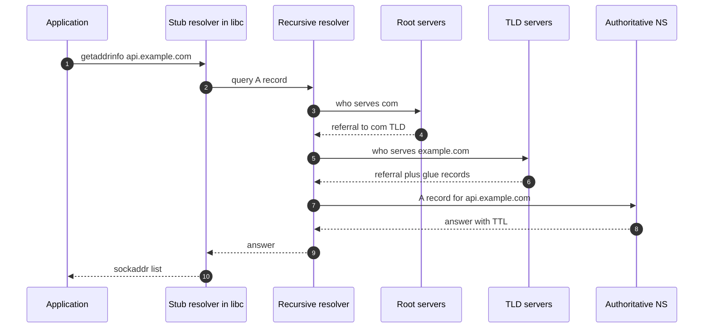
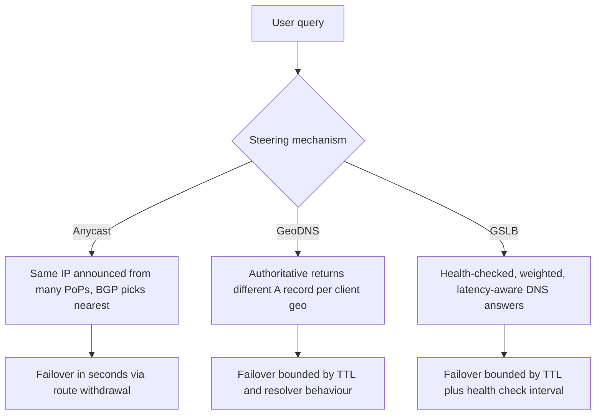
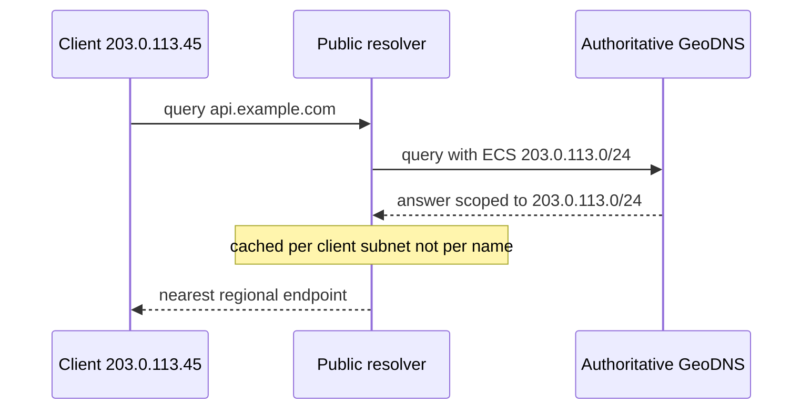
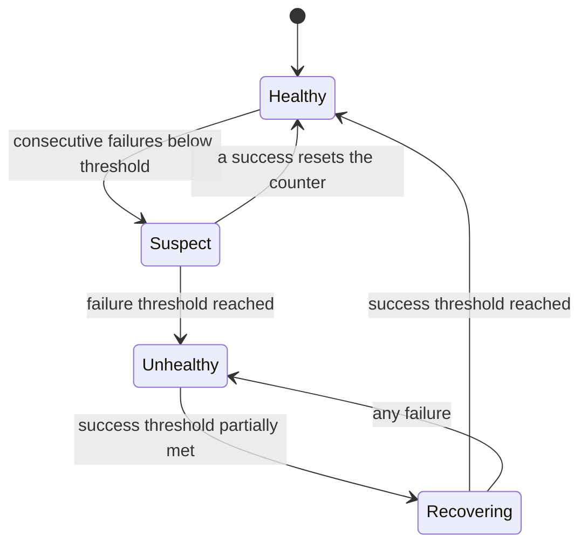
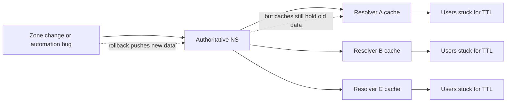
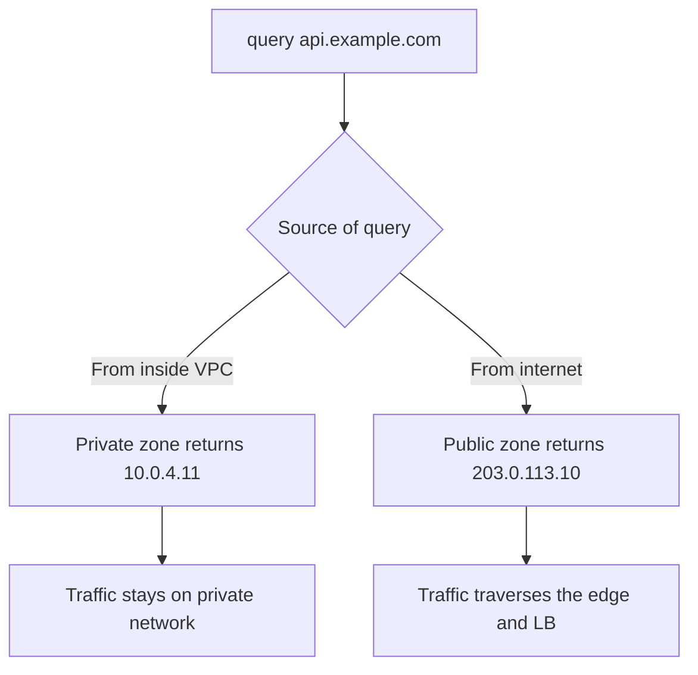

# F02 — DNS & Global Traffic Management

**DNS is a globally distributed, aggressively cached control plane that you do not control the cache of — which makes it excellent for steering traffic slowly and deliberately, and terrible as a failover mechanism.**

## Resolution Path and Where Time Goes



| Stage | Cold cost | Warm cost | Cached where |
| --- | --- | --- | --- |
| Stub to recursive | 0.5–5 ms | 0.5–5 ms | OS cache, `nscd`/`systemd-resolved` |
| Root referral | 10–50 ms | 0, root TTL is 518400 s | Recursive resolver |
| TLD referral | 20–80 ms | 0, TLD NS TTL typically 172800 s | Recursive resolver |
| Authoritative answer | 10–100 ms | 0 for the record's TTL | Recursive resolver |
| **Total cold** | **80–250 ms** | **~1 ms** | — |

A cold DNS lookup is frequently the single most expensive component of a first request — larger than the TCP and TLS handshakes combined. Every additional CNAME hop is another full resolution chain, and CNAME chains of 4–6 hops are common with third-party CDN and WAF vendors stacked together.

!!! note "The stub resolver is not a cache by default"
    On many Linux distributions there is no OS-level DNS cache at all unless `systemd-resolved`, `nscd`, or `dnsmasq` is running. Every `getaddrinfo()` goes to the network. In a container without a local cache and with `ndots:5` in `/etc/resolv.conf`, a single lookup can generate 5–10 upstream queries.

### Authoritative vs recursive

| Property | Authoritative | Recursive (resolver) |
| --- | --- | --- |
| Owns the data | Yes, it is the source of truth for the zone | No, it caches |
| Who runs it | You, or your DNS vendor | ISP, cloud (169.254.169.253 in AWS), 8.8.8.8, 1.1.1.1 |
| Respects your TTL | Sets it | **Should**, frequently does not |
| Failure impact | Zone becomes unresolvable once caches expire | Users of that resolver lose resolution for everything |
| Anycast | Almost always | Almost always |
| Your control | Total | **Zero** |

That last row is the entire operational thesis of this page.

---

## TTL Trade-offs

$$
\mathbb{E}[\text{staleness after a change}] \approx \frac{TTL}{2} \quad \text{(uniform arrival)}, \qquad \max = TTL_{\text{observed}} + \text{resolver misbehaviour}
$$

$$
\text{Auth QPS} \approx \frac{\text{distinct resolvers} \times \text{records}}{TTL}
$$

| TTL | Query load on authoritative | Change propagation | Typical use |
| --- | --- | --- | --- |
| 30 s | Very high | Fast in theory, unreliable in practice | Active-passive failover records, canary steering |
| 60 s | High | ~1 min nominal | GSLB endpoints |
| 300 s | Moderate | ~5 min nominal | Common default for service records |
| 3600 s | Low | 1 hour | Stable service names, MX |
| 86400 s | Minimal | 1 day | Apex NS, TXT, SPF |
| 172800 s | Minimal | 2 days | Delegation NS at TLD |

The cost of a low TTL is real: at 30 s TTL with 100,000 distinct resolvers touching 10 records, that is roughly $100{,}000 \times 10 / 30 \approx 33{,}000$ QPS on your authoritative infrastructure, and most managed DNS providers bill per million queries.

!!! danger "DNS failover is not a failover mechanism"
    Set a 30 s TTL, fail over, and measure: a meaningful fraction of traffic keeps hitting the dead endpoint for 5 to 60 minutes. Causes stack: resolvers enforce minimum TTLs (many clamp anything under 30–60 s upward), some enforce maximum caching independent of TTL, corporate resolvers cache for hours, and the JVM historically cached forever. Use DNS to move traffic *deliberately* over minutes; use Anycast withdrawal, load balancer health checks, or client-side retry for anything that must happen in seconds.

### The client-side caching layers that ignore you

| Layer | Behaviour | Fix |
| --- | --- | --- |
| Java `InetAddress` | `networkaddress.cache.ttl` defaults to **-1 (cache forever)** when a security manager is installed; `30` otherwise. `negative.ttl` defaults to `10` | Set `networkaddress.cache.ttl=30` explicitly in `java.security` or `-Dsun.net.inetaddr.ttl=30` |
| Browsers | Chrome and Firefox keep their own DNS caches, ~60 s, plus socket pools pinned to an IP for longer | None available to you |
| Go | No cache in the standard resolver; respects the resolver each call | Nothing needed, but each call is a syscall |
| Node.js | No cache by default; `dns.lookup` uses libuv threadpool of 4 | Use a caching resolver or `cacheable-lookup` |
| Python `requests` / urllib3 | No DNS cache, but connection pools pin to resolved IP | Bound pool lifetime |
| `systemd-resolved` | Caches per TTL, clamps to a max of 2 hours | `Cache=no-negative` and flush hooks |
| Envoy / NGINX with `resolver` | Honours TTL if configured with a `resolver` directive; **otherwise resolves once at config load and never again** | Always configure `resolver` with `valid=` |

!!! gotcha "NGINX resolves upstream hostnames once, at startup, forever"
    A `proxy_pass http://backend.internal;` with a hostname in an `upstream` block is resolved at configuration load. If the backend's IP changes, NGINX keeps sending to the old IP until reloaded. The fix is to use a `resolver` directive plus a variable in `proxy_pass` (which forces runtime resolution), or to use `resolver ... valid=10s;` in the relevant scope.

---

## Global Traffic Steering: Anycast vs GeoDNS vs GSLB



| Dimension | Anycast | GeoDNS | GSLB / traffic manager |
| --- | --- | --- | --- |
| Where the decision is made | Network, per packet | Authoritative DNS, per query | Authoritative DNS, per query, with health state |
| Granularity | BGP path, coarse | Client resolver IP or ECS subnet | Same, plus weights, health, latency tables |
| Failover time | Seconds — withdraw the route | Minutes to hours — TTL bound | Health check interval + TTL |
| Failover granularity | Whole PoP | Whole region | Per-endpoint |
| Session stability | Can flap on BGP reconvergence | Stable within TTL | Stable within TTL |
| Works for TCP? | Yes, but a route change mid-connection resets it | Yes | Yes |
| Cost | Requires own ASN, IP space, peering | Cheap, vendor feature | Vendor feature, per-query billing |
| Visibility into client location | None; you get whatever BGP decides | Resolver IP, or true client subnet with ECS | Same |
| Best for | Stateless edge, UDP, DDoS absorption, DNS itself | Content localization, coarse regional routing | Canaries, weighted migration, active-active with health |

!!! tip "Combine them, do not choose"
    The production pattern at large scale is: Anycast for the edge IP so packets reach the nearest PoP with sub-second reconvergence, GSLB DNS to *choose which Anycast prefix or which regional origin* an entire market resolves to over minutes, and client-side retry plus edge-to-origin health checking for the fast path. DNS handles slow, deliberate shifts; Anycast handles fast, coarse ones; the client handles the individual failed request.

### Anycast reality check

Anycast failover works because withdrawing a BGP announcement reconverges in seconds. But:

- **BGP does not know about latency.** It picks on AS-path length and local preference. A user in Lagos can be routed to London rather than a closer PoP because of peering economics. Real deployments measure and adjust with communities, prepending, and selective announcement — this is a continuous operational job, not a set-and-forget.
- **Route flaps break TCP.** If the path shifts mid-connection, packets land on a different PoP that has no state for the 4-tuple and sends `RST`. For short HTTP requests this is rare enough to tolerate; for long-lived connections it is a real error budget consumer. Mitigations: prefer stable announcements, use QUIC (connection IDs survive path changes), and make clients retry.
- **Draining a PoP is a two-step dance.** Withdraw the announcement, then wait for in-flight connections to drain before stopping the servers. Stopping first gives you a black hole for the reconvergence window.

---

## EDNS Client Subnet

Without ECS, a GeoDNS answer is based on the **resolver's** IP. A user in Mumbai using `8.8.8.8` may appear to be anywhere. ECS (RFC 7871) lets the recursive resolver forward a truncated client prefix (typically /24 for IPv4, /56 for IPv6) so the authoritative can make a geographically correct decision.



| Consequence | Detail |
| --- | --- |
| Cache fragmentation | The resolver caches one entry **per client subnet**, not one per name. Cache hit ratio collapses; authoritative QPS rises by orders of magnitude |
| Privacy | You leak a /24 of the client to every authoritative in the chain. Cloudflare's 1.1.1.1 deliberately does not send ECS |
| Scope field matters | The authoritative echoes a `SCOPE PREFIX-LENGTH`. Return a scope of `0` for answers that are geo-independent so resolvers cache them globally |
| Partial adoption | Google Public DNS and OpenDNS send ECS; 1.1.1.1 and many enterprise resolvers do not. Your geo-steering is therefore correct for some users and resolver-based for others |
| Interaction with DoH | DNS over HTTPS to a distant provider without ECS is a common cause of "user in Sydney routed to Frankfurt" |

!!! gotcha "Returning a narrow ECS scope on a geo-independent record multiplies your query load"
    If your authoritative echoes `SCOPE=24` for a record whose answer is identical everywhere, every /24 on the internet gets its own cache entry at every resolver. Query volume can rise 100x and your DNS bill with it. Return `SCOPE=0` for anything that is not actually geo-varying.

---

## Health-Checked Steering and Weighted Routing

### The health-check control loop



Total time to remove a bad endpoint from DNS:

$$
T_{\text{removal}} = T_{\text{detect}} + T_{\text{propagate}} + TTL_{\text{observed}}
$$

With a typical managed provider: 30 s check interval × 3 failures = 90 s detect, 10–30 s to push the zone globally, plus a 60 s TTL that many resolvers stretch to 300 s. Realistic worst case is **8–10 minutes**, and a long tail of stragglers beyond that.

!!! warning "Health checks from the DNS provider test the wrong thing"
    A managed DNS health check probes your endpoint from the provider's checker locations, over the public internet, usually on a simple TCP or HTTP path. It does not know whether *your users' paths* are healthy, whether the dependency behind the endpoint is degraded, or whether the endpoint is healthy-but-overloaded. Prefer publishing your own health signal — an endpoint your service controls that aggregates real SLIs — so the check reflects user-visible health rather than "the socket accepts."

### Weighted routing for canaries and migrations

| Weight pattern | Use | Caveat |
| --- | --- | --- |
| 99/1 | Initial canary of a new region or stack | With few resolvers, 1% of *resolvers* is not 1% of *traffic*; a single large corporate resolver can be 5% of users |
| 50/50 | Blue-green cutover | Sticky per resolver, so the split is coarse and lumpy |
| 100/0 with fast rollback | Big-bang cutover | Rollback is TTL-bound; you cannot actually roll back fast |
| Progressive 1 → 5 → 25 → 50 → 100 | Region migration | Each step must exceed the TTL plus a soak period, so a full migration is hours |

!!! gotcha "DNS weights distribute over resolvers, not over users"
    A 1% weight sends 1% of *queries* to the canary, but each query serves an entire resolver's downstream population for the TTL. If one ISP resolver serving 3% of your users happens to hit the canary, your "1% canary" is 3% of users — or 0%. Weighted DNS is a coarse, high-variance sampling mechanism. For true percentage-based canaries, steer at the load balancer or edge where you see individual requests.

---

## DNS as a Control Plane

Once you use DNS for service discovery, failover, and steering, it becomes a Tier-0 dependency with the largest blast radius in your system.



Failure modes and their blast radius:

| Failure | Blast radius | Recovery time | Mitigation |
| --- | --- | --- | --- |
| Bad zone push (wrong A record) | Everything under the name | TTL + push time; **rollback is not instant** | Zone diffs in CI, staged push, low-blast-radius change windows |
| Delegation NS records wrong | Entire zone, once TLD TTL expires | Up to 48 h (TLD NS TTL) | Never touch delegation without a change freeze and verification |
| DNSSEC signing failure or expired signature | Zone becomes **SERVFAIL** for validating resolvers — worse than unreachable | Until fixed; validating resolvers hard-fail | Monitor RRSIG expiry with days of headroom, alert at 7 days |
| Registrar/registry lock issue or domain expiry | Total | Hours to days | Registry lock, multi-year renewal, expiry alerts to a team not a person |
| Single DNS vendor outage | Everything using that vendor | Vendor-dependent | Two vendors with independent NS sets, both listed in delegation |
| Recursive resolver outage (ISP, or cloud VPC resolver) | Everyone using it | Not yours to fix | Client-side resolver fallback, local cache with stale serving |
| Negative-cache poisoning of a new record | Users who queried before the record existed | Up to SOA MINIMUM | Create the record before publishing anything that references it |

!!! danger "DNSSEC turns a soft failure into a hard one"
    Without DNSSEC, a broken zone means clients get the wrong answer or `NXDOMAIN`. With DNSSEC, an expired RRSIG or a KSK/ZSK rollover mistake makes every validating resolver return `SERVFAIL`, and there is no way for a client to opt out. Multiple large-scale outages have come from exactly this. If you sign, you must monitor signature expiry as a first-class SLI, automate rollovers, and rehearse the emergency unsign procedure.

### Multi-vendor DNS

Listing NS records from two independent providers gives you resilience against a single-vendor outage, but it is not free:

- Both zones must be kept in sync, ideally from a single source of truth via zone transfer (AXFR/IXFR) or a provider-agnostic API layer.
- Resolvers pick nameservers by measured RTT and will use *both*; if the two vendors disagree, users get inconsistent answers, and you have a nondeterministic bug.
- Provider-specific features (GeoDNS policies, ALIAS/CNAME flattening, health checks) rarely map cleanly between vendors, so multi-vendor pushes you toward the DNS feature lowest common denominator.
- DNSSEC across two providers requires either a shared KSK with multi-signer (RFC 8901) or one provider signing and the other serving pre-signed data.

---

## CNAME, ALIAS, and the Zone Apex

RFC 1034 forbids a CNAME coexisting with any other record at the same name. The zone apex (`example.com`) must have `SOA` and `NS` records, therefore it **cannot** be a CNAME. Yet you want `example.com` to point at a CDN hostname whose IPs change.

| Solution | How it works | Trade-off |
| --- | --- | --- |
| ALIAS / ANAME / CNAME flattening | Authoritative resolves the target itself and returns the A/AAAA inline | Provider-specific; the resolution happens from the *authoritative's* location, so geo-steering by the target is based on the authoritative's position, not the user's, unless ECS is chained |
| `HTTPS` / `SVCB` records (RFC 9460) | Standardized apex aliasing plus ALPN and ECH hints | Client support still incomplete; use alongside A/AAAA |
| Redirect apex to `www` | Apex A record points at a tiny redirect service | Extra RTT for apex visitors, and the redirector is a new SPOF |
| Static A record at apex | Simple | You lose the CDN's ability to change IPs; do not do this with a third-party CDN |

!!! gotcha "CNAME flattening breaks the CDN's own geo-steering"
    If `example.com` is flattened to `example.map.cdn.net`, your authoritative resolves that name *from wherever your authoritative servers are*. The CDN's GeoDNS sees your DNS provider's location, not the user's, and returns a PoP near your provider. Users then get a distant PoP. The flattening provider must chain ECS through to the target, and many do not. Verify empirically from several regions before trusting apex flattening with a third-party CDN.

### Negative caching

`NXDOMAIN` and `NODATA` responses are cached according to `min(SOA MINIMUM, SOA TTL)` per RFC 2308. A typical SOA minimum of 3600 means a name that did not exist stays "not existing" for an hour after you create it.

```text
example.com. 3600 IN SOA ns1.example.com. hostmaster.example.com. (
                2026083101 ; serial
                7200       ; refresh
                3600       ; retry
                1209600    ; expire
                300 )      ; minimum -> negative cache TTL
```

Keep `MINIMUM` low (60–300 s) if you create records dynamically. Keep it higher if you are absorbing junk queries for nonexistent subdomains, because negative caching is your defence against that load.

!!! gotcha "Provisioning a new service before its DNS record exists poisons resolvers with NXDOMAIN"
    **Symptom:** a newly deployed service is unreachable for exactly one hour after its DNS record is created, but only for some clients. **Mechanism:** something queried the name before the record existed; the `NXDOMAIN` was negatively cached for the SOA `MINIMUM`. **Mitigation:** create DNS records *first*, wait for the negative TTL to elapse before any client can query, lower `MINIMUM` to 60–300 s, and never let deployment automation probe a name before publishing it.

---

## Split-Horizon DNS

Returning different answers based on the query source — internal RFC 1918 addresses for VPC clients, public addresses for internet clients.



| Benefit | Cost |
| --- | --- |
| Internal traffic avoids NAT gateway and egress charges | Two zones to keep in sync; drift is a classic incident cause |
| Internal traffic bypasses the public edge, reducing latency | Internal clients also bypass your WAF, rate limiting, and edge auth |
| Same hostname works everywhere, so config is portable | Debugging is confusing: `dig` from your laptop and from a pod give different answers |
| Enables private-link style architectures | Certificate SANs must cover both paths; hostname-based mTLS gets subtle |
| — | Split-brain: a record updated in the public zone but not the private one sends internal traffic to a dead IP indefinitely |

!!! warning "Split-horizon plus VPN equals nondeterministic resolution"
    A laptop on a corporate VPN with split-tunnel DNS may resolve some names via the internal resolver and some via the public one, depending on search-domain matching rules that differ per OS and per VPN client. The classic symptom is "it works on my machine but not on my colleague's, and it works after I toggle the VPN." Standardize on fully-qualified names and explicit resolver policy rather than relying on search domains.

---

## Interaction with Service Discovery

DNS is the lowest-common-denominator service discovery mechanism, which makes it universal and weak.

| Mechanism | Freshness | Health awareness | Load info | Client requirements |
| --- | --- | --- | --- | --- |
| DNS A/AAAA round robin | TTL-bound | None | None | Nothing |
| DNS SRV | TTL-bound | None | Priority and weight fields only | SRV-aware client |
| Kubernetes `ClusterIP` | Instant via kube-proxy/iptables/IPVS | Endpoint controller removes unready pods | None | In-cluster only |
| Kubernetes headless + DNS | TTL-bound, CoreDNS default 30 s | Endpoints reflect readiness | None | DNS-aware client |
| xDS (Envoy/Istio) | Push-based, sub-second | Full active and passive health | Yes — load reports | Sidecar or xDS-capable client |
| Consul / etcd watch | Push-based, sub-second | Yes | Limited | SDK integration |

!!! gotcha "Kubernetes `ndots:5` makes every external lookup cost five queries"
    **Symptom:** high CoreDNS QPS, elevated p99 on outbound calls to external APIs, `SERVFAIL` bursts under load. **Mechanism:** the default pod `/etc/resolv.conf` has `ndots:5` and three search domains. A name with fewer than 5 dots — which is nearly every real hostname — is first tried against each search domain, generating 4+ NXDOMAIN round trips before the correct absolute query. With IPv6 enabled, A and AAAA are queried in parallel, doubling it. **Mitigation:** use fully-qualified names with a trailing dot (`api.example.com.`), set `dnsConfig.options.ndots: 1` for pods that mostly call external services, and deploy NodeLocal DNSCache. **Detection:** CoreDNS request count far exceeding your application's actual resolution rate, with a high NXDOMAIN ratio.

---

## Gotchas & Corner Cases

!!! gotcha "Resolvers ignore your 30 s TTL, so DNS failover is not failover"
    **Symptom:** you cut over a record during an incident and 10–30% of traffic still hits the dead endpoint 15 minutes later. **Mechanism:** many recursive resolvers clamp TTLs to a floor (commonly 30–60 s but sometimes 300 s), some enterprise resolvers cache for hours to reduce load, browsers and application runtimes add their own caches, and connection pools pin to an already-resolved IP for the life of the connection regardless of DNS. **Mitigation:** treat DNS as a minutes-scale steering tool. Achieve seconds-scale failover with Anycast withdrawal, LB health checks, or client-side retry across multiple returned A records. Always return **multiple** A records so a well-behaved client can fail over itself.

!!! gotcha "The JVM caches DNS forever under a security manager"
    **Symptom:** a Java service keeps connecting to a decommissioned IP for days after a migration, while every other service moved instantly. **Mechanism:** `java.security`'s `networkaddress.cache.ttl` is `-1` (cache forever) when a security manager is installed, and even the default `30` is often overridden by frameworks. Negative caching (`networkaddress.cache.negative.ttl`) defaults to `10` s, which is its own hazard. **Mitigation:** explicitly set `networkaddress.cache.ttl=30` in `java.security` or `-Dsun.net.inetaddr.ttl=30`, and verify at runtime rather than trusting the default. **Detection:** `ss -tnp` on the app host showing established connections to an IP no longer in DNS.

!!! gotcha "Connection pools defeat DNS changes even when DNS is correct"
    **Symptom:** you update DNS, the resolver picks it up correctly, and traffic still goes to the old endpoint. **Mechanism:** an existing keep-alive connection is bound to an IP address; nothing re-resolves until the connection closes. A pool with a long idle timeout and steady traffic never closes anything. **Mitigation:** set a maximum connection *lifetime* (not just idle timeout) — 5–15 minutes is typical — so pools re-resolve periodically. Envoy's `max_connection_duration` and Go's `Transport` with a custom `DialContext` plus lifetime tracking are the standard implementations.

!!! gotcha "DNS response over 512 bytes falls back to TCP, and someone is blocking DNS over TCP"
    **Symptom:** a zone with many A records or a large TXT/DKIM record resolves for most users and fails for a specific corporate network. **Mechanism:** classic DNS caps UDP responses at 512 bytes; larger answers set the `TC` (truncated) bit, forcing the resolver to retry over TCP port 53. EDNS0 raises the UDP limit (commonly 1232 bytes after the DNS Flag Day 2020 recommendation), but firewalls that allow UDP/53 and block TCP/53 break the fallback. **Mitigation:** allow TCP/53 through every firewall, keep answer sets small, set EDNS buffer size to 1232 to avoid IP fragmentation, and split large TXT records. **Detection:** `dig +notcp` succeeding while `dig +tcp` times out, or vice versa.

!!! gotcha "Health-checking your endpoint from the DNS provider hides dependency failures"
    **Symptom:** DNS keeps steering traffic to a region whose database is down, because the HTTP health check returns 200. **Mechanism:** shallow health checks assert only that the process accepts connections. **Mitigation:** expose a health endpoint that aggregates real dependency status with hysteresis, and — crucially — make it *fail-open* under partial degradation so you do not remove every region simultaneously when a shared dependency has a blip. A health check that can take down all regions at once is a bigger risk than the failure it detects.

!!! gotcha "Deep health checks cause correlated global failover and a full outage"
    **Symptom:** a shared dependency degrades slightly; every region's deep health check fails; DNS removes every endpoint; the zone returns no answers at all and you go from degraded to hard down. **Mechanism:** correlated failure of independent health checks that all depend on the same thing. **Mitigation:** enforce a minimum healthy-endpoint floor — most GSLB products can be configured to serve all endpoints when *all* are unhealthy ("fail open" / "if all fail, return everything"). Verify this is enabled; the default is often to return nothing.

!!! gotcha "A single resolver can be a double-digit percentage of your users"
    **Symptom:** weighted DNS canaries produce wildly non-linear traffic shifts. **Mechanism:** Google Public DNS, Cloudflare 1.1.1.1, and large ISP resolvers each aggregate huge user populations behind a handful of source IPs. Steering decisions are per-resolver, so granularity is fundamentally coarse. **Mitigation:** never use DNS weights as the sole canary control. Use them for coarse regional shifts and do percentage canarying at the L7 edge where you see individual requests.

!!! gotcha "Removing a nameserver from the delegation does not remove it from service"
    **Symptom:** you decommission a DNS vendor, update the delegation at the registrar, and the old vendor still receives queries days later. **Mechanism:** the delegation NS records at the TLD have a very long TTL (commonly 172800 s / 48 h), and resolvers additionally cache the *in-zone* NS RRset. Some resolvers prefer in-zone NS data over the parent delegation. **Mitigation:** update in-zone NS records first, wait for their TTL, then update the delegation, then wait 48+ hours with the old vendor still serving correct data before terminating the contract.

!!! gotcha "DNSSEC signature expiry is a timed outage you scheduled months ago"
    **Symptom:** a zone that has worked for a year suddenly returns `SERVFAIL` for a subset of users — specifically those behind validating resolvers like 1.1.1.1 and 8.8.8.8. **Mechanism:** RRSIG records have an absolute expiry; if the signer stops running or a key rollover stalls, signatures expire and validating resolvers hard-fail. **Mitigation:** monitor minimum RRSIG remaining validity across the whole zone as an SLI, alert at 7 days remaining, page at 3, and document the emergency procedure to remove the DS record at the parent (which itself takes a TLD-TTL to propagate — so this is not a fast fix either).

!!! gotcha "`search` domain suffixing can silently hijack an external hostname"
    **Symptom:** an internal service starts receiving traffic intended for a third-party API. **Mechanism:** with `search corp.example.com` and `ndots:5`, a lookup for `api.vendor.com` first tries `api.vendor.com.corp.example.com`. If someone registers that internal name — accidentally or maliciously — every client silently resolves to it. This is a real internal-namespace attack surface. **Mitigation:** use trailing-dot FQDNs for external dependencies, set `ndots:1`, and monitor for internal names that shadow external ones.

!!! gotcha "Round-robin A records are not load balancing"
    **Symptom:** one backend runs at 80% CPU while its peers idle, despite three equal A records. **Mechanism:** the authoritative rotates the answer order, but the resolver may re-sort it, the client's `getaddrinfo` applies RFC 6724 address-sorting rules, and most clients simply use the first address and never try the others. The distribution is neither uniform nor stable. **Mitigation:** use round-robin DNS only as a coarse spreading and redundancy mechanism, and put a real load balancer or client-side LB behind it. Do verify your client actually tries the second address when the first fails — many do not.

!!! gotcha "DoH and DoT move resolution off your network and break your assumptions"
    **Symptom:** internal split-horizon names stop resolving on employee laptops or on mobile clients after an OS update. **Mechanism:** operating systems and browsers increasingly default to DNS over HTTPS to a public resolver, bypassing the configured local resolver entirely — which means no split-horizon answers, no internal namespace, and no ECS. **Mitigation:** publish the canary domain that signals "do not use DoH here" where supported, deploy enterprise policy to pin the resolver, and stop relying on the network path to determine DNS behaviour.

---

## SRE Lens

### SLIs and SLOs

| SLI | Measurement | Target shape |
| --- | --- | --- |
| Authoritative availability | Successful responses / queries, measured from external probes in many networks | 100% is the only acceptable target; this is a Tier-0 dependency |
| Authoritative latency | p99 response time at the authoritative | < 20 ms; Anycast should make this geographic |
| Resolution success rate (client-side) | `getaddrinfo` success / attempts, instrumented in the app | > 99.99% |
| Resolution latency (client-side) | p50 / p99 of lookups | p99 < 50 ms with a local cache |
| Propagation time | Time from API write to observed answer at N global vantage points | p99 < 60 s to authoritative, and separately track resolver-observed convergence |
| Minimum RRSIG validity | Days remaining across all signed RRsets | > 7 days, always |
| Steering correctness | Percentage of users resolved to their intended region | Measured with RUM, not with `dig` from your laptop |

### Detection

```bash
# What is the authoritative actually serving, bypassing all caches
dig +norecurse @ns1.example.com api.example.com A

# What a specific public resolver has cached, and its remaining TTL
dig @8.8.8.8 api.example.com A
dig @1.1.1.1 api.example.com A

# Does DNSSEC validate end to end
dig +dnssec +cd api.example.com A
delv api.example.com A

# Simulate a client subnet to test geo steering
dig @8.8.8.8 +subnet=203.0.113.0/24 api.example.com A

# Trace the full delegation chain including any CNAME hops
dig +trace api.example.com

# Check delegation consistency between parent and child
dig NS example.com @a.gtld-servers.net
dig NS example.com @ns1.example.com
```

Instrument DNS from the *client side*. Authoritative-side metrics tell you your servers are fine; they cannot tell you that a large ISP resolver is serving a stale answer. RUM beacons that report resolved IP and resolution time are the only way to see the real picture.

### Rollout and migration risk

1. **Lower the TTL first, and wait.** Before any planned cutover, reduce the TTL to 60 s and wait at least the *old* TTL plus a safety margin (typically 24 h if the old TTL was 3600). Only then make the change. Raise it back afterwards.
2. **Never change delegation NS records and zone content in the same window.** If something breaks, you will not know which change caused it, and the delegation change has a 48 h rollback.
3. **Stage by geography.** Move one small market first, validate with RUM, then expand.
4. **Keep the old endpoint alive far longer than the TTL suggests.** A reasonable rule is 10x the TTL, minimum 24 hours, and monitor traffic to the old endpoint until it is genuinely zero — it will surprise you.
5. **Have a rollback that does not depend on DNS.** If DNS is the thing that broke, your rollback path must be something else: the old endpoint still serving, or an edge-level override.

### Capacity signals

| Signal | Meaning | Action |
| --- | --- | --- |
| Authoritative QPS climbing without traffic growth | Someone lowered a TTL, or ECS scope narrowed | Audit recent TTL and scope changes |
| NXDOMAIN ratio > 20% | `ndots` suffixing, or junk/attack traffic | Fix `ndots`, add response rate limiting |
| Truncation (`TC`) rate nonzero | Answers exceeding UDP buffer | Shrink answer sets, check EDNS buffer size |
| CoreDNS CPU or latency rising in-cluster | `ndots` amplification or missing NodeLocal cache | Deploy NodeLocal DNSCache |
| Query cost line item growing | Low TTLs, ECS fragmentation, or DDoS absorption | Right-size TTLs, `SCOPE=0` where valid |

### Runbook notes

- "Users in region X can't reach us" → first `dig` from a vantage point *in* region X, not from your workstation. Then check whether their resolver sends ECS.
- Any `SERVFAIL` report → suspect DNSSEC before anything else; test with `+cd` (checking disabled). If it works with `+cd` and fails without, it is DNSSEC.
- Before declaring a DNS change "done", check remaining TTL at several public resolvers, not just that the authoritative is correct.
- Keep an out-of-band, non-DNS way to reach critical infrastructure (IP-addressed bastion, a second domain at a different registrar). If your primary domain is the incident, DNS-based tooling is also down.

### Cost implications

- Managed DNS is billed per million queries plus per health check. Halving a TTL roughly doubles query cost.
- ECS with narrow scopes is the single largest driver of unexpected DNS bills.
- Multi-vendor DNS roughly doubles the base cost but is cheap insurance for a Tier-0 dependency; price it against one hour of full outage.
- NodeLocal DNSCache in Kubernetes typically cuts CoreDNS query volume by 60–90% and removes conntrack pressure from UDP DNS, which often pays for itself in avoided incidents alone.

---

## Interview Angle

!!! interview "Probe: how do you fail over between regions?"
    **What they want:** to hear you reject DNS-only failover.
    **Strong answer:** "DNS is my slow lane. I'd use it for planned, deliberate shifts over minutes with pre-lowered TTLs. For unplanned failover I need something faster: Anycast route withdrawal at the edge gives seconds, the load balancer health-checking origins gives sub-second per-request failover, and clients retrying across multiple returned A records handles the individual request. I'd also quantify what fraction of traffic ignores TTL — in practice a long tail keeps hitting the old endpoint for tens of minutes, so the old endpoint has to stay alive and, ideally, return a redirect or proxy through."
    **Weak answer:** "Set TTL to 30 seconds and update the record." The follow-up — "what fraction of your users actually move in 30 seconds?" — has no good answer if you started here.

!!! interview "Probe: Anycast or GeoDNS?"
    **Follow-ups:** How does each fail? What happens to an in-flight TCP connection under Anycast? How do you drain a PoP?
    **Strong answer:** compares the decision layer (network vs DNS), failover speed (seconds vs TTL-bound), and granularity (BGP path vs per-client-subnet). Notes that BGP optimizes for AS-path, not latency, so Anycast needs continuous traffic engineering. Notes that route flaps reset TCP but not QUIC. Explains draining as withdraw-then-wait. Concludes with "in practice, both: Anycast for the edge IP, GSLB DNS to decide which origin region an edge talks to."
    **Weak answer:** picking one and not knowing the failure modes of the other.

!!! interview "Probe: what's the blast radius of your DNS control plane?"
    **Strong answer:** enumerates zone push errors, delegation errors with 48-hour TTLs, DNSSEC signature expiry causing hard SERVFAIL, registrar/registry lock, and single-vendor dependency. Emphasizes that **rollback is not instant** because you cannot invalidate resolver caches, so DNS changes need the same review rigour as a production deploy — diffs, staged rollout, and a non-DNS rollback path.
    **Weak answer:** treating DNS as configuration rather than as a production system.

!!! interview "Probe: your Kubernetes cluster's DNS is overloaded. What's happening?"
    **Strong answer:** `ndots:5` plus search-domain expansion generating 4–10 queries per external lookup, doubled by parallel A/AAAA. Fixes: FQDNs with trailing dots, `ndots:1` via `dnsConfig`, NodeLocal DNSCache to eliminate the conntrack path and cache locally, and CoreDNS autoscaling. Bonus points for mentioning the historic UDP conntrack race (`--random-fully`) and DNS timeouts appearing as 5 s latency cliffs from the resolver's retry timer.
    **Weak answer:** "scale up CoreDNS."

!!! interview "Probe: a customer says your site is slow only from their office."
    **Strong answer:** structures the diagnosis: is it resolution or transport? Check which endpoint they resolve to and whether their resolver sends ECS — a DoH resolver or a corporate resolver in a different country will steer them to a distant PoP. Then check TCP/53 reachability for large answers, and split-horizon or search-domain interference from their VPN. Explains how to reproduce with `dig +subnet` rather than guessing.
    **Weak answer:** immediately blaming the customer's network without a hypothesis or a test.

---

## Key Takeaways

- DNS is a distributed cache you do not control. Design for the assumption that some fraction of clients will use a stale answer for far longer than your TTL.
- Use DNS for deliberate, minutes-scale steering. Use Anycast withdrawal, load balancer health checks, and client-side retry for seconds-scale failover.
- TTL is a cost-vs-agility dial: auth QPS scales as $1/TTL$, and propagation is bounded below by resolver behaviour, not by your setting.
- ECS makes geo-steering accurate but fragments resolver caches; return `SCOPE=0` for anything geo-independent or your query volume and bill explode.
- Weighted DNS distributes over resolvers, not users. It is a coarse, high-variance canary tool; do real percentage canaries at L7.
- DNSSEC converts soft failures into hard `SERVFAIL`s. Signature expiry monitoring is mandatory, and the emergency unsign path is itself TTL-bound.
- Negative caching, `ndots` suffixing, connection-pool IP pinning, and runtime DNS caches (especially the JVM's) are the four most common reasons "the DNS change didn't take effect."
- Deep health checks that all depend on the same backend can remove every endpoint at once; always configure a healthy-endpoint floor or fail-open behaviour.

---

## Further Reading

- RFC 1034 / RFC 1035 — *Domain Names: Concepts and Facilities* and *Implementation and Specification*.
- RFC 2308 — *Negative Caching of DNS Queries (DNS NCACHE)*.
- RFC 6724 — *Default Address Selection for Internet Protocol version 6 (IPv6)*, which governs client address ordering.
- RFC 7871 — *Client Subnet in DNS Queries* (EDNS Client Subnet).
- RFC 7766 — *DNS Transport over TCP: Implementation Requirements*.
- RFC 8901 — *Multi-Signer DNSSEC Models*.
- RFC 9460 — *Service Binding and Parameter Specification via the DNS (SVCB and HTTPS RRs)*.
- Eisenbud et al. — *Maglev: A Fast and Reliable Software Network Load Balancer*, NSDI 2016 (for the Anycast plus ECMP edge architecture).
- Calder et al. — *Mapping the Expansion of Google's Serving Infrastructure*, IMC 2013.
- Chen et al. — *End-User Mapping: Next Generation Request Routing for Content Delivery*, ACM SIGCOMM 2015 (Akamai's move to ECS-based mapping).
- Cloudflare Blog — *A deep dive into DNS*, *Anycast is not load balancing*, and the DNS Flag Day materials.
- AWS Builders' Library — *Implementing health checks*, on shallow vs deep checks and fail-open behaviour.
- Google SRE Book, Chapter 19 — *Load Balancing at the Frontend*, covering DNS and Anycast trade-offs.
- ICANN / DNS-OARC — DNS Flag Day 2020 recommendations on EDNS buffer size (1232 bytes).
- Facebook Engineering — post-incident writeup of the 2021 BGP/DNS outage, on control-plane blast radius.

---

Related pages: [F01 — Networking Foundations](f01-networking-foundations.md), [F03 — Load Balancing](f03-load-balancing.md), [F05 — CDN & Edge](f05-cdn-edge.md).
