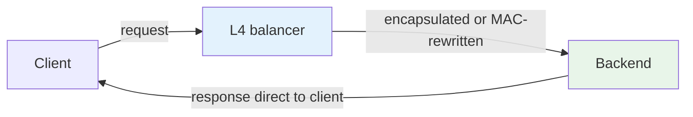
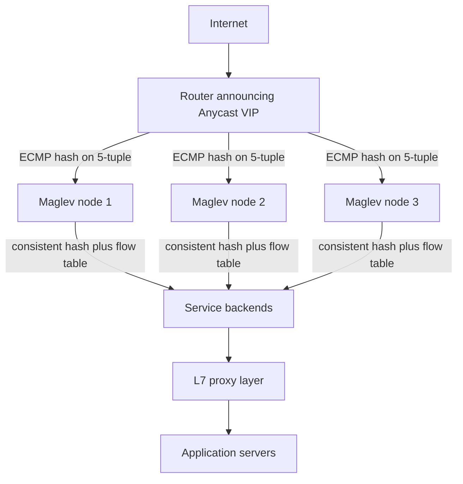
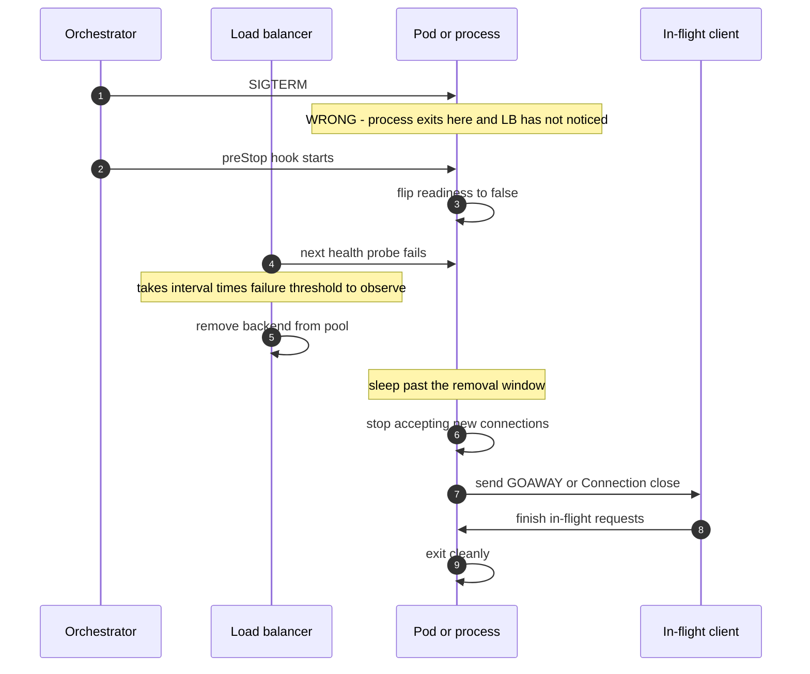
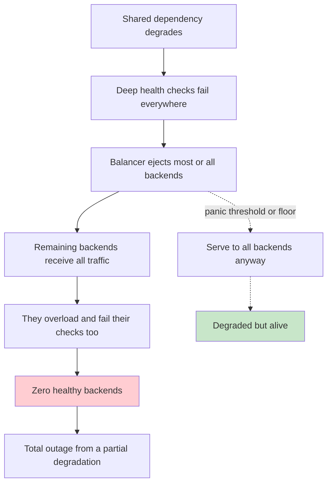
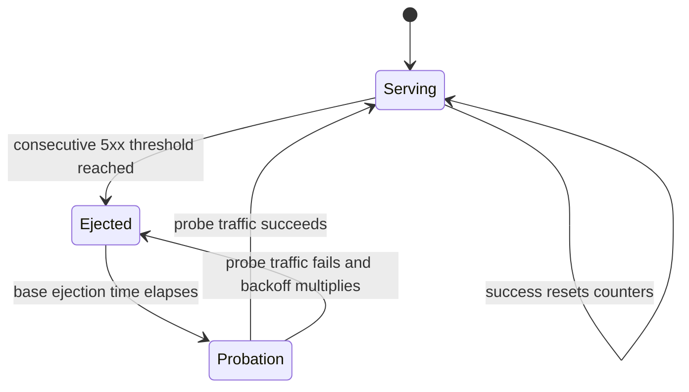
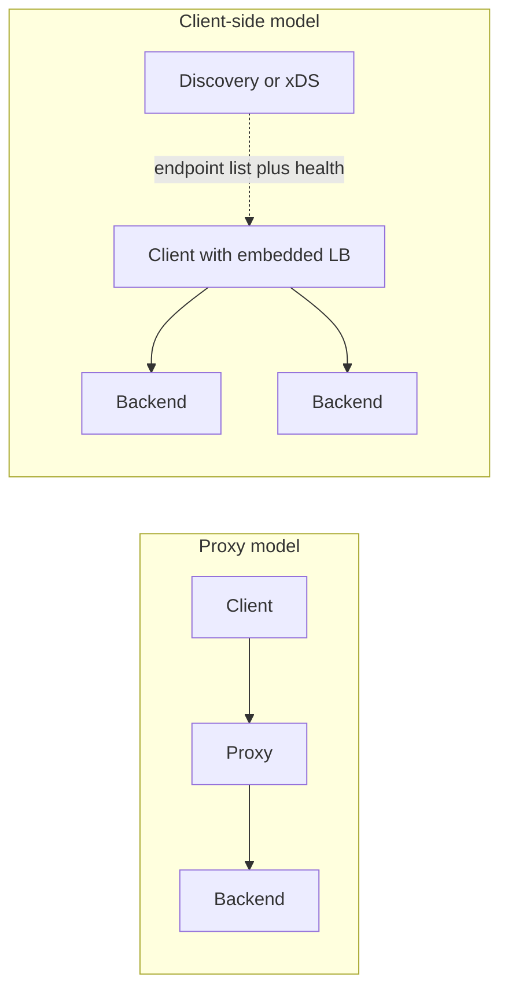

# F03 — Load Balancing

**A load balancer is a control loop that must make routing decisions with stale, incomplete information; almost every load balancing pathology comes from the algorithm trusting a signal that has already gone wrong.**

## Layer 4 vs Layer 7

| Dimension | L4 (transport) | L7 (application) |
| --- | --- | --- |
| Decision input | 5-tuple: src/dst IP, src/dst port, protocol | Method, path, headers, cookies, body, mTLS identity |
| TLS | Passthrough, or SNI-based routing only | Terminated, so it can inspect and re-encrypt |
| Connection model | One client connection maps to one backend connection | Decoupled: N client connections multiplex over M pooled backend connections |
| Throughput per core | 5–15 Mpps with XDP/DPDK; 1–3 Mpps with conntrack | 20–100k RPS/core, TLS-bound |
| Added latency | 10–100 µs | 0.3–2 ms |
| Retries | Impossible (no request boundary) | Yes, on idempotent requests |
| Per-request balancing | No — decision made once per connection | Yes — every request can go elsewhere |
| Health checking | TCP connect, or synthetic probe | Real HTTP path with status and body assertions |
| Rate limiting / auth / WAF | No | Yes |
| Observability | Bytes, packets, connections | Status codes, routes, upstream latency, traces |
| Typical products | IPVS, Maglev, Katran, AWS NLB, F5 | Envoy, NGINX, HAProxy, ALB |

The critical asymmetry: **L4 balances connections; L7 balances requests.** With HTTP/2 or gRPC, a single long-lived connection carries thousands of requests, so an L4 balancer distributes them all to one backend. This is the single most common cause of "my load balancer isn't balancing" in modern stacks.

!!! gotcha "L4 load balancing plus HTTP/2 equals no load balancing"
    **Symptom:** with gRPC or HTTP/2 behind an NLB or a `ClusterIP` service, one pod runs at 90% CPU and the rest idle. **Mechanism:** L4 hashes the 5-tuple once at connection setup. HTTP/2 multiplexes every request over that one connection, so every request lands on the same backend for the connection's entire lifetime — which for a well-behaved client is hours. **Mitigation:** use an L7 proxy that understands HTTP/2 streams (Envoy, ALB, Linkerd), or use client-side load balancing with gRPC's `round_robin` policy over a headless service, or bound connection lifetime (`max_connection_duration`, `MAX_CONNECTION_AGE` in gRPC servers) so connections periodically re-balance. **Detection:** per-backend RPS variance far exceeding per-backend connection-count variance.

---

## Direct Server Return



In DSR the balancer sees only the ingress packets; responses bypass it entirely. For typical web traffic where responses are 10–100x larger than requests, this removes ~95% of the bytes from the balancer.

| Property | DSR | Full proxy / NAT |
| --- | --- | --- |
| Balancer bandwidth needed | Request bytes only | Request plus response |
| Backend sees real client IP | Yes | Only via PROXY protocol or `X-Forwarded-For` |
| Requires L2 adjacency or tunneling | Yes — MAC rewrite needs same L2; IPIP/GRE/GUE otherwise | No |
| Backend configuration | Must own the VIP on a loopback with ARP suppressed | None |
| MTU impact | Encapsulation costs 20–50 bytes | None |
| TCP state on balancer | Flow table only, or stateless with consistent hashing | Full connection state |
| Can modify responses | No | Yes |
| Health of return path | Invisible to the balancer | Visible |

```bash
# Backend-side DSR setup: own the VIP without answering ARP for it
ip addr add 203.0.113.10/32 dev lo
sysctl -w net.ipv4.conf.all.arp_ignore=1
sysctl -w net.ipv4.conf.all.arp_announce=2
```

!!! gotcha "DSR plus MTU equals a PMTU blackhole you cannot see"
    IPIP or GRE encapsulation to the backend reduces the effective MTU by 20–24 bytes, but the *response* path is not encapsulated, so PMTUD signalling never reaches the balancer. Large POST bodies stall while small requests work perfectly. Clamp MSS on the backend's VIP interface or lower the backend MTU explicitly.

---

## ECMP, Consistent Hashing, and Maglev

The production edge is three layers deep, and each layer solves a different problem.



**ECMP** spreads packets across balancer nodes by hashing the 5-tuple. It is stateless and line-rate, but it has a fatal property: when the set of next-hops changes, the hash space is repartitioned and **most flows move**. With plain modulo-N hashing, adding one node to a set of $N$ disrupts approximately $\frac{N-1}{N}$ of flows — 90% for $N=10$.

**Consistent hashing** fixes this. With a ring, adding one node to $N$ moves only $\approx 1/N$ of keys.

**Maglev hashing** is a lookup-table variant designed for this exact use: build a permutation table of prime size $M$ (Google uses $M = 65537$ or $655373$) where each backend claims slots via its own permutation. It gives near-perfect balance (each backend gets within one slot of $M/N$) with minimal disruption on membership change, and lookup is a single array index rather than a ring search.

| Scheme | Balance quality | Disruption on adding 1 of N | Lookup cost | Memory |
| --- | --- | --- | --- | --- |
| Modulo hash | Perfect | $(N-1)/N$ — catastrophic | $O(1)$ | None |
| Ring consistent hash (no vnodes) | Poor, up to 2–3x skew | $1/N$ | $O(\log N)$ | Small |
| Ring with 100–200 vnodes per node | Within ~5% | $1/N$ | $O(\log(N \cdot V))$ | $N \cdot V$ entries |
| Maglev | Within 1 slot of ideal | Small, bounded by table size | $O(1)$ array index | $M$ entries, e.g. 65537 |
| Rendezvous (HRW) | Good | $1/N$, provably minimal | $O(N)$ | None |
| Bounded-load consistent hash | Enforced ceiling of $(1+\varepsilon)\cdot\text{avg}$ | $1/N$ plus overflow spill | $O(\log N)$ amortized | Ring plus load counters |

!!! note "Why the flow table still matters"
    Maglev nodes keep a local connection-tracking table *in addition to* consistent hashing. The hash guarantees that a new node computes the same backend for a given 5-tuple as its peers; the flow table guarantees that an existing connection stays pinned even if backend membership changes mid-flow. Consistent hashing bounds the damage; the flow table eliminates it for the common case. Lose both simultaneously — a Maglev node restart *and* a backend set change — and you reset live connections.

!!! gotcha "ECMP rehashes every flow when a balancer node is added or removed"
    **Symptom:** deploying the load balancer fleet causes a spike of connection resets across unrelated services. **Mechanism:** the router's ECMP group changed size, so the 5-tuple hash maps flows to different balancer nodes. If those nodes use consistent hashing to backends, the *backend* is still right — which is exactly why Maglev-style hashing exists. If they use per-node state without consistent hashing, every moved flow is a reset. **Mitigation:** resilient hashing on the router (many vendors support it, keeping existing flows pinned when a member is removed), consistent hashing on the balancers, and draining a node from the ECMP group (withdraw the BGP announcement) before restarting it.

---

## Algorithms

| Algorithm | How it decides | Strength | Failure mode |
| --- | --- | --- | --- |
| Round robin | Next in sequence | Trivially fair when backends are homogeneous and requests uniform | Ignores heterogeneous capacity and request cost entirely |
| Weighted round robin | Sequence with static weights | Handles known capacity differences | Weights are static; they do not track real-time state |
| Random | Uniform pick | Stateless, no coordination | Max load is $O(\log n / \log\log n)$ above average |
| Least connections | Fewest active connections | Good proxy for load when requests are uniform | **Herds onto anything with few connections** — see below |
| Least requests / outstanding | Fewest in-flight requests | Better for HTTP/2 where connections are shared | Same herding failure |
| Power of two choices (P2C) | Pick 2 at random, choose the less loaded | Max load drops to $O(\log\log n)$; no global state; no herding | Slightly worse than perfect under low load |
| EWMA latency | Track exponentially-weighted moving average of response time per backend | Captures real cost, not just count | Slow to react; needs careful half-life; cold backends have no data |
| Peak EWMA (P2C + EWMA) | P2C where the comparison metric is latency EWMA times outstanding | The current best-practice default (Finagle, Linkerd) | Complexity; still needs a cold-start policy |
| Consistent hash on key | Hash a request attribute | Cache locality, session affinity without state | Hot keys create hot backends; use bounded loads |
| Maglev / ring hash | As above, at L4 | Stateless failover | Same hot-key issue |

### Power of two choices

The result from Mitzenmacher: with $n$ balls into $n$ bins, uniform random placement gives a maximum load of $\Theta\!\left(\frac{\log n}{\log \log n}\right)$. Choosing the least loaded of $d \ge 2$ random bins gives $\frac{\ln \ln n}{\ln d} + O(1)$ — an exponential improvement. Going from $d=2$ to $d=3$ buys almost nothing.

```go
// Power of two choices with a peak-EWMA cost function.
func (p *Picker) Pick(backends []*Backend) *Backend {
    if len(backends) < 2 {
        return backends[0]
    }
    i, j := rand.Intn(len(backends)), rand.Intn(len(backends))
    for i == j {
        j = rand.Intn(len(backends))
    }
    if cost(backends[i]) <= cost(backends[j]) {
        return backends[i]
    }
    return backends[j]
}

// Cost blends observed latency with current in-flight work, so a backend that
// is fast but saturated and one that is idle but slow are compared on equal terms.
func cost(b *Backend) float64 {
    return b.LatencyEWMA() * float64(b.InFlight()+1)
}
```

The decisive practical property of P2C is that it needs **no global state and no coordination**, which means it works correctly with many independent balancers. Least-connections across a fleet of independent balancers is subtly broken because each balancer sees only its own connections.

### Why least-connections misbehaves

!!! danger "Least-connections sends a stampede at exactly the wrong moment"
    A backend with few connections is either (a) newly started and not yet warm, (b) failing fast and therefore closing connections quickly, or (c) genuinely idle. Least-connections cannot distinguish these. A restarted JVM with a cold JIT and an empty cache looks maximally attractive and receives a disproportionate share of traffic at its weakest moment. A backend returning instant `500`s looks *even more* attractive, and least-connections drives the maximum possible traffic into the broken node. This is a positive feedback loop that turns a partial failure into a total one.

Mitigations, in order of effectiveness:

1. **Slow start / warm-up ramp** — linearly increase the backend's weight over 30–120 s after it becomes healthy. NGINX `slow_start=30s`, Envoy `slow_start_config` with `slow_start_window`, HAProxy `slowstart 60s`.
2. **Switch to P2C with a latency-based cost**, so a fast-failing backend's low latency is offset by nothing — which is why the cost function must include error rate or be paired with outlier detection.
3. **Outlier detection on error rate**, so fast failures eject the backend rather than attract traffic.
4. **Readiness that means ready** — do not mark a backend healthy until caches are warmed and the JIT has seen traffic, using a synthetic warm-up before joining the pool.

!!! gotcha "Fast failures are indistinguishable from fast successes to a latency-based balancer"
    **Symptom:** one backend loses its database connection, starts returning `500` in 2 ms, and immediately receives 10x its share of traffic. Overall error rate jumps far more than $1/N$. **Mechanism:** both least-connections and latency-EWMA see a backend that is faster and less loaded than its peers and preferentially route to it. **Mitigation:** never use latency alone as the cost signal. Combine with consecutive-error outlier detection (Envoy `consecutive_5xx`, typically 5) and treat `503`/connection-refused as a strong negative weight. This is the single most important interaction between load balancing and failure handling.

---

## Session Affinity

| Method | Where state lives | Survives backend loss | Survives balancer loss | Cost |
| --- | --- | --- | --- | --- |
| Source IP hash | Nowhere (computed) | No — rehash on membership change unless consistent | Yes if consistent hash | Broken by CGNAT and mobile IP changes; huge skew from large NATs |
| Consistent hash on session cookie | Nowhere (computed) | Bounded rehash | Yes | Requires L7 |
| Balancer-issued sticky cookie | Balancer maps cookie to backend | No | Only if the map is shared or the cookie encodes the backend |
| Encoded-backend cookie | Client holds it | No | Yes | Leaks topology; needs signing |
| Shared session store (Redis) | External | Yes | Yes | Extra RTT per request, plus a new SPOF |
| Stateless tokens (JWT) | Client | Yes | Yes | Token size, revocation difficulty |

The real costs of affinity are structural, not mechanical:

- **You cannot rebalance.** A hot user, a hot tenant, or a long-lived WebSocket cannot be moved without breaking their session.
- **Deploys become disruptive.** Every restart drops sessions that affinity promised to preserve.
- **Capacity planning gets worse.** Load is now a function of *which* users hashed where, so variance grows and you must provision for the unluckiest backend.
- **Autoscaling fights affinity.** Scaling out does not relieve an overloaded backend because its sticky users stay put.

!!! tip "Affinity for cache locality is fine; affinity for correctness is a bug"
    Consistent-hashing users to backends to improve local cache hit ratio is a legitimate optimization — and it degrades gracefully, because a rehashed user just gets a cache miss. Requiring affinity because the backend holds unreplicated session state is a design flaw that will surface as data loss during every deploy. Push session state out.

---

## Connection Draining and Graceful Shutdown

The most common source of deploy-time errors is not the new code; it is the shutdown sequence.



The mandatory ordering is: **become unready → wait for the balancer to observe it → stop accepting → drain in-flight → exit.** Skipping the wait is the bug.

$$
T_{\text{drain}} \;\ge\; \underbrace{I_{hc} \times F_{hc}}_{\text{detection}} \;+\; \underbrace{T_{\text{propagate}}}_{\text{config push}} \;+\; \underbrace{p99_{\text{request}}}_{\text{in-flight}} \;+\; \text{margin}
$$

With a 5 s health check interval, 2 consecutive failures, 2 s of xDS propagation, and a 3 s p99: $5\times2 + 2 + 3 = 15$ s minimum. Kubernetes' default `terminationGracePeriodSeconds` is **30 s**, which is often just barely enough — and is frequently too short for services with long-tail requests.

```yaml
lifecycle:
  preStop:
    exec:
      # Give the LB time to observe unreadiness before the process starts closing.
      command: ["/bin/sh", "-c", "sleep 15"]
terminationGracePeriodSeconds: 60
readinessProbe:
  httpGet: { path: /ready, port: 8080 }
  periodSeconds: 2
  failureThreshold: 2
```

!!! gotcha "Kubernetes removes the endpoint and sends SIGTERM concurrently, not in order"
    **Symptom:** a small burst of `502`s and connection resets on every rolling deploy, proportional to request rate. **Mechanism:** the kubelet sends `SIGTERM` at the same time the endpoints controller propagates the removal to every kube-proxy and every ingress. Those are independent, eventually-consistent paths that take seconds. If your process exits promptly on `SIGTERM`, it dies while traffic is still being routed to it. **Mitigation:** a `preStop` sleep longer than the propagation delay, and a `SIGTERM` handler that stops accepting but keeps serving. The sleep is not a hack — it is the only way to order two independent asynchronous systems.

!!! gotcha "HTTP/1.1 has no in-band way to say `this is my last request`"
    HTTP/2 has `GOAWAY`, which tells the client exactly which stream IDs will be honoured. HTTP/1.1 only has `Connection: close` on a response, which means the *next* request on that connection is a race: the client may have already pipelined or dispatched it. This is why HTTP/1.1 backends always produce a small residue of deploy-time errors, and why clients must safely retry idempotent requests that received zero bytes.

---

## Health Checking

| Type | Mechanism | Detection speed | Load cost | Blind spots |
| --- | --- | --- | --- | --- |
| Active TCP connect | Balancer opens a socket | Fast | $N_{lb} \times N_{be} / I$ conns/sec | Process is up but broken |
| Active HTTP shallow (`/healthz` returns 200) | GET a static endpoint | Fast | Same | Dependencies down, thread pool exhausted |
| Active HTTP deep (checks dependencies) | GET an endpoint that queries downstream | Fast | Same, plus downstream load | **Correlated failure — see below** |
| Passive / outlier detection | Observe real request outcomes | As fast as traffic allows | Zero | No signal for backends with no traffic |
| Client-reported load | Backend reports its own utilization in response headers (ORCA) | Fast | Zero | Requires cooperation; backend may lie when broken |

Health check load is quadratic in a mesh:

$$
QPS_{hc} = \frac{N_{\text{balancers}} \times N_{\text{backends}}}{I_{\text{interval}}}
$$

With 200 Envoy sidecars health-checking 500 backends every 2 s: $200 \times 500 / 2 = 50{,}000$ QPS of pure health-check traffic. This is why service meshes default to passive outlier detection plus a much longer active interval, or drop active checking entirely in favour of xDS-delivered endpoint health.

### Cascading failure from health checking



!!! danger "Health checks must fail open below a threshold"
    Envoy's **panic threshold** (default 50%) makes it route to *all* hosts, healthy or not, once too few remain healthy — on the reasoning that a degraded backend is better than no backend, and that if half your fleet looks unhealthy the health check is more likely wrong than the fleet. Confirm this behaviour exists in whatever balancer you use. Its absence turns any correlated dependency blip into a full outage. Related: `max_ejection_percent` (Envoy default 10%) caps how much of a cluster outlier detection may eject.

!!! gotcha "Deep health checks turn a slow database into zero capacity"
    **Symptom:** the database gets 30% slower; within a minute every backend is ejected and the service is 100% down. **Mechanism:** the health endpoint queries the database with a 1 s timeout; a 1.2 s database makes every check fail simultaneously across the entire fleet — perfectly correlated. **Mitigation:** health checks should assert *this process can serve traffic*, not *all my dependencies are perfect*. Report dependency health as a metric, degrade functionality gracefully, and let load shedding — not ejection — handle overload. If you must check dependencies, use a much longer timeout than the request path and require many consecutive failures.

### Outlier detection



Envoy defaults worth knowing: `consecutive_5xx: 5`, `interval: 10s`, `base_ejection_time: 30s` (multiplied by the number of times this host has been ejected), `max_ejection_percent: 10`, `success_rate_minimum_hosts: 5`, `success_rate_stdev_factor: 1900` (i.e. eject hosts whose success rate is more than 1.9 standard deviations below the mean).

Success-rate-based ejection is strictly better than fixed thresholds because it is *relative*: during a global incident every host is equally bad, so no host is an outlier, and nothing gets ejected. A fixed threshold would eject everything.

---

## The Load Balancer as a Single Point of Failure

| Failure | Blast radius | Mitigation |
| --- | --- | --- |
| Single LB instance dies | Everything behind it | Active-active pairs behind ECMP/Anycast, never active-passive with a floating IP unless you accept the failover gap |
| Config push with a bad route | Everything | Canary the config as you would code; Envoy's xDS supports per-node config so you can stage it |
| Certificate expiry at the LB | Everything TLS | Expiry monitoring as an SLI, automated renewal with alerting on renewal failure not just on expiry |
| Connection or fd exhaustion | New connections rejected, existing fine | Track fd usage, size `nofile`, bound per-listener connections |
| Conntrack table full | Random packet drops with no error | Monitor `nf_conntrack_count` vs `max`; bypass conntrack for the LB data path |
| Balancer overload from health checks | Self-inflicted | See the quadratic formula above |
| Shared control plane (xDS) outage | **Usually none** if data plane keeps last-known-good config | Verify your proxies serve stale config rather than failing; this is the most important property of a mesh |

!!! tip "The data plane must survive the control plane"
    An Envoy that loses contact with its xDS server should keep serving with its last-known-good configuration indefinitely. Verify this by killing the control plane in a game day. A mesh whose data plane fails closed when the control plane is down has converted a management-plane outage into a customer-facing one, and that is the single most common way service meshes cause incidents.

---

## Client-Side Load Balancing



| Dimension | Proxy LB | Client-side LB | Sidecar (hybrid) |
| --- | --- | --- | --- |
| Extra network hop | Yes | No | Yes, but loopback |
| Added latency | 0.3–2 ms | ~0 | 0.1–0.5 ms |
| Language support | Any | Per-language library, must be reimplemented | Any |
| Rollout of LB logic | Deploy the proxy | Redeploy every client — slow and risky | Deploy the sidecar |
| Load visibility | Global at the proxy | Per-client only | Per-client, aggregated by control plane |
| Fate sharing | Proxy failure is shared | Client bug affects only that client | Sidecar failure affects one pod |
| Resource cost | Centralized fleet | Zero extra processes | ~50–100 MB and 0.1 core per pod, at fleet scale this is real money |
| Balancing quality | Best — sees everything | Needs P2C to be good without global state | Same as client-side |

The genuinely hard problem with client-side load balancing is **version skew**: your balancing algorithm now lives in every client binary, and rolling out a fix means redeploying every service that talks to you. This is why gRPC introduced the xDS-based lookaside model and why service meshes exist.

---

## Subsetting

At $N$ clients and $M$ backends, full-mesh connectivity requires $N \times M$ connections. At 10,000 clients and 10,000 backends that is $10^8$ connections — impossible.

**Subsetting** assigns each client a subset of size $k$ (typically 20–100). Connections drop to $N \times k$.

$$
P(\text{a backend gets zero clients}) = \left(1 - \frac{k}{M}\right)^{N} \quad\text{(naive random subsetting)}
$$

Naive random subsetting produces poor balance: some backends land in many subsets, some in few, and the variance does not average out. **Deterministic subsetting** (from Google's SRE book, Chapter 20) fixes it by shuffling the backend list with a seed derived from a "round" number and partitioning it, so every backend appears in exactly the same number of subsets.

```python
def deterministic_subset(backends, client_id, subset_size):
    """Every backend appears in exactly the same number of subsets."""
    subset_count = len(backends) // subset_size
    round_number = client_id // subset_count
    shuffled = list(backends)
    random.Random(round_number).shuffle(shuffled)   # same shuffle for all clients in a round
    subset_id = client_id % subset_count
    start = subset_id * subset_size
    return shuffled[start:start + subset_size]
```

| Property | Random subsetting | Deterministic subsetting | Consistent-hash subsetting |
| --- | --- | --- | --- |
| Load spread | Uneven, high variance | Even by construction | Even with vnodes |
| Churn on backend change | Subset reshuffles | Bounded — only the affected round changes | Minimal, $1/M$ |
| Churn on client change | None | New client picks a subset | None |
| Requires coordination | No | No, only a shared client-ID scheme | No |
| Used by | Simple systems | Google internal, gRPC | Envoy, Finagle |

!!! gotcha "Subset size below ~20 breaks your load balancing algorithm's statistics"
    **Symptom:** with a subset size of 5, backend utilization varies 3x across the fleet even under uniform load. **Mechanism:** P2C's guarantees and least-request's smoothing both depend on having enough choices; with $k=5$ the law of large numbers has not kicked in, and a single slow backend in a small subset dominates that client's experience. **Mitigation:** keep $k \ge 20$; Google's guidance is 20–100. If $M$ is small enough that $k \ge 20$ means full mesh, do not subset at all. **Second-order effect:** small subsets also make outlier ejection dangerous, because ejecting 1 of 5 removes 20% of that client's capacity.

---

## Gotchas & Corner Cases

!!! gotcha "Least-connections stampedes onto a freshly restarted backend"
    **Symptom:** during a rolling deploy, each newly-started pod shows a p99 latency spike 5–10x worse than steady state, and sometimes crashes. **Mechanism:** the moment readiness flips true, the pod has zero connections and is therefore the most attractive target for every least-connections balancer simultaneously. It receives a burst while its JIT is cold, its connection pools are empty, and its caches are unpopulated. **Mitigation:** enable slow start (`slow_start=30s` in NGINX, `slow_start_config` in Envoy, `slowstart` in HAProxy) so weight ramps linearly, and delay readiness until after a synthetic warm-up. **Detection:** correlate per-pod p99 against pod age; a monotonic decay over the first 60 s is the fingerprint.

!!! gotcha "A backend returning instant 503s attracts maximum traffic"
    **Symptom:** one bad backend causes an error rate far above the expected $1/N$. **Mechanism:** it fails in 1 ms, so it always has the fewest connections and the lowest latency EWMA. Every load-aware algorithm routes to it preferentially — a perfect positive feedback loop. **Mitigation:** outlier detection on consecutive `5xx` (Envoy default 5) and on connection failures, plus a cost function that penalizes errors. **Never** run a purely latency- or connection-based algorithm without error-aware ejection.

!!! gotcha "Health check load is quadratic and can exceed real traffic"
    **Symptom:** a low-traffic internal service shows constant CPU and thousands of connections per second in `ss`. **Mechanism:** $N_{\text{balancers}} \times N_{\text{backends}} / \text{interval}$ health checks. In a mesh with hundreds of sidecars, health checking dwarfs application traffic. **Mitigation:** prefer passive outlier detection, push endpoint health through the control plane instead of probing, use long intervals with fast passive ejection, and reuse a keep-alive connection for checks rather than a fresh TCP connect each time.

!!! gotcha "`terminationGracePeriodSeconds` shorter than your p99 truncates real requests"
    **Symptom:** a small number of requests fail with connection reset during every deploy, always the slow ones. **Mechanism:** Kubernetes sends `SIGKILL` after the grace period regardless of in-flight work. With a 30 s default and a 45 s p999 request, you kill the tail. **Mitigation:** set the grace period to `preStop sleep + p999 request duration + margin`, and make long-running requests resumable or move them to a queue.

!!! gotcha "Source IP affinity is destroyed by CGNAT and creates massive skew"
    **Symptom:** with `ip_hash`, one backend consistently carries 5x the load of its peers. **Mechanism:** carrier-grade NAT puts hundreds of thousands of mobile users behind one IPv4 address; that single hash bucket is a huge fraction of your traffic. Simultaneously, mobile users switching networks change IP and lose their affinity. So you get the worst of both: severe imbalance *and* broken stickiness. **Mitigation:** hash on an application-level identifier (session cookie, user ID) at L7, or drop affinity entirely.

!!! gotcha "The load balancer's own retry amplifies an overload into a collapse"
    **Symptom:** a backend gets slow, the error rate goes from 1% to 100% within seconds. **Mechanism:** the balancer retries failed requests to other backends. Under partial overload, retries multiply offered load by the retry count (3x for `retries: 2`) at exactly the moment capacity is lowest. **Mitigation:** retry *budgets* — cap total retries at a small percentage of total requests (Envoy `retry_budget`, typically 20%; Finagle uses the same concept), not a per-request attempt count. Also add a `per_try_timeout` well below the overall timeout, and never retry a request that timed out server-side without idempotency guarantees.

!!! gotcha "Health check timeout longer than the check interval creates overlapping checks and false healthy states"
    **Symptom:** a hung backend stays marked healthy indefinitely. **Mechanism:** if `timeout > interval`, checks pile up; some balancers will not start a new check while one is outstanding, so a hung backend that never responds also never *fails* a check — it just never completes one. **Mitigation:** always enforce `timeout < interval`, and separately alert on health checks that fail to complete rather than failing.

!!! gotcha "Envoy's panic threshold silently sends traffic to unhealthy hosts"
    **Symptom:** during a partial outage you see traffic going to hosts you know are down, and the ejection metrics look nonsensical. **Mechanism:** once healthy hosts drop below `healthy_panic_threshold` (default 50%), Envoy deliberately ignores health status and load-balances across *all* hosts. This is correct behaviour — it prevents overloading the survivors — but it is surprising if you do not know it exists. **Mitigation:** know the threshold, alarm on `cluster.*.lb_healthy_panic` so you can see when it engages, and tune the threshold rather than being confused by it.

!!! gotcha "Connection draining does nothing for long-lived connections"
    **Symptom:** after removing a backend from the pool, it still carries traffic hours later. **Mechanism:** draining stops *new* connections; WebSockets, gRPC streams, and long-poll connections persist indefinitely. **Mitigation:** enforce a maximum connection age (`max_connection_duration` in Envoy, `MaxConnectionAge` in gRPC servers, typically 30–60 min with jitter) so connections naturally recycle, and implement application-level `GOAWAY` handling so clients reconnect gracefully rather than on error.

!!! gotcha "Weighted round robin with rapidly changing weights oscillates"
    **Symptom:** backend load swings in a visible sine wave with a period roughly twice your weight update interval. **Mechanism:** a control loop with delay. You measure load, lower the weight, the load drops, you raise the weight, the load spikes. Classic under-damped feedback. **Mitigation:** heavy damping (EWMA with a half-life several times the measurement interval), rate-limit weight changes, and prefer P2C, which is a stateless randomized algorithm with no feedback loop and therefore cannot oscillate.

!!! gotcha "Adding a backend to a consistent-hash pool moves cache keys and causes a thundering herd on the origin"
    **Symptom:** scaling out a cache tier causes an origin load spike far larger than the added capacity should require. **Mechanism:** $1/N$ of keys remap to the new node, and every one of those is a cold miss. With 10 nodes that is 10% of all keys missing simultaneously. **Mitigation:** add nodes gradually, pre-warm the new node before adding it to the ring, use bounded-load consistent hashing so the shift is smoother, and put request coalescing in front of the origin so the herd collapses into one fetch per key.

!!! gotcha "The load balancer's `X-Forwarded-For` handling is a security boundary you probably got wrong"
    **Symptom:** rate limiting and geo-blocking are trivially bypassed by a spoofed header. **Mechanism:** `X-Forwarded-For` is client-controlled. If your balancer *appends* rather than *replaces*, and your application reads the leftmost entry, an attacker controls the value. **Mitigation:** configure `xff_num_trusted_hops` (Envoy) or the equivalent so the balancer reads the correct index counting from the right, strip or overwrite the header at the trust boundary, and prefer the PROXY protocol or a dedicated header the balancer sets and the app trusts only from the balancer's source IP.

---

## SRE Lens

### SLIs and SLOs

| SLI | Definition | Notes |
| --- | --- | --- |
| LB availability | Non-5xx generated *by the balancer* / total | Distinguish balancer-origin `503`/`502` from backend-origin `5xx`; Envoy's `response_flags` (`UH`, `UF`, `UO`, `NR`, `RL`) tell you which |
| Added latency | p99 of `duration` minus `upstream_service_time` | Should be sub-millisecond; a rise means queueing in the proxy |
| Healthy backend fraction | Healthy / total per cluster | Alert on absolute floor, not percentage |
| Balance quality | Coefficient of variation of per-backend RPS | Above ~0.2 with homogeneous backends means the algorithm is failing |
| Ejection rate | Hosts ejected per minute | A sustained nonzero rate is a fleet health problem, not a balancer problem |
| Retry ratio | Retries / total requests | Should be < 1–2%; above that, retries are load |
| Connection reuse | Requests per upstream connection | Low values mean keep-alive is broken |

### Key Envoy response flags for triage

```text
UH  no healthy upstream          -> all backends ejected or unready
UF  upstream connection failure  -> backend refused or network path broken
UO  upstream overflow            -> circuit breaker tripped, check max_connections/max_pending
NR  no route configured          -> config error, not a backend problem
URX retry limit exceeded         -> genuine backend failure, retries did not help
DC  downstream connection term   -> client gave up, often a client timeout shorter than yours
RL  rate limited                 -> your own limiter, verify it is intentional
```

### Detection

```bash
# Per-cluster health and balance in Envoy
curl -s localhost:9901/clusters | grep -E 'health_flags|rq_total|cx_active'

# Circuit breaker and ejection counters
curl -s localhost:9901/stats | grep -E 'upstream_rq_pending_overflow|outlier_detection|lb_healthy_panic'

# Balance quality: coefficient of variation across backends
# (run against your metrics store; shape shown for clarity)
```

```sql
-- Balance quality over the last 15 minutes. CV above 0.2 with homogeneous
-- backends means the balancing algorithm or the subset size is wrong.
SELECT cluster,
       stddev_samp(rps) / avg(rps) AS coefficient_of_variation
FROM backend_rps
WHERE ts > now() - INTERVAL '15 minutes'
GROUP BY cluster
HAVING stddev_samp(rps) / avg(rps) > 0.2;
```

### Rollout and migration risk

- **Changing the balancing algorithm is a production change with no request-level rollback.** Shift a small percentage of *balancers* (not backends) to the new algorithm and compare per-backend CV, p99, and error rate.
- **Changing health check parameters changes your failure detection time in both directions.** Tightening thresholds increases false-positive ejections; loosening them increases time-to-detect. Model both against your error budget.
- **Migrating L4 to L7** changes connection semantics: backends now see the proxy's IP, connection counts collapse, keep-alive behaviour changes, and anything reading the peer address breaks. Enumerate every consumer of the client IP first.
- **Enabling outlier detection for the first time** on an unhealthy fleet can eject a large fraction immediately. Start with `max_ejection_percent: 5` and raise it once you have seen the baseline ejection rate.

### Capacity signals

| Signal | Threshold | Action |
| --- | --- | --- |
| Balancer CPU | > 60% | Scale out; TLS handshakes are usually the driver |
| `nf_conntrack_count / max` | > 70% | Raise max, or move the data path off conntrack |
| fd usage vs `nofile` | > 70% | Raise limit, audit pool sizes |
| `upstream_rq_pending_active` | Sustained nonzero | Backends are the bottleneck, not the balancer |
| Per-backend CV | > 0.2 | Algorithm or subset problem |
| Health check QPS as fraction of total | > 10% | Move to passive detection |

### Runbook notes

1. `503` with `UH` flag → not a balancer bug; every backend is ejected or unready. Check whether a deep health check is failing fleet-wide.
2. Latency up but `upstream_service_time` flat → the queue is in the proxy. Check connection limits, circuit breakers, and CPU.
3. One backend hot → check the algorithm, the subset size, and whether HTTP/2 connection pinning is defeating per-request balancing.
4. Errors only during deploys → the drain sequence is wrong. Measure the actual endpoint-removal propagation time before tuning the sleep.
5. Never fix an overload by increasing retries or timeouts. Both make it worse.

### Cost implications

- L7 proxying costs roughly 10–20x the CPU of L4 per request; a large edge fleet is a meaningful budget line and TLS termination dominates it.
- DSR eliminates response bytes from the balancer, which for egress-heavy workloads can reduce balancer fleet size by an order of magnitude.
- Sidecars at ~0.1 core and 64 MB each cost, at 10,000 pods, roughly 1,000 cores and 640 GB. Ambient/proxyless models exist specifically to reclaim this.
- Cross-AZ balancing is billed in most clouds. Zone-aware routing (Envoy's locality-weighted LB, AWS's cross-zone toggle) trades a little balance quality for real money — but disabling cross-zone entirely means a zone with fewer backends gets overloaded, so it must be paired with capacity-aware weighting.

---

## Interview Angle

!!! interview "Probe: how would you load balance a gRPC service?"
    **What they want:** the L4/HTTP-2 pinning trap.
    **Strong answer:** "L4 balancing breaks with gRPC because HTTP/2 multiplexes everything over one connection, so the balancing decision is made once per connection and every subsequent request follows it. Options: an L7 proxy that balances per stream, client-side balancing with a headless service and `round_robin` or P2C, or xDS-based lookaside balancing. Whichever I pick, I bound connection age with `MAX_CONNECTION_AGE` plus jitter so long-lived connections periodically rebalance, and I handle `GOAWAY` cleanly so that recycling is not an error event."
    **Weak answer:** "Put it behind an NLB."

!!! interview "Probe: least-connections or round robin?"
    **Follow-ups:** What happens when a backend restarts? What happens when a backend starts failing fast?
    **Strong answer:** "Neither, by default — I'd use power-of-two-choices with a peak-EWMA cost. Least-connections has a specific pathology: a backend with few connections might be cold or might be failing fast, and in both cases least-connections sends it *more* traffic at the worst possible time. P2C needs no global state, which matters because with multiple independent balancers, least-connections is computed on partial information anyway. And whatever algorithm I use must be paired with error-aware outlier detection, because no load metric can distinguish a fast success from a fast failure."
    **Weak answer:** "Least connections, because it accounts for load."

!!! interview "Probe: walk me through a zero-downtime deploy."
    **Strong answer:** describes the exact ordering — flip readiness false, *wait* for the balancer to observe it (interval × threshold + propagation), stop accepting new connections, send `GOAWAY`/`Connection: close`, drain in-flight to p999, then exit. Explains why Kubernetes' concurrent `SIGTERM` and endpoint removal require a `preStop` sleep. Notes that HTTP/1.1 has no clean in-band signal, so idempotent-request retry on zero-byte responses is required to reach actually-zero errors.
    **Weak answer:** "Kubernetes handles it with rolling updates."

!!! interview "Probe: your load balancer is the SPOF. Fix it."
    **Strong answer:** layers the answer — Anycast plus ECMP for the VIP so there is no single node, Maglev-style consistent hashing so ECMP membership changes do not reset flows, connection tracking for the flows that are in progress, active-active across AZs, and a data plane that keeps serving last-known-good config when the control plane is unavailable. Explicitly mentions that the control plane is the more likely failure and that fate-sharing between control and data plane is the real risk.
    **Weak answer:** "Run two load balancers with a VIP and keepalived," without addressing the failover gap or the control plane.

!!! interview "Probe: 10,000 clients, 10,000 backends. What breaks?"
    **Strong answer:** $10^8$ connections is impossible, so subsetting is mandatory. Explains deterministic subsetting and why naive random subsetting gives poor balance, why subset size should be at least 20 for the balancing statistics to work, and how subset churn on membership change is bounded. Also raises health check load being quadratic and the need for passive detection at that scale.
    **Weak answer:** not recognizing the connection-count problem at all.

---

## Key Takeaways

- L4 balances connections, L7 balances requests. With HTTP/2 and gRPC that distinction means L4 does not balance at all.
- Power-of-two-choices with a latency-and-inflight cost is the sane default: no global state, no oscillation, and $O(\log\log n)$ max load.
- Least-connections and pure-latency algorithms both preferentially route to fast-failing backends. Always pair the balancing algorithm with error-aware outlier detection.
- Maglev-style consistent hashing exists so that ECMP membership changes and backend membership changes do not reset live flows; the flow table handles the rest.
- Graceful shutdown is an ordering problem across two independent asynchronous systems. Unready → *wait* → stop accepting → drain → exit. The wait is mandatory.
- Deep health checks create perfectly correlated failures. Fail open below a threshold and cap ejection percentage, or a slow dependency becomes a total outage.
- Session affinity is fine as a cache-locality optimization and a design flaw as a correctness requirement.
- Subsetting is mandatory above a few thousand clients and backends; use deterministic subsetting with $k \ge 20$.
- Retries need budgets, not attempt counts, or the balancer amplifies overload into collapse.

---

## Further Reading

- Eisenbud, Yi, Contavalli, et al. — *Maglev: A Fast and Reliable Software Network Load Balancer*, NSDI 2016.
- Mitzenmacher — *The Power of Two Choices in Randomized Load Balancing*, PhD thesis 1996, and the IEEE TPDS 2001 paper.
- Azar, Broder, Karlin, Upfal — *Balanced Allocations*, SIAM Journal on Computing, 1999.
- Karger et al. — *Consistent Hashing and Random Trees*, STOC 1997.
- Mirrokni, Thorup, Zadimoghaddam — *Consistent Hashing with Bounded Loads*, SODA 2018 (and the Google Research blog post of the same name).
- Thaler, Ravishankar — *Using Name-Based Mappings to Increase Hit Rates* (rendezvous / highest random weight hashing).
- Google SRE Book, Chapter 19 — *Load Balancing at the Frontend*, and Chapter 20 — *Load Balancing in the Datacenter* (deterministic subsetting, weighted round robin).
- Google SRE Book, Chapter 22 — *Addressing Cascading Failures*.
- Facebook Engineering — *Open-sourcing Katran, a scalable network load balancer* (XDP-based L4 with Maglev hashing).
- Envoy documentation — *Load Balancing*, *Outlier Detection*, *Circuit Breaking*, and the `response_flags` reference.
- Twitter/Finagle — *Load Balancing in Finagle* engineering blog, on Peak EWMA and aperture load balancing.
- Linkerd — *Beyond Round Robin: Load Balancing for Latency*.
- gRPC — *Load Balancing in gRPC* design document, and the xDS-based lookaside model.
- AWS Builders' Library — *Implementing health checks* and *Timeouts, retries, and backoff with jitter*.
- Marc Brooker — *Fixing Retries with Token Buckets and Circuit Breakers*.

---

Related pages: [F01 — Networking Foundations](f01-networking-foundations.md), [F02 — DNS & Global Traffic Management](f02-dns-traffic-management.md), [F05 — CDN & Edge](f05-cdn-edge.md).
