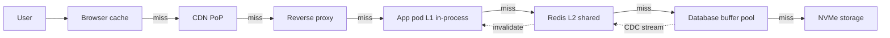
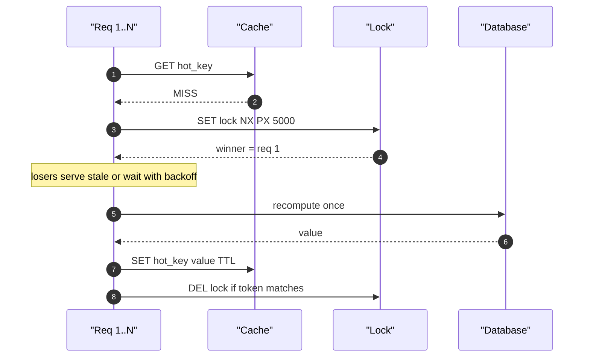
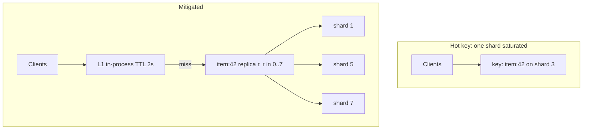
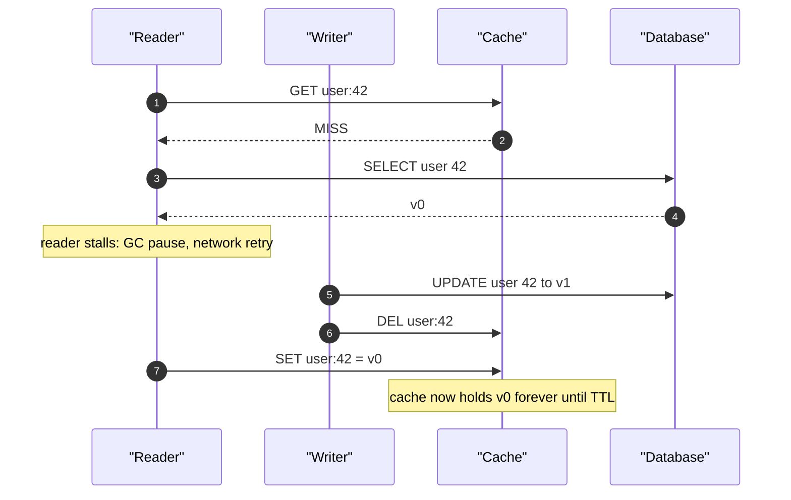

# F04 — Caching

**A cache is a bet that the future looks like the past; every hard caching problem is really a problem of deciding when that bet stops paying off and who is allowed to notice.**

## Where Caches Live

Every request already passes through five or six caches before it reaches a disk. Designing "a cache" means choosing which tier absorbs the load, and each tier trades invalidation control for latency.

| Tier | Read latency | Typical capacity | Invalidation control | Blast radius on loss |
|---|---|---|---|---|
| CPU L1/L2/L3 | 1 / 4 / 40 ns | KB–MB | none | none |
| Client (browser, mobile) | 0–1 ms | 10 MB–2 GB | weakest: `Cache-Control`, `ETag`, no purge | none, but stale UX for TTL |
| CDN / edge PoP | 5–40 ms to user | 1–50 TB per PoP | purge API, 5 s–5 min propagation | origin sees full miss traffic |
| Reverse proxy (nginx, Varnish, ATS) | 0.1–1 ms | 50–500 GB | local purge, fast | one node's traffic |
| App-local in-process (Caffeine, `sync.Map`) | 50–500 ns | 100 MB–8 GB heap | worst: N independent copies | one pod |
| Distributed cache (Redis, Memcached) | 0.2–0.6 ms p50, 1–3 ms p99 | 100 GB–100 TB | single authoritative delete | tier-wide stampede |
| DB buffer pool / OS page cache | 100 ns–1 µs | host RAM | automatic, coherent | cold DB, 10–50x slower reads |
| Storage device | NVMe 20–100 µs, HDD 5–10 ms | unbounded | n/a | n/a |



!!! tip "Pick the tier by the shape of the miss, not by habit"
    If the miss is expensive to compute but small to store, push it far out (CDN/edge). If it is cheap to compute but enormous, keep it near the data (buffer pool). If it must be strongly coherent, prefer one shared tier over N local copies, because coherence cost scales with the number of copies.

**Anchor numbers.** A single-threaded Redis shard sustains roughly 80k–150k simple `GET`s/s per core, and 500k–1M/s with pipelining of 10–50 commands. Memcached is multi-threaded and pushes 1M+ ops/s on a 16-core box. Same-AZ RTT is 0.2–0.5 ms; cross-AZ 0.5–2 ms; us-east-1 to us-west-2 is 60–70 ms. That last number is why a "global" cache read is usually a design error.

## Caching Patterns

=== "Cache-aside (lazy loading)"

    The application owns the cache. Read: check cache, on miss read DB and populate. Write: write DB, then invalidate.

    ```python
    def get_user(uid):
        key = f"user:{uid}"
        v = cache.get(key)
        if v is not None:
            return None if v == NEG_SENTINEL else decode(v)
        row = db.query("SELECT * FROM users WHERE id=%s", uid)
        cache.set(key, encode(row) if row else NEG_SENTINEL,
                  ttl=jitter(600) if row else 30)
        return row

    def update_user(uid, patch):
        db.update(uid, patch)          # source of truth first
        cache.delete(f"user:{uid}")    # invalidate, do not write-through
    ```

    Only requested data is cached, so memory tracks the working set. Failure of the cache degrades to DB load, it does not lose data. Cost: every cold key pays a miss, and the read-then-set path races with concurrent writes.

=== "Read-through"

    The cache client (or a cache service) owns loading. The app calls `cache.get(key)` and the loader function is registered once.

    ```java
    LoadingCache<Long, User> users = Caffeine.newBuilder()
        .maximumSize(100_000)
        .expireAfterWrite(Duration.ofMinutes(10))
        .refreshAfterWrite(Duration.ofMinutes(8))   // refresh-ahead
        .build(userDao::load);                       // single-flight per key
    ```

    Centralises the miss path so single-flight, negative caching, and metrics are implemented once. Cost: the loader must be pure and the cache library becomes part of your data path's failure domain.

=== "Write-through"

    Every write goes to the cache and the store synchronously before acknowledging.

    Cache is never stale relative to committed data. Cost: write latency is `max(cache, db)` plus the coordination, and you cache data nobody reads — on a write-heavy table that wastes most of your memory. Needs a two-phase discipline or you can ack a write that landed in the cache but not the DB.

=== "Write-behind (write-back)"

    Write to cache, ack, flush to the store asynchronously in batches.

    Absorbs write bursts and coalesces repeated updates to the same key: 10k increments to one counter become one UPDATE. Cost: an unreplicated cache node failure loses acknowledged writes. Only acceptable when the cache is durable (Redis AOF `everysec` still loses up to 1 s) or the data is genuinely tolerant, e.g. view counters, last-seen timestamps.

=== "Refresh-ahead"

    Proactively recompute an entry before it expires, based on access recency or a fraction of remaining TTL.

    Hides the miss latency entirely for hot keys and eliminates the expiry cliff. Cost: wasted recomputes for keys that go cold, and it amplifies load if applied to the whole keyspace instead of the hot tail.

| Pattern | Read latency | Write latency | Staleness window | Durability risk | Best for |
|---|---|---|---|---|---|
| Cache-aside | miss on cold key | DB write + delete | until next read + delete race | none | general read-heavy |
| Read-through | miss on cold key, single-flight | same as aside | same as aside | none | many services, one loader |
| Write-through | always warm for written keys | DB + cache, serial | ~0 for written keys | ack/rollback complexity | read-after-write on written data |
| Write-behind | always warm | cache only, sub-ms | until flush | loses un-flushed writes | counters, telemetry, high write burst |
| Refresh-ahead | ~0 for hot keys | n/a | one refresh interval | none | small hot set, expensive compute |

!!! warning "Write-through does not give you consistency"
    It gives you *coherence for keys you wrote through this code path*. Any other writer — a batch job, a DBA, a replication stream, a second service — bypasses the cache and you are stale with no TTL safety net, because write-through implementations usually set long or infinite TTLs. Always keep a TTL as the backstop, even when you believe invalidation is complete.

## Eviction Policies

Eviction is an *admission and ranking* problem. Modern policies win mostly by refusing to admit one-hit wonders, which are 60–75% of objects in typical CDN and key-value traces.

| Policy | Metadata / entry | Scan resistance | Typical hit-ratio delta vs LRU | Concurrency | Where you meet it |
|---|---|---|---|---|---|
| FIFO / CLOCK | 1 bit–1 ptr | poor | −2 to −5 pp | excellent, lock-free | page caches, simple proxies |
| LRU | 2 ptrs + lock | none | baseline | list lock is the bottleneck | Memcached, Redis approx-LRU |
| SLRU / 2Q / LRU-K | 2 lists | good | +2 to +6 pp | moderate | Postgres-ish, ARC ancestors |
| LFU (with aging) | counter | good | +1 to +8 pp, worse on shifting workloads | counter contention | Redis `allkeys-lfu`, 8-bit log counter |
| ARC | 2x entries (ghosts) | very good | +3 to +10 pp | global lock | ZFS ARC |
| W-TinyLFU | CM-sketch ~ few bits/entry | very good | +3 to +15 pp | excellent, buffered reads | Caffeine, many JVM services |
| S3-FIFO | 3 FIFO queues + ghost | very good | ≈ W-TinyLFU on web traces | excellent, no list locks | newer cache servers, Cachelib-style designs |
| SIEVE | 1 hand + 1 bit | good | ≈ LRU +1 to +5 pp | excellent | simple modern alternative to LRU |

??? note "Why W-TinyLFU and S3-FIFO beat LRU"
    **W-TinyLFU** (Einziger, Friedman, Manes) admits a candidate only if a Count-Min Sketch estimates its frequency exceeds the victim's. A "doorkeeper" Bloom filter absorbs singletons so they never touch the sketch, and the sketch is halved periodically to age out old popularity. A ~1% window LRU in front handles bursty recency that frequency estimation would reject. Memory overhead is on the order of a few bytes per tracked key, not a full entry.

    **S3-FIFO** (Yang et al., SOSP 2023) reaches similar hit ratios with only FIFO queues: a small queue S holding ~10% of capacity, a main queue M with ~90%, and a ghost queue G of evicted keys. Objects accessed once in S are evicted quickly; objects that reappear (hit in G) go straight into M. Because there are no per-hit list mutations, throughput is several times LRU under concurrency — which matters more than the last percentage point of hit ratio when your cache is CPU-bound.

!!! gotcha "Redis LRU is not LRU"
    Redis samples `maxmemory-samples` keys (default 5) and evicts the best candidate from the sample. At default settings it misses the true LRU victim fairly often; raising to 10 approaches true LRU at a measurable CPU cost. If your workload has a sharp hot/cold boundary this sampling can evict a hot key while a cold one survives. Verify with `INFO stats` `evicted_keys` alongside per-key hit tracking, not by assuming textbook LRU behaviour.

## TTL, Jitter and Synchronised Expiry

A fixed TTL turns any correlated population event — a deploy, a cache flush, a batch import — into a correlated expiry event one TTL later.

$$
\text{TTL}_i = T \cdot \left(1 + \mathcal{U}(-j,\ j)\right), \qquad j \in [0.1,\ 0.25]
$$

If 200k keys were populated during a 30 s warm-up with `T = 600 s`, they all expire inside the same 30 s window. With `j = 0.2` they expire spread over 240 s, dropping the peak miss rate by roughly 8x.

| TTL choice | Staleness bound | Origin load multiplier | When to use |
|---|---|---|---|
| 1–10 s | negligible | high, needs coalescing | hot aggregates, counters, feature flags |
| 30–300 s | seconds to minutes | moderate | profile/config data with explicit invalidation |
| 1–24 h | hours | low | immutable-ish reference data, ID→slug maps |
| infinite + explicit delete | unbounded on bug | lowest | only with versioned keys or CDC invalidation |

!!! tip "Two TTLs are better than one"
    Store a `soft_expiry` inside the value and set the Redis TTL to `soft + grace`. Past `soft` you serve stale immediately and trigger an async refresh (`stale-while-revalidate`); past the hard TTL the key disappears. This converts an availability cliff into a graceful degradation and is the single highest-leverage change to most cache designs.

## Cache Stampede (Dogpile)

When a hot key expires, every concurrent request misses and recomputes. The number of duplicate recomputations is approximately:

$$
N_{\text{dup}} \approx Q \cdot \delta
$$

where $Q$ is per-key request rate and $\delta$ is recompute time. At $Q = 5{,}000\ \text{s}^{-1}$ and $\delta = 200\ \text{ms}$, one expiry produces about **1,000 concurrent identical database queries**. If the database can serve 300 concurrent queries, latency explodes, $\delta$ grows, and the stampede becomes self-sustaining — this is the classic metastable failure.



### The three mitigations

=== "1. Locking / single-flight"

    One recomputer per key; others wait briefly or serve stale.

    ```go
    // Per-process coalescing plus a cross-process lock.
    v, err, _ := sf.Do(key, func() (any, error) {
        tok := randToken()
        if ok, _ := rdb.SetNX(ctx, "lk:"+key, tok, 5*time.Second).Result(); !ok {
            if stale, ok := readStale(key); ok {
                return stale, nil // never block on someone else's work
            }
            return nil, errBusy   // shed rather than queue
        }
        defer releaseWithToken(ctx, "lk:"+key, tok) // fencing token, not plain DEL
        return loadFromDB(ctx, key)
    })
    ```

    Trap: a lock without a fencing token can be deleted by a *previous* holder whose work ran long, releasing a lock it no longer owns. Trap 2: if losers block instead of serving stale, you have converted a stampede into a latency cliff and exhausted your thread pool.

=== "2. Early recomputation / SWR"

    Refresh at a fixed fraction of TTL, e.g. when remaining TTL drops below 20%, or `stale-while-revalidate` semantics at the HTTP layer.

    ```text
    Cache-Control: max-age=60, stale-while-revalidate=300, stale-if-error=86400
    ```

    Deterministic and simple, but every replica crosses the threshold at the same instant, so you still need single-flight or jitter on the trigger point.

=== "3. Probabilistic early expiry (XFetch)"

    Each reader independently decides to recompute early, with probability rising as expiry approaches. Recompute when:

    $$
    \text{now} - \delta \cdot \beta \cdot \ln(\text{rand}()) \ \ge\ \text{expiry}
    $$

    with $\delta$ = measured recompute time for this key, $\beta \ge 0$ (default 1), $\text{rand}() \in (0,1)$.

    ```python
    def xfetch_get(key, beta=1.0):
        val, delta, expiry = cache.get_with_meta(key)   # delta stored at write time
        if val is None or time.time() - delta * beta * math.log(random.random()) >= expiry:
            t0 = time.time()
            val = recompute(key)
            cache.set_with_meta(key, val, delta=time.time() - t0, ttl=TTL)
        return val
    ```

    Expensive keys (large $\delta$) start refreshing earlier automatically, and the recompute time is spread smoothly instead of concentrated at the boundary. Raise $\beta$ above 1 for keys where a miss is catastrophic; lower it toward 0 to save recompute cost. No coordination, no lock, no extra round trip — this is the default I reach for first.

!!! gotcha "Single-flight is per-process"
    Go's `singleflight`, Guava's `LoadingCache`, and Caffeine's loader all deduplicate *within one JVM or process*. With 400 pods you still get 400 concurrent recomputes. In-process coalescing reduces the herd by the request-per-pod factor only; you need the distributed lock or XFetch for the remaining fan-out. Quantify it: 5,000 QPS across 400 pods is 12.5 QPS/pod, so single-flight alone cuts 1,000 duplicate queries to about 400 — still an outage.

## Hot Keys

A single key lives on a single shard and, in Redis, on a single core. Once one key exceeds roughly 100k ops/s you have a hardware ceiling regardless of cluster size. Celebrity accounts, a trending item, a global feature-flag blob, and "the config key every pod polls" are the usual offenders.



| Mitigation | Load reduction | Added staleness | Cost |
|---|---|---|---|
| L1 in-process cache, TTL $t$ | backend QPS $\le F/t$ for $F$ pods | up to $t$ | N incoherent copies |
| Key replication `key#0..key#R-1` | $R$x spread across shards | none | R writes per update, R x memory |
| Client-side request coalescing | ~pod fan-in factor | none | per-process only |
| Dedicated shard / node for hot keys | isolates blast radius | none | operational complexity, manual routing |
| Move to CDN / edge | origin sees ~0 | edge TTL | only for cacheable HTTP shapes |

With $F = 2{,}000$ pods and an L1 TTL of $t = 2\ \text{s}$, the distributed cache sees at most $2000/2 = 1{,}000$ QPS for that key no matter how much user traffic arrives — a 3-order-of-magnitude reduction for 2 seconds of staleness. This is nearly always the right first move.

!!! gotcha "Hot-key detection needs sampling, not logging"
    Logging every key to find the hot one costs more than the hot key does. Use `redis-cli --hotkeys` (needs LFU eviction), `MONITOR` for a 1-second sample only (it is O(traffic) and will hurt), or client-side reservoir sampling of 1-in-1000 requests into a Count-Min Sketch. Export the top-K per minute as a metric; you want the alert to fire before a shard's CPU hits 100%.

## Negative Caching

Cache the absence of data, or you have built a DoS amplifier: any request for a non-existent key goes straight to the database, and an attacker enumerating random IDs generates 100% miss traffic.

| Approach | Memory | False positives | Handles deletes | Notes |
|---|---|---|---|---|
| Sentinel value + short TTL (5–60 s) | one entry per probed key | none | yes, on TTL | simplest; bounded by attacker key cardinality |
| Bloom filter of existing keys | ~1.2 bytes/key at 1% FPR | yes: says "maybe exists", so a miss is a definite non-existence | no (needs counting/rebuild) | perfect front door for enumeration |
| Cuckoo filter | ~1.5x Bloom | yes | yes, supports delete | when the key set churns |

$$
m = -\frac{n \ln p}{(\ln 2)^2}, \qquad k = \frac{m}{n}\ln 2
$$

For $n = 10^8$ keys at $p = 0.01$: $m \approx 9.6 \times 10^8$ bits $\approx 120$ MB and $k = 7$ hashes. 120 MB of RAM to eliminate essentially all enumeration traffic to a database is an excellent trade.

!!! warning "Negative entries must have a different, shorter TTL"
    A 10-minute negative TTL means a newly created user cannot log in for 10 minutes. Use 5–30 s for negatives, and explicitly delete the negative entry in the create path.

## Invalidation Strategies

| Strategy | Correctness | Fan-out cost | Failure mode |
|---|---|---|---|
| TTL only | bounded staleness = TTL | zero | stale for up to TTL, always |
| Explicit `DEL` on write | good if every writer participates | 1 per write | any bypassing writer leaves permanent staleness |
| Versioned keys (`user:42:v17`) | excellent, no delete needed | 1 version read or embed in entity | old versions linger until eviction; memory bloat |
| Generation/namespace bump | excellent for bulk invalidation | O(1) for millions of keys | orphaned memory until eviction |
| Tag-based (`tag:org:9`) | good, supports fan-out | reverse index maintenance | tag index becomes its own hot key |
| CDC-driven (binlog/WAL → invalidator) | catches every writer | streaming infra | lag = staleness; invalidator outage is silent |

Versioned keys deserve emphasis. If the read path already fetches a row that carries `version`, the cache key becomes `user:42:v17` and a write simply produces `v18`. There is no delete, therefore no delete race, and rollbacks are free. The cost is memory for superseded versions, bounded by eviction.

!!! tip "CDC invalidation is the only strategy that survives organisational entropy"
    Every explicit-invalidate scheme is one forgotten code path away from permanent staleness — a migration script, an admin tool, a replication apply, a colleague's new service. Tailing the WAL/binlog into an invalidator catches all of them, at the price of one more pipeline whose lag you must alarm on.

## Consistency Between Cache and Database

### The delete-then-write race

Even the "correct" cache-aside order — write DB, then delete cache — races with a concurrent slow reader.



The window is the reader's stall between its DB read and its cache write — a GC pause, a retried RPC, a rescheduled goroutine. It is small but it is hit constantly at scale: at 50k reads/s with a 1 ms vulnerable window and 500 writes/s, you expect a collision every few seconds.

| Fix | Mechanism | Residual risk | Cost |
|---|---|---|---|
| Short TTL | bounds damage | stale for TTL | more misses |
| Delayed double delete | `DEL`, write DB, sleep 300–1000 ms async, `DEL` again | replication lag longer than the delay | one extra delete + delayed job |
| Versioned keys | stale value written under an obsolete key nobody reads | none | memory for old versions |
| `SET` with CAS on version | reader writes only if its version ≥ cached version | requires version in value; Lua script | one script, tiny CPU |
| CDC-driven invalidate | invalidation ordered by the DB's own log | lag window | pipeline to run |
| Write-through with single writer | cache updated in commit order | cross-writer bypass | serialisation point |

```lua
-- Cache-aside SET guarded by version: refuses to install an older value.
local cur = redis.call('HGET', KEYS[1], 'ver')
if cur and tonumber(cur) >= tonumber(ARGV[1]) then return 0 end
redis.call('HSET', KEYS[1], 'ver', ARGV[1], 'val', ARGV[2])
redis.call('PEXPIRE', KEYS[1], ARGV[3])
return 1
```

### Reading your own writes through a replica

If the cache is populated from a *read replica*, the invalidate-then-repopulate cycle can reload pre-write data because the replica has not applied the change yet. Replication lag of 200 ms plus a 50 ms invalidation delay gives a 250 ms window where every miss repopulates stale data with a full TTL. Route post-write reads to the primary, or gate repopulation on the replica's applied LSN/GTID exceeding the write's. See [F07 — Replication & Consistency](f07-replication-consistency.md).

## Cache Warming and Cold Start

Origin load after a total cache loss is:

$$
Q_{\text{origin}} = (1-h)\,Q \ \longrightarrow\ Q \quad\text{(multiplier } \tfrac{1}{1-h}\text{)}
$$

At $h = 0.95$ and $Q = 200{,}000$ QPS, the database goes from 10k QPS to 200k QPS — a **20x** step. At $h = 0.99$ it is **100x**. Nobody provisions a database for that, which is why "restart the cache tier" is one of the most dangerous operations in a system.

| Technique | Recovery shape | Notes |
|---|---|---|
| Redis RDB/AOF restore | warm on start | RDB load ~1–2 GB/s; a 100 GB node takes 1–2 min |
| Rolling restart, one shard at a time | $1/S$ of the miss step | only works if replicas keep serving |
| Replica promotion instead of restart | no cold start | requires replicated cache tier |
| Admission control at the miss path | caps origin QPS, sheds excess | pairs with `stale-if-error` |
| Warm-up job replaying top-K keys | minutes to hours | needs a key popularity log |
| Shadow/mirror cache pre-populated | near zero | doubles cache cost during migration |
| Gradual traffic ramp on new capacity | linear | LB weight ramp, 5–10% per minute |

!!! danger "Never flush the whole cache to fix staleness"
    `FLUSHALL` on a 95% hit-ratio tier is an intentional 20x database overload. Use a generation bump instead: increment a namespace counter so all keys become logically invalid, then let them repopulate under normal miss traffic and eviction — same effect, but misses arrive at the natural request rate for each key and the old entries are reclaimed lazily by eviction rather than all at once.

## Hit Ratio Math and the Marginal Value of Memory

Effective read latency with hit ratio $h$:

$$
L_{\text{eff}} = L_{\text{cache}} + (1-h)\,L_{\text{origin}}
$$

With $L_{\text{cache}} = 0.5$ ms and $L_{\text{origin}} = 20$ ms:

| $h$ | $L_{\text{eff}}$ | Origin QPS at 200k total | Change vs previous row |
|---|---|---|---|
| 0.80 | 4.5 ms | 40,000 | — |
| 0.90 | 2.5 ms | 20,000 | −50% origin load |
| 0.95 | 1.5 ms | 10,000 | −50% |
| 0.98 | 0.9 ms | 4,000 | −60% |
| 0.99 | 0.7 ms | 2,000 | −50% |
| 0.995 | 0.6 ms | 1,000 | −50% |

Note the asymmetry: latency improvement saturates quickly, but **origin load keeps halving**. Above ~90% hit ratio you are no longer buying latency, you are buying database capacity. That reframes the cost question entirely.

For a Zipf popularity distribution with exponent $\alpha \approx 1$ over $N$ objects, an LRU cache of $C$ objects gives approximately:

$$
h(C) \approx \frac{\ln C}{\ln N}
$$

so **doubling cache size adds a constant $\ln 2 / \ln N$**. With $N = 10^9$ ($\ln N \approx 20.7$), doubling memory buys $0.693/20.7 \approx 3.3$ percentage points. Going from 95% to 98.3% requires 2x the memory; from 98.3% to a further +3.3 pp requires 2x again — and you run out of headroom before you run out of budget.

!!! example "The doubling decision, priced"
    Current: 20 nodes of `cache.r6g.xlarge` (26 GB usable each, ~520 GB), $h = 0.95$, origin at 10k QPS. Doubling to 40 nodes costs roughly an extra 0.30 USD/node/hour = 2,600 USD/month and moves $h$ to ~0.983, cutting origin to 3,400 QPS. If that lets you drop 6 read replicas at 0.60 USD/hour each, you save ~2,600 USD/month — break-even. If it does not remove replicas, you spent 2,600 USD/month for 0.6 ms of p50. Always price the cache against the tier it is protecting, never in isolation.

Also track the *cost per miss avoided*, not the hit ratio alone. A 99% hit ratio on cheap keys and 70% on expensive keys is worse than the reverse at the same aggregate.

## Gotchas & Corner Cases

!!! gotcha "Cache-aside with delete-on-write still races"
    **Symptom:** one key serves a stale value for its entire TTL, long after the write succeeded; the bug is unreproducible and traffic-dependent. **Mechanism:** a reader that missed and read `v0` from the DB stalls (GC, retry, scheduler), the writer commits `v1` and deletes the key, then the stalled reader's `SET` installs `v0`. The delete happened *before* the write it was supposed to invalidate. **Mitigation:** versioned keys so the stale write lands under a dead key; or a CAS/Lua `SET` that refuses to lower the version; or delayed double-delete with the delay set above p99 read latency plus replication lag; and always a bounded TTL as backstop.

!!! gotcha "Uniform TTLs create a synchronised expiry wave one TTL after every deploy"
    **Symptom:** database CPU spikes at a fixed interval after each deploy, then decays, then repeats with damping. **Mechanism:** a deploy or flush repopulates the working set in a narrow window; every key gets the same TTL and therefore the same expiry instant. **Mitigation:** multiply TTL by $1 + \mathcal{U}(-0.2, 0.2)$ at write time, and use soft-expiry + stale-while-revalidate so expiry never becomes a synchronous miss.

!!! gotcha "In-process single-flight does not stop a distributed stampede"
    **Symptom:** you added `singleflight` and the DB still sees hundreds of identical queries on expiry. **Mechanism:** coalescing is per-process; the herd size drops from `total QPS x delta` to `pod count`, which at 400+ pods is still enough to saturate a database. **Mitigation:** combine with XFetch probabilistic early expiry or a Redis `SET NX` lock with a fencing token, and make lock losers serve stale rather than block.

!!! gotcha "A distributed lock without a fencing token unlocks someone else's lock"
    **Symptom:** two workers recompute simultaneously despite the lock; occasionally a value is overwritten by an older computation. **Mechanism:** worker A takes the lock with a 5 s TTL, pauses 6 s, the lock expires, B acquires it, then A wakes and issues `DEL lock` — releasing B's lock. **Mitigation:** store a random token in the lock value and release with a Lua compare-and-delete; keep lock TTL well above p99 recompute time and refresh it via a watchdog for long jobs; treat the lock as an optimisation, never as a correctness mechanism.

!!! gotcha "Negative caching without a create-path delete makes new accounts invisible"
    **Symptom:** users report "my account doesn't exist" for several minutes after signup, then it works. **Mechanism:** a pre-signup lookup cached a not-found sentinel with the same long TTL used for positive entries. **Mitigation:** separate short TTL (5–30 s) for negatives, explicit delete of the negative key inside the create transaction's commit hook, and a Bloom filter in front only for enumeration defence, not for correctness.

!!! gotcha "Serialization format changes silently poison the cache during a rolling deploy"
    **Symptom:** during a deploy, a fraction of requests throw deserialization errors that vanish after rollback — or worse, deserialize into wrong-but-valid objects. **Mechanism:** old and new pods share one cache tier with the same key names but different value schemas. **Mitigation:** put a schema/version prefix in the key (`v3:user:42`), never only in the value; treat a schema bump as a cold-start event and plan origin capacity for it; use a format with explicit field tags so unknown fields are ignored rather than misread.

!!! gotcha "Big values silently destroy the cache tier's latency profile"
    **Symptom:** p50 unchanged, p99 and p999 climb 10–50x; Redis `latency` reports spikes; unrelated keys slow down. **Mechanism:** a 5 MB value on a single-threaded Redis blocks the event loop for milliseconds per operation, and network serialisation dominates; `DEL` of a large collection is O(n) inline. **Mitigation:** cap value size (64–256 KB) and reject or chunk beyond it, use `UNLINK` instead of `DEL` for large objects, alert on a value-size histogram, and push large blobs to object storage with only the pointer in cache.

!!! gotcha "Client-side timeouts shorter than the miss path turn a slow cache into a retry storm"
    **Symptom:** cache latency rises modestly, then request volume to the cache triples and the tier collapses. **Mechanism:** a 100 ms client timeout against a miss path that needs 300 ms causes a retry, which becomes a second miss, which multiplies load — metastable failure. **Mitigation:** timeouts must exceed p99.9 of the operation they wrap, retries need jittered backoff and a token-bucket retry budget (cap retries at ~10% of requests), and the circuit breaker must open on the *cache* dependency so misses go straight to origin instead of queueing.

!!! gotcha "Eviction and expiry are different, and `maxmemory-policy noeviction` turns a full cache into a write outage"
    **Symptom:** `OOM command not allowed when used memory > 'maxmemory'` errors on writes while reads still work. **Mechanism:** with `noeviction` (the default in some deployments) Redis rejects writes rather than evicting; a slow memory leak in cached values now becomes a hard failure. **Mitigation:** set `allkeys-lru` or `allkeys-lfu` explicitly for caches, `volatile-*` only when the instance also holds durable data, and alert on `used_memory / maxmemory > 0.85` plus `evicted_keys` rate, not just on OOM errors.

!!! gotcha "Multi-key operations against a sharded cache silently break on resharding"
    **Symptom:** `MGET`/`MSET`/Lua scripts start returning `CROSSSLOT` errors after a cluster topology change. **Mechanism:** Redis Cluster requires all keys in one command to hash to the same slot; keys that happened to co-locate before now do not. **Mitigation:** use hash tags `{user:42}:profile` to pin related keys to a slot deliberately, or design for single-key operations only and batch at the client with pipelining across connections.

!!! gotcha "Cache metrics computed at the wrong layer hide the real hit ratio"
    **Symptom:** dashboard shows 97% hit ratio while the database is clearly serving cache-miss traffic. **Mechanism:** the metric counts L1 in-process hits, or counts a request that hit 3 of 4 keys as a hit, or excludes negative lookups. **Mitigation:** emit hit/miss per tier and per key-family, define a hit as "did this request avoid the origin", and reconcile against origin QPS: $Q_{\text{origin}} \approx (1-h)Q$ should hold within 10% or your accounting is wrong.

!!! gotcha "TTL on a key with an in-place update path resets or does not reset, depending on the command"
    **Symptom:** a key that should expire lives forever, or a hot key expires unexpectedly under write load. **Mechanism:** in Redis, `SET` clears the TTL unless `KEEPTTL` is given, while `HSET`/`INCR`/`APPEND` preserve it. A refresh implemented with `SET` silently drops your expiry policy; one implemented with `HSET` never refreshes it. **Mitigation:** decide explicitly, use `SET ... KEEPTTL` or re-`PEXPIRE` in the same Lua script, and add a monitor that samples keys for missing TTLs.

## SRE Lens

### SLIs and SLOs

| SLI | Definition | Typical target | Why it matters |
|---|---|---|---|
| Hit ratio (per key-family) | hits / (hits + misses) at the tier that shields the origin | 90–99%, family-specific | leading indicator of origin overload |
| Cache op latency p99 | server-side + network, per command type | < 2 ms same-AZ | single-threaded stalls show here first |
| Miss-path latency p99 | full recompute including origin | < 200 ms | drives stampede magnitude via $\delta$ |
| Origin QPS attributable to misses | derived: $(1-h)Q$ | within provisioned headroom | the number that actually pages you |
| Eviction rate | `evicted_keys/s` | ~0 for working-set-sized caches | non-zero means memory pressure or wrong TTL |
| Staleness | write-to-visible latency, measured by canary writes | p99 < 2x TTL | proves invalidation works end to end |

Measure staleness with an active canary: a job writes a monotonically increasing value every second and a reader records the lag between commit and observation through the cache path. This is the only way to catch a silently broken invalidator.

### Failure modes and detection

| Failure | Early signal | Detection latency | First response |
|---|---|---|---|
| Stampede on hot key | miss rate spike on one key-family, origin conns saturate | 10–30 s | enable serve-stale, raise TTL, shed |
| Hot key shard saturation | one node's CPU >> peers, unbalanced ops/s | 30 s | enable L1 with 1–2 s TTL |
| Broken invalidator (CDC lag) | canary staleness rising, invalidation events/s drops | minutes | fall back to short TTL, replay CDC |
| Memory exhaustion | `used_memory` ratio, eviction rate | 1–5 min | raise maxmemory or shrink TTL |
| Cold start after restart | hit ratio collapse, origin QPS step | seconds | admission control, ramp traffic |
| Cache poisoning by bad deploy | wrong-value error rate, schema mismatch | seconds–minutes | bump key version prefix (not FLUSH) |

### Rollout and migration risk

Changing serialisation, key naming, or eviction policy is a **capacity event**, not a code change. Plan it with the origin's headroom in mind: a key-prefix bump on a 95% hit-ratio tier is a controlled 20x origin step unless the new keys populate gradually. Prefer dual-write into the new key space, verify hit ratio on the new prefix, then flip reads.

### Capacity signals

- Working set estimate: unique keys touched per TTL window x average entry size x 1.3 overhead. Redis per-key overhead is roughly 50–100 bytes before the value.
- Headroom rule: keep `used_memory / maxmemory` under 0.75 in steady state, because fragmentation ratio 1.2–1.5 is normal and a fragmentation spike must not trigger eviction storms.
- Network: 200k QPS x 4 KB values = 800 MB/s = 6.4 Gbps. Cache tiers become NIC-bound before CPU-bound at large value sizes; check this before adding shards.

### On-call runbook notes

1. **Never** `FLUSHALL`. Bump a generation key. If you truly must flush, do it one shard at a time with the miss path rate-limited.
2. Before restarting a node, confirm a replica exists and can be promoted; a promote is a warm failover, a restart is a cold one.
3. If origin is melting: raise TTLs first (instant, reversible), enable serve-stale second, shed traffic third. Adding cache nodes does not help within the incident because they start cold.
4. Keep a documented "safe TTL multiplier" flag that multiplies all TTLs by 5–10x, deployable without a code push.
5. `redis-cli --bigkeys` and `--memkeys` during an incident are sampling scans; they are safe. `MONITOR` is not — cap it at one second.

### Cost

A cache is cheap only relative to what it protects. Rough monthly figures: a 26 GB managed Redis node runs ~200–250 USD; a comparably sized read replica of a relational DB runs 400–900 USD plus storage and IOPS. If the cache lets you delete replicas or downgrade the primary, it pays for itself several times over. If it is protecting a service that is CPU-cheap, the cache may be pure cost — measure origin cost per miss before scaling memory.

## Interview Angle

!!! interview "What interviewers actually probe"
    They rarely want the definition of cache-aside. They want to see whether you have run a cache in production. The tells: do you mention TTL jitter unprompted; do you know that write-through does not protect against other writers; can you explain a stampede in terms of $Q \cdot \delta$; do you reach for serve-stale before adding capacity; do you know that a cache flush is a capacity event.

    **Follow-ups to expect:** "What happens when the whole cache tier restarts?" "This key gets 500k QPS, now what?" "How do you know your invalidation actually works?" "Your cache and DB disagree — walk me through how." "Would you cache this at the CDN instead?"

!!! interview "Strong vs weak answers"
    **Weak:** "I'd use Redis with a 5-minute TTL and cache-aside." No numbers, no failure analysis, no invalidation story.

    **Adequate:** Names the pattern, adds jitter, mentions a lock for stampedes, notes cache-DB inconsistency exists.

    **Strong:** "Cache-aside with versioned keys so writes never race with repopulation. TTL 600 s with 20% jitter as a backstop, plus soft expiry at 480 s driving stale-while-revalidate. For the top 0.1% of keys, a 2 s in-process L1 caps Redis QPS at fleet-size over two. Stampede handled with XFetch, beta 1, delta measured per key — no lock needed. Invalidation from the binlog through Debezium so batch jobs and admin tools cannot bypass it; I alarm on CDC lag and on a write-to-read canary. Hit ratio is 95%, which means the DB sees 5% of 200k QPS — if the tier restarts cold that becomes 200k, so restarts are rolling with a per-shard miss rate limiter, and I never flush; I bump a generation prefix."

!!! interview "The question that separates levels"
    "You increase cache memory by 2x and hit ratio goes from 95% to 96%. Was it worth it?" The senior answer computes origin load: 5% → 4% of traffic is a 20% reduction in database QPS, which may or may not remove a replica. Then it questions the premise — under Zipf, doubling should have bought ~3 pp; getting 1 pp means the workload is flatter than Zipf or the eviction policy is admitting one-hit wonders, so switching to W-TinyLFU or S3-FIFO might buy more than the memory did, for free.

## Key Takeaways

- Choose the cache tier by invalidation requirements first and latency second; N in-process copies are N coherence problems.
- Cache-aside plus versioned keys plus a jittered TTL backstop is the default that avoids the most failure modes; write-through and write-behind are specialised tools with real durability costs.
- Stampede size is $Q \cdot \delta$; probabilistic early expiry (XFetch) fixes it with no coordination, and serve-stale converts the remaining cliff into graceful degradation.
- Hot keys are a single-core problem; a 1–2 second in-process L1 reduces load by the pod count divided by the TTL, which beats every other mitigation on effort per unit relief.
- Above ~90% hit ratio you are buying origin capacity, not latency — and under Zipf, each doubling of memory buys only $\ln 2 / \ln N$ more hit ratio.
- A cold cache is a $1/(1-h)$ multiplier on origin load: 20x at 95%, 100x at 99%. Restarts, flushes, and key-schema changes are capacity events.
- Every invalidation scheme that requires all writers to cooperate will eventually be bypassed; CDC-driven invalidation is the only one that survives, and TTL is the only backstop that always works.
- Measure staleness with a canary write; hit ratio alone cannot tell you whether invalidation is broken.

## Further Reading

- Martin Kleppmann, *Designing Data-Intensive Applications*, Ch. 1 and 5 — caching as a derived-data problem and the invalidation/derivation framing.
- A. Vattani, F. Chierichetti, K. Lowenstein, "Optimal Probabilistic Cache Stampede Prevention," VLDB 2015 — the XFetch derivation.
- G. Einziger, R. Friedman, B. Manes, "TinyLFU: A Highly Efficient Cache Admission Policy," ACM TOS 2017 — Count-Min Sketch admission and the doorkeeper.
- J. Yang, Y. Zhang, Z. Qiu, Y. Yue, R. Vinayak, "FIFO Queues are All You Need for Cache Eviction," SOSP 2023 — S3-FIFO and the one-hit-wonder analysis.
- Y. Zhang et al., "SIEVE is Simpler than LRU," NSDI 2024 — lazy promotion and quick demotion.
- N. Megiddo, D. Modha, "ARC: A Self-Tuning, Low Overhead Replacement Cache," FAST 2003.
- R. Nishtala et al., "Scaling Memcache at Facebook," NSDI 2013 — leases, gutter pools, stale-set prevention, regional invalidation. The single most useful paper on production caching.
- B. Atikoglu et al., "Workload Analysis of a Large-Scale Key-Value Store," SIGMETRICS 2012 — real key/value size and popularity distributions.
- Meta Engineering, "CacheLib: An Open Source Caching Engine" and the OSDI 2020 paper "The CacheLib Caching Engine: Design and Experiences at Scale."
- H. Bronson et al., "TAO: Facebook's Distributed Data Store for the Social Graph," USENIX ATC 2013 — cache as the primary read path.
- N. Bronson, A. Aghayev, A. Charapko, T. Zhu, "Metastable Failures in Distributed Systems," HotOS 2021 — the retry-storm and cold-cache dynamics.
- Redis documentation: key eviction policies, `maxmemory-samples`, and `LFU` counter decay; Redis Cluster hash tags and `CROSSSLOT`.
- Fastly and Cloudflare engineering posts on `stale-while-revalidate` and request collapsing; RFC 5861 for the HTTP semantics.
