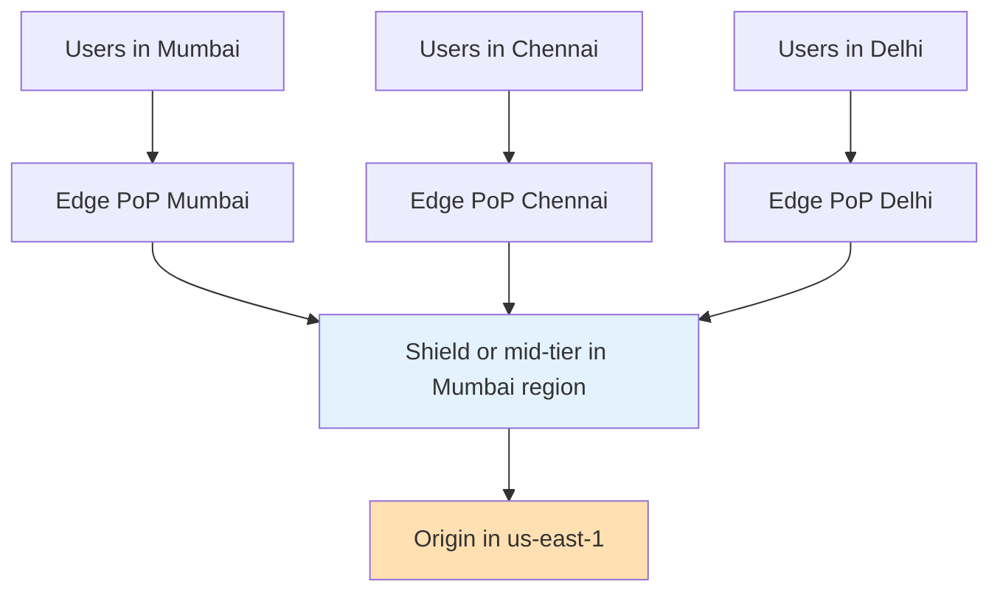
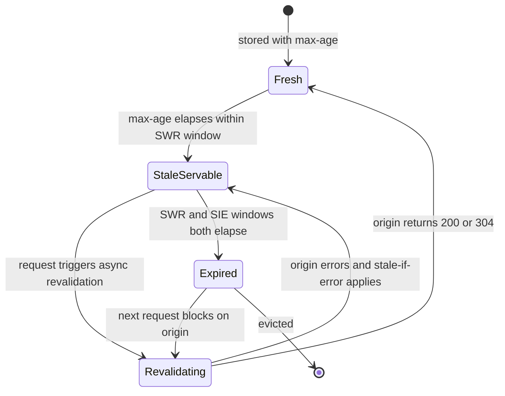
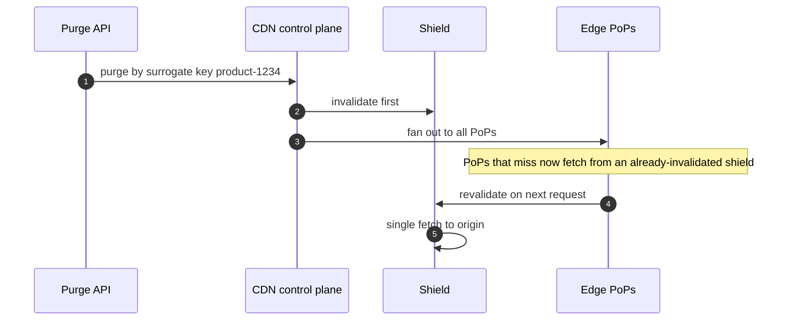
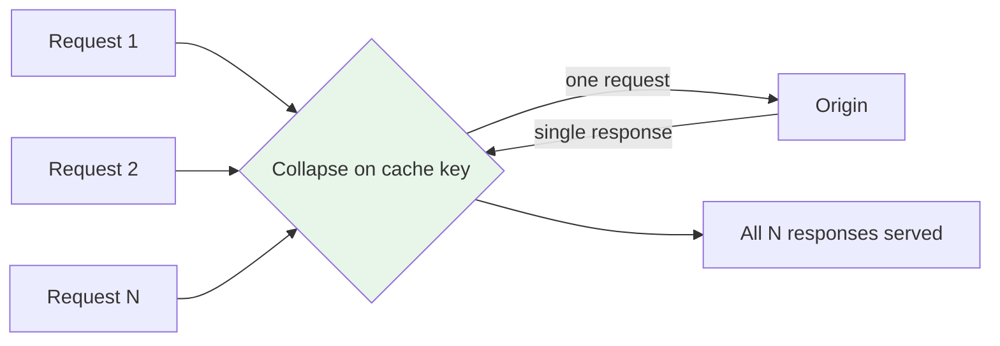
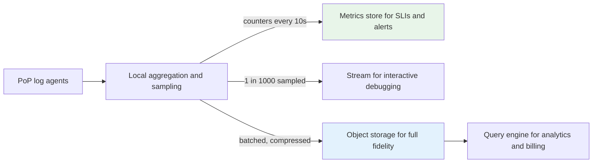
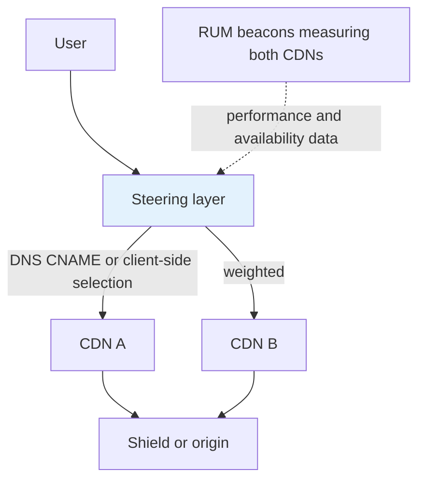

# F05 — CDN & Edge

**A CDN is a globally distributed cache whose real product is RTT reduction and origin offload; nearly every CDN incident traces back to a cache key you did not intend, a TTL you did not control, or a purge you assumed was instant.**

## The Two Things a CDN Actually Buys You

$$
\text{Origin RPS} = R_{\text{total}} \times (1 - h) \qquad\qquad \text{Offload} = h
$$

$$
\text{Latency}_{\text{hit}} \approx RTT_{\text{edge}} \qquad \text{Latency}_{\text{miss}} \approx RTT_{\text{edge}} + RTT_{\text{mid}} + RTT_{\text{origin}} + T_{\text{origin}}
$$

| Hit ratio | Origin RPS at 100k total | Reduction vs previous row |
| --- | --- | --- |
| 0% | 100,000 | — |
| 50% | 50,000 | 2x |
| 90% | 10,000 | 5x |
| 95% | 5,000 | 2x |
| 99% | 1,000 | 5x |
| 99.5% | 500 | 2x |

!!! note "Hit ratio improvements are hyperbolic, not linear"
    Going from 50% to 90% removes 40 points of traffic and cuts origin load 5x. Going from 95% to 99% removes only 4 points but *also* cuts origin load 5x. Once you are above 90%, every fractional point is worth as much as the previous ten. This is why cache key hygiene matters so much more than it looks like it should.

---

## PoP Hierarchy and Tiered Caching



Without a shield, $N$ edge PoPs each miss independently on a cold object, so the origin sees $N$ requests. With 300 PoPs and a purge of a popular object, that is a 300x amplification. A shield tier collapses this: edges miss to the shield, the shield misses once to origin.

| Tier | Count | Cache size per node | Typical object hit ratio | Job |
| --- | --- | --- | --- | --- |
| Edge PoP | 100–300+ | 1–20 TB SSD | 85–95% for hot content | Terminate TLS, serve hot objects, absorb DDoS |
| Regional / mid-tier | 5–30 | 50–500 TB | 40–70% of edge misses | Aggregate the long tail, shield origin |
| Shield (origin shield) | 1–3 | Same as mid-tier | Collapse remaining misses | Single logical origin-facing cache |
| Origin | 1 per region | — | — | Source of truth |

$$
\text{Effective offload} = 1 - (1-h_{\text{edge}})(1-h_{\text{mid}})(1-h_{\text{shield}})
$$

With $h_{\text{edge}}=0.90$, $h_{\text{mid}}=0.60$, $h_{\text{shield}}=0.50$: offload $= 1 - 0.10 \times 0.40 \times 0.50 = 0.98$. The tiers compound multiplicatively, which is why 98% total offload is achievable even though no single tier is that good.

| Trade-off of adding a shield tier | Effect |
| --- | --- |
| Origin load | Down 5–20x |
| Miss latency | Up by one extra hop, typically 10–40 ms |
| Long-tail hit ratio | Up substantially — the tail is spread thin at the edge but dense at the mid-tier |
| Blast radius | **Shield becomes a new SPOF for cache misses**; needs its own redundancy |
| Purge complexity | Purge must reach all tiers, and edge-before-shield ordering causes re-population of stale data |

!!! gotcha "Purging edges before the shield re-populates them with the stale object"
    **Symptom:** you purge an object, verify it is gone, and within seconds the old content is back at the edges. **Mechanism:** the purge reached the edge PoPs first; a user request then missed at the edge and fetched from the shield, which still held the stale copy. **Mitigation:** purge propagation must be shield-first (or atomic across tiers). Most commercial CDNs handle this internally — but if you have built your own tiering, or you are using a mid-tier the CDN does not know about, you own the ordering. **Detection:** `Age` header on the "new" response showing a value larger than the time since purge.

---

## Cache Key Normalization

The cache key is the single highest-leverage thing you control. Default keys are usually `(scheme, host, path, full query string)` — and the full query string is a disaster.

| Query param class | Example | Should be in the key? |
| --- | --- | --- |
| Content-determining | `?size=large`, `?page=3` | Yes |
| Analytics / attribution | `utm_source`, `gclid`, `fbclid`, `mc_eid` | **No** — strip |
| Cache busters from clients | `?_=1712345678`, `?v=random` | No — strip, or you have a 0% hit ratio |
| Session or user identifiers | `?sid=`, `?token=` | No in the key; validate separately |
| Ordering-sensitive duplicates | `?a=1&b=2` vs `?b=2&a=1` | Sort params so they collide correctly |
| Case variants | `?Size=Large` vs `?size=large` | Normalize case for both key and value where semantics allow |

$$
\text{Distinct keys} = \prod_{i} |V_i| \quad\text{over every parameter } i \text{ in the key}
$$

One unnormalized `utm_source` with 50 values multiplies your key space by 50 and divides your hit ratio accordingly. Three such parameters and your cache is effectively disabled.

```nginx
# Explicit allowlist beats any denylist: unknown params are dropped from the key,
# so a new tracking parameter cannot silently destroy the hit ratio.
map $args $normalized_args {
    default          "";
    "~*(^|&)(size=[^&]*)"  $2;
}

proxy_cache_key "$scheme$host$uri$normalized_args";
```

### Vary header explosion

`Vary` multiplies cache entries by the cardinality of every listed header's *observed values*.

| `Vary` value | Distinct values seen in the wild | Effect on cache entries |
| --- | --- | --- |
| `Accept-Encoding` | 3–5 after normalization (`gzip`, `br`, none) | Acceptable and necessary |
| `Accept-Encoding` unnormalized | Hundreds (`gzip, deflate, br;q=1.0, *;q=0.5` variants) | Severe fragmentation |
| `Accept-Language` | Hundreds to thousands | Severe |
| `User-Agent` | **Millions** | Cache is destroyed; effectively 0% hit ratio |
| `Cookie` | Unbounded | Cache is destroyed |
| `Origin` (for CORS) | One per calling origin | Usually fine, but audit it |
| `Vary: *` | Uncacheable by definition | Never cache |

!!! danger "`Vary: User-Agent` is a cache-disabling directive"
    There are millions of distinct UA strings in circulation. Any response carrying `Vary: User-Agent` will essentially never be served from cache. It is almost always emitted accidentally — by a device-detection middleware, a compression module, or a framework's default. Audit your response headers at the origin, not in a browser, because the browser only shows you *your* UA. If you genuinely need device-class variation, normalize into a small enumerated header (`X-Device-Class: mobile|tablet|desktop`) at the edge and vary on that.

Most CDNs normalize `Accept-Encoding` internally to a small set. Verify that yours does, and verify it after every configuration change, because a custom cache key configuration often disables the built-in normalization.

---

## Freshness: TTL, `stale-while-revalidate`, `stale-if-error`



```text
Cache-Control: public, max-age=60, stale-while-revalidate=600, stale-if-error=86400
```

| Directive | Meaning | User-visible effect |
| --- | --- | --- |
| `max-age=60` | Fresh for 60 s | Instant serve |
| `s-maxage=300` | Overrides `max-age` for shared caches only | Longer at the CDN, shorter in the browser |
| `stale-while-revalidate=600` | For 600 s past expiry, serve stale immediately and refresh in the background | **Zero user-visible miss latency** for the entire window |
| `stale-if-error=86400` | If origin returns 5xx or is unreachable, serve stale for up to 24 h | Origin outage becomes invisible for cached content |
| `must-revalidate` | Disables stale serving on expiry | Use only when correctness demands it |
| `immutable` | Client must not revalidate even on reload | Correct for versioned/fingerprinted assets |
| `private` | Browser only, never a shared cache | Personalized responses |
| `no-cache` | May store, **must** revalidate before use | Not the same as `no-store` |
| `no-store` | Must not persist anywhere | Genuinely sensitive data |

!!! tip "`stale-if-error` is the cheapest availability improvement you can buy"
    A generous `stale-if-error` (hours to a day) converts a complete origin outage into "the site works but content is a bit old" for every cached URL. This single header has saved more availability SLOs than most failover architectures. Pair it with a long `stale-while-revalidate` so the freshness cost during normal operation is zero.

!!! gotcha "Separating `max-age` from `s-maxage` is what lets you have short CDN TTLs without hammering the browser cache"
    A common mistake is setting one short `max-age` for everything, which makes browsers revalidate constantly, generating request volume you did not need and cannot cache. Use `s-maxage` for the CDN (short, so you can update content) and `max-age` for the browser (also short for HTML, very long plus `immutable` for fingerprinted assets). They serve different purposes and should almost never be the same value.

### The two-tier content model

| Content type | URL strategy | `Cache-Control` | Purge needed? |
| --- | --- | --- | --- |
| Fingerprinted assets (`app.a3f9c2.js`) | Content hash in the filename | `public, max-age=31536000, immutable` | Never — new content means a new URL |
| HTML entry point | Stable URL | `public, max-age=0, s-maxage=60, stale-while-revalidate=600, stale-if-error=86400` | Sometimes |
| API responses (public) | Stable URL | `public, s-maxage=10, stale-while-revalidate=60` | Rarely |
| API responses (personalized) | Stable URL | `private, no-store` or edge-keyed on auth identity | n/a |
| User-uploaded media | Content-addressed | `public, max-age=31536000, immutable` | Never |

The strategic point: **versioned URLs make purge unnecessary.** Every purge you need is a design smell about your URL scheme.

---

## Purge Propagation

| Model | Propagation time | Cost | Correctness |
| --- | --- | --- | --- |
| Versioned/immutable URLs | Instant (new URL, no purge) | Free | Perfect |
| Single-URL purge | 150 ms – 5 s at major CDNs | Cheap, rate limited | Good |
| Surrogate key / cache tag purge | Similar, but one call invalidates thousands of objects | Requires tagging discipline at origin | Excellent for relational invalidation |
| Wildcard / path-prefix purge | Seconds to minutes | Often rate limited to a handful per minute | Coarse |
| Purge everything | Minutes, and a **guaranteed origin thundering herd** | Free to issue, catastrophic to absorb | Last resort |
| Soft purge (mark stale, keep for SIE) | Same speed | Same | Best of both: revalidates but retains a fallback |



### Surrogate keys are the right abstraction

```text
# Origin response for /product/1234
Surrogate-Key: product-1234 category-shoes brand-acme homepage-featured
Surrogate-Control: max-age=3600
Cache-Control: public, max-age=60
```

Now a price change on product 1234 purges `product-1234`; a brand-wide rebrand purges `brand-acme`; the homepage feature rotation purges `homepage-featured`. Without surrogate keys you must enumerate every URL that embedded that product — which you cannot do reliably.

!!! gotcha "`Surrogate-Control` is stripped by the CDN, `Cache-Control` is not"
    `Surrogate-Control` (and `Surrogate-Key`) are consumed and removed by the CDN, so the browser never sees them. `Cache-Control` passes through to the browser. This means you can give the CDN a one-hour TTL while telling browsers one minute — but it also means that if you forget `Cache-Control` entirely, browsers apply heuristic caching (typically 10% of the `Last-Modified` age) and you get unpredictable client-side staleness you cannot purge. Always set both explicitly.

!!! danger "`purge everything` is an origin outage you scheduled"
    **Symptom:** the site goes down 30 seconds after an emergency global purge. **Mechanism:** every edge PoP and the shield lose all objects simultaneously. Origin RPS jumps from $R(1-h)$ to $R$ — a 10–50x spike — plus the fan-out multiplier of every PoP missing independently. The origin, sized for 2–5% of traffic, dies instantly. **Mitigation:** use surrogate keys to scope invalidation, use soft purge so `stale-if-error` still covers you, ensure request collapsing is enabled at every tier, and if you truly must purge everything, do it progressively by region with the origin's autoscaling pre-warmed. **Detection:** origin RPS and 5xx spiking within seconds of a purge API call — correlate purge events into your dashboards as annotations.

---

## Origin Protection and Collapsed Forwarding

**Request collapsing** (also: request coalescing, `proxy_cache_lock`) means that when $M$ concurrent requests miss on the same key, only one goes to origin and the rest wait for that result.



```nginx
proxy_cache_lock on;
proxy_cache_lock_timeout 5s;       # if the leader is slow, others go to origin after 5s
proxy_cache_lock_age 5s;           # or retry the lock
proxy_cache_use_stale error timeout updating http_500 http_502 http_503 http_504;
proxy_cache_background_update on;  # serve stale, refresh behind the scenes
proxy_cache_revalidate on;         # use If-Modified-Since / If-None-Match on refresh
```

The layered origin protection stack, in order:

1. **Request collapsing** at every tier — turns $M$ concurrent misses into 1.
2. **Shield tier** — turns $N$ PoP misses into 1.
3. **`stale-while-revalidate`** — turns a blocking miss into a background refresh.
4. **`stale-if-error`** — turns an origin failure into a stale hit.
5. **Rate limiting at the edge** toward origin — a hard ceiling on origin RPS.
6. **Origin-side load shedding** — the last line, returns `503` with `Retry-After` fast rather than queueing.

!!! gotcha "Request collapsing does not help when the cache key differs per request"
    **Symptom:** origin is overwhelmed by a hot object despite collapsing being enabled. **Mechanism:** collapsing keys on the *cache key*. If a tracking parameter, a `Vary`ed header, or a range request makes each request's key unique, there is nothing to collapse. Range requests are the subtle one: `Range: bytes=0-1023` and `bytes=1024-2047` are different keys unless the CDN does range-aware caching with segment fetching. **Mitigation:** fix the cache key first — collapsing is downstream of normalization. For large media, ensure the CDN is configured for segmented/range caching so it fetches fixed-size blocks rather than proxying arbitrary ranges.

---

## TLS Termination at the Edge

The edge terminating TLS is where your latency win comes from — the expensive handshake happens over a 10 ms RTT instead of a 200 ms one — and it is also where your certificate operational burden lives.

| Concern | Detail |
| --- | --- |
| Handshake savings | TLS 1.3 full handshake at 200 ms RTT costs 400 ms; at a 10 ms edge it costs 20 ms. The edge-to-origin leg reuses a warm, pooled, long-lived connection |
| Certificate scale | A CDN serving 50,000 customer domains cannot put them all in one cert; it uses SNI-based selection with many certs, or SAN certs of up to ~100 names |
| Renewal | Let's Encrypt issues 90-day certs; standard practice renews at 30 days remaining. Rate limits: 50 certificates per registered domain per week, 5 duplicate certs per week |
| Distribution | A new cert must reach every PoP before it can be served. Propagation is minutes; a cert that renews and fails to distribute is a global outage for that hostname |
| Private key handling | Keyless SSL / remote signing keeps the private key at the origin and has the edge perform an RPC for the signing operation — costs an RTT per full handshake but means the CDN never holds the key |
| OCSP | OCSP stapling at the edge avoids a client-side OCSP fetch; a stale or failed staple can cause hard failures with `must-staple` certs |
| mTLS to origin | The edge should authenticate itself to the origin so origin is not open to the internet. Client cert plus IP allowlist plus a shared secret header |
| ECH / ESNI | Encrypted Client Hello hides SNI; requires DNS `HTTPS` records to carry the config, coupling your DNS and TLS control planes |

!!! gotcha "Certificate renewal succeeds but distribution fails, and you find out at expiry"
    **Symptom:** a hostname starts failing TLS globally at a precise timestamp. Monitoring shows renewal succeeded weeks ago. **Mechanism:** the renewal issued a new certificate, but the push to the PoPs failed or was partial, and the PoPs kept serving the old cert until it expired. **Mitigation:** monitor the certificate **as served by the edge**, from multiple external vantage points, not the certificate in your issuance system. Alert on `NotAfter - now < 14 days` measured from a real TLS handshake against the public endpoint.

---

## Signed URLs and Tokens

| Mechanism | Where validated | Revocable? | Leaks in logs/referrer? | Best for |
| --- | --- | --- | --- | --- |
| Signed URL (HMAC of path plus expiry) | Edge, no origin call | Only by rotating the key | **Yes — the whole token is in the URL** | Short-lived media links |
| Signed cookie | Edge | Rotate key, or short expiry | Not in the URL | A session's worth of assets under a path |
| Token in `Authorization` header | Edge or origin | Yes, if checked against a store | No | APIs |
| Origin auth callback (`auth_request`) | Origin per request | Yes, immediately | No | Low-volume, high-value content |
| IP-bound signed URL | Edge | Same as signed URL | Yes, but useless to another IP | Mitigates link sharing; breaks for mobile IP changes and CGNAT |

```python
import base64, hashlib, hmac, time

def sign_url(path: str, secret: bytes, ttl_seconds: int = 300) -> str:
    """Edge-verifiable signature. No origin round trip, so it must be self-contained."""
    expires = int(time.time()) + ttl_seconds
    payload = f"{path}:{expires}".encode()
    sig = base64.urlsafe_b64encode(
        hmac.new(secret, payload, hashlib.sha256).digest()
    ).decode().rstrip("=")
    return f"{path}?expires={expires}&sig={sig}"
```

!!! gotcha "Signed URLs bake the token into the cache key and shatter your hit ratio"
    **Symptom:** a media library shows a 5% hit ratio despite serving the same few thousand files. **Mechanism:** the signature and expiry are query parameters, so every user gets a unique URL and therefore a unique cache key. Every request is a miss. **Mitigation:** exclude the signature parameters from the cache key while still *validating* them at the edge — every major CDN supports this separation (validate then normalize). If your edge cannot do that, move the token to a cookie or a header and vary on nothing.

!!! warning "Short expiries and clock skew"
    A 60-second signed URL fails for any client whose clock is off by more than a minute, and for any request that sat in a retry queue. Use 5–15 minute expiries, validate against the *edge's* clock (which is NTP-disciplined), and return a distinguishable status (`403` with a specific body) so clients can re-request a fresh URL rather than treating it as a hard failure.

---

## Edge Compute: What Fits and What Does Not

| Platform | Runtime | CPU limit | Memory | Cold start | Can call origin? |
| --- | --- | --- | --- | --- | --- |
| CloudFront Functions | JS, restricted | ~1 ms | 2 MB | None (no isolate spin-up) | No |
| Lambda@Edge viewer request/response | Node, Python | 5 s | 128 MB | 10s–100s ms | Viewer: no; origin: yes |
| Lambda@Edge origin request/response | Node, Python | 30 s | up to 10 GB | Same | Yes |
| Cloudflare Workers | V8 isolates, JS/WASM | 10–50 ms CPU (wall clock is not counted the same way); higher on unbound plans | 128 MB | ~0–5 ms (isolates, not containers) | Yes |
| Fastly Compute | WASM (Rust, JS, Go) | Milliseconds | Configurable, tens of MB | Microseconds | Yes |
| Deno Deploy / others | V8 isolates | Tens of ms | 128–512 MB | ~ms | Yes |

**What belongs at the edge:**

- Request routing, A/B bucketing, and header rewriting.
- Cache key normalization and `Vary` collapsing.
- Auth token *validation* (signature check against a public key or shared secret) — not token *issuance*.
- Geo/device-based personalization of a small response fragment.
- Redirects, bot fingerprinting, WAF-lite rules.
- Response assembly from cached fragments (ESI-style).

**What does not:**

- Anything requiring a database read — you have just added an RTT from the edge to your database region, which is *worse* than going to origin directly.
- Anything requiring strong consistency or coordination across PoPs.
- Long-running or CPU-heavy work (image transcoding at 200 PoPs is 200 sets of cold caches).
- Anything holding secrets that must not be replicated to hundreds of locations.

!!! gotcha "Edge compute that reads a centralized database is slower than no edge compute"
    **Symptom:** you move personalization logic to the edge and p99 gets worse. **Mechanism:** the edge is 10 ms from the user but 180 ms from your database in `us-east-1`. A request now pays user→edge (10 ms) + edge→DB (180 ms) + DB→edge + edge→user, versus a single user→origin round trip of 200 ms that could pipeline multiple queries locally. Worse, the edge cannot pool connections efficiently across hundreds of PoPs. **Mitigation:** only run edge logic against edge-replicated state (Workers KV, Durable Objects, Fastly Config Store, or a signed token carrying the data). If it needs your primary database, it belongs at the origin.

!!! gotcha "Edge KV stores are eventually consistent with propagation measured in seconds to a minute"
    **Symptom:** a feature flag flipped at the edge takes effect in some regions and not others for up to a minute, producing inconsistent user experiences and confusing A/B results. **Mechanism:** edge key-value stores replicate asynchronously to hundreds of PoPs; write-to-global-read consistency is typically "within 60 seconds", and reads are cached at the PoP for an additional TTL. **Mitigation:** design flags to be safe under skew (no flag combination should be invalid), never use edge KV for anything requiring read-your-writes, and use a strongly-consistent primitive (Durable Objects, or origin) when you genuinely need it.

---

## Log Collection from Thousands of PoPs

At 1M RPS with a 400-byte log line:

$$
1{,}000{,}000 \times 400\ \text{B/s} = 400\ \text{MB/s} = 34.5\ \text{TB/day} \approx 1\ \text{PB/month}
$$

| Approach | Latency to query | Cost | Fidelity | Use |
| --- | --- | --- | --- | --- |
| Real-time streaming (Kinesis/Kafka/HTTP endpoint) | Seconds | Highest | 100% | Security, live debugging, rate limit feeds |
| Batched delivery to object storage | 1–15 min | Moderate | 100% | Analytics, billing, forensics |
| Sampled streaming (1:100 or 1:1000) | Seconds | Low | Statistical | Dashboards, trend detection |
| Aggregated counters pushed from PoP | 10–60 s | Very low | Aggregate only | SLIs, alerting, autoscaling signals |
| Per-PoP local retention with pull-on-demand | Minutes to hours | Lowest | 100%, but only recently | Incident forensics |

The correct architecture is **all of the above simultaneously**: aggregated counters at 10 s for alerting, sampled real-time for interactive debugging, and full batched logs to object storage for anything that needs completeness.



!!! gotcha "PoP clock skew makes time-ordered log analysis lie to you"
    **Symptom:** an incident timeline shows effects preceding causes, and per-minute rate calculations show impossible spikes and troughs. **Mechanism:** hundreds of PoPs with independently disciplined clocks; even with good NTP, tens of milliseconds of skew is normal and a broken NTP source at one PoP can drift seconds. Logs are also *delivered* out of order with variable batching delay. **Mitigation:** record both the PoP timestamp and the collector's ingest timestamp, use the ingest timestamp for windowing and the PoP timestamp for per-request analysis, and monitor per-PoP clock offset as an SLI. Never build alerting on a tumbling window narrower than your worst-case delivery delay.

!!! gotcha "Log delivery backpressure silently drops the logs you need most during an incident"
    **Symptom:** during a large traffic spike, the logs for the spike itself are missing or thinned. **Mechanism:** log volume is proportional to traffic; when traffic spikes 10x, so does log volume, and the delivery pipeline's buffers overflow. Most PoP agents drop rather than block (correctly — blocking would take down serving). **Mitigation:** size the pipeline for peak, not average; make sampling rates *adaptive* so fidelity degrades gracefully instead of cliff-edging; and keep the aggregated-counter path completely separate from the full-log path so your SLIs survive even when logs do not.

---

## CDN Failover and Multi-CDN



| Steering mechanism | Failover speed | Granularity | Complexity |
| --- | --- | --- | --- |
| DNS CNAME swap (manual) | TTL-bound, minutes to an hour | All or nothing | Low |
| GSLB with health checks | Health interval plus TTL | Per-region | Medium |
| Managed multi-CDN switching service | Seconds to a minute | Per-region, per-object-class, RUM-driven | Medium, plus a vendor |
| Client-side selection with a manifest | Immediate, per-request | Per-request, per-object | High — requires client code and a way to update it |
| Client-side retry to a fallback hostname | Immediate for the failed request | Per-request | Medium; must not double-count as errors |

The costs of multi-CDN are consistently underestimated:

- **Hit ratio is split.** Two CDNs at 50/50 means each sees half the traffic, so each has a colder cache. Expect 2–5 points of hit ratio loss, which shows up as origin load.
- **Feature parity is the lowest common denominator.** Surrogate keys, edge compute, cache key rules, and purge semantics all differ. You end up using only what both support.
- **Purge must fan out to both**, and they will not complete at the same time, so there is a window of inconsistency where users get different content depending on which CDN they hit.
- **Two sets of certificates, two sets of logs, two config pipelines, two vendor relationships.** The operational burden roughly doubles; it does not amortize.
- **Testing failover is the hard part.** A multi-CDN setup you have never actually failed over is a multi-CDN setup that does not work.

!!! tip "Active-active beats active-passive for CDN"
    Keep a meaningful floor of traffic (10–20% minimum) on the secondary CDN at all times. A passive CDN has a cold cache, unexercised configuration, and expired certificates you have not noticed. When you fail over to it, you get a cold-cache origin stampede on top of whatever incident made you fail over. Continuously exercised capacity is the only capacity you can trust.

---

## Gotchas & Corner Cases

!!! gotcha "One unstripped tracking parameter collapses your hit ratio"
    **Symptom:** hit ratio drops from 94% to 60% after a marketing campaign launch, with no code change. **Mechanism:** the campaign appends `utm_source`, `utm_campaign`, and `gclid` to shared links. Each distinct combination is a distinct cache key. A campaign with 30 source values and 10 campaign values creates 300 cache entries per URL. **Mitigation:** allowlist query parameters in the cache key rather than denylisting — a denylist cannot anticipate the next tracking parameter someone invents. Alert on hit ratio, and alert on *cache key cardinality* per path, which catches it before the hit ratio moves. **Detection:** group your CDN logs by path and count distinct full URLs; a ratio far above 1 is the fingerprint.

!!! gotcha "`Set-Cookie` on a response makes it uncacheable, and one endpoint can poison an entire path"
    **Symptom:** a page that should be cached shows a 0% hit ratio, only in production. **Mechanism:** a middleware (session, CSRF, analytics, A/B framework) emits `Set-Cookie` on every response. Most CDNs refuse to cache any response carrying `Set-Cookie`, correctly, because it is by definition per-user. **Mitigation:** do not set session cookies on cacheable routes; if a framework insists, strip `Set-Cookie` at the edge for known-public paths *only after verifying the response truly contains no per-user data*. Getting this wrong caches one user's session cookie and serves it to everyone — a catastrophic and well-documented class of incident.

!!! gotcha "Caching a personalized response is a data breach, not a bug"
    **Symptom:** users report seeing other users' names, carts, or account data. **Mechanism:** an endpoint returned `Cache-Control: public` (or omitted it and the CDN applied a default TTL) while containing per-user data. The first user's response is now served to everyone. **Mitigation:** default to `private, no-store` at the origin and explicitly opt routes into public caching, never the reverse. Add an edge rule that refuses to cache any response containing an `Authorization` request header or a session cookie unless explicitly allowlisted. Treat "is this response cacheable" as a security review item.

!!! gotcha "The CDN applies a default TTL to responses with no `Cache-Control`"
    **Symptom:** an API endpoint you never intended to cache serves stale data for hours. **Mechanism:** most CDNs have a default TTL (commonly 1 hour, sometimes 2 days for static extensions) applied when the origin sends no explicit caching headers. Silence is not "do not cache" — it is "use my default." **Mitigation:** set explicit `Cache-Control` on **every** response at the origin. Configure the CDN's default TTL to 0 so that any missing header becomes a visible bug rather than a silent stale-data incident.

!!! gotcha "Compression before caching versus after changes what `Vary` you need"
    **Symptom:** clients that do not support Brotli receive Brotli-encoded bytes and fail to render, or hit ratio halves. **Mechanism:** if the CDN caches the compressed representation, it must `Vary: Accept-Encoding` and store one entry per encoding. If it caches the uncompressed original and compresses on the fly, it does not need to vary but burns CPU per request. Misconfiguration between these two modes — for example, origin sends Brotli, CDN caches it without varying — serves the wrong encoding. **Mitigation:** decide explicitly. Let the CDN compress from a single cached original where possible; ensure `Vary: Accept-Encoding` is present whenever compressed representations are stored.

!!! gotcha "`Age` and `Date` headers reveal a stale object you thought you purged"
    **Symptom:** you cannot tell whether users are getting new content. **Mechanism:** `Age` is the seconds the object has been in caches; a response with `Age: 4300` and a 3600 s `max-age` was served stale. This is the fastest diagnostic available and it is routinely ignored. **Mitigation:** always inspect `Age`, `X-Cache`/`CF-Cache-Status`/`X-Served-By`, and `Date` when validating a purge. Automate a post-purge verification probe from several regions rather than trusting the purge API's 200 response.

!!! gotcha "Range requests and byte-range caching multiply origin load for large media"
    **Symptom:** a 2 GB video file generates thousands of origin requests despite being "cached." **Mechanism:** players issue `Range` requests for small chunks. Without range-aware caching, each distinct range is a distinct key, and each is a separate origin fetch of that byte range. With hundreds of concurrent viewers seeking around, you get an origin request storm. **Mitigation:** enable segmented/block-level caching (Akamai's partial object caching, CloudFront's origin fetch of full objects, NGINX `slice` module) so the CDN fetches fixed-size aligned blocks it can reuse across arbitrary client ranges. Serve HLS/DASH segments as individual objects rather than relying on ranges into a monolithic file.

!!! gotcha "Origin shield in the wrong region adds latency for every miss globally"
    **Symptom:** miss latency for European users is 400 ms worse than expected. **Mechanism:** the shield was configured in `us-east-1` for an origin that is actually multi-region. A European edge miss now travels Europe → US shield → European origin, crossing the Atlantic twice. **Mitigation:** the shield must be co-located with the origin it protects; with a multi-region origin you need a shield per region and steering that pairs them correctly. **Detection:** compare miss latency by client region against the geographic distance to the shield, not to the origin.

!!! gotcha "Cache stampede on a hot key survives request collapsing across tiers if the tiers do not share the lock"
    **Symptom:** origin sees a burst of $N$ identical requests, where $N$ is the number of PoPs, at the exact instant a popular object expires. **Mechanism:** each PoP collapses its own concurrent requests to one, but the PoPs do not coordinate with each other. Without a shield, $N$ PoPs each send one request — collapsed locally, uncollapsed globally. **Mitigation:** a shield tier is the structural answer. Additionally, add TTL jitter — randomize `max-age` by ±10% per object or per PoP — so hot objects across the fleet do not expire in lockstep. `stale-while-revalidate` also converts the synchronized blocking storm into asynchronous background refreshes.

!!! gotcha "Cache hit ratio measured by request count hides the byte-level economics"
    **Symptom:** a 95% request hit ratio, yet origin egress cost is far higher than expected. **Mechanism:** the 5% of misses are the large objects — video segments, large images, downloads — while the 95% of hits are small API responses and thumbnails. Byte hit ratio might be 60%. **Mitigation:** track *both* request hit ratio (which drives origin RPS and latency) and byte hit ratio (which drives egress cost). They are optimized differently: request hit ratio by key normalization, byte hit ratio by cache sizing and eviction policy for large objects.

!!! gotcha "Purging by URL misses the variants"
    **Symptom:** you purge `/image.jpg` and some users still get the old image. **Mechanism:** if the object varies on `Accept-Encoding` or is stored as multiple derivative sizes under the same logical URL, a single-URL purge may only remove one variant, depending on the CDN. **Mitigation:** use surrogate keys — they invalidate all variants tagged with the key regardless of the cache key. If you must purge by URL, verify your CDN's variant semantics explicitly; they differ between vendors.

!!! gotcha "Multi-CDN halves each CDN's cache warmth and you pay for it at the origin"
    **Symptom:** after adding a second CDN at 50/50, origin RPS goes up ~2x rather than staying flat. **Mechanism:** each CDN's cache now sees half the request stream, so long-tail objects that used to reach the popularity threshold for caching at one CDN now reach it at neither. The effect is superlinear for Zipf-distributed content. **Mitigation:** put a shared shield tier *behind* both CDNs so the tail is aggregated in one place, or skew the split heavily (85/15) so the primary retains warmth while the secondary stays exercised.

---

## SRE Lens

### SLIs and SLOs

| SLI | Definition | Target shape |
| --- | --- | --- |
| Edge availability | Non-5xx generated by the edge / total requests | 99.99%+; separate edge-origin errors from origin-origin errors |
| Cache hit ratio (requests) | Hits / (hits + misses), per content class | Alert on a relative drop, not an absolute value — 94% to 88% matters even though 88% sounds fine |
| Byte hit ratio | Hit bytes / total bytes | Drives egress cost; track separately |
| Origin offload | 1 minus origin RPS over total RPS | The number your capacity plan depends on |
| Edge p50/p99 latency | TTFB measured at the edge, split by hit and miss | Miss p99 exposes origin and shield health |
| Purge propagation time | Purge API call to verified-gone at N vantage points | p99 under 10 s for single-URL purges |
| Certificate validity as served | `NotAfter` from a real handshake at the public endpoint | Alert at 14 days, page at 7 |
| Origin error rate seen by edge | 5xx from origin / origin requests | Feeds `stale-if-error` effectiveness |

### Failure modes and detection

| Failure | Signal | First response |
| --- | --- | --- |
| Cache key explosion | Hit ratio drop with flat traffic; distinct-URL-per-path ratio rising | Audit recent config or marketing changes |
| Origin overload from purge | Origin RPS spike correlated with a purge event | Stop purging, verify collapsing and shield, serve stale |
| PoP-level failure | Error rate elevated for one PoP or one region only | Confirm with per-PoP breakdown; the CDN should drain it, verify it did |
| Origin outage | Origin 5xx up, edge availability *held up by* `stale-if-error` | Confirm SIE is covering; the SLI to watch is uncached-path error rate |
| Certificate not distributed | External TLS probe failing while issuance system says healthy | Re-push cert; escalate to the vendor |
| Log pipeline backpressure | Log delivery lag rising, sample rate auto-reducing | Confirm the aggregated-counter path is unaffected so SLIs are still valid |
| Edge compute error | Edge function error rate; often surfaces as 5xx with no origin request | Roll back the function; it is a deploy, treat it as one |

### Rollout and migration risk

- **Cache key changes invalidate the entire cache by construction.** Changing the key means every existing entry is unreachable — functionally identical to `purge everything`. Roll out cache key changes during low traffic, with origin capacity pre-scaled, and ideally region by region.
- **TTL increases are safe; TTL decreases are an origin load event.** Halving a TTL roughly doubles origin RPS for that content class. Model it before shipping it.
- **Enabling a shield tier changes the origin's client population** from hundreds of PoPs to a handful of shield nodes. Origin connection pools, rate limits, and IP allowlists all need updating first, or you will block your own shield.
- **Edge compute is a global deploy with no per-region rollback in some platforms.** Verify the rollback mechanism and its propagation time *before* the first production deploy, not during the first incident.
- **Multi-CDN cutover** must account for the cold cache on the target. Ramp over hours, not minutes, and watch origin RPS as the leading indicator.

### Capacity signals

| Signal | Meaning | Action |
| --- | --- | --- |
| Origin RPS approaching provisioned capacity | Offload is degrading | Investigate hit ratio before scaling origin |
| Hit ratio trending down week over week | Content churn, key drift, or catalogue growth | Audit key cardinality; consider larger edge cache or a shield |
| Miss latency p99 rising | Shield or origin degrading | Check the shield tier independently of origin |
| Purge rate rising | URL scheme is not versioned enough | Move toward content-addressed URLs |
| Egress bytes growing faster than requests | Object sizes growing, or byte hit ratio falling | Check large-object caching and range handling |

### Runbook notes

1. Any cache complaint → `curl -I` from multiple regions and read `Age`, `X-Cache`, `Date`, `Cache-Control`, and `Vary` before forming a hypothesis.
2. Origin on fire → the fastest lever is almost always raising TTLs and enabling/extending `stale-if-error`, not scaling the origin. It works in seconds.
3. Never issue `purge everything` during an incident. It is the action most likely to convert a partial problem into a total one.
4. Annotate purge API calls, cache config deploys, and edge function deploys onto the origin dashboards. Most CDN incidents are correlated with a change nobody thought to mention.
5. Keep a documented, tested origin bypass path (a direct hostname, protected by IP allowlist) for when the CDN itself is the incident — and make sure the origin can survive being hit directly for at least a short period.

### Cost implications

- CDN egress is typically 0.01–0.09 USD/GB depending on region and commit; cloud origin egress is usually more expensive than CDN egress, so every point of byte hit ratio is direct savings.
- Origin capacity scales with $(1-h)$. Moving from 90% to 95% hit ratio halves the origin fleet.
- Purge operations are often billed above a free tier, and wildcard/full purges are billed at a premium or rate-limited.
- Edge compute is billed per invocation *and* per CPU-millisecond; a function on every request at 1M RPS is a substantial line item even at fractions of a cent per million.
- Full-fidelity log delivery at petabyte scale frequently costs more than the compute serving the traffic. Sample aggressively and keep the aggregate path cheap and separate.
- Multi-CDN with commit-based pricing means you pay two minimum commits and may miss volume tiers on both. Model the total cost including lost tier discounts, not just the per-GB rates.

---

## Interview Angle

!!! interview "Probe: how would you design caching for this system?"
    **What they want:** cache key reasoning and invalidation strategy, not "put a CDN in front."
    **Strong answer:** starts by classifying content — immutable fingerprinted assets get a one-year `immutable` TTL and never need purging; HTML gets a short `s-maxage` with generous `stale-while-revalidate` and `stale-if-error`; personalized responses are `private, no-store`. Then defines the cache key explicitly with an allowlist of query parameters, discusses `Vary` cardinality, and picks surrogate keys for invalidation. Quantifies the origin offload and the resulting origin capacity requirement.
    **Weak answer:** "Add a CDN with a 1 hour TTL."

!!! interview "Probe: your cache hit ratio dropped from 94% to 70% overnight. Debug it."
    **Follow-ups:** What would you look at first? What if traffic is flat?
    **Strong answer:** cache key cardinality is the first hypothesis — a new query parameter, a new `Vary` header, or a `Set-Cookie` appearing on a previously-cacheable route. Verifies by grouping logs by path and counting distinct full cache keys. Second hypothesis: a TTL change or a deploy that changed response headers. Third: content catalogue growth exceeding cache capacity, which looks different because it affects the long tail rather than hot objects. Mentions that a 24-point drop means origin RPS went from 6% to 30% of total — a 5x increase — so the immediate action is to protect the origin while investigating.
    **Weak answer:** "Check if the CDN is having issues."

!!! interview "Probe: how do you invalidate content across 300 PoPs?"
    **Strong answer:** "Ideally I don't. Content-addressed URLs make invalidation unnecessary and are strictly better. Where I must invalidate, I use surrogate keys so one call invalidates every URL that embedded the changed entity, and soft purge so `stale-if-error` still protects me. Propagation is 150 ms to a few seconds at major CDNs, but ordering matters — the shield must be invalidated before or atomically with the edges, or an edge miss re-populates from a stale shield. And I never purge everything: that removes all offload simultaneously and the origin is sized for 5% of traffic."
    **Weak answer:** "Call the purge API."

!!! interview "Probe: should this logic run at the edge?"
    **Strong answer:** applies the state-locality test. Edge compute is a win when the logic needs only the request itself or edge-replicated state: routing, header rewriting, token signature validation, A/B bucketing, cache key normalization. It is a loss when it needs the primary database, because the edge is far from your data and cannot pool connections across hundreds of PoPs — you have converted one round trip into two. Also raises CPU limits (single-digit to tens of milliseconds), memory limits (128 MB), and the fact that edge KV is eventually consistent over tens of seconds.
    **Weak answer:** "Yes, edge is faster."

!!! interview "Probe: multi-CDN — worth it?"
    **Strong answer:** "It buys availability against a single vendor's control-plane or regional failure, which is a real and recurring risk. But it costs hit ratio because each CDN's cache is colder, it forces you to the feature intersection of both vendors, it doubles the config and cert and log pipelines, and purge becomes non-atomic across vendors. If I do it, I run active-active with a real floor on the secondary — 15–20% — because a passive CDN has a cold cache and unexercised config, and I put a shared shield behind both so the long tail is still aggregated in one place. And I test failover on a schedule, because untested failover is not failover."
    **Weak answer:** "Yes, for redundancy," with no cost model.

---

## Key Takeaways

- Origin load is $R(1-h)$, so hit ratio improvements above 90% are hyperbolically valuable; cache key hygiene is the highest-leverage work available.
- Tiered caching compounds multiplicatively and collapses the $N$-PoP fan-out on cold objects; a shield tier is usually the difference between 90% and 98% offload.
- The cache key is a design artifact, not a default. Allowlist query parameters, normalize `Accept-Encoding`, and treat `Vary: User-Agent` or `Vary: Cookie` as a cache-disabling bug.
- `stale-while-revalidate` removes user-visible miss latency; `stale-if-error` converts an origin outage into stale content. Together they are the cheapest availability improvements available.
- Content-addressed, immutable URLs make purging unnecessary. Every purge you need reflects a URL scheme that could have been better.
- `purge everything` is a self-inflicted origin outage. Use surrogate keys and soft purge instead.
- Request collapsing operates on the cache key, so it cannot help you if the key is wrong. Fix normalization first.
- Edge compute is fast only for logic that needs no centralized state; anything touching your primary database is slower at the edge than at the origin.
- Multi-CDN trades hit ratio, feature richness, and operational simplicity for vendor-failure independence. Run it active-active or it will not work when you need it.

---

## Further Reading

- RFC 9111 — *HTTP Caching* (obsoletes RFC 7234); RFC 9110 for the semantics of conditional requests.
- RFC 5861 — *HTTP Cache-Control Extensions for Stale Content* (`stale-while-revalidate`, `stale-if-error`).
- RFC 8246 — *HTTP Immutable Responses* (the `immutable` directive).
- RFC 9213 — *Targeted HTTP Cache Control* (per-cache-class directives such as `CDN-Cache-Control`).
- Nygren, Sitaraman, Sun — *The Akamai Network: A Platform for High-Performance Internet Applications*, ACM SIGOPS OSR, 2010.
- Maggs, Sitaraman — *Algorithmic Nuggets in Content Delivery*, ACM SIGCOMM CCR, 2015.
- Huang, Berg, Cui, et al. — *An Analysis of Facebook Photo Caching*, SOSP 2013.
- Berger, Sitaraman, Harchol-Balter — *AdaptSize: Orchestrating the Hot Object Memory Cache in a Content Delivery Network*, NSDI 2017.
- Song, Berger, Li, Lloyd — *Learning Relaxed Belady for Content Distribution Network Caching*, NSDI 2020.
- Fastly Blog — *Surrogate keys: part 1 and part 2*, and the instant purge architecture posts.
- Cloudflare Blog — *Tiered Cache Smart Topology*, *Introducing Cache Reserve*, and the Workers isolate architecture posts.
- Netflix Technology Blog — *Open Connect* appliance and content placement posts.
- Google — *Web Fundamentals: HTTP caching* and the `Cache-Control` best-practice guidance.
- Mark Nottingham — *Caching Tutorial* and blog posts on `Vary` and cache key design.
- Steve Souders — *High Performance Web Sites* and *Even Faster Web Sites*, for the origin of the fingerprinted-asset pattern.

---

Related pages: [F01 — Networking Foundations](f01-networking-foundations.md), [F02 — DNS & Global Traffic Management](f02-dns-traffic-management.md), [F03 — Load Balancing](f03-load-balancing.md).
