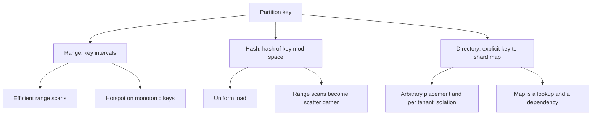
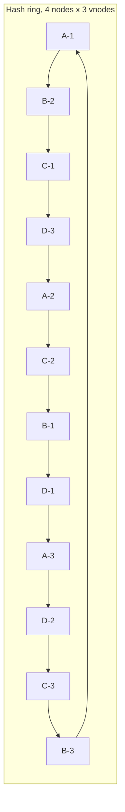
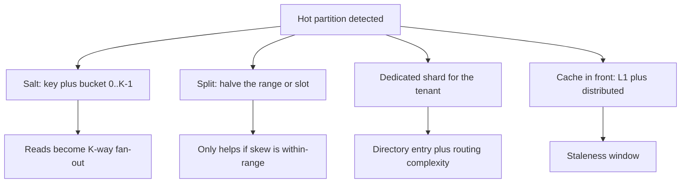
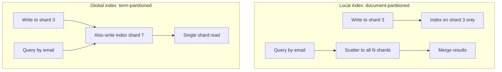
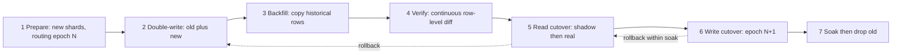

# F06 — Partitioning & Sharding

**Sharding trades one hard problem — a single node's capacity ceiling — for three harder ones: choosing a key you cannot change, moving data while serving traffic, and answering questions that span shards.**

## The Partitioning Decision Tree

You partition for one of four reasons, and the reason dictates the scheme:

| Driver | Symptom | Typical threshold | Scheme it favours |
|---|---|---|---|
| Storage capacity | dataset exceeds a node's disk | > 2–8 TB per node for OLTP | any |
| Write throughput | single-leader write ceiling | > 20–50k writes/s on a relational primary | hash |
| Read throughput | replicas cannot absorb reads | replica lag rising under read load | hash, or read replicas first |
| Blast radius / isolation | one tenant degrades all | noisy-neighbour incidents | directory / dedicated shards |

!!! warning "Sharding is the second-to-last resort"
    Before sharding: better indexes, caching ([F04 — Caching](f04-caching.md)), read replicas, vertical scale to a 128-core / 2 TB RAM instance, archiving cold rows, splitting by *table* (functional partitioning). A modern single Postgres or MySQL primary handles 50k+ TPS and multi-TB datasets. Sharding permanently costs you cross-shard joins, transactions, unique constraints, and `ORDER BY ... LIMIT` — that is a large tax to pay early.

## Range vs Hash vs Directory



| Property | Range | Hash | Directory / lookup |
|---|---|---|---|
| Range scan `WHERE ts BETWEEN` | single partition, sequential | scatter-gather to all N | depends on map |
| Load uniformity | poor without active splitting | excellent for high-cardinality keys | manual/curated |
| Hot spot on monotonic key | severe: all writes to the last partition | none | none |
| Adding capacity | split a range, move half | consistent hashing moves $1/N$ | update map entries |
| Key ordering preserved | yes | no | no |
| Per-tenant isolation | awkward | impossible | native |
| Metadata size | small (range boundaries) | tiny (function) | O(number of keys or key groups) |
| Real systems | HBase, Bigtable, CockroachDB, TiKV, DynamoDB internally | Cassandra, Dynamo, Redis Cluster (slots), Memcached | Vitess keyspace/vindex, Slack/Notion tenant shards, Figma |

!!! tip "Hash the key, then range-partition the hash"
    Bigtable/HBase-style systems get uniformity by storing `md5(user_id)[0:4] + user_id` as the row key: hashing kills the monotonic hotspot while range partitioning over the hash space still allows dynamic splits and merges. DynamoDB does the same internally — partition key is hashed, but partitions are ranges over hash space so they can split. This is why "hash vs range" is often a false dichotomy in modern engines.

!!! gotcha "Time-ordered keys are the classic range-partition trap"
    A `created_at` or auto-increment primary key sends 100% of writes to the highest range. HBase calls it the "region server hotspot", Cassandra calls it a "hot partition". The fix is salting or hash prefixing — but note that it converts every time-range query into a $K$-way scatter-gather, so choose $K$ (8–64) deliberately.

## Consistent Hashing

Modulo hashing (`shard = hash(k) % N`) remaps $\frac{N-1}{N}$ of all keys when $N$ changes — 90% of a 10-node cluster's data moves when you add one node. Consistent hashing places both nodes and keys on a ring of size $2^{32}$ or $2^{64}$; a key belongs to the first node clockwise.



### Why virtual nodes are mandatory

With $N$ nodes placed at uniform random positions, the arc lengths are Exponential-distributed. The expected maximum arc is:

$$
\mathbb{E}[\max \text{arc}] \approx \frac{\ln N}{N} \quad\Longrightarrow\quad \frac{\text{max load}}{\text{mean load}} \approx \ln N
$$

For $N = 100$ that is a node holding roughly **4.6x** the average — one node at 100% CPU while the cluster averages 22%. Virtual nodes fix this by giving each physical node $V$ ring positions, so its share is the sum of $V$ exponential arcs. By concentration, the coefficient of variation of a node's load is:

$$
\mathrm{CV} = \frac{\sigma}{\mu} \approx \frac{1}{\sqrt{V}}, \qquad
\frac{\max}{\mathrm{mean}} \approx 1 + \sqrt{\frac{2\ln N}{V}}
$$

| $V$ (vnodes per node) | CV of load | max/mean at $N=100$ | Ring metadata (N=100) |
|---|---|---|---|
| 1 | ~100% | ~4.6 | 100 entries |
| 16 | 25% | ~1.76 | 1,600 |
| 64 | 12.5% | ~1.38 | 6,400 |
| 128 | 8.8% | ~1.27 | 12,800 |
| 256 | 6.3% | ~1.19 | 25,600 |
| 1024 | 3.1% | ~1.09 | 102,400 |

The trade is metadata size and, critically, **repair/streaming fan-out**: with $V = 256$ and replication factor 3, a single node failure involves ~768 vnode replicas spread across nearly every peer. That is good for repair parallelism and bad for the probability that *some* quorum is affected by any two failures. Cassandra shipped `num_tokens=256` for years and moved the default to **16** for exactly this reason.

!!! gotcha "More vnodes makes correlated-failure data loss more likely"
    **Symptom:** with RF=3 and hundreds of vnodes per node, losing any 3 nodes in a large cluster loses *some* range with near-certainty. **Mechanism:** each node participates in $V$ independent replica sets, so the number of distinct replica-set combinations approaches $\binom{N}{3}$; the chance that a random 3-node failure covers at least one full replica set goes to 1. **Mitigation:** fewer vnodes (8–16), or *replica groups* / copysets that deliberately restrict which nodes can be replicas of each other, trading repair parallelism for a dramatically lower probability of any data loss.

### Consistent hashing with bounded loads

Plain consistent hashing balances *keys*, not *load* — a Zipf request distribution still overloads whichever node owns the hot keys. Mirrokni–Thorup–Zadimoghaddam adds a cap: a node may hold at most $\lceil (1+\varepsilon)\,\bar{L} \rceil$ items; overflow walks clockwise to the next node with capacity.

$$
\text{cap}_i = \left\lceil (1+\varepsilon)\frac{\text{total load}}{N} \right\rceil, \qquad \varepsilon \in [0.1,\ 0.5]
$$

Movement on a node join/leave stays $O(1/\varepsilon)$ per displaced item. HAProxy's `hash-balance-factor` and Envoy's `maglev`/`ring_hash` with bounded load implement this; it is the right default for stateless request routing where "affinity" is a preference, not a requirement.

## Rendezvous and Jump Consistent Hash

=== "Rendezvous (HRW)"

    For key $k$ and every node $n$, compute $h(k, n)$ and pick the maximum.

    ```python
    def hrw(key, nodes):
        return max(nodes, key=lambda n: mmh3.hash64(f"{key}:{n.id}")[0])

    # Weighted rendezvous: honour heterogeneous capacity.
    def hrw_weighted(key, nodes):
        def score(n):
            h = (mmh3.hash64(f"{key}:{n.id}")[0] & 0xFFFFFFFF) / 2**32
            return -n.weight / math.log(h if h > 0 else 1e-12)
        return max(nodes, key=score)
    ```

    Perfectly minimal disruption (only keys owned by the removed node move), no ring state, natural weights, trivially gives you an ordered replica list (top-$R$ scores) — which consistent hashing has to fake with "next R distinct nodes clockwise". Cost is $O(N)$ hashes per lookup: at $N = 1000$ that is ~1000 murmur hashes, roughly 5–10 µs. Use hierarchical/skeleton HRW for $O(\log N)$ if $N$ is large.

=== "Jump consistent hash"

    Lamping and Veach's algorithm: no storage at all, $O(\ln N)$ time, and provably optimal balance.

    ```go
    func Jump(key uint64, buckets int32) int32 {
        var b, j int64 = -1, 0
        for j < int64(buckets) {
            b = j
            key = key*2862933555777941757 + 1
            j = int64(float64(b+1) * (float64(1<<31) / float64((key>>33)+1)))
        }
        return int32(b)
    }
    ```

    Perfect uniformity, ~20 ns per lookup, zero memory. The catch is fatal for many use cases: buckets are numbered $0..n-1$ and you can only add or remove the **highest-numbered** bucket. You cannot remove node 3 out of 10. Use it when shards are logical and abundant (e.g. 4096 logical shards mapped onto physical nodes by a second, mutable map) — never for direct physical node membership.

| Scheme | State | Lookup cost | Keys moved on remove | Arbitrary removal | Weights | Replica list |
|---|---|---|---|---|---|---|
| Modulo | none | O(1) | $\frac{N-1}{N}$ of all keys | yes | no | no |
| Consistent hashing + vnodes | O(N·V) ring | O(log(N·V)) | $1/N$ | yes | via vnode count | clockwise walk |
| Consistent hashing + bounded load | ring + counters | O(log(N·V)) amortised | $1/N$ + $O(1/\varepsilon)$ | yes | yes | yes |
| Rendezvous (HRW) | node list | O(N) or O(log N) skeleton | $1/N$ (optimal) | yes | native | top-R, natural |
| Jump | none | O(ln N) | $1/N$ only for the last bucket | **no** | no | no |
| Maglev | lookup table (65537–655373) | O(1) | small, bounded | via table entries | no | no |

!!! tip "Two-level mapping beats one-level every time"
    Map keys to a large fixed number of **logical shards** (Redis Cluster: 16,384 slots; Kafka: partitions; Vitess: keyranges) and separately map logical shards to physical nodes. The key-to-shard function never changes, so no key ever needs rehashing; capacity changes only move whole logical shards, which are the unit of migration, monitoring, and throttling. Every mature sharded system converges on this.

## Hot and Skewed Shards

Uniform hashing balances key *count*, not *work*. Real workloads are Zipf: the top 1% of keys often take 30–50% of requests, and a single tenant can be 10,000x the median.



| Mitigation | Effective for | Read cost | Write cost | Reversible |
|---|---|---|---|---|
| Salting `key#0..K-1` | one hot key, write-heavy | $K$-way fan-out or K-way merge | 1 write to 1 of K | hard: key format change |
| Range split | skew spread across a range | none | none | yes (merge) |
| Dedicated shard for a tenant | one huge tenant | none | none | yes, via migration |
| L1 + distributed cache | read-heavy hot key | none | invalidation | yes |
| Adaptive/adaptive-capacity partitions | bursty, unpredictable | none | none | automatic in DynamoDB |
| Request-level admission control | protects the shard, not the key | rejects | rejects | yes |

**Quantify before choosing.** If the top key is 5% of 200k QPS = 10k QPS and a shard sustains 40k QPS, the problem is not the key, it is the shard's other tenants. If the top key is 120k QPS, no partitioning scheme helps: a single key is a single serialisation domain, and only caching or replication of that key works.

!!! gotcha "Splitting a partition does not split a hot key"
    **Symptom:** you split the hot range repeatedly and the hot side stays hot at exactly the same QPS. **Mechanism:** the load is concentrated on one *key*, which is indivisible; splits only redistribute the keys around it. **Mitigation:** detect single-key skew explicitly (top-K per partition, not partition-level QPS) and switch to salting/replication/caching for that key. DynamoDB's adaptive capacity has the same limit — it isolates hot partitions but a single hot item still hits the 1,000 WCU / 3,000 RCU per-item ceiling.

## Partition Key Selection

The partition key is the single hardest-to-reverse decision in the design. Derive it from access patterns, in this order:

1. **Enumerate the top queries by volume**, with their predicates. Not the schema — the queries.
2. **Find the key present in the WHERE clause of ≥ 80% of read volume and ≥ 80% of write volume.** Anything else guarantees scatter-gather.
3. **Check cardinality:** the key must have at least $10^2$–$10^3$ distinct values per target shard so hashing can balance. `country_code` (~200 values) cannot shard 500 nodes.
4. **Check the skew of the value distribution.** Sample production: compute the p99.9/median ratio of rows-per-key and requests-per-key.
5. **Check transaction boundaries:** any invariant that must be atomic should live in one partition. This is the "entity group" idea from Megastore and Spanner's interleaved tables.
6. **Check growth:** a per-key row count that grows unboundedly (all events for a tenant) makes one partition grow forever. Add a time bucket: `(tenant_id, yyyymm)`.

```sql
-- Skew audit before choosing tenant_id as the partition key.
SELECT tenant_id,
       COUNT(*)                                        AS rows,
       COUNT(*) * 100.0 / SUM(COUNT(*)) OVER ()        AS pct_of_table,
       NTILE(1000) OVER (ORDER BY COUNT(*))            AS decile
FROM   events
GROUP  BY tenant_id
ORDER  BY rows DESC
LIMIT  25;
-- Red flag: top tenant > 1/N of the table, where N = target shard count.
```

| Candidate key | Balance | Query alignment | Transaction locality | Growth per key |
|---|---|---|---|---|
| `user_id` | good (high cardinality, mild skew) | good for user-scoped apps | user's own data atomic | bounded-ish |
| `tenant_id` | poor: B2B tenants span 6 orders of magnitude | excellent | full tenant atomic | unbounded |
| `(tenant_id, user_id)` | good | good if tenant always in predicate | user-scoped only | bounded |
| `created_at` | terrible for writes | excellent for time ranges | none | bounded per bucket |
| `hash(order_id)` | excellent | only point lookups | single order | bounded |
| `(tenant_id, yyyymm)` | good | time-scoped tenant queries | month-scoped | bounded |

## Secondary Indexes: Local vs Global



| Dimension | Local (document-partitioned) | Global (term-partitioned) |
|---|---|---|
| Write path | 1 shard, atomic with the row | 2 shards: base + index shard |
| Write consistency | strongly consistent, free | needs 2PC (sync) or async (eventually consistent) |
| Read by indexed attribute | scatter-gather to all $N$ | 1 shard |
| Read latency | $p99 \approx$ tail of $N$ shards | single-shard p99 |
| Read cost | $O(N)$ RPCs per query | $O(1)$ |
| Uniqueness enforcement | impossible across shards | possible, at 2PC cost |
| Examples | DynamoDB LSI, Elasticsearch shards, Cassandra 2i, MongoDB default | DynamoDB GSI (async), Vitess lookup vindex, Elasticsearch with routing |

**Scatter-gather tail amplification** is the number people miss. If each shard's latency exceeds $t$ with probability $p$, a query touching $N$ shards exceeds $t$ with probability:

$$
P(\text{slow}) = 1 - (1-p)^N
$$

At $p = 0.01$ (each shard's p99) and $N = 100$: $1 - 0.99^{100} = 63\%$ of queries exceed what you call your "p99 latency". Fan-out converts a per-shard p99 into a per-request median. Mitigations: reduce $N$ per query with routing/partition pruning, hedge requests after p95, or use a global index.

!!! gotcha "Global secondary indexes are a distributed transaction you did not ask for"
    **Symptom:** an item exists but does not appear in a GSI query, or appears with old attribute values, seconds after the write. **Mechanism:** the base write and the index write are on different partitions; making them atomic requires 2PC, so every real system makes the index asynchronous instead. DynamoDB GSIs are explicitly eventually consistent and can also *throttle independently* — if a GSI's partition is throttled, base-table writes get rejected. **Mitigation:** never read-after-write from a global index for correctness; provision the index at least as high as the base table; for uniqueness, use a separate "claim" row keyed by the unique attribute and take it with a conditional put before writing the entity.

## Cross-Shard Queries, Joins and Aggregation

| Operation | Cost after sharding | Technique |
|---|---|---|
| Point lookup by partition key | unchanged, 1 RPC | routing |
| Lookup by non-key attribute | $N$ RPCs | global index, or lookup table |
| `JOIN` on partition key | 1 shard | co-locate: same key, same shard (Vitess "sharded keyspace", Citus `create_distributed_table ... colocate_with`) |
| `JOIN` on non-key | $N \times M$ | broadcast the small side (reference tables), or denormalise |
| `COUNT`, `SUM` | $N$ partial + merge | pushdown of partial aggregates |
| `AVG` | $N$ partial `(sum,count)` + merge | never merge averages of averages |
| `COUNT(DISTINCT)` | $N$ + set union, expensive | HyperLogLog sketches, mergeable |
| `ORDER BY x LIMIT k` | $N \times k$ fetched | fetch $k$ per shard, merge, discard — correct but $N$x amplified |
| `ORDER BY x LIMIT k OFFSET m` | $N \times (m+k)$ | **breaks**: deep offsets are unbounded; use keyset/seek pagination |
| `MAX`, `MIN` | $N$ partial | pushdown |
| Percentiles | $N$ | t-digest / DDSketch, mergeable |

```sql
-- Broken after sharding: OFFSET 100000 fetches 100k+20 rows from EVERY shard.
SELECT * FROM orders ORDER BY created_at DESC LIMIT 20 OFFSET 100000;

-- Keyset pagination: bounded work per shard regardless of depth.
SELECT * FROM orders
WHERE (created_at, id) < ($last_ts, $last_id)
ORDER BY created_at DESC, id DESC
LIMIT 20;
```

!!! gotcha "Global auto-increment IDs die with sharding, and so do global unique constraints"
    **Symptom:** duplicate primary keys after a shard split, or a unique index that silently permits duplicates across shards. **Mechanism:** `AUTO_INCREMENT` and `UNIQUE` are per-node guarantees. **Mitigation:** Snowflake-style IDs (timestamp + shard/worker id + sequence), UUIDv7 for time-sortable uniqueness, or per-shard ID ranges allocated by a coordinator. For unique constraints, a dedicated lookup shard keyed by the unique value, written with a conditional insert before the entity insert, and reconciled by a sweeper.

## Cross-Shard Transactions

| Approach | Latency | Failure behaviour | When to use |
|---|---|---|---|
| Co-locate into one partition (entity group) | single-shard | none added | **always the first answer** |
| 2PC with a coordinator | 2 RTT + 2 fsync (≈ 5–20 ms LAN) | blocks if coordinator dies before commit record | few participants, same DC |
| 2PC over Paxos/Raft groups (Spanner) | 2 consensus rounds + commit-wait ~7 ms | non-blocking: coordinator is itself replicated | when you must have serializability |
| Saga with compensations | async, per-step | no atomicity; needs idempotent compensations | long-running business flows |
| Deterministic transactions (Calvin) | 1 sequencing round | no blocking | pre-declared read/write sets |
| Outbox + eventual consistency | ms to seconds | intermediate states visible | most microservice cases |

The blocking failure of classic 2PC is the reason it has a bad name: if the coordinator crashes after PREPARE and before COMMIT, participants hold locks indefinitely. Replicating the coordinator with Raft removes it. See [F07 — Replication & Consistency](f07-replication-consistency.md) and [F08 — CAP, PACELC & Consistency Models](f08-cap-pacelc.md).

## Online Resharding

The only acceptable resharding is one that is incremental, verifiable, and reversible at every step.



=== "Phase detail"

    1. **Prepare.** Provision targets, create schema, publish a new routing map version but do not activate it. Every client must be able to read both maps.
    2. **Double-write.** Writes go to old (authoritative) and new (shadow). Failures on the new side are logged, counted, and *not* fatal. Watch the divergence counter — it should be zero.
    3. **Backfill.** Copy historical rows in key order, chunked, throttled to a fixed fraction of the source's IO budget. Use `INSERT ... ON CONFLICT DO NOTHING` semantics so the backfill never overwrites a newer double-written row.
    4. **Verify.** Continuous checksum comparison over key ranges (e.g. `pt-table-checksum`-style, or per-range xor of row hashes), plus a live shadow-read comparator on a sampled 1% of production reads.
    5. **Read cutover.** Flip reads per key range, smallest range first, with an instant rollback flag. Compare error rate and latency for at least one full traffic cycle.
    6. **Write cutover.** Make new authoritative. This is the only irreversible-ish step; it must be per-range and epoch-fenced so that a client with an old map is rejected rather than allowed to write to the wrong shard.
    7. **Soak and drop.** Keep the old shard readable for at least one backup cycle. Dropping data is the last thing you do, days later.

=== "Data movement volume"

    Moving from $N$ to $N+M$ nodes with consistent hashing moves:

    $$
    \text{fraction moved} = \frac{M}{N+M}, \qquad \text{bytes} = D \cdot \frac{M}{N+M}
    $$

    For $D = 100$ TB, $N = 10$, $M = 1$: $100 \times \frac{1}{11} = 9.1$ TB. At a throttled 125 MB/s per stream (1 Gbps), that is:

    $$
    \frac{9.1 \times 10^{12}}{1.25 \times 10^{8}} \approx 7.3 \times 10^{4}\ \text{s} \approx 20\ \text{hours}
    $$

    With modulo hashing it would be $\frac{10}{11} \times 100 = 91$ TB and **8 days**. This single number is the entire argument for consistent hashing.

    Budget the rebalance at 20–30% of the source node's disk and network budget or you will cause the incident you were trying to prevent. Also budget the *destination's* write amplification: an LSM engine ingesting 9 TB will compact 3–10x that in background IO.

=== "Verification code"

    ```python
    # Range checksum: order-independent, streaming, cheap to compare.
    def range_digest(rows):
        acc = 0
        for r in rows:                       # r = (pk, updated_at, xxh64(payload))
            acc ^= xxhash.xxh64_intdigest(f"{r.pk}:{r.updated_at}:{r.payload_hash}")
        return acc

    # Compare per 10k-key window; a mismatch localises to one window,
    # then bisect to the row. XOR lets you compare partial ranges independently.
    ```

!!! danger "Never reshard by dual-reading without epoch fencing"
    A client holding a stale shard map will happily write to the old shard after cutover, and that write is invisible to everyone. Every request must carry the map epoch; the shard rejects requests whose epoch is below its own current epoch. This is the same fencing-token argument as distributed locks, applied to routing.

## Shard Map Storage and Availability

The shard map is metadata on the critical path of 100% of requests. Its availability upper-bounds your service's availability.

| Storage | Read path | Failure behaviour | Systems |
|---|---|---|---|
| Pure function (consistent hash) in client | zero lookups | none — but membership still needs distributing | Memcached clients, Dynamo-style |
| Gossip among data nodes | client learns from any node | converges in seconds; flapping under partition | Cassandra, Riak |
| Strongly consistent config store | cached locally, watch for changes | store outage: run on cached map | etcd/ZooKeeper + Vitess topo, HBase META, Kafka controller |
| Routing tier (proxy) | proxy holds map | proxy is a new tier to scale and fail | Vitess vtgate, mongos, Envoy |
| Map stored in the data tier itself | bootstrap problem | chicken-and-egg on cold start | HBase `hbase:meta`, MongoDB config servers |

**Design rules that matter:**

- Clients must **cache the map and keep serving from the cache** when the config store is unreachable. An etcd outage must degrade to "no topology changes", not "no traffic".
- The map must be **versioned with a monotonic epoch**, and data nodes must reject stale-epoch requests. Fail closed on writes, fail open on reads.
- Map size must stay small enough to distribute cheaply: with 16,384 slots and 100 nodes, the map is a few tens of KB and can be pushed on every change. A per-key directory for $10^9$ keys cannot be, so directory schemes shard at the *tenant* or *key-group* level, never the key level.
- **Watch storms:** 5,000 clients watching one key in etcd, and a topology change fanning out 5,000 notifications plus 5,000 re-reads, is a self-inflicted DDoS. Use hierarchical fan-out or a pull-with-jitter model.

!!! gotcha "The routing tier's cache TTL is your maximum rollback time"
    **Symptom:** you roll back a bad shard-map change and traffic keeps going to the wrong place for minutes. **Mechanism:** clients cache the map with a 5-minute TTL and only re-fetch on error. **Mitigation:** push-based invalidation (watch) plus a short TTL floor, and always test the rollback path — measure "time to fully propagate a map change" as an operational SLI, because it bounds your MTTR for every routing incident.

## Gotchas & Corner Cases

!!! gotcha "Modulo hashing looks fine in staging and destroys you in production"
    **Symptom:** adding one cache/DB node causes a near-total miss storm or a mass data migration. **Mechanism:** `hash(k) % N` remaps $(N-1)/N$ of keys on any $N$ change — 90% at $N=10$. **Mitigation:** consistent hashing or a fixed logical-shard count; if you are already on modulo, migrate to a power-of-two shard count so future doublings only move half the keys, then to a two-level map.

!!! gotcha "Uniform key distribution does not mean uniform load"
    **Symptom:** shard row counts are within 2% of each other while one shard runs at 95% CPU. **Mechanism:** hashing balances keys, but request frequency is Zipf and row *size* varies by orders of magnitude. **Mitigation:** balance on the metric that saturates first — measure per-shard QPS, bytes read, CPU, and IOPS, not row count; use consistent hashing with bounded loads for request routing, and per-tenant dedicated shards for the top of the distribution.

!!! gotcha "The partition key you chose is fine until the product adds one feature"
    **Symptom:** a new "search all orders in the org" feature turns every request into a 64-way scatter-gather and p99 triples. **Mechanism:** the key was chosen for the queries that existed. **Mitigation:** treat the partition key as a schema-level API with a documented list of supported access patterns; new patterns require either a global index, a denormalised read model (CQRS), or an explicit acceptance of fan-out cost with a measured tail budget.

!!! gotcha "Scatter-gather turns your p99 into your median"
    **Symptom:** each shard reports 10 ms p99, the aggregated endpoint reports 40 ms p50. **Mechanism:** $P(\text{any of } N > t) = 1-(1-p)^N$; at $N=100$, a per-shard p99 is exceeded on 63% of requests. **Mitigation:** cut fan-out with partition pruning, hedge after p95 with a cancellation on first response (costs ~5% extra load for a large tail win), and set per-shard deadlines below the request deadline so a straggler is dropped rather than allowed to define your latency.

!!! gotcha "Backfill throttling that measures its own throughput is measuring the wrong thing"
    **Symptom:** the backfill runs at a "safe" 50 MB/s yet production p99 doubles. **Mechanism:** the constraint is the source's IOPS, buffer-pool eviction, and replication-stream bandwidth — not the copier's byte rate. A large scan evicts the working set from the buffer pool and every subsequent OLTP read hits disk. **Mitigation:** throttle on the *victim's* signals — replica lag, buffer-pool hit ratio, p99 of production queries — with an adaptive controller that backs off, and read from a dedicated replica rather than the primary.

!!! gotcha "Double-write without idempotency corrupts the new shard"
    **Symptom:** post-cutover the new shard has duplicated rows, or counters double-counted. **Mechanism:** the double-write path retries on timeout; the first attempt actually succeeded. **Mitigation:** every double-write must be idempotent — deterministic primary key, upsert semantics, and version/`updated_at` guards so a retried older write cannot overwrite a newer one.

!!! gotcha "Backfill overwrites live writes because ordering was assumed"
    **Symptom:** a handful of rows silently revert to their pre-migration values. **Mechanism:** the backfill reads a row at $T_0$, the app double-writes an update at $T_1 > T_0$, and the backfill's slow write lands at $T_2 > T_1$, clobbering it. **Mitigation:** conditional writes only — `INSERT ... ON CONFLICT DO NOTHING`, or `UPDATE ... WHERE version < :backfill_version`. Never `INSERT OR REPLACE` from a backfill.

!!! gotcha "Rebalancing during a node failure is how a degraded cluster becomes an outage"
    **Symptom:** one node fails, automatic rebalance starts, the resulting streaming load saturates remaining nodes, and a second node fails. **Mechanism:** the rebalance's data movement and the failure's read amplification stack on the same reduced capacity. **Mitigation:** require manual or delayed (10–60 min) rebalance for node loss, keep enough headroom that $N-1$ nodes serve peak, and rate-limit streaming to a fixed budget. Cassandra's `auto_bootstrap` and Elasticsearch's `delayed_timeout` exist precisely for this.

!!! gotcha "A resharding cutover with cached shard maps has a split-brain window"
    **Symptom:** after cutover, a small stream of writes lands on the old shard and is lost when it is dropped. **Mechanism:** a client with a stale map, or an in-flight request that resolved routing before the flip. **Mitigation:** epoch-fence at the storage layer, drain in-flight requests with a bounded deadline before flipping, and — before dropping anything — run a final diff of the old shard against the new one that must report zero writes newer than the cutover timestamp.

!!! gotcha "Per-shard connection pools multiply until the database says no"
    **Symptom:** `too many connections` errors appear only after you increase shard count. **Mechanism:** 500 app pods x 64 shards x 10 connections = 320,000 connections. Postgres costs ~5–10 MB per backend. **Mitigation:** a pooling tier (PgBouncer, ProxySQL, vtgate) between app and shards, pool sizes derived from $\text{connections} = \text{cores} \times 2 + \text{disk spindles}$ rather than from optimism, and lazy per-shard pools that only open on first use.

!!! gotcha "Cross-shard `SELECT ... FOR UPDATE` deadlocks in a way no single node can detect"
    **Symptom:** intermittent transaction timeouts with no deadlock reported by any shard. **Mechanism:** transaction A locks shard 1 then shard 2, B locks shard 2 then shard 1; each database sees only a waiting transaction, and the global wait-for cycle is invisible. **Mitigation:** acquire cross-shard locks in a globally deterministic order (e.g. ascending shard id), set aggressive lock timeouts as a fallback detector, and prefer to co-locate the invariant so the lock is single-shard.

!!! gotcha "Shard count chosen as a round number becomes a permanent constraint"
    **Symptom:** you need 1.5x capacity and the only options are painful. **Mechanism:** if physical shards are the routing unit, growth is a full reshard. **Mitigation:** pick a large, highly composite logical shard count (1024, 4096, 16384) at day one and map many logical shards per physical node. Splitting then means moving whole logical shards, which is a copy plus a map update, not a rehash. Kafka's inability to *decrease* partitions is the cautionary version of this.

## SRE Lens

### SLIs and SLOs

| SLI | Definition | Target | Notes |
|---|---|---|---|
| Shard load imbalance | $\max_i L_i / \bar{L}$ across shards, per resource | < 1.3 | measure for CPU, IOPS, bytes, QPS separately |
| Cross-shard query fraction | fan-out queries / total | < 5% | rising value predicts a p99 regression |
| Fan-out width p99 | shards touched per request | design-specific | drives tail amplification |
| Routing map staleness | time from map publish to 99.9% of clients applying | < 30 s | bounds rollback speed |
| Rebalance progress | bytes moved / bytes planned, ETA | monotonic | a stalled rebalance is an incident |
| Verification divergence | rows differing between old and new during migration | 0 | a non-zero value blocks cutover |

### Failure modes and detection

| Failure | Signal | Response |
|---|---|---|
| Hot shard | one shard's CPU/IOPS >> p50 of shards | identify top-K keys; salt, split, or cache |
| Hot single key | top-K key QPS > 20% of shard QPS | cache or replicate the key; splitting will not help |
| Shard map unavailable | config-store errors, clients on cached map | freeze topology changes; verify clients serving from cache |
| Rebalance-induced latency | production p99 correlates with streaming throughput | throttle or pause the rebalance immediately |
| Stale-epoch writes | shard-side rejected-epoch counter > 0 | find the client fleet with the old map; this is data-loss adjacent |
| Silent divergence | verification checksum mismatch | pause cutover, bisect the range, do not "just re-copy" |

### Capacity signals

- **Per-shard headroom**: track the resource nearest saturation per shard, not cluster averages. A cluster at 40% mean CPU with one shard at 90% is at capacity.
- **Time-to-reshard** is a capacity metric. If a reshard takes 20 hours and growth can fill a shard in 10 days, your planning horizon is 10 days, not a quarter.
- **Rows-per-key growth rate** for the top 1% of keys — this predicts which shard splits next.
- Rule of thumb: start a capacity-add when the busiest shard sustains > 60% of its saturating resource at weekly peak, because the add itself consumes capacity.

### On-call runbook notes

1. Before any manual rebalance, check: is a node down? Is a backup running? Is it peak traffic? All three are reasons to wait.
2. `pause` is more important than `start` — every migration tool must have a tested pause that leaves the system consistent.
3. Keep a per-range read/write kill switch so one bad shard can be isolated without a global change.
4. Record the shard map epoch in every log line and trace; misrouting is otherwise nearly undiagnosable.
5. When a shard is lost, the question is "which key ranges are unavailable and who owns them" — have that mapping available offline, not only inside the system that is down.

### Cost

Sharding costs money three ways: **replication factor multiplies storage** (RF=3 on 100 TB is 300 TB plus 30–50% for compaction and free-space headroom), **cross-shard traffic** becomes real inter-AZ bandwidth (typically 0.01–0.02 USD/GB each way — a 100-way fan-out at 200k QPS with 4 KB responses is 80 GB/s of intra-cluster traffic, which is a five-figure monthly line item), and **operational headcount** for migration tooling. Consolidating shards when growth flattens is real savings that nobody ever schedules.

## Interview Angle

!!! interview "What interviewers probe"
    They want to know whether you have paid the cost of a bad partition key. Expect: "What is your partition key and why?" then immediately "Now the product wants to query by email — what happens?" The follow-ups are always about the query you did not plan for, the tenant that is 10,000x the median, and how you would move data with the system online.

    Other reliable probes: "How much data moves when you add a node?" (they want $M/(N+M)$ and a time estimate), "How do you know the migration is safe to cut over?" (verification, not vibes), and "Where does the shard map live and what happens when it is down?"

!!! interview "Strong vs weak answers"
    **Weak:** "I'd shard by user_id using consistent hashing." Correct and empty — no cardinality check, no skew analysis, no query alignment, no migration story.

    **Adequate:** Names the key, justifies it against the top queries, mentions virtual nodes, acknowledges cross-shard queries are expensive.

    **Strong:** "Partition key is `(tenant_id, user_id)` hashed into 4096 logical shards, 64 per physical node initially. Tenant is in 90% of predicates; I checked skew and the top tenant is 8% of rows, so it gets dedicated shards via a directory override — the hash path handles the long tail, the directory handles the head. Lookup by email goes through a global index keyed by email hash, written asynchronously via the outbox, and email uniqueness is enforced by a conditional claim row, not by a unique index. Adding capacity moves logical shards, so key-to-shard never changes; going 10 to 11 nodes moves 1/11 of 100 TB, about 9 TB, roughly 20 hours at a throttle that keeps replica lag under 5 seconds. Cutover is double-write, backfill with conditional inserts, continuous range checksums, shadow reads on 1% of traffic, per-range read flip, then epoch-fenced write flip with the old shard kept readable for a week."

!!! interview "The follow-up that separates levels"
    "Your shard map service is down. What happens?" A junior answer says "we'd fail." A senior answer says: clients serve from their cached map, so reads and writes continue at the last-known topology; what stops is topology *change* — no splits, no failover of ownership, no rebalance. Then they add the second-order risk: if a data node also fails during the config outage, ownership cannot be reassigned, so that key range is unavailable until one of the two recovers. And the third-order point: this is why the map is cached with an epoch and why fail-open-on-read / fail-closed-on-write is the correct asymmetry.

## Key Takeaways

- Shard late; indexes, caching, replicas, and vertical scale are cheaper than permanently losing joins, transactions, and global uniqueness.
- Hash for uniformity, range for scans, directory for isolation — and note that mature systems hash the key then range-partition the hash space so they can still split.
- Without virtual nodes, the busiest node holds about $\ln N$ times the mean; with $V$ vnodes the load CV is $\approx 1/\sqrt{V}$, and $V$ of 16–256 is the practical band, with high $V$ increasing correlated-failure exposure.
- Always use two-level mapping: keys to a large fixed logical shard count, logical shards to physical nodes. It makes every future capacity change a copy, not a rehash.
- The partition key is derived from the top queries by volume, validated against cardinality, skew, transaction boundaries, and unbounded per-key growth — in that order.
- Local secondary indexes cost read fan-out; global ones cost write atomicity. There is no third option, and $1-(1-p)^N$ is why fan-out destroys tails.
- Online resharding is double-write, backfill with conditional writes, continuous verification, per-range read cutover, epoch-fenced write cutover, then a long soak before deleting anything.
- The shard map is on 100% of the request path: cache it in clients, version it with an epoch, fail open on reads and closed on writes, and measure propagation time because it bounds your rollback.

## Further Reading

- Martin Kleppmann, *Designing Data-Intensive Applications*, Ch. 6 (Partitioning) — local vs global secondary indexes, rebalancing strategies, request routing.
- D. Karger et al., "Consistent Hashing and Random Trees," STOC 1997 — the original ring construction and load bounds.
- G. DeCandia et al., "Dynamo: Amazon's Highly Available Key-value Store," SOSP 2007 — vnodes, the three partitioning strategies compared in the appendix.
- V. Mirrokni, M. Thorup, M. Zadimoghaddam, "Consistent Hashing with Bounded Loads," SODA 2018 (arXiv 2016) — the $(1+\varepsilon)$ capacity bound.
- J. Lamping, E. Veach, "A Fast, Minimal Memory, Consistent Hash Algorithm," 2014 — jump consistent hash and its bucket-removal limitation.
- D. Thaler, C. Ravishankar, "Using Name-Based Mappings to Increase Hit Rates," IEEE/ACM ToN 1998 — rendezvous / HRW hashing.
- D. Eisenbud et al., "Maglev: A Fast and Reliable Software Network Load Balancer," NSDI 2016 — the lookup-table hashing scheme and its disruption bounds.
- A. Cidon et al., "Copysets: Reducing the Frequency of Data Loss in Cloud Storage," USENIX ATC 2013 — why more vnodes increases correlated data-loss probability.
- J. Baker et al., "Megastore: Providing Scalable, Highly Available Storage for Interactive Services," CIDR 2011 — entity groups as the transaction locality primitive.
- J. Corbett et al., "Spanner: Google's Globally-Distributed Database," OSDI 2012 — directories as the movement unit, 2PC over Paxos groups.
- A. Thomson et al., "Calvin: Fast Distributed Transactions for Partitioned Database Systems," SIGMOD 2012.
- Vitess documentation on vindexes, resharding workflows (`MoveTables`, `Reshard`) and `VDiff` verification — the most complete public description of an online resharding pipeline.
- Slack Engineering, "Scaling Datastores at Slack with Vitess"; Notion Engineering, "Herding elephants: lessons learned from sharding Postgres at Notion"; Figma Engineering, "How Figma's databases team lived to tell the scale."
- Amazon DynamoDB Developer Guide: partition key design, adaptive capacity, and the differences between LSI and GSI.
- GitHub Engineering, `gh-ost` design notes — the cutover-locking problem for online schema/data migration.
