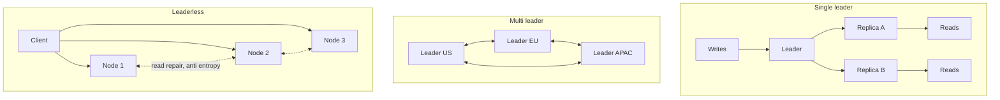
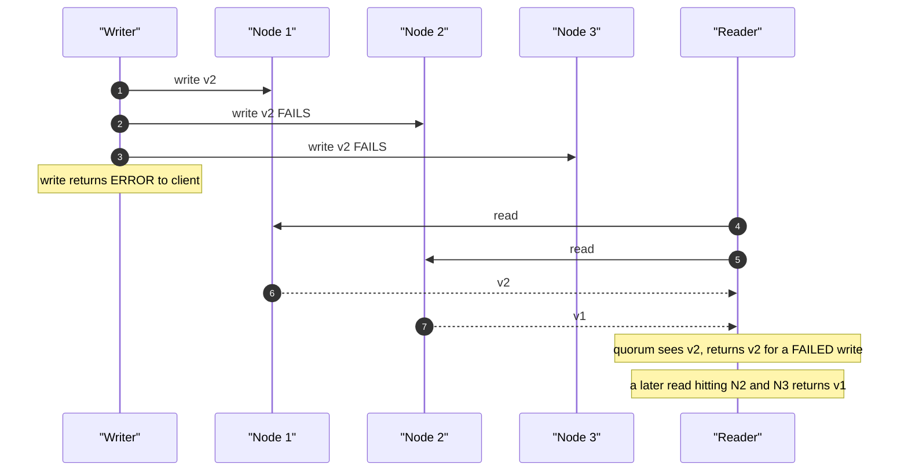
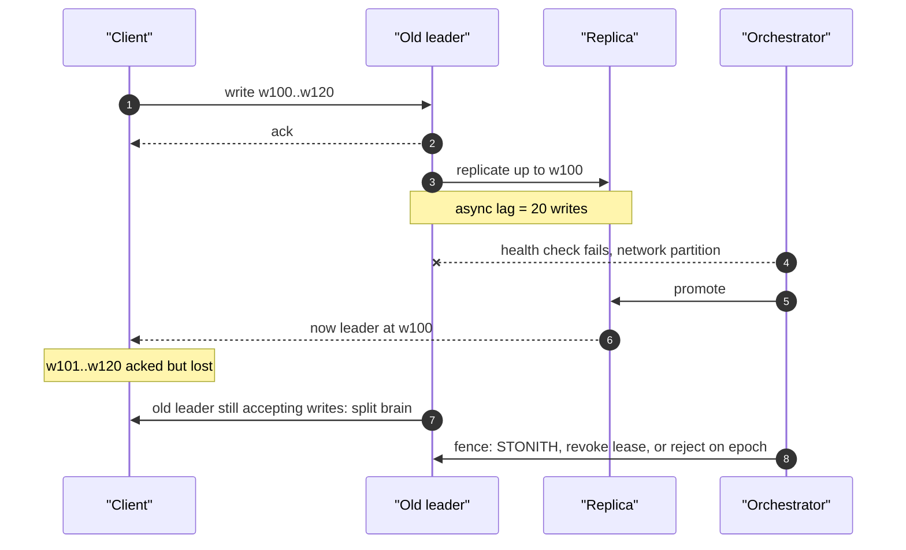
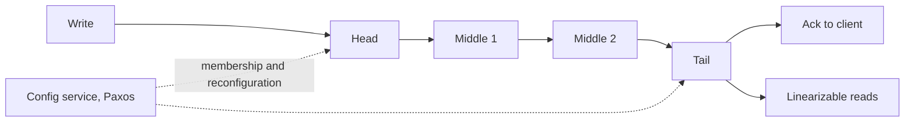

# F07 — Replication & Consistency

**Replication is how you buy durability, read capacity and availability; consistency is the bill, and it is itemised in milliseconds of write latency, seconds of staleness, and the writes you silently lose at failover.**

## Topologies



| Property | Single leader | Multi leader | Leaderless (Dynamo-style) |
|---|---|---|---|
| Write conflicts | impossible by construction | inherent, must be resolved | inherent, must be resolved |
| Write availability during partition | minority side unavailable | both sides writable | writable if $W$ nodes reachable |
| Local write latency (global) | one region pays cross-region RTT | all regions local | tunable by $W$ |
| Ordering | total order from the leader's log | per-leader only | none; needs versions |
| Failover complexity | high: election, fencing, lost writes | none for writes; convergence instead | none; membership only |
| Typical systems | Postgres, MySQL, MongoDB, Kafka partitions, etcd/Raft | Active-active MySQL, CouchDB, CRDT stores, calendar/offline apps | Cassandra, Riak, DynamoDB (internally leader-per-partition but quorum-exposed), ScyllaDB |
| When to choose | you need a single total order | geographically local writes with commutative data | availability over ordering, tunable per query |

!!! warning "Multi-leader is a data-modelling decision, not an infrastructure decision"
    Turning on active-active replication does not make conflicts go away; it makes them your application's problem. Only adopt it when your data is naturally commutative (counters, sets, presence, append-only logs) or partitionable by region ownership (each row has a home region that is the only writer). "We'll resolve conflicts later" is how you end up with last-write-wins and silent data loss.

## Synchronous, Asynchronous and Semi-Synchronous

The question is: **at the moment you acknowledge a write, how many copies exist, and in what state?**

| Mode | Ack after | Added commit latency | Data loss on leader loss | Availability impact |
|---|---|---|---|---|
| Async | leader fsync | 0 | up to the current lag (ms to minutes) | none |
| Semi-sync (MySQL `AFTER_SYNC`) | replica has **written** the relay log | 1 RTT + remote write | ~0 committed writes | blocks if no replica acks (until timeout) |
| Semi-sync (`AFTER_COMMIT`) | leader commits, then waits for ack | 1 RTT | ~0, but readers can see uncommitted-elsewhere data | same |
| Sync (Postgres `remote_write`) | standby OS has the WAL | 1 RTT | lost only if standby OS crashes too | standby down blocks writes |
| Sync (`remote_flush`, default `on`) | standby fsynced the WAL | 1 RTT + remote fsync | none for acked writes | standby down blocks writes |
| Sync (`remote_apply`) | standby **applied** it, visible to readers | 1 RTT + fsync + apply | none | slowest; enables safe replica reads |
| Quorum consensus (Raft/Paxos) | majority persisted | 1 RTT to the median replica | none | tolerates $\lfloor (n-1)/2 \rfloor$ failures |

**Latency arithmetic.** A commit that must round-trip costs:

$$
L_{\text{commit}} = L_{\text{local fsync}} + \text{RTT} + L_{\text{remote fsync}}
$$

| Placement | RTT | Typical added commit latency | Max serial commits/s per session |
|---|---|---|---|
| Same host | — | 0 | ~2,000–10,000 (fsync bound) |
| Same AZ | 0.2–0.5 ms | 0.5–1.5 ms | ~700–2,000 |
| Cross-AZ, same region | 0.5–2 ms | 1.5–3 ms | ~330–650 |
| us-east-1 ↔ us-west-2 | 60–70 ms | 60–70 ms | **~15** |
| us-east-1 ↔ eu-west-1 | 70–80 ms | 70–80 ms | ~13 |
| us-east-1 ↔ ap-southeast-1 | 220–240 ms | 220–240 ms | ~4 |

That last column is the whole argument. A synchronous cross-region write path caps a single-threaded workflow at roughly 15 commits per second. You can hide this with concurrency (200 concurrent sessions x 15 = 3,000 commits/s) but you cannot hide it from a user waiting on a serial multi-step transaction.

!!! gotcha "Synchronous replication to one standby *lowers* your availability"
    **Symptom:** the standby is restarted for patching and all writes hang. **Mechanism:** with a single required synchronous standby, write availability is $A_{\text{leader}} \times A_{\text{standby}}$ — two 99.9% components give 99.8%, i.e. you doubled your downtime to gain durability. **Mitigation:** quorum-style sync — Postgres `synchronous_standby_names = 'ANY 1 (s1, s2)'` gives $A_{\text{leader}} \times (1 - (1-A)^2) \approx 99.9\%$; MySQL `rpl_semi_sync_source_wait_for_replica_count` with 3+ replicas. Never run exactly one required sync replica.

!!! gotcha "MySQL semi-sync silently degrades to async on timeout"
    **Symptom:** you believe you have zero-data-loss failover; after an incident you find 8 seconds of missing writes. **Mechanism:** `rpl_semi_sync_source_timeout` (default 10,000 ms) causes the source to fall back to asynchronous replication when no replica acks, and it logs it once. Your durability guarantee evaporated exactly when you needed it — during the incident. **Mitigation:** alarm on `Rpl_semi_sync_source_status = OFF` as a page-level event, set the timeout high enough that fallback means "something is badly wrong", and decide deliberately whether availability or durability wins (there is no third option; that is CAP, see [F08 — CAP, PACELC & Consistency Models](f08-cap-pacelc.md)).

## Quorums, and Why $R + W > N$ Is Not Linearizability

The Dynamo-style rule: with $N$ replicas, write to $W$ and read from $R$; if

$$
R + W > N
$$

then any read set and any write set share at least one node, so a read *can* observe the latest successfully-completed write.

| Config | $N$ | $W$ | $R$ | Write tolerance | Read tolerance | Notes |
|---|---|---|---|---|---|---|
| Strong-ish | 3 | 2 | 2 | 1 failure | 1 failure | the default for a reason |
| Write-optimised | 3 | 1 | 3 | 2 failures | 0 failures | fast writes, fragile reads |
| Read-optimised | 3 | 3 | 1 | 0 failures | 2 failures | fast reads, fragile writes |
| Eventual | 3 | 1 | 1 | 2 | 2 | no overlap guarantee at all |
| Cross-DC | 6 | 4 | 3 | 2 | 3 | overlap holds; latency = 4th-fastest node |

Latency is governed by the **$W$-th fastest** replica, so raising $W$ pushes you further into the tail of the replica latency distribution. If per-replica p99 is 10 ms, $W=3$ of $N=3$ means you wait for the slowest of three: roughly $1-(0.99)^3 \approx 3\%$ of writes exceed 10 ms instead of 1%.

### Five reasons the overlap does not give you linearizability



1. **A failed write leaves partial state.** The client got an error, but $v2$ is on one node. Subsequent reads may return $v2$, then $v1$, then $v2$ — values flip back and forth. Linearizability forbids this; quorums do not.
2. **Concurrent read during a write** may catch the write half-applied: one read returns the new value, a *later* read returns the old one. This violates the "once read, always read" stability property.
3. **Sloppy quorums with hinted handoff** (Dynamo, Cassandra `ANY`) accept $W$ acks from *any* reachable nodes, not the $N$ home replicas. Overlap is then not guaranteed at all — the write may be sitting as a hint on a node the reader never contacts.
4. **Read repair is asynchronous.** Nothing forces convergence before the next read returns.
5. **Concurrent writes have no ordering.** Two clients writing $v2$ and $v3$ concurrently both succeed at $W$; which one "wins" is decided later by LWW timestamps or by the application, and either way one write vanishes without an error.

!!! gotcha "R+W>N gives you overlap, not linearizability"
    **Symptom:** a value that a client just read as $v2$ reads back as $v1$ moments later, with no writer involved. **Mechanism:** the quorum intersection argument only covers *successfully completed* writes; a failed or in-flight write can leave the new value on a strict subset of replicas, and different read quorums then disagree. **Mitigation:** if you need linearizability, use consensus (Raft/Paxos with leader leases or ReadIndex), Cassandra's `SERIAL`/`LOCAL_SERIAL` lightweight transactions (Paxos, roughly 4x the latency of a normal quorum write), or single-leader replication with reads from the leader. Do not attempt to build linearizability out of quorum reads and writes yourself.

## The Practical Consistency Guarantees

These are the guarantees users actually notice. They are *session* guarantees, cheaper than linearizability and usually sufficient.

| Guarantee | What it prevents | Typical implementation | Cost |
|---|---|---|---|
| **Read-your-writes** (read-after-write) | "I saved it and it disappeared" | route to leader for $t$ after write; or pass an LSN/GTID token and wait on the replica | leader load, or a wait |
| **Monotonic reads** | "the value went backwards" | pin a session to one replica (hash user id to replica) | reduced load balancing freedom |
| **Consistent prefix reads** | "the answer arrived before the question" | preserve per-partition ordering, single log per shard | no cross-partition ordering |
| **Bounded staleness** | unbounded lag surprises | replica refuses reads if lag > threshold; Cosmos DB bounded staleness ($k$ versions or $t$ seconds) | replicas drop out of rotation |
| **Writes-follow-reads / causal** | causality violations across sessions | version vectors, dependency tracking | metadata per item |
| **Linearizability** | all of the above | consensus + leader leases | latency, and unavailability during partition |

```python
# Read-your-writes via a replication token, without pinning everyone to the leader.
def write_then_read(session, payload):
    lsn = primary.execute("INSERT ... RETURNING pg_current_wal_lsn()", payload)
    session["min_lsn"] = lsn                      # sticky, per-session, in a cookie

def read(session, q):
    r = pick_replica()
    # Postgres: block until the replica has replayed at least this LSN.
    if session.get("min_lsn"):
        ok = r.execute("SELECT pg_wal_lsn_diff(pg_last_wal_replay_lsn(), %s) >= 0",
                       session["min_lsn"])
        if not ok:
            return primary.execute(q)             # fall back rather than block
    return r.execute(q)
```

!!! tip "Prefer a token over a timer"
    "Route to the primary for 5 seconds after a write" is the common hack. It fails when lag exceeds 5 seconds, and it wastes primary capacity when lag is 5 ms. An LSN/GTID token is exact: the replica either has the write or it does not, and you fall back to the primary only when it does not. MySQL exposes `WAIT_FOR_EXECUTED_GTID_SET`, Postgres exposes replay LSNs, Aurora and Vitess expose consistency tokens.

## Replication Lag: Symptoms and Measurement

| Symptom | Underlying cause | Metric that shows it |
|---|---|---|
| "My edit disappeared" | read-after-write on a lagging replica | per-replica apply lag |
| Counts drift between page loads | non-monotonic reads across replicas | replica-affinity hit rate |
| Comment appears before the post | cross-partition ordering violation | none directly; needs causal tracking |
| Lag spikes on schema change or bulk write | single-threaded apply saturated | apply thread CPU, lag derivative |
| Lag flat at zero then jumps to minutes | receive stalled, apply idle — reported lag was fake | receive lag vs apply lag separately |

Measure **three** lags, not one:

1. **Send/receive lag** — bytes the leader has produced that the replica has not received. Postgres: `pg_wal_lsn_diff(pg_current_wal_lsn(), sent_lsn)`.
2. **Write/flush lag** — received but not yet durable on the replica.
3. **Apply/replay lag** — durable but not yet visible to readers. This is the one your users feel.

```sql
-- Postgres, on the primary: all three lags per replica, in bytes and time.
SELECT application_name,
       state,
       pg_wal_lsn_diff(pg_current_wal_lsn(), sent_lsn)   AS send_bytes,
       pg_wal_lsn_diff(sent_lsn,  flush_lsn)             AS flush_bytes,
       pg_wal_lsn_diff(flush_lsn, replay_lsn)            AS apply_bytes,
       write_lag, flush_lag, replay_lag
FROM pg_stat_replication;

-- On the replica: time lag, which is 0 when there is simply no traffic.
SELECT CASE WHEN pg_is_in_recovery()
            THEN EXTRACT(epoch FROM now() - pg_last_xact_replay_timestamp())
       END AS apply_lag_seconds;
```

!!! gotcha "`Seconds_Behind_Source` and idle-replica time lag both lie"
    **Symptom:** monitoring shows 0 s lag while the replica is hours behind, or shows growing lag on a database with no writes. **Mechanism:** MySQL's `Seconds_Behind_Source` is computed from the timestamp of the event the SQL thread is *currently applying*; if the IO thread has stalled there is no event to apply, so it reports 0 (or NULL). Postgres' `now() - pg_last_xact_replay_timestamp()` grows during write idle periods because the last replayed transaction keeps getting older. **Mitigation:** run a heartbeat — a row updated with the leader's timestamp every second (`pt-heartbeat`) — and compute lag as `now() - heartbeat_ts` on the replica. It is immune to both failure modes and it is the only lag metric you should put in an SLO.

**Lag budget arithmetic.** A replica applies changes at some rate $A$ (rows/s) while the leader produces at $P$. Lag grows at $P - A$ and drains at $A - P$. If a bulk job pushes $P$ to 3x $A$ for 60 s, lag reaches $120\ \text{s}$ worth of work and takes another 60 s to drain *after* the job stops. This asymmetry is why lag alarms need a rate-of-change term, not just a threshold: by the time lag crosses 30 s, you have already committed to several minutes of recovery.

## Failover, Lost Writes, Split-Brain and Fencing



### Lost writes

With asynchronous replication, promoting a replica discards every acked write the replica had not received. **The data loss window equals the replication lag at the moment of failure**, which is exactly the moment lag is most likely to be elevated (the leader was struggling). Quantify it: 5,000 writes/s with 200 ms lag is 1,000 acked-then-lost writes per failover.

Worse, the discarded writes are usually not *actually* discarded — the old leader still has them on disk. Common failure: the old leader is repaired and rejoins, replaying its extra writes into a timeline that has diverged, producing duplicate primary keys or resurrected rows. Postgres requires `pg_rewind` or a full rebase for this reason; MySQL GTID makes the divergence detectable (`errant transactions`).

### Split-brain and fencing

Two nodes believing they are leader is not prevented by leader election alone, because a leader can be paused (GC, VM migration, disk stall) past its lease expiry and wake up still believing it leads. The defences, in increasing order of strength:

| Mechanism | Guarantee | Failure mode |
|---|---|---|
| Heartbeat timeout only | none | classic split-brain |
| Quorum election (Raft/Paxos) | at most one leader **per term** | an old leader can still act until it learns otherwise |
| Leader lease with clock bound | at most one leader in wall-clock time | requires bounded clock drift |
| Fencing token (monotonic epoch) checked by the **storage layer** | old leader's writes are rejected | requires storage-side support |
| STONITH / power fencing | old leader is off | slow, needs out-of-band control |
| Storage-level exclusive lease (e.g. cloud disk attach, `sanlock`) | only one writer possible | vendor-specific |

The critical insight from Kleppmann's lock analysis: **the fencing token must be validated by the resource being protected**, not by the client. If a leader has to check "am I still leader?" before writing, it can be paused between the check and the write. If the storage rejects any write with a token lower than the highest it has seen, the pause is harmless.

```text
epoch 7  leader A  ->  write(token=7)   accepted, storage.max_token=7
         A pauses 30s (GC)
epoch 8  leader B  ->  write(token=8)   accepted, storage.max_token=8
         A resumes ->  write(token=7)   REJECTED: 7 < 8
```

!!! gotcha "Automatic failover on a network partition is often worse than staying down"
    **Symptom:** a brief network blip triggers a promotion, the old leader keeps serving a subset of clients, and you spend a day reconciling two divergent datasets. **Mechanism:** the health checker cannot distinguish "leader is dead" from "I cannot reach the leader"; if it can only see one side of a partition it promotes into a split brain. GitHub's October 2018 incident began with a 43-second connectivity loss and required 24 hours of reconciliation. **Mitigation:** require a quorum of observers from multiple failure domains to agree before promoting; add a minimum failure duration (30–60 s) so blips do not trigger promotion; fence the old leader before promoting, not after; and accept that for some datasets, human-in-the-loop failover is the right call.

## Chain Replication

Writes enter at the **head**, propagate down the chain, and are acked from the **tail**; reads are served by the tail. Because the tail has, by construction, only values that every node has, tail reads are linearizable without a consensus round per operation.



| Property | Chain replication | CRAQ | Primary-backup | Raft |
|---|---|---|---|---|
| Write path | serial through $n$ nodes | same | leader fans out | leader fans out to majority |
| Write latency | sum of $n$ hops | same | max of $n$ hops | median of majority |
| Read throughput | tail only (1 node) | **all $n$ nodes** | leader or replicas | leader, or followers with ReadIndex |
| Read consistency | linearizable at tail | linearizable everywhere | depends | linearizable with lease/ReadIndex |
| Failure handling | reconfigure chain via external Paxos config service | same | election | built-in |
| Used by | FAWN, Hibari, Azure Storage streams, parts of Ceph | object stores, some KV layers | classic RDBMS | etcd, Consul, CockroachDB, TiKV |

**CRAQ** (Chain Replication with Apportioned Queries) is the important refinement: every node serves reads, but if a node holds a "dirty" (not-yet-committed) version it asks the tail for the current committed version number and returns that. Under read-heavy workloads with few writes, nearly all reads are clean and local, so read throughput scales linearly with chain length while retaining linearizability. The cost is one small round trip to the tail whenever a read hits an object with an in-flight write.

!!! tip "Chain replication trades write latency for read scalability and simpler linearizable reads"
    Serial propagation means write latency is the *sum* of hops rather than the max, which is bad across regions and fine within a rack. It shines when reads dominate by 100:1 and you want linearizability without paying a consensus round per read.

## Conflict Resolution

Only multi-leader and leaderless systems have conflicts. Once you have them, you must pick a resolution strategy, and every strategy loses something.

| Strategy | Converges | Loses data | Metadata cost | Good for |
|---|---|---|---|---|
| Last-write-wins (timestamp) | yes | **yes, silently** | 8–16 bytes | data where loss is acceptable: caches, telemetry, presence |
| LWW with node-id tiebreak | yes | yes | small | Cassandra cells |
| Version vectors | yes, with app merge | no, surfaces siblings | O(writers) | Riak, Dynamo shopping cart |
| Application merge (siblings) | yes | depends on merge | siblings stored | domain-aware merges |
| CRDTs | yes, provably | no (by construction) | varies; tombstones grow | counters, sets, text, presence |
| Operational transformation | yes | no | server-mediated | collaborative editors |
| Reject and escalate to a human | n/a | no | none | financial records |

### Why LWW is dangerous

Last-write-wins requires a total order on writes, and physical timestamps do not provide one. With NTP-synchronised hosts, typical clock skew is 1–10 ms and pathological skew is seconds to minutes. Two writes 5 ms apart on hosts 20 ms apart in clock skew will be ordered wrongly with probability high enough to matter at scale.

The failure is **silent**: the losing write returns success to its client, then vanishes. There is no error, no metric, no log line. Cassandra's LWW discards the losing cell entirely; a `UPDATE ... SET a=1` and a concurrent `UPDATE ... SET b=2` can even merge at cell granularity into a row that neither client ever wrote.

$$
P(\text{misordering}) \approx P(|\Delta t_{\text{writes}}| < \text{clock skew})
$$

!!! danger "LWW plus retries plus clock skew equals resurrected deletes"
    A delete recorded at $t$ can be undone by a retried write stamped $t + \epsilon$ from a host with a fast clock. This is why Cassandra has tombstones with a GC grace period, and why running repair less often than `gc_grace_seconds` (default 10 days) resurrects deleted data. If you must use LWW, generate timestamps at a single point (the coordinator), monitor clock skew with an alert at 100 ms, and never use LWW for deletes that matter.

### Version vectors and CRDTs

```text
Version vector:  {A:3, B:1}  vs  {A:2, B:2}
  neither dominates componentwise  ->  concurrent  ->  siblings, app must merge

Vector clock size grows with the number of writers. Dynamo truncated at 10 entries
with a timestamp, which can silently drop causality information. Version vectors
in Riak are per-*replica*, not per-client, which bounds them by N.
```

| CRDT | Merge rule | Anomaly you must accept |
|---|---|---|
| G-Counter | per-node max, sum for value | no decrement |
| PN-Counter | two G-Counters | value is eventually correct, never instantaneously |
| G-Set | union | no removal |
| OR-Set | union with unique add tags, remove observed tags | tombstone growth; concurrent add+remove keeps the add |
| LWW-Register | timestamp | same LWW loss as above |
| RGA / Yjs / Automerge (sequences) | causal ordering of insert positions | interleaving of concurrent insertions in text |

The Dynamo shopping-cart example remains the clearest illustration: merging by union means a removed item can reappear, because "remove" is not representable as a union. That is a *business* decision Amazon made deliberately — a resurrected item is better than a lost order.

## Read Replicas and Routing

| Routing policy | Read-your-writes | Monotonic reads | Load balance | Complexity |
|---|---|---|---|---|
| All reads to leader | yes | yes | none | trivial, does not scale |
| Round-robin across replicas | no | no | best | trivial, wrong |
| Sticky session to one replica | no | yes | good | cookie/consistent hash |
| Leader for $t$ seconds after write | mostly | no | good | timer is a guess |
| LSN/GTID token wait or fallback | yes | yes | good | needs token plumbing |
| Lag-gated pool (evict replicas over threshold) | no | no | degrades safely | needs accurate lag |
| Per-query annotation (`/*+ strong */`) | per-query | per-query | best | developer discipline |

Combine them: a lag-gated pool with sticky sessions and an LSN token for post-write reads covers all three session guarantees at the cost of a per-session cookie and a lag metric you trust.

!!! gotcha "Removing lagging replicas from the pool can cascade"
    **Symptom:** one replica exceeds the lag threshold, is removed, and within a minute every replica is removed and all traffic is on the leader, which then falls over. **Mechanism:** the removed replica's read load redistributes to the remaining replicas, increasing their CPU and therefore their apply lag, tripping the same threshold. **Mitigation:** never remove more than a fixed fraction (e.g. 1/3) of the pool, degrade by weight rather than by removal, and make the leader's read admission control strict enough that it sheds rather than dies.

## What Actually Gets Shipped Across the Wire

| Method | Bandwidth | Version/engine coupling | Non-determinism risk | Filtering / transformation | Systems |
|---|---|---|---|---|---|
| **Statement-based** | lowest | none | **high**: `NOW()`, `RAND()`, `UUID()`, triggers, non-deterministic UDFs, `LIMIT` without `ORDER BY`, auto-increment interleaving | easy | MySQL `binlog_format=STATEMENT` (deprecated for good reason) |
| **Row-based / logical** | medium-high (before+after images) | independent: cross-version and cross-engine | none | yes: column filtering, schema transformation, routing | MySQL ROW binlog, Postgres logical decoding (pgoutput/wal2json), Debezium |
| **WAL / physical** | medium (page-level, can amplify) | **tight**: same major version, same page format, same architecture | none | none | Postgres streaming replication, MySQL InnoDB clone/redo |
| **Trigger-based** | high | none | none | maximum | Bucardo, legacy audit-table replication |

Trade-offs worth stating explicitly:

- **Physical WAL** is byte-exact and cheap to apply, but it forbids online major-version upgrades and cannot replicate a subset. It also replicates *bloat*: a `VACUUM FULL` or a page-level rewrite sends the whole table.
- **Logical replication** enables version upgrades with near-zero downtime and heterogeneous targets (Postgres → Kafka → search index), but DDL is not replicated in most implementations, sequences are not advanced, and every table needs a replica identity (a primary key or `REPLICA IDENTITY FULL`, the latter being expensive).
- **Statement-based** is compact but a correctness minefield; MySQL's `MIXED` mode exists because statement-based silently diverged replicas often enough to be a standing incident category.

!!! gotcha "Logical replication slots are a disk-space time bomb"
    **Symptom:** the primary's disk fills up, writes stop, and the cause is a replica that was decommissioned two weeks ago. **Mechanism:** Postgres retains all WAL needed by every replication slot, forever, whether or not the consumer exists. An inactive slot pins WAL indefinitely. **Mitigation:** set `max_slot_wal_keep_size` (PG13+), alarm on `pg_replication_slots.active = false` and on `restart_lsn` falling behind by more than a few GB, and make slot cleanup part of every decommission runbook. The equivalent in Kafka is an abandoned consumer group holding retention; in MySQL it is a stale GTID-based replica preventing binlog purge.

!!! gotcha "Single-threaded apply makes replicas fall behind on exactly the workloads that matter"
    **Symptom:** the leader handles a bulk update fine; replicas fall an hour behind. **Mechanism:** historically the replica applies changes with one thread while the leader wrote them with 64; a long transaction, a large `DELETE`, or an index build serialises the apply stream. Even with parallel apply (MySQL `replica_parallel_workers` with `WRITESET`, Postgres' single startup process), throughput is far below the leader's. **Mitigation:** chunk bulk operations into small transactions with pauses, gate the chunker on measured replica lag, enable writeset-based parallel apply, and treat "lag derivative > 0 for N minutes" as the alert rather than an absolute threshold.

## Gotchas & Corner Cases

!!! gotcha "The old leader comes back with writes the new leader never saw"
    **Symptom:** after a failover and repair, you get duplicate keys, resurrected rows, or a replica that refuses to start. **Mechanism:** async replication means the old leader's WAL diverged from the promoted timeline; naively restarting it as a replica either fails or, worse, replays extra transactions. **Mitigation:** never auto-rejoin a former leader — quarantine it, diff it (MySQL GTID errant-transaction detection, Postgres timeline IDs and `pg_rewind`), extract the lost writes for manual reconciliation, then rebuild from a fresh base backup. Have this in the runbook *before* the incident, because reconstructing 20 minutes of lost orders under pressure is not a design exercise.

!!! gotcha "Read-after-write is broken by your own cache, not just by replicas"
    **Symptom:** the write went to the leader, the read went to the leader, and the user still sees stale data. **Mechanism:** something between them — a cache populated from a replica, a materialised view, a search index, a CDN — has its own lag. **Mitigation:** trace the *whole* read path for the post-write request and either bypass every derived store or propagate the version token through all of them. See [F04 — Caching](f04-caching.md) for the cache half of this.

!!! gotcha "Monotonic reads break the moment you add a second replica behind a load balancer"
    **Symptom:** a user refreshes and their new comment disappears, then reappears, then disappears. **Mechanism:** consecutive reads land on replicas with different apply positions; time appears to move backwards. **Mitigation:** session affinity (consistent hash of user id to replica) is the cheap fix; the exact fix is carrying the last-observed LSN in the session and rejecting any replica below it.

!!! gotcha "Cross-partition ordering does not exist, so causality leaks in the UI"
    **Symptom:** a reply is visible before the message it replies to; a "user deleted" event arrives before the user's last post. **Mechanism:** each partition/shard has its own replication stream and its own lag; there is no global ordering. **Mitigation:** co-locate causally-related data in one partition, or carry explicit causal metadata (parent version/happens-before token) and have the reader hide or wait for missing dependencies. Consistent-prefix reads are a per-partition property only.

!!! gotcha "A quorum write that times out has an indeterminate outcome, and retrying it is not free"
    **Symptom:** duplicate records after client retries on timeout. **Mechanism:** a timeout tells you nothing about whether the write reached $W$ nodes; the write may complete after you gave up. **Mitigation:** make writes idempotent with a client-supplied unique key, use conditional writes (compare-and-set on a version), and design the read path to tolerate seeing an "uncommitted-from-the-client's-view" value.

!!! gotcha "Adding a replica is a load event on the leader"
    **Symptom:** p99 doubles while a new replica bootstraps. **Mechanism:** the base backup reads the entire dataset (evicting the buffer pool), and the WAL that accumulates during the copy must then be shipped and applied. On a 5 TB database at 200 MB/s the base backup alone is 7 hours, during which the leader must retain 7 hours of WAL. **Mitigation:** take the base backup from an existing replica, not the leader; throttle the copy; pre-size WAL retention; and schedule it outside peak.

!!! gotcha "Semi-sync guarantees the replica *received* the write, not that it can serve it"
    **Symptom:** failover completes with "zero data loss" but the promoted node takes 10 minutes to become available. **Mechanism:** `AFTER_SYNC` waits for the relay log write, not the apply. The promoted replica must first apply a potentially large backlog. **Mitigation:** monitor apply lag separately from receive lag, and quote your RTO from apply position, not from receive position. `remote_apply` in Postgres closes this gap at a real latency cost.

!!! gotcha "Synchronous replication across AZs makes your commit latency a function of someone else's network"
    **Symptom:** unexplained multi-millisecond commit latency spikes correlated with nothing in your application. **Mechanism:** every commit now includes an inter-AZ RTT, so any cloud network micro-event lands directly in your write path, and p99.9 commit latency tracks p99.9 network latency. **Mitigation:** use quorum sync across 3 AZs (`ANY 1 (a, b)`) so the slowest AZ is excluded, group commits to amortise the RTT across many transactions, and measure the network path independently so you can attribute the spikes.

!!! gotcha "`gc_grace_seconds` and repair intervals are a coupled constraint, and violating it resurrects deleted data"
    **Symptom:** deleted rows reappear in Cassandra weeks later. **Mechanism:** deletes are tombstones; after `gc_grace_seconds` (default 10 days) they are compacted away. A replica that was down longer than that, or a repair that has not completed within that window, never learns about the delete and re-propagates the original row. **Mitigation:** ensure full repair completes within `gc_grace_seconds` with margin, alarm on repair age, and if a node is down longer than the grace period, rebuild it rather than letting it rejoin.

!!! gotcha "Failover to a different region silently changes your consistency model"
    **Symptom:** after a regional failover, write latency is 10x and previously-fine code times out. **Mechanism:** the app that was writing to a local leader now writes cross-region; synchronous replication that was intra-region is now inter-region. **Mitigation:** load-test the failed-over topology, not just the happy path; set timeouts based on the degraded path; and decide in advance whether a regional failover downgrades consistency (accept local writes, reconcile later) or downgrades availability (refuse writes).

!!! gotcha "Backups taken from a replica inherit the replica's lag and its corruption"
    **Symptom:** the restore is missing the last minutes of data, or restores corruption faithfully. **Mechanism:** a backup from a lagging replica is a point-in-time snapshot of the *replica's* position; physical replication also propagates page corruption bit-for-bit. **Mitigation:** record the replica's LSN/GTID with the backup so restore points are explicit, keep PITR WAL archives from the leader for the gap, enable page checksums, and periodically restore-and-verify rather than trusting that backups exist.

## SRE Lens

### SLIs and SLOs

| SLI | Definition | Typical target | Measurement |
|---|---|---|---|
| Replica apply lag | heartbeat-based, per replica | p99 < 1 s intra-region | heartbeat table, not built-in counters |
| Lag budget burn | fraction of time any serving replica exceeds threshold | < 0.1% | lag-gated pool metrics |
| Write commit latency | client-observed, p50/p99 | depends on sync mode | include the replication wait |
| Failover RTO | detect → promote → serve | < 60 s automated, < 15 min manual | game-day measured, not estimated |
| Failover RPO | acked writes lost | 0 with sync/quorum; = lag with async | derived from lag at failure time |
| Staleness observed by users | canary write, read via the full path | p99 < 1 s | end-to-end prober |
| Split-brain events | count of rejected stale-epoch writes | 0 | storage-side fencing counter |

### Failure modes and detection

| Failure | Signal | First response |
|---|---|---|
| Lag growth from bulk write | lag derivative > 0 sustained; apply thread pinned | pause the bulk job; it should be gated on lag already |
| Semi-sync degraded to async | semi-sync status OFF | page; you have lost your RPO guarantee |
| Replication slot pinning WAL | slot inactive, `restart_lsn` stalled, disk trend | drop the abandoned slot after confirming ownership |
| Leader disk stall (not down) | fsync latency p99, not liveness | this is the worst case for failover logic; prefer fencing over promotion racing |
| Divergent old leader | errant GTIDs / timeline mismatch on rejoin | quarantine; never auto-rejoin |
| Replica pool collapse | pool size trending down, leader read QPS rising | stop evictions, shed reads, add capacity |

### Rollout and migration risk

- **Major-version upgrades** with physical replication require a cutover with downtime or a logical-replication bridge; plan the bridge weeks ahead, including sequence advancement and DDL handling.
- **Changing sync mode** in production changes both your latency profile and your availability profile at once. Roll it out to one replica set, measure commit p99, and be ready to revert within the same change window.
- **Adding a region** changes the failover topology's consistency implications; run a game day that fails over *to* the new region under load.

### Capacity signals

- Replica apply throughput headroom: measure the maximum sustained apply rate (rows/s or WAL MB/s) and keep peak leader write rate below ~60% of it.
- WAL generation rate (MB/s) drives network cost, archive storage, and PITR restore time. A 50 MB/s WAL rate is 4.3 TB/day of archive.
- Restore time from base backup + WAL replay is your true RTO for a total loss; measure it quarterly. Replay is often slower than generation, so a 24-hour PITR window can take longer than 24 hours to replay if the WAL is dense.

### On-call runbook notes

1. Before promoting: confirm the old leader is fenced, confirm the candidate's apply position, and record both. Screenshot the lag graph — you will need it for the RPO estimate.
2. Never run `pg_rewind` or reset a replica without first taking a copy of its data directory.
3. Have a pre-written query that extracts "writes present on the old leader but not on the new one" for each critical table.
4. Know which of your replicas are sync-eligible; promoting a non-sync replica when a sync one exists throws away your durability guarantee for nothing.
5. Lag alerts should have two levels: warning on absolute lag, page on lag *derivative* sustained, because the derivative gives you time to act.

### Cost

Each additional full replica costs a full copy of compute plus storage. Cross-AZ replication traffic is charged both directions in most clouds (~0.01–0.02 USD/GB each way): a 50 MB/s WAL stream to two remote-AZ replicas is roughly $50 \times 2 \times 86400 / 1000 = 8.6$ TB/day, i.e. a four-to-five-figure monthly bill on bandwidth alone. Cross-region replication multiplies that and adds egress rates. Compression of the replication stream (Postgres `wal_compression`, MySQL binlog transaction compression) typically cuts 40–70% of it and is nearly always worth the CPU.

## Interview Angle

!!! interview "What interviewers probe"
    The reliable questions: "What is your RPO, and how did you compute it?" "You have async replication and the leader dies — what exactly is lost?" "How does a user read their own write?" "Two nodes think they are leader. What stops the old one from writing?" "Why isn't a quorum enough for linearizability?"

    They are checking for three specific things: that you distinguish durability from visibility, that you know failover loses data unless you paid for it not to, and that you understand fencing must be enforced by the resource, not the client.

!!! interview "Strong vs weak answers"
    **Weak:** "We'll use a primary with two read replicas and fail over automatically." No RPO, no lag story, no fencing, no read-your-writes.

    **Adequate:** Mentions async lag causing stale reads, suggests routing post-write reads to the primary, knows split-brain is a risk.

    **Strong:** "Single leader with three replicas across AZs, `synchronous_standby_names = ANY 1 (b, c)` so RPO is zero for acked writes while tolerating one standby being down — with exactly one required sync standby my write availability would be the product of two components, which is worse than async. Commit latency includes one cross-AZ RTT, about 1.5 ms, so I group-commit to amortise it. Reads go to a lag-gated pool with session affinity for monotonic reads, and post-write reads carry the LSN — the replica serves it if `pg_last_wal_replay_lsn` is past it, otherwise we fall back to the leader rather than blocking. Lag is measured with a heartbeat because `pg_last_xact_replay_timestamp` lies during idle periods. Failover requires quorum agreement from observers in two AZs plus 45 seconds of sustained failure, and the old leader is fenced by epoch at the storage layer before promotion. The old leader is never auto-rejoined; we diff its GTIDs and rebuild."

!!! interview "The question that separates levels"
    "Your quorum is $N=3$, $W=2$, $R=2$. Is that linearizable?" The weak answer is "yes, because $R+W>N$." The strong answer: "No. The intersection argument only covers writes that completed successfully. A write that failed after reaching one node leaves a value that some read quorums see and others do not, so reads can return $v2$ then $v1$ — that violates linearizability's stability, not just recency. If sloppy quorums with hinted handoff are enabled, even the intersection guarantee is gone. For linearizability I need consensus: a Raft group with lease or ReadIndex reads, or Cassandra's `SERIAL` Paxos path at roughly four times the latency."

## Key Takeaways

- Acknowledge time defines durability: async loses the current lag on failover, semi-sync loses ~nothing but can silently degrade, sync costs one RTT per commit and — with a single required standby — costs availability.
- Cross-region synchronous commits cap serial throughput at roughly $1/\text{RTT}$: about 15 commits/s between US coasts. Concurrency hides it from throughput but never from a user in a serial workflow.
- $R + W > N$ guarantees quorum overlap for *completed* writes only; failed writes, concurrent writes, sloppy quorums and async read repair each independently break linearizability.
- Session guarantees — read-your-writes, monotonic reads, consistent prefix, bounded staleness — are what users perceive, and they are far cheaper than linearizability. Implement them with version tokens, not timers.
- Measure lag with a heartbeat and split it into receive, flush and apply; built-in counters read zero exactly when replication is most broken, and alert on the derivative, not just the threshold.
- Failover is where data is lost. Fence the old leader with a monotonic epoch validated by the storage layer, require multi-observer quorum plus a minimum failure duration to promote, and never auto-rejoin a former leader.
- LWW converges by discarding writes silently and depends on clocks you do not control; use version vectors or CRDTs when loss is unacceptable, and remember that CRDT convergence is a guarantee about state, not about business correctness.
- Physical replication is cheap and tightly coupled; logical replication buys version independence, filtering and near-zero-downtime upgrades, at the cost of DDL, sequences and replica-identity handling — and an abandoned slot will fill your disk.

## Further Reading

- Martin Kleppmann, *Designing Data-Intensive Applications*, Ch. 5 (Replication) and Ch. 9 (Consistency and Consensus) — the canonical treatment of replication lag anomalies and linearizability.
- Martin Kleppmann, "How to do distributed locking" (2016) — the fencing-token argument, applicable directly to leader failover.
- R. van Renesse, F. Schneider, "Chain Replication for Supporting High Throughput and Availability," OSDI 2004.
- J. Terrace, M. Freedman, "Object Storage on CRAQ: High-throughput chain replication for read-mostly workloads," USENIX ATC 2009.
- G. DeCandia et al., "Dynamo: Amazon's Highly Available Key-value Store," SOSP 2007 — sloppy quorums, hinted handoff, vector clocks, the shopping-cart merge.
- D. Terry et al., "Session Guarantees for Weakly Consistent Replicated Data," PDIS 1994 — the original read-your-writes / monotonic reads / consistent prefix definitions.
- M. Shapiro, N. Preguiça, C. Baquero, M. Zawirski, "A Comprehensive Study of Convergent and Commutative Replicated Data Types," INRIA RR-7506, 2011.
- P. Bailis et al., "Probabilistically Bounded Staleness for Practical Partial Quorums," VLDB 2012 — how stale a partial quorum actually is, in milliseconds.
- Kyle Kingsbury, Jepsen analyses — particularly *MongoDB*, *Cassandra*, *etcd*, *Elasticsearch*, *Redis Raft*, and *PostgreSQL*; read the methodology sections for how these failures are actually provoked.
- Diego Ongaro, John Ousterhout, "In Search of an Understandable Consensus Algorithm (Raft)," USENIX ATC 2014 — leader leases, ReadIndex, and membership change.
- GitHub Engineering, "October 21 post-incident analysis" (2018) — a network partition, an automated failover, and 24 hours of reconciliation.
- Aphyr, "The trouble with timestamps" — why LWW and physical clocks do not compose.
- PostgreSQL documentation: `synchronous_commit` levels, `pg_stat_replication`, logical decoding, replication slots and `max_slot_wal_keep_size`.
- MySQL documentation: semisynchronous replication (`AFTER_SYNC` vs `AFTER_COMMIT`), GTID-based failover, and the `orchestrator` project's documentation on fencing and anti-flapping.
