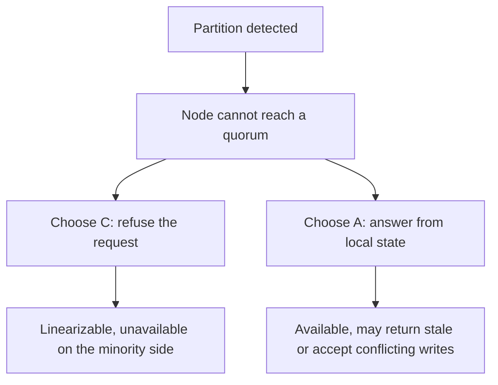
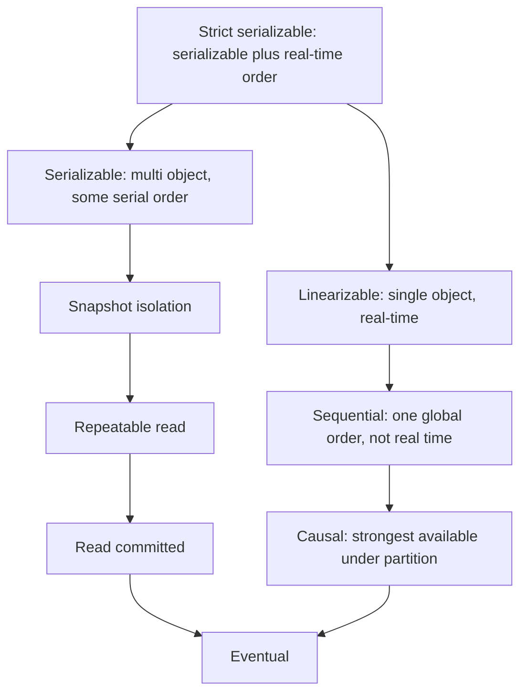
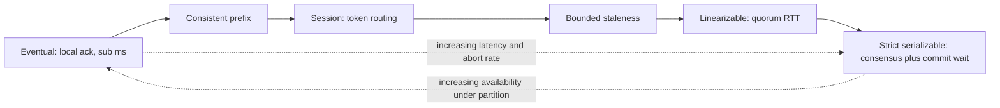

# F08 — CAP, PACELC & Consistency Models

**CAP tells you what is impossible during a partition; PACELC tells you what you are paying for on every single request when nothing is wrong — and the second bill is the one that arrives daily.**

## CAP, Stated Precisely

Gilbert and Lynch's 2002 proof is narrow and exact. In an asynchronous network model where messages can be lost arbitrarily, no implementation of a **read/write register** can simultaneously provide:

- **Consistency**: linearizability — every read returns the value of the most recent completed write, in real-time order, for a single object.
- **Availability**: every request received by a **non-failing** node must terminate with a non-error response, in finite time.
- **Partition tolerance**: the system continues to operate when the network drops an arbitrary number of messages between nodes.



### The common misreadings

| Misreading | Why it is wrong |
|---|---|
| "Pick two of three." | You do not choose P. Partitions are imposed on you by the physical world. The choice is only between C and A, and only **during** a partition. |
| "The C in CAP is the C in ACID." | ACID's C is *invariant preservation by the application*. CAP's C is linearizability, a recency guarantee for a single object. They are unrelated; ACID's C is arguably not a database property at all. |
| "The A in CAP means high availability." | CAP's A is an absolute: **every** request to **every** non-failing node returns successfully. A system with 99.999% availability is not "A" in CAP terms; a system that answers all requests with stale data is. |
| "We built a CA system." | Only meaningful for a single node. A distributed CA system is one whose partition behaviour is unspecified — which means it will choose one of C or A anyway, just accidentally. |
| "Cassandra is AP, MongoDB is CP." | Both are tunable, per operation. Cassandra with `QUORUM` reads and writes and lightweight transactions behaves very differently from `ONE`. The label belongs to the *configuration and the query*, not to the product. |
| "CAP tells us we cannot have distributed transactions." | CAP is about a single register. It says nothing about multi-object atomicity, isolation levels, or throughput. |
| "Partition means the network is down." | A partition, formally, is any period where messages between nodes are lost or delayed beyond the system's timeout. A GC pause, a saturated NIC, or a slow disk on a leader is indistinguishable from a partition at the protocol level. |

!!! warning "The most consequential misreading"
    Treating CAP as a system-level architectural label leads to sentences like "we chose AP" that carry no engineering content. The useful question is per-operation: *for this specific request, when we cannot reach a quorum, do we return an error or a possibly-stale answer?* Reading a product catalogue and transferring money get different answers in the same system.

## PACELC: The Half That Matters Daily

Abadi's extension: **if Partition, then A or C; Else, L or C.**

$$
\textbf{P} \rightarrow (\textbf{A} \text{ or } \textbf{C}), \quad \textbf{E} \rightarrow (\textbf{L} \text{ or } \textbf{C})
$$

Partitions are rare — a mature cluster might see a handful of meaningful partition events per year, perhaps tens of minutes of annual exposure. The **E branch is active for the remaining 99.99%+ of the time**, and it is where every consistency decision costs you measurable latency on every request. That is why PACELC is the more useful framework for design reviews.

| System / configuration | Partition behaviour | Else behaviour | Classification |
|---|---|---|---|
| Dynamo, Cassandra (`ONE`), Riak | stay available, accept conflicts | lowest latency, weakest consistency | PA/EL |
| Cassandra (`QUORUM` R and W) | minority side unavailable for that key | pays quorum RTT | PC/EC |
| Cassandra LWT (`SERIAL`) | unavailable without quorum | ~4 round trips of Paxos | PC/EC |
| DynamoDB, eventually consistent reads | available, stale | half the RCU cost, lower latency | PA/EL |
| DynamoDB, strongly consistent reads | unavailable if the leader replica is unreachable | 2x read cost, single-AZ read path | PC/EC |
| MongoDB, `w:majority` + `readConcern:majority` | minority unavailable for writes | pays majority ack | PC/EC |
| MongoDB, `w:1` + `readConcern:local` | available | fast | PA/EL |
| Spanner | unavailable without a Paxos majority | commit wait (~2ε) plus consensus | PC/EC |
| CockroachDB, TiDB | unavailable without a majority | consensus + latch/lock latency | PC/EC |
| Postgres async replica reads | replica keeps serving stale data | fast, stale | PA/EL |
| Postgres sync (`remote_apply`) | writes block | one RTT + apply per commit | PC/EC |
| Cosmos DB `session` | available within the session's region | region-local latency | PA/EL |
| Cosmos DB `strong` | unavailable without quorum | cross-region latency on every write | PC/EC |
| Redis (async replication) | available, loses acked writes on failover | sub-millisecond | PA/EL |

!!! gotcha "'Eventually consistent' has no time bound, and your product does"
    **Symptom:** a feature works in staging and produces support tickets in production because "eventually" turned out to be 40 seconds during a compaction storm. **Mechanism:** eventual consistency guarantees only convergence *if writes stop* — a condition that never holds in production. **Mitigation:** convert it to **bounded staleness** with an actual number: measure the p50/p99/p999 of write-to-visible latency with a canary prober, put it in an SLO, and design the UI around the p99 (optimistic rendering, "syncing" indicators, or read-your-writes routing).

## The Two Hierarchies

Practitioners conflate two separate lattices. **Single-object consistency models** (linearizability, sequential, causal, eventual) come from distributed-systems theory and describe recency and ordering of operations on one object. **Transaction isolation levels** (serializable, snapshot, read committed) come from database theory and describe which interleavings of multi-object transactions are permitted. Strict serializability is the join of the two.



| Model | Guarantees | Permits | Requires | Typical latency cost |
|---|---|---|---|---|
| **Strict serializable** | serializable + real-time order across transactions | nothing | consensus + a global time or sequencing authority | consensus RTT + commit wait; Spanner ~10 ms |
| **Linearizable** | single-object recency and real-time order | no multi-object atomicity | consensus, or leader with lease/ReadIndex | 1 quorum RTT per op |
| **Sequential** | one global order all nodes agree on | a read may miss a write that finished earlier in real time | total-order broadcast | 1 broadcast, no real-time sync |
| **Causal** | causally related ops ordered everywhere | concurrent ops in any order | dependency metadata | near-zero; **available under partition** |
| **Serializable** | equivalent to *some* serial execution | stale snapshots; no real-time recency | 2PL, SSI, or deterministic ordering | lock waits or abort-and-retry |
| **Snapshot isolation** | consistent snapshot, no dirty/non-repeatable read/phantom | **write skew**, read-only anomaly | MVCC + first-committer-wins | cheap; MVCC storage overhead |
| **Repeatable read (ANSI)** | no dirty or non-repeatable reads | phantoms, lost update, write skew | locks on read rows | moderate |
| **Read committed** | no dirty reads | non-repeatable reads, phantoms, lost update | short read locks or MVCC | cheapest useful level |
| **Read uncommitted** | almost nothing | dirty reads | none | none |
| **Eventual** | convergence if writes stop | every anomaly | anti-entropy | lowest |

!!! note "Causal consistency is the ceiling under partition"
    Attiya, Mahajan and Bazzi's result (and the earlier COPS/Bolt-on line of work) establishes that **causal consistency with convergence is the strongest model achievable in an always-available, partition-tolerant system**. Anything stronger — sequential, linearizable, serializable — requires giving up availability during a partition. If your requirement is "never refuse a write", causal+CRDT is the strongest correctness you can buy, and everything above it is off the table by proof, not by engineering effort.

!!! gotcha "Serializable does not mean linearizable, and linearizable does not mean serializable"
    **Symptom:** a "SERIALIZABLE" database returns a result that appears to be from the past. **Mechanism:** serializability permits *any* equivalent serial order, including one that places your read-only transaction before a transaction that committed an hour ago in real time — that is a valid serial order. Linearizability adds real-time ordering but only for single objects. **Mitigation:** if you need "must reflect everything committed before now", you need **strict serializability** (Spanner's "external consistency", CockroachDB's default) and you must pay for a global ordering mechanism. Ask which one you actually need: most business invariants need serializability, most user-facing "did my write take effect" needs linearizability for one object.

## Isolation Anomalies, Concretely

=== "Dirty read"

    Reading data written by a transaction that has not committed and may roll back.

    ```sql
    -- T1                                  -- T2
    BEGIN;
    UPDATE accounts SET bal = 500 WHERE id = 1;
                                           BEGIN;
                                           SELECT bal FROM accounts WHERE id = 1; -- 500
                                           -- acts on 500
    ROLLBACK;                              -- the 500 never existed
    ```

    Prevented at READ COMMITTED and above. Every MVCC database prevents it by default; only READ UNCOMMITTED permits it, and Postgres does not even implement that level (it silently maps to READ COMMITTED).

=== "Non-repeatable read (read skew)"

    The same row, read twice in one transaction, returns different values.

    ```sql
    -- T1: report over two accounts, total should always be 1000
    BEGIN;                        -- READ COMMITTED
    SELECT bal FROM accounts WHERE id = 1;  -- 500
                                  -- T2 transfers 100 from 1 to 2, commits
    SELECT bal FROM accounts WHERE id = 2;  -- 600
    -- report shows 1100. Money was created by an isolation level.
    COMMIT;
    ```

    This is the single most common production correctness bug in READ COMMITTED systems, because it is invisible in testing and silent in production. Prevented by SNAPSHOT ISOLATION and above.

=== "Phantom read"

    A predicate re-evaluated in the same transaction matches a different set of rows.

    ```sql
    BEGIN;
    SELECT COUNT(*) FROM bookings
     WHERE room_id = 7 AND period && '[2026-01-01, 2026-01-05)'::tstzrange;  -- 0
                                  -- T2 inserts an overlapping booking, commits
    INSERT INTO bookings VALUES (7, '[2026-01-02, 2026-01-04)');             -- double-booked
    COMMIT;
    ```

    ANSI REPEATABLE READ permits phantoms. Postgres' REPEATABLE READ (= SI) does not, because the snapshot is a point in time. MySQL InnoDB's REPEATABLE READ prevents them for **locking** reads via gap locks, but the mechanism is different and the guarantees differ per statement type.

=== "Lost update"

    Two read-modify-write cycles interleave; one update disappears.

    ```sql
    -- T1                                    -- T2
    SELECT count FROM ctr WHERE id=1;  -- 10  SELECT count FROM ctr WHERE id=1; -- 10
    UPDATE ctr SET count = 11 WHERE id=1;     UPDATE ctr SET count = 11 WHERE id=1;
    COMMIT;                                   COMMIT;
    -- two increments, count = 11
    ```

    Fixes, in order of preference: atomic in-database mutation (`UPDATE ctr SET count = count + 1`), compare-and-set on a version column (`WHERE version = :v`), explicit `SELECT ... FOR UPDATE`, or SERIALIZABLE with a retry loop. Snapshot isolation prevents lost update on the *same row* by first-committer-wins; READ COMMITTED does not.

=== "Write skew"

    Two transactions read an overlapping set, each writes a **different** row, each preserves the invariant alone, and together they break it. This is the anomaly SI permits and the reason SI is not serializable.

    ```sql
    -- Invariant: at least one doctor on call.  Currently Alice and Bob are both on call.
    -- T1 (Alice)                                    -- T2 (Bob)
    BEGIN;                                            BEGIN;
    SELECT COUNT(*) FROM oncall WHERE shift=5
      AND on_call;                     -- 2                SELECT COUNT(*) ... -- 2
    UPDATE oncall SET on_call=false
      WHERE doctor='alice';                                UPDATE oncall SET on_call=false
                                                             WHERE doctor='bob';
    COMMIT;  -- ok                                     COMMIT;  -- ok under SI
    -- zero doctors on call
    ```

    Neither transaction writes a row the other wrote, so first-committer-wins never fires. Other real instances: double-spending against a balance check, allocating the last seat, two meetings booked into one room, two users claiming one username via check-then-insert. Prevented only by SERIALIZABLE (SSI or 2PL), by materialising the conflict (lock a row representing the *set*, e.g. `SELECT ... FROM shift WHERE id=5 FOR UPDATE`), or by a database constraint that turns the invariant into a unique/exclusion constraint.

=== "Read-only transaction anomaly"

    Under SI, a transaction that only reads can observe a state inconsistent with any serial order, even though neither writing transaction is anomalous by itself. Discovered by Fekete et al. It is rare, but it means "read-only transactions are always safe under SI" is false. If a report must be serializable-correct, it must run at SERIALIZABLE — in Postgres, with `SET TRANSACTION READ ONLY DEFERRABLE` so it waits for a safe snapshot instead of risking an abort.

| Anomaly | Read uncommitted | Read committed | ANSI RR | Snapshot isolation | Serializable |
|---|---|---|---|---|---|
| Dirty read | possible | prevented | prevented | prevented | prevented |
| Non-repeatable read | possible | possible | prevented | prevented | prevented |
| Phantom | possible | possible | possible | prevented | prevented |
| Lost update | possible | possible | prevented | prevented (first-committer-wins) | prevented |
| **Write skew** | possible | possible | possible | **possible** | prevented |
| Read-only anomaly | possible | possible | possible | **possible** | prevented |

## What Real Systems Actually Give You

!!! danger "Isolation level names are marketing, not specification"
    Two databases advertising the same level provide materially different guarantees. Always test the specific anomaly you care about against the specific engine, version, and configuration.

| System | Default | What it really is | Sharp edges |
|---|---|---|---|
| **PostgreSQL** | READ COMMITTED | each *statement* takes a fresh snapshot | a multi-statement transaction sees a moving world; `UPDATE` re-reads the row after a concurrent commit (`EvalPlanQual`), which can apply your `SET x = x + 1` to a row you never read |
| PostgreSQL REPEATABLE READ | — | **Snapshot Isolation**, not ANSI RR: no phantoms | permits write skew; concurrent update raises `40001 could not serialize access` — you must retry |
| PostgreSQL SERIALIZABLE | — | **SSI** (Ports & Grittner, VLDB 2012): true serializability via read/write dependency tracking | aborts under contention; needs a universal retry loop; predicate locks consume memory and can escalate to page/relation granularity, causing false aborts |
| **MySQL InnoDB** | REPEATABLE READ | consistent-read snapshot for plain `SELECT`; **locking reads read the latest committed row**, not the snapshot | the classic trap: `SELECT` returns 10, then `UPDATE ... SET x = x + 1` operates on 11. Also permits lost update in read-then-write, and gap locks cause deadlocks that Postgres users never see |
| MySQL SERIALIZABLE | — | 2PL: plain `SELECT` becomes `LOCK IN SHARE MODE` | lock contention and deadlocks, not aborts |
| **Oracle** | READ COMMITTED | statement-level SI | its "SERIALIZABLE" is **Snapshot Isolation**; it permits write skew despite the name |
| **SQL Server** | READ COMMITTED (lock-based) | readers block writers unless RCSI is on | `READ_COMMITTED_SNAPSHOT ON` changes semantics globally; its `SNAPSHOT` level is SI |
| **Spanner** | strict serializable ("external consistency") | 2PL + Paxos + TrueTime commit wait | commit wait of $2\varepsilon$ (typically ~10 ms, $\varepsilon$ usually 1–7 ms) is *inherent*; read-only transactions at a timestamp are lock-free and cheap — use them |
| **CockroachDB / TiDB / YugabyteDB** | serializable | Raft + timestamp ordering; Cockroach is strict serializable | retries surfaced to the client; uncertainty intervals from clock skew cause restarts; clock skew above `max_offset` triggers node suicide |
| **DynamoDB** | eventually consistent reads | typically consistent within ~1 s | strongly consistent reads cost 2x and are **not available on GSIs**; conditional writes give per-item linearizable CAS; `TransactWriteItems` is serializable but limited to 100 items and 4 MB, and costs 2x |
| **Cassandra / ScyllaDB** | per-query tunable | `QUORUM`/`QUORUM` gives overlap, **not** linearizability | LWT (`IF NOT EXISTS`, `IF ...`) uses Paxos: linearizable per partition at ~4 round trips; mixing LWT and non-LWT writes to the same partition breaks the guarantee entirely |
| **MongoDB** | `w:majority` writes (5.0+), `readConcern:local` reads | majority-durable writes, local reads can be rolled back | `readConcern:"majority"` is needed to avoid reading writes that a failover will erase; `readConcern:"linearizable"` applies to single-document reads only and can be very slow |
| **Cosmos DB** | session (account default) | five explicit levels: strong, bounded staleness, session, consistent prefix, eventual | the only mainstream system that makes the choice a first-class, priced knob; strong across regions is expensive by design |
| **Redis** | async replication | no durability or consistency guarantee across failover | acked writes are lost on failover; `WAIT` is not a consensus primitive; Redis Cluster and Sentinel both allow lost acknowledged writes under partition |
| **Kafka** | `acks=all` + `min.insync.replicas` | per-partition total order, durable to ISR | `acks=all` with `min.insync.replicas=1` is a silent single-copy durability guarantee; unclean leader election trades data for availability |

!!! gotcha "Postgres READ COMMITTED lets an UPDATE apply to a row you never read"
    **Symptom:** a conditional update fires on a row whose state no longer satisfies the condition you evaluated a moment earlier. **Mechanism:** at READ COMMITTED, when an `UPDATE` finds a row locked by a concurrent transaction that then commits, Postgres re-evaluates the `WHERE` clause against the **new** version (`EvalPlanQual`) and, if it still matches, updates it. Your `SELECT`-then-`UPDATE` logic ran against a version that no longer exists. **Mitigation:** put the condition in the `UPDATE` itself and check the affected row count, use `SELECT ... FOR UPDATE` to serialise the read, or move to REPEATABLE READ and handle `40001` with a retry.

!!! gotcha "MySQL REPEATABLE READ mixes two different read semantics inside one transaction"
    **Symptom:** `SELECT balance` returns 100, and the immediately following `UPDATE accounts SET balance = balance - 50` produces a result consistent with 30, not 50. **Mechanism:** plain `SELECT` uses the transaction's consistent snapshot; `UPDATE`, `DELETE`, and `SELECT ... FOR UPDATE` read the **latest committed** version. The two views coexist in one transaction. **Mitigation:** never compute a new value in application code from a snapshot read — use `SET col = col - :n` with a `WHERE col >= :n` guard and check affected rows, or take a locking read up front so both reads see the same version.

## Choosing a Model From Business Requirements

Work backwards from the invariant and the cost of violating it, never from the technology.

| Business requirement | Invariant type | Minimum model | Practical implementation |
|---|---|---|---|
| Username must be unique | uniqueness across the whole keyspace | linearizable CAS on the name | unique index in one shard, or conditional put on a `usernames` item |
| Account balance must never go negative | numeric invariant across rows | serializable, or single-row atomic | `UPDATE ... SET bal = bal - :n WHERE bal >= :n` and check rowcount; ledger + append-only entries |
| At least one doctor on call | multi-row predicate invariant | **serializable** (write skew) | SSI with retry, or materialise the predicate as a lockable row |
| Last seat must not be double-sold | uniqueness within a partition | serializable within the partition | seat as a row with `UPDATE ... WHERE status='free'`, partitioned by event |
| Money transfer between accounts | atomicity + invariant | serializable; strict serializable if audits must be real-time ordered | single-shard transaction if co-located; otherwise 2PC over consensus groups |
| Users must see their own post immediately | session recency | read-your-writes | route by LSN/GTID token, or write-through the read path |
| Like counts approximately correct | convergence | eventual / CRDT | PN-Counter, or per-shard counters summed on read |
| Feed ordering must not show replies before posts | causal | causal / consistent prefix | co-partition the conversation, or carry a happens-before token |
| Inventory oversell tolerated with refund | business-level compensation | eventual + saga | reserve optimistically, reconcile asynchronously |
| Audit log must be tamper-evident and ordered | total order | linearizable append | single-partition log with sequence numbers |
| Analytics dashboard | none | eventual, bounded staleness | derived store with a published lag SLO |

!!! tip "Push the invariant into a single object whenever you can"
    Almost every "we need distributed transactions" requirement dissolves if the invariant lives inside one partition. A balance check becomes a conditional update on one row; a seat allocation becomes a compare-and-set on one item; an at-least-one-on-call invariant becomes a lock on the shift row. This is why entity groups, co-location, and aggregate boundaries in domain-driven design are consistency tools, not just modelling tools. Choosing the partition key is choosing your transaction boundary — see [F06 — Partitioning & Sharding](f06-partitioning-sharding.md).

## The Cost of Each Level



| Level | Added write latency | Added read latency | Availability under partition | Abort/retry rate | Cost multiplier |
|---|---|---|---|---|---|
| Eventual | 0 | 0 | full | 0 | 1x |
| Consistent prefix | 0 | 0 | full | 0 | 1x |
| Session (read-your-writes) | 0 | 0, or fallback to leader | full | 0 | ~1x + token plumbing |
| Bounded staleness | 0 | 0 until the bound is exceeded, then blocks | degrades at the bound | 0 | 1x + monitoring |
| Causal | small metadata | small | **full** | 0 | 1.1x |
| Quorum (R+W>N) | 1 quorum RTT (the $W$-th fastest node) | 1 quorum RTT | minority side unavailable | 0 | ~1.5x nodes touched |
| Linearizable (consensus) | 1 majority RTT + fsync | lease read ~0, ReadIndex 1 RTT | minority unavailable | 0 | 2–3x |
| Snapshot isolation | MVCC bookkeeping | 0 | as underlying replication | low (first-committer-wins) | 1.2x storage |
| Serializable (SSI) | as SI | as SI + predicate tracking | as underlying | **10–50% under hot-row contention** | 1.2x + retry traffic |
| Serializable (2PL) | lock wait | lock wait | as underlying | deadlocks instead of aborts | throughput collapse under contention |
| Strict serializable (Spanner-style) | consensus + commit wait $2\varepsilon$ ≈ 10 ms | timestamped reads are cheap | minority unavailable | low | 3–5x, plus a time infrastructure |

**Concrete price tags:**

- A DynamoDB strongly consistent read costs **2x** the RCUs of an eventually consistent one (1 RCU per 4 KB vs 0.5) and is unavailable if the leader replica for that partition is unreachable.
- A Cassandra lightweight transaction is roughly **4 round trips** (prepare, read, propose, commit) versus 1 for a normal quorum write — expect 4–10x the latency, and it does not compose across partitions.
- Spanner's commit wait is $2\varepsilon$ where $\varepsilon$ is the TrueTime uncertainty bound, typically a few milliseconds. This is not an implementation inefficiency; it is the price of externally consistent timestamps, and it cannot be optimised away.
- Postgres SSI abort rates are workload-dependent and non-linear: near-zero on disjoint working sets, and catastrophic on a single hot row where SSI degenerates into an abort storm. Measure `pg_stat_database.xact_rollback` and the `40001` rate before assuming SERIALIZABLE is free.

$$
\text{Effective throughput} = \frac{\text{attempts}}{1 + \text{retry rate}} \quad\text{— at a 50\% abort rate you do 2x the work for 1x the results}
$$

## Gotchas & Corner Cases

!!! gotcha "Snapshot isolation permits write skew, and every 'check then act' invariant is write skew"
    **Symptom:** an invariant that every transaction individually verified is violated in the database. **Mechanism:** SI's first-committer-wins only detects **write-write** conflicts on the same row. Two transactions reading the same set and writing *different* rows never conflict, so both commit. **Mitigation:** SERIALIZABLE with a retry loop; or materialise the conflict by writing to a shared row (a "guard" row per shift/room/account-set) so the write-write detector fires; or express the invariant as a database constraint (unique, exclusion) that the engine enforces atomically.

!!! gotcha "Your ORM's default isolation level is not your database's default"
    **Symptom:** production behaves differently from your reading of the manual. **Mechanism:** frameworks set isolation explicitly (`@Transactional(isolation = ...)`), connection poolers may reset or fail to reset session state, and `default_transaction_isolation` may differ per role or per database. **Mitigation:** assert the effective level at runtime (`SHOW transaction_isolation`) in a startup check, log it, and test the anomaly you care about rather than reading configuration.

!!! gotcha "SERIALIZABLE without a retry loop is worse than READ COMMITTED"
    **Symptom:** a spike of `40001 could not serialize access due to read/write dependencies` errors surfaces as 500s to users. **Mechanism:** SSI guarantees serializability by **aborting** transactions, so serialization failures are a normal operating condition, not an error. **Mitigation:** wrap every transaction in a bounded retry with jittered backoff (3–5 attempts), make the transaction body side-effect-free until commit (no emails, no external calls), and monitor the abort rate as an SLI — a rising abort rate is a contention signal long before latency moves.

!!! gotcha "Retrying a transaction that had external side effects duplicates them"
    **Symptom:** duplicate charges or duplicate emails after a database contention spike. **Mechanism:** the retry loop that makes SERIALIZABLE usable re-executes the whole transaction body, including the payment API call that already succeeded. **Mitigation:** keep external calls out of the transaction entirely — use a transactional outbox, make external calls idempotent with a request key derived from transaction-invariant data, and never place a network call between `BEGIN` and `COMMIT`.

!!! gotcha "Mixing LWT and normal writes on the same Cassandra partition destroys linearizability"
    **Symptom:** a compare-and-set that "cannot" fail silently loses to a plain write. **Mechanism:** Paxos guarantees ordering only among Paxos operations; a normal `INSERT` at `QUORUM` bypasses the Paxos state entirely and can overwrite the LWT's result. **Mitigation:** for any partition where you use LWT, use `SERIAL`/`LOCAL_SERIAL` reads and LWT writes for **all** access to that partition, and remember `LOCAL_SERIAL` is only linearizable within the local DC.

!!! gotcha "Strongly consistent reads do not exist on DynamoDB global secondary indexes"
    **Symptom:** an item written and then immediately queried through a GSI is missing, and adding `ConsistentRead=true` returns a validation error. **Mechanism:** a GSI is maintained asynchronously on different partitions; a strongly consistent read of it is not implementable without a distributed transaction. **Mitigation:** read the base table by key when correctness matters, treat GSIs as eventually consistent projections, and implement uniqueness through a conditional put on a dedicated item rather than through an index.

!!! gotcha "Clock skew turns a strict-serializable database into an unavailable one"
    **Symptom:** a CockroachDB or YugabyteDB node terminates itself, or transaction restarts spike. **Mechanism:** these systems assume a bounded clock offset (`--max-offset`, default 500 ms); a node that detects offset beyond the bound must self-terminate to avoid violating correctness, and uncertainty-interval reads force restarts when timestamps are ambiguous. **Mitigation:** treat NTP/chrony health as a tier-0 dependency with alerting on offset, prefer a hardware-backed time service where available, and understand that "we bought a strictly serializable database" means "we now operate a time infrastructure". See Spanner's TrueTime for the version where the vendor operates it for you.

!!! gotcha "`readConcern:local` in MongoDB can return writes that never happened"
    **Symptom:** a client reads a document, a failover occurs, and the document reverts. **Mechanism:** `local` reads return the primary's latest state including writes not yet acknowledged by a majority; a rollback during failover erases them. **Mitigation:** use `readConcern:"majority"` for anything a user or another system will act on, understand it costs an extra round of majority-commit-point tracking, and note that write concern `w:majority` alone does **not** fix the read path.

!!! gotcha "'Read committed' plus a multi-statement transaction is a moving snapshot, not a snapshot"
    **Symptom:** a report or batch job computes internally inconsistent totals. **Mechanism:** at READ COMMITTED each statement gets a fresh snapshot, so a transaction reading ten tables sees ten different points in time. **Mitigation:** run reports at REPEATABLE READ (SI) so all statements share one snapshot; in Postgres use `SET TRANSACTION ISOLATION LEVEL REPEATABLE READ READ ONLY` or, for serializable-correct reports, `SERIALIZABLE READ ONLY DEFERRABLE` which waits for a safe snapshot instead of risking an abort.

!!! gotcha "Availability during a partition is per-key, not per-cluster"
    **Symptom:** during a partition, 30% of requests fail while the dashboard says "cluster healthy". **Mechanism:** in a sharded system, each partition has its own quorum; the minority side is unavailable only for keys whose leader/quorum it cannot reach. **Mitigation:** report availability per key range, not per cluster; make the client's error handling per-request; and in design reviews, ask "which keys become unavailable", never "does the cluster go down".

!!! gotcha "A partition is indistinguishable from a slow node, so timeouts define your consistency model"
    **Symptom:** a GC pause or a saturated NIC triggers the same failover machinery as a network split. **Mechanism:** in an asynchronous model there is no way to distinguish "crashed", "partitioned" and "slow"; your timeout is the operational definition of a partition. **Mitigation:** set timeouts consciously — a short timeout means more false partitions and more C-vs-A decisions; a long timeout means slower failure detection. Both choices are consistency decisions disguised as configuration, and both belong in a design document.

!!! gotcha "Adding a cache or a search index silently downgrades your consistency model"
    **Symptom:** a serializable database sits behind an eventually consistent read path and nobody notices until an audit. **Mechanism:** the strongest guarantee your users experience is the weakest link in the read path — cache, replica, search index, CDN, materialised view. **Mitigation:** draw the full read path for each critical query and label the guarantee at each hop; the end-to-end guarantee is the minimum. See [F04 — Caching](f04-caching.md) and [F07 — Replication & Consistency](f07-replication-consistency.md).

## SRE Lens

### SLIs and SLOs

| SLI | Definition | Target | How to measure |
|---|---|---|---|
| Staleness (write-to-visible) | canary write, read through the real path | p99 < 1 s | continuous prober, per read path |
| Serialization failure rate | `40001` / total transactions | < 0.1% steady, < 5% peak | database counters + app-side retry metrics |
| Retry amplification | transactions attempted / transactions committed | < 1.05 | app instrumentation |
| Strong-read fraction | requests using the strong path | tracked, budgeted | per-query annotation |
| Partition-window unavailability | error rate on the minority side during a partition | error-budget-bounded | chaos/game-day measurement |
| Clock offset | max NTP offset across the fleet | < 50 ms, page at 250 ms | node exporter, chrony tracking |
| Consistency-violation detections | anomalies found by an invariant checker | 0 | continuous background auditor |

The last one is underused and high value: run a background job that continuously checks business invariants (ledger sums to zero, no double-booked seats, no negative balances) and alerts on violations. It catches isolation bugs that no unit test will, and it turns "we think our isolation level is sufficient" into evidence.

### Failure modes and detection

| Failure | Signal | Response |
|---|---|---|
| Abort storm under SSI | `40001` rate, retry amplification, throughput down with CPU up | identify the hot row/predicate; shard the counter; consider explicit locking, which queues instead of aborting |
| Deadlock storm under 2PL | deadlock counter, lock wait time p99 | enforce a global lock ordering; shorten transactions |
| Silent staleness | canary staleness rising while error rate flat | check replication lag and derived-store pipelines |
| Split-brain writes accepted | conflicting versions, sibling counts rising | this is an availability-over-consistency choice materialising; verify it was intentional |
| Clock skew | NTP offset alarm | for strict-serializable systems this is a correctness-critical page, not a warning |
| Unclean leader election (Kafka) | `UncleanLeaderElectionsPerSec` > 0 | acked data was just discarded; confirm the setting was deliberate |

### Rollout and migration risk

Changing an isolation level is a semantic change to every transaction in the codebase, not a tuning knob. READ COMMITTED → REPEATABLE READ introduces serialization failures where none existed, so the retry loop must ship **first**. Enabling `READ_COMMITTED_SNAPSHOT` in SQL Server changes reader/writer blocking behaviour globally and has been known to expose latent lost-update bugs the day it is turned on. Roll out behind a per-transaction-type flag and measure the abort rate before the semantics.

### Capacity signals

- Abort rate is a **contention** metric and it is superlinear: at high concurrency on a hot row, throughput can fall as you add capacity. Watch throughput versus concurrency and find the knee.
- Strong reads consume more of the leader's budget; track the strong-read fraction as a capacity input, not just a correctness setting.
- MVCC systems accumulate versions: Postgres bloat and long-running transactions blocking vacuum are consistency-adjacent capacity problems. Alarm on the oldest transaction age (`pg_stat_activity.xact_start`) — a single forgotten `BEGIN` can stop vacuum cluster-wide.

### On-call runbook notes

1. When someone says "the data is wrong", establish the read path first: which replica, which cache, which index. Most "consistency bugs" are routing bugs.
2. Keep a per-endpoint record of the intended consistency level so you can answer "was this supposed to be strong?" without a code archaeology session.
3. During a partition, know in advance which side is authoritative and how the minority is expected to behave. Deciding this during the incident guarantees a wrong answer.
4. Have a query that finds invariant violations for each critical table, and run it after every failover.
5. Never "fix" an abort storm by lowering the isolation level during an incident — you will convert a visible failure into a silent data corruption.

### Cost

Stronger consistency costs money in three places: extra round trips (latency, which becomes concurrency, which becomes instance count), extra replicas touched (DynamoDB strong reads at 2x, transactions at 2x, cross-region quorum bandwidth), and wasted work from retries (a 20% abort rate is a 25% increase in database CPU for zero additional throughput). The cheapest consistency improvement is almost always narrowing the scope of the invariant so it fits in one partition, which costs nothing per request.

## Interview Angle

!!! interview "What interviewers probe"
    Three questions recur: "State CAP precisely" — they want to hear that partition tolerance is not optional and that C means linearizability; "What isolation level do you need here, and why" — they want an invariant, not a level name; and "What does your database actually do at its default level" — they want to know if you have been surprised by MySQL RR or Postgres RC in production.

    Follow-ups: "What is write skew and does snapshot isolation prevent it?" "You said eventually consistent — how eventual, and how do you know?" "Which requests fail during a partition, and which succeed?"

!!! interview "Strong vs weak answers"
    **Weak:** "We'll go with AP because availability matters more." No per-operation analysis, no named invariant, no staleness bound.

    **Adequate:** Notes that different operations need different guarantees, mentions read-your-writes, knows serializable is expensive.

    **Strong:** "Per operation. The catalogue read is eventually consistent with a bounded-staleness SLO of one second p99, measured by a canary, and the UI renders optimistically. The checkout invariant is 'inventory never goes negative', which is a single-row invariant if I partition inventory by SKU — so it becomes a conditional update with a rowcount check, no distributed transaction, no serializable level required. The one genuine write-skew risk is the promo-code budget, where two redemptions each read the remaining budget and write different rows; SI would permit that, so it runs at SERIALIZABLE with a jittered retry loop and the payment call is outside the transaction via an outbox. During a partition, the minority side serves catalogue reads and refuses checkout, because a stale price is recoverable and an oversold item is not."

!!! interview "The question that separates levels"
    "Postgres REPEATABLE READ — what does it prevent that MySQL REPEATABLE READ does not, and vice versa?" The strong answer: Postgres RR is snapshot isolation, so it prevents phantoms outright via the snapshot, and it aborts on write-write conflicts with `40001` rather than blocking. MySQL RR prevents phantoms only for locking reads via gap locks, and critically its locking reads see the **latest committed** row rather than the snapshot, so a `SELECT` followed by an `UPDATE` in the same transaction can operate on two different versions. Neither prevents write skew. Then the follow-up they are hoping for: "so if my invariant is check-then-act across rows, both are insufficient and I need SERIALIZABLE or a materialised conflict."

!!! interview "A trap worth recognising"
    If asked "is your system CP or AP?", the best move is to reject the framing politely: "Per key and per operation. Writes to the ledger require a majority so they are unavailable on the minority side; catalogue reads are served locally and may be stale. The more useful question is the PACELC E branch — what latency am I paying for consistency when there is no partition, which is 99.99% of the time."

## Key Takeaways

- CAP is a narrow theorem about a single register: you never choose P, and the C is linearizability — not ACID's C, and the A is absolute, not an availability SLA.
- PACELC's E branch governs almost all of your operating time; the consistency-versus-latency trade is paid on every request, while the consistency-versus-availability trade is paid a few minutes a year.
- There are two hierarchies — single-object consistency and transaction isolation — and strict serializability is their join. Serializable is not linearizable and linearizable is not serializable.
- Causal consistency is provably the strongest model compatible with always-available, partition-tolerant operation; anything stronger requires refusing requests during a partition.
- Snapshot isolation permits write skew, and every check-then-act invariant across rows is write skew. Fix it with SERIALIZABLE plus retries, a materialised conflict row, or a database constraint.
- Isolation level names are not specifications: Postgres RR is SI, Oracle SERIALIZABLE is SI, MySQL RR mixes snapshot reads with current-version locking reads, and DynamoDB strong reads do not exist on GSIs.
- Choose the model from the invariant and the cost of violating it, and prefer collapsing the invariant into a single partition — that is free, whereas every consistency level above it is not.
- The guarantee your users experience is the weakest link in the read path; a serializable database behind an eventually consistent cache is an eventually consistent system.

## Further Reading

- S. Gilbert, N. Lynch, "Brewer's Conjecture and the Feasibility of Consistent, Available, Partition-Tolerant Web Services," ACM SIGACT News, 2002 — the actual theorem and its assumptions.
- Eric Brewer, "CAP Twelve Years Later: How the 'Rules' Have Changed," IEEE Computer, 2012 — Brewer walking back the two-of-three framing himself.
- Daniel Abadi, "Consistency Tradeoffs in Modern Distributed Database System Design," IEEE Computer, 2012 — the PACELC formulation.
- Martin Kleppmann, *Designing Data-Intensive Applications*, Ch. 7 (Transactions) and Ch. 9 (Consistency and Consensus) — the clearest treatment of write skew and of linearizability versus serializability.
- Martin Kleppmann, "Please stop calling databases CP or AP" (2015).
- P. Bailis, A. Davidson, A. Fekete, A. Ghodsi, J. Hellerstein, I. Stoica, "Highly Available Transactions: Virtues and Limitations," VLDB 2014 — exactly which isolation levels are achievable while remaining available.
- H. Berenson, P. Bernstein, J. Gray, J. Melton, E. O'Neil, P. O'Neil, "A Critique of ANSI SQL Isolation Levels," SIGMOD 1995 — where snapshot isolation and the inadequacy of the ANSI definitions were established.
- A. Adya, "Weak Consistency: A Generalized Theory and Optimistic Implementations for Distributed Transactions," MIT PhD thesis, 1999 — the phenomena-based definitions still used today.
- A. Fekete, D. Liarokapis, E. O'Neil, P. O'Neil, D. Shasha, "Making Snapshot Isolation Serializable," ACM TODS 2005 — the dangerous-structure theory behind SSI, and the read-only anomaly.
- D. Ports, K. Grittner, "Serializable Snapshot Isolation in PostgreSQL," VLDB 2012.
- J. Corbett et al., "Spanner: Google's Globally-Distributed Database," OSDI 2012, and E. Brewer's "Spanner, TrueTime and the CAP Theorem" (2017) — external consistency and the commit-wait cost.
- M. Herlihy, J. Wing, "Linearizability: A Correctness Condition for Concurrent Objects," ACM TOPLAS 1990.
- H. Attiya, F. Ellen, A. Morrison, "Limitations of Highly-Available Eventually-Consistent Data Stores," PODC 2015; and P. Mahajan, L. Alvisi, M. Dahlin, "Consistency, Availability, and Convergence" (UT Austin TR-11-22) — why causal consistency is the ceiling.
- W. Lloyd, M. Freedman, M. Kaminsky, D. Andersen, "Don't Settle for Eventual: Scalable Causal Consistency for Wide-Area Storage with COPS," SOSP 2011.
- Kyle Kingsbury, Jepsen reports — especially *MongoDB 4.2.6*, *PostgreSQL 12.3* (serializability violation found in the snapshot code path), *Cassandra*, *YugabyteDB*, *Redis-Raft*, and *Elasticsearch*. Read them for how these guarantees fail in practice.
- Peter Bailis, "Linearizability versus Serializability" and "When is 'ACID' ACID? Rarely." — short, precise, and frequently referenced in interviews.
- Azure Cosmos DB documentation on the five consistency levels, including the published latency and RU cost differences — the best public example of consistency as a priced product decision.
