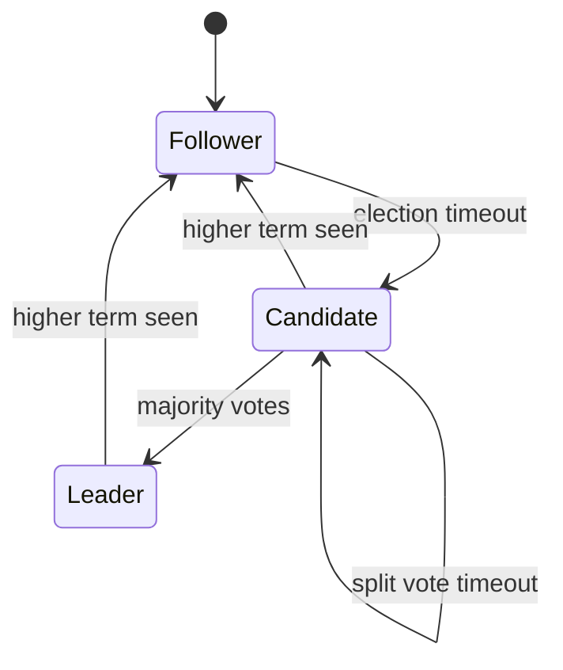
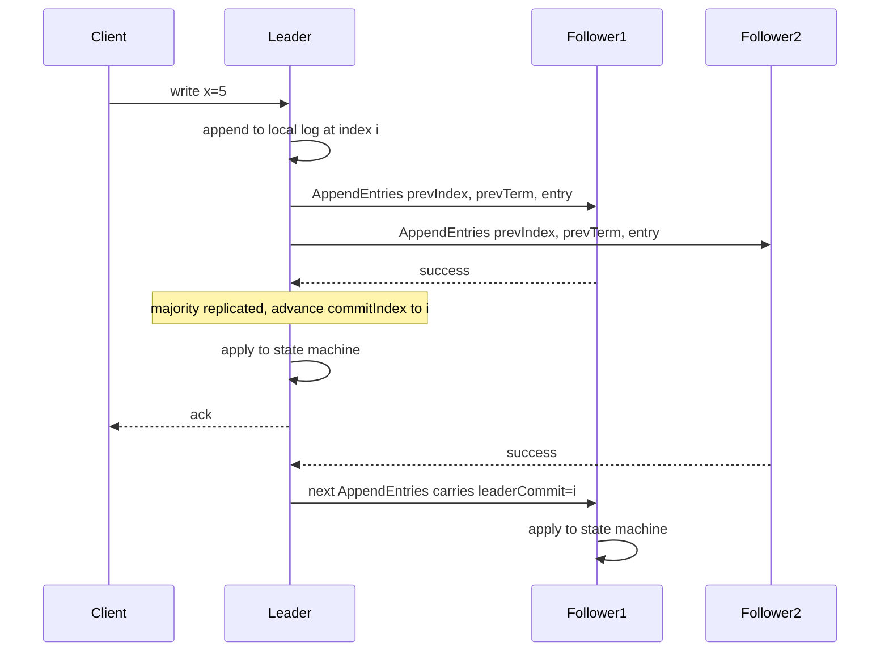
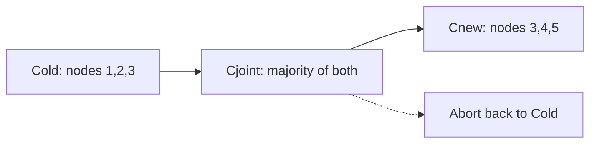

# F09 — Consensus

**Consensus is the machinery that lets a set of unreliable machines agree on one totally ordered sequence of decisions, and every practical system pays for it in latency, quorum math, and operational sharp edges.**

## The Problem Statement

Consensus asks: given $n$ processes that can crash and a network that can delay, reorder, or drop messages, how do all correct processes agree on a single value?

A correct consensus protocol satisfies four properties:

| Property | Statement | What breaks if violated |
| --- | --- | --- |
| Agreement (safety) | No two correct processes decide different values | Split brain, divergent replicas, lost writes |
| Validity (non-triviality) | The decided value was proposed by some process | Protocol can decide garbage |
| Integrity | A process decides at most once | Duplicate application of a command |
| Termination (liveness) | Every correct process eventually decides | System hangs, no progress |

The critical framing for interviews: **consensus is not "picking a leader"**. Leader election is a convenient optimisation. The real primitive is a replicated, totally ordered, durable log. Everything else — leader election, distributed locks, configuration stores, group membership — is built on top of that log.

Replicated state machine model: if every replica applies the same commands in the same order starting from the same initial state, and the state machine is deterministic, all replicas hold identical state. Consensus supplies the ordering; determinism is the application's responsibility.

!!! warning "Determinism is an application obligation"
    A state machine that calls `time.Now()`, reads a random seed, iterates a Go map, or depends on floating-point ordering will diverge across replicas even with a perfect consensus log. This is a real and frequently shipped bug class. Bake non-determinism into the log entry at propose time, never at apply time.

## FLP Impossibility

Fischer, Lynch and Paterson (1985) proved that in an **asynchronous** system with **no bound on message delay** and **at least one crash failure**, no deterministic protocol guarantees consensus terminates.

The intuition: you cannot distinguish a crashed process from an arbitrarily slow one. Any protocol that waits forever for a possibly-crashed process can hang; any protocol that gives up too early can produce two decisions.

What FLP does **not** say:

- It does not say consensus is impossible in practice.
- It does not forbid protocols that are always safe and usually live.
- It applies to deterministic protocols; randomised protocols (Ben-Or) sidestep it probabilistically.

Every production consensus system takes the same escape hatch: **sacrifice guaranteed termination, keep guaranteed safety**. Paxos and Raft never violate agreement, but under sufficiently adversarial timing they can fail to make progress. Failure detectors (timeouts) restore liveness under a partial synchrony assumption: the network is eventually well-behaved for long enough.

!!! note "Partial synchrony is the real model"
    Dwork, Lynch and Stockmeyer's partial synchrony model says there exists an unknown Global Stabilization Time after which message delays are bounded. Production systems assume "the network is mostly fine" and encode that assumption in election timeouts. Tuning election timeouts is literally tuning your assumed synchrony bound.

## Paxos

### Basic (single-decree) Paxos

Roles: proposer, acceptor, learner. In practice a single process plays all three.

=== "Phase 1 — Prepare"

    1. Proposer picks a globally unique, monotonically increasing ballot number $b$.
    2. Sends `Prepare(b)` to all acceptors.
    3. An acceptor that has not promised a higher ballot replies `Promise(b, acceptedBallot, acceptedValue)` and refuses anything below $b$ thereafter.
    4. Proposer needs replies from a majority.

=== "Phase 2 — Accept"

    1. If any promise carried an accepted value, the proposer **must** re-propose the value with the highest accepted ballot. Otherwise it may propose its own.
    2. Sends `Accept(b, v)` to acceptors.
    3. Acceptors accept unless they have promised a higher ballot.
    4. On a majority of accepts, $v$ is chosen. Learners are notified.

The re-proposal rule in Phase 2 is the entire safety argument: any majority intersects any other majority, so a proposer with a fresh majority cannot miss a previously chosen value.

### Multi-Paxos

Running two round trips per command is wasteful. Multi-Paxos observes that Phase 1 is per-ballot, not per-slot: a proposer that wins Phase 1 for ballot $b$ across all future log slots becomes a stable leader and can issue Phase 2 alone — one round trip per command.

That stable proposer is exactly a leader. Multi-Paxos and Raft converge on the same architecture; they differ in how much of it the paper specifies.

!!! gotcha "Multi-Paxos is underspecified by design"
    "Paxos Made Simple" describes single-decree Paxos in four pages and gestures at Multi-Paxos in a paragraph. Log holes, leader handoff, reconfiguration, and snapshotting are all left as exercises. Every Paxos implementation is therefore subtly different, which is exactly the complaint that motivated Raft. If an interviewer asks "why Raft?", the answer is understandability and a specified reconfiguration protocol, not performance.

## Raft

Raft decomposes consensus into leader election, log replication, and safety, with a strong-leader constraint: **log entries only flow leader to follower**.

### Terms

Time is divided into **terms**, monotonically increasing integers acting as logical clocks. Each term has at most one leader. Any message carrying a higher term forces the receiver to step down and update its term. Term comparison is the universal staleness detector.

### Leader Election

- Followers that receive no heartbeat within the election timeout become candidates, increment the term, vote for themselves, and request votes.
- A voter grants a vote if it has not voted this term **and** the candidate's log is at least as up to date as its own.
- "At least as up to date" means: higher last log term wins; if terms tie, longer log wins.

That log-completeness check on the voter side is what guarantees the Leader Completeness Property: a newly elected leader holds every committed entry.

- Election timeouts are randomised (typically 150–300 ms base, or 1–2 s in WAN deployments) to break split votes.

### Log Replication and Commit Index

Key invariants:

| Invariant | Meaning |
| --- | --- |
| Log Matching | If two logs contain an entry with the same index and term, the logs are identical up to that index |
| Leader Append-Only | A leader never overwrites or deletes its own entries |
| Leader Completeness | A committed entry is present in every future leader's log |
| State Machine Safety | If a server applies an entry at index $i$, no other server applies a different entry at $i$ |

`AppendEntries` carries `prevLogIndex` and `prevLogTerm`. A follower rejects if it lacks a matching entry; the leader decrements `nextIndex` and retries, converging on the divergence point, then overwrites the follower's conflicting suffix. Production implementations batch this backtracking by having the follower return the conflicting term and its first index, turning $O(\text{log length})$ round trips into $O(\text{number of conflicting terms})$.

!!! danger "Never commit an entry from a previous term by counting replicas"
    Raft explicitly forbids a leader from marking an entry from an earlier term committed just because it is now on a majority. Figure 8 in the Raft paper shows a concrete interleaving where doing so leads to a committed entry being overwritten. The leader must commit an entry from its **own** term first — hence the no-op entry every Raft leader appends immediately after election. Implementations that skip the no-op have a real safety bug that appears only under specific crash interleavings.

### Raft vs Multi-Paxos

| Dimension | Multi-Paxos | Raft |
| --- | --- | --- |
| Log holes allowed | Yes, slots decided out of order | No, log is contiguous |
| Leader constraint | Any proposer may propose | Strong leader, entries flow one way |
| Follower log divergence | Reconciled per slot | Truncated and overwritten by leader |
| Reconfiguration | Unspecified in the original paper | Joint consensus or single-server change |
| Pipelining | Natural, out-of-order commit | Requires care to preserve contiguity |
| Understandability | Low | The explicit design goal |
| Throughput ceiling | Slightly higher under loss | Slightly lower, head-of-line blocking on holes |

EPaxos and its descendants remove the leader bottleneck by committing commutative commands in one round trip, at the cost of dependency-graph complexity and painful conflict recovery. Very few production systems ship it.

## Quorum Sizes and Fault Tolerance Math

For a majority-quorum protocol with $n$ voting members:

$$
q = \left\lfloor \frac{n}{2} \right\rfloor + 1, \qquad f = \left\lfloor \frac{n-1}{2} \right\rfloor, \qquad n = 2f + 1
$$

| $n$ | Quorum $q$ | Tolerated failures $f$ | Notes |
| --- | --- | --- | --- |
| 1 | 1 | 0 | No fault tolerance, still useful for dev |
| 2 | 2 | 0 | Strictly worse than 1: two ways to lose availability |
| 3 | 2 | 1 | Most common production choice |
| 4 | 3 | 1 | Same $f$ as 3, higher latency and cost |
| 5 | 3 | 2 | Standard for critical control planes |
| 6 | 4 | 2 | Same $f$ as 5, worse |
| 7 | 4 | 3 | Rare, tail latency grows |

### Why an Even Number of Nodes Is Wrong

Going from $n=3$ to $n=4$ does not improve fault tolerance: both tolerate one failure. But $n=4$ has more machines that can fail, so the probability that **some** quorum-breaking failure occurs goes **up**.

With independent node failure probability $p$, the cluster is unavailable when more than $f$ nodes are down:

$$
P_{\text{down}}(n) = \sum_{k=f+1}^{n} \binom{n}{k} p^{k} (1-p)^{n-k}
$$

At $p = 0.01$: $P_{\text{down}}(3) \approx 2.98 \times 10^{-4}$ while $P_{\text{down}}(4) \approx 3.94 \times 10^{-4}$. Four nodes is measurably worse than three, costs 33 percent more, and increases write latency because the quorum is larger.

The one legitimate use of an even count is a transient state during membership change, or a deliberate design with a **witness** that votes but stores no data.

!!! gotcha "Two-node clusters are the worst possible configuration"
    A two-node consensus group requires both nodes for a quorum. It tolerates zero failures while doubling the failure surface, so its availability is strictly lower than a single node. Teams reach for two nodes because "two is more redundant than one". It is not. Use one, three, or two-plus-a-witness.

### Latency and Quorum Shape

Write latency is the time for the leader to hear from the $(q-1)$-th fastest follower — a tail-latency order statistic, not an average. With five nodes you wait for the second fastest of four; with three you wait for the fastest of two. Larger quorums are more resilient to a single slow node but have a strictly higher floor once cross-region RTT dominates.

## Membership Changes

Naively swapping the configuration on each node independently can create two disjoint majorities under the old and new configs simultaneously — two leaders, two committed histories, one corrupted system.

=== "Joint consensus"

    The cluster enters a transitional configuration $C_{old,new}$ where **every decision requires a majority of both** the old and the new configurations. Once $C_{old,new}$ is committed, the leader appends $C_{new}$. No moment exists where a single majority of one config can decide alone.

    Handles arbitrary membership changes, including replacing all members at once. More complex to implement and reason about.

=== "Single-server changes"

    Add or remove one server at a time. Any majority of $C_{old}$ and any majority of $C_{new}$ overlap when the configurations differ by one member, so no joint phase is needed.

    Simpler and the more common implementation. Replacing a three-node cluster wholesale becomes a sequence of six single-member changes.

Operational rules that fall out:

- Configuration entries take effect **as soon as they are appended**, not when committed. A server must use the latest config it has seen, even uncommitted, otherwise a config change that is later truncated can strand it.
- New servers should join as **non-voting learners** first, catch up their log, and only then be promoted. Adding an empty voter immediately enlarges the quorum while that voter cannot help, which can cause an availability drop.
- Removed servers stop receiving heartbeats and will start elections with rising terms, disrupting the cluster. Raft's fix is the **pre-vote** phase: a candidate first asks whether it *would* win before incrementing its term.

!!! gotcha "The removed node that will not stop campaigning"
    Symptom: after you scale a cluster down, the remaining leader repeatedly steps down and throughput collapses in bursts. Mechanism: the removed node no longer receives heartbeats, times out, increments its term, and sends RequestVote; the higher term forces the healthy leader to step down even though the sender is not in the configuration. Mitigation: enable pre-vote, and have servers ignore RequestVote received within the minimum election timeout of a valid heartbeat.

## Log Compaction and Snapshotting

The log is unbounded; the state machine is usually not. Compaction replaces a log prefix with a snapshot of the state machine at that index.

Snapshot metadata must include `lastIncludedIndex` and `lastIncludedTerm` so that `AppendEntries` consistency checks still work at the snapshot boundary.

| Approach | How | Cost | Used by |
| --- | --- | --- | --- |
| Per-replica snapshot | Each node snapshots independently at its own cadence | CPU and IO spike on the snapshotting node | etcd, most Raft libraries |
| Copy-on-write fork | Fork the process or use an immutable structure, serialise in background | Memory spike up to 2x | Redis-style, LMDB backends |
| Incremental / LSM-native | The storage engine's SSTables *are* the snapshot | Cheapest, engine-specific | CockroachDB, TiKV |
| InstallSnapshot RPC | Leader ships a snapshot to a far-behind follower | Large network transfer, can saturate a link | Raft spec |

!!! gotcha "Snapshotting on the leader causes correlated latency spikes"
    Symptom: p99 write latency spikes every N minutes, correlated across the fleet. Mechanism: all replicas hit the same snapshot threshold at similar log indices, so they snapshot at nearly the same time; a fsync-heavy snapshot blocks the apply loop and delays heartbeats. Mitigation: jitter the snapshot trigger per node, snapshot on a background thread with a bounded IO budget, and prefer followers over the leader when the implementation allows it.

!!! gotcha "InstallSnapshot can turn one slow node into a cluster outage"
    A follower that falls behind the leader's log retention triggers a full snapshot transfer. On a multi-GB state machine this saturates the leader's NIC, delaying heartbeats to healthy followers, which then start elections. Rate-limit snapshot transfers, keep enough log retention to make catch-up the common path, and serve snapshots from a follower where supported.

## Read Paths

Reads are where most consensus systems quietly break linearizability.

| Read strategy | Extra round trips | Linearizable | Failure mode |
| --- | --- | --- | --- |
| Read from any follower | 0 | No | Arbitrarily stale, bounded only by replication lag |
| Read from leader, no check | 0 | **No** | Deposed leader serves stale data during a partition |
| ReadIndex | 1 heartbeat round to quorum | Yes | Adds one RTT to every read |
| Leader lease | 0 in steady state | Yes, under a clock-drift bound | Clock skew or a long pause breaks the assumption |
| Quorum read | 1 round to quorum | Yes | Highest latency, highest load |
| Follower read with ReadIndex | 1 round to leader, then local | Yes | Leader still a coordination point |

**ReadIndex**: the leader records its current `commitIndex` as $i$, confirms leadership with a heartbeat round to a quorum, waits until its state machine has applied through $i$, then serves the read. Safe without clock assumptions, costs one RTT.

**Leader lease**: the leader assumes it remains leader for `electionTimeout − maxClockDrift` after the last successful heartbeat quorum, and serves reads locally. Followers promise not to vote during that window. This trades a clock-drift assumption for a full RTT.

!!! danger "Naive leader reads are the most common linearizability bug in production"
    A leader partitioned from its peers does not immediately know it has been deposed. A new leader is elected and accepts writes; the old leader keeps serving reads from its stale local state until its own election timeout fires. The stale-read window equals the election timeout. Any system that says "reads go to the leader so they are consistent" without ReadIndex or a lease is wrong.

## Byzantine vs Crash Fault Tolerance

| Dimension | Crash fault tolerant (Paxos, Raft) | Byzantine fault tolerant (PBFT, Tendermint, HotStuff) |
| --- | --- | --- |
| Failure model | Nodes stop or lag; messages may be lost | Nodes may lie, forge, equivocate, collude |
| Node count for $f$ faults | $n = 2f + 1$ | $n = 3f + 1$ |
| Message complexity per decision | $O(n)$ | $O(n^2)$ classic, $O(n)$ with threshold signatures |
| Cryptography | Optional, usually just TLS | Mandatory signatures on every message |
| Typical deployment | Single administrative domain | Multiple mutually distrusting parties |
| Practical throughput | High | 1 to 2 orders of magnitude lower |

Inside one company's datacenters, crash-fault tolerance is correct: your nodes are not adversarial. BFT is warranted for cross-organisation ledgers, or where firmware and silicon corruption is a modelled threat. Note that BFT does not protect against a correlated software bug — every replica running the same buggy binary fails identically, which is why some systems add checksums and cross-version verification rather than full BFT.

## Use a Consensus System vs Embed One

| Option | Examples | When it fits | Cost |
| --- | --- | --- | --- |
| External coordination service | etcd, ZooKeeper, Consul | Config, leader election, service discovery, locks; low write rate | Extra fleet, extra failure domain, network hop |
| Embedded consensus library | hashicorp/raft, dragonboat, braft, Ratis | Your data plane itself must be strongly consistent and sharded | You now own correctness, upgrades, reconfiguration |
| Consensus-backed database | Spanner, CockroachDB, YugabyteDB, TiDB, FoundationDB | You want transactions and consensus without writing either | Cost, operational learning curve |
| No consensus | Leaderless quorum stores, CRDTs, single-writer designs | Availability beats linearizability | You must handle conflicts in the application |

Heuristics:

- Consensus write throughput is bounded by one leader plus fsync plus a quorum RTT. Typical single-group ceilings are tens of thousands of small writes per second in-region.
- To scale beyond that, **shard into many independent consensus groups** (Spanner, CockroachDB, TiKV all do this). One giant group never scales.
- Do not put high-volume application data in etcd or ZooKeeper. They are metadata stores. Kubernetes clusters melt because of etcd write volume, not because etcd is bad.

## Cross-Region Consensus Latency

Every write costs at least one round trip to the nearest quorum member. Approximate one-way latencies:

| Path | RTT | Minimum commit latency |
| --- | --- | --- |
| Same rack | 0.1 ms | sub-ms plus fsync |
| Same AZ | 0.5 ms | ~1 ms plus fsync |
| Cross-AZ, same region | 1–2 ms | 2–4 ms |
| US-East to US-West | 60–70 ms | 60–70 ms |
| US-East to EU-West | 75–90 ms | 75–90 ms |
| US-East to AP-Southeast | 200–240 ms | 200–240 ms |

With three regions and majority quorums, commit latency is the RTT to the **second** closest region. Placing all three replicas in US-East, US-West and EU means every write pays roughly 70 ms regardless of where the leader is. Mitigations:

- **Leader placement / leaseholder pinning** near the write-heavy workload.
- **Geo-partitioning**: keep EU rows in EU-resident consensus groups so their quorum is local.
- **Three AZs in one region** for latency, with async replication to a second region for DR — accepting non-zero RPO.
- **Batching and pipelining**: amortise the RTT across many commands; throughput scales even when latency does not.

## Witness and Tiebreaker Replicas

A witness (also: voter-only, arbiter, non-voting log-only member depending on vendor) participates in elections and quorum counting but stores little or no state.

Two full regions plus a cheap witness in a third gives you five votes, tolerance of any single region loss, and the storage cost of four replicas instead of six. The witness must be in a **third independent failure domain** — a witness in one of the two data regions gives that region a 3-of-5 majority and defeats the purpose.

!!! gotcha "A witness that stores no data can still be a data-loss vector"
    In some configurations the witness's vote lets a quorum form that excludes the most up-to-date data replica. If the witness plus a lagging replica form a majority while the current replica is unreachable, the elected leader's log may be behind. Raft's log-completeness vote check prevents committed data loss, but designs that count a witness as a data-carrying acknowledgement do lose data. Verify what your vendor's witness actually acknowledges.

## Flexible Paxos

Howard, Malkhi and Spiegelman showed that Paxos does not need majorities — it only needs the Phase 1 quorum and the Phase 2 quorum to **intersect**:

$$
|Q_1| + |Q_2| > n
$$

Classic Paxos sets $|Q_1| = |Q_2| = \lfloor n/2 \rfloor + 1$, which satisfies this, but it is not the only solution. With $n = 5$ you may choose $|Q_2| = 2$ (fast, cheap steady-state commits) as long as $|Q_1| = 4$ (an expensive but rare leader election).

| Configuration ($n=5$) | $Q_1$ election | $Q_2$ replication | Steady-state latency | Failures tolerated in steady state |
| --- | --- | --- | --- | --- |
| Classic majority | 3 | 3 | RTT to 2nd fastest | 2 |
| Write-optimised | 4 | 2 | RTT to fastest | 1 |
| Election-optimised | 2 | 4 | RTT to 3rd fastest | 1 |

The trade-off is explicit: shrinking $Q_2$ speeds up the common path but reduces how many failures the common path survives before an expensive reconfiguration is needed. This same intersection logic underpins Dynamo-style $R + W > N$ tuning, which is worth naming in an interview to show the connection to [F07 Replication & Consistency](f07-replication-consistency.md).

## Gotchas & Corner Cases

!!! gotcha "fsync is the actual durability boundary"
    Symptom: after a correlated power loss or host crash, replicas report committed entries that vanish, or the cluster refuses to elect a leader because logs conflict. Mechanism: Raft requires a voter to persist its vote and log entries **before** responding. Many implementations offer `--unsafe-no-fsync` or batch fsync loosely to hit throughput targets; the safety proof then no longer holds. Mitigation: never disable fsync on voting members, verify the disk actually honours flush (consumer SSDs and some virtualised block devices lie), and use battery-backed or NVMe write caches rather than turning off durability.

!!! gotcha "The no-op after election is not optional"
    Symptom: an entry acknowledged as committed is later overwritten, observed as a phantom write. Mechanism: a new leader that counts replicas of a previous-term entry can mark it committed, but a subsequent leader with a different history may truncate it — Figure 8 of the Raft paper. Mitigation: on election, append a no-op entry in the current term and only advance `commitIndex` past prior-term entries once that no-op commits.

!!! gotcha "Clock-based leader leases break under VM pauses and GC"
    Symptom: two nodes both believe they hold the lease and both serve reads; a client observes a value going backwards. Mechanism: the lease relies on wall-clock arithmetic and a bounded drift assumption. A 30-second stop-the-world GC pause, a VM live migration, or a hypervisor steal spike invalidates the bound while the process thinks only microseconds passed. Mitigation: measure leases with a monotonic clock, subtract a generous safety margin, prefer ReadIndex where latency permits, and alert on GC pause duration and steal time. See [F20 Time, Clocks & Ordering](f20-time-clocks-ordering.md).

!!! gotcha "Adding a voter that has no log shrinks your effective fault tolerance"
    Symptom: a three-node cluster becomes unavailable moments after you add a fourth node. Mechanism: the quorum jumps from 2 to 3 the instant the config entry is appended, but the new node has an empty log and cannot help commit anything until it catches up; one more failure now stalls the cluster. Mitigation: always add new members as learners, wait for the log gap to approach zero, then promote.

!!! gotcha "Disk-full turns a follower into a silent liveness hole"
    Symptom: writes hang cluster-wide although the leader is healthy and all nodes are pingable. Mechanism: followers that cannot append to disk stop acknowledging while still responding to heartbeats at the network layer, so failure detection does not fire. With $n=3$, one such follower plus one crashed node halts commits. Mitigation: alert on free space with enough headroom for the WAL plus a full snapshot, alert on per-follower `matchIndex` lag rather than liveness alone, and reserve space so compaction can always run.

!!! gotcha "Restoring all nodes from the same backup destroys the cluster identity"
    Symptom: after a disaster restore, nodes reject each other, or worse, two clusters with the same identifiers merge and truncate each other's logs. Mechanism: consensus state includes node IDs, cluster ID, term, and vote; naively cloning a disk image duplicates identity and vote state. Mitigation: use the vendor's snapshot-restore tooling which mints a new cluster ID and member set, and never restore a voting member by copying another member's data directory.

!!! gotcha "Asymmetric or one-way partitions cause endless leader churn"
    Symptom: leadership flaps every few seconds; logs show repeated term increments with no obvious network outage. Mechanism: node C can hear the leader but the leader cannot hear C, or a firewall drops one direction. C times out, campaigns, forces the leader to step down, then loses the election because its log is behind — and repeats forever. Mitigation: pre-vote, the check-quorum option so a leader that cannot reach a majority steps down proactively, and monitoring for `term` increments per minute as a first-class SLI.

!!! gotcha "A single consensus group is a single-writer bottleneck no matter how many nodes you add"
    Symptom: adding nodes to "scale" the cluster makes writes slower. Mechanism: all writes serialise through one leader and one quorum round trip; more voters mean a larger quorum and more fan-out on the leader NIC. Mitigation: shard into many groups keyed by data range, and treat cluster size as a fault-tolerance knob, never a throughput knob.

!!! gotcha "Watch and lease APIs make etcd or ZooKeeper a fan-out amplifier"
    Symptom: a config change causes a thundering herd that takes out the coordination cluster and everything depending on it. Mechanism: thousands of clients hold watches on the same key; one write triggers thousands of notifications plus a re-read storm, and session/lease keepalives already consume a fixed baseline write rate. Mitigation: cache aggressively client-side, use hierarchical or sharded watch keys, add jittered backoff to re-reads, and budget lease keepalive traffic as part of the cluster's write capacity.

!!! gotcha "Losing a majority permanently means unsafe recovery or data loss, and there is no third option"
    Symptom: two of three nodes are destroyed; the survivor will not accept writes. Mechanism: the survivor cannot know whether the lost nodes committed entries it never saw, so promoting it may silently discard committed data. Mitigation: run the drill before you need it, document the `force-new-cluster` style procedure with explicit sign-off, and prefer five nodes across three failure domains for anything whose loss is unacceptable.

## SRE Lens

### SLIs and SLOs

| Signal | Definition | Suggested target | Why it matters |
| --- | --- | --- | --- |
| Leader stability | Term increments per hour | < 1 in steady state | Every election is a write-availability gap |
| Commit latency p99 | Propose to commit | Region-dependent, e.g. < 25 ms in-region | Directly bounds every dependent service |
| Apply lag | `commitIndex − appliedIndex` on each node | Near zero | Growing lag means reads go stale and snapshots grow |
| Follower lag | `leader.commitIndex − follower.matchIndex` | Bounded by a few seconds of writes | Predicts InstallSnapshot storms |
| Quorum margin | Healthy voters minus $q$ | >= 1 | Zero margin means the next failure is an outage |
| Proposal failure rate | Rejected or dropped proposals | < 0.1 percent | Early sign of leader overload or backpressure |
| WAL fsync duration p99 | Disk flush time | < 10 ms | The most common cause of election storms |
| DB size vs quota | Backend bytes against the configured limit | < 60 percent | etcd goes read-only when it hits its quota |

### Failure Modes and Detection

| Failure | Symptom | Detection | First response |
| --- | --- | --- | --- |
| Election storm | Term counter climbing, latency spikes | Rate of term increments | Check disk fsync latency and network; raise election timeout |
| Slow disk on leader | Global write latency up, no errors | fsync p99 histogram | Transfer leadership away from the node |
| Follower far behind | Snapshot transfers, NIC saturation | matchIndex lag | Throttle snapshots; replace the node as a learner |
| Quorum loss | All writes fail, reads may still serve | Healthy voter count | Restore a member; unsafe recovery only as last resort |
| Clock skew with leases | Stale reads, rare divergence | NTP offset metric per node | Disable lease reads, fall back to ReadIndex |
| Backend quota exceeded | Cluster read-only, alarms raised | Space alarm metric | Compact revisions, defragment, then disarm alarm |

### Rollout and Migration Risk

- Upgrade one member at a time, always waiting for full log catch-up between steps, and never while quorum margin is zero.
- Consensus protocols encode wire and storage formats; **do not skip versions** and do not run mixed versions longer than the upgrade window.
- Take a verified snapshot before every upgrade and confirm you can restore it in a scratch environment.
- Reconfiguration and upgrade at the same time is the classic way to create a cluster you cannot recover.
- Practice leadership transfer (`MoveLeader` / `transfer-leadership`) as the routine drain primitive; it converts an outage into a sub-second blip.

### Capacity Signals

- Write throughput ceiling is governed by fsync latency, quorum RTT, and batch size — profile all three before assuming CPU is the limit.
- Watch total key count and revision count, not just bytes; history retention drives compaction cost.
- Watch count and lease count are separate capacity dimensions in ZooKeeper and etcd and are frequently the real limit.
- Snapshot size determines recovery time; if a full restore exceeds your RTO, shard the state.

### On-Call Runbook Notes

- Confirm quorum status first, before touching anything. Which nodes are voters, which are healthy, who is leader, what is the term.
- Never restart a majority of nodes at once, even "just to clear it up".
- Never delete a data directory to "reset" a node without first removing it from the configuration.
- Prefer removing a sick member and adding a fresh learner over debugging in place under pressure.
- Keep the unsafe single-node recovery procedure written down, gated by a second approver, with an explicit statement of the data-loss risk.

### Cost

- Consensus multiplies write cost by $n$: five replicas means five fsyncs and five copies of every byte.
- Witnesses cut storage cost while preserving fault tolerance and are the cheapest availability win in multi-region designs.
- Cross-region consensus adds inter-region egress charges on every write, often the dominant line item at scale.
- The largest hidden cost is developer time: an embedded consensus implementation is a multi-year correctness commitment.

## Interview Angle

!!! interview "Probe: why is an odd number of nodes recommended?"
    **Weak**: "Because you need a tiebreaker for elections."

    **Strong**: "Because fault tolerance is $\lfloor (n-1)/2 \rfloor$, so 3 and 4 both tolerate one failure — but 4 has more nodes that can fail, so its probability of quorum loss is higher, and its quorum of 3 makes writes slower. Even counts only make sense transiently during reconfiguration, or with a witness that votes without storing data."

!!! interview "Probe: your service reads from the Raft leader. Is that linearizable?"
    **Weak**: "Yes, the leader always has the latest data."

    **Strong**: "Not by itself. A partitioned leader keeps serving stale reads until its election timeout expires while a new leader accepts writes. You need ReadIndex — confirm leadership with a heartbeat quorum and wait for apply to catch up — or a leader lease, which trades a round trip for a bounded clock-drift assumption. Leases are unsafe if a GC pause or VM migration exceeds the drift bound, so I would default to ReadIndex and only use leases with monotonic clocks and a wide margin."

!!! interview "Probe: how do you scale a consensus system to a million writes per second?"
    **Weak**: "Add more nodes to the cluster."

    **Strong**: "You do not scale a group; you scale the number of groups. Range- or hash-partition the keyspace into thousands of independent Raft groups, place leaders to spread load, and use a transaction layer above them when a write spans groups. Within a group, batching and pipelining amortise the fsync and RTT costs. Adding voters to one group makes it slower, not faster."

!!! interview "Probe: walk me through what happens when the leader's datacenter is cut off."
    **Weak**: "A new leader gets elected."

    **Strong**: "Followers stop receiving heartbeats and after a randomised election timeout one campaigns with an incremented term. Voters grant only if the candidate's log is at least as complete as theirs, which guarantees the new leader holds every committed entry. Write availability is unavailable for roughly one election timeout plus one RTT. Meanwhile the isolated old leader still thinks it is leader and, absent ReadIndex or check-quorum, may serve stale reads until its own timeout. In-flight writes it acknowledged locally but never committed to a quorum are lost, so clients must treat unacked and timed-out writes as unknown and retry idempotently."

!!! interview "Probe: when would you not use consensus?"
    **Weak**: "When you do not need consistency."

    **Strong**: "When the workload can tolerate convergent rather than linearizable semantics, and the cost of a cross-AZ or cross-region quorum on every write is unacceptable. Shopping carts, presence, counters, and telemetry are better served by leaderless replication with CRDTs or last-writer-wins with an explicit conflict story. I would also avoid it when a single-writer design works: partition so each key has one owner, and use a small consensus-backed store only to lease ownership."

??? note "Rapid-fire follow-ups to rehearse"
    - What exactly does FLP prohibit, and how does Raft live with it?
    - Why must a Raft leader commit an entry from its own term before committing older ones?
    - What is joint consensus and when do you need it over single-server changes?
    - How does pre-vote prevent a disruptive rejoining node?
    - What are the Flexible Paxos quorum conditions and what do you buy by shrinking $Q_2$?
    - Why does BFT need $3f+1$ instead of $2f+1$?
    - What is the difference between `commitIndex` and `lastApplied`, and which does a linearizable read depend on?
    - How do you recover a cluster that has permanently lost a majority, and what do you tell the business about data loss?

## Key Takeaways

- Consensus produces a replicated, totally ordered, durable log; leaders, locks and configuration stores are applications of that log, not the primitive itself.
- FLP forces every practical protocol to choose safety over guaranteed liveness; timeouts encode an assumed synchrony bound, and tuning them is tuning that assumption.
- Fault tolerance is $\lfloor (n-1)/2 \rfloor$, so even node counts add cost and failure surface without adding tolerance; two-node clusters are strictly worse than one.
- Raft's strong-leader model, log-completeness vote check, and current-term commit rule are the three pillars of its safety; the post-election no-op is mandatory, not decorative.
- Reads are the most common place linearizability is lost: use ReadIndex, or a lease with a monotonic clock and a generous drift margin.
- Membership changes must go through joint consensus or single-server steps, and new members should always start as catching-up learners.
- Scale by sharding into many consensus groups; a single group's throughput is bounded by one leader, one fsync path, and one quorum RTT.
- Cross-region quorums cost a wide-area RTT on every write; geo-partitioning, leader placement, and witness replicas are the levers that keep that affordable.

## Further Reading

- Leslie Lamport, *The Part-Time Parliament* (1998) — the original Paxos paper.
- Leslie Lamport, *Paxos Made Simple* (2001) — the readable restatement.
- Diego Ongaro and John Ousterhout, *In Search of an Understandable Consensus Algorithm* (Raft, USENIX ATC 2014), and Ongaro's PhD thesis *Consensus: Bridging Theory and Practice* for reconfiguration, compaction and client interaction detail.
- Fischer, Lynch and Paterson, *Impossibility of Distributed Consensus with One Faulty Process* (1985).
- Dwork, Lynch and Stockmeyer, *Consensus in the Presence of Partial Synchrony* (1988).
- Chandra, Griesemer and Redstone, *Paxos Made Live: An Engineering Perspective* (PODC 2007) — the gap between the paper and a shipping system.
- Howard, Malkhi and Spiegelman, *Flexible Paxos: Quorum Intersection Revisited* (2016).
- Corbett et al., *Spanner: Google's Globally-Distributed Database* (OSDI 2012) — Paxos groups plus TrueTime.
- Castro and Liskov, *Practical Byzantine Fault Tolerance* (OSDI 1999).
- Moraru, Andersen and Kaminsky, *There Is More Consensus in Egalitarian Parliaments* (EPaxos, SOSP 2013).
- Kyle Kingsbury, the Jepsen analyses — particularly the etcd, Zookeeper, and MongoDB reports for real safety violations found in shipping consensus systems.
- Martin Kleppmann, *Designing Data-Intensive Applications*, Chapter 9.

---

Related: [F07 Replication & Consistency](f07-replication-consistency.md) · [F08 CAP & PACELC](f08-cap-pacelc.md) · [F10 Distributed Transactions](f10-distributed-transactions.md) · [F19 Concurrency Control](f19-concurrency-control.md) · [F20 Time, Clocks & Ordering](f20-time-clocks-ordering.md)
