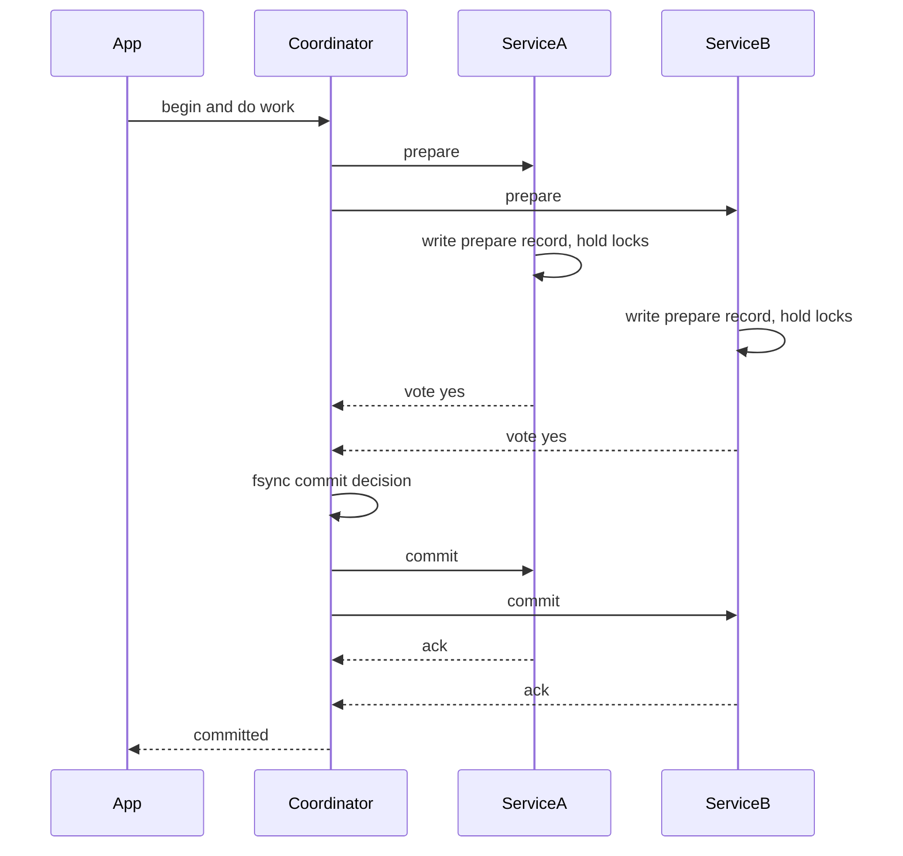
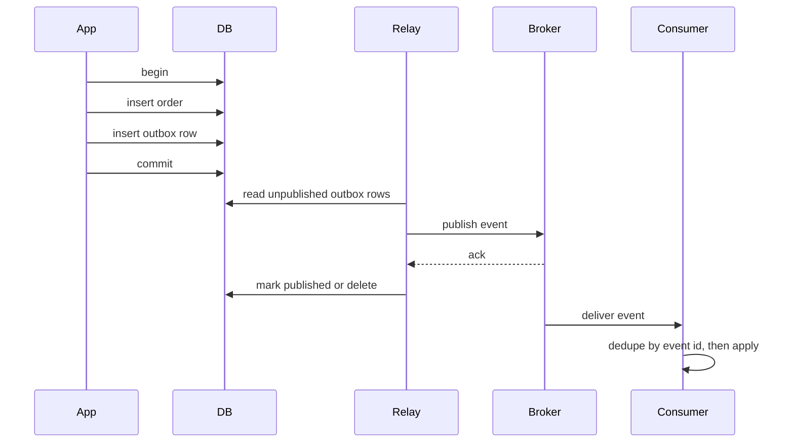

# F10 — Distributed Transactions

**Atomicity across independent failure domains is either bought with a blocking coordinator, approximated with compensations, or designed away by moving the transaction boundary — and the third option is usually the right one.**

## ACID When the Data Spans Services

A local ACID transaction is cheap because one storage engine owns the write-ahead log, the lock manager, and the durability decision. Split the data across two services and each of the four properties has to be re-earned.

| Property | Local database | Across services | What it costs |
| --- | --- | --- | --- |
| Atomicity | WAL plus undo/redo, free | Needs a commit protocol or compensations | Blocking coordinator, or eventual atomicity |
| Consistency | Constraints, foreign keys | No cross-service constraints exist | Application-level invariant checks |
| Isolation | MVCC or 2PL in one lock manager | No global lock manager | Semantic locks, or accept anomalies |
| Durability | One fsync | $n$ independent fsyncs that can disagree | Coordination round trips |

The uncomfortable truth: a "distributed transaction" is really a **distributed agreement problem wearing a database costume**. Atomic commit reduces to consensus among the participants about a single bit (commit or abort). That is why 2PC blocks and why the fix is to make the coordinator itself fault-tolerant via [consensus](f09-consensus.md).

!!! note "Atomic commit is harder than consensus in one specific way"
    Consensus can decide any proposed value; atomic commit must decide `abort` if *any* participant votes no, and `commit` only if *all* vote yes. That unanimity requirement means a single unreachable participant can force an abort or a wait — you cannot majority-vote your way past a participant that holds a lock.

## Two-Phase Commit



### Protocol Steps

1. **Prepare / voting phase.** The coordinator asks every participant to prepare. A participant that votes yes must durably record enough to commit *or* abort later, and must hold its locks until it hears the decision. Voting yes is a **promise it cannot retract**.
2. **Decision.** The coordinator collects votes. All yes means commit; any no or timeout means abort. It writes the decision to its own durable log **before** telling anyone — this write is the point of no return.
3. **Commit / abort phase.** The coordinator broadcasts the decision. Participants apply it, release locks, and acknowledge. The coordinator retries until every participant acknowledges, then forgets the transaction.

### The Coordinator-Blocking Failure

If the coordinator crashes **after** some participants voted yes but **before** the decision reaches them, those participants are **in doubt**. They cannot commit (the decision might have been abort), cannot abort (it might have been commit), and cannot release locks. They block until the coordinator recovers.

Consequences an SRE feels:

- Rows or ranges stay locked, so unrelated traffic touching those rows piles up and the blocking spreads.
- Connection pools fill with waiting requests; the outage propagates upward far beyond the two services in the transaction.
- Manual "heuristic" resolution (an operator force-commits or force-aborts) can break atomicity for real — one participant commits, the other aborts.

Mitigations, in order of preference:

| Mitigation | Mechanism | Residual risk |
| --- | --- | --- |
| Replicated coordinator | Coordinator log on Raft/Paxos so it survives failure | Still blocks during failover window |
| Cooperative termination | Participants ask each other for the decision | Only works if some participant already learned it |
| Short prepare timeouts with presumed abort | Participants abort if no decision within a bound | Can abort a transaction the coordinator committed |
| Lock-free prepare | Prepare reserves without exclusive locks, e.g. balance holds | Requires application redesign |
| Do not use 2PC | Sagas, outbox, boundary redesign | Weaker isolation, must handle compensation |

!!! danger "Presumed abort is not a free fix"
    Adding a participant-side timeout that aborts an in-doubt transaction converts a liveness problem into a **safety** problem: if the coordinator did decide commit, you now have a partially committed transaction. Either accept blocking with a fault-tolerant coordinator, or leave 2PC behind entirely. Do not split the difference silently.

### Where 2PC Is Legitimately Used

- **XA transactions** across a database and a message broker in legacy enterprise stacks.
- **Inside** a distributed database, across shards, where the coordinator's state is itself Raft-replicated and participants are trusted homogeneous nodes: Spanner, CockroachDB, YugabyteDB, TiDB, FoundationDB all use 2PC internally.
- **Never** as a general mechanism between independently deployed microservices owned by different teams, because prepare-phase lock hold time becomes coupled to another team's deploy schedule and GC pauses.

!!! gotcha "2PC latency is not two round trips, it is two round trips plus everyone's slowest fsync"
    Commit latency is $\max_i(\text{RTT}_i + \text{fsync}_i)$ across participants, twice, plus the coordinator's own log write. One participant on a slow disk sets the latency for every transaction it touches. Measure per-participant prepare latency separately, never just the aggregate.

## Three-Phase Commit and Why Nobody Uses It

3PC inserts a `pre-commit` phase between vote and commit so participants learn that everyone voted yes before anyone commits. That makes it non-blocking **under a fail-stop model with a synchronous network and perfect failure detection**.

| Assumption 3PC needs | Reality |
| --- | --- |
| Bounded message delay | Networks have unbounded delay tails |
| Accurate failure detection | You cannot distinguish crashed from slow — this is FLP again |
| No network partitions | Partitions happen |

Under a partition, 3PC can produce a genuine split: one group times out into commit while another times out into abort. It trades a well-understood blocking failure for a rare, silent, correctness-violating failure, plus an extra round trip on every transaction. The modern answer to 2PC's blocking is not 3PC — it is a **consensus-replicated coordinator** (sometimes called Paxos Commit), which keeps 2PC's safety while removing the single point of failure.

## Percolator-Style Distributed Transactions

Google's Percolator layered snapshot-isolation transactions over Bigtable with no central lock manager, using per-row metadata columns and a timestamp oracle. TiDB and many other systems adopted the design.

```text
Columns per data row:
  data:<ts>   the value written at start_ts
  lock:<ts>   present while the row is locked by an uncommitted txn
  write:<ts>  pointer from commit_ts to the data at start_ts
```

**Protocol:**

1. Get `start_ts` from a timestamp oracle. All reads use this snapshot.
2. **Prewrite**: for each written row, check for a `write` record after `start_ts` (write-write conflict, abort) and for any existing `lock` (conflict, abort or resolve). Write the value at `start_ts` and place a `lock`. One row is designated the **primary**; all others store a pointer to it.
3. Get `commit_ts` from the oracle.
4. **Commit primary**: atomically, within the single-row transaction the underlying store provides, remove the primary lock and write the `write` record. **This single-row write is the atomic commit point of the whole transaction.**
5. **Commit secondaries** asynchronously; they can be cleaned up lazily.

The clever part: crash recovery needs no coordinator. A reader that encounters a stale lock inspects the primary row. If the primary has a `write` record, the transaction committed and the reader rolls the secondary forward. If the primary still holds a lock older than the TTL, the transaction is dead and the reader rolls it back. **Recovery is driven by readers, not by a coordinator.**

| Aspect | Classic 2PC | Percolator |
| --- | --- | --- |
| Coordinator state | Durable, must survive | None; state is in the primary row |
| Blocking on coordinator crash | Yes | No; readers resolve |
| Isolation | Depends on participant locks | Snapshot isolation |
| Latency | 2 RTT plus fsyncs | 2 RTT plus oracle round trips |
| Bottleneck | Coordinator | Timestamp oracle |
| Cleanup | Coordinator-driven | Lazy, reader-driven |

!!! gotcha "The timestamp oracle is a global serialisation point"
    Percolator-style systems need monotonic timestamps from a single logical source. That source must be highly available and is on the critical path of every transaction. It is usually made fault-tolerant with consensus and made fast by handing out ranges in batches, but it caps transaction rate and pins latency to the oracle's location. Spanner's TrueTime exists precisely to remove this bottleneck — see [F20 Time, Clocks & Ordering](f20-time-clocks-ordering.md).

## Sagas

A saga is a sequence of local transactions $T_1, T_2, \dots, T_n$, each with a compensating transaction $C_1, \dots, C_{n-1}$. If $T_k$ fails, run $C_{k-1}, \dots, C_1$ in reverse order. There is no global atomicity; there is eventual "all effects applied, or all effects undone".

### Orchestration vs Choreography

=== "Orchestration"

    A central saga orchestrator owns the state machine and explicitly calls each step.

    ```mermaid
    sequenceDiagram
      participant O as OrderSaga
      participant P as Payment
      participant I as Inventory
      participant S as Shipping
      O->>P: authorize
      P-->>O: authorized
      O->>I: reserve
      I-->>O: reserved
      O->>S: create shipment
      S-->>O: failed
      O->>I: release reservation
      O->>P: void authorization
      O->>O: mark order failed
    ```

    **Pros**: the workflow is visible in one place, easy to reason about, easy to query "where is order 123 stuck", natural home for timeouts and retries.

    **Cons**: the orchestrator is a coupling point and can drift toward a distributed monolith; it needs its own durable state and HA story.

=== "Choreography"

    Each service reacts to events published by others; no central controller. `OrderCreated` triggers payment, which emits `PaymentAuthorized`, which triggers inventory, which emits `InventoryReserved`, and so on. Failures propagate the same way: `ShipmentFailed` is consumed by inventory and payment, each of which runs its own compensation.

    **Pros**: no central component, services stay decoupled, easy to add a new subscriber.

    **Cons**: the workflow exists nowhere as a single artefact; cyclic event dependencies emerge; debugging a stuck saga requires correlating traces across every service; compensation logic is scattered.

| Criterion | Orchestration | Choreography |
| --- | --- | --- |
| Workflow visibility | Explicit, one place | Emergent, implicit |
| Coupling | Orchestrator knows all participants | Participants know event contracts |
| Debuggability | Query saga state | Reconstruct from traces and logs |
| Adding a step | Change the orchestrator | Add a subscriber |
| Risk at scale | Orchestrator becomes a god service | Nobody can explain the flow |
| Recommended for | Business-critical flows: payments, orders | Loose fan-out: notifications, analytics |

Rule of thumb: orchestrate anything with money or compensations in it; choreograph fan-out side effects.

### Compensating Actions

A compensation is **not** a rollback. It is a new, forward-moving business transaction that semantically offsets a prior one.

| Original action | Naive "rollback" | Real compensation |
| --- | --- | --- |
| Charge card | Delete the charge row | Issue a refund, which appears on the statement |
| Send email | Impossible | Send a correction email |
| Reserve seat | Delete reservation | Release reservation, possibly notify waitlist |
| Ship package | Impossible | Initiate return, credit the customer |
| Decrement stock | Increment stock | Increment stock and re-evaluate backorders |

Requirements every compensation must meet:

- **Idempotent**: it will be retried. See [F11 Idempotency & Exactly-Once](f11-idempotency.md).
- **Commutative-safe**: it may run after other unrelated changes to the same entity.
- **Always eventually succeeds**: a compensation that can fail permanently leaves the system inconsistent with no recovery path. Compensations must ultimately land in a durable retry queue with alerting, never a silent drop.
- **Auditable**: financial and regulatory review will ask why a refund exists.

!!! warning "Some steps are not compensatable, so order them last"
    Classify each step as compensatable, pivot, or retriable. Compensatable steps can be undone. The **pivot** is the point of no return. Everything after the pivot must be retriable-until-success. Design the saga so irreversible steps (send email, hand to a carrier, call an external API) come after the pivot, and everything reversible comes before it.

### Isolation Anomalies Sagas Expose

Sagas give you atomicity (eventually) and durability, but **no isolation**. The classic anomalies:

| Anomaly | Description | Concrete example |
| --- | --- | --- |
| Lost update | Two sagas read the same state and overwrite each other | Two orders read stock 1, both decrement, stock goes to -1 |
| Dirty read | A saga reads intermediate state that is later compensated | Customer sees a balance reflecting a payment that gets refunded |
| Fuzzy / non-repeatable read | A saga reads the same entity twice and gets different values | Price changes mid-checkout |

Countermeasures from the saga literature:

| Countermeasure | How it works | Cost |
| --- | --- | --- |
| Semantic lock | Mark the record with an in-progress flag or state, e.g. `PENDING` | Other sagas must handle the flag; risk of stranded locks |
| Commutative updates | Use `balance = balance + delta` instead of read-modify-write | Only works for commutative operations |
| Pessimistic view | Reorder steps so risky reads happen after the pivot | Constrains business flow |
| Reread value | Re-read and verify unchanged before writing (optimistic check) | Extra round trip, retry loops |
| Version file | Record operations and reorder them on arrival | Complex |
| By value | Route low-risk transactions through sagas, high-risk through 2PC | Two mechanisms to maintain |

**Semantic locks** deserve emphasis: setting `order.status = PENDING_PAYMENT` is a lock at the business level. It requires every other code path that touches orders to know what `PENDING_PAYMENT` means, and it requires a sweeper that expires stale pending states — otherwise a crashed saga leaves the record locked forever.

!!! gotcha "Semantic locks with no expiry sweeper are a slow-motion outage"
    Symptom: over weeks, a growing set of records is stuck in `PENDING`, customers report items they cannot buy or cancel, and support opens manual tickets. Mechanism: the saga instance died between setting the flag and clearing it, and nothing owns the flag's lifecycle. Mitigation: every semantic lock carries a `locked_at` timestamp and an owning saga ID, a reaper job compensates or force-releases after a bounded TTL, and you alert on the count and age of records in transitional states.

## TCC — Try, Confirm, Cancel

TCC is 2PC pushed into the application layer, where "prepare" is a business-level reservation rather than a database lock.

| Phase | Semantics | Example: payment |
| --- | --- | --- |
| Try | Reserve resources, validate, no visible business effect | Place a hold on the card; move funds to a frozen sub-balance |
| Confirm | Make the reservation real. Must be idempotent, must not fail for business reasons | Capture the hold |
| Cancel | Release the reservation. Must be idempotent | Void the hold |

```python
class InventoryTCC:
    def try_reserve(self, txn_id: str, sku: str, qty: int) -> None:
        # Atomic within the local DB. available drops, reserved rises.
        db.execute("""
            INSERT INTO reservations (txn_id, sku, qty, state, expires_at)
            VALUES (:t, :s, :q, 'TRYING', now() + interval '5 minutes')
            ON CONFLICT (txn_id) DO NOTHING
        """, t=txn_id, s=sku, q=qty)
        rows = db.execute("""
            UPDATE stock SET available = available - :q, reserved = reserved + :q
            WHERE sku = :s AND available >= :q
        """, q=qty, s=sku)
        if rows == 0:
            raise InsufficientStock(sku)

    def confirm(self, txn_id: str) -> None:
        # Idempotent: only acts on a TRYING row.
        db.execute("""
            UPDATE reservations SET state = 'CONFIRMED'
            WHERE txn_id = :t AND state = 'TRYING'
        """, t=txn_id)
        # reserved is consumed; available already decremented in try.

    def cancel(self, txn_id: str) -> None:
        # Idempotent, and safe if try never ran: insert a CANCELLED tombstone
        # first so a late-arriving try cannot resurrect the reservation.
        ...
```

Compared to sagas:

| Dimension | Saga | TCC |
| --- | --- | --- |
| Intermediate visibility | Effects are immediately visible | Reservations are invisible to other business flows |
| Undo mechanism | Compensating business transaction | Cancel a reservation, no visible artefact |
| Isolation | None by default | Better: resources are held, not consumed |
| Implementation burden | One compensation per step | Three endpoints per participant |
| Resource holding | None | Yes, so you need TTL expiry |

The hard cases in TCC are **empty cancel** (cancel arrives before try, due to network reordering) and **hanging try** (try arrives after cancel). Both are solved by recording a cancellation tombstone keyed by transaction ID and having `try` refuse to act if a tombstone exists.

## The Dual-Write Problem

The single most common distributed-transaction bug in microservice systems:

```python
# BROKEN: two writes, no atomicity
def place_order(order):
    db.insert(order)                      # (1) commits
    broker.publish("OrderCreated", order) # (2) may fail, or the process may die
```

Four failure interleavings:

| Order of operations | Failure point | Result |
| --- | --- | --- |
| DB then broker | Crash after (1) | Order exists, nobody downstream knows. Silent inconsistency. |
| DB then broker | Broker publish fails | Same, unless you retry — and retries can double-publish |
| Broker then DB | DB insert fails | Downstream acts on an order that does not exist. Phantom. |
| Either | Broker ack lost | Duplicate publish on retry |

Wrapping the publish in the DB transaction does not help: the broker is not transactional with your database, and a transaction that succeeds locally can still have published on a path that later rolls back.

### Transactional Outbox

Write the event to an `outbox` table **inside the same local transaction** as the business data. A separate relay publishes from the outbox.

```sql
BEGIN;
  INSERT INTO orders (id, customer_id, total, status)
  VALUES ('o-123', 'c-9', 4200, 'CREATED');

  INSERT INTO outbox (id, aggregate_type, aggregate_id, event_type, payload, created_at)
  VALUES (gen_random_uuid(), 'order', 'o-123', 'OrderCreated',
          '{"orderId":"o-123","total":4200}'::jsonb, now());
COMMIT;
```



Two relay implementations:

=== "Polling publisher"

    A worker runs `SELECT ... FROM outbox WHERE published_at IS NULL ORDER BY id LIMIT n FOR UPDATE SKIP LOCKED`, publishes, then marks rows published.

    Simple, works on any database, no extra infrastructure. Costs polling latency and constant query load; needs an index that stays small, so delete or partition published rows.

=== "CDC / log tailing"

    A change-data-capture connector (Debezium on the Postgres WAL, MySQL binlog, or a DynamoDB stream) tails the transaction log and publishes outbox inserts.

    Lower latency, no polling load, captures every committed row exactly once from the log's perspective. Costs a connector fleet, replication slot management, and schema-evolution discipline.

!!! gotcha "An unconsumed Postgres replication slot will fill your disk and take down the primary"
    Symptom: the database's WAL directory grows without bound; eventually the primary refuses writes and the whole service is down. Mechanism: a logical replication slot pins WAL segments until the consumer confirms its LSN; if the CDC connector is stopped, crashed, or lagging, WAL is retained forever. Mitigation: alert on `pg_replication_slots.confirmed_flush_lsn` lag in bytes, set `max_slot_wal_keep_size`, and treat "delete the abandoned slot" as a documented runbook step for decommissioned connectors.

!!! gotcha "The outbox guarantees at-least-once, never exactly-once"
    A relay can publish, crash before marking the row published, and publish again on restart. The outbox solves the **dual-write** problem — it does not solve duplicates. Consumers must be idempotent regardless.

### Alternatives to the Outbox

| Pattern | Mechanism | When to prefer |
| --- | --- | --- |
| Listen-to-yourself | Publish to the log first, consume your own event to write the DB | The log is your source of truth; adds read-your-writes lag |
| Event sourcing | The event log *is* the state; no dual write exists by construction | Willing to rebuild read models and handle schema evolution |
| CDC on business tables | Derive events directly from row changes, no outbox table | You accept internal schema leaking into event contracts |
| Outbox table | Explicit event contract, decoupled from table schema | Default choice for most services |

CDC directly on business tables is tempting and usually regretted: your internal column names become a published API, and a routine migration becomes a breaking change for every consumer.

## Idempotent Consumers

At-least-once delivery plus an idempotent consumer is the industry-standard substitute for distributed transactions.

```go
func (c *Consumer) Handle(ctx context.Context, msg Message) error {
    tx, err := c.db.BeginTx(ctx, nil)
    if err != nil {
        return err
    }
    defer tx.Rollback()

    // Dedupe and side effect share one local transaction.
    res, err := tx.ExecContext(ctx,
        `INSERT INTO processed_messages (message_id, consumer, processed_at)
         VALUES ($1, $2, now()) ON CONFLICT DO NOTHING`,
        msg.ID, c.name)
    if err != nil {
        return err
    }
    if n, _ := res.RowsAffected(); n == 0 {
        return tx.Commit() // already processed, ack without reapplying
    }

    if err := c.apply(ctx, tx, msg); err != nil {
        return err
    }
    return tx.Commit()
}
```

The essential property: the **dedupe record and the side effect commit atomically in the same local transaction**. If they are in different stores you have recreated the dual-write problem inside your fix.

## When to Avoid Distributed Transactions Entirely

Before reaching for 2PC, sagas, or TCC, ask whether the transaction boundary is in the wrong place.

| Symptom | Redesign |
| --- | --- |
| Two services always change together | They are one service, or one aggregate. Merge them. |
| A transaction spans many shards | Repartition so the transactional unit lives on one shard: shard orders by customer, not by order ID |
| A cross-service constraint must hold | Move the constraint into the service that owns it and expose a reservation API |
| Global uniqueness across shards | Use a single-owner index shard, or a natural key that hashes to one place |
| A saga has more than about five steps | The domain boundaries are wrong; too many services own one business fact |
| Read-modify-write across services | Make the update commutative or move the counter into one owner |

Practical patterns that dissolve the problem:

- **Single-writer per aggregate.** Route all commands for an entity to one owner (partition, actor, or consumer group) so all mutations are local and serialised.
- **Reservation instead of coordination.** "Hold funds" and "hold inventory" are local transactions that become durable promises, redeemable later.
- **Accept eventual consistency with a reconciliation job.** Nightly (or continuous) reconciliation that detects and repairs divergence is often cheaper, more debuggable, and more available than synchronous coordination — and finance teams already expect it.
- **Make the operation naturally idempotent and retryable**, then retry forever with backoff instead of coordinating.

!!! tip "The senior move in an interview"
    When asked to make an operation atomic across services, first argue about the boundary. "Payment and ledger entries belong to the same aggregate, so I would keep them in one transactional store and use a saga only between order, inventory and shipping, which genuinely have independent lifecycles." That answer signals design judgement, not just protocol recall.

## Gotchas & Corner Cases

!!! gotcha "A 2PC participant that votes yes must not be able to change its mind, including on restart"
    Symptom: after a participant restarts, a transaction the coordinator committed is missing on that participant, corrupting the invariant silently. Mechanism: the prepare record was written to a buffer that was not fsynced, or recovery logic treats unknown transactions as abort. Mitigation: fsync the prepare record before voting yes, and on recovery always query the coordinator for in-doubt transactions rather than assuming abort.

!!! gotcha "Compensations run in the wrong order and undo the wrong thing"
    Symptom: a refund is issued for an order that was never charged, or inventory is released twice. Mechanism: compensations were fired concurrently or in forward order, and each assumed the others had not run. Mitigation: run compensations strictly in reverse order, make each one idempotent and keyed by the saga instance ID, and record the last successfully compensated step durably so a crashed compensation resumes rather than restarts.

!!! gotcha "The saga log and the business data are in different databases"
    Symptom: the orchestrator believes step 3 succeeded but the participant has no record of it, or vice versa. Mechanism: the orchestrator writes saga state to its own store and calls the participant over the network — a dual write. Mitigation: participants must be idempotent and must expose a query-by-saga-ID endpoint so the orchestrator can reconcile "did this actually happen" instead of trusting its own log.

!!! gotcha "Compensation arrives before the action it compensates"
    Symptom: a cancel is a no-op, then the original try lands and reserves resources that are never released. Mechanism: network reordering or a retry storm inverts message order. Mitigation: write a cancellation tombstone keyed by transaction ID; the `try` handler must check for the tombstone and refuse. This is TCC's "empty cancel plus hanging try" problem and it applies to any compensation-based design.

!!! gotcha "Outbox rows are published in the wrong order after a table grows"
    Symptom: consumers see `OrderShipped` before `OrderCreated`. Mechanism: the relay parallelises publishing for throughput, or the outbox is keyed by a UUID with no ordering, or partitioning by round-robin splits an aggregate's events across broker partitions. Mitigation: use a monotonic sequence within an aggregate, publish with the aggregate ID as the partition key so per-key order is preserved, and make consumers tolerant of out-of-order arrival where you cannot guarantee it.

!!! gotcha "Gap-free sequences from a database break the polling outbox"
    Symptom: the relay reads up to `id = 100`, then a row with `id = 97` appears and is never published. Mechanism: sequence values are allocated before commit, so transactions commit out of order and a lower ID becomes visible after a higher one was already scanned. Mitigation: do not use "greater than last seen ID" as the cursor. Mark rows published with a status column and query for unpublished rows, or use `FOR UPDATE SKIP LOCKED` on unprocessed rows.

!!! gotcha "XA plus a connection pool leaks in-doubt transactions across pooled connections"
    Symptom: intermittent `XAER_RMFAIL` and transactions stuck in the database's prepared-transaction list, eventually blocking vacuum and consuming transaction ID space. Mechanism: prepared transactions are session-independent and survive the connection that created them; if the app forgets them, nothing cleans them up. In Postgres, orphaned prepared transactions block `VACUUM` and can drive the cluster toward transaction ID wraparound. Mitigation: monitor `pg_prepared_xacts` with an age threshold, alert at minutes not days, and require a recovery scanner in any XA deployment.

!!! gotcha "Saga timeouts and participant timeouts are set independently and disagree"
    Symptom: the orchestrator gives up and compensates, then the participant's slow operation succeeds, leaving a resource consumed with no owner. Mechanism: the orchestrator's step timeout is shorter than the participant's internal retry budget. Mitigation: propagate an absolute deadline with the request, have the participant abandon work past the deadline, and always follow a timeout with a **query** for actual state before compensating.

!!! gotcha "Dedupe tables are unbounded and eventually become the bottleneck"
    Symptom: consumer throughput degrades over months; the dedupe insert becomes the slowest query; storage cost climbs. Mechanism: `processed_messages` grows forever with no retention policy, and its index no longer fits in memory. Mitigation: partition by day and drop old partitions, size the retention window to exceed the maximum possible redelivery age including the DLQ replay window, and alert if a message older than the window arrives.

!!! gotcha "The retry that changes the payload"
    Symptom: a client retries a failed `POST /transfers` with a corrected amount and the same request ID; the server returns the original response and the correction is silently ignored — or worse, applies both. Mechanism: idempotency keyed only by request ID without binding the payload. Mitigation: store a hash of the canonical request body with the key and return `409 Conflict` when the same key arrives with a different body. Covered in depth in [F11 Idempotency & Exactly-Once](f11-idempotency.md).

## SRE Lens

### SLIs and SLOs

| Signal | Definition | Target guidance | Why |
| --- | --- | --- | --- |
| Saga completion rate | Sagas reaching a terminal state | > 99.9 percent within the business SLA | The core correctness signal |
| Saga age p99 | Time from start to terminal state | Business-flow dependent, e.g. < 60 s | Long-running sagas hold semantic locks |
| Stuck saga count | Sagas in a non-terminal state past their deadline | 0, page on any | Each one is a customer with a broken order |
| Compensation rate | Compensations per 1000 sagas | Baseline it; alert on deviation | A spike means a downstream partner is failing |
| Compensation failure rate | Compensations that exhaust retries | 0, page immediately | Unrecoverable inconsistency |
| Outbox lag | Age of the oldest unpublished row | < 5 s | Directly bounds downstream staleness |
| Outbox depth | Unpublished row count | Bounded, trending flat | Growth means the relay cannot keep up |
| In-doubt transaction age | Oldest prepared transaction | < 30 s, page beyond | Blocking locks spread |
| Duplicate suppression rate | Messages rejected by dedupe | Baseline; a spike means a redelivery storm | Confirms idempotency is doing work |
| Reconciliation drift | Mismatched records per run | Near zero, trend-tracked | The last line of defence |

### Failure Modes and Detection

| Failure | Symptom | Detection | First response |
| --- | --- | --- | --- |
| Coordinator down mid-2PC | Locks held, latency cliff on unrelated queries | Prepared transaction age, lock wait time | Restore the coordinator; do not heuristically resolve without sign-off |
| Relay stopped | Consumers see nothing new; DB looks fine | Outbox lag alert | Restart relay; verify cursor did not skip |
| Replication slot abandoned | Primary disk filling | Slot lag in bytes | Resume or drop the slot per runbook |
| Poison message | Consumer crash-loops, lag climbs | Consumer restart rate plus lag | Route to DLQ with a bounded retry count |
| Compensation storm | Downstream partner degraded | Compensation rate spike | Pause the saga intake, drain, resume |
| Orphaned semantic locks | Customers cannot act on their records | Count and age of records in transitional states | Run the reaper; then find why sagas died |

### Rollout and Migration Risk

- Deploy the **consumer's** dedupe and tolerance for a new event before the producer starts emitting it. Consumer-first, always.
- Introduce an outbox by dual-publishing (old path plus outbox) with consumer-side dedupe, verify parity from metrics, then remove the old path.
- Changing a compensation's semantics is a data migration: in-flight sagas started under the old semantics must still complete correctly. Version the saga definition and pin each instance to the version it started with.
- Never change a saga's step order while instances are in flight without an explicit compatibility plan.
- Backfilling an outbox from historical rows will republish events; confirm every consumer is idempotent and that side effects like emails are gated first.

### Capacity Signals

- Outbox write amplification: every business write becomes at least two, plus WAL, plus the relay's read and update. Budget roughly 2–3x IOPS on the primary.
- Dedupe table write rate equals your total message rate; it is often the highest-write table in the system.
- 2PC holds locks for the entire prepare-to-commit window, so lock-wait time, not CPU, is the capacity limit for transactional throughput.
- CDC connectors are stateful and single-threaded per slot; their throughput ceiling is a hard capacity boundary.

### On-Call Runbook Notes

- For a stuck saga: query the participant for actual state before compensating. Never assume the orchestrator's view is correct.
- Never manually force-commit or force-abort a prepared transaction without confirming the coordinator's decision; record the action in the incident log.
- DLQ replay must be idempotent and rate-limited; replaying a full DLQ at line rate has caused more incidents than the original failure.
- Keep a "cancel a stuck saga" tool that runs compensations in the correct order rather than letting engineers issue ad-hoc writes.

### Cost

- The outbox costs extra storage, IOPS, and a relay fleet — small compared to the incident cost of silent dual-write divergence.
- 2PC's real cost is availability: the transaction's availability is the product of every participant's, so five 99.9 percent services in one transaction yield about 99.5 percent.
- Compensations cost real money when they involve refunds, payment-network fees, or shipping reversals. Track compensation volume as a financial metric, not just a technical one.
- Reconciliation jobs are cheap insurance and belong in every design that gives up atomicity.

## Interview Angle

!!! interview "Probe: how do you make an order creation atomic across the order service and the payment service?"
    **Weak**: "Use a distributed transaction with 2PC."

    **Strong**: "First I would ask whether they should be separate at all — if payment authorisation and order creation always happen together, one aggregate with a local transaction removes the problem. If they must be separate, I would use a saga: create the order in `PENDING` state locally, emit the event through a transactional outbox, have payment authorise and emit back, then confirm or cancel. 2PC across independently deployed services couples their lock hold times and their availability, which I would avoid."

!!! interview "Probe: what exactly goes wrong when the 2PC coordinator crashes?"
    **Weak**: "The transaction fails."

    **Strong**: "If it crashes after participants voted yes but before the decision is delivered, those participants are in doubt. They cannot commit or abort, so they hold locks indefinitely and block unrelated traffic on the same rows. Cooperative termination helps only if someone learned the decision. The real fix is to replicate the coordinator's decision log with consensus so it survives, which is what Spanner and CockroachDB do internally — 2PC over Paxos groups."

!!! interview "Probe: is 3PC the solution to that?"
    **Weak**: "Yes, 3PC is non-blocking."

    **Strong**: "Only under a synchronous network with perfect failure detection, which FLP tells us we cannot have. Under a partition 3PC can split into a group that times out into commit and one that times out into abort, trading a visible liveness problem for a silent safety violation, plus an extra round trip. Nobody ships it. The production answer is a consensus-replicated coordinator."

!!! interview "Probe: your service writes to Postgres and publishes to Kafka. How do you make that atomic?"
    **Weak**: "Publish first, then write to the database, and retry if the write fails."

    **Strong**: "That is the dual-write problem — no ordering of two independent writes is safe. I would write the event into an outbox table inside the same local transaction as the business data, then have a relay publish from the outbox, using CDC on the WAL if I need low latency or polling with `FOR UPDATE SKIP LOCKED` if I want no extra infrastructure. That gives at-least-once, so consumers dedupe on the event ID inside their own local transaction. I would also monitor replication slot lag, because an abandoned slot fills the primary's disk."

!!! interview "Probe: what isolation do sagas give you?"
    **Weak**: "Eventual consistency."

    **Strong**: "Atomicity eventually, and durability, but essentially no isolation — read uncommitted. Concurrent sagas can see and act on intermediate state that later gets compensated, which is a dirty read, and read-modify-write across sagas produces lost updates. I would counter that with semantic locks like a `PENDING` state plus an expiry reaper, commutative updates instead of read-modify-write, and ordering the flow so irreversible steps come after the pivot."

!!! interview "Probe: when is 2PC actually the right answer?"
    **Weak**: "Never, it is legacy."

    **Strong**: "Inside a single distributed database where you control all participants, the coordinator's log is consensus-replicated, and lock hold times are milliseconds — that is exactly what Spanner, CockroachDB and TiDB do. It is the wrong tool between independently deployed services owned by different teams, where a participant's GC pause or deploy becomes your lock hold time."

??? note "Rapid-fire follow-ups to rehearse"
    - What does a participant have to durably record before voting yes, and why?
    - Why does the primary row commit in Percolator constitute the whole transaction's commit point?
    - Orchestration or choreography for a checkout flow, and why?
    - What is a pivot step and how does it change your step ordering?
    - How do you make a compensation safe when it arrives before the action?
    - Compare CDC on business tables to an outbox table as an event source.
    - How long should a dedupe window be, and what determines the lower bound?
    - How would you reconcile order state against payment state nightly, and what would you do with a mismatch?

## Key Takeaways

- Atomic commit across services is consensus on one bit, with a unanimity requirement that makes a single slow participant a global problem.
- 2PC is safe but blocks when the coordinator fails after votes are cast; the production fix is a consensus-replicated coordinator, not 3PC, which trades a liveness problem for a silent safety one.
- Percolator removes the coordinator entirely by storing commit state in a primary row and letting readers resolve stale locks, at the cost of a timestamp oracle on the critical path.
- Sagas give eventual atomicity with zero isolation; you must add semantic locks, commutative updates, and pivot-aware step ordering to survive concurrency.
- Compensations are forward business transactions, must be idempotent, must eventually succeed, and must be ordered in reverse with durable progress tracking.
- TCC buys back isolation by reserving rather than consuming, at the cost of three endpoints per participant and a reservation TTL you must reap.
- The dual-write problem has exactly one general fix: write the event in the same local transaction as the data, then relay it. Everything else is a variant of that idea.
- At-least-once delivery plus an idempotent consumer that commits the dedupe record and the side effect in one local transaction is the default architecture; distributed transactions are the exception.
- The strongest engineering move is to relocate the transaction boundary so the transaction becomes local.

## Further Reading

- Jim Gray and Andreas Reuter, *Transaction Processing: Concepts and Techniques* — the canonical treatment of 2PC, presumed abort and heuristic resolution.
- Hector Garcia-Molina and Kenneth Salem, *Sagas* (SIGMOD 1987) — the original saga paper.
- Peng and Dabek, *Large-scale Incremental Processing Using Distributed Transactions and Notifications* (Percolator, OSDI 2010).
- Corbett et al., *Spanner: Google's Globally-Distributed Database* (OSDI 2012) — 2PC layered over Paxos groups.
- Jim Gray and Leslie Lamport, *Consensus on Transaction Commit* (2004) — Paxos Commit, the non-blocking commit protocol that actually works.
- Skeen and Stonebraker, *A Formal Model of Crash Recovery in a Distributed System* (1983) — the origin of 3PC and its assumptions.
- Chris Richardson, *Microservices Patterns* — sagas, transactional outbox, and the countermeasures taxonomy for saga isolation anomalies.
- Pat Helland, *Life Beyond Distributed Transactions: An Apostate's Opinion* (CIDR 2007) — the case for redesigning boundaries.
- Martin Kleppmann, *Designing Data-Intensive Applications*, Chapters 9 and 11.
- Kyle Kingsbury, the Jepsen reports on transactional systems, for how these protocols fail when implemented incorrectly.

---

Related: [F09 Consensus](f09-consensus.md) · [F11 Idempotency & Exactly-Once](f11-idempotency.md) · [F12 Queues & Streams](f12-queues-streams.md) · [F19 Concurrency Control](f19-concurrency-control.md) · [F20 Time, Clocks & Ordering](f20-time-clocks-ordering.md)
