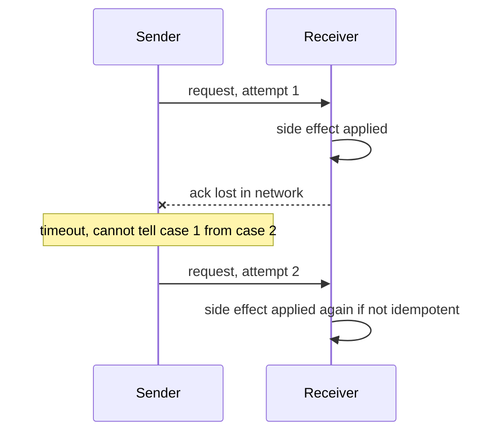
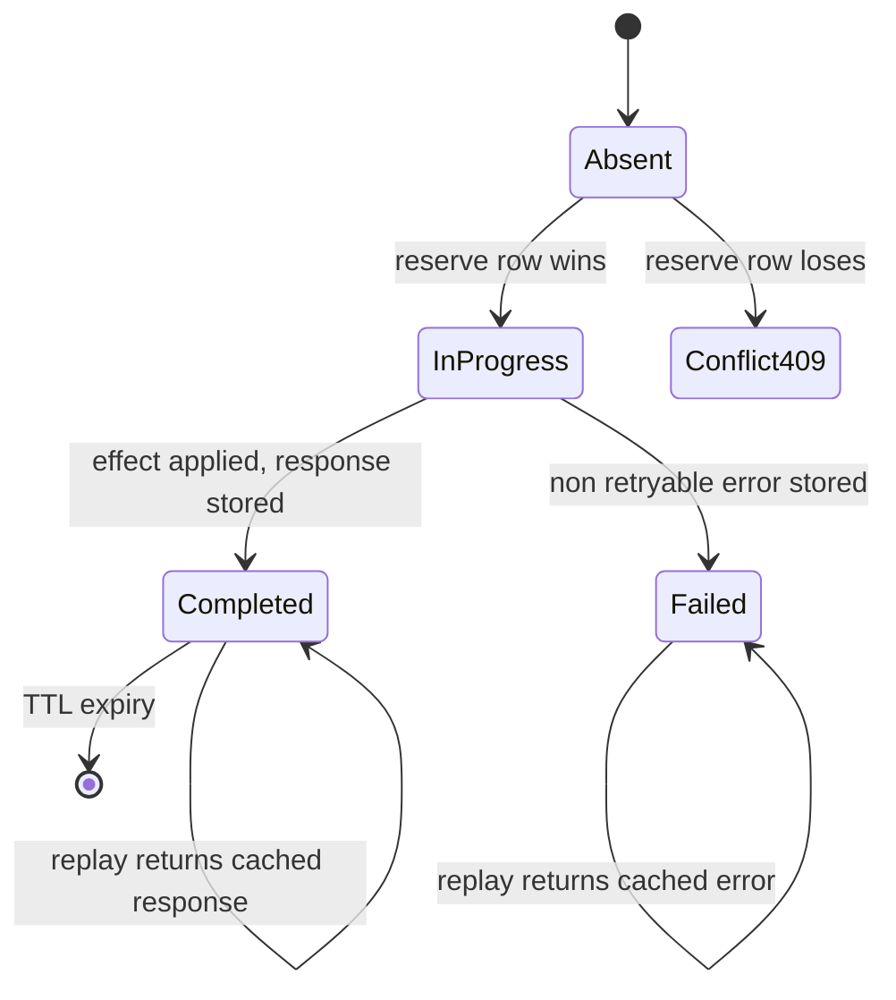
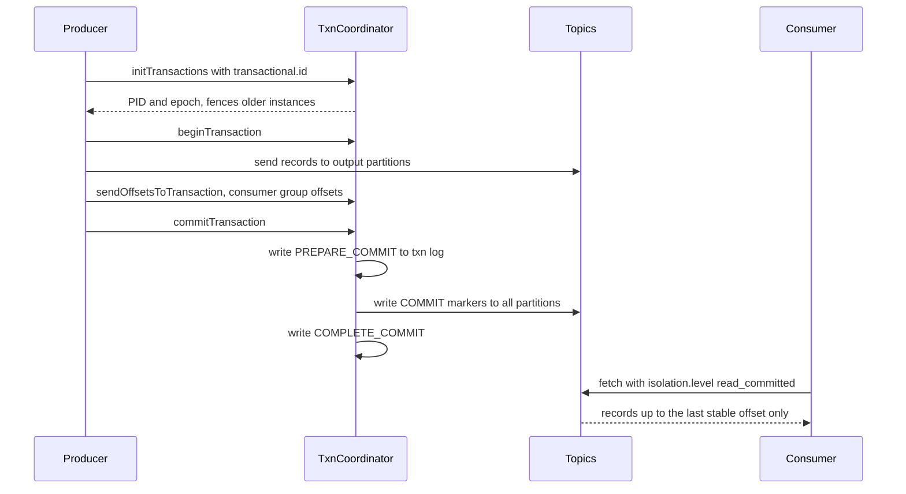

# F11 — Idempotency & Exactly-Once

**Exactly-once delivery is impossible over an unreliable network, so every correct system is built from at-least-once delivery plus effects that can absorb duplicates — the engineering is in where you put the dedupe state and how long you keep it.**

## Why Exactly-Once Delivery Is Impossible

A sender transmits a message and waits for an acknowledgement. The ack does not arrive. The sender cannot distinguish:

1. The message was lost before delivery.
2. The message was delivered and processed, and the ack was lost.
3. The message is still in flight and will be delivered later.



Given that ambiguity, the sender has exactly two choices:

| Choice | Guarantee | Failure mode |
| --- | --- | --- |
| Retry until acked | At-least-once | Duplicates |
| Do not retry | At-most-once | Message loss |

There is no third option. This is the Two Generals Problem: no finite protocol over a lossy channel achieves common knowledge. Adding more acks only moves the uncertainty to the last message in the chain.

### What "Effectively-Once" Means

Systems that advertise exactly-once are delivering **at-least-once transport with deduplicated or transactional effects**. The message may cross the wire many times; the observable state changes once. Precise vocabulary:

| Term | Scope | Achievable | Mechanism |
| --- | --- | --- | --- |
| Exactly-once delivery | Network transport | No | — |
| Exactly-once processing | Handler invocation count | No | — |
| Effectively-once / exactly-once semantics | Observable state effect | Yes | Dedupe, or atomic offset-plus-state commit |
| At-least-once | Transport | Yes | Retry until acked |
| At-most-once | Transport | Yes | Fire and forget |

!!! gotcha "Vendors say exactly-once, and it always means something narrower"
    Kafka's exactly-once applies to read-process-write cycles **within Kafka**, where the offset commit and the output records live in one Kafka transaction. The moment your handler writes to Postgres or calls Stripe, that guarantee stops at the boundary. Flink's checkpointing gives exactly-once for internal operator state, and only extends to sinks that implement a two-phase-commit sink interface. Always ask: exactly-once with respect to *which* state store?

## Natural vs Enforced Idempotency

An operation is **naturally idempotent** if applying it $n$ times has the same effect as applying it once: $f(f(x)) = f(x)$.

| Operation | Naturally idempotent | Why |
| --- | --- | --- |
| `SET user.email = 'a@b.com'` | Yes | Absolute assignment |
| `balance = balance - 10` | No | Relative mutation |
| `PUT /users/123` with full body | Yes | Full replacement |
| `POST /users` | No | Creates a new resource each call |
| `DELETE /users/123` | Yes | Second call is a no-op, though the status code differs |
| `INSERT ... ON CONFLICT DO NOTHING` | Yes | Conflict is absorbed |
| `SADD key member` (Redis set add) | Yes | Set semantics |
| `INCR counter` | No | Relative mutation |
| Publish to a log | No | Appends a duplicate offset |
| `state = 'SHIPPED' WHERE state = 'PACKED'` | Yes | Conditional state transition |

Two design levers fall out immediately:

1. **Prefer absolute over relative writes.** `set_balance(new_value)` with an expected-version check beats `add_to_balance(delta)`.
2. **Prefer conditional state transitions.** `UPDATE ... WHERE state = <expected>` makes the second application a zero-row no-op, which is naturally idempotent and gives you optimistic concurrency for free.

When the operation cannot be made naturally idempotent — money movement, external API calls, appending to an audit log — you must **enforce** idempotency with a key and a dedupe store.

## Idempotency Keys

### Generation

| Strategy | Who generates | Properties | When to use |
| --- | --- | --- | --- |
| Client UUIDv4 | Client, once per logical intent | Random, no coordination | Default for public APIs |
| Client UUIDv7 / ULID | Client | Time-sortable, index-friendly | High-volume writes where index locality matters |
| Derived hash of the request | Either side | Same intent yields the same key automatically | Batch jobs, replays |
| Server-issued token | Server via a `POST /idempotency-keys` pre-call | Prevents client mistakes, guarantees uniqueness | Extremely high-value operations |
| Business natural key | Domain | e.g. `invoice_id + period` | Best when it exists — no extra state |

**The critical rule**: the key must be generated **once per logical intent, before the first attempt, and reused for every retry of that intent**. A client that generates a fresh UUID inside its retry loop has defeated the entire mechanism. This is the single most common implementation bug.

```python
# WRONG: new key per attempt
for attempt in range(3):
    requests.post(url, json=body,
                  headers={"Idempotency-Key": str(uuid.uuid4())})

# RIGHT: one key per logical intent
key = str(uuid.uuid4())
for attempt in range(3):
    r = requests.post(url, json=body, headers={"Idempotency-Key": key})
    if r.status_code < 500:
        break
    time.sleep(backoff(attempt))
```

### Scope

A key is meaningless without a scope. The dedupe lookup should be keyed by the tuple, not the key alone:

$$
\text{dedupe key} = (\text{tenant or account}, \text{endpoint or operation}, \text{idempotency key})
$$

| Scope choice | Consequence |
| --- | --- |
| Global across all accounts | One tenant's key collides with another's; also an enumeration side channel |
| Per account, per endpoint | Correct default. Reusing a key on a different endpoint is a client bug you can reject |
| Per account only | A client reusing a key across endpoints gets a confusing cross-endpoint hit |
| Per session or connection | Useless — retries frequently happen on new connections |

### The Retry-With-Different-Payload Attack

If you key only on the idempotency key and blindly return the cached response, an attacker (or a buggy client) can send `{"amount": 10}` and then `{"amount": 10000}` with the same key. Worse, in a naive implementation where the key is only checked *after* validation, or where the cached record is written after the effect, the second request may execute.

**The fix**: store a canonical hash of the request body alongside the key and compare on every hit.

```python
import hashlib, json

def canonical_hash(body: dict) -> str:
    # Sort keys, no whitespace, so semantically identical bodies hash identically.
    return hashlib.sha256(
        json.dumps(body, sort_keys=True, separators=(",", ":")).encode()
    ).hexdigest()

def handle(account_id, endpoint, key, body):
    fp = canonical_hash(body)
    rec = store.get((account_id, endpoint, key))
    if rec is None:
        # Reserve atomically: INSERT ... ON CONFLICT DO NOTHING.
        if not store.reserve((account_id, endpoint, key), fp, state="IN_PROGRESS"):
            return conflict_or_retry()
        result = perform(body)                 # the real side effect
        store.complete((account_id, endpoint, key), result)
        return result
    if rec.fingerprint != fp:
        raise HTTPError(422, "idempotency key reused with a different payload")
    if rec.state == "IN_PROGRESS":
        raise HTTPError(409, "request in progress, retry with backoff")
    return rec.response
```

Stripe returns `400` for a key reused with different parameters; the exact status matters less than the fact that you **must not** silently succeed. Note also the `IN_PROGRESS` state: without it, two concurrent retries both find no record and both execute.



!!! danger "Reserve before you act, and make the reservation atomic"
    The reservation must be a single atomic operation — `INSERT ... ON CONFLICT DO NOTHING`, `SET key value NX`, or a conditional put. A read-then-write check has a race window in which two concurrent retries both pass the check. Under a retry storm that window is not theoretical: it is where duplicate charges actually come from.

### Storage

| Store | Latency | Durability | Fit |
| --- | --- | --- | --- |
| Same relational DB as the effect | Same transaction | Strong | **Best**: dedupe record and effect commit atomically |
| Redis with `SET NX` | Sub-ms | Weak by default: async replication, failover can lose keys | Acceptable for low-value dedupe, dangerous for money |
| DynamoDB conditional put | Low ms | Strong with condition expressions | Good when the effect also lives in DynamoDB |
| Dedicated idempotency service | Extra hop | Depends | Adds a dual-write between the service and the effect store |

The decisive criterion: **can the dedupe record and the side effect commit atomically?** If they cannot, you have reintroduced the dual-write problem from [F10 Distributed Transactions](f10-distributed-transactions.md), and there exists an interleaving where the effect happens and the dedupe record does not.

!!! gotcha "Redis-based idempotency loses keys precisely when you need them most"
    Symptom: a duplicate charge during a Redis failover or a memory-pressure eviction event. Mechanism: Redis replication is asynchronous, so a failover can lose recent `SET NX` writes; `maxmemory-policy allkeys-lru` will evict idempotency keys under pressure regardless of TTL. Mitigation: for money-adjacent operations put dedupe state in the same transactional store as the effect. If you must use Redis, use a dedicated instance with `noeviction`, and treat it as a fast path in front of a durable check rather than the only check.

### TTL

The dedupe window must be **at least as long as the maximum possible retry horizon** across every layer that can retry.

$$
\text{TTL} \ge \text{client retry budget} + \text{queue retention} + \text{DLQ replay window} + \text{operator recovery time}
$$

| Domain | Reasonable TTL | Driver |
| --- | --- | --- |
| Internal RPC | 5–15 minutes | Client retry budget only |
| Public API write | 24 hours | Stripe's default; matches typical client SDK behaviour |
| Payments and ledger | 7–90 days | Chargebacks, manual reconciliation, batch reprocessing |
| Event consumers | Longer than max topic retention | DLQ replay can be days later |
| Regulatory / audit | Years, in cold storage | Compliance requirement, not a dedupe requirement |

!!! gotcha "A 24h TTL permits a duplicate charge on day two"
    Symptom: a customer is charged twice, the two charges are 30-plus hours apart, and both requests carry the same idempotency key. Mechanism: the key expired from the dedupe store between attempts, usually because a client SDK retried after an operator replayed a DLQ, or because a scheduled batch job re-ran a failed file the next morning. Mitigation: set the TTL from the **maximum** replay horizon, not from the typical one; keep an append-only record of processed keys in cheap storage beyond the hot TTL; and reject inbound requests whose key is older than the retention window rather than treating them as new.

### Dedup Windows and Storage Cost

A dedupe row is roughly: key (16–36 bytes) plus scope (16–32) plus fingerprint (32) plus a response blob plus indexes. Assume 200 bytes to 2 KB depending on whether you cache the response body.

At $r$ writes/second and TTL $T$ seconds, steady-state rows are $r \cdot T$:

| Rate | TTL | Rows | At 500 B/row | At 2 KB/row |
| --- | --- | --- | --- | --- |
| 1k/s | 24 h | 86.4 M | ~43 GB | ~173 GB |
| 10k/s | 24 h | 864 M | ~432 GB | ~1.7 TB |
| 10k/s | 7 d | 6.05 B | ~3 TB | ~12 TB |
| 100k/s | 1 h | 360 M | ~180 GB | ~720 GB |

Practical mitigations:

- **Do not store full response bodies** unless clients genuinely need byte-identical replay. Store a status and a resource ID.
- **Partition by day and drop partitions**; `DELETE ... WHERE expires_at < now()` at this volume generates enormous vacuum and index churn.
- **Two-tier**: a small hot window in a fast store plus a long tail in a cheaper columnar or object store, checked only on a hot-tier miss.
- **Probabilistic pre-filter**: a Bloom or cuckoo filter in front of the durable store turns most "definitely new" lookups into a memory hit. Never let it be the only check — a false positive would reject a legitimate new request.

## At-Least-Once Plus Idempotent Consumer

This is the standard pattern; everything else is a variation.

The invariant: **the dedupe record and the business effect commit in the same local transaction**. Consequences:

- Ack after commit, never before. Acking first converts at-least-once into at-most-once and silently drops messages on crash.
- If the process crashes between commit and ack, the message is redelivered and the dedupe absorbs it. That is the design working correctly.
- The dedupe key should be a **producer-assigned message ID that survives retries**, not a broker-assigned delivery ID, which changes on redelivery.

!!! gotcha "Broker message IDs are not stable across redelivery"
    Symptom: dedupe never fires; every redelivery is treated as new. Mechanism: SQS assigns a new `ReceiptHandle` per receive, and some brokers assign a new message ID on DLQ re-drive. Mitigation: dedupe on a business-level ID carried in the payload or a header set by the producer. SQS FIFO's `MessageDeduplicationId` works but only within a 5-minute window, which is far shorter than most people assume.

## Kafka Idempotent Producer and Transactions

### Idempotent Producer

Enabled with `enable.idempotence=true` (the default since Kafka 3.0). Mechanics:

- On first connection the producer is assigned a **Producer ID (PID)** and an **epoch**.
- Every record batch carries `(PID, epoch, partition, sequence_number)`, monotonically increasing per partition.
- The broker keeps the last five sequence numbers per PID per partition. A batch whose sequence it has already seen is **acknowledged but not written** — duplicate suppressed. A batch with a gap is rejected with `OutOfOrderSequenceException`.
- Requires `acks=all` and bounded `max.in.flight.requests.per.connection` (5 or fewer) to preserve ordering.

Scope and limits:

| Guarantee | Holds? |
| --- | --- |
| No duplicates from producer-side retries | Yes, within a producer session |
| No duplicates across a producer restart | Only with a stable `transactional.id` |
| Ordering per partition | Yes, with in-flight limit respected |
| Duplicates if the app itself re-sends after restart | Not covered — application-level dedupe still needed |
| Duplicates beyond the broker's sequence memory window | Possible if a batch is delayed past five subsequent batches |

### Transactions and Exactly-Once Semantics



Key internals worth naming:

- `transactional.id` is a **stable application identity**. On `initTransactions`, the coordinator bumps the epoch, **fencing** any zombie instance still running with the old epoch — this is a fencing token applied to a producer.
- Transaction state lives in the internal `__transaction_state` topic; it is itself replicated.
- Commit and abort are recorded as **control records** in each participating partition.
- Consumer offsets are written **into the transaction** via `sendOffsetsToTransaction`, which is what makes read-process-write atomic.
- `isolation.level=read_committed` makes consumers read only up to the **Last Stable Offset**, the offset before the earliest open transaction. A long-running open transaction therefore **stalls every read-committed consumer on that partition**, even for records committed after it.

| Configuration | Guarantee | Cost |
| --- | --- | --- |
| `acks=1`, no idempotence | At-most-once on leader failure | Fastest |
| `acks=all`, idempotence on | At-least-once end to end, no producer-retry duplicates | Small latency increase |
| Transactions plus `read_committed` | Effectively-once within Kafka | Extra coordinator round trips, LSO stalls, higher latency |

!!! gotcha "read_committed consumers stall behind one hung transaction"
    Symptom: consumer lag climbs on a partition even though the producer is clearly writing and lag is fine for `read_uncommitted` consumers. Mechanism: an open transaction pins the Last Stable Offset; nothing past it is visible until it commits or the coordinator aborts it after `transaction.timeout.ms`. Mitigation: keep transactions short, set `transaction.timeout.ms` well below your lag SLO, alert on LSO lag distinct from log-end-offset lag, and never hold a Kafka transaction open across an external network call.

!!! gotcha "Kafka's exactly-once does not extend to your database"
    Symptom: a Kafka-to-Postgres pipeline configured with transactions still produces duplicate rows. Mechanism: the Kafka transaction covers Kafka topics and Kafka offset commits. A write to an external system is outside it, so the classic dual-write reappears at the sink. Mitigation: make the sink write idempotent — upsert on a primary key derived from the message ID, or store the consumed offset in the same database transaction as the data and seek from it on startup.

## Request Hedging and Duplicate Side Effects

Hedging sends a second request after the p95 latency elapses and takes the first response, trading extra load for tail-latency reduction. It is a **deliberate duplicate generator**.

| Request type | Safe to hedge | Rationale |
| --- | --- | --- |
| Idempotent read | Yes | No side effect |
| `PUT` with full body | Yes | Absolute write |
| Enforced-idempotent `POST` | Yes, if the key is shared across hedges | Server dedupes |
| Non-idempotent write | **No** | Two effects |
| Write with an unbounded server-side retry budget | No | Hedge plus retries multiplies load |

Rules for hedging safely:

1. Both hedges carry the **same** idempotency key.
2. Cancel the loser (gRPC cancellation, HTTP client abort) so the server can stop early — though never rely on cancellation for correctness, since it races.
3. Cap the hedge rate globally (for example, no more than 10 percent of requests hedged) so hedging cannot amplify a partial outage into a full one.
4. Never hedge into an already-overloaded backend; hedging and load shedding must be coordinated.

!!! gotcha "Hedging plus retries multiplies request amplification across every tier"
    Symptom: a small backend slowdown becomes a 5x traffic spike and a full outage. Mechanism: each of three tiers hedges once and retries twice, so worst-case amplification is the product across tiers, not the sum. Mitigation: use retry budgets rather than fixed retry counts, propagate a deadline so downstream tiers stop instead of retrying past it, and disable hedging automatically when a circuit breaker is half-open.

## Non-Idempotent Operations and How to Wrap Them

| Operation | Why it resists idempotency | Wrapping technique |
| --- | --- | --- |
| Charge a card | The PSP creates a new charge per call | Pass your idempotency key to the PSP; Stripe, Adyen and Braintree all support one |
| Internal ledger debit | Relative mutation | Double-entry with a unique `transfer_id` and a unique constraint on it |
| Send an email or SMS | The provider cannot un-send | Dedupe key stored **before** the send; accept that a crash mid-send may drop rather than duplicate |
| Call a partner API with no idempotency support | Provider limitation | Local claim-check row, plus a reconciliation query against their API by your reference ID |
| Append to an audit log | Appends duplicate | Unique constraint on `(event_id)` |
| Increment a counter | Relative | Store contributing IDs in a set, or use a CRDT counter keyed by source |
| Provision infrastructure | Creates a resource | Name the resource deterministically from the request key; creation then conflicts naturally |

The general recipe for a non-idempotent external effect:

```text
1. Reserve a durable record keyed by the idempotency key, state=IN_PROGRESS,
   storing the external reference you intend to use.
2. Call the external system, passing your key as their idempotency token
   if they support one, or as a client reference field if they do not.
3. Persist the external system's response ID against your record, state=DONE.
4. On restart or retry:
     - state=DONE   -> return the stored result.
     - state=IN_PROGRESS -> do NOT blindly re-call. Query the external system
       by your reference to discover whether it happened, then reconcile.
```

Step 4 is the part teams skip. Without a query-by-reference path, an `IN_PROGRESS` record after a crash is unresolvable and becomes a manual ticket.

!!! warning "Money movement demands double-entry plus a unique transfer ID"
    A ledger built on `UPDATE accounts SET balance = balance - 100` cannot be made idempotent by any amount of retry logic. Model transfers as immutable rows with a unique constraint on the client-supplied transfer ID; balance becomes a derived aggregate or a materialised column updated in the same transaction. Retries then collide on the unique index and are absorbed by construction.

## Fencing Tokens

Idempotency handles duplicates from the same logical actor. **Fencing** handles duplicates from an actor that should no longer exist.

The scenario: a client acquires a lease, pauses for 40 seconds (GC, VM migration, hypervisor steal, CPU throttling), the lease expires, another client acquires it, then the first client wakes up and writes — believing it still holds the lease. The lock service issued token 33 to the first client and 34 to the second; the second's write with token 34 lands, and the first's late write with token 33 must be rejected.

Requirements:

- The lock service issues a **monotonically increasing** token with every grant.
- The token travels with every write.
- **The storage layer enforces it**, rejecting any write carrying a token lower than the highest it has seen. A check performed by the client is worthless — the client is exactly the component that is wrong.

Fencing shows up under many names: Kafka's producer epoch, HDFS NameNode epoch numbers, ZooKeeper `zxid` and `cversion`, etcd lease revisions, Raft terms, and the `expected_version` in an optimistic-concurrency update. All the same idea. Deeper treatment of the lock side is in [F19 Concurrency Control](f19-concurrency-control.md).

!!! gotcha "A lease plus a GC pause means two holders, and only storage-side fencing fixes it"
    Symptom: two workers process the same partition, or a file is corrupted by interleaved writes from two nodes that both hold the lock. Mechanism: leases are wall-clock deadlines evaluated by the client; a stop-the-world pause longer than the lease invalidates the client's belief without the client noticing. Mitigation: monotonically increasing fencing tokens validated at the storage layer, plus GC pause and steal-time monitoring. Redlock does not solve this, which is the core of Kleppmann's critique.

## Idempotency in HTTP Semantics

RFC 9110 defines **safe** (no side effects) and **idempotent** (repeated identical requests have the same effect as one).

| Method | Safe | Idempotent | Cacheable | Notes |
| --- | --- | --- | --- | --- |
| GET | Yes | Yes | Yes | Must not mutate; analytics side effects are a common violation |
| HEAD | Yes | Yes | Yes | Same as GET without a body |
| OPTIONS | Yes | Yes | No | — |
| PUT | No | Yes | No | Full replacement; idempotent by definition |
| DELETE | No | Yes | No | Idempotent in effect; the status code may differ on repeat |
| POST | No | No | Rarely | Needs an idempotency key to be retry-safe |
| PATCH | No | **Not by default** | No | JSON Merge Patch is idempotent; JSON Patch with `add` to an array is not |

The important nuance: **idempotent means the same effect, not the same response**. A second `DELETE` legitimately returns `404`. Clients must not treat a differing status code as evidence that the operation did not happen.

Conventions worth adopting:

- Header name: `Idempotency-Key` (the IETF draft name; Stripe's original spelling is the de facto standard).
- Concurrent replay while in progress: `409 Conflict` with `Retry-After`.
- Same key, different body: `422` or `400` with a machine-readable error code. Never `200`.
- Expired key on a completed operation: return the terminal state if you can look it up by business ID, otherwise a clear `422` telling the client to query rather than retry.
- Use `ETag` plus `If-Match` for conditional updates. This is optimistic concurrency, complementary to idempotency: idempotency prevents duplicate application, `If-Match` prevents overwriting someone else's change.

```text
POST /v1/transfers HTTP/1.1
Idempotency-Key: 018f3c2a-9d47-7c31-9a5e-2b6c1f0a77de
Content-Type: application/json

{"from":"acct_1","to":"acct_2","amount":2500,"currency":"usd"}

HTTP/1.1 201 Created
Idempotency-Replayed: false
Location: /v1/transfers/tr_9fA2
```

## Gotchas & Corner Cases

!!! gotcha "The client regenerates the idempotency key inside its retry loop"
    Symptom: duplicate charges despite a correct server-side implementation and a passing test suite. Mechanism: the key is created inside the retry closure or by a middleware that runs per attempt, so every retry looks like a new intent. Mitigation: generate the key at the point of user intent, persist it with the pending operation, and add a server-side heuristic alert on near-identical payloads from the same account within a short window with different keys.

!!! gotcha "Idempotency keys stored with a 24-hour TTL permit a duplicate on day two"
    Symptom: a duplicate side effect appears 30 or more hours after the original, from a DLQ replay or an overnight batch re-run. Mechanism: the retry horizon of the *slowest* retry path exceeds the dedupe TTL. Mitigation: derive the TTL from the maximum replay horizon across client SDK, broker retention, and DLQ policy; keep a cheap long-tail record beyond the hot window; and reject requests whose key predates the retention window instead of processing them as new.

!!! gotcha "The dedupe record is written after the side effect"
    Symptom: rare duplicates that correlate with process restarts and deploys. Mechanism: the handler performs the effect and then records the key; a crash in between loses the record while the effect persists. Mitigation: reserve the key atomically **before** the effect with an `IN_PROGRESS` state, then transition to complete. If the effect and the record cannot share a transaction, you need an external query-by-reference recovery path.

!!! gotcha "Concurrent retries both pass a read-then-write existence check"
    Symptom: exactly two effects, milliseconds apart, from a client that retried aggressively on a timeout. Mechanism: `SELECT` then `INSERT` is not atomic; both requests see no row. Mitigation: a single atomic conditional write — `INSERT ... ON CONFLICT DO NOTHING`, `SET NX`, or a DynamoDB `attribute_not_exists` condition — and return `409` to the loser rather than letting it proceed.

!!! gotcha "Payload fingerprinting is defeated by non-canonical serialisation"
    Symptom: legitimate retries are rejected as key-reuse violations, or malicious payload changes slip through. Mechanism: JSON key order, whitespace, float formatting, or added optional fields change the raw bytes without changing meaning; or conversely, hashing a semantically-lossy subset misses a changed amount. Mitigation: hash a canonical form — sorted keys, no insignificant whitespace, normalised numbers — over the semantically meaningful fields only, and version the fingerprint algorithm so you can change it later.

!!! gotcha "Storing the full HTTP response for replay leaks stale or cross-tenant data"
    Symptom: a replayed request returns data the caller should no longer see, or a response containing a field that has since been redacted. Mechanism: the cached response body was captured at first execution and is served verbatim indefinitely. Mitigation: store the minimum needed — status plus resource ID — and re-fetch the current representation on replay, applying current authorisation checks. Never bypass authorisation on the replay path.

!!! gotcha "A shared dedupe key across tenants creates an oracle and a collision"
    Symptom: tenant B's request is silently deduped against tenant A's, returning A's resource ID. Mechanism: the dedupe store is keyed on the raw idempotency key without a tenant scope, and clients pick predictable keys such as `order-1`. Mitigation: always scope by `(tenant, endpoint, key)`, and never return another tenant's stored response even on a key hit.

!!! gotcha "Retrying a timed-out request that actually succeeded is indistinguishable from a genuine failure"
    Symptom: a client shows an error to the user while the operation completed server-side; the user retries manually and the effect happens twice, or they abandon a completed action. Mechanism: a timeout is not a failure signal, it is an unknown. Mitigation: treat timeouts as indeterminate; the client must either retry with the same idempotency key or query by business reference. Never surface a timeout as "failed" for a state-changing call.

!!! gotcha "Idempotent handlers are not idempotent once they emit events"
    Symptom: the database row is correct, but downstream consumers receive the event twice, sending two confirmation emails. Mechanism: the dedupe check short-circuits the database write but the code still publishes on the replay path. Mitigation: put the event emission inside the same guarded, transactional path as the write — an outbox row inserted in the same transaction — so the duplicate is suppressed for the event too.

!!! gotcha "Deleting expired dedupe rows with a bulk DELETE causes a latency cliff"
    Symptom: nightly p99 spikes and replication lag on the primary. Mechanism: mass `DELETE` on a high-churn table produces enormous WAL volume, index bloat, and vacuum pressure. Mitigation: range-partition by day and `DROP` or `DETACH` whole partitions, or use a TTL-native store where expiry is a background compaction concern.

## SRE Lens

### SLIs and SLOs

| Signal | Definition | Target guidance | Why it matters |
| --- | --- | --- | --- |
| Duplicate suppression rate | Requests hitting an existing key / total | Baseline it per endpoint | A sudden rise means a retry storm or a client bug |
| Duplicate effect rate | Confirmed duplicate side effects detected by reconciliation | 0 for money; page on any | The actual correctness SLI |
| Key conflict rate | Same key, different payload | Near zero | A spike is a client bug or an attack |
| `IN_PROGRESS` stuck count | Reservations older than the operation timeout | 0 | Each one is an unresolved unknown |
| Dedupe store availability | Success rate of dedupe reads and writes | Higher than the API's own SLO | It is on the critical path of every write |
| Dedupe store size and growth | Rows and bytes, plus daily delta | Flat week over week | Detects a broken expiry job |
| Hedge rate | Hedged requests / total | Under the configured cap, e.g. 10 percent | Prevents amplification |
| Kafka LSO lag | Log-end offset minus last stable offset | Near zero | Detects hung transactions |
| Fencing rejection rate | Writes rejected for a stale token | Near zero; investigate any | Each rejection is a real split-brain event that was caught |

### Failure Modes and Detection

| Failure | Symptom | Detection | First response |
| --- | --- | --- | --- |
| Dedupe store down | Every write fails or, worse, bypasses dedupe | Dedupe store error rate | **Fail closed** for money operations; shed load rather than risk duplicates |
| TTL too short | Duplicates clustered at TTL-plus-epsilon | Histogram of duplicate age | Extend TTL, then reconcile the window |
| Client key bug | High rate of near-identical payloads, distinct keys | Payload-similarity heuristic per account | Contact the integrator, apply a temporary account-level guard |
| Retry storm | Duplicate suppression rate spikes 10x | Suppression rate alert | Shed load, verify backoff and jitter, check for a partial outage upstream |
| Hung Kafka transaction | `read_committed` lag climbs | LSO lag | Wait for `transaction.timeout.ms` or fence the producer by bumping the epoch |
| Zombie process after a pause | Fencing rejections appear | Rejection counter plus GC pause metric | Confirm the zombie is dead, review lease duration against observed pause p999 |

### Rollout and Migration Risk

- **Fail closed, not open.** When the dedupe store is unavailable, a system that "proceeds anyway" will double-charge. Decide this explicitly per endpoint and document it.
- Introducing idempotency to an existing endpoint: accept the header optionally first, measure adoption, then require it. Requiring it immediately breaks every existing client.
- Changing key scope (for example adding a tenant dimension) invalidates the entire existing dedupe set. Run both lookups during the transition window, which must exceed the TTL.
- Turning on Kafka transactions changes latency and adds LSO stalls; roll out on a low-traffic topic and watch consumer lag before expanding.
- Shortening a TTL is a **correctness change**, not a cleanup. Treat it with the same rigour as a schema migration.

### Capacity Signals

- The dedupe table is frequently the highest-write-rate table in the system: every request writes at least once, sometimes twice with the state transition.
- Its index working set must stay in memory; when it stops fitting, p99 write latency degrades sharply and non-linearly.
- Bloom-filter pre-checks cut read load dramatically but add memory and must never be the sole authority.
- Response caching multiplies row size by 4–10x. Measure before enabling it.

### On-Call Runbook Notes

- Duplicate-effect reports: pull all records for the idempotency key, check the age gap against the TTL, and check whether the client sent distinct keys. The age gap identifies TTL expiry versus a race in under a minute.
- Never "clear the idempotency cache" to unstick a client. That guarantees duplicates.
- Have a supported reconciliation query that compares your ledger to the external provider's by reference ID, and run it after every payment-path incident.
- Stuck `IN_PROGRESS` records need a documented resolver that queries the external system rather than guessing.

### Cost

- Dedupe storage is a direct function of rate times TTL; the table above makes the trade-off explicit.
- Kafka transactions add coordinator round trips and control records, typically 10–30 percent throughput cost for read-process-write pipelines.
- Hedging spends real capacity — a 10 percent hedge rate is a 10 percent capacity increase — in exchange for tail latency.
- The cost of *not* doing this is a duplicate charge, a refund, a support ticket, a chargeback fee, and reputational damage. It dominates every number above.

## Interview Angle

!!! interview "Probe: can you guarantee exactly-once delivery?"
    **Weak**: "Yes, with Kafka transactions."

    **Strong**: "No — the Two Generals result means a sender that loses an ack cannot distinguish loss from a lost ack, so it must choose at-least-once or at-most-once. What you can achieve is effectively-once: at-least-once transport plus effects that absorb duplicates, either through natural idempotency, a dedupe key committed atomically with the effect, or an atomic offset-plus-state commit as Kafka does within its own boundary."

!!! interview "Probe: design idempotent payment creation."
    **Weak**: "Store the request ID in Redis and skip if present."

    **Strong**: "Client generates a UUID once per user intent and reuses it across retries. The server scopes the key by account and endpoint, and atomically inserts an `IN_PROGRESS` row with a canonical hash of the request body — in the same Postgres database as the ledger, so the dedupe row and the transfer row commit in one transaction. Same key with a different body is a `422`, never a silent success. A concurrent replay while `IN_PROGRESS` gets `409` with `Retry-After`. The PSP call carries the same key as their idempotency token, and on recovery from `IN_PROGRESS` we query the PSP by reference rather than re-calling. TTL is set from the maximum replay horizon, not the typical one, and the table is partitioned by day."

!!! interview "Probe: why is a distributed lock not enough to prevent duplicate processing?"
    **Weak**: "You need to set a TTL on the lock."

    **Strong**: "A lease is a wall-clock deadline the client evaluates locally. A stop-the-world GC pause, VM live migration, or CPU throttling longer than the lease means the client wakes up still believing it holds the lock while someone else legitimately acquired it. The only fix is a monotonically increasing fencing token issued with the lock and validated at the storage layer, so the stale writer's write is rejected. That is Kleppmann's argument against Redlock, and it is why Kafka has producer epochs and Raft has terms."

!!! interview "Probe: your consumer sometimes processes messages twice. Is that a bug?"
    **Weak**: "Yes, we need exactly-once delivery."

    **Strong**: "It is expected under at-least-once delivery and it is only a bug if the effect is not idempotent. The fix is at the consumer: insert the producer-assigned message ID into a dedupe table and apply the business effect in the same local transaction, then ack after commit. I would also confirm we dedupe on a stable producer-side ID rather than a broker receipt handle, which changes on redelivery."

!!! interview "Probe: how long should the idempotency key live?"
    **Weak**: "Twenty-four hours, like Stripe."

    **Strong**: "At least the maximum retry horizon of the slowest path that can resend: client retry budget, plus queue retention, plus the DLQ replay window, plus how long an operator might take to replay. For a payments path that is days, not hours. I would keep a hot window in the transactional store for fast lookups and a long tail in cheap storage, and reject a key older than the long-tail retention explicitly rather than silently treating it as new."

??? note "Rapid-fire follow-ups to rehearse"
    - Which HTTP methods are idempotent, and is PATCH one of them?
    - What is the difference between safe and idempotent?
    - How do you make a counter increment idempotent?
    - Why must the dedupe write be atomic rather than read-then-write?
    - What does Kafka's `transactional.id` fence, and how?
    - What is the Last Stable Offset and what stalls it?
    - When is hedging unsafe, and what limits do you place on it?
    - How do you resolve a stuck `IN_PROGRESS` record after a crash?
    - Where does a fencing token have to be checked, and why not on the client?

## Key Takeaways

- Exactly-once delivery is impossible; effectively-once is at-least-once transport plus effects that absorb duplicates, and every vendor claim is scoped to one specific state store.
- Prefer natural idempotency: absolute writes, conditional state transitions, upserts, and unique constraints beat any amount of retry machinery.
- An idempotency key must be generated once per logical intent, scoped by tenant and endpoint, reserved atomically before the effect, and bound to a canonical hash of the request body.
- The dedupe record and the side effect must commit atomically; if they cannot, you have a dual-write problem hiding inside your idempotency layer.
- TTL is a correctness parameter derived from the longest possible replay horizon, not a cache-eviction convenience.
- At-least-once delivery plus an idempotent consumer is the standard architecture; dedupe on a stable producer-assigned ID, and ack only after commit.
- Kafka's idempotent producer suppresses producer-retry duplicates via PID, epoch and per-partition sequence numbers; transactions extend that to read-process-write within Kafka only, and hung transactions stall `read_committed` consumers via the Last Stable Offset.
- Hedging is a deliberate duplicate generator: share the key, cap the rate, and propagate deadlines to prevent multiplicative amplification.
- Fencing tokens, validated at the storage layer, are the only defence against a paused process that still believes it holds a lease.

## Further Reading

- Pat Helland, *Idempotence Is Not a Medical Condition* (ACM Queue, 2012) — the definitive practitioner treatment.
- Martin Kleppmann, *How to do distributed locking* (2016) — fencing tokens and the Redlock critique.
- Fischer, Lynch and Paterson, *Impossibility of Distributed Consensus with One Faulty Process* (1985) — the formal root of the ambiguity.
- Jim Gray, *Notes on Data Base Operating Systems* (1978) — early treatment of the Two Generals framing in transaction recovery.
- Apache Kafka KIP-98, *Exactly Once Delivery and Transactional Messaging*, and KIP-129 for Streams — the authoritative description of PIDs, epochs, sequence numbers and control records.
- Carbone et al., *Lightweight Asynchronous Snapshots for Distributed Dataflows* (2015) — the Chandy-Lamport-derived basis of Flink's exactly-once state.
- Chandy and Lamport, *Distributed Snapshots: Determining Global States of Distributed Systems* (1985).
- RFC 9110, *HTTP Semantics*, sections on safe and idempotent methods.
- IETF draft, *The Idempotency-Key HTTP Header Field*.
- Stripe's API documentation on idempotent requests — the de facto industry reference implementation.
- Martin Kleppmann, *Designing Data-Intensive Applications*, Chapters 8, 9 and 11.

---

Related: [F09 Consensus](f09-consensus.md) · [F10 Distributed Transactions](f10-distributed-transactions.md) · [F12 Queues & Streams](f12-queues-streams.md) · [F19 Concurrency Control](f19-concurrency-control.md) · [F20 Time, Clocks & Ordering](f20-time-clocks-ordering.md)
