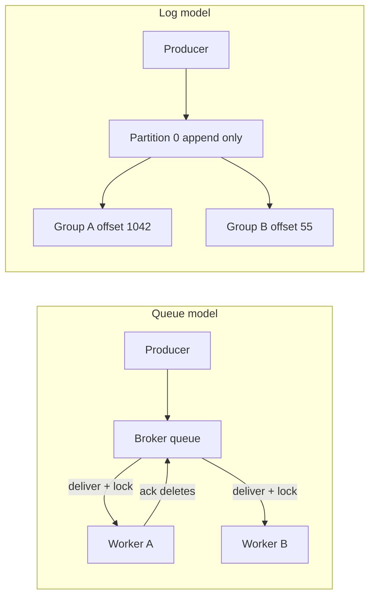
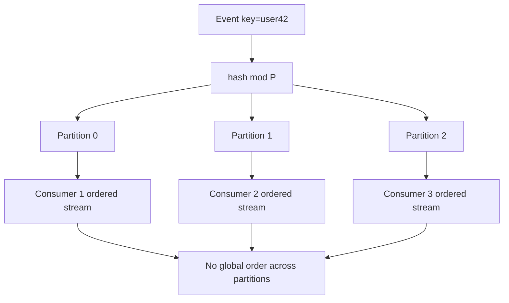
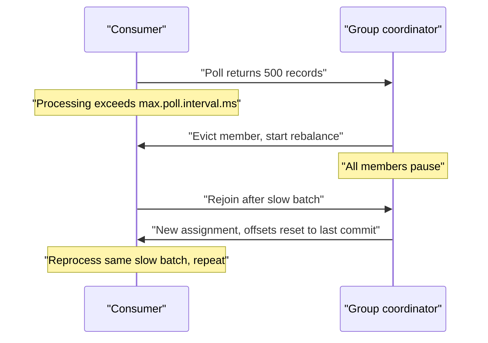
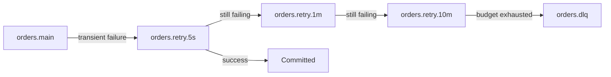
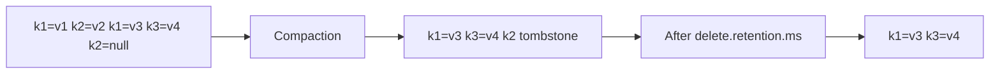

# F12 — Message Queues & Streams

**A queue hands work out and forgets it; a log remembers everything and makes each consumer track its own position — almost every production incident in this space comes from confusing the two contracts.**

## Queue Semantics vs Log Semantics

The single most useful mental model: a **queue** is a shared work list with server-side per-message state, a **log** is an append-only ordered file with client-side cursors.

| Dimension | Queue broker (SQS, RabbitMQ) | Log broker (Kafka, Pulsar, Kinesis) |
|---|---|---|
| Message lifetime | Deleted on ack | Retained until retention/compaction policy expires it |
| Per-message state | Broker tracks in-flight, visibility, redelivery count | Broker tracks nothing per message; consumer tracks an offset |
| Replay | Impossible once acked | Reset offset, replay from any point |
| Ordering unit | Usually none, or a FIFO group | Partition |
| Parallelism unit | Per message — 10k consumers can share one queue | Per partition — parallelism capped by partition count |
| Selective ack | Yes, ack message 7 while 5 is still in flight | No, offset is a single scalar watermark |
| Natural fit | Task distribution, uneven work, RPC-ish jobs | Event sourcing, multi-consumer fan-out, stream processing |
| Failure blast radius | One poison message blocks one message | One poison message can block an entire partition |



!!! note "Why the distinction matters in design interviews"
    If the requirement is "reprocess the last 7 days after a bug fix", a queue is already the wrong answer — the data is gone. If the requirement is "1000 workers draining a bursty job backlog with wildly varying per-job duration", partitions are the wrong answer — you cannot get 1000-way parallelism from 12 partitions without head-of-line blocking.

## Delivery Guarantees

There are only three honest options, and the third is always a local illusion built from the second.

=== "At-most-once"

    Ack (or commit offset) **before** processing. A crash between ack and completion loses the message permanently.

    Legitimate uses: high-volume telemetry, click beacons, cache-warm hints — anything where losing 0.01% is cheaper than duplicate handling.

=== "At-least-once"

    Ack **after** successful processing. A crash after processing but before ack causes redelivery. This is the default and correct choice for ~90% of systems.

    Cost: every consumer must be idempotent or tolerate duplicates.

=== "Effectively-once"

    At-least-once delivery plus an idempotency mechanism: a transactional sink, a dedup key with a TTL store, or Kafka's transactional producer with `read_committed` isolation.

    It is not a network-level guarantee. It is at-least-once delivery combined with deduplicated *effects*.

!!! warning "Kafka exactly-once is scoped to Kafka"
    A `transactional.id` on the producer plus `isolation.level=read_committed` on the consumer gives you atomic "consume from topic A, produce to topic B, commit offset" — all inside Kafka. The moment your processing writes to Postgres, sends an email, or calls Stripe, the transaction boundary is broken and you are back to at-least-once with an application-level idempotency key.

## Ordering: Per-Partition Only, and What That Costs You

Total ordering across a topic requires a single partition, which caps throughput at one broker's disk and destroys parallelism. Every real system therefore offers **per-partition ordering** and pushes the hard decision onto you: the partition key.

$$
\text{partition} = \operatorname{hash}(k) \bmod P
$$

The key choice binds three things simultaneously:

1. **Ordering scope** — only events sharing a key are ordered relative to each other.
2. **Parallelism** — distinct keys spread load; few keys concentrate it.
3. **State locality** — a stateful consumer can keep per-key state locally only if the key never moves.

| Key choice | Ordering guarantee | Skew risk | Typical failure |
|---|---|---|---|
| `user_id` | All events for one user ordered | Whale users, bots | One celebrity account saturates one partition |
| `account_id` | Per-account ordered | Large tenants | Multi-tenant noisy neighbour |
| `order_id` | Per-order lifecycle ordered | Low | Cannot order cross-order operations for the same user |
| `null` / round-robin | None | None | "Payment captured" processed before "payment authorized" |
| `region + shard salt` | Ordered per salted key | Low | Rebuilding ordering across salts is application work |

!!! danger "Changing the partition count re-shuffles every key"
    `hash(k) mod P` changes for nearly every key when $P$ changes. Two records for the same key can now be in two partitions consumed by two threads, and ordering is silently violated for the entire duration of the transition. Kafka lets you increase partitions but never decrease them, and never rehashes historical data. Plan partition count for 2-3 years of growth, or introduce a new topic and dual-write during migration.



## Consumer Groups and Rebalancing Storms

A consumer group assigns partitions to members. Any membership change triggers a rebalance. With the classic eager protocol, **every** consumer stops, revokes all partitions, and rejoins — a stop-the-world event across the whole group.

The pathological loop:



Key knobs and their real meaning:

| Setting | Controls | Common misconfiguration |
|---|---|---|
| `session.timeout.ms` | Liveness via heartbeat thread | Set too low relative to GC pauses, causing false eviction |
| `heartbeat.interval.ms` | Heartbeat frequency | Should be roughly 1/3 of session timeout |
| `max.poll.interval.ms` | Max time between `poll()` calls — the real processing budget | Left at default 5 min while a batch takes 8 min |
| `max.poll.records` | Batch size returned | Large batch multiplied by slow per-record work blows the poll interval |
| `partition.assignment.strategy` | Eager vs cooperative sticky | Eager on a large group causes multi-minute stop-the-world |
| `group.instance.id` | Static membership | Not set, so a rolling restart triggers 2 rebalances per pod |

!!! tip "Two settings kill most rebalancing storms"
    Use `CooperativeStickyAssignor` so only the moved partitions are revoked, and set `group.instance.id` for static membership so a pod restarting within `session.timeout.ms` reclaims its partitions without a rebalance at all. In Kubernetes this means a StatefulSet with a stable ordinal, not a Deployment with random pod names.

## Offset Management and the Commit-Before-Process Bug

The offset is a promise: "everything below this is done." Committing it early converts a crash into silent, unrecoverable data loss with no error anywhere in your metrics.

```python
# WRONG: at-most-once disguised as normal code.
for record in consumer.poll():
    consumer.commit()          # offset advanced
    handle(record)             # crash here -> record never processed, never redelivered

# RIGHT: at-least-once with explicit, bounded commits.
batch = consumer.poll(timeout_ms=500, max_records=200)
for record in batch:
    handle(record)             # must be idempotent
consumer.commit_sync()         # commit only after the whole batch is durable downstream
```

Auto-commit is the same bug with a timer. `enable.auto.commit=true` commits the offsets of everything returned by the *previous* poll, on a background schedule — so records fetched but not yet processed can be marked done.

| Strategy | Guarantee | Duplicate window | Notes |
|---|---|---|---|
| Auto-commit every 5s | At-most-once in practice | N/A — loses instead | Never use with non-trivial processing |
| Commit after batch | At-least-once | Up to one batch | Default recommendation |
| Commit per record | At-least-once, tiny window | ~1 record | Throughput collapses; commit RPC per record |
| Store offset in the sink DB transactionally | Effectively-once | 0 | Best design when the sink is transactional |

```sql
-- Effectively-once by making the offset part of the sink transaction.
BEGIN;
  INSERT INTO orders (id, payload) VALUES ($1, $2)
    ON CONFLICT (id) DO NOTHING;
  INSERT INTO consumer_offsets (topic, partition, "offset")
    VALUES ($3, $4, $5)
    ON CONFLICT (topic, partition) DO UPDATE SET "offset" = EXCLUDED."offset";
COMMIT;
-- On startup, seek() to the offset stored here, not to the broker's committed offset.
```

## Backpressure and Flow Control

Backpressure is the absence of unbounded buffering. Every unbounded buffer converts a throughput problem into a memory problem and then into an OOM.

| Layer | Mechanism | What breaks without it |
|---|---|---|
| Producer to broker | `max.block.ms`, bounded `buffer.memory`, `acks=all` | Producer buffers grow until OOM, or silently drops on `max.block.ms=0` |
| Broker to consumer | Pull model with `max.poll.records`, `fetch.max.bytes` | Push brokers overwhelm slow consumers |
| Consumer to sink | Bounded internal queue, semaphore on concurrency | 500-record poll spawns 500 goroutines hammering the DB |
| Service to service | Circuit breaker, concurrency limiter | Retry amplification during partial outage |

```go
// Bounded in-flight work: the semaphore is the backpressure.
sem := make(chan struct{}, 32) // hard cap on concurrent sink writes
for _, rec := range batch {
    sem <- struct{}{} // blocks when 32 are in flight -> poll loop naturally slows
    go func(r Record) {
        defer func() { <-sem }()
        if err := sink.Write(ctx, r); err != nil {
            errs.Add(r, err)
        }
    }(rec)
}
wait(sem, 32) // drain before committing offsets
```

!!! note "Pull beats push under stress"
    Kafka's pull model gives backpressure for free: a slow consumer simply fetches less, and lag grows visibly. Push-based brokers need explicit prefetch limits — RabbitMQ's `basic.qos` prefetch count is the single most important setting on a RabbitMQ consumer, and its default of unlimited is a production hazard.

## Dead Letter Queues and Poison Pills

A **poison pill** is a message that fails deterministically: malformed payload, schema the consumer cannot parse, referenced entity permanently deleted. Retrying it forever is not resilience, it is an infinite loop with a metrics dashboard.

Classification first, routing second:

| Failure class | Example | Correct action |
|---|---|---|
| Transient | DB timeout, 503 from dependency | Retry with backoff, same topic or retry topic |
| Rate-limited | 429 from an API | Retry with delay honouring `Retry-After`, throttle consumer |
| Permanent, data-level | Schema violation, unparseable JSON | DLQ immediately, no retry |
| Permanent, logic-level | Referenced order does not exist | DLQ, alert — may indicate ordering bug upstream |
| Ambiguous | Unknown 500 | Bounded retries then DLQ |

```json
{
  "original_topic": "orders.v2",
  "original_partition": 7,
  "original_offset": 88213441,
  "original_key": "acct-91823",
  "original_headers": {"trace_id": "9f2c...", "schema_version": "3"},
  "failure_class": "permanent_schema",
  "error": "unknown field settlement_currency; consumer schema v3, message v4",
  "consumer_group": "settlement-writer",
  "consumer_version": "2026.4.11",
  "first_failed_at": "2026-04-18T09:12:44Z",
  "attempts": 1,
  "payload_b64": "eyJvcmRlcl9pZCI6..."
}
```

!!! warning "A DLQ without a replay tool is a data graveyard"
    Half of DLQ implementations have no supported path back into the main flow. Build the replay path on day one: a command that reads the DLQ, optionally applies a fix function, and republishes to the source topic with the original key so ordering per key is preserved. Also alert on DLQ *depth* and *age of oldest message*, not just arrival rate.

## Retry Topics with Delay

Kafka has no per-message visibility timeout, so delayed retry is built with tiered topics:



The retry consumer sleeps until `record.timestamp + delay` before processing. Because the topic is ordered by arrival time and every record in a tier has the same delay, a single "sleep until head is ready" loop is correct and cheap — but you must pause the partition rather than block the poll loop, or you trip `max.poll.interval.ms`.

| Approach | Ordering preserved | Complexity | Notes |
|---|---|---|---|
| In-process retry with backoff | Yes | Low | Only for sub-second retries; long sleeps break poll interval |
| Retry topics per delay tier | No, per key across tiers | Medium | Industry standard for Kafka |
| SQS visibility timeout extension | N/A | Low | Native, up to 12 hours |
| RabbitMQ TTL + dead-letter exchange | Per queue | Medium | Classic delayed-message pattern |
| Scheduler table in a DB | Yes, if keyed | High | Best when delays are hours-to-days |

!!! gotcha "Retry tiers reorder your stream"
    A message that fails once and lands in `retry.1m` will be processed after messages that arrived later and succeeded immediately. If your consumer applies state transitions, the "cancel" can now land before the "create". Guard with a version or state-machine check in the consumer, not with hope.

## Head-of-Line Blocking in a Partition

Because a partition offset is a single watermark, message $n$ cannot be considered done before message $n-1$. One slow or failing record stalls everything behind it in that partition.

$$
\text{partition throughput} = \frac{1}{\mathbb{E}[t_{\text{process}}]}, \qquad
\text{lag drain time} = \frac{L}{C \cdot r - \lambda}
$$

where $L$ is current lag, $C$ consumers, $r$ per-consumer rate, $\lambda$ arrival rate. If $C \cdot r \le \lambda$ the lag never drains — and $C$ is hard-capped by partition count.

Mitigations, in order of preference:

1. **Make processing fast and bounded** — a hard per-record timeout is the cheapest fix.
2. **Fail fast to a retry topic** rather than blocking on a slow dependency.
3. **Parallelise within a partition** with a key-aware executor: dispatch records to worker threads keyed by message key, preserving per-key order while allowing cross-key concurrency; commit only the contiguous prefix that has completed.
4. **Increase partitions** — last resort, expensive, and changes key placement.

!!! example "Key-aware in-partition parallelism"
    Maintain $N$ single-threaded executors. Route record with key $k$ to executor $\operatorname{hash}(k) \bmod N$. Per-key order is preserved because the same key always lands on the same executor. Track completion in an offset map and commit only up to the lowest incomplete offset. This is what Confluent's parallel consumer and Pulsar's `Key_Shared` subscription do for you.

## Retention vs Compaction

| Policy | What is kept | Use case | Danger |
|---|---|---|---|
| `delete` by time | All records within window | Event streams, audit windows | Silent data loss when consumers lag past retention |
| `delete` by size | Newest bytes up to cap | Bounded disk | Retention window varies with traffic — unpredictable |
| `compact` | Latest value per key, forever | Changelogs, config, CDC snapshots | Never shrinks if keys keep growing; deletes need tombstones |
| `compact,delete` | Latest per key within window | KTable-like state with bounded history | Compaction and deletion interact subtly |

Log compaction guarantees only that the **latest** value per key survives. It does not guarantee that intermediate values are removed promptly, nor that a consumer reading from the head sees a consistent snapshot. A tombstone — a record with a null value — marks a key deleted, and is itself removed after `delete.retention.ms`; a consumer that is offline longer than that will never learn about the deletion and will keep a phantom entry in its local state store forever.



## Fan-out Patterns

| Pattern | Mechanism | Cost profile | When to use |
|---|---|---|---|
| Multiple consumer groups on one topic | Each group has independent offsets | One copy of data, N reads | Default for logs; cheapest fan-out |
| Fan-out to per-consumer queues | Broker copies message per subscriber | N copies stored | SNS-to-SQS; independent retry/DLQ per consumer |
| Topic exchange routing | Routing key matching | One copy per binding | RabbitMQ selective delivery |
| Downstream derived topics | Stream processor writes filtered topics | Extra storage and a job to run | When consumers need very different shapes |
| Fan-out on read | Consumers query a store instead | No duplication, higher read cost | When most subscribers rarely need the data |

!!! tip "Independent failure domains argue for separate queues"
    Multiple Kafka consumer groups share the same retention and the same partition-count ceiling. If one consumer needs 14-day retention and another needs 4 hours, or one needs a 200-deep DLQ policy and another needs none, SNS-to-SQS style per-consumer queues buy you isolation at the cost of storage.

## Queue Depth as a Leading Indicator

Latency SLIs are lagging: by the time p99 end-to-end latency breaches, the backlog is already large. Queue depth and consumer lag are **leading** indicators because they rise the instant $\lambda > \mu$.

By Little's Law, the time a message waits is

$$
W = \frac{L}{\lambda}
$$

so a lag of 4,000,000 records at 20,000 records/s means messages currently at the tail will be processed in roughly 200 seconds. **Alert on projected wait time, not raw lag** — 1M lag is fine at 100k/s and catastrophic at 200/s.

| Signal | Meaning | Alert shape |
|---|---|---|
| Consumer lag (records) | Backlog size | Only useful normalised by rate |
| Lag time / message age | Projected delay | Page when > SLO budget |
| Lag derivative | Are we falling behind or catching up | Page on sustained positive slope |
| Rebalance rate | Group instability | Alert on > N per hour |
| Fetch/produce error rate | Broker or ACL problems | Page immediately |
| Under-replicated partitions | Broker at risk | Page — durability degraded |
| DLQ depth and oldest age | Systematic processing failure | Ticket at low, page at growth |

## Broker Comparison

| Property | Kafka | RabbitMQ | SQS (standard / FIFO) | Pulsar |
|---|---|---|---|---|
| Model | Partitioned log | Queue with exchanges | Managed queue | Segmented log on BookKeeper |
| Ordering | Per partition | Per queue, lost with competing consumers | None / per message-group | Per partition; `Key_Shared` per key |
| Retention | Time or size, replayable | Until acked | 14 days max, deleted on ack | Time/size, tiered offload |
| Max parallelism | Partition count | Unbounded consumers | Unbounded consumers / per group | `Key_Shared` gives per-key parallelism beyond partitions |
| Delivery | At-least-once, txn exactly-once inside Kafka | At-least-once | At-least-once / exactly-once dedup 5-min window | At-least-once, txn support |
| Delay support | Retry topics only | TTL + DLX plugin | Native up to 15 min, visibility to 12 h | Native delayed delivery |
| Ops burden | High: brokers, ZK/KRaft, rebalances | Medium: memory, mirrored queues | None | High: brokers plus bookies plus ZK |
| Throughput ceiling | Very high, GB/s per cluster | Moderate, degrades with deep queues | High, but per-request pricing | Very high |
| Multi-tenancy | Weak, quotas only | Vhosts | Account-level | Strong: tenants/namespaces built in |
| Best at | Event streaming, replay, stream processing | Complex routing, per-message ack, RPC | Zero-ops task queues | Mixed queue+stream, geo-replication |

!!! gotcha "RabbitMQ throughput collapses when the queue stops being empty"
    RabbitMQ is optimised for queues that drain to near-zero. When a queue grows past what fits in memory, messages page to disk and both publish and consume rates drop sharply — precisely during the incident when you need throughput most. Enforce max-length policies with overflow behaviour chosen deliberately, and treat deep RabbitMQ queues as an emergency, not a buffer.

## Tiered Storage

Tiered storage decouples retention from broker disk: recent segments live locally, older sealed segments are offloaded to object storage and fetched on demand.

| Aspect | Local-only | Tiered |
|---|---|---|
| Cost per TB-month | Provisioned block storage, replicated 3x | Object storage, ~5-10x cheaper, erasure coded |
| Retention practical limit | Days to weeks | Months to years |
| Rebalance/partition-move time | Proportional to full data size — hours | Only local tier moves — minutes |
| Historical read latency | Page cache or local disk | First byte from object store, tens to hundreds of ms |
| Failure mode | Disk full | Object store throttling during a mass replay |

!!! danger "A full-history replay against tiered storage is a self-inflicted DDoS"
    Resetting a large consumer group to offset 0 turns into thousands of concurrent range GETs against the object store, plus egress and request charges, plus broker fetch threads blocked on remote reads that also serve live traffic. Rate-limit historical replays, run them in a separate consumer group with dedicated quotas, and budget the retrieval cost before you click.

## Gotchas & Corner Cases

!!! gotcha "Committing the offset before processing"
    **Symptom:** records vanish; downstream counts are short; no errors, no DLQ entries, no alerts.
    **Mechanism:** the offset is a promise that everything below it is complete. Auto-commit or an early `commit()` advances it before the work is durable, so a crash skips those records permanently — redelivery never happens because the broker believes they are done.
    **Mitigation:** disable auto-commit, commit after the batch is durable in the sink, or store the offset inside the sink's transaction and `seek()` to it on startup.

!!! gotcha "`acks=1` loses the tail of the log on leader failure"
    **Symptom:** a small number of recently produced records are missing after a broker restart or failover.
    **Mechanism:** with `acks=1` the leader acknowledges before followers replicate. If the leader dies before replication, the new leader never had those records and the log truncates.
    **Mitigation:** `acks=all` with `min.insync.replicas=2` on a replication factor of 3, and `unclean.leader.election.enable=false`. Accept the latency cost; it is small compared to silent loss.

!!! gotcha "`max.in.flight.requests.per.connection > 1` with retries reorders a partition"
    **Symptom:** ordering violations for a single key even though the key maps to one partition.
    **Mechanism:** batch 1 fails and is retried while batch 2 has already been written, so batch 1 lands after batch 2 on disk.
    **Mitigation:** enable the idempotent producer, which makes the broker enforce sequence numbers and allows up to 5 in-flight requests safely. Without idempotence, set in-flight to 1.

!!! gotcha "Adding partitions silently breaks per-key ordering and stateful consumers"
    **Symptom:** after a capacity change, duplicate or contradictory state updates; local state stores return stale values.
    **Mechanism:** `hash(k) mod P` changes for most keys, so a key's history is split across two partitions consumed by two different instances with two different local states.
    **Mitigation:** over-provision partitions initially; if you must change, migrate to a new topic with dual-write and a controlled cutover, or use a custom partitioner with a stable key-to-partition map.

!!! gotcha "Consumer lag looks fine because the consumer group was deleted"
    **Symptom:** dashboards show zero lag while data is not being processed.
    **Mechanism:** lag is computed as log-end-offset minus committed offset. If the group has no committed offsets — expired via `offsets.retention.minutes`, or the group was recreated — the exporter reports no series at all, and "no data" renders as zero on many dashboards.
    **Mitigation:** alert on *absence* of the lag metric and on consumer liveness, not only on high values. Treat "metric missing" as a page-worthy condition.

!!! gotcha "Retention expires under a lagging consumer and the client silently jumps"
    **Symptom:** a gap in processed data after an outage; no error surfaced.
    **Mechanism:** the consumer's committed offset falls off the beginning of the log. With `auto.offset.reset=latest` the client jumps to the tail, skipping everything in between; with `earliest` it replays from the start and floods the sink with duplicates.
    **Mitigation:** set `auto.offset.reset=none` in critical consumers and handle the exception explicitly, alert when lag time approaches a configured fraction of retention, and size retention against your worst realistic outage.

!!! gotcha "The DLQ producer fails and the failure handler drops the message"
    **Symptom:** messages that failed processing are neither in the main topic nor in the DLQ.
    **Mechanism:** the error path calls `producer.send(dlq, record)` without waiting for the ack, or the DLQ topic does not exist and auto-create is off, and the exception in the catch block is swallowed.
    **Mitigation:** make DLQ publication synchronous and part of the commit decision — do not advance the offset until the DLQ write is acknowledged. Test the DLQ path in staging by injecting poison messages.

!!! gotcha "Retry storms turn a partial dependency outage into a total one"
    **Symptom:** a downstream service that was degraded becomes completely unavailable once consumers start retrying.
    **Mechanism:** at-least-once plus immediate retries plus many consumers multiplies the request rate at exactly the wrong moment; retry traffic crowds out first-attempt traffic.
    **Mitigation:** exponential backoff with full jitter, a retry budget capping retries to a fraction of total requests, and a circuit breaker that pauses partitions instead of hammering.

!!! gotcha "SQS FIFO throughput is bounded per message-group, not per queue"
    **Symptom:** a FIFO queue plateaus at a few hundred messages per second despite many workers.
    **Mechanism:** ordering is enforced per `MessageGroupId`; only one in-flight batch per group is delivered at a time. A single group serialises everything.
    **Mitigation:** choose a high-cardinality `MessageGroupId` matching your true ordering requirement, and enable high-throughput mode for FIFO. If you only needed dedup and not ordering, use a standard queue plus an idempotency key.

!!! gotcha "A `Key_Shared` or key-aware parallel consumer stalls on one hot key"
    **Symptom:** most keys flow, one tenant is stuck, overall lag climbs slowly.
    **Mechanism:** the hot key is pinned to a single executor or consumer; per-key ordering forbids parallelising it.
    **Mitigation:** detect hot keys with a heavy-hitter sketch and either split them with a salt while relaxing ordering for that key, or route them to a dedicated consumer with more resources.

!!! gotcha "Zombie consumers keep processing after being evicted from the group"
    **Symptom:** duplicate side effects after a rebalance; a partition appears to have two owners.
    **Mechanism:** a consumer stalled by a long GC pause is evicted and its partitions reassigned, but the old process resumes and continues processing the in-memory batch before discovering it lost ownership.
    **Mitigation:** check the assignment generation before writing side effects, use a transactional producer with fencing via `transactional.id`, and make sinks idempotent with a per-record key.

## SRE Lens

**SLIs and SLOs**

| SLI | Definition | Example SLO |
|---|---|---|
| End-to-end event latency | p99 of `sink_write_time - event_time` | p99 < 30 s over 28 days |
| Freshness | Age of newest processed record | < 60 s for 99.9% of minutes |
| Processing success ratio | 1 minus DLQ-routed fraction | > 99.99% |
| Availability of ingest | Successful produce ratio | > 99.95% |
| Durability | Acknowledged records that survive | No acknowledged loss; measured by audit counters |

Instrument an **audit trail**: producers emit per-minute counts per topic/partition, consumers emit processed counts, and a reconciler compares them. This is the only way to detect the silent-loss class of bug — offset mismanagement never shows up in latency graphs.

**Failure modes and detection**

| Failure | Detection | First response |
|---|---|---|
| Consumer lag growth | Lag time derivative > 0 sustained | Scale consumers up to partition count; check dependency latency |
| Rebalance storm | Rebalance count per hour | Raise `max.poll.interval.ms`, reduce `max.poll.records`, enable static membership |
| Poison pill loop | Same offset retried repeatedly | Route to DLQ, patch consumer, replay |
| Broker disk pressure | Log dir free bytes, retention efficacy | Shorten retention on the largest topic, throttle producers, add brokers |
| Under-replicated partitions | Broker JMX metric | Investigate broker; do not restart another one |
| Producer buffer full | Producer `record-error-rate`, `buffer-available-bytes` | Backpressure upstream; do not increase buffer blindly |

**Rollout and migration risk**

Schema changes are the top cause of stream incidents. Use a registry with enforced compatibility: `BACKWARD` lets new consumers read old data — deploy consumers first; `FORWARD` lets old consumers read new data — deploy producers first. Getting the order wrong turns every message into a poison pill within seconds of deploy.

Topic migrations need a documented pattern: dual-write to old and new, run consumers on both with dedup, verify audit counts match, cut reads over, then stop the old write. Never rename a topic in place.

**Capacity signals**

- Partition count vs peak consumer count — if they are equal you have no headroom left.
- Bytes-in per broker vs NIC and disk throughput; keep peak under ~60% of capacity to survive one broker loss.
- Retention days vs disk free — model growth, not the current number.
- Consumer CPU per record; a doubling means a regression, not just traffic.

**On-call runbook notes**

1. Lag alert: check whether it is a producer spike or a consumer slowdown before scaling anything — the fix is different.
2. Never delete a consumer group to "clear lag"; that skips data. Use an explicit, logged offset reset with a documented reason.
3. Never enable unclean leader election to restore availability without an explicit decision that losing committed data is acceptable.
4. Rebalance during an incident makes things worse; pause deployments to the affected consumer group.
5. Keep a tested replay tool and a tested DLQ redrive; practise both in game days.

**Cost**

Storage is usually the smaller line item; cross-AZ replication traffic often dominates managed-Kafka bills, since every produce is replicated to brokers in other zones and every consumer fetch may cross a zone boundary. Use rack-aware / closest-replica fetching to keep consumers reading from the same AZ. On SQS, per-request pricing means long polling and batching of up to 10 messages are cost controls, not micro-optimisations.

## Interview Angle

!!! interview "Probe: why is Kafka's ordering guarantee only per partition?"
    **Strong:** total order requires a single serialisation point, which caps throughput at one leader and prevents parallel consumption. Kafka pushes the trade-off to the key: you get ordering exactly where you declare you need it, and parallelism everywhere else. Then name the consequences — key skew, partition-count immutability, state locality.

    **Weak:** "Kafka guarantees ordering." No qualifier, no discussion of the key.

!!! interview "Probe: your consumer crashed and you lost 40 minutes of events. What happened?"
    **Strong:** enumerate the candidate mechanisms and how to distinguish them — offset committed before processing, `auto.offset.reset=latest` after retention expiry, `acks=1` with a leader failover, unclean leader election truncating the log, a DLQ write that silently failed. Then say which metric or log line discriminates between them.

    **Weak:** jumping straight to "we should have used exactly-once."

!!! interview "Probe: design the retry and DLQ strategy for a payments consumer."
    **Strong:** classify errors first, retry only transient ones, bounded attempts with jittered backoff, delayed retry tiers rather than in-process sleeps, DLQ with full provenance and a replay tool, idempotency keys so replay is safe, and alerting on DLQ age. Call out the ordering violation retry tiers introduce and how the state machine defends against it.

    **Weak:** "retry three times then DLQ" with no error classification and no replay path.

!!! interview "Follow-up: how do you get more parallelism than partitions?"
    **Strong:** key-aware in-partition parallel executors with prefix-commit tracking; or Pulsar `Key_Shared`; or offload the slow work to a queue with per-message acks and keep Kafka for ordering-sensitive state. Acknowledge that offset commit becomes the hard part, since offsets are a watermark not a set.

!!! interview "Follow-up: at 500k events/s, how many partitions and why?"
    **Strong:** work from per-consumer throughput measured, not guessed. If a consumer handles 5k events/s, you need at least 100 consumers, hence at least 100 partitions, plus headroom for a hot key and for future growth, minus the cost of more partitions — more open file handles, longer leader-election times, more end-to-end latency at low volume. Land on a number with reasoning and state the recovery-time constraint that drives it.

!!! interview "Trap: interviewer says 'we need exactly-once'."
    **Strong:** reframe it. Delivery is at-least-once; effects can be exactly-once via idempotency keys, transactional sinks, or dedup windows. Ask what the sink is, because that determines whether it is achievable at all. Volunteer the false-precision failure: Kafka transactions do not extend to an HTTP call to a third party.

## Key Takeaways

- Queues have server-side per-message state and unlimited consumer parallelism; logs have client-side offsets, replay, and parallelism capped by partitions. Choose by whether you need replay and ordering, or per-message ack and fan-out of work.
- At-least-once plus idempotency is the only exactly-once you will actually ship; broker-level exactly-once stops at the broker boundary.
- The partition key simultaneously decides ordering scope, load distribution, and state locality — it is the highest-leverage decision in the design.
- Commit offsets after work is durable, or store the offset inside the sink transaction; auto-commit turns crashes into silent data loss.
- Unbounded buffers are deferred outages: enforce backpressure at producer, consumer, and sink boundaries.
- Classify errors before retrying: transient errors deserve backoff, permanent ones deserve an immediate DLQ with provenance and a tested replay path.
- Lag alone is meaningless — alert on projected wait time and on the trend, and alert on missing lag metrics as loudly as on high ones.
- Retention, partition count, and replication settings are capacity decisions with durability consequences; changing them mid-flight breaks ordering and can lose data.

## Further Reading

- Jay Kreps, *The Log: What every software engineer should know about real-time data's unifying abstraction* — the origin essay for log-centric architecture.
- Kreps, Narkhede, Rao, *Kafka: a Distributed Messaging System for Log Processing* — NetDB 2011, the original Kafka paper.
- Wang et al., *Building a Replicated Logging System with Apache Kafka* — VLDB 2015.
- Apache Kafka documentation: Design, Replication, Transactions and the `KIP-98` exactly-once semantics proposal.
- Apache Pulsar documentation: subscription types, in particular `Key_Shared`, and tiered storage offloading.
- Amazon SQS Developer Guide: visibility timeout, FIFO queues, and message deduplication.
- RabbitMQ documentation: consumer prefetch, dead-letter exchanges, and queue length limits.
- Marc Brooker, *Timeouts, Retries and Idempotency* and the Amazon Builders' Library article *Timeouts, retries, and backoff with jitter*.
- Martin Kleppmann, *Designing Data-Intensive Applications*, Chapter 11 — Stream Processing.

---

Related: [F13 Storage Engines](f13-storage-engines.md) covers the log-structured storage that brokers rely on; [F21 Probabilistic Data Structures](f21-probabilistic-data-structures.md) covers the sketches used for hot-key detection and dedup windows.
