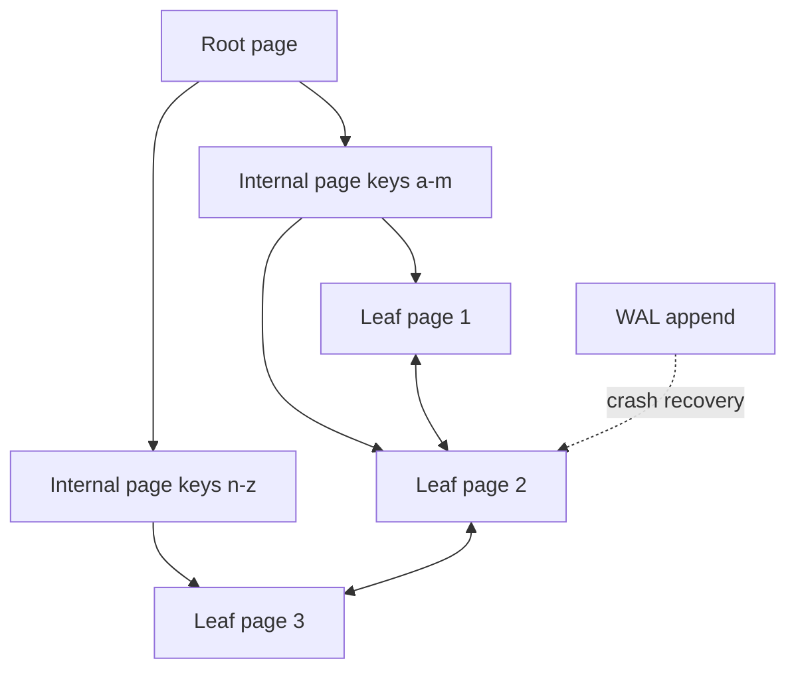
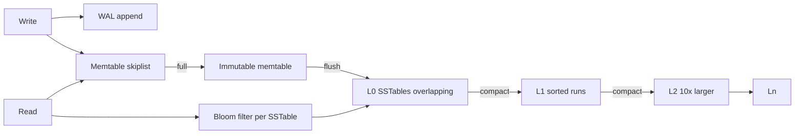
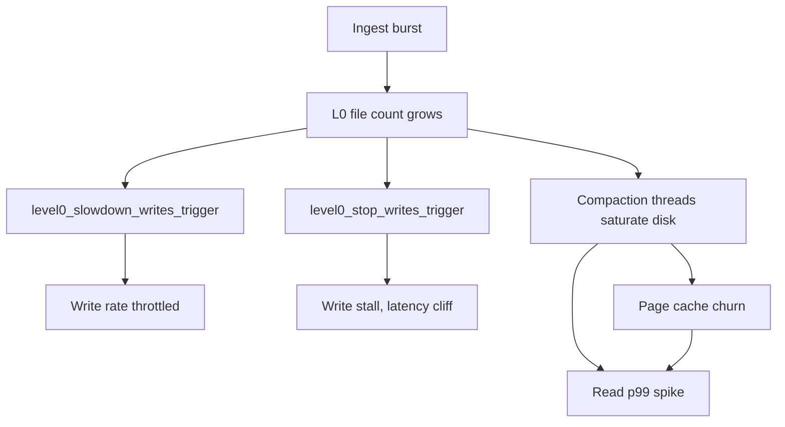
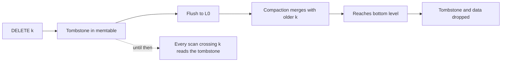

# F13 — Storage Engines

**Every storage engine is a bet about which amplification you can afford to pay — B-trees pay on write with in-place page updates, LSM-trees pay later with compaction, and the bill always arrives as tail latency.**

## The Three Amplifications

All engine design reduces to trading three quantities against each other. You cannot minimise all three; this is the RUM conjecture (Read, Update, Memory overheads).

| Amplification | Definition | Hurts | Typical B-tree | Typical LSM leveled |
|---|---|---|---|---|
| Write amplification (WA) | Bytes written to device / bytes written by app | SSD endurance, throughput | 2-10x (page + WAL, worse with small rows) | 10-30x |
| Read amplification (RA) | Device reads / logical reads | Read latency, IOPS | ~$\log_B N$ page reads, often 1 after caching | 1 per level touched, cut by bloom filters |
| Space amplification (SA) | Bytes on disk / logical bytes | Cost, cache efficiency | 1.1-1.6x from page fragmentation | 1.1x leveled, 2-10x tiered |

$$
WA_{\text{B-tree}} \approx \frac{\text{page\_size}}{\text{row\_size}} \times (1 + \text{WAL factor})
$$

A 100-byte row update on an 8 KiB page writes 8 KiB to the data file plus a WAL record — roughly 80x amplification before the WAL, unless many rows on the same page are updated before flush. Postgres's full-page writes after a checkpoint make the first write to each page cost 8 KiB in the WAL too.

$$
WA_{\text{leveled LSM}} \approx \sum_{i=1}^{L} T_i \quad\text{where } T_i = \frac{|L_i|}{|L_{i-1}|}
$$

With a uniform size ratio $T = 10$ and $L$ levels, each byte is rewritten roughly $T$ times per level, so $WA \approx T \cdot L$. For $T=10$ and $L=4$ that is about 40x in the worst case, closer to 10-25x in practice because of overlap ratios and non-uniform key distributions.

$$
L = \left\lceil \log_T \frac{N}{B} \right\rceil
$$

where $N$ is dataset size and $B$ is the size of the memtable flush. Doubling $T$ reduces the number of levels but increases per-level rewrite cost — leveled compaction's central knob.

## B-Tree Internals



Properties that matter operationally:

- **In-place update.** Modifying a row rewrites the whole page. The page must be made durable atomically, which is why torn-page protection exists — Postgres full-page writes, InnoDB doublewrite buffer.
- **Height is tiny.** With 8 KiB pages and ~100-byte keys, fan-out is a few hundred, so $\log_{300} 10^9 \approx 4$ levels. All interior levels normally sit in cache; a point lookup is one physical read.
- **Range scans are excellent** because leaves are linked and physically close when the tree is not fragmented.
- **Fragmentation and bloat.** Page splits leave pages half full. Postgres MVCC leaves dead tuples requiring vacuum; InnoDB pages settle around 60-70% fill for random inserts. Bloat is space amplification with a maintenance job attached.
- **Concurrency needs latch coupling** or a copy-on-write / B-link variant, which is why write-heavy workloads on a B-tree hit latch contention on the rightmost leaf when inserting monotonically increasing keys.

!!! gotcha "Random UUID primary keys destroy B-tree insert performance"
    **Symptom:** insert throughput collapses as the table exceeds RAM; write IOPS far exceed the logical write rate.
    **Mechanism:** UUIDv4 scatters inserts across the whole key space, so nearly every insert dirties a different page, evicting cache and causing a read-modify-write per insert. Monotonic keys append to the same hot leaf and stay in cache.
    **Mitigation:** use UUIDv7 or ULID with a time prefix, or a Snowflake-style ID. If you must keep v4, expect the working set to be the entire index.

## LSM-Tree Internals



A read must consult, in order: memtable, immutable memtables, then each level. Within a level above L0 the runs are non-overlapping so at most one SSTable per level is touched; L0 files overlap so all of them may be checked. Bloom filters eliminate most of these probes.

$$
RA_{\text{point lookup}} \approx 1 + (\text{levels} \times f) \quad\text{where } f = \text{bloom false positive rate}
$$

With $f = 0.01$ and 5 levels, the expected extra I/O is 0.05 reads — near-perfect. Range scans get no help from bloom filters and must merge iterators across every level, which is why LSM range scans are typically 2-5x more expensive than B-tree range scans.

## Compaction Strategies

| Strategy | Write amp | Read amp | Space amp | Latency profile | Good for |
|---|---|---|---|---|---|
| Leveled | High ($\approx T \cdot L$) | Low, 1 file per level | Low, ~1.1x | Frequent small compactions, steady | Read-heavy, space-constrained |
| Tiered / size-tiered | Low ($\approx L$) | High, many runs per level | High, up to $T$x during merges | Rare huge compactions, big spikes | Write-heavy ingest |
| FIFO / TTL | Minimal, just deletes | Depends on file count | Low | No merge work | Time-series with uniform TTL, caches |
| Universal | Between tiered and leveled | Medium | Medium-high | Configurable | General mixed workloads |
| Time-windowed (TWCS) | Low | Low for time-range queries | Low | Windowed | Time-series, per-window drop |

!!! example "Choosing by workload shape"
    - 90% reads, dataset 4x RAM, disk cost matters: **leveled**.
    - Ingest 500 MB/s of telemetry, queried in time ranges, 7-day TTL: **time-windowed** or **FIFO**.
    - Bulk load then serve read-only: tiered during load, then a manual full compaction before switching to serving.
    - Mixed OLTP with a hot key range: leveled, plus consider partitioning so the hot range gets its own column family.

!!! warning "Size-tiered compaction needs free space equal to the largest merge"
    A tiered merge of four 200 GB runs needs ~800 GB of scratch space before the inputs can be deleted. Running a tiered LSM at 70% disk utilisation can wedge the engine: it cannot compact because there is no room, and it cannot free room without compacting. Keep tiered stores below ~50% utilisation or use leveled.

## Compaction-Induced Latency Spikes

Compaction competes with foreground traffic for three resources: disk bandwidth, CPU for merge and checksum and compression, and page cache. The p99 latency graph of an LSM store is often a direct readout of the compaction schedule.



| Symptom | Underlying cause | Lever |
|---|---|---|
| Periodic p99 read spikes | Compaction consuming IOPS and evicting cache | Rate-limit compaction bytes/s; more, smaller compactions |
| Write latency cliff at a fixed L0 count | Slowdown/stop triggers engaged | More flush threads, bigger memtable, faster disk, more compaction threads |
| Latency spikes on the hour | Scheduled full compaction or TTL sweep | Stagger across replicas; never on all replicas at once |
| Slowly rising read latency | Level fan-out grew; too many L0 files persistently | Compaction is losing to ingest — the engine is over capacity |

!!! tip "Compaction is a background job that should be treated like traffic"
    Give it an explicit bandwidth budget (`rate_limiter_bytes_per_sec` in RocksDB), and hedge or shed reads on a node whose compaction backlog is high. In a replicated system, drain a node from the load balancer while it performs a large compaction — this is the single most effective p99 fix for LSM-backed services.

## WAL, Group Commit, and fsync

Durability is defined by the WAL, not by the data files. The sequence for a durable commit:

```text
1. Serialize the change into a WAL record with an LSN.
2. Append the record to the in-memory WAL buffer.
3. write() the buffer to the OS page cache.
4. fsync()/fdatasync() the WAL file so the device flushes its cache.
5. Only now acknowledge the commit to the client.
6. Data pages/SSTables are written later; recovery replays the WAL.
```

Steps 3 and 4 are different guarantees, and conflating them is the classic durability bug: `write()` returning success means the kernel has the bytes, not the device.

**Group commit** amortises the fsync: instead of one fsync per transaction, the engine batches all transactions that arrive within a small window into a single fsync.

$$
\text{throughput}_{\text{no group commit}} = \frac{1}{t_{\text{fsync}}}, \qquad
\text{throughput}_{\text{group commit}} = \frac{k}{t_{\text{fsync}} + t_{\text{wait}}}
$$

With an fsync costing 1 ms on a datacentre SSD, per-transaction fsync caps you at ~1000 commits/s regardless of core count. Batching $k=50$ transactions per fsync raises that to tens of thousands at the cost of up to $t_{\text{wait}}$ added latency. Postgres exposes this as `commit_delay` and `commit_siblings`; MySQL as `binlog_group_commit_sync_delay`.

| Setting | Meaning | Risk when relaxed |
|---|---|---|
| `synchronous_commit=off` (PG) | Ack before WAL fsync | Lose last ~`wal_writer_delay` of commits on crash; no corruption |
| `fsync=off` (PG) | No fsync at all | Corruption on power loss — never in production |
| `innodb_flush_log_at_trx_commit=2` | Write to OS cache, fsync each second | Survives process crash, not OS/power loss |
| `innodb_flush_log_at_trx_commit=0` | Flush once a second | Loses up to 1 s of commits on process crash too |
| RocksDB `WAL disabled` | No WAL | Data loss on crash; only valid for rebuildable state |

!!! danger "fsync failure loses data even though you handled the error"
    **The fsyncgate problem:** on Linux, when a writeback fails, the kernel marks the error on the page and reports it to the *next* `fsync()` — then clears the flag and marks the pages clean. A second `fsync()` returns success even though the data was never written. Some kernels historically also dropped the failed pages. Retrying `fsync()` after `EIO` is therefore unsafe: the only correct response is to treat the error as fatal, crash, and recover from the WAL or a replica. PostgreSQL 12 changed exactly this — it now panics on fsync failure. If your storage layer retries fsync and continues, it can silently lose committed data.

## Page Cache Interaction

| Engine style | Cache strategy | Consequence |
|---|---|---|
| Postgres | Small shared buffers plus OS page cache | Double caching; `effective_cache_size` is a planner hint about the OS cache |
| InnoDB | Large buffer pool, O_DIRECT | Single cache; buffer pool sizing is the main memory decision |
| RocksDB | Block cache plus OS cache unless direct I/O | Compression means block cache stores decompressed blocks, OS cache stores compressed |
| MongoDB WiredTiger | Internal cache ~50% RAM plus OS cache | Compressed on disk and in OS cache, uncompressed in WT cache |

!!! gotcha "Compaction and backups blow away the page cache"
    **Symptom:** read latency degrades for many minutes after a backup, a full compaction, or a large analytical scan.
    **Mechanism:** sequential scans pull cold data through the page cache and evict the hot working set. The engine's own hit-rate metric may still look fine while OS-level cache misses spike.
    **Mitigation:** use `posix_fadvise(DONTNEED)` or direct I/O for backup and compaction paths, run backups from a replica that serves no traffic, and watch cache hit ratio as a leading indicator alongside latency.

## Bloom Filters in LSM Reads

Each SSTable carries a bloom filter over its keys so a point lookup can skip files that certainly do not contain the key. See [F21 Probabilistic Data Structures](f21-probabilistic-data-structures.md) for the full derivation; the sizing result is:

$$
f \approx \left(1 - e^{-kn/m}\right)^k, \qquad m = -\frac{n \ln f}{(\ln 2)^2}, \qquad k = \frac{m}{n}\ln 2
$$

At 10 bits per key, $f \approx 1\%$; at 15 bits, $f \approx 0.46\%$; at 20 bits, $f \approx 0.06\%$.

| Bits/key | FPR | RAM for 1B keys |
|---|---|---|
| 8 | 2.2% | 1.0 GiB |
| 10 | 1.0% | 1.25 GiB |
| 15 | 0.46% | 1.9 GiB |
| 20 | 0.06% | 2.5 GiB |

!!! gotcha "Bloom filters do nothing for range scans or prefix seeks"
    **Symptom:** point lookups are fast, `SELECT ... WHERE k BETWEEN` is 10x slower than expected on the same store.
    **Mechanism:** a bloom filter answers "is this exact key present"; an iterator must open and merge every level regardless. Non-existent-key range scans are the worst case.
    **Mitigation:** prefix bloom filters (`prefix_extractor` in RocksDB) help when scans share a prefix; otherwise design the key so scans are within one partition, and cap scan width in the API.

## Tombstones and Delete-Heavy Workloads

Deletes in an LSM are writes. A delete inserts a tombstone that must survive until it has been compacted past every older version of the key; only a compaction reaching the bottom level can drop it.



!!! danger "Cassandra tombstone overwhelm"
    A queue-like table implemented as "insert row, read row, delete row" accumulates tombstones in the partition. A range read must materialise and skip every tombstone in the range; at `tombstone_failure_threshold` (default 100k) the coordinator aborts the query outright. The symptom is a read path that worked yesterday and now returns `TombstoneOverwhelmingException` on the same query. The fix is a data model change — time-bucketed partitions with TTL and TWCS so whole SSTables can be dropped — not raising the threshold.

| Delete pattern | LSM behaviour | Better design |
|---|---|---|
| Delete oldest rows daily | Tombstones spread across all levels | TTL + time-windowed compaction; drop whole files |
| Queue table | Tombstone accumulation in one partition | Use a real queue, or bucket by time |
| GDPR erase by user | Random tombstones, must reach bottom level | Crypto-shredding: delete the per-user key instead |
| Range delete | Single range tombstone in RocksDB | Prefer `DeleteRange` over N point deletes |

## Write Stalls

A write stall is the engine applying backpressure because flush or compaction cannot keep up. It is not a bug; it is the engine choosing bounded latency degradation over unbounded space and read amplification.

| Trigger | RocksDB knob | What it means |
|---|---|---|
| Too many L0 files | `level0_slowdown_writes_trigger`, `level0_stop_writes_trigger` | Flush outpacing compaction |
| Too many immutable memtables | `max_write_buffer_number` | Flush thread starved or disk saturated |
| Pending compaction bytes | `soft_pending_compaction_bytes_limit`, `hard_...` | Compaction debt is unbounded |

The correct response order: confirm the disk is not saturated, increase compaction and flush parallelism, rate-limit ingest at the application, and only then consider larger memtables — which increases recovery time after a crash because more WAL must be replayed.

## SSD Write Amplification and Endurance

The device performs its own amplification underneath yours. NAND is erased in blocks of several MiB but written in 4-16 KiB pages, so the FTL must garbage-collect.

$$
WA_{\text{total}} = WA_{\text{engine}} \times WA_{\text{FTL}}, \qquad
\text{drive lifetime} = \frac{\text{capacity} \times \text{DWPD} \times 365 \times \text{years}}{\text{host writes}}
$$

$$
WA_{\text{FTL}} \approx \frac{1}{1 - u} \text{ for random writes at utilisation } u
$$

At 90% utilisation, FTL amplification approaches 10x for pure random writes; over-provisioning to 70% brings it near 3x. Combined with an LSM at 20x engine amplification, 1 MB/s of logical writes can become 60 MB/s of NAND writes.

!!! example "Endurance sizing"
    A 3.84 TB drive rated 1 DWPD over 5 years tolerates $3.84 \times 1 \times 365 \times 5 \approx 7008$ TB of host writes. An application writing 20 MB/s with engine WA of 15x issues $20 \times 15 = 300$ MB/s to the host, or ~9.5 PB/year — the drive is consumed in under a year. Either reduce WA (tiered compaction, larger values, compression) or buy higher-endurance drives; discovering this after deployment is a fleet-wide replacement project.

## Row vs Columnar Storage

| Property | Row store | Columnar store |
|---|---|---|
| Layout | All fields of a row contiguous | All values of a column contiguous |
| Point read of full row | 1 I/O | N I/Os, one per column touched |
| Aggregate over 2 of 80 columns | Reads all 80 | Reads 2 |
| Compression ratio | 2-4x | 5-20x, values in a column are similar |
| Encoding tricks | Limited | RLE, dictionary, delta, frame-of-reference, bit-packing |
| Vectorised execution | Hard | Natural, SIMD-friendly |
| Update cost | In-place or LSM write | Rewrite column chunks or maintain delta store |
| Typical engines | InnoDB, Postgres heap, RocksDB | Parquet/ORC, ClickHouse MergeTree, BigQuery Capacitor |

!!! note "Hybrid layouts are the modern default"
    PAX-style formats such as Parquet split data into row groups and store columns within each group, giving columnar scan efficiency with bounded row-reconstruction cost. Time-series stores go further: Gorilla-style delta-of-delta timestamp encoding plus XOR float compression reduces a 16-byte sample to ~1.4 bytes on average.

## Index Structures

| Structure | Best at | Weakness | Where you meet it |
|---|---|---|---|
| B+tree | Range, ordered scans, point | Write amplification, random insert cost | Every OLTP database |
| LSM / SSTable | High write throughput | Range scans, space amp, compaction spikes | RocksDB, Cassandra, Bigtable |
| Hash index | O(1) point lookup | No ranges, must fit in memory or careful on-disk design | Redis, in-memory caches, Postgres `hash` |
| Inverted index | Full-text, multi-term | Update cost, segment merges | Lucene, Elasticsearch |
| Bitmap | Low-cardinality filters, set ops | Terrible on high cardinality unless compressed | Analytics, Postgres bitmap scans |
| GiST / R-tree | Spatial, ranges in 2D+ | Complex balancing, overlap | PostGIS |
| Trie / radix | Prefix search, IP lookup | Memory unless compressed | Routing tables, autocomplete |
| Skiplist | Concurrent in-memory ordered map | Memory overhead | LSM memtables |
| Zone maps / min-max | Skipping blocks in scans | Useless if data unsorted on the predicate | Columnar engines |
| Covering index | Index-only scans | Extra write cost, more space | `INCLUDE` in PG, secondary index design |

```sql
-- A covering index turns a two-step lookup into an index-only scan.
CREATE INDEX idx_orders_customer_created
  ON orders (customer_id, created_at DESC)
  INCLUDE (status, total_cents);

-- Partial index: pay write cost only for the rows you query.
CREATE INDEX idx_orders_pending
  ON orders (created_at)
  WHERE status = 'pending';
```

## Gotchas & Corner Cases

!!! gotcha "`write()` returning success is not durability"
    **Symptom:** after a power loss or hard node failure, the last seconds of acknowledged commits are gone despite "no errors in the logs".
    **Mechanism:** `write()` only copies into the kernel page cache. Without `fsync`/`fdatasync` — and, on some hardware, without the device's volatile write cache being flushed or battery-backed — the data lives only in volatile memory.
    **Mitigation:** fsync the WAL before acknowledging, verify the device honours cache-flush commands, and test with actual power-cut or `echo b > /proc/sysrq-trigger` style fault injection rather than a graceful shutdown.

!!! gotcha "Retrying fsync after EIO can silently lose data"
    **Symptom:** the application logs an I/O error, retries fsync, gets success, continues — and the data is gone.
    **Mechanism:** the kernel reports a writeback error once and then clears the error state, marking the failed pages clean. The retry has nothing left to flush.
    **Mitigation:** treat fsync failure as unrecoverable: panic and recover through WAL replay or failover to a replica. This is why PostgreSQL now panics on fsync error.

!!! gotcha "A larger memtable makes crash recovery unacceptably slow"
    **Symptom:** a node that used to restart in 30 seconds now takes 20 minutes after a tuning change, blowing your MTTR and possibly triggering cascading failover.
    **Mechanism:** a bigger memtable means more unflushed WAL to replay, and replay is single-threaded in many engines.
    **Mitigation:** size memtables and `max_wal_size` against a recovery-time objective, not only against write throughput. Measure restart time as part of tuning.

!!! gotcha "Compaction on all replicas at the same time removes your headroom"
    **Symptom:** cluster-wide p99 spike at a predictable time with no traffic change.
    **Mechanism:** scheduled or TTL-driven compaction fires simultaneously because all nodes were provisioned and started together; every replica of every shard degrades at once, so hedged requests and retries have nowhere healthy to go.
    **Mitigation:** jitter compaction schedules, stagger by rack or replica index, and drain a node from serving before large compactions.

!!! gotcha "Deleting rows does not free disk space, and may consume more"
    **Symptom:** a cleanup job deletes 40% of a table and disk usage rises.
    **Mechanism:** in an LSM every delete is a tombstone write; in a B-tree MVCC engine, deleted tuples remain until vacuum and the WAL/undo grows. Space is reclaimed only after compaction reaches the bottom level or after `VACUUM FULL`, which needs a table-sized copy and an exclusive lock.
    **Mitigation:** plan free-space headroom before bulk deletes, prefer partition or file drops over row deletes, and use `pg_repack`-style online rewrites instead of `VACUUM FULL`.

!!! gotcha "Bloom filters are per-SSTable and evaporate under memory pressure"
    **Symptom:** read amplification jumps after a config change reducing block cache, or after a large compaction.
    **Mechanism:** filters live in the block cache in many configurations. Under pressure they are evicted like any other block, so every lookup falls back to real I/O — and the extra I/O increases pressure further.
    **Mitigation:** pin filter and index blocks in cache (`cache_index_and_filter_blocks_with_high_priority`, `pin_l0_filter_and_index_blocks_in_cache`) and budget their memory explicitly as non-evictable.

!!! gotcha "Range tombstones make an empty range scan expensive"
    **Symptom:** scanning a key range that you deleted returns nothing but takes hundreds of milliseconds.
    **Mechanism:** the iterator must still open every level, apply tombstones, and skip deleted keys. Bloom filters do not apply to iterators.
    **Mitigation:** design for whole-file drops via TTL and time-windowed compaction, and never model a work queue as a delete-heavy table.

!!! gotcha "Secondary indexes multiply write amplification invisibly"
    **Symptom:** a single-row insert generates far more I/O than expected; ingest throughput drops after adding an index for a rarely-used dashboard query.
    **Mechanism:** each secondary index is an additional tree or LSM receiving a write per row change, each with its own WAL records, its own page splits, and its own compaction debt.
    **Mitigation:** audit index usage regularly (`pg_stat_user_indexes.idx_scan`), delete unused indexes, prefer partial and covering indexes, and treat "add an index" as a capacity change.

!!! gotcha "Compression makes size-based tuning lie to you"
    **Symptom:** memtable and block-size settings behave differently in production than in the benchmark.
    **Mechanism:** memtable size is uncompressed, SSTable size is compressed, block cache holds uncompressed blocks, and the OS cache holds compressed ones. A 4x compression ratio means the same "64 MB" refers to four different physical quantities across the stack.
    **Mitigation:** state explicitly which side of compression a number lives on when tuning, and measure with production-like data — synthetic data compresses far better than real data.

!!! gotcha "The disk is fast but the filesystem lies about ordering"
    **Symptom:** a corrupted data file after a crash, despite fsync-per-commit.
    **Mechanism:** creating or renaming a file requires fsync of the containing *directory* as well as the file, or the metadata may not be durable. Storage engines that write a new file and rename it into place must fsync the directory.
    **Mitigation:** use a well-tested engine rather than hand-rolled durability, and if you do write files, fsync the file, then the directory, then rename, then fsync the directory again.

!!! gotcha "Monotonic keys turn one node into the whole cluster's write path"
    **Symptom:** in a sharded LSM or B-tree cluster keyed by timestamp, one shard takes all writes while the rest idle.
    **Mechanism:** ordered partitioning plus a monotonically increasing key sends every new write to the last range. This is the same problem Bigtable and HBase call a hot region.
    **Mitigation:** salt the key prefix, hash-partition, or use a composite key that puts a high-cardinality field first. This is the direct trade-off against range-scan efficiency.

## SRE Lens

**SLIs and SLOs**

| SLI | Definition | Notes |
|---|---|---|
| Read latency | p50/p99/p999 of point read | p999 exposes compaction and GC; p99 alone hides it |
| Write latency | p99 of commit ack | Dominated by fsync and write stalls |
| Durability | Acknowledged writes that survive failure | Verify by fault injection, not by assumption |
| Recovery time | Time from process start to serving | Function of WAL size; test every release |
| Space efficiency | Logical bytes / physical bytes | Detects bloat and tombstone accumulation |

**Failure modes and detection**

| Failure | Signals | Response |
|---|---|---|
| Write stall | Stall micros, L0 file count, pending compaction bytes | Rate-limit ingest, raise compaction threads, check disk saturation |
| Compaction debt runaway | Pending compaction bytes trending up over hours | The node is over capacity; shed writes or add shards |
| Bloat / dead tuples | Table vs index size ratio, `n_dead_tup` | Tune autovacuum; online repack |
| Tombstone overwhelm | Tombstone scanned per read | Data model change, TTL, windowed compaction |
| Disk approaching full | Free bytes vs largest expected compaction | Free space *before* 80%; compaction needs scratch room |
| SSD wear | `media_wearout_indicator`, host writes | Rotate drives ahead of failure; reduce WA |
| fsync latency regression | Device flush latency histogram | Suspect a degraded RAID cache or a noisy neighbour on shared storage |

**Rollout and migration risk**

- Storage engine upgrades often change on-disk format irreversibly. Verify the downgrade path exists before upgrading a stateful fleet; if it does not, the rollback plan is restore-from-backup, and that must be timed and tested.
- Changing compaction strategy rewrites the entire dataset. Do it on one replica, measure, and never on a quorum at once.
- Adding an index to a large table: use concurrent/online index builds, and know that they can fail and leave an invalid index behind that still costs writes.
- Restore drills are the only proof that backups work. Measure restore *time* against the RTO, not just success.

**Capacity signals**

- Working set vs RAM: the cliff when the working set exceeds cache is not gradual.
- Disk utilisation with compaction headroom, not raw free space.
- IOPS and bandwidth headroom at peak, sized for the degraded case where a replica is down and compaction is running.
- WAL generation rate — it drives replication bandwidth, archive storage, and recovery time.

**On-call runbook notes**

1. Before restarting a stalled node, check whether it is mid-compaction; restarting can restart the compaction from scratch and prolong the incident.
2. Never delete WAL/archive files to free space. Free space by dropping old partitions or expanding the volume.
3. If disk is nearly full on an LSM, disabling compaction makes it worse, not better.
4. Distinguish "slow because of compaction" from "slow because of the query" using per-level read statistics before making a change.

**Cost**

Write amplification is a direct multiplier on both IOPS provisioning and drive replacement cost. Compression trades CPU for storage and, more importantly, for I/O bandwidth — zstd at level 3 typically beats snappy on total cost when CPU is not saturated. Cold data on a tiered or columnar store can be 10-20x cheaper per byte than the same data in a hot OLTP engine, which is the main argument for archival partitions.

## Interview Angle

!!! interview "Probe: B-tree or LSM for this workload, and why?"
    **Strong:** ask for the read/write ratio, the value size, whether scans are common, the dataset-to-RAM ratio, and the latency shape required. Then answer in terms of amplification: "80/20 write-heavy with small values and few range scans — LSM, accepting ~20x write amplification and compaction-driven p99 spikes, mitigated by rate-limited compaction and draining nodes during major compactions."

    **Weak:** "LSM is faster for writes." True but content-free, and wrong when values are large or scans dominate.

!!! interview "Probe: your p99 is 5 ms but p999 is 800 ms. Explain."
    **Strong:** name the candidates and how to discriminate: compaction stealing IOPS, write stalls at L0 thresholds, fsync latency on a shared volume, page cache eviction from a backup or scan, GC pauses, or a lock convoy. Then propose measurement — per-level stats, stall counters, device latency histograms — before proposing a fix.

!!! interview "Probe: derive the write amplification of leveled compaction."
    **Strong:** $L = \log_T(N/B)$ levels, each byte rewritten roughly $T$ times per level, so $WA \approx T \log_T(N/B)$; note that increasing $T$ reduces $L$ but raises per-level cost, and that the total is minimised around moderate $T$. Mention that the real number is lower because of key overlap and higher because of the WAL.

!!! interview "Follow-up: how would you make deletes cheap in an LSM?"
    **Strong:** avoid per-row deletes entirely — time-bucket the data so an entire SSTable or partition can be dropped, use TTL with time-windowed compaction, use range tombstones when you must, and use crypto-shredding for per-entity erasure requirements. Explain why raising Cassandra's tombstone threshold is treating the alarm rather than the fire.

!!! interview "Follow-up: single Postgres instance is at 80% write capacity. Options?"
    **Strong:** in order of increasing disruption — kill unused indexes, batch writes and use group commit, move append-heavy tables to partitioned tables with drop-based retention, offload reads to replicas, split by bounded context into a second database, then shard. Quantify each: unused index removal often recovers 20-40% of write I/O immediately and costs nothing.

!!! interview "Trap: 'just add more RAM'."
    **Strong:** RAM helps until the working set no longer fits or until the bottleneck is fsync or compaction bandwidth, neither of which RAM fixes. Show you can identify which resource is actually saturated before spending.

## Key Takeaways

- Engine choice is a choice about which of write, read, and space amplification you can afford; the RUM conjecture says you cannot minimise all three.
- B-trees pay on write via in-place page updates and fragmentation; LSM-trees defer that cost into compaction, which surfaces as tail latency and disk-space spikes.
- Leveled compaction optimises reads and space at high write amplification; tiered optimises writes at high space and read amplification; time-windowed is the right answer for TTL'd time-series.
- Durability is `fsync` plus honest hardware, and an fsync error must be fatal — retrying it can silently lose data.
- Bloom filters make LSM point reads nearly free but do nothing for range scans, which is why key design decides scan cost.
- Deletes in an LSM are writes; tombstones can dominate read cost, so design for whole-file drops instead of row deletes.
- Total write amplification is the engine's multiplied by the SSD FTL's — model it before sizing drives, or you will replace a fleet early.
- Every secondary index is another write path with its own amplification; unused indexes are pure cost.

## Further Reading

- Patrick O'Neil, Edward Cheng, Dieter Gawlick, Elizabeth O'Neil, *The Log-Structured Merge-Tree (LSM-Tree)*, Acta Informatica, 1996 — the original.
- Mendel Rosenblum and John Ousterhout, *The Design and Implementation of a Log-Structured File System*, 1992.
- Fay Chang et al., *Bigtable: A Distributed Storage System for Structured Data*, OSDI 2006 — SSTables, memtables, compaction in production.
- Manos Athanassoulis et al., *Designing Access Methods: The RUM Conjecture*, EDBT 2016.
- Niv Dayan, Manos Athanassoulis, Stratos Idreos, *Monkey: Optimal Navigable Key-Value Store*, SIGMOD 2017 — optimal bloom filter allocation across LSM levels.
- Siying Dong et al., *Optimizing Space Amplification in RocksDB*, CIDR 2017, and *Evolution of Development Priorities in Key-Value Stores Serving Large-Scale Applications: The RocksDB Experience*, FAST 2021.
- RocksDB wiki: Compaction, Write Stalls, Rate Limiter, Memory Usage, and Tuning Guide.
- Tuomas Pelkonen et al., *Gorilla: A Fast, Scalable, In-Memory Time Series Database*, VLDB 2015 — delta-of-delta and XOR compression.
- C. Mohan et al., *ARIES: A Transaction Recovery Method Supporting Fine-Granularity Locking and Partial Rollbacks Using Write-Ahead Logging*, ACM TODS 1992.
- Remzi and Andrea Arpaci-Dusseau, *Operating Systems: Three Easy Pieces*, chapters on crash consistency and journaling.
- PostgreSQL mailing list discussion and the PostgreSQL 12 release notes covering fsync error handling ("fsyncgate").

---

Related: [F12 Message Queues & Streams](f12-queues-streams.md) for the log abstraction on top of these engines, [F14 SQL vs NoSQL Selection](f14-sql-vs-nosql.md) for choosing the database that wraps them, and [F16 Search & Indexing](f16-search-indexing.md) for inverted-index storage.
