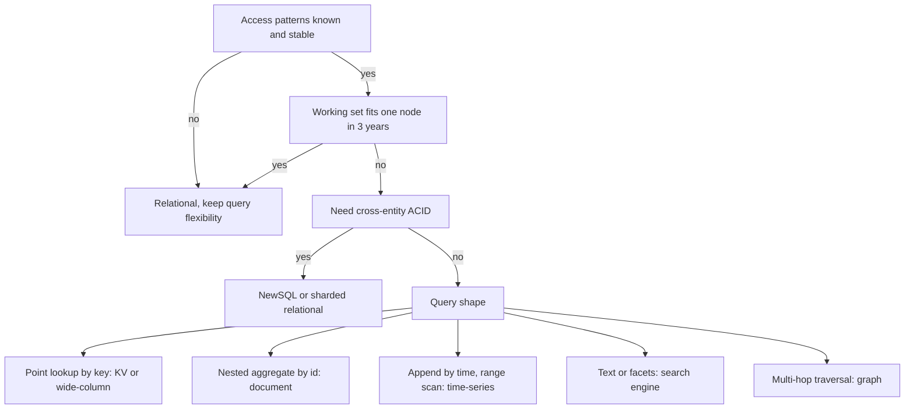
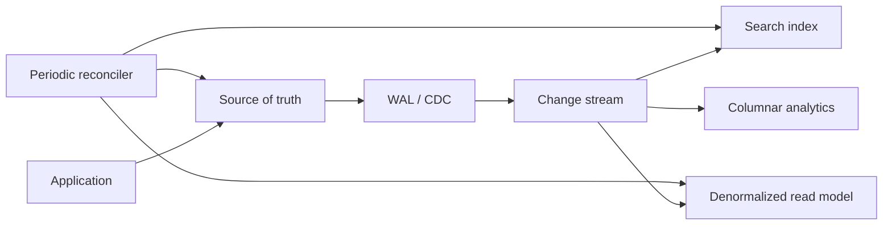
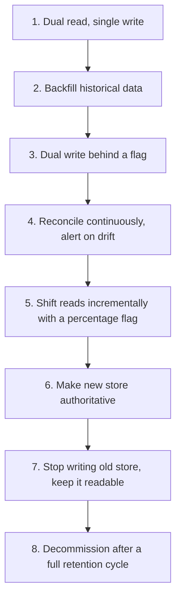

# F14 — SQL vs NoSQL Selection

**The database is chosen by the access patterns and the operational constraints, never by the data model in isolation — and for most systems a single well-tuned Postgres node is still the correct answer for far longer than engineers expect.**

## The Selection Framework

Answer these before naming any product. Anyone who names a database before answering them is guessing.

| Question | Why it decides the answer |
|---|---|
| What are the top 5 queries by volume, exactly? | Determines index and partition design; NoSQL forces you to answer this up front |
| What is the working set size in 3 years? | Decides single-node vs distributed, and RAM budget |
| Peak QPS split read/write? | Decides replica topology and whether writes need sharding |
| Do you need multi-entity transactions? | Cross-partition ACID is where distributed stores get expensive or impossible |
| What consistency does each read path need? | Most reads tolerate staleness; a few absolutely do not |
| How is data queried in unforeseen ways? | Analytics and support tooling need flexible query, which NoSQL punishes |
| What is the cardinality and skew of the partition key? | Skew breaks every distributed store the same way |
| What is the retention and deletion policy? | Drives TTL, partition-drop design, and cost |
| Who operates it at 03:00? | The strongest constraint, and the most often ignored |



!!! warning "Scale is not a reason on its own"
    "We might reach Facebook scale" is not a requirement. The cost of premature distribution is paid every day in lost query flexibility, lost transactions, more moving parts, and slower feature delivery. The cost of migrating later is paid once, with much better information.

## When a Single Postgres Node Is Genuinely Enough

Concrete numbers for modern hardware — a 64-core, 512 GiB RAM machine with local NVMe:

| Dimension | Comfortable | Achievable with care | Hard ceiling area |
|---|---|---|---|
| Point-read QPS (cached) | 20k-50k | 100k+ with a pooler and prepared statements | Connection handling, not storage |
| Write TPS (small rows, group commit) | 5k-20k | 50k+ with batching and `synchronous_commit=off` | WAL fsync, index maintenance |
| Dataset on disk | 1-5 TB | 10-30 TB with partitioning | Vacuum, backup/restore time, not queries |
| Working set | Up to ~400 GiB in cache | — | Cliff when working set exceeds RAM |
| Rows in one partitioned table | Billions | — | Index maintenance and autovacuum |
| Read replicas | 3-10 | More with cascading replicas | Replication bandwidth, replica lag |

The realistic limits appear in this order, and none of them is "the query engine is too slow":

1. **Connections.** Each backend is a process with ~5-10 MiB overhead; a few hundred is the practical ceiling. Solved with a pooler, not a bigger machine.
2. **Vacuum and bloat** on very high-churn tables.
3. **Backup and restore time** — a 20 TB restore is measured in hours, which may violate your RTO long before performance does.
4. **Schema migration windows** on huge tables.
5. **Write throughput** limited by WAL fsync and index write amplification.

!!! example "Sizing a realistic workload"
    5M daily active users, 20 requests each, 80/20 read/write, peak 3x average:
    $$\lambda_{\text{avg}} = \frac{5{,}000{,}000 \times 20}{86400} \approx 1160\ \text{req/s}, \qquad \lambda_{\text{peak}} \approx 3500\ \text{req/s}$$
    That is roughly 700 writes/s and 2800 reads/s at peak. One primary plus two replicas handles this with a large margin. Reaching for a distributed database here buys nothing but operational load.

!!! tip "Scale-up before scale-out"
    Going from 16 cores/64 GiB to 96 cores/768 GiB is a maintenance window and a bill. Going from one node to a sharded cluster is a quarter of engineering time, permanent complexity, and a class of bugs you have never seen. Exhaust vertical scaling, read replicas, caching, and partitioning first.

## The Family Comparison

| Family | Data model | Query strength | Weakness | Representative | Sweet spot |
|---|---|---|---|---|---|
| Relational | Tables, foreign keys | Arbitrary joins, ACID, ad hoc | Vertical write ceiling, sharding is manual | Postgres, MySQL | Anything with entity relationships and unknown future queries |
| Key-value | Opaque value by key | O(1) point access | No queries beyond key | Redis, DynamoDB, Memcached | Sessions, caches, feature flags, counters |
| Wide-column | Row key + column families, ordered | Range scan within partition, huge write rates | No joins, query-first modelling, tombstones | Cassandra, Bigtable, HBase, ScyllaDB | Time-ordered event data, very high write rate, multi-region writes |
| Document | JSON-like nested docs | Aggregate-per-document reads | Cross-document joins and transactions | MongoDB, Couchbase, DocumentDB | Content, catalogues, profiles with varying shape |
| Graph | Nodes and edges | Multi-hop traversal, shortest path | Scaling traversals across shards | Neo4j, JanusGraph, Neptune | Fraud rings, social graph, permissions, recommendations |
| Time-series | Timestamped metric points | Downsampling, retention, range aggregation | Non-time queries, high-cardinality label explosion | Prometheus, InfluxDB, TimescaleDB, VictoriaMetrics | Monitoring, IoT, financial ticks |
| Search | Inverted index over analysed text | Relevance, facets, fuzzy | Not a system of record, near-real-time only | Elasticsearch, OpenSearch, Solr | Text search, log exploration, faceted browse |
| Columnar / OLAP | Column chunks | Aggregations over billions of rows | Point updates, single-row reads | ClickHouse, BigQuery, Snowflake, Druid | Analytics, dashboards, ad hoc BI |
| NewSQL | Relational over a distributed KV | ACID at scale, horizontal writes | Latency of distributed commit, cost, operational depth | Spanner, CockroachDB, Yugabyte, TiDB | Global OLTP that genuinely outgrew one node |

!!! gotcha "A graph query does not require a graph database"
    Two-hop traversals over 10M edges are perfectly fast as recursive CTEs in Postgres with the right indexes. The graph database earns its place at variable-depth traversal, path-finding, and pattern matching over deep neighbourhoods — not at "we have relationships".

## DynamoDB Single-Table Design

DynamoDB's model is a direct consequence of its physics: every item lives in a partition determined by $\operatorname{hash}(PK)$, and every query must specify the partition key. There is no join, no scan you can afford, and no query planner to save a bad schema.

Single-table design means storing heterogeneous entity types in one table with generic keys so that a single query returns a pre-joined result set.

```json
[
  {"PK": "USER#42",         "SK": "PROFILE",                 "name": "Ana",   "tier": "gold"},
  {"PK": "USER#42",         "SK": "ORDER#2026-04-18#A91",    "total": 8200,   "status": "SHIPPED",
   "GSI1PK": "ORDER#A91",   "GSI1SK": "ORDER#A91"},
  {"PK": "USER#42",         "SK": "ADDRESS#HOME",            "zip": "94107"},
  {"PK": "ORDER#A91",       "SK": "ITEM#1",                  "sku": "SKU-7",  "qty": 2},
  {"PK": "ORDER#A91",       "SK": "ITEM#2",                  "sku": "SKU-9",  "qty": 1}
]
```

`Query(PK = "USER#42", SK begins_with "ORDER#")` returns the user's orders newest-first in one round trip, with no join and no second request. That is the whole point.

| Access pattern | Key design | Notes |
|---|---|---|
| Get user profile | `PK=USER#id, SK=PROFILE` | Single `GetItem` |
| List user's orders, newest first | `PK=USER#id, SK begins_with ORDER#`, sort descending | Timestamp inside SK gives ordering for free |
| Get order by order id | GSI with `GSI1PK=ORDER#id` | Inverted index pattern |
| List orders by status for ops | Sparse GSI on `status` only for open orders | Sparse index keeps the GSI small |
| Enforce unique email | Item with `PK=EMAIL#addr` written in a `TransactWriteItems` with a condition | The only way to get uniqueness |

!!! danger "Single-table design is a one-way door if the access patterns are not stable"
    The whole design encodes today's queries into the key structure. A genuinely new access pattern usually requires a new GSI — which costs a full table backfill and extra write capacity on every item forever — or an ETL to another store. Use it when the patterns are few, well understood, and unlikely to change; use a relational store when they are not.

### Secondary Index Trade-Offs

| Index type | Consistency | Capacity | Constraint | Failure mode |
|---|---|---|---|---|
| DynamoDB LSI | Strongly consistent reads possible | Shares the partition's throughput | Must be created with the table; same PK | 10 GB hard limit per partition key value |
| DynamoDB GSI | Eventually consistent only | Own provisioned capacity | Different PK allowed | GSI throttling **backpressures the base table writes** |
| Postgres B-tree secondary | Transactional | Write amplification on every insert/update | — | Unused indexes are pure write cost |
| Cassandra secondary index | Local per node | Query fans out to all nodes | High cardinality is pathological | Scatter-gather across the ring |
| Cassandra materialized view | Eventual, can diverge | Extra write path | Marked experimental for years | Silent divergence from the base table |
| MongoDB compound index | Transactional | Index order matters, prefix rule | — | Index intersection is usually worse than a compound index |

!!! gotcha "A throttled GSI stops writes to the base table"
    **Symptom:** `ProvisionedThroughputExceededException` on the main table even though its own capacity is barely used.
    **Mechanism:** every base-table write must be propagated to each GSI. If a GSI cannot absorb the writes, DynamoDB applies backpressure to the base table rather than allowing unbounded divergence.
    **Mitigation:** provision GSIs for their own write rate, keep GSIs sparse, avoid GSI partition keys with low cardinality, and prefer on-demand capacity while patterns are unknown.

## Materialized Views and Denormalization

Denormalization is not a modelling philosophy; it is a cache with a consistency problem. The question is always who maintains it and what happens when maintenance fails.

| Maintenance strategy | Freshness | Correctness risk | Cost |
|---|---|---|---|
| Synchronous write to both in one transaction | Immediate | None if same DB; two-phase problem if not | Write latency, coupling |
| Database materialized view, refreshed | Refresh interval | Stale window | Refresh cost, locking unless concurrent |
| Incremental view maintenance (Postgres triggers, ClickHouse MV) | Near immediate | Trigger bugs, cascading writes | Write amplification |
| CDC to a stream, consumer maintains view | Seconds | Consumer lag, replay bugs, reordering | A pipeline to operate |
| Application dual-write | Immediate-ish | High: partial failure diverges silently | Cheap to write, expensive to trust |
| Batch rebuild | Hours | Bounded staleness, self-healing | Compute cost |



!!! tip "Never dual-write from the application"
    Application dual-writes have no atomicity: one succeeds, the other fails, and the divergence is silent and permanent. Use the transactional outbox pattern or CDC from the WAL, so the single source of truth is the database transaction. Add a periodic reconciler regardless — every derived store drifts eventually.

## Schema Evolution

!!! note "Schemaless means the schema lives in your application code"
    A document store does not remove the schema, it removes the *enforcement* and the *single place to see it*. Five years of writes leaves five generations of document shapes and every reader must handle all of them, forever, because nothing forces a backfill.

Safe evolution in a relational store, expand-contract:

```sql
-- Phase 1 (expand): additive only, safe with old code running.
ALTER TABLE orders ADD COLUMN currency text;              -- no default: instant in modern PG
CREATE INDEX CONCURRENTLY idx_orders_currency ON orders (currency);

-- Phase 2 (migrate): backfill in bounded batches, never one statement.
UPDATE orders SET currency = 'USD'
 WHERE currency IS NULL AND id IN (
   SELECT id FROM orders WHERE currency IS NULL ORDER BY id LIMIT 10000
 );

-- Phase 3: deploy code that reads and writes the new column.
-- Phase 4 (contract): only after all readers are updated.
ALTER TABLE orders ALTER COLUMN currency SET NOT NULL;    -- validate separately if huge
ALTER TABLE orders DROP COLUMN legacy_currency_code;
```

| Operation | Lock impact (Postgres) | Safe approach |
|---|---|---|
| `ADD COLUMN` without default | Metadata only, instant | Safe |
| `ADD COLUMN` with volatile default | Table rewrite (older versions) | Add nullable, backfill, then set default |
| `CREATE INDEX` | Blocks writes | `CREATE INDEX CONCURRENTLY` |
| `ALTER COLUMN TYPE` | Full rewrite + exclusive lock | New column, backfill, swap |
| `SET NOT NULL` | Full scan under exclusive lock | Add `CHECK ... NOT VALID`, `VALIDATE`, then set |
| `DROP COLUMN` | Instant metadata change | Safe, but only after all readers stop referencing it |
| Adding a foreign key | Validation scan under lock | `NOT VALID` then `VALIDATE CONSTRAINT` |

!!! gotcha "A migration that waits for a lock blocks everything queued behind it"
    **Symptom:** a "instant" `ALTER TABLE` causes a full outage on a busy table.
    **Mechanism:** the DDL waits for an `ACCESS EXCLUSIVE` lock behind a long-running query; while it waits, every subsequent query queues behind *it*. A 200 ms DDL becomes a 5-minute outage caused by one slow analytics query.
    **Mitigation:** always set `lock_timeout` to a few seconds before DDL and retry, and never run migrations while long transactions are open.

## Connection Limits and Poolers

The most common "Postgres cannot scale" incident is not about Postgres.

$$
\text{useful concurrency} \approx \text{cores} \times \left(1 + \frac{\text{wait time}}{\text{service time}}\right)
$$

Beyond that, more connections reduce throughput. Serverless functions and pod autoscaling make this catastrophic: 500 pods with a pool of 20 each demand 10,000 connections against a server configured for 300.

| Mode | Reuse granularity | Supports | Notes |
|---|---|---|---|
| Session pooling | Per client session | Everything | Barely better than direct connections |
| Transaction pooling | Per transaction | Most apps | The default recommendation; huge multiplexing win |
| Statement pooling | Per statement | Autocommit only | Rarely appropriate |

Transaction pooling breaks: session-level `SET`, `LISTEN/NOTIFY`, advisory locks held across statements, `WITH HOLD` cursors, and server-side prepared statements unless the pooler supports them explicitly.

```yaml
# PgBouncer: 8000 client connections multiplexed onto 100 server connections.
[databases]
app = host=primary.db port=5432 dbname=app

[pgbouncer]
pool_mode = transaction
max_client_conn = 8000
default_pool_size = 100
reserve_pool_size = 20
server_idle_timeout = 60
query_wait_timeout = 5     # fail fast instead of queueing forever
```

!!! gotcha "Idle-in-transaction connections hold locks and block vacuum"
    **Symptom:** table bloat grows, autovacuum never reclaims, and unrelated DDL hangs.
    **Mechanism:** a connection left `idle in transaction` — often an ORM that opened a transaction and then made an HTTP call — pins the oldest transaction ID, so vacuum cannot remove any tuple newer than it, anywhere in the database.
    **Mitigation:** set `idle_in_transaction_session_timeout`, alert on the oldest transaction age, and never perform network I/O inside a database transaction.

## JSONB as an Escape Hatch

```sql
CREATE TABLE events (
  id          bigserial PRIMARY KEY,
  tenant_id   bigint      NOT NULL,
  type        text        NOT NULL,     -- promoted: queried in every request
  occurred_at timestamptz NOT NULL,     -- promoted: used for range and retention
  payload     jsonb       NOT NULL      -- genuinely variable per event type
);

CREATE INDEX idx_events_tenant_time ON events (tenant_id, occurred_at DESC);
CREATE INDEX idx_events_payload ON events USING gin (payload jsonb_path_ops);

-- Expression index for one hot key inside the document.
CREATE INDEX idx_events_order ON events ((payload->>'order_id'))
  WHERE type = 'order_updated';
```

| Do | Do not |
|---|---|
| Promote every field used in `WHERE`, `JOIN`, or `ORDER BY` to a real column | Store the entire entity in JSONB and query it with `->>` everywhere |
| Use `jsonb_path_ops` GIN when you only need containment | Use the default GIN when you do not need key-existence operators — it is larger |
| Add expression indexes for specific hot paths | Rely on the planner to estimate selectivity inside JSONB accurately |
| Keep documents small | Store multi-megabyte documents that TOAST and cause detoast cost on every read |
| Validate shape at the application boundary or with a `CHECK` | Assume the shape because "we always write it that way" |

!!! gotcha "Updating one field of a large JSONB rewrites the whole value"
    **Symptom:** high write amplification and WAL volume from small logical updates.
    **Mechanism:** JSONB is stored as a single value; changing one key rewrites the entire document and, if TOASTed, the out-of-line chunks. A 2 MB document updated 100 times/s generates 200 MB/s of WAL.
    **Mitigation:** split frequently-updated fields into their own columns or rows, and keep documents small.

## NewSQL

| System | Architecture | Consistency | Latency cost | Operational reality |
|---|---|---|---|---|
| Spanner | Sharded Paxos over Colossus, TrueTime | External consistency (linearizable) | Commit waits out clock uncertainty, ~7 ms typical | Managed only; you pay for the atomic clocks |
| CockroachDB | Raft over range-partitioned KV, hybrid logical clocks | Serializable | Cross-range commit is multi-round | Self-hosted possible; contention tuning is a skill |
| YugabyteDB | Raft, Postgres query layer | Serializable / snapshot | Similar | Postgres wire compatibility is the selling point |
| TiDB | Raft over TiKV, MySQL protocol | Snapshot isolation, serializable option | Percolator-style 2PC | Strong HTAP story via TiFlash |
| Vitess | Sharded MySQL with a routing layer | Per-shard ACID; cross-shard is best-effort 2PC | Low within a shard | Proven at YouTube scale; you still think in shards |
| Citus | Sharded Postgres extension | Per-shard ACID; distributed transactions with limits | Low when co-located | Excellent when a tenant column is the natural shard key |

!!! warning "Distributed SQL does not make cross-shard transactions cheap"
    A transaction touching one range is fast. A transaction touching five ranges across three zones requires consensus rounds plus a commit protocol, and its latency floor is set by inter-zone RTT. Systems that "just work" at low scale develop severe contention when a hot row becomes the serialisation point for the whole cluster. Design for shard-local transactions; treat cross-shard as an exception with a latency budget.

## Polyglot Persistence Costs

Every additional datastore adds a fixed, recurring tax:

| Cost | Detail |
|---|---|
| Operational | Backup/restore procedures, upgrades, capacity model, monitoring, and a tested runbook per store |
| Consistency | Data now spans systems with no shared transaction; divergence is inevitable and must be reconciled |
| Expertise | On-call must understand the failure modes of each store, at 03:00, under pressure |
| Query | Cross-store joins move into application code with no optimiser and no statistics |
| Cost | Minimum cluster sizes, licensing, cross-AZ traffic between stores |
| Security | Another auth model, another encryption story, another audit surface |

!!! tip "The rule of one plus one"
    Most systems justify at most two datastores plus a cache: a system of record, and one specialised store (search, analytics, or time-series) fed by CDC. Every additional store needs an explicit written justification naming the access pattern the existing stores cannot serve.

## Migration Paths



| Escape hatch | Trigger | Rollback cost |
|---|---|---|
| Read shift | Error rate or latency regression | Instant, flip the flag |
| Write shift | Drift detected by the reconciler | Hard — new writes only exist in the new store; keep dual writes until confident |
| Full cutover | — | Requires the old store still receiving writes; do not stop early |

Common migrations and their real difficulty:

| From → To | Difficulty | The actual hard part |
|---|---|---|
| Postgres → partitioned Postgres | Low | Backfilling into partitions online |
| Postgres → Citus/Vitess | Medium | Choosing a shard key that covers all queries |
| Postgres → DynamoDB | High | Reworking every query into key access; losing joins and transactions |
| MongoDB → Postgres JSONB | Medium | Often easy; shapes vary more than anyone believes |
| Cassandra → Postgres | Medium | Usually a downsizing exercise; data model was write-optimised |
| Any → NewSQL | Medium-high | Contention hotspots and latency regressions on cross-shard transactions |

## Gotchas & Corner Cases

!!! gotcha "The partition key you chose for writes is wrong for reads"
    **Symptom:** writes distribute perfectly; a common read requires scanning every partition.
    **Mechanism:** hash partitioning on `event_id` spreads load but makes "all events for user X" a full scatter-gather. In DynamoDB or Cassandra there is no planner to rescue you.
    **Mitigation:** derive the partition key from the dominant *read* pattern, and use a secondary index or a second table keyed for the other pattern. Decide this before the first byte is written; it is expensive to change afterwards.

!!! gotcha "Eventually consistent reads break read-your-writes in the UI"
    **Symptom:** a user saves a profile change, the page reloads, and the old value appears; support cannot reproduce it.
    **Mechanism:** the write went to the primary, the read went to a replica or an eventually-consistent index that had not caught up.
    **Mitigation:** route reads to the primary for a short window after a write for that session, use a consistent read for that specific call, or return the written value from the write response instead of re-reading.

!!! gotcha "`SELECT COUNT(*)` on a large table is a full scan in Postgres"
    **Symptom:** a dashboard "total records" widget takes 40 seconds and pins a core.
    **Mechanism:** MVCC means visibility is per-transaction, so there is no maintained global count; the engine must check visibility for every row.
    **Mitigation:** use `pg_class.reltuples` for estimates, maintain a counter table or a rollup for exact values, or accept approximate counts. The same applies to `OFFSET`-based pagination, which re-scans everything before the offset.

!!! gotcha "ORM lazy loading generates one query per row"
    **Symptom:** a page that renders 50 items issues 51 queries and gets slower linearly with page size; the database shows enormous QPS of trivial queries.
    **Mechanism:** the classic N+1 — the ORM defers association loading to attribute access inside a loop.
    **Mitigation:** eager-load explicitly, assert query counts in tests, and alert on queries-per-request as a first-class metric. This is the single most common cause of "we need to shard".

!!! gotcha "DynamoDB item-size and partition limits are hard walls"
    **Symptom:** writes start failing for one tenant with `ItemSizeLimitExceeded` or persistent throttling on one key.
    **Mechanism:** items are capped at 400 KB, an LSI keeps all items for a partition key under 10 GB, and a single partition sustains roughly 3000 read units and 1000 write units regardless of table capacity.
    **Mitigation:** design keys with enough cardinality, shard hot keys with a suffix, store large payloads in object storage with a pointer in the item, and use write sharding for known-hot aggregates.

!!! gotcha "Cassandra `ALLOW FILTERING` turns a query into a cluster-wide scan"
    **Symptom:** a query works in dev with 1000 rows and times out in production.
    **Mechanism:** the keyword tells the coordinator to fetch and filter rows across every node instead of using the partition key. Cost grows with the dataset, not the result.
    **Mitigation:** treat `ALLOW FILTERING` as forbidden in application code; add a table or a materialised view keyed for the query instead.

!!! gotcha "MongoDB multi-document transactions have quiet limits"
    **Symptom:** long-running transactions abort with `TransientTransactionError` under load.
    **Mechanism:** transactions default to a 60-second lifetime, hold the WiredTiger snapshot open, and conflict aggressively on hot documents; cross-shard transactions add coordination cost.
    **Mitigation:** keep transactions short and small, retry on transient errors as the driver documents, and prefer a document model where the aggregate boundary matches the transaction boundary.

!!! gotcha "Sharding by tenant makes one whale tenant unshardable"
    **Symptom:** one shard is at 90% capacity while others idle; the largest customer cannot be split.
    **Mechanism:** tenant is a low-cardinality key with extreme skew; the biggest tenant may exceed a single node on its own.
    **Mitigation:** support a composite key so a large tenant can be sub-sharded, isolate whales onto dedicated shards, and build tenant-move tooling before you need it, not during the incident.

!!! gotcha "Search indexes and caches silently diverge from the database"
    **Symptom:** an item deleted months ago still appears in search results; a price shows stale in one surface.
    **Mechanism:** the CDC consumer failed or skipped, the reindex was partial, or a bulk `UPDATE` bypassed application-level index maintenance.
    **Mitigation:** never let the application write derived stores directly; drive them from CDC, run a periodic reconciler comparing checksums per key range, and alert on drift count rather than discovering it from a customer.

!!! gotcha "Connection storms after a failover take down the new primary"
    **Symptom:** the database fails over successfully, then immediately becomes unavailable again.
    **Mechanism:** every application instance reconnects simultaneously, each opening its full pool; the new primary spends all its capacity forking backends and authenticating.
    **Mitigation:** connect through a pooler that survives failover, add jittered reconnect backoff, cap pool sizes as a fleet-wide budget rather than per-instance, and test failover under production-level connection counts.

!!! gotcha "The 400-byte row you designed became a 40 KB row"
    **Symptom:** capacity model off by 100x; cache hit rate collapses.
    **Mechanism:** a nested array grew unbounded — comments on a post, events in an aggregate, tags on an item — because nothing enforced a limit at write time.
    **Mitigation:** bound every unbounded collection at the schema level, move it to its own table or partition, and alert on maximum item size, not just averages.

## SRE Lens

**SLIs and SLOs**

| SLI | Definition | Example SLO |
|---|---|---|
| Query latency | p99 per query class, not global | Point read p99 < 10 ms |
| Availability | Successful connection + query ratio | 99.95% monthly |
| Replication lag | Bytes or seconds behind primary | p99 < 5 s |
| Durability | Committed transactions surviving failover | Zero acknowledged loss with sync replication |
| Restore time | Measured, from a drill | Full restore < RTO, verified quarterly |

Instrument latency **per query class**. A global database p99 is a meaningless mixture of a 0.3 ms cached point read and a 4-second report.

**Failure modes and detection**

| Failure | Signal | Response |
|---|---|---|
| Connection exhaustion | Pool wait time, `too many connections` errors | Pooler queueing, cap client pools, shed low-priority traffic |
| Replica lag spike | Lag seconds, WAL apply rate | Stop routing consistent reads to replicas; find the long query blocking apply |
| Lock contention | Blocked query count, lock wait time | Kill the blocker, add `lock_timeout`, shorten transactions |
| Hot partition | Per-partition throughput skew | Add a shard suffix, cache the hot key, move the tenant |
| Bloat | Dead tuple ratio, table vs index size | Tune autovacuum; online repack |
| Query plan regression | Sudden latency shift on one query class | Check statistics freshness and plan; consider pinning |
| Failover | Primary health, promotion events | Verify no split-brain; check for lost writes if async |

**Rollout and migration risk**

- Schema changes are deploys. Use expand-contract, never a big-bang migration, and make every step independently revertible.
- Backfills must be batched, rate-limited, resumable, and observable, with a kill switch. An unbounded `UPDATE` on 500M rows is an outage.
- Dual-write phases need a continuous reconciler with an alert on drift. Without it, you discover divergence at cutover, which is the worst possible time.
- Test the restore path, not the backup job. A backup you have not restored is a hypothesis.

**Capacity signals**

- Connection pool saturation and wait time — the earliest warning, and the one most often missing.
- Buffer cache hit ratio and the working-set-to-RAM ratio.
- WAL generation rate — drives replication, archive cost, and recovery time.
- Per-partition throughput skew, not just aggregate utilisation.
- Autovacuum backlog and oldest transaction age.

**On-call runbook notes**

1. Under load, first check for a long-running or idle-in-transaction session before touching configuration.
2. `pg_stat_activity` ordered by `xact_start` finds the blocker faster than any dashboard.
3. Never `VACUUM FULL` a large table during an incident — it takes an exclusive lock and a full copy.
4. After a failover, verify the old primary is fenced before anyone "helpfully" restarts it.
5. If a hot partition is the cause, the fix is a key change, which is a project — the incident fix is caching or throttling that key.

**Cost**

Managed relational per-vCPU pricing is high, but a single node plus replicas is usually far cheaper than a distributed store with a minimum cluster size and cross-AZ replication traffic. DynamoDB on-demand is excellent for unpredictable load and expensive for steady high throughput — model provisioned with autoscaling once patterns stabilise. The most reliable cost lever in this space is deleting unused indexes and moving cold partitions to cheaper storage.

## Interview Angle

!!! interview "Probe: SQL or NoSQL for this design?"
    **Strong:** refuse to answer until access patterns, scale, and consistency needs are on the table. Then answer with numbers: "80k reads/s, 4k writes/s, 2 TB, point lookups by user with occasional range by time, no cross-entity transactions — one Postgres primary with three replicas and Redis in front comfortably serves this; I would revisit at 10x writes."

    **Weak:** "NoSQL because it scales" or "SQL because ACID." Both are slogans.

!!! interview "Probe: design the DynamoDB table for this feature."
    **Strong:** list every access pattern first, then derive PK/SK, then show which patterns need a GSI and what the GSI costs in write capacity. Call out uniqueness enforcement via a condition-checked item and hot-partition risk explicitly.

    **Weak:** starting from entities and tables as if it were a relational schema.

!!! interview "Probe: when would you actually shard?"
    **Strong:** when a single primary's write path is saturated after removing unused indexes, batching writes, and vertical scaling; or when the dataset makes backup/restore violate the RTO; or for regulatory data residency. State the ladder — replicas, caching, partitioning, functional split, then shard — and where you are on it.

!!! interview "Follow-up: how do you migrate 5 TB with zero downtime?"
    **Strong:** CDC-based dual write with backfill, continuous reconciliation with a drift alert, incremental read shift behind a flag, an explicit rollback point, and a decommission only after a full retention cycle. Name the hardest part honestly: reconciling in-flight writes during backfill, solved with a watermark and idempotent upserts.

!!! interview "Follow-up: your Postgres is at 95% CPU. What do you do in the next hour?"
    **Strong:** find the top query by total time in `pg_stat_statements`, check for a plan regression or a missing index, check for N+1 from a recent deploy, look at connection count and idle-in-transaction, and shed or throttle the offending traffic. Sharding is not an hour-scale answer, and saying so shows judgement.

!!! interview "Trap: 'we need a graph database for the social graph'."
    **Strong:** ask for the traversal depth and query volume. Depth 1-2 friend-of-friend at high QPS is served better by a denormalized adjacency list in a KV store with an index; a graph database earns its cost at variable-depth path queries and pattern matching.

## Key Takeaways

- Choose by access pattern, working set, consistency needs, and who operates it — never by data model fashion or hypothetical scale.
- A single modern Postgres node with replicas covers workloads far larger than most teams assume; connections, vacuum, and restore time bound it before query performance does.
- NoSQL trades query flexibility for predictable scaling; you pay by committing to your access patterns up front and re-modelling when they change.
- DynamoDB single-table design is access-pattern-first modelling; every new pattern costs a GSI backfill or an ETL, so it fits stable domains.
- Every secondary index, materialized view, and derived store is a write-amplifying, drift-prone cache that needs a reconciler.
- Never dual-write from the application; drive derived stores from the transaction log via outbox or CDC.
- Connection pooling with transaction mode is usually the difference between "Postgres cannot scale" and "Postgres is fine".
- Each additional datastore has a permanent operational, consistency, and expertise cost — justify it against a named access pattern.

## Further Reading

- Giuseppe DeCandia et al., *Dynamo: Amazon's Highly Available Key-value Store*, SOSP 2007.
- Fay Chang et al., *Bigtable: A Distributed Storage System for Structured Data*, OSDI 2006.
- Avinash Lakshman and Prashant Malik, *Cassandra: A Decentralized Structured Storage System*, 2010.
- James C. Corbett et al., *Spanner: Google's Globally-Distributed Database*, OSDI 2012.
- Daniel Peng and Frank Dabek, *Large-scale Incremental Processing Using Distributed Transactions and Notifications* — the Percolator paper behind TiDB-style 2PC.
- Rick Houlihan's AWS re:Invent sessions on *Advanced Design Patterns for Amazon DynamoDB* and Alex DeBrie, *The DynamoDB Book*.
- Martin Kleppmann, *Designing Data-Intensive Applications*, Chapters 2 and 3.
- The CockroachDB design documentation and the *Living Without Atomic Clocks* engineering article.
- PostgreSQL documentation: partitioning, `pg_stat_statements`, routine vacuuming, and the PgBouncer manual on pool modes.
- Vitess documentation on resharding, and the Citus documentation on distribution columns and co-location.

---

Related: [F13 Storage Engines](f13-storage-engines.md) for what runs underneath these databases, [F12 Message Queues & Streams](f12-queues-streams.md) for CDC pipelines, and [F16 Search & Indexing](f16-search-indexing.md) for the search store you will inevitably add.
