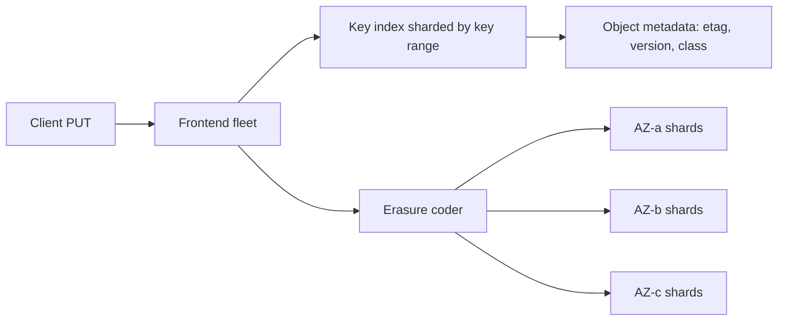
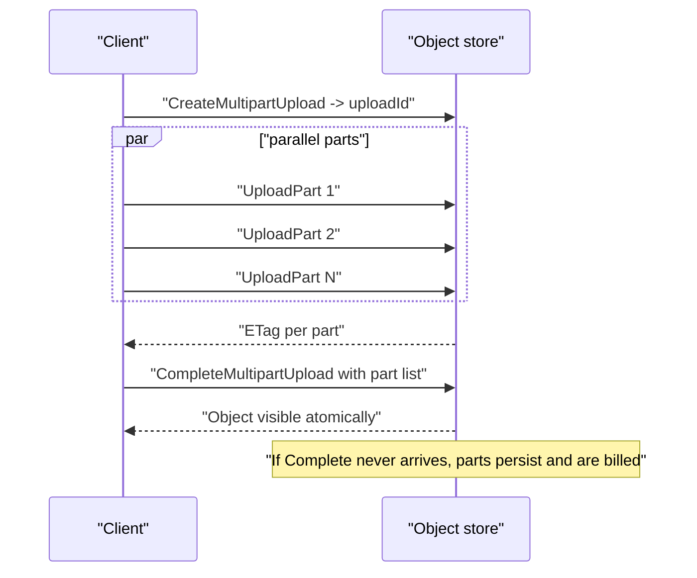
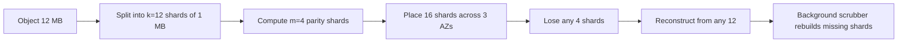
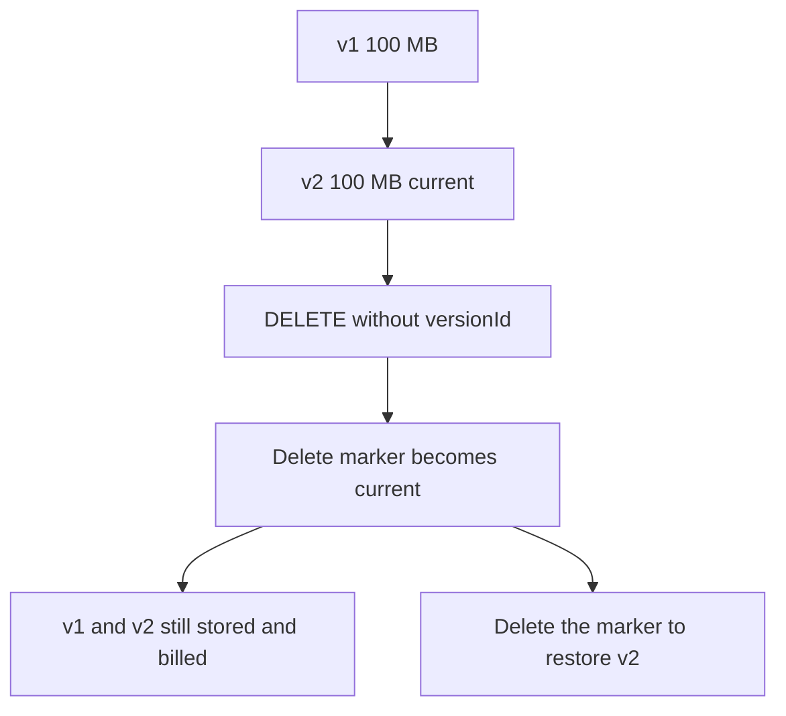
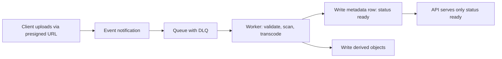

# F15 — Object & Blob Storage

**Object storage is not a filesystem: it is a flat, immutable-object key-value store with HTTP semantics, per-prefix throughput limits, and a cost model where the requests and the retrievals — not the bytes — usually decide the bill.**

## S3 Semantics and What They Are Not

| Property | Object storage | POSIX filesystem |
|---|---|---|
| Namespace | Flat key space; `/` is a display convention | True hierarchical directories |
| Rename / move | Copy then delete — O(size), not atomic | `rename()` is atomic metadata-only |
| Partial write | None; PUT replaces the whole object | `pwrite` at any offset |
| Append | Not supported (S3); multipart is a build-then-commit | Native |
| Directory listing | Paginated `ListObjectsV2` scan over sorted keys | `readdir` on a real directory |
| Locking | None; last writer wins | `flock`, `fcntl` |
| Consistency | Strong read-after-write per object since Dec 2020 | Strong |
| Latency | First byte 20-200 ms | Microseconds to milliseconds |
| Durability | 11 nines by design, erasure-coded across AZs | Whatever your RAID gives you |
| Cost | Cents per GB-month plus per-request | Provisioned volume, always paid |



### The Consistency History Matters

Before December 2020, S3 offered read-after-write consistency for new-object PUTs but **eventual** consistency for overwrites and deletes, and eventual consistency for LIST. Entire ecosystems were built to work around this — Hadoop's S3Guard, Netflix's s3mper, EMRFS consistent view, and the "commit protocol" designs in Hive and Spark that renamed directories to publish results.

Since then, S3 provides strong read-after-write and list-after-write consistency for all operations in all regions, at no extra cost and with no performance penalty.

!!! warning "Strong consistency did not make eventual-consistency workarounds free to keep"
    Legacy commit protocols that copy through temporary prefixes still cost you: every "rename" is a server-side copy billed per request and per byte, and directory-style commits create thousands of tiny objects. Modern table formats — Iceberg, Delta Lake, Hudi — replace the rename dance with an atomic metadata pointer swap. If a pipeline still uses `FileOutputCommitter` v1, it is paying for a problem that no longer exists.

!!! gotcha "Strong consistency is per object, not across objects"
    **Symptom:** a downstream job reads a manifest that references files it cannot find, or sees a partially published dataset.
    **Mechanism:** each object read is strongly consistent, but there is no transaction across a set of objects. Writing 500 data files and then a manifest is not atomic, and a reader can observe any intermediate state.
    **Mitigation:** publish through a single atomic pointer — one manifest object written last, or a table format with atomic metadata commits — and never treat "the files are all there" as an implicit contract.

## Key Naming and Partition Hotspotting

S3 partitions the key space by key **prefix**, splitting a partition when its request rate grows. The published limits — 3,500 PUT/COPY/POST/DELETE and 5,500 GET/HEAD requests per second **per partitioned prefix** — are per partition, not per bucket.

```text
BAD:  2026-04-18T09:00:01Z-event-a91.json      # all traffic in one lexical neighbourhood
BAD:  logs/2026/04/18/09/part-00001.json       # date prefix concentrates the hot hour
GOOD: a91f/2026-04-18/event-a91.json           # hash prefix spreads across partitions
GOOD: tenant=8817/dt=2026-04-18/part-0001.parquet  # high-cardinality leading component
```

$$
\text{prefixes needed} = \left\lceil \frac{\text{peak req/s}}{5500} \right\rceil
$$

At 60,000 GET/s you want at least 11 well-distributed prefixes; a 4-hex-character hash prefix gives 65,536, which is ample and costs nothing.

!!! gotcha "S3 auto-scales prefixes, but not instantly"
    **Symptom:** `503 SlowDown` errors at the start of a big batch job, which then disappear after several minutes.
    **Mechanism:** S3 splits partitions adaptively, but the split takes time. A cold prefix hit suddenly with 50,000 req/s throttles until the split completes.
    **Mitigation:** pre-shard the key space with a hash component, ramp traffic rather than starting flat out, and implement retry with exponential backoff and jitter — `SlowDown` is a normal, expected response, not an incident.

## Multipart Upload and the Cost Leak

Multipart upload splits a large object into parts uploaded independently and in parallel, then committed with a single `CompleteMultipartUpload`.



| Constraint | S3 value |
|---|---|
| Max object size | 5 TiB |
| Max single PUT | 5 GiB |
| Part size | 5 MiB to 5 GiB; last part may be smaller |
| Max parts | 10,000 |
| Recommended threshold | Use multipart above ~100 MiB |
| Visibility | Object appears only on successful `Complete` |

$$
\text{min part size} = \max\left(5\ \text{MiB},\ \left\lceil \frac{\text{object size}}{10{,}000} \right\rceil \right)
$$

A 5 TiB object therefore needs parts of at least ~537 MiB.

!!! gotcha "Incomplete multipart uploads bill forever and are invisible in a normal listing"
    **Symptom:** the bucket's billed storage is several times the sum of the objects you can see; nobody can account for the difference.
    **Mechanism:** parts uploaded but never completed or aborted remain stored and charged at the storage class rate. `ListObjectsV2` does not show them — only `ListMultipartUploads` does. A CI job that uploads large artifacts and crashes leaks parts on every failure, forever.
    **Mitigation:** add a lifecycle rule with `AbortIncompleteMultipartUpload` after 7 days to **every** bucket at creation time, and audit with `ListMultipartUploads` and the storage-lens metrics. This is the single most common invisible cost in object storage.

```json
{
  "Rules": [
    {
      "ID": "abort-incomplete-mpu",
      "Status": "Enabled",
      "Filter": {"Prefix": ""},
      "AbortIncompleteMultipartUpload": {"DaysAfterInitiation": 7}
    },
    {
      "ID": "expire-noncurrent-versions",
      "Status": "Enabled",
      "Filter": {"Prefix": ""},
      "NoncurrentVersionExpiration": {"NoncurrentDays": 30},
      "Expiration": {"ExpiredObjectDeleteMarker": true}
    }
  ]
}
```

## Presigned URLs

A presigned URL embeds a signature that grants a specific operation on a specific key for a limited time, letting clients upload and download directly without proxying bytes through your servers.

```python
# Upload: constrain what the client may do, not just for how long.
post = s3.generate_presigned_post(
    Bucket="uploads",
    Key=f"u/{user_id}/{uuid7()}",           # server chooses the key: never trust client keys
    Fields={"Content-Type": "image/jpeg", "x-amz-server-side-encryption": "AES256"},
    Conditions=[
        {"Content-Type": "image/jpeg"},
        ["content-length-range", 1, 10 * 1024 * 1024],   # hard size cap
        {"x-amz-server-side-encryption": "AES256"},
    ],
    ExpiresIn=300,
)
```

| Risk | Mechanism | Control |
|---|---|---|
| Unbounded upload size | No condition on length | `content-length-range` condition |
| Arbitrary key overwrite | Client supplies the key | Server generates the key; scope prefix to the principal |
| URL leaked or shared | Signature is a bearer token | Short expiry; one-time key; log and alert on unexpected reuse |
| Content-type spoofing | Client claims `image/jpeg`, uploads HTML | Validate server-side after upload; serve from a separate domain with `Content-Disposition: attachment` |
| Malware upload | No scanning | Quarantine prefix, scan, then move to the serving prefix |
| Signature outlives the session | Long `ExpiresIn` | Minutes, not days; presigned URLs cannot be revoked individually |

!!! danger "A presigned URL cannot be revoked"
    Until it expires, anyone holding the URL has exactly the permissions it encodes. Rotating the signing credential invalidates it, but that invalidates every other URL signed with the same credential too. Keep expiry short, and never embed presigned URLs in cacheable pages, emails, or logs.

## Storage Classes and Lifecycle

| Class (S3) | Storage $/GB-mo | Retrieval | Min duration | First-byte latency | Use for |
|---|---|---|---|---|---|
| Standard | ~0.023 | Free | None | ms | Hot, unpredictable access |
| Intelligent-Tiering | ~0.023 down to archive rates | Free between frequent/infrequent tiers | None | ms | Unknown or changing patterns |
| Standard-IA | ~0.0125 | ~0.01/GB | 30 days | ms | Backups accessed monthly |
| One Zone-IA | ~0.01 | ~0.01/GB | 30 days | ms | Reproducible data only — single AZ |
| Glacier Instant Retrieval | ~0.004 | ~0.03/GB | 90 days | ms | Archives needing instant access |
| Glacier Flexible Retrieval | ~0.0036 | ~0.01/GB + per request | 90 days | Minutes to 12 h | Compliance archives |
| Glacier Deep Archive | ~0.00099 | ~0.02/GB | 180 days | 12-48 h | Long-term legal retention |

Prices are illustrative us-east-1 figures for reasoning about ratios, not a quote.

!!! gotcha "Transitioning small objects to a colder class costs more than it saves"
    **Symptom:** a lifecycle rule moves 400 million small objects to Glacier and the bill goes up.
    **Mechanism:** three effects compound — a per-object transition request charge, a minimum billable object size (IA classes bill at 128 KB minimum), and per-object metadata overhead (~32-40 KB equivalent for Glacier classes). A 20 KB object billed at 128 KB in IA is more expensive than 20 KB in Standard.
    **Mitigation:** apply lifecycle transitions only above an object-size filter (`ObjectSizeGreaterThan`), and aggregate small objects before archiving.

!!! gotcha "Early deletion from IA or Glacier is billed for the full minimum duration"
    **Symptom:** deleting data to save money increases the bill.
    **Mechanism:** Standard-IA bills a 30-day minimum, Glacier classes 90 or 180 days. Deleting on day 3 still charges for the whole minimum period, per object.
    **Mitigation:** only transition data whose retention comfortably exceeds the minimum, and model the transition against the actual delete policy — not the intended one.

### Retrieval Cost Traps in Cold Tiers

$$
\text{cost}_{\text{restore}} = \underbrace{S \times p_{\text{retrieval}}}_{\text{per GB}} + \underbrace{n \times p_{\text{request}}}_{\text{per object}} + \underbrace{S \times p_{\text{egress}}}_{\text{if leaving the cloud}}
$$

!!! example "A restore that costs more than a year of storage"
    50 TB of Glacier Deep Archive costs about $50/month to store. A full bulk restore of 50 TB at ~$0.02/GB is about $1,000, plus per-object request charges — and if those 50 TB are 50 million small files, request charges can exceed the data charges. If the data then leaves the cloud, egress at ~$0.09/GB adds ~$4,500. The archive is cheap; reading it once costs 100x a month of storage.

    The operational consequence: **your DR plan must include the restore cost and the restore time**, and both must have been measured, not assumed. Glacier Deep Archive standard retrieval takes up to 12 hours before the first byte — if your RTO is 4 hours, this tier cannot hold your recovery data.

## Erasure Coding vs Replication

Replication stores $r$ full copies. Erasure coding splits an object into $k$ data shards and computes $m$ parity shards; any $k$ of the $n = k+m$ shards reconstruct the object.

$$
\text{overhead}_{\text{replication}} = r, \qquad
\text{overhead}_{\text{EC}} = \frac{k+m}{k}, \qquad
\text{tolerated failures}_{\text{EC}} = m
$$

| Scheme | Storage overhead | Failures tolerated | Repair cost per lost shard | Notes |
|---|---|---|---|---|
| 3x replication | 3.00x | 2 | 1 object read | Simple, fast reads, expensive |
| RS(6,3) | 1.50x | 3 | Read 6 shards | Common in HDFS EC |
| RS(10,4) | 1.40x | 4 | Read 10 shards | Facebook f4 style |
| RS(12,4) | 1.33x | 4 | Read 12 shards | Typical cloud object store |
| LRC(12,2,2) | 1.50x | 3+ | Local repair reads ~6 | Azure LRC trades space for repair bandwidth |

Durability with independent failures, annual failure probability $p$ per shard, $n$ shards, tolerating $m$ losses:

$$
P_{\text{loss}} = \sum_{i=m+1}^{n} \binom{n}{i} p^{i} (1-p)^{n-i}
$$

With $n = 16$, $m = 4$, and $p = 0.02$ per year, $P_{\text{loss}} \approx \binom{16}{5}(0.02)^5 \approx 1.4 \times 10^{-6}$ — before accounting for repair, which is what actually delivers eleven nines: the system detects and reconstructs missing shards continuously, so the window of vulnerability is hours, not a year.

!!! note "Durability is a repair-rate property, not a redundancy property"
    Eleven nines comes from correlated-failure isolation plus fast background repair, not from the coding parameters alone. A system with RS(12,4) and a week-long repair queue is far less durable than one with RS(6,3) that repairs in an hour. When designing your own store, the mean time to repair is the number to defend.



!!! gotcha "Erasure coding makes small objects worse, not better"
    **Symptom:** a store full of 4 KB objects consumes far more space than the arithmetic suggests.
    **Mechanism:** each shard has a minimum allocation and per-shard metadata. A 4 KB object split into 12 shards yields 341-byte shards, each with headers and checksums, plus 16 index entries. Overhead can exceed 100%.
    **Mitigation:** replicate small objects instead of coding them — most systems use a size threshold — and pack small objects into larger containers.

## The Small-Object Overhead Problem

| Effect | Mechanism | Impact |
|---|---|---|
| Per-request cost | GET priced per request | 1 billion 4 KB objects cost ~$400 per full read pass in requests alone |
| Per-object metadata | Index entry per object | Metadata store grows with object count, not bytes |
| Minimum billable size | 128 KB in IA classes | 8 KB object billed as 128 KB — 16x |
| Latency | Fixed ~20-100 ms per request | Throughput bounded by concurrency, not bandwidth |
| Listing cost | 1000 keys per LIST page | 1 billion objects = 1 million LIST requests |
| Analytics | Task-per-file overhead | Spark job spends more time opening files than reading them |

$$
\text{effective throughput} = \frac{\text{concurrency} \times \text{object size}}{\text{RTT} + \text{object size}/\text{bandwidth}}
$$

At 50 ms RTT with 4 KB objects, even 1000 concurrent requests yield only ~80 MB/s. The same concurrency with 64 MB objects saturates any network you have.

!!! tip "Compaction is the fix, and it must be a first-class job"
    Target 64-512 MB files for analytics workloads. Small files come from streaming writes with short commit intervals and from over-partitioning. Run a compaction job that merges them, and treat "average file size" and "file count per partition" as monitored SLIs of the data platform.

## Versioning and Delete Markers

With versioning enabled, a delete does not remove data: it writes a zero-byte **delete marker** as the new current version, and every previous version remains billable.



| Operation | Effect with versioning on |
|---|---|
| `DELETE key` | Adds a delete marker; nothing freed |
| `DELETE key?versionId=x` | Permanently removes that version |
| `GET key` after delete | 404, because the marker is current |
| `LIST` | Shows current versions only; markers hidden |
| Overwrite | Old version retained, still billed |
| Lifecycle `NoncurrentVersionExpiration` | The only scalable cleanup |

!!! gotcha "Versioning plus frequent overwrites is an unbounded storage leak"
    **Symptom:** a bucket holding "10 GB of state" is billed for 4 TB.
    **Mechanism:** a job overwrites the same key every minute. Each overwrite retains the previous version forever unless a lifecycle rule expires noncurrent versions. Standard listings show 10 GB; `ListObjectVersions` shows the truth.
    **Mitigation:** pair `Versioning: Enabled` with `NoncurrentVersionExpiration` in the same change. Also expire `ExpiredObjectDeleteMarker` so orphaned markers do not accumulate.

!!! warning "Object Lock in compliance mode cannot be undone by anyone"
    Compliance-mode retention cannot be shortened or removed, even by the account root, until it expires. A misconfigured retention of 10 years on a high-volume bucket is an unbudgeted, unavoidable, decade-long bill. Test Object Lock in a sandbox account with short retention first, and prefer governance mode unless a regulator requires otherwise.

## Request Rate Limits and Listing at Scale

`ListObjectsV2` returns up to 1000 keys per request and walks the key space in lexicographic order. It is a paginated scan, not an index query — there is no "list objects modified in the last hour" and no filter beyond prefix and delimiter.

| Need | Wrong tool | Right tool |
|---|---|---|
| Full inventory of a large bucket | Recursive LIST | S3 Inventory report — a daily/weekly manifest in Parquet/CSV |
| React to new objects | Poll with LIST | Event notification to SQS/SNS/Lambda or EventBridge |
| Find objects by attribute | LIST + HEAD each | Maintain your own index in a database at write time |
| Count and size by prefix | LIST everything | Storage Lens / inventory aggregation |
| Detect drift vs a database | LIST | Inventory joined against the database in a batch job |

$$
t_{\text{list}} \approx \frac{N}{1000} \times \text{RTT}_{\text{sequential}}
$$

100 million objects at 30 ms per page is roughly 100,000 sequential requests, about 50 minutes — and it cannot be parallelised without splitting by prefix, which requires knowing the prefixes in advance.

!!! gotcha "Object storage is the wrong place to keep your metadata index"
    **Symptom:** an application feature "list a user's files" degrades from 200 ms to 30 s as the bucket grows.
    **Mechanism:** the implementation calls LIST with a prefix. Cost is proportional to the number of keys under the prefix, forever, and there is no way to sort by anything but the key.
    **Mitigation:** write a row to a real database on every upload and query that. Object storage holds bytes; a database holds the index. This inversion is one of the most common architecture mistakes in file-storage designs.

## Egress and Data Transfer Cost

| Path | Typical charge | Note |
|---|---|---|
| Internet egress | ~$0.05-0.09/GB, tiered | Usually the largest line item at scale |
| Cross-region replication | Inter-region transfer + destination storage + requests | Doubles storage cost, plus transfer |
| Cross-AZ within a region | Charged in some services | Object store access from EC2 in-region is generally free via a gateway endpoint |
| Via NAT gateway | Per-GB processing charge on top | A silent, large cost — use a VPC gateway endpoint instead |
| Via CDN | CDN egress rate, often lower; origin fetch once | The standard fix for read-heavy public content |

!!! example "CDN in front of object storage pays for itself immediately"
    Serving 500 TB/month directly at ~$0.085/GB is roughly $42,500. With a CDN at ~$0.02-0.04/GB effective and a 95% hit ratio, origin egress drops to ~25 TB and CDN charges dominate at a fraction of the direct cost. The design consequence: **public read traffic should never hit the object store directly.**

!!! gotcha "Your object-store traffic is silently routed through a NAT gateway"
    **Symptom:** a large, unexplained NAT gateway data-processing charge that scales with an internal batch job.
    **Mechanism:** instances in a private subnet reach the object store over the public endpoint via NAT, paying a per-GB processing fee on traffic that would otherwise be free within the region.
    **Mitigation:** create a VPC gateway endpoint for the object store and verify the route tables. This is often the single largest one-line cost saving available in an AWS account.

## Read-After-Write Pipelines

Strong consistency simplifies pipelines but does not make them correct by itself.



| Pitfall | Why it happens | Fix |
|---|---|---|
| Metadata row written before the object exists | Client tells the API "done" before finishing the upload | Trust the storage event, not the client |
| Event delivered more than once | Notifications are at-least-once | Idempotent workers keyed by bucket+key+etag |
| Event never delivered | Notification delivery is best-effort in edge cases | Reconcile with an inventory report on a schedule |
| Overwrite races | Two uploads to the same key | Conditional writes with `If-None-Match`, or unique keys per version |
| Worker reads the object mid-upload | Multipart uploads are invisible until complete, so this is safe in S3 — but not on all stores | Verify the semantics of the specific store |

!!! tip "Immutable keys eliminate a whole class of races"
    Write each version to a new key containing a content hash or a ULID, and make the "current" pointer a database row. There is no overwrite race, caching is trivially correct with infinite TTLs, and rollback is a pointer update.

## Gotchas & Corner Cases

!!! gotcha "Incomplete multipart uploads bill forever and never appear in a listing"
    **Symptom:** billed storage far exceeds the sum of visible object sizes; no one can explain the gap.
    **Mechanism:** parts from uploads that were never completed or aborted are stored and charged, but `ListObjectsV2` does not report them — only `ListMultipartUploads` does. Every crashed upload leaks.
    **Mitigation:** an `AbortIncompleteMultipartUpload` lifecycle rule on every bucket, created with the bucket, plus a periodic audit.

!!! gotcha "Deleting versioned objects makes the bucket larger"
    **Symptom:** a cleanup job runs and storage cost is unchanged or rises.
    **Mechanism:** with versioning enabled, a plain DELETE writes a delete marker and retains all prior versions. The marker itself is another object.
    **Mitigation:** delete by `versionId`, or rely on `NoncurrentVersionExpiration` plus `ExpiredObjectDeleteMarker` lifecycle rules.

!!! gotcha "Sequential key prefixes throttle even though the bucket is far below any documented limit"
    **Symptom:** `503 SlowDown` under a batch job writing timestamp-prefixed keys.
    **Mechanism:** rate limits are per partitioned prefix. Monotonic keys concentrate all traffic in one partition that must split before it can absorb the load.
    **Mitigation:** put a high-cardinality hash component at the front of the key, ramp load, and retry with jittered backoff.

!!! gotcha "Lifecycle transition of many small objects increases the bill"
    **Symptom:** a cost-optimisation project makes costs worse.
    **Mechanism:** per-object transition requests, the 128 KB minimum billable size in IA classes, and per-object metadata overhead in archive classes all scale with object count, not bytes.
    **Mitigation:** filter transitions by `ObjectSizeGreaterThan`, and compact small objects before archiving.

!!! gotcha "Restoring from deep archive misses the RTO by an order of magnitude"
    **Symptom:** DR exercise discovers the recovery data will not be readable for 12 hours.
    **Mechanism:** archive tiers have retrieval *latency*, not just retrieval cost. Bulk retrieval of large datasets is also rate-limited.
    **Mitigation:** match storage class to RTO explicitly; keep the most recent recovery point in a class with millisecond access and archive only older points.

!!! gotcha "A public-read bucket policy leaks data that was never meant to be public"
    **Symptom:** an external researcher reports that internal documents are downloadable.
    **Mechanism:** a wildcard `Principal: "*"` policy, an ACL granting `AllUsers`, or a permissive prefix rule combined with predictable keys. Object-level ACLs and bucket policies interact in ways that are easy to misread.
    **Mitigation:** enable Block Public Access at the account level, disable ACLs (`BucketOwnerEnforced`), enforce policies via SCPs, and run automated checks in CI on any policy change. Never rely on key unguessability as an access control.

!!! gotcha "Cross-region replication does not replicate what already exists, or what you delete"
    **Symptom:** a DR bucket is missing most of the data, or retains objects deleted in the source.
    **Mechanism:** replication applies to objects written *after* it is enabled; existing objects need explicit batch replication. Delete markers are replicated only if configured, and version-id deletes are never replicated by design.
    **Mitigation:** run batch replication for the backlog, decide the delete-marker policy deliberately, and verify with inventory comparisons rather than assuming.

!!! gotcha "ETag is not a content hash for multipart objects"
    **Symptom:** an integrity check comparing local MD5 to the ETag fails for every large file.
    **Mechanism:** for multipart uploads the ETag is a hash of the concatenated part hashes with a `-N` part-count suffix, and it depends on the part size used. Server-side encryption with KMS also changes ETag semantics.
    **Mitigation:** use explicit checksum headers (`x-amz-checksum-sha256`) for integrity verification, and store the checksum in your own metadata.

!!! gotcha "Listing to find recent files makes the application slower as it succeeds"
    **Symptom:** feature latency grows linearly with the amount of data customers have stored.
    **Mechanism:** LIST cost is proportional to keys under the prefix and cannot be filtered by time or attribute.
    **Mitigation:** maintain the index in a database written on upload; use inventory reports for bulk reconciliation and events for incremental updates.

!!! gotcha "Requester-pays and cross-account access shift costs invisibly"
    **Symptom:** a partner's job generates a large, unexpected request bill on your account, or objects written by another account are unreadable by you.
    **Mechanism:** by default the bucket owner pays for requests; and an object written by another account without `bucket-owner-full-control` is owned by the writer, so the bucket owner cannot read it.
    **Mitigation:** enable `BucketOwnerEnforced` object ownership, use requester-pays for shared datasets, and set per-principal rate expectations in the data-sharing agreement.

!!! gotcha "Server-side encryption with a customer-managed key throttles at scale"
    **Symptom:** high-throughput jobs fail with KMS `ThrottlingException` even though the object store is healthy.
    **Mechanism:** SSE-KMS makes a KMS call per object operation, and KMS has per-account request quotas.
    **Mitigation:** enable S3 Bucket Keys to reduce KMS calls by orders of magnitude, or use SSE-S3 where the compliance requirement allows.

## SRE Lens

**SLIs and SLOs**

| SLI | Definition | Example SLO |
|---|---|---|
| Availability | Non-5xx, non-throttled request ratio | 99.9% monthly per bucket |
| First-byte latency | p99 TTFB for GET by size bucket | p99 < 200 ms for objects under 1 MB |
| Upload success | Completed multipart / initiated | > 99.5%; the gap is your leak rate |
| Durability | Verified via checksums and inventory | Zero unrecoverable objects; scrub coverage 100% per quarter |
| Pipeline freshness | Age of the newest processed object | p99 < 60 s from upload to `ready` |
| Restore time | Measured in DR drills | Within RTO, proven quarterly |

**Failure modes and detection**

| Failure | Signal | Response |
|---|---|---|
| Prefix throttling | 503 SlowDown rate | Backoff, spread keys, ramp load |
| Event loss | Reconciler drift count | Backfill from inventory; check DLQ |
| Leaked multipart parts | Storage-vs-inventory delta | Lifecycle abort rule; manual abort sweep |
| Version bloat | Versioned size vs current size | Add noncurrent expiration |
| Public exposure | Config drift alarms, access analyzer | Block Public Access, revoke, audit access logs |
| KMS throttling | KMS error rate | Enable bucket keys, request quota increase |
| Replication lag | Replication metrics, pending bytes | Investigate; RPO is at risk |

**Rollout and migration risk**

- Bucket policy and lifecycle changes are dangerous: an over-broad prefix in an expiration rule deletes production data with no undo unless versioning and Object Lock are in place. Review lifecycle diffs like schema migrations.
- Enabling versioning is easy; disabling it is not — it can only be suspended, and existing versions remain.
- Migrating between buckets or providers is bounded by object count more than by bytes; plan around request rate and use parallel prefix-partitioned copies.
- Changing key schemes requires dual-read logic during the transition, since old keys cannot be renamed cheaply.

**Capacity signals**

- Request rate per prefix, not per bucket.
- Object count growth rate — it drives listing cost, metadata cost, and job planning time.
- Average object size trending down is an early warning of the small-file problem.
- Multipart initiations vs completions — the delta is the leak.
- Noncurrent version bytes as a fraction of current bytes.

**On-call runbook notes**

1. `503 SlowDown` is a normal backpressure signal — verify the client retries with jitter before escalating.
2. Never run a broad delete to reclaim space during an incident; verify the lifecycle rule's prefix on a copy first.
3. For "data is missing", check delete markers and version history before assuming loss.
4. For cost spikes, check in order: incomplete multiparts, noncurrent versions, NAT-routed traffic, cross-region replication, and a runaway LIST loop.

**Cost**

The four dominant levers, in typical order of impact: eliminate internet egress with a CDN, route in-VPC traffic through a gateway endpoint, expire noncurrent versions and incomplete multiparts, and compact small objects before archiving. Storage class optimisation matters, but it is usually smaller than these — and it is the one most likely to backfire on small objects.

## Interview Angle

!!! interview "Probe: design an upload path for 100 MB user videos at 5000 uploads/minute."
    **Strong:** presigned multipart uploads directly to the object store so bytes never touch your servers; server-generated keys with a hash prefix; size and content-type conditions on the signature; storage event to a queue with a DLQ; idempotent workers keyed by bucket+key+etag; metadata row flipped to `ready` only after validation; lifecycle rule aborting incomplete multiparts. Then quantify: 5000/min × 100 MB is ~8.3 GB/s of ingest, so proxying it through application servers would need enormous bandwidth — that is the argument for presigned URLs.

    **Weak:** uploading through the API servers and storing files "on S3" with no mention of keys, events, or cleanup.

!!! interview "Probe: why is your storage bill 4x the data you can see?"
    **Strong:** enumerate the invisible consumers — incomplete multipart parts, noncurrent versions, delete markers, replication destinations, minimum billable sizes in IA, and archive metadata overhead — and say which console or API surfaces each. Then give the standing controls that prevent recurrence.

!!! interview "Probe: replication or erasure coding for your own object store?"
    **Strong:** derive the overhead — 3x versus 1.33x for RS(12,4) — then discuss what EC costs you: repair reads $k$ shards, small objects are inefficient, and reconstruction consumes network during exactly the degraded periods when you are already stressed. Conclude with the hybrid that real systems use: replicate small and hot objects, erasure-code large and cold ones, and defend the mean time to repair.

!!! interview "Follow-up: how do you serve 500 TB/month of public images cost-effectively?"
    **Strong:** CDN with a high hit ratio, long cache TTLs enabled by immutable content-hash keys, origin shielding to collapse origin fetches, and a VPC endpoint for internal access. Give the arithmetic showing direct egress is the dominant cost and the CDN is not optional.

!!! interview "Follow-up: the object store is your source of truth for a file-sharing product. List a user's files."
    **Strong:** never with LIST. A database row per object written from the storage event, indexed by owner and time, with the object store holding only bytes. Explain that LIST is a lexicographic scan with no secondary index, so the naive design degrades exactly as the product succeeds.

!!! interview "Trap: 'S3 is eventually consistent, so we need a consistency layer.'"
    **Strong:** correct the premise — S3 has been strongly read-after-write consistent for all operations since December 2020 — and then note what is still not guaranteed: atomicity across multiple objects, which is why table formats with atomic metadata commits exist.

## Key Takeaways

- Object storage is a flat key-value store over HTTP: no rename, no append, no partial write, no locking, and listing is a scan — design keys and an external index accordingly.
- Rate limits are per partitioned prefix, so key naming is a throughput decision; hash-prefix high-volume workloads and expect `503 SlowDown` during prefix splits.
- Incomplete multipart uploads and noncurrent versions are the two great invisible cost leaks; both are prevented by lifecycle rules applied at bucket creation.
- Cold tiers are cheap to store and expensive and slow to read — match the storage class to the RTO and to the actual restore volume, and never archive tiny objects.
- Erasure coding cuts overhead from 3x to ~1.33x but makes small objects inefficient and repair expensive; durability comes from fast repair, not from the code alone.
- Small objects break the cost model, the throughput model, and analytics job planning; compaction to 64-512 MB files is a first-class platform job.
- Strong read-after-write consistency is per object; multi-object publication still needs an atomic pointer or a table format.
- Egress dominates the bill for read-heavy public workloads — a CDN and a VPC gateway endpoint are cost architecture, not optimisations.

## Further Reading

- Sanjay Ghemawat, Howard Gobioff, Shun-Tak Leung, *The Google File System*, SOSP 2003.
- Doug Beaver et al., *Finding a Needle in Haystack: Facebook's Photo Storage*, OSDI 2010 — the canonical small-object packing design.
- Subramanian Muralidhar et al., *f4: Facebook's Warm BLOB Storage System*, OSDI 2014 — erasure coding for warm data.
- Cheng Huang et al., *Erasure Coding in Windows Azure Storage*, USENIX ATC 2012 — Local Reconstruction Codes.
- Brad Calder et al., *Windows Azure Storage: A Highly Available Cloud Storage Service with Strong Consistency*, SOSP 2011.
- Irving Reed and Gustave Solomon, *Polynomial Codes over Certain Finite Fields*, 1960.
- Sage Weil et al., *Ceph: A Scalable, High-Performance Distributed File System*, OSDI 2006, and the CRUSH placement paper.
- AWS documentation: S3 Best Practices Design Patterns for performance, S3 consistency model, multipart upload limits, lifecycle configuration, S3 Inventory, and Storage Lens.
- Apache Iceberg and Delta Lake specifications on atomic metadata commits over object stores.
- Werner Vogels' blog post on S3 strong consistency, and the AWS Builders' Library article on availability and durability engineering.

---

Related: [F13 Storage Engines](f13-storage-engines.md) for the durability primitives underneath, [F12 Message Queues & Streams](f12-queues-streams.md) for tiered storage and event-driven pipelines, and [F14 SQL vs NoSQL Selection](f14-sql-vs-nosql.md) for the metadata index that must accompany every object store.
