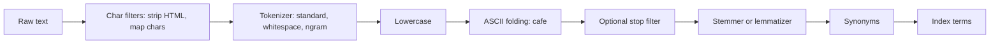
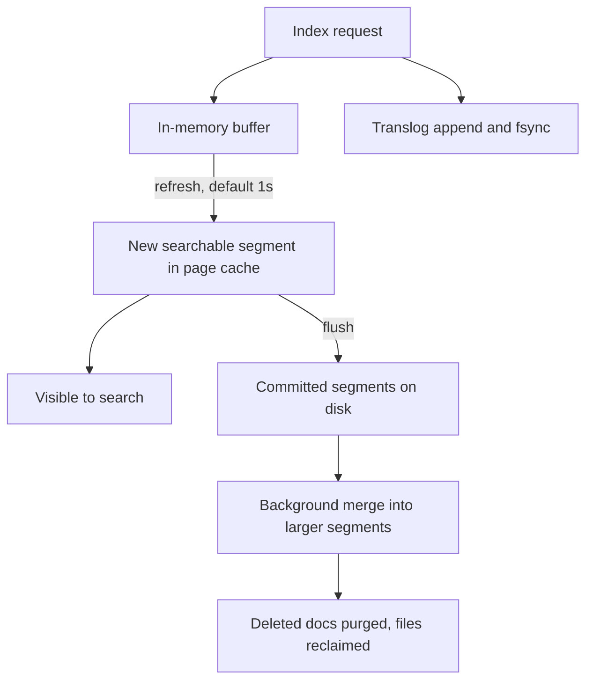
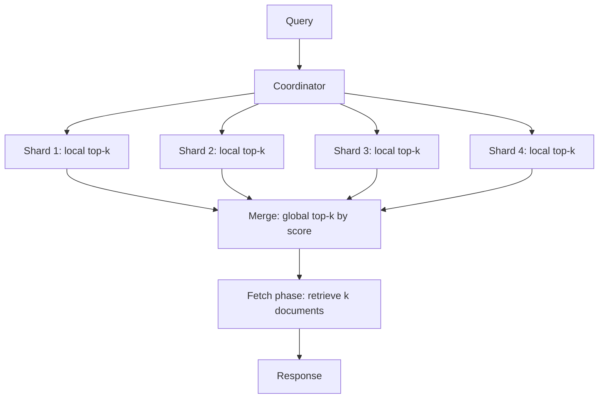
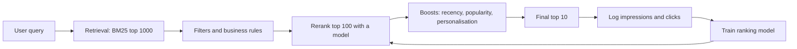
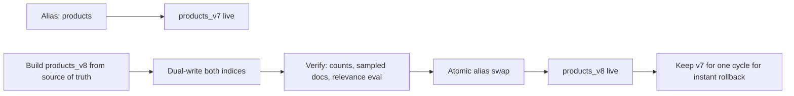

# F16 — Search & Indexing

**A search engine is an inverted index plus a scoring function plus a distributed merge — and almost every production problem comes from the merge: segment merges eating IO, shard merges skewing relevance, and deep pagination merging far more than anyone budgeted for.**

## The Inverted Index

A forward index maps document to terms; an inverted index maps term to the documents containing it. That inversion is what makes "find documents containing `distributed` and `consensus`" an intersection of two sorted lists instead of a scan of the corpus.

```text
Doc 1: "the raft consensus algorithm"
Doc 2: "paxos consensus made simple"
Doc 3: "raft is easier than paxos"

Term dictionary          Postings list (docId, tf, positions)
-----------------        ------------------------------------
algorithm        ->      [(1, 1, [3])]
consensus        ->      [(1, 1, [2]), (2, 1, [1])]
paxos            ->      [(2, 1, [0]), (3, 1, [4])]
raft             ->      [(1, 1, [1]), (3, 1, [0])]
```

Physical layout in a Lucene-style engine:

| Component | Contents | Purpose |
|---|---|---|
| Term dictionary | Sorted terms, FST-compressed | Term lookup, prefix and range queries |
| Term index | In-memory prefix automaton | Locate the on-disk dictionary block |
| Postings (`.doc`) | Doc IDs, delta-encoded | Boolean matching |
| Frequencies (`.doc`) | Term frequency per doc | Scoring |
| Positions (`.pos`) | Token offsets | Phrase and proximity queries |
| Norms | Per-field length factor | BM25 length normalisation |
| Doc values | Column-oriented per-doc values | Sorting, aggregations, faceting |
| Stored fields | Original field content | Returning results, highlighting |

!!! note "Doc values versus the inverted index"
    Filtering and matching use the inverted index; sorting, aggregating, and faceting use doc values, which are a columnar store alongside the index. This is why an aggregation on a high-cardinality field can blow up heap even when the query matches few documents — it is a columnar scan, not an index probe.

## Posting List Compression

Doc IDs within a postings list are monotonically increasing, so store deltas ("d-gaps") and encode them with a variable-length scheme.

$$
\text{postings} = [d_1, d_2, \ldots, d_n] \;\rightarrow\; [d_1, d_2-d_1, \ldots, d_n-d_{n-1}]
$$

| Encoding | Bits per doc ID (typical) | Decode speed | Used by |
|---|---|---|---|
| Raw 32-bit | 32 | Fastest | Nothing at scale |
| Variable byte (VByte) | 8-16 | Fast | Older Lucene, simple systems |
| Simple-9 / Simple-16 | 4-8 | Fast | Academic, some engines |
| PForDelta / FOR | 3-8 | Very fast, SIMD-friendly | Lucene block postings |
| Elias-Fano | Near information-theoretic | Fast with skip support | Research engines, quasi-succinct indexes |
| Roaring bitmaps | Adaptive: array, bitmap, or run | Extremely fast set ops | Filter caches, Druid, Lucene filters |

Dense lists favour bitmaps: a term appearing in 50% of 100M documents costs 100 Mbit = 12.5 MB as a bitmap versus far more as explicit IDs. Sparse lists favour delta encoding. Roaring switches per 64K-document chunk automatically, which is why it dominates modern filter caches.

**Skip lists** are the other half: to intersect `raft AND consensus`, the engine advances the shorter list and skips forward in the longer one. Without skip pointers, intersection is $O(n_1 + n_2)$; with them, it approaches $O(n_{\text{short}} \log n_{\text{long}})$.

!!! gotcha "A stop word you kept is a postings list the size of your corpus"
    **Symptom:** queries containing "the" or "a" are 100x slower and consume most of the IO budget.
    **Mechanism:** the postings list for a term appearing in nearly every document must be read and merged even though it contributes almost no discriminative power.
    **Mitigation:** modern engines do not remove stop words — they use BM25's IDF, which drives such terms to near-zero weight, plus block-max WAND to skip blocks that cannot enter the top-k. Ensure your engine has block-max scoring enabled rather than reintroducing stop-word lists, which break phrase queries like "to be or not to be".

## The Analysis Pipeline

Analysis is applied at index time and at query time, and **the two must match** or nothing will be found.



| Stage | Purpose | Failure mode |
|---|---|---|
| Char filtering | Remove markup, normalise punctuation | Stripping meaningful symbols like `C++` or `.NET` |
| Tokenization | Split into tokens | CJK and Thai have no spaces; standard tokenizer produces garbage |
| Lowercasing | Case-insensitive matching | Turkish dotless i breaks with a locale-unaware lowercase |
| Unicode normalisation | NFC/NFKC, ASCII folding | Different normalisation at index and query time means zero hits |
| Stemming | `running` → `run` | Over-stemming merges unrelated words: `university` and `universe` both → `univers` |
| Lemmatization | Dictionary-based root form | Slower, language-specific, but far more precise |
| Synonyms | Expand or contract equivalents | Multi-word synonyms interact badly with phrase queries and positions |
| N-grams | Substring and typo tolerance | Index size explodes; a 3-gram of a 20-char field yields 18 terms |

=== "Edge n-grams for autocomplete"

    ```json
    {
      "analyzer": {
        "autocomplete_index": {
          "tokenizer": "standard",
          "filter": ["lowercase", "edge_ngram_2_15"]
        },
        "autocomplete_query": {
          "tokenizer": "standard",
          "filter": ["lowercase"]
        }
      }
    }
    ```

    Index with edge n-grams, **query without them**. Using the n-gram analyzer at query time makes `elephant` match `e`, `el`, `ele` and destroys precision.

=== "Multi-field indexing"

    ```json
    {
      "title": {
        "type": "text",
        "analyzer": "english",
        "fields": {
          "raw":    {"type": "keyword"},
          "ngram":  {"type": "text", "analyzer": "autocomplete_index"},
          "phonetic": {"type": "text", "analyzer": "phonetic"}
        }
      }
    }
    ```

    One source field, several index-time representations, combined at query time with different weights. This is the standard way to balance recall and precision.

!!! gotcha "Changing an analyzer does not change already-indexed documents"
    **Symptom:** an analyzer fix improves nothing for old content and produces inconsistent behaviour across the corpus.
    **Mechanism:** analysis happens at index time. Existing terms were produced by the old pipeline and remain until the document is reindexed.
    **Mitigation:** analyzer changes require a full reindex into a new index followed by an alias swap. Treat the analyzer as part of the index schema version.

## Scoring: TF-IDF and BM25

Classic TF-IDF scores a document $d$ for query $q$ as:

$$
\text{score}(q,d) = \sum_{t \in q} \operatorname{tf}(t,d) \cdot \operatorname{idf}(t), \qquad \operatorname{idf}(t) = \log \frac{N}{n_t}
$$

Its two weaknesses are unbounded term frequency growth and no principled document-length handling. BM25 — Okapi BM25, the default in Lucene since 6.0 — fixes both:

$$
\text{score}(q,d) = \sum_{t \in q} \operatorname{IDF}(t) \cdot \frac{f(t,d) \cdot (k_1 + 1)}{f(t,d) + k_1 \cdot \left(1 - b + b \cdot \frac{|d|}{\text{avgdl}}\right)}
$$

$$
\operatorname{IDF}(t) = \ln\left(1 + \frac{N - n_t + 0.5}{n_t + 0.5}\right)
$$

| Symbol | Meaning | Effect |
|---|---|---|
| $f(t,d)$ | Term frequency in the document | Saturating, not linear |
| $\lvert d \rvert$ | Document length in terms | Longer documents penalised |
| $\text{avgdl}$ | Average document length in the index | Corpus-dependent normaliser |
| $k_1$ (default 1.2) | Term-frequency saturation point | Higher = frequency matters more |
| $b$ (default 0.75) | Length normalisation strength | $b=0$ disables it; $b=1$ full normalisation |
| $N$, $n_t$ | Corpus size, docs containing $t$ | Drive IDF |

The saturation property is the key improvement: as $f(t,d) \to \infty$, the term contribution approaches $\operatorname{IDF}(t) \cdot (k_1+1)$. A document mentioning "kafka" 200 times cannot outrank a genuinely relevant one merely by repetition — which is exactly the keyword-stuffing attack TF-IDF was vulnerable to.

!!! example "Tuning $b$ by field"
    For a `title` field, set $b \approx 0$: titles are uniformly short and length normalisation adds noise. For a `body` field, keep $b = 0.75$. For fields where longer genuinely means more relevant — say, detailed product descriptions — lower $b$ to 0.3. These are per-field similarity settings, not global ones.

## Near-Real-Time Indexing: Segments and Refresh

Lucene indexes are built from immutable **segments**. New documents accumulate in an in-memory buffer; a **refresh** turns the buffer into a searchable segment; a **flush** makes it durable via the translog and a commit point.



| Operation | Makes searchable | Makes durable | Cost |
|---|---|---|---|
| Index into buffer | No | No | Cheap |
| Translog write + fsync | No | Yes | fsync per request by default; the main write cost |
| Refresh | Yes | No | Creates a segment; more segments = slower search |
| Flush / commit | Yes | Yes | Heavier; triggered by translog size or interval |
| Merge | Consolidates | Yes | IO and CPU heavy, runs in background |
| Force merge | Consolidates fully | Yes | Very heavy; only for read-only indices |

The refresh interval is the direct freshness-versus-throughput dial:

| `refresh_interval` | Freshness | Segment creation rate | Best for |
|---|---|---|---|
| `1s` (default) | ~1 s | High | Interactive search |
| `30s` | 30 s | 30x lower | Logs, analytics |
| `-1` during bulk load | None | None | Bulk indexing, then set back and refresh once |

!!! tip "Bulk indexing recipe"
    Disable refresh (`refresh_interval: -1`), set `number_of_replicas: 0`, use bulk requests of 5-15 MB, and let the client control concurrency. Then restore replicas and refresh. This routinely gives a 5-10x speedup, because you stop paying refresh, merge, and replication costs on every batch.

!!! gotcha "`refresh=wait_for` on every write serialises your indexing pipeline"
    **Symptom:** indexing throughput collapses to roughly the refresh rate, and clients see multi-second write latency.
    **Mechanism:** each request waits for the next refresh cycle. With a 1 s interval, per-request latency floors at up to 1 s and concurrency piles up.
    **Mitigation:** use `refresh=wait_for` only where read-your-writes is genuinely required — typically a single admin path — and design the UI to render optimistically elsewhere.

## Segment Merging

Segments are immutable, so updates are "index the new version, mark the old one deleted". Deleted documents occupy space and are scanned until a merge removes them. Merging maintains a target number of segments by combining smaller ones into larger ones.

$$
\text{write amplification}_{\text{merge}} \approx \log_{M} \frac{S_{\text{index}}}{S_{\text{segment}}} \times \text{(bytes per doc)}
$$

with merge factor $M$ (Lucene's tiered policy uses roughly 10). Each document is rewritten once per merge tier it passes through.

| Symptom | Cause | Lever |
|---|---|---|
| Search latency spikes during indexing | Merges saturating disk and page cache | `index.merge.scheduler.max_thread_count` tuned for the disk type; throttle merge IO |
| Query latency grows with no data growth | Too many small segments from frequent refresh | Increase `refresh_interval`; check bulk sizing |
| Disk usage far above document size | High deleted-doc ratio | Let merges run; only force-merge read-only indices |
| Force merge crushes the cluster | Single-threaded rewrite of the whole index | Never force-merge a live write index; do it on rolled-over indices only |

!!! danger "Force merging a write-active index creates a permanent problem"
    Force-merging to one segment produces a very large segment that the tiered merge policy will never select for merging again, because it exceeds `max_merged_segment`. Deletes in that segment then accumulate indefinitely, and the only remedy is a full reindex. Force merge is a valid operation on immutable, rolled-over time-based indices — and nowhere else.

## Sharding: Document-Partitioned vs Term-Partitioned

| Property | Document-partitioned (local index) | Term-partitioned (global index) |
|---|---|---|
| Partition key | Document ID | Term |
| Index content per shard | Complete index of a subset of documents | Postings for a subset of terms, across all documents |
| Query flow | Broadcast to all shards, merge top-k | Contact only shards holding the query terms |
| Network per query | $S$ requests, small responses | Few requests, potentially huge postings transfers |
| Indexing a document | Writes to one shard | Writes to many shards, one per distinct term |
| Load balance | Even, by document count | Skewed: popular terms create hot shards |
| Failure impact | Lose a fraction of results | Lose all results containing that term |
| Scoring | Needs global IDF or approximation | IDF is naturally global |
| Used by | Elasticsearch, Solr, essentially all production engines | Rare; some research systems and specialised joins |

Document partitioning wins in practice because indexing is simple, load is even, and failures degrade gracefully. Its cost is the scatter-gather on every query and the IDF-skew problem below.



## Scatter-Gather and Tail Latency

A query is only as fast as its slowest shard. If per-shard latency is independent with $P(\text{latency} > t) = p$, then for $S$ shards:

$$
P(\text{query} > t) = 1 - (1-p)^{S}
$$

With $p = 0.01$ (a 1% chance a shard exceeds $t$) and $S = 50$ shards, 39% of queries exceed $t$. **The p99 of the shard becomes roughly the p60 of the query.** This is the single most important arithmetic in distributed search.

| Mitigation | Mechanism | Cost |
|---|---|---|
| Fewer, larger shards | Reduces $S$ in the formula | Less parallelism per query; slower recovery |
| Request-level hedging | Issue a duplicate to another replica after p95 | Extra load, must be capped |
| Adaptive replica selection | Route to the replica with the best recent latency | Requires per-node latency tracking |
| Shard-level timeouts + partial results | Return what arrived; flag partiality | Silently incomplete results if unflagged |
| Routing by a key | Query one shard when the filter allows it | Only works when queries carry the routing key |
| Query caching | Skip repeated shard work | Only helps repeated queries |

!!! gotcha "Over-sharding is the most common self-inflicted search performance problem"
    **Symptom:** a cluster with thousands of small shards has high query latency, high heap use, and slow cluster-state updates.
    **Mechanism:** every shard is a full Lucene index with fixed overhead — file handles, segment metadata, per-shard search threads — and every query fans out to all of them. Coordination cost dominates when shards are small.
    **Mitigation:** target 20-50 GB per shard for search workloads, use routing so queries hit one shard where possible, and use index lifecycle rollover for time-based data instead of one giant over-sharded index.

## Distributed Scoring and IDF Skew

BM25 needs $N$ (corpus size) and $n_t$ (document frequency). In a document-partitioned index each shard knows only its **local** values. Default behaviour scores with local statistics, so identical documents on different shards receive different scores.

!!! gotcha "Averaging or comparing scores across shards is comparing different scales"
    **Symptom:** relevance is inconsistent; the same document ranks differently depending on which shard it landed on; small indices produce nonsensical ordering.
    **Mechanism:** if a term appears in 1 of 100 documents on shard A and 900 of 1000 on shard B, its local IDF differs by orders of magnitude. Merging local top-k lists by raw score compares incompatible scales.
    **Mitigation:** with large shards and random document distribution, local statistics converge to global and skew is negligible. With small or non-randomly-routed shards (custom routing by tenant is the classic case), use a distributed-frequency search type — Elasticsearch's `dfs_query_then_fetch` — which gathers global term statistics in a preliminary round at the cost of one extra round trip.

| Situation | IDF skew risk | Action |
|---|---|---|
| Many large shards, hash-routed docs | Low | Default local statistics are fine |
| Custom routing by tenant | High: shards have very different corpora | `dfs_query_then_fetch`, or per-tenant indices |
| Few documents overall | High: statistics are noisy | Single shard |
| Testing relevance on a small dev index | Very high | Never tune relevance on a small non-representative index |

## Deep Pagination

To return results $[F, F+k)$ from $S$ shards, each shard must produce its top $F+k$ and the coordinator must merge $S \times (F+k)$ entries.

$$
\text{work}_{\text{coordinator}} = S \times (\text{from} + \text{size})
$$

At `from=10000, size=10` across 20 shards, the coordinator sorts 200,200 hits to return 10. Elasticsearch caps this with `index.max_result_window` (default 10,000) precisely because the cost is unbounded and heap-consuming.

| Approach | Mechanism | Deep paging | Jump to arbitrary page | Stable under writes |
|---|---|---|---|---|
| `from`/`size` | Re-sort every time | No, $O(S \cdot F)$ | Yes | No, results shift |
| `search_after` | Resume from the last sort key | Yes, $O(k)$ | No, sequential only | Consistent ordering |
| Point-in-time + `search_after` | Frozen index view plus cursor | Yes | No | Yes, fully stable |
| Scroll (deprecated) | Snapshot cursor | Yes | No | Yes, but holds segments open |
| Composite aggregation | Paged aggregation buckets | Yes | No | For aggregations only |

```json
{
  "size": 20,
  "sort": [{"_score": "desc"}, {"_id": "asc"}],
  "search_after": [8.213864, "doc-91827"],
  "pit": {"id": "46ToAwMDaWR5BXV1aWQy...", "keep_alive": "2m"}
}
```

!!! tip "A tie-breaker in the sort is mandatory"
    Sorting only by `_score` gives no deterministic order among equal scores, so `search_after` can skip or duplicate documents. Always append a unique tie-breaker such as `_id` or a document sequence number.

!!! gotcha "Product requirements that need page 500 are actually asking for a different feature"
    Users do not paginate to result 10,000; crawlers and scrapers do. Deep pagination requests are usually a signal to offer better filtering, faceting, or an export endpoint backed by a scan — not to raise `max_result_window`, which converts a bounded cost into an unbounded one.

## Relevance Tuning



| Technique | What it fixes | Risk |
|---|---|---|
| Field boosting (`title^3`) | Structural importance | Hand-tuned constants rot as the corpus changes |
| Function score by recency/popularity | Freshness, quality | Popularity feedback loops entrench existing winners |
| Phrase and proximity boosting | Multi-word intent | Cost of positions; slow for long queries |
| Synonyms | Vocabulary mismatch | Multi-word synonyms break phrase matching |
| Query understanding: spell correction, intent | Typos, ambiguous queries | Over-correction destroys precise queries |
| Learning to rank | Everything, statistically | Needs click logs, training infra, and guards against position bias |
| Hybrid lexical + vector | Semantic recall | Score fusion is not a simple sum |

Offline metrics: NDCG@k, MRR, precision/recall@k. Online metrics: click-through rate, time to first click, reformulation rate, zero-result rate, abandonment.

!!! warning "Never ship relevance changes without an interleaving or A/B test"
    Relevance changes that look obviously better on ten hand-picked queries routinely lose on real traffic. Team-draft interleaving is far more statistically efficient than an A/B test for ranking comparisons because it removes between-user variance. Also track **zero-result rate** and **query reformulation rate** — a change that improves the top result but increases zero-result queries is a net loss.

## Vector and Hybrid Retrieval

Dense retrieval embeds documents and queries into $\mathbb{R}^d$ and retrieves by nearest neighbour under cosine or inner product. Exact search is $O(Nd)$ per query, so production uses approximate nearest neighbour.

| Index | Structure | Build cost | Query cost | Memory | Recall knob | Notes |
|---|---|---|---|---|---|---|
| Flat / brute force | None | None | $O(Nd)$ | $4Nd$ bytes | Exact | Fine up to ~100k vectors |
| IVF | k-means clusters, probe `nprobe` lists | Training pass | $O(\frac{N}{n_{\text{list}}} \cdot n_{\text{probe}} \cdot d)$ | Vectors + centroids | `nprobe` | Cheap build, needs retraining as data drifts |
| IVF-PQ | IVF plus product quantization | Training | Much lower | 8-32x compression | `nprobe`, PQ bits | Big memory win, lossy distances |
| HNSW | Multi-layer navigable small-world graph | Expensive, $O(N \log N)$ | $O(\log N)$ effective | Vectors + ~$M \times 8$ bytes/node | `ef_search` | Best recall/latency; memory hungry |
| ScaNN | Anisotropic quantization | Training | Very low | Compressed | Reorder count | Strong on inner-product objectives |
| DiskANN | Graph on SSD | Expensive | SSD-bound | Small RAM footprint | Beam width | For datasets exceeding RAM |

HNSW memory, roughly:

$$
\text{bytes} \approx N \times \left(4d + M \times 8 \times 1.5\right)
$$

For $N = 10^7$, $d = 768$, $M = 16$: about $10^7 \times (3072 + 192) \approx 32.6$ GB. Quantizing to int8 cuts the vector term by 4x. This arithmetic is why "just add vector search" is a capacity decision, not a feature flag.

**Hybrid retrieval** combines lexical and dense results. Raw score addition fails because BM25 scores are unbounded and cosine similarities are in $[-1, 1]$. Reciprocal Rank Fusion sidesteps the scale problem entirely by using ranks:

$$
\text{RRF}(d) = \sum_{r \in R} \frac{1}{k + \operatorname{rank}_r(d)}, \qquad k \approx 60
$$

| Query type | Lexical BM25 | Dense vector | Winner |
|---|---|---|---|
| Exact product code `SKU-7741` | Excellent | Poor | Lexical |
| Rare proper noun | Excellent | Depends on training data | Lexical |
| "how do I stop my laptop overheating" | Moderate | Excellent | Dense |
| Multilingual query over English corpus | Poor | Good with a multilingual model | Dense |
| Long-tail typo | Poor without fuzzy | Moderate | Hybrid |
| Negation, "not red" | Poor | Poor | Neither; needs query understanding |

!!! gotcha "Filtered vector search silently loses recall"
    **Symptom:** a query with a restrictive filter returns far fewer than $k$ results, or poor ones, even though many matching documents exist.
    **Mechanism:** post-filtering retrieves the top $k$ by vector distance and then applies the filter, so a 1%-selective filter can eliminate nearly everything. Pre-filtering inside an HNSW graph, meanwhile, can disconnect the graph and make it unnavigable.
    **Mitigation:** use engines with filter-aware ANN traversal, over-retrieve by the inverse selectivity ($k / \text{selectivity}$), or partition the vector index by the high-selectivity filter dimension so the filter becomes index selection.

## Index Rebuild and Aliasing

Any change to analysis, field mapping, shard count, or vector configuration requires building a new index. The alias is what makes the swap atomic and reversible.



```json
{
  "actions": [
    {"remove": {"index": "products_v7", "alias": "products"}},
    {"add":    {"index": "products_v8", "alias": "products"}}
  ]
}
```

The checklist that separates a smooth rebuild from an incident:

1. Build with `refresh_interval: -1` and `number_of_replicas: 0`, then restore both.
2. Dual-write live updates to both indices during the backfill, or replay the change stream from a watermark.
3. Verify document counts, spot-check documents, and run an offline relevance evaluation against a golden query set.
4. Swap the alias atomically; never delete-then-create, which leaves a window with no index.
5. Keep the old index for at least one full cycle — rollback is another alias swap.
6. Separate read and write aliases so rollover and reindex do not fight.

!!! gotcha "Reindexing without dual-writes loses every update made during the backfill"
    **Symptom:** after a successful-looking swap, documents changed during the last few hours are stale in search.
    **Mechanism:** the reindex reads a snapshot of the source; concurrent updates land only in the old index.
    **Mitigation:** dual-write during the rebuild, or capture the change stream from a watermark taken before the backfill and replay it before the swap. Verify with a comparison of `updated_at` maxima.

## Gotchas & Corner Cases

!!! gotcha "Index-time and query-time analyzers diverge and everything returns zero hits"
    **Symptom:** a field that clearly contains the search term matches nothing; wildcards work but plain matches do not.
    **Mechanism:** the query is analysed differently from the indexed content — an edge-n-gram analyzer applied at query time, a missing ASCII folding, or a `keyword` field where a `text` field was intended.
    **Mitigation:** use the analyze API on both sides and compare token streams. Set `search_analyzer` explicitly whenever the index analyzer is asymmetric.

!!! gotcha "Averaging p99 latency across shards produces a number that is not a percentile of anything"
    **Symptom:** the dashboard shows a healthy p99 while users complain about slow search.
    **Mechanism:** query latency is the **maximum** across shards, not the average. Averaging per-shard p99s discards exactly the tail that determines user experience, and percentiles are not linearly composable.
    **Mitigation:** measure end-to-end latency at the coordinator, and aggregate percentiles from histograms — see [F21 Probabilistic Data Structures](f21-probabilistic-data-structures.md) for the correct mergeable-sketch approach.

!!! gotcha "Force merging a live index creates a segment that can never be merged again"
    **Symptom:** disk usage on one index grows without bound and the deleted-document ratio climbs past 40%.
    **Mechanism:** the merged segment exceeds `max_merged_segment`, so the tiered policy never selects it. Deletes inside it are never reclaimed.
    **Mitigation:** force merge only immutable, rolled-over indices. Recovery from the mistake is a full reindex.

!!! gotcha "The filter cache makes the first query after every refresh slow"
    **Symptom:** sawtooth latency with a period matching `refresh_interval`.
    **Mechanism:** caches such as the Lucene query cache are per-segment. A refresh creates a new segment, invalidating cached bitsets for it, so the next query rebuilds them.
    **Mitigation:** increase `refresh_interval` where freshness allows, and prefer filters with high reuse so caching amortises. Distinguish query context from filter context: only filter context is cacheable and skips scoring.

!!! gotcha "High-cardinality aggregations blow up heap without matching many documents"
    **Symptom:** a circuit breaker trips or a node OOMs on a query that returns few results.
    **Mechanism:** a `terms` aggregation on a field with millions of distinct values builds buckets per shard, and global ordinals for the field must be loaded — memory scales with cardinality, not with hits.
    **Mitigation:** cap `size`, use composite aggregations for pagination, use `execution_hint: map` for genuinely high cardinality, and consider a cardinality sketch instead of exact bucketing.

!!! gotcha "Mapping explosion from dynamic fields kills the cluster"
    **Symptom:** cluster state grows to hundreds of megabytes, master node CPU saturates, and every index operation slows down.
    **Mechanism:** dynamic mapping creates a new field for every distinct JSON key. Indexing documents with user-controlled keys — or worse, keys containing IDs — creates unbounded fields, all of which live in the cluster state replicated to every node.
    **Mitigation:** disable dynamic mapping or set it to `strict`, use the `flattened` field type for arbitrary key-value objects, and enforce `index.mapping.total_fields.limit`.

!!! gotcha "Shard count is immutable, so the wrong choice is permanent for that index"
    **Symptom:** a cluster cannot rebalance because one index holds enormous shards, or fans out to hundreds of tiny ones.
    **Mechanism:** routing is $\operatorname{hash}(\text{id}) \bmod \text{shards}$; changing the divisor invalidates every document's placement, so the count is fixed at creation.
    **Mitigation:** design for 20-50 GB shards, use time-based indices with rollover so each new index can pick a better count, and use the split and shrink APIs where the factor rules permit.

!!! gotcha "Custom routing gives fast queries and one unrecoverable hot shard"
    **Symptom:** one node runs hot; a single tenant's traffic degrades the whole cluster.
    **Mechanism:** routing by tenant sends all of a tenant's documents and queries to one shard. A whale tenant exceeds what one shard can hold or serve, and it cannot be split.
    **Mitigation:** use `routing_partition_size` so a tenant spreads over several shards, or give large tenants dedicated indices. Also remember that custom routing worsens IDF skew.

!!! gotcha "A search cluster used as a system of record loses data"
    **Symptom:** documents are missing after a node failure or a restore, with no way to recover them.
    **Mechanism:** search indices are derived data optimised for query speed; replica allocation, translog settings, and merge behaviour are not designed to be a durable primary store, and recovery paths assume the data can be rebuilt.
    **Mitigation:** always keep an authoritative source of truth and the ability to reindex from it. Snapshot restore is a convenience, not a substitute.

!!! gotcha "Highlighting and `_source` fetching dominate latency for large documents"
    **Symptom:** the query phase is 5 ms and the total is 400 ms.
    **Mechanism:** the fetch phase retrieves stored `_source` for every returned document and, for highlighting, may re-analyse the whole field. Large documents make this expensive, and it scales with page size.
    **Mitigation:** use `_source` filtering to return only needed fields, store term vectors or use the unified highlighter with offsets, and cap page size.

!!! gotcha "Vector index build time makes the reindex window unacceptable"
    **Symptom:** an HNSW index that took 20 minutes on the dev subset takes 14 hours on production data.
    **Mechanism:** HNSW build cost is superlinear in practice and heavily dependent on `ef_construction` and $M$; it is also CPU-bound and competes with serving.
    **Mitigation:** benchmark build time at full scale before committing, build on dedicated nodes, and consider IVF variants when rebuild frequency matters more than peak recall.

## SRE Lens

**SLIs and SLOs**

| SLI | Definition | Example SLO |
|---|---|---|
| Query latency | p50/p95/p99 measured at the coordinator, per query class | p99 < 300 ms for interactive search |
| Search availability | Non-5xx, non-partial responses | 99.95% monthly |
| Result completeness | Fraction of queries with all shards successful | > 99.9%; partial results must be counted, not hidden |
| Index freshness | Time from source commit to searchable | p99 < 30 s |
| Zero-result rate | Queries returning nothing | < 5%, tracked as a relevance SLI |
| Relevance | NDCG@10 on a golden set, CTR@1 online | No regression per release |

**Failure modes and detection**

| Failure | Signal | Response |
|---|---|---|
| Merge storm | Merge thread count, disk IO, segment count | Throttle merge IO; reduce refresh frequency; check bulk sizing |
| Partial results | `_shards.failed` > 0 | Do not silently return them; alert and surface partiality |
| Circuit breaker trip | Breaker exception rate | Find the expensive aggregation; cap `size` and page size |
| Heap pressure / long GC | Old-gen occupancy, GC pause time | Reduce field data and aggregation cardinality; scale out |
| Hot shard | Per-shard request and CPU skew | Add routing partitions; split the tenant out |
| Indexing backlog | Bulk queue depth, rejected executions | Backpressure the producer; do not raise queue size, which just hides it |
| Split brain / unassigned shards | Cluster health yellow/red, unassigned count | Check allocation explanation before restarting anything |

**Rollout and migration risk**

- Mapping and analyzer changes require a full reindex behind an alias, with dual-writes and a rollback index retained.
- Relevance changes need an offline golden-set evaluation *and* an online interleaving test; a "small boost tweak" can move revenue.
- Version upgrades of Lucene-based engines can change scoring defaults and index format; validate relevance before and after, since a silent BM25 parameter change alters every ranking.
- Never delete the old index on the day of the swap.

**Capacity signals**

- Shard size distribution and count per node — the two most predictive numbers in a search cluster.
- Heap usage relative to 30-50% of RAM, leaving the rest for the page cache that segments depend on.
- Segment count per shard and deleted-document ratio.
- Query rate by class: cheap term queries and expensive aggregations must be modelled separately.
- For vector search: RAM per vector index, and build throughput in vectors per second.

**On-call runbook notes**

1. Before restarting a node, disable shard allocation so the cluster does not begin a full rebalance.
2. Red cluster status: get the allocation explanation first; the cause is usually disk watermarks or a missing node, not corruption.
3. Disk watermarks silently make indices read-only. Check them first when writes start failing.
4. Never resolve an indexing backlog by increasing thread-pool queue size; that converts rejections into unbounded latency.
5. Keep a tested "reindex from source of truth" runbook; it is the ultimate recovery path and must have a known duration.

**Cost**

Search clusters are memory-priced: heap for coordination plus page cache for segments. The dominant levers are shrinking the index (disable `_source` where possible, avoid indexing fields you never query, use `keyword` instead of `text` where only exact match is needed), tiering old time-based indices to cheaper nodes, and forcing analytics queries onto a columnar store instead of the search cluster. Vector indices change the cost model entirely — plan RAM from the sizing formula before promising the feature.

## Interview Angle

!!! interview "Probe: how does search work internally?"
    **Strong:** inverted index with compressed postings and skip lists, analysis pipeline symmetric at index and query time, BM25 scoring with saturating term frequency and length normalisation, immutable segments with periodic refresh and background merges, document-partitioned shards with scatter-gather and a two-phase query-then-fetch. Every one of those is a place to discuss trade-offs.

    **Weak:** "Elasticsearch handles it."

!!! interview "Probe: why does search p99 degrade as you add shards?"
    **Strong:** state $P(\text{query} > t) = 1 - (1-p)^S$ and work the numbers: a shard p99 of 1% across 50 shards means ~39% of queries hit the slow path. Then give the mitigations — fewer larger shards, hedged requests, adaptive replica selection, routing to a single shard — and the trade-off each carries.

!!! interview "Probe: implement autocomplete for 50M products at 20k QPS."
    **Strong:** compare edge n-grams (index-time cost, exact prefix, large index), completion suggester on an FST (very fast, in memory, weak on mid-word matching, rebuild required for updates), and a dedicated trie service. Choose based on latency target and update rate, cover typo tolerance and personalisation, and size memory explicitly. Mention that query-time analysis must not use the n-gram analyzer.

!!! interview "Follow-up: BM25 or vector search?"
    **Strong:** both, fused. Lexical wins on exact identifiers, rare tokens, and precise queries; dense wins on paraphrase and semantic intent. Combine with reciprocal rank fusion rather than adding incompatible score scales, and note that vector search adds a large RAM cost and a rebuild pipeline.

!!! interview "Follow-up: users need to reach page 1000 of results."
    **Strong:** explain that coordinator work is $S \times (\text{from} + \text{size})$ and is unbounded, then offer `search_after` with a point-in-time and a tie-breaker for sequential paging, and an export endpoint for bulk needs. Push back on the requirement: deep paging demand is usually a filtering or export problem in disguise.

!!! interview "Trap: 'store everything in Elasticsearch, it is faster than Postgres.'"
    **Strong:** it is a derived index, not a system of record. It has no transactions, no referential integrity, near-real-time rather than immediate visibility, and a recovery story that assumes reindexing from a source. Keep the source of truth relational and feed the index from a change stream.

## Key Takeaways

- The inverted index makes retrieval an intersection of compressed sorted postings; skip lists and block-max scoring are what make it fast at scale.
- Index-time and query-time analysis must agree, and changing an analyzer requires a full reindex behind an alias.
- BM25 improves on TF-IDF with saturating term frequency and length normalisation; $k_1$ and $b$ are per-field tuning knobs, not global constants.
- Near-real-time search is a refresh interval, and that interval is a direct trade between freshness and indexing throughput.
- Document-partitioned sharding wins in practice, at the price of scatter-gather tail latency and local-IDF skew.
- Query latency is the maximum across shards, so per-shard tails compound — and averaging percentiles across shards produces a meaningless number.
- Deep pagination costs $S \times (\text{from} + \text{size})$ at the coordinator; use cursor-based `search_after` with a point-in-time and a tie-breaker.
- Hybrid lexical plus vector retrieval fused by rank, not by raw score, gives the best coverage — but vector indices are a RAM and rebuild-time capacity decision.

## Further Reading

- Christopher Manning, Prabhakar Raghavan, Hinrich Schütze, *Introduction to Information Retrieval* — the standard text; chapters on index construction, compression, and scoring.
- Stephen Robertson and Hugo Zaragoza, *The Probabilistic Relevance Framework: BM25 and Beyond*, 2009.
- Sergey Brin and Lawrence Page, *The Anatomy of a Large-Scale Hypertextual Web Search Engine*, 1998.
- Jeffrey Dean, *Challenges in Building Large-Scale Information Retrieval Systems*, WSDM 2009 keynote — the origin of much distributed-search practice.
- Jeffrey Dean and Luiz André Barroso, *The Tail at Scale*, CACM 2013 — the definitive treatment of scatter-gather tail latency.
- Yury Malkov and Dmitry Yashunin, *Efficient and Robust Approximate Nearest Neighbor Search Using Hierarchical Navigable Small World Graphs*, TPAMI 2018.
- Hervé Jégou, Matthijs Douze, Cordelia Schmid, *Product Quantization for Nearest Neighbor Search*, TPAMI 2011, and the FAISS library documentation.
- Ruiqi Guo et al., *Accelerating Large-Scale Inference with Anisotropic Vector Quantization*, ICML 2020 — ScaNN.
- Gordon Cormack, Charles Clarke, Stefan Büttcher, *Reciprocal Rank Fusion Outperforms Condorcet and Individual Rank Learning Methods*, SIGIR 2009.
- Filip Radlinski and Nick Craswell, *Optimized Interleaving for Online Retrieval Evaluation*, WSDM 2013.
- Apache Lucene documentation on the tiered merge policy, and the Elasticsearch reference on shard sizing, `search_after`, and distributed search execution.

---

Related: [F13 Storage Engines](f13-storage-engines.md) for segment and merge mechanics, [F14 SQL vs NoSQL Selection](f14-sql-vs-nosql.md) for keeping a real system of record, and [F21 Probabilistic Data Structures](f21-probabilistic-data-structures.md) for mergeable percentile and cardinality sketches.
