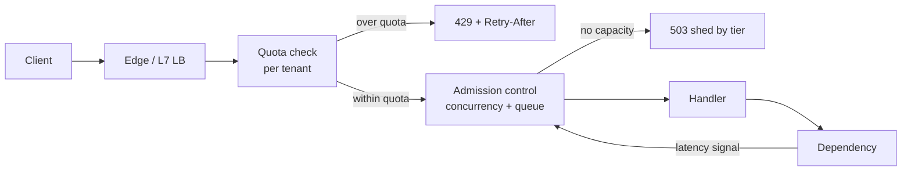
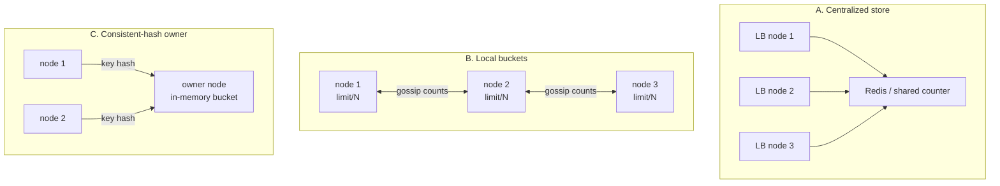
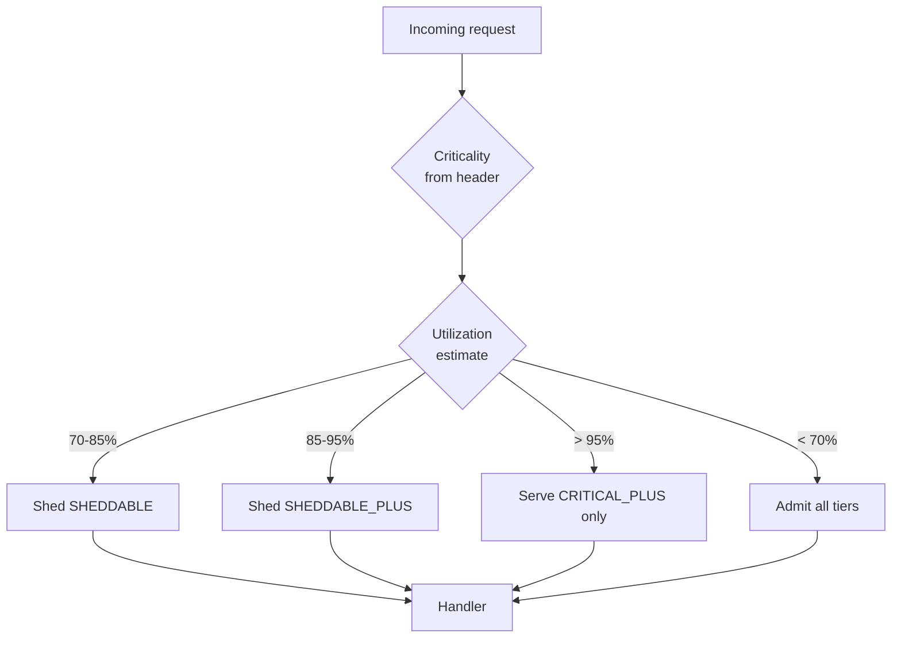
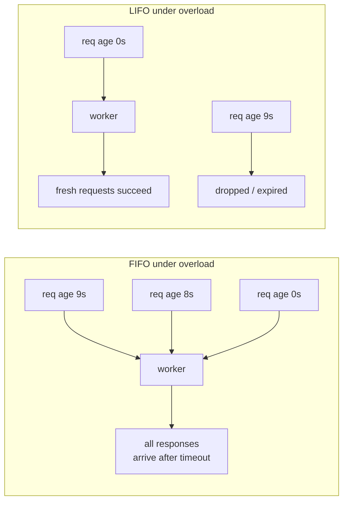

# F17 — Rate Limiting & Load Shedding

**Rate limiting protects you from a client; load shedding protects you from yourself — the first is a policy control on a known quota, the second is a control-theory problem where the setpoint moves every time your dependency, your JIT, or your neighbour's noisy pod changes.**

## Two different problems that share a code path

| Dimension | Rate limiting | Load shedding |
|---|---|---|
| Question answered | "Is this caller within their agreed quota?" | "Do I have capacity to serve this request *right now*?" |
| Limit source | Contract, plan tier, abuse policy | Measured system state (latency, queue depth, concurrency) |
| Limit stability | Static for weeks/months | Recomputed every few RTTs |
| Correct behaviour when unsure | Allow (usually) | Reject (usually) |
| Failure if absent | One tenant starves the rest | Whole service collapses under its own queue |
| Typical response | `429 Too Many Requests` | `503 Service Unavailable` + `Retry-After` |
| Fairness dimension | Per principal (user/tenant/key) | Per criticality tier |
| Observability signal | `ratelimit_rejected_total` by key | `shed_total` by tier, queue latency |

They belong on the same request path but must be *separately tunable*. Conflating them is a classic design smell: you end up raising a tenant's quota to solve a capacity problem, or shedding a paying customer because a background job filled the queue.



---

## The algorithm family

### Token bucket

A bucket holds up to $B$ tokens and refills at $r$ tokens/second. A request costs one token (or $n$ tokens for weighted cost). Bursts up to $B$ are allowed; sustained rate is capped at $r$.

```python
import time

class TokenBucket:
    __slots__ = ("rate", "burst", "tokens", "ts")

    def __init__(self, rate: float, burst: float) -> None:
        self.rate, self.burst = rate, burst
        self.tokens, self.ts = burst, time.monotonic()

    def allow(self, cost: float = 1.0) -> bool:
        now = time.monotonic()
        # Lazy refill: no timer, no background thread, O(1) per request.
        self.tokens = min(self.burst, self.tokens + (now - self.ts) * self.rate)
        self.ts = now
        if self.tokens >= cost:
            self.tokens -= cost
            return True
        return False
```

The lazy-refill trick matters at scale: a naive implementation with a refill goroutine/thread per key is O(keys) background work; this is O(1) per request and stores two numbers.

### GCRA — token bucket in one timestamp

The Generic Cell Rate Algorithm stores a single "theoretical arrival time" (TAT) instead of a token count. Emission interval $T = 1/r$, burst tolerance $\tau = (B-1)T$.

$$
\text{allow} \iff t_{now} \ge \mathrm{TAT} - \tau,\qquad \mathrm{TAT}' = \max(t_{now}, \mathrm{TAT}) + T
$$

One 8-byte value per key, no clamping bugs, exactly equivalent to a token bucket. This is what `redis-cell` and Envoy's local rate limiter effectively implement.

### Leaky bucket

Requests enter a FIFO queue drained at fixed rate $r$. Output is perfectly smooth — no bursts ever reach the backend. The cost is added latency for anything that queues, and a queue that itself can become the failure.

!!! warning "Leaky bucket is a shaper, not a limiter"
    Token bucket *rejects* excess immediately. Leaky bucket *delays* it. If your callers have a 2s client timeout and your leaky bucket queues them for 5s, you have converted a clean 429 into a timeout plus a retry plus wasted backend work. Only shape traffic you own end-to-end (e.g. your own outbound calls to a third-party API with a contractual QPS cap).

### Fixed window counter

Increment a counter keyed by `(principal, floor(now/W))`. Cheap and trivially correct to reason about — and wrong at the boundary.

!!! danger "The 2x boundary burst"
    With a 100 req/min fixed window, a client can send 100 requests at 12:00:59 and 100 more at 12:01:00 — 200 requests in a 1-second span, twice the intended rate, with zero violations recorded. Any limit that protects a downstream from *instantaneous* load must not be a fixed window.

### Sliding window log

Store a sorted set of request timestamps per key; evict entries older than $W$; count what remains. Exact. Memory is $O(\text{limit})$ per key and write amplification is one sorted-set insert plus one range-delete per request.

```text
ZREMRANGEBYSCORE key -inf (now-W)
ZADD key now <uuid>
ZCARD key            -> compare with limit
EXPIRE key W
```

### Sliding window counter

Interpolate between the previous and current fixed window:

$$
\hat{c} = c_{\text{cur}} + c_{\text{prev}} \cdot \frac{W - t_{\text{elapsed in cur}}}{W}
$$

Assumes uniform arrival inside the previous window. Cloudflare published measurements showing sub-1% error on real traffic at ~0.003% of the memory of a log. That trade is almost always correct.

### Comparison

| Algorithm | State per key | Burst allowed | Boundary-exact | Cost/request | Smooths output | Typical use |
|---|---|---|---|---|---|---|
| Fixed window | 1 counter (~16 B) | Up to 2x at boundary | No | 1 INCR | No | Coarse abuse limits, analytics quotas |
| Sliding window log | $O(L)$ timestamps (16 B x limit) | Exact | Yes | ZADD + ZREMRANGEBYSCORE + ZCARD | No | Low-limit, high-value APIs (auth, payments) |
| Sliding window counter | 2 counters (~32 B) | Bounded, ~small error | Approx (<1% typical) | 1–2 INCR + read | No | Default choice for API quotas |
| Token bucket | tokens + ts (~24 B) | Yes, up to $B$ | Yes | 1 CAS / Lua | No | Default choice for burst-tolerant APIs |
| GCRA | 1 timestamp (~16 B) | Yes, via $\tau$ | Yes | 1 Lua eval | No | Memory-tight edge limiters |
| Leaky bucket (queue) | queue of pending reqs | No | Yes | enqueue + timer | Yes | Egress shaping to a hard external cap |

### Memory cost math

For $K$ active keys with per-key state $s$ bytes and container overhead $o$:

$$
M = K \cdot (s + o + |k|)
$$

Redis overhead is not negligible: a hash/string key costs roughly 50–100 B of allocator plus expiry-set bookkeeping beyond the payload. Concretely, at $K = 10^7$ active API keys:

| Scheme | $s$ | Raw | With ~80 B overhead + 40 B key name |
|---|---|---|---|
| GCRA / token bucket | 16–24 B | 160–240 MB | ~1.4 GB |
| Sliding window counter | 32 B | 320 MB | ~1.5 GB |
| Sliding window log, limit 1000/min | ~16 KB | 160 GB | infeasible |

!!! tip "Estimate active keys, not total keys"
    You do not need state for every registered tenant — only for tenants seen within the window. Set TTL to slightly more than the window and let Redis reclaim. But size for the *peak concurrent active* key count, including the attack case where an adversary mints millions of distinct keys (see the cardinality gotcha below).

---

## Distributed rate limiting

A single process is easy. $N$ replicas enforcing one global limit is a distributed counting problem, and you must choose where on the accuracy/latency curve you sit.



=== "Centralized (Redis / dedicated quota service)"

    One authoritative counter. Accuracy is exact (with a Lua script for atomicity), and policy changes take effect immediately.

    - Adds one network RTT to every request — 0.3–1 ms same-AZ, 1–3 ms cross-AZ, and cross-region is disqualifying.
    - The store becomes a hard dependency of every request. It needs its own capacity plan, its own SLO, and a defined behaviour when it is down.
    - Hot keys: one very large tenant maps to one Redis slot. Mitigate by sharding the key into $m$ sub-buckets each with $\text{limit}/m$, or by moving big tenants to dedicated shards.

    ```lua
    -- KEYS[1]=bucket  ARGV[1]=rate  ARGV[2]=burst  ARGV[3]=now_ms  ARGV[4]=cost
    local st = redis.call('HMGET', KEYS[1], 'tokens', 'ts')
    local tokens = tonumber(st[1]) or tonumber(ARGV[2])
    local ts     = tonumber(st[2]) or tonumber(ARGV[3])
    local delta  = math.max(0, tonumber(ARGV[3]) - ts) / 1000.0
    tokens = math.min(tonumber(ARGV[2]), tokens + delta * tonumber(ARGV[1]))
    local ok = 0
    if tokens >= tonumber(ARGV[4]) then
      tokens = tokens - tonumber(ARGV[4]); ok = 1
    end
    redis.call('HMSET', KEYS[1], 'tokens', tokens, 'ts', ARGV[3])
    redis.call('PEXPIRE', KEYS[1], 2 * math.ceil(tonumber(ARGV[2]) / tonumber(ARGV[1])) * 1000)
    return {ok, math.floor(tokens)}
    ```

=== "Local buckets + async reconciliation"

    Each node enforces $\text{limit}/N$ locally and periodically gossips its consumption so peers can borrow unused allowance.

    - Zero added request latency; survives the coordination layer being down.
    - Error bound with skewed traffic: if a tenant's requests land on $k$ of $N$ nodes, the effective enforced limit is $\frac{k}{N}\cdot\text{limit}$ — under-enforcement never happens, but severe **over**-enforcement does. With random LB and low per-tenant QPS, small-limit tenants get throttled far below their quota.
    - Convergence lag $\Delta$ means worst-case overshoot is bounded by $N \cdot r \cdot \Delta$ extra admits after a burst starts.
    - Rebalancing on scale-out is the trap: autoscaling from 20 to 40 nodes silently halves every node's share while total capacity doubled. The divisor must come from a live membership count, not config.

=== "Consistent-hash owner"

    Route each limit key to one owning node (via the L7 proxy's hash-on-header, or an internal forward hop) and keep the bucket in that node's memory.

    - Exactness of centralized, with no external store and typically sub-100 µs when the owner is local.
    - Membership change = state loss for the moved keys. With a bounded window this self-heals in $\le W$, but during a rolling deploy every key moves at least once. Use bounded-load consistent hashing so one hot tenant does not pin a node.
    - Adds a forward hop for the (N-1)/N of requests that land on a non-owner unless the edge can hash directly.

| Approach | Added p99 latency | Accuracy | Blast radius if broken | Ops cost |
|---|---|---|---|---|
| Centralized Redis, sync | +0.5–3 ms | Exact | Every request | High (HA store) |
| Centralized, async write-behind | ~0 | Overshoots by $r \cdot \Delta$ | Low | Medium |
| Local buckets, static divisor | 0 | Over-throttles skewed tenants | None | Low |
| Local + gossip | 0 | ~5–15% error | None | Medium |
| Consistent-hash owner | +0.1–0.5 ms | Exact between rebalances | Keys on failed node | Medium |

!!! example "The pragmatic hybrid used at most large shops"
    Enforce a generous *local* limit in the proxy (cheap, always-on, catches pathological single-source floods) and a precise *global* limit in a quota service consulted asynchronously with a short-lived local lease. The local limiter is the thing that keeps you alive; the global one is the thing that keeps the contract honest.

---

## Response semantics

Getting the response wrong turns a working limiter into an outage amplifier, because clients react to what you send.

| Header / status | Meaning | Notes |
|---|---|---|
| `429 Too Many Requests` | Caller exceeded *their* quota | Retryable after the indicated delay. Do not use for capacity problems. |
| `503 Service Unavailable` | Server has no capacity | Use for shedding. Signals "not your fault" and is safe for LBs to failover on. |
| `Retry-After: 30` or HTTP-date | When to retry | Must be honoured; clients that ignore it are the herd. |
| `RateLimit-Limit` / `RateLimit-Remaining` / `RateLimit-Reset` | IETF draft `ratelimit-headers` naming | Prefer over the legacy `X-` forms for new APIs; publish both during migration. |
| `X-RateLimit-Limit` / `-Remaining` / `-Reset` | De facto standard (GitHub, Twitter-era) | `-Reset` semantics vary: epoch seconds vs delta seconds. Document it. |
| `Connection: close` | Force the caller off | Last-resort for abusive keep-alive clients. |

!!! gotcha "Retry-After with a constant value is a synchronised-retry generator"
    Symptom: throttling clears, then the service is hit by a spike larger than the original one, exactly `Retry-After` seconds later. Mechanism: every throttled client received the identical delay and retries in the same millisecond. Mitigation: jitter server-side — emit `Retry-After` as $\text{base} + \mathcal{U}(0, \text{base})$ per response — and document that clients must add their own jitter.

!!! tip "Make 429s cheap"
    A rejection that costs as much as a success provides no protection. Reject before auth token verification (if you can key on something cheaper), before body parsing, before any dependency call. Measure the cost of a rejected request explicitly; on the day of an attack, `cost(429) x attack_rate` is your actual load.

---

## Fail-open vs fail-closed

When the limiter's state store is unreachable, you must have decided in advance.

| Context | Choose | Reasoning |
|---|---|---|
| Public API quota enforcement | Fail-open (with local fallback limit) | Availability beats billing accuracy; a Redis outage should not be a full outage |
| Abuse/DDoS protection layer | Fail-closed at edge, tiered | Failing open during an attack is the attack's goal |
| Payment/write endpoints with side effects | Fail-closed | Duplicate or excess writes cost real money |
| Login / credential stuffing defence | Fail-closed | Fail-open here is a security incident |
| Internal service-to-service fairness | Fail-open + local concurrency limit | The concurrency limiter is the real backstop |

The correct answer is almost never a global binary. Fail *open on the distributed limiter, closed on the local one*: if Redis is gone, fall back to a per-node token bucket sized at `global_limit / expected_nodes * safety_factor`. You lose precision, keep protection.

!!! gotcha "Fail-open is silent"
    Symptom: quota enforcement has been off for three weeks and nobody noticed until a bill or a capacity alert. Mechanism: fail-open paths return 200, so no error SLI moves. Mitigation: emit `ratelimit_degraded_mode` as a gauge, alert on it after 5 minutes, and include limiter mode in the request log so post-hoc analysis is possible.

---

## Choosing the limit dimension

| Key | Protects against | Fails when |
|---|---|---|
| Per API key / user ID | Runaway single integration | Attacker mints many keys/accounts |
| Per source IP | Naive scripted abuse | NAT/CGNAT, corporate egress, mobile carriers, cloud NAT gateways |
| Per IP prefix (/24, /48 for v6) | Distributed abuse from one network | Legitimate large networks; v6 allocation sizes vary wildly |
| Per tenant/org | Noisy-neighbour in multi-tenant SaaS | Tenant has legitimately spiky workloads |
| Per endpoint / per operation cost | Expensive queries dominating | Cost model drifts from reality |
| Per (tenant, endpoint) pair | Precise fairness | Key cardinality = tenants x endpoints |
| Per session / device | Client-side abuse | Trivially forgeable without attestation |

**Weighted cost is usually more correct than request counting.** A `GET /v1/users/me` and a `POST /v1/reports:generate` are not the same load. Assign each endpoint a cost in abstract units calibrated to CPU-seconds or downstream fan-out, and deduct that many tokens. GitHub's GraphQL API does exactly this, scoring queries by the number of nodes they could return.

### NAT and shared-IP reality

- Carrier-grade NAT routinely puts $10^3$–$10^5$ mobile subscribers behind one IPv4 address. A per-IP limit of 100/min is a service outage for that carrier's users in your region.
- Corporate egress and VPN concentrators do the same for high-value B2B customers.
- Cloud NAT gateways mean "one IP" can be an entire customer's Kubernetes cluster.
- IPv6: never key on the /128. Hosts get whole /64s; a single client can rotate through $2^{64}$ addresses. Key on /64 for hosts and consider /48 for sites — but note that some ISPs assign a /56 or a single /64 per *customer*, so /48 aggregation can group unrelated customers.

Mitigations: prefer an authenticated principal wherever one exists; when you must use IP, use it as a *secondary* dimension with a much looser limit, add proof-of-work or a challenge (CAPTCHA/managed challenge) rather than a hard block, and maintain an allowlist for known large NAT ranges with an alternate keying strategy.

---

## Adaptive concurrency limits

Static QPS limits are a poor proxy for capacity because a service's safe QPS changes with request mix, cache hit rate, dependency latency, GC state, and neighbour noise. Concurrency is the better control variable.

**Little's Law** links them:

$$
L = \lambda W
$$

where $L$ is average in-flight requests, $\lambda$ arrival rate, $W$ mean residence time. Rearranged for a capacity target:

$$
L_{\max} = \lambda_{\text{safe}} \cdot W_{\text{target}}
$$

A service that can serve 2000 rps at a target 50 ms latency should have roughly $2000 \times 0.05 = 100$ requests in flight. Crucially, if $W$ doubles because a dependency degrades, holding $L$ constant automatically halves admitted throughput — which is exactly the backpressure you want, and it happens with no configuration change.

### Gradient / TCP-Vegas style control

Track the minimum observed RTT (the no-load latency, $W_{\min}$) and the current sampled RTT ($W_{\text{cur}}$). The ratio is a congestion signal:

$$
g = \frac{W_{\min}}{W_{\text{cur}}},\qquad L' = L \cdot \min(1, \max(0.5,\, g)) + \beta\sqrt{L}
$$

The $\beta\sqrt{L}$ "queue allowance" lets the limit grow when there is no congestion; the gradient shrinks it multiplicatively when latency inflates. This is the core of Netflix's `concurrency-limits` (`GradientLimit` / `Gradient2Limit`), and Envoy's adaptive concurrency filter uses the same minimum-RTT idea with periodic recalibration.

```go
// Simplified gradient limiter update, run once per sampling window.
func (l *Gradient) Update(sampleRTT, minRTT time.Duration, inflight int) {
    grad := math.Max(0.5, float64(minRTT)/float64(sampleRTT))
    queue := math.Sqrt(l.limit) // headroom to probe upward
    newLimit := l.limit*grad + queue
    if float64(inflight) < l.limit/2 {
        return // not actually loaded; do not learn from an idle sample
    }
    // Smooth to avoid oscillation; clamp to sane bounds.
    l.limit = clamp(l.limit*(1-alpha)+newLimit*alpha, l.minLimit, l.maxLimit)
}
```

!!! gotcha "minRTT drift poisons every adaptive limiter"
    Symptom: after a long sustained-load period the limiter refuses to grow, throttling a healthy service. Mechanism: `minRTT` was measured during a busy period, so it already includes queueing; the gradient reads ~1.0 forever and the limit never recovers, or conversely a stale ultra-low `minRTT` from a cache-warm moment makes every subsequent sample look congested. Mitigation: reset the `minRTT` estimate on a schedule (Envoy recalculates every ~30 s by draining concurrency briefly), use a windowed minimum, and exclude samples taken while in-flight is below half the limit.

### Comparison of adaptive schemes

| Scheme | Signal | Reacts to | Weakness |
|---|---|---|---|
| Static concurrency (semaphore) | none | nothing | Needs manual retune per release |
| Little's Law target | measured $\lambda$, $W$ | dependency slowdown | Needs a latency target you can justify |
| Gradient (Vegas-like) | $W_{\min}/W_{\text{cur}}$ | queueing before saturation | `minRTT` drift, oscillation |
| AIMD on error/timeout | rejections, timeouts | saturation, late | Reacts only after damage |
| CoDel on queue delay | sojourn time | standing queues | Needs accurate enqueue timestamps |
| PID on CPU or latency | CPU%, p99 | resource saturation | Tuning is a research project; CPU% lies under hyperthreading and throttling |

---

## Load shedding by criticality

When you must drop something, drop the least valuable thing. That requires every request to carry a criticality label, propagated across hops (Google's internal RPC stack does exactly this; its criticality levels are described in *Handling Overload*).

| Tier | Examples | Shed order | Target availability |
|---|---|---|---|
| CRITICAL_PLUS | Payment capture, auth token issuance, health-affecting writes | Last | Highest |
| CRITICAL | Interactive user reads/writes on the core journey | 3rd | High |
| SHEDDABLE_PLUS | Retries of batch work, recommendations, personalization | 2nd | Best-effort |
| SHEDDABLE | Prefetch, analytics beacons, background sync, crawlers | First | Best-effort |



Rules that make tiering actually work:

1. **Criticality is set by the entry point and propagated unchanged.** A retry inherits (or is demoted below) the original criticality; it never gets promoted.
2. **Per-tier limits are enforced at every hop**, not just the edge, because saturation can start anywhere.
3. **Shedding is probabilistic near the boundary**, not a cliff: shed a fraction $p$ that rises smoothly with utilization, so you do not oscillate between "all in" and "all out".
4. **Clients must be tested against their tier being shed.** If shedding SHEDDABLE traffic breaks the app, the label was wrong.

---

## Brownout and degradation ladders

Brownout = deliberately reducing per-request quality to keep serving. Define the ladder *before* the incident and expose each rung as a flag so it can be pulled independently.

| Rung | Action | User-visible effect | Capacity recovered |
|---|---|---|---|
| 0 | Normal | — | — |
| 1 | Disable personalization/ranking, serve generic ordering | Slightly worse results | 10–25% of CPU |
| 2 | Serve stale cache (extend TTL, `stale-while-revalidate`) | Data up to N min old | Removes DB read load |
| 3 | Reduce page size / result count / image resolution | Fewer items, lower fidelity | Bandwidth + backend fan-out |
| 4 | Disable non-essential writes (analytics, audit-nice-to-have) | Metrics gaps | Write path IOPS |
| 5 | Read-only mode | No new writes accepted | Removes replication/lock pressure |
| 6 | Static fallback page for anonymous traffic | Degraded but up | Nearly all dynamic load |

!!! tip "Every rung needs a rehearsed rollback and a metric"
    A degradation flag nobody has flipped in 12 months does not work. Exercise rungs 1–3 in production during business hours at low blast radius (single AZ, 1% of traffic) on a schedule. Emit `degradation_level` as a gauge so dashboards and postmortems can correlate.

---

## Queue-based admission control

### The queue is where availability dies

A bounded queue plus a fixed worker pool implements admission control implicitly: when the queue is full, you reject. The failure mode is an *unbounded* queue (or one bounded far above what the client timeout tolerates), which converts overload into 100% timeout — the worst possible outcome, because you spend full capacity producing responses nobody will read.

Size queues by time, not by items:

$$
Q_{\max} = \text{workers} \times \frac{T_{\text{client timeout}} \times f}{W_{\text{service}}}
$$

with $f \approx 0.5$ so a request that just squeaked into the queue still has half its budget left for actual work.

### LIFO vs FIFO under overload



- **FIFO** is fair and correct while you are *under* capacity. Under sustained overload every dequeued request is already stale, so goodput collapses to zero even though utilization is 100%.
- **LIFO** under overload serves the newest requests, which still have budget left, so goodput stays positive. Old requests starve — but they were going to time out anyway.
- Practical policy: **FIFO normally, LIFO when queue delay exceeds a threshold**, plus expiry-on-dequeue (drop anything whose deadline has passed without executing it). Facebook/Meta documented adaptive LIFO + CoDel for exactly this.

### CoDel for request queues

Controlled Delay distinguishes a *good* queue (a burst that drains) from a *bad* queue (a standing backlog). Track the minimum sojourn time over a sliding interval:

- `TARGET = 5 ms`, `INTERVAL = 100 ms` (the classic network values; 5–20 ms / 100 ms works well for RPC).
- If the minimum sojourn time over the last `INTERVAL` stayed above `TARGET`, the queue is standing → enter drop mode and shed increasingly aggressively.
- Otherwise, the queue is transient → admit everything.

```python
class CoDelQueue:
    TARGET_S = 0.005
    INTERVAL_S = 0.100

    def __init__(self):
        self.first_above_target = None
        self.dropping = False
        self.drop_next = 0.0
        self.count = 0

    def should_shed(self, sojourn_s: float, now: float) -> bool:
        if sojourn_s < self.TARGET_S:
            self.first_above_target, self.dropping = None, False
            return False
        if self.first_above_target is None:
            self.first_above_target = now + self.INTERVAL_S
            return False
        if now < self.first_above_target:
            return False
        # Standing queue confirmed: shed, and shed faster the longer it persists.
        if not self.dropping:
            self.dropping, self.count, self.drop_next = True, 1, now + self.INTERVAL_S
            return True
        if now >= self.drop_next:
            self.count += 1
            self.drop_next = now + self.INTERVAL_S / (self.count ** 0.5)
            return True
        return False
```

The key property: CoDel needs no configured capacity number. It infers "too much" from the queue's own behaviour, which is why it survives the request-mix changes that break static limits.

---

## Gotchas & Corner Cases

!!! gotcha "Rate-limit key cardinality is an attack surface"
    Symptom: Redis memory climbs to the eviction threshold during an attack and the limiter starts failing open — precisely when it is needed. Mechanism: an attacker sends requests with a fresh unauthenticated key/IP/`X-Forwarded-For` value each time, minting a new limiter entry per request. Mitigation: cap the number of distinct keys per parent scope (e.g. hash unauthenticated principals into a fixed 65 536-slot array so memory is bounded and collisions merely group attackers together), use `maxmemory-policy volatile-ttl`, and alert on limiter key-count growth rate, not just absolute memory.

!!! gotcha "Trusting X-Forwarded-For makes your IP limiter a no-op"
    Symptom: per-IP limits never trigger for a determined attacker. Mechanism: the client sets `X-Forwarded-For` itself; a naive proxy appends, and code that takes the *leftmost* entry reads attacker-controlled data. Mitigation: take the rightmost untrusted hop after stripping your own trusted proxy count (`num_trusted_hops`), or use a proxy-signed header (`True-Client-IP` from your CDN, PROXY protocol, `Forwarded` with signed segments). Assert the trusted-hop count in a test.

!!! gotcha "Rejecting is not free, and under attack it becomes your entire load"
    Symptom: CPU is pinned at 100% while serving 100% 429s. Mechanism: the reject path still does TLS handshake, HTTP parsing, JWT signature verification, and a Redis round trip. At 500 k rps of rejects that is real work. Mitigation: push cheap rejects as far out as possible (SYN cookies, connection-level limits, L4 drop for known-bad, CDN/WAF rules), verify signatures *after* the cheap key-based check where the trust model allows, and load-test the rejection path specifically.

!!! gotcha "Per-node limits break silently when the fleet autoscales"
    Symptom: after a scale-out event the global limit is 2x what the contract says; after a scale-in it is half, and paying tenants get 429s at normal traffic. Mechanism: `limit_per_node = global / N` with `N` baked into config or a Helm value. Mitigation: derive `N` from live membership (endpoints API, service-discovery watch), clamp the derived value, alert when `N_observed` deviates from `N_config` by more than 20%, and prefer a scheme where correctness does not depend on `N` at all.

!!! gotcha "A limit tuned in a load test is tuned for the wrong request mix"
    Symptom: the service tips over at 60% of the load-tested QPS in production. Mechanism: synthetic load has a uniform, cache-friendly key distribution and no expensive tail queries; production has a Zipfian mix where 2% of requests cost 50x the median. QPS is not a unit of work. Mitigation: limit on concurrency or cost units rather than request count, replay production traffic shapes (shadow traffic) rather than synthetic loops, and keep a per-endpoint cost table refreshed from real CPU-time attribution.

!!! gotcha "Retry-aware limiting: your limiter counts the retry, the client counts the request"
    Symptom: a client with a 3x retry policy hitting a 1000/min limit sees successful throughput of ~330/min and reports "your limit is wrong". Mechanism: each 429 triggers retries that consume nothing but still count as attempts against per-IP or connection-level limits, and the client's own accounting differs from yours. Mitigation: do not charge a token for a request you rejected for quota reasons; publish `RateLimit-Remaining` so well-behaved clients self-pace; and define in the API contract whether retries count.

!!! gotcha "Shedding at the edge only moves the queue"
    Symptom: the edge reports healthy shedding rates while an internal service is still collapsing. Mechanism: the overload originates from an internal fan-out (a batch job, a cache-fill storm, a cross-service retry) that never traverses the edge limiter. Mitigation: enforce admission control at *every* service, not just ingress; give internal callers criticality labels; and treat internal traffic as untrusted for capacity purposes.

!!! gotcha "Load shedding and health checks disagree, so the LB removes your healthy nodes"
    Symptom: during overload, nodes flap out of the load balancer pool, concentrating traffic on the remaining nodes and taking them down in sequence. Mechanism: the health check shares the request path and gets shed or times out under load, so the LB marks the node unhealthy; the node then gets zero traffic, recovers, is re-added, and the cycle repeats. Mitigation: serve health checks from a dedicated, never-shed path (separate listener/thread), require a minimum healthy-pool fraction so the LB refuses to remove more than X% (Envoy panic threshold, ALB minimum healthy targets), and distinguish "overloaded" from "broken" in the check semantics.

!!! gotcha "A hot tenant on one Redis slot rate-limits itself into a single-core bottleneck"
    Symptom: p99 of every request in the fleet rises when one large customer ramps, even for unrelated tenants. Mechanism: Redis Cluster maps a key to one slot on one core; the biggest tenant's limiter key saturates that shard's single-threaded event loop, adding latency for every co-located key. Mitigation: shard hot keys into $m$ sub-buckets (`tenant:{id}:{rand(m)}` with `limit/m` each), pin very large tenants to dedicated shards, or move them to a local-bucket scheme where global precision does not matter.

!!! gotcha "Unbounded queues turn overload into 100% timeouts instead of partial success"
    Symptom: utilization is 100%, error rate is 100%, and goodput is zero. Mechanism: every request sits in a deep queue longer than the client timeout, so all completed work is discarded; the system is doing maximum work for minimum value. Mitigation: bound queues in *time* not items, drop requests whose deadline has already expired at dequeue time, switch to LIFO under sustained queueing, and alert on queue sojourn time rather than queue length.

!!! gotcha "Clock skew and monotonic-vs-wall time corrupt limiter state"
    Symptom: a limiter suddenly grants a huge burst, or blocks a key for hours. Mechanism: the refill computation uses wall-clock time; an NTP step (or a VM live-migration time jump) makes `now - last_refill` enormous or negative. Negative deltas without clamping produce negative token counts. Mitigation: use monotonic clocks for local buckets, clamp $\Delta t$ to $[0, \text{burst}/r]$, and for distributed limiters make the *server* (Redis `TIME`) the single clock source rather than each caller's clock.

!!! gotcha "The limiter's own dependency creates the outage it was meant to prevent"
    Symptom: a Redis failover of 8 seconds produces a 30-second full outage. Mechanism: every request blocks on the limiter call with a generous timeout; connections pile up; the app's own thread pool exhausts; recovery requires draining. Mitigation: give the limiter call a timeout an order of magnitude below the request budget (5–10 ms), a dedicated connection pool and bulkhead, a circuit breaker that falls back to local buckets, and a chaos test that blackholes the limiter store in production.

---

## SRE Lens

**SLIs and SLOs**

- Separate SLIs for *rejected-by-policy* (429) and *rejected-by-capacity* (503). 429s must be excluded from the availability SLI (they are correct behaviour); 503s must be included (they are your budget being spent).
- `ratelimit_false_positive_ratio`: rejections issued to principals who were within their configured quota. Should be ~0; a rising value means your distributed divisor or clock is wrong.
- Goodput SLI: successful responses delivered *before the client's deadline*. Under overload this is the only number that matters, and it is not the same as your success rate.
- Limiter decision latency p99 as its own SLI — it is on the critical path of every request.

**Failure modes and detection**

| Failure | Signal | Detection |
|---|---|---|
| Limiter store unavailable | `ratelimit_degraded_mode == 1` | Alert after 5 min in fallback |
| Over-throttling after scale event | 429 rate step change with flat traffic | Alert on 429 rate delta vs 7-day baseline |
| Under-throttling (fail-open) | Backend saturation with no 429s | Correlate `admitted_rate` vs configured global limit |
| Queue standing | p99 sojourn time > target for 1 min | CoDel drop-mode gauge |
| Tier misconfiguration | CRITICAL traffic being shed | Alert on any `shed_total{tier="critical_plus"} > 0` |

**Rollout and migration risk**

Never ship a new limit in enforce mode. The sequence is: (1) **shadow** — evaluate and emit `would_have_rejected` counters only; (2) analyse the distribution of affected principals; (3) notify the top offenders; (4) **enforce for new principals only**; (5) enforce globally with an emergency kill switch that is a runtime flag, not a deploy. Keep the shadow counters permanently — they are how you tune the next limit.

**Capacity signals**

- Concurrency limit value over time is a direct capacity readout. A limit that trends down across releases means a regression in per-request cost.
- The ratio $\frac{\text{admitted}}{\text{offered}}$ per tier tells you how much headroom the CRITICAL tiers actually have.
- Track `minRTT` per service: it is your no-load latency and the cleanest early signal of dependency degradation.

**On-call runbook notes**

- Know the three flags before the page: global limit multiplier, degradation level, shed-tier threshold. All must be runtime-changeable within 60 seconds.
- During overload, raise the shed threshold *before* adding capacity — new instances start cold (empty caches, cold JIT) and can make things worse for several minutes.
- If you disable rate limiting to "help a customer", set a timer and an owner. Disabled limiters are the most common latent cause of the next incident.

**Cost**

The limiter store is a per-request cost multiplier: a 3-node Redis cluster sized for 10 M keys and 200 k ops/s is a real line item, and cross-AZ traffic to it is charged. Compare against local-bucket enforcement, which is free but imprecise. For most APIs, precision beyond ~10% has no business value — spend the money only where the quota *is* the product.

---

## Interview Angle

!!! interview "Probe: design a rate limiter for a public API at 1 M rps across 3 regions"
    **What they are testing:** whether you jump to "Redis with INCR" or reason about where the coordination boundary belongs.

    **Strong answer:** clarify whether the limit is global or per-region (per-region is nearly always acceptable and removes cross-region coordination entirely); choose token bucket/GCRA for burst tolerance; enforce a local per-node limit for survivability plus an async-reconciled regional counter for precision; size the state (10 M keys x ~24 B + overhead ≈ 1.5 GB, shard for hot keys); define 429 semantics with jittered `Retry-After` and `RateLimit-*` headers; state the fail-open policy and the local fallback; call out that IP keying breaks on CGNAT.

    **Weak answer:** "Put a counter in Redis, increment per request, reject over N" with no discussion of window boundary, hot keys, store failure, or response semantics.

!!! interview "Follow-up: your service is at 100% CPU and every request times out. Adding capacity does not help. Why?"
    **Strong answer:** identify the metastable state — a deep queue means every dequeued request is already past its deadline, so goodput is zero while utilization is 100%; retries from timed-out clients sustain the load even after the original trigger is gone. Recovery requires *reducing* the offered load: shed aggressively, drop expired requests at dequeue, switch to LIFO, and only then add capacity. Point out that new instances are cold and briefly make it worse.

    **Weak answer:** "Autoscale more replicas."

!!! interview "Follow-up: how do you set the concurrency limit without a load test?"
    **Strong answer:** you do not set it — you measure it. Little's Law gives the relationship $L = \lambda W$; use a gradient controller on $W_{\min}/W_{\text{cur}}$ (Vegas-style) or CoDel on queue sojourn time so the limit tracks the current request mix. Explain `minRTT` drift and the need for periodic recalibration, and why CPU% is a poor signal (hyperthreading, cgroup throttling, GC).

!!! interview "Probe: a single tenant is causing 80% of your load but is your largest customer"
    **Strong answer:** separate mechanism from policy. Mechanism: weighted cost accounting, per-tenant concurrency isolation (bulkhead), dedicated shard/cell for that tenant so their spikes cannot touch others. Policy: contractual burst allowance with a documented `Retry-After`, and a business escalation path rather than a silent 429. Mention cell-based architecture as the structural answer to "one customer can hurt everyone".

!!! interview "Trap: 'we shed load at the API gateway, so we're protected'"
    **Strong answer:** name the traffic that never crosses the gateway — internal fan-out, cron/batch, cache-fill storms, retry traffic between services, replication. Argue for admission control at every hop with propagated criticality, and note that health checks must bypass shedding or the LB will amputate healthy capacity.

---

## Key Takeaways

- Rate limiting enforces a *contract*; load shedding defends *capacity*. Same code path, different inputs, different failure semantics — keep them separately tunable and separately observable.
- Token bucket (or its one-timestamp GCRA form) is the default: burst-tolerant, O(1) state, no window-boundary pathology. Sliding-window log only when exactness is worth $O(L)$ memory per key.
- Distributed limiting is a choice on the accuracy/latency curve. Local-per-node for survivability, async-reconciled global for precision; never make a remote limiter a hard synchronous dependency without a local fallback and a millisecond-scale timeout.
- Static QPS limits are the wrong control variable. Concurrency limits driven by Little's Law and a gradient/CoDel controller adapt to request mix and dependency health with no retuning.
- Under overload, FIFO produces zero goodput. Bound queues in time, drop expired work at dequeue, and switch to LIFO when queue delay exceeds target.
- Criticality tiers must be assigned at the entry point and propagated; shedding must be probabilistic and enforced at every hop, and health checks must never be shed.
- Response semantics are part of the design: 429 vs 503, jittered `Retry-After`, `RateLimit-*` headers. A constant `Retry-After` is a synchronised-retry generator.
- Ship every new limit in shadow mode first, keep `would_have_rejected` counters forever, and make the kill switch a runtime flag.

## Further Reading

- Google SRE Book, Chapter 21 — *Handling Overload* (criticality levels, client-side throttling, adaptive rejection, the utilization signal).
- Google SRE Book, Chapter 22 — *Addressing Cascading Failures* (queue management, load shedding, degradation, the retry-amplification discussion).
- Amazon Builders' Library — *Using load shedding to avoid overload* (Jacob Gabrielson).
- Amazon Builders' Library — *Fairness in multi-tenant systems*.
- Cloudflare Engineering Blog — *How we built rate limiting capable of scaling to millions of domains* (sliding window counter accuracy measurements).
- Netflix Technology Blog — *Performance under load* (the `concurrency-limits` library, gradient algorithm).
- Envoy Proxy documentation — *Adaptive Concurrency filter* and *Local/Global Rate Limit filters*.
- Nichols & Jacobson, *Controlling Queue Delay* (CoDel), ACM Queue, 2012.
- Facebook Engineering — *Fail at Scale* (adaptive LIFO plus CoDel for request queues), ACM Queue, 2015.
- Bronson et al., *Metastable Failures in Distributed Systems*, HotOS 2021 (why load must be reduced, not capacity added).
- IETF draft — *RateLimit header fields for HTTP* (`RateLimit-Limit`, `RateLimit-Remaining`, `RateLimit-Reset`).
- RFC 6585 — *Additional HTTP Status Codes* (429) and RFC 9110 §10.2.3 (`Retry-After`).

---

**Related:** [F18 — Resilience Patterns](f18-resilience-patterns.md) for the client-side half of this story (retries, budgets, circuit breakers), [F22 — Observability Fundamentals](f22-observability-fundamentals.md) for measuring goodput and queue delay correctly, and [F23 — SLI/SLO & Error Budgets](f23-slo-error-budgets.md) for deciding how much shedding your budget can absorb.
