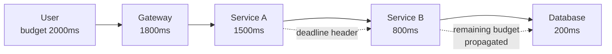
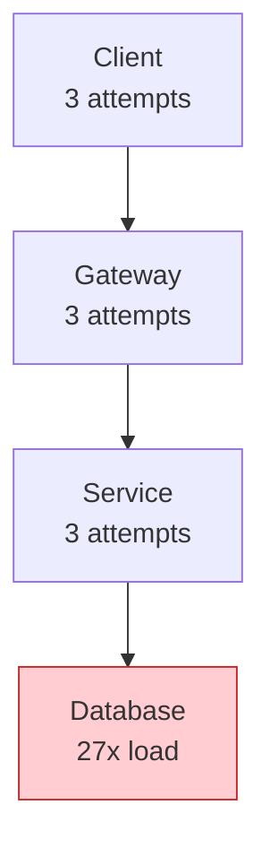
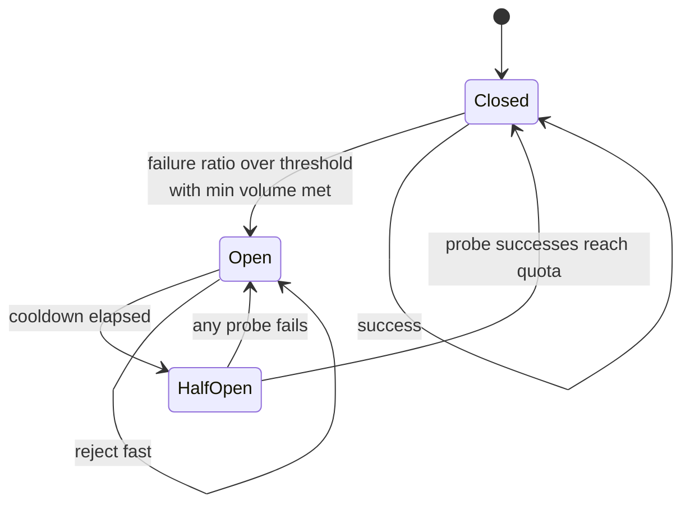
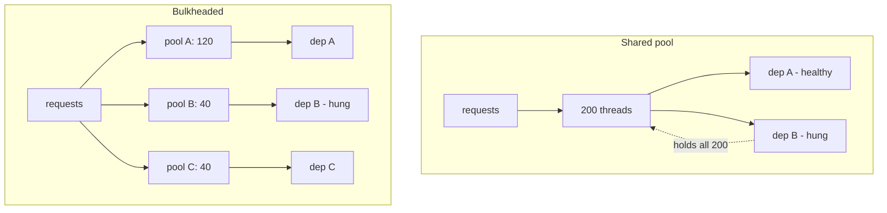
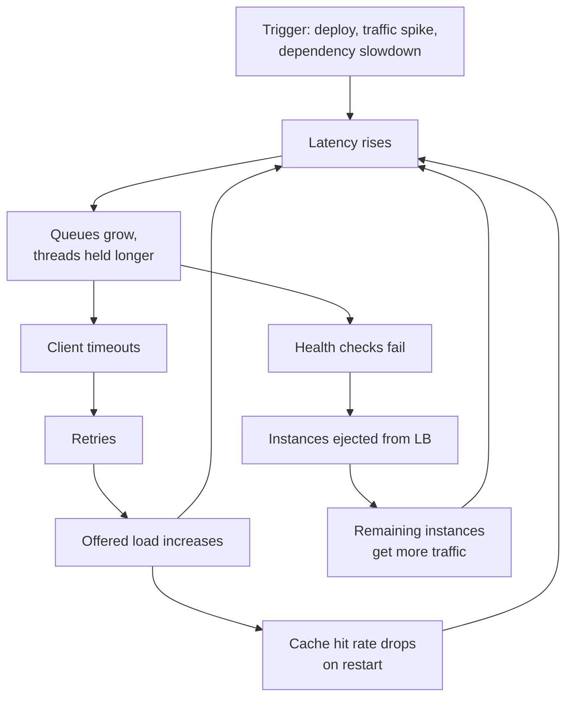
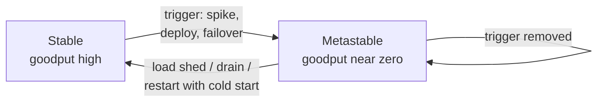

# F18 — Resilience Patterns

**Every resilience pattern is a controller with a feedback loop, and every one of them can amplify the failure it was meant to contain — the senior skill is knowing each pattern's failure mode, not its happy path.**

## The one invariant: a request has a budget, and every hop spends it

Before discussing any pattern, fix the mental model. A user request arrives with an implicit deadline (the human gives up, the mobile client cancels, the upstream LB times out). Everything downstream shares *that one budget*. Timeouts, retries, hedges, and circuit breakers are all ways of spending or protecting it.

$$
T_{\text{client}} \;\ge\; \sum_{i=1}^{n} \big(T_i \cdot a_i\big) + \text{overhead}
$$

where $T_i$ is the per-attempt timeout at hop $i$ and $a_i$ the number of attempts. If this inequality is violated, the client has already walked away while your fleet is still burning CPU on a response nobody will read. That wasted work is the raw material of every cascading failure in this page.



---

## Timeouts: derive them, do not guess

### The wrong method and why it survives

"Set it to 30 seconds, that's plenty" produces a timeout that is simultaneously too long (a saturated dependency holds 30 s of your threads) and irrelevant (nobody waits 30 s). The number must come from the observed latency distribution of **successful** responses, measured at the caller.

### The derivation

1. Plot the caller-observed latency histogram of successful calls to that dependency, per endpoint (not per service — endpoints differ by orders of magnitude).
2. Choose a target percentile you are willing to fail: $p$.
3. Set $T = q_p \cdot k$ where $q_p$ is that quantile and $k \in [1.3, 2]$ absorbs normal drift and GC pauses.
4. Validate against the budget inequality above. If it does not fit, the fix is architectural (parallelize, cache, split the call), not a smaller $k$.

| Choice of $q_p$ | Consequence | When appropriate |
|---|---|---|
| $q_{50} \cdot 2$ | Aggressive; ~5–15% of calls cut off; pairs with hedging | Read paths with a cheap retry/hedge and a big fan-out |
| $q_{99}$ | ~1% failed on a healthy day; tight thread-pool protection | Interactive services with a strict user deadline |
| $q_{99.9} \cdot 1.5$ | Rarely fires on healthy traffic; still bounds thread hold time | Most internal RPCs — the sane default |
| $q_{99.99}$ or "max observed" | Effectively no protection; threads pinned during brownouts | Only when the operation genuinely has no deadline |

!!! warning "Timeouts must be measured at the caller, including connection acquisition"
    Server-side handler latency excludes TLS handshake, DNS, connection-pool wait, and queueing in the client's own executor. A p99 of 40 ms server-side can be a p99 of 900 ms caller-side when the connection pool is exhausted. Instrument the *whole* call, and split the timeout into connect vs read (or `connect_timeout`, `tls_handshake_timeout`, `response_header_timeout`, `total_timeout`) so you can tell "no capacity to talk" from "slow to answer".

!!! gotcha "The inner timeout must be strictly smaller than the outer one"
    Symptom: retries never happen; every failure is a 504 from the edge. Mechanism: someone set both the gateway and the service timeout to 10 s; the gateway gives up first, so the service's own retry logic never gets a chance and its in-flight work is orphaned. Mitigation: enforce a monotone decreasing timeout ladder in code review or config lint — `T_outer > sum(T_inner * attempts) + slack` — and prefer deadline propagation, which makes this automatic.

### Deadline propagation

Instead of each hop carrying an independent timeout, propagate an absolute deadline (or remaining budget) with the request. gRPC does this natively (`grpc-timeout` header); HTTP needs a convention (`X-Request-Deadline`, or the `Deadline`/`grpc-timeout` style header your mesh supports).

```go
// Each hop shortens the budget it passes on, and never exceeds what it was given.
func (h *Handler) Serve(ctx context.Context, req *Req) (*Resp, error) {
    // ctx already carries the deadline decoded from the inbound header.
    remaining := time.Until(deadlineOf(ctx))
    if remaining < minUsefulWork {
        // Do not start work we cannot finish: fail fast and free the thread.
        return nil, status.Error(codes.DeadlineExceeded, "insufficient budget")
    }
    // Reserve time for our own response serialization and the caller's network hop.
    child, cancel := context.WithTimeout(ctx, remaining-reserve)
    defer cancel()
    return h.downstream.Call(child, req)
}
```

The two properties this buys you:

- **Work cancellation.** When the deadline passes, every hop abandons the request instead of finishing work whose result is already discarded. This is the single highest-leverage change for overload survival.
- **No timeout ladder to maintain.** The budget is derived at runtime rather than encoded in $n$ config files that drift apart.

!!! gotcha "Deadline propagation without cancellation is worse than nothing"
    Symptom: deadlines are set correctly, yet the database still shows queries running long after clients gave up. Mechanism: the deadline is checked only at call boundaries; an in-flight query, a blocking disk read, or a non-cancellable driver call keeps running. Mitigation: use drivers with real cancellation (`context`-aware in Go, `CancellationToken`/`asyncio` in others), set server-side statement timeouts (`statement_timeout` in Postgres, `maxTimeMS` in MongoDB) as the backstop, and check the deadline before *starting* expensive work.

---

## Retries

### Retryability is a property of the error, not of the call site

| Condition | Retry? | Notes |
|---|---|---|
| Connection refused / reset before request sent | Yes, immediately + backoff | No side effect occurred |
| DNS failure, TLS handshake failure | Yes | Often transient/regional |
| HTTP 502/503 + `Retry-After` | Yes, honour the header | Server is telling you when |
| HTTP 429 | Yes, honour `Retry-After`; count against a budget | This is a quota signal, not a fault |
| Timeout on a **read** | Yes | Idempotent by nature |
| Timeout on a **write** | Only with an idempotency key | The write may have succeeded; see F11-style idempotency tokens |
| HTTP 500 on a write | Only with an idempotency key | Same ambiguity |
| HTTP 400/401/403/404/422 | **No** | Retrying a deterministic failure is pure amplification |
| `DEADLINE_EXCEEDED` at the top-level budget | **No** | The budget is gone; retrying guarantees failure |

### Backoff and jitter

Plain exponential backoff synchronises clients: everyone that failed at $t_0$ retries at $t_0 + b$, then $t_0 + 2b$, producing retry waves. Jitter breaks the synchronisation. The Amazon Builders' Library formulation:

**Full jitter** (the recommended default):

$$
\text{sleep}_n = \mathcal{U}\!\left(0,\; \min\big(\text{cap},\; \text{base}\cdot 2^{\,n}\big)\right)
$$

**Equal jitter** (keeps a minimum wait, halves the variance):

$$
\text{sleep}_n = \frac{t_n}{2} + \mathcal{U}\!\left(0, \frac{t_n}{2}\right),\qquad t_n = \min(\text{cap},\, \text{base}\cdot 2^{\,n})
$$

**Decorrelated jitter** (walks the delay upward without a strict attempt counter):

$$
\text{sleep}_n = \min\big(\text{cap},\; \mathcal{U}(\text{base},\; 3\cdot\text{sleep}_{n-1})\big)
$$

Marc Brooker's measurements showed full jitter and decorrelated jitter both dramatically reduce total work and contention versus exponential-only; full jitter has the lowest total call count, decorrelated jitter the lowest completion time.

```python
import random

def full_jitter(attempt: int, base: float = 0.05, cap: float = 2.0) -> float:
    return random.uniform(0, min(cap, base * (2 ** attempt)))

def decorrelated_jitter(prev: float, base: float = 0.05, cap: float = 2.0) -> float:
    return min(cap, random.uniform(base, prev * 3))
```

!!! tip "Cap the backoff *and* the total elapsed time"
    Backoff caps bound the per-attempt wait; only a deadline bounds the total. A retry loop with `cap=20s, attempts=5` can hold a thread for over a minute. Always express the retry policy as "retry until the deadline, at most N attempts", never as "N attempts" alone.

### Retry amplification

This is the number that decides whether a partial outage becomes a total one. With $n$ layers in the call graph, each configured for $a_i$ total attempts, the deepest dependency sees:

$$
A = \prod_{i=1}^{n} a_i
$$



Three layers at three attempts each is **27x** load on the failing dependency. The dependency was at 95% capacity and dropped 20% of requests; now it receives 27x its normal load and drops 100%. The retries created the outage.

Worse, amplification is *load-triggered*: it is exactly zero when everything is healthy, so it never appears in a load test and never appears on a dashboard until the incident.

### Retry budgets are mandatory, not optional

A retry budget makes retries a scarce, self-limiting resource. The canonical implementation (gRPC `retryThrottling`, Finagle/Envoy retry budgets) is a token bucket:

- Every request adds a token (up to `maxTokens`).
- Every retry costs `tokenRatio` tokens (e.g. 0.1).
- Retries are only permitted while tokens remain.

The steady-state effect: retries are capped at a fixed *fraction* of primary traffic (10% at `tokenRatio = 0.1`), regardless of how many failures occur. Under a total dependency outage, retry traffic is bounded at 1.1x normal, not 3x.

```yaml
# Envoy: budget-based retries instead of a fixed retry count.
retry_policy:
  retry_on: "5xx,reset,connect-failure,retriable-status-codes"
  num_retries: 2
  retry_budget:
    budget_percent: { value: 20.0 }   # retries <= 20% of active requests
    min_retry_concurrency: 3
  retry_back_off:
    base_interval: 0.025s
    max_interval: 0.25s
```

| Control | Bounds | Cost when dependency is fully down |
|---|---|---|
| Fixed attempt count (`n=3`) | Nothing; multiplies per layer | 3x per layer, $3^n$ total |
| Attempt count + jittered backoff | Timing spread only | Still $3^n$ total work |
| Retry budget (percentage) | Total retry *rate* | ~1.2x normal |
| Circuit breaker | Retry rate after threshold | ~0 while open |
| Budget + breaker + deadline | All three axes | Bounded and time-limited |

!!! danger "Retry only at one layer"
    The strongest structural rule: pick **one** layer in the call graph that owns retries — usually the one closest to the failure that still knows enough to retry safely — and make every other layer fail fast. Retries at the client, gateway, mesh sidecar, SDK, and connection pool simultaneously is the default configuration of most stacks, and it is a loaded gun.

---

## Circuit breakers



### Parameters that actually matter

| Parameter | Typical | Failure if wrong |
|---|---|---|
| Rolling window | 10–60 s, or 100–1000 requests | Too short: noise trips it. Too long: slow to react and slow to recover |
| Minimum request volume | 20+ per window | Without it, 1 failure out of 1 request = 100% error rate = open |
| Failure ratio threshold | 50% | Too low: opens during normal error rates. Too high: never protects |
| What counts as failure | 5xx + timeouts + connect errors, **not** 4xx | Counting 400s means a bad client opens the breaker for everyone |
| Open duration (cooldown) | 5–30 s, exponentially increased on repeated opens | Too short: hammering. Too long: unnecessary outage after recovery |
| Half-open concurrency | 1–5 concurrent probes | Unlimited half-open = the herd returns instantly |
| Scope | Per (instance, endpoint) or per (host, endpoint) | Per-service scope means one bad host opens the breaker for all hosts |

### Failure modes of breakers themselves

!!! gotcha "A breaker that opens on timeout removes the only capacity you had"
    Symptom: a dependency is slow but succeeding at 60% of normal throughput; the breaker opens and now you serve 0%. Mechanism: the breaker's failure signal was "timeout", and timeouts are a *latency* condition, not a health condition. Once open, you drop 100% of a dependency that could have served most of your traffic. Mitigation: use a *concurrency limiter* rather than a breaker for slowness (bounded in-flight naturally sheds excess while still using the available capacity), and reserve breakers for hard failures (connection refused, 5xx, TLS errors). If you must break on latency, break partially — reject a fraction proportional to the overload rather than all-or-nothing.

!!! gotcha "Per-service breakers turn one bad host into a full outage"
    Symptom: 1 of 50 replicas has a corrupt cache and returns 500s; the client breaker opens for the entire service. Mechanism: the breaker aggregated across all hosts, so 2% error looked like a service-level signal after retries concentrated on the bad host. Mitigation: scope breakers per upstream host (Envoy outlier detection does this), cap the fraction of hosts that can be ejected (`max_ejection_percent`), and let load balancing route around the bad host instead.

!!! gotcha "Distributed breakers desynchronise or synchronise, and both are bad"
    Symptom: either the dependency is hammered by half the fleet while the other half is open, or the entire fleet closes at the same instant and immediately re-opens. Mechanism: local breaker state per instance with identical cooldowns. Mitigation: jitter the cooldown per instance, and limit half-open probes globally (a shared token or a small probing subset of instances) so recovery is gradual rather than a step function.

---

## Bulkheads and isolation

A bulkhead prevents one dependency's degradation from consuming the resource every other dependency needs — almost always **threads, connections, or memory**.



Sizing follows Little's Law again: pool size $= \lambda \cdot W$ at the target throughput and *healthy* latency, plus a small margin — deliberately **not** sized for the degraded latency, because the point is to stop consuming resources when the dependency is slow.

| Isolation level | Blast radius contained | Cost |
|---|---|---|
| Semaphore per dependency | Thread-hold time | Nearly free; no timeout enforcement on blocking calls |
| Separate thread pool per dependency | Blocking calls, hung sockets | Context switching, memory; ~1 MB stack per thread |
| Separate connection pool per dependency | Socket exhaustion | Config surface |
| Separate process | Memory corruption, GC pauses | IPC latency |
| Separate cell/shard of the fleet | Bad deploy, poison data, single tenant | Operational multiplicity |

!!! tip "Async runtimes do not remove the need for bulkheads"
    In Go, Node, or async Python the "thread pool" becomes memory and file descriptors. A hung dependency accumulates goroutines/promises without bound; the limit becomes OOM instead of pool exhaustion, which is strictly worse because it is not graceful. Use explicit semaphores (`golang.org/x/sync/semaphore`, `asyncio.Semaphore`) per dependency.

---

## Hedged requests and the tail at scale

Dean and Barroso's *The Tail at Scale* observation: if a user request fans out to $N$ servers and waits for all of them, the probability that at least one hits the $p$-tail is

$$
P(\text{slow}) = 1 - (1-p)^{N}
$$

At $p = 0.01$ (p99) and $N = 100$, **63%** of user requests hit at least one p99 response. Tail latency is not an edge case at fan-out; it is the common case.

**Hedging**: send the request; if no response by $t_{\text{hedge}}$ (typically the p95), send a second copy to a different replica and take the first answer. If the two attempts are independent, the effective tail is

$$
P(\text{both slow}) \approx p_{\text{hedge}}^{2}
$$

so hedging at p95 turns a p95 tail into roughly a p99.75 tail, for about 5% extra load.

| Variant | Extra load | Benefit | Constraint |
|---|---|---|---|
| Hedge at p95 | ~5% | Removes most of the tail | Request must be idempotent |
| Hedge at p50 | ~50% | Near-best latency | Only for very cheap requests |
| Tied requests | ~2x enqueued, ~1x executed | Cancels the loser on dequeue | Needs cross-server cancellation |
| Backup with cancel | ~5% + cancel traffic | Avoids duplicate work | Needs a cancellation path |
| Micro-partition + rebalance | 0 | Fixes the cause | Requires system redesign |

!!! gotcha "Hedging without a budget is a retry storm with a friendly name"
    Symptom: a service degrades and hedge traffic doubles the load, guaranteeing it never recovers. Mechanism: when the dependency is uniformly slow, *every* request exceeds the hedge threshold, so hedge rate goes from 5% to 100%. Mitigation: compute the hedge threshold from a live quantile estimate (so it moves with the distribution), cap hedges with the same token-bucket budget used for retries, and disable hedging entirely when the breaker or the adaptive concurrency limiter says the dependency is saturated.

---

## Load balancing interacts with retries

Retries and load balancing are coupled: a retry is only useful if it lands somewhere different.

- **Retry the same host** → useless for host-local faults, and it concentrates load on the host that is already struggling.
- **Retry a different host with round-robin** → correct for host-local faults; useless for whole-service overload.
- **Least-request / least-loaded LB** → the failing host answers *fastest* (it fails fast), so naive least-latency LB routes **more** traffic to it. This is the "black hole" or "death star" pathology.
- **Power of two choices** (pick 2 at random, take the less loaded) → near-optimal balance without global state and without the herding of strict least-loaded.
- **Outlier detection / passive health checking** → eject hosts with anomalous error rates, with `max_ejection_percent` so you cannot eject the fleet.

!!! gotcha "Fail-fast hosts attract traffic under least-latency load balancing"
    Symptom: one broken host serves a wildly disproportionate share of requests, all of them errors. Mechanism: the host returns 503 in 2 ms while healthy hosts take 40 ms, so latency-aware LB (and least-request LB, since its requests complete instantly) prefers it. Mitigation: weight by *successful* response latency only, feed error rate into the LB's health signal, and enable outlier ejection so the host is removed rather than favoured.

---

## Graceful degradation and fallbacks

A fallback is a design decision about correctness, not an exception handler.

| Fallback | Safe when | Dangerous when |
|---|---|---|
| Serve stale cache | Staleness is bounded and acceptable to the product | Balances, entitlements, permissions |
| Serve empty/default | The field is decorative | The empty value is interpreted as "denied" or "zero" |
| Serve a static/generic version | Personalization is optional | Legal/regional content requirements differ |
| Queue the write for later | Operation is asynchronous by contract | Client expects read-your-writes |
| Fail closed | Security or money is involved | Availability is the product |

!!! danger "The 'fail open on auth' anti-pattern"
    A fallback that returns "allowed" when the authorization service is unreachable converts a dependency outage into a security incident. The correct degradation is a short-lived cached decision with a hard TTL, not an unconditional allow. Write down, per dependency, whether its unavailability means *deny* or *allow*, and test it.

!!! gotcha "Fallback paths are untested code that runs only during incidents"
    Symptom: the fallback throws a NullPointerException, so the degraded path is *less* available than the primary. Mechanism: the fallback executes in production perhaps twice a year, and it has no test coverage or capacity plan of its own. Mitigation: exercise fallbacks continuously — route 0.1% of traffic through them permanently, or run scheduled fault injection — and capacity-plan the fallback for 100% of traffic, since that is when it runs.

---

## Cascading failure: the anatomy



Three reinforcing loops, all positive feedback:

1. **Retry loop** — timeouts create retries create load create timeouts.
2. **Ejection loop** — overload fails health checks, removing capacity, increasing per-node load.
3. **Cold-start loop** — restarts empty caches and de-optimize JIT, raising per-request cost exactly when cost matters most.

Each loop is broken by a specific control: retry budgets, health checks on a dedicated non-shed path plus minimum-healthy-fraction, and cache warming plus slow-start ramping (`slow_start_config` in Envoy, connection warm-up in most LBs).

---

## Metastable failure states

The most important operational concept on this page. From *Metastable Failures in Distributed Systems* (HotOS 2021): a system has a stable regime and a **metastable** regime. The trigger pushes it into the metastable regime; the trigger then disappears, but a **sustaining effect** keeps the system there indefinitely.



The canonical sustaining effect is **retries of timed-out work**: the system is fully utilised producing responses that arrive after their deadline, so the client retries, so the system stays fully utilised. Utilization is 100%, goodput is 0%.

Why capacity restoration does not help:

- The system is not short of capacity in the "requests it could serve" sense; it is short of *useful* capacity because the queue is full of expired work.
- Doubling the fleet doubles the work being wasted. The amplification factor scales with the fleet.
- New instances arrive cold — empty caches, unwarmed connection pools, un-JIT'd code — so per-request cost is 2–10x higher for minutes. Adding them can deepen the hole.

Exit strategies, in order of preference:

| Action | Mechanism | Risk |
|---|---|---|
| Shed aggressively at the edge | Reduces offered load below the sustaining threshold | User-visible errors |
| Drop expired requests at dequeue | Eliminates wasted work directly | Needs deadline propagation |
| Disable retries globally (runtime flag) | Removes the amplification term | Loses transient-fault masking |
| Switch queues to LIFO | Restores non-zero goodput | Old requests starve |
| Blackhole a fraction of traffic, then ramp | Forces the system back to the stable basin | Blunt; needs a ramp plan |
| Add capacity | Only works if trigger is genuine capacity shortfall | Cold start can worsen it |

!!! gotcha "You cannot detect metastability from utilization or error rate alone"
    Symptom: dashboards show CPU 100% and errors 100%, which looks identical to "we need more capacity". Mechanism: both a genuine capacity shortfall and a metastable state present the same way. The distinguishing signal is **goodput** — responses delivered before the client's deadline — and **work amplification** (attempts per user request). Mitigation: instrument both. If attempts-per-request has risen and goodput is near zero while offered load is at or below its pre-incident level, you are metastable and must shed, not scale.

---

## Thundering herd on recovery

Recovery is a second outage waiting to happen.

| Herd source | Mechanism | Mitigation |
|---|---|---|
| Synchronised client retries | Everyone backed off to the same deadline | Full jitter, jittered `Retry-After` |
| Cache stampede | A hot key expires; $N$ concurrent misses hit the origin | Request coalescing/singleflight, probabilistic early expiry, `stale-while-revalidate` |
| Cold cache after restart | Every request is a miss | Cache warming, slow-start ramp, staged restarts |
| Reconnect storm | All clients reconnect the instant the LB comes back | Jittered reconnect, connection admission rate limit, staged listener enable |
| Cron alignment | Thousands of jobs at `0 * * * *` | Hash the schedule by job ID into the hour |
| Leader election churn | All followers re-request state at once | Randomised election timeouts (Raft already does this), backpressure on snapshot transfer |

**Probabilistic early expiration** (XFetch) removes cache stampedes without locks: refresh a key early with probability that grows as the TTL approaches.

$$
\text{refresh if } \quad t_{now} - \delta \cdot \beta \cdot \ln(\mathcal{U}(0,1)) \;\ge\; t_{\text{expiry}}
$$

where $\delta$ is the measured recompute time and $\beta \approx 1$. Expensive-to-compute keys are refreshed earlier, so the recompute rarely coincides with expiry for many clients at once.

---

## Static stability

Static stability (an Amazon Builders' Library term) means: **the system keeps working during a failure without needing to make any change.** No control-plane call, no scaling action, no config push, no DNS update — because those are exactly the things most likely to be broken or overloaded during the failure.

Design consequences:

- **Pre-provision the failover capacity.** If you need 3 AZs to survive one AZ loss without scaling, size so that any two AZs can serve 100%. With $n$ AZs surviving $f$ failures, steady-state utilization must satisfy $u \le \frac{n-f}{n}$. For $n=3, f=1$: $u \le 66.7\%$ — the "wasted" 33% is the product.
- **Cache the control plane's answers.** A data-plane component must keep serving with its last-known-good configuration when the control plane is unavailable. Fail static, not fail empty: an expired-but-present routing table beats an empty one.
- **Prefer no-op failover.** Active-active with health-based traffic steering that is already in place beats a runbook that says "promote the standby".
- **Watch out for the failover path being the least-tested path.** If failover requires an API call to a service you have never called during an outage, you do not have static stability; you have a hypothesis.

!!! example "Static stability in one sentence per layer"
    DNS: pre-published records with short TTLs and health checks, not a manual switch. LB: both regions already in the pool at weight 0/100. Config: last-known-good cached on disk with no expiry-to-empty. Capacity: N+1 pre-provisioned, not autoscaled on demand. Certificates: renewed well before expiry with alerting at 30 days, because expiry during an incident is unrecoverable.

---

## Gotchas & Corner Cases

!!! gotcha "Retries at three layers multiply into 27x load on the failing dependency"
    Symptom: a dependency at 20% error rate goes to 100% error rate within seconds of the first blip. Mechanism: client, gateway, and service each retry 3 times; total attempts against the dependency is $3^3 = 27$; the amplification appears only under load so no test catches it. Mitigation: designate exactly one retry layer; enforce retry budgets (token-bucket, ~10–20% of primary traffic) at every layer that retries at all; add `attempts_per_request` as a first-class metric so amplification is visible before the incident.

!!! gotcha "A circuit breaker that opens on timeout while the callee is merely slow removes the only capacity you had"
    Symptom: dependency was serving 60% of requests successfully at elevated latency; after the breaker opens, you serve 0%. Mechanism: slowness was classified as failure, and breakers are all-or-nothing. Mitigation: use adaptive concurrency limiting for latency degradation (it naturally throttles to whatever the dependency can absorb) and reserve breakers for hard errors; if breaking on latency, shed a proportional fraction rather than everything.

!!! gotcha "Timeouts measured on the server hide connection-pool queueing on the client"
    Symptom: server dashboards are green at p99 = 30 ms while users see multi-second latency. Mechanism: the client's connection pool is exhausted, so requests wait to *acquire a connection* before any server-side timer starts. Mitigation: instrument client-side total call time including pool wait; export `pool_wait_seconds` and `pool_saturation`; size pools with Little's Law and alert on saturation, not just latency.

!!! gotcha "Non-idempotent retries silently double-charge"
    Symptom: duplicate payments, duplicate emails, duplicate orders — visible only in reconciliation weeks later. Mechanism: a write timed out after the server committed; the client retried; there was no idempotency key, or the key was regenerated per attempt. Mitigation: generate the idempotency key **once per logical operation** at the outermost layer and propagate it through every retry and every hop; make the server dedupe on it with a TTL longer than the maximum retry window.

!!! gotcha "The retry storm outlives the incident because clients back off to the same wall-clock instant"
    Symptom: the dependency recovers, is healthy for 8 seconds, then dies again, repeatedly. Mechanism: exponential backoff without jitter synchronises the entire client population into a retry wave; each wave re-kills the dependency and re-synchronises the next wave. Mitigation: full jitter on the client, jittered `Retry-After` on the server, and staged recovery (admit 1%, 5%, 25%, 100% over minutes) instead of flipping straight to full traffic.

!!! gotcha "Health checks that traverse dependencies convert one dependency outage into a fleet-wide outage"
    Symptom: a non-critical dependency degrades and the LB removes 100% of your instances. Mechanism: the readiness/liveness probe calls the dependency; every instance fails the probe simultaneously; there is no minimum-healthy floor. Mitigation: liveness checks must test only the process; readiness may test critical dependencies but must be scoped and must not be shared with liveness; configure a panic/minimum-healthy threshold (Envoy panic mode, ALB minimum healthy targets) so the LB serves to all hosts rather than none.

!!! gotcha "Kubernetes liveness probes restart pods that are merely overloaded"
    Symptom: a load spike causes a rolling wave of pod restarts, which removes capacity and deepens the spike. Mechanism: the liveness probe times out because the event loop or thread pool is saturated; the kubelet kills the container; the replacement is cold. Mitigation: serve probes from a dedicated listener/thread that is never shed, set generous `timeoutSeconds` and `failureThreshold` on liveness, prefer readiness (which removes traffic without killing state) for load conditions, and never make liveness call a dependency.

!!! gotcha "Adding capacity during a metastable failure makes it worse"
    Symptom: you triple the fleet and the error rate stays at 100%. Mechanism: the sustaining effect is retry amplification of expired work, not capacity shortfall; new nodes arrive with cold caches (higher per-request cost) and immediately join the wasted-work loop. Mitigation: reduce offered load first — shed, disable retries, drop expired requests — and only then restore capacity, with a slow-start ramp so caches warm.

!!! gotcha "Connection-pool exhaustion looks exactly like a downstream outage"
    Symptom: 100% timeouts to service B, but B's own dashboards are healthy and lightly loaded. Mechanism: the HTTP client's pool is capped (many defaults are absurdly low — 2 per host in some stacks, 6 in browsers) or connections are leaked because responses are not fully drained/closed; requests queue for a connection until the deadline. Mitigation: export pool metrics as an SLI; drain and close response bodies unconditionally; set per-host pool sizes from $\lambda W$; and alert on pool wait time, which precedes the outage.

!!! gotcha "A shared thread pool means the least important dependency decides your availability"
    Symptom: the recommendation service hangs and checkout stops working. Mechanism: both use the same executor; the hung calls hold every thread until their (too-long) timeout. Mitigation: bulkhead per dependency with explicit semaphores sized by Little's Law, cap the low-criticality pool small enough that its total blocked time is irrelevant, and prove it with a fault-injection test that hangs the dependency.

!!! gotcha "Hedging and retries share no budget, so they compound"
    Symptom: measured request amplification is 4x during degradation despite a "3 attempt" policy. Mechanism: the hedge fires at p95, the hedged copy also times out and is retried, and the retry is itself hedged. Mitigation: put hedges and retries in the **same** token bucket, count every network attempt in `attempts_per_request`, and disable hedging automatically when the concurrency limiter reports saturation.

!!! gotcha "Static stability fails at renewal boundaries: certificates, tokens, and leases"
    Symptom: a region that was surviving an outage suddenly fails 40 minutes in. Mechanism: the isolated component could serve from cache indefinitely, but its service-account token, mTLS certificate, or lease had a 1-hour TTL and the issuer was in the failed region. Mitigation: inventory every credential's TTL and its issuer's failure domain; ensure renewal paths are regionally independent; alert on "time until credential expiry" as a capacity-style metric; and test with the issuer blackholed for longer than the TTL.

---

## SRE Lens

**SLIs and SLOs**

- `attempts_per_user_request` (work amplification): the single best leading indicator of a retry storm. Alert on a step change, not a threshold.
- `goodput_ratio`: responses returned before the caller's deadline ÷ requests offered. Distinguishes metastable failure from capacity shortfall.
- Per-dependency SLIs: success ratio, p50/p99 latency, breaker state, concurrency-limit value, pool saturation. Every hard dependency needs its own dashboard row; your availability is bounded by theirs.
- `deadline_exceeded_before_start_total`: requests dropped at dequeue because their budget was gone. Nonzero means you are saving work; a sudden rise means you are in trouble.

**Failure modes and detection**

| Failure | Leading signal | Alert |
|---|---|---|
| Retry amplification | `attempts_per_request` step change | Page on >1.5x baseline for 5 min |
| Breaker flapping | breaker state transitions/min | Ticket on >6 transitions/min |
| Pool exhaustion | pool wait p99 | Page on wait > 10% of budget |
| Metastable state | goodput near zero with flat offered load | Page; runbook = shed |
| Cold-start cost | per-request CPU after deploy | Ticket; feed into slow-start config |
| Deadline misconfiguration | ratio of 504-at-edge to 500-at-service | Ticket on inversion |

**Rollout and migration risk**

Timeout, retry, and breaker parameters are *production configuration*, and changing them has the same blast radius as a code deploy. Treat them accordingly: canary the change, watch `attempts_per_request` and goodput, and have a one-command revert. When introducing retries to a call path for the first time, ship with the budget at 5% and raise it only after observing steady-state retry rates.

**Capacity signals**

- Static stability requires $u \le \frac{n-f}{n}$ steady-state utilization. Report actual $u$ per failure domain monthly; it silently drifts upward as traffic grows.
- Adaptive concurrency limit values are a live capacity readout per dependency.
- Cold-start cost multiplier and warm-up duration determine how fast you may safely add capacity — measure them, do not assume.

**On-call runbook notes**

- Have three global runtime flags reachable in under a minute: disable retries, disable hedging, force-open a specific breaker. All three are load-reduction levers.
- The first question during a saturation incident is "has offered load actually increased, or has work amplification increased?" The answers lead to opposite actions.
- After recovery, ramp: 1% → 5% → 25% → 100% with cache-warm checks between steps. Never flip straight to full traffic.

**Cost**

Resilience costs money in three places: idle headroom for static stability (33% at $n=3, f=1$), duplicated work from hedging (~5%), and the engineering cost of fallback paths that must be exercised continuously. Each is defensible with the outage cost it avoids — quantify it that way when it is challenged in a budget review.

---

## Interview Angle

!!! interview "Probe: how do you pick a timeout for a downstream call?"
    **Strong answer:** from the caller-observed latency distribution of successful calls to that specific endpoint — e.g. $p_{99.9} \times 1.5$ — then validate against the end-to-end budget so that $T_{\text{outer}} > \sum T_{\text{inner}} \cdot a_i$. Prefer deadline propagation so the ladder is derived at runtime. Mention that server-side latency excludes connection-pool wait, and that the timeout must also bound how long a thread is held, which links to Little's Law and pool sizing.

    **Weak answer:** "30 seconds", or "p99 of the service", with no mention of budget, caller-side measurement, or thread-hold time.

!!! interview "Follow-up: your service and its dependency both retry 3 times. What happens during a partial outage?"
    **Strong answer:** compute the amplification — $3 \times 3 = 9$ attempts, and with the client layer $27$ — explain that it is load-triggered so it never appears in testing, then propose retry budgets (token bucket, retries capped at ~10–20% of primary traffic), a single designated retry layer, full jitter, and `attempts_per_request` as a monitored SLI.

!!! interview "Probe: the dependency recovered but the service did not. Explain."
    **Strong answer:** metastable failure. Describe the sustaining effect (retries of expired work), why utilization is 100% while goodput is 0%, and why adding capacity does not help (amplification scales with the fleet; new nodes are cold). Give the exit path: reduce offered load — shed, disable retries, drop expired requests at dequeue, LIFO — then ramp back with cache warming. Cite the HotOS 2021 paper by name.

    **Weak answer:** "Restart the service" with no model of why the restart helps or hurts.

!!! interview "Follow-up: when is a circuit breaker the wrong tool?"
    **Strong answer:** when the dependency is slow rather than broken. A breaker is binary and will drop 100% of a dependency that can still serve 60%. Adaptive concurrency limiting throttles to exactly the available capacity instead. Also flag per-service breaker scope turning one bad host into a full outage, and 4xx counted as failures letting one bad client trip the breaker for everyone.

!!! interview "Probe: design a service that survives an AZ failure with no operator action"
    **Strong answer:** static stability — pre-provisioned capacity such that $u \le (n-f)/n$; active-active with health-checked traffic steering already in place; data-plane components serving from last-known-good config when the control plane is unreachable; no dependency on a scaling or DNS change during the failure; credentials and leases whose issuers are not in the failed domain. Then name the failure test: blackhole the AZ *and* the control plane, for longer than the shortest credential TTL.

!!! interview "Trap: 'we'll just add hedged requests to fix p99'"
    **Strong answer:** hedging is only valid for idempotent requests, only helps when slowness is uncorrelated across replicas, and must share a budget with retries or it becomes a 2x load multiplier exactly when the system is degraded. Note the correct hedge threshold is a live quantile, and that the structural fix for correlated tail latency is smaller partitions and better scheduling, per *The Tail at Scale*.

---

## Key Takeaways

- A request has one budget; every timeout, retry, and hedge spends it. Propagate deadlines and cancel work whose deadline has passed — this is the highest-leverage overload defence there is.
- Derive timeouts from the caller-observed distribution of successful latencies, and validate the outer-greater-than-inner-times-attempts inequality. Guessed timeouts are simultaneously too long to protect and too short to matter.
- Retry amplification is multiplicative across layers ($\prod a_i$) and is invisible until the incident. Retry budgets (token buckets bounding retries to a fraction of primary traffic) are mandatory; a single designated retry layer is better still.
- Full jitter, $\mathcal{U}(0, \min(\text{cap}, \text{base}\cdot 2^n))$, is the default backoff. Unjittered backoff synchronises clients into waves that repeatedly re-kill a recovering dependency.
- Circuit breakers are for hard failures; adaptive concurrency limits are for slowness. Breaking on latency throws away capacity you still had.
- Bulkhead every dependency in whatever resource is actually scarce — threads, connections, memory, goroutines — sized by $L=\lambda W$ at healthy latency, not degraded latency.
- Metastable failures persist after the trigger is gone; the exit is load reduction, not capacity addition. Instrument goodput and attempts-per-request so you can tell the two apart at 3 a.m.
- Static stability means surviving a failure with no control-plane action: pre-provisioned headroom ($u \le (n-f)/n$), cached last-known-good config, failover paths that are already active, and credentials whose issuers survive the failure.

## Further Reading

- Google SRE Book, Chapter 22 — *Addressing Cascading Failures* (server overload, resource exhaustion, the retry and health-check feedback loops, and the "how to recover" checklist).
- Google SRE Book, Chapter 21 — *Handling Overload* (client-side throttling and adaptive rejection, criticality).
- Amazon Builders' Library — *Timeouts, retries and backoff with jitter* (Marc Brooker): full jitter, decorrelated jitter, retry budgets.
- Amazon Builders' Library — *Static stability using Availability Zones* (Becky Weiss, Mike Furr).
- Amazon Builders' Library — *Avoiding fallback in distributed systems* (Jacob Gabrielson).
- Amazon Builders' Library — *Avoiding insurmountable queue backlogs* and *Using load shedding to avoid overload*.
- Dean & Barroso, *The Tail at Scale*, Communications of the ACM, 2013 (hedged and tied requests, fan-out tail math).
- Bronson, Aghayev, Charapko & Zhu, *Metastable Failures in Distributed Systems*, HotOS 2021; and Huang et al., *Metastable Failures in the Wild*, OSDI 2022.
- Nygard, *Release It!* (2nd ed.) — circuit breaker, bulkhead, steady state, and the failure-mode catalogue.
- Netflix Technology Blog — *Performance under load* (adaptive concurrency limits) and the Hystrix/resilience4j design notes.
- Envoy Proxy documentation — outlier detection, retry budgets, `slow_start_config`, panic threshold.
- Vattani, Chierichetti & Lowenstein, *Optimal Probabilistic Cache Stampede Prevention*, VLDB 2015 (XFetch early expiry).

---

**Related:** [F17 — Rate Limiting & Load Shedding](f17-rate-limiting-load-shedding.md) for the server-side half (admission control, shedding, CoDel), [F22 — Observability Fundamentals](f22-observability-fundamentals.md) for measuring amplification and goodput, and [F23 — SLI/SLO & Error Budgets](f23-slo-error-budgets.md) for composing dependency availability into your own SLO.
