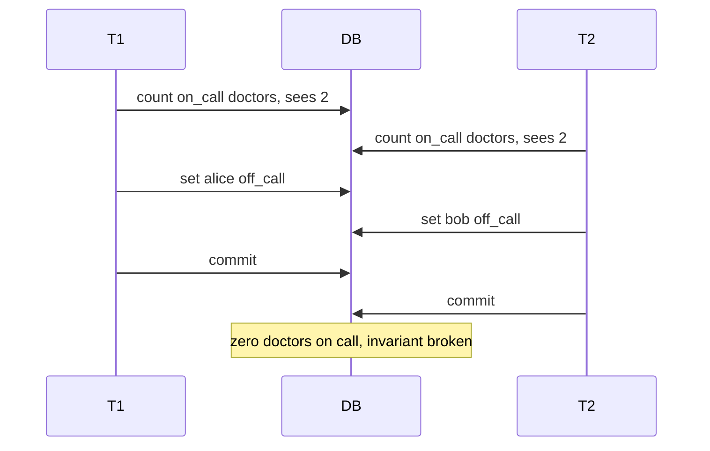
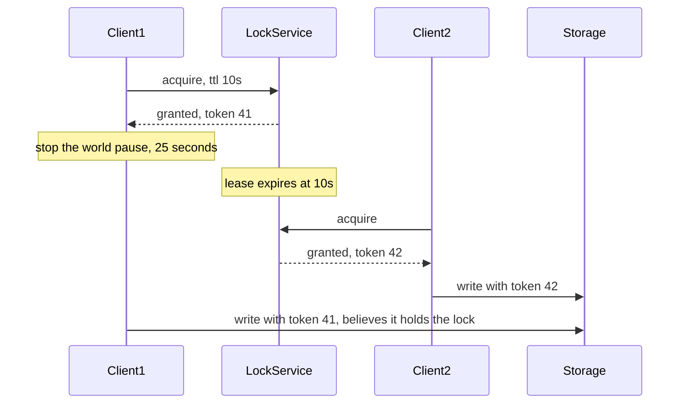

# F19 — Concurrency Control

**Concurrency control is the choice of where you pay for correctness: blocking up front with locks, aborting after the fact with validation, or removing the contention entirely by changing how the data is shaped.**

## The Two Families

| Dimension | Pessimistic (locking) | Optimistic (validation) |
| --- | --- | --- |
| Core assumption | Conflicts are likely | Conflicts are rare |
| When conflict is detected | Before the work, at access time | At commit time |
| Cost of a conflict | Waiting | Wasted work plus a retry |
| Failure mode under contention | Deadlock, convoy, lock-wait timeout | Abort storm, livelock, retry amplification |
| Latency profile | Higher and more uniform | Lower at low contention, catastrophic at high |
| Throughput as contention rises | Degrades gracefully then collapses | Collapses earlier and harder |
| Typical implementation | 2PL, `SELECT FOR UPDATE`, mutexes | Version columns, CAS, MVCC with SSI |
| Good fit | Hot rows, long transactions, high write ratio | Read-mostly, low collision probability, short transactions |

The decision rule is the **collision probability**, not taste. If $n$ concurrent transactions touch a keyspace where the probability that two of them overlap is $p$, optimistic control does $p$ fraction of its work twice. At $p = 0.02$ optimism is nearly free; at $p = 0.6$ you are burning most of your CPU on doomed transactions.

!!! tip "A useful third category: eliminate the conflict"
    Before choosing a locking strategy, ask whether the operation can be made commutative (`balance + delta` in a CRDT-style counter), partitioned so only one writer exists per key, or serialised through a queue. Those designs have no concurrency control cost at all because there is no concurrency on the contended object.

## Two-Phase Locking

2PL guarantees serializability with a simple rule: every transaction has a **growing phase** where it only acquires locks and a **shrinking phase** where it only releases them.

| Variant | Release policy | Guarantees |
| --- | --- | --- |
| Basic 2PL | Release any time after the last acquire | Serializable, but cascading aborts possible |
| Strict 2PL | Hold all **exclusive** locks to commit | Serializable, recoverable, no cascading aborts |
| Rigorous / Strong Strict 2PL | Hold **all** locks to commit | Serializable, and commit order matches serialization order |

Real systems use Strong Strict 2PL, because holding shared locks to commit is what makes the commit order externally meaningful.

Lock compatibility matrix:

| Held \ Requested | S (shared) | X (exclusive) | IS | IX |
| --- | --- | --- | --- | --- |
| S | Yes | No | Yes | No |
| X | No | No | No | No |
| IS | Yes | No | Yes | Yes |
| IX | No | No | Yes | Yes |

Intent locks (IS, IX) exist so a transaction wanting a table-level lock can determine in $O(1)$ whether any row-level lock conflicts, instead of scanning every row lock.

### Deadlocks

A deadlock is a cycle in the wait-for graph.


Handling strategies:

=== "Detection"

    A background thread builds the wait-for graph and looks for cycles, then aborts a victim.

    InnoDB runs detection on every lock wait (with `innodb_deadlock_detect`, on by default) and returns `ER_LOCK_DEADLOCK`. Postgres waits `deadlock_timeout` (default 1 s) before running detection, so it pays nothing in the common no-deadlock case.

    Cost: graph maintenance is $O(\text{waiters})$ and becomes a bottleneck itself at very high concurrency — MySQL explicitly recommends disabling detection and relying on `innodb_lock_wait_timeout` on extremely hot workloads.

=== "Prevention by ordering"

    If every transaction acquires locks in a globally consistent order (for example ascending primary key), no cycle can form. This is the cheapest and most reliable fix and it is an application-level discipline, not a database feature.

    ```sql
    -- Deadlock-prone: order depends on which account is "from"
    UPDATE accounts SET balance = balance - 100 WHERE id = :from;
    UPDATE accounts SET balance = balance + 100 WHERE id = :to;

    -- Safe: always lock the lower id first
    SELECT id FROM accounts WHERE id IN (:from, :to) ORDER BY id FOR UPDATE;
    UPDATE accounts SET balance = balance - 100 WHERE id = :from;
    UPDATE accounts SET balance = balance + 100 WHERE id = :to;
    ```

=== "Prevention by timestamp"

    Wound-wait and wait-die use transaction age to decide who waits and who dies, guaranteeing no cycle without a graph.

    | Scheme | Older wants a lock held by younger | Younger wants a lock held by older |
    | --- | --- | --- |
    | Wait-die | Older waits | Younger aborts |
    | Wound-wait | Older preempts (wounds) the younger | Younger waits |

    Wound-wait aborts fewer transactions overall and favours older transactions, which prevents starvation. Spanner uses wound-wait.

=== "Timeout"

    Simply abort anything waiting longer than a threshold. Cheap, no graph, but it cannot distinguish a deadlock from a merely slow lock holder, so it aborts innocent transactions and tunes badly.

### Victim Selection

Real systems pick the victim by minimising rollback cost: fewest rows modified, least undo log, fewest locks held, or youngest transaction. Two consequences that surprise people:

- The transaction that "caused" the deadlock is usually **not** the one aborted; the small, innocent transaction often dies.
- A large batch job can be effectively immune to abort under a "fewest changes" policy, so it repeatedly kills small OLTP transactions. Watch for this pattern in deadlock logs.

!!! gotcha "Deadlock retries without jitter turn a deadlock into a livelock"
    Symptom: deadlock rate climbs, retries climb, throughput drops to near zero while CPU stays busy. Mechanism: the aborted transaction retries immediately, re-acquires locks in the same order at the same instant as its counterpart, and deadlocks again. Mitigation: retry with exponential backoff plus full jitter, cap the retry count, and fix the underlying lock ordering rather than relying on retries.

## MVCC and Snapshot Isolation

MVCC gives every write a new version rather than overwriting, so readers never block writers and writers never block readers. Each row becomes a chain of versions, and a transaction's snapshot selects the newest version that was committed before the snapshot was taken.

### Implementation Sketch

Postgres stores versions in the heap with `xmin` (creating transaction) and `xmax` (deleting transaction). A tuple is visible to a snapshot if `xmin` committed and is visible to the snapshot, and `xmax` is either null or not visible.

A snapshot is captured as `(xmin, xmax, xip_list)`: the oldest still-running transaction, the next-to-assign transaction ID, and the list of in-progress IDs. Visibility is a set-membership test against that snapshot.

| Engine | Version storage | Garbage collection | Notable consequence |
| --- | --- | --- | --- |
| PostgreSQL | Old versions in the heap | `VACUUM` | Table bloat; long transactions block cleanup globally |
| MySQL InnoDB | Undo log, latest in place | Purge threads | Long readers grow the undo tablespace and slow reads |
| Oracle | Undo segments | Automatic undo retention | `ORA-01555 snapshot too old` when undo is recycled |
| SQL Server RCSI | Version store in tempdb | Background cleanup | tempdb becomes a shared bottleneck |
| CockroachDB / TiKV | MVCC keys in an LSM | Compaction plus GC TTL | GC TTL bounds how far back you can read |

### Isolation Levels

| Level | Dirty read | Non-repeatable read | Phantom | Write skew | Lost update |
| --- | --- | --- | --- | --- | --- |
| Read Uncommitted | Possible | Possible | Possible | Possible | Possible |
| Read Committed | No | Possible | Possible | Possible | Possible |
| Repeatable Read (ANSI) | No | No | Possible | Possible | Possible |
| Snapshot Isolation | No | No | No (in practice) | **Possible** | No (first-committer-wins) |
| Serializable (SSI) | No | No | No | No | No |
| Serializable (2PL) | No | No | No | No | No |

!!! gotcha "The same level name means different things in different engines"
    Postgres `REPEATABLE READ` is actually snapshot isolation and does prevent phantoms. MySQL `REPEATABLE READ` uses gap locks for locking reads but plain `SELECT` reads a consistent snapshot, giving the surprising result that a `SELECT` and a `SELECT ... FOR UPDATE` in the same transaction can see different data. Oracle's `SERIALIZABLE` is snapshot isolation, not true serializability. Never reason from the level name alone; reason from the engine's documented anomaly set.

### Write Skew

The anomaly snapshot isolation does not prevent. Two transactions read an overlapping set, each checks an invariant that holds, then each writes a **different** row. Neither has a write-write conflict, so both commit, and the invariant is violated.



Classic instances: the on-call doctor rotation, double-booking a meeting room, allowing a balance to go negative across two accounts, and claiming the last item of inventory from two shards.

Fixes, in increasing order of cost:

| Fix | How | Trade-off |
| --- | --- | --- |
| Materialise the conflict | Add a row representing the resource, lock it | Requires a lock row per contended resource |
| `SELECT ... FOR UPDATE` on the read set | Turn the read into a write lock | Serialises readers, kills concurrency |
| Database constraint | `CHECK`, unique index, exclusion constraint | Only works for constraints the engine can express |
| Serializable Snapshot Isolation | Let the database detect it | Abort rate under contention |

### Serializable Snapshot Isolation

SSI (Cahill, Röhm, Fekete; shipped in Postgres 9.1 as `SERIALIZABLE`) is optimistic: it runs snapshot isolation and tracks read-write dependencies, aborting transactions that form a **dangerous structure** — two consecutive rw-antidependency edges, where a pivot transaction has both an incoming and an outgoing rw edge.

- Tracking uses SIREAD locks, which do not block anything; they only record that a read occurred.
- Predicate reads are tracked at page or index-range granularity, so **false positives are expected**: transactions get aborted that would in fact have been serializable.
- Read-only transactions can be aborted too, unless declared `READ ONLY DEFERRABLE`.

| Property | 2PL serializable | SSI serializable |
| --- | --- | --- |
| Readers block writers | Yes | No |
| Aborts under contention | Deadlock aborts | Serialization-failure aborts |
| Overhead at low contention | Lock manager cost on every access | Minimal |
| Behaviour at high contention | Waiting, then deadlocks | High abort rate, wasted work |
| Application requirement | Handle deadlock retries | Handle `40001` serialization failure retries |

!!! warning "SSI shifts the burden onto every caller"
    Any application running Postgres `SERIALIZABLE` must wrap every transaction in a retry loop for SQLSTATE `40001`. An ORM or framework that does not do this will surface serialization failures as user-visible 500s under load. This is the single most common reason teams try `SERIALIZABLE`, see errors, and revert to `READ COMMITTED` without fixing the anomaly they were trying to prevent.

## Row, Gap and Predicate Locks

| Lock type | Protects | Prevents | Cost |
| --- | --- | --- | --- |
| Record lock | An existing index record | Concurrent modification of that row | Low |
| Gap lock | The open interval between index records | Insertion into the range: phantoms | Blocks inserts that touch no existing row |
| Next-key lock | Record plus the gap before it | Phantoms in range scans | InnoDB's default under `REPEATABLE READ` |
| Insert intention lock | The intent to insert into a gap | Coordinates concurrent inserts into the same gap | Low, compatible with other insert intentions |
| Predicate lock | A logical condition, e.g. `WHERE room = 5 AND time BETWEEN ...` | Phantoms exactly | Expensive to evaluate; usually approximated |
| Index-range / page lock | A physical index range | Phantoms, conservatively | False conflicts on unrelated keys sharing a page |

True predicate locks are rarely implemented because deciding whether two arbitrary predicates overlap is expensive. Systems approximate with index ranges (InnoDB gap locks) or page-granularity SIREAD tracking (Postgres SSI), which is exactly where false conflicts come from.

!!! gotcha "Gap locks make an unindexed WHERE clause lock the entire table"
    Symptom: a narrow `DELETE FROM t WHERE status = 'x'` blocks all inserts into `t`, and the deadlock log shows locks on rows the statement never returned. Mechanism: without a usable index, InnoDB scans and next-key-locks every row and gap it examines, not just the ones that match. Mitigation: index every column used in a locking read or write predicate, verify with `EXPLAIN` that the plan is not a full scan, and check `performance_schema.data_locks` during the statement.

## Lost Updates and Compare-And-Swap

The canonical lost update:

```sql
-- T1 and T2 both run this concurrently
SELECT quantity FROM inventory WHERE sku = 'A';   -- both read 10
-- application computes 10 - 1 = 9
UPDATE inventory SET quantity = 9 WHERE sku = 'A'; -- both write 9
-- one decrement is lost
```

Five fixes, ordered by preference:

=== "1. Atomic in-database mutation"

    ```sql
    UPDATE inventory SET quantity = quantity - 1
     WHERE sku = 'A' AND quantity >= 1;
    ```

    No read-modify-write in the application at all. The database serialises the row internally. Best option when the operation is expressible this way.

=== "2. Optimistic CAS on a version column"

    ```sql
    UPDATE inventory
       SET quantity = :new_qty, version = version + 1
     WHERE sku = 'A' AND version = :read_version;
    -- 0 rows affected means someone else won: re-read and retry
    ```

    Works across services and over HTTP (`ETag` plus `If-Match`). Requires a retry loop and a bounded retry budget.

=== "3. Pessimistic row lock"

    ```sql
    SELECT quantity FROM inventory WHERE sku = 'A' FOR UPDATE;
    -- compute
    UPDATE inventory SET quantity = :new_qty WHERE sku = 'A';
    ```

    Simple and correct. Serialises all access to the row for the duration of the transaction, so the row's throughput becomes $1 / \text{transaction duration}$.

=== "4. Serializable isolation"

    Let the engine detect it and abort one transaction. Correct, but you still need the retry loop, and you pay the detection cost on every transaction.

=== "5. Redesign to append-only"

    Insert an immutable `inventory_movement` row and derive the quantity. Contention disappears because there is no shared mutable cell; the cost is that reads must aggregate or maintain a materialised view.

!!! gotcha "ORM optimistic locking silently degrades to last-write-wins on partial updates"
    Symptom: a field a user edited is reverted moments later with no error. Mechanism: the ORM generates `UPDATE ... SET all_columns WHERE id = ? AND version = ?` using the entity it loaded, so a concurrent change to a *different* column is overwritten by the stale value the first session loaded. Even with a version check, whichever transaction commits second and passes the check writes stale values for every column it did not intend to change. Mitigation: use dirty-field-only updates, or split independently-edited fields into separate tables, and never load-modify-save an entity that other flows mutate concurrently.

## Distributed Locks

A distributed lock is a lease: a grant with an expiry, so a crashed holder does not block forever. Leases introduce a correctness problem that local mutexes do not have.

### The GC-Pause Hazard



The pause can come from a stop-the-world GC, a VM live migration, hypervisor steal, cgroup CPU throttling, a page-fault storm on a swapping host, or an fsync stall. All of them are real and all of them exceed typical lease TTLs. See [F20 Time, Clocks & Ordering](f20-time-clocks-ordering.md) for the clock side of this.

### Fencing Tokens Are the Only Fix

The lock service issues a **monotonically increasing** token on each grant. Every write carries the token, and **the storage layer rejects any token lower than the highest it has seen**. Checking the token in the client is worthless — the client is the component that is wrong.

```python
token = lock_service.acquire("resource-x", ttl=10)   # returns 42
# ... work, possibly interrupted by a long pause ...
storage.write("resource-x", data, fencing_token=token)
# Storage: if token < self.max_seen[key]: reject
```

If your storage layer cannot enforce a token, you do not have a safe distributed lock — you have a performance optimisation that usually prevents duplicate work.

### The Redlock Controversy

Redlock acquires the lock on a majority of $N$ independent Redis masters and considers it held if the majority was acquired within the TTL.

| Kleppmann's objection | Antirez's response |
| --- | --- |
| A GC pause invalidates the lease regardless of how many nodes agreed | True, but that affects all lease systems; use fencing |
| It relies on bounded clock drift; a clock jump on one node breaks safety | Operational discipline can bound drift |
| Redis has no fencing token, so the safety hole cannot be closed | Redlock is for efficiency, not correctness |
| Async replication plus failover can grant the same lock twice | Redlock uses independent masters, not replicas |

The practical resolution:

| Purpose | Requirement | Acceptable tool |
| --- | --- | --- |
| Efficiency — avoid duplicate work, occasional duplicates are fine | Best effort | Single Redis `SET NX PX`, Redlock, Memcached add |
| Correctness — duplicates cause data corruption or double spend | Fencing tokens plus a consensus-backed grant | etcd lease with revision, ZooKeeper ephemeral znode with `zxid`, Chubby, or a database row with a version column |

Note that even etcd and ZooKeeper do not make an *unfenced* lock safe. They give you a monotonic revision to use as a token; you still have to plumb it to the storage layer and enforce it there.

!!! gotcha "Renewing a lease from the same thread that does the work"
    Symptom: a lease expires under load even though the process is alive, causing spurious lock loss and duplicate execution. Mechanism: the renewal is scheduled on the same thread or event loop that is busy doing the protected work, so a long operation starves the heartbeat. Mitigation: renew from a dedicated thread with a monotonic clock, renew at one third of the TTL, and have the work loop check "do I still believe I hold the lock" between units of work — while still relying on fencing for actual safety.

!!! gotcha "Single-node Redis locks are lost on failover"
    Symptom: two workers hold the same lock immediately after a Sentinel or cluster failover. Mechanism: Redis replication is asynchronous, so a `SET NX` acknowledged by the master may not have reached the replica that gets promoted. Mitigation: do not use a replicated Redis primary as a correctness lock; use a consensus-backed store, and fence.

## Lock Granularity and Hot Rows

| Granularity | Concurrency | Overhead | Typical failure |
| --- | --- | --- | --- |
| Table | Lowest | Lowest | One writer serialises everything |
| Page | Low | Low | False conflicts between unrelated rows |
| Row | High | Moderate lock-manager memory | Hot row becomes the bottleneck |
| Field / column | Highest | High | Rarely implemented |
| Application key sharding | Tunable | Application complexity | Rebalancing |

Lock escalation (SQL Server, DB2) converts many row locks to a table lock once a threshold is crossed, trading concurrency for lock-manager memory. It produces sudden, cliff-shaped concurrency collapse that looks like a mystery until you know it exists.

### The Hot Row

A single counter row updated by every request caps throughput at:

$$
\text{TPS}_{\max} = \frac{1}{t_{\text{hold}}}
$$

where $t_{\text{hold}}$ is the time the row's exclusive lock is held, including the network round trip if the transaction spans statements. At $t_{\text{hold}} = 2\text{ ms}$ the ceiling is 500 TPS regardless of how many cores or replicas you have.

Mitigations:

| Technique | Mechanism | Cost |
| --- | --- | --- |
| Sharded counters | $k$ rows, write to a random shard, read the sum | Reads become a $k$-row aggregate |
| Batch and coalesce | Aggregate in memory, flush every $N$ ms | Bounded staleness, loss window on crash |
| Move to a specialised store | Redis `INCR`, an LSM merge operator | Different durability profile |
| Append-only events | Insert instead of update, aggregate later | Storage growth, read complexity |
| Queue-based serialisation | One consumer owns the key | Head-of-line blocking per key |

Sharded counter sizing: to keep collision probability low across $c$ concurrent writers, $k$ should be at least a few times $c$. The read cost is $O(k)$, so $k$ is a direct latency-versus-contention dial.

!!! gotcha "Hot rows are usually created by well-meaning denormalisation"
    Symptom: a feature launch drops overall write throughput even though the new feature is low traffic. Mechanism: someone added `UPDATE tenants SET last_activity_at = now() WHERE id = ?` to a hot path, so every request for a large tenant now serialises on one row. Mitigation: never update a shared parent row on a per-request path; write to an append-only table or update asynchronously with coalescing, and review new code for writes to low-cardinality rows.

## Advisory Locks

Advisory locks let the application name a lock that has no corresponding row, using the database's lock manager as a coordination service.

```sql
-- Postgres: session-scoped, must be explicitly released or the session must end
SELECT pg_try_advisory_lock(hashtext('nightly-report'));
-- transaction-scoped, released automatically at commit or rollback: safer
SELECT pg_try_advisory_xact_lock(hashtext('nightly-report'));
```

| Property | Value |
| --- | --- |
| Scope | Session or transaction |
| Blocking | `pg_advisory_lock` blocks, `pg_try_advisory_lock` returns immediately |
| Key space | One `bigint` or two `int4` values |
| Fencing token | None built in — a serious limitation |
| Failure behaviour | Released when the session ends, including on crash |
| Good for | Singleton cron jobs, migration guards, per-tenant serialisation |
| Bad for | Anything needing a token, or high-frequency acquisition |

!!! gotcha "Advisory lock keys are 64-bit hashes and they collide"
    Symptom: two completely unrelated jobs block each other, and the correlation makes no sense. Mechanism: both derived their key with `hashtext(name)` and landed on the same value, or a 32-bit hash was used and the birthday bound made a collision likely across a few tens of thousands of keys. Mitigation: use the two-int form with a namespace in the first argument, keep a registry of allocated lock keys, and log the human-readable name alongside the numeric key.

!!! gotcha "Session-scoped advisory locks leak through connection poolers"
    Symptom: a lock is never released, or a lock acquired by one request is silently visible to a different request. Mechanism: PgBouncer in transaction-pooling mode multiplexes sessions across clients, so `pg_advisory_lock` (session scope) is not tied to your request's lifetime. Mitigation: use `pg_try_advisory_xact_lock` exclusively behind a transaction pooler, or pin the connection in session mode.

## Queue-Based Serialisation as a Lock Alternative

Instead of many workers contending for a lock on key $k$, route all work for $k$ to a single consumer: partition the queue by entity ID, assign each partition to exactly one consumer, and all mutations for that entity become locally serialised with no lock at all.

| Dimension | Distributed lock | Queue-based serialisation |
| --- | --- | --- |
| Contention cost | Every writer pays a round trip | None; ordering is implicit |
| Fairness | Depends on lock service | FIFO within a partition |
| Latency for uncontended work | One RTT | Enqueue plus consumer lag |
| Head-of-line blocking | No | Yes: one slow item delays its whole partition |
| Backpressure | Implicit through lock waits | Explicit through queue depth |
| Failure of the owner | Lease expiry, another acquires | Partition rebalance |
| Fencing needed | Yes | Yes, at rebalance boundaries — the old owner may still be working |

This is the model behind Kafka consumer groups, actor frameworks, and single-writer shard designs. It converts a concurrency problem into a partitioning and lag problem, which is usually easier to observe and reason about.

!!! gotcha "A consumer-group rebalance produces two owners for the same key, briefly"
    Symptom: duplicate or interleaved processing right after a deploy or a scale event. Mechanism: the new owner starts before the old owner has finished its in-flight batch and committed offsets. Mitigation: fence at the datastore using the generation or epoch from the rebalance, keep processing units short so the handover window is small, and make the effect idempotent as described in [F11 Idempotency & Exactly-Once](f11-idempotency.md).

## Contention Math

### Amdahl and the Universal Scalability Law

Amdahl's law bounds speedup with a serial fraction $\sigma$:

$$
S(N) = \frac{N}{1 + \sigma(N-1)}
$$

Gunther's Universal Scalability Law adds a **coherency** (crosstalk) term $\kappa$, which is what lock contention actually looks like:

$$
C(N) = \frac{N}{1 + \sigma(N-1) + \kappa N (N-1)}
$$

- $\sigma$ = contention: the serialised fraction (lock waits, single-writer sections).
- $\kappa$ = coherency: pairwise coordination cost (cache-line ping-pong, lock-manager gossip, deadlock detection, MVCC visibility checks).

The critical property: because the $\kappa$ term grows as $N^2$, throughput has a **maximum** and then **decreases**. Adding capacity past that point makes the system slower.

$$
N^{*} = \sqrt{\frac{1 - \sigma}{\kappa}}
$$

| $\sigma$ | $\kappa$ | $N^{*}$ | Behaviour |
| --- | --- | --- | --- |
| 0.02 | 0 | — | Near-linear to very high $N$ |
| 0.05 | 0.0001 | ~97 | Peaks near 100 concurrent, then flat |
| 0.05 | 0.001 | ~31 | Peaks near 31, then declines |
| 0.10 | 0.01 | ~9.5 | Peaks around 10, then collapses |

This is why a connection pool of 20 often outperforms a pool of 200 against the same database: past $N^{*}$, extra concurrency only adds coherency cost. Fit $\sigma$ and $\kappa$ from a load test at several concurrency levels and use $N^{*}$ to size pools, worker counts, and thread pools.

### Retry Amplification Under Optimistic Control

If a transaction succeeds with probability $1-p$, expected attempts are $\frac{1}{1-p}$ and effective useful work is $(1-p)$ of the total. At $p=0.5$ you do 2x the work; at $p=0.9$, 10x. Since $p$ itself rises with concurrency, optimistic control has a positive feedback loop into collapse. Always pair it with a concurrency limiter, not just a retry cap.

## Gotchas & Corner Cases

!!! gotcha "A lock lease plus a stop-the-world GC pause means two holders believe they own the lock"
    Symptom: corrupted output, double-processed jobs, or a file written by two nodes simultaneously, with no error anywhere in the lock service. Mechanism: the lease TTL is evaluated by the client, which was frozen for longer than the TTL by a GC pause, VM migration, or cgroup throttling; it wakes with stale confidence. Mitigation: monotonically increasing fencing tokens enforced **at the storage layer**, plus alerting on GC pause p999 and steal time. No amount of TTL tuning or lock-service quorum fixes this.

!!! gotcha "Read Committed does not prevent lost updates, and most applications run Read Committed"
    Symptom: counters drift low, inventory oversells slightly, and it is unreproducible in testing. Mechanism: the default isolation level in Postgres, Oracle and SQL Server permits read-modify-write races entirely. Mitigation: replace application-side read-modify-write with an atomic SQL mutation or a version-checked CAS; do not assume the default level protects you.

!!! gotcha "A long-running read transaction blocks vacuum and bloats the entire database"
    Symptom: table and index bloat grows across tables the query never touched, autovacuum runs but reclaims nothing, and disk usage climbs. Mechanism: MVCC cleanup cannot remove any version newer than the oldest running snapshot, and that horizon is cluster-wide — one forgotten `BEGIN` in a psql session or an idle-in-transaction connection from an ORM pins it. Mitigation: set `idle_in_transaction_session_timeout`, alert on the age of the oldest transaction and on replication-slot `xmin`, and run analytics against a replica with `hot_standby_feedback` understood.

!!! gotcha "SELECT FOR UPDATE inside a loop serialises your whole service"
    Symptom: throughput is flat regardless of instance count, and database CPU is low while application latency is high. Mechanism: locks are held for the entire transaction under Strong Strict 2PL, so a loop that locks row by row and does work in between holds an ever-growing lock set for the loop's full duration. Mitigation: acquire all needed locks in one ordered statement, do computation outside the transaction, and keep transactions to a few milliseconds.

!!! gotcha "SKIP LOCKED silently changes your query's result set"
    Symptom: a queue worker misses items, or a report undercounts, only under concurrency. Mechanism: `FOR UPDATE SKIP LOCKED` omits rows locked by other transactions instead of waiting, which is exactly right for job queues and exactly wrong for anything that must see all matching rows. Mitigation: use it only for work-claiming patterns, never for reads whose completeness matters, and never combine it with a `LIMIT` in an aggregate query.

!!! gotcha "Optimistic concurrency across an HTTP API without ETags degrades to last-write-wins"
    Symptom: concurrent editors overwrite each other with no conflict indication. Mechanism: the client `GET`s, edits, and `PUT`s the whole resource with no precondition, so the server has no basis to detect the interleaving. Mitigation: return a strong `ETag` on `GET`, require `If-Match` on mutating requests, and return `412 Precondition Failed` so the client can merge.

!!! gotcha "Deadlock detection itself becomes the bottleneck at high concurrency"
    Symptom: database CPU pegged in lock-manager code, throughput drops as connections increase, and the workload has few actual deadlocks. Mechanism: InnoDB runs cycle detection on every lock wait, which is superlinear in the number of waiters on a hot row. Mitigation: reduce concurrency at the pool, shard the hot row, and consider `innodb_deadlock_detect=OFF` with a tuned `innodb_lock_wait_timeout` for extreme cases — accepting that deadlocks then surface as timeouts.

!!! gotcha "Nested or recursive lock acquisition in application code creates non-obvious cycles"
    Symptom: deadlocks between two code paths that appear to lock only one resource each. Mechanism: a helper function acquires a second lock internally, so the effective acquisition order differs from what the calling code implies, and two call sites establish opposite orders. Mitigation: never acquire a lock inside code called while holding another lock; pass already-acquired handles down explicitly, and document a global lock hierarchy.

!!! gotcha "Connection pool exhaustion presents as a database problem but is a lock problem"
    Symptom: application threads blocked waiting for a connection, database CPU near idle, and no slow queries in the log. Mechanism: transactions are waiting on row locks, holding their connections; the pool drains; new requests queue behind the pool rather than the lock, so the lock wait is invisible in query-time metrics. Mitigation: instrument lock wait time as a first-class metric (`pg_stat_activity.wait_event_type = 'Lock'`), alert on it, and set a pool acquisition timeout that fails fast.

!!! gotcha "Advisory locks and row locks protecting the same invariant do not compose"
    Symptom: an invariant is violated even though every code path "takes the lock". Mechanism: one path takes an advisory lock, another takes `SELECT FOR UPDATE` on the row; they are different lock namespaces and do not exclude each other. Mitigation: pick one mechanism per invariant and enforce it in code review; prefer the row lock, because it is impossible to forget when the row is the thing you are modifying.

## SRE Lens

### SLIs and SLOs

| Signal | Definition | Target guidance | Why |
| --- | --- | --- | --- |
| Lock wait time p99 | Time blocked acquiring locks | < 10 ms OLTP | The leading indicator of contention collapse |
| Deadlock rate | Deadlocks per minute | < 1/min; investigate any sustained rate | Each is a failed user request |
| Serialization failure rate | SQLSTATE `40001` per minute | < 0.1 percent of transactions | Measures SSI abort cost |
| Transaction duration p99 | Begin to commit | < 50 ms OLTP | Duration times TPS is the lock-hold footprint |
| Oldest transaction age | Age of the longest-running transaction | < 60 s; page beyond | Blocks vacuum and pins the MVCC horizon |
| Table and index bloat | Dead tuple ratio | < 20 percent | Detects blocked cleanup |
| Retry rate on CAS | Failed conditional updates / attempts | < 5 percent | Above this, switch to pessimistic |
| Connection pool saturation | In-use / pool size | < 80 percent | Exhaustion hides lock waits |
| Lock lease renewal failures | Failed heartbeats on distributed leases | 0 | Precedes split-brain |
| Fencing token rejections | Writes rejected as stale | 0; investigate any | Proof that a zombie writer existed |

### Failure Modes and Detection

| Failure | Symptom | Detection | First response |
| --- | --- | --- | --- |
| Hot row | Throughput plateau at a fixed number, low CPU | Per-row lock wait, top blocked queries | Shard the counter or move it off the hot path |
| Lock convoy | Latency step function, all requests slow equally | Wait-event breakdown | Shorten transactions, reduce pool size |
| Deadlock storm | Error rate spike, retries climbing | Deadlock counter plus deadlock log | Enforce lock ordering, add jittered backoff |
| Abort storm under SSI | `40001` rate spike, CPU high, throughput down | Serialization failure counter | Reduce concurrency, materialise the conflict |
| Idle-in-transaction leak | Bloat and vacuum stall | Oldest transaction age, `state = 'idle in transaction'` | Terminate offenders, set the session timeout |
| Split-brain on a lease | Duplicate or corrupted output | Fencing rejections, duplicate detection | Verify tokens are enforced at storage, not the client |

### Rollout and Migration Risk

- Changing the default isolation level is a **behaviour change for every query**. Roll it out per transaction (`SET TRANSACTION ISOLATION LEVEL`) on specific code paths, never globally in one step.
- Adding a `NOT NULL` version column requires a backfill plus a default; on large tables, add the column nullable, backfill in batches, then add the constraint.
- `ALTER TABLE` takes an `ACCESS EXCLUSIVE` lock in Postgres and will queue behind any long-running transaction — and then block every subsequent query behind itself. Always use `lock_timeout` on DDL and retry.
- Introducing fencing tokens requires the storage layer to accept and enforce them **before** any client sends them, then a client rollout, then enforcement of the rejection path. Three phases, in that order.
- Reducing a connection pool size is often a throughput *improvement* past $N^{*}$; validate with a load test rather than intuition.

### Capacity Signals

- Lock-hold footprint is $\text{TPS} \times t_{\text{hold}}$; when it approaches 1 for a given row, that row is saturated.
- Fit $\sigma$ and $\kappa$ from load tests at multiple concurrency levels; $N^{*}$ tells you where extra workers stop helping.
- Lock-manager memory is a real limit: InnoDB lock structs and Postgres `max_locks_per_transaction` both have ceilings that produce hard errors, not graceful degradation.
- MVCC version-store growth (undo, tempdb, dead tuples) is proportional to write rate times the oldest snapshot's age.

### On-Call Runbook Notes

- First query in any lock incident: who is blocking whom. `pg_blocking_pids()` in Postgres, `performance_schema.data_lock_waits` in MySQL. Identify the root blocker before killing anything.
- Kill the **root** blocker, not the victims; killing waiters just lets new ones queue.
- Do not raise `deadlock_timeout` to "reduce deadlocks" — it only delays detection and lengthens the outage.
- Keep a runbook for terminating idle-in-transaction sessions and know which application owns them before you do it.
- After any distributed-lock incident, verify that the fencing token was actually checked at the storage layer. In most postmortems, it was not.

### Cost

- Contention wastes capacity invisibly: a fleet running past $N^{*}$ is paying for machines that reduce throughput.
- Optimistic retries burn CPU and IO on work that is discarded; at high $p$ this is the dominant cost.
- Bloat from blocked vacuum costs storage, IOPS, and buffer-cache efficiency across the whole instance.
- Sharded counters trade a small read cost for a large write-throughput gain — usually the cheapest available fix.

## Interview Angle

!!! interview "Probe: optimistic or pessimistic locking for a seat-booking system?"
    **Weak**: "Optimistic, because it scales better."

    **Strong**: "It depends on the collision probability, which for a popular event at on-sale time approaches one. Optimistic control there means almost every transaction aborts and retries, so throughput collapses. I would use a pessimistic row lock or, better, remove the contention: pre-materialise seats as individual rows so each booking locks exactly one row, and use `UPDATE seats SET state='HELD', hold_id=? WHERE id=? AND state='FREE'` — a conditional update that is atomic, idempotent, and contends only per seat rather than per event."

!!! interview "Probe: what is write skew and why does snapshot isolation allow it?"
    **Weak**: "It is a phantom read."

    **Strong**: "Two transactions read an overlapping set, each verifies an invariant, then each writes a *different* row. Snapshot isolation only detects write-write conflicts on the same item, and there is none, so both commit and the invariant breaks — the on-call doctor example. Fixes are materialising the conflict into a lockable row, promoting the read to `SELECT FOR UPDATE`, expressing it as a database constraint, or using SSI, which tracks rw-antidependencies and aborts the pivot transaction."

!!! interview "Probe: is Redis a safe distributed lock?"
    **Weak**: "Yes, with Redlock across five nodes."

    **Strong**: "It is safe enough for efficiency — avoiding duplicate work — and unsafe for correctness. Any lease can be invalidated by a pause longer than the TTL, and the client cannot detect that, so quorum across five masters does not help. Correctness requires a monotonically increasing fencing token checked at the storage layer, which Redis does not provide. If duplicates would corrupt data or double-spend, I would use etcd or ZooKeeper for the grant, use the revision or zxid as the token, and enforce it in the datastore. That is Kleppmann's argument, and Antirez's counter is that Redlock was never intended for correctness."

!!! interview "Probe: your write throughput plateaus at 800 TPS and adding app servers does not help. Diagnose."
    **Weak**: "Scale up the database."

    **Strong**: "A flat plateau independent of capacity means a serialisation point. I would look for a hot row first — 800 TPS implies about 1.25 ms of lock hold per transaction on a single row. Check lock wait time, top blocked queries, and whether a shared parent row is being updated per request. Beyond that I would fit the Universal Scalability Law from a load test: if throughput is not just flat but declining with concurrency, that is the coherency term, and the fix is reducing concurrency and sharding the contended object, not adding servers."

!!! interview "Probe: how would you serialise all updates to a single entity without a distributed lock?"
    **Weak**: "Use a mutex in the application."

    **Strong**: "Partition by entity ID and route all commands for that entity to a single consumer — Kafka consumer groups, an actor model, or a sharded single-writer service. Ordering becomes implicit, there is no lock round trip, and backpressure is visible as queue depth. The costs are head-of-line blocking within a partition and a brief two-owner window during rebalance, so I would still fence writes with the consumer generation and keep the handler idempotent."

??? note "Rapid-fire follow-ups to rehearse"
    - What does the second phase of 2PL actually forbid?
    - Wound-wait versus wait-die: which aborts more, and which does Spanner use?
    - How does Postgres decide whether a tuple is visible to your snapshot?
    - Why can a read-only transaction be aborted under SSI?
    - What is a next-key lock and which anomaly does it prevent?
    - Where must a fencing token be validated and why not on the client?
    - What is $N^{*}$ in the Universal Scalability Law and how do you use it?
    - Why does `SKIP LOCKED` make a query non-deterministic, and when is that fine?
    - What breaks if you use session-scoped advisory locks behind PgBouncer?

## Key Takeaways

- Choose pessimistic or optimistic control from the measured collision probability; both collapse under contention, just at different points and with different symptoms.
- Strong Strict 2PL holds every lock until commit, so transaction duration, not query cost, is the real contention driver.
- Prevent deadlocks by globally consistent lock ordering; detection and timeouts are fallbacks, and the victim is usually the innocent small transaction.
- Snapshot isolation prevents dirty and non-repeatable reads and lost updates, but not write skew; SSI catches it optimistically at the cost of `40001` aborts that every caller must retry.
- Lost updates are the default outcome under Read Committed; fix them with atomic in-database mutations or version-checked CAS, not with hope.
- Distributed leases are unsafe without monotonically increasing fencing tokens enforced at the storage layer; a GC pause defeats every TTL-based scheme, which is the whole Redlock argument.
- Hot rows cap throughput at $1/t_{\text{hold}}$ regardless of fleet size; shard, coalesce, or make the write append-only.
- Queue-based single-writer serialisation replaces locking with partitioning, trading contention for head-of-line blocking and rebalance fencing.
- The Universal Scalability Law's coherency term means throughput peaks and then declines; past $N^{*}$, more concurrency is strictly harmful.

## Further Reading

- Eswaran, Gray, Lorie and Traiger, *The Notions of Consistency and Predicate Locks in a Database System* (1976) — the origin of 2PL and predicate locks.
- Berenson, Bernstein, Gray, Melton, O'Neil and O'Neil, *A Critique of ANSI SQL Isolation Levels* (SIGMOD 1995) — why the standard's level names are inadequate, and the definition of snapshot isolation.
- Cahill, Röhm and Fekete, *Serializable Isolation for Snapshot Databases* (SIGMOD 2008) — the SSI algorithm behind Postgres `SERIALIZABLE`.
- Fekete, Liarokapis, O'Neil, O'Neil and Shasha, *Making Snapshot Isolation Serializable* (2005) — the dangerous-structure theory.
- Bernstein, Hadzilacos and Goodman, *Concurrency Control and Recovery in Database Systems* — the standard reference, freely available.
- Rosenkrantz, Stearns and Lewis, *System Level Concurrency Control for Distributed Database Systems* (1978) — wound-wait and wait-die.
- Martin Kleppmann, *How to do distributed locking* (2016), and Salvatore Sanfilippo's response *Is Redlock safe?* — read both.
- Neil Gunther, *Guerrilla Capacity Planning* — the Universal Scalability Law and how to fit it.
- Corbett et al., *Spanner: Google's Globally-Distributed Database* (OSDI 2012) — wound-wait plus 2PL at global scale.
- Martin Kleppmann, *Designing Data-Intensive Applications*, Chapter 7.
- PostgreSQL documentation, *Transaction Isolation* and *Explicit Locking*; MySQL documentation, *InnoDB Locking and Transaction Model*.

---

Related: [F07 Replication & Consistency](f07-replication-consistency.md) · [F09 Consensus](f09-consensus.md) · [F10 Distributed Transactions](f10-distributed-transactions.md) · [F11 Idempotency & Exactly-Once](f11-idempotency.md) · [F20 Time, Clocks & Ordering](f20-time-clocks-ordering.md)
