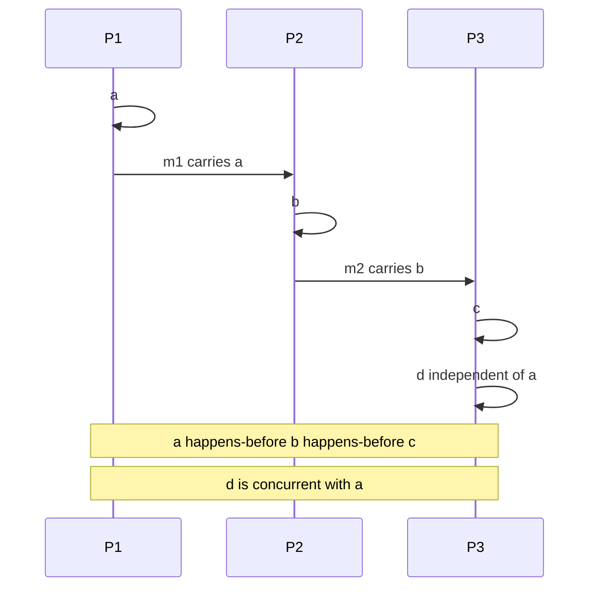
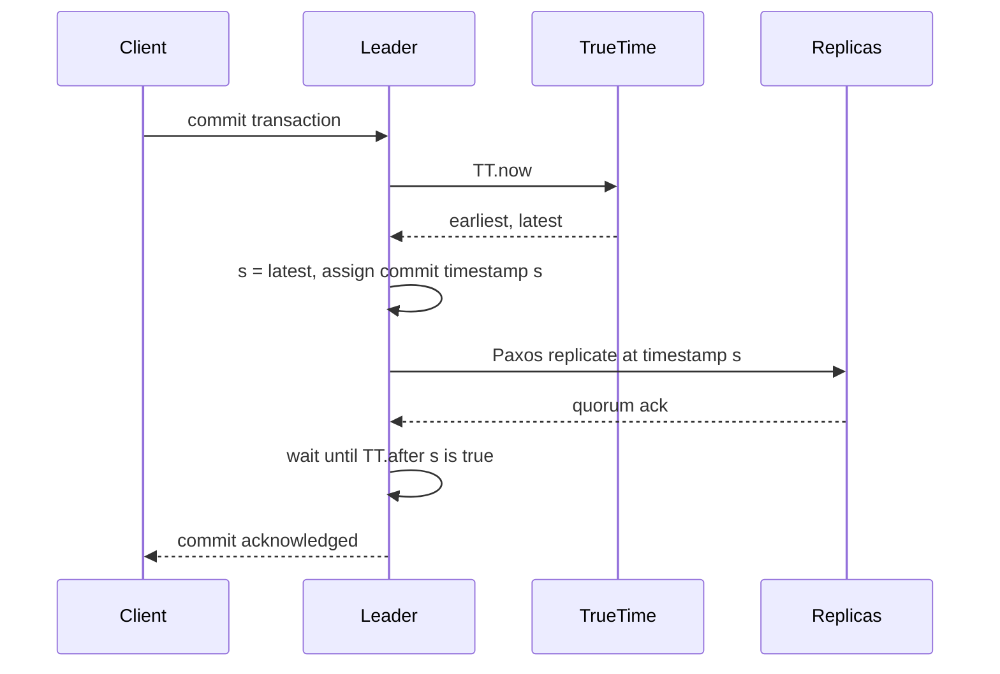
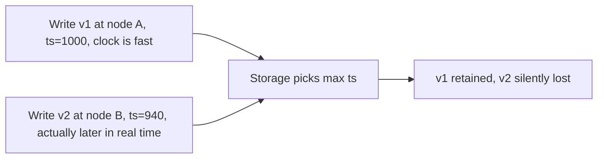

# F20 — Time, Clocks & Ordering

**Wall-clock time is a distributed system's most convincing liar: it looks authoritative, it is wrong by milliseconds to minutes, it can move backwards, and every design that uses it as an ordering primitive silently loses data.**

## Two Clocks, Two Jobs

Every machine exposes at least two clocks and they answer different questions.

| Property | Wall clock (realtime) | Monotonic clock |
| --- | --- | --- |
| POSIX call | `clock_gettime(CLOCK_REALTIME)` | `clock_gettime(CLOCK_MONOTONIC)` |
| Go | `time.Now()` wall reading | `time.Since`, `time.Now()` monotonic reading |
| Java | `System.currentTimeMillis()` | `System.nanoTime()` |
| Python | `time.time()` | `time.monotonic()` |
| Meaning | Seconds since the Unix epoch | Ticks since an arbitrary origin |
| Can jump backwards | **Yes** — NTP step, admin change, VM restore | No |
| Can jump forwards | Yes | Only by the elapsed amount |
| Comparable across machines | Approximately, within sync error | **No, never** |
| Slew-adjusted | Yes, rate is altered by NTP | `CLOCK_MONOTONIC` is slewed; `CLOCK_MONOTONIC_RAW` is not |
| Correct for | Timestamps for humans, expiry against external deadlines, log correlation | Timeouts, durations, rate limiting, latency measurement, lease arithmetic |

The rule is absolute: **measure durations with a monotonic clock, record wall-clock time only for display and coarse correlation**.

```go
// WRONG: a backward NTP step makes elapsed negative, and the timeout never fires
start := time.Now().UnixNano()
for time.Now().UnixNano()-start < timeoutNanos { /* ... */ }

// RIGHT: Go's time.Now carries a monotonic reading; Sub uses it
start := time.Now()
if time.Since(start) > timeout { /* ... */ }
```

!!! gotcha "Serialising a timestamp strips its monotonic reading"
    Symptom: a Go service that measures durations correctly in-process reports absurd values (negative, or decades) once timestamps pass through JSON, a database, or a gRPC message. Mechanism: `time.Time` carries a monotonic reading only in-process; marshalling, `time.Time.Round`, `UTC()`, and any wire encoding drop it, so `Sub` silently falls back to wall-clock arithmetic. Mitigation: never send a `time.Time` across a boundary and then subtract it; send an explicit duration, or compute the duration before serialising.

## Clock Synchronisation: NTP and PTP

| Protocol | Typical accuracy | Mechanism | Requirements |
| --- | --- | --- | --- |
| NTP over the public internet | 1–50 ms, worse under load | Software timestamps, four-timestamp offset calculation | None |
| NTP within a datacenter | 100 µs – 5 ms | Same, shorter and more symmetric paths | Local stratum-1 or stratum-2 servers |
| Chrony (vs `ntpd`) | Faster convergence, better on virtual machines | Improved filtering and slewing | Drop-in replacement |
| PTP (IEEE 1588) software timestamping | 10–100 µs | Master-slave sync messages | PTP daemon |
| PTP with hardware timestamping and boundary clocks | 100 ns – 1 µs | NIC-level timestamps, switches participate | PTP-capable NICs and switches end to end |
| White Rabbit / GPS per rack | Sub-100 ns | Dedicated timing distribution | Specialist hardware |
| AWS Time Sync with Nitro | Low microseconds | Local hardware reference on the hypervisor | Nitro instance types |

NTP's offset calculation assumes a **symmetric** path:

$$
\theta = \frac{(t_1 - t_0) + (t_2 - t_3)}{2}, \qquad \delta = (t_3 - t_0) - (t_2 - t_1)
$$

Any path asymmetry $a$ introduces an error of $a/2$ that NTP **cannot detect**. A congested uplink with a symmetric downlink produces a confidently reported, badly wrong offset. This is why serious systems use an uncertainty interval rather than a point estimate.

### Drift and Skew Magnitudes

Crystal oscillator drift is specified in parts per million.

| Oscillator quality | Drift | Error after 1 hour unsynchronised | After 24 hours |
| --- | --- | --- | --- |
| Typical server crystal | 20–50 ppm | 72–180 ms | 1.7–4.3 s |
| Temperature-compensated (TCXO) | 1–5 ppm | 3.6–18 ms | 86–432 ms |
| Oven-controlled (OCXO) | 0.01–0.1 ppm | 36–360 µs | 0.9–8.6 ms |
| Rubidium | 0.001 ppm | ~3.6 µs | ~86 µs |
| Virtualised guest under heavy steal | effectively unbounded | seconds | minutes |

Practical numbers to carry into an interview:

- A well-run fleet with local NTP: **offsets under 1 ms p99, with a long tail into tens of ms**.
- A typical cloud fleet without dedicated timing: **1–10 ms normally, hundreds of ms during incidents**.
- **Broken nodes exist in every fleet of meaningful size**: a stuck NTP daemon, a firewalled UDP 123, a bad upstream, or a VM restored from a snapshot. Assume some fraction of hosts are minutes wrong at any moment.

!!! gotcha "A single misconfigured node poisons LWW data across the whole cluster"
    Symptom: a subset of writes vanish permanently and the affected keys have nothing else in common. Mechanism: one node's clock is an hour fast, so every value it writes carries a future timestamp that wins last-write-wins comparisons against all subsequent correct writes until real time catches up. Mitigation: alert on per-node NTP offset and stratum, refuse to accept writes from a node whose offset exceeds a threshold, and prefer logical or hybrid clocks over wall clocks for conflict resolution.

## Leap Seconds and Smearing

UTC is occasionally adjusted by one second to track the Earth's rotation. A positive leap second means `23:59:60` exists — a value most software has never seen.

| Handling strategy | Behaviour | Consequence |
| --- | --- | --- |
| Step backwards | The clock repeats `23:59:59` | Time goes backwards; duplicate timestamps; ordering inverted |
| Kernel leap-second insertion | `CLOCK_REALTIME` freezes or repeats for one second | Historic Linux hrtimer bug caused CPU livelock in 2012 (Java, MySQL, Cassandra all affected) |
| Smearing | The second is spread across a window, typically 24 hours | The clock is never wrong by more than ~0.5 s, and never goes backwards |

Google's smear spreads the leap second linearly over 24 hours centred on the event, meaning the clock runs about 11.6 ppm slow (roughly $1/86400$) for a day. AWS uses a 24-hour linear smear as well. **Different smear implementations disagree with each other during the smear window**, so a node using a smeared NTP source and a node using a stepping source can be up to a second apart while both believe they are synchronised.

!!! warning "Never mix smeared and non-smeared NTP sources in one fleet"
    A pool containing both Google's smearing servers and a standard stepping pool gives NTP contradictory information. The daemon may oscillate, reject sources, or settle on a wrong offset. Pick one strategy fleet-wide and pin the sources explicitly.

The IERS has voted to abandon leap seconds by 2035, but negative leap seconds (the clock skipping a second) are now considered plausible due to changes in Earth's rotation — and essentially no software has ever been tested against one.

## VM Live Migration and Clock Jumps

Live migration pauses the guest, transfers the final memory delta, and resumes it elsewhere. The guest experiences:

- A **blackout window**, commonly 50–500 ms, occasionally seconds under memory pressure.
- A resumed `CLOCK_MONOTONIC` that did not advance during the pause on some hypervisor and guest configurations, or that jumps by the pause duration on others.
- A `CLOCK_REALTIME` that is now wrong by the pause duration until the guest's timekeeping resynchronises, which can take tens of seconds under a slewing daemon.
- TSC frequency changes if the destination host has a different CPU, unless the hypervisor provides an invariant, scaled TSC.

Related hazards in the same family:

| Event | Effect | Typical magnitude |
| --- | --- | --- |
| VM live migration | Pause plus clock resync | 50 ms – 5 s |
| VM snapshot restore | Wall clock resumes at the snapshot time | Minutes to months |
| Hypervisor CPU steal | Process frozen while the clock advances | 10 ms – seconds |
| cgroup CPU throttling | Same, in containers with low CPU quota | 10 ms – hundreds of ms |
| Stop-the-world GC | Process frozen | Sub-ms – tens of seconds |
| Swap thrash or page-fault storm | Process effectively frozen | Seconds |
| `fsync` stall on a degraded disk | Thread blocked | Seconds to minutes |

**All of these are indistinguishable from the outside**, and all of them break any correctness argument that assumes "not much time passed between these two lines of code". That is the root of the lease and fencing problem in [F19 Concurrency Control](f19-concurrency-control.md) and [F11 Idempotency & Exactly-Once](f11-idempotency.md).

## Happens-Before and Logical Clocks

Lamport defined the **happens-before** relation $a \to b$ as the smallest relation such that:

1. If $a$ and $b$ are in the same process and $a$ precedes $b$, then $a \to b$.
2. If $a$ is the send of a message and $b$ is its receipt, then $a \to b$.
3. Transitivity: if $a \to b$ and $b \to c$ then $a \to c$.

If neither $a \to b$ nor $b \to a$, the events are **concurrent**, written $a \parallel b$. Concurrency here is a causal statement, not a temporal one: two events can be concurrent even though one happened hours after the other in real time, because no information flowed between them.



### Lamport Clocks

Each process keeps a counter $L$.

```text
on local event:            L = L + 1
on send:                   L = L + 1; attach L to the message
on receive(msg):           L = max(L, msg.L) + 1
```

Guarantee: $a \to b \implies L(a) < L(b)$.

**The converse does not hold.** $L(a) < L(b)$ tells you nothing about causality — the events may be concurrent. Lamport clocks give a total order (break ties by node ID) that is *consistent with* causality, which is exactly what you need for state-machine replication or a mutual-exclusion protocol, and not enough for conflict detection.

### Vector Clocks

Each process keeps a vector $V$ of length $n$.

```text
on local event at i:       V[i] = V[i] + 1
on send at i:              V[i] = V[i] + 1; attach V
on receive at i:           V[j] = max(V[j], msg.V[j]) for all j; V[i] = V[i] + 1
```

Comparison:

- $V_a < V_b$ (all components $\le$, at least one $<$) means $a \to b$.
- Neither dominates means **concurrent** — a genuine conflict.

Now the converse *does* hold: $a \to b \iff V_a < V_b$. Vector clocks detect concurrency exactly, which is why Dynamo used them to surface sibling versions to the application.

**The size problem**: a vector clock is $O(n)$ where $n$ is the number of writers that have ever touched the key. Consequences:

| Problem | Detail | Mitigation |
| --- | --- | --- |
| Unbounded growth | Every distinct client that writes adds an entry | Version vectors keyed by *server*, not client — Riak's dotted version vectors |
| Metadata larger than the value | Common for small values with many writers | Truncate with an LRU plus a timestamp, accepting false conflicts |
| Truncation is unsafe | Dropping an entry can make a causally-later value look concurrent | Keep a per-entry timestamp so truncation only creates false conflicts, never false causality |
| Node churn | Ephemeral nodes leave permanent entries | Use stable IDs, garbage collect by age |

| Clock type | Size | Detects concurrency | Comparable to wall time | Typical use |
| --- | --- | --- | --- | --- |
| Wall clock | 8 B | No | Yes | Display, coarse LWW |
| Lamport | 8 B | No | No | Total order consistent with causality |
| Vector clock | $O(n)$ | **Yes** | No | Conflict detection, Dynamo siblings |
| Version vector (per server) | $O(\text{replicas})$ | Yes | No | Riak, Voldemort |
| Interval tree clock | Adaptive | Yes | No | Dynamic membership, research-adjacent |
| Hybrid logical clock | 16 B | Partially, causally consistent | **Yes, within $\epsilon$** | CockroachDB, YugabyteDB, MongoDB |
| TrueTime interval | 16 B plus API | N/A, provides external consistency | Yes, with bounded uncertainty | Spanner |

### Hybrid Logical Clocks

HLC combines a physical component with a logical counter so that timestamps are both causally correct and close to wall-clock time.

```python
class HLC:
    def __init__(self):
        self.l = 0   # physical component, milliseconds
        self.c = 0   # logical counter

    def now(self) -> tuple[int, int]:
        pt = physical_clock_ms()
        prev_l = self.l
        self.l = max(prev_l, pt)
        self.c = self.c + 1 if self.l == prev_l else 0
        return (self.l, self.c)

    def update(self, m_l: int, m_c: int) -> tuple[int, int]:
        pt = physical_clock_ms()
        prev_l = self.l
        self.l = max(prev_l, m_l, pt)
        if self.l == prev_l == m_l:
            self.c = max(self.c, m_c) + 1
        elif self.l == prev_l:
            self.c += 1
        elif self.l == m_l:
            self.c = m_c + 1
        else:
            self.c = 0
        return (self.l, self.c)
```

Properties:

- $a \to b \implies \text{HLC}(a) < \text{HLC}(b)$, like a Lamport clock.
- $|\text{HLC}.l - \text{physical time}|$ stays bounded by the maximum clock offset $\epsilon$ in the system, so the timestamp is human-meaningful.
- Fixed 64+16 bit size, so no vector-clock growth.
- Does **not** guarantee external consistency: two causally unrelated transactions can receive timestamps in an order that contradicts real time by up to $\epsilon$.

CockroachDB uses HLC plus an **uncertainty interval**: a read at timestamp $t$ that encounters a value in $(t, t+\epsilon]$ cannot tell whether that write really happened before or after, so it restarts the transaction at a higher timestamp. That is why `max_offset` is a hard configuration parameter and why a node whose offset exceeds it **self-terminates** rather than risk a consistency violation.

## Spanner TrueTime and Commit-Wait

TrueTime replaces a point-in-time reading with an **interval** guaranteed to contain the true time.

```text
TT.now() -> [earliest, latest]     with latest - earliest = 2 * epsilon
TT.after(t)  -> true if t has definitely passed
TT.before(t) -> true if t has definitely not yet arrived
```

$\epsilon$ is derived from GPS receivers and atomic clocks in every datacenter, a time-master election, and a conservative drift assumption of 200 ppm between synchronisations every 30 seconds. Reported $\epsilon$ is typically 1–7 ms, sawtoothing as the local drift allowance accumulates and resets on each sync.

### Commit-Wait



The leader picks the commit timestamp $s = \text{TT.now().latest}$ and then **waits until $s$ is definitely in the past** before releasing locks and acknowledging. The wait is on average $2\epsilon$.

Why this works: if transaction $T_1$ commits before $T_2$ starts in real time, then $T_1$ has already waited out its uncertainty, so $s_1$ is definitely in the past when $T_2$ picks $s_2 \ge \text{now}$. Therefore $s_1 < s_2$, and timestamp order matches real-time order — **external consistency**, also called linearizability, at global scale.

The trade-off is explicit and quantifiable:

$$
\text{write latency} \ge \text{Paxos quorum RTT} + 2\epsilon
$$

Halving $\epsilon$ directly halves the commit-wait cost, which is why Google invested in datacenter-grade timing hardware. It is a case of **buying a better clock to buy lower latency**, and it is the cleanest example of infrastructure investment changing what a distributed algorithm can guarantee.

| System | Clock strategy | Consistency achieved | Cost |
| --- | --- | --- | --- |
| Spanner | TrueTime with hardware $\epsilon$ | External consistency | $2\epsilon$ commit-wait, specialist hardware |
| CockroachDB | HLC with `max_offset` | Serializable, not external consistency | Transaction restarts on uncertainty, node suicide on drift |
| YugabyteDB | HLC, optionally with a clock service | Serializable / snapshot | Similar to CockroachDB |
| MongoDB | HLC for causal consistency | Causal consistency with sessions | Session tokens must be carried by clients |
| Cassandra (LWW) | Wall clock timestamps | Eventual, with silent loss | Data loss on skew |
| Dynamo / Riak | Vector clocks | Eventual with sibling detection | Application must merge siblings |

!!! gotcha "Uncertainty restarts turn a clock problem into a mysterious latency problem"
    Symptom: p99 transaction latency in CockroachDB rises and `restarts_serializable` climbs, with no change in workload. Mechanism: an increase in measured clock offset widens the uncertainty interval, so more reads encounter values inside it and must restart at a higher timestamp. Mitigation: monitor `clock_offset_meannanos` per node, keep NTP sources local and consistent, and treat clock offset as a latency SLI, not just a hygiene metric.

## Timestamps Are Not IDs

Using a timestamp as an identifier fails in at least four distinct ways:

| Failure | Mechanism | Consequence |
| --- | --- | --- |
| Collision | Two events in the same clock tick | Duplicate IDs, silent overwrites |
| Non-uniqueness across nodes | Two nodes generate the same millisecond | Cross-node duplicates |
| Backwards jumps | NTP step, leap second, VM restore | ID reuse, ordering inversion |
| Enumerable and informative | Leaks creation time and creation rate | Competitors can estimate your volume; the "German tank problem" applies |

The correct constructions add a node component and a sequence:

| Scheme | Layout | Properties |
| --- | --- | --- |
| Snowflake | 41-bit ms timestamp, 10-bit node, 12-bit sequence | Sortable, 4096 IDs/ms/node, needs unique node IDs |
| ULID | 48-bit ms timestamp, 80-bit randomness | Sortable, no coordination, 128 bits |
| UUIDv7 | 48-bit ms timestamp, then random | Sortable, standardised, index-friendly |
| UUIDv4 | 122 random bits | No coordination, terrible index locality on B-trees |
| Database sequence | Monotonic integer | Perfectly ordered, single point of allocation |
| HLC as an ID | Physical plus logical plus node | Sortable and causally meaningful |

!!! gotcha "Snowflake generators stall or duplicate when the clock steps backwards"
    Symptom: ID generation halts with "clock moved backwards" errors, or worse, duplicate IDs appear. Mechanism: the generator refuses to issue IDs for a timestamp it has already used; if it instead trusts the clock, a backward step re-issues the same timestamp-sequence combination. Mitigation: read from a monotonic source or persist the last-issued timestamp and refuse to go backwards, block for small backward steps and alarm for large ones, and disable NTP stepping in favour of slewing on ID-generating hosts.

## Last-Write-Wins Data Loss

LWW resolves conflicts by comparing timestamps and discarding the loser. The discarded write is **gone with no record**. Every one of these produces silent loss:

1. **Clock skew.** Node A is 200 ms fast. A write on A at real time $t$ beats a genuinely later write on B at $t + 100\text{ms}$.
2. **Concurrent writes to different fields.** Two clients update different fields of the same document; the whole document is replaced, so one field's change disappears.
3. **Ties.** Two writes land in the same millisecond; the tiebreak (often node ID or value comparison) discards one arbitrarily.
4. **Retry inversion.** A retried write carries a fresh timestamp and clobbers a newer write that succeeded in between.
5. **Delete versus write races.** A tombstone with a later timestamp erases a write that the user believes succeeded.



Alternatives, in increasing order of application effort:

| Strategy | Loss | Application burden |
| --- | --- | --- |
| LWW on wall clock | Silent, unbounded | None |
| LWW on HLC | Bounded by $\epsilon$, still silent | None |
| Vector clocks with siblings | None; conflicts surfaced | Must write a merge function |
| CRDTs | None; merge is defined by the type | Must model state as a CRDT |
| Single-writer per key | None; no conflicts exist | Partitioning and routing |
| Consensus per key | None | Latency and cost |

!!! warning "LWW is acceptable only when losing a write is acceptable"
    Cache entries, presence, and telemetry are fine. Shopping carts, account balances, permissions, and anything a user typed are not. Cassandra's LWW is a documented, deliberate design choice — it becomes a bug when applied to data whose loss matters.

## Ordering Guarantees in Logs and Queues

| System | Ordering guarantee | Scope | Caveats |
| --- | --- | --- | --- |
| Kafka | Total order within a partition | Per partition | No ordering across partitions; a key change moves a record to another partition |
| Kafka with retries | Can reorder | Per partition | Requires idempotent producer or `max.in.flight=1` to preserve order |
| SQS standard | None | — | Best-effort ordering only; expect reordering |
| SQS FIFO | Total order within a message group | Per message group ID | 300 TPS per group without batching; 3000 with |
| RabbitMQ | FIFO per queue with one consumer | Per queue | Multiple consumers or requeue-on-nack breaks order |
| Pulsar | Per partition, or per key with key-shared subscription | Partition or key | Key-shared preserves per-key order across consumers |
| Kinesis | Per shard | Per shard | Resharding changes the mapping |
| Postgres logical replication | Commit order | Per publication | Reflects commit order, not statement order |

The recurring rule: **ordering is guaranteed within a partition or key, never globally**, and the moment you parallelise consumers you must re-establish ordering at the application level.

Practical consequences:

- Pick the partition key to be the entity whose ordering matters (`user_id`, `account_id`, `order_id`), not something that spreads evenly but scatters causality.
- Changing an entity's partition key mid-stream reorders its history relative to itself. Treat a repartition as a data migration with a drain.
- Retries reorder. A message that fails and goes to a retry topic reappears after messages that were originally behind it.
- If a consumer must apply updates in order but receives them out of order, carry a version and **discard stale updates** rather than applying them: `UPDATE ... WHERE version < :incoming_version`.

!!! gotcha "Sorting log records by timestamp across hosts produces a fictional history"
    Symptom: a trace or log view shows a response before its request, or a child span starting before its parent. Mechanism: each host stamped the event with its own wall clock and the hosts differ by milliseconds; sorting merges two independently-skewed timelines. Mitigation: correlate by trace and span IDs and causal parentage rather than timestamps, keep clock offset as a per-host metric so you can bound the error, and never compute cross-host durations by subtracting two wall-clock timestamps.

## Timeout Correctness

A timeout is a **duration**, so it must be measured with a monotonic clock. A deadline propagated across a network is an **absolute wall-clock instant**, so it inherits both hosts' clock error.

| Pattern | Clock | Failure if wrong |
| --- | --- | --- |
| Local timeout / retry backoff | Monotonic | Backward step makes it never fire; forward step fires instantly |
| Lease expiry, checked by the holder | Monotonic, with margin | Two holders — see fencing |
| Deadline propagated over RPC | Relative remaining time, not an absolute instant | Skew makes the callee think the deadline already passed, or never does |
| Token or certificate expiry | Wall clock, unavoidable | A skewed client rejects valid tokens or accepts expired ones |
| Cache TTL | Monotonic for local, wall clock for HTTP `Expires` | Skew causes premature or indefinite caching |
| Cron and scheduled jobs | Wall clock, unavoidable | Duplicate or skipped runs around DST and leap seconds |

gRPC gets this right by transmitting `grpc-timeout` as a **relative duration** that each hop decrements, rather than an absolute deadline — this is immune to clock skew between caller and callee. HTTP's `Expires` header gets it wrong, which is why `Cache-Control: max-age` (relative) is preferred.

```python
# Deadline propagation done correctly: send remaining time, not an instant.
deadline = time.monotonic() + 2.0
def call_downstream():
    remaining = deadline - time.monotonic()
    if remaining <= 0:
        raise DeadlineExceeded()
    return rpc(timeout_seconds=remaining)   # callee starts its own monotonic timer
```

JWT and TLS validation must use wall-clock time, so a client whose clock is wrong by more than the token's clock-skew allowance (commonly 30–300 seconds) will reject every token it is given. This is one of the most common "it works on my machine" failures in the wild.

## Gotchas & Corner Cases

!!! gotcha "A lease evaluated against wall-clock time plus a backwards NTP step extends the lease forever"
    Symptom: a node holds a lock long past its TTL while the lock service considers it expired; two workers act on the same resource. Mechanism: the holder computed `expiry = time.time() + ttl` and an NTP step moved the wall clock backwards, so its local comparison never fires. Mitigation: compute all lease arithmetic with `CLOCK_MONOTONIC`, subtract a safety margin covering the maximum observed pause, and rely on fencing tokens at the storage layer for actual safety.

!!! gotcha "Cassandra client-side timestamps let a slow client overwrite newer data"
    Symptom: a value reverts to an older state minutes after being updated. Mechanism: Cassandra accepts a client-supplied `USING TIMESTAMP`; a client with a fast clock, or a delayed retry carrying its original timestamp, wins the LWW comparison against later writes. Mitigation: use server-side timestamps, or centralise timestamp assignment; and never retry a write with a stale client timestamp.

!!! gotcha "Deleting and immediately re-inserting the same key loses the insert"
    Symptom: a row that was deleted and re-created is missing after a repair or compaction. Mechanism: in LWW stores, deletion is a tombstone with a timestamp; if the re-insert lands with an equal or earlier timestamp — same millisecond, or a skewed node — the tombstone wins. Mitigation: use a new key rather than reusing one, ensure timestamp granularity is finer than your write rate, and never reuse identifiers for logically distinct entities.

!!! gotcha "Tombstone GC grace period versus a partition longer than it"
    Symptom: deleted data reappears, permanently. Mechanism: a replica that was down or partitioned for longer than `gc_grace_seconds` never received the tombstone; after GC, the tombstone is gone from the other replicas, so the surviving old value wins the next repair and resurrects. Mitigation: alert when a node has been down for a meaningful fraction of the grace period, refuse to rejoin a node past that threshold without a full rebuild, and treat this as a documented runbook decision.

!!! gotcha "Rate limiters keyed on wall-clock windows double the allowance across a clock step"
    Symptom: a burst of exactly twice the configured limit passes through, correlated with NTP corrections. Mechanism: a fixed-window limiter computing the bucket as `floor(time.time() / window)` sees the window index move backwards or skip, resetting the counter early. Mitigation: use monotonic time for local windows, or a token bucket whose refill is computed from monotonic elapsed time; for distributed limiters, let the shared store own the clock.

!!! gotcha "Certificate and JWT validation fails on hosts whose clock is minutes off"
    Symptom: one host in a fleet rejects all inbound tokens with "token used before issued" or "expired", while identical hosts work fine. Mechanism: `nbf` and `exp` are absolute wall-clock claims; a host whose clock is outside the allowed skew rejects everything. Mitigation: monitor NTP offset as a fleet-wide SLI with a hard alert threshold, fail health checks when offset exceeds the token skew allowance, and prefer short-lived tokens with generous skew tolerance over long ones with tight tolerance.

!!! gotcha "Two nodes generate the same Snowflake ID after a node-ID collision"
    Symptom: primary key violations, or worse, silent overwrites where the key is not enforced unique. Mechanism: node IDs were assigned from an environment variable, a hostname hash, or a pod ordinal that was reused after a rescheduling event, so two live processes share one node ID. Mitigation: allocate node IDs from a coordination service with a lease, verify uniqueness at startup by registering the ID, and refuse to start on conflict.

!!! gotcha "Vector clock truncation converts a real causal relationship into a false conflict, or worse"
    Symptom: unexplained sibling explosion, or a causally-later value being treated as concurrent and merged incorrectly. Mechanism: to bound size, entries are dropped; if the dropped entry carried the causal evidence, comparison misclassifies the pair. Mitigation: use dotted version vectors keyed by server rather than client, attach a timestamp per entry so pruning is biased toward old entries, and design the merge function to be safe under false conflicts.

!!! gotcha "Daylight saving and time zones inside stored data"
    Symptom: an hourly job runs twice or not at all once a year; a duration computed across a DST boundary is off by an hour; a `TIMESTAMP WITHOUT TIME ZONE` column becomes ambiguous. Mechanism: local civil time is not monotonic and not unique — 01:30 occurs twice in the autumn transition. Mitigation: store UTC exclusively (`timestamptz`), convert at the presentation layer, keep the tz database updated, and schedule critical jobs in UTC.

!!! gotcha "Monotonic clocks are not comparable across processes or after reboot"
    Symptom: a distributed algorithm that compares monotonic readings from different hosts produces nonsense. Mechanism: `CLOCK_MONOTONIC`'s origin is arbitrary and per-boot; on Linux it also does not advance during suspend, while `CLOCK_BOOTTIME` does. Mitigation: use monotonic readings only for local durations; for cross-host ordering use logical, hybrid, or consensus-assigned timestamps.

## SRE Lens

### SLIs and SLOs

| Signal | Definition | Target guidance | Why |
| --- | --- | --- | --- |
| NTP offset per host | Estimated offset from the reference | p99 < 10 ms, alert > 100 ms | The root input to every clock-dependent guarantee |
| NTP stratum and reachability | Sync source health | Stratum <= 3, reachability full | Detects a silently unsynchronised host |
| Time since last successful sync | Age of the last correction | < 5 minutes | Drift compounds at 20–50 ppm |
| Clock step events | Count of non-slew corrections | 0 | Every step is a potential ordering violation |
| Max fleet-wide offset spread | Max minus min across hosts | Below your `max_offset` config | Bounds HLC uncertainty and LWW risk |
| Uncertainty-restart rate | Transaction restarts caused by clock uncertainty | Baseline, alert on deviation | Direct latency cost of clock error |
| GC pause p999 | Longest stop-the-world pause | Below the lease TTL margin | The lease-safety input |
| CPU steal and throttled time | Hypervisor or cgroup interference | Near zero | Same pause hazard as GC |
| Consumer reorder rate | Out-of-order messages detected by version checks | Baseline it | Confirms ordering assumptions hold |

### Failure Modes and Detection

| Failure | Symptom | Detection | First response |
| --- | --- | --- | --- |
| One host unsynchronised | Data loss on LWW keys, token rejections | Per-host offset alert | Drain the host, fix the sync source, then audit affected writes |
| NTP source unreachable | Slow drift across the whole fleet | Reachability plus time-since-sync | Fail over to a secondary source; alert before drift matters |
| Mixed smear and step sources | Oscillating offsets, source rejection | Offset variance per host | Pin a single source strategy fleet-wide |
| VM migration burst | Correlated latency spikes and clock jumps | Steal time plus step events | Correlate with the provider's maintenance events |
| Leap second | Lock-ups, CPU spikes, duplicate timestamps | Calendar awareness plus offset monitoring | Verify smearing config well in advance; freeze changes over the window |
| Clock-driven ID stall | ID generation errors | Generator error rate | Confirm the generator refuses to reuse timestamps rather than duplicating |

### Rollout and Migration Risk

- Migrating from wall-clock LWW to HLC or vector clocks is a **data format change**; run dual-write and dual-read with a comparison period before switching the authority.
- Changing NTP sources is a fleet-wide change: roll it out canary-first and watch offset variance, not just offset.
- Enabling leap-second smearing must be done fleet-wide and well ahead of any announced event; a partial rollout is worse than none.
- Changing a Kafka partition key changes ordering for every affected entity. Drain, switch, and backfill deliberately; do not do it live.
- Tightening `max_offset` in an HLC database increases the risk of node self-termination; loosening it increases uncertainty restarts. Measure actual offsets first.

### Capacity Signals

- Commit-wait cost is $2\epsilon$ per transaction; if $\epsilon$ doubles, global write throughput per leader roughly halves for short transactions.
- Vector clock metadata can exceed the value size for small records; measure the metadata-to-payload ratio.
- Dedicated time appliances (GPS plus PTP grandmaster per site) are inexpensive relative to the latency and consistency benefit at scale.
- Ordered queues throttle per key or group: SQS FIFO's 300 messages per second per group is a hard capacity boundary that surprises people at design review.

### On-Call Runbook Notes

- Any incident involving "impossible" ordering, disappearing writes, or auth failures on a subset of hosts: **check clock offset first**. It takes 30 seconds and resolves a surprising fraction of them.
- `chronyc tracking` and `chronyc sources -v` (or `ntpq -p`) belong at the top of the runbook.
- Never `date -s` on a production host. Use `chronyc makestep` if you must step, and understand that any process holding a lease or generating IDs must be restarted after.
- Record clock offset alongside every incident timeline; it changes how you interpret the logs.
- After a VM migration or host maintenance event, verify that timestamp-generating services resynchronised before trusting their output.

### Cost

- GPS or atomic references with PTP distribution: a few thousand dollars per site, versus the latency saved by shrinking $\epsilon$ across every transaction.
- Cloud-provided high-accuracy time (AWS Time Sync, Azure/GCP equivalents) is free and materially better than public NTP. Use it.
- Vector clock metadata and sibling storage cost real bytes and real read amplification.
- The cost of a clock incident is typically silent data loss discovered weeks later, which is the most expensive class of bug there is.

## Interview Angle

!!! interview "Probe: why can't you just use timestamps to order events across servers?"
    **Weak**: "Because clocks can be slightly off."

    **Strong**: "Because clock offset in a real fleet is milliseconds at p99 and can be minutes on a broken host, so a timestamp comparison can invert the true order of two events. Worse, wall clocks can move backwards on an NTP step, a leap second, or a VM restore, so timestamps are not even monotonic locally. For ordering I would use logical clocks: Lamport for a total order consistent with causality, vector clocks when I need to detect concurrency, or HLC when I want causal correctness plus a human-meaningful value. If I need external consistency I need bounded uncertainty and commit-wait, which is what Spanner buys with TrueTime."

!!! interview "Probe: what is the difference between a Lamport clock and a vector clock?"
    **Weak**: "Vector clocks are bigger."

    **Strong**: "Lamport gives $a \to b \implies L(a) < L(b)$ but not the converse, so a smaller counter does not mean causally earlier — you cannot detect concurrency. Vector clocks give the biconditional, so if neither vector dominates, the events are genuinely concurrent and you have a real conflict. The price is $O(n)$ size in the number of writers, which grows unboundedly with client churn; that is why Riak moved to dotted version vectors keyed by server, and why HLC is popular when you only need causal ordering rather than conflict detection."

!!! interview "Probe: explain TrueTime and commit-wait."
    **Weak**: "Spanner uses atomic clocks so its time is accurate."

    **Strong**: "TrueTime returns an interval rather than an instant, guaranteed to contain the true time, with a half-width $\epsilon$ of a few milliseconds derived from GPS and atomic clocks plus a conservative drift bound. On commit, the leader picks the latest bound as the timestamp and then waits until that timestamp is definitely in the past before releasing locks — about $2\epsilon$. That guarantees any transaction that starts after a commit gets a strictly larger timestamp, so timestamp order matches real-time order: external consistency. The cost is that every write pays $2\epsilon$ on top of the Paxos quorum RTT, which is why shrinking $\epsilon$ with better hardware directly buys lower latency."

!!! interview "Probe: your distributed cache uses LWW. What could go wrong?"
    **Weak**: "Nothing much, it is a cache."

    **Strong**: "For a pure cache, LWW is fine because losing a write just costs a miss. The danger is when LWW leaks into anything authoritative. A single node with a fast clock writes future timestamps that beat every subsequent correct write until real time catches up, and the losing writes are discarded with no record. There are also field-level losses if the whole object is replaced, and tie-breaking that discards arbitrarily. If loss matters, I would use vector clocks with application-level merge, CRDTs, or a single-writer-per-key design."

!!! interview "Probe: how do you implement a correct timeout?"
    **Weak**: "Record `time.time()` and compare."

    **Strong**: "Durations must use a monotonic clock, because the wall clock can step backwards and make the timeout never fire. For deadlines that cross a network boundary I would propagate the **remaining duration**, not an absolute instant, so the callee starts its own monotonic timer — that is what gRPC does, and it is immune to skew between the two hosts. Wall-clock time is unavoidable for token and certificate expiry, so those hosts need tight offset monitoring with a health check that fails when the offset exceeds the allowed skew."

??? note "Rapid-fire follow-ups to rehearse"
    - Which clock for a lease, and why does it still not make the lease safe?
    - What is happens-before, and can two events be concurrent if one occurred hours later?
    - Why can't you compare `CLOCK_MONOTONIC` readings across two machines?
    - What is leap smearing, and what breaks if half your fleet smears?
    - Why does CockroachDB kill a node whose offset exceeds `max_offset`?
    - What ordering does Kafka guarantee, and what breaks it?
    - What is wrong with a fixed-window rate limiter across an NTP correction?
    - How would you detect that a single host's clock caused data loss last week?

## Key Takeaways

- Wall clocks and monotonic clocks answer different questions: durations, timeouts, and lease arithmetic are always monotonic; wall clock is only for display, external deadlines, and coarse correlation.
- Real-world offsets are milliseconds at p99 with a tail into minutes, and some host in any large fleet is badly wrong right now; design for that rather than for the average.
- NTP cannot detect path asymmetry, so a point-estimate offset is always optimistic; bounded-uncertainty designs are strictly more honest.
- Happens-before is causal, not temporal; Lamport clocks order consistently with causality, vector clocks additionally detect concurrency at $O(n)$ size, and HLC gives causal ordering in constant size with a wall-clock-meaningful value.
- TrueTime's commit-wait converts clock uncertainty into latency, buying external consistency for $2\epsilon$ per write — better clocks literally buy lower latency.
- Last-write-wins discards data silently, and clock skew, field-level races, ties, and retry inversion all cause it; use it only where losing a write is acceptable.
- Timestamps make bad identifiers: use Snowflake, ULID, or UUIDv7, and make the generator refuse to reuse a timestamp after a backward step.
- Ordering guarantees in logs and queues are per partition or per key, never global; retries reorder, and repartitioning is a data migration.
- Pauses from GC, live migration, steal, throttling, and fsync stalls are indistinguishable and routinely exceed lease TTLs, which is why fencing tokens rather than clocks are the safety mechanism.

## Further Reading

- Leslie Lamport, *Time, Clocks, and the Ordering of Events in a Distributed System* (CACM 1978) — happens-before and logical clocks.
- Colin Fidge, *Timestamps in Message-Passing Systems That Preserve the Partial Ordering* (1988), and Friedemann Mattern, *Virtual Time and Global States of Distributed Systems* (1988) — vector clocks.
- Kulkarni, Demirbas, Madappa, Avva and Leone, *Logical Physical Clocks and Consistent Snapshots in Globally Distributed Databases* (2014) — the HLC paper.
- Corbett et al., *Spanner: Google's Globally-Distributed Database* (OSDI 2012) — TrueTime and commit-wait.
- Demirbas et al. and the CockroachDB design documents on HLC plus uncertainty intervals.
- DeCandia et al., *Dynamo: Amazon's Highly Available Key-value Store* (SOSP 2007) — vector clocks and sibling reconciliation in production.
- Almeida, Baquero and Fonte, *Dotted Version Vectors: Logical Clocks for Optimistic Replication* (2010) — the fix for client-churn growth.
- Kyle Kingsbury, *Jepsen: Cassandra* and the wider Jepsen series, for concrete demonstrations of clock-driven data loss.
- Google's public write-ups on leap smear, and the AWS documentation on Time Sync Service and leap second handling.
- IEEE 1588 (PTP) standard overview, and the Meta and Google engineering posts on datacenter-scale PTP deployment.
- Martin Kleppmann, *Designing Data-Intensive Applications*, Chapters 5, 8 and 9.

---

Related: [F07 Replication & Consistency](f07-replication-consistency.md) · [F09 Consensus](f09-consensus.md) · [F10 Distributed Transactions](f10-distributed-transactions.md) · [F11 Idempotency & Exactly-Once](f11-idempotency.md) · [F19 Concurrency Control](f19-concurrency-control.md)
