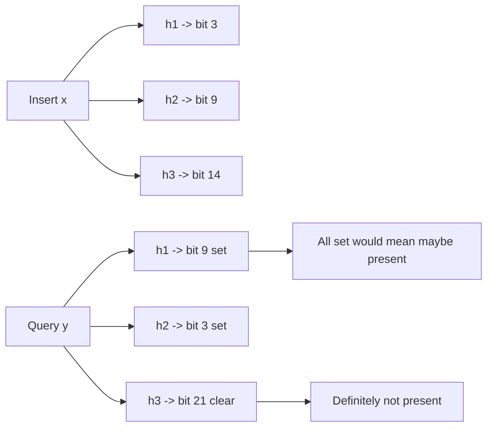
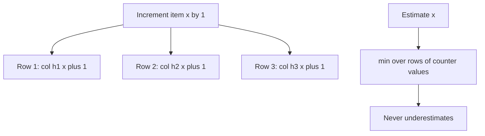
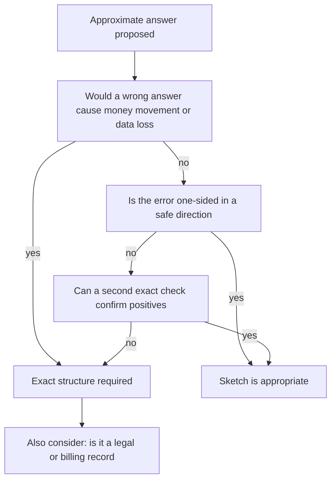

# F21 — Probabilistic Data Structures

**Sketches trade a bounded, quantifiable error for an unbounded saving in memory — the engineering skill is knowing exactly which error you are buying, in which direction it points, and where that error becomes unacceptable.**

## The Trade in One Table

| Structure | Answers | Memory | Error type | Mergeable | Deletes |
|---|---|---|---|---|---|
| Bloom filter | Set membership | $\approx 1.44 \log_2(1/\epsilon)$ bits/item | One-sided: false positives only | Yes, same params | No |
| Counting Bloom | Set membership | 4x a Bloom filter | False positives; counter overflow | Yes | Yes |
| Scalable Bloom | Membership, unknown $n$ | Grows in stages | Bounded compound FPR | Awkward | No |
| Cuckoo filter | Membership | ~$\log_2(1/\epsilon) + 3$ bits/item | False positives | No | Yes |
| Quotient filter | Membership | Similar to Cuckoo | False positives | Yes, resizable | Yes |
| HyperLogLog | Distinct count | 12 KB for 1.6% error | Two-sided, relative | Yes, lossless union | No |
| Count-Min Sketch | Frequency of an item | $\frac{e}{\epsilon} \times \ln\frac{1}{\delta}$ counters | One-sided: overestimates | Yes | With conservative care |
| Count Sketch | Frequency | Similar | Unbiased, two-sided | Yes | Yes |
| Space-Saving | Top-k heavy hitters | $O(k)$ | Overestimates counts, may miss true top-k | Approximately | No |
| t-digest | Quantiles | ~$5\delta$ centroids, few KB | Relative at the tails | Yes | No |
| DDSketch | Quantiles | Buckets per relative accuracy | Guaranteed relative error | Yes | No |
| MinHash | Jaccard similarity | $k$ hashes per set | Standard error $1/\sqrt{k}$ | Yes | No |
| SimHash | Cosine similarity | 64 bits per document | Depends on bit width | No | No |
| Reservoir sample | Uniform sample | $k$ items | Sampling variance | Weighted merge | No |

## Bloom Filters

A Bloom filter is a bit array of size $m$ with $k$ independent hash functions. Insert sets $k$ bits; query checks whether all $k$ bits are set. A negative answer is definitive; a positive answer may be wrong.



### The Math

After inserting $n$ items into $m$ bits with $k$ hashes, the probability a specific bit is still zero is

$$
P(\text{bit} = 0) = \left(1 - \frac{1}{m}\right)^{kn} \approx e^{-kn/m}
$$

so the false positive rate is

$$
\epsilon \approx \left(1 - e^{-kn/m}\right)^{k}
$$

Minimising over $k$ gives the optimal number of hash functions and the resulting bit requirement:

$$
k^{*} = \frac{m}{n}\ln 2 \approx 0.693\,\frac{m}{n}, \qquad
m = -\frac{n \ln \epsilon}{(\ln 2)^2} \approx -2.081\, n \ln \epsilon
$$

At the optimum the filter is exactly half full of set bits, and each item costs

$$
\frac{m}{n} = \frac{\log_2(1/\epsilon)}{\ln 2} \approx 1.44 \log_2 \frac{1}{\epsilon} \ \text{bits}
$$

**The memory is independent of item size.** Storing 1 billion 200-byte URLs exactly needs ~200 GB; a Bloom filter at 1% FPR needs 1.19 GB.

### Sizing Table

| Target FPR | Bits/item | $k^{*}$ | 1M items | 100M items | 1B items |
|---|---|---|---|---|---|
| 10% | 4.8 | 3 | 0.6 MB | 60 MB | 600 MB |
| 1% | 9.6 | 7 | 1.2 MB | 120 MB | 1.2 GB |
| 0.1% | 14.4 | 10 | 1.8 MB | 180 MB | 1.8 GB |
| 0.01% | 19.2 | 13 | 2.4 MB | 240 MB | 2.4 GB |
| 0.001% | 24.0 | 17 | 3.0 MB | 300 MB | 3.0 GB |

Each additional order of magnitude of precision costs only ~4.8 bits per item — the relationship is logarithmic, which is why very low false positive rates are surprisingly affordable.

```python
import math

def bloom_params(n: int, fpr: float) -> tuple[int, int]:
    """Return (bits, hash_count) for n items at target false positive rate."""
    m = math.ceil(-n * math.log(fpr) / (math.log(2) ** 2))
    k = max(1, round((m / n) * math.log(2)))
    return m, k

def actual_fpr(m: int, n: int, k: int) -> float:
    return (1 - math.exp(-k * n / m)) ** k

m, k = bloom_params(1_000_000_000, 0.001)
print(m / 8 / 2**30, "GiB", k, "hashes")     # ~1.74 GiB, 10 hashes
print(actual_fpr(m, 2_000_000_000, k))       # ~0.0844 at 2x the planned load
```

That last line is the point to internalise: **overfilling degrades the FPR catastrophically, not gracefully.** Doubling $n$ took the error from 0.1% to 8.4%, an 84x degradation.

!!! tip "You do not need $k$ independent hash functions"
    Kirsch and Mitzenmacher showed that $h_i(x) = h_1(x) + i \cdot h_2(x) \bmod m$ preserves the asymptotic false positive rate using only two independent hashes. Every production implementation does this — typically two 64-bit halves of a single MurmurHash3 or xxHash output.

### Counting and Scalable Variants

| Variant | Change | Cost | Gains | Loses |
|---|---|---|---|---|
| Counting Bloom | 4-bit counters instead of bits | 4x memory | Deletion | Counter overflow above 15 collisions is unrecoverable |
| Scalable Bloom | Chain of filters with geometrically tightening FPR | Grows on demand | Handles unknown $n$ | Query cost is $O(\text{stages})$; memory less efficient than a correctly sized filter |
| Blocked Bloom | All $k$ bits within one cache line | Same | 2-5x faster lookups | Slightly worse FPR |
| Partitioned Bloom | Each hash owns a disjoint slice | Same | Simpler analysis, better locality | Marginally worse FPR |
| Stable Bloom | Randomly decrement on insert | Fixed | Bounded staleness for streams | Introduces false negatives |

A scalable Bloom filter chains stages with FPR $\epsilon_0 r^i$ for tightening ratio $r < 1$; the compound rate is bounded:

$$
\epsilon_{\text{total}} \le \sum_{i=0}^{\infty} \epsilon_0 r^{i} = \frac{\epsilon_0}{1-r}
$$

With $\epsilon_0 = 0.01$ and $r = 0.9$, the total is bounded by 10% — which is why the tightening ratio must be chosen deliberately, not defaulted.

## Cuckoo Filters

A Cuckoo filter stores a short **fingerprint** of each item in one of two candidate buckets, with the partial-key cuckoo hashing trick that lets you compute the alternate bucket from the fingerprint alone:

$$
i_1 = h(x), \qquad i_2 = i_1 \oplus h(\text{fingerprint}(x))
$$

Because the relation is symmetric, you can relocate an item without ever storing or rehashing the original, which is what makes deletion possible.

$$
\epsilon \approx \frac{2b}{2^{f}}, \qquad \text{bits/item} = \frac{f}{\alpha} \approx \frac{\lceil \log_2(2b/\epsilon)\rceil}{0.95}
$$

with bucket size $b$ (typically 4), fingerprint length $f$ bits, and load factor $\alpha$ (~95% at $b=4$).

| Property | Bloom | Cuckoo |
|---|---|---|
| Deletion | No | Yes, if the item was actually inserted |
| Space at $\epsilon < 3\%$ | $1.44\log_2(1/\epsilon)$ | Lower, $\approx \log_2(1/\epsilon) + 3$ |
| Space at $\epsilon > 3\%$ | Better | Worse |
| Lookup cost | $k$ random probes | 2 probes, cache-friendly |
| Insert failure | Never | Yes, when the cuckoo path exceeds a bound |
| Merging | Trivial OR of bit arrays | Not supported |
| Counting duplicates | Unbounded inserts fine | Same item inserted $2b+1$ times fails |

!!! gotcha "Deleting an item you never inserted corrupts a Cuckoo filter"
    **Symptom:** false negatives appear — the filter says "absent" for items that are definitely present.
    **Mechanism:** deletion removes a matching fingerprint from a bucket. If two distinct items share a fingerprint in the same bucket, deleting the one that was never inserted removes the other one's entry.
    **Mitigation:** only ever delete items you know were inserted. If you cannot guarantee that, use a counting Bloom filter, which degrades differently, or accept a Bloom filter without deletes and rebuild periodically.

## HyperLogLog

HyperLogLog estimates the number of distinct elements using the position of the leading one-bit in hashed values: seeing a hash with 20 leading zeros suggests you have observed roughly $2^{20}$ distinct items. Averaging across $m = 2^p$ registers with a harmonic mean controls the variance.

$$
E = \alpha_m m^2 \left(\sum_{j=1}^{m} 2^{-M[j]}\right)^{-1}, \qquad \alpha_m \approx \frac{0.7213}{1 + 1.079/m}
$$

The standard error is

$$
\sigma \approx \frac{1.04}{\sqrt{m}} = \frac{1.04}{\sqrt{2^{p}}}
$$

| $p$ | Registers $m$ | Memory (6 bits/reg) | Standard error | 99% of estimates within |
|---|---|---|---|---|
| 10 | 1,024 | 768 B | 3.25% | ±8.4% |
| 12 | 4,096 | 3 KB | 1.63% | ±4.2% |
| 14 | 16,384 | 12 KB | 0.81% | ±2.1% |
| 16 | 65,536 | 48 KB | 0.41% | ±1.1% |
| 18 | 262,144 | 192 KB | 0.20% | ±0.5% |

**12 KB counts distinct values up to $10^9$ with under 1% error.** An exact set of 1 billion 16-byte IDs would need ~16 GB. That ratio — six orders of magnitude — is why HLL is in every analytics system.

!!! note "The mergeability property is the real superpower"
    The union of two HLLs is the register-wise maximum, and it is **exact**: merging sketches gives precisely the sketch you would have built from the combined stream. This means you can compute distinct users per hour, then union arbitrary hour ranges to get distinct users per day, week, or campaign — without re-reading raw data. No exact structure of comparable size can do that.

```python
def hll_merge(a: list[int], b: list[int]) -> list[int]:
    """Union of two HLL register arrays. Lossless, associative, commutative."""
    assert len(a) == len(b), "sketches must share the same precision p"
    return [max(x, y) for x, y in zip(a, b)]
```

| Operation | Supported | Error behaviour |
|---|---|---|
| Union | Yes, exact | Same relative error as a single sketch |
| Intersection | Only via inclusion-exclusion | Error is relative to the **union**, so small intersections of large sets are useless |
| Difference | Same problem | Same |
| Merge across precisions | Only downward | Must reduce to the lower $p$, losing accuracy |

!!! gotcha "HLL intersection error is relative to the union, not the intersection"
    **Symptom:** "users in both cohort A and cohort B" returns a negative number or one wildly off.
    **Mechanism:** $|A \cap B| = |A| + |B| - |A \cup B|$. Each term carries ~1% error of its own magnitude. If $|A| = |B| = 10^8$ and $|A \cap B| = 10^5$, the absolute errors of ~$10^6$ on each term completely swamp the answer — and can push it below zero.
    **Mitigation:** use MinHash or a $k$-minimum-values sketch for set intersection, or theta sketches which are designed for set operations. Never chain more than one inclusion-exclusion step.

HyperLogLog++ adds practical corrections: 64-bit hashes to eliminate the large-range collision correction, a sparse representation for small cardinalities that uses far less than $m$ registers, and empirically-derived bias correction in the low-cardinality range where the raw estimator is badly biased.

## Count-Min Sketch

A Count-Min Sketch is a $d \times w$ matrix of counters with $d$ pairwise-independent hash functions. Increment adds to one counter per row; the estimate is the **minimum** across rows, since every counter is inflated by collisions but never deflated.



With $w = \lceil e/\epsilon \rceil$ and $d = \lceil \ln(1/\delta) \rceil$, the estimate $\hat{f}_x$ satisfies:

$$
f_x \le \hat{f}_x, \qquad P\left(\hat{f}_x \ge f_x + \epsilon \lVert f \rVert_1 \right) \le \delta
$$

where $\lVert f \rVert_1$ is the total count of the stream. The error is proportional to the **total stream volume**, not to the item's own frequency — the crucial and most misunderstood property.

| $\epsilon$ | $\delta$ | $w$ | $d$ | Counters | Memory (4-byte) |
|---|---|---|---|---|---|
| 0.01 | 0.01 | 272 | 5 | 1,360 | 5.4 KB |
| 0.001 | 0.01 | 2,719 | 5 | 13,595 | 54 KB |
| 0.0001 | 0.001 | 27,183 | 7 | 190,281 | 761 KB |

!!! example "Why error scales with the stream, not the item"
    A stream of $10^9$ events with $\epsilon = 0.001$ guarantees error at most $10^6$ with probability 99%. An item that truly occurred 500 times could be reported as 1,000,500. The sketch is excellent for heavy hitters — items whose frequency exceeds $\epsilon \lVert f \rVert_1$ — and worthless for the long tail. If your question is "did this rare item occur at least 3 times", CMS is the wrong tool.

**Conservative update** improves accuracy at no memory cost: instead of incrementing all $d$ counters, increment only those equal to the current minimum. It preserves the no-underestimate property and substantially reduces overestimation, at the cost of making deletions unsound.

## t-digest, DDSketch, and Why You Cannot Average Percentiles

!!! danger "Averaging percentiles is the most common quantitative error in SRE"
    Given three shards reporting p99 latencies of 100 ms, 100 ms, and 400 ms, the mean is 200 ms. That number is **not the p99 of anything**. It is not the 99th percentile of the combined distribution, it is not the median of anything, and it has no defensible interpretation. Percentiles are not linear functionals: $\text{quantile}(A \cup B) \ne \frac{\text{quantile}(A) + \text{quantile}(B)}{2}$.

    The true combined p99 depends on the shapes and sizes of the underlying distributions and could be anywhere between 100 ms and above 400 ms. The same error appears when averaging a per-minute p99 over an hour to produce an "hourly p99", or when a dashboard averages a percentile across instances.

    **The only correct approach is to aggregate the underlying distributions** — histograms or mergeable quantile sketches — and compute the percentile once from the merged data.

| Approach | Mergeable | Accuracy | Memory | Notes |
|---|---|---|---|---|
| Store all samples | Yes | Exact | $O(n)$ | Infeasible at scale |
| Fixed-bucket histogram | Yes | Depends entirely on bucket layout | $O(\text{buckets})$ | Prometheus model; bad buckets give useless tails |
| t-digest | Yes | High relative accuracy at extremes | ~$5\delta$ centroids, a few KB | Accuracy varies with data; no hard guarantee |
| DDSketch | Yes | **Guaranteed** relative error $\alpha$ | $O(\log(\text{max}/\text{min})/\log(1+\alpha))$ | Formal guarantee; ideal for latency |
| Moments-based | Yes | Poor at tails | Tiny | Fine for means, not percentiles |
| Reservoir sample | Approximately | Sampling error | $O(k)$ | Simple, but tails are under-sampled |

**t-digest** clusters samples into centroids whose size is bounded by a scale function $k(q)$ that allows large clusters near the median and forces tiny clusters near $q=0$ and $q=1$. That is why it is accurate exactly where latency work needs it — the extreme tails.

**DDSketch** uses logarithmic buckets: value $v$ maps to bucket $i = \lceil \log_{\gamma} v \rceil$ with $\gamma = \frac{1+\alpha}{1-\alpha}$. Any reported quantile $\hat{q}$ satisfies $|\hat{q} - q| \le \alpha q$ — a **relative** error guarantee that holds regardless of the data distribution, which t-digest cannot promise.

$$
\text{buckets} = \frac{\ln(v_{\max}/v_{\min})}{\ln \gamma}
$$

For latencies from 1 ms to 100 s at $\alpha = 0.01$: $\gamma \approx 1.0202$, giving $\ln(10^5)/\ln(1.0202) \approx 576$ buckets — a few kilobytes for guaranteed 1% relative accuracy across five orders of magnitude.

```python
# Correct: merge distributions, then compute the quantile once.
merged = DDSketch(relative_accuracy=0.01)
for shard_sketch in shard_sketches:
    merged.merge(shard_sketch)
p99 = merged.get_quantile_value(0.99)

# Wrong, and unfortunately common:
p99_wrong = sum(s.get_quantile_value(0.99) for s in shard_sketches) / len(shard_sketches)
```

!!! gotcha "Prometheus `histogram_quantile` over badly chosen buckets is confidently wrong"
    **Symptom:** p99 latency reports exactly the same value for weeks, or jumps discontinuously between two values.
    **Mechanism:** `histogram_quantile` linearly interpolates *within* a bucket. If nearly all observations fall into the `+Inf` or the last finite bucket, the result is the bucket boundary, not a measurement. Prometheus classic histograms have fixed buckets defined at instrumentation time.
    **Mitigation:** choose buckets covering your actual latency range with resolution where the SLO threshold sits, or move to native histograms with exponential buckets. Also note the one thing classic histograms do correctly: `rate()` on bucket counters **is** mergeable across instances, so `histogram_quantile` over a summed rate is legitimate — unlike summary quantiles, which are computed per-instance and cannot be aggregated at all.

## MinHash and SimHash

Both estimate similarity, but for different metrics and different purposes.

**MinHash** estimates Jaccard similarity $J(A,B) = \frac{|A \cap B|}{|A \cup B|}$. For a random permutation $\pi$, $P[\min \pi(A) = \min \pi(B)] = J(A,B)$ exactly. Using $k$ hash functions and counting matches:

$$
\hat{J} = \frac{1}{k}\sum_{i=1}^{k} \mathbb{1}[h_i^{\min}(A) = h_i^{\min}(B)], \qquad
\sigma = \sqrt{\frac{J(1-J)}{k}} \le \frac{1}{2\sqrt{k}}
$$

$k = 128$ gives standard error under 4.5%; $k = 512$ gives under 2.3%.

**SimHash** estimates cosine similarity via a locality-sensitive fingerprint: project weighted features onto random hyperplanes and keep the sign bits. For 64-bit fingerprints, near-duplicates differ in only a few bits, and Hamming distance $\le 3$ is the classic web-scale near-duplicate threshold.

| Aspect | MinHash | SimHash |
|---|---|---|
| Metric | Jaccard on sets | Cosine on weighted vectors |
| Signature | $k$ integers, typically 128-256 | Single 64-bit value |
| Comparison | Fraction of matching positions | Hamming distance |
| Handles term weights | No, sets only | Yes |
| Indexing at scale | LSH banding | Permuted tables by bit blocks |
| Classic use | Shingled document dedup, Broder at AltaVista | Google web crawl near-duplicate detection |

**LSH banding** turns MinHash signatures into a candidate-generation index. Split $k$ hashes into $b$ bands of $r$ rows; two sets become candidates if any band matches entirely:

$$
P(\text{candidate}) = 1 - (1 - J^{r})^{b}
$$

This S-curve has a threshold near $t \approx (1/b)^{1/r}$. With $b=20, r=5$, the threshold is ~0.55: pairs above 0.8 similarity are found with probability >0.99, pairs below 0.4 are almost never generated as candidates. Tuning $b$ and $r$ is how you trade recall against candidate volume.

## Reservoir Sampling

Maintain a uniform random sample of size $k$ from a stream of unknown length in a single pass.

```python
import random

def reservoir(stream, k: int) -> list:
    res = []
    for i, item in enumerate(stream):
        if i < k:
            res.append(item)
        else:
            j = random.randint(0, i)          # inclusive
            if j < k:
                res[j] = item                  # each item retained with prob k/(i+1)
    return res
```

Every item in a stream of length $n$ ends up in the reservoir with probability exactly $k/n$. Algorithm L improves this by sampling the number of items to skip from a geometric distribution, reducing random-number generation from $O(n)$ to $O(k \log(n/k))$.

| Variant | Use |
|---|---|
| Uniform reservoir | Unbiased sample for debugging, distribution estimation |
| Weighted (A-Res / A-ExpJ) | Sample proportional to importance, e.g. by request cost |
| Distributed | Sample per shard, then merge with weights proportional to shard stream lengths |
| Time-decayed | Recency-biased sampling for monitoring |

!!! gotcha "Naive merging of per-shard reservoirs is biased"
    **Symptom:** a merged sample over-represents low-traffic shards.
    **Mechanism:** taking $k/S$ items from each of $S$ shards gives every shard equal weight regardless of its stream length. A shard that saw 100 events contributes as much as one that saw 100 million.
    **Mitigation:** merge with probability proportional to each shard's observed count, and carry the count alongside every reservoir. The same reasoning applies to head-based trace sampling: uniform per-service sampling rates produce biased end-to-end traces.

## Top-k with Space-Saving

Space-Saving maintains $m$ counters. On an item already tracked, increment it. Otherwise, evict the item with the smallest count, replace it with the new item, and set its count to `min_count + 1` while recording $\text{error} = \text{min\_count}$.

Guarantees, for a stream of length $N$:

$$
f_x \le \hat{f}_x \le f_x + \frac{N}{m}
$$

and any item with true frequency above $N/m$ is **guaranteed to be in the table**. There are no false negatives among genuine heavy hitters, only possible false positives with inflated counts.

| Structure | Guarantee | Memory | Best for |
|---|---|---|---|
| Exact hash map | Perfect | $O(\text{distinct})$ | Small key spaces |
| Space-Saving | No missed heavy hitters above $N/m$ | $O(m)$ | Top-k with a hard guarantee |
| Count-Min + heap | Overestimates, may miss | $O(wd + k)$ | When you also need arbitrary frequency queries |
| Lossy counting | $\epsilon N$ error | $O(\frac{1}{\epsilon}\log \epsilon N)$ | Frequent-itemset mining |
| Sampling + count | Statistical | $O(k)$ | Rough dashboards only |

!!! example "Hot-key detection sizing"
    To find any key exceeding 0.1% of a 10-billion-event stream, use $m = 1/0.001 = 1{,}000$ counters. That is roughly 32 KB and guarantees no true heavy hitter is missed, with count error at most $10^{10}/1000 = 10^7$ — 0.1% of the stream. Running this per-shard and merging the tables approximately identifies the hot partition keys that cause the skew described in [F12 Message Queues & Streams](f12-queues-streams.md).

## When the Accuracy Loss Is Unacceptable



| Domain | Verdict | Reason |
|---|---|---|
| Billing, invoicing, metering | Never approximate | Every unit must reconcile; approximation is a legal problem |
| Financial ledgers and balances | Never | Exactness is the product |
| Access control and authorization | Never | A Bloom false positive grants access that was never given |
| Deduplication of payments | Never alone | A false positive silently drops a real payment |
| Regulatory reporting | Never | Auditability requires reproducibility |
| Cache admission | Ideal | False positive costs one unnecessary lookup |
| LSM read path | Ideal | False positive costs one disk read |
| Analytics dashboards | Ideal | 1% error is invisible in a graph |
| Capacity planning | Ideal | Inputs are estimates anyway |
| Rate limiting | Usually fine | Slight over- or under-counting is acceptable; be explicit which |
| Fraud pre-screening | Fine as a filter | Feeds an exact second stage |
| Compliance deletion ("did we erase this user?") | Never | Must be provable |

!!! danger "The direction of error determines whether a sketch is safe"
    A Bloom filter's error is one-sided: "definitely not present" is always true. That makes it safe as a **negative** filter — skip the disk read, skip the crawl, skip the cache lookup. It is unsafe as a positive assertion. Using one for "have we already processed this payment?" means a false positive silently drops a real payment, with no error and no trace. Invert the design: use the filter to short-circuit the common "not a duplicate" case and always confirm positives against the authoritative store.

## Gotchas & Corner Cases

!!! gotcha "Averaging p99 across shards produces a number that is not a percentile of anything"
    **Symptom:** the dashboard shows a healthy p99 while users report slow requests; the number never matches a trace-derived measurement.
    **Mechanism:** percentiles are not linear, so the mean of per-shard p99s has no statistical meaning. The same applies to averaging a per-minute p99 over an hour, and to Prometheus `summary` quantiles, which cannot be aggregated across instances at all.
    **Mitigation:** export histograms or mergeable sketches (DDSketch, t-digest), merge the distributions, and compute the quantile once from the merged data.

!!! gotcha "A Bloom filter sized for last year's cardinality is now a coin flip"
    **Symptom:** the false positive rate silently drifts from 1% to 30%; downstream lookups double.
    **Mechanism:** $\epsilon$ depends on $n/m$, and $n$ grows with the business. A filter sized for $10^8$ holding $10^9$ items has essentially every bit set.
    **Mitigation:** monitor the fill ratio — the fraction of set bits should sit near 0.5 at optimal load and approaching 1.0 means saturation. Alert on it, and rebuild or use a scalable Bloom when $n$ is unknown.

!!! gotcha "Two services compute HLLs with different hash functions or precision and cannot be merged"
    **Symptom:** cross-service distinct-count unions produce nonsense, or the merge is rejected.
    **Mechanism:** HLL registers encode hash-specific leading-zero counts. Sketches are only mergeable when $p$, the hash function, and the encoding all match. Different libraries default differently — Redis, DataSketches, and Presto do not interoperate by default.
    **Mitigation:** standardise on a serialization format (Apache DataSketches or a documented internal spec), pin the hash function and precision, and version the sketch payload.

!!! gotcha "Count-Min Sketch error is proportional to the whole stream, so rare items are meaningless"
    **Symptom:** a rare item reports a frequency thousands of times its true value.
    **Mechanism:** the guarantee is $\hat{f}_x \le f_x + \epsilon \lVert f \rVert_1$. Collisions with heavy hitters inflate every counter the rare item touches.
    **Mitigation:** use CMS only for heavy hitters, i.e. items above $\epsilon \lVert f \rVert_1$. For rare-item questions use exact counting on a filtered subset, or a Count Sketch which is unbiased.

!!! gotcha "HLL sparse-to-dense transition changes memory and latency discontinuously"
    **Symptom:** a service's memory jumps abruptly at a traffic threshold, and per-update latency changes.
    **Mechanism:** HLL++ stores a sparse list at low cardinality and converts to the dense register array once the sparse form exceeds its budget. Millions of low-cardinality sketches — one per key, per minute — all converting at once produces a step change.
    **Mitigation:** size memory for the dense representation of every sketch you will hold, not the sparse one. Sketch-per-key designs are where this bites hardest.

!!! gotcha "The same salted hash makes distinct sketches accidentally correlated"
    **Symptom:** unioning per-shard sketches gives a count far below the truth, or a Bloom filter shows a much worse FPR than the formula predicts.
    **Mechanism:** the analysis assumes independent, uniformly distributed hashes. Reusing one hash with a poor mixing function, or deriving all $k$ hashes from a weak seed, breaks independence — and structured keys like sequential IDs expose weak hash functions badly.
    **Mitigation:** use a well-tested non-cryptographic hash such as xxHash or MurmurHash3, derive the additional hashes with the Kirsch-Mitzenmacher double-hashing scheme, and validate the empirical FPR against the formula in a test.

!!! gotcha "Deleting from a counting Bloom filter overflows 4-bit counters and never recovers"
    **Symptom:** false negatives appear after a period of heavy churn.
    **Mechanism:** a 4-bit counter saturates at 15. Once saturated, the implementation cannot know how many increments it missed, so a decrement takes it below the true value and can clear a bit that other items depend on.
    **Mitigation:** size counters for the maximum expected collision count, detect saturation and stop decrementing that counter, or use a Cuckoo or quotient filter which handles deletion cleanly.

!!! gotcha "A t-digest built on already-sorted data is much less accurate"
    **Symptom:** quantiles from a batch job differ noticeably from those computed on the same data streamed in random order.
    **Mechanism:** t-digest's merging behaviour depends on insertion order; strictly increasing input produces poorly balanced centroids.
    **Mitigation:** shuffle before ingesting, or use DDSketch, whose bucket assignment is order-independent and carries a hard relative-error guarantee.

!!! gotcha "Sketches in a hot loop are slower than the exact structure they replaced"
    **Symptom:** CPU rises after "optimising" memory with a sketch.
    **Mechanism:** a Bloom filter with $k=13$ performs 13 random memory accesses, each likely a cache miss — potentially slower than one hash-map probe when the map fits in cache. Sketches win on memory, not always on CPU.
    **Mitigation:** use blocked Bloom filters so all $k$ probes land in one cache line, and benchmark before assuming a win. Below a few hundred thousand items, an exact set is usually both faster and simpler.

!!! gotcha "Reusing a Bloom filter across a schema or key-format change poisons it"
    **Symptom:** after a deployment that changes key formatting, hit rates collapse or duplicates reappear.
    **Mechanism:** the filter holds bits for keys in the old format. New-format keys hash elsewhere, so old entries are pure noise inflating the FPR while providing no value.
    **Mitigation:** version the filter alongside the key schema and rebuild on change. Treat it as derived state with an explicit rebuild path, never as durable state.

!!! gotcha "Nobody documented that the number on the dashboard is approximate"
    **Symptom:** finance, or a customer, disputes a "unique visitors" figure that differs by 1% from another system, and an incident is opened.
    **Mechanism:** HLL error is invisible in a rendered chart. Two systems using different precisions or different sketch libraries will disagree, and both are "correct" within their stated error.
    **Mitigation:** label approximate metrics explicitly in the UI and the schema, publish the error bound alongside the value, and never use an approximate metric where an exact one is contractually or financially required.

## SRE Lens

**SLIs and SLOs**

| SLI | Definition | Example SLO |
|---|---|---|
| Sketch accuracy | Measured error against a periodic exact recount | HLL within 2% of exact on daily audit |
| Filter fill ratio | Set bits / total bits | < 0.6 for a Bloom filter at optimal sizing |
| Effective FPR | Observed positive lookups that miss / total positives | Within 2x of the configured target |
| Sketch memory | Bytes held per sketch class | Within the provisioned budget at peak sketch count |
| Merge success rate | Compatible-sketch merges | 100%; a failure means version drift |

Run a **periodic exactness audit**: recompute the true value from raw data on a sample or on a small time window, and compare. This is the only way to catch hash-distribution problems, saturation, and version drift.

**Failure modes and detection**

| Failure | Signal | Response |
|---|---|---|
| Bloom saturation | Fill ratio approaching 1.0 | Rebuild with correct $n$; add capacity alerting on cardinality growth |
| Cardinality outgrowing HLL precision | Estimated count near the design ceiling | Increase $p$ for new sketches; old ones cannot be upgraded |
| Sketch version mismatch | Merge errors, impossible values | Pin the format; fail loudly rather than merging incompatible sketches |
| CMS heavy-hitter noise | Reported top-k unstable between windows | Increase $w$; switch to Space-Saving for top-k |
| Hash-quality degradation | Empirical FPR far above theory | Test hash distribution over real keys, not synthetic ones |
| Percentile aggregation bug | Dashboard p99 disagrees with traces | Replace averaged percentiles with merged histograms |

**Rollout and migration risk**

- Changing precision or hash function makes existing sketches unmergeable. Plan a dual-write window where both old and new sketches are produced, and cut over at a clean time boundary.
- Sketches persisted in a database are a serialization format with a compatibility contract. Version the payload from day one, and reject unknown versions rather than misinterpreting them.
- Replacing an exact structure with a sketch is a correctness change, not a performance change. It needs a shadow-comparison period with the exact result logged, and an explicit sign-off on the error budget.

**Capacity signals**

- Cardinality growth rate versus the design $n$ for every Bloom filter in the system — this is the number that silently invalidates the sizing.
- Number of live sketches multiplied by dense sketch size; per-key-per-window sketch designs multiply fast.
- CPU per update at peak: hash cost times $k$ probes times event rate.
- Serialized sketch size on the wire when merging across a fleet.

**On-call runbook notes**

1. When a sketch-derived metric looks wrong, first check whether the sketch is saturated or was rebuilt — do not debug downstream first.
2. Keep a documented procedure to recompute the exact value from raw data, with its runtime and cost noted; you will need it during a dispute.
3. A Bloom filter is derived state. During recovery, rebuilding it is always safe; restoring a stale one is not.
4. Never "fix" a bad percentile by averaging more sources; that makes it worse. Fix the aggregation.

**Cost**

The savings are the entire point and are usually enormous: HLL at 12 KB versus gigabytes of exact sets, a Bloom filter at 1.2 GB versus 200 GB of URLs, DDSketch at a few kilobytes per series versus retaining raw latency samples. The costs to weigh against them are engineering complexity, the CPU of extra hashing, and the organisational cost of explaining approximation to people who expected exactness. Budget for the periodic exact audit — it is not free, and skipping it is how silent drift persists for years.

## Interview Angle

!!! interview "Probe: how would you check if a URL has been crawled, with 10 billion URLs?"
    **Strong:** derive it. At 1% FPR, $m/n = 9.6$ bits, so $10^{10} \times 9.6 / 8 = 12$ GB — fits in RAM on one machine, versus ~2 TB for exact storage. Then discuss the failure direction: a false positive means skipping a page that was never crawled, which is acceptable for a crawler and unacceptable for a payment deduplicator. Cover sharding the filter by URL hash and rebuilding it periodically from the authoritative store.

    **Weak:** "use a Bloom filter" with no sizing and no discussion of what a false positive costs.

!!! interview "Probe: count unique visitors per day across 200 servers."
    **Strong:** HLL with $p=14$, 12 KB per sketch, 0.81% standard error. Each server maintains a sketch; a central job unions them with register-wise max, which is lossless. Emphasise that union-mergeability enables arbitrary time-range rollups without touching raw data, and warn that intersections are unreliable — use theta sketches or MinHash if cohort intersection is required.

!!! interview "Probe: your dashboard averages p99 across 30 shards. What is wrong?"
    **Strong:** the average of percentiles is not a percentile. Explain that quantiles are not linear functionals, give a concrete counterexample, and prescribe the fix: export histograms or mergeable sketches, merge them, then compute the quantile. Bonus: mention that Prometheus `summary` quantiles are unaggregatable by design while histogram buckets are.

!!! interview "Follow-up: find the top 100 hottest keys in a 5-million-events-per-second stream."
    **Strong:** Space-Saving with $m \approx 10 \times k$ counters, which guarantees no heavy hitter above $N/m$ is missed and bounds count error. Run per-shard and merge. Contrast with Count-Min plus a heap, which can miss items, and explain why an exact hash map is infeasible at that cardinality. Tie it back to detecting hot partition keys and hot cache keys.

!!! interview "Follow-up: when would you refuse to use a sketch?"
    **Strong:** billing, ledgers, authorization, payment deduplication, compliance deletion proof — anywhere a wrong answer moves money, grants access, or must be legally defensible. Add the nuance: a sketch is still usable as a fast negative filter in front of an exact check, which gets most of the performance with none of the correctness risk.

!!! interview "Trap: 'just sample 1% instead of using a sketch.'"
    **Strong:** sampling and sketching answer different questions. A 1% sample estimates the head of the distribution well and misses rare events entirely; it cannot answer distinct-count accurately because unseen items are unbounded. Sketches see every event and give a bounded error. Say which question the system actually needs answered before choosing.

## Key Takeaways

- A Bloom filter costs $\approx 1.44\log_2(1/\epsilon)$ bits per item independent of item size, and its error is one-sided — safe as a negative filter, dangerous as a positive assertion.
- Overfilling a Bloom filter degrades the false positive rate catastrophically, not gracefully; monitor the fill ratio, not just the item count.
- Cuckoo and quotient filters add deletion and better space below ~3% FPR, but deleting an item that was never inserted introduces false negatives.
- HyperLogLog counts billions of distinct items in 12 KB at under 1% error, and its unions are exact — which is what makes arbitrary time-range rollups possible; its intersections are not usable.
- Count-Min Sketch error is proportional to the total stream volume, so it answers heavy-hitter questions and nothing about the long tail.
- Percentiles are not averageable; use merged histograms, t-digest, or DDSketch, with DDSketch giving a hard relative-error guarantee.
- Space-Saving guarantees no true heavy hitter above $N/m$ is missed, making it the right default for top-k over streams.
- Approximation is unacceptable wherever a wrong answer moves money, grants access, or must be legally provable — but a sketch in front of an exact check is almost always safe.

## Further Reading

- Burton H. Bloom, *Space/Time Trade-offs in Hash Coding with Allowable Errors*, CACM 1970.
- Adam Kirsch and Michael Mitzenmacher, *Less Hashing, Same Performance: Building a Better Bloom Filter*, ESA 2006.
- Paulo Sérgio Almeida, Carlos Baquero, Nuno Preguiça, David Hutchison, *Scalable Bloom Filters*, Information Processing Letters, 2007.
- Bin Fan, Dave Andersen, Michael Kaminsky, Michael Mitzenmacher, *Cuckoo Filter: Practically Better Than Bloom*, CoNEXT 2014.
- Philippe Flajolet, Éric Fusy, Olivier Gandouet, Frédéric Meunier, *HyperLogLog: the analysis of a near-optimal cardinality estimation algorithm*, AofA 2007.
- Stefan Heule, Marc Nunkesser, Alexander Hall, *HyperLogLog in Practice: Algorithmic Engineering of a State of the Art Cardinality Estimation Algorithm*, EDBT 2013.
- Graham Cormode and S. Muthukrishnan, *An Improved Data Stream Summary: The Count-Min Sketch and its Applications*, Journal of Algorithms, 2005.
- Ahmed Metwally, Divyakant Agrawal, Amr El Abbadi, *Efficient Computation of Frequent and Top-k Elements in Data Streams*, ICDT 2005 — Space-Saving.
- Ted Dunning and Otmar Ertl, *Computing Extremely Accurate Quantiles Using t-Digests*.
- Charles Masson, Jee E. Rim, Homin K. Lee, *DDSketch: A Fast and Fully-Mergeable Quantile Sketch with Relative-Error Guarantees*, VLDB 2019.
- Andrei Broder, *On the Resemblance and Containment of Documents*, SEQUENCES 1997, and *Min-Wise Independent Permutations*, STOC 1998.
- Moses Charikar, *Similarity Estimation Techniques from Rounding Algorithms*, STOC 2002 — SimHash.
- Gurmeet Singh Manku, Arvind Jain, Anish Das Sarma, *Detecting Near-Duplicates for Web Crawling*, WWW 2007.
- Jeffrey S. Vitter, *Random Sampling with a Reservoir*, ACM TOMS 1985.
- Anand Rajaraman and Jeffrey Ullman, *Mining of Massive Datasets*, Chapter 3 on LSH and Chapter 4 on stream algorithms.
- Apache DataSketches documentation, particularly on theta sketches for set operations.

---

Related: [F13 Storage Engines](f13-storage-engines.md) for bloom filters in the LSM read path, [F16 Search & Indexing](f16-search-indexing.md) for cardinality sketches in aggregations, and [F12 Message Queues & Streams](f12-queues-streams.md) for hot-key detection on partitioned streams.
