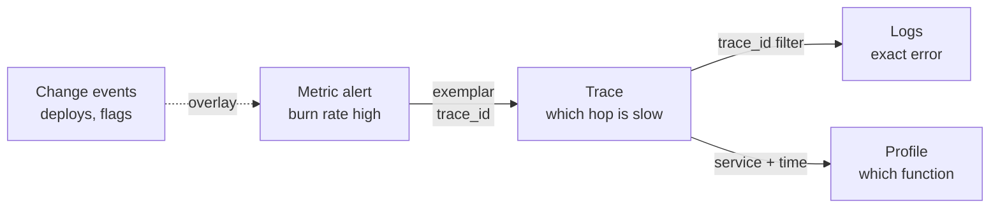
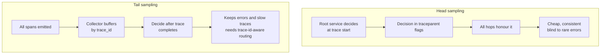
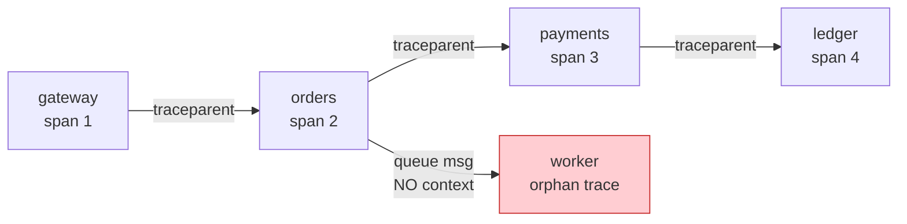
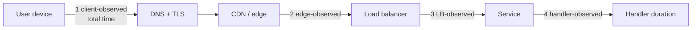

# F22 — Observability Fundamentals

**Observability is a measurement system with a budget: every signal has a cost curve, an aggregation algebra, and a bias, and most production observability failures are arithmetic errors — averaged quantiles, exploded cardinality, and sampled-away outliers — not missing dashboards.**

## The signals and what each one costs

| Signal | Unit of data | Cardinality tolerance | Cost driver | Typical retention | Query latency | Best at |
|---|---|---|---|---|---|---|
| Metrics | Numeric time series | Low — cost is per *series*, not per event | Active series count x scrape frequency | 13–15 months (downsampled) | ms | Aggregate rates, trends, alerting, capacity |
| Logs | Structured events | High — cost is per *byte* | Volume x indexed fields x retention | 7–30 days hot | 100 ms–min | Individual event forensics, audit, rare details |
| Traces | Spans in a causal graph | High — cost per *span*, mitigated by sampling | Spans/sec x span size x sampling | 3–14 days | 10–100 ms | Latency attribution across services |
| Profiles | Stack sample aggregates | Medium | Sample rate x stack depth x hosts | 7–30 days | 100 ms–s | Where CPU/alloc actually goes, inside a process |
| Events / change log | Discrete facts (deploys, flags, config) | Trivial | Negligible | Years | ms | Correlating "what changed" |

Rough cost model, expressed per-signal so you can compare like for like:

$$
\text{Cost}_{\text{metrics}} \propto S \cdot \frac{86400}{\Delta t_{\text{scrape}}} \cdot b_{\text{sample}} \cdot R_{\text{days}}
$$

With $S = 10^6$ active series, 15 s scrape, ~1.5 bytes/sample compressed, 15-day hot retention:

$$
10^6 \times 5760 \times 1.5\,\text{B} = 8.6\ \text{GB/day} \Rightarrow \sim130\ \text{GB hot}
$$

Memory is the tighter constraint: Prometheus needs roughly **2–4 KB of RAM per active series** for the head block, index, and label strings. One million series is ~3 GB of head memory before query workspace. That is why cardinality, not sample volume, is what kills metrics systems.

$$
\text{Cost}_{\text{logs}} \propto \text{events/s} \cdot \bar{b}_{\text{event}} \cdot R \cdot (1 + f_{\text{index}})
$$

At 200 k events/s and 800 B/event: 160 MB/s, ~13.8 TB/day *before* index expansion (indexed-field overhead of 0.5–2x is normal in Elasticsearch-class systems). Logs are typically **1–2 orders of magnitude more expensive per unit of insight** than metrics, which is the entire reason for the "metrics for detection, logs/traces for diagnosis" split.

!!! tip "The cost hierarchy drives the workflow"
    Alert on metrics (cheap, aggregate, low-cardinality). Pivot to traces via exemplars (medium cost, causal). Pivot to logs for the specific event (expensive, exact). Pivot to profiles for in-process attribution. Designing the pivot path is more valuable than adding another dashboard.



---

## RED, USE, and the golden signals

| Method | Applies to | Measures | Notes |
|---|---|---|---|
| **RED** | Request-driven services | **R**ate, **E**rrors, **D**uration | Tom Wilkie's formulation; the per-service dashboard default |
| **USE** | Resources (CPU, disk, NIC, pool, queue) | **U**tilization, **S**aturation, **E**rrors | Brendan Gregg; saturation is the leading indicator, utilization is the lagging one |
| **Four golden signals** | Any user-facing system | Latency, Traffic, Errors, Saturation | Google SRE Book; latency must be split into successful vs failed |

The two are complementary, not competing: RED describes the *work*, USE describes the *resources doing the work*. A complete service dashboard has RED on top and USE for each of its scarce resources (thread pool, connection pool, queue, disk, CPU) below.

!!! warning "Measure latency of successes and failures separately"
    Failures are usually much faster (fail-fast 503s) or much slower (timeouts) than successes. Mixing them makes p99 move for reasons unrelated to performance: a spike of fast 503s *improves* your latency graph while your service is dying. Always compute duration histograms with `status` as a label, and define latency SLIs over successful requests only.

```promql
# RED, one service, one panel each.
sum by (route) (rate(http_requests_total{service="checkout"}[5m]))
sum by (route) (rate(http_requests_total{service="checkout",code=~"5.."}[5m]))
histogram_quantile(0.99,
  sum by (le, route) (rate(http_request_duration_seconds_bucket{service="checkout",code!~"5.."}[5m]))
)

# USE for the dependency connection pool: saturation leads utilization.
max by (pod) (db_pool_in_use / db_pool_size)
histogram_quantile(0.99, sum by (le) (rate(db_pool_wait_seconds_bucket[5m])))
```

---

## Cardinality: the mechanics and the money

A metric's series count is the **product** of the distinct values of its labels, restricted to combinations that actually occur:

$$
S_{\text{metric}} = \left|\left\{(d_1,\dots,d_k) : \text{observed}\right\}\right| \;\le\; \prod_{i=1}^{k} |d_i|
$$

For a histogram, multiply again by the bucket count plus two (`_sum`, `_count`):

$$
S_{\text{histogram}} = S_{\text{base}} \cdot (n_{\text{buckets}} + 2)
$$

### A worked explosion

`http_request_duration_seconds` with labels `service` (40), `route` (30), `method` (4), `status` (12), `pod` (300), and 12 buckets:

$$
40 \times 30 \times 4 \times 12 \times 300 \times 14 = 241{,}920{,}000
$$

Nothing survives that. In practice, `service` and `pod` are correlated (each pod belongs to one service) so the real number is $300 \times 30 \times 4 \times 12 \times 14 \approx 6.05$ M — still enough to consume ~18 GB of Prometheus head memory for one metric.

Now remove `pod` by aggregating at the collector, drop `method` (rarely used for latency analysis), and collapse `status` to a class:

$$
40 \times 30 \times 3 \times 14 = 50{,}400
$$

Same diagnostic value for 99% of questions, 0.02% of the cost.

### Labels that must never carry unbounded values

| Label | Why it explodes | Correct home |
|---|---|---|
| `user_id`, `tenant_id` (long tail) | Unbounded, grows forever | Logs/traces; metrics only for a bounded top-N allowlist |
| `request_id`, `trace_id` | One series per request | Exemplars |
| Raw `url` / `path` with IDs | `/orders/8123` is a new series | Templated route: `/orders/{id}` |
| `error_message` | Free text, unbounded | Logs; metrics get a bounded `error_class` |
| `pod` / `container_id` | Churns on every deploy — series *count* stays bounded but *total* series grows because old series persist for the retention of the head block | Aggregate away at collector, keep only for USE metrics |
| `version`, `commit_sha` | Doubles all series during a rollout | Acceptable if deliberately bounded; drop after rollout |
| `ip`, `user_agent` | Effectively unbounded | Logs, or bucketed classes |

!!! gotcha "Churn is cardinality even when instantaneous cardinality is flat"
    Symptom: `prometheus_tsdb_head_series` looks stable at 800 k, but memory grows all day and compaction is slow. Mechanism: every deploy replaces all `pod` label values; the old series remain in the head block until it is cut (2 h) and in the index for the block's lifetime, so *churn rate* — new series per second — is the real cost driver, not the instantaneous count. Mitigation: monitor `rate(prometheus_tsdb_head_series_created_total[5m])`, strip pod-level labels in the collector for anything that is not a USE metric, and avoid deploy-correlated labels on high-cardinality metrics.

### Finding what is expensive

```promql
# Top metrics by series count.
topk(10, count by (__name__)({__name__!=""}))

# Which label is doing the damage on one metric.
count(count by (route) (http_request_duration_seconds_bucket))
count(count by (pod)   (http_request_duration_seconds_bucket))

# Series creation rate: the real cost driver under churn.
rate(prometheus_tsdb_head_series_created_total[5m])

# What a single job costs you.
topk(10, count by (job)({__name__!=""}))
```

### Cardinality budgets

Treat series like any other capacity resource: allocate, measure, enforce.

1. **Per-team budget** in active series (e.g. 250 k) and a churn budget (series created/min).
2. **Enforcement in the pipeline**, not in review: a relabel/limit stage that drops or aggregates over-budget metrics and *emits a metric about doing so*, so the team sees the loss.
3. **A pre-merge lint** that rejects instrumentation with known-dangerous label names and unbounded value sources.
4. **A monthly report** of top 20 metrics by cost with the owning team, in currency, not series.

```yaml
# Prometheus: enforce a hard ceiling and drop the worst offender at scrape time.
scrape_configs:
  - job_name: app
    sample_limit: 200000              # scrape fails loudly instead of silently OOMing
    label_limit: 24
    label_value_length_limit: 128
    metric_relabel_configs:
      - source_labels: [__name__]
        regex: "app_debug_.*"
        action: drop
      - regex: "pod|instance|container_id"   # aggregate away identity labels
        action: labeldrop
```

!!! gotcha "`sample_limit` turns a cardinality bug into a total blindness incident"
    Symptom: a new label ships, the scrape exceeds `sample_limit`, and Prometheus discards the *entire scrape* — you lose every metric from that job, including the ones your alerts depend on. Mechanism: the limit is per-scrape and all-or-nothing. Mitigation: keep the limit, but alert on `scrape_samples_scraped` approaching it and on `up == 0` with `scrape_series_added` spikes; prefer `metric_relabel_configs` drops for known offenders so the failure is targeted; and never let SLO-critical metrics share a scrape job with experimental ones.

---

## Histograms, and why quantiles do not aggregate

### The arithmetic fact

The $q$-quantile is not a linear functional. For two populations $A$ and $B$:

$$
q_{0.99}(A \cup B) \;\neq\; \frac{q_{0.99}(A) + q_{0.99}(B)}{2}
$$

and there is no function of $q_{0.99}(A)$ and $q_{0.99}(B)$ alone that yields $q_{0.99}(A\cup B)$ — you need the distributions.

**Concrete counterexample.** Instance A serves 2000 requests, all 10 ms, so $p_{99}(A) = 10$ ms. Instance B serves 10 requests, all 5000 ms, so $p_{99}(B) = 5000$ ms. The average of the two p99s is **2505 ms**. The union has 2010 requests; the 99th percentile sits at sorted position $\lceil 0.99 \times 2010 \rceil = 1990$, which is a 10 ms observation, so the true $p_{99}$ is **10 ms**. The "average p99" is wrong by a factor of 250, and it is wrong in the direction that causes you to chase a non-problem.

The same applies across **time**: averaging a 1-minute p99 over 60 minutes does not give the hourly p99, because it ignores how many requests each minute contained and where the tail actually sat.

!!! danger "If your dashboard shows `avg(p99)` or `avg_over_time(p99)`, it is showing a number with no statistical meaning"
    The only correct aggregation is over **bucket counters**, then compute the quantile: `histogram_quantile(0.99, sum by (le) (rate(..._bucket[5m])))`. Bucket counters are additive; quantiles are not.

### Histogram implementations

=== "Prometheus classic histogram"

    Fixed, pre-declared bucket boundaries. Each bucket is a cumulative counter series (`le="0.005"`, `le="0.01"`, …, `le="+Inf"`).

    - **Additive**: sum bucket counters across instances/time, then compute the quantile. This is what makes correct aggregation possible at all.
    - **Cost**: $n_{\text{buckets}}+2$ series per label combination. 12–20 buckets is typical; 40 is a cardinality incident.
    - **Accuracy**: `histogram_quantile` linearly interpolates *within* the bucket containing the quantile, so error is bounded by that bucket's width. If your p99 lands in the `[1, 10]` bucket, your p99 is only known to within an order of magnitude.
    - **The fatal flaw**: buckets are chosen at instrumentation time. If latency shifts outside the useful range (everything now lands in `+Inf`), you cannot recompute historically.

=== "Native / exponential histograms"

    Prometheus native histograms (and OTel exponential histograms) use bucket boundaries $(\gamma^{i-1}, \gamma^i]$ with $\gamma = 2^{2^{-s}}$ for schema $s$.

    - Schema 3 gives $\gamma = 2^{1/8} \approx 1.0905$, i.e. ~9% bucket width and ~4.4% maximum relative quantile error, across the entire dynamic range from nanoseconds to hours.
    - **No bucket choice at instrumentation time.** The resolution is uniform in relative terms, which is what latency analysis actually wants.
    - **One series** instead of $n+2$, with sparse bucket storage: a 10–20x reduction in series count for latency metrics is typical.
    - Still fully additive, so aggregation remains correct.
    - Caveats: requires a recent Prometheus with the feature enabled, protobuf/`native_histograms` scrape support, and remote-write receivers that understand them; tooling and long-term-storage support lag.

=== "HdrHistogram"

    Fixed relative precision (significant digits) over a configured dynamic range, stored as a compact array with O(1) recording.

    - Designed for in-process recording at very high rates with no allocation in the hot path, and for **coordinated-omission correction** (`recordValueWithExpectedInterval`), which no other common implementation handles.
    - Mergeable across instances, so it aggregates correctly.
    - Usually used for load generators and in-process latency measurement rather than as the metrics-system wire format.

=== "Prometheus summary (avoid)"

    Client-side computed quantiles shipped as pre-aggregated values (`quantile="0.99"`).

    - **Cannot be aggregated at all.** There is no valid way to combine per-instance summary quantiles into a fleet quantile.
    - Quantile computation is done in the client with a sliding time window you cannot change at query time.
    - Only defensible for a single-instance component where fleet aggregation is meaningless.

| Property | Classic histogram | Native/exponential | HdrHistogram | Summary |
|---|---|---|---|---|
| Series per label set | $n+2$ | 1 | n/a (in-process) | 1 per quantile + 2 |
| Aggregatable across instances | Yes | Yes | Yes (merge) | **No** |
| Quantile chosen at query time | Yes | Yes | Yes | No |
| Error bound | Bucket width (arbitrary) | ~4.4% at schema 3 | Configured sig-digits | Client-side estimate |
| Needs bucket design up front | Yes | No | Range only | No |
| Coordinated omission handling | No | No | Yes | No |

!!! gotcha "Coordinated omission makes your latency numbers optimistic by an order of magnitude"
    Symptom: your load test reports p99 = 25 ms while users experience seconds. Mechanism: a closed-loop client sends the next request only after the previous one returns, so during a 3-second stall it records *one* 3-second sample instead of the hundreds of requests that should have been sent and would have queued. The stall is measured once rather than proportionally. Mitigation: use open-loop load generators (constant arrival rate: `wrk2`, `k6` with constant-arrival-rate executor, Gatling's open model), or correct with HdrHistogram's expected-interval recording. The same bias appears in production when instrumentation starts the timer *after* queue admission rather than at arrival.

---

## Push vs pull collection

| Dimension | Pull (Prometheus scrape) | Push (StatsD, OTLP, remote write) |
|---|---|---|
| Target discovery | Required (SD) — the collector knows what should exist | Not required — but you cannot detect a target that never reports |
| "Is it up?" | Free: `up` metric per target | Needs a separate heartbeat/expected-inventory mechanism |
| Short-lived jobs | Poor — job may exit before a scrape; needs a pushgateway | Natural fit |
| Network direction | Collector → target; needs reachability/firewall inbound | Target → collector; NAT- and edge-friendly |
| Backpressure | Natural — collector controls rate | Collector can be overwhelmed; needs its own admission control |
| Multi-tenant isolation | Collector-side, easy | Requires auth + per-tenant limits at ingest |
| Cardinality control | At scrape, with relabeling — strong | At the SDK or a collector pipeline — weaker, later |
| Timestamp authority | Collector clock (consistent) | Client clock (skew, out-of-order) |
| Client/browser/mobile | Impossible | The only option |

In practice most large environments run **both**: pull inside the datacentre where discovery is solid, push (OTLP through a collector fleet) from edge, serverless, batch, and client-side. The collector fleet is where you enforce cardinality limits, aggregation, and tenant isolation — treat it as a first-class service with its own SLO, not as an agent.

---

## Exemplars: the bridge between aggregate and instance

An exemplar attaches a trace ID (and optional labels) to a specific observation inside a histogram bucket. It turns "p99 is 4 s" into "here are ten traces that took 4 s".

```text
http_request_duration_seconds_bucket{le="5.0",route="/checkout"} 42931 # {trace_id="4bf92f3577b34da6a3ce929d0e0e4736"} 4.31 1712000000.123
```

- Cost is negligible: a handful of exemplars per bucket per scrape, stored in a separate circular buffer, not as series.
- The crucial property: exemplars are attached to the **slow** observations, so they survive even when trace sampling would have discarded them. Configure your tracing SDK so that exemplar-referenced traces are always sampled (record-and-sample on the slow path).
- Without exemplars, the pivot from metric to trace is a manual time-range-and-hope search, which is where minutes of MTTR go.

---

## Sampling and its biases



| Strategy | Decision point | Keeps rare/interesting? | Cost | Main bias |
|---|---|---|---|---|
| Head, fixed rate (e.g. 1%) | At trace start | No — misses 99% of errors | Lowest; only 1% of spans leave the process | Under-represents everything rare; rate estimates need reweighting |
| Head, per-route rates | At trace start | Partially | Low | You must know in advance what matters |
| Tail, rule-based (errors, slow, specific tenants) | After trace completes | Yes | High — all spans traverse the network and buffer in the collector | Over-represents errors; you lose the healthy baseline unless you also keep a random slice |
| Adaptive / rate-limiting (per-operation target QPS) | At trace start, with feedback | Rare operations preserved | Medium | Sampling probability varies by operation, so unweighted counts are wrong |
| Consistent probability sampling with recorded rate | At trace start | No, but statistically correctable | Low | None, *if* you propagate and use the sampling probability |

!!! danger "Sampled traces are not a measurement system"
    Never compute error rates, throughput, or latency percentiles from sampled traces unless every span carries its sampling probability and you reweight by $1/p$. Even then, a 1% head sample gives you ~10 observations of a 1-in-10 000 event per million requests — statistically useless for alerting. Metrics are the measurement system; traces are the explanation system.

Practical policy that works: **head-sample a small consistent baseline (0.1–1%) for the healthy distribution, plus tail-sample all errors and everything above the p99 latency threshold, plus force-sample anything referenced by an exemplar or carrying a debug flag.** Record the effective sampling probability on every span so counts remain correctable.

!!! gotcha "Tail sampling requires all spans of a trace to reach the same collector"
    Symptom: traces are systematically incomplete — the frontend span is kept but backend spans are missing, or vice versa. Mechanism: tail sampling buffers by trace ID; if a load-balanced collector fleet distributes spans round-robin, no single collector ever sees the whole trace and the decisions disagree. Mitigation: two-tier collectors with consistent hashing on `trace_id` in the first tier (OTel `loadbalancing` exporter), sized so the buffer holds at least the p99.9 trace duration, and alert on `spans_dropped_by_buffer_full`.

---

## Structured logging and log economics

Unstructured logs are strings you will later parse with a regex under time pressure. Structured logs are events with typed fields.

```python
log.info(
    "order_submitted",
    order_id=order.id,
    tenant_id=tenant.id,
    amount_cents=order.total_cents,
    latency_ms=round(elapsed * 1000, 1),
    trace_id=span.get_span_context().trace_id,   # non-negotiable: the join key
    result="accepted",
)
```

Rules that matter at scale:

1. **Event name is a low-cardinality constant** (`order_submitted`), with the variables as fields. This is what makes `count by event` possible and what stops you from grepping.
2. **Always include `trace_id` and `span_id`.** Without the join key, logs and traces are two disconnected systems and every investigation is a manual timestamp correlation.
3. **Log levels are a cost dial, not a taste preference.** `DEBUG` in production is a budget decision; make it dynamically togglable per service and per trace (debug-flag propagation) instead of globally on.
4. **Never log secrets, tokens, full request bodies, or PII.** Log retention is long, access is broad, and log pipelines cross trust boundaries. Redact at the SDK, not at the sink.
5. **One log line per request at the boundary** (the access log) is worth more than twenty inside; add inner lines only for branches you cannot infer.

### The economics

$$
\text{USD/day} = \frac{\text{events/s} \cdot \bar{b} \cdot 86400}{10^{12}} \cdot \left(c_{\text{ingest}} + c_{\text{store}}\cdot R_{\text{days}}\right)
$$

Order-of-magnitude illustration at 50 k events/s, 700 B/event: 3.0 TB/day. At typical managed-platform prices (a few USD per GB ingested), that is a six-figure annual line item for *one* service's logs. This is why the standard progression is: sample or drop high-volume success logs, keep 100% of errors, push repetitive per-request facts into metrics, and put long-tail forensic detail in traces instead.

| Tactic | Volume reduction | What you lose |
|---|---|---|
| Sample successful access logs at 1–10% | 90–99% of the biggest source | Per-request forensics for successes (traces cover this) |
| Keep 100% of `WARN`/`ERROR` | — | Nothing |
| Move counters out of logs into metrics | Large | Nothing; metrics are better at it |
| Aggregate repeated identical lines | Medium | Exact counts unless you emit a repeat count |
| Tier to object storage after 3 days | 60–80% of storage cost | Query latency (minutes not seconds) |
| Drop `DEBUG` in prod, enable per-trace | Large | Requires debug-flag propagation to be built |

---

## Trace context propagation

The **W3C Trace Context** `traceparent` header is the interoperable format:

```text
traceparent: 00-4bf92f3577b34da6a3ce929d0e0e4736-00f067aa0ba902b7-01
             ^^ ^------------------------------^ ^--------------^ ^^
             |  trace-id (16 bytes, 32 hex)      parent/span-id   trace-flags
             version                             (8 bytes)        01 = sampled

tracestate: vendor1=value1,vendor2=value2   # vendor-specific, ordered, max 32 entries
```

- `trace-id` must be globally unique and non-zero; it is the join key across metrics exemplars, logs, and spans.
- `trace-flags` bit 0 is the **sampled** flag — the head-sampling decision, propagated so all hops agree.
- `tracestate` carries vendor state (including per-vendor sampling probability); it must be forwarded even by systems that do not understand it.
- `baggage` (a separate W3C spec) carries user-defined key/values across hops. It is *not* free: it is copied into every outbound header of every hop, so a large baggage payload is a per-request tax on every network call and a data-exfiltration surface.



### Where traces break

| Break point | Mechanism | Fix |
|---|---|---|
| Message queues | Context is not part of the message body; producers forget to inject | Inject `traceparent` into message headers/attributes; use span links (not parent-child) for batch consumers |
| Thread pools / async | Context lives in a thread-local that the worker thread does not have | Context-propagating executors; `contextvars` in Python; explicit `context.Context` in Go |
| Proxies stripping headers | Allowlist-based header forwarding drops unknown headers | Explicitly allow `traceparent`, `tracestate`, `baggage` |
| Batch jobs and cron | No inbound request to inherit from | Start a new root span and link to the triggering entity |
| Third-party SDKs | Do not propagate; the hop appears as a leaf | Wrap the client, or accept the gap and document it |
| Sampling disagreement | A hop re-decides sampling instead of honouring the flag | Honour the inbound `sampled` flag; only *upgrade* (never downgrade) for error/debug cases |

!!! gotcha "Broken context is worse than no tracing because it produces confidently wrong conclusions"
    Symptom: a trace shows the request completing in 40 ms, but the user waited 4 s. Mechanism: the async continuation lost the context, so the expensive work created a separate orphan trace; the visible trace ends at the point of context loss. Mitigation: alert on structural trace health — `orphan_span_ratio`, `traces_with_single_span_ratio`, and the ratio of root spans to leaf services — and treat a regression in those as a bug, because every latency investigation downstream depends on them.

---

## Black-box vs white-box monitoring

| | Black-box (synthetic/probe) | White-box (instrumented internals) |
|---|---|---|
| Perspective | What a user experiences | Why the system behaves that way |
| Detects | DNS, TLS, CDN, LB, routing, expiry, whole-region loss | Saturation, error classes, dependency degradation |
| Blind to | Internal causes; low-traffic-path failures | Everything outside your instrumentation (DNS, CDN, client network) |
| Cardinality/cost | Trivial | The bulk of your bill |
| Alert quality | High precision (a failure is real) | Higher recall (catches it earlier) |
| False confidence | "Probe is green" while 30% of real users fail | "All metrics green" while DNS is broken |

Both are mandatory. Black-box probes must run from **outside** your infrastructure (multiple regions and at least one third-party vantage point), must exercise a real user journey rather than `/healthz`, and must include TLS-expiry and DNS-resolution checks. White-box gives you the paging signals with enough lead time to act; black-box is the ground truth that catches the failures your instrumentation cannot see — including "the observability system itself is down".

!!! tip "Monitor the monitoring"
    Dead-man's-switch alerting (an alert that fires when a heartbeat *stops*) is the only defence against a silent observability outage. Route it through a different path than your main alerting (different provider, different region). `up == 0`, `absent(metric)`, and `changes(alertmanager_notifications_total[1h]) == 0` are the building blocks.

---

## Instrumentation overhead

| Mechanism | Typical hot-path cost | Notes |
|---|---|---|
| Counter increment (atomic) | 1–20 ns | Contention on shared cache lines is the real cost; use per-CPU/sharded counters at very high rates |
| Histogram observation (classic) | 20–100 ns | Bucket search is $O(\log n)$ or linear; more buckets = more cost |
| Span creation + attributes | 1–10 µs | Dominated by attribute allocation and string handling |
| Structured log line (async appender) | 1–10 µs | Formatting and allocation; sync appenders can block on disk or the network — never do this on a request path |
| Continuous CPU profiler at 100 Hz | ~0.5–2% CPU | Stack unwinding cost depends on frame pointers/DWARF |
| Continuous allocation profiler | 1–5% | Sample-rate tunable |
| Full request/response body capture | 10–50%+ | Effectively doubles serialization work; never default-on |

The overheads that actually hurt are rarely the CPU cycles:

- **Lock contention** on a shared metric registry or a synchronous log appender serialises your request path. This shows up as a latency cliff at high concurrency, not as CPU.
- **Allocation pressure** from span attributes and log formatting drives GC frequency, which shows up as p99 latency.
- **Blocking I/O** in an exporter with a full queue. Exporters must drop, never block; verify that yours does and export a `dropped` counter.

!!! gotcha "The observability agent competes with the workload for the resource that is scarce"
    Symptom: p99 degrades after rolling out a new agent/sidecar, with no application change. Mechanism: the collector sidecar shares the pod's CPU quota; under cgroup CPU limits, agent bursts cause application throttling (`container_cpu_cfs_throttled_seconds_total`), and memory-hungry agents trigger pod-level OOM kills of the *application*. Mitigation: give agents explicit and separate resource limits, measure the p99 delta in the canary, and monitor CFS throttling on the workload container specifically.

---

## What to measure at the client vs the server boundary



| Measurement point | Includes | Misses | Use for |
|---|---|---|---|
| Handler (4) | Business logic | Queueing, LB, network, TLS, client | Profiling and regression detection only |
| Server process (3) | Handler + in-process queueing | Client network, TLS at edge, DNS, retries | Internal debugging |
| Edge/LB (2) | Everything server-side including connection handling | Client network, DNS, client-side retries, failures that never reached you | **The default SLI measurement point** |
| Client RUM (1) | Everything the user actually experiences | Nothing — but it is sampled, self-reported, and unavailable when the client cannot reach you | Product SLOs, user-journey SLOs |

The load balancer is usually the right SLI boundary: it sees connection-level failures and queueing that the application does not, and it is still under your control and always available. Client telemetry is essential but has a structural bias — **the users who are most affected are the least able to report it**, because a total failure means the beacon never arrives. Always pair RUM with black-box probes and with server-side "expected beacon rate" monitoring, so a *drop* in client reports is itself an alert.

!!! gotcha "Server-side success rate is measured only over requests that arrived"
    Symptom: 99.99% success server-side while a third of users cannot use the product. Mechanism: DNS failure, TLS handshake failure, a CDN misconfiguration, a broken deploy of the client bundle, or an LB dropping connections before they were counted — none of those produce a server-side error event, and many do not produce a request at all. Mitigation: measure at the LB and at the client; alert on *traffic volume anomalies* (a sudden drop is a failure signal), and keep external black-box probes on the full journey.

---

## Gotchas & Corner Cases

!!! gotcha "Averaging p99 across instances or time buckets is arithmetically meaningless"
    Symptom: the dashboard p99 disagrees with what users and traces show, sometimes by orders of magnitude, in both directions. Mechanism: quantiles are not linear functionals; `avg(p99)` weights a 10-request instance the same as a 10 000-request instance, and `avg_over_time` ignores per-window request counts. Mitigation: aggregate the additive bucket counters and compute the quantile last — `histogram_quantile(0.99, sum by (le) (rate(x_bucket[5m])))` — and delete every recording rule that stores a pre-computed quantile intended for later aggregation.

!!! gotcha "One high-cardinality label ships in a Friday deploy and takes down the metrics stack for everyone"
    Symptom: Prometheus OOMs or the managed metrics bill triples; unrelated teams lose alerting. Mechanism: a `user_id` (or raw URL, or error message) label multiplies an existing metric's series by $10^5$; there is no per-team isolation, so one tenant consumes the shared resource. Mitigation: hard limits at scrape/ingest (`sample_limit`, `label_limit`, per-tenant series limits), pre-merge lint on label names, per-team cardinality budgets with a visible dashboard, and separate scrape jobs so blast radius is bounded.

!!! gotcha "Rate over a counter that resets is fine; rate over a gauge is nonsense"
    Symptom: negative or absurd rates, or an alert that never fires. Mechanism: `rate()`/`increase()` assume monotonic counters and apply reset-correction; applying them to a gauge produces garbage, while applying `avg_over_time` to a counter produces a meaningless number that grows forever. Mitigation: enforce the `_total` suffix convention for counters, use `delta()`/`deriv()` for gauges, and note that `increase()` extrapolates at range boundaries, so it can report non-integer counts for integer events — never use it for exact-count assertions.

!!! gotcha "A metric that disappears silently makes its alert silently pass"
    Symptom: no alerts fired during a total outage, because the exporter died with the service. Mechanism: `sum(rate(errors_total[5m])) / sum(rate(requests_total[5m])) > 0.01` evaluates to *no data* when the series vanish, and "no data" is not "firing" by default. Mitigation: pair every ratio alert with `absent()` or `up == 0` alerts, set `for` durations that account for scrape gaps, and configure the alert manager's no-data behaviour explicitly rather than by default.

!!! gotcha "Scrape interval and alert window interact: a 5-minute rate over a 60-second scrape has 5 points"
    Symptom: flapping alerts, or alerts that take far longer than expected to fire. Mechanism: `rate(x[5m])` needs at least two samples in the window and its sensitivity depends on how many it gets; with a 60 s scrape and a 2 m window you are computing a rate from two points, so a single missed scrape halves your data. The rule of thumb is that the range must be at least **4x** the scrape interval. Mitigation: standardise scrape intervals, make alert ranges at least 4x the interval, and verify with `count_over_time(x[5m])`.

!!! gotcha "Timestamps: your data is late, and your alert window is not"
    Symptom: a burn-rate alert fires and immediately resolves, or a dashboard's most recent minute always dips. Mechanism: ingestion lag (remote write batching, collector buffering, cross-region shipping) means the last 1–3 minutes are incomplete; any query that includes "now" reads a partial window and reports artificially low rates. Mitigation: offset alert queries past the ingestion lag, monitor the lag itself as an SLI, and never build alerts on ranges shorter than a few times the lag.

!!! gotcha "Tail-sampled traces make error rates look catastrophic and latency look terrible"
    Symptom: the tracing UI shows a 40% error rate while the true rate is 0.2%. Mechanism: tail sampling deliberately keeps 100% of errors and 1% of successes; anyone computing a ratio from stored spans gets the sampling policy back, not reality. Mitigation: display the effective sampling rate prominently in the trace UI, store per-span sampling probability, forbid SLI computation from traces, and keep an unbiased random slice alongside the biased one.

!!! gotcha "Histogram bucket boundaries chosen once are wrong forever"
    Symptom: p99 reads exactly `+Inf` or is pinned to a bucket edge for months. Mechanism: buckets were defined for a 10–500 ms service that now serves in 2–30 ms (all observations fall into the first bucket, so quantiles are interpolated inside it and are meaningless) or has regressed to seconds (everything is in `+Inf`, so `histogram_quantile` returns `NaN` or the last finite boundary). Historical data cannot be recomputed. Mitigation: migrate to native/exponential histograms; until then, review buckets whenever the service's latency profile shifts by more than 2x, and alert when the `+Inf` bucket fraction or the first-bucket fraction exceeds a threshold.

!!! gotcha "Log-based metrics silently change meaning when someone edits a log line"
    Symptom: an SLO dashboard goes to zero after an unrelated refactor. Mechanism: the metric was derived by a regex over log text; someone reworded the message or changed the level, and the parser no longer matches. There is no compile-time or review-time link between the two. Mitigation: derive metrics from structured fields and stable event names, never from message text; add a test that asserts the event name and required fields; and alert on the derived metric going absent, not just on its value.

!!! gotcha "Cardinality is charged per unique series per tenant, so aggregation at the collector is not optional"
    Symptom: the managed-observability invoice grows superlinearly with fleet size while traffic is flat. Mechanism: per-pod labels mean series count scales with replicas, and horizontal scaling — the thing you do to handle load — multiplies your observability bill even when request volume is unchanged. Mitigation: aggregate identity labels away in the collector for everything except USE metrics; keep per-pod detail only for a short-retention, low-resolution tier; and put replica count in the cost model explicitly.

!!! gotcha "Percentiles hide multimodality, and most real latency distributions are multimodal"
    Symptom: p50 and p99 both look fine, yet a specific cohort is consistently terrible. Mechanism: cache hit and cache miss (or region A and region B, or cold and warm shard) are two distinct populations; the aggregate percentile sits between the modes and describes no actual user. Mitigation: split the histogram by the mode-defining dimension (`cache_status`, `region`, `tenant_class`) with a *bounded* label, and use heatmaps rather than percentile lines when investigating.

!!! gotcha "Sampling decisions made downstream break the trace and the statistics simultaneously"
    Symptom: some traces begin mid-graph with a non-root span, and per-service span counts disagree wildly. Mechanism: a service ignores the inbound `sampled` flag and applies its own 10% head sample, so 90% of the traces it participates in are truncated at that boundary. Mitigation: honour the inbound flag as a hard contract (upgrade-only for errors/debug), assert it in integration tests, and monitor `orphan_span_ratio` per service.

---

## SRE Lens

**SLIs and SLOs for the observability platform itself**

- **Freshness**: age of the newest queryable sample, p99 (target: < 30 s for metrics, < 60 s for logs). Everything else is worthless if this degrades silently.
- **Completeness**: `scrape_success_ratio`, `spans_received / spans_expected`, log-pipeline drop rate. Alert on drops, never accept "best effort" silently.
- **Query availability and latency**: dashboard and alert-rule evaluation success rate; rule evaluation must not skip (`prometheus_rule_group_iterations_missed_total`).
- **Alert delivery**: the end-to-end path from rule fire to pager, verified continuously with a dead-man's switch on a separate provider.

**Failure modes and detection**

| Failure | Signal | Detection |
|---|---|---|
| Cardinality explosion | `rate(prometheus_tsdb_head_series_created_total[5m])`, tenant series count | Page at 80% of the tenant limit |
| Ingestion lag | Newest-sample age, remote-write queue depth | Page above 3x normal lag |
| Silent metric loss | `up == 0`, `absent()`, `scrape_samples_scraped` at limit | Page per SLO-critical job |
| Trace context breakage | `orphan_span_ratio`, single-span-trace ratio | Ticket on regression vs 7-day baseline |
| Exporter dropping | exporter `dropped_spans_total` / `dropped_log_records_total` | Ticket, then page if sustained |
| Rule evaluation skipping | `prometheus_rule_group_iterations_missed_total` | Page — your alerts are not running |

**Rollout and migration risk**

- Instrumentation changes are production changes: canary them and watch the p99 delta and CFS throttling on the workload container.
- Migrating classic → native histograms means dual-writing for at least one full alert-window lookback, plus recording rules that expose both, plus a documented cutover per alert. Quantile values will shift slightly; expect and communicate that.
- Changing a metric name or a label is a **breaking change** for dashboards, alerts, and SLO definitions. Version it: emit both for one retention period, then remove.
- Renaming or rewording a log message breaks every log-derived metric. Structured event names are an API — treat them as one.

**Capacity signals**

- Active series, series-creation rate, and per-tenant share.
- Bytes ingested per second and per team, trended monthly against the budget.
- Query load: rule-evaluation duration vs interval — when evaluation takes longer than the interval, your alerting is already degraded.
- Collector fleet: CPU, queue depth, and drop rate; these saturate before anything user-visible does.

**On-call runbook notes**

- If a metric is missing during an incident, check `up`, then the scrape limits, then ingestion lag — in that order. Do not conclude "the service is fine" from an absent error metric.
- Know how to raise the log level or enable per-trace debug for a single tenant without a deploy.
- Know which dashboards are computed from sampled traces (and therefore cannot be trusted for rates) and which are computed from metrics.
- Keep a minimal, dependency-free "is anything alive" view that works when the primary observability stack is degraded.

**Cost**

Publish a monthly per-team cost breakdown in currency, split by signal. The usual result: logs are 60–80% of spend and metrics cardinality is 15–30%, while traces (sampled) are small. The highest-ROI actions are almost always sampling success-path access logs, aggregating identity labels away at the collector, and tiering log storage — not reducing retention on the signals people actually query.

---

## Interview Angle

!!! interview "Probe: your p99 latency dashboard says 40 ms but users complain about seconds. Debug it."
    **Strong answer:** enumerate measurement errors before system causes. (1) Is the dashboard averaging per-instance p99s? That is arithmetically invalid — show the correct `histogram_quantile(0.99, sum by (le) (rate(..._bucket[5m])))`. (2) Where is it measured — handler, LB, or client? Handler-side excludes queueing, connection-pool wait, TLS, and DNS. (3) Are failures excluded from the histogram, so fast 503s are pulling the number down? (4) Is the distribution multimodal (cache hit vs miss), so p99 describes nobody? (5) Coordinated omission in whatever produced the "40 ms" claim. Only then look at the system.

    **Weak answer:** "Add more logging" or immediately blaming the network.

!!! interview "Follow-up: why can't you just store p99 per instance and average it?"
    **Strong answer:** quantiles are not linear functionals and averaging ignores per-instance request counts. Give the counterexample: 2000 requests at 10 ms and 10 requests at 5000 ms — the average of the p99s is 2505 ms, the true p99 is 10 ms. Explain that histogram buckets are counters and therefore additive, which is exactly why the aggregation must happen on buckets and the quantile must be computed last. Mention that Prometheus summaries are unaggregatable for the same reason.

!!! interview "Probe: design observability for a 500-service platform on a fixed budget"
    **Strong answer:** tier by cost. Metrics as the universal detection layer with enforced per-team cardinality budgets and collector-side aggregation of identity labels; exemplars as the mandatory metric→trace bridge; head-sample a 0.1–1% baseline plus tail-sample all errors and slow traces with trace-ID-consistent collector routing; structured logs with `trace_id`, success-path access logs sampled, 100% of errors kept, tiered to object storage after days. Add black-box probes from outside plus a dead-man's switch on an independent path. Treat the collector fleet as a service with its own SLO. Publish per-team cost.

    **Weak answer:** "Ship everything to a managed vendor and turn on all the integrations."

!!! interview "Follow-up: how do you stop one team from taking down metrics for everyone?"
    **Strong answer:** isolation plus limits plus visibility. Separate scrape jobs/tenants so blast radius is bounded; `sample_limit`, `label_limit`, `label_value_length_limit` at scrape and per-tenant series limits at ingest; `metric_relabel_configs` to drop known offenders; pre-merge lint on dangerous label names; per-team budgets with a cost dashboard. Then name the trap: `sample_limit` drops the *entire* scrape, so SLO-critical metrics must not share a job with experimental ones.

!!! interview "Probe: what is the difference between black-box and white-box monitoring, and which do you page on?"
    **Strong answer:** page on symptoms that map to the SLO — usually white-box SLI burn rate measured at the LB, because it has the recall and the lead time — and keep black-box probes as independent ground truth for the failures your instrumentation cannot see (DNS, TLS expiry, CDN, whole-region loss, and the observability stack itself being down). Note that server-side success rate structurally cannot see requests that never arrived, so traffic-volume anomaly detection is also required.

!!! interview "Trap: 'we'll compute our SLO from traces'"
    **Strong answer:** refuse, and explain why: sampled traces are a biased sample by construction (tail sampling keeps errors deliberately), the sample size for rare events is far too small to alert on, and per-span sampling probability is often not recorded so reweighting is impossible. Traces explain; metrics measure.

---

## Key Takeaways

- Each signal has a different cost curve: metrics are priced per *series*, logs per *byte*, traces per *span*. Design the pivot path (metric alert → exemplar → trace → log → profile) rather than duplicating the same information in the expensive signal.
- Quantiles do not aggregate. Sum the additive bucket counters first and compute the quantile last; delete every `avg(p99)` in your dashboards and every pre-aggregated quantile recording rule.
- Cardinality is the product of label value counts, multiplied again by histogram buckets. Churn counts too. Enforce budgets in the pipeline with visible drop metrics, not in code review.
- Native/exponential histograms remove the bucket-design problem and cut latency-metric series by an order of magnitude, at ~4.4% relative error at schema 3. Prometheus summaries cannot be aggregated at all.
- Sampling has a direction: head sampling under-represents rare events, tail sampling over-represents errors. Never compute rates or SLIs from sampled traces unless every span carries its sampling probability.
- Trace context must survive queues, thread pools, and proxies. Monitor structural trace health (`orphan_span_ratio`) as a bug metric, because broken traces produce confidently wrong conclusions.
- Measure the SLI at the load balancer by default, add real-user telemetry for the journey, and keep external black-box probes — because server-side success rate cannot see requests that never arrived.
- The observability stack is a production system: it needs freshness, completeness, and delivery SLIs, a dead-man's switch on an independent path, and a cost model published per team.

## Further Reading

- Google SRE Book, Chapter 6 — *Monitoring Distributed Systems* (four golden signals, symptom vs cause, black-box vs white-box).
- Google SRE Book, Chapter 10 — *Practical Alerting from Time-Series Data* (Borgmon, the rule-evaluation model Prometheus inherited).
- Sigelman et al., *Dapper, a Large-Scale Distributed Systems Tracing Infrastructure*, Google, 2010 (context propagation and sampling economics).
- Dean & Barroso, *The Tail at Scale*, CACM 2013 (why tail latency dominates at fan-out).
- W3C Recommendation — *Trace Context* (`traceparent`, `tracestate`) and the W3C *Baggage* specification.
- OpenTelemetry specification — *Sampling*, *Exponential Histogram* data model, and the Collector `tail_sampling` and `loadbalancing` processors/exporters.
- Prometheus documentation — *Histograms and summaries*, *Native histograms*, *Metric and label naming*, and the `histogram_quantile` function reference.
- Brendan Gregg — *The USE Method*; Tom Wilkie — *The RED Method* (Weave Works / Grafana Labs talks).
- Gil Tene — *How NOT to Measure Latency* (coordinated omission) and the HdrHistogram documentation.
- Majors, Fong-Jones & Miranda, *Observability Engineering* (high-cardinality, event-based debugging; read critically against cost).
- Google SRE Workbook, Chapter 4 — *Monitoring* and Chapter 5 — *Alerting on SLOs* (the measurement-point and alert-quality discussion that pairs with F23).
- Grafana Labs and Prometheus blog posts on native histograms and on cardinality management in Mimir/Cortex-class systems.

---

**Related:** [F23 — SLI/SLO & Error Budgets](f23-slo-error-budgets.md) turns these signals into commitments, [F17 — Rate Limiting & Load Shedding](f17-rate-limiting-load-shedding.md) needs goodput and queue-delay measurement done correctly, and [F18 — Resilience Patterns](f18-resilience-patterns.md) depends on `attempts_per_request` and pool-saturation instrumentation.
