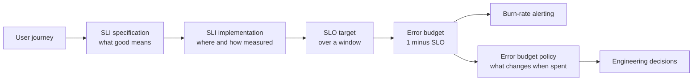
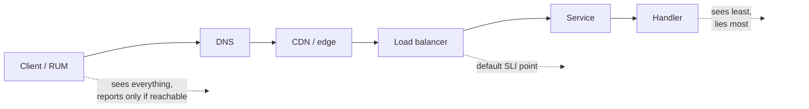
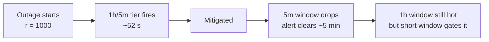
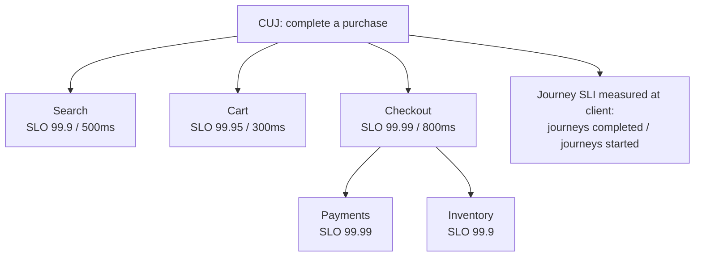
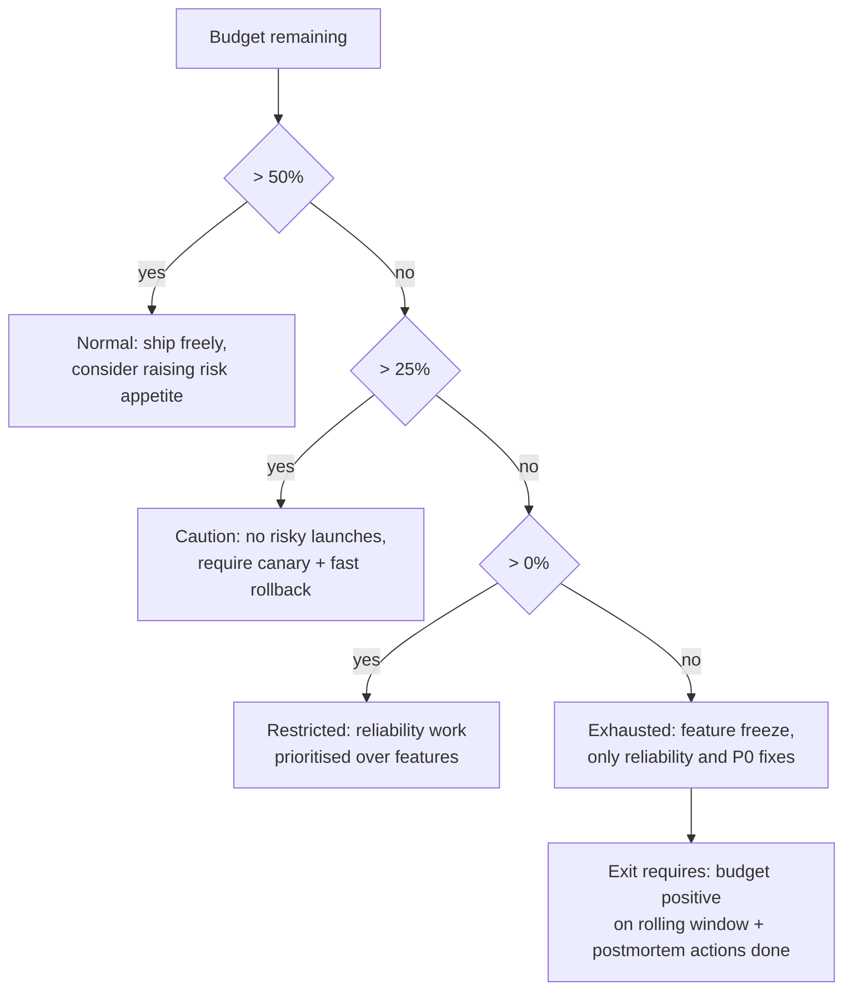

# F23 — SLI/SLO & Error Budgets

**An SLO is not a dashboard threshold; it is a negotiated, arithmetically defensible statement about user experience that buys you a budget for change — and almost every broken SLO programme fails at the specification and measurement-point stage, not at the maths.**

## The chain: SLI → SLO → error budget → policy



Each arrow is a place programmes fail. The most common failure is jumping straight from "we have metrics" to "SLO = 99.9%" without ever writing the specification or arguing about the measurement point.

---

## SLI specification

A usable SLI has two distinct documents:

**Specification** — the assessment of service health, in user terms, with no reference to your metrics stack.

> The proportion of HTTP `GET` requests to `/api/v2/cart/*` that return a successful response within 400 ms, as observed at the edge load balancer.

**Implementation** — how that specification is computed, with every exclusion listed.

> $\dfrac{\text{count of LB access-log events with } \texttt{status} \in \{200,204,304\} \text{ and } \texttt{duration} \le 0.4\text{s}}{\text{count of LB access-log events excluding } \texttt{status} \in \{400,401,403,404,422,429\} \text{ and client-cancelled connections}}$, measured over a rolling 28-day window.

The generic form is always:

$$
\mathrm{SLI} = \frac{\text{good events}}{\text{valid events}} \times 100\%
$$

The hard part is not `good`. It is **`valid`** — the denominator decides whether you are measuring your reliability or your users' behaviour.

### Event-based vs time-based

| | Event-based (request ratio) | Time-based (good minutes) |
|---|---|---|
| Definition | good events / valid events | good windows / total windows, where a window is "good" if its error ratio is below a threshold |
| Weighting | Proportional to traffic | Every minute weighs the same, whether it had 1 or 1 M requests |
| Low-traffic behaviour | Noisy: one failed request out of three is 33% error | Stable, but a single request in a quiet minute can mark it bad |
| Maps to | User-perceived request success | Contractual "uptime", legacy SLAs |
| Burn-rate alerting | Natural | Awkward — burn rate is defined over event ratios |
| Batch/streaming | Poor fit | Good fit (freshness measured per interval) |
| Failure mode | Overnight traffic troughs create false alarms | A 30-second total outage inside a minute may not mark the minute bad |

Prefer **event-based** for request-driven services. Use time-based only where there are no discrete events (a stream's freshness, a queue's backlog) or where a contract forces it. If you must use time-based on a low-traffic service, define minimum-traffic guards rather than pretending the ratio is meaningful.

!!! gotcha "Low-traffic services make ratio SLIs statistically meaningless"
    Symptom: a service with 20 requests/minute alerts constantly overnight and never during the day. Mechanism: with $n=20$, a single failure is a 5% error ratio — a 50x burn rate against a 99.9% SLO — and the binomial noise floor is far above your target. Mitigation: aggregate over a longer window; require a minimum event count before evaluating (`and sum(rate(requests[1h])) > X`); use synthetic probes to raise the floor to a statistically usable rate; or use a time-based SLI with an explicit minimum-traffic rule. State the noise floor: you cannot measure a 99.99% SLO with 100 requests per hour, ever.

### Good and bad SLIs

| Bad SLI | Why it fails | Better |
|---|---|---|
| CPU utilization < 80% | A cause, not a symptom. Users do not experience CPU | Request success ratio within a latency threshold |
| Average latency < 200 ms | The mean hides the tail; the users who suffer are invisible | Proportion of requests faster than a threshold |
| Uptime of the process | A running process serving errors is "up" | Successful-response ratio at the LB |
| p99 latency < 300 ms | A quantile is not a ratio and cannot be budgeted or burned | "99% of requests complete in < 300 ms" as a ratio-with-threshold |
| Server-side 5xx ratio | Excludes everything that never reached the server | Measure at the LB or client |
| "All health checks green" | Health checks test the health-check path | Real user journey success |
| Job completed successfully | Says nothing about output quality or timeliness | Freshness + correctness + coverage (below) |

!!! tip "Latency SLIs must be thresholds, not percentiles"
    "p99 < 300 ms" cannot be converted into an error budget, cannot be aggregated, and cannot be burned down. "99% of requests complete within 300 ms" is the same intent expressed as a ratio of good events, which is budgetable, aggregatable across windows, and directly usable in burn-rate alerting. Implement it with a histogram bucket boundary placed exactly at the threshold.

```promql
# Latency SLI as a ratio: fraction of successful requests under 400 ms.
# The 0.4 bucket boundary MUST exist in the histogram definition.
  sum(rate(http_request_duration_seconds_bucket{job="edge",le="0.4",code!~"5.."}[5m]))
/ sum(rate(http_request_duration_seconds_count{job="edge"}[5m]))
```

---

## Choosing the measurement point



| Point | Captures | Blind to | Verdict |
|---|---|---|---|
| Handler / application | Business logic errors | Queueing, pool wait, LB, TLS, DNS, connection failures, retries | Debugging only — never an SLI |
| Service process | + in-process queueing | Everything before the process | Internal SLI at best |
| Load balancer / edge | + connection handling, TLS, 5xx generated by the LB, requests dropped at admission | Client network, DNS, CDN, client-side retries and failures | **Default SLI point** |
| CDN logs | + edge cache behaviour, some client network | Client device, DNS resolution failure | Good for content delivery SLIs |
| Client RUM / mobile SDK | The actual user experience, end to end | Nothing conceptually — but structurally biased | Product and journey SLOs, paired with the above |
| Synthetic probe | Deterministic journey, incl. DNS/TLS/CDN | Real traffic mix and real client diversity | Coverage for low-traffic and for total-outage detection |

### Why server-side success rate lies

Server-side success ratio is computed **only over requests that arrived and were counted**. Every one of these produces a perfect server-side SLI during a real outage:

- DNS resolution fails, or a stale record points at a dead endpoint. Zero requests arrive; success ratio is `NaN` or 100%.
- TLS certificate expires. The handshake fails; there is no HTTP request to count.
- The load balancer's listener is misconfigured or its target group is empty. The LB returns 503 — count it only if you scrape the LB, not the app.
- The service is at capacity and connections are refused or queued past the client timeout. No request reaches the handler, so the handler's success ratio is 100%.
- A client-side bundle deploy breaks the app. No requests are attempted at all.
- The service returns HTTP 200 with an error body (the GraphQL and JSON-RPC pattern). Server-side status-code SLIs are structurally blind to this.

The countermeasures are cumulative, not alternative: measure at the LB, add real-user telemetry, add external probes, **and alert on traffic-volume anomalies** — a sudden drop in request rate is a failure signal even when every request that arrives succeeds.

!!! gotcha "HTTP 200 with an error payload defeats status-code SLIs entirely"
    Symptom: 100% availability on the dashboard while the product is broken. Mechanism: GraphQL returns `200 OK` with an `errors` array; JSON-RPC and many internal APIs do the same; some frameworks return 200 with a rendered error page. Mitigation: define `good` on a semantic field (`response.errors == null`, `body.status == "ok"`), not on the transport status code; instrument this at the framework layer so it cannot be forgotten; and for GraphQL, decide explicitly whether a partial-data response is good, bad, or excluded.

!!! gotcha "Excluding 429 and 4xx from the denominator can hide a real outage"
    Symptom: availability stays at 99.99% while half of users are being throttled or rejected. Mechanism: 4xx and 429 are excluded as "client fault", but the 429s were caused by a misconfigured limiter and the 404s by a broken deploy that removed a route. Mitigation: exclude client errors from the *availability* SLI but track them as separate, alerted SLIs (`throttle_ratio`, `not_found_ratio`) with their own thresholds; alert on any *step change* in the excluded classes; and never let an exclusion rule be added without a corresponding monitor for the excluded class.

---

## Availability arithmetic

$$
\text{Error budget (events)} = (1 - \mathrm{SLO}) \times N_{\text{valid}}
$$
$$
\text{Error budget (time)} = (1 - \mathrm{SLO}) \times T_{\text{window}}
$$

| SLO | Per year | Per 30 days | Per week | Per day |
|---|---|---|---|---|
| 90% | 36.5 d | 72 h | 16.8 h | 2.4 h |
| 99% | 3.65 d | 7.2 h | 1.68 h | 14.4 min |
| 99.5% | 1.83 d | 3.6 h | 50.4 min | 7.2 min |
| 99.9% | 8.76 h | 43.2 min | 10.1 min | 1.44 min |
| 99.95% | 4.38 h | 21.6 min | 5.04 min | 43.2 s |
| 99.99% | 52.6 min | 4.32 min | 60.5 s | 8.64 s |
| 99.999% | 5.26 min | 25.9 s | 6.05 s | 0.86 s |

Two immediate consequences a senior engineer should state out loud:

1. **99.99% means 4.3 minutes per 30 days.** A single bad deploy that takes 5 minutes to roll back spends more than a month's budget. Therefore a 99.99% SLO is a statement about *deployment automation*, not about servers.
2. **99.999% means 26 seconds per 30 days**, which is shorter than most human detection times and most failover operations. It is achievable only with static stability and no human in the loop — and it is almost never worth it above the user's own connectivity floor (mobile networks are nowhere near five nines).

### Request-based vs windowed SLOs

| | Request-based | Windowed (time-based) |
|---|---|---|
| Budget unit | Failed requests | Bad minutes |
| Traffic weighting | Peak traffic dominates the budget | All periods equal |
| Incident at 3 a.m. | Cheap (little traffic) | Same cost as noon |
| Typical use | User-facing APIs | Contractual SLAs, batch pipelines |
| Interacts with burn rate | Directly | Requires conversion |

Request-based is usually the honest choice — an outage that affects 5 M requests at noon *is* worse than one affecting 5 k at 3 a.m. But be aware of the political consequence: it makes off-peak incidents nearly free, which can distort where reliability effort goes. Some organisations run both and use the windowed one only for external commitments.

### Rolling vs calendar windows

| Window type | Behaviour | Trade-off |
|---|---|---|
| Rolling 28/30 days | Budget continuously recovers as old failures age out | No artificial "the budget resets Monday" behaviour; but the exact moment of recovery is hard to explain to stakeholders |
| Calendar month | Everyone knows where they stand; matches billing | End-of-month cliff: a big incident on the 2nd freezes launches for 29 days; and a risky change on the 30th is "free" |
| Calendar quarter | Smooth, matches planning cycles | Very slow feedback; incidents in month 1 are forgotten by month 3 |

Rolling 28 days (a whole number of weeks, so weekday/weekend seasonality is constant) is the standard recommendation. Use 28 rather than 30 precisely so that every window contains exactly four of each weekday.

---

## Burn rate

**Burn rate** is how fast you are consuming budget relative to the rate that would exactly exhaust it over the SLO window.

$$
\mathrm{BR} = \frac{\text{observed error ratio}}{1 - \mathrm{SLO}}
$$

A burn rate of 1 exhausts the budget exactly at the end of the window. A burn rate of $b$ exhausts it in $T_{\text{window}}/b$.

$$
T_{\text{exhaustion}} = \frac{T_{\text{window}}}{\mathrm{BR}}
$$

For a 99.9% SLO over 30 days:

| Burn rate | Observed error ratio | Time to exhaustion | Budget consumed in 1 h |
|---|---|---|---|
| 1 | 0.1% | 30 days | 0.14% |
| 2 | 0.2% | 15 days | 0.28% |
| 3 | 0.3% | 10 days | 0.42% |
| 6 | 0.6% | 5 days | 0.83% |
| 14.4 | 1.44% | 50 h | 2% |
| 100 | 10% | 7.2 h | 13.9% |
| 1000 | 100% | 43.2 min | 100% |

The budget consumed by a window of length $W$ at burn rate $b$ is:

$$
\text{fraction consumed} = b \cdot \frac{W}{T_{\text{window}}}
$$

which is exactly how the alerting table below is derived: $14.4 \times \frac{1\text{h}}{720\text{h}} = 2\%$, $6 \times \frac{6}{720} = 5\%$, $1 \times \frac{72}{720} = 10\%$.

---

## Multi-window, multi-burn-rate alerting

The core problem: a single threshold cannot be both fast on catastrophic failures and quiet on slow ones. Multi-window multi-burn-rate solves it with several tiers, each pairing a **long window** (the signal: enough data for precision) with a **short window** (the guard: confirms the burn is still happening *now*, so the alert resets quickly).

### The SRE Workbook table

| Severity | Long window | Short window | Burn rate | Budget consumed | Action |
|---|---|---|---|---|---|
| **Page** | 1 hour | 5 minutes | **14.4** | 2% | Wake someone now |
| **Page** | 6 hours | 30 minutes | **6** | 5% | Wake someone now |
| **Ticket** | 3 days | 6 hours | **1** | 10% | Next business day |

This is the recommended configuration from *Site Reliability Workbook*, Chapter 5 (*Alerting on Service Level Objectives*), for a 30-day SLO window. The short window is always $1/12$ of the long window.

A very common four-tier operational variant splits the ticket tier so that a moderate, sustained burn is caught sooner:

| Severity | Long window | Short window | Burn rate | Budget consumed | Action |
|---|---|---|---|---|---|
| **Page** | 1 hour | 5 minutes | 14.4 | 2% | Page |
| **Page** | 6 hours | 30 minutes | 6 | 5% | Page |
| **Ticket** | 1 day | 2 hours | 3 | 10% | Ticket |
| **Ticket** | 3 days | 6 hours | 1 | 10% | Ticket |

!!! warning "Both conditions must hold"
    Each tier fires only when the long window **and** the short window are both above the threshold. Without the short window, an alert stays firing for the full long window after the incident is over (a 1-hour reset time on the fast tier, 3 days on the slow tier) — which trains people to ignore it. Without the long window, you page on every transient blip.

### The PromQL

```promql
# --- Recording rules: precompute the error ratio at each window. ---
groups:
  - name: slo:checkout:availability
    interval: 30s
    rules:
      - record: slo:sli_error:ratio_rate5m
        expr: |
            sum(rate(http_requests_total{job="edge",service="checkout",code=~"5.."}[5m]))
          / sum(rate(http_requests_total{job="edge",service="checkout"}[5m]))
      - record: slo:sli_error:ratio_rate30m
        expr: |
            sum(rate(http_requests_total{job="edge",service="checkout",code=~"5.."}[30m]))
          / sum(rate(http_requests_total{job="edge",service="checkout"}[30m]))
      - record: slo:sli_error:ratio_rate1h
        expr: |
            sum(rate(http_requests_total{job="edge",service="checkout",code=~"5.."}[1h]))
          / sum(rate(http_requests_total{job="edge",service="checkout"}[1h]))
      - record: slo:sli_error:ratio_rate6h
        expr: |
            sum(rate(http_requests_total{job="edge",service="checkout",code=~"5.."}[6h]))
          / sum(rate(http_requests_total{job="edge",service="checkout"}[6h]))
      - record: slo:sli_error:ratio_rate3d
        expr: |
            sum(rate(http_requests_total{job="edge",service="checkout",code=~"5.."}[3d]))
          / sum(rate(http_requests_total{job="edge",service="checkout"}[3d]))
```

```promql
# --- Page tier: 14.4x over 1h AND 5m, OR 6x over 6h AND 30m. ---
# 0.001 is the error budget for a 99.9% SLO.
(
      slo:sli_error:ratio_rate1h{service="checkout"}  > (14.4 * 0.001)
  and slo:sli_error:ratio_rate5m{service="checkout"}  > (14.4 * 0.001)
)
or
(
      slo:sli_error:ratio_rate6h{service="checkout"}  > (6 * 0.001)
  and slo:sli_error:ratio_rate30m{service="checkout"} > (6 * 0.001)
)
```

```promql
# --- Ticket tier: 1x over 3d AND 6h. ---
(
      slo:sli_error:ratio_rate3d{service="checkout"} > (1 * 0.001)
  and slo:sli_error:ratio_rate6h{service="checkout"} > (1 * 0.001)
)

# --- Remaining budget for the dashboard (rolling 28 days). ---
1 - (
      sum(increase(http_requests_total{job="edge",service="checkout",code=~"5.."}[28d]))
    / sum(increase(http_requests_total{job="edge",service="checkout"}[28d]))
  ) / 0.001
```

### Detection and reset time

For an outage burning at rate $r$, a tier with threshold $b$ and long window $W$ fires after approximately:

$$
T_{\text{detect}} \approx W \cdot \frac{b}{r}
$$

(capped at $W$, and floored by the alert evaluation interval plus ingestion lag). A total outage on a 99.9% SLO gives $r = 1000$, so the fast tier detects in $60 \times 14.4/1000 \approx 0.9$ minutes. A 2% error rate gives $r = 20$, so the fast tier fires after $60 \times 14.4/20 = 43$ minutes and the 6-hour tier after $360 \times 6/20 = 108$ minutes.

**Reset time** is bounded by the *short* window once the burn stops — roughly 5 minutes on the fast tier instead of 60.



### The alerting trade-off space

| Strategy | Precision | Recall | Detection time | Reset time | Verdict |
|---|---|---|---|---|---|
| Error ratio > 0.1% over 10 min | Very low — pages on every blip | 100% | ~10 min | ~10 min | Alert fatigue; the classic failure |
| Error ratio > 0.1% over 36 h | High | 100% | Hours | 36 h | Far too slow, and never resets |
| Single burn rate 14.4x over 1 h | Good | Misses slow burns entirely | ~1 min at total outage | 1 h | Fast but blind to a 3x sustained burn |
| Single burn rate 1x over 3 d | Good | Catches slow burns | Days | 3 d | Too slow to page, terrible reset |
| **Multi-window multi-burn-rate** | High | High | ~1 min (fast tier) | Short window | The recommended configuration |

**Definitions** (worth being able to state precisely in an interview):

- **Precision** $= \frac{\text{alerts that were significant events}}{\text{total alerts}}$. Low precision is alert fatigue.
- **Recall** $= \frac{\text{significant events that alerted}}{\text{total significant events}}$. Low recall is silent outages.
- **Detection time** = time from the event starting to the alert firing. Long detection time spends budget.
- **Reset time** = time from the event ending to the alert clearing. Long reset time destroys trust and causes real alerts to be ignored.

!!! gotcha "Long-window burn alerts double-page on the same incident"
    Symptom: an incident is mitigated at 10:05, and at 14:00 the 6-hour tier pages for the same event. Mechanism: the long window still contains the outage's errors, and the 30-minute short-window guard has enough residual burn to pass. Mitigation: inhibit lower-severity tiers while a higher one is firing (Alertmanager `inhibit_rules`), suppress SLO alerts while an incident is open for that service, and treat the ticket tiers as budget bookkeeping rather than as separate incidents.

---

## Composing dependency SLOs

For a request path where every dependency must succeed (serial critical path):

$$
A_{\text{system}} = \prod_{i=1}^{n} A_i \qquad\Longrightarrow\qquad U_{\text{system}} \approx \sum_{i=1}^{n} U_i \;\;\text{for small } U_i
$$

Five dependencies at 99.9% each give $0.999^5 = 99.5\%$ — you cannot promise 99.9% while sitting on top of that stack. Unavailability adds; this is the single most useful piece of arithmetic in an SLO review.

If a dependency is only on the path for a fraction $f$ of requests, weight it:

$$
U_{\text{system}} \approx \sum_{i} f_i \cdot U_i
$$

For redundant components where *any one* suffices:

$$
U_{\text{redundant}} = \prod_{i=1}^{k} U_i \qquad (\text{independence assumed})
$$

Two 99.9% replicas give 99.9999% — **on paper**. In practice independence is the assumption that fails: shared control plane, shared config push, shared deploy pipeline, shared region, shared certificate authority, correlated bugs in identical code. A more honest model adds a correlated floor:

$$
U_{\text{redundant}} \approx \prod_i U_i + U_{\text{common}}
$$

where $U_{\text{common}}$ is the unavailability of everything the replicas share. In most systems $U_{\text{common}}$ dominates by orders of magnitude, which is why "we added a second replica" rarely moves the measured SLO.

| Situation | Formula | Practical caveat |
|---|---|---|
| $n$ hard dependencies in series | $\prod A_i$ | Your SLO must be *below* this; leave headroom for your own faults |
| Optional dependency with fallback | $U \approx f \cdot U_{\text{dep}} \cdot P(\text{fallback fails})$ | The fallback path is usually untested; do not assume it works |
| $k$ redundant replicas | $\prod U_i + U_{\text{common}}$ | Common-mode dominates |
| Dependency with cache in front, hit rate $h$ | $U \approx (1-h)\cdot U_{\text{dep}}$ while cache is fresh | Only valid until the cache expires; model the cache TTL explicitly |
| Async/queued dependency | Contributes to freshness, not availability | Different SLI entirely |

!!! gotcha "Your SLO cannot exceed the product of your critical dependencies' SLOs, and vendors quote SLAs, not SLOs"
    Symptom: an SLO is committed at 99.95% and is missed every month with no single identifiable cause. Mechanism: the path crosses six internal services at 99.9%, plus a managed database whose **SLA** is 99.95% (an SLA is a contractual floor with financial remedy, typically far weaker than the provider's internal SLO, and usually excludes maintenance windows). The arithmetic never permitted the target. Mitigation: build the dependency budget table before committing, require every hard dependency to hold an SLO at least one nine above yours or to be made soft (cache, fallback, degradation), and record the SLA-vs-SLO distinction explicitly in the SLO document.

---

## SLOs for async, batch, and streaming systems

Request/response SLIs do not apply. Google's data-pipeline SLI taxonomy generalises well:

| SLI type | Definition | Example specification | Typical measurement |
|---|---|---|---|
| **Freshness** | Proportion of data younger than a threshold | 99% of the time, the newest processed record is < 5 min old | `now - max(event_time_processed)`, sampled per minute |
| **Correctness** | Proportion of records produced with the right value | 99.99% of aggregated rows match a recomputation on a sampled audit set | Shadow recompute on a sample; reconciliation job |
| **Coverage** | Proportion of eligible input actually processed | 99.9% of input records in a partition are represented in the output | `count(output) / count(input)` per partition |
| **Throughput / lag** | Backlog stays below a bound | Consumer lag < 60 s for 99.5% of minutes | `kafka_consumergroup_lag_seconds` |
| **Durability** | Proportion of accepted data that is never lost | 99.9999999% over a year | Audit sampling + checksum verification |
| **Completion** | Batch finishes within its deadline | 99% of daily runs complete by 06:00 | Job end timestamp vs deadline |

```promql
# Freshness SLI: fraction of minutes where the pipeline was fresher than 5 minutes.
avg_over_time(
  (
    (time() - pipeline_last_event_processed_timestamp_seconds{pipeline="sessionize"}) < bool 300
  )[28d:1m]
)

# Coverage SLI over the last day.
  sum(increase(pipeline_records_emitted_total{pipeline="sessionize"}[1d]))
/ sum(increase(pipeline_records_ingested_total{pipeline="sessionize"}[1d]))
```

!!! gotcha "Freshness measured from processing time hides a stalled input"
    Symptom: the freshness metric reads "0 seconds behind" while no data has been produced for an hour. Mechanism: freshness is computed as `now - last_processed_event_time`, but when the *input* stops, the consumer has nothing to process, so the watermark either freezes (looking stale — good) or the metric is only emitted when a record is processed, so it stops updating entirely and the last value persists (looking fresh — catastrophic). Mitigation: measure freshness as `now - watermark` on a timer, not on record arrival; add a separate input-rate SLI; alert on `absent()` for the freshness metric itself; and inject a synthetic heartbeat record so the pipeline always has traffic.

!!! gotcha "Batch SLOs with a small denominator have no statistical resolution"
    Symptom: a nightly job's "99.9% success" SLO is meaningless — one failure per year is 0.27%. Mechanism: 365 events per year cannot express three nines; the smallest possible non-zero error ratio is $1/365 = 0.27\%$. Mitigation: express batch SLOs as "at most N failures per quarter" or shift the SLI to a finer-grained unit (per-partition, per-shard, per-record coverage) so the denominator is large enough to measure the target you want.

---

## User-journey SLOs

Per-service SLOs optimise local behaviour; users experience journeys. A **critical user journey** (CUJ) is a named sequence — "search, add to cart, checkout" — with its own SLI measured end to end.



Practical rules:

- **Tier the journeys.** Checkout gets 99.99%; the recommendations carousel gets 99% and is designed to be degradable. Uniform SLOs across all services are a sign nobody did the analysis.
- **Measure the journey at the client** where possible, since only the client sees abandonment, client-side errors, and cross-service sequencing.
- **A journey SLO does not replace service SLOs** — it tells you whether the composition works; service SLOs tell you which component to fix.
- **Map every service SLO to at least one journey.** A service SLO that no journey depends on is either measuring the wrong thing or protecting something that does not matter.

---

## Error budget policy and organisational dynamics

The SLO is worthless without a written, pre-agreed policy. The policy must be signed by engineering leadership *and* product leadership **before** it is needed, because negotiating it during a budget exhaustion always ends with "just this once".



A usable policy specifies:

1. **Trigger conditions** in measurable terms (budget remaining, sustained burn rate, number of budget-consuming incidents).
2. **Consequences** that are concrete and pre-authorised — "feature releases to production are frozen except security fixes", not "we will discuss priorities".
3. **Who can grant an exception**, in what form, and with what expiry. Exceptions must be logged and reviewed.
4. **Exit criteria** — usually budget recovery on the rolling window *plus* completion of the postmortem actions that caused the burn.
5. **A review cadence** for the SLO target itself, quarterly, with data.

### The organisational failure modes

| Dynamic | What it looks like | Counter |
|---|---|---|
| **Gaming the denominator** | Exclusions quietly expand until nothing counts as a failure | Change control on SLI definitions; diff them in code review; alert on excluded-class volume |
| **The unenforced policy** | Budget is exhausted; nothing happens; nobody trusts the programme again | Pre-authorised, automatic consequences; leadership sign-off before the first breach |
| **The aspirational SLO** | 99.99% chosen because it sounds professional; missed every month | Set the initial SLO from *measured* past performance, then tighten deliberately |
| **The vanity SLO** | 99.999% achieved by measuring the handler, not the user | Mandate the measurement point in the SLI spec; review it |
| **SLO sprawl** | 400 SLOs, none reviewed, most stale | One to three SLOs per service, tied to a journey; delete the rest |
| **Reliability held hostage** | "The SLO says we can be down, so we will be" | The budget funds *change velocity*, not deliberate outages; policy names this |
| **Silent target changes** | The target is lowered the week it is breached | SLO changes require the same review as the policy, with a written rationale |
| **Wrong ownership** | The SLO belongs to SRE, not to the service team | The owning team defines, measures, and is accountable; SRE consults |

!!! gotcha "A budget in surplus is a signal you are over-investing in reliability"
    Symptom: a team has burned 3% of its budget in six months and is proud of it. Mechanism: the SLO is too loose, or the team is over-engineering at the cost of velocity — either way the budget is not doing its job of licensing risk. Mitigation: use surplus deliberately — increase deployment frequency, run more chaos experiments, retire redundancy that costs more than it returns — or tighten the SLO. An error budget that is never spent is a target that was set wrong.

### Why 100% is the wrong target

- **Cost is superlinear in nines.** Each additional nine typically multiplies infrastructure and engineering cost while dividing user-perceptible benefit.
- **The user's own stack has a ceiling.** Consumer mobile networks, home Wi-Fi, and devices are far below four nines. Reliability improvements beneath the user's noise floor are invisible: if the client path is 99.5% available, your service being 99.999% instead of 99.99% changes nothing measurable.
- **100% forbids change.** Every deploy, config push, schema migration, and dependency upgrade carries risk. A zero budget means a change freeze forever, which itself becomes a reliability risk (unpatched systems, giant batched releases, atrophied rollback muscle).
- **100% is unmeasurable.** You cannot demonstrate 100% with a finite sample; the confidence interval on a ratio never reaches 1.
- **It removes the negotiation.** The value of an SLO is that it makes the reliability-vs-velocity trade explicit and quantitative. "As reliable as possible" is not a trade, it is an argument.

---

## Gotchas & Corner Cases

!!! gotcha "Server-side success rate is 100% during a total outage"
    Symptom: every dashboard is green while the product is completely down. Mechanism: DNS failure, expired TLS certificate, empty LB target group, or a broken client bundle means no request ever reaches the code that increments the counter — and a ratio over zero events is `NaN` or vacuously perfect. Mitigation: measure at the LB or edge, add external black-box probes on the full journey including DNS and TLS, add real-user telemetry, and alert on **traffic-volume anomalies** — a sudden drop in request rate is an outage signal independent of any error ratio.

!!! gotcha "Averaging SLI ratios over time gives the wrong number"
    Symptom: the monthly SLI computed from a dashboard disagrees with the one computed from raw counters. Mechanism: `avg_over_time(error_ratio[30d])` weights every evaluation equally regardless of the request count in each interval, so a quiet 3 a.m. minute with 33% errors counts as much as a peak minute with 0.01%. Mitigation: always compute ratios as `sum(increase(good))/sum(increase(valid))` over the full window — sum the numerators and denominators first, divide last. This is the same "never average a ratio of ratios" rule that kills averaged quantiles.

!!! gotcha "A single burn-rate threshold cannot catch both fast and slow burns"
    Symptom: you page in 60 seconds on total outages but never notice a 3x burn that quietly consumes the whole budget over ten days. Mechanism: a 14.4x threshold over 1 hour is mathematically blind to anything below 14.4x, no matter how long it lasts. Mitigation: multi-window multi-burn-rate with at least a fast page tier and a slow ticket tier; the 1x/3d ticket tier is what catches the chronic degradation that actually consumes most budgets.

!!! gotcha "Alert reset time destroys trust faster than false positives"
    Symptom: on-call routinely silences SLO alerts because "it's still firing from the morning". Mechanism: a long-window-only alert continues firing for the full window after the burn stops — up to 3 days for the slow tier. Mitigation: the short-window guard is not optional; it is what makes the reset time equal to the short window. Add Alertmanager inhibition so lower tiers do not re-page for the same incident.

!!! gotcha "Ingestion lag makes burn-rate alerts fire late and flap"
    Symptom: the fast tier is supposed to detect in ~1 minute but consistently takes 4, and sometimes fires and clears immediately. Mechanism: remote-write batching and collector buffering mean the last 1–3 minutes of data are incomplete; a `rate(...[5m])` that includes "now" reads a partial window with an artificially low rate, then corrects. Mitigation: offset the alert query past the measured ingestion lag, keep the short window at least several times the lag, monitor lag as its own SLI, and make sure the alert evaluation interval is well below the short window.

!!! gotcha "The SLI denominator quietly changes and the SLO becomes uncomparable"
    Symptom: availability jumps from 99.4% to 99.95% overnight with no deploy. Mechanism: someone added `code!~"4.."` to the denominator, or a new high-volume health-check route started matching the selector, or a client began sending many cheap requests that dilute the ratio. Mitigation: version SLI definitions in code with review; annotate the SLO dashboard with definition-change events; keep the raw `good`/`valid` counters visible so a denominator shift is obvious; and re-baseline explicitly rather than silently.

!!! gotcha "Retries make the SLI look better than the user experience"
    Symptom: the LB reports 99.95% success while users see failures. Mechanism: the SLI counts individual HTTP attempts; a client that retries three times and succeeds on the third contributes 2 failures and 1 success — but the *user* had a slow success. Conversely, if the client gives up after retrying, the SLI counts three failures for one bad user experience, over-weighting it. Mitigation: define the SLI over *logical user operations* using the idempotency key or a client-generated operation ID, or measure at the client. At minimum, document which one you are counting.

!!! gotcha "A dependency's SLA is not its SLO, and neither is its observed availability"
    Symptom: capacity and reliability plans built on a vendor's 99.99% number, which is missed regularly without any credit being triggered. Mechanism: an SLA is a contractual floor with exclusions (maintenance windows, "unavailability" defined as five consecutive failed minutes, regional scope) and a remedy that is a service credit, not reliability. Mitigation: measure your dependencies yourself, from your call path, and build the composition table from *your measurements*, not from marketing pages.

!!! gotcha "Multi-region SLOs computed globally hide a fully broken region"
    Symptom: the global SLI reads 99.95% while every user in one region is failing. Mechanism: a region carrying 5% of traffic can be 100% down while the global ratio stays inside a 99.9% budget. Mitigation: define per-region (and per-major-client-segment) SLOs alongside the global one, alert on the worst-performing slice, and include a "no single region below X" clause. The same applies to per-tenant slices in multi-tenant systems.

!!! gotcha "Cached and degraded responses count as successes"
    Symptom: the SLO holds perfectly through an incident that users experienced as broken. Mechanism: the service fell back to stale cache or a degraded response, returned HTTP 200, and the SLI counted it as good. Mitigation: decide explicitly whether degraded responses are good, and if they are, add a separate quality SLI (`fresh_response_ratio`, `personalized_ratio`) with its own budget so degradation is visible and bounded rather than free.

!!! gotcha "Budget exhaustion at the start of a calendar window freezes the quarter"
    Symptom: a two-hour incident on the 2nd of the month triggers a 29-day feature freeze, which nobody honours, which kills the programme. Mechanism: a calendar-month budget has no recovery mechanism within the window. Mitigation: use a rolling 28-day window so the budget recovers continuously, and define graduated policy tiers (50%, 25%, 0% remaining) rather than a single cliff.

!!! gotcha "Planned maintenance and load tests burn real budget"
    Symptom: the budget is spent by the team's own scheduled work, leaving nothing for genuine incidents. Mechanism: migrations, failover drills, and load tests generate real user-visible errors that the SLI correctly counts. Mitigation: decide the policy explicitly — either exclude clearly-announced maintenance from the denominator (and monitor the excluded volume), or, better, budget for it up front as planned spend and use that pressure to drive toward zero-downtime techniques. Never retroactively exclude a window after the fact; that is denominator gaming.

!!! gotcha "The 'four nines' number is smaller than your rollback time"
    Symptom: a 99.99% SLO is missed by any incident at all. Mechanism: 4.32 minutes per 30 days is less than typical detect-plus-decide-plus-rollback time for a human-in-the-loop process. Mitigation: before committing to four nines, verify that automated detection and rollback complete inside the budget, that deploys are progressive with automatic abort, and that no failover requires a human decision — otherwise the target is a commitment to automation you have not built yet.

---

## SRE Lens

**SLIs and SLOs (of the SLO system itself)**

- **Definition freshness**: every SLO reviewed within the last quarter, with the review recorded. Stale SLOs are worse than none.
- **Measurement availability**: the SLI pipeline's own uptime. If the SLI metric is absent, the SLO is unknown, not met — configure alerting accordingly.
- **Alert quality**: track precision (alerts that led to action) and recall (incidents that did not alert) per SLO, reviewed monthly. This is the feedback loop that keeps the alerting honest.
- **Budget accounting**: reconcile the budget consumed by incidents against the budget consumed per the SLI. Large discrepancies mean the SLI is not measuring what users experienced.

**Failure modes and detection**

| Failure | Signal | Response |
|---|---|---|
| SLI metric absent | `absent(slo:sli_error:ratio_rate5m)` | Page — you are flying blind |
| Denominator collapse (traffic drop) | `rate(valid_events)` drops > 50% vs 7-day baseline | Page — likely an outage the ratio cannot see |
| Excluded-class spike | `rate(requests{code="429"})` step change | Ticket — an exclusion is hiding a real problem |
| Chronic burn | 1x/3d ticket tier | Ticket — this is what consumes most budgets |
| Regional divergence | worst-region SLI vs global | Page on per-region tier |
| Rule evaluation skipped | `prometheus_rule_group_iterations_missed_total` | Page — alerts are not running |

**Rollout and migration risk**

- Changing an SLI definition invalidates historical comparison. Dual-compute old and new for one full window, publish both, and cut over with a written note on the dashboard.
- Tightening an SLO target is a capacity and roadmap commitment, not a config change; model the dependency composition first and confirm the arithmetic permits it.
- Introducing burn-rate alerting on a service that previously had threshold alerts will initially page more, then less. Run in a non-paging channel for one full window, tune, then promote.
- A progressive-delivery pipeline should consume the same SLI: abort a canary on burn rate, not on a raw error-count threshold, so deploy gating and paging agree.

**Capacity signals**

- Budget burn attributable to saturation (as opposed to bugs or dependencies) is a direct capacity signal — split burn by cause in the postmortem record and trend it.
- Latency SLI threshold breaches usually precede availability breaches; the ratio of latency-budget burn to availability-budget burn is an early warning of approaching saturation.
- If achieving the SLO requires headroom, the SLO implies a utilization ceiling: static stability at $n$ failure domains surviving $f$ failures needs $u \le (n-f)/n$, and that ceiling is part of the SLO's cost.

**On-call runbook notes**

- The first question on an SLO page is "which tier fired?" — the 1h/5m tier means something is badly wrong right now; the 3d/6h tier means chronic degradation and should never wake anyone.
- Know the remaining budget before choosing mitigation aggressiveness: with 60% budget left, a careful fix is fine; with 2% left, roll back first and diagnose later.
- Record budget spend per incident in the postmortem. Over a quarter this tells you whether your budget is being consumed by many small events (invest in progressive delivery and automated rollback) or few large ones (invest in isolation, cells, and failover).
- Never edit an SLO target during an incident.

**Cost**

Every nine has a price: redundancy, headroom, cross-region replication, more sophisticated deployment machinery, and larger on-call rotations. Put the number next to the target in the SLO document. The productive conversation is "the fourth nine costs approximately X per year and buys approximately Y", which converts a reliability argument into a business decision — the entire purpose of the SLO programme.

---

## Interview Angle

!!! interview "Probe: define an SLI for a checkout API"
    **Strong answer:** produce a specification and an implementation. Specification: "the proportion of checkout submissions that complete successfully within 2 s, as experienced by the user". Implementation: measured at the edge LB access log, `good` = semantic success field true (not just HTTP 200, because the API returns 200 with an error body) and duration ≤ 2 s; `valid` = all checkout POSTs excluding client-cancelled connections and 4xx validation errors — with those exclusions separately monitored. Window: rolling 28 days, request-based. Then state what this SLI cannot see (DNS, TLS, client bundle) and how you cover that with RUM and probes.

    **Weak answer:** "5xx rate below 0.1%" with no specification, no measurement point, no exclusion discussion.

!!! interview "Follow-up: why not measure it in the application?"
    **Strong answer:** because the application counts only requests that arrived and were dispatched. It cannot see connection refusals, queueing before admission, LB-generated 503s, TLS failures, DNS failures, or a broken client. During several classes of total outage the application-side ratio is exactly 100% or `NaN`. Add that traffic-volume anomaly detection is mandatory precisely because a ratio over zero events is vacuous.

!!! interview "Probe: derive the multi-burn-rate alerting configuration"
    **Strong answer:** define burn rate as $\mathrm{BR} = \frac{\text{error ratio}}{1-\mathrm{SLO}}$; note that a window of length $W$ at burn rate $b$ consumes $b \cdot W / T_{\text{window}}$ of the budget; then derive the table — 14.4 over 1 h is 2% of a 30-day budget, 6 over 6 h is 5%, 1 over 3 days is 10%. Explain that the short window (1/12 of the long one) exists to make the alert reset quickly and to confirm the burn is still ongoing, and give the detection-time relation $T_{\text{detect}} \approx W\cdot b/r$. Reproduce the page/ticket split and the PromQL.

    **Weak answer:** reciting "14.4" without knowing it comes from $0.02 \times 720/1$.

!!! interview "Follow-up: your SLO is 99.9% but you depend on five services each at 99.9%. Is that achievable?"
    **Strong answer:** no. $0.999^5 = 0.995$, so the dependency floor alone is 99.5% before your own faults. Options: get dependencies to a higher SLO, make dependencies soft (cache with a defined TTL, fallback, degrade), remove them from the critical path (async), add redundancy while explicitly modelling common-mode failure ($\prod U_i + U_{\text{common}}$), or lower the SLO to something honest. Mention that vendor SLAs are contractual floors with exclusions, not SLOs, and that you must measure dependencies from your own call path.

!!! interview "Probe: how do you set SLOs for a Kafka-based streaming pipeline?"
    **Strong answer:** availability is the wrong frame. Use freshness (99% of minutes with watermark lag < 5 min), correctness (sampled recompute audit), coverage (output records / input records per partition), and lag/backlog. Explain the freshness measurement trap — compute `now - watermark` on a timer rather than on record arrival, or a stalled input looks perfectly fresh — and add an input-rate SLI plus a synthetic heartbeat record.

!!! interview "Probe: the team has exhausted its error budget. What happens?"
    **Strong answer:** whatever the pre-signed policy says, and the value is that it was agreed in advance. Describe graduated tiers (50%/25%/0% remaining) rather than a single cliff, concrete pre-authorised consequences (feature freeze except security and reliability work), a named exception-granting authority with logged and expiring exceptions, and exit criteria that include completing postmortem actions. Then discuss the dynamics: unenforced policies destroy the programme, denominator gaming is the most common form of cheating, and a budget that is never spent means the target is wrong.

!!! interview "Trap: 'we're aiming for 100% availability'"
    **Strong answer:** 100% is unmeasurable with a finite sample, forbids all change, costs superlinearly per nine, and is invisible beneath the user's own connectivity floor — a consumer mobile path is nowhere near four nines, so improvements below that are undetectable by the user. The right move is to pick a target from measured performance and user-perception data, price the next nine, and make the reliability-versus-velocity trade explicit. Add the concrete framing: 99.99% is 4.32 minutes per 30 days, which is shorter than most human-in-the-loop rollbacks — so it is a commitment to automation, not to hardware.

---

## Key Takeaways

- Write the SLI **specification** (user terms) and **implementation** (exact query, exact exclusions) as separate artefacts. The denominator — what counts as a *valid* event — is where SLO programmes are won or lost.
- Measure at the load balancer by default, add real-user telemetry and external probes, and alert on traffic-volume anomalies: server-side success rate is structurally 100% during DNS, TLS, LB, and client-bundle outages.
- Express latency as a ratio against a threshold ("99% under 400 ms"), never as a raw percentile — percentiles cannot be budgeted, burned, or aggregated.
- Error budget is $(1-\mathrm{SLO}) \times N$; burn rate is $\frac{\text{error ratio}}{1-\mathrm{SLO}}$; a window $W$ at burn rate $b$ consumes $b\,W/T$. Everything in the alerting table follows from those three lines.
- Use multi-window multi-burn-rate alerting: 14.4/1h/5m and 6/6h/30m to page, 1/3d/6h to ticket. The short window exists for fast reset; without it, people learn to ignore the alert.
- Unavailability adds along a serial dependency path ($\prod A_i$), and redundancy is limited by common-mode failure ($\prod U_i + U_{\text{common}}$). Do this arithmetic before committing to a target.
- Async and batch systems need freshness, correctness, coverage, and lag SLIs — and freshness must be computed on a timer, or a stalled input looks perfectly fresh.
- The error budget policy must be written, pre-authorised, graduated, and enforced. An unenforced policy, a gamed denominator, or a budget that is never spent all mean the programme is not working.
- 100% is the wrong target: unmeasurable, change-forbidding, superlinear in cost, and invisible below the user's own reliability floor.

## Further Reading

- Google SRE Book, Chapter 4 — *Service Level Objectives* (SLI/SLO/SLA definitions, choosing targets, the aggregation and measurement discussion).
- Google SRE Book, Chapter 3 — *Embracing Risk* (error budgets, the reliability-versus-velocity trade, why 100% is the wrong target).
- Google SRE Workbook, Chapter 2 — *Implementing SLOs* (SLI menu by system type, specification vs implementation, worked examples).
- Google SRE Workbook, Chapter 5 — *Alerting on SLOs* (precision, recall, detection time, reset time; the derivation of the multi-window multi-burn-rate configuration and its parameter table).
- Google SRE Workbook, Chapter 4 — *Monitoring*, and Chapter 3 — *SLO Engineering Case Studies* (Evernote, The Home Depot).
- Google SRE Book, Chapter 6 — *Monitoring Distributed Systems* (symptom-based alerting, the measurement-point argument).
- Google Cloud Architecture Center — *Defining SLOs* and *Adopting SLOs* (data-pipeline SLI taxonomy: freshness, correctness, coverage, throughput).
- Alex Hidalgo, *Implementing Service Level Objectives* (O'Reilly) — probability, statistics, and the organisational mechanics of SLO adoption.
- Sloth and Pyrra — open-source SLO-to-Prometheus-rule generators implementing the multi-window multi-burn-rate pattern; useful as reference implementations of the recording rules.
- OpenSLO specification — a vendor-neutral declarative format for SLI/SLO definitions, useful for version-controlling definitions.
- Amazon Builders' Library — *Static stability using Availability Zones* (the utilization ceiling implied by an availability target).

---

**Related:** [F22 — Observability Fundamentals](f22-observability-fundamentals.md) for the histogram and cardinality mechanics these queries depend on, [F18 — Resilience Patterns](f18-resilience-patterns.md) for composing dependency availability and for the failure modes that spend budget, and [F17 — Rate Limiting & Load Shedding](f17-rate-limiting-load-shedding.md) for deciding how much shedding the budget can absorb.
