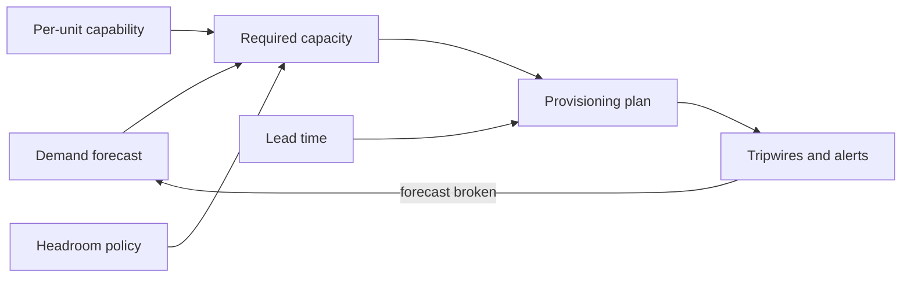
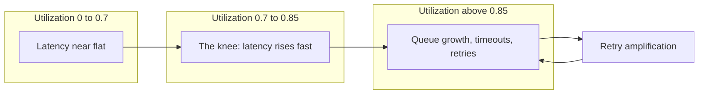
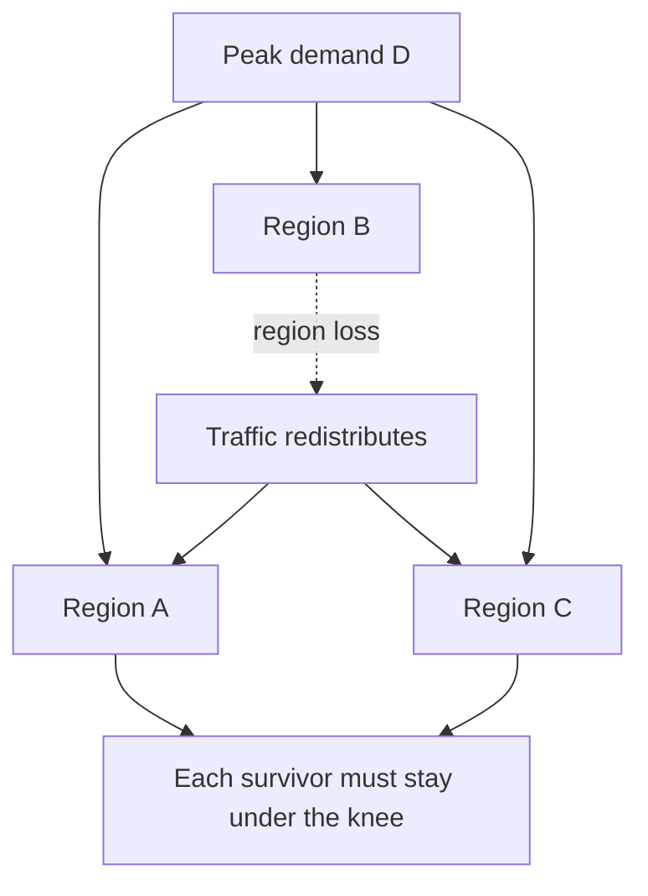
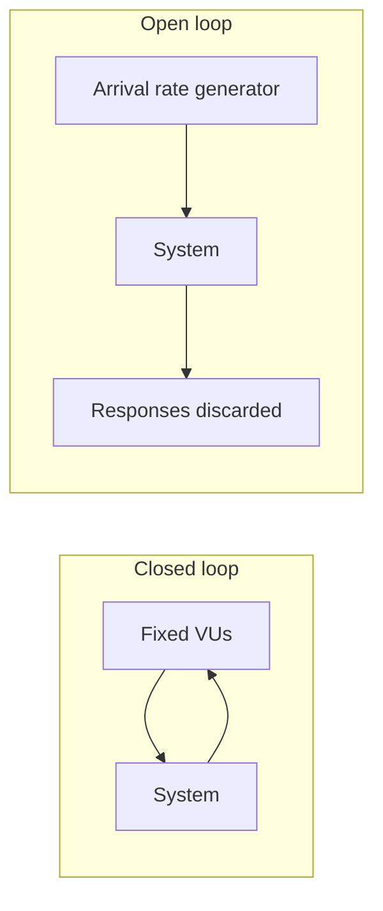
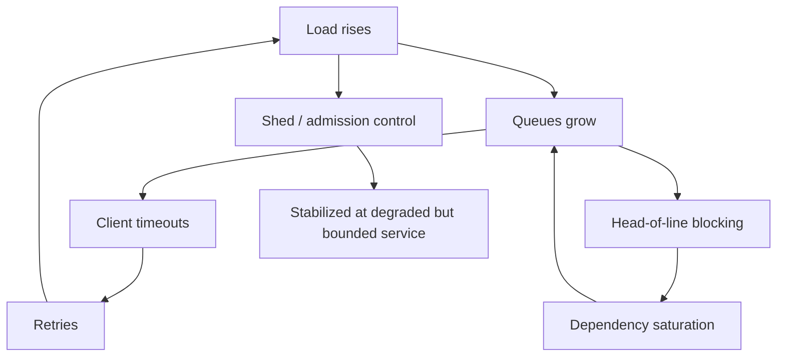

# F24 — Capacity Planning

**Capacity planning is the discipline of converting a demand forecast into a provisioning decision with an explicit, defensible safety margin — and the reason it is hard is that latency does not degrade linearly with load, it degrades hyperbolically.**

Most engineers can compute "requests per second divided by requests per second per box". That is arithmetic, not capacity planning. Capacity planning is deciding *what utilization is safe*, *how much headroom survives the loss of a failure domain*, *how fast you can acquire more*, and *what it costs to be wrong in each direction*. This page is about that decision.

---

## The Shape of the Problem

Capacity planning has four inputs and one output.

| Input | Question it answers | Typical source of error |
|---|---|---|
| Demand forecast | How much load, when? | Organic growth modelled linearly when it is compounding; marketing events not in the model |
| Service capability | How much can one unit absorb? | Measured with closed-loop load tests that hide the cliff |
| Safety margin | How much spare must exist? | Chosen as a round number ("50% headroom") with no derivation |
| Acquisition lead time | How fast can I get more? | Cloud assumed elastic; quota and instance-type scarcity ignored |

The output is a provisioning target and a set of tripwires that tell you when the forecast has broken.



!!! note "Capacity planning is a control loop, not a spreadsheet"
    The spreadsheet is the plant model. The tripwires are the feedback. A capacity plan without instrumented tripwires is an unverified prediction, and it will silently drift for two quarters before anyone notices.

---

## Little's Law

For any stable system, over a sufficiently long window:

$$
L = \lambda W
$$

where $L$ is the mean number of items concurrently in the system, $\lambda$ is the mean arrival rate, and $W$ is the mean time an item spends in the system.

The law is remarkable because it assumes almost nothing: no distributional assumptions, no independence, no service discipline. It holds for any "system" you can draw a boundary around — a thread pool, a connection pool, a queue, an entire service, a whole company's order pipeline.

### Applying it to thread pools

A synchronous request-per-thread service needs enough threads to cover the *concurrency* implied by arrival rate and latency, not the arrival rate itself.

$$
N_{\text{threads}} \ge \lambda \cdot W
$$

At $\lambda = 2{,}000\ \text{rps}$ and $W = 40\ \text{ms}$:

$$
N = 2000 \times 0.040 = 80 \text{ concurrent requests}
$$

Eighty threads is the *mean*. Provisioning for the mean guarantees queueing roughly half the time. You provision for the mean plus variability, then bound the pool so that overload turns into fast rejection rather than unbounded memory growth.

The dangerous property: $W$ is not a constant. If a downstream dependency slows from 40 ms to 400 ms, required concurrency goes from 80 to 800 at the same request rate. A fixed 100-thread pool that was 80% "utilized" is now 8x oversubscribed and the service falls over — not because traffic changed, but because *someone else's* latency changed.

!!! example "Little's Law as a saturation alarm"
    Compute $\lambda \cdot W$ continuously from your own metrics and compare it to pool size. The ratio is a dimensionless saturation signal that leads queue-depth alarms, because it rises the instant latency rises, before the queue physically fills.

    ```text
    thread_pool_demand = rate(requests_total[1m]) * histogram_quantile(0.5, latency)
    saturation         = thread_pool_demand / thread_pool_size
    ```

### Applying it to connection pools

Same law, different boundary. A database connection pool sized $P$ can sustain:

$$
\lambda_{\max} = \frac{P}{W_{db}}
$$

With $P = 20$ and mean query time $W_{db} = 5\ \text{ms}$, one application instance can drive $4{,}000$ queries per second — provided the database can absorb it. Multiply by instance count: 100 instances × 20 connections is 2,000 backend connections, which is where most Postgres deployments fall over from per-connection memory and scheduler overhead long before CPU saturates.

This is the classic three-way squeeze:

| Constraint | Formula | Failure mode when violated |
|---|---|---|
| App concurrency | $P \ge \lambda_{\text{inst}} \cdot W_{db}$ | Requests block waiting for a connection; app latency inflates by pool wait |
| DB connection ceiling | $\sum_i P_i \le C_{\max}$ | Connection refused; thundering reconnect storm |
| DB throughput | $\lambda_{\text{total}} \le \mu_{db}$ | Queries queue inside the DB; every client slows simultaneously |

The resolution is almost always a connection *proxy* (PgBouncer, ProxySQL, RDS Proxy) that decouples app-side pool sizing from backend connection count, plus a hard cap on app-side pool size so that overload manifests as pool-acquire timeouts you can shed, rather than as database meltdown.

??? note "Why a bigger pool usually makes things worse"
    Under saturation, the bottleneck is the backend's service rate $\mu$, not the number of in-flight requests. Adding connections does not increase $\mu$; it increases $L$, and by Little's Law with $\lambda$ fixed at $\mu$, $W$ grows proportionally. You have converted "fast failure at the pool boundary" into "everything is slow and nothing times out cleanly". Small pools plus explicit queue-wait timeouts are the correct overload posture.

---

## Utilization vs Latency: the Knee

Model a single server as M/M/1 — Poisson arrivals, exponential service times, one server, FIFO. Let $S$ be mean service time, $\mu = 1/S$ the service rate, $\lambda$ the arrival rate, and utilization $\rho = \lambda / \mu$.

Mean response time:

$$
W = \frac{1}{\mu - \lambda} = \frac{S}{1 - \rho}
$$

Mean queueing delay alone:

$$
W_q = \frac{\rho}{1 - \rho} S
$$

The term $\frac{1}{1-\rho}$ is the entire story of capacity planning.

| $\rho$ | Latency multiple $\frac{1}{1-\rho}$ | Queue wait $\frac{\rho}{1-\rho}$ (× S) | Marginal sensitivity $\frac{1}{(1-\rho)^2}$ | Latency increase from +1 point of $\rho$ |
|---|---|---|---|---|
| 0.50 | 2.0× | 1.0 | 4 | +2% |
| 0.70 | 3.3× | 2.3 | 11 | +3% |
| 0.80 | 5.0× | 4.0 | 25 | +5% |
| 0.85 | 6.7× | 5.7 | 44 | +7% |
| 0.90 | 10.0× | 9.0 | 100 | +11% |
| 0.95 | 20.0× | 19.0 | 400 | +25% |
| 0.99 | 100× | 99.0 | 10,000 | +100% |

Read the last column as: *how much worse does latency get if one extra percent of traffic arrives?* At 50% utilization a traffic surprise is absorbed. At 95% a traffic surprise is an outage.



### Why 70–80% is the practical ceiling

The knee is not a physical constant; it emerges from four compounding realities:

1. **The derivative explodes.** Beyond $\rho \approx 0.8$, small demand errors produce large latency errors. Your forecast is not accurate to one percent.
2. **Real arrivals are burstier than Poisson.** Poisson is the *optimistic* case. Real traffic has correlated bursts, so the effective knee sits lower than the M/M/1 curve predicts.
3. **Tail latency, not mean, is what you promise.** SLOs are written on p99. The p99 of an M/M/1 queue degrades faster than the mean because it is dominated by the queue's right tail.
4. **Retries close the loop.** Once latency crosses client timeouts, retries add load, which raises $\rho$, which raises latency. This positive feedback is why systems do not degrade gracefully past the knee — they collapse. (See [F17 Rate Limiting & Load Shedding](f17-rate-limiting-load-shedding.md) and [F18 Resilience Patterns](f18-resilience-patterns.md).)

!!! warning "M/M/1 is a teaching model, not a prediction engine"
    Real services are multi-server (M/M/c), have non-exponential service times, and are rarely FIFO. Use M/M/1 to reason about *shape* — the hyperbola, the knee, the sensitivity — and use measured load tests for the actual numbers. Quoting an M/M/1 latency prediction as a capacity number in an interview is a mistake; quoting the shape is a strength.

### Multi-server softens the knee

With $c$ servers behind a single queue, the Erlang-C model gives a materially better curve: work-conserving pooling means an idle server can absorb a burst. This is the mathematical argument for a shared load-balanced pool over per-tenant static partitions, and for L7 least-outstanding-requests over round-robin. A pool of 100 servers at 80% behaves far better than 100 independent servers each at 80%, because independent servers cannot lend each other capacity. (See [F03 Load Balancing](f03-load-balancing.md).)

---

## Variability: the Coefficient of Variation

Kingman's approximation for a G/G/1 queue makes the variability term explicit:

$$
W_q \approx \left(\frac{\rho}{1-\rho}\right)\left(\frac{c_a^2 + c_s^2}{2}\right) S
$$

where $c_a$ is the coefficient of variation of interarrival times and $c_s$ that of service times ($c = \sigma / \mu$). This is the **V·U·T** form: Variability × Utilization × Time.

| Regime | $c_s$ | Effect at $\rho = 0.8$ |
|---|---|---|
| Deterministic service (fixed work) | 0 | Queue wait halved vs exponential |
| Exponential service | 1 | Baseline |
| Mixed workload: cheap reads plus rare expensive scans | 3–5 | Queue wait 5–13× baseline |
| Unbounded query cost (no query timeout) | very large | Effectively unbounded |

The operational reading: **reducing variance buys the same latency improvement as reducing utilization, and is often cheaper.** Concretely:

- Separate expensive endpoints into their own pool or shard so a slow class cannot head-of-line block a fast class.
- Cap per-request work (row limits, result-set caps, query timeouts) to truncate $c_s$.
- Smooth arrivals: client-side jitter on cron and retry schedules, token buckets on batch producers.
- Prefer LIFO or shortest-remaining-time under overload for interactive traffic — LIFO under overload keeps recent (still-relevant) requests fast rather than making everything uniformly late.

!!! tip "The cheapest capacity you will ever buy"
    Adding jitter to a fleet-wide cron that fires at `:00` removes a synchronized arrival spike whose $c_a$ is enormous. One line of code frequently removes the need for 30% more machines.

---

## Headroom Targets

Headroom is not one number; it is the sum of the specific shocks you intend to survive.

$$
\text{Headroom} = 1 - \rho_{\text{target}}
$$

$$
\rho_{\text{target}} = \min\left(\rho_{\text{knee}},\ \frac{N-k}{N},\ \frac{1}{1 + b}\right)
$$

where $k$ is the number of concurrent failure domains you must survive, $N$ the total, and $b$ the largest instantaneous burst factor over forecast you must absorb without scaling.

| Shock | Typical reservation | Notes |
|---|---|---|
| Latency knee | keep $\rho \le 0.75$ | Derived from your own load test, not from theory |
| Failure domain loss | $\frac{N-k}{N}$ | 3 AZs, survive 1: 0.67 ceiling |
| Deployment surge | 5–15% | Rolling deploys remove capacity while adding it |
| Forecast error | 10–20% | Larger for new products, smaller for mature ones |
| Scale-up lag | burst × lag | See the autoscaling section |

These do not simply add — they compose as a minimum across independent constraints, then you take the tightest. Stating this composition out loud is one of the clearest signals of operational maturity in an interview.

---

## N+1 and N+2 Regional Math

Let total peak demand be $D$, spread across $N$ regions (or cells, or AZs) each provisioned with capacity $C$. To survive the loss of $k$ domains while keeping surviving domains below the knee $\rho_{\text{knee}}$:

$$
D \le (N - k)\, C\, \rho_{\text{knee}}
$$

Rearranged into a per-domain steady-state utilization ceiling:

$$
\rho_{\text{steady}} = \frac{D}{NC} \le \rho_{\text{knee}} \cdot \frac{N-k}{N}
$$

And the provisioning overbuild factor relative to a hypothetical perfectly-utilized single pool:

$$
f = \frac{N}{(N-k)\,\rho_{\text{knee}}}
$$

With $\rho_{\text{knee}} = 0.75$:

| $N$ | Survive $k$ | Steady-state $\rho$ ceiling | Overbuild factor $f$ | Interpretation |
|---|---|---|---|---|
| 2 | 1 (N+1) | 0.375 | 2.67× | Each region idle 62% of the time; classic active-active pair cost |
| 3 | 1 (N+1) | 0.500 | 2.00× | The standard AZ story |
| 3 | 2 (N+2) | 0.250 | 4.00× | Rarely justified at region granularity |
| 4 | 1 | 0.563 | 1.78× | Marginal cost of resilience drops fast with $N$ |
| 5 | 1 | 0.600 | 1.67× | |
| 5 | 2 | 0.450 | 2.22× | N+2 becomes affordable once $N \ge 5$ |
| 10 | 2 | 0.600 | 1.67× | Cell-based architecture economics |



**The key insight most candidates miss:** the marginal cost of N+1 falls as $N$ grows. Two regions surviving one loss requires 2.67× overbuild. Ten cells surviving two losses requires 1.67×. This is the economic engine behind cell-based architecture — you get *more* resilience for *less* overbuild by increasing the number of smaller failure domains. It is also why "just add a second region" is the most expensive form of redundancy per unit of protection.

!!! gotcha "N+1 at the region level does not imply N+1 at every dependency"
    Symptom: you fail out of Region B and the surviving regions immediately breach latency SLO despite having headroom. Mechanism: the stateless tier was provisioned N+1, but a shared global dependency — an auth service, a licence server, a single-writer database — was sized for aggregate steady-state, and it does not care which region the traffic came from. Mitigation: run the headroom calculation per dependency, including the ones you do not own. Regional failover redistributes load; it does not reduce it.

Static stability is the reinforcement of this idea: the surviving regions should already have the capacity *provisioned and warm*, not merely "available to autoscale into". Amazon's Builders' Library article "Static stability using Availability Zones" is the canonical treatment. See also [F26 Multi-Region & Disaster Recovery](f26-multi-region-dr.md).

---

## Load Testing: Open vs Closed Loop

This distinction is the single most common source of dangerously wrong capacity numbers.

=== "Closed loop"

    A fixed population of $V$ virtual users. Each user sends a request, **waits for the response**, thinks for $Z$ seconds, then sends the next.

    By Little's Law, throughput is:

    $$
    \lambda = \frac{V}{W + Z}
    $$

    Throughput is a *dependent* variable. If the system slows down, offered load automatically drops. The load generator is a negative feedback controller that protects the system under test.

=== "Open loop"

    Requests arrive at rate $\lambda$ regardless of whether prior requests have completed. Arrivals are typically Poisson or trace-driven.

    Throughput is an *independent* variable. If the system slows down, work piles up exactly as it does in production when real users, retries, and upstream services keep arriving.

| Property | Closed loop | Open loop |
|---|---|---|
| Load control | Concurrency (VUs) | Arrival rate (rps) |
| Behaviour past capacity | Self-throttles; latency rises smoothly | Queues grow unboundedly; system collapses |
| Reveals overload cliff | No | Yes |
| Models human users with think time | Reasonably | Only with care |
| Models machine callers, retries, fan-out | Poorly | Yes |
| Tools | JMeter default, Gatling default, Locust default | k6 `constant-arrival-rate`, Gatling open injection, wrk2, Vegeta |



!!! danger "Coordinated omission"
    A closed-loop generator that stalls waiting for a slow response **does not send** the requests it would otherwise have sent during that stall — and therefore never records their latency. The result is a latency histogram that systematically omits the worst samples, often understating p99 by an order of magnitude. Gil Tene's "How NOT to Measure Latency" is the definitive treatment. Tools that correct for this (wrk2, HdrHistogram-based harnesses, k6 arrival-rate executors) record latency against *intended* send time, not actual send time.

### A defensible load-testing methodology

```bash
# 1. Establish per-instance capability with a step-load open-loop ramp.
k6 run --vus 0 --duration 0 \
  --stage 5m:500 --stage 5m:1000 --stage 5m:1500 --stage 5m:2000 \
  --executor ramping-arrival-rate test.js

# 2. Find the cliff, not the "max sustainable rps". Push until error rate
#    or queue depth departs from baseline, then record the LAST GOOD rate.

# 3. Re-run at 90% of the cliff for 60+ minutes to expose leaks,
#    GC drift, connection churn, and log-volume-driven disk pressure.

# 4. Replay a production trace, not a synthetic uniform mix,
#    so that the service-time coefficient of variation is realistic.
```

Rules that separate a real test from theatre:

- **Test the whole request path**, including TLS handshakes, auth, and sidecars. A test that bypasses the mesh measures a system you do not run.
- **Warm caches deliberately, and also test cold.** Both numbers matter; cold is your failover number.
- **Include the retry policy** in the client. A test with retries disabled cannot show retry amplification.
- **Measure saturation signals**, not just latency: run-queue length, GC pause time, connection pool wait, disk queue depth.
- **Record the p99.9 with an HDR histogram**, not an averaged-over-time p99 from a metrics pipeline, which is mathematically meaningless when averaged across instances.

---

## Forecasting Demand

Three regimes, three models.

| Regime | Model | Fit | Warning sign |
|---|---|---|---|
| Mature product | Linear or seasonal-decomposed linear | $y_t = a + bt + s_t$ | Sudden slope change means a mix shift, not growth |
| Growth product | Exponential | $y_t = y_0 e^{gt}$; doubling time $t_2 = \frac{\ln 2}{g}$ | Straight line on a log plot; a linear model will underprovision within one quarter |
| Saturating market | Logistic | $y_t = \frac{K}{1 + e^{-g(t-t_0)}}$ | Exponential model overprovisions badly after the inflection |

Practical technique:

$$
\text{Required}_{t} = \underbrace{\text{Forecast}_{t}}_{\text{organic}} \times \underbrace{(1 + \epsilon)}_{\text{forecast error}} \times \underbrace{B}_{\text{peak-to-mean}} \times \underbrace{f}_{\text{redundancy overbuild}} \times \underbrace{\frac{1}{\eta}}_{\text{efficiency loss}}
$$

Forecast **per resource dimension separately**. A feature that doubles requests but quadruples bytes stored will break a plan built only on rps. Track at minimum: rps, concurrent connections, bytes stored, bytes transferred, and rows or partitions — each has a different growth rate and a different lead time.

!!! tip "Forecast the derivative, not just the level"
    Alert on *rate of change* of the forecast residual. A plan that is 5% off is fine. A plan whose error is growing 5% per week will be 60% off in a quarter, and that is the signal you want to catch, not the instantaneous miss.

---

## Lead Times

Elastic capacity is a marketing claim that is true only within a band you did not choose.

| Resource | Realistic lead time | What actually gates it |
|---|---|---|
| Autoscale existing instance type, warm AMI | 30 s – 5 min | Image pull, boot, health-check settling, cache warm |
| Autoscale into a scarce instance type | Minutes to never | Regional capacity for that family/AZ combination |
| Cloud quota increase (CPU, IPs, ENIs) | Hours to weeks | Support ticket, account-level review |
| Reserved / committed capacity | Days to weeks | Contracting |
| New region build-out | Weeks to months | Networking, data replication, compliance |
| Physical hardware (owned DC) | 3–12 months | Supply chain, rack, power, cooling |
| GPU / accelerator fleets | Months, allocation-gated | Vendor allocation, not money |
| Power and cooling in an owned facility | 12–24 months | Utility interconnect |

The planning rule: **your headroom must cover the longest lead time on the critical path.** If quota increases take three weeks, you need three weeks of growth in headroom *plus* the failure-domain reservation. Quota is the most frequently forgotten one — it is not a resource you consume gradually, it is a wall you hit at full speed.

```bash
# Quota headroom is a first-class capacity SLI. Track it, don't discover it.
aws service-quotas get-service-quota \
  --service-code ec2 \
  --quota-code L-1216C47A          # Running On-Demand Standard instances

# Alert when: (current_usage / quota) > 0.7  OR
#             (projected_usage_at_lead_time / quota) > 0.9
```

---

## Autoscaling Limits and the Scale-Up Lag Problem

Autoscaling is a control loop with dead time. Dead time is what makes control loops unstable.

$$
T_{\text{react}} = T_{\text{observe}} + T_{\text{decide}} + T_{\text{provision}} + T_{\text{warm}}
$$

Typical values: 60 s metric window, 60 s evaluation and cooldown, 90 s boot and image pull, 120 s JIT warm-up and cache fill. That is **five and a half minutes** from load arriving to that load being served well.

The capacity you must hold statically is therefore:

$$
C_{\text{static}} \ge D_0 + \left(\frac{dD}{dt}\right) \cdot T_{\text{react}}
$$

If demand ramps at 500 rps per minute and $T_{\text{react}} = 5.5$ min, you must already have 2,750 rps of unused capacity — before the first instance boots. Autoscaling handles the *hour*; static headroom handles the *minute*.

| Failure mode | Mechanism | Mitigation |
|---|---|---|
| Scale-up lag | Dead time exceeds ramp time | Static headroom sized to ramp rate; pre-warm on schedule |
| Metric feedback inversion | Overloaded instances report *lower* CPU because they are blocked on I/O | Scale on concurrency, queue depth, or in-flight requests, not CPU |
| Scale-in during a lull before a spike | Aggressive scale-in policy | Asymmetric policy: scale out fast, scale in slowly (10–15 min) |
| Oscillation | Cooldown shorter than warm-up | Cooldown > $T_{\text{warm}}$; use target-tracking with generous deadband |
| Cold instances poison the pool | New instances have empty caches, serve slow, get more traffic from least-latency LBs | Slow-start / warm-up ramp on the load balancer; ensure health checks fail until warm |
| Autoscaling into an exhausted pool | Insufficient capacity for the instance type in that AZ | Mixed instance policies, multiple families, capacity-optimized allocation |
| Downstream cannot scale with you | You add 200 app instances, the database connection limit is fixed | Cap max size to what dependencies can absorb; connection proxy |

!!! warning "Autoscaling maximums are a load-shedding policy in disguise"
    The `maxSize` on your ASG or HPA is the point at which your service stops absorbing load and starts failing. If you have not decided *how* it fails at `maxSize` — shed with 429s, degrade to a cached response, queue with a bounded queue — then you have delegated that decision to the OOM killer.

---

## Per-Instance Saturation Signals

Utilization is not one number. Pick the signal that actually binds for your workload.

| Signal | What it detects | Why it beats CPU% | Threshold heuristic |
|---|---|---|---|
| Run-queue length / PSI `some` pressure | CPU contention including involuntary waits | CPU% saturates at 100 and cannot express *how much* over | `pressure/cpu some avg10 > 20%` |
| In-flight request count | Direct Little's Law concurrency | Rises immediately when downstream slows | Compare to configured pool size |
| Queue depth and queue wait time | Head-of-line delay before work starts | Distinguishes "slow service" from "waiting to be served" | Queue wait > 10% of budget |
| Connection pool acquire wait | Downstream saturation | Leading indicator of cascading slowdown | p99 > 5 ms |
| GC pause time fraction | Heap pressure and allocation rate | Memory saturation appears as latency, not as OOM | > 5% of wall time |
| Disk queue depth / `await` | Storage saturation | IOPS% and throughput% both look fine at the knee | `await` > 2× device baseline |
| NIC packets-per-second, not bits | Small-packet limits on virtualized NICs | Bandwidth graphs look empty while PPS is capped | vs instance-type PPS limit |
| Ephemeral port / conntrack usage | NAT and connection-table exhaustion | Invisible in every standard dashboard | > 60% of table |
| Thread pool rejection count | The actual cliff | Binary, unambiguous | Any non-zero value is an incident |

!!! tip "Prefer signals that are dimensionless ratios"
    `in_flight / pool_size`, `queue_wait / latency_budget`, `quota_used / quota_limit`. Ratios are comparable across instance types, transfer between environments, and can be alerted on with a single global threshold. Absolute numbers require per-service tuning that nobody maintains.

See [F22 Observability Fundamentals](f22-observability-fundamentals.md) for how these fold into the USE and RED method dashboards.

---

## Peak, Average, and Event Spikes

Three different numbers, three different provisioning strategies.

| Demand class | Shape | Provisioning strategy | Cost posture |
|---|---|---|---|
| Average (baseline) | Flat, predictable | Reserved or committed capacity | Cheapest per unit; commit hard |
| Diurnal peak | Predictable sine, 2–4× trough | Scheduled scaling ahead of the ramp | On-demand plus schedule |
| Weekly / seasonal peak | Predictable, larger | Pre-scale, pre-warm, freeze changes | Short-term on-demand |
| Known event (launch, sale, sports final) | Step function, 10–100× | Manual pre-provision + load shedding plan + game day | Accept the waste; it is insurance |
| Unknown spike (viral, incident-driven retry storm) | Unbounded | Do **not** provision for it — shed for it | Zero cost; rely on graceful degradation |

Key ratios to track and quote:

$$
B = \frac{\text{Peak}}{\text{Mean}} \qquad \text{Utilization}_{\text{eff}} = \frac{\text{Mean}}{\text{Provisioned}} = \frac{\rho_{\text{peak}}}{B}
$$

A service with $B = 4$ that must stay at $\rho_{\text{peak}} = 0.7$ can never exceed 17.5% average utilization on statically provisioned capacity. That single number is usually the strongest argument for autoscaling, for serverless, or for co-locating an interruptible batch workload in the trough.

!!! example "The trough is an asset"
    Diurnal troughs are free compute you already paid for. Batch re-indexing, ML training, backup verification, and compaction belong there — provided they are preemptible and admission-controlled so they cannot survive into the ramp. This is how you turn a 17% utilization number into a 60% one without touching the serving path.

For unknown spikes, the correct answer in an interview is: **you do not plan capacity for the unbounded case, you plan behaviour.** Admission control, priority-aware shedding, and a degraded mode that is cheap to serve. See [F17 Rate Limiting & Load Shedding](f17-rate-limiting-load-shedding.md).

---

## Cost per Unit of Capacity

Capacity decisions become tractable when expressed as a unit cost:

$$
\text{Cost per request} = \frac{\text{Total monthly infra cost}}{\text{Monthly requests}}
$$

$$
\text{Cost per rps of provisioned capacity} = \frac{\text{Instance cost/hr}}{\text{rps per instance} \times \rho_{\text{target}}}
$$

The second formula is the one that changes behaviour, because $\rho_{\text{target}}$ is in the denominator. Dropping your utilization target from 0.75 to 0.50 for safety increases cost per unit of *usable* capacity by 50%. That is a legitimate trade, but it must be made explicitly, with the reliability benefit named.

| Lever | Effect on cost per usable rps | Risk introduced |
|---|---|---|
| Raise $\rho_{\text{target}}$ | Linear decrease | Latency knee, less failure headroom |
| Improve per-instance efficiency | Linear decrease | Engineering time; may increase $c_s$ |
| Reduce $c_s$ (bound request work) | Allows higher $\rho$ at same latency | Feature limits (result caps) |
| Increase $N$ (more, smaller cells) | Decreases overbuild factor $f$ | Operational complexity, more control planes |
| Shift baseline to committed capacity | 30–60% decrease on that portion | Commitment risk if demand falls |
| Shift burst to spot/preemptible | 60–90% decrease on that portion | Interruption handling required |

Full treatment in [F28 Cost Engineering](f28-cost-engineering.md).

---

## Gotchas & Corner Cases

!!! gotcha "Closed-loop load tests never reveal the overload cliff"
    **Symptom:** the load test shows a smooth latency curve up to 3,000 rps with no errors, so you provision for 3,000. In production the service collapses at 2,100 rps. **Mechanism:** virtual users wait politely for each response before sending the next. When the system slows, offered load automatically falls, so the generator can never push the system past its service rate. It is a negative-feedback loop that production does not have — real clients, upstream services, and retry loops keep arriving regardless. **Mitigation:** use an open-loop, arrival-rate-driven generator (k6 `constant-arrival-rate`, wrk2, Vegeta), push explicitly past the point of failure, and record the last rate at which error rate and queue depth stayed at baseline.

!!! gotcha "Coordinated omission silently deletes your worst latency samples"
    **Symptom:** load-test p99 is 80 ms; production p99 for the same throughput is 900 ms. **Mechanism:** when the generator blocks on a slow response, the requests it *would* have sent during that stall are never sent and never measured. The histogram is missing precisely the samples from the worst moments. **Mitigation:** measure latency from *intended* send time, use HdrHistogram-backed tooling, and cross-check the load-test histogram against production p99 at comparable throughput before trusting it.

!!! gotcha "CPU utilization goes down as an overloaded service gets worse"
    **Symptom:** the service is timing out, but the autoscaler will not scale because CPU is 45%. **Mechanism:** the bottleneck is a downstream dependency. Threads are blocked on I/O, not consuming CPU. As latency rises, each thread does *less* CPU work per unit of wall time, so CPU falls while concurrency saturates. **Mitigation:** scale on in-flight request count, queue depth, or concurrency-to-pool-size ratio. Keep CPU as a secondary signal only.

!!! gotcha "Averaged percentiles are arithmetically meaningless"
    **Symptom:** your dashboard shows a comfortable 120 ms p99, but customers report multi-second responses. **Mechanism:** the metrics pipeline computed p99 per instance per minute and then averaged those values across 200 instances and 60 minutes. The average of percentiles is not the percentile of the aggregate; a single instance at 8 s p99 disappears into the mean. **Mitigation:** aggregate histograms (Prometheus `histogram_quantile` over summed buckets, or HDR merge), never averages of quantiles. Also alert on per-instance max, which surfaces the sick outlier.

!!! gotcha "Doubling the connection pool converts fast failure into total unavailability"
    **Symptom:** pool-acquire timeouts appear, the pool is doubled to "fix" it, and the database now serves everyone slowly instead of some clients failing fast. **Mechanism:** the backend's service rate is fixed. By Little's Law, more in-flight work at the same throughput means proportionally more latency for every request. You removed the bulkhead. **Mitigation:** keep pools small, add a short pool-acquire timeout, and shed at the boundary. Size the pool from $\lambda \cdot W$ with the *healthy* $W$, and let it reject when $W$ degrades.

!!! gotcha "Regional headroom is consumed by the deploy you started five minutes ago"
    **Symptom:** a region fails over during a routine rolling deploy in a surviving region, and the surviving region breaches SLO despite the capacity math being correct. **Mechanism:** a rolling deploy with `maxUnavailable: 20%` removes a fifth of the fleet while pods restart with cold caches. Your N+1 calculation assumed 100% of the surviving fleet was serving. **Mitigation:** use surge deploys (`maxSurge`, `maxUnavailable: 0`), include deploy surge in the headroom budget explicitly, and enforce a policy that regional failover pauses in-flight deploys everywhere.

!!! gotcha "Autoscaling maximums are hit silently and look like an application bug"
    **Symptom:** latency climbs, error rate climbs, and no scaling event fires. Everyone debugs the application. **Mechanism:** the ASG or HPA is already at `maxReplicas`. Most autoscalers emit this as a low-severity event, not a metric, and nobody alerts on it. **Mitigation:** export `desired == max` as a metric and page on it. Do the same for cloud quota utilization. Treat "at maximum" as a saturation SLI, not a log line.

!!! gotcha "Instance-type capacity, not money, is the binding constraint during a regional event"
    **Symptom:** during an AZ impairment your autoscaler requests 300 instances and receives `InsufficientInstanceCapacity`. **Mechanism:** everyone else in that region is failing over into the same AZs at the same moment, requesting the same popular instance family. Cloud capacity is a shared, finite pool, and it is most scarce exactly when you need it. **Mitigation:** static stability — pre-provision the failover capacity and run it warm. Failing that, use mixed instance policies across at least three families and two sizes, and hold capacity reservations for the critical tier.

!!! gotcha "Cache hit ratio is a hidden capacity multiplier that vanishes under failover"
    **Symptom:** origin capacity sized at 5,000 rps is destroyed by a 50,000 rps flood after a cache tier restart. **Mechanism:** a 90% hit ratio means origin sees 10% of traffic. Losing the cache does not increase origin load by 10%; it increases it by 10×. Capacity plans built on steady-state origin rps encode the hit ratio as an invisible assumption. **Mitigation:** plan origin capacity for a defined cold-cache scenario, use request coalescing / single-flight at the cache tier, stagger cache restarts, and add origin-side admission control. (See [F04 Caching](f04-caching.md).)

!!! gotcha "Synchronized clients turn a modest fleet into a thundering herd"
    **Symptom:** a clean sawtooth spike every hour at `:00`, sized far above the mean, forcing you to provision for a spike that carries no business value. **Mechanism:** cron schedules, token refresh intervals, and fixed-interval polling all synchronize across the fleet. Retry storms after a brief blip re-synchronize clients that were previously spread out. **Mitigation:** full jitter on every scheduled and retried operation, randomized token TTLs, and server-driven `Retry-After` with jitter. The coefficient of variation of arrivals drops sharply and so does required capacity.

!!! gotcha "Per-tenant static partitioning destroys the pooling benefit"
    **Symptom:** aggregate fleet utilization is 35% but individual tenants are being throttled. **Mechanism:** dedicating fixed capacity per tenant means each tenant's shard must independently carry its own peak, and peaks do not coincide. You pay the peak-to-mean ratio $N$ times instead of once. **Mitigation:** pool capacity and enforce fairness with rate limits and priority queues rather than physical partitioning. Reserve true physical isolation for tenants where the compliance or blast-radius argument is explicit.

!!! gotcha "The forecast is right and the plan is still wrong because the mix changed"
    **Symptom:** rps forecast is accurate to 3%, yet the fleet is 40% short. **Mechanism:** a new client or feature shifted the request mix toward an expensive endpoint. Mean cost per request rose, so rps stopped being a valid capacity proxy. **Mitigation:** forecast in normalized work units (CPU-seconds, IO-operations, or a weighted "capacity unit" per endpoint class) and monitor cost-per-request as a first-class metric. A rising cost-per-request with flat rps is a capacity incident in slow motion.

---

## SRE Lens

### SLIs and SLOs

| SLI | Definition | Why it belongs in a capacity review |
|---|---|---|
| Headroom ratio | $1 - \frac{\text{peak demand}}{\text{provisioned capacity}}$ | The single number a capacity plan is accountable for |
| Failover headroom | Projected $\rho$ in survivors after losing the largest domain | Validates the N+k claim continuously |
| Saturation (per resource) | in-flight / pool, queue wait / budget, quota used / limit | Detects the binding constraint before latency moves |
| Quota headroom | Used / limit per cloud quota | Longest lead time on the critical path |
| Cost per request | Infra spend / requests | Detects mix shift and efficiency regressions |
| Scale-out latency | Time from trigger to healthy-and-warm | Sets required static headroom |

Capacity work is *error-budget-adjacent*: overload consumes budget quickly and predictably. If the error budget burns primarily during peak hours, you have a capacity problem, not a reliability-engineering problem. See [F23 SLI/SLO & Error Budgets](f23-slo-error-budgets.md).

### Failure modes and detection



- **Metastable failure:** the system remains collapsed after the triggering load is removed, sustained by retries and cold caches. Detection: throughput stays low while load falls. Recovery: shed aggressively, drain queues, restart with traffic ramped in slowly.
- **Silent capacity erosion:** a dependency's latency doubles, so your Little's Law concurrency doubles at the same rps. Detection: in-flight count trending up with flat request rate.
- **Quota wall:** binary, no warning. Detection: quota headroom SLI.

### Rollout and migration risk

- Rolling deploys consume headroom. Budget for `maxSurge` explicitly.
- A migration that runs dual-write doubles write capacity demand for its duration. Plan it as a capacity event.
- Instance-type migrations change per-instance capability; re-run the load test rather than assuming vCPU parity translates to rps parity.

### On-call runbook notes

- [ ] Confirm whether this is a demand problem (rps up) or a capability problem (cost-per-request up). The graphs are different and so are the fixes.
- [ ] Check `desired == max` on every autoscaling group in the path before debugging the application.
- [ ] Check quota headroom before requesting scale-out; a quota denial during an incident is a multi-hour delay.
- [ ] Prefer shedding low-priority traffic over scaling into an unknown cliff.
- [ ] If scaling out, ramp: add capacity in tranches and confirm downstream dependencies absorb each tranche.
- [ ] Record the observed cliff rate in the postmortem. That is a free, production-validated load test.

### Cost

Headroom is directly convertible to money. Present capacity decisions as: "moving from N+1 across 3 regions to N+1 across 5 cells reduces overbuild from 2.0× to 1.67×, saving roughly 17% of serving spend while improving blast radius." Naming both sides is what makes the recommendation credible.

---

## Interview Angle

!!! interview "Probe: how many servers do you need?"
    **Weak:** "Peak is 50,000 rps, each box does 1,000 rps, so 50 boxes." No headroom, no failure domains, no variability, no source for the 1,000.

    **Strong:** derive it. "Peak 50,000 rps. Load testing shows the cliff at 1,200 rps per instance; I plan to 75% of that, so 900 usable rps. Across 3 AZs surviving one loss, per-AZ steady-state utilization ceiling is $0.75 \times \frac{2}{3} = 0.5$. So required instances $= \frac{50{,}000}{900} \times \frac{3}{2} \approx 84$, rounded to 90 for deploy surge. I would validate that the database and the auth dependency can absorb 50,000 rps from two AZs, because failover redistributes load without reducing it."

!!! interview "Probe: why not run at 95% utilization?"
    **Weak:** "It's risky" or "best practice is 70%."

    **Strong:** "Because response time scales as $\frac{S}{1-\rho}$. At 95% the latency multiple is 20× service time and the *derivative* is 400 — a one-point demand surprise costs 25% more latency. My forecast is not accurate to one point, real arrivals are burstier than Poisson so the effective knee is lower still, and once latency crosses client timeouts, retries push $\rho$ up further, which is positive feedback. The practical ceiling is where the marginal sensitivity exceeds my forecast error, and empirically that is 70–80%."

!!! interview "Follow-up: your load test says 3,000 rps but production fails at 2,100. Why?"
    Name the mechanisms in order: closed-loop generator self-throttling, coordinated omission hiding the tail, synthetic uniform request mix understating service-time variance, cache warmed by repeated test keys, retries disabled in the test client, and the test bypassing the sidecar or TLS termination. Then say how you would distinguish them — that is what separates a strong answer from a list.

!!! interview "Probe: how do you size a thread pool or connection pool?"
    **Strong:** lead with Little's Law: $N = \lambda W$, so 2,000 rps at 40 ms is 80 concurrent. Then immediately name the failure mode: $W$ is set by a dependency you do not control, so a fixed pool sized for healthy $W$ becomes 10× oversubscribed when that dependency degrades. Conclude with the correct posture: small pool, short acquire timeout, shed at the boundary, and a connection proxy so app-side pool sizing is decoupled from backend connection limits.

!!! interview "Probe: how much does N+1 cost, and when does N+2 make sense?"
    **Strong:** give the formula $f = \frac{N}{(N-k)\rho_{\text{knee}}}$ and work two cases. Two regions surviving one loss is 2.67× overbuild. Ten cells surviving two losses is 1.67× — more resilience for less money. Then state the conclusion: N+2 is rarely affordable at region granularity and usually affordable at cell granularity, which is the economic case for cell-based architecture.

!!! interview "Probe: traffic will 10× for a launch next month. What do you do?"
    **Strong:** structure it. (1) Decompose the 10× per resource dimension — rps, storage, egress, connections — because they have different lead times. (2) Identify the longest lead time on the path, usually quota or a scarce instance family, and start those requests immediately. (3) Load test the *new* mix at 12× and find the cliff. (4) Pre-provision statically rather than trusting autoscaling, because scale-out dead time exceeds launch ramp time. (5) Build the degraded mode and shedding policy first — that is the only thing that works if the forecast is 30× rather than 10×. (6) Freeze changes and run a game day. Mention that step 5 is the one that actually saves the launch.

!!! interview "Trap: candidate says 'the cloud is elastic, we just autoscale'"
    Push back on yourself before the interviewer does. Elasticity has dead time ($T_{\text{react}}$ of several minutes), has a ceiling (`maxSize`, quota), depends on regional instance availability that is scarcest during correlated failover, and can outrun stateful dependencies. Autoscaling handles the hour; static headroom handles the minute; load shedding handles the unbounded case.

---

## Key Takeaways

- Little's Law ($L = \lambda W$) sizes every pool and queue you own, and its danger is that $W$ is controlled by dependencies rather than by you.
- Response time scales as $\frac{S}{1-\rho}$: the knee near 70–80% exists because the *derivative* explodes there, not because of a convention.
- Variability is the third axis — Kingman's $V \cdot U \cdot T$ shows that reducing service-time variance buys the same latency as reducing utilization, usually more cheaply.
- Headroom is a composition of named reservations (knee, failure domains, deploy surge, forecast error, scale-up lag), not a round number.
- Redundancy overbuild is $f = \frac{N}{(N-k)\rho_{\text{knee}}}$, and it falls sharply as $N$ grows — the economic argument for many small cells over two large regions.
- Closed-loop load tests structurally cannot find the overload cliff and structurally understate tail latency; use open-loop, arrival-rate-driven generators.
- Autoscaling has dead time, a ceiling, and a supply constraint; static headroom must cover the ramp rate over the full reaction time.
- Express every capacity decision as cost per unit of *usable* capacity, so that reliability and efficiency trade-offs are made explicitly rather than by default.

---

## Further Reading

- *Site Reliability Engineering* (Google), Chapter 11 "Being On-Call" and Chapter 21 "Handling Overload" — load shedding, graceful degradation, and the cost of criticality.
- *The Site Reliability Workbook* (Google), Chapter 11 "Managing Load" — practical capacity and load-management practices at Google scale.
- Amazon Builders' Library — "Static stability using Availability Zones" (Becky Weiss, Mike Furr): why failover capacity must be pre-provisioned rather than acquired during the event.
- Amazon Builders' Library — "Using load shedding to avoid overload" and "Timeouts, retries, and backoff with jitter".
- Gil Tene, "How NOT to Measure Latency" (Strange Loop / QCon talk) — coordinated omission and open vs closed loop measurement.
- Neil Gunther, *Guerrilla Capacity Planning* — the Universal Scalability Law, contention and coherency coefficients.
- Raj Jain, *The Art of Computer Systems Performance Analysis* — queueing theory grounding for M/M/1, M/M/c, and operational laws.
- Michael Nygard, *Release It!* (2nd ed.) — Chapters on stability antipatterns, particularly blocked threads, unbounded result sets, and integration points.
- Brendan Gregg, *Systems Performance* (2nd ed.) — the USE method and per-resource saturation signals.
- Wallace Hopp and Mark Spearman, *Factory Physics* — the VUT equation and the variability-utilization-time relationship in its original industrial form.
- Mogul and Wilkes, "Nines are not enough: meaningful metrics for clouds" (HotOS 2019) — on the limits of aggregate availability targets.
