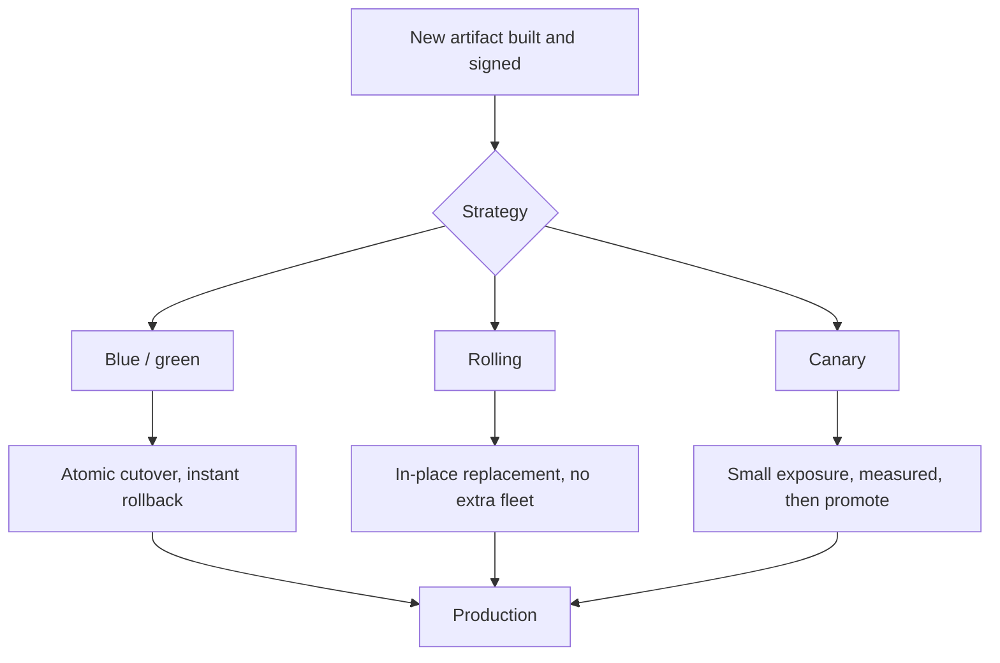
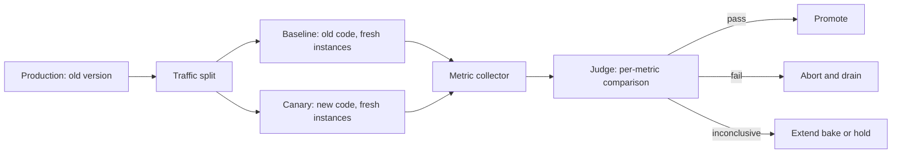
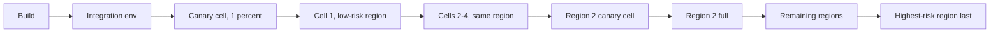
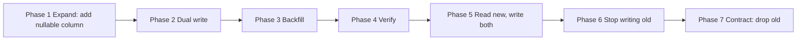
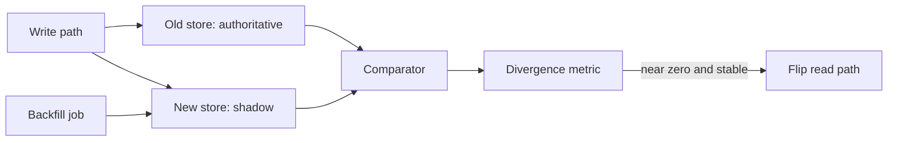
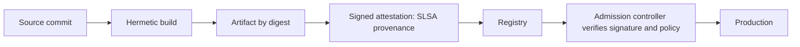

# F25 — Deployment & Release Safety

**Change is the dominant cause of outages, which means deployment strategy is not a delivery concern — it is a reliability control, and its job is to bound the blast radius and the time-to-detect of every change you make.**

The framing that matters: a deployment is an *experiment on production* whose null hypothesis is "this change is safe". Everything below is about making that experiment cheap to run, fast to evaluate, and trivially reversible.

---

## Why This Page Exists

Across public postmortems and internal incident data at large operators, the majority of user-visible incidents are triggered by an intentional change — a binary rollout, a config push, a flag flip, or a schema migration. Google's SRE material states it plainly; Amazon, Azure, and Cloudflare public incident reports repeat it. The corollary is uncomfortable but useful:

| If change causes most incidents, then... | The lever is... |
|---|---|
| Reducing change reduces incidents | ...but also reduces the ability to fix and improve. Not a real lever. |
| Reducing the *size* of each change reduces the blast radius | Small, frequent, independently revertible changes |
| Reducing *time to detect* reduces impact duration | Automated canary analysis with real SLIs |
| Reducing *time to revert* reduces impact duration | One-click rollback, immutable artifacts, no manual steps |
| Reducing the *fraction of users exposed* reduces impact | Progressive delivery across cells and regions |

MTTR, not MTBF, is where the leverage is. A team that deploys 40 times a day with 3-minute automated rollback has better availability than a team that deploys monthly with a 4-hour manual recovery, and the DORA research (Forsgren, Humble, Kim) shows this empirically: deploy frequency and change-failure recovery time are positively correlated, not in tension.

---

## Deployment Strategies



| Dimension | Blue/Green | Rolling | Canary |
|---|---|---|---|
| Extra capacity required | 100% (full parallel fleet) | 0–25% surge | 1–5% |
| Rollback speed | Seconds (flip router back) | Minutes to hours (roll backward) | Seconds (drain canary) |
| Blast radius during rollout | All-or-nothing at cutover | Grows monotonically | Bounded by canary share |
| Mixed-version window | Brief but total | Long, partial | Long, small |
| Detects slow-burn regressions | Poorly (cutover is instantaneous) | Poorly | Well (bake time) |
| Works for stateful services | Hard (data must be shared or migrated) | Yes, with care | Yes |
| Cost | High | Low | Low |
| Suits | Monoliths, DB-light services, appliances | Large stateless fleets | Everything, ideally combined |

The mature answer is not to choose one. Production-grade delivery is **rolling deploys within a cell, canary analysis gating cell promotion, blue/green semantics at the routing layer for instant reversal, and feature flags for the actual behaviour change.**

### Blue/green, precisely

Two identical environments; a router points at one. Deploy to the idle one, verify, flip.

- **Strength:** the rollback is a routing change, not a deployment. This is the fastest possible reversal.
- **Weakness one — the atomic cutover:** you go from 0% to 100% exposure in one step. If the defect is load-dependent or data-dependent, your verification on the idle stack proved nothing. Blue/green does not reduce blast radius; it reduces *recovery time*.
- **Weakness two — shared state:** if both stacks talk to the same database, "flipping back" does not undo the writes green made. Blue/green is a compute-tier pattern; it says nothing about data.
- **Weakness three — cold stack:** the green fleet has empty caches, cold JITs, and unwarmed connection pools. At cutover it absorbs 100% of traffic in its worst state. This is a real and frequent outage cause.

### Rolling, precisely

Replace instances in batches. In Kubernetes terms:

```yaml
strategy:
  type: RollingUpdate
  rollingUpdate:
    maxSurge: 25%          # add before removing: preserves capacity
    maxUnavailable: 0      # never dip below desired replicas
minReadySeconds: 30        # a pod must be Ready and stable this long
progressDeadlineSeconds: 600
```

`maxUnavailable: 0` with `maxSurge > 0` is the correct default for a capacity-constrained serving tier: you add capacity before removing it, so the deploy never eats into your failure headroom (see [F24 Capacity Planning](f24-capacity-planning.md)). The cost is that you need surge capacity available, which during a regional failover you may not have — hence the policy that failover pauses deploys.

`minReadySeconds` matters more than people expect: without it, a pod that passes its readiness probe at second 1 and crashes at second 20 will still let the rollout march forward, replacing the whole fleet with a crash-looping version.

### Canary, precisely

Route a small share of *real* traffic to the new version, compare it against a control, and promote or abort based on evidence.

The two ways to do it wrong:

1. **Canary against the historical baseline.** Comparing the canary at 14:05 against yesterday's 14:05 conflates the code change with every other difference between those two moments. Correct: run a *baseline* deployment of the **old** code, freshly started, alongside the canary, and compare those two. This controls for JVM warm-up, cache state, host generation, and time-of-day.
2. **Canary with no statistical discipline.** "Errors look fine" on 400 requests over 3 minutes is not a signal.

---

## Automated Canary Analysis



### Metric selection

Choose metrics that are causally connected to user harm and that move fast enough to be observable in a canary window.

| Tier | Metric | Why | Comparison |
|---|---|---|---|
| Must | Error rate (5xx, and business-level failures) | Direct SLI | Canary vs baseline, one-sided |
| Must | Latency p50 and p99 | Direct SLI; p99 catches GC and lock regressions | One-sided (worse only) |
| Must | Crash / restart count, OOM kills | Catastrophic and unambiguous | Any increase fails |
| Should | Saturation: CPU, heap, in-flight, GC time | Leading indicator of a slow-burn failure | Two-sided; a large *drop* is also suspicious |
| Should | Downstream call rate per request | Detects accidental N+1 query or retry amplification | One-sided |
| Should | Log-error rate by exception class | Catches handled-but-wrong behaviour | One-sided |
| Business | Conversion, playback start, checkout success | Catches "works but is wrong" | Requires longer window |
| Never alone | Request rate | Traffic differences are expected by design |

!!! warning "A metric that only moves under real load or real data is invisible in staging"
    That is the whole argument for canaries. Staging has synthetic data, a fraction of the concurrency, and none of your pathological users. The canary is the first honest test.

### Statistical significance

The core problem: you are running many simultaneous comparisons on noisy, autocorrelated, non-normal time series, with a small sample. Naive per-metric thresholds produce constant false alarms; teams then ignore the canary, which is worse than not having one.

What works in practice:

- **Non-parametric tests.** Mann-Whitney U (rank-sum) on paired time buckets rather than a t-test, because latency distributions are heavy-tailed and not normal. Netflix's Kayenta uses this approach.
- **Effect size, not just p-value.** With enough samples, a 0.4 ms latency difference becomes "statistically significant" and meaningless. Gate on a *minimum detectable effect* you actually care about, e.g. "fail if canary p99 is more than 10% worse with $p < 0.01$".
- **Multiple-comparison control.** With 30 metrics at $\alpha = 0.05$, the probability of at least one false positive is $1 - 0.95^{30} \approx 79\%$. Apply Bonferroni or Benjamini-Hochberg, or classify metrics into critical (any failure aborts) and informational (reported, not gating).
- **Three outcomes, not two.** Pass / fail / **inconclusive**. Inconclusive means "insufficient signal" and should extend the bake or require a human, not auto-promote.

Required sample size for detecting a proportion change (error rate $p$, relative effect $\delta$) is roughly:

$$
n \approx \frac{2\,(z_{\alpha/2} + z_{\beta})^2\, p(1-p)}{(\delta p)^2}
$$

!!! example "Why low-error-rate services need long canaries"
    Baseline error rate $p = 0.001$. To detect a doubling ($\delta = 1.0$) at 95% confidence and 80% power: $n \approx \frac{2 \times (1.96 + 0.84)^2 \times 0.001 \times 0.999}{(0.001)^2} \approx 15{,}700$ requests **per arm**. At 1% canary share of a 2,000 rps service, the canary receives 20 rps, so you need roughly **13 minutes** minimum — and that is for a 2× regression, ignoring multiple comparisons. Detecting a 10% error-rate increase at the same confidence needs about 100× more samples. *Illustrative order-of-magnitude; the point is the shape, not the digits.*

    The practical consequences: raise canary share for short bakes, extend bake time for low-traffic services, or accept that rare-event regressions are found by progressive rollout and fast rollback rather than by canary statistics.

### Duration

| Factor | Pushes bake time up | Pushes it down |
|---|---|---|
| Low traffic | Yes | |
| Low baseline error rate | Yes | |
| Memory leaks, FD leaks, connection churn | Yes (need 30–60 min minimum) | |
| Cache-warming effects | Yes (exclude the first 5–10 min) | |
| Batch/cron-triggered code paths | Yes (must span at least one cycle) | |
| High deploy frequency / small changes | | Yes |
| Strong flag-level control downstream | | Yes |

A defensible default: **discard the first 5 minutes (warm-up), bake for 20–30 minutes at 1–5%, then promote in stages with shorter analysis at each stage.** Anything leak-shaped needs a long soak somewhere in the pipeline, and that is better done in a dedicated soak stage than by making every deploy slow.

---

## Progressive Delivery Across Cells and Regions



Rules that make this work:

- **Never deploy to two regions concurrently** for a critical tier. Concurrency destroys the entire value of staged rollout: your surviving region is now running the same suspect code.
- **Order by blast radius, not by convenience.** Smallest and least revenue-critical first; the region with your largest customer last.
- **Bake between stages**, and make the bake time proportional to the exposure increase. Going 1% to 5% needs less soak than 25% to 100%.
- **Waves must be independently haltable.** A single command stops the pipeline everywhere and holds the current state.
- **Cell-level isolation means a bad deploy affects one cell's tenants**, which is a categorically different incident from a global one. This is the operational payoff of cell-based architecture (see [F26 Multi-Region & Disaster Recovery](f26-multi-region-dr.md)).

!!! gotcha "One-box first, always"
    Before any percentage-based canary, deploy to exactly one instance and let it serve real traffic. The class of bugs that kill on startup — bad config, missing secret, wrong image tag, incompatible library — is caught in 60 seconds with one instance of exposure, before you spend 30 minutes of canary analysis discovering it at 5%.

---

## Feature Flags: Decoupling Release from Deploy

**Deploy** = new code is running. **Release** = new behaviour is reaching users. Conflating them means every behaviour change carries binary-rollout risk, and every binary rollback un-releases unrelated features.

| Property | Deploy-gated change | Flag-gated change |
|---|---|---|
| Time to enable | Minutes to hours (full pipeline) | Seconds |
| Time to disable | Full rollback of the artifact | Seconds, targeted |
| Granularity | Instance / cell / region | User, tenant, percentage, attribute |
| Reverts unrelated changes | Yes | No |
| Testable in production before release | No | Yes (internal-only targeting) |
| Adds runtime risk | No | Yes: flag service is now on the critical path |
| Adds code complexity | No | Yes: combinatorial paths, dead code |

```python
# The non-negotiable property of a flag evaluation: it must never fail closed
# in a way that takes down the request path.
def is_enabled(flag: str, ctx: Context) -> bool:
    try:
        return flag_client.evaluate(flag, ctx)      # local in-memory cache
    except FlagServiceUnavailable:
        return DEFAULTS[flag]                        # baked into the binary
```

Operational rules:

- **Evaluate locally.** The SDK streams rule updates and evaluates in-process. A synchronous network call per flag per request puts a third-party service on your critical path and multiplies your latency budget.
- **Ship a compiled-in default** for every flag so that a total flag-service outage degrades to a known, tested configuration.
- **Flags are changes.** They need the same progressive rollout, audit trail, and automated analysis as a binary. A flag flip that skips canary analysis is a global deploy with no safety net — and it is *faster* than a deploy, which is exactly why flag-flip incidents are so damaging.
- **Flags expire.** Track flag age; enforce cleanup. Ten long-lived boolean flags mean $2^{10}$ possible configurations, of which you have tested perhaps three.
- **Sticky bucketing.** Hash on a stable user ID so a user does not oscillate between variants on every request, which is both a bad experience and a source of inconsistent state.

!!! danger "The kill switch must not depend on the thing it kills"
    If disabling a feature requires the feature's own service to be healthy, or requires a full deploy, it is not a kill switch. Test the kill path in a game day, not during an incident.

---

## Database Schema Migration: Expand / Contract

The only safe way to change a schema under a rolling deploy is to make each step compatible with the versions on either side of it. Expand/contract (also called parallel change) formalizes this.



Worked example: splitting `users.full_name` into `first_name` and `last_name`.

=== "Phase 1 — Expand"

    Additive, backward compatible. Old code ignores the new columns entirely.

    ```sql
    -- Nullable, no default, no rewrite. Safe online in PG 11+ and MySQL 8 with INSTANT.
    ALTER TABLE users ADD COLUMN first_name text NULL;
    ALTER TABLE users ADD COLUMN last_name  text NULL;

    -- Index created without blocking writes. Postgres:
    CREATE INDEX CONCURRENTLY idx_users_last_name ON users (last_name);
    -- MySQL 8: ALTER TABLE users ADD INDEX idx_users_last_name (last_name), ALGORITHM=INPLACE, LOCK=NONE;
    ```

    **Deploy nothing yet.** Schema change lands alone so it can be reverted alone.

=== "Phase 2 — Dual write"

    Deploy application code that writes both representations and still reads the old one. This version is safe to roll back, because the old column remains authoritative.

    ```sql
    -- Application writes both on every INSERT/UPDATE.
    UPDATE users
       SET full_name  = $1,
           first_name = $2,
           last_name  = $3
     WHERE id = $4;
    ```

    ```sql
    -- Belt and braces for writers you do not control (admin tools, ETL, that one
    -- legacy job nobody owns). Remove in Phase 6.
    CREATE FUNCTION sync_name() RETURNS trigger AS $$
    BEGIN
      IF NEW.first_name IS NULL AND NEW.full_name IS NOT NULL THEN
        NEW.first_name := split_part(NEW.full_name, ' ', 1);
        NEW.last_name  := nullif(substr(NEW.full_name,
                                        length(split_part(NEW.full_name,' ',1)) + 2), '');
      END IF;
      RETURN NEW;
    END $$ LANGUAGE plpgsql;

    CREATE TRIGGER trg_sync_name BEFORE INSERT OR UPDATE ON users
      FOR EACH ROW EXECUTE FUNCTION sync_name();
    ```

=== "Phase 3 — Backfill"

    Chunked, rate-limited, resumable, and idempotent. Never a single `UPDATE users SET ...` — that takes a table-wide lock footprint, generates one enormous transaction, blows up replication lag, and cannot be paused.

    ```sql
    -- Repeat until zero rows affected. Driven by a script with a sleep between batches.
    WITH batch AS (
      SELECT id FROM users
       WHERE first_name IS NULL AND full_name IS NOT NULL
       ORDER BY id
       LIMIT 5000
       FOR UPDATE SKIP LOCKED
    )
    UPDATE users u
       SET first_name = split_part(u.full_name, ' ', 1),
           last_name  = nullif(substr(u.full_name,
                               length(split_part(u.full_name,' ',1)) + 2), '')
      FROM batch b
     WHERE u.id = b.id;
    ```

    ```bash
    # Backfill driver: throttle on replication lag, not on wall-clock guesses.
    while :; do
      lag=$(psql -tAc "SELECT COALESCE(EXTRACT(EPOCH FROM now()-pg_last_xact_replay_timestamp()),0)" -h replica)
      if (( $(echo "$lag > 5" | bc -l) )); then sleep 30; continue; fi
      rows=$(psql -tAc "$BATCH_SQL")
      [[ "$rows" == "UPDATE 0" ]] && break
      sleep 0.5
    done
    ```

=== "Phase 4 — Verify"

    Do not proceed on faith. Prove equivalence.

    ```sql
    -- 1. Completeness: no unbackfilled rows remain.
    SELECT count(*) AS missing
      FROM users
     WHERE full_name IS NOT NULL AND first_name IS NULL;

    -- 2. Correctness: sample-based reconstruction check.
    SELECT count(*) AS mismatched
      FROM users
     WHERE full_name IS DISTINCT FROM
           btrim(concat_ws(' ', first_name, last_name));

    -- 3. Ongoing divergence: are live writes staying in sync?
    SELECT count(*) AS recent_mismatch
      FROM users
     WHERE updated_at > now() - interval '1 hour'
       AND full_name IS DISTINCT FROM btrim(concat_ws(' ', first_name, last_name));
    ```

    Query 3 is the one people skip and the one that catches a writer you forgot about.

=== "Phase 5 — Read new"

    Deploy code that reads the new columns and still writes both. **This is the first irreversible-ish step**, so it gets its own canary and its own bake. If it fails, rolling back to the Phase 2 binary is safe because both representations are still being maintained.

    ```sql
    SELECT id, first_name, last_name FROM users WHERE id = $1;
    ```

=== "Phase 6 — Stop writing old"

    Only after Phase 5 has been stable across every region, and after the rollback window has closed.

    ```sql
    DROP TRIGGER trg_sync_name ON users;
    DROP FUNCTION sync_name();
    ```

    Deploy application code that no longer writes `full_name`. Add the constraint you actually wanted, without a full-table validating lock:

    ```sql
    ALTER TABLE users ADD CONSTRAINT users_first_name_not_null
      CHECK (first_name IS NOT NULL) NOT VALID;      -- instant, applies to new rows
    ALTER TABLE users VALIDATE CONSTRAINT users_first_name_not_null;  -- scans, no write lock
    ```

=== "Phase 7 — Contract"

    Days or weeks later, once you are certain nothing reads it. Search the codebase, then check actual query logs, then drop.

    ```sql
    ALTER TABLE users DROP COLUMN full_name;
    ```

    Dropping a column is not reversible by rollback — the data is gone. Keep a verified backup and a documented restore path before this step.

!!! gotcha "Migration and deploy must never be in the same atomic unit"
    Symptom: a rollback of the binary leaves the database in a shape the old binary cannot read. Mechanism: a pipeline that runs `migrate && deploy` couples two things with different reversibility properties — code is reversible, schema often is not. Mitigation: ship schema changes as their own release, one phase at a time, each independently deployable and independently revertible, with an explicit gate between phases.

### Migration safety table

| Operation | Online safe? | Notes |
|---|---|---|
| `ADD COLUMN` nullable, no default | Yes (PG 11+, MySQL 8 INSTANT) | The safe primitive |
| `ADD COLUMN` with non-volatile default | PG 11+ yes; older PG rewrites table | Check your version |
| `DROP COLUMN` | Metadata-only, but breaks old readers | Contract phase only |
| `RENAME COLUMN` | **Never do it** | Use expand/contract; a rename is atomic in the DB and non-atomic in your fleet |
| `ADD INDEX` | Yes with `CONCURRENTLY` / `LOCK=NONE` | `CONCURRENTLY` cannot run in a transaction and can leave an invalid index |
| `ADD NOT NULL` | Two-step via `CHECK ... NOT VALID` then `VALIDATE` | Direct `SET NOT NULL` takes a strong lock and full scan |
| `ADD FOREIGN KEY` | `NOT VALID` then `VALIDATE` | Same pattern |
| Change column type | Usually a rewrite | Expand/contract into a new column |
| `ALTER TABLE` on a huge table in MySQL | Use gh-ost or pt-online-schema-change | Copies table, swaps atomically |

---

## Serialization Compatibility

Every rolling deploy creates a window where version $N$ and version $N+1$ exchange messages and share persisted state. Compatibility is therefore bidirectional.

| Term | Meaning | Who needs it |
|---|---|---|
| Backward compatible | New code reads old data | The upgraded reader |
| Forward compatible | Old code reads new data | The not-yet-upgraded reader |
| Full compatible | Both | Anything rolling, queued, or persisted |

| Format | Forward compat mechanism | Main trap |
|---|---|---|
| Protobuf | Field numbers; unknown fields preserved on round-trip (proto3 since 3.5) | Changing a field's *type* or reusing a retired number silently corrupts data. Always `reserved`. |
| Avro | Writer schema + reader schema resolution via a registry | Requires the writer schema to be retrievable; a registry outage stops consumption |
| Thrift | Field IDs, similar to protobuf | Same reuse hazard |
| JSON | Ignore-unknown-fields by convention | Strict deserializers (`FAIL_ON_UNKNOWN_PROPERTIES`) break forward compat by default |
| Language-native (Java serialization, pickle) | None worth relying on | Never use across a version boundary or a trust boundary |

Rules:

- **Additive only within a version.** Add optional fields; never remove or repurpose in the same release as a semantic change.
- **Never reuse a field number or tag.** Mark it `reserved`.
- **Two-phase enum changes.** Deploy readers that tolerate an unknown enum value *before* any writer can emit it. Otherwise the first message with the new value crashes every old consumer simultaneously — the worst kind of correlated failure.
- **Persisted data has an unbounded compatibility horizon.** A message in a dead-letter queue may be replayed a year later. Row data outlives every binary. Design as if the reader is arbitrarily old.
- **Enforce compatibility in CI.** `buf breaking`, Confluent Schema Registry compatibility checks, or an equivalent gate. Compatibility that depends on reviewer diligence is compatibility you do not have.

---

## Dual Write, Backfill, and Verification

Same shape as schema migration, applied to whole datastores.



| Stage | Authoritative | Rollback | Exit criterion |
|---|---|---|---|
| Shadow write | Old | Trivial: stop writing new | Write success rate on new store matches old |
| Backfill | Old | Trivial | Row counts and checksums converge |
| Shadow read + compare | Old | Trivial | Divergence rate below threshold for N days across all query shapes |
| Read new, write both | New (reads) | Redeploy previous binary | Error rate and latency unchanged |
| Stop writing old | New | Requires reverse backfill | Confidence plus a retained snapshot |
| Decommission | New | None | Explicitly accepted |

!!! gotcha "Dual write is not atomic and will diverge"
    Symptom: the comparator shows 0.05% divergence that never goes away. Mechanism: writing to two stores without a transaction means any process crash, timeout, or partial failure between the two writes leaves them inconsistent — and retries of a non-idempotent write make it worse. Mitigation: accept divergence as a *measured* quantity, drive it down with a continuous reconciliation job, and prefer change-data-capture from the authoritative store over application-level dual write when the sources allow it. Also make both writes idempotent and keyed so replay converges. (See [F11 Idempotency](f11-idempotency.md) and [F10 Distributed Transactions](f10-distributed-transactions.md).)

Verification techniques, in increasing order of confidence:

1. Row counts per partition.
2. Rolling checksums over key ranges (Merkle-style), which localize the divergence.
3. Shadow reads: serve from old, also read from new, compare, log mismatches, never let the comparison affect the response or the latency budget.
4. Replay of a production query trace against both stores.

---

## Rollback vs Roll-Forward

**Default to rollback.** It returns to a known-good state that has been running in production; roll-forward returns to a state that has never run anywhere. During an incident, with a degraded team and a ticking error budget, "known-good" is worth a great deal.

| Situation | Choose | Why |
|---|---|---|
| Regression detected in canary | Rollback | Cheapest, fastest, zero user impact accrued |
| Regression detected after full rollout, no data written | Rollback | Still clean |
| New version wrote data the old version cannot parse | Roll-forward | Rollback creates a second, worse incident |
| Schema contracted (column dropped) | Roll-forward | The data is gone |
| Irreversible external side effect (emails sent, payments captured) | Roll-forward + compensate | Rollback does not un-send |
| Rollback would reintroduce a security fix regression | Roll-forward | Trading one vulnerability for another |
| Cause unknown, impact ongoing | Rollback | Diagnose from a stable position, not a burning one |

**When rollback is impossible** — and knowing this list is the mark of experience:

- Schema contraction already executed.
- Data written in a new format without a compatible reader in the old binary.
- Consumer offsets or checkpoints advanced past messages the old code cannot process.
- Cache or persisted state populated with new-format entries that the old code deserializes incorrectly (worse than failing: silent corruption).
- Downstream systems already notified irreversibly.
- Cryptographic material rotated with no old-key path.
- Client-side code already shipped to devices you do not control (mobile apps, embedded).

The mitigation is process, not heroics: **maintain an explicit rollback window** — "version $N$ can always be rolled back to $N-1$ for 7 days" — and treat any change that violates it as a special release requiring its own plan, its own approval, and a rehearsed forward-fix path.

!!! tip "Test the rollback, not just the deploy"
    A rollback path that has never been executed is a hypothesis. Include an automatic rollback rehearsal in the pipeline: deploy $N$ to a canary cell, roll back to $N-1$, assert health. It costs minutes and converts your most important emergency procedure from theory to routine.

---

## Change Freeze Policy

Freezes are a blunt instrument with real costs. Use them deliberately.

| Type | Trigger | Scope | Cost |
|---|---|---|---|
| Business-critical event freeze | Black Friday, tax deadline, sports final | All non-emergency changes | Backlog builds up; the post-freeze release is huge and risky |
| Incident freeze | Active SEV | The affected service and its dependencies | Necessary; prevents confounding the investigation |
| Error-budget freeze | Budget exhausted | Feature changes only; reliability work proceeds | Aligns incentives (see [F23 SLI/SLO & Error Budgets](f23-slo-error-budgets.md)) |
| Holiday freeze | Reduced staffing | Usually too broad | Often net-negative |

!!! gotcha "Freezes convert many small risks into one enormous one"
    Symptom: the first release after a two-week freeze causes a major incident. Mechanism: two weeks of changes ship as one batch, so the change is large, the causal search space is huge, and the rollback reverts dozens of unrelated things. Meanwhile the team's deploy muscle memory has decayed and the pipeline may have bit-rotted. Mitigation: prefer *risk-tiered* freezes (block high-risk categories: schema, config, network, dependency upgrades; allow low-risk ones) and mandate a staged, slow re-entry with smaller-than-usual batches after the freeze lifts.

Emergency changes need a defined path: a documented approver, mandatory canary even under pressure, and a retrospective. "Emergency" must not mean "no safety controls" — most compounding incidents involve a hurried fix deployed without staging.

---

## Deploy Velocity vs Safety

The intuition that they trade off is wrong at the level that matters.

$$
\text{Expected impact} = f_{\text{change}} \times P(\text{failure}) \times \text{Users exposed} \times \text{MTTR}
$$

Raising deploy frequency $f_{\text{change}}$ *lowers* the other three terms when the pipeline is good, because each change is smaller:

- Smaller diffs mean lower $P(\text{failure})$ per change and a much smaller causal search space during an incident.
- More frequent deploys mean the rollback path is exercised constantly, driving MTTR down.
- A well-practised pipeline supports finer progressive delivery, lowering exposure.

The failure mode is *velocity without the controls*: high frequency plus no canary, no progressive rollout, and manual rollback. That is strictly worse than infrequent deploys. Velocity is safe only as the output of automation, never as a target imposed on a manual process.

| DORA metric | What it measures | Capacity/reliability reading |
|---|---|---|
| Deployment frequency | Batch size proxy | Higher is better *if* change failure rate holds |
| Lead time for changes | Pipeline health | Long lead time means large, stale batches |
| Change failure rate | Quality of gates | Should be flat or falling as frequency rises |
| Time to restore service | MTTR | The metric with the most direct availability leverage |

---

## Artifact Immutability and Provenance



| Practice | Failure it prevents |
|---|---|
| Reference images by digest, never by mutable tag | The `:latest` or `:v1.2` tag being rebuilt under you, so "the same version" is a different binary in different cells |
| Build once, promote the same artifact through environments | Environment-specific rebuilds that make staging non-representative |
| Hermetic, reproducible builds | Dependency drift between build time and deploy time |
| Sign artifacts (Sigstore/cosign, Notary) | Registry compromise, supply-chain substitution |
| SLSA provenance attestations | Inability to prove what source produced a running binary |
| Admission control verifying signature and provenance | Unsigned or untracked images reaching production |
| SBOM generation and storage | Not knowing whether you are exposed to a new CVE |
| Config as versioned artifact with the same pipeline | Config changes bypassing every deployment safety control |

```bash
# Immutable by digest. This is what should appear in the deployment manifest.
IMAGE="registry.example.com/api@sha256:9f2a...c31d"

cosign verify \
  --certificate-identity-regexp '^https://github\.com/org/repo/\.github/workflows/.*' \
  --certificate-oidc-issuer https://token.actions.githubusercontent.com \
  "$IMAGE"

cosign verify-attestation --type slsaprovenance "$IMAGE"
```

!!! danger "Configuration is the least-controlled, highest-blast-radius change type"
    Config changes are frequently global, instantaneous, unversioned, and exempt from canary analysis — the exact opposite of every property you want. Several of the largest public internet outages of the last decade were config pushes, not code. Config must go through the same pipeline as code: versioned, reviewed, canaried, progressively rolled out, and revertible by the same mechanism.

---

## Gotchas & Corner Cases

!!! gotcha "Blue/green flips 100% of traffic onto a cold stack"
    **Symptom:** the cutover looks fine for 30 seconds, then latency spikes 10× and the fleet sheds load, despite the green stack passing every health check. **Mechanism:** the green fleet has empty local and remote caches, unoptimized JIT code, cold connection pools, and unwarmed TLS session caches. It passed health checks under zero load and then received 100% of production in its worst possible state; the resulting origin/database load is also far above steady state. **Mitigation:** warm the green stack with mirrored traffic before cutover, or shift traffic in weighted steps (which makes it a canary), and size the origin/database for a cold-cache scenario.

!!! gotcha "Canary analysis against yesterday's baseline attributes the wrong cause"
    **Symptom:** canaries fail every Monday morning and pass every Tuesday afternoon, regardless of the change. **Mechanism:** comparing canary metrics against a historical time-shifted baseline conflates the code change with traffic mix, seasonality, host generation, neighbour noise, and JIT/cache state. **Mitigation:** run a fresh baseline deployment of the *old* code alongside the canary, started at the same time, receiving the same traffic share, on the same instance types. Compare canary to baseline, never to history.

!!! gotcha "The canary is statistically incapable of seeing the regression you care about"
    **Symptom:** the canary passes, full rollout doubles the error rate. **Mechanism:** at 1% traffic share for 10 minutes on a service with a 0.1% baseline error rate, the canary saw a few hundred requests and maybe zero errors in each arm. There was never enough sample to reject the null hypothesis. **Mitigation:** compute the required sample size for the effect you want to detect; if it is unreachable, say so explicitly and compensate with progressive rollout plus fast automatic rollback rather than pretending the canary provides evidence. Report "inconclusive" as a distinct outcome.

!!! gotcha "The canary instance is the newest and therefore the fastest"
    **Symptom:** every canary shows *better* latency than production, so nothing ever fails. **Mechanism:** canary instances are freshly launched, often on newer hardware generations, with clean heaps, empty log files, and no accumulated file-descriptor or memory drift. They are structurally advantaged against long-running production instances. **Mitigation:** compare against a freshly-launched baseline of old code, not against the aged production fleet. Also gate on saturation metrics, where a fresh instance has no advantage.

!!! gotcha "Rolling deploys silently consume the failure headroom you sized for a region loss"
    **Symptom:** an AZ or region event during a routine deploy causes an SLO breach that the capacity model said was survivable. **Mechanism:** `maxUnavailable: 20%` removes a fifth of the fleet, and restarting pods serve slowly with cold caches for minutes afterwards, so effective capacity is below even the nominal 80%. The N+1 calculation assumed a fully healthy fleet. **Mitigation:** `maxUnavailable: 0` with `maxSurge`, count deploy surge in the headroom budget, and enforce an automated policy that a regional failover pauses all in-flight deploys globally.

!!! gotcha "A new enum value crashes every consumer that has not been upgraded yet"
    **Symptom:** the producer deploy reaches 5% and a *different* service starts throwing deserialization errors fleet-wide. **Mechanism:** the producer emits an enum variant that older consumers do not know. Strict deserializers throw; even lenient ones may hit an exhaustive `switch` with no default. Every consumer sees the bad message at roughly the same time, so this is a perfectly correlated failure. **Mitigation:** two-phase enum rollout — deploy tolerant readers everywhere first, verify, then allow writers to emit. Enforce it with a schema-compatibility gate in CI, and always include an `UNKNOWN` variant with defined behaviour.

!!! gotcha "A single-statement backfill takes out the replicas, not the primary"
    **Symptom:** the primary is fine, but read replicas fall minutes behind and every read-your-writes guarantee in the application breaks. **Mechanism:** one large `UPDATE` generates an enormous volume of WAL/binlog in a single transaction; replicas apply it serially and lag. Read traffic served from replicas now returns stale data, and any logic depending on replica freshness misbehaves. **Mitigation:** chunked backfill with `LIMIT` and `SKIP LOCKED`, a pause between batches, and a throttle driven by *measured replication lag* rather than a fixed sleep. Treat backfill as a capacity event with its own runbook.

!!! gotcha "Rollback restores the binary but not the state the binary already wrote"
    **Symptom:** you roll back within four minutes, and the incident continues. **Mechanism:** the new version wrote records in a new format, advanced consumer offsets past messages the old code cannot handle, or populated caches with entries the old code misinterprets. Rolling back the code does not roll back the world. **Mitigation:** enforce a rollback window with automated compatibility checks; make the first version that writes new data a separate release from the one that introduces the capability; keep write-format changes behind flags so the write behaviour can be reverted in seconds without a deploy.

!!! gotcha "Health checks pass before the process can actually serve"
    **Symptom:** the rollout completes successfully and users see errors throughout. **Mechanism:** the readiness probe checks that a TCP port is open or that `/health` returns 200 from a handler registered before dependency initialization, cache warm-up, or connection-pool priming. The orchestrator therefore removes the old pod and routes to a pod that cannot serve. **Mitigation:** readiness must reflect the ability to serve a *representative* request, include downstream reachability, and be paired with `minReadySeconds` so a briefly-healthy pod cannot advance the rollout. Keep liveness and readiness distinct: liveness failures restart, readiness failures only remove from rotation.

!!! gotcha "The feature flag service becomes a global single point of failure"
    **Symptom:** the flag provider has an outage and your service's latency triples or it fails entirely. **Mechanism:** synchronous per-request flag evaluation over the network, no local cache, no compiled-in defaults, and a client library that fails closed on error. You have added a third-party dependency to the hottest path in your system. **Mitigation:** in-process evaluation with a streamed rule cache, compiled-in defaults for every flag, aggressive timeouts, and a game day that exercises total flag-service loss.

!!! gotcha "Flag flips bypass every safety control the deploy pipeline has"
    **Symptom:** a global outage with no corresponding deployment in the change log. **Mechanism:** a flag was flipped to 100% from a web UI. No canary, no progressive rollout, no automated analysis, no artifact provenance — but the same or larger blast radius than a deploy, applied in seconds. **Mitigation:** flags are changes. Percentage rollout, automated metric analysis, audit log, and an approval requirement for high-risk flags. Correlate flag-change events onto the same dashboards as deploy events so incident responders can see both.

!!! gotcha "CREATE INDEX CONCURRENTLY can fail and leave an invalid index behind"
    **Symptom:** the migration reports failure, is retried, and fails again with a duplicate-name error; meanwhile the planner ignores the index and queries are slow. **Mechanism:** `CREATE INDEX CONCURRENTLY` cannot run inside a transaction, so a failure part-way leaves an `indisvalid = false` index that occupies the name and is not used. **Mitigation:** make the migration idempotent — check `pg_index.indisvalid`, `DROP INDEX CONCURRENTLY IF EXISTS` the invalid one, then recreate. Never wrap it in the migration tool's automatic transaction.

!!! gotcha "Mutable image tags mean two cells run different code under the same version label"
    **Symptom:** cell A shows the bug, cell B does not, and both report the same version string. **Mechanism:** the deployment references `myapp:v2.3.1`, which was rebuilt and re-pushed after cell A pulled it. Tags are mutable pointers; digests are not. **Mitigation:** reference images by digest in the deployment manifest, enable registry tag immutability, and verify signatures at admission so an unexpected digest cannot run at all.

---

## SRE Lens

### SLIs and SLOs

| SLI | Definition | Target shape |
|---|---|---|
| Change failure rate | Deploys causing a rollback or an incident / total deploys | Track trend; flat or falling as frequency rises |
| Time to detect (deploy-caused) | Deploy start to first alert or canary abort | Minutes, and ideally pre-promotion |
| Time to rollback | Decision to fully restored | Under 5 minutes, fully automated |
| Deploy-attributed error budget burn | Fraction of budget consumed by change-triggered incidents | If dominant, invest in the pipeline, not the code |
| Canary abort precision | True positives / all aborts | Low precision means the canary will be ignored |
| Rollback window compliance | Releases where $N-1$ is still deployable | Should be 100%; exceptions are planned |

### Failure modes and detection

- **Bad binary:** caught by canary error/latency comparison. Detection target: pre-promotion.
- **Bad config:** often not caught by canary because config is pushed globally. Fix the *pipeline*, not the detection.
- **Bad flag:** detected by correlating SLI breaks with flag-change events on the same timeline.
- **Bad migration:** detected by replication lag, lock-wait, and error-class metrics; must be visible on the migration runbook's dashboard.
- **Slow-burn regression (leak, drift):** invisible to a 20-minute canary. Needs a soak stage plus post-rollout monitoring over hours.

### Rollout and migration risk

Every migration plan should answer, in writing: what is the rollback for *this phase*, what proves the phase succeeded, and what is the maximum time we can stay in this intermediate state? The last question is the one teams forget, and half-completed migrations that live for two years are a genuine reliability liability — they double the code paths and nobody remembers the invariant.

### On-call runbook notes

- [ ] First question on any alert: what changed in the last 60 minutes? Check deploys, flags, config, schema, and dependency releases — all four sources, on one timeline.
- [ ] If a change correlates, roll back first and diagnose after. Do not debug in production while users are affected.
- [ ] Before rolling back, check the rollback-safety list: has this version written new-format data, advanced offsets, or contracted schema?
- [ ] Halt the pipeline globally, not just the failing wave. A paused pipeline is cheap; a second bad wave is not.
- [ ] If mid-migration, know which phase you are in before touching anything. The correct action differs by phase.
- [ ] Record the canary's verdict in the incident timeline: if it passed and the change was bad, that is a canary defect worth its own action item.

### Cost

Canary and blue/green both cost capacity. Blue/green doubles the serving fleet for the cutover window; canary costs a few percent plus the baseline arm. Longer bake times cost pipeline throughput and engineer waiting time. The honest framing: this is insurance priced in compute, and it is almost always cheaper than one avoided major incident. See [F28 Cost Engineering](f28-cost-engineering.md).

---

## Interview Angle

!!! interview "Probe: how do you deploy a change safely to a global service?"
    **Weak:** "Blue/green, then rollback if there's a problem."

    **Strong:** layer it. "One box first to catch startup failures in seconds. Then a canary at 1–5% with a freshly-deployed baseline of the old code for comparison, judged on error rate, p99, saturation, and downstream call rate with non-parametric tests and multiple-comparison control. Then progressive rollout cell by cell and region by region, never two regions at once, ordered by blast radius, with bake time between waves. Behaviour changes ride on flags so release is decoupled from deploy and I can revert in seconds without a pipeline run. The whole thing is haltable with one command, and the artifact is referenced by digest and verified at admission."

!!! interview "Probe: walk me through renaming a database column with zero downtime."
    This is the highest-signal migration question. Name the phases explicitly and, critically, note which deploy accompanies each: expand (add nullable column, no deploy), dual write (deploy writer), backfill (chunked, throttled on replication lag, resumable), verify (completeness, correctness, *and ongoing divergence*), read-new (deploy reader, own canary), stop-writing-old (deploy, drop trigger, add constraint via `NOT VALID` then `VALIDATE`), contract (drop column, days later, backup verified). Then state the meta-rule: schema changes and code deploys are separate releases because they have different reversibility properties. Mentioning the ongoing-divergence check and the `NOT VALID` constraint trick is what distinguishes someone who has actually done this.

!!! interview "Probe: your canary passed and production broke. What went wrong?"
    Enumerate mechanisms, then say how to distinguish them: insufficient sample size for the baseline error rate; the regression is load-dependent and 1% traffic did not trigger it; it is data-dependent and the canary did not receive the pathological tenant; the canary instance was structurally advantaged (fresh heap, newer hardware); the metric was averaged across arms; the effect is slow-burn (leak) and outlasts the bake; the failing path is a cron that did not fire during the window; the change was config or flag, which never went through the canary at all.

!!! interview "Probe: when would you roll forward instead of rolling back?"
    **Strong:** "Rollback is the default because it returns to a state that has demonstrably worked. I roll forward when rollback is impossible or would create a second incident: schema already contracted, new-format data already written with no old reader, consumer offsets advanced, irreversible external side effects, or a rolled-back security fix. To keep those cases rare I maintain an explicit rollback window and separate the release that *can* write a new format from the release that *does*."

!!! interview "Probe: are deploy velocity and safety in tension?"
    **Strong:** "Not if the safety is automated. Expected impact is change frequency times failure probability times exposure times MTTR. Higher frequency shrinks batch size, which lowers failure probability per change and dramatically shrinks the causal search space during an incident, and it exercises the rollback path constantly, which lowers MTTR. The DORA data shows frequency and restore time improving together. The dangerous configuration is high velocity with manual gates — velocity should be a *consequence* of a good pipeline, never a target imposed on a manual one."

!!! interview "Follow-up: how do you handle a change freeze?"
    Point out the cost: freezes batch risk rather than removing it, and the post-freeze release is the most dangerous one of the quarter. Propose risk-tiered freezes (block schema, network, dependency upgrades; allow low-risk, flag-gated, well-canaried changes), a defined emergency path that still requires canary, and a deliberately slow re-entry with smaller-than-usual batches.

---

## Key Takeaways

- Change causes most incidents, so deployment strategy is a reliability control; optimize MTTR and blast radius, not change avoidance.
- Blue/green buys fast reversal but not reduced exposure; canary buys reduced exposure; rolling buys capacity efficiency. Real systems combine all three.
- Canary analysis is only as good as its statistics: use a freshly-deployed baseline of old code, non-parametric tests, effect-size gates, multiple-comparison control, and a distinct "inconclusive" outcome.
- Decouple release from deploy with feature flags — but treat flag flips as changes with the same rollout discipline, or you have built a faster way to cause a global outage.
- Expand/contract in explicit ordered phases is the only safe schema migration pattern; every phase must be independently deployable and independently revertible.
- Serialization compatibility must be bidirectional and enforced in CI, because rolling deploys, queues, and persisted data all guarantee mixed-version readers.
- Rollback is the default; know precisely the situations where it is impossible, and engineer to keep that list short with an enforced rollback window.
- Immutable, digest-referenced, signed artifacts with verified provenance — and config held to the identical standard, because config pushes cause the largest outages.

---

## Further Reading

- *Site Reliability Engineering* (Google), Chapter 8 "Release Engineering" and Chapter 27 "Reliable Product Launches at Scale".
- *The Site Reliability Workbook* (Google), Chapter 16 "Canarying Releases".
- *Building Secure and Reliable Systems* (Google), Chapter 9 "Design for Recovery" and Chapter 14 "Deploying Code Securely".
- Michael Nygard, *Release It!* (2nd ed.) — Part II on deployment, versioning, and the "no downtime" chapter covering expand/contract.
- Jez Humble and David Farley, *Continuous Delivery* — blue/green, canary releasing, and decoupling deployment from release.
- Nicole Forsgren, Jez Humble, Gene Kim, *Accelerate* — the four DORA metrics and the empirical velocity/stability relationship.
- Martin Fowler, "FeatureToggles" and "BlueGreenDeployment" (martinfowler.com articles) — the canonical taxonomy of toggle types and their lifecycles.
- Netflix Technology Blog, "Automated Canary Analysis at Netflix with Kayenta" — metric selection and the Mann-Whitney approach.
- Amazon Builders' Library — "Ensuring rollback safety during deployments" and "Automating safe, hands-off deployments".
- Sam Newman, *Building Microservices* (2nd ed.) — Chapter on deployment and the "parallel change" / expand-contract pattern.
- gh-ost and pt-online-schema-change documentation — online schema change mechanics for MySQL.
- SLSA specification (slsa.dev) and Sigstore documentation — artifact provenance and signing.
