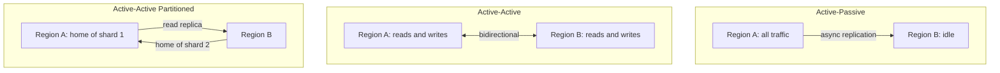
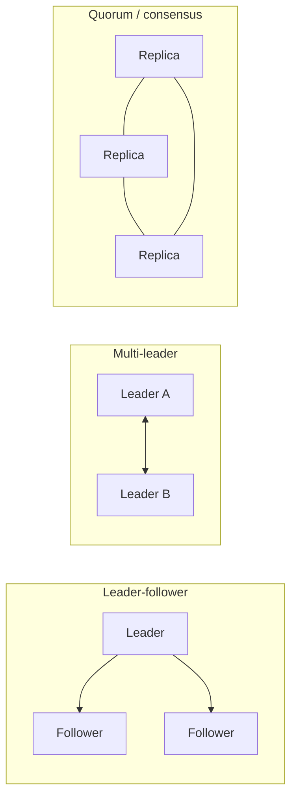
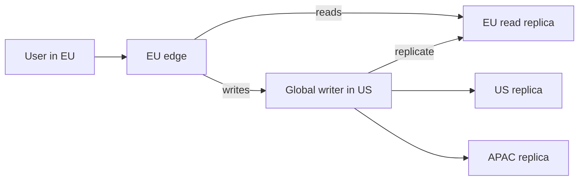
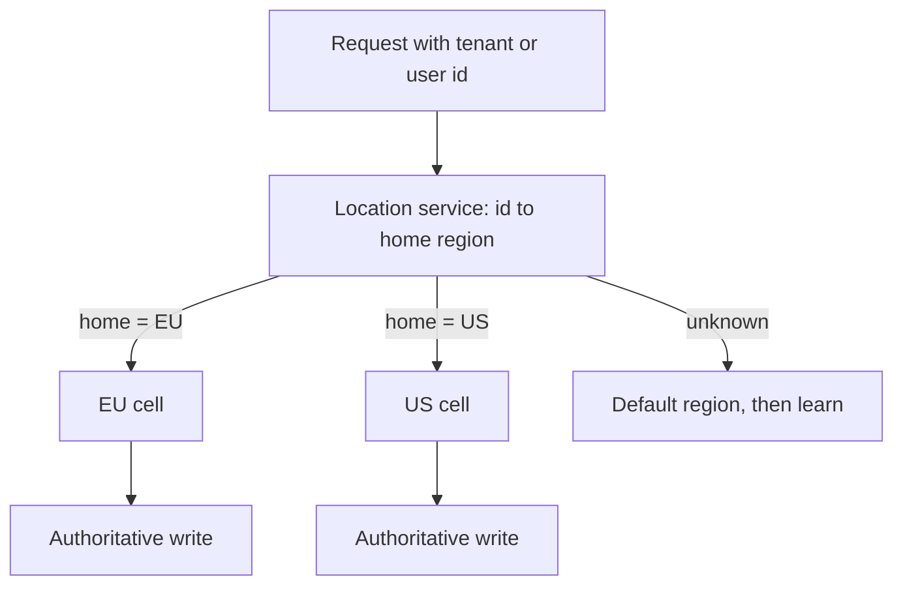
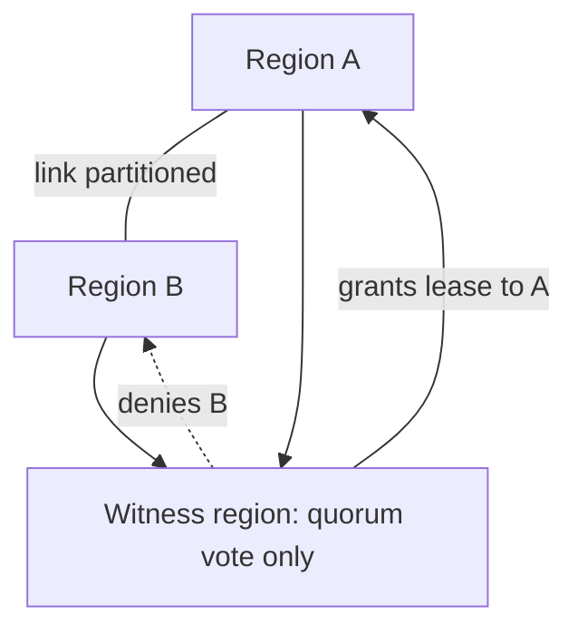
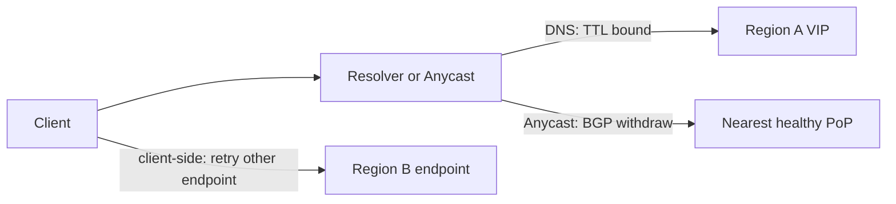
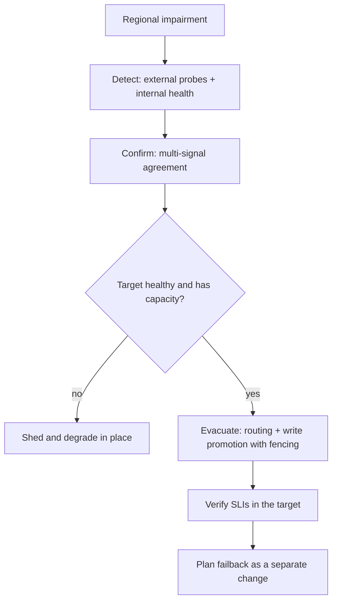

# F26 — Multi-Region & Disaster Recovery

**Multi-region is not a reliability feature you add; it is a consistency, latency, cost, and operational-complexity trade you make deliberately — and the architecture you pick is what sets your RTO and RPO, not the other way round.**

The most common senior-level mistake is treating "go multi-region" as a decision about availability. It is primarily a decision about *where writes are ordered*. Everything else — failover mechanics, DNS TTLs, replication topology, cost — follows from that one choice.

---

## RTO and RPO: the Two Numbers That Define Everything

$$
\text{RTO} = t_{\text{service restored}} - t_{\text{failure}} \qquad \text{RPO} = t_{\text{failure}} - t_{\text{last durable recoverable write}}
$$

- **RTO (Recovery Time Objective):** how long you may be down. A *time* budget.
- **RPO (Recovery Point Objective):** how much data you may lose. Also a *time* budget, measured backwards.

Decompose RTO honestly, because the sum is always larger than people expect:

$$
\text{RTO} = T_{\text{detect}} + T_{\text{decide}} + T_{\text{execute}} + T_{\text{propagate}} + T_{\text{warm}} + T_{\text{verify}}
$$

| Component | Typical value | Dominated by |
|---|---|---|
| $T_{\text{detect}}$ | 1–5 min | Alert evaluation windows, health-check thresholds |
| $T_{\text{decide}}$ | 0 (automated) to 30+ min (human) | Paging, confidence, blast-radius fear |
| $T_{\text{execute}}$ | 1–10 min | Promotion of a replica, config push, routing change |
| $T_{\text{propagate}}$ | 0–60+ min | DNS TTL and non-compliant resolvers, or seconds with Anycast |
| $T_{\text{warm}}$ | 5–30 min | Cold caches, connection pools, autoscaling from a low baseline |
| $T_{\text{verify}}$ | 5–15 min | Confirming correctness before declaring recovery |

RPO is set by replication mechanics:

$$
\text{RPO} \approx \text{replication lag at time of failure} \quad (\text{synchronous} \Rightarrow \text{RPO} = 0)
$$

!!! gotcha "RPO is a distribution, not a number"
    Steady-state replication lag of 200 ms tells you nothing about lag during the incident. Correlated events — a traffic spike, a large backfill, a network brownout — inflate lag exactly when failure is most likely. Measure and alert on p99 lag, and quote your RPO from the p99 under stress, not the median at 3 a.m.

---

## Architecture Choices



| Property | Active-Passive | Active-Active (multi-writer) | Active-Active Partitioned |
|---|---|---|---|
| Write ordering | Single region, simple | Requires conflict resolution or global consensus | Single region **per partition** |
| Typical RTO | 5–60 min (manual) or 1–5 min (automated) | Near zero for the failed region's share | Minutes: re-home affected partitions |
| Typical RPO | Seconds to minutes (async) or 0 (sync) | 0 for locally-committed writes; conflicts possible | 0 within a partition |
| Consistency model | Strong in the active region | Eventual, or expensive global strong | Strong per partition, eventual across |
| Write latency | Local in active; cross-region for passive-region users | Local everywhere | Local for home partition; cross-region otherwise |
| Capacity waste | High: passive idle (see the N+1 math in [F24](f24-capacity-planning.md)) | Low: both serve | Low |
| Operational risk | Failover path is rarely exercised | Conflict bugs are subtle and permanent | Re-homing logic is complex |
| Cost | Full second stack, mostly idle | Full second stack, utilized + replication egress | Utilized + replication egress |
| Suits | Regulated systems, ledgers, anything needing a single serialization point | Idempotent, commutative, or last-writer-wins-tolerant data | Naturally sharded domains: per-user, per-tenant, per-region |

**Active-active-partitioned is the answer most large systems converge on.** It gives you local writes with a single authoritative writer per unit of data, which sidesteps conflict resolution entirely while keeping both regions productive. The price is a routing layer that knows the home region of every key, and a re-homing procedure for failover. The dominant patterns for user-facing systems — home region per user, per tenant, or per account — all fall in this bucket.

??? note "Where the CAP/PACELC framing actually bites"
    Under partition (P), a multi-writer active-active system must choose availability (accept writes, resolve conflicts later) or consistency (refuse writes on the minority side). Even *without* a partition, PACELC's Else clause applies: you choose latency (local commit, async replicate) or consistency (cross-region quorum, latency floor set by the speed of light). A cross-continent round trip is 60–150 ms of hard physics that no engineering removes. See [F08 CAP & PACELC](f08-cap-pacelc.md).

### The tiering that actually gets used

| Tier | Pattern | RTO | RPO | Cost multiple |
|---|---|---|---|---|
| Backup / restore | Snapshots to object storage in another region | Hours to days | Hours | 1.0–1.1× |
| Pilot light | Data replicated continuously; compute stopped | 30–120 min | Minutes | 1.1–1.3× |
| Warm standby | Scaled-down live stack, real replication | 5–30 min | Seconds | 1.4–1.8× |
| Hot standby (active-passive) | Full-scale live stack, never serving | 1–10 min | Seconds or 0 | 2.0–2.7× |
| Active-active | Both serving | Near 0 | 0 to seconds | 2.0–2.7× including egress |

The interesting comparison is the last two rows: hot standby and active-active cost roughly the same, and active-active has better RTO and a continuously-exercised failover path. If you are already paying for hot standby, the marginal step to active-active is mostly software work, and it removes the "our failover has never been tested with real traffic" problem permanently.

---

## Data Replication Topologies and Conflict Handling



| Topology | Write path | Failover | Conflicts | Typical systems |
|---|---|---|---|---|
| Single leader, async followers | Leader commits, ships log | Promote a follower; may lose the tail | None by construction | Postgres streaming, MySQL async, Redis |
| Single leader, sync follower | Commit blocks on one follower ack | Promote with RPO 0 | None | PG synchronous_commit, MySQL semi-sync |
| Multi-leader | Local commit, bidirectional ship | Trivial (both already writable) | **Yes, always** | Multi-master MySQL, CouchDB, Cosmos multi-region write |
| Quorum ($W + R > N$) | Write to $W$ of $N$ | Automatic | Sibling versions unless coordinated | Cassandra, DynamoDB global tables, Riak |
| Consensus (Raft/Paxos) | Majority commit | Automatic leader election | None: total order | etcd, Spanner, CockroachDB, YugabyteDB |

For synchronous cross-region replication, the write latency floor is physics:

$$
L_{\text{commit}} \ge \text{RTT}_{\text{region pair}} \quad\text{(one round trip minimum, often two)}
$$

Roughly 60 ms us-east to eu-west, 140 ms us-east to ap-southeast, one way times two. A consensus group spanning three continents has a commit latency floor around the RTT to the *second-closest* replica — which is why Spanner-class systems place replica majorities within a geography and treat truly global strong consistency as a premium, deliberately-chosen cost.

### Conflict handling, honestly

| Strategy | Mechanism | Data loss? | When it is acceptable |
|---|---|---|---|
| Last-writer-wins by timestamp | Compare wall-clock stamps | **Yes, silently** | Only for genuinely disposable state; clock skew makes it arbitrary |
| Last-writer-wins by logical clock | Lamport/hybrid logical clock tiebreak | Yes, but deterministic | Caches, presence, non-critical preferences |
| Sibling / multi-value return | Store both, application resolves on read | No | When the app has domain knowledge to merge |
| CRDTs | Type-level convergence (counters, sets, sequences) | No | Counters, sets, collaborative text; requires the domain to fit |
| Application-level merge | Domain function, e.g. union of a shopping cart | No | The Dynamo shopping-cart classic; note it resurrects deleted items |
| Avoid conflicts: single writer per key | Partition ownership | No | **The default recommendation** |

!!! danger "Last-writer-wins is data loss with a friendly name"
    LWW resolves conflicts by discarding one of the writes permanently and without notification. Combined with clock skew across regions, "last" is not even reliably the later write. Never apply LWW to money, inventory, permissions, or anything auditable. See [F20 Time, Clocks & Ordering](f20-time-clocks-ordering.md) and [F07 Replication & Consistency](f07-replication-consistency.md).

---

## Read-Local, Write-Global

The dominant pattern for globally-distributed reads with a single serialization point.



| Aspect | Behaviour |
|---|---|
| Read latency | Local, single-digit to low-tens of ms |
| Write latency | Cross-region RTT, 60–150 ms |
| Consistency | Strong at the writer; eventual at replicas |
| Failure of writer region | Writes stop until a replica is promoted; reads continue |
| Complexity | Low — this is the easiest correct multi-region design |

The hard part is **read-your-own-writes**. A user who writes in the US and immediately reads from the EU replica may not see their own change.

Mitigations, in increasing order of cost:

1. **Sticky reads after write.** Pin the session to the writer region for a bounded window (a cookie with a TTL slightly above p99 replication lag). Cheap, effective, and the most common answer.
2. **Read-your-writes tokens.** The write returns a log position (LSN, GTID, `consistent_read_token`); subsequent reads pass it and the replica waits until it has applied that position or falls back to the leader. Precise, requires datastore support.
3. **Monotonic reads via session affinity.** Pin the session to one replica so the user never sees time move backwards, even if they see stale data.
4. **Read from the leader for a defined set of critical paths** (checkout, balance display, permissions) and from replicas for everything else. Explicit and easy to reason about.

!!! tip "Write-through-the-write-region also fixes idempotency"
    Routing all writes for a given key to one region means retries land on the same authoritative store, so an idempotency key table works without cross-region coordination. Attempting idempotency across multiple writer regions requires distributed agreement on key uniqueness — a much harder problem. (See [F11 Idempotency](f11-idempotency.md).)

---

## Sticky Routing by Data Locality

The routing layer must answer one question per request: *which region owns this data?*



| Mechanism | How the mapping is carried | Pros | Cons |
|---|---|---|---|
| Region-encoded identifier | The ID itself contains the home region (prefix or bits) | Zero lookup; works offline; self-describing | Cannot re-home without changing the ID or adding indirection |
| Directory service | A replicated key-to-region map | Re-homing is a directory update | The directory is now a global critical dependency |
| Cookie / token claim | Home region in the session token | No server-side lookup on the hot path | Stale after re-homing; needs a short TTL and a redirect path |
| DNS / GeoDNS per tenant | `tenant.region.example.com` | Handled at resolution time | Slow to change, TTL-bound |
| Redirect at the edge | Edge looks up and issues a 307 or proxies | Central control, fast to change | Extra hop for misrouted requests |

Design notes that matter:

- **Misrouted requests must be correct, not just slow.** The receiving region should proxy to the home region rather than serving from a stale replica. A wrong answer is worse than a slow one.
- **Re-homing must be a first-class operation** with a defined protocol: quiesce writes for the key range, drain in-flight, confirm replication caught up, flip the directory, resume. Failover is just re-homing under duress.
- **The directory must be readable during a regional outage** — replicate it everywhere, cache it aggressively at the edge, and give it a stale-but-usable fallback.

---

## Cell and Shard to Region Mapping

Cells are the unit of blast radius; regions are the unit of correlated physical failure. Mapping one onto the other is a design decision with big consequences.

| Model | Description | Blast radius | Failover complexity |
|---|---|---|---|
| Cell inside one AZ | Maximum isolation, smallest unit | Tiny | AZ loss kills whole cells |
| Cell spans AZs within a region | Standard; survives AZ loss internally | One cell's tenants | Region loss kills the cell |
| Cell spans regions | Cell survives region loss | One cell | Cross-region consensus inside the cell: expensive |
| Cell per region with a paired failover cell | Explicit N+1 at cell granularity | One cell | Clear, testable, per-cell |

Practical guidance:

- **Keep a cell inside one region.** Cross-region cells drag consensus latency into every write and make the cell's failure modes harder to reason about.
- **Achieve regional resilience by pairing cells**, not by stretching them. Cell $C_i$ in region A has a designated standby in region B.
- **Shuffle-shard tenant-to-cell assignment** so that no two important tenants share the same full set of cells; this converts a cell failure from "these ten customers are fully down" into "these ten customers lost one of their four cells".
- **The control plane must be regional too**, or the control plane becomes the global single point of failure that undoes all the isolation you just built. This is the single most repeated finding in large-cloud postmortems.

!!! gotcha "The control plane is the correlated failure you did not design for"
    Symptom: every region's data plane is healthy, but you cannot fail over, scale, or deploy because the control plane lives in one region and it is the one that is broken. Mechanism: deployment systems, service discovery, secrets, config distribution, and the failover tooling itself are commonly built as single-region global services because that is simpler. Mitigation: static stability — the data plane must continue with its last-known-good configuration indefinitely without the control plane — plus regionalized control planes and a manual failover path that does not require the automation to be healthy.

The recovery-priority ordering during a large event follows from this:

$$
\text{Identity/auth} \prec \text{Config \& discovery} \prec \text{Data stores} \prec \text{Stateless services} \prec \text{Async workers} \prec \text{Batch}
$$

Document this dependency order *before* the incident. Discovering it live, at 3 a.m., is how a 30-minute RTO becomes a 6-hour one.

---

## Split-Brain and the Witness Region

Two regions cannot safely decide between themselves which one is alive: from A's perspective, "B is down" and "the link to B is down" are indistinguishable. If both promote themselves, you have two writers and divergent history — split-brain.



| Mechanism | How it prevents split-brain | Cost | Weakness |
|---|---|---|---|
| Odd-numbered quorum across 3 regions | Majority cannot exist on both sides | 3 full stacks | Expensive; cross-region consensus latency |
| Witness / arbiter region | Tiny third site holding only votes or metadata | Very low (one small instance or a managed service) | The witness must be independently reachable; a shared transit provider defeats it |
| Fencing tokens | Monotonic epoch number; storage rejects writes from a stale epoch | Low, requires storage support | Needs a fencing-aware datastore |
| STONITH / hard isolation | Physically cut the old primary off | Medium | Hard across regions you do not control |
| Human-in-the-loop promotion | A person adjudicates | Slow (adds tens of minutes to RTO) | Humans make this mistake too, under pressure |
| Accept it: single-writer, refuse writes on failure | No split-brain possible | Availability loss | Correct for ledgers and inventory |

**Fencing tokens are the mechanism that actually makes promotion safe.** A promoted replica takes epoch $e+1$; storage and downstream services reject any operation carrying epoch $\le e$. The old primary, when it comes back, is rejected rather than silently writing. Without fencing, "we promoted the replica" is a hope, not a guarantee.

!!! danger "Two regions is the worst number for automated failover"
    With $N = 2$, no majority exists on either side of a partition. Any automated promotion is either unsafe (both can promote) or useless (neither can). The fix is a third *vote* — which need not be a third full region. A witness costs a rounding error relative to your bill and is the difference between "automated failover is safe" and "automated failover is a coin flip".

---

## Failover: Automation vs Manual, and the False-Failover Risk

Failover itself is a risk. A false failover — triggered by a monitoring glitch when the region was actually fine — causes an outage that would not otherwise have happened.

$$
E[\text{loss}] = P(\text{real})\cdot(\text{RTO}_{\text{manual}} - \text{RTO}_{\text{auto}})\cdot C_{\text{down}} \;-\; P(\text{false})\cdot C_{\text{failover}}
$$

Automate when the first term dominates: high confidence in detection, low cost of an unnecessary failover, and a genuinely rehearsed path.

| Aspect | Automated failover | Manual failover |
|---|---|---|
| RTO | 1–5 min | 20–60+ min (page, assemble, decide, execute) |
| False-positive risk | Real; needs multi-signal confirmation | Low; humans apply context |
| Consistency risk | High if fencing is absent | Lower, but humans skip steps under stress |
| Exercised | Every time it fires (including tests) | Rarely; the runbook rots |
| Correct for | Stateless tiers, read paths, cache tiers, DNS weights | Database promotion with RPO > 0, anything irreversible |

The mature design **splits the decision by layer**: automate stateless-tier and read-path failover aggressively, gate write-tier promotion behind either a human or a quorum-witnessed automatic protocol with fencing. And crucially, make *failing back* an explicit, separate, planned operation — failback often carries more risk than failover because it moves writes back to a region whose data may have diverged.

Guardrails against false failover:

- **Multiple independent signals** (external synthetic probes from several networks, internal health, dependency health) and require agreement.
- **Damping:** require the condition to persist for a defined window, and rate-limit failovers (never twice in an hour without a human).
- **Confirm the target is actually healthy and has capacity** before draining the source. Failing into a region that cannot serve is the worst outcome.
- **Never let the failover system depend on the failing region.**

---

## Traffic Steering Mechanics and Timing



| Mechanism | Failover time | Granularity | Main failure mode |
|---|---|---|---|
| DNS with health checks | TTL + resolver non-compliance + client cache: 60 s to **hours** | Per hostname | Resolvers and JVMs ignoring TTL; negative caching |
| Anycast + BGP withdraw | Seconds to ~30 s (reconvergence) | Per prefix, per PoP | Route flap; no per-request control; TCP resets on rehash |
| Global load balancer with a single anycast VIP | Seconds | Per request | The GLB is a global dependency |
| Client-side failover (SDK with endpoint list) | Sub-second to seconds | Per request, per client | Requires client deployment; stale endpoint lists |
| Service mesh / xDS-driven | Seconds | Per request, per route | Control-plane dependency |

!!! gotcha "DNS TTL is a request, not a contract"
    **Symptom:** you drop the TTL to 30 seconds, fail over, and a measurable fraction of traffic keeps hitting the dead region for an hour or more. **Mechanism:** recursive resolvers enforce their own minimums; corporate resolvers and some CDNs cache aggressively; the JVM historically caches DNS forever (`networkaddress.cache.ttl` default of -1 with a security manager); connection pools hold established TCP connections that never re-resolve; and browsers keep their own cache. **Mitigation:** treat DNS as coarse steering only. Use Anycast or a global load balancer for fast failover, keep TTLs low *well in advance* (lowering them during an incident is useless — the old TTL is already cached), and make clients re-resolve on connection error rather than pinning forever.

Practical timing: for a target RTO under five minutes, DNS alone is not viable. Combine a low-TTL DNS layer for coarse regional steering with an Anycast or GLB layer for the fast path, and design clients to retry a different endpoint on failure. Client-side failover is the fastest mechanism available and the most under-used — but it only works if the client fleet is under your control. See [F02 DNS & Global Traffic](f02-dns-traffic-management.md).

---

## Data Residency and Regulatory Constraints

Residency turns a technical design into a legal one. It usually *removes* options.

| Constraint | Design impact |
|---|---|
| Data must remain in-region (GDPR Chapter V, sector rules, national laws) | Rules out global replication of personal data; forces active-active-partitioned with residency-aware homing |
| Right to erasure (GDPR Art. 17) | Deletion must propagate to every replica, backup, cache, index, log, and analytics store; backups make this genuinely hard |
| Cross-border transfer mechanisms | Legal instruments gate which regions may hold which data; encryption alone is not sufficient |
| Sovereignty for key material | KMS keys must be in-region; a global KMS is a residency violation |
| Audit and access logs | Often must themselves be resident, and immutable |

Design patterns that work:

- **Split identity from payload.** Keep a globally-replicated, pseudonymous index (user ID to home region) and confine all personal data to the home region. The global index carries no regulated content.
- **Crypto-shredding for erasure.** Encrypt each subject's data with a per-subject key; deleting the key renders every copy — including immutable backups — unrecoverable. This is the only practical answer to "delete this person from a seven-year backup retention".
- **Residency as a first-class routing attribute**, enforced at the edge and re-checked at the data layer. Do not rely on the routing layer alone; a residency bug that copies EU data to us-east is a reportable incident.
- **Region-scoped analytics.** Aggregate in-region, export only aggregates that cannot re-identify.

!!! warning "Backups and logs are the residency and erasure blind spot"
    Every architecture diagram shows the primary datastore. Residency violations and failed erasure requests almost always live in the places that are not on the diagram: cross-region backups, centralized log aggregation, metrics with high-cardinality user labels, data-warehouse exports, and the CDN's access logs.

---

## Cross-Region Cost

The three drivers, in order of how often they surprise people:

1. **Inter-region data transfer** for replication — charged per GB, and continuous.
2. **Duplicated capacity** — the overbuild factor $f = \frac{N}{(N-k)\rho_{\text{knee}}}$ from [F24](f24-capacity-planning.md).
3. **Operational cost** — more environments to deploy, monitor, patch, and reason about; this is engineer time and it is not small.

$$
C_{\text{replication}} = \text{write bytes/s} \times \text{amplification} \times \text{price per GB} \times 2.6 \times 10^{6}\ \text{s/month}
$$

!!! example "Illustrative order-of-magnitude: replication egress"
    A service commits 20 MB/s of logical writes. Replication amplification (WAL/binlog overhead, index maintenance, protocol framing) is roughly 3×, so 60 MB/s crosses the region boundary. At an illustrative **\$0.02/GB** inter-region rate:

    $$
    60 \text{ MB/s} \times 2.6\times10^{6}\text{ s} = 156{,}000 \text{ GB/month} \approx \$3{,}100/\text{month}
    $$

    Replicating to **three** regions triples it to roughly **\$9,400/month**, before any of the compute. If your database is 3 TB and you re-seed a replica during a failover drill, that single re-seed adds about **\$60** — trivial — but a full weekly re-seed for consistency validation adds around **\$240/month**. *All figures illustrative; verify against current published rates for your provider and region pair.*

Cost-reduction levers: compress the replication stream, replicate logical changes rather than physical blocks where the ratio favours it, avoid replicating derived data that can be rebuilt in-region (search indexes, caches, materialized views), and be deliberate about which datasets genuinely need to be multi-region at all. Full treatment in [F28 Cost Engineering](f28-cost-engineering.md).

---

## DR Testing and Game Days

**An untested DR plan has an RTO of infinity.** This is the single most important sentence on this page.

| Level | Exercise | Frequency | Risk | What it validates |
|---|---|---|---|---|
| 0 | Tabletop walkthrough | Quarterly | None | Runbook accuracy, role clarity |
| 1 | Restore a backup to a scratch environment | Monthly, automated | None | Backups are readable; measures real restore time |
| 2 | Fail over a single non-critical service | Monthly | Low | Tooling and permissions work |
| 3 | Scheduled regional evacuation, announced | Quarterly | Medium | Capacity, cold-start, dependency order |
| 4 | Unannounced evacuation during business hours | Semi-annual | High | Detection, decision-making, on-call readiness |
| 5 | Continuous: regions rotate out of service routinely | Ongoing | Designed-in | Everything, always |

Level 5 is the goal state. If evacuating a region is a routine, boring operation you perform on a schedule, then doing it during an actual disaster is also routine. Teams that reach this state do not have DR plans; they have a DR *habit*.

What game days reliably expose that design reviews never do:

- The passive region's autoscaling groups are sized for their idle traffic and take 20 minutes to reach serving capacity.
- Caches are cold, so the database sees 10× its normal read load and becomes the bottleneck.
- A dependency you forgot is single-region — usually auth, a licence server, a feature-flag service, or a certificate authority.
- IAM roles or security groups in the standby region were never updated after a change six months ago.
- The runbook references a dashboard, tool, or person that no longer exists.
- The failover tooling itself runs in the region you are evacuating.
- Quota in the standby region is sized for standby traffic, and the increase request takes two days.

!!! tip "Measure RTO, do not assert it"
    Every drill should produce a timestamped timeline: detection, decision, execution, propagation, warm, verify. Publish the measured RTO next to the target. A stated RTO with no measurement behind it is a wish, and executives make plans on it.

---

## Backup as the Last Line of Defence

Replication is not backup. Replication faithfully and instantly propagates `DROP TABLE`, ransomware encryption, and a bad migration to every replica. Backup protects against *logical* failure; replication protects against *physical* failure. You need both.

| Property | Requirement | Why |
|---|---|---|
| Isolation | Different account/subscription, different credentials, ideally different provider | A compromised control plane can delete backups in the same account |
| Immutability | Object lock / WORM with a retention period no operator can shorten | Ransomware and insider deletion both target backups first |
| Encryption + key custody | Keys held separately from the data | Also the crypto-shredding mechanism for erasure requests |
| Retention tiers | Hourly (days), daily (weeks), monthly (years) | Different failure horizons; logical corruption is often found late |
| Point-in-time recovery | Continuous WAL/binlog archiving | Restores to the second before the bad statement, not to last midnight |
| Restore automation | Scripted, parameterized, tested | Manual restores under pressure produce errors |
| Verification | Automated restore + schema and content checks | An unverified backup is a hypothesis |

### Restore-time reality check

Restore time is bounded by the slowest of several rates, and people almost always plan with the optimistic one:

$$
T_{\text{restore}} \ge \frac{\text{Size}}{\min(R_{\text{read}},\, R_{\text{network}},\, R_{\text{write}},\, R_{\text{decompress}})} + T_{\text{replay}} + T_{\text{index}} + T_{\text{verify}}
$$

!!! example "Illustrative order-of-magnitude: restoring 10 TB"
    Suppose sustained end-to-end throughput of 400 MB/s (a realistic number once you account for object-storage read concurrency, decompression, and target write amplification):

    $$
    T = \frac{10 \times 10^{6}\ \text{MB}}{400\ \text{MB/s}} = 25{,}000\ \text{s} \approx 6.9\ \text{hours}
    $$

    Then add WAL replay to the target point in time (often 1–3 hours for a busy database), index rebuilds, and verification. A realistic figure is **9–12 hours**, against a "documented" RTO of 4 hours that nobody ever measured. If the backup is in a cold archive tier, add the retrieval latency — bulk retrieval from deep-archive tiers is commonly measured in hours before the first byte. *Illustrative; measure your own.*

    The mitigations are structural, not heroic: keep a continuously-restored warm standby so the restore is already done; shard the dataset so restores parallelize; store recent backups in a hot tier and only age older ones to archive; and reduce the *unit* of restore so you can recover one tenant's data in minutes instead of the whole fleet in half a day.

```bash
# Backup verification that actually proves something. Run on a schedule, alert on failure.
set -euo pipefail
aws s3 cp "s3://backups/db/$(date -u +%F)/base.tar.zst" - \
  | zstd -d | tar -x -C /restore/target

pg_ctl -D /restore/target -o "-p 5433" start
psql -p 5433 -c "SELECT count(*) FROM users;"                 # content sanity
psql -p 5433 -c "SELECT pg_last_wal_replay_lsn();"            # PITR reached
psql -p 5433 -c "SELECT * FROM schema_migrations ORDER BY version DESC LIMIT 1;"
# Emit restore duration and row-count deltas as metrics; alert on drift or failure.
```

---

## Gotchas & Corner Cases

!!! gotcha "Your passive region has never served real traffic, so it fails at the moment you need it"
    **Symptom:** you evacuate to the standby and it collapses within two minutes — worse than the partial outage you were escaping. **Mechanism:** the standby's autoscaling groups are scaled for near-zero traffic, so it starts with a handful of instances and needs 15+ minutes to scale; every cache is cold so the database sees an order of magnitude more read load than steady state; connection pools, JITs, and TLS session caches are all unwarmed; and the instance types it wants may be scarce because everyone else is failing over too. **Mitigation:** static stability — pre-provision the standby at full serving capacity and keep it warm with mirrored or synthetic traffic. Better still, make it active-active so it is continuously proven. If you truly cannot, at minimum pre-scale on a schedule before any planned drill and hold capacity reservations.

!!! gotcha "Two regions cannot elect a leader, so your automated failover is a coin flip"
    **Symptom:** a network partition between your two regions results in both promoting themselves, or neither doing so. **Mechanism:** majority quorum is undefined for $N = 2$. Each side observes "the other is unreachable" and cannot distinguish a peer failure from a link failure. **Mitigation:** add a witness — a third site holding only votes and metadata, on independent network paths — so a majority always exists on exactly one side. Pair it with fencing tokens so a returning old primary is rejected by storage rather than silently accepted.

!!! gotcha "The old primary comes back and resumes writing"
    **Symptom:** after a successful failover the data diverges, with some writes landing in the new primary and some in the resurrected old one. **Mechanism:** promotion changed who *should* write, but nothing prevented the old primary from writing. It restarts, its clients reconnect via a cached DNS entry or a pinned connection, and it accepts writes into a now-orphaned history. **Mitigation:** fencing tokens — monotonic epochs checked at the storage layer — plus revoking the old primary's credentials at promotion time and ensuring the promotion procedure explicitly demotes or isolates the old node before enabling the new one.

!!! gotcha "Replication faithfully replicates your DROP TABLE in 200 milliseconds"
    **Symptom:** a bad migration or an errant `DELETE` destroys data in every region simultaneously, and there is nowhere to fail over to. **Mechanism:** replication is designed to propagate every change including the destructive ones. Multi-region gives zero protection against logical corruption. **Mitigation:** point-in-time recovery with continuous log archiving, delayed replicas (a replica deliberately kept 1–4 hours behind is an extraordinarily cheap insurance policy), immutable backups in a separate account, and guardrails on destructive DDL.

!!! gotcha "Lowering DNS TTL during the incident does nothing"
    **Symptom:** you drop the TTL from 300 s to 30 s as the first failover step and traffic still takes an hour to move. **Mechanism:** resolvers already hold the record with the *old* 300 s TTL, and they will not learn about the new TTL until the old one expires. Worse, many resolvers enforce their own minimum TTL, and client-side caches — JVM, browser, connection pools holding open TCP — never re-resolve at all. **Mitigation:** keep TTLs low permanently as a standing cost, and do not rely on DNS for fast failover. Use Anycast, a global load balancer, or client-side endpoint failover for anything with an RTO under 15 minutes.

!!! gotcha "Failover succeeds and a global dependency you forgot about takes you down anyway"
    **Symptom:** the evacuation completes cleanly, then everything fails on authentication. **Mechanism:** an identity provider, licence server, certificate authority, feature-flag service, secrets manager, or service-discovery control plane runs in exactly one region — the one you just evacuated. These are usually invisible on architecture diagrams because they are "infrastructure". **Mitigation:** enumerate every dependency including internal platform services and third parties, annotate each with its regional topology, and run an unannounced game day to find the ones the inventory missed. Cache credentials and configuration locally with long TTLs so the data plane survives control-plane loss.

!!! gotcha "The failover automation runs in the region that is failing"
    **Symptom:** the region is impaired and the runbook's first step — a pipeline, a CLI backed by a control API, a dashboard — is unavailable. **Mechanism:** deployment and orchestration tooling is usually deployed once, in the "primary" region, because there was no reason to duplicate it. **Mitigation:** the failover control path must be independently available from at least two regions, with a documented break-glass procedure that requires nothing from the impaired region. Test the break-glass path specifically, since it is the one nobody uses.

!!! gotcha "Last-writer-wins quietly deletes writes and clock skew makes 'last' arbitrary"
    **Symptom:** users report that a saved change reverted, but there are no errors anywhere and reconciliation shows a single consistent value. **Mechanism:** two regions accepted concurrent writes; the conflict was resolved by comparing wall-clock timestamps and discarding one. With NTP skew of tens of milliseconds between regions, the surviving write may well be the earlier one. There is no record of the discarded value. **Mitigation:** avoid multi-writer for anything that matters — partition writes so each key has one home region. Where multi-writer is unavoidable, use CRDTs or sibling-return with an application merge, and *emit a metric* for every conflict resolved so silent loss becomes visible.

!!! gotcha "Read-your-writes breaks the moment you add a regional read replica"
    **Symptom:** a user updates their profile, the page reloads, and the old value is shown; a refresh a few seconds later shows the new one. **Mechanism:** the write went to the leader in region A, the subsequent read was served by the nearest replica in region B, and replication lag is 200 ms to several seconds. **Mitigation:** post-write session stickiness to the writer region for a window above p99 replication lag, or consistency tokens (LSN/GTID) passed on reads so the replica waits or defers to the leader. Decide this per endpoint — checkout and balance read from the leader; a feed does not need to.

!!! gotcha "A false failover causes an outage that would not otherwise have happened"
    **Symptom:** a postmortem concludes that the region was healthy and the automation evacuated it based on a monitoring artifact. **Mechanism:** a single health signal — often the monitoring system's own view, which can fail independently — tripped the threshold. Evacuation is itself a large, disruptive operation with cold-start costs. **Mitigation:** require agreement across independent signals including external synthetic probes from multiple networks, damp with a persistence window, rate-limit failovers, and verify the target region is healthy and has capacity before draining the source.

!!! gotcha "Failback is riskier than failover and has no runbook"
    **Symptom:** the incident is resolved, you move traffic back, and cause a second, longer outage. **Mechanism:** the original region's data has diverged or is stale; it must be re-seeded and caught up before it can safely take writes. Meanwhile everyone treats failback as "undo" and skips the verification they did on the way out. Its capacity has also been scaled down while it was idle. **Mitigation:** write and rehearse a failback runbook separately. Treat it as a planned migration with its own verification gate: replication caught up, checksums match, capacity pre-scaled, traffic ramped in gradually rather than flipped.

!!! gotcha "Cross-region replication silently stops and nobody notices for days"
    **Symptom:** a failover drill reveals the standby is three days stale. **Mechanism:** replication broke on a schema change, an oversized transaction, a credential rotation, or a disk-full event on the replica. If lag is monitored via a gauge that stops being *published* when replication stops, the graph flatlines rather than climbing, and threshold alerts never fire. **Mitigation:** alert on *staleness of the metric itself* and on a heartbeat row written on the primary and read on the replica — a real end-to-end measurement of $now() - \text{heartbeat}$. Absence of data must be an alertable condition.

!!! gotcha "Restoring the backup takes far longer than the RTO you published"
    **Symptom:** the documented RTO is four hours; the actual restore of a 10 TB database takes eleven. **Mechanism:** RTO was computed from backup *size divided by nominal network bandwidth*, ignoring object-storage read concurrency limits, decompression CPU, target write amplification, index rebuilds, WAL replay to the recovery point, and verification. Archive-tier retrieval latency may add hours before the first byte. **Mitigation:** measure restore time monthly with an automated drill and publish the measured number. Structurally reduce it: continuously-restored warm standbys, sharded datasets that restore in parallel, recent backups in a hot tier, and per-tenant restore granularity.

---

## SRE Lens

### SLIs and SLOs

| SLI | Definition | Notes |
|---|---|---|
| Replication lag (end-to-end heartbeat) | $now() - \text{heartbeat timestamp on replica}$ | This *is* your live RPO. Alert on p99, and on metric absence. |
| Measured RTO | Drill timeline: detect to verified | Publish measured, not target |
| Failover success rate | Successful drills / attempted | Below 100% means the runbook is wrong |
| Standby readiness | Standby capacity / required capacity at failover | Static stability check, evaluated continuously |
| Restore success and duration | Automated monthly restore | An unverified backup is not a backup |
| Cross-region dependency count | Services with a single-region hard dependency | Should trend to zero for tier-1 paths |
| Regional traffic imbalance | Deviation from intended split | Detects silent routing drift |

### Failure modes and detection



- **Gray failure** is the hard case: the region is degraded but not down, so internal health checks pass while users suffer. External synthetic probes from multiple independent networks are the only reliable detector.
- **Partial impairment** (one AZ, one service, one dependency) usually should *not* trigger a full regional evacuation. Match the response granularity to the failure granularity.
- **Correlated failover demand** means everyone evacuates into the same neighbouring region simultaneously; capacity, not correctness, becomes the constraint.

### Capacity signals

Continuously evaluate: if the largest region were lost right now, what would the projected utilization be in the survivors — for compute, for the database, and for every shared dependency? Publish this as a dashboard number. It is the only honest way to know your N+1 claim is still true after six months of growth. See [F24 Capacity Planning](f24-capacity-planning.md).

### On-call runbook notes

- [ ] Confirm the impairment is regional, not a single service or a single AZ. Match the blast radius of the response to the blast radius of the failure.
- [ ] Check the target region's current health and headroom *before* draining anything.
- [ ] Confirm replication lag and therefore expected data loss before promoting a writer. Record the number in the incident channel.
- [ ] Fence the old primary — revoke credentials and bump the epoch — before enabling writes in the target.
- [ ] Expect cold-cache load on the target's data tier; be ready to shed non-critical traffic during warm-up.
- [ ] Do not fail back during the same incident. Failback is a separate, planned change.
- [ ] Capture the timeline with timestamps. This is your only real RTO measurement.

### Cost

State the trade explicitly: active-active costs roughly the same as hot standby but has a continuously-proven failover path and better RTO. Warm standby is materially cheaper and buys a 5–30 minute RTO. Backup-restore is nearly free and buys hours-to-days. Pick the tier per *dataset* and per *service tier*, not per company — most organizations need active-active for the checkout path and backup-restore for the analytics warehouse.

---

## Interview Angle

!!! interview "Probe: make this service multi-region."
    **Weak:** "Deploy to two regions and use Route 53 failover."

    **Strong:** start with the requirements, not the topology. "First I need the RTO and RPO, per data class — the ledger and the recommendation cache have completely different requirements. Then the question is where writes are ordered: single-writer with read-local replicas is the simplest correct design and gives strong consistency with local reads; active-active-partitioned by user or tenant gives local writes with no conflict resolution, at the cost of a routing directory and a re-homing procedure; true multi-writer means conflicts, which means either CRDTs or accepting silent loss. I would default to active-active-partitioned with a home region per tenant, and be explicit that read-your-writes needs session stickiness or consistency tokens."

!!! interview "Probe: what are your RTO and RPO, and how do you know?"
    **Strong:** decompose RTO into detect, decide, execute, propagate, warm, verify, and note that propagation via DNS alone can dominate everything else. State that RPO equals replication lag at the moment of failure, so you quote it from p99 lag under stress rather than the median. Then the closing move: "and I know because we measure it in a monthly drill and publish the measured number next to the target." Claiming a number without a measurement mechanism is the weak answer.

!!! interview "Probe: two regions, the link between them fails. What happens?"
    **Strong:** name split-brain immediately and explain why $N=2$ is unsolvable — no majority exists on either side, and a peer failure is indistinguishable from a link failure. Then give the fix: a witness region holding only votes, which costs almost nothing and makes majority well-defined; fencing tokens so a returning old primary is rejected at the storage layer; and an explicit policy decision about whether the minority side refuses writes (consistency) or accepts them (availability plus a conflict-resolution obligation).

!!! interview "Probe: your failover drill fails. What is the most likely cause?"
    A strong answer lists the empirically common ones and why each occurs: the standby is scaled for idle traffic and cannot absorb production; caches are cold so the data tier becomes the bottleneck; a forgotten single-region dependency, usually auth or a control plane; IAM or security-group drift in the standby; the failover tooling itself lives in the impaired region; and standby quota sized for standby load. The meta-point is that all of these are found by drills and none by design review.

!!! interview "Probe: is replication a backup?"
    **Strong:** "No — they defend against different failure classes. Replication defends against physical loss and propagates logical corruption perfectly. A `DROP TABLE` reaches every replica in milliseconds. Backups defend against logical failure: bad migrations, bad code, ransomware, and human error. I want both, plus a delayed replica as cheap middle ground, plus immutable backups in a separate account with a different credential domain so a compromised control plane cannot delete them. And I want an automated monthly restore, because an unverified backup is a hypothesis."

!!! interview "Probe: how does GDPR change the design?"
    **Strong:** residency removes options — you cannot freely replicate personal data globally, which forces residency-aware partitioning. Split a global pseudonymous directory (user to home region, no regulated content) from region-confined payload. Handle erasure with crypto-shredding via per-subject keys, because deleting rows from seven years of immutable backups is not feasible. Then name the blind spots: backups, centralized logging, high-cardinality metrics, warehouse exports, and CDN access logs are where residency violations actually happen.

!!! interview "Probe: automated or manual failover?"
    **Strong:** split it by layer. Automate stateless-tier, read-path, and cache-tier failover aggressively — those are cheap to get wrong and expensive to do slowly. Gate write-tier promotion behind a witness-backed quorum protocol with fencing, or behind a human when RPO is non-zero and the loss is irreversible. Then name the false-failover risk explicitly and the guardrails: multi-signal agreement including external probes, a persistence window, rate limiting, and verifying target capacity before draining the source.

---

## Key Takeaways

- RTO and RPO are outputs of the architecture, not independent inputs; decompose RTO into detect, decide, execute, propagate, warm, and verify, and treat RPO as the p99 replication lag under stress.
- The core decision is where writes are ordered. Active-active-partitioned — one home region per key — gives local writes without conflict resolution and is where most large systems land.
- Multi-writer without partitioning means conflicts, and last-writer-wins is silent data loss made worse by cross-region clock skew.
- Two regions cannot safely elect a leader; a cheap witness region plus fencing tokens is the difference between safe automated failover and a coin flip.
- DNS is coarse steering with an unbounded propagation tail; Anycast, a global load balancer, or client-side failover are what deliver sub-five-minute RTO.
- The control plane, and the failover tooling itself, are the correlated single-region dependencies that most often defeat an otherwise-correct design. Static stability is the countermeasure.
- Replication is not backup: it propagates logical corruption perfectly. Immutable, isolated backups plus a delayed replica plus point-in-time recovery cover the failure class replication cannot.
- An untested DR plan has an RTO of infinity. Measure restore time and failover time on a schedule and publish the measured values, because the assumed ones are always optimistic.

---

## Further Reading

- *Site Reliability Engineering* (Google), Chapter 26 "Data Integrity: What You Read Is What You Wrote" — the definitive treatment of why replication is not backup, and defence in depth for data.
- *The Site Reliability Workbook* (Google), Chapter 5 "Alerting on SLOs" and Chapter 13 "Data Processing Pipelines" for related failure modes.
- Amazon Builders' Library — "Static stability using Availability Zones" (Becky Weiss, Mike Furr): the canonical argument for pre-provisioned, non-reactive failover capacity.
- Amazon Builders' Library — "Minimizing correlated failures in distributed systems" and "Workload isolation using shuffle-sharding".
- Corbett et al., "Spanner: Google's Globally-Distributed Database" (OSDI 2012) — TrueTime, external consistency, and the real cost of global strong consistency.
- DeCandia et al., "Dynamo: Amazon's Highly Available Key-value Store" (SOSP 2007) — vector clocks, sibling resolution, and the shopping-cart merge.
- Martin Kleppmann, *Designing Data-Intensive Applications* — Chapter 5 (Replication), Chapter 9 (Consistency and Consensus), and the fencing-token discussion.
- Martin Kleppmann, "How to do distributed locking" — fencing tokens and why leases alone are insufficient.
- Michael Nygard, *Release It!* (2nd ed.) — chapters on stability patterns and on designing for operations across sites.
- Huang et al., "Gray Failure: The Achilles' Heel of Cloud-Scale Systems" (HotOS 2017) — why internal health checks miss the failures users experience.
- AWS Well-Architected Framework, Reliability Pillar — the backup/pilot-light/warm-standby/multi-site DR tiering.
- GDPR Articles 17 (erasure) and Chapter V (international transfers) — read the primary text rather than summaries when designing for residency.
