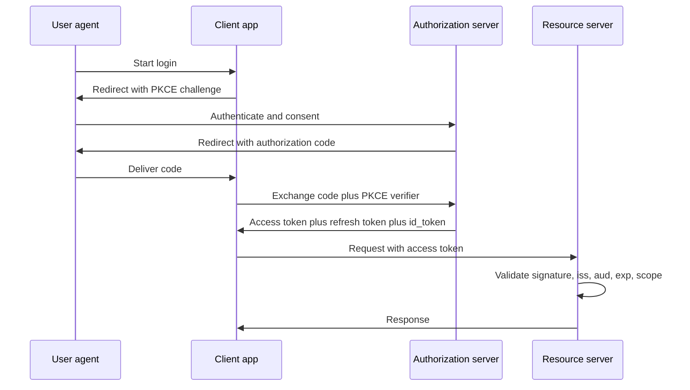
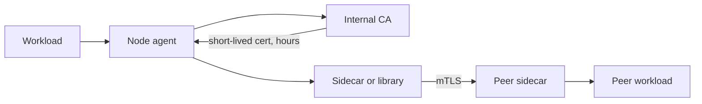
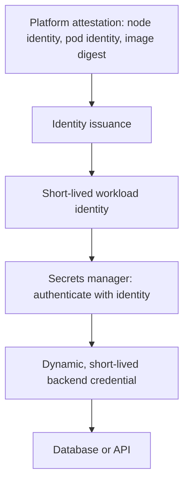
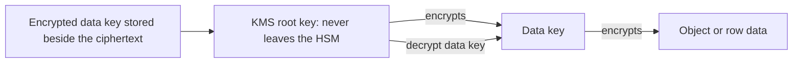
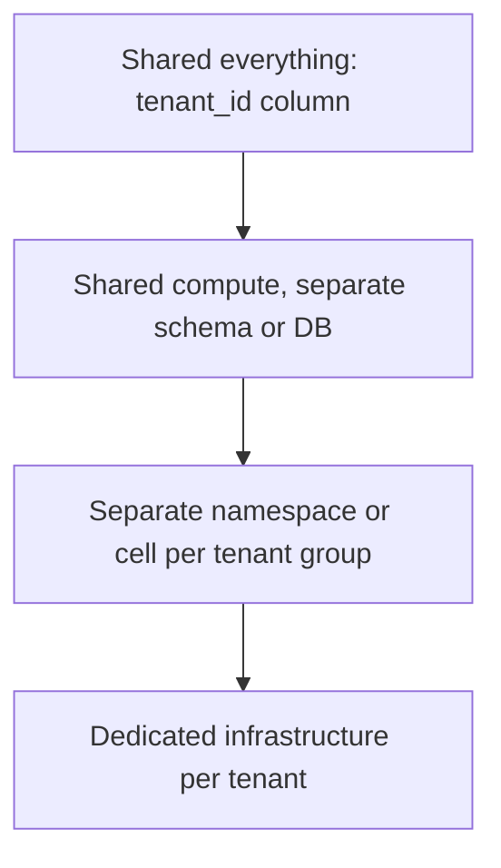
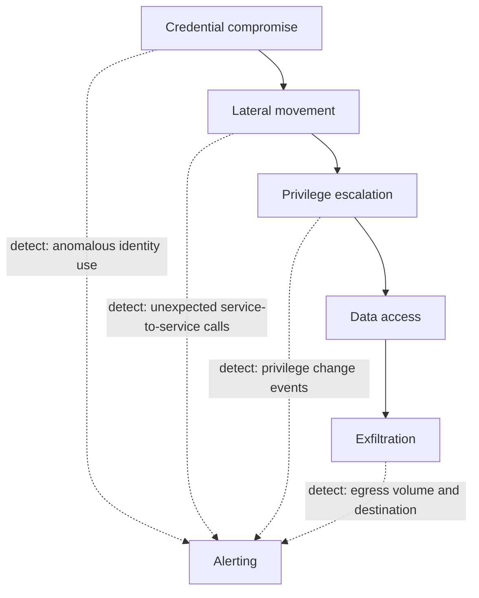

# F27 — Security in Design

**Security is not a layer you add at the edge; it is a set of architectural decisions about identity, trust boundaries, and blast radius that are extremely expensive to retrofit and nearly free to design in.**

The senior framing: assume any single control will fail. The design question is never "is this secure?" but "when this component is compromised, what exactly can the attacker reach, for how long, and how would we know?"

---

## Authentication vs Authorization

Two questions that are constantly conflated and have entirely different failure modes.

| | Authentication (AuthN) | Authorization (AuthZ) |
|---|---|---|
| Question | Who are you? | What may you do? |
| Answer artifact | Identity + assertion (token, certificate, session) | Decision (permit/deny) + reason |
| Failure mode | Impersonation | Privilege escalation, IDOR, confused deputy |
| Typical latency budget | Once per session | Every request, sometimes many times |
| Caching | Token validity window | Dangerous: stale permissions after revocation |
| Where it lives | Edge, gateway, identity provider | **Must be in the service that owns the data** |
| Testability | Easy | Hard: combinatorial over resources and roles |

!!! danger "Edge-only authorization is the most common architectural security flaw"
    An API gateway can authenticate and enforce coarse policy. It cannot know that user 42 owns document 9173 — only the document service knows that. If the gateway is the only enforcement point, then any path that reaches the service by another route (an internal caller, a misconfigured mesh policy, a debug endpoint, SSRF from a neighbouring service) bypasses authorization entirely. **The service that owns the object must authorize access to that object.** The gateway is defence in depth, not the control.

The related trap is the **confused deputy**: service A calls service B using A's own powerful service credential, on behalf of user U, without carrying U's identity. B now authorizes as A, which can do everything. Propagate the *end-user* identity — a signed token with a narrow audience, short lifetime, and the delegation chain recorded — so B can make a decision about U, not about A. Token exchange (RFC 8693) exists precisely for this.

---

## OAuth2 and OIDC

OAuth2 is a **delegated authorization** framework. OIDC is a thin identity layer on top of it that adds the `id_token`, a standard `/userinfo` endpoint, and discovery. Saying "we use OAuth for login" without OIDC is a red flag — an access token says nothing verifiable about who the user is.



| Flow | Use for | Status | Why |
|---|---|---|---|
| Authorization Code + PKCE | Web apps, SPAs, mobile, **everything user-facing** | Current best practice | Code never usable without the verifier; safe for public clients |
| Client Credentials | Machine-to-machine | Current | No user context; scope it tightly |
| Device Authorization Grant | TVs, CLIs, input-constrained devices | Current | Polling-based, no browser redirect on-device |
| Token Exchange (RFC 8693) | Service-to-service on behalf of a user | Current | The correct fix for the confused deputy |
| Refresh Token (with rotation) | Long-lived sessions | Current | Rotation + reuse detection is mandatory |
| Implicit | — | **Deprecated** | Token in the URL fragment: leaks via history, referrer, logs |
| Resource Owner Password Credentials | — | **Deprecated** | The client sees the password; defeats MFA and federation |

Non-negotiable validations on the resource server:

- Signature against the **expected key** from JWKS, with the algorithm pinned by policy.
- `iss` matches your issuer exactly.
- `aud` contains *your* identifier — an audience check is what stops a token minted for service X being replayed against service Y.
- `exp` and `nbf` with minimal clock skew tolerance (60 s, not 5 minutes).
- `scope` and any custom claims are checked against the specific operation.
- For OIDC: `nonce` matches the value you sent, binding the token to your authentication request.

!!! gotcha "PKCE is not optional for confidential clients either"
    It was introduced for mobile public clients, but the authorization-code-injection attack it prevents applies broadly. OAuth 2.1 makes PKCE mandatory for all clients. Also register **exact** redirect URIs — wildcard or prefix matching on redirect URIs is a reliable path to token theft via an open redirect.

---

## JWT: the Trade-offs

A JWT lets a resource server validate a token with no call to the issuer. That single property is both the entire benefit and the source of every problem.

| Property | Stateless JWT | Opaque token + introspection | Server-side session |
|---|---|---|---|
| Validation cost | Local signature check, sub-millisecond | Network call per request (cacheable) | Session-store lookup |
| Revocation | **Hard**: valid until `exp` | Immediate | Immediate |
| Horizontal scale | Excellent | Needs a highly-available introspection tier | Needs a shared session store |
| Size on the wire | Large (0.5–4 KB, sometimes more) | Small | Small (cookie holds an ID) |
| Claim freshness | Frozen at issue time | Fresh | Fresh |
| Works cross-domain / cross-service | Yes | Yes | Awkward |
| Blast radius of key compromise | Every token, everywhere | Introspection endpoint compromise | Session store compromise |

### The revocation problem

A stateless JWT is a bearer credential that is valid until it expires. Logging out, disabling an account, or revoking a role does **not** invalidate an already-issued token. Mitigations, each with a real cost:

| Mitigation | Mechanism | Cost |
|---|---|---|
| Short TTL (5–15 min) + refresh token | Shrinks the window | More refresh traffic; refresh token becomes the valuable credential |
| Denylist of revoked JTIs | Check a small, fast, replicated set | Reintroduces state — but a *small* one, only for revoked tokens |
| Global "not before" per user | Bump `min_issued_at` on password change or role revocation | Requires a lookup, but a cacheable one |
| Version claim on the token | Compare against a per-user version counter | Same shape as above |
| Just use opaque tokens with cached introspection | Immediate revocation with a bounded staleness window | Introspection tier availability |

!!! tip "The honest position"
    Stateless validation and immediate revocation are fundamentally in tension. Most mature systems land on: short-lived access tokens (minutes), rotating refresh tokens with reuse detection, and a small revocation-check on high-value operations. Pretending revocation is solved by "we set a 1-hour expiry" is a weak answer; naming the tension is a strong one.

### Algorithm confusion and key handling

```text
# The three classic JWT signature attacks:
1. alg: "none"          Verifier accepts an unsigned token.
2. HS256 vs RS256       Attacker changes alg to HS256 and signs with the
                        PUBLIC RSA key as the HMAC secret. A naive library
                        call that derives the algorithm from the header accepts it.
3. jku / x5u / kid      Attacker points the header at a key they control,
                        or uses kid for path traversal or SQL injection.
```

Defences: **pin the accepted algorithm(s) server-side** and never read `alg` from the token to decide how to verify; ignore `jku`/`x5u` entirely or allowlist them; treat `kid` as an opaque lookup key with strict validation; use libraries whose API forces you to declare the expected algorithm.

Key rotation with JWKS:

1. Generate the new key; publish it in the JWKS **alongside** the old one with a distinct `kid`.
2. Wait for the JWKS cache TTL to elapse everywhere (verifiers now know both keys).
3. Switch the issuer to sign with the new `kid`.
4. Wait for the maximum token lifetime so no live token is signed by the old key.
5. Remove the old key from the JWKS.

Skipping step 2 causes mass validation failures the moment signing switches; skipping step 4 invalidates live tokens. Both are outages, and both are avoidable by making the overlap window explicit.

### Storing tokens in the browser

| Location | XSS exposure | CSRF exposure | Verdict |
|---|---|---|---|
| `localStorage` / `sessionStorage` | **Full**: any injected script reads it | None | Avoid for session credentials |
| JS-readable cookie | Full | Yes | Worst of both |
| `HttpOnly; Secure; SameSite=Lax` cookie | Not readable by script | Mitigated by SameSite + a token pattern | **Preferred** |
| In-memory only, refreshed via HttpOnly cookie | Lost on reload, but not persisted anywhere readable | Refresh path needs CSRF protection | Strongest for SPAs |

The reasoning: `HttpOnly` removes the entire class of "XSS exfiltrates the token to an attacker's server". XSS is still catastrophic — the attacker can act *as* the user through the browser — but they cannot walk away with a portable credential usable from their own infrastructure for the next hour. Add `SameSite=Lax` (or `Strict` where UX allows), `Secure`, `__Host-` prefix, short lifetimes, and a CSRF token or double-submit pattern for state-changing requests.

---

## Session Management

| Concern | Requirement |
|---|---|
| Session ID generation | CSPRNG, at least 128 bits of entropy, never derived from user data |
| Regeneration | **New session ID on every privilege change**: login, step-up auth, role assumption. Prevents session fixation. |
| Idle timeout | Short for sensitive apps (15–30 min); absolute timeout independent of activity |
| Absolute lifetime | Bounded regardless of activity, so a stolen session cannot live forever |
| Binding | Optionally bind to a client fingerprint or a token-bound TLS channel; be careful, mobile clients change IP constantly |
| Concurrent sessions | Enumerable and individually revocable by the user |
| Logout | Must invalidate server-side, not just clear the cookie |
| Storage | Server-side store with a TTL; encrypted-cookie sessions are stateless with all the JWT revocation caveats |

!!! gotcha "Logout that only clears the cookie is not logout"
    Symptom: a user logs out on a shared machine; an attacker recovers the cookie value from browser history, a proxy log, or a network capture and replays it successfully. Mechanism: the server never invalidated the session; "logout" was a client-side action. Mitigation: logout deletes the server-side session record (or adds the JTI to the denylist), and propagates via OIDC back-channel logout to every relying party.

---

## mTLS and Certificate Rotation at Scale

Mutual TLS gives every connection a cryptographically verified peer identity. It is the foundation of zero-trust networking, and its operational difficulty is entirely in certificate lifecycle.



| Approach | Cert lifetime | Rotation | Failure mode |
|---|---|---|---|
| Long-lived manual certs | 1–2 years | Manual, forgotten | **Expiry outage** — a top cause of large public incidents |
| Automated with ACME / internal CA | 30–90 days | Automated | Renewal pipeline failure, discovered near expiry |
| SPIFFE/SPIRE-style short-lived | Hours | Continuous, in-process | Attestation or CA outage stops new issuance |

Short lifetimes are counter-intuitively *safer operationally*: rotation runs constantly, so it is continuously proven. A 90-day certificate rotates four times a year and each rotation is a rare event nobody is practised at. A one-hour certificate rotates constantly and any breakage is detected in minutes, long before anything expires.

What actually goes wrong at scale:

- **CA outage.** New certificates cannot be issued. Existing connections survive, but any workload restart or scale-out fails. Mitigation: cache credentials with a lifetime comfortably longer than plausible CA downtime, and allow existing certs to remain valid.
- **Clock skew.** A workload whose clock is 10 minutes fast rejects a freshly-issued certificate as `notBefore` in the future. With one-hour certs, small skew is a large fraction of the lifetime. Mitigation: NTP is a security dependency; monitor it.
- **CA root rotation.** The genuinely hard one. New root must be distributed to every trust store *before* any leaf is issued from it — same overlap discipline as JWKS rotation, but with a much longer tail.
- **Revocation.** CRLs and OCSP are unreliable at scale (OCSP responder outages, soft-fail defaults that make revocation advisory). Short lifetimes are the practical substitute: a one-hour cert has a one-hour worst-case revocation window with no revocation infrastructure at all.

!!! warning "Certificate expiry is a self-inflicted, perfectly-scheduled global outage"
    It is correlated (everything issued together expires together), silent until the moment it fires, and immune to rollback. Alert on days-to-expiry for every certificate you can enumerate — including client certs, CA intermediates, code-signing certs, and the certificates inside appliances and third-party integrations — and treat the alert as a page, not a ticket.

---

## Service Identity vs Static Credentials

| Property | Static credential (API key, password, long-lived token) | Workload identity (SPIFFE, cloud IAM roles, OIDC federation) |
|---|---|---|
| Lifetime | Months or years | Minutes to hours |
| Distribution | Copied into config, CI, images | Derived from platform attestation |
| Rotation | Manual, coordinated, risky | Automatic, continuous |
| Leak impact | Valid until someone notices and rotates | Expires quickly; bound to a workload, often unusable elsewhere |
| Auditability | "Someone with the key" | A specific workload identity |
| Revocation | Rotate and update every consumer | Stop attesting; expiry does the rest |
| Common leak vectors | Git history, CI logs, container images, error messages, Slack | Materially fewer: nothing durable to leak |

A SPIFFE ID (`spiffe://prod.example.com/ns/payments/sa/ledger-writer`) is issued to a workload after the platform *attests* what it is — node identity, pod identity, image digest. The critical property: identity is derived from the platform, so there is no secret to distribute, no secret to leak, and no secret to rotate.

The equivalent cloud-native patterns: IAM Roles for Service Accounts / Pod Identity, Workload Identity Federation, and OIDC federation from CI providers (which eliminates the long-lived cloud key stored in a CI secret — historically one of the most damaging credential classes).

---

## Secrets Management and the Bootstrapping Problem

$$
\text{To read the secrets, the workload needs a credential. Where does } \textit{that} \text{ credential come from?}
$$

This is turtles-all-the-way-down, and it terminates in exactly one place: **something the platform can attest that is not itself a secret.**



| Bootstrap approach | Security | Notes |
|---|---|---|
| Secret baked into the image | Very poor | Present in every layer, every registry, every developer's laptop |
| Secret in an environment variable from CI | Poor | Leaks into process listings, crash dumps, child processes, logs |
| Secret in a mounted file with a static token | Fair | Better than env vars, but still a durable secret |
| Cloud instance metadata / IMDSv2 | Good | Attested by the platform; **must** enforce IMDSv2 and hop limits against SSRF |
| Kubernetes projected service-account token with an audience | Good | Short-lived, audience-bound, automatically rotated |
| SPIFFE/SPIRE node + workload attestation | Best | No durable secret at any layer |

Once bootstrapped, prefer **dynamic secrets**: the secrets manager creates a database user on demand with a 1-hour lease, then deletes it. Nothing long-lived exists to steal, and the audit log ties every credential to a specific workload and time window.

!!! danger "SSRF plus instance metadata equals full cloud account compromise"
    A server-side request forgery vulnerability that reaches `169.254.169.254` retrieves the instance's IAM credentials, and the attacker inherits everything that role can do. This is the mechanism behind several of the largest publicly-documented cloud breaches. Mitigations, layered: enforce IMDSv2 (token-required, PUT-based, so a simple SSRF `GET` fails), set the metadata hop limit to 1 so container network hops cannot reach it, block link-local addresses at the egress proxy, validate and allowlist outbound URLs at the application layer, and — critically — keep the instance role's permissions minimal so the blast radius is bounded even if all of the above fails.

Additional practices: never log secrets (scrub structured log fields by key name), scan git history and CI output for credential patterns, rotate on any suspicion rather than debating whether the exposure was real, and make rotation cheap enough that you actually do it.

---

## Encryption at Rest and Envelope Encryption

Encrypting a large dataset directly with a KMS key is impossible (KMS operates on small payloads) and undesirable (every read becomes a KMS call). Envelope encryption solves both.



1. Request a data key from KMS. You receive it in **plaintext** and **encrypted under the root key**.
2. Encrypt the data locally with the plaintext data key (AES-256-GCM).
3. Store the encrypted data key next to the ciphertext; discard the plaintext data key from memory.
4. To decrypt: send the encrypted data key to KMS, get the plaintext key back, decrypt locally.

| Benefit | Mechanism |
|---|---|
| Root key never leaves the HSM | Only data keys transit |
| Key rotation is cheap | Re-encrypt data keys, not petabytes of data |
| Caching is possible | Cache the plaintext data key briefly to avoid per-request KMS calls |
| Fine-grained crypto-shredding | Per-tenant or per-subject data keys; destroy the key to render data unrecoverable |
| KMS becomes an audit and authorization point | Every decrypt is logged and policy-checked |

!!! example "Crypto-shredding as the answer to 'delete me from all backups'"
    Give each data subject their own data key. Deleting that one key makes every copy of their data — live, replicated, archived, and in immutable seven-year backups — permanently unreadable. It is the only practical implementation of GDPR erasure against write-once backups. See [F26 Multi-Region & Disaster Recovery](f26-multi-region-dr.md).

!!! gotcha "Encryption at rest defends against a narrower threat than people assume"
    Symptom: a compliance box is ticked, and a SQL injection extracts every record in plaintext. Mechanism: transparent disk or database encryption protects against *physical media* theft and against someone reading the raw files. It does nothing against an attacker who reaches the data through the application, because the application is authorized to decrypt. Mitigation: be explicit about the threat model. Application-layer or field-level encryption with separate key authorization is what protects against application compromise — at real cost in queryability and complexity.

**Encryption in transit:** TLS 1.3 everywhere including inside the perimeter (the flat internal network is a discredited model), HSTS with preload, modern cipher suites only, certificate transparency monitoring for your own domains, and mTLS for service-to-service. Do not terminate TLS at the edge and forward plaintext across a "trusted" internal network — that network is exactly where lateral movement happens.

---

## Multi-Tenant Isolation



| Level | Isolation mechanism | Failure = data leak? | Cost | Noisy-neighbour risk |
|---|---|---|---|---|
| Row-level (`tenant_id` filter) | Application code discipline | **Yes, one missing WHERE clause** | Lowest | High |
| Row-level + RLS policy in the database | Database enforces the predicate | Much harder: defence in depth | Low | High |
| Schema or database per tenant | Connection-scoped | Only via connection misconfiguration | Medium | Medium |
| Namespace/cluster per tenant group | Network and compute boundary | Rare | High | Low |
| Dedicated account per tenant | Cloud account boundary | Effectively no | Highest | None |

```sql
-- Postgres row-level security: the predicate is enforced by the database, so
-- a forgotten WHERE clause in application code is no longer a data breach.
ALTER TABLE invoices ENABLE ROW LEVEL SECURITY;
ALTER TABLE invoices FORCE ROW LEVEL SECURITY;   -- applies to the table owner too

CREATE POLICY tenant_isolation ON invoices
  USING (tenant_id = current_setting('app.tenant_id')::uuid);

-- Set per transaction, from the authenticated identity, never from user input.
SET LOCAL app.tenant_id = '3f2b...';
```

!!! gotcha "Connection pooling silently defeats session-scoped tenant context"
    Symptom: intermittent cross-tenant data exposure under load that is impossible to reproduce. Mechanism: `SET app.tenant_id` on a pooled connection persists after the request completes; the next request from a different tenant reuses that connection and inherits the previous tenant's context — or the pooler in transaction mode multiplexes statements across sessions. Mitigation: use `SET LOCAL` inside an explicit transaction so the setting is scoped and automatically discarded, verify behaviour under your specific pooler mode (PgBouncer transaction pooling breaks session-level settings), and add an independent assertion in the application that returned rows match the expected tenant.

Beyond data isolation, multi-tenancy needs **resource** isolation: per-tenant quotas and rate limits so one tenant cannot consume the fleet, and shuffle-sharding so a single abusive or compromised tenant cannot degrade every other tenant. See [F17 Rate Limiting & Load Shedding](f17-rate-limiting-load-shedding.md).

---

## Authorization Models

| Model | Decision input | Strengths | Weaknesses | Fits |
|---|---|---|---|---|
| ACL | Per-object list of subjects | Simple, explicit | Does not scale; no inheritance | Small, flat object sets |
| RBAC | Subject's roles | Easy to reason about and audit | Role explosion; cannot express "owner of *this* document" | Internal tools, admin surfaces |
| ABAC | Attributes of subject, resource, action, environment | Very expressive: time, location, device, data classification | Hard to audit; "who can access X?" needs evaluation over all subjects | Compliance-driven policies |
| ReBAC (Zanzibar) | Graph of relationships | Models sharing, groups, nesting, inheritance naturally | Needs a dedicated system; consistency is subtle | Documents, repos, folders, social graphs |
| Capability / token-scoped | Possession of a scoped token | No lookup; delegable; works offline | Revocation is hard; leakage equals access | Signed URLs, service-to-service scopes |

Google's **Zanzibar** is the reference design for ReBAC at scale. Its core ideas:

- Permissions are expressed as **relation tuples**: `document:readme#viewer@user:alice`, and `document:readme#viewer@group:eng#member` for indirect grants.
- A namespace configuration defines computed relations: `editor implies viewer`, `viewer inherits from parent folder's viewer`.
- Checks are graph traversals, aggressively cached, served from a globally distributed store.
- **Zookies** are consistency tokens: a client that just changed an ACL passes the zookie on subsequent checks so it cannot observe a stale permission. This is the mechanism that prevents the "new ACL, but the check still permits" class of bug.

!!! gotcha "The 'new enemy' problem: reordering an ACL change and a content change"
    Symptom: Alice removes Bob from a document, then adds sensitive content. Bob still reads it. Mechanism: without a consistency token, the permission check may be served by a replica that has not yet seen the revocation, while the content read is served from a replica that *has* seen the new content. The two reads are individually correct and jointly catastrophic. Mitigation: consistency tokens (Zanzibar's zookies) that force the permission check to be evaluated at or after the ACL change; or evaluate permission and content read against the same snapshot.

Practical guidance: start with RBAC for coarse capabilities and add relationship-based checks for object ownership and sharing. Enforce in the owning service, centralize *policy* (OPA/Rego, Cedar, or a Zanzibar-like service) but not necessarily *evaluation* — a network call per authorization decision on a hot path is a latency and availability problem, so cache decisions with an explicit, short, and documented staleness bound.

---

## OWASP Top 10 Mapped to Design Decisions

| OWASP category | Design decision that prevents it |
|---|---|
| A01 Broken Access Control | Authorize in the service that owns the object; deny by default; never trust a client-supplied identifier; use unguessable IDs; enforce with database RLS as a second layer |
| A02 Cryptographic Failures | TLS 1.3 everywhere, envelope encryption with KMS, no home-grown crypto, per-tenant keys, classify data before designing storage |
| A03 Injection | Parameterized queries only; strict allowlist validation at the boundary; contextual output encoding; a CSP that blocks inline script |
| A04 Insecure Design | Threat model *during* design; enumerate trust boundaries; require an abuse-case review alongside the use cases |
| A05 Security Misconfiguration | Infrastructure as code with policy-as-code gates; deny-by-default network policy; no debug endpoints in production; hardened base images |
| A06 Vulnerable Components | SBOM per artifact, automated dependency scanning, a patch SLO by severity, and the ability to ship a patch quickly (see [F25](f25-deployment-release-safety.md)) |
| A07 Identification and Authentication Failures | OIDC with an established provider, MFA, rate limiting and lockout on auth endpoints, secure session lifecycle, credential-stuffing detection |
| A08 Software and Data Integrity Failures | Signed artifacts, SLSA provenance, admission control on signature, no unsigned auto-update, never deserialize untrusted data with a native serializer |
| A09 Security Logging and Monitoring Failures | Structured audit log to an append-only store in a separate trust domain, with alerting on security-relevant events |
| A10 Server-Side Request Forgery | Egress allowlist, block link-local and RFC1918 ranges, IMDSv2 with hop limit 1, resolve-then-validate to defeat DNS rebinding, no user-controlled URLs to internal services |

!!! warning "Validate on the server, at every boundary, with an allowlist"
    Client-side validation is a UX feature and provides zero security. Denylists are always incomplete — encoding tricks, Unicode normalization, and parser differentials defeat them. Allowlist the permitted shape (type, length, charset, format), reject everything else, and re-validate at each service boundary rather than trusting an upstream service's validation. The parser-differential class of bug (two components disagreeing about what a string means) is precisely why "the gateway already checked it" is not sufficient.

---

## Rate Limiting as a Security Control

Rate limiting is usually framed as a capacity control. It is equally a security control, and the two use different limits.

| Attack | Rate-limit design |
|---|---|
| Credential stuffing | Limit by IP **and** by account **and** by ASN; exponential backoff per account; CAPTCHA or step-up after a threshold; alert on distributed low-and-slow patterns |
| Password spraying | Detect one password across many accounts — a per-account limit alone never sees it. Limit and alert globally on failed-auth rate. |
| Enumeration (users, emails, IDs) | Identical responses and identical *timing* for existent and non-existent entities; tight limits on lookup endpoints |
| Token brute force | Sufficient entropy first; rate limits second |
| Scraping | Per-identity quotas, cost-weighted budgets, behavioural detection |
| Expensive-query DoS | Cost-based limiting (query complexity, result size), not request counting |
| Resource exhaustion | Per-tenant quotas on connections, storage, and concurrency, not just rps |

!!! gotcha "Per-IP rate limits are the wrong dimension for authentication endpoints"
    Symptom: an account is compromised by credential stuffing while the rate-limit dashboards look entirely normal. Mechanism: the attacker distributes attempts across thousands of residential proxy IPs, so each IP makes two requests per hour — far under any per-IP limit. Meanwhile, a legitimate corporate NAT or mobile carrier CGNAT shares one IP among thousands of users and gets blocked. Mitigation: limit on the dimension that matches the abuse — per-account failed-auth counters, global failed-auth rate anomaly detection to catch spraying, and device or session fingerprints. Keep per-IP limits as a coarse backstop only, and never as the primary control.

---

## Audit Logging

An audit log is evidence, and it must be designed as evidence.

| Requirement | Why |
|---|---|
| Records **who, what, when, from where, and the outcome** | An audit entry without the decision outcome is not auditable |
| Includes the authorization decision **and its reason** | "Denied because policy X" is what makes an investigation tractable |
| Written to an append-only store in a **separate trust domain** | An attacker with production access must not be able to erase their traces |
| Tamper-evident (hash chain, object lock, or WORM) | Detects modification even by an insider |
| Separate from application logs | Different retention, different access control, different criticality |
| Never contains secrets, tokens, or full PII | The audit log becomes a high-value target itself |
| Retained per regulatory requirement | Often years, which interacts with erasure obligations |
| Alerted on | An audit log nobody reads is compliance theatre |

Log these unconditionally: authentication success and failure, authorization denials, privilege changes, role and policy edits, secret and key access, data exports, administrative actions, and configuration changes. Correlate with a trace ID so an investigation can reconstruct a request path. See [F22 Observability Fundamentals](f22-observability-fundamentals.md).

---

## Defence in Depth and Blast Radius

$$
\text{Residual risk} \approx \prod_{i} P(\text{control}_i \text{ fails}) \times \text{Impact} \quad\Longrightarrow\quad \text{layers multiply; blast radius reduction bounds the impact term}
$$

Layers multiply the probability term, but they have diminishing returns and real cost. Reducing the **impact** term — blast radius — is usually the higher-leverage investment.

| Blast-radius control | Bounds |
|---|---|
| Least privilege on every identity | What one compromised credential can reach |
| Short credential lifetimes | How long a compromise remains useful |
| Network segmentation / deny-by-default mesh policy | Lateral movement |
| Per-tenant or per-cell isolation | How many customers a single compromise affects |
| Separate accounts for prod, staging, and backups | Whether an attacker can destroy your recovery path |
| Per-tenant encryption keys | How much data one key compromise exposes |
| Egress filtering | Exfiltration and command-and-control |
| Break-glass with mandatory audit and expiry | Standing admin access, which is the most abused path |

Zero trust in one sentence: **network location grants no trust; every request is authenticated, authorized, and encrypted regardless of where it originates.** The practical consequence for design is that "internal service, no auth needed" stops being an acceptable statement.

---

## Gotchas & Corner Cases

!!! gotcha "The algorithm confusion attack turns your public key into a signing secret"
    **Symptom:** an attacker forges valid tokens for arbitrary users with no access to any private key. **Mechanism:** the verifier calls a library function that reads `alg` from the token header to decide how to verify. The attacker changes `alg` from `RS256` to `HS256` and signs the token using the RSA *public* key — which is, by definition, public — as the HMAC secret. The library dutifully HMACs with that key and the signature matches. The `alg: none` variant is the degenerate case. **Mitigation:** pin the expected algorithm in server configuration and pass it explicitly to the verifier; never let token-supplied data determine the verification path. Reject `none` unconditionally. Ignore or allowlist `jku`, `x5u`, and `kid`.

!!! gotcha "Edge authentication with no service-level authorization means one SSRF equals total compromise"
    **Symptom:** an attacker with a low-privilege account reads every tenant's data. **Mechanism:** the gateway authenticates and the backing services trust anything arriving on the internal network. An SSRF, a misconfigured mesh policy, a compromised sidecar, or simply a second ingress path reaches the service directly and it authorizes nothing. **Mitigation:** the service that owns the object must authorize the request against the propagated end-user identity. mTLS plus deny-by-default network policy makes the internal path itself authenticated, so "internal" stops meaning "trusted".

!!! gotcha "A revoked JWT keeps working, and the incident response has no lever"
    **Symptom:** an employee is terminated or a token is confirmed stolen, and there is no way to stop it being used for the next hour. **Mechanism:** stateless validation is the entire point of a JWT; the resource server never contacts the issuer, so revocation is architecturally impossible without adding state back. **Mitigation:** short access-token TTLs, rotating refresh tokens with reuse detection, a small replicated denylist keyed on `jti`, and a per-user `min_issued_at` bumped on password change or role revocation. Decide this before an incident forces the question.

!!! gotcha "Refresh token rotation without reuse detection is worse than no rotation"
    **Symptom:** a stolen refresh token grants an attacker indefinite access, and the legitimate user is randomly logged out. **Mechanism:** rotation issues a new refresh token on each use. If the old one is stolen and used, both the attacker and the user hold tokens in the same family and race each other. Without detection, whoever refreshes last wins — often the attacker. **Mitigation:** on any reuse of an already-consumed refresh token, invalidate the **entire token family** immediately and force re-authentication. This turns theft into a detectable, self-terminating event.

!!! gotcha "SSRF reaching the instance metadata service yields the whole cloud role"
    **Symptom:** a feature that fetches a user-supplied URL results in complete cloud account compromise. **Mechanism:** the attacker supplies `http://169.254.169.254/latest/meta-data/iam/security-credentials/`, the server fetches it, and the response contains temporary credentials for the instance's IAM role — which is usually far more privileged than necessary. DNS rebinding and open redirects defeat naive URL validation. **Mitigation:** IMDSv2 with token-required PUT semantics so plain `GET`-based SSRF fails, metadata hop limit of 1, egress proxy blocking link-local and private ranges, resolve-then-connect validation against the resolved IP rather than the hostname, and minimal permissions on the instance role so the blast radius is bounded regardless.

!!! gotcha "Certificate expiry is a scheduled, correlated, global outage"
    **Symptom:** everything fails simultaneously at a precise timestamp, with no deploy and no traffic change. **Mechanism:** certificates issued in the same batch expire in the same batch. There is no gradual degradation, no canary, and rollback does not help because the artifact is not the problem. Internal client certs, CA intermediates, and certs embedded in appliances or third-party integrations are the usual culprits because they are the ones nobody has an inventory of. **Mitigation:** automated issuance with lifetimes short enough that rotation is continuously exercised (hours, not years), a complete certificate inventory with days-to-expiry alerting that pages, and a tested manual issuance path for when the automation is the thing that broke.

!!! gotcha "Connection pooling leaks tenant context between requests"
    **Symptom:** rare, non-reproducible cross-tenant data exposure that appears only under high concurrency. **Mechanism:** `SET app.tenant_id` is session-scoped and persists on the pooled connection after the request ends; the next borrower inherits it. In transaction-pooling mode, session state may be shared or dropped unpredictably. **Mitigation:** `SET LOCAL` inside an explicit transaction so the value is discarded at commit, verified behaviour against your specific pooler mode, database-enforced row-level security as the real control, and an application-layer assertion that every returned row's tenant matches the authenticated tenant.

!!! gotcha "Timing differences turn a 'safe' error message into an enumeration oracle"
    **Symptom:** an attacker builds a validated list of your users despite identical response bodies and status codes. **Mechanism:** the code path for an existing account runs bcrypt against the stored hash (60–100 ms); the path for a non-existent account returns immediately (2 ms). The response text is identical and the timing is unambiguous. The same pattern applies to any non-constant-time comparison of secrets. **Mitigation:** always perform the hash comparison against a dummy hash when the account does not exist, use constant-time comparison for tokens and HMACs, and rate-limit lookup endpoints. Identical *responses* are not enough; the *timing* must be identical too.

!!! gotcha "Encryption at rest ticks the compliance box and stops zero real attacks"
    **Symptom:** the post-breach report states all data was encrypted at rest, and the attacker still exfiltrated everything in plaintext. **Mechanism:** transparent encryption protects against physical media theft and raw file access. The application holds decryption authority; any attacker who reaches data through the application — SQL injection, stolen credentials, a compromised service — receives plaintext. **Mitigation:** state the threat model explicitly. If application compromise is in scope, you need field-level encryption with separate key authorization, tokenization, or a separate data-access service — each with real costs in queryability, indexing, and complexity.

!!! gotcha "Secrets live forever in git history, container layers, and CI logs"
    **Symptom:** a credential rotated two years ago is used in an attack. **Mechanism:** deleting a secret from a file does not remove it from git history; a secret used in a Dockerfile `RUN` persists in that image layer even if a later layer deletes the file; CI logs and build caches retain it; forks and clones spread it beyond your control. **Mitigation:** treat any committed secret as permanently compromised and rotate immediately rather than debating exposure. Use build secrets that never enter a layer (BuildKit `--mount=type=secret`), scan history and CI output continuously, and structurally prefer workload identity so there is no durable secret to leak.

!!! gotcha "The service account has more privilege than any human, and nobody reviews it"
    **Symptom:** a compromised low-value service leads to a full data-store dump. **Mechanism:** service accounts accumulate permissions because adding one is easy, removing one risks breaking something, and nobody owns the review. They frequently end up with wildcard access, and unlike human accounts they have no MFA, no session expiry, and no anomaly baseline. **Mitigation:** least privilege with permissions derived from observed usage (access-analyzer-style tooling), automatic expiry on unused permissions, per-workload identities rather than one shared account, and inclusion of service accounts in access reviews.

!!! gotcha "The authorization check and the data read see different snapshots"
    **Symptom:** a user reads a document seconds after their access was revoked. **Mechanism:** the permission check hits a replica that has not applied the revocation, while the content read hits a replica that has applied the new content — the "new enemy" problem. Each read is individually correct. Caching authorization decisions for performance widens the window dramatically. **Mitigation:** consistency tokens on permission checks (Zanzibar zookies), or evaluate authorization and read against the same snapshot. If you cache decisions, make the TTL short, explicit, documented, and shorter for revocations than for grants.

---

## SRE Lens

### SLIs and SLOs

| SLI | Definition | Why it is operational, not just security |
|---|---|---|
| Auth latency p99 | Token validation or introspection latency | On the critical path of every request |
| Auth availability | Success rate of the identity provider path | An IdP outage is a total outage |
| Certificate days-to-expiry (minimum) | Across the full inventory | Predictable, preventable global outage |
| Secret age / rotation compliance | Percentage of secrets within policy | Directly bounds compromise duration |
| Authorization denial rate | Denials per second by reason | A spike means either an attack or a broken policy deploy |
| Failed-auth rate, global and per account | Two separate signals | Per-account catches stuffing; global catches spraying |
| Audit log delivery lag and gap count | End-to-end freshness of the audit pipeline | A gap is an investigative blind spot |
| Time to patch by severity | From advisory to fully deployed | Gated by deployment velocity |

### Failure modes and detection



Security failures are usually *silent*, which is what distinguishes them from reliability failures. There is no latency spike when data is being read by the wrong party. This is why the detection points above must be instrumented deliberately — the ordinary SLO dashboard will show nothing.

- **IdP outage** is a full outage. Cache validation keys (JWKS) locally with a long stale-if-error window, and decide in advance whether to fail open or closed per endpoint class.
- **Policy deploy breaking authorization** looks like a mass denial spike. Canary policy changes exactly like code, and alert on denial-rate anomalies in both directions.
- **Security control causing an outage** is common and under-discussed: an over-aggressive WAF rule, a network policy that blocks a legitimate path, a rate limit tuned for an attack that blocks real users. Roll security controls out progressively, in monitor-only mode first.

### Rollout and migration risk

- Key and certificate rotations need an explicit **overlap window**: publish new, wait for propagation, switch, wait for token/cert lifetime, remove old. Every skipped wait is an outage.
- Tightening an authorization policy is a breaking change. Run it in **shadow mode** first — evaluate and log what *would* be denied without denying it — then enforce once the log is clean.
- Migrating from static credentials to workload identity must run both paths concurrently, with metrics showing static-credential usage falling to zero before revocation.

### On-call runbook notes

- [ ] Treat any suspected credential exposure as confirmed. Rotate first, investigate after.
- [ ] Know the revocation path for every credential type *before* you need it: token denylist, refresh-family invalidation, certificate rotation, IAM key deactivation, session termination.
- [ ] For a suspected compromise, preserve evidence — snapshot before terminating instances; the audit log is in a separate trust domain for exactly this reason.
- [ ] A spike in authorization denials is an incident: either an attack or a bad policy deploy. Check the deploy timeline first.
- [ ] Failing open on an auth dependency is a decision that must be made in advance, per endpoint class, and written down. Never improvised at 3 a.m.
- [ ] Break-glass access must be time-boxed, logged, and reviewed afterwards; it is the most abused path in every organization.

### Cost

mTLS adds handshake CPU and sidecar overhead (typically a few percent, plus a sidecar's memory per pod). Envelope encryption adds KMS API costs that become material at high request rates — cache data keys. Audit logging at full fidelity is a genuine observability cost driver and interacts directly with the cardinality and retention discussion in [F28 Cost Engineering](f28-cost-engineering.md). Per-tenant isolation trades cost for blast radius, and that trade should be made per tenant tier rather than uniformly.

---

## Interview Angle

!!! interview "Probe: how do you handle authentication and authorization for this system?"
    **Weak:** "JWT in the gateway, and services trust the gateway."

    **Strong:** separate the two concerns explicitly. "Authentication at the edge via OIDC with authorization-code plus PKCE, producing a short-lived access token. But authorization has to happen in the service that owns the object, because only it knows that user 42 owns document 9173. I propagate the end-user identity in a narrowly-audienced token — token exchange, not the service's own credential — so the downstream service authorizes the user rather than the caller, which avoids the confused deputy. Service-to-service is mTLS with workload identity, and I'd add database row-level security as a second enforcement layer so a missing WHERE clause is not a breach."

!!! interview "Probe: JWT or session tokens?"
    **Strong:** name the trade rather than picking a side. "Stateless validation is the only real benefit, and revocation is the price. I'd use short-lived JWTs — 5 to 15 minutes — with rotating refresh tokens and reuse detection, plus a small `jti` denylist and a per-user `min_issued_at` for immediate revocation on password change or termination. In the browser they go in an `HttpOnly; Secure; SameSite=Lax` cookie, never `localStorage`, so XSS cannot exfiltrate a portable credential. And I pin the verification algorithm server-side because algorithm confusion turns the public key into a signing secret."

!!! interview "Probe: how do you manage secrets, and where does the chain terminate?"
    **Strong:** go straight to the bootstrapping problem. "Every secrets system needs a credential to access it, so the chain has to terminate in something the *platform* attests rather than something you distribute: instance identity with IMDSv2, a projected Kubernetes service-account token with an audience, or SPIFFE node-plus-workload attestation. Then the workload authenticates with that identity and receives dynamic, short-lived backend credentials — a database user with a one-hour lease — so there is no durable secret to leak or rotate. And I'd enforce IMDSv2 with hop limit 1, because SSRF to the metadata endpoint is the single highest-impact cloud vulnerability class."

!!! interview "Probe: design authorization for a document-sharing product."
    **Strong:** recognize the shape — this is relationship-based, not role-based. "RBAC cannot express 'owner of this specific document' or 'inherits viewer from the parent folder'. This is Zanzibar's problem domain: relation tuples like `document:readme#viewer@user:alice` and `document:readme#viewer@group:eng#member`, with a namespace config expressing that editor implies viewer and that viewer inherits from the parent folder. Checks are cached graph traversals. The subtle part is the new-enemy problem — if I revoke Bob and then add sensitive content, a stale permission replica plus a fresh content replica lets Bob read it. Zanzibar solves that with zookies, consistency tokens that force the check to be evaluated at or after the ACL change."

!!! interview "Probe: an attacker gets one service's credentials. What can they reach?"
    This is the blast-radius question and it is the best security question in the set. **Strong:** answer with the specific bounds you designed in — least privilege scoped to the exact resources, credential lifetime measured in minutes so the window closes on its own, deny-by-default mesh policy preventing lateral movement, per-tenant keys limiting data exposure to one tenant, egress filtering preventing exfiltration, backups in a separate account so the recovery path survives, and audit logging in a separate trust domain so their actions are recorded where they cannot erase them. Then say how you would detect it: anomalous identity usage, unexpected service-to-service call patterns, egress volume.

!!! interview "Probe: how does rate limiting help security?"
    **Strong:** show that the security limits differ from the capacity limits. "Per-IP limits are the wrong dimension for auth endpoints — credential stuffing runs through thousands of residential proxies at two requests per hour each, which is invisible to any per-IP threshold, while corporate NAT gets blocked. I want per-account failed-auth counters with exponential backoff, a *global* failed-auth anomaly signal to catch password spraying (which one password across many accounts makes invisible to per-account limits), and cost-based limiting for expensive queries rather than counting requests."

!!! interview "Trap: candidate says 'we encrypt everything at rest so the data is safe'"
    Correct yourself before the interviewer does. Encryption at rest defends against physical media theft and raw file access. It does nothing against SQL injection, stolen application credentials, or a compromised service, because the application is authorized to decrypt. If application compromise is in the threat model, you need field-level encryption with separate key authorization or tokenization, and you should name the costs: loss of queryability and indexing on encrypted fields.

---

## Key Takeaways

- Authentication and authorization are different problems with different failure modes; authorization must be enforced by the service that owns the object, with the gateway as defence in depth only.
- Propagate end-user identity through service calls with narrowly-scoped, short-lived tokens, or you have built a confused deputy.
- Stateless JWT validation and immediate revocation are architecturally in tension; short TTLs, rotating refresh tokens with reuse detection, and a small denylist are the practical resolution.
- Pin verification algorithms server-side and treat every token-supplied header field as attacker-controlled.
- Workload identity beats static credentials on every axis; the bootstrapping chain must terminate in platform attestation, not a distributed secret.
- Envelope encryption keeps root keys in the HSM, makes rotation cheap, and enables per-subject crypto-shredding — but encryption at rest defends a narrower threat model than most people assume.
- Choose the authorization model that matches the domain: RBAC for coarse capabilities, ReBAC/Zanzibar for sharing and hierarchy, and consistency tokens to avoid the new-enemy problem.
- Layers reduce the probability of compromise; blast-radius reduction bounds the impact — least privilege, short lifetimes, segmentation, per-tenant isolation, and separate accounts for backups are usually higher leverage than another detection control.

---

## Further Reading

- *Building Secure and Reliable Systems* (Google) — the whole book, and specifically Chapter 5 "Design for Least Privilege", Chapter 6 "Design for Understandability", and Chapter 8 "Design for Resilience".
- OWASP Top 10 (current edition) and the OWASP Application Security Verification Standard (ASVS) — ASVS is the more useful document for design reviews.
- OWASP Cheat Sheet Series — particularly the JSON Web Token, Session Management, Authentication, and Server-Side Request Forgery Prevention cheat sheets.
- Pang et al., "Zanzibar: Google's Consistent, Global Authorization System" (USENIX ATC 2019) — relation tuples, namespace configs, zookies, and the new-enemy problem.
- RFC 6749 (OAuth 2.0), RFC 7636 (PKCE), RFC 8693 (Token Exchange), RFC 9700 / OAuth 2.0 Security Best Current Practice, and the OAuth 2.1 draft.
- OpenID Connect Core 1.0 specification.
- SPIFFE and SPIRE documentation (spiffe.io) — workload attestation and the SVID model.
- NIST SP 800-207 "Zero Trust Architecture" and NIST SP 800-63B "Digital Identity Guidelines: Authentication and Lifecycle Management".
- Ross Anderson, *Security Engineering* (3rd ed.) — the confused deputy, threat modelling, and why systems fail in practice rather than in theory.
- Adam Shostack, *Threat Modeling: Designing for Security* — STRIDE and a workable process for design-time threat modelling.
- Cloud provider IMDSv2 documentation and the public write-ups of SSRF-to-metadata cloud breaches.
