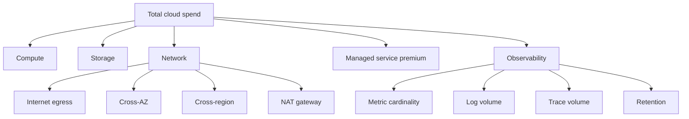
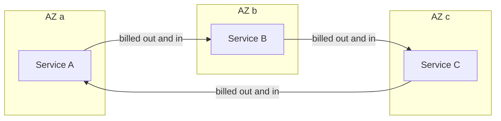
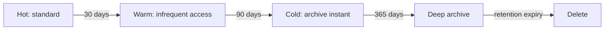
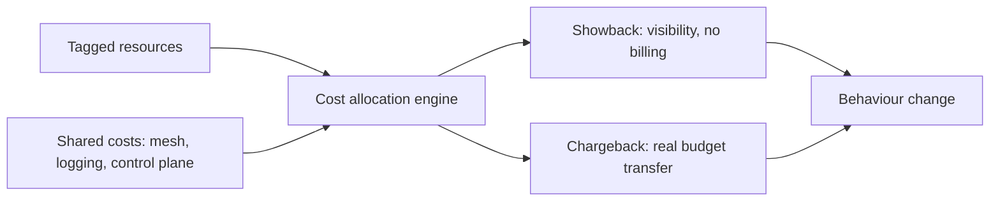

# F28 — Cost Engineering

**Cost is a non-functional requirement with the same status as latency and availability, and the engineer who can express a design as dollars per request is the one who gets to decide the architecture.**

Every number below is **illustrative order-of-magnitude** at public list rates. Prices change constantly and vary by provider, region, and negotiated discount. The purpose is the *shape* of the arithmetic and the relative size of the line items — never the digits.

---

## The Cost-per-Request Model

Start by building a unit cost. Everything else is a refinement.

$$
C_{\text{req}} = \frac{C_{\text{compute}} + C_{\text{storage}} + C_{\text{network}} + C_{\text{managed}} + C_{\text{observability}}}{R_{\text{month}}}
$$

Decompose per resource so each term is independently attackable:

$$
C_{\text{compute}} = \frac{\lambda \cdot t_{\text{cpu}}}{\rho_{\text{target}} \cdot v_{\text{cores}}} \times p_{\text{instance-hour}}
$$

where $t_{\text{cpu}}$ is CPU-seconds per request, $\rho_{\text{target}}$ is the utilization ceiling from [F24 Capacity Planning](f24-capacity-planning.md), and $v_{\text{cores}}$ is usable cores per instance. Note that $\rho_{\text{target}}$ sits in the denominator: **your reliability headroom is a direct multiplier on compute cost**, and that trade should be stated explicitly rather than absorbed silently.

!!! example "Illustrative worked example: a 500 rps API service"
    Assume 1.3 billion requests/month (about 500 rps sustained), three AZs, N+1 headroom.

    | Line item | Configuration | Monthly cost (illustrative) |
    |---|---|---|
    | Compute | 60 × 8-vCPU instances, on-demand at \$0.34/hr | \$14,900 |
    | Load balancer | ALB + LCU charges | \$400 |
    | Relational DB | 1 primary + 1 standby, 16 vCPU, multi-AZ | \$3,400 |
    | Cache | 3 × 26 GB nodes | \$900 |
    | Block storage | 5 TB gp3 | \$400 |
    | Object storage | 50 TB standard | \$1,150 |
    | Internet egress | 30 TB at blended \$0.085/GB | \$2,550 |
    | Cross-AZ transfer | see next section | \$3,300 |
    | Observability | metrics + logs + traces, SaaS | \$8,000 |
    | **Total** | | **\$35,000** |

    $$
    C_{\text{req}} = \frac{\$35{,}000}{1.3 \times 10^{9}} \approx \$2.7 \times 10^{-5} \;\approx\; \$27 \text{ per million requests}
    $$

    The two things this immediately tells you: **observability is 23% of the bill** and **network (egress plus cross-AZ) is 17%** — together larger than the database and cache combined. That is the typical shape, and it is almost never what people expect before they build the model.

Build this once and it becomes the tool for every subsequent argument: "this feature adds two service hops, which adds roughly \$4 per million requests; at our volume that is \$5,200 a month. Is it worth it?"

---

## Where the Money Actually Goes



| Driver | Typical share | Priced by | Why it surprises people |
|---|---|---|---|
| Compute | 40–60% | Instance-hour | Visible, easy to attribute, and therefore the only one most teams optimize |
| Storage | 10–25% | GB-month + request count + retrieval | Request charges on many small objects can exceed the storage charge |
| Internet egress | 5–20% | GB out, tiered | Ingress is free; egress is not, and asymmetric pricing distorts design |
| **Cross-AZ transfer** | 5–25% | GB, **both directions** | Invisible in per-service dashboards; scales with hop count, not user count |
| Cross-region transfer | 2–15% | GB | Continuous for replication; grows with data volume, not traffic |
| NAT gateway | 1–10% | Per-hour + **per-GB processed** | Every byte to S3 or an external API through NAT is billed twice over |
| Managed service premium | 10–40% | Varies | The premium is real but so is the operational cost it removes |
| Observability | 10–30% | Series, GB ingested, retention | Grows with *cardinality*, which grows with fleet size and label choices |

!!! gotcha "The managed-service premium is real but it is not the whole comparison"
    A managed Kafka or database commonly costs 1.5–3× the raw instance price. The correct comparison is not premium versus zero — it is premium versus the fully-loaded cost of running it yourself: on-call burden, patching, upgrade projects, capacity work, and the incidents you would have had. An SRE-hour is expensive and finite. Self-hosting wins when you have genuine scale (the premium exceeds a full engineer's salary) *and* the expertise already exists. Below that threshold it is usually a false economy.

---

## The Cross-AZ Data Transfer Trap

This is the single most common six-figure surprise in a microservices bill.



Two mechanics make it expensive:

1. **Billed in both directions.** An illustrative \$0.01/GB out plus \$0.01/GB in gives an effective **\$0.02/GB** for every byte that crosses an AZ boundary.
2. **Random placement means most calls cross.** With AZ-agnostic load balancing across $k$ AZs, the probability that a call stays in-zone is $\frac{1}{k}$, so the crossing probability is:

$$
P_{\text{cross}} = 1 - \frac{1}{k} = \frac{2}{3} \text{ for } k = 3
$$

And total cross-AZ volume scales with the **hop count**, which is a property of your architecture, not of your traffic:

$$
V_{\text{cross}} = R \times H \times \bar{B} \times \left(1 - \frac{1}{k}\right)
$$

!!! example "Illustrative worked example: a chatty service mesh"
    1.3 billion requests/month, 12 internal hops per request, 100 KB average payload per hop, 3 AZs:

    $$
    V_{\text{cross}} = 1.3\times10^{9} \times 12 \times 100\,\text{KB} \times \tfrac{2}{3} \approx 1.04 \times 10^{6}\ \text{GB} \;=\; 1.04\ \text{PB}
    $$

    $$
    C = 1.04 \times 10^{6}\ \text{GB} \times \$0.02/\text{GB} \approx \$20{,}800/\text{month}
    $$

    That is more than the compute for the services generating it. Two mitigations, both large:

    - **Topology-aware routing** (Kubernetes `trafficDistribution: PreferClose`, Istio locality load balancing, Envoy zone-aware routing) drops $P_{\text{cross}}$ from 0.67 toward 0.05–0.10, cutting the bill by roughly 85%.
    - **Reducing hop count** from 12 to 6 halves it again. Chatty decomposition has a literal price tag.

!!! example "Illustrative worked example: Kafka is a network product"
    A cluster ingesting 100 MB/s with replication factor 3 spread across 3 AZs:

    | Flow | Cross-AZ rate | Note |
    |---|---|---|
    | Produce | 67 MB/s | 2 of 3 producers are not in the leader's AZ |
    | Replication | 200 MB/s | Both followers are always in other AZs |
    | Consume (one group) | 67 MB/s | Unless fetch-from-follower is enabled |
    | **Total** | **334 MB/s** | |

    $$
    334\ \text{MB/s} \times 2.6\times10^{6}\ \text{s} \approx 868\ \text{TB/month} \times \$0.02/\text{GB} \approx \$17{,}400/\text{month}
    $$

    Broker compute for this cluster might be \$8,000–12,000. **The network costs more than the brokers.** Mitigations: rack-aware replica placement with `fetch.from.follower` (KIP-392) to keep consumer traffic in-zone, producer compression (`zstd` typically 3–5× on JSON), and — for the replication leg — accepting that RF=3 across AZs is a durability decision you are paying for deliberately.

The NAT gateway variant of the same trap: every byte from a private subnet to S3, to another AWS service, or to the internet is charged a per-GB processing fee **on top of** the transfer cost. A VPC gateway endpoint for S3 and DynamoDB is free and eliminates that entire line item; interface endpoints for other services cost per-hour but usually less than the NAT processing they replace.

---

## Egress Pricing Math

Egress pricing is deliberately asymmetric: ingress is free, egress is tiered and expensive. This is a lock-in mechanism as much as a cost recovery, and it should influence where you put data.

| Path | Illustrative rate | Notes |
|---|---|---|
| Internet egress, first 10 TB | \$0.09/GB | Tiers step down with volume |
| Internet egress, beyond 150 TB | \$0.05/GB | Committed contracts go far lower |
| Egress to a CDN | \$0.00–0.02/GB | Often free or heavily discounted from origin to the provider's own CDN |
| CDN to end user | \$0.01–0.085/GB | Committed volume moves this a lot |
| Cross-region | \$0.02/GB | Continuous for replication |
| Cross-AZ | \$0.01/GB each way | Effective \$0.02/GB |
| Ingress | \$0.00 | Always |

!!! example "Illustrative worked example: CDN versus direct serving"
    500 TB/month of user-facing content.

    | Approach | Arithmetic | Monthly cost |
    |---|---|---|
    | Direct from origin | 500,000 GB at blended \$0.06/GB | \$30,000 |
    | CDN, 90% hit ratio | 450,000 GB at CDN \$0.02 + 50,000 GB origin egress at \$0.085 | \$9,000 + \$4,250 = **\$13,250** |
    | CDN, 98% hit ratio | 490,000 GB at \$0.02 + 10,000 GB at \$0.085 | \$9,800 + \$850 = **\$10,650** |

    A CDN pays for itself on cost alone before you count the latency and origin-offload benefits. Note also how much the **hit ratio** matters to the bill, which turns cache-key hygiene (stripping tracking query parameters, normalizing `Vary` headers, sensible TTLs) from a performance concern into a cost concern. See [F05 CDN & Edge](f05-cdn-edge.md).

Other levers with large effect: compression (Brotli on text assets is commonly 15–25% better than gzip, straight off the egress bill), correct `Cache-Control` and `ETag` so conditional requests return 304s, right-sized images and adaptive bitrate for video, and avoiding chatty polling APIs in favour of long-poll or server-sent events.

---

## Storage Tiering and Lifecycle Economics



| Tier | Illustrative storage | Retrieval fee | First-byte latency | Minimum duration |
|---|---|---|---|---|
| Standard | \$0.023/GB-mo | \$0 | ms | none |
| Infrequent access | \$0.0125/GB-mo | \$0.01/GB | ms | 30 days |
| Archive instant retrieval | \$0.004/GB-mo | \$0.03/GB | ms | 90 days |
| Archive flexible | \$0.0036/GB-mo | \$0.01/GB | minutes to hours | 90 days |
| Deep archive | \$0.00099/GB-mo | \$0.02/GB | hours | 180 days |

!!! example "Illustrative worked example: 100 TB of logs"
    Access pattern: heavy in the first 30 days, effectively never after 90.

    | Strategy | Arithmetic | Monthly |
    |---|---|---|
    | All standard | 100,000 GB × \$0.023 | **\$2,300** |
    | Tiered | 10 TB std (\$230) + 20 TB IA (\$250) + 70 TB archive-instant (\$280) | **\$760** |
    | Aggressive: 70 TB in deep archive | 10 TB std + 20 TB IA + 70 TB deep (\$69) | **\$549** |

    The aggressive option saves a further \$211/month and costs you hours of retrieval latency during the incident where you actually need the logs. That is a bad trade for anything on the incident-response path, and a fine trade for compliance retention nobody expects to read.

    **The trap that eats the savings:** lifecycle transitions are billed **per object**. If those 100 TB are 100 million small objects at an illustrative \$0.05 per 1,000 transition requests:

    $$
    \frac{100 \times 10^{6}}{1{,}000} \times \$0.05 = \$5{,}000 \text{ one-off, per transition hop}
    $$

    A three-hop lifecycle policy costs \$15,000 to save \$1,750/month — a ten-month payback, and if you transition again next year you pay again. **Aggregate small objects before tiering**, or set lifecycle rules with a minimum object size filter so only large objects transition.

The retrieval-cost arithmetic that decides whether tiering is right:

$$
\text{Tier down if } \Delta p_{\text{storage}} \times S > f_{\text{access}} \times S \times p_{\text{retrieval}} + \frac{C_{\text{transition}}}{\text{months held}}
$$

For data with a 1% monthly access rate, moving from standard (\$0.023) to archive-instant (\$0.004 + \$0.03/GB retrieval): saving is \$0.019/GB-mo, retrieval cost is $0.01 \times \$0.03 = \$0.0003$/GB-mo. Overwhelmingly worth it. For data accessed 50% monthly, retrieval alone is \$0.015/GB-mo and the transition fees make it marginal.

Other storage-cost realities:

- **Snapshots are incremental but retention is not free.** A daily snapshot held for 90 days on a high-churn volume can exceed the volume's own cost.
- **Provisioned IOPS is often the largest line on a database bill.** gp3 lets you provision IOPS independently of size; io2 costs several times more and is only justified by a measured requirement.
- **Deleted-but-not-expired versions.** Versioned buckets keep every overwrite. Without a non-current-version expiry rule, a bucket with frequent overwrites grows without bound and nobody notices until the bill does.
- **Incomplete multipart uploads** accumulate silently and are billed. A lifecycle rule to abort them after 7 days is free money.

---

## Right-Sizing and Utilization Targets

$$
\text{Efficiency} = \frac{\text{Resource actually used}}{\text{Resource paid for}} = \underbrace{\frac{\text{used}}{\text{requested}}}_{\text{right-sizing}} \times \underbrace{\frac{\text{requested}}{\text{provisioned}}}_{\text{bin packing}} \times \underbrace{\frac{\text{provisioned}}{\text{purchased}}}_{\text{commitment}}
$$

All three terms multiply, and teams typically optimize only the first. A workload at 50% right-sizing, 60% bin packing, and 80% commitment coverage has an overall efficiency of 24% — meaning three quarters of the spend produces nothing.

| Lever | Typical gain | Risk |
|---|---|---|
| Right-size over-requested CPU/memory | 20–50% | Under-request causes throttling or OOM; use p99 of observed usage, not the max |
| Improve bin packing (fewer, larger nodes) | 10–30% | Larger failure domains; noisier neighbours |
| Newer instance generations | 10–20% at equal or lower price | Requires validation; ARM (Graviton-class) needs a rebuild and a test pass |
| ARM/Graviton migration | 20–40% price-performance | Multi-arch build pipeline; native dependency compatibility |
| Kill zombie resources | 5–15% | None; this is pure waste |
| Consolidate under-used environments | 5–10% | Staging fidelity |

!!! tip "Request the p99, limit generously, and monitor throttling"
    In Kubernetes, CPU *requests* drive scheduling and therefore cost; CPU *limits* drive throttling. Setting requests at the p99 of observed usage and either omitting the CPU limit or setting it well above the request usually improves both cost and latency — CFS throttling at the limit is a common and badly-understood source of p99 latency spikes. Memory is different: memory limits are a hard kill, so requests and limits should be close and set from observed peak RSS plus a real margin.

Zombie resources worth an automated sweep: unattached volumes, unassociated elastic IPs, idle load balancers, old snapshots, orphaned test clusters, forgotten NAT gateways in unused subnets, and dev environments running 24/7 for an 8-hour workday. That last one alone is a 76% saving on those resources with a scheduled scale-to-zero.

---

## Spot and Preemptible Capacity

Spot is 60–90% off on-demand in exchange for the provider's right to reclaim the instance with roughly two minutes of warning.

!!! example "Illustrative worked example: batch fleet on spot"
    100 × 16-vCPU instances, 730 hours:

    | Purchase mode | Rate | Monthly |
    |---|---|---|
    | On-demand | \$0.68/hr | \$49,600 |
    | 1-year savings plan | \$0.49/hr | \$35,800 |
    | Spot | \$0.24/hr | **\$17,500** |

    Spot saves \$32,100/month against on-demand. The engineering cost of making the workload interruption-tolerant is typically a few engineer-weeks — an immediate payback at this scale, and no payback at all if the fleet is ten instances.

| Workload | Spot suitability | Requirements |
|---|---|---|
| Batch, ETL, CI runners, ML training | Excellent | Checkpointing, idempotent retry |
| Stateless web serving | Good with care | Diversified pools, on-demand base, fast drain |
| Stream processing | Moderate | Frequent offset commits, fast rebalance |
| Stateful databases | Poor | Do not |
| Anything with a hard deadline | Poor | Interruption is not schedulable |

Interruption handling that actually works:

```yaml
# Diversify across many pools: interruption is per instance-type per AZ.
# One pool means one reclamation event takes the whole fleet.
mixedInstancesPolicy:
  instancesDistribution:
    onDemandBaseCapacity: 20              # floor that never gets reclaimed
    onDemandPercentageAboveBaseCapacity: 0
    spotAllocationStrategy: capacity-optimized
  overrides:                               # aim for 6+ type/AZ combinations
    - instanceType: c6i.4xlarge
    - instanceType: c6a.4xlarge
    - instanceType: c5.4xlarge
    - instanceType: m6i.4xlarge
    - instanceType: m5.4xlarge
    - instanceType: c7g.4xlarge
```

```bash
# Handle the 2-minute notice: drain, do not die.
while :; do
  if curl -sf -H "X-aws-ec2-metadata-token: $TOKEN" \
      http://169.254.169.254/latest/meta-data/spot/instance-action >/dev/null; then
    kubectl cordon "$NODE"
    kubectl drain "$NODE" --ignore-daemonsets --delete-emptydir-data --grace-period=90
    exit 0
  fi
  sleep 5
done
```

The essential design property is **checkpointing**: work must be resumable from a durable point, and partial work must be discardable without corruption. If a two-minute interruption loses four hours of computation, spot is not cheaper — it is a reliability liability with a discount attached.

---

## Reserved Capacity and Commitment Risk

| Instrument | Illustrative discount | Flexibility | Risk |
|---|---|---|---|
| On-demand | 0% | Total | None |
| 1-year no-upfront savings plan | 25–30% | High (spend-based, spans families) | Low |
| 1-year all-upfront | 30–40% | High | Capital tied up |
| 3-year all-upfront | 50–60% | High | **Large**: 3 years is longer than most architectures live |
| Standard reserved instance | 40–60% | Low (family and region locked) | High: cannot follow a migration |
| Capacity reservation | 0% (pay full rate) | Guarantees availability | Pure cost, buys failover certainty |

Commitment is a bet that future usage will be at least the committed level. The expected value:

$$
E[\text{saving}] = d \cdot L \cdot P(\text{usage} \ge L) \;-\; L \cdot \big(1 - P(\text{usage} \ge L)\big) \cdot \text{(unused fraction)}
$$

The practical implication is that you commit to the **floor**, not the forecast.

!!! example "Illustrative worked example: commitment ladder"
    Current spend \$40,000/month of eligible compute, growing 3% per month, but with an efficiency programme running that could cut usage 30%.

    | Layer | Coverage | Instrument | Rationale |
    |---|---|---|---|
    | 0–\$22,000 | 55% | 3-year savings plan (55% off) | Below any plausible floor even after the efficiency work |
    | \$22,000–\$32,000 | 25% | 1-year savings plan (28% off) | Confident for 12 months, not 36 |
    | \$32,000–\$40,000 | 20% | On-demand and spot | Absorbs both growth and shrinkage |

    Blended saving is roughly $0.55 \times 0.55 + 0.25 \times 0.28 + 0.20 \times 0 \approx 37\%$, or about **\$14,800/month**, while retaining the ability to shrink 45% without paying for anything unused. A naive "commit 100% for 3 years" reaches 55% saving on paper and turns the efficiency programme into a value-destroying exercise, because every dollar you save on usage is a dollar you still pay on the commitment.

!!! gotcha "Commitments make efficiency work worthless, so buy them in that order"
    Symptom: the team lands a 40% compute reduction and the bill does not move. Mechanism: the commitment was sized to pre-optimization usage, so the saved capacity is still paid for until the term ends. Mitigation: **optimize first, commit second.** Run right-sizing, Graviton migration, and bin-packing improvements before locking in a baseline, and ladder commitments so only the genuinely irreducible floor is on a long term.

---

## Autoscaling for Cost

The cost benefit of autoscaling comes from the peak-to-mean ratio $B$:

$$
\text{Static cost} \propto \text{Peak} \qquad \text{Scaled cost} \propto \text{Mean} + \text{overhead} \qquad \text{Saving} \approx 1 - \frac{1}{B} \text{ minus lag and floor}
$$

A service with $B = 4$ can in principle save 75%. In practice it saves 40–55%, because you must keep a static floor to cover the scale-up dead time (see [F24 Capacity Planning](f24-capacity-planning.md)) and because scale-in is deliberately slow.

| Technique | Saving | Caveat |
|---|---|---|
| Horizontal autoscaling on a real saturation signal | 30–55% | Dead time requires a static floor |
| Scheduled scaling for predictable diurnal shape | 20–40% | Add to, not instead of, reactive scaling |
| Scale non-production to zero outside working hours | 60–75% on those environments | Needs fast, reliable start-up |
| Serverless for spiky, low-duty-cycle workloads | Large below a break-even point | Above it, always-on instances are cheaper |
| Fill the diurnal trough with preemptible batch | Converts waste into work | Requires strict admission control so batch cannot survive into the ramp |

The serverless break-even is worth computing rather than debating:

$$
\text{Break-even utilization} \approx \frac{p_{\text{instance-hour}}}{p_{\text{GB-second}} \times \text{GB} \times 3600 + p_{\text{invocation}} \times \lambda \times 3600}
$$

For most request-serving workloads this lands somewhere around 5–20% duty cycle. Below it, functions win decisively; above it, provisioned instances win decisively — and by a lot, because per-request pricing has no volume discount curve to speak of.

---

## Observability Cost Control

Observability is frequently the second-largest line item and almost always the fastest-growing, because it scales with **fleet size × label cardinality × retention**, none of which is bounded by user traffic.

!!! example "Illustrative worked example: one metric costing \$5,400/month"
    A latency histogram with 12 buckets, labelled `endpoint` (200 values) × `status_code` (15) × `instance` (500):

    $$
    12 \times 200 \times 15 \times 500 = 18{,}000{,}000 \text{ series}
    $$

    At an illustrative \$0.30 per 1,000 series per month: **\$5,400/month for a single metric.**

    Drop the `instance` label (aggregate at scrape time; you almost never query a single instance's histogram):

    $$
    12 \times 200 \times 15 = 36{,}000 \text{ series} \;\to\; \$10.80/\text{month}
    $$

    A **500× reduction** from removing one label. Reduce `endpoint` to a normalized route template with 30 values and it falls further. This is the highest-leverage cost action available in most observability bills, and it costs one line of relabelling config.

!!! danger "Never put an unbounded value in a metric label"
    User ID, request ID, trace ID, full URL path with identifiers, raw error message, customer email, session ID. Each unique value creates a permanent time series in most TSDBs. A single accidental `user_id` label can add millions of series in minutes, blow the memory budget of the metrics backend, and produce a bill with a comma you have never seen before. Cardinality limits must be enforced *in the pipeline*, not by code review.

| Signal | Cost driver | Control |
|---|---|---|
| Metrics | Active series | Bounded label sets, route templating, recording rules for expensive queries, drop unused series at ingest |
| Logs | GB ingested | Sample non-error logs, structured logs at INFO not DEBUG, drop health checks and access logs for static assets, tier to object storage after 7 days |
| Traces | Spans ingested | Head sampling at 1–5% plus **tail sampling that keeps 100% of errors and slow traces** |
| Retention | GB × days | Tier by age: 7 days hot and queryable, 30 days warm, 13 months of downsampled rollups |
| Profiles | Continuous profiling volume | Low sample rate; it is cheap and unusually high-value per byte |

!!! example "Illustrative worked example: log volume"
    500 instances × 200 log lines/s × 400 bytes = 40 MB/s = **104 TB/month**. At an illustrative SaaS rate of \$0.50/GB ingested: **\$52,000/month**.

    - Drop health-check and static-asset access logs (typically 40% of lines): \$31,000.
    - Sample INFO-level application logs at 5%, keep 100% of WARN and above: **\$7,000**.
    - Route full-fidelity logs to object storage (\$0.023/GB) and query them with an on-demand engine when needed: the archive costs about \$2,400/month for the full 104 TB.

    Combined, roughly **\$52,000 to \$9,000** with no meaningful loss of debuggability — because the errors, which is what you actually search for, are retained at 100%.

Tail-based sampling deserves specific mention: head sampling at 1% discards 99% of traces *before* knowing whether they are interesting, so the one slow request a customer complained about is almost certainly gone. Tail sampling buffers the spans of a trace, waits for it to complete, and keeps it if it errored, exceeded a latency threshold, or touched a rare code path — retaining perhaps 2% of volume while keeping close to 100% of the traces you would actually look at. See [F22 Observability Fundamentals](f22-observability-fundamentals.md).

---

## The Cost of High Availability

Each additional nine costs substantially more than the last, and the cost is not linear because the mechanisms change qualitatively.

| Target | Downtime/month | Architecture | Illustrative monthly cost | Multiple |
|---|---|---|---|---|
| 99.0% | 7.2 hours | Single instance, backups | \$5,000 | 1.0× |
| 99.9% | 43.8 minutes | Multi-AZ, N+1, autoscaling, on-call | \$50,000 | 10× |
| 99.99% | 4.4 minutes | Multi-region active-active, automated failover | \$115,000 | 23× |
| 99.999% | 26 seconds | Everything above, plus no human in any recovery path | \$300,000+ | 60×+ |

!!! example "Illustrative worked example: the price of one nine"
    Moving from 99.9% (multi-AZ, single region) to 99.99% (multi-region active-active):

    | Item | Delta |
    |---|---|
    | Duplicate compute and storage in a second region | +\$50,000/month |
    | Cross-region replication egress | +\$5,000/month |
    | Additional observability across two regions | +\$5,000/month |
    | Global routing tier and health checking | +\$3,000/month |
    | Engineering: migration project, 2 engineer-years | +\$500,000 one-off |
    | Engineering: ongoing 0.5 FTE for DR drills and dual-region operations | +\$10,000/month |
    | **Recurring total** | **+\$73,000/month** |

    You are buying back 39.4 minutes of downtime per month for roughly \$73,000/month plus a half-million-dollar project. At about **\$1,850 per minute of avoided downtime**, that is excellent value for a payments platform and absurd for an internal reporting tool.

    The correct framing for the conversation with the business:

    $$
    \text{Justified if } (\text{revenue/min} + \text{reputational cost/min}) \times \Delta t_{\text{avoided}} > \Delta C
    $$

    Note also that above roughly 99.99%, **your dependencies become the binding constraint**. If your cloud provider's compute SLA is 99.99% and your payment processor's is 99.95%, a 99.999% application-level target is arithmetically impossible without designing around each of them — which costs more again. State this; it is the strongest available argument against an unconsidered "we need five nines". See [F23 SLI/SLO & Error Budgets](f23-slo-error-budgets.md).

---

## Unit Economics and Efficiency Metrics

Absolute spend rising is not automatically a problem; **cost per unit rising is always a problem.** Pick a unit that tracks the business.

| Business | Unit metric | Watch for |
|---|---|---|
| SaaS | Cost per tenant per month | The top 1% of tenants consuming 40% of resources |
| Consumer app | Cost per monthly active user | Rising while engagement is flat |
| Video | Cost per stream-hour delivered | Bitrate ladder and CDN hit ratio |
| API platform | Cost per million API calls | Mix shift toward expensive endpoints |
| Storage product | Cost per TB stored per month | Tiering effectiveness, replication factor |
| ML platform | Cost per training run, cost per 1M inference tokens | GPU utilization, which is usually appalling |

$$
\text{Gross margin} = 1 - \frac{C_{\text{infra per unit}}}{\text{Revenue per unit}}
$$

The metrics an engineering organization should actually publish:

- **Cost per unit**, trended, with a target trajectory (it should fall as scale increases; if it is flat you have no economies of scale).
- **Efficiency**: used over purchased, decomposed into the three multiplicative terms above.
- **Commitment coverage** and waste (committed but unused).
- **Cost of the top 10 line items**, each with a named owner.
- **Cost per deploy environment**, which routinely reveals a staging environment costing 60% of production.

!!! tip "The trend matters more than the level"
    A cost per request that is high but falling 5% per quarter is a healthy system. One that is low but rising 8% per quarter will be a crisis within a year. Alert on the *derivative* of unit cost, and attach it to the same review cadence as SLO burn.

---

## Showback and Chargeback



| Model | Mechanism | Effect | Risk |
|---|---|---|---|
| Nothing | Central budget | Zero incentive to optimize; the tragedy of the commons | Unbounded growth |
| Showback | Teams see their spend | Usually 10–20% reduction from visibility alone | Ignorable without leadership attention |
| Chargeback | Spend hits the team's budget | Strong incentive | Perverse behaviour: teams avoid shared platforms, under-provision, cut observability |

Practical guidance:

- **Start with showback.** Most of the behavioural benefit comes from visibility and it carries none of the perverse incentives.
- **Tagging must be enforced, not requested.** Policy-as-code that refuses to create untagged resources. Untagged spend is unallocatable spend, and it only grows.
- **Allocate shared costs by a defensible driver** — mesh and network by traffic volume, logging by GB ingested, control plane by node count. Arbitrary even splits destroy the credibility of the whole exercise.
- **Chargeback needs guardrails.** If a team is charged for observability, some will delete their dashboards. Make baseline observability a platform cost, not a team cost, or you have bought a small saving and sold your incident response.

---

## When Engineering Time Costs More Than the Infrastructure

$$
\text{Payback (months)} = \frac{H_{\text{eng}} \times R_{\text{loaded}}}{\Delta C_{\text{monthly}}}
$$

At a fully-loaded engineer cost of roughly \$250,000/year (about \$20,800/month, or \$120/hour):

| Optimization | Effort | Monthly saving | Payback | Verdict |
|---|---|---|---|---|
| Drop a high-cardinality metric label | 2 hours | \$5,400 | < 1 day | Do it immediately |
| Add an S3 gateway VPC endpoint | 4 hours | \$2,000 | < 1 day | Do it immediately |
| Lifecycle policy for old snapshots | 1 day | \$800 | 1 month | Do it |
| Enable zone-aware routing in the mesh | 1 week | \$15,000 | < 1 week | Do it |
| Migrate a service to ARM | 3 weeks | \$4,000 | 4 months | Do it |
| Rewrite a hot service from Python to Go | 4 months | \$3,000 | 28 months | **Do not**, unless latency also justifies it |
| Build a custom autoscaler | 3 months | \$2,000 | 31 months, plus perpetual maintenance | **Do not** |
| Migrate off a managed database to self-hosted | 6 months | \$8,000 | 16 months, plus 0.5 FTE forever | **Probably not** |

!!! gotcha "The payback calculation must include the maintenance tail"
    Symptom: a bespoke optimization saves \$2,000/month, and two years later a different team spends three weeks understanding it during an incident. Mechanism: the payback model counts build cost once and ignores the perpetual cost of an additional non-standard component — onboarding, debugging, upgrades, and the incident where it behaves unexpectedly. Mitigation: add an ongoing maintenance charge (10–20% of build cost per year is a reasonable default) to every custom optimization, and require a shorter payback for anything that increases system diversity.

Rules of thumb worth stating in a review:

- **Under 5% of total spend and not growing: leave it alone.** Optimization has an opportunity cost measured in features not shipped.
- **Configuration changes beat code changes.** Lifecycle rules, VPC endpoints, relabelling, instance families, and scheduled scale-down are hours of work for thousands of dollars.
- **Optimize what is growing, not what is large.** A \$3,000 line item growing 20% per month is \$26,000 within a year; a static \$20,000 one is not the emergency.
- **The cheapest optimization is deleting something.** Unused features, zombie environments, dashboards nobody opens, and pipelines producing data nobody queries.

---

## Gotchas & Corner Cases

!!! gotcha "Cross-AZ traffic is billed in both directions and quietly becomes the largest line item"
    **Symptom:** the data-transfer line on the bill exceeds compute, and no single team recognizes it as theirs. **Mechanism:** AZ-agnostic load balancing means two thirds of every internal call crosses an AZ boundary with three AZs, and each crossing is billed for egress *and* ingress at an effective \$0.02/GB. Total volume scales with hop count and payload size, not with user count, so a chatty mesh multiplies it — and it never appears in any per-service dashboard because the transfer charge is attributed to the account, not the workload. **Mitigation:** enable topology-aware routing (`trafficDistribution: PreferClose`, Istio locality LB, Envoy zone-aware routing), enable Kafka rack awareness and fetch-from-follower, compress internal payloads, reduce hop counts, and add VPC flow log analysis to attribute transfer to workloads so it has an owner.

!!! gotcha "The NAT gateway bills you per GB for traffic that should never have left the VPC"
    **Symptom:** a substantial NAT processing charge on a service that only talks to S3. **Mechanism:** without a gateway VPC endpoint, S3 traffic from a private subnet routes through the NAT gateway and is charged an illustrative \$0.045/GB processing fee on top of everything else. High-volume S3 workloads can spend more on NAT processing than on storage. **Mitigation:** gateway endpoints for S3 and DynamoDB (free), interface endpoints for other services where the per-hour cost is below the NAT processing it displaces, and a periodic review of what is actually traversing NAT via flow logs.

!!! gotcha "Lifecycle transitions on many small objects cost more than the storage they save"
    **Symptom:** a tiering policy is deployed to save \$1,750/month and the next bill is \$15,000 higher. **Mechanism:** transitions are billed per object request, at an illustrative \$0.05 per 1,000. A hundred million small objects moving through a three-hop lifecycle policy incurs \$15,000 in request charges. For objects under roughly 128 KB, the storage saving may never repay the transition. **Mitigation:** apply a minimum-object-size filter to lifecycle rules, aggregate small objects into larger archives before tiering, and model the transition cost explicitly before deploying the policy.

!!! gotcha "One high-cardinality label multiplies your metrics bill by three orders of magnitude"
    **Symptom:** the observability bill doubles overnight with no traffic change, and the metrics backend starts OOMing. **Mechanism:** someone added `user_id`, `request_id`, or a full URL path as a metric label. Every distinct value creates a permanent active series; a 12-bucket histogram multiplies it by twelve. Cardinality is the product of all label cardinalities, so one unbounded label makes the whole metric unbounded. **Mitigation:** enforce cardinality limits in the ingestion pipeline rather than relying on review, normalize URL paths to route templates, aggregate away `instance` at scrape time, and alert on series-count growth rate per metric name.

!!! gotcha "Head-based trace sampling throws away exactly the traces you need"
    **Symptom:** a customer reports a slow request with a trace ID, and the trace does not exist. **Mechanism:** head sampling decides at the root span, before anything is known about the request. At 1%, 99% of errors and 99% of slow requests are discarded. **Mitigation:** tail-based sampling — buffer spans, decide after the trace completes, keep 100% of errors and anything above a latency threshold plus a small baseline sample of successes. Typical result: 2% of volume retained, close to 100% of the traces anyone will ever look at.

!!! gotcha "Committing to a three-year plan makes your efficiency programme worthless"
    **Symptom:** the platform team delivers a 40% compute reduction and the bill does not move for two more years. **Mechanism:** the commitment was sized against pre-optimization usage. Savings plans bill the committed hourly spend whether or not you consume it, so reducing usage below the commitment produces zero benefit. **Mitigation:** optimize before committing; ladder commitments so only the irreducible floor is on a long term; prefer flexible spend-based plans over family-locked reserved instances; and re-evaluate the ladder quarterly against a downside forecast, not the growth forecast.

!!! gotcha "Spot instances all vanish at once because you diversified across one pool"
    **Symptom:** the entire batch fleet is reclaimed within a minute and jobs restart from zero. **Mechanism:** spot capacity is allocated per instance-type per AZ. Requesting 200 × `c5.4xlarge` in one AZ is a single pool; when that pool tightens, everything goes together. Compounding this, workloads with no checkpointing lose all in-flight progress, so the effective cost of the interruption exceeds the discount. **Mitigation:** at least six instance-type-and-AZ combinations, `capacity-optimized` allocation strategy, an on-demand base capacity floor for the portion that must not disappear, checkpointing at intervals shorter than the mean time between interruptions, and a drain handler that acts on the two-minute notice.

!!! gotcha "Idle serverless is free, but busy serverless is dramatically more expensive than instances"
    **Symptom:** a function migrated for cost reasons becomes the largest line item as traffic grows. **Mechanism:** per-invocation and per-GB-second pricing has essentially no volume discount, so cost scales linearly with traffic while instance cost scales with *peak* and then flattens. Past roughly a 5–20% duty cycle the economics invert, and provisioned concurrency (bought to fix cold starts) removes the scale-to-zero benefit entirely. **Mitigation:** compute the break-even duty cycle before choosing, re-evaluate as traffic grows, and treat "we added provisioned concurrency" as the signal that the workload has outgrown the model.

!!! gotcha "Non-production costs more than production"
    **Symptom:** the environment breakdown shows staging, dev, and per-developer preview environments at 60% of the total bill. **Mechanism:** non-production runs 24/7 for an 8-hour workday, is often provisioned at production scale "for fidelity", accumulates abandoned preview environments with no expiry, and is exempt from every efficiency initiative because it is nobody's SLO. **Mitigation:** scheduled scale-to-zero outside working hours (a 76% saving on those resources), TTLs on ephemeral environments enforced by automation, scaled-down but topologically-identical staging, and shared rather than per-developer infrastructure for expensive components.

!!! gotcha "Versioned buckets and incomplete multipart uploads grow forever and are invisible"
    **Symptom:** object storage costs three times what the object count suggests. **Mechanism:** versioning retains every overwrite as a non-current version, and without an expiry rule a frequently-rewritten object accumulates thousands of billed copies. Separately, failed multipart uploads leave billed parts that appear in no object listing at all. **Mitigation:** lifecycle rules for non-current version expiry and for aborting incomplete multipart uploads after 7 days, plus storage-class analysis or inventory reports to reconcile billed bytes against listed objects.

!!! gotcha "Autoscaling saves nothing because the scale-in policy is too timid"
    **Symptom:** the fleet scales out during the morning ramp and never comes back down. **Mechanism:** scale-in is deliberately conservative to avoid oscillation, but combined with a long cooldown, a high scale-in threshold, and a metric that stays elevated from background work, the fleet ratchets upward and stays there. Scaling policies are usually tuned for the scale-out direction and never validated for scale-in. **Mitigation:** measure the actual realized peak-to-provisioned ratio over a week rather than assuming the policy works; use target-tracking with a reasonable deadband; and check that instance count returns to the overnight baseline every day, alerting when it does not.

!!! gotcha "Data egress makes the second-source or exit strategy far more expensive than anyone modelled"
    **Symptom:** a migration or multi-cloud plan stalls when someone computes the transfer cost. **Mechanism:** egress is priced asymmetrically — ingress free, egress expensive — precisely because it discourages data leaving. Moving 500 TB out at an illustrative \$0.05/GB is \$25,000 in transfer alone, before any dual-running cost, and the dual-running period is usually months. **Mitigation:** treat egress as a lock-in cost when choosing where data lives, negotiate egress terms in enterprise agreements, use physical transfer appliances for bulk one-time moves, and keep the highest-volume derived data regenerable in place rather than transferable.

---

## SRE Lens

### SLIs and SLOs

| SLI | Definition | Target shape |
|---|---|---|
| Cost per request (or per unit) | Total attributable spend / units served | Falling, or flat with scale |
| Efficiency ratio | Used / purchased, decomposed into three terms | Rising; track all three |
| Commitment coverage and waste | Committed spend used / committed spend bought | > 95% used |
| Unallocated spend | Untagged as a fraction of total | < 5%, trending to zero |
| Observability cost ratio | Observability spend / total spend | 10–20% is normal; above 30% is a problem |
| Cost anomaly detection | Daily spend versus a forecast band | Alert on the derivative, not the level |
| Cost per environment | Non-prod as a fraction of prod | Should be well under 30% |

Cost regressions deserve alerts with the same seriousness as latency regressions — and cost anomalies are frequently the *first* symptom of a functional bug: a retry loop, a runaway cron, an infinite pagination loop, or a log line added inside a hot path.

### Failure modes and detection

- **Runaway spend** from a misconfigured autoscaler, an infinite retry loop, or a recursive Lambda invocation. Detection: daily spend anomaly with a same-day alert, plus hard budget actions on non-production accounts.
- **Cardinality explosion** from a deploy. Detection: series-count growth rate per metric name, alerting within minutes; ideally a pipeline-level limit that drops the offending metric rather than accepting it.
- **Silent efficiency regression:** cost per request creeping up while absolute spend looks fine because traffic is growing. Detection: the unit metric, reviewed on a schedule.
- **Cost-driven reliability regression:** a well-meaning optimization removes headroom, disables a replica, or shortens retention below what incident response needs. Detection: require an SLO impact statement on every cost change above a threshold.

### Rollout and migration risk

- Cost optimizations are production changes and need the same progressive rollout and rollback as any other (see [F25 Deployment & Release Safety](f25-deployment-release-safety.md)). Right-sizing that removes memory headroom shows up as OOM kills days later, under a traffic pattern the change window never saw.
- Instance-family and architecture migrations change per-instance capability; re-run the load test rather than assuming vCPU parity.
- Retention reductions are irreversible. Confirm what incident response and compliance actually require *before* deleting.

### Capacity signals

Cost and capacity are the same conversation from two directions. Utilization is the shared variable: raising $\rho_{\text{target}}$ cuts cost and consumes reliability headroom. Make that trade explicitly, with the failover math from [F24 Capacity Planning](f24-capacity-planning.md) on the table, rather than letting it happen through a series of unreviewed right-sizing tickets.

### On-call runbook notes

- [ ] A cost anomaly alert is a potential functional incident: check for retry storms, runaway crons, recursive invocations, and log statements newly added to hot paths.
- [ ] Know which cost controls are safe to trip during an incident: sampling rates and retention are adjustable; deleting data is not.
- [ ] Do not let a cost control block incident response. Log sampling should be dialable back to 100% for a service during an active incident, and that lever should be in the runbook.
- [ ] Budget actions that hard-stop resources must never apply to production. Enforce that in policy.

### Cost

The recursive point: cost engineering itself has a cost. A dedicated FinOps function is justified above roughly \$1M annual cloud spend; below that, a shared dashboard, enforced tagging, and a quarterly review by the platform team capture most of the value at a fraction of the effort.

---

## Interview Angle

!!! interview "Probe: how much does this system cost to run?"
    **Weak:** "It depends on the cloud provider."

    **Strong:** build the model out loud. "Let me get to a cost per request. At 500 rps with 5 ms of CPU per request and a 70% utilization target, I need about 60 8-vCPU instances, which is roughly \$15,000/month on-demand. Storage and the database add maybe \$5,000. The two that people forget are network and observability: 30 TB of egress is around \$2,500, cross-AZ traffic depends on hop count and could easily be \$3,000, and observability is typically 20% of the bill. So call it \$35,000/month, about \$27 per million requests. The dominant levers from there are commitment coverage, zone-aware routing, and metric cardinality — in roughly that order of effort-to-value."

!!! interview "Probe: your data transfer bill is the largest line item. Why?"
    **Strong:** go straight to cross-AZ. "Almost certainly cross-AZ traffic in the service mesh. It is billed in both directions, so effectively \$0.02/GB, and with AZ-agnostic load balancing across three zones two thirds of every internal call crosses a boundary. Critically, the volume scales with hop count and payload size rather than user count, so a chatty decomposition multiplies it — and it is invisible per-service because the charge lands on the account. I would enable topology-aware routing to cut the crossing probability from 0.67 to under 0.1, turn on Kafka rack awareness and fetch-from-follower, compress internal payloads, and check for S3 traffic traversing a NAT gateway instead of a gateway endpoint."

!!! interview "Probe: what does 99.99% cost compared with 99.9%?"
    **Strong:** quantify both sides. "99.9% is 44 minutes a month and is achievable with multi-AZ and N+1 in one region. 99.99% is 4.4 minutes and effectively requires multi-region active-active, which roughly doubles the infrastructure, adds cross-region replication egress, and needs a permanent engineering investment in DR drills and dual-region operations. Illustratively that is around +\$73,000 a month plus a half-million-dollar migration, buying back 39 minutes — about \$1,850 per minute of avoided downtime. That is excellent for payments and absurd for internal reporting. And above 99.99% the dependencies bind: if the payment processor is 99.95%, an application-level five nines is arithmetically impossible without engineering around them, which costs more again."

!!! interview "Probe: how would you cut this bill by 30%?"
    **Strong:** order by effort-to-value rather than listing techniques. "First, measure and attribute — enforced tagging, because unallocated spend cannot be optimized. Then the configuration-only wins: metric cardinality (removing one label routinely gives a 100× reduction on a metric), log sampling with 100% error retention, S3 gateway endpoints, lifecycle policies, aborting incomplete multipart uploads, and non-production scale-to-zero. Then right-sizing from observed p99 usage and a Graviton migration. *Then* commitments — deliberately last, because committing before optimizing means you keep paying for capacity you just eliminated. Spot for batch throughout. I would expect 30–40% from that sequence, most of it in the first two weeks."

!!! interview "Probe: when is it not worth optimizing?"
    **Strong:** give the arithmetic. "Payback in months is engineer-hours times loaded rate divided by monthly saving. At about \$120 an hour fully loaded, a four-month rewrite saving \$3,000 a month pays back in over two years and adds a perpetual maintenance tail — that is value destruction. My rules: ignore anything under 5% of spend that is not growing; strongly prefer configuration changes over code changes; optimize what is *growing*, not what is merely large; and add a 10–20% annual maintenance charge to any custom-built optimization, because increasing system diversity has an ongoing cost that the naive payback calculation hides."

!!! interview "Probe: showback or chargeback?"
    **Strong:** "Start with showback. Most of the behavioural benefit comes from visibility alone, typically 10–20%, without the perverse incentives. Chargeback creates real pressure but also real distortion: teams avoid shared platforms because the platform cost is visible and their own is not, they under-provision to hit a budget, and — the one I would flag hardest — they delete observability, which trades a small saving for your incident response. If I did chargeback, baseline observability and reliability infrastructure would stay a platform cost, and shared costs would be allocated by a defensible driver like traffic volume, never by an arbitrary even split."

---

## Key Takeaways

- Build a cost-per-request model before arguing about architecture; it converts design debates into arithmetic and gives you the authority to make the call.
- Network and observability are routinely 30–50% of a modern bill and are the two line items almost nobody models in advance.
- Cross-AZ transfer is billed both directions, scales with hop count rather than user count, and is invisible per-service — topology-aware routing is usually the single largest available saving.
- Storage tiering is high value, but per-object transition charges can exceed the savings for small objects; model the transition cost before deploying the lifecycle policy.
- Efficiency is the product of right-sizing, bin packing, and commitment coverage; optimizing one of three while ignoring the others leaves most of the money on the table.
- Optimize first, commit second — commitments sized against pre-optimization usage make efficiency work worthless for the length of the term.
- One high-cardinality metric label can multiply the observability bill by three orders of magnitude; enforce cardinality limits in the pipeline, not in code review.
- Each additional nine costs several times the last; express availability targets as dollars per minute of avoided downtime and check whether your dependencies even permit the target.
- Engineering time is expensive and finite: prefer configuration changes over code, optimize what is growing rather than what is large, and include the perpetual maintenance tail in every payback calculation.

---

## Further Reading

- *Cloud FinOps* (2nd ed.) by J.R. Storment and Mike Fuller — the reference text for allocation, showback/chargeback, commitment strategy, and organizational practice.
- The FinOps Foundation Framework (finops.org) — the Inform / Optimize / Operate lifecycle and the capability model.
- *Site Reliability Engineering* (Google), Chapter 3 "Embracing Risk" — the cost-of-reliability argument and why the target should be derived from business impact.
- *The Site Reliability Workbook* (Google), Chapter 2 "Implementing SLOs" — deriving targets from cost of downtime rather than from aspiration.
- Amazon Builders' Library — "Static stability using Availability Zones", for the capacity-versus-cost trade behind multi-AZ and multi-region redundancy.
- AWS Well-Architected Framework, Cost Optimization Pillar — the systematic checklist; the Reliability Pillar for the other side of the trade.
- Brendan Gregg, *Systems Performance* (2nd ed.) — the USE method and per-resource utilization measurement that right-sizing depends on.
- Cindy Sridharan, *Distributed Systems Observability* — sampling strategies and the cost/fidelity trade in telemetry.
- Confluent, KIP-392 "Allow consumers to fetch from closest replica" — the mechanism behind Kafka cross-AZ cost reduction.
- Provider pricing documentation for EC2/Compute Engine data transfer, S3/Cloud Storage classes and request pricing, and NAT gateway processing charges — read the actual pricing pages, since the surprises are always in the request and processing fees rather than the headline rates.
