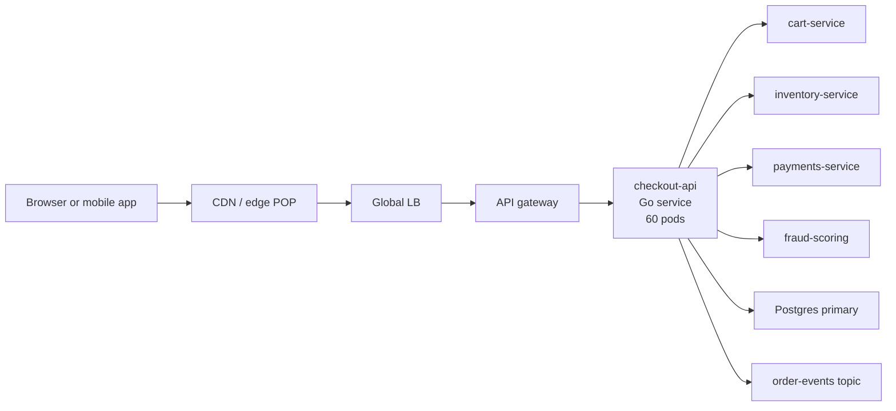
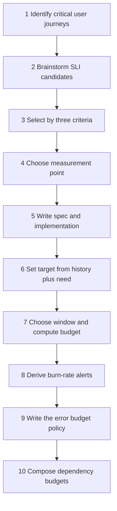
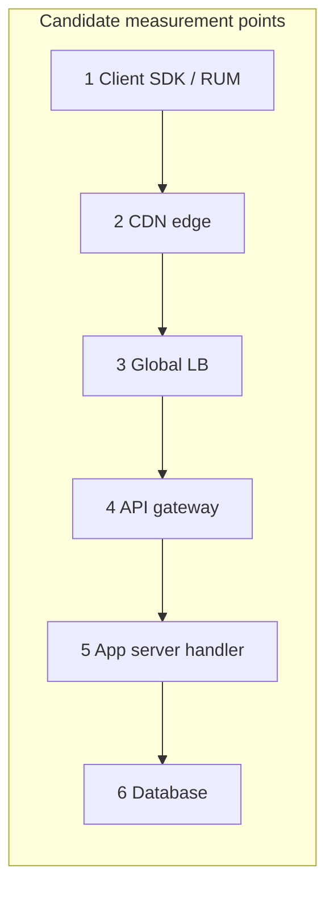
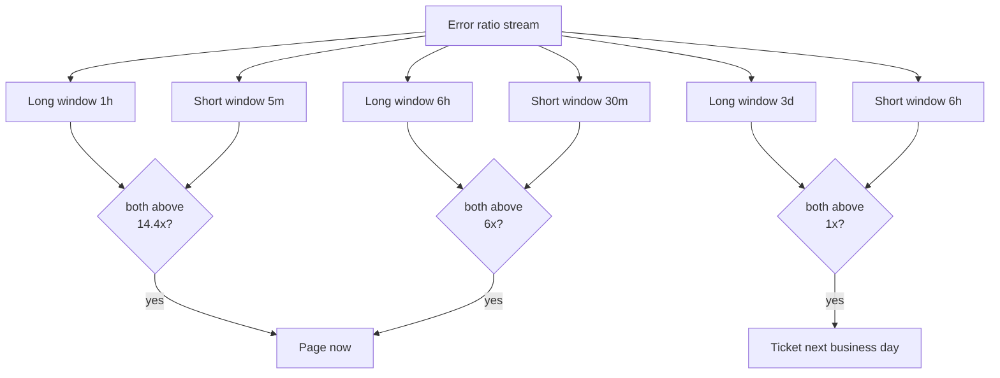
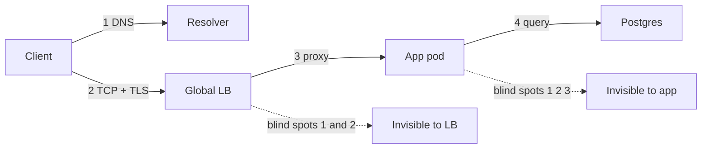
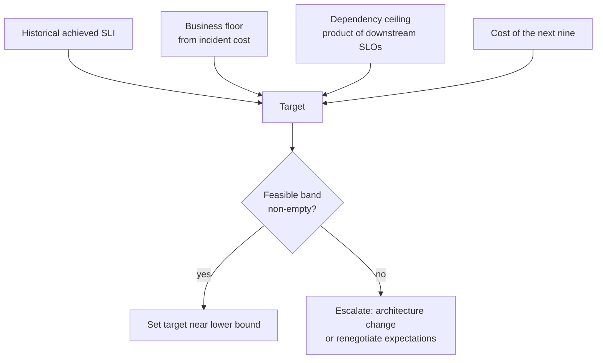
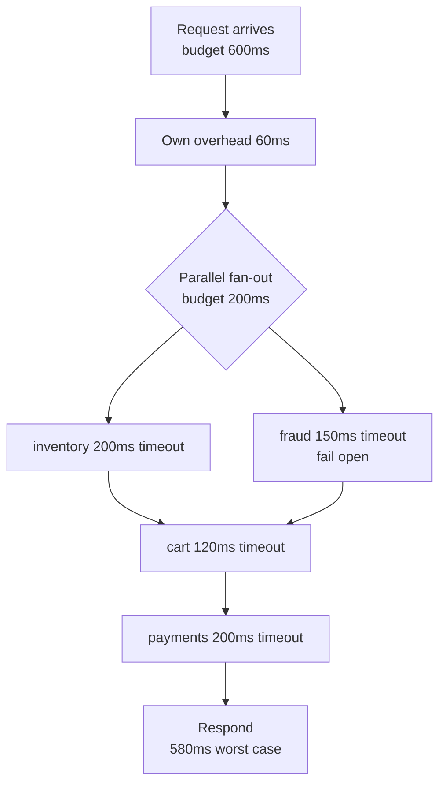

# S01 — Design an SLO for an Existing Service

<span class="pill pill-core">SRE Round</span>

**You are handed a running production service and asked to define its reliability contract from scratch; the single hardest judgment call is choosing the measurement point, because server-side success rate systematically reports a number the user never experienced.**

| | |
|---|---|
| **Commonly asked at** | Google, Meta, Stripe, Datadog, Cloudflare, LinkedIn, Shopify |
| **Time budget** | 45 min |
| **Core tension** | A measurable SLI vs a *meaningful* SLI — the easiest thing to measure (server 5xx rate) is the thing that lies most, and the truest thing to measure (client-observed success) is the thing you control least |
| **Prerequisites** | [F23 SLO & Error Budgets](../fundamentals/f23-slo-error-budgets.md) · [F22 Observability Fundamentals](../fundamentals/f22-observability-fundamentals.md) · [F03 Load Balancing](../fundamentals/f03-load-balancing.md) · [F18 Resilience Patterns](../fundamentals/f18-resilience-patterns.md) · [F17 Rate Limiting & Load Shedding](../fundamentals/f17-rate-limiting-load-shedding.md) |

---

## 1. The Scenario As Given

> "Here is our checkout service. It's been in production for two years. It has dashboards and about forty alerts, most of which page someone every week. Leadership wants 'four nines.' Design SLOs for it. You have 45 minutes."

The interviewer will supply, on request, a rough sketch:



Known facts the interviewer volunteers if asked:

| Fact | Value |
|---|---|
| Peak request rate to `POST /v1/checkout/orders` | 1,200 rps |
| Mean request rate over 30 days | 500 rps |
| Current measured server-side 5xx ratio | 0.03% |
| Current p50 / p95 / p99 server latency | 120 ms / 480 ms / 1,350 ms |
| Deploys per week | 25 |
| Existing alerts | 40, threshold-based, ~12 pages/week, ~70% not actionable |
| Business signal available | Checkout funnel conversion, order revenue per minute |

!!! note "What the round is actually testing"
    Not whether you know the formula $\mathrm{SLI} = \text{good}/\text{valid}$. It is testing whether you can (a) pick the *user journey* before picking a metric, (b) defend a measurement point against a hostile question, (c) do burn-rate arithmetic live without notes, and (d) describe the organizational contract — the error budget policy — that makes the number matter. Candidates who spend 30 minutes on metric plumbing and 5 minutes on policy fail this round.

---

## 2. Clarifying Questions to Ask First

Ask these in the first 5 minutes. Each one changes the design materially; say *why* you are asking.

**Scope and users**

1. **Who is the user of this service — an end customer, or another internal team?** An internal API's SLO is a contract negotiated with named consumers, and the measurement point is their client library. A customer-facing API's SLO must reflect what the human sees.
2. **What is the critical user journey?** "Checkout service" is not a journey. "Customer taps Pay and sees an order confirmation" is. There may be three journeys (add-to-cart, place-order, view-order-status) with genuinely different reliability requirements; placing an order is not interchangeable with reading order history.
3. **Is checkout synchronous through to payment capture, or does it enqueue and confirm asynchronously?** If the visible success is "order accepted" and capture is async, the SLI for the synchronous path and the SLI for the async pipeline are different objects (request ratio vs freshness).

**Existing signal quality**

4. **Where do we already have per-request telemetry, and what is its retention?** You cannot set a target from historical performance if you only keep 7 days. 30-day-plus retention of the SLI numerator and denominator at 1-minute resolution is a hard prerequisite.
5. **Does the edge/LB emit per-request status and duration, or only the app?** This determines whether the good measurement point is even available today, and whether "instrument the LB" becomes phase 0 of the plan.
6. **How are client-side retries implemented?** If the mobile SDK retries 3x silently, server-side error ratio and user-visible error ratio differ by orders of magnitude and you must decide which one the SLO governs.

**Business and organizational**

7. **What is the cost of a minute of checkout downtime, and is there an external SLA?** An SLA with a customer refund clause must sit strictly *below* the internal SLO — typically one nine looser — so you have room to be internally unhappy before you are contractually liable.
8. **Who can stop a release?** If nobody can, an error budget policy is theatre. Ask who signs the policy: the service owner, their director, and the product owner who wants the feature velocity.
9. **What does the current failure history look like — a few long outages or continuous low-grade errors?** This decides rolling vs calendar window and whether you need a time-based SLI alongside the ratio.

!!! tip "Say the assumption out loud and move"
    If the interviewer is vague, pick a defensible default and label it: "I'll assume checkout is synchronous through authorization, the LB emits access logs with status and duration, and the mobile SDK does one bounded retry. If any of those is wrong, the measurement point changes and I'll revisit." That is a senior move; silently assuming is not.

---

## 3. Framework / Approach

Nine steps, in this order. The ordering matters — every step constrains the next, and doing them out of order is the most common structural failure in this round.



### Step 1 — Critical user journeys, not services

Enumerate journeys and rank by business impact. For checkout:

| Journey | Volume share | Revenue impact of failure | SLO priority |
|---|---|---|---|
| Place order (`POST /orders`) | 8% | Direct and immediate | Tier 1 |
| Price/tax quote (`POST /quote`) | 34% | Blocks placing an order | Tier 1 |
| View order status (`GET /orders/{id}`) | 51% | Support load, not revenue | Tier 2 |
| Admin refund (`POST /refunds`) | 0.3% | Delayed, human-visible | Tier 3 |

You will define SLOs for Tier 1 first. A common mistake is a single service-wide SLO that averages a 51%-volume read path with an 8%-volume write path — the read path's health hides write-path outages entirely.

### Step 2 — SLI candidate brainstorm

Generate broadly before selecting. The standard menu, applied to checkout:

| Candidate SLI | Category | Measurable today? | User-facing? | Actionable? |
|---|---|---|---|---|
| Fraction of `POST /orders` returning 2xx | Availability | Yes | Partly | Yes |
| Fraction of `POST /orders` returning 2xx **within 600 ms** | Availability + latency | Yes at LB | Yes | Yes |
| p99 latency of `POST /orders` | Latency (percentile) | Yes | Weakly | Yes |
| Fraction of placed orders that later reconcile with payment records | Correctness | Only in batch | Yes | Yes, slow |
| Time from order accepted to confirmation email | Freshness | Yes | Yes | Yes |
| Fraction of `/quote` responses with a stale tax rate | Correctness/freshness | Hard | Yes | Weak |
| CPU utilization of checkout pods | Saturation | Yes | **No** | Yes |
| Kafka consumer lag on `order-events` | Saturation/freshness | Yes | Indirectly | Yes |
| Funnel conversion rate | Business | Yes | Yes | **No** — confounded by pricing, UX, marketing |

### Step 3 — Selection criteria

Keep a candidate only if it passes all three:

1. **User-facing** — a change in the number corresponds to a change in what a user experiences. CPU fails. Conversion rate passes this but fails (3).
2. **Measurable with acceptable fidelity** — you can compute numerator and denominator continuously, at a granularity that supports burn-rate alerting, from a source you trust. "Reconciles with payment records" fails today (batch, T+1) but is a great *quarterly* correctness check.
3. **Actionable** — when it degrades, an engineer can do something about it. Conversion rate fails: it drops when marketing changes a price. Confounded signals cannot govern a release freeze.

Two more practical filters:

4. **Not gameable** — an SLI you can improve by degrading the product (returning fast empty results) is a trap. Pair availability with a correctness or business guardrail.
5. **Few** — one availability SLI, one latency SLI, and at most one freshness/correctness SLI per journey. Beyond three, nobody reasons about the budget.

Final selection for checkout Tier 1: **a single combined availability-and-latency request ratio SLI**, plus **an async confirmation freshness SLI**.

### Step 4 — Event-based vs time-based

| | Event-based (request ratio) | Time-based (good minutes) |
|---|---|---|
| Formula | good events / valid events | good intervals / total intervals |
| Weighting | Proportional to traffic; a bad peak hour dominates | Every minute equal; a 3 a.m. blip equals a noon outage |
| Burn-rate alerting | Natural — burn rate is defined on ratios | Awkward and lossy |
| Low-traffic behaviour | Statistically noisy | Stable but arbitrary |
| Sub-minute outages | Captured proportionally | May be invisible |
| Fits | Request-driven APIs | Pipelines, streams, contractual uptime |

Choose **event-based** for checkout. It weights by the traffic that actually exists, and the burn-rate machinery in step 8 requires it. Use time-based only for the Kafka pipeline's freshness, where there are no user-visible discrete events.

### Step 5 — Choose the measurement point

This is the crux of the round; the full argument is in [Deep Dive A](#a-the-measurement-point-and-why-server-side-success-rate-lies).



Rule of thumb: **measure as close to the user as you can while retaining attribution and control.** For a web/mobile checkout, that is the **global load balancer** (point 3) as the primary SLI, with **client RUM** (point 1) as a secondary truth signal used to detect when the LB itself is lying.

### Step 6 — Set the target

Never start from a round number. The procedure:

1. Compute the achieved SLI over the last 90 days at the chosen measurement point, per 28-day rolling window.
2. Plot the distribution of those windows. Note the worst window, the median, the best.
3. Establish the **business floor**: the reliability below which users churn or revenue is materially lost. Derive it from incident history plus conversion data, not from a vibe.
4. Establish the **cost ceiling**: what reliability would cost to achieve — the next nine typically costs an architectural change, not more effort.
5. Set the target **slightly below achieved median performance and strictly above the business floor**, so that the budget is real but you are not permanently in violation on day one.

$$
\text{SLO target} \in \big[\, \text{business floor},\ \text{achieved median} \,\big],\quad \text{prefer near the lower end}
$$

### Step 7 — Window and budget

| Window type | Behaviour | Use when |
|---|---|---|
| Rolling 28 days | Continuously re-evaluated; a bad day shadows you for 28 days then fully clears | Default for engineering decisions |
| Calendar month | Resets on the 1st; creates an end-of-month "we're fine, ship it" pathology and a start-of-month amnesty | Only when contractually required |
| Rolling 7 days | Very responsive; too twitchy for release policy | Supplementary dashboard |
| Rolling 90 days | Stable, good for quarterly planning | Trend review, not alerting |

Use **rolling 28 days** (four whole weeks — no weekday/weekend aliasing, unlike 30 days). Budget:

$$
\text{Error budget} = (1 - \mathrm{SLO}) \times \text{valid events in window}
$$

### Step 8 — Burn-rate alerting

Alert on *how fast you are spending the budget*, not on a static error-rate threshold. Multi-window multi-burn-rate; exact numbers in [section 4](#44-the-multi-window-multi-burn-rate-alert-table).

### Step 9 — Error budget policy

A written, signed document that states what changes when the budget is exhausted. Without it, an SLO is a dashboard.

### Step 10 — Compose the dependency chain

Check that the product of your dependencies' SLOs can actually support your target. Usually it cannot, and that discovery is the most valuable output of the exercise — see [Deep Dive D](#d-composing-slos-across-a-dependency-chain).

---

## 4. Worked Example

### 4.1 SLI specification and implementation

**Specification** (no metric names — this is the sentence you show a product manager):

> The proportion of order-placement requests that receive a successful response within 600 milliseconds, as observed at the global load balancer, excluding requests rejected for client-side validation errors.

**Implementation** (every exclusion explicit):

$$
\mathrm{SLI}_{\text{avail}} = \frac{\big|\{\,e : \texttt{status}(e) \in \{200,201\} \land \texttt{duration}(e) \le 0.6\text{s}\,\}\big|}{\big|\{\,e : e \in \text{LB events for } \texttt{POST /v1/checkout/orders}\,\} \setminus X\big|}
$$

where the exclusion set $X$ is:

| Excluded | Status / condition | Rationale |
|---|---|---|
| Client validation errors | 400, 401, 403, 404, 422 | Caused by client input; counting them lets a buggy client destroy our SLI |
| Client-cancelled connections | LB `client_disconnect` before response | User navigated away; not our failure |
| Synthetic probe traffic | `user_agent = checkout-prober` | Would dilute the denominator with traffic that has no user |
| **Not excluded** | 429 | We threw it; shedding load is our failure, not the user's |
| **Not excluded** | 499 / upstream timeout | The user got nothing |
| **Not excluded** | 503 from the LB itself with no backend | The single most-commonly-missed bucket |

!!! warning "The denominator is where SLOs are won or lost"
    Every exclusion is an argument you must be able to defend. The most abused exclusion is "we exclude requests during planned maintenance." If a user is affected, it burns budget. If your architecture requires user-visible maintenance windows, the SLO should reflect that — that is the entire point.

**Second SLI — async confirmation freshness** (time-based, since there is no per-request user event):

> The proportion of 1-minute intervals in which the 99th percentile age of unprocessed messages on `order-confirmations` is below 120 seconds.

### 4.2 Choosing the target with real numbers

Measured at the LB, last 90 days, rolling 28-day windows:

| Statistic | Value |
|---|---|
| Best 28-day window | 99.972% |
| Median 28-day window | 99.951% |
| Worst 28-day window | 99.906% (one 22-minute payment-provider outage) |
| Achieved over full 90 days | 99.948% |

Business floor, derived: two incidents in the last year produced measurable abandonment. A 22-minute full outage at peak cost roughly

$$
22\ \text{min} \times 1{,}200\ \frac{\text{req}}{\text{s}} \times 60\ \frac{\text{s}}{\text{min}} \times 0.08\ \text{(order rate)} \times \$74\ \text{AOV} \approx \$9.4\text{M gross merchandise value deferred}
$$

with roughly 30% of it never recovered. Product tolerance, negotiated: **no more than ~45 minutes of full-outage-equivalent per 28 days**.

$$
\frac{45\ \text{min}}{28 \times 24 \times 60\ \text{min}} = \frac{45}{40{,}320} = 0.001116 \Rightarrow \mathrm{SLO} = 99.888\%
$$

Round *toward* what you can defend, not to the nearest marketing number:

| Option | Budget per 28 days | Verdict |
|---|---|---|
| 99.99% | 4.03 min | Below the worst *and* the median observed window. Would be in violation ~100% of the time. Requires removing the synchronous payment dependency — a multi-quarter architectural programme. Reject. |
| 99.95% | 20.2 min | Tighter than the achieved median (99.951%). Coin-flip violation every month; no room for the known payment-provider risk. Reject for now. |
| **99.9%** | **40.3 min** | Below achieved median with margin, above the business floor of 99.888%, survives one moderate incident per window. **Adopt.** |
| 99.5% | 3 h 21 min | Above the business floor — users would notice. Reject. |

!!! example "The reply to 'leadership wants four nines'"
    "Four nines on this journey means 4 minutes of budget per 28 days. Our single payments dependency is contracted at 99.95%, which alone consumes five times that budget. Four nines is not an alerting change — it requires making payment authorization asynchronous and idempotent so checkout can succeed while the provider is down. That is a two-quarter programme with a concrete cost. I'd propose 99.9% now, with a documented path and price tag to 99.95% once the async capture work lands." That answer converts a slogan into a roadmap, which is the Staff-level behaviour this round looks for.

### 4.3 Error budget in both currencies

Over a rolling 28-day window at a mean 500 rps, with ~92% of raw events surviving the denominator exclusions:

$$
N_{\text{valid}} = 500 \times 28 \times 86{,}400 \times 0.92 = 500 \times 2{,}419{,}200 \times 0.92 \approx 1.113 \times 10^{9}\ \text{events}
$$

$$
B_{\text{events}} = (1 - 0.999) \times 1.113\times10^{9} \approx 1.11\times10^{6}\ \text{bad events}
$$

$$
B_{\text{time}} = 0.001 \times 40{,}320\ \text{min} = 40.32\ \text{min of total outage at average rate}
$$

Both numbers matter. Engineers reason in minutes; the alerting math runs on events. State both and note that they are only equal at average traffic — 40 minutes of budget spent at peak is really

$$
\frac{1.11\times10^{6}}{1{,}200\ \text{rps} \times 60} \approx 15.4\ \text{minutes of peak-time outage}
$$

!!! gotcha "Budget in minutes is a lie at peak"
    A "40-minute budget" burns in 15 minutes if the outage lands at peak, and takes 100 minutes if it lands at 4 a.m. Always present the budget in *events* for arithmetic and in *minutes-at-peak* for intuition, and say which you are using.

### 4.4 The multi-window multi-burn-rate alert table

**Burn rate** is the multiple of the budget-neutral consumption rate. Burn rate 1 exhausts exactly the budget over exactly the window. Time to exhaustion:

$$
T_{\text{exhaust}} = \frac{\text{window}}{\text{burn rate}}
$$

| Burn rate | Error ratio at 99.9% SLO | Budget exhausted in (28-day window) |
|---|---|---|
| 1 | 0.1% | 28 days |
| 2 | 0.2% | 14 days |
| 6 | 0.6% | 4 days 16 h |
| 10 | 1% | 2 days 19 h |
| 14.4 | 1.44% | 1 day 23 h |
| 100 | 10% | 6 h 43 min |
| 1000 | 100% | 40 min |

The alert threshold for "consume a fraction $f$ of the budget in a detection window $w$, out of a total window $W$":

$$
\text{burn rate} = f \times \frac{W}{w}
$$

Using the canonical Google SRE Workbook configuration (30-day period, which is what the published numbers are derived from — they transfer to a 28-day window with a ~7% conservatism):

| Severity | Long window | Short window | Burn rate | Budget consumed if sustained for the long window | Error ratio that trips it at 99.9% SLO |
|---|---|---|---|---|---|
| **Page** | 1 hour | 5 minutes | **14.4** | 2% | 1.44% |
| **Page** | 6 hours | 30 minutes | **6** | 5% | 0.6% |
| **Ticket** | 3 days | 6 hours | **1** | 10% | 0.1% |

Derivations, to say out loud:

$$
0.02 \times \frac{720\ \text{h}}{1\ \text{h}} = 14.4 \qquad 0.05 \times \frac{720\ \text{h}}{6\ \text{h}} = 6 \qquad 0.10 \times \frac{30\ \text{d}}{3\ \text{d}} = 1
$$

The **short window is always 1/12 of the long window**, and both must be firing simultaneously. The long window gives precision (few false pages from brief spikes); the short window gives fast reset (the alert clears minutes after the incident ends instead of trailing for an hour).



Detection characteristics of the fast alert: at a 100% outage, error ratio is 1.0, so the 5-minute window crosses $14.4 \times 0.001 = 0.0144$ within seconds, but the 1-hour window needs

$$
t = 0.0144 \times 60\ \text{min} \approx 0.86\ \text{min}
$$

of full outage to lift the hour-long average over the threshold — under a minute of detection delay for a total outage, and proportionally longer for partial failures, which is exactly the desired behaviour.

### 4.5 Recording rules and alert rules

```yaml
groups:
  - name: checkout-slo-recording
    interval: 30s
    rules:
      # ---- valid events (denominator) -------------------------------------
      # Everything at the LB for this route, minus client-fault 4xx,
      # minus client disconnects, minus synthetic probes. 429 stays in.
      - record: slo:checkout_orders:valid:rate5m
        expr: |
          sum(rate(lb_requests_total{
                service="checkout", route="POST /v1/checkout/orders",
                probe="false"}[5m]))
          -
          sum(rate(lb_requests_total{
                service="checkout", route="POST /v1/checkout/orders",
                probe="false", code=~"400|401|403|404|422"}[5m]))
          -
          sum(rate(lb_requests_total{
                service="checkout", route="POST /v1/checkout/orders",
                probe="false", code="499"}[5m]))

      # ---- good events (numerator) ----------------------------------------
      # 2xx AND served within the 600ms latency threshold. The le="0.6"
      # bucket must exist verbatim in the histogram definition.
      - record: slo:checkout_orders:good:rate5m
        expr: |
          sum(rate(lb_request_duration_seconds_bucket{
                service="checkout", route="POST /v1/checkout/orders",
                probe="false", code=~"20[01]", le="0.6"}[5m]))

      - record: slo:checkout_orders:error_ratio:rate5m
        expr: |
          1 - (
            slo:checkout_orders:good:rate5m
            /
            clamp_min(slo:checkout_orders:valid:rate5m, 1)
          )
```

Repeat the pair for every window used by the alerts (`rate30m`, `rate1h`, `rate6h`, `rate1d`, `rate3d`). Then:

```yaml
groups:
  - name: checkout-slo-burn
    rules:
      - alert: CheckoutSLOBurnFast
        expr: |
          slo:checkout_orders:error_ratio:rate1h  > (14.4 * 0.001)
          and
          slo:checkout_orders:error_ratio:rate5m  > (14.4 * 0.001)
        for: 2m
        labels:
          severity: page
          slo: checkout_orders_availability
        annotations:
          summary: "Checkout burning error budget at >14.4x — 2% of 30d budget in 1h"
          runbook: "https://runbooks.internal/checkout/slo-burn"
          dashboard: "https://grafana.internal/d/checkout-slo"

      - alert: CheckoutSLOBurnMedium
        expr: |
          slo:checkout_orders:error_ratio:rate6h  > (6 * 0.001)
          and
          slo:checkout_orders:error_ratio:rate30m > (6 * 0.001)
        for: 5m
        labels:
          severity: page
          slo: checkout_orders_availability

      - alert: CheckoutSLOBurnSlow
        expr: |
          slo:checkout_orders:error_ratio:rate3d > (1 * 0.001)
          and
          slo:checkout_orders:error_ratio:rate6h > (1 * 0.001)
        for: 30m
        labels:
          severity: ticket
          slo: checkout_orders_availability

      # Guard: do not evaluate ratios on statistically meaningless traffic.
      - alert: CheckoutSLOTelemetryGap
        expr: |
          slo:checkout_orders:valid:rate5m < 5
          or
          absent(slo:checkout_orders:valid:rate5m)
        for: 10m
        labels:
          severity: page
        annotations:
          summary: "Checkout SLI denominator collapsed — telemetry or traffic loss"
```

!!! tip "The telemetry-gap alert is not optional"
    When the exporter dies, `good/valid` becomes `0/0`. Depending on your `clamp_min` and division semantics you get either `NaN` (all burn alerts silently stop firing) or a perfect 100% SLI. Either way you have just built a system that goes quiet exactly when it is blind. Always pair burn alerts with an absence/floor alert on the denominator.

### 4.6 Remaining budget and a projection panel

```promql
# Fraction of the 28-day error budget still unspent.
1 - (
  (1 - (
      sum(increase(lb_request_duration_seconds_bucket{
            service="checkout", route="POST /v1/checkout/orders",
            probe="false", code=~"20[01]", le="0.6"}[28d]))
      /
      sum(increase(lb_requests_total:valid{service="checkout"}[28d]))
  ))
  / 0.001
)
```

Show three numbers on the SLO panel and nothing else: **current 28-day SLI**, **budget remaining %**, **current burn rate**. A fourth number invites arguments.

---

## 5. Deep Dives

### A. The measurement point, and why server-side success rate lies

Server-side success ratio answers the question "of the requests my handler finished, how many did it finish well?" The user asks a different question: "of the times I pressed Pay, how many worked?" These differ by whole categories of failure:

| Failure the user sees | Visible in app-server metrics? | Visible at LB? | Visible in client RUM? |
|---|---|---|---|
| DNS resolution failure | No | No | Yes |
| TLS handshake failure / expired cert | No | Partly | Yes |
| LB has zero healthy backends → 503 | **No** | Yes | Yes |
| Request dropped in the LB's accept queue | No | Partly (conn metrics) | Yes |
| Client timeout at 2 s; server replies 200 at 5 s | **No — counted as success** | Partly | Yes |
| Network packet loss on the mobile leg | No | No | Yes |
| App returns 200 with an empty/incorrect body | No | No | Only with semantic checks |
| Pod OOMKilled mid-request | Often no — the process is gone | Yes (502) | Yes |
| Deployment window with connection resets | Usually no | Yes | Yes |

The pattern: **app-server metrics are emitted by the very process whose failure you are trying to measure.** A dead process emits nothing, and "nothing" is indistinguishable from "no traffic" in a ratio. This is the survivorship bias at the heart of the problem.



Practical guidance:

=== "Primary — global load balancer"

    **Use as the SLO of record.** Captures 502/503/504, backend-down, slow backends, deployment resets, and shedding. Emitted by infrastructure that survives your service's death. Has stable request attribution (route labels), so you can slice by route, region, and client class.

    Weaknesses: blind to DNS, TLS, client network, and to client-side timeouts shorter than yours. Also blind to its own failure — if the LB fleet in one region is down, its logs go with it.

=== "Secondary — client RUM / SDK beacon"

    **Use as a truth check, not as the SLO.** Instrument the mobile SDK and web client to report outcome and latency for the Pay action, batched and retried, to a separate ingest endpoint on a different DNS name and CDN.

    Why not primary: the reporting path shares failure modes with the measured path (if the network is down, the beacon does not arrive), it is dominated by client device and carrier variance you cannot fix, and adversarial/old client versions skew it. It is essential though: **RUM is the only way to detect that the LB SLI is wrong**, and a persistent gap between RUM and LB SLI is one of the highest-signal alerts you can own.

=== "Tertiary — synthetic probes"

    **Use for the traffic floor and for blind spots.** Probes from multiple regions through real DNS and TLS cover the pre-LB path and give a non-zero denominator at 3 a.m.

    Never make probes the SLO: they are a handful of events per minute against a billion real ones, they test one code path, and they get allowlisted out of rate limits and A/B tests until they are measuring a system no user touches.

=== "Rejected — app-server handler"

    Keep it for debugging and for per-dependency attribution. It is the right place to answer "why", never "how bad".

**The specific way it lies, with numbers.** Take a 10-minute event where a bad config deployed to 20% of pods causes those pods to accept connections and then hang until the LB's 10-second timeout.

| Measured where | What it reports over the 10 minutes |
|---|---|
| App handler | Healthy pods report 100% success. Hung pods never complete a request, so they emit no terminal metric. Service-level success ratio: **~100%** |
| LB | 20% of requests hit a hung pod, time out at 10 s, retried once to another backend by the LB, ~4% ultimately fail. Latency SLI destroyed: 20% of requests exceed 600 ms. **SLI ≈ 80%** |
| Client RUM | Clients with a 5-second timeout abandon before the LB retry completes. **SLI ≈ 78%, plus a spike in abandonment** |

If your SLO were server-side, you would have had a perfectly green SLO during an event that cost 20% of checkouts. That is the answer to "why not just use the app's 5xx rate."

!!! danger "The asymmetry that makes this non-negotiable"
    A measurement-point mistake does not produce noisy alerts you will notice and fix. It produces *silence*. You discover it when a VP asks why the SLO was green during an outage. Choose the point that fails loud.

### B. Setting the target without inventing a number

Four inputs, in tension:



**Historical achieved** gives you the upper bound of what is free. Setting a target above achieved performance means starting in violation, which immediately teaches the organization that SLO violations carry no consequence — the fastest way to kill an SLO programme.

**Business floor** must be derived, not asserted. Use: revenue per minute at peak, observed abandonment during past incidents, support-ticket volume per outage minute, and any contractual SLA. If there is an external SLA, the internal SLO sits at least one increment tighter — you want to be unhappy before a customer is owed a refund.

**Dependency ceiling** is the product of the SLOs of everything on the synchronous critical path (Deep Dive D). If the ceiling is below your proposed target, the target is arithmetically impossible and no amount of effort fixes it.

**Cost of the next nine** is typically discontinuous. 99.9 → 99.95 might be a retry policy and a connection-pool fix. 99.95 → 99.99 usually means removing a synchronous dependency, or going multi-region active-active. Say the price.

!!! note "Latency thresholds: pick from the distribution, not from taste"
    For the latency component, do not invent 500 ms. Plot the response-time distribution, find the knee, and check it against a behavioural threshold: for checkout, abandonment climbs measurably past ~1 s of perceived wait, and the client adds ~150 ms of network plus render. 600 ms at the LB leaves headroom against a 1 s user-perceived budget. Then verify what fraction of current traffic already meets it — if only 91% does, a 99% latency SLO is a project, not a measurement.

### C. Rolling vs calendar windows, and what the window does to behaviour

| Property | Rolling 28d | Calendar month |
|---|---|---|
| Incident on the 30th | Shadows the next 28 days | Forgiven in 24 hours |
| Behaviour it induces | Steady caution | "Ship everything in the last week" |
| Explaining to finance | Harder | Trivially matches billing |
| Compute cost | Higher (long-range queries or continuous aggregation) | Lower |
| Alerting compatibility | Native | Needs care near boundaries |
| Weekday aliasing | None at 28d (exactly 4 weeks) | Present — months have 20 to 23 business days |

Use rolling 28 days for the engineering SLO. If finance needs a calendar-month report for an SLA, compute both and never let the calendar one drive release policy.

!!! gotcha "28 days, not 30"
    A 30-day rolling window contains either four or five of a given weekday depending on when you look. If your traffic and failure patterns are weekly (they are — deploys cluster Tue–Thu, traffic peaks on weekends for consumer services), a 30-day window makes your SLI oscillate with a period unrelated to anything real. 28 days removes the aliasing entirely. The published burn-rate constants assume 30 days; keeping them on a 28-day window makes the alerts ~7% more conservative, which is fine and worth one sentence of acknowledgement.

### D. Composing SLOs across a dependency chain

The checkout critical path calls four services synchronously. If every call is required and failures are independent:

$$
\mathrm{SLO}_{\text{achievable}} = \prod_i \mathrm{SLO}_i \times \mathrm{SLO}_{\text{own}}
$$

| Dependency | Published SLO | Required for checkout? | Failure-mode if down |
|---|---|---|---|
| `cart-service` | 99.95% | Yes | Cannot price the order |
| `inventory-service` | 99.9% | Yes | Cannot reserve stock |
| `payments-service` | 99.95% | Yes | Cannot authorize |
| `fraud-scoring` | 99.99% | **Negotiable** | Could fail open to a rules-based default |
| `checkout-api` own logic | — | — | — |

Naive product of the required three:

$$
0.9995 \times 0.999 \times 0.9995 = 0.99800 \Rightarrow 99.80\%
$$

That is **below** the proposed 99.9% target before `checkout-api` has made a single mistake of its own. The naive conclusion — "so we can't have 99.9%" — is wrong, and the interesting part of the answer is why:

1. **Dependency SLOs are floors, not expectations.** Actual achieved availability is usually a nine better than the published SLO. Planning on achieved numbers is how you get 99.9% in practice; planning on published numbers is how you argue for investment. Present both.
2. **Retries convert independent transient failures into successes.** A dependency at 99.9% with genuinely independent per-request failures, retried once with jitter, behaves like $1 - 0.001^2 = 99.9999\%$ — *for the transient portion only*. Correlated failure (the dependency is fully down for 8 minutes) is not improved by retries at all, and retries during a correlated failure make it worse. Split each dependency's budget into transient and correlated components and only apply the retry math to the transient part.
3. **Making a dependency optional is worth more than any reliability work on it.** Fail-open `fraud-scoring` to a conservative rules engine and it leaves the product entirely. Cache `inventory` availability with a short TTL and accept rare oversell (with compensation) and it drops from "required" to "degradable".
4. **Timeouts must be budgeted, not inherited.** If checkout's latency SLI threshold is 600 ms and it calls four services serially with 1-second timeouts each, the latency SLO is unachievable by construction. Allocate: 600 ms total, minus ~60 ms of own overhead, leaves ~540 ms; parallelize the independent calls (`inventory`, `fraud`) and serialize only `cart → payments`.



Revised achievable availability, with `fraud` fail-open and one bounded retry on the transient share of `inventory`:

$$
0.9995 \times \underbrace{0.99975}_{\text{inventory with retry}} \times 0.9995 \times \underbrace{1.0}_{\text{fraud optional}} \approx 0.99875
$$

Still short of 99.9%, and the honest conclusion is: **the 99.9% target requires either a tighter contract with `payments` or an asynchronous authorization path.** Saying that clearly, with the arithmetic on the board, is the strongest possible ending to this round.

### E. The error budget policy — the part that makes it real

The policy is a short document, signed before the first violation, stating consequences. A workable escalation ladder:

| Budget remaining | Consequence | Who decides an exception |
|---|---|---|
| > 50% | Normal operation. Ship freely. Risky experiments encouraged. | Team |
| 25–50% | Reliability work enters the sprint. Postmortem actions get priority over roadmap. | Team lead |
| 10–25% | Non-essential feature deploys require an explicit risk sign-off. Infrastructure and dependency upgrades deferred. | Service owner |
| 0–10% | Feature freeze. Only reliability fixes, security patches, and reverts deploy. | Director, per exception, in writing |
| Exhausted | Hard freeze until the budget recovers above 10%. A written recovery plan within 3 business days. | Director + product owner jointly |

Non-negotiable clauses to name in the interview:

- **Security patches and rollbacks are always exempt.** A policy that blocks a revert is a policy that causes outages.
- **The exception path is explicit and logged.** A policy with no escape hatch gets ignored the first time it is inconvenient, and then it is dead. A policy with a *documented, attributable* escape hatch survives.
- **The service owner cannot unilaterally waive it.** Otherwise it is self-regulation with no regulator.
- **Silent SLI failure counts as budget spend.** If telemetry breaks, the window is assumed bad unless proven otherwise. Otherwise the cheapest way to fix an SLO violation is to break the exporter.

!!! interview "The question that separates the levels"
    "What happens the first time the budget is exhausted and there's a board-committed launch that week?" The weak answer defends the policy rigidly. The strong answer: the policy already anticipates this — the director grants a written exception, the exception is recorded with the specific risk accepted and a compensating control (extended canary, halved rollout rate, a named rollback owner on call), and the exception *itself* becomes a postmortem item at the quarterly review. The purpose of the policy is not to stop launches, it is to make the reliability-versus-velocity trade visible and attributable instead of implicit.

---

## 6. What Can Go Wrong

| Risk | Detection | Mitigation |
|---|---|---|
| SLI measured at the app server; outages show green | Compare app-side SLI against LB SLI and RUM continuously; alert on divergence > 0.5% sustained 30 min | Make the LB the SLO of record; keep app-side only for attribution |
| Denominator collapses when the exporter dies, producing a perfect score | `absent()` and floor alert on the valid-event rate | Telemetry-gap alert at page severity; treat gaps as bad in the budget calculation |
| Client retries mask failures server-side while users see spinners | Instrument attempt number in the client; compare first-attempt success to eventual success | Define the SLI on the *user action*, not the HTTP request; count one journey attempt as one event |
| Target set above achieved performance; permanently in violation | The first 28-day window closes below target | Set from measured history; if leadership insists, present the dependency-ceiling arithmetic before agreeing |
| Burn alerts never fire because the long window is too long for the incident | Postmortem check: was there a page before a human noticed? | Multi-window config; the 5-min/1-h pair catches total outages in under a minute |
| Alert fatigue persists because the 40 legacy alerts were never deleted | Count pages per week by alert name; measure actionability | Delete cause-based pages as symptom-based SLO alerts are proven; keep causes as tickets/dashboards |
| Low traffic at night makes the ratio meaningless | Plot the denominator by hour; compute the binomial noise floor | Minimum-traffic guard in the alert expression; synthetic probes to raise the floor; longer windows off-peak |
| Excluding "planned maintenance" hides real user impact | Audit exclusion volume monthly as a share of the denominator | Exclusions require written justification and a named owner; publish exclusion volume on the SLO dashboard |
| One SLO averages a high-volume read path with a low-volume write path | Slice the SLI by route and compare | Separate SLOs per critical user journey, weighted by business impact not volume |
| Latency threshold chosen from a round number; 30% of traffic fails it from day one | Compute the current pass rate against the proposed threshold before adopting | Derive the threshold from the response-time distribution knee and a user-perceived budget |
| Error budget policy exists but nobody signed it | Ask who can stop a release; if the answer is nobody, the policy is fiction | Named signatories, quarterly review, exceptions logged and reviewed |
| Dependencies change their SLO without telling you | Quarterly review of upstream contracts; alert on downstream SLO doc changes | Machine-readable dependency SLO registry; recompute the composed ceiling automatically |

---

## 7. The Artifact You'd Produce

At the 40-minute mark your whiteboard should look like a one-page SLO specification. Draw this layout from the start and fill it in as you go, rather than producing scattered notes.

```text
+----------------------------------------------------------------------+
| SERVICE: checkout-api          JOURNEY: place order                   |
+----------------------------------------------------------------------+
| SLI SPEC   : proportion of order-placement requests returning         |
|              success within 600 ms, observed at the global LB         |
| NUMERATOR  : LB events, status in {200,201}, duration <= 0.6 s        |
| DENOMINATOR: LB events for POST /v1/checkout/orders                   |
|              MINUS {400,401,403,404,422}, client disconnects, probes  |
|              429 and 5xx are INCLUDED (they are our failures)         |
+----------------------------------------------------------------------+
| TARGET : 99.9%     WINDOW: rolling 28 days                            |
|   why  : achieved median 99.951 | business floor 99.888               |
|          dependency ceiling 99.875 -> gap is a known roadmap item     |
+----------------------------------------------------------------------+
| BUDGET : 0.1% x 1.11e9 valid events = 1.11e6 bad events               |
|        = 40.3 min at mean rate = 15.4 min at peak rate                |
+----------------------------------------------------------------------+
| ALERTS (multi-window multi-burn-rate)                                 |
|   PAGE   14.4x  1h  / 5m    ->  2% of budget per hour                 |
|   PAGE    6.0x  6h  / 30m   ->  5% of budget per 6 hours              |
|   TICKET  1.0x  3d  / 6h    -> 10% of budget per 3 days               |
|   GUARD  valid_rate < 5/s for 10m -> PAGE (telemetry gap)             |
+----------------------------------------------------------------------+
| POLICY  >50% ship freely | 25-50% reliability in sprint               |
|         10-25% risk sign-off | 0-10% feature freeze                   |
|         exhausted -> hard freeze, director+PM exception only          |
|         ALWAYS exempt: reverts, security patches                      |
+----------------------------------------------------------------------+
| SECONDARY SLI: confirmation freshness, p99 queue age < 120 s,         |
|                99% of 1-minute intervals, rolling 28 d                |
+----------------------------------------------------------------------+
| OPEN: payments SLO 99.95 caps us; async capture = path to 99.95       |
+----------------------------------------------------------------------+
```

The machine-readable version you would check in alongside it:

```yaml
# slo/checkout-orders.yaml
service: checkout-api
journey: place-order
owner: team-checkout
reviewers: [team-payments, sre-platform]
last_reviewed: 2026-09-01

slis:
  - name: availability_latency
    type: event_ratio
    measurement_point: global_load_balancer
    specification: >
      Proportion of order-placement requests returning a successful
      response within 600 ms, observed at the global load balancer.
    good: 'status in [200,201] AND duration_seconds <= 0.6'
    valid: >
      route == "POST /v1/checkout/orders"
      AND status not in [400,401,403,404,422,499]
      AND user_agent != "checkout-prober"
    objective: 0.999
    window: 28d
    rationale:
      achieved_median_28d: 0.99951
      business_floor: 0.99888
      dependency_ceiling: 0.99875
      cost_of_next_nine: "async payment capture, ~2 quarters"

  - name: confirmation_freshness
    type: time_window_ratio
    measurement_point: order_confirmations_consumer
    good: 'p99_message_age_seconds < 120'
    interval: 60s
    objective: 0.99
    window: 28d

alerting:
  burn_rates:
    - severity: page
      long: 1h
      short: 5m
      factor: 14.4
    - severity: page
      long: 6h
      short: 30m
      factor: 6
    - severity: ticket
      long: 3d
      short: 6h
      factor: 1
  guards:
    - name: telemetry_gap
      expr: 'valid_rate_5m < 5 OR absent(valid_rate_5m)'
      severity: page

policy_ref: https://docs.internal/checkout/error-budget-policy
dependencies:
  - {service: payments-service, slo: 0.9995, required: true}
  - {service: cart-service,     slo: 0.9995, required: true}
  - {service: inventory-service,slo: 0.999,  required: true, retry: bounded_1}
  - {service: fraud-scoring,    slo: 0.9999, required: false, fail_mode: open}
```

### Timeboxing the 45 minutes

| Minutes | Activity | Board state |
|---|---|---|
| 0–5 | Clarifying questions; name the journeys | Journey list + tiering |
| 5–12 | SLI candidates and selection criteria | Candidate table with pass/fail |
| 12–20 | Measurement point argument | The pipeline diagram with blind spots marked |
| 20–28 | Target derivation with real numbers | The four-option table |
| 28–35 | Budget arithmetic + burn-rate table | The alert table, derivations shown |
| 35–41 | Error budget policy + dependency composition | Policy ladder + product arithmetic |
| 41–45 | Rollout plan and open questions | "Open" line at the bottom |

!!! tip "Leave the dependency-ceiling arithmetic for the last third"
    It is the highest-value observation in the round and it lands best after the target and budget are on the board, because it reframes what looked like a measurement exercise as an architecture conversation. Do it too early and you spend the round on retries.

---

## 8. Gotchas & Corner Cases

!!! gotcha "Server-side success ratio is computed by the process that died"
    Symptom: the SLO dashboard is green through an incident that cost 20% of checkouts. Mechanism: app-emitted metrics are a *survivorship* sample — pods that hang, OOM, or get SIGKILLed during a rollout never emit a terminal metric, so their requests leave the denominator as well as the numerator. Ratio metrics are invariant to losing matched pairs. Mitigation: measure at the load balancer, which is a separate failure domain, and keep a client-RUM signal specifically to detect divergence from the LB number.

!!! gotcha "The client's timeout is shorter than yours, so your 200 is their failure"
    Symptom: server p99 is 4 s and success ratio 99.99%, but users report checkout failures. Mechanism: the mobile SDK gives up at 3 s and shows an error; your handler completes at 4 s, logs 200, and increments the success counter. The SLI counts a success for a user who saw a failure — and worse, the user retries, so you get a duplicate order attempt too. Mitigation: make the latency threshold part of the availability SLI (a request over 600 ms is *not good*), and align server timeouts to be strictly shorter than the client's so the failure is attributable.

!!! gotcha "429s excluded from the denominator turn load shedding into free reliability"
    Symptom: the SLI improves during overload incidents. Mechanism: someone reasoned "429 is a client problem, exclude it." Now the cheapest way to fix an SLO violation is to shed harder. Mitigation: 429 is always a bad event. You emitted it. If the rate limit is protecting a specific abusive tenant, exclude that tenant from the denominator by identity, never by status code.

!!! gotcha "Silent SLI breakage scores 100%"
    Symptom: the SLI has been exactly 100.000% for nine days and nobody noticed. Mechanism: a label rename in a deploy made the `good` query return nothing, or the denominator query broke and `0/0` was clamped to a pass. Mitigation: alert on the absolute denominator rate, alert on an SLI that is *exactly* 1.0 for an implausible duration, unit-test recording rules against recorded fixtures in CI, and run a continuous synthetic failure injection that must produce exactly one bad event per minute in the SLI — if that heartbeat of badness disappears, the pipeline is broken.

!!! gotcha "The short burn window is not 1/12 of the long one"
    Symptom: pages keep firing for an hour after the incident is resolved, so responders learn to ignore them. Mechanism: without a short window, the long window's moving average stays above the threshold long after the errors stop. Someone "simplified" the rule to a single 1-hour window. Mitigation: keep both windows joined by `and`; the 1/12 ratio comes straight from the Workbook and gives fast reset without materially increasing false positives.

!!! gotcha "A 99.9% SLO on a service with 20 requests per minute is unmeasurable"
    Symptom: overnight pages every night, never during the day. Mechanism: with $n=20$ events, a single failure is a 5% error ratio — a 50x burn rate — and the binomial noise floor sits far above the target. You are alerting on sampling noise. Mitigation: add a minimum-event guard to the alert expression, lengthen the evaluation window off-peak, raise the floor with synthetic probes, or accept a looser SLO. Say the number: to distinguish 99.9% from 99.8% with confidence you need on the order of $10^5$ events in the window.

!!! gotcha "Multiple critical journeys averaged into one SLI"
    Symptom: the write path was down for 40 minutes and the SLO barely moved. Mechanism: `GET /orders` is 51% of traffic and `POST /orders` is 8%; a total write outage moves the blended ratio by at most 8 points, and a partial one disappears entirely. Mitigation: one SLO per journey. If you must have a rollup, compute it as a *minimum* across journeys or as a business-impact-weighted sum, never as a raw event-weighted average.

!!! gotcha "Percentile SLOs do not compose and cannot be averaged"
    Symptom: a dashboard shows "p99 latency: 340 ms" computed as the mean of per-pod p99s, and it disagrees with reality by 2x. Mechanism: percentiles are not linear; $\mathrm{avg}(p99_i) \ne p99(\bigcup_i)$, and averaging over time is equally invalid. Mitigation: compute percentiles from merged histogram buckets across the whole fleet and window, or — better for SLOs — avoid percentiles entirely and use a *threshold ratio* ("fraction of requests under 600 ms"), which composes, averages, and aggregates correctly and feeds burn-rate math directly.

!!! gotcha "The SLO was set from a week of data that happened to be quiet"
    Symptom: three months in, the service is chronically in violation and the team stops looking. Mechanism: the baseline window excluded the quarterly traffic peak, the dependency's maintenance window, and the annual certificate rotation. Mitigation: use at least 90 days of history, explicitly check that the window contains a peak event and at least one known incident, and re-review the target at 90 days with a written decision to keep, tighten, or loosen.

!!! gotcha "Load-balancer retries hide backend failure from the SLI you chose"
    Symptom: LB SLI is excellent, backend error rate is 3%, and nobody investigates. Mechanism: the LB retries idempotent requests to a second backend; only the final outcome is logged. That is correct for *availability* but it silently burns latency budget and masks a failing backend until it is a majority. Mitigation: keep the SLI on the final outcome (that is what the user got) but add a separate, non-paging signal on first-attempt success ratio and on retry volume. A rising retry rate with a flat SLI is an early warning, not a non-event. Note also that retried `POST` requests are only safe with an idempotency key — see [F11](../fundamentals/f11-idempotency.md).

!!! gotcha "Exclusions grow until the SLI measures nothing"
    Symptom: the denominator is 40% of raw traffic and the SLI is 99.99%. Mechanism: each incident produced a postmortem action of the form "exclude X from the SLI", and nobody ever removed one. Mitigation: publish the exclusion volume as a first-class metric on the SLO dashboard, require a named owner and expiry date for every exclusion, and review them quarterly. An exclusion that grows is a bug being defined away.

!!! gotcha "Calendar-month windows create end-of-month recklessness"
    Symptom: incident rate in the first week of each month is double the rest. Mechanism: the budget resets on the 1st, so the last week of a bad month is a freeze and the first week of the next is a backlog flush of everything that was blocked. Mitigation: rolling window for engineering policy. If finance requires a calendar report, produce both and make explicit which one governs deploys.

!!! gotcha "The error budget policy has no named owner, so it is never invoked"
    Symptom: the budget has been exhausted for six weeks and deploy velocity is unchanged. Mechanism: the policy says "the team will prioritize reliability" with no subject, no trigger mechanism, and no escalation. Mitigation: the policy must name individuals by role, define the automated trigger (a burn alert that opens a freeze ticket and comments on every release PR), and include a logged exception path. Automate the invocation; a policy that requires a human to remember it is a policy that does not exist.

---

## 9. Interview Angle

!!! interview "What the interviewer is scoring"
    Five things, roughly equally weighted: (1) did you start from a user journey rather than a metric; (2) can you defend the measurement point under pressure; (3) can you do burn-rate arithmetic live and correctly; (4) did you produce an organizational contract, not just a dashboard; (5) did you notice the dependency ceiling. Candidates routinely nail (3) and miss (5) entirely — and (5) is the one that reads as Staff-level, because it converts the question from "define a metric" into "here is what our architecture can and cannot promise."

!!! interview "Show the arithmetic, don't assert it"
    When you say 14.4, immediately write $0.02 \times 720 = 14.4$ next to it. When you say the budget is 40 minutes, write $0.001 \times 40{,}320$. Interviewers cannot distinguish a memorized number from an understood one unless you derive it. It costs eight seconds and it is the single highest-return habit in this round.

!!! interview "Have an opinion, hold it loosely"
    "I'd measure at the LB" is an opinion. "I'd measure at the LB, and the specific thing that would change my mind is a large mobile client population on poor networks — if RUM shows a persistent 2% gap to the LB number, the LB SLI is measuring my infrastructure rather than my users' experience, and I'd move the SLO of record to a RUM-based one with a synthetic floor." That is an opinion with a falsification condition attached, which is what senior judgment sounds like.

### Follow-up questions with answers

??? question "Why not just set the SLO to match what we currently achieve, exactly?"
    Because the SLO would then have zero informational content — it would be a restatement of the status quo, and by construction you would violate it half the time (you achieve the median by definition 50% of the time). The target must sit *below* achieved performance by enough that a normal month passes comfortably, and *above* the business floor by enough that violating it actually means users were harmed. The gap between achieved and target is your safety margin for change; if it is zero, every deploy is a coin flip on compliance. Concretely here: achieved median 99.951%, target 99.9% — the margin absorbs one moderate incident per window.

??? question "Our service has 99.99% availability but users complain constantly. What's going on?"
    Almost always one of four things, and I would check in this order. **One**: the SLI is measured server-side and is blind to DNS, TLS, LB-level 503s, and client timeouts — check LB and RUM against the app number. **Two**: the SLI is availability-only with no latency component, so a service that answers every request in 8 seconds scores 100% — add the latency threshold to the numerator. **Three**: the SLI covers the wrong journey; a high-volume read path is drowning a low-volume write path in the same ratio — slice by route. **Four**: the failures are *correctness* failures, not availability ones — the service returns 200 with a wrong price or an empty cart, which no availability SLI can see. That last one needs a correctness SLI, usually a sampled reconciliation against a source of truth.

??? question "How do you set an SLO for a brand-new service with no traffic history?"
    You do not, initially. You ship with instrumentation and *no* SLO, run for 4–6 weeks to collect a baseline, and in the meantime govern with cause-based alerts and manual review. If you must commit to something on day one, derive a provisional target from the dependency ceiling (the product of everything on the critical path) minus a margin, label it explicitly provisional, set the review date in the document, and set the alerting to ticket-only rather than paging until the baseline exists. Publishing a paging SLO on guessed numbers trains the team to ignore SLO pages, which is expensive to undo.

??? question "A dependency team refuses to commit to an SLO. What do you do?"
    Measure them yourself and publish it. Build the SLI from *your* client's perspective — success ratio and latency of your calls to them, at your call site — and put it on a dashboard next to your own SLO, with the composed ceiling computed from it. That number is not negotiable because it is your observed experience, and it gives you two things: an engineering input to your own target, and a factual basis for the conversation. Then design as if they have no SLO: circuit breaker, bounded retries with jitter, a cached or degraded fallback, and a timeout inside your latency budget. In practice, publishing an observed-availability dashboard for an uncooperative dependency produces a committed SLO faster than asking does.

??? question "Walk me through what happens, minute by minute, when the fast burn alert fires."
    T+0: the 5-minute and 1-hour windows both cross 1.44% error ratio; after the 2-minute `for` clause, the alert routes to the on-call. T+2: the page includes the current burn rate, budget remaining, and a runbook link; the responder opens the SLO dashboard, which shows the SLI sliced by region, route, status class, and backend version. T+3–5: first branch point — is this correlated with a deploy? If the error onset aligns with a rollout, revert first and diagnose after; reverting is always policy-exempt. T+5–10: if not a deploy, check the dependency panel for which downstream call is failing and whether its own SLO is burning; check whether the error class is 5xx (us), 429 (shedding, therefore saturation), or 504 (timeouts, therefore latency). T+10: if budget remaining has dropped below 25%, the error budget policy's sign-off requirement activates automatically and a freeze ticket opens. Throughout: the alert auto-resolves within ~5 minutes of the errors stopping, because the short window clears fast — that property is why the responder trusts it.

??? question "Should the SLO include planned maintenance windows?"
    Yes, if users are affected. The whole purpose of the error budget is to price the disruption you cause; excluding your own planned disruption removes the incentive to eliminate it. If a schema migration requires 20 minutes of write unavailability, that is 50% of a 28-day budget, and *that number is the argument* for investing in online migration tooling. The only legitimate exclusion is maintenance that is genuinely invisible to users — in which case there are no bad events to exclude and the question is moot. Where an external SLA contractually permits maintenance windows, keep two numbers: the SLA-compliant one for legal, and the honest internal SLO that governs engineering.

??? question "How many SLOs should a service have?"
    Per critical user journey: one availability SLI (with latency folded into the numerator), and optionally one freshness or correctness SLI where the journey has an asynchronous or data-integrity component. A service with three critical journeys therefore carries three to five SLOs. The failure modes are symmetric: one SLO for a multi-journey service hides outages in the averaging; fifteen SLOs mean nobody can answer "are we healthy" and the error budget policy becomes unenforceable because there is always *some* budget exhausted. If you find yourself needing many, that is usually a signal that the service should be split, or that you are writing monitoring checks and calling them SLOs.

??? question "What's the relationship between the SLO and the SLA, and who sets which?"
    The SLA is an external, contractual promise with a financial remedy; the SLO is an internal engineering target. The SLO must be strictly tighter — conventionally by a factor of three to ten in error budget, so roughly one nine — so that internal alarm and remediation begin long before contractual liability. The SLA is set by legal and sales with engineering input on feasibility; the SLO is set by engineering with product input on the business floor. A failure pattern worth calling out: when sales sells an SLA tighter than the achievable dependency ceiling, no amount of SRE process fixes it, and the correct response is to produce the composition arithmetic and escalate rather than to accept an impossible target and manage the blame later.

??? question "How would you migrate the existing 40 alerts to this SLO-based model without a coverage gap?"
    Four phases over roughly a quarter. **Phase 1 (2 weeks)**: deploy the SLI recording rules and burn alerts in *shadow* — routed to a log, not a pager — alongside the existing 40. **Phase 2 (4 weeks)**: for each incident, record which of the 40 fired, which the burn alerts would have fired, and the detection-time delta. Build a matrix of alert versus incident. **Phase 3**: delete every legacy alert that either never fired during a real incident or only fired when a burn alert also fired — typically 60–70% of them go, and they go in small batches with a named owner per batch. **Phase 4**: convert the remaining cause-based alerts that catch *leading indicators the SLI cannot see* — certificate expiry, disk filling, replication lag, quota approaching — into ticket-severity alerts, not pages, because they predict future badness rather than describe current badness. The invariant throughout: never delete an alert in the same change that adds its replacement, and never delete one that has fired usefully in the last 90 days without an explicit review.

### Strong answer vs weak answer

| Dimension | Mid-level answer | Staff / Lead answer |
|---|---|---|
| Starting point | "Let's use the 5xx rate and p99 latency" | "Let's name the critical user journeys first and tier them by business impact; the metric follows from the journey" |
| Measurement point | Uses app-server metrics without comment | Argues LB as SLO of record, names the specific blind spots of each candidate point, adds RUM as a divergence detector, and explains that a measurement error fails *silently* |
| Target | "99.9% is standard" | Derives a feasible band from achieved history, business floor, dependency ceiling, and cost of the next nine, then picks near the lower bound and shows the rejected options |
| Arithmetic | States 14.4 from memory | Derives $0.02 \times 720 = 14.4$ live, explains why the short window is 1/12, and converts budget between events, average minutes, and peak minutes |
| Denominator | Not discussed | Spends real time on exclusions, defends each one, flags 429 as non-excludable, and warns about exclusion creep |
| Dependencies | Ignores them | Computes the composed ceiling, shows it is below the target, and reframes the round as an architecture decision with a price tag |
| Alerting | Adds burn alerts on top of 40 existing ones | Presents a phased migration with a shadow period and a rule for what gets deleted |
| Organizational | "We'd have an error budget" | Writes the policy ladder, names signatories, specifies the always-exempt classes, automates invocation, and anticipates the first exception request |
| Failure of the system itself | Not considered | Adds the telemetry-gap guard and the synthetic heartbeat-of-badness, because an SLO system that goes quiet when blind is worse than none |
| Handling pushback on "four nines" | Agrees, or refuses | Converts it into a roadmap: here is what four nines costs architecturally, here is the interim target, here is the trigger to revisit |

!!! interview "The closing move"
    With five minutes left, stop adding detail and say what you would do first: "Week one, I instrument the LB and stand up the recording rules in shadow. Week two, I publish the SLI with no target and no alerts and let the team watch it. Week four, I bring the target proposal with 90 days of data and the dependency arithmetic to the service owner and the product owner together, because the policy needs both signatures. The alerts go live last." A rollout plan converts a design answer into an execution answer, and that is the difference the interviewer is trying to detect.

---

## 10. Key Takeaways

1. **Start from the user journey, not the metric.** "Checkout service availability" is not an SLI; "the proportion of Pay taps that produce a confirmed order within 600 ms" is.
2. **The measurement point is the highest-leverage decision in the round.** App-server success ratio is computed by the process whose death you are trying to detect; it fails silently and green. Measure at the load balancer, validate against client RUM, use synthetics for the pre-LB blind spots.
3. **Fold latency into the availability numerator.** A slow success is a failure. A threshold ratio composes and aggregates correctly; a percentile SLO does neither.
4. **The denominator is the argument.** Exclude client-fault 4xx; never exclude 429 or your own planned maintenance. Track exclusion volume as a metric and expire exclusions.
5. **Derive the target, never round to it.** Feasible band = [business floor, achieved median], bounded above by the dependency ceiling and by the cost of the next nine. Pick near the bottom of the band and show your rejected options.
6. **Rolling 28 days.** Four whole weeks removes weekday aliasing; calendar months induce end-of-month recklessness and start-of-month backlog flushes.
7. **Know the burn-rate table cold, and derive it live**: 14.4x over 1 h / 5 min (2% of budget) pages; 6x over 6 h / 30 min (5%) pages; 1x over 3 d / 6 h (10%) tickets. Short window is always 1/12 of the long window, joined with `and`.
8. **Guard the SLI itself.** Alert on denominator collapse and on implausibly perfect scores; inject a continuous synthetic failure so the absence of badness is itself detectable.
9. **Compose the dependency chain and show the ceiling.** The product of your synchronous dependencies' SLOs usually lands below your proposed target — and saying so, with arithmetic, is the most valuable output of the exercise.
10. **The error budget policy is the deliverable.** Named signatories, automated invocation, a logged exception path, and reverts and security patches always exempt. Without it, an SLO is a dashboard with a decimal point.
