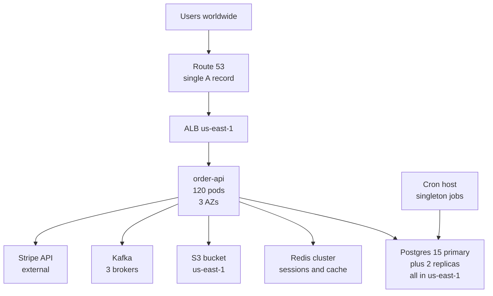
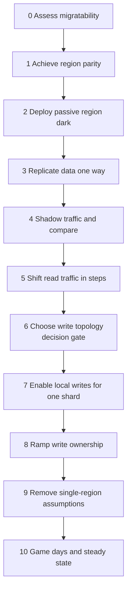
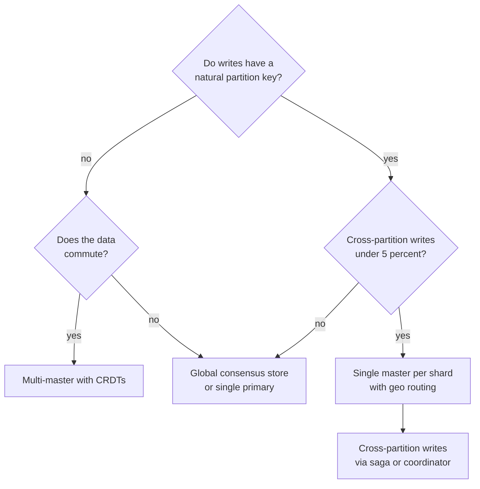
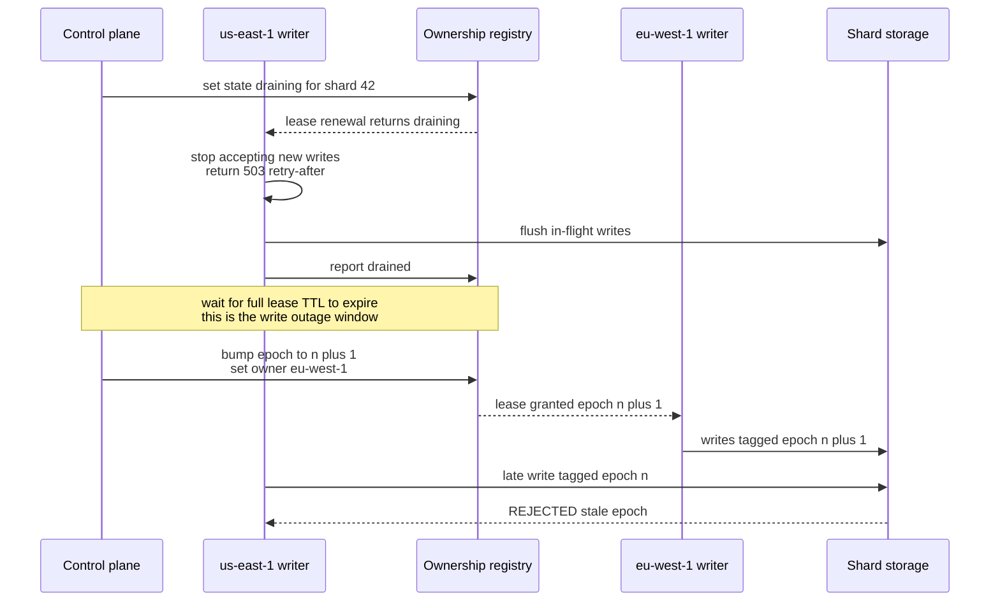
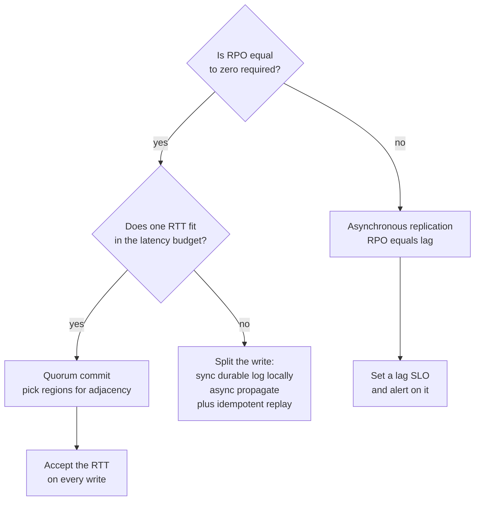

# S02 — Multi-Region Active-Active Migration

<span class="pill pill-core">SRE Round</span>

**Take a service that has only ever run in one region and make it serve live traffic from two or three, without a maintenance window; the single hardest judgment call is whether writes get a home region or a true multi-master, because that one decision determines whether you are doing an infrastructure project or a correctness project.**

| | |
|---|---|
| **Commonly asked at** | Google, Meta, Netflix, Stripe, AWS, Cloudflare, Datadog, Shopify |
| **Time budget** | 45 min |
| **Core tension** | Write locality vs write correctness — serving writes locally in every region removes cross-region latency and removes the single point of failure, and simultaneously introduces the possibility of two regions disagreeing about the same row |
| **Prerequisites** | [F26 Multi-Region & DR](../fundamentals/f26-multi-region-dr.md) · [F07 Replication & Consistency](../fundamentals/f07-replication-consistency.md) · [F08 CAP & PACELC](../fundamentals/f08-cap-pacelc.md) · [F02 DNS & Traffic Management](../fundamentals/f02-dns-traffic-management.md) · [F06 Partitioning & Sharding](../fundamentals/f06-partitioning-sharding.md) · [F09 Consensus](../fundamentals/f09-consensus.md) · [F11 Idempotency](../fundamentals/f11-idempotency.md) |

---

## 1. The Scenario As Given

> "Our order-management service runs entirely in `us-east-1`. Last quarter an AZ event took us down for 90 minutes and we lost eight figures. European customers see 180 ms of added latency. Leadership has approved a multi-region active-active programme. Design the migration. Zero downtime. You have 45 minutes."

The as-is architecture, drawn on request:



Facts the interviewer supplies when asked:

| Fact | Value |
|---|---|
| Traffic | 4,000 rps peak, 60% read / 40% write |
| Geography | 62% North America, 28% Europe, 10% APAC |
| Data size | 9 TB Postgres, 140 TB S3, 6-week Kafka retention |
| API latency SLO | 99% of requests under 300 ms at the edge |
| Write pattern | Orders keyed by `order_id`; strong ownership by `customer_id`; 0.3% of writes touch two customers (transfers, merges) |
| Sequences | `order_number` is a Postgres `BIGSERIAL`, printed on invoices, must be unique and is expected monotonic |
| Sessions | Sticky, stored in Redis, 30-minute TTL |
| Regulatory | EU customer PII must be storable in the EU; no requirement that it be *only* in the EU today |
| Deploy tooling | Terraform, ~70% of infra; the rest was clicked in 2019 |

!!! note "What the round is actually testing"
    Whether you can sequence an irreversible-looking change into reversible steps. Anyone can draw the target topology — it is two boxes instead of one. The signal is in: the phase ordering, the rollback story at each phase, the moment you identify the singletons (sequences, cron, Redis sessions) that silently assume one region, and whether you treat split-brain as a design constraint rather than an afterthought.

---

## 2. Clarifying Questions to Ask First

**What "active-active" is actually being asked for**

1. **Active-active for reads, or for writes?** These are wildly different projects. Active-active reads is a weekend of DNS and a read replica. Active-active writes is a data-model conversation. Most organizations say "active-active" and mean "I want failover to be fast and I want EU reads to be local."
2. **What is the actual goal: latency, availability, or regulatory?** If it is availability, active-*passive* with a tested 10-minute failover may hit the target at a tenth of the cost and a hundredth of the correctness risk. If it is latency, read-local/write-home solves 60% of requests immediately. If it is data residency, you need geo-partitioning regardless, and the latency benefit is a side effect.
3. **What RTO and RPO are we committing to?** "Zero downtime migration" is about the *migration*; the steady-state target is separate. RPO = 0 forbids asynchronous replication for the authoritative store, and that single answer eliminates half the topology options.

**What constrains the data**

4. **Is there a natural partition key with strong locality?** `customer_id` with 99.7% single-customer writes is the single most important fact in this problem — it makes home-region sharding viable and makes true multi-master unnecessary.
5. **What are the cross-partition operations, and can they be made asynchronous?** The 0.3% of transfers are the ones that will define the design. Can they become a saga with compensation? See [F10](../fundamentals/f10-distributed-transactions.md).
6. **What in the schema assumes a single writer?** Auto-increment sequences, `SELECT ... FOR UPDATE` on global rows, uniqueness constraints on non-partition-key columns, "get the next available X" patterns, counters. Every one of these is a migration work item.
7. **What is the tolerance for a conflicting write being resolved incorrectly?** For a "last seen at" timestamp: none needed. For a balance or inventory count: absolute. Get this per-entity, not per-service.

**What constrains the operations**

8. **What is the cross-region RTT and does it fit inside the latency SLO?** Concrete numbers, not hand-waving.
9. **Is the infrastructure reproducible from code?** "70% Terraform" means the migration's first phase is finding the other 30%, and that phase takes longer than everyone expects.
10. **What is the traffic-steering layer and how fast can it change?** DNS TTL, whether clients honour it, whether there is an anycast or connection-terminating layer you can steer at, and whether there is a client SDK you control.
11. **What external dependencies exist and are they regional?** Stripe is global; an on-prem fraud model in `us-east-1` is not. A single-region dependency caps the availability benefit of the whole programme.

!!! tip "The reframing that scores points in the first three minutes"
    "Before I design this, I want to separate three goals that are usually bundled: survive a region loss, serve reads locally, and serve writes locally. They have very different costs. I'd propose we get the first two in the first quarter — they are mostly infrastructure and carry low correctness risk — and treat local writes as a separate, data-model-driven phase with its own decision gate. If the driver is really the 90-minute outage, the first two may be enough."

---

## 3. Framework / Approach



### Step 0 — Migratability assessment

Score the service on five axes before promising anything.

| Axis | Green | Yellow | Red |
|---|---|---|---|
| **Statelessness of the app tier** | No local disk, no in-process state, config from env | In-memory caches with correctness impact | In-process leader election, local queues, local files |
| **Data locality** | Clean partition key, >99% single-partition writes | Partition key exists but cross-partition writes are 5–20% | No partition key; every write can touch anything |
| **Session affinity** | Stateless tokens, JWT or signed cookie | Central session store, region-agnostic | Sticky in-memory sessions tied to a pod |
| **Singleton assumptions** | None; all IDs are UUID/ULID, no cron singletons | A few sequences and cron jobs, enumerated | Global locks, `FOR UPDATE` on hot rows, monotonic invoice numbers |
| **Infra reproducibility** | 100% IaC, one command to stand up a region | Mostly IaC with documented gaps | Snowflake region, undocumented manual steps |

Any red on **data locality** or **singletons** means the project's critical path is application change, not infrastructure, and the timeline is quarters. Say so on day one.

### Step 1 — Region parity

The passive region must be *identical in kind*, not in size. The checklist that people skip and then get burned by:

- Every AMI/image available in the new region; every ECR/registry replicated.
- Secrets and KMS keys: **keys are regional.** Data encrypted with a `us-east-1` KMS key cannot be decrypted in `eu-west-1`. Either use multi-region keys or re-encrypt.
- Certificates issued and validated in the new region.
- IAM roles, service accounts, and cross-region trust policies.
- Observability: metrics, logs, and traces must land in a store reachable when *either* region is down. A monitoring stack that lives only in `us-east-1` makes the `us-east-1` outage invisible.
- Quotas: instance limits, ENI limits, NAT gateway limits, RDS storage. Quota requests take days to weeks — start on day one.
- Egress and peering: cross-region VPC peering or Transit Gateway, with bandwidth budgeted for replication *plus* a backfill burst.

### Step 2 — Deploy dark

Run the full stack in the new region with zero user traffic. Health checks green, synthetic traffic only, deploys flowing to both regions from the same pipeline from this moment forward. The goal of this phase is to discover the 30% of infra that was clicked, and the only way to discover it is to try.

### Step 3 — Data replication

One-way, asynchronous, old-region-primary to new-region-replica. Measure and alert on replication lag before anything depends on it.

### Step 4 — Shadow traffic

Mirror a copy of production read traffic to the new region, discard the responses, and compare. This validates capacity, warms caches, and exposes configuration drift with zero user risk. See [Deep Dive B](#b-traffic-routing-and-cutover-mechanics).

### Step 5 — Shift reads

1% → 5% → 25% → 50% of *read* traffic, with a bake period at each step and an automated rollback trigger. Reads are cheap to roll back: change a weight.

### Step 6 — The write-topology decision gate

This is the architectural fork. Do not let it be implicit. See [Deep Dive A](#a-write-topology-home-region-vs-true-multi-master).

### Steps 7–8 — Local writes, one shard at a time

Move write ownership for a single low-risk shard, prove it, then ramp. Ownership transfer needs a fencing protocol ([Deep Dive C](#c-split-brain-during-cutover-and-the-fencing-protocol)).

### Step 9 — Remove the single-region assumptions

The unglamorous phase that actually determines success: sequences, cron, Redis sessions, S3 bucket references, hardcoded endpoints, and every runbook that says "ssh to the bastion."

### Step 10 — Game days

You do not have active-active until you have deliberately lost a region during business hours and the SLO held. See [section 7](#the-game-day-plan).

---

## 4. Worked Example

### 4.1 Latency budget — the number that drives everything

Measured RTTs:

| Pair | RTT p50 | RTT p99 |
|---|---|---|
| `us-east-1` ↔ `us-west-2` | 62 ms | 78 ms |
| `us-east-1` ↔ `eu-west-1` | 78 ms | 96 ms |
| `us-west-2` ↔ `eu-west-1` | 135 ms | 158 ms |
| Intra-region, cross-AZ | 0.8 ms | 2.1 ms |

API latency SLO: 99% of requests under 300 ms measured at the edge. Current p99 within `us-east-1` is 190 ms. Available headroom for any added cross-region hop:

$$
\Delta_{\text{budget}} = 300 - 190 = 110\ \text{ms}
$$

Now price each replication option for a write:

| Write topology | Added commit latency | Fits in 110 ms? |
|---|---|---|
| Async replication, local commit | ~0 ms | Yes |
| Sync to one remote region, 1 RTT (`us-east-1` → `eu-west-1`) | 96 ms p99 | Barely — consumes 87% of headroom |
| Two-phase commit across 2 regions, 2 RTTs | 192 ms p99 | **No** |
| Raft quorum over 3 regions, leader in `us-east-1`, quorum = leader + nearest | 78 ms p99 (to `us-west-2`) | Yes, with 32 ms to spare |
| Raft quorum over 3 regions, leader in `eu-west-1`, quorum needs `us-east-1` | 96 ms p99 | Barely |
| Raft over 3 regions where the two nearest peers are EU and APAC | 158 ms+ | **No** |

Two conclusions fall directly out of this table and you should state both:

1. **Region selection is a latency-engineering decision, not a market-coverage decision.** Choosing `us-east-1`, `us-west-2`, `eu-west-1` gives every leader a quorum partner within 96 ms. Choosing `us-east-1`, `eu-west-1`, `ap-southeast-1` does not — an EU leader's second-nearest peer is 160 ms away and the write SLO is dead.
2. **Synchronous cross-region commit for every write does not fit.** Therefore the authoritative write path must either be asynchronous (accept RPO > 0) or be quorum-based with carefully chosen region adjacency, or writes must be *local* to a home region with asynchronous propagation elsewhere.

$$
\text{Effective write RPO}_{\text{async}} = \text{replication lag}_{p99} \approx 400\ \text{ms normal},\ \text{up to } 45\ \text{s under backfill load}
$$

### 4.2 Read-locality gain

62% of traffic is North American and already local. The 28% European share currently pays the full transatlantic penalty on every request:

$$
\text{Current EU p99} \approx 190 + 96 = 286\ \text{ms (plus TLS setup on cold connections)}
$$

Serving EU reads from `eu-west-1`:

$$
\text{New EU read p99} \approx 190\ \text{ms}
$$

Weighted improvement across all traffic, reads only:

$$
0.28 \times 0.60 \times 96\ \text{ms} = 16\ \text{ms of average p99 reduction fleet-wide}
$$

which understates the user-visible benefit substantially, because a multi-request page load pays the RTT once per uncached round trip. A checkout flow with six sequential API calls saves $6 \times 96 = 576$ ms. **Always translate per-request latency into per-journey latency** — that is the number the product organization cares about.

### 4.3 The migration phase table

This is the core artifact. Each row has an explicit rollback and an explicit exit criterion.

| # | Phase | Duration | What changes | Rollback | Exit criteria | Reversible? |
|---|---|---|---|---|---|---|
| 0 | Assessment | 2 wks | Nothing in prod | N/A | Singleton inventory complete; migratability scored | Yes |
| 1 | Region parity | 3–4 wks | New region infra created, zero traffic | `terraform destroy` | Full stack deploys green; quotas granted; KMS multi-region keys in place | Yes |
| 2 | Deploy dark | 1 wk | Pipeline deploys to both regions | Disable second target in pipeline | Both regions green on synthetics; identical config hash | Yes |
| 3 | One-way replication | 2 wks | Postgres logical replication east → eu; S3 CRR; Kafka MirrorMaker | Drop subscription | Lag p99 < 1 s; row-count and checksum parity on 5 largest tables | Yes |
| 4 | Shadow reads | 2 wks | Mirror 10% then 100% of GET traffic, responses discarded | Set mirror weight 0 | Response diff rate < 0.01% excluding known non-determinism; EU region sustains 100% of read load in a load test | Yes |
| 5 | Read cutover | 2 wks | EU users' reads served by `eu-west-1`: 1% → 5% → 25% → 100% of EU | Lower DNS/steering weight; 5-min convergence | Each step bakes 48 h with no SLO burn; stale-read rate within agreed bound | Yes |
| 6 | **Decision gate** | 1 wk | Nothing | N/A | Write topology chosen and signed off; conflict policy written per entity | Yes |
| 7 | Write path prep | 4–6 wks | UUID/ULID IDs alongside sequences; idempotency keys on all mutating endpoints; ownership table deployed; fencing epoch column added | Feature flags off | Every mutating endpoint is idempotent and proven so by replay tests | Yes |
| 8 | First shard write cutover | 2 wks | One internal-tenant shard's home region moves to `eu-west-1` | Fence back to `us-east-1`; drain and re-point | 7 days with zero conflicts, zero lost writes, reconciliation clean | Yes, with a brief write pause |
| 9 | Write ramp | 4–8 wks | EU-resident customers' shards move home region to `eu-west-1`, in cohorts of 5% | Per-cohort fence-back | Reconciliation job clean at each cohort; no SLO burn | Yes, per cohort |
| 10 | De-singleton | Parallel | Cron → regional leases; Redis sessions → regional with token fallback; remove `BIGSERIAL` from the write path | Per-item flags | No component requires a specific region to be up | Mostly |
| 11 | Remove the single-region assumption | 2 wks | Runbooks, dashboards, alerts, capacity model, on-call rotation all become per-region | Documentation revert | A region can be evacuated by one on-call engineer using only the runbook | N/A |
| 12 | Game days | Ongoing | Deliberate region evacuation in business hours | Abort criteria in the plan | Two consecutive clean evacuations, one unannounced | N/A |

!!! warning "Phase 7 is the one that gets cut, and it is the one that matters"
    Every multi-region programme that fails in production failed because someone treated "make all mutating endpoints idempotent" as a nice-to-have. The moment traffic can be retried across regions — and it can, from the moment you have two regions and a retrying client — a non-idempotent `POST` creates duplicates. Budget the full 4–6 weeks and treat it as a hard gate before phase 8.

### 4.4 Traffic split during the read cutover

Concrete steering configuration at phase 5, step 3 (25% of EU reads):

```yaml
# Edge steering policy. Evaluated at the CDN/edge, not at DNS,
# so changes converge in seconds rather than TTL-bound minutes.
routes:
  - match: {method: [GET, HEAD], path_prefix: /v1/orders}
    steering:
      - when: {geo_continent: EU, bucket: "0-24"}    # 25% of EU users
        origin: eu-west-1
        fallback: us-east-1
        fallback_on: [5xx, timeout_2s, origin_unhealthy]
      - when: {geo_continent: EU}
        origin: us-east-1
      - default:
        origin: us-east-1

  # All mutations still go to the single write region in phase 5.
  - match: {method: [POST, PUT, PATCH, DELETE]}
    steering:
      - default:
        origin: us-east-1
```

The bucket assignment must be **sticky per user**, hashed on a stable identifier, not random per request. Random per-request assignment means a user can read from `eu-west-1` (lagging 400 ms) immediately after writing to `us-east-1` and see their own write disappear — read-your-writes violation, and the most common source of "the migration broke everything" reports.

```promql
# Stale-read detection during phase 5: how often does a read from the
# new region return a version older than the one the client just wrote?
sum(rate(api_read_your_writes_violation_total{region="eu-west-1"}[5m]))
/
sum(rate(api_reads_total{region="eu-west-1"}[5m]))
```

### 4.5 Ownership and fencing data model

```sql
-- The authoritative map of which region may accept writes for a shard.
-- Lives in a strongly-consistent store, NOT in the sharded database.
CREATE TABLE shard_ownership (
    shard_id        INT         PRIMARY KEY,
    owner_region    TEXT        NOT NULL,
    epoch           BIGINT      NOT NULL,      -- monotonic, bumped on every transfer
    lease_expires_at TIMESTAMPTZ NOT NULL,     -- owner must renew before this
    state           TEXT        NOT NULL       -- active | draining | transferring
        CHECK (state IN ('active','draining','transferring'))
);

-- Every row in the sharded store carries the epoch that wrote it.
ALTER TABLE orders ADD COLUMN write_epoch BIGINT NOT NULL DEFAULT 0;

-- The storage layer rejects writes from a stale epoch. This is the fence.
CREATE OR REPLACE FUNCTION enforce_epoch() RETURNS TRIGGER AS $$
BEGIN
  IF NEW.write_epoch < OLD.write_epoch THEN
    RAISE EXCEPTION 'stale epoch % < % for order %',
      NEW.write_epoch, OLD.write_epoch, OLD.order_id
      USING ERRCODE = 'serialization_failure';
  END IF;
  RETURN NEW;
END;
$$ LANGUAGE plpgsql;
```

The epoch is the mechanism that makes ownership transfer safe without requiring the old owner to be reachable. A deposed writer that wakes up from a 40-second GC pause and tries to write carries epoch $n$; the store has already advanced to $n+1$; its write is rejected deterministically rather than silently winning by timestamp.

---

## 5. Deep Dives

### A. Write topology: home region vs true multi-master

This is the decision gate at phase 6. Four options; you must be able to argue all four and pick one.

=== "1. Single global primary, read replicas everywhere"

    **Shape.** One region owns all writes. Other regions serve reads from asynchronous replicas.

    **Pros.** Zero correctness risk — there is exactly one writer, so no conflicts exist by construction. Trivially reversible. Achievable in weeks. Delivers the full read-latency benefit, which covers 60% of this service's traffic.

    **Cons.** Writes from EU still pay 96 ms. A loss of the primary region means a *failover*, not a no-op, so availability improves only to the quality of your failover drill. RPO is the replication lag at the moment of loss.

    **Verdict.** This is the correct first destination for almost every service, and a large fraction of "active-active" programmes should stop here permanently. It is also, not coincidentally, phases 1–5 of the plan above — so you get it on the way regardless.

=== "2. Single master per shard, with geo-routing (recommended)"

    **Shape.** Partition by `customer_id`. Each shard has exactly one home region that owns its writes. Requests are routed to the shard's home region. Other regions hold asynchronous read replicas of every shard.

    **Pros.** Still exactly one writer per key, so *no conflict resolution is needed for 99.7% of writes.* EU-resident customers get local writes. Region loss affects only the shards homed there, and those shards fail over independently. Maps directly to data-residency requirements. Ownership can move per shard, which makes the migration incremental and the rollback granular.

    **Cons.** Requires a partition key with genuine locality — which this service has. Cross-partition writes (0.3%: transfers, merges) need a saga or must be routed to a designated coordinator. Requires an ownership registry and a fencing protocol. A customer who travels pays remote-write latency until their home region is changed, which is a deliberate, rate-limited operation.

    **Verdict.** **Choose this.** The 99.7% single-customer write statistic is the whole argument: it converts a distributed-consensus problem into a routing problem.

=== "3. True multi-master with conflict resolution"

    **Shape.** Every region accepts writes for every key. Conflicts are detected and resolved — last-write-wins, CRDTs, or application-level merge.

    **Pros.** No routing layer needed; any region serves any request. Survives partition with full write availability in both halves. Lowest possible write latency everywhere.

    **Cons.** Conflicts are now a permanent, normal part of the system, not an exception. LWW *silently discards* data and requires trustworthy clocks — see [F20](../fundamentals/f20-time-clocks-ordering.md). CRDTs work beautifully for counters, sets, and registers, and do not exist for "reserve the last unit of inventory" or "the invoice total must equal the sum of line items." Every uniqueness constraint becomes advisory. Debugging becomes archaeology.

    **Verdict.** Justified when the data genuinely commutes (presence, likes, view counts, shopping carts with add-only semantics, collaborative documents) or when write availability during partition is worth more than convergence latency. For orders and payments, it is the wrong tool — and being able to say *why* precisely is what separates a strong answer here.

=== "4. Globally consistent store, Spanner / CockroachDB / Yugabyte"

    **Shape.** Let a consensus-replicated database handle it. Raft groups per range, leaders placed by data locality, external consistency via bounded clock uncertainty.

    **Pros.** Strong consistency with multi-region durability and no application-level conflict logic. Supports SQL, transactions, and uniqueness constraints across regions. Geo-partitioning features let you pin ranges to regions for residency and latency.

    **Cons.** Cross-region commits cost at least one RTT to the quorum — which the latency table shows is acceptable only with careful region adjacency. It is a full database migration on top of a regional migration, i.e. two hard projects coupled. Cost is substantially higher. Operational expertise is scarce. Behaviour under partition is correct but *surprising* to teams used to Postgres.

    **Verdict.** A legitimate destination, and sometimes the right one for a greenfield system. For a running 9 TB Postgres with a 45-minute design window, proposing it as the migration path means proposing S03's problem on top of this one. Mention it, scope it honestly, defer it.



### B. Traffic routing and cutover mechanics

Three steering layers, with very different control characteristics.

| Mechanism | Convergence time | Granularity | Client honours it? | Failure behaviour |
|---|---|---|---|---|
| **GeoDNS with low TTL** | TTL + resolver lag; in practice 5–30 min for the long tail | Per resolver, coarse geo | Poorly — resolvers and JVMs cache past TTL indefinitely | Stale clients keep hitting the dead region |
| **Anycast BGP** | Seconds to tens of seconds | Per network path, uncontrollable | N/A — it is the network | Withdrawal is fast; but a path flap mid-TCP-connection resets the connection |
| **Edge steering at a CDN/global proxy** | Seconds, globally, under your control | Per request, per user, per route, per percentage | Yes, because the client's endpoint never changes | Origin failover is a config decision you own |
| **Client SDK with region list** | Immediate for new sessions, requires a deploy for logic | Per client, richest signal | Only if you control the client and clients update | Needs a bootstrap that is itself multi-region |

**Use edge steering as the primary control plane, DNS as the coarse backstop, anycast for the edge itself.** The reasoning: the cutover needs to be *incremental and fast to reverse*, and DNS is neither. DNS gets you to the edge; the edge gets you to a region. Keep DNS TTL low anyway (60 s) because it is your last resort when the edge control plane itself is the problem.

!!! danger "The DNS TTL lie"
    A 60-second TTL does not mean traffic moves in 60 seconds. Measured reality: roughly 50% of traffic moves within the TTL, 90% within 5× TTL, and a persistent 1–3% tail keeps resolving to the old address for hours — corporate resolvers that ignore TTLs, JVMs with `networkaddress.cache.ttl=-1`, mobile carriers, and hard-coded IPs. **Never design a cutover whose correctness requires all traffic to move.** Design so the old path stays correct (serving reads, or proxying writes to the new owner) until you have evidence the tail has drained, and keep a metric on residual traffic to the old endpoint.

**Cutover mechanics that make read shifting safe:**

1. **Sticky bucketing.** Hash a stable user identifier into 100 buckets; the steering rule selects bucket ranges. A user does not flap between regions mid-session, which preserves read-your-writes against a lagging replica.
2. **Automatic origin fallback.** If the new region returns 5xx or exceeds a timeout, the edge retries the old region. This converts a new-region failure from an outage into added latency — but only for idempotent methods.
3. **A bake period with a burn-rate gate.** Each step holds for 48 hours and auto-halts (not auto-rolls-back — halts, and pages) if the SLO burn rate exceeds 6x. Automated *advance* is fine; automated rollback of a data-path change is how you get two changes in flight during an incident.
4. **A residual-traffic metric.** Requests per second still arriving at the old regional endpoint directly, bypassing the edge. If it is not converging toward zero, something has your old address hard-coded.

**The ordered checklist for a single read-cutover step**, because "raise the weight" hides a lot of preconditions:

| # | Check | Abort if |
|---|---|---|
| 1 | Replication lag p99 over the last 24 h is inside the staleness bound | Lag exceeded the bound at any point |
| 2 | Reconciliation reported zero divergent shards on the last full pass | Any divergence, explained or not |
| 3 | The new region is running the same build hash as the old | Any version skew |
| 4 | The new region passed a synthetic full-load test in the last 7 days | Stale or failed test |
| 5 | Error-budget burn over the previous step's bake was under 1x | Elevated burn, even if under the page threshold |
| 6 | The rollback command has been dry-run in the last 24 h | Dry-run failed or was skipped |
| 7 | Raise the weight; watch for 15 minutes with a human on the dashboard | Any SLO burn above 2x, or stale-read rate above bound |
| 8 | Bake 48 h with automated halt armed | Halt fires |

Step 6 is the one people skip, and it is the cheapest insurance in the list — a rollback path that has not been exercised in the last day is a rollback path whose credentials may have rotated, whose config key may have been renamed, and whose operator may have changed teams.

!!! warning "Automate the advance, not the retreat"
    Auto-advancing through cutover steps on green signals is safe and saves a lot of human attention. Auto-*rolling-back* on a red signal is not: it means that during an incident, the system is making a data-path change at the same time a human is making one, and the two can interleave into a state neither intended. The correct automated response to a red signal is **halt and page** — freeze the current weight, stop the schedule, and let a human decide whether to hold or retreat.

### C. Split-brain during cutover, and the fencing protocol

The failure: during a write-ownership transfer, both regions believe they own shard 42. `us-east-1` accepts a write; `eu-west-1` accepts a conflicting write; async replication carries them past each other; one silently overwrites the other or the tables diverge permanently.

It happens for mundane reasons: the old owner was mid-GC-pause when it was told to stop; the control-plane call to demote it timed out but actually succeeded; the network partitioned exactly during the transfer; a stale request that was queued in a load balancer for 30 seconds finally got processed.

**Timestamps do not solve this.** Clock skew between regions of even 200 ms means last-write-wins picks an arbitrary winner, and NTP failures produce skew of seconds to minutes. See [F20](../fundamentals/f20-time-clocks-ordering.md).

**The protocol that does solve it — lease plus monotonic epoch plus storage-side fence:**



Key properties, each of which you should name explicitly:

- **The wait is mandatory and cannot be skipped.** After marking the old owner as draining, you must wait the full lease TTL before granting the new lease, because the old owner might be partitioned and unable to hear the demotion. It believes it owns the shard until its lease expires. This produces a deliberate write-unavailability window equal to the lease TTL.
- **Choose the lease TTL as a latency/safety trade.** TTL of 30 s gives a 30-second write pause per shard transfer; TTL of 5 s gives a 5-second pause but requires renewals every ~1.5 s and is fragile under GC pauses longer than the TTL. With a Java or Go service that can pause 2 s, a 15-second TTL with 5-second renewals is a reasonable point. State the bound: **the TTL must exceed the maximum plausible process pause plus the maximum clock error.**
- **The epoch is what makes it safe even if the timing reasoning is wrong.** The lease gives liveness (we can make progress without the old owner). The epoch gives safety (a stale owner's write is rejected deterministically). You need both; a lease alone is not sufficient because you cannot bound pause durations.
- **The fence must be enforced by the storage layer, not the application.** An application-level check is a TOCTOU race. A conditional write, a trigger, a partition-key-scoped conditional expression in DynamoDB, or a `WHERE epoch <= :epoch` predicate on every update — the rejection must be atomic with the write.
- **A 15-second write pause per shard is acceptable; a 15-second pause for all shards is not.** Transfer shards one cohort at a time. The blast radius of a bad transfer is one cohort.

!!! gotcha "Split-brain is usually discovered weeks later, by accounting"
    Symptom: the migration went perfectly, and six weeks later finance reports that 0.02% of orders have inconsistent totals between the EU and US replicas. Mechanism: a brief dual-ownership window during one shard transfer let a handful of writes commit in both directions; async replication applied them in different orders in each region; nothing crashed, nothing alerted, the divergence simply persisted. Mitigation: run a continuous reconciliation job comparing checksums per shard between regions from phase 3 onward — *before* you need it — so you have a working divergence detector and a known-clean baseline at the moment you start transferring ownership.

### D. Conflict handling for the unavoidable active-active window

Even with home-region ownership, there are windows where two regions write the same key: during a transfer that went wrong, during a partition where you chose availability, and for the 0.3% of cross-partition operations. Have a policy per entity class, written down before the migration.

| Entity | Conflict policy | Why |
|---|---|---|
| `order.status` | Ordered state machine; highest state in a defined lattice wins, with `cancelled` as an absorbing state | Status transitions are monotonic; merging is well-defined |
| `order.line_items` | Immutable after creation; reject concurrent modification with a 409 | Financial data must never be silently merged |
| `customer.profile.*` | Last-write-wins per *field*, using a hybrid logical clock, not wall clock | Field-level LWW loses far less than row-level LWW |
| `customer.preferences` | Add-wins observed-remove set, a CRDT | Genuinely commutative; a lost unsubscribe would be a compliance issue, so add-wins is the safe bias |
| `inventory.available` | **No multi-master.** Single owner per SKU, always | Cannot be merged; requires a linearizable decrement |
| `audit_log` | Append-only, union merge, dedupe by event ID | Commutative by construction |
| `idempotency_keys` | Region-scoped key namespace; never merged | A key seen in one region must not silently satisfy a request in another |

The general rule: **row-level last-write-wins is almost always the wrong default, and it is almost always the default.** It discards the entire losing row, including fields the winner never touched. Field-level LWW with a hybrid logical clock is strictly better for the same effort. Anything with an invariant across fields (totals, balances, counts) cannot use LWW at all and needs a single owner.

!!! example "Why wall-clock LWW fails concretely"
    Region A's clock is 340 ms ahead. A user updates their shipping address in region B at true time $t$, then their phone number in region A at true time $t + 100\text{ms}$. Both writes carry the full row. A's write is stamped $t + 440$, B's is stamped $t$. A wins, and **the shipping address update vanishes** even though it was never in conflict with anything. The package ships to the old address. Nothing errored. A hybrid logical clock fixes the ordering; field-level merge removes the conflict entirely.

### E. Synchronous vs asynchronous replication, decided by the latency budget



The escape hatch worth knowing: when RPO must be near zero but a cross-region RTT does not fit in the user-facing budget, **decouple durability from acknowledgement**. Commit synchronously to a locally-replicated durable log (three AZs, ~2 ms), acknowledge the user, and replicate the log cross-region asynchronously with at-least-once delivery plus idempotent apply. The RPO is then bounded by log-shipping lag rather than by database replication lag, and you can make log shipping aggressive because it is not on the user's critical path. You have not achieved RPO = 0 — you have achieved "RPO = a few hundred milliseconds, with a durable, replayable record of exactly what was lost," which is operationally almost as good and two orders of magnitude cheaper. See [F12](../fundamentals/f12-queues-streams.md).

**The cost dimension, which is usually discovered late.** Cross-region egress is billed per byte and it is not cheap. Replicating a 9 TB dataset's change stream at a steady 12 MB/s is roughly 31 TB/month in each direction, and the initial backfill is a one-time 9 TB burst that will appear on a bill as a surprise. Three rules that keep this bounded:

| Rule | Reason |
|---|---|
| A request entering a region crosses the boundary **at most once** | Each extra crossing multiplies both latency and egress by the fan-out factor |
| Replicate the change stream, not the query results | Shipping 12 MB/s of WAL beats shipping the result of every read |
| Compress the replication stream and measure the ratio | Typical 3–5x on structured change data, which turns 31 TB into ~8 TB |

See [F28](../fundamentals/f28-cost-engineering.md). The reason this belongs in a reliability discussion rather than a finance one: **a cost surprise large enough to trigger an emergency optimization is a reliability risk**, because the optimization will be made under time pressure by someone who did not design the system.

---

## 6. What Can Go Wrong

| Risk | Detection | Mitigation |
|---|---|---|
| Split-brain during ownership transfer | Continuous cross-region checksum reconciliation per shard; epoch-rejection counter | Lease + monotonic epoch + storage-enforced fence; mandatory full-TTL wait before granting the new lease; one cohort at a time |
| Read-your-writes broken after read cutover | `read_your_writes_violation` counter; synthetic write-then-read probe from each region | Sticky per-user bucketing; route a user's reads to their write region for a bounded window after any write; version tokens in the client session |
| Replication lag spikes during backfill and stale reads surface | Lag SLO with burn alert; stale-read rate metric | Throttle backfill; separate replication slot for backfill; automatic read-steering back to the primary region when lag exceeds a threshold |
| Cross-region bandwidth saturated by replication + backfill | Inter-region egress bytes/s vs link capacity; replication lag as a leading indicator | Bandwidth budget before phase 3; compress the replication stream; schedule backfill off-peak; rate-limit at the source |
| Cost blows up on cross-region data transfer | Daily egress cost by direction and service | Model egress before phase 1; keep chatty service-to-service calls intra-region; never let a request cross regions twice |
| `BIGSERIAL` order numbers collide or go backwards | Uniqueness violations; a monotonicity check in the invoice pipeline | Move to ULID/UUIDv7 for the primary key; if a human-readable number is required, allocate per-region blocks from a central allocator and accept non-global monotonicity |
| Sticky Redis sessions break when a user moves region | Session-not-found rate by region | Stateless signed tokens; or regional session stores with a signed-token fallback that reconstructs the session |
| Cron singleton runs twice, once per region | Duplicate-job counter; duplicate side-effect detection | Lease-based leader election for jobs; or make every job idempotent and region-scoped |
| KMS key is regional; new region cannot decrypt | Decrypt failures on first real traffic in the new region | Multi-region KMS keys or re-encryption as an explicit phase-1 item, tested with a real read of real data |
| Monitoring stack lives only in the old region | The outage that makes you blind is the one you are trying to survive | Observability backends replicated or vendor-hosted; alerting evaluated from a third location |
| Single-region external dependency caps availability | Dependency inventory with region annotations | Regional endpoints where available; caching and degraded modes where not; state the residual risk explicitly |
| Capacity: each region must carry 100% of load during evacuation | Load test each region at full fleet traffic before phase 5 completes | Provision each region for full load, or accept degraded modes with load shedding; N+1 region math, not N |
| DNS tail keeps hitting the old endpoint for hours | Residual-traffic-by-endpoint metric | Keep the old path correct until residual converges; never make cutover correctness depend on DNS convergence |
| Deploy skew: regions running different versions during rollout | Config-hash-by-region dashboard | Same pipeline, both regions, version-skew-tolerant wire formats; bounded skew window with an alert |
| Rollback of phase 9 is impossible because EU data must not leave the EU | Legal review at the phase-6 gate, not at phase 9 | Identify the true point of no return in advance and get sign-off before crossing it |

---

## 7. The Artifact You'd Produce

### The one-page migration plan

```text
+-----------------------------------------------------------------------------+
| MULTI-REGION MIGRATION: order-api                                           |
| FROM us-east-1 only  ->  TO us-east-1 + eu-west-1 active-active             |
+-----------------------------------------------------------------------------+
| GOALS        survive region loss | EU read+write locality | EU data residency|
| NON-GOALS    APAC region | database engine change | RPO = 0                  |
| SLO          p99 < 300 ms at edge, availability 99.95%, RPO <= 60 s, RTO 15m |
+-----------------------------------------------------------------------------+
| WRITE TOPOLOGY DECISION  single-master-per-shard, home region by customer   |
|   why : 99.7% of writes touch one customer -> routing problem, not consensus|
|   rejected: multi-master  -> orders have cross-field invariants             |
|   rejected: global 2PC    -> 2 RTT = 192 ms, exceeds 110 ms headroom        |
|   rejected: Spanner-class -> couples a DB migration to a region migration   |
|   cross-partition 0.3%    -> saga with compensation, coordinator in home rgn|
+-----------------------------------------------------------------------------+
| PHASES                              ROLLBACK              REVERSIBLE?       |
|  1 region parity                    terraform destroy     yes               |
|  2 deploy dark                      disable 2nd target    yes               |
|  3 one-way replication              drop subscription     yes               |
|  4 shadow reads                     mirror weight 0       yes               |
|  5 read cutover 1/5/25/100%         lower weight, 5 min   yes               |
|  6 DECISION GATE                    --                    yes               |
|  7 idempotency + ULID + epochs      flags off             yes               |
|  8 first shard write cutover        fence back            yes, brief pause  |
|  9 write ramp by cohort             per-cohort fence-back yes, per cohort   |
| 10 de-singleton                     per-item flags        mostly            |
| 11 POINT OF NO RETURN: EU PII resident in eu-west-1 only  NO                |
| 12 game days                        abort criteria        --                |
+-----------------------------------------------------------------------------+
| FENCING  lease TTL 15 s | renew 5 s | monotonic epoch | storage-enforced    |
|          transfer = drain, wait full TTL, bump epoch, grant                  |
+-----------------------------------------------------------------------------+
| ABORT TRIGGERS  SLO burn > 6x for 10 min | any cross-region divergence       |
|                 detected by reconciliation | replication lag > 60 s for 15 m |
+-----------------------------------------------------------------------------+
| AUTHORITY  on-call may roll back phases 1-9 unilaterally, no approval        |
|            phase 10+ rollback requires service owner                         |
+-----------------------------------------------------------------------------+
```

### The game day plan

You do not have active-active until these have all passed, in production, during business hours, with the SLO measured throughout.

| # | Drill | Method | Pass criteria | Prerequisite |
|---|---|---|---|---|
| 1 | Planned region evacuation | Steer 100% of traffic away from `eu-west-1` via the edge, drain, leave it empty for 1 h | SLO holds; no manual steps outside the runbook; one engineer completes it | After phase 5 |
| 2 | Unplanned region loss | Blackhole all ingress to `eu-west-1` with no warning to on-call | Detection under 2 min; automated or runbook failover under RTO; write ownership fails over cleanly | After phase 9 |
| 3 | Cross-region partition | Drop inter-region traffic only; both regions remain reachable by users | Both regions stay up and serve their own shards; no split-brain; reconciliation clean afterward | After phase 8 |
| 4 | Replication lag injection | Throttle the replication link to 10% bandwidth for 30 min | Lag alert fires; read steering automatically moves back to the primary; no stale data served past the bound | After phase 3 |
| 5 | Ownership transfer under load | Transfer a busy shard at peak | Write pause ≤ lease TTL; zero lost writes; zero duplicate writes; epoch rejections observed and benign | After phase 8 |
| 6 | Control-plane failure | Make the ownership registry unavailable for 10 min | Existing leases continue to work; no new transfers; system degrades to static, not to split-brain | After phase 7 |
| 7 | DNS failure | Break the primary DNS zone | Anycast/edge path continues to serve; documented backstop works | After phase 5 |
| 8 | Full-load single region | Send 100% of global traffic to one region at peak | SLO holds or degrades in a planned way; no capacity surprise | Before phase 5 completes |
| 9 | Clock skew injection | Skew one region's clock by 5 s | No data loss; conflict resolution does not silently pick the skewed region | After phase 9 |
| 10 | Rollback rehearsal | Execute the phase-9 rollback for one cohort | Cohort returns to `us-east-1` ownership cleanly; reconciliation clean | After phase 9 |

!!! tip "Drill 8 is the one people forget, and it is the cheapest"
    You can run "100% of traffic to one region" *before* the migration is complete, and it answers the single most expensive question: is each region actually provisioned to carry the whole load? Teams routinely build two regions each sized for 60% of traffic, call it active-active, and discover during the first real failover that the surviving region cannot take the load and falls over — converting a single-region outage into a global one.

---

## 8. Gotchas & Corner Cases

!!! gotcha "Two regions each sized for half the traffic is not a resilient design"
    Symptom: the first real region evacuation causes a *global* outage instead of a regional one. Mechanism: capacity was provisioned as $2 \times 50\%$ because that is what steady state needs; during evacuation the surviving region gets 100% of traffic, saturates, latency climbs past timeouts, retries amplify the load, and it collapses. Mitigation: size each region for 100% of peak (expensive), or for peak-minus-shed with explicit load-shedding tiers that you have actually tested. Run the full-load drill before you depend on the topology. With three regions, the math is $N+1$: each sized for $\frac{1}{N-1}$ of total, i.e. 50% each for three regions.

!!! gotcha "Auto-increment primary keys survive the migration and collide six months later"
    Symptom: duplicate-key violations appear during a failover, or invoice numbers go backwards. Mechanism: `BIGSERIAL` allocates from a per-database sequence. After failover or after enabling a second writer, the new region's sequence is at a different position; async replication had not shipped the last block. Mitigation: move primary keys to ULID or UUIDv7 in phase 7 — these are globally unique, roughly time-sortable, and index reasonably. If a human-readable sequential number is a hard requirement (invoices often are), allocate *blocks* from a central allocator with a region prefix and accept that the numbers are unique and roughly ordered but not globally monotonic. Say that trade-off to finance early; discovering it after go-live is a bad meeting.

!!! gotcha "Cross-region read-your-writes breaks for users who move buckets"
    Symptom: users report "I saved it and it disappeared," concentrated in one geography, unreproducible by engineers. Mechanism: read steering assigned the user to a region per request rather than stickily, so a read landed on a replica 400 ms behind the write they just made. Mitigation: sticky hash-based bucketing on a stable user ID; plus a write-token mechanism where the client carries the version it last wrote and the serving region either waits for that version or forwards to the primary. Never assign region per request.

!!! gotcha "Replication lag is fine until the backfill starts, then everything is stale"
    Symptom: lag jumps from 400 ms to 45 seconds when the historical backfill runs, and the read cutover starts serving visibly stale data. Mechanism: backfill and live replication share a replication slot, a network link, and apply-side single-threaded WAL application. Mitigation: separate the backfill onto its own slot/stream, throttle it to a fixed bandwidth fraction, schedule it off-peak, and — critically — wire an automatic steering rule that pulls reads back to the primary region whenever lag exceeds the staleness bound. The bound should be a published SLO, not a vibe.

!!! gotcha "The monitoring stack lives in the region you are trying to survive losing"
    Symptom: the region goes down and the dashboards go with it; on-call debugs blind. Mechanism: Prometheus, Grafana, the log store, and the alertmanager were all deployed in `us-east-1` because that was the only region. Mitigation: make the observability backend the *first* thing that becomes multi-region, alert evaluation must run from a location independent of both regions, and the on-call runbook must not require any tool hosted in a region that might be the one on fire.

!!! gotcha "Cron singletons quietly run twice"
    Symptom: duplicate emails, double-charged retries, two batches of the same nightly export. Mechanism: the cron host was cloned into the new region by the same Terraform module that cloned everything else, and nothing told it that it was now one of two. Mitigation: enumerate every scheduled job in phase 0; wrap each in a lease-based leader election, or make it idempotent and region-scoped with an explicit region filter. A job that cannot be made idempotent should have exactly one owning region named in config, and an alert when two instances claim it.

!!! gotcha "KMS keys and certificates do not cross regions"
    Symptom: the new region deploys green, serves synthetic traffic fine, and then fails on the first read of real customer data with a decrypt error. Mechanism: envelope-encrypted fields were encrypted with a regional CMK; the new region has no permission and no key material. Mitigation: multi-region keys or a re-encryption pass, both of which are phase-1 items with real lead time; and make the phase-2 dark-deploy validation read *actual encrypted production data*, not synthetic fixtures, precisely so this fails in week 4 instead of week 20.

!!! gotcha "The edge falls back to the old region on 5xx, and the fallback is not idempotent"
    Symptom: duplicate orders appear at exactly the rate of new-region errors. Mechanism: the edge's origin-failover rule was applied to all methods, so a `POST` that timed out in `eu-west-1` — after committing — was retried against `us-east-1`. Mitigation: origin failover applies to idempotent methods only, unless every mutating endpoint carries an idempotency key with a *globally* visible dedupe store. Note that the dedupe store then becomes a cross-region synchronous dependency, which may not fit the latency budget — in which case region-scoped idempotency keys plus no cross-region write failover is the honest answer.

!!! gotcha "Timestamps are used to resolve conflicts, and the clocks are wrong"
    Symptom: sporadic, unreproducible data loss with no errors anywhere. Mechanism: last-write-wins with wall-clock timestamps; one region's NTP drifted by seconds; that region wins every conflict including ones where its write was genuinely earlier. Mitigation: hybrid logical clocks or version vectors for ordering; field-level rather than row-level merge; and monitor clock offset per host as a first-class metric with an alert at 100 ms. If you must use wall clocks, bound the error and reject writes from hosts outside the bound.

!!! gotcha "Chatty service-to-service calls cross the region boundary"
    Symptom: p99 latency in the new region is 900 ms instead of 190 ms, and the egress bill triples. Mechanism: `order-api` in `eu-west-1` calls `pricing-service`, which only exists in `us-east-1`, seven times per request. Mitigation: inventory the full synchronous call graph in phase 0 and require that a request entering a region completes within that region or crosses the boundary *at most once*. A service that cannot be regionalized becomes a hard dependency that caps the whole programme, and that needs to be visible in week one.

!!! gotcha "The rollback plan exists but has never been executed"
    Symptom: during a real problem at phase 9, the rollback takes four hours because nobody had run it and three steps were wrong. Mechanism: rollbacks are written at planning time and never tested, because testing them costs a maintenance window nobody wants to spend on something that "probably works." Mitigation: rehearse the rollback for the first cohort as a planned drill, with the same rigour as the forward migration. A rollback plan that has not been executed once is a hypothesis.

!!! gotcha "Residual direct traffic to the old regional endpoint never goes to zero"
    Symptom: months after cutover, decommissioning the old region would break 0.4% of traffic from unknown sources. Mechanism: internal services, partner integrations, and a mobile app version from 2021 have the regional hostname hard-coded. Mitigation: metric on requests arriving at the regional endpoint bypassing the edge, broken down by source IP, user agent, and auth principal; a campaign to migrate each; and a hard deprecation date with 503-with-a-message before the endpoint disappears. Plan for this to take a quarter and to never quite reach zero.

!!! gotcha "Data residency makes phase 9 irreversible, and nobody flagged it"
    Symptom: a rollback is legally impossible because EU PII has been written to EU-only storage and copying it back to `us-east-1` would be a new transfer requiring a legal basis. Mechanism: the residency requirement was treated as a benefit of the migration rather than as a constraint on its reversibility. Mitigation: identify the true point of no return at the phase-6 decision gate, get explicit sign-off before crossing it, and structure the phases so that everything reversible happens first and the irreversible step is a single, well-rehearsed, separately-approved event.

!!! gotcha "Version skew between regions breaks the replication stream"
    Symptom: replication halts with a schema or serialization error during a rollout. Mechanism: region A deployed a version that writes a new column or a new message format; region B's older consumer cannot parse it. Mitigation: all wire and storage formats must be forward- and backward-compatible across at least two versions (expand/contract — see the schema migration discipline); deploy schema changes to both regions before the code that uses them; bound and alert on the version-skew window; and never let a rollout stall half-deployed across regions overnight.

---

## 9. Interview Angle

!!! interview "What the interviewer is scoring"
    (1) Did you separate "active-active reads" from "active-active writes" and price them differently? (2) Did you find the singletons — sequences, cron, sessions, KMS keys? (3) Is every phase individually reversible, and did you name the one that is not? (4) Do you treat split-brain as a designed-against constraint with a concrete fencing mechanism, or as a risk you mention? (5) Did you do latency arithmetic before choosing a replication mode?

!!! interview "Lead with the decomposition, not the target diagram"
    The weakest opening is drawing two regions and an arrow between them — every candidate does that in the first 90 seconds and it conveys nothing. The strongest opening is: "There are three separable goals here with an order-of-magnitude cost difference between them. Let me establish which one is actually driving this, because if it's the 90-minute outage, active-passive with a tested failover might be the right answer and I want to say that before spending your 45 minutes on the expensive version."

!!! interview "Name the point of no return, unprompted"
    Almost nobody does this. Walking through a 12-phase plan and then saying "phases 1 through 9 are reversible in under an hour; phase 11 is the point of no return, here is why, and here is what I'd want signed before we cross it" demonstrates the specific judgment that distinguishes someone who has run a migration from someone who has read about one.

### Follow-up questions with answers

??? question "The interviewer says: 'Skip the phases. Just tell me the end-state architecture.'"
    End state: edge-steered traffic with per-user sticky assignment to the nearest healthy region; stateless app tier in each region; data partitioned by `customer_id` with exactly one home region per shard; an ownership registry in a strongly-consistent store holding region, monotonic epoch, and lease; asynchronous bidirectional replication so every region has a full read-capable copy of every shard; storage-layer epoch fencing on every write; cross-partition operations as sagas with compensation coordinated from the initiating shard's home region; ULID primary keys; idempotency keys on every mutating endpoint; per-region observability with alert evaluation outside both regions. The reason I would still walk the phases is that the end state is the easy part — two-thirds of the failures in this kind of programme happen *during* the transition, in the windows where the old and new assumptions coexist, and the phase ordering is where that risk is actually managed.

??? question "Why not just use a globally-distributed database like Spanner or CockroachDB and be done?"
    It is a legitimate end state and I would consider it for greenfield. Here I would not choose it as the migration path, for three reasons. First, it couples two hard projects — changing the storage engine and changing the region topology — so a failure in either forces a rollback of both. Second, the latency arithmetic still applies: a global consensus store commits at quorum RTT, so I still need the same region-adjacency analysis, and I still cannot put the quorum across US-EU-APAC. Third, it does not remove the application work: idempotency, saga design for cross-partition operations, removing sequence dependencies, and session handling are all still required. It removes the conflict-resolution work specifically, which is real value — but with 99.7% single-customer writes, I did not have much conflict-resolution work to remove. If the write pattern had no partition key, my answer would flip.

??? question "How do you migrate writes for a single shard without any downtime at all — truly zero, not 15 seconds?"
    You cannot, and I would push back on the premise rather than pretend. Transferring exclusive write ownership requires a moment where the old owner is definitely not writing and the new one is not yet, and "definitely not writing" cannot be established faster than the lease TTL when the old owner may be partitioned. What you can do is make the pause *invisible*: the pause is per-shard, so it affects one cohort of customers, not all; it is 15 seconds; and during it the API returns 503 with `Retry-After: 1` rather than an error, so a retrying client experiences added latency rather than a failure. If clients are well-behaved and the operation is idempotent, the user-visible effect is a slightly slow request. If a genuinely zero-pause transfer is required, the alternative is a consensus-replicated store where leadership transfer is a protocol primitive rather than an operational procedure — which is a different architecture, and that is the honest answer to give.

??? question "A region goes down mid-migration, at phase 5. What happens?"
    Depends which region, and the plan should make both answers boring. If the *new* region (`eu-west-1`) is lost at phase 5, nothing bad happens: it owns no writes, and the edge steering rule has an automatic origin fallback to `us-east-1` on origin-unhealthy, so its 25% of EU read traffic reverts within seconds. That is exactly why reads are cut over first. If the *old* region (`us-east-1`) is lost at phase 5, I am in the pre-migration failure mode — it still owns all writes — so this is a disaster-recovery event, not a migration event: promote the `eu-west-1` replica, accept the RPO equal to replication lag at the moment of loss, and understand that I am now running single-region in Europe with a partially-built topology. The important design consequence is that phases 1–5 must not *degrade* the existing DR posture, which is why replication is established and verified in phase 3 before any traffic moves in phase 5 — the new region's value as a DR target arrives before its value as a serving target.

??? question "How do you handle a customer who travels from the US to Europe?"
    Reads follow them immediately — sticky bucketing keys on user ID and the nearest-healthy-region rule serves their reads from `eu-west-1` the moment they connect there, which is the whole point. Writes do not follow them; their shard's home region stays `us-east-1`, so their writes cross the Atlantic and pay 96 ms. That is correct and deliberate: moving write ownership is a fenced operation with a write pause, and triggering it from a geolocation signal would mean thrashing ownership for anyone near a border, on a VPN, or on a mobile network whose egress IP moves. If a customer *relocates* permanently — a billing-address change or a sustained geographic pattern over weeks — that becomes an asynchronous, rate-limited, batched ownership migration run as a background process, with its own queue and its own budget of transfers per hour. The rule I would state: **read locality is a routing decision made per request; write locality is a data-placement decision made per customer, rarely, and deliberately.**

??? question "What if the business says the 0.3% cross-customer transfers must be strongly consistent and synchronous?"
    Then those specific operations get a designated coordination point and pay for it. Concretely: route any operation touching two shards to a coordinator that acquires ownership-ordered locks on both shards — always in a canonical order, such as ascending shard ID, to prevent deadlock — and executes a two-phase commit across the two home regions. At 0.3% of 1,600 write rps that is roughly 5 rps paying up to 192 ms of extra latency, which is a completely acceptable cost for a rare operation. I would define a separate, looser latency SLO for that endpoint rather than letting it pollute the main one. The important thing is that this is a bounded exception with its own SLO, not a general capability — the moment 2PC becomes the normal path, the latency budget and the availability story both collapse, because a 2PC across regions is unavailable whenever either region is unavailable.

??? question "How do you know the migration is safe to continue at each step? What are the gates?"
    Four gates, checked at every phase, all automated and all visible on one dashboard. **Correctness**: the cross-region reconciliation job reports zero divergence, where divergence is checksum mismatch per shard per table; this runs continuously from phase 3, so I have weeks of clean baseline before it matters. **SLO**: error-budget burn rate under 2x for the bake period, measured per region and globally, so a new-region problem cannot hide in a global average. **Lag**: replication lag p99 within the published staleness bound for 48 hours continuously. **Residual**: traffic to the old path is converging as expected and the fallback rate is near zero. Any gate red halts the phase — halts, not auto-rolls-back, because automatically reversing a data-path change during an incident means two changes in flight at once. Auto-advance on green, manual advance past a halt, and the advance is a single command that is itself in the runbook.

??? question "What would make you recommend against this migration entirely?"
    Several things, and I would say them early rather than after doing the work. If writes have no partition key and the data has cross-row invariants, the honest answer is that active-active writes require either a global consensus store or a data-model redesign, and I would propose those explicitly rather than smuggling conflict resolution into an infrastructure project. If there is a critical synchronous dependency that exists in only one region and cannot be regionalized, the availability goal is unachievable and the programme buys latency only — which might still be worth it, but should be sold as that. If the actual driver is a single 90-minute outage and the root cause was a bad deploy rather than an infrastructure failure, multi-region does not help at all — a bad deploy propagates to every region — and the money is better spent on progressive delivery and rollback speed. That last one is common and worth naming: **multi-region protects against infrastructure failures, not against your own changes, and your own changes cause most outages.**

### Strong answer vs weak answer

| Dimension | Mid-level answer | Staff / Lead answer |
|---|---|---|
| Framing | Draws the target topology in the first two minutes | Separates read-locality, write-locality, and region-survival as three goals with different costs, and asks which one is actually driving the request |
| Write topology | "We'll use multi-master with conflict resolution" | Presents four options with a decision tree, picks single-master-per-shard, and grounds it in the 99.7% single-customer write statistic |
| Latency | Mentions that cross-region is slow | Puts RTT numbers on the board, computes the headroom against the SLO, and *derives* that 2PC is excluded and which region triple is viable |
| Phasing | A four-box diagram: build, replicate, cut over, done | A twelve-phase table with per-phase rollback, exit criteria, and an explicit reversibility column |
| Split-brain | "We'd need to avoid split-brain" | Lease + monotonic epoch + storage-enforced fence, with the mandatory full-TTL wait explained, TTL chosen against GC-pause and clock-skew bounds |
| Conflicts | "Last write wins" | Per-entity conflict policy table; explains why row-level LWW with wall clocks silently loses unrelated fields, with a concrete example |
| Singletons | Not mentioned | Enumerates sequences, cron, sessions, KMS keys, certificates, and single-region dependencies in phase 0 and makes them a gating work item |
| Capacity | Assumes two regions is more capacity | Points out each region must carry 100% during evacuation, and schedules the full-load drill *before* the cutover |
| Validation | "We'd test it" | A ten-drill game-day programme with prerequisites and pass criteria, including the cheap full-load drill that can run before the migration |
| Reversibility | "We can roll back" | Names the exact point of no return, explains why it is irreversible (data residency), and requires sign-off before crossing it |
| Honesty | Promises zero downtime everywhere | "Zero downtime for users; a 15-second per-shard write pause that presents as latency behind a retry, affecting one cohort at a time" |

!!! interview "The closing move"
    "If I had one week and could only do one thing, I'd do drill 8: send 100% of production traffic to one region at peak and see what breaks. It costs nothing, it requires no migration work, and it answers the question that determines whether any of the rest of this plan is real — whether a single region can actually carry the load it will have to carry the day the other one dies. Everything else in this design is downstream of that answer."

---

## 10. Key Takeaways

1. **Separate the three goals.** Region survival, read locality, and write locality have order-of-magnitude different costs and risks. Most "active-active" requests are satisfied by read-local plus a tested failover, and saying so is a senior move, not a dodge.
2. **Do the latency arithmetic before choosing a replication mode.** Headroom = SLO minus current p99. Two-phase commit needs 2 RTT; quorum needs 1 RTT to the *nearest* peer; async needs none. The numbers decide, and they also decide which regions you pick — adjacency is an engineering constraint, not a marketing one.
3. **A partition key with real locality turns a consensus problem into a routing problem.** 99.7% single-customer writes is the single most important fact in this design; single-master-per-shard with a home region needs no conflict resolution for the common case.
4. **Phase everything, and make every phase individually reversible.** Twelve phases with explicit rollback and exit criteria. Reads before writes, one shard before all shards, one cohort before all cohorts.
5. **Fence ownership with a lease plus a monotonic epoch, enforced at the storage layer.** The lease gives liveness, the epoch gives safety, and you must wait the full lease TTL before granting a new one because the old owner may be partitioned and unable to hear you.
6. **Row-level last-write-wins on wall clocks silently destroys data.** Use hybrid logical clocks, merge per field, and give every entity class an explicit conflict policy — with "single owner, no multi-master" as a legitimate policy for anything with invariants.
7. **The singletons are the real work.** Sequences, cron jobs, sticky sessions, regional KMS keys, certificates, and single-region dependencies. Inventory them in phase 0 or discover them in production.
8. **Each region must be able to carry all the traffic.** Two regions at 50% is a design that converts a regional outage into a global one. Run the full-load drill before you depend on the topology.
9. **Build the divergence detector before you need it.** Continuous cross-region reconciliation from phase 3 gives you weeks of clean baseline, so that the first divergence is an alert rather than an archaeology project six weeks later.
10. **Name the point of no return.** Everything reversible happens first; the irreversible step is a single, rehearsed, separately-approved event. And remember that multi-region protects you from infrastructure failures, not from your own deploys — which cause most outages.
