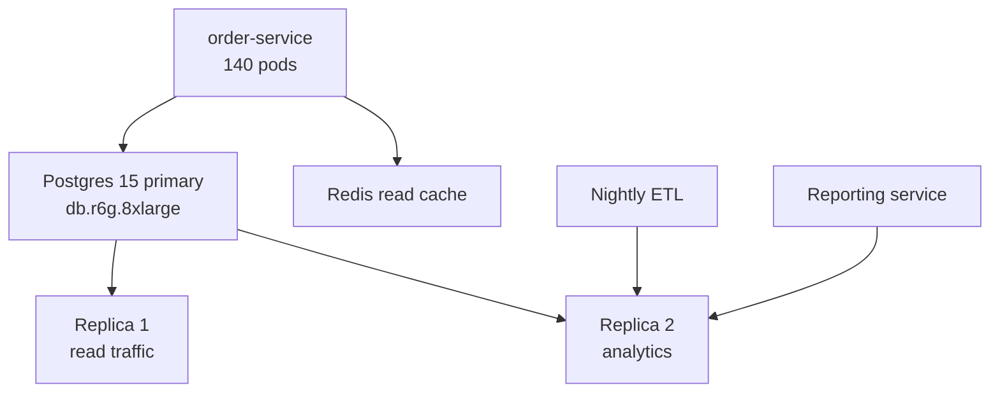
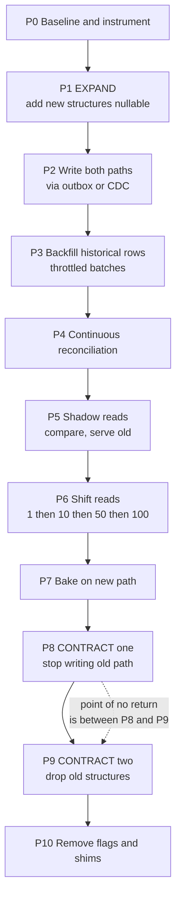
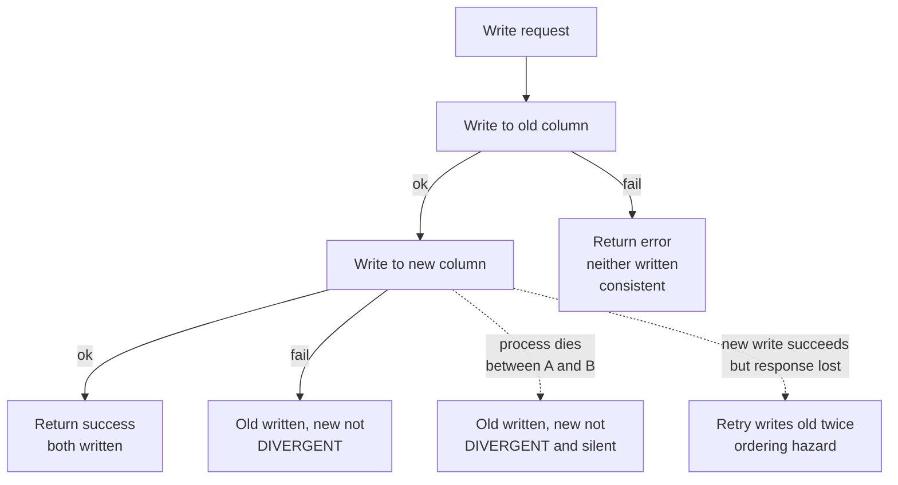
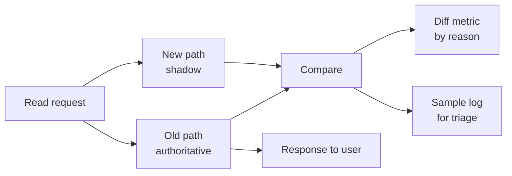
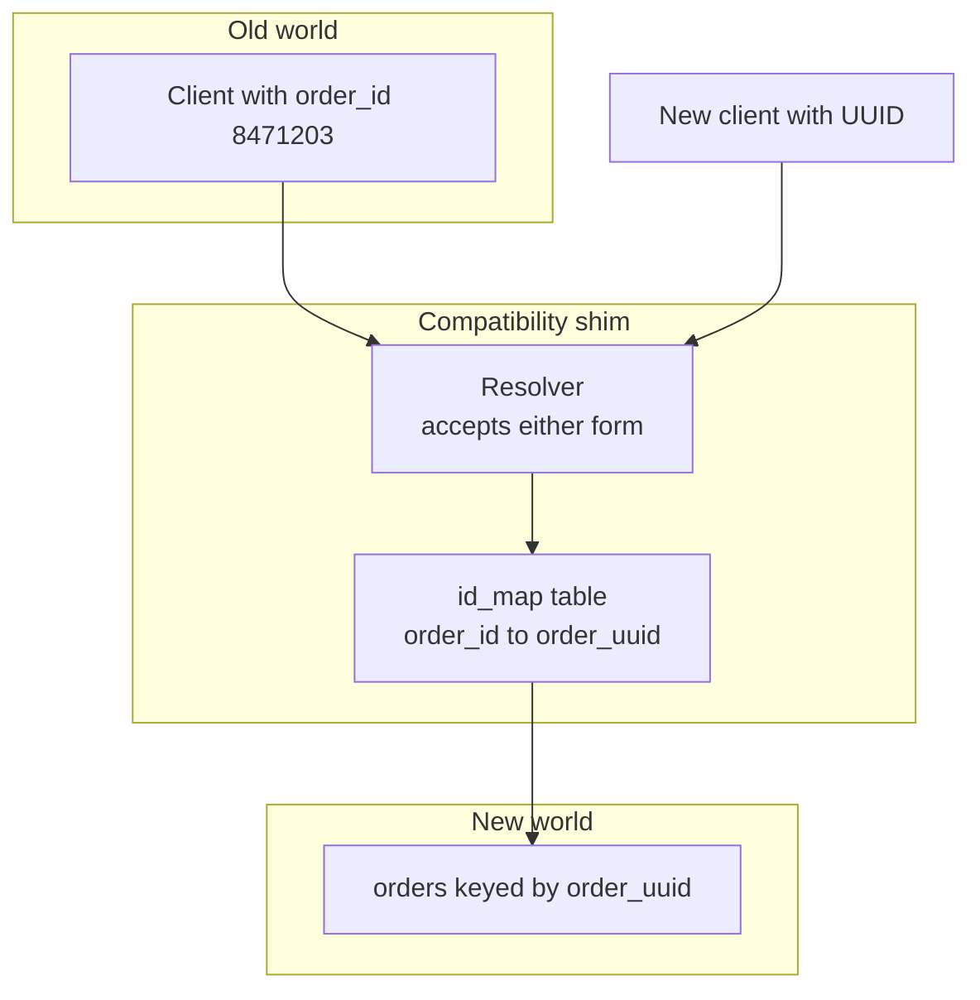

# S03 — Zero-Downtime Schema & Data Migration

<span class="pill pill-core">SRE Round</span>

**Move a 4-billion-row production table to a new schema and storage engine while it is being read and written, with no maintenance window and no lost rows; the single hardest judgment call is that dual-write is the obvious approach and it is also the one that silently corrupts your data, so the real design is choosing what replaces it.**

| | |
|---|---|
| **Commonly asked at** | Stripe, Meta, Shopify, Datadog, GitHub, Airbnb, Google |
| **Time budget** | 45 min |
| **Core tension** | Migration speed vs production stability vs reversibility — the backfill that finishes in a day is the backfill that takes production down, and the phase that makes the migration "done" is the phase that makes it unrollbackable |
| **Prerequisites** | [F13 Storage Engines](../fundamentals/f13-storage-engines.md) · [F07 Replication & Consistency](../fundamentals/f07-replication-consistency.md) · [F11 Idempotency](../fundamentals/f11-idempotency.md) · [F12 Queues & Streams](../fundamentals/f12-queues-streams.md) · [F25 Deployment & Release Safety](../fundamentals/f25-deployment-release-safety.md) · [F10 Distributed Transactions](../fundamentals/f10-distributed-transactions.md) · [F06 Partitioning & Sharding](../fundamentals/f06-partitioning-sharding.md) |

---

## 1. The Scenario As Given

> "Our `orders` table has 4.2 billion rows and 9.4 TB with indexes. It's on a single Postgres primary and it's out of runway — vacuum can't keep up, the index on `created_at` doesn't fit in memory, and a schema change takes an `ACCESS EXCLUSIVE` lock we can't afford. We want it partitioned by month, with three columns changed, on a new instance class. Zero downtime, no data loss. Design the migration."

Current state:



Facts supplied on request:

| Fact | Value |
|---|---|
| Rows | 4.2 billion |
| Size | 9.4 TB total; 3.1 TB heap, 6.3 TB indexes |
| Write rate | 2,400 inserts/s peak, 900 updates/s peak |
| Read rate | 18,000 queries/s, 85% by primary key or `(customer_id, created_at)` |
| Growth | +110 M rows/month |
| Current primary headroom | CPU 55% at peak, IOPS 60% of provisioned, replication lag p99 380 ms |
| Retention | Rows are updated for ~30 days after creation, then effectively immutable |
| Schema changes wanted | 3, listed below |
| Other consumers | Nightly ETL, a reporting service, a Debezium CDC stream feeding the data warehouse |

The three schema changes, which are deliberately of increasing difficulty:

| # | Change | Difficulty | Why |
|---|---|---|---|
| 1 | Add `fulfillment_center_id INT` | Easy | Additive, nullable, no semantic change |
| 2 | `price NUMERIC(10,2)` in dollars → `price_minor BIGINT` in minor units + `currency CHAR(3)` | Medium | Type and representation change; both old and new readers can parse the *other's* column but would misinterpret the value |
| 3 | Primary key `order_id BIGSERIAL` → `order_uuid UUID`, with `order_id` retired | **Genuinely backward-incompatible** | Every foreign key, every cached reference, every external integration, every URL in a customer's email history refers to the old key |

!!! note "What the round is actually testing"
    Three things. First, whether you know expand/contract as an ordered discipline rather than a phrase. Second, whether you understand *why dual-write is unsafe* at a mechanical level — not "it might fail" but the specific interleavings that produce divergence. Third, whether you can define "done" rigorously: what verification convinces you it is safe to drop the old column, and what you do when you have crossed a point of no return and something is wrong.

---

## 2. Clarifying Questions to Ask First

**About the data**

1. **Is the table append-mostly or update-heavy, and is there an immutability horizon?** "Rows are updated for 30 days then frozen" is enormously valuable — it means 97% of the table can be backfilled once and never re-checked, and only a 30-day hot window needs continuous reconciliation.
2. **What is the access pattern?** 85% by primary key or `(customer_id, created_at)` tells you the partition key and tells you whether the new schema will actually help.
3. **Is there a monotonic key I can chunk on?** Backfilling by `ORDER BY id LIMIT n OFFSET m` is quadratic and will not finish. Keyset pagination on a monotonic key is the only approach that works at this scale.
4. **Are there rows that will *never* be read again?** 4.2 billion rows where 3 billion are older than the legal retention period is a deletion project wearing a migration costume, and deleting is much cheaper than migrating.

**About the consumers**

5. **Who reads this table besides the application?** The nightly ETL, the reporting service, and the Debezium CDC stream are three separate migration work items with three separate owners. The CDC stream is the sneaky one — a schema change breaks the downstream warehouse, possibly silently.
6. **Are there foreign keys pointing at this table?** For change 3, every FK is a dependent migration.
7. **Do external systems or customers hold references to `order_id`?** Emails, receipts, support tickets, partner APIs. This determines whether the old key can ever truly be dropped.

**About constraints**

8. **What is the acceptable added latency on the write path during dual-write?** This decides synchronous dual-write versus outbox versus CDC.
9. **What replication lag is tolerable, and what breaks when it is exceeded?** The backfill's throttle is governed by this number.
10. **Is there a window where traffic is materially lower?** Off-peak backfill is free throughput.
11. **What is the rollback appetite, and who decides?** Specifically: after reads are shifted and old writes stopped, rollback requires a *reverse* backfill. Is that budgeted?

!!! tip "The question that reframes the round"
    "Before I design the migration — is the goal the new schema, or is the goal the capacity relief? Because partitioning by month and moving to a new instance class solves the vacuum and index-size problem, and those are additive changes I can do with far less risk than the primary-key change. If the PK change is nice-to-have, I'd sequence it separately, after the capacity fire is out." Bundling a risky semantic change with an urgent capacity fix is one of the most common ways these projects fail, and noticing it is a senior signal.

---

## 3. Framework / Approach

### The expand/contract pattern, stated precisely

Expand/contract (also called parallel change) exists because a deploy is not atomic: for some window, old code and new code both run against the same data. Therefore **every intermediate state of the schema must be readable and writable by both the old and the new version of the application.** That single invariant generates the whole phase ordering.



### The five rules that generate the phases

1. **Add before you use; use before you require; require before you remove.** A column is added nullable, then written, then backfilled, then made `NOT NULL`, then read, then the old one is dropped. Skipping a step means a deploy window where one version of the code sees an impossible state.
2. **Never change and move in the same step.** Changing a column's meaning and relocating it to a new table at once makes verification impossible, because you cannot tell whether a diff came from the transform or the transport.
3. **Reads change last, writes change first.** Writes are additive and invisible; reads are what users see. If reads move before writes are proven, users see incomplete data.
4. **Every phase must be exitable by a config change, not a deploy.** Feature flags, not code reverts. A deploy takes 20 minutes; a flag takes 5 seconds, and you will need it during an incident.
5. **Verification runs continuously from the moment there are two copies, not at the end.** If reconciliation starts at phase 8, you have no baseline and cannot distinguish "pre-existing drift" from "the migration broke it."

### Timeboxing a 45-minute answer

| Minutes | Activity |
|---|---|
| 0–5 | Clarify; separate the three schema changes by difficulty and propose sequencing them |
| 5–12 | Expand/contract phase table on the board |
| 12–20 | Dual-write hazard and why outbox/CDC instead |
| 20–28 | Backfill throttling with real throughput math |
| 28–35 | Verification strategy and the definition of "done" |
| 35–41 | The backward-incompatible change and its shim |
| 41–45 | Rollback matrix and the point of no return |

---

## 4. Worked Example

### 4.1 The phase table

This is the artifact. Change 2 (`price` → `price_minor`) is used as the running example because it exercises every hazard.

| # | Phase | Schema state | App behaviour | Duration | Rollback | Reversible? |
|---|---|---|---|---|---|---|
| 0 | Baseline | Unchanged | Unchanged | 1 wk | N/A | — |
| 1 | Expand | `ALTER TABLE orders ADD COLUMN price_minor BIGINT NULL, ADD COLUMN currency CHAR(3) NULL` — no default, no constraint | Ignores new columns | minutes | `DROP COLUMN` | Yes, trivially |
| 2 | Write new path | Same | Writer emits an outbox row per mutation; an applier populates `price_minor` | 1 wk | Stop the applier | Yes |
| 3 | Backfill | Same | Throttled batch job fills historical rows | 7–10 d | Stop the job; new columns stay partially filled, harmlessly | Yes |
| 4 | Reconcile | Same | Continuous checksum job compares `price` and `price_minor` | Continuous | N/A | Yes |
| 5 | Shadow reads | Same | Read path computes both, serves old, records diffs | 1 wk | Flag off | Yes |
| 6 | Shift reads | Same | Flag ramps: 1% → 10% → 50% → 100% of reads use `price_minor` | 2 wks | Flag down; converges in seconds | Yes |
| 7 | Bake | Same | 100% reads on the new column; old column still written | 2 wks | Flag down | Yes |
| 8 | Contract 1 | Same | **Stop writing `price`.** `price` is now stale for new rows | 2 wks | **Reverse backfill required** for rows written since P8 | Degraded — costs a reverse backfill |
| 9 | Contract 2 | `ALTER TABLE orders DROP COLUMN price` | — | minutes | **Restore from backup** | **No** |
| 10 | Cleanup | — | Remove flags, shim code, comparison code, outbox handler for this field | 1 wk | N/A | — |

!!! danger "The point of no return is between phase 8 and phase 9, not at phase 9"
    Phase 9 is the obviously irreversible one — `DROP COLUMN` destroys data. But the *practical* point of no return is phase 8: the moment you stop writing the old column, every new row has a null/stale old value, and rolling back requires a reverse backfill of everything written since. The longer you bake in phase 8, the more expensive the rollback becomes, and at some point the rollback is longer than the incident you would be rolling back from. State the bake duration as a deliberate risk budget: "two weeks of phase 8, after which we accept that rollback means a reverse backfill of ~50 million rows taking four hours, and we proceed to phase 9 only after that becomes acceptable."

### 4.2 Backfill throughput math

The backfill is the phase with real physics in it. Do the arithmetic on the board.

Rows to migrate:

$$
N = 4.2 \times 10^{9}
$$

Chosen batch size $b$ and inter-batch sleep $s$. Effective throughput:

$$
R = \frac{b}{t_{\text{batch}} + s}
$$

Measured on a staging clone with production-sized data, $t_{\text{batch}} \approx 180$ ms for $b = 5{,}000$ rows (a keyset-paginated `UPDATE ... WHERE id BETWEEN`). With no sleep:

$$
R_{\max} = \frac{5{,}000}{0.180} \approx 27{,}800\ \text{rows/s} \Rightarrow \frac{4.2\times10^{9}}{27{,}800} \approx 151{,}000\ \text{s} \approx 42\ \text{hours}
$$

Attractive, and completely unusable — at 27,800 rows/s the WAL generation rate is roughly

$$
27{,}800\ \frac{\text{rows}}{\text{s}} \times 310\ \frac{\text{bytes of WAL}}{\text{row}} \approx 8.6\ \text{MB/s of extra WAL}
$$

on top of production's 4 MB/s, which triples the replication stream and pushes replica lag past the 1-second threshold that the read replicas' consumers assume. It also creates 4.2 billion dead tuples for autovacuum, on a table whose vacuum problem is the reason for the migration.

Throttle to a target that keeps replication lag inside budget. Set a lag SLO of 1 s and back off when it exceeds 700 ms. Empirically that lands around $R = 9{,}000$ rows/s during off-peak and $R = 3{,}000$ rows/s during peak.

Mixed schedule: 10 off-peak hours at 9,000 rows/s, 14 peak hours at 3,000 rows/s:

$$
\text{rows/day} = 10 \times 3600 \times 9{,}000 + 14 \times 3600 \times 3{,}000 = 3.24\times10^{8} + 1.51\times10^{8} = 4.75\times10^{8}
$$

$$
\text{days} = \frac{4.2\times10^{9}}{4.75\times10^{8}} \approx 8.8\ \text{days}
$$

And the backfill must outrun growth. Growth is $110\times10^{6}$ rows/month $= 3.7\times10^{6}$/day, which is 0.8% of backfill throughput — negligible here, but *always compute this ratio*. If growth were 60% of backfill throughput the migration would take months and the plan is wrong.

$$
T_{\text{completion}} = \frac{N}{R_{\text{backfill}} - R_{\text{growth}}}
$$

!!! example "The ratio that kills migrations"
    A team backfilled an events table at 4,000 rows/s while the table grew at 3,200 rows/s. The completion estimate was $\frac{N}{800}$ — five times longer than the naive $\frac{N}{4000}$. They discovered this in month two. Always write the denominator as *net* throughput, and if net throughput is less than 30% of gross, either raise the throttle (and accept the production impact) or narrow the scope (backfill only rows that will actually be read).

### 4.3 The backfill job

```python
# Keyset pagination, adaptive throttle on replica lag, resumable, idempotent.
# The state table makes this restartable after a crash or a deploy.

import time
import psycopg2

BATCH = 5_000
LAG_TARGET_MS = 700      # back off above this
LAG_HARD_MS = 2_000      # stop entirely above this
SLEEP_MIN, SLEEP_MAX = 0.02, 2.0

def replica_lag_ms(cur) -> float:
    cur.execute("""
        SELECT COALESCE(MAX(EXTRACT(EPOCH FROM (now() - reply_time)) * 1000), 0)
        FROM pg_stat_replication
    """)
    return cur.fetchone()[0]

def next_cursor(cur) -> int:
    cur.execute("SELECT last_id FROM migration_state WHERE name = 'price_minor'")
    return cur.fetchone()[0]

def run_batch(cur, lo: int) -> int:
    # Idempotent by construction: only touches rows where the target is still
    # NULL, so a replayed batch after a crash is a no-op. Keyset, never OFFSET.
    cur.execute("""
        WITH slice AS (
            SELECT order_id, price, COALESCE(currency_hint, 'USD') AS cur
            FROM orders
            WHERE order_id > %s
            ORDER BY order_id
            LIMIT %s
            FOR UPDATE SKIP LOCKED
        )
        UPDATE orders o
           SET price_minor = (s.price * 100)::BIGINT,
               currency    = s.cur
          FROM slice s
         WHERE o.order_id = s.order_id
           AND o.price_minor IS NULL        -- never clobber a live dual-write
        RETURNING o.order_id
    """, (lo, BATCH))
    touched = cur.fetchall()
    return max((r[0] for r in touched), default=lo)

def main(conn):
    sleep = SLEEP_MIN
    while True:
        with conn.cursor() as cur:
            lag = replica_lag_ms(cur)
            if lag > LAG_HARD_MS:
                time.sleep(30)                       # hard stop, do not creep
                continue
            sleep = min(SLEEP_MAX, sleep * 1.5) if lag > LAG_TARGET_MS \
                    else max(SLEEP_MIN, sleep * 0.9)

            lo = next_cursor(cur)
            hi = run_batch(cur, lo)
            if hi == lo:
                break                                 # reached the end
            cur.execute(
                "UPDATE migration_state SET last_id = %s, updated_at = now() "
                "WHERE name = 'price_minor'", (hi,))
            conn.commit()
        time.sleep(sleep)
```

Four properties worth naming explicitly, because each is a bug someone has shipped:

| Property | Why it matters |
|---|---|
| Keyset pagination (`WHERE id > cursor`), never `OFFSET` | `OFFSET 3000000000` scans three billion rows to skip them; the job gets quadratically slower and never finishes |
| `AND price_minor IS NULL` guard | The backfill must never overwrite a value written by the live dual-write path. Without this, a backfill batch that reads a row before a user updates it, and writes after, resurrects the old value |
| Committed cursor in a state table | A crash, a deploy, or an OOM must not restart from zero or skip a range |
| Adaptive throttle with a hard stop | A fixed sleep is tuned for one load level and is wrong at every other. The hard stop prevents a slow creep into replica-lag failure during an unrelated incident |

### 4.4 Verification and the definition of done

Four layers, from cheapest and weakest to most expensive and strongest. Run all four; they catch different bugs.

| Layer | Method | Cost | Catches | Misses |
|---|---|---|---|---|
| **Row counts** | `COUNT(*)` per partition on both sides | Low | Missing or extra rows in bulk | Every value-level error |
| **Range checksums** | `md5(string_agg(...))` over ordered key ranges | Medium | Any value difference, precisely localized | Nothing within its scope, but expensive to run often on the full table |
| **Sampled diffs** | Random 100k rows/hour, full row comparison including derived fields | Low | Transform logic bugs, encoding issues, timezone bugs | Rare rows, if sampling is not stratified |
| **Shadow-read diffs** | Production read path computes both answers, compares, serves old | Low | Errors in *rows that users actually read*, weighted by real access patterns | Rows nobody reads — which is exactly the right thing to miss |

```sql
-- Range checksum. Chunked so it can run continuously at low priority and
-- so a mismatch localizes to a 1M-row range instead of "somewhere in 4.2B".
SELECT
    (order_id / 1000000) AS chunk,
    count(*)             AS rows,
    md5(string_agg(
        order_id::text || '|' ||
        -- canonical form of the OLD representation
        to_char(price, 'FM999999990.00'),
        ',' ORDER BY order_id)) AS old_sum,
    md5(string_agg(
        order_id::text || '|' ||
        -- same canonical form derived from the NEW representation
        to_char(price_minor::numeric / 100, 'FM999999990.00'),
        ',' ORDER BY order_id)) AS new_sum
FROM orders
WHERE order_id >= :lo AND order_id < :hi
GROUP BY 1;
```

```sql
-- Sampled diff with the mismatch reason, for triage rather than detection.
SELECT order_id,
       price,
       price_minor,
       (price * 100)::BIGINT AS expected_minor,
       CASE
         WHEN price_minor IS NULL                      THEN 'not_backfilled'
         WHEN price_minor <> (price * 100)::BIGINT     THEN 'value_mismatch'
         WHEN currency IS NULL                         THEN 'missing_currency'
       END AS reason
FROM orders TABLESAMPLE SYSTEM (0.001)
WHERE price_minor IS DISTINCT FROM (price * 100)::BIGINT
   OR currency IS NULL
LIMIT 1000;
```

**The definition of done** — what you require before advancing past phase 7. Write these as explicit gates, because "it looks fine" is how migrations go wrong:

1. Full-table range checksums pass with **zero** mismatched chunks, on **three consecutive complete passes**, where a pass covers every chunk.
2. Shadow-read diff rate below $10^{-7}$ sustained for 7 days, and every diff observed in that period has been individually root-caused and classified as either a known-benign transform (documented) or a bug that has been fixed and re-verified.
3. The verification window spans a **complete business cycle** — month-end close, a marketing peak, a deploy, a failover drill, and at least one weekend. A migration verified over a quiet Tuesday has not been verified.
4. Row counts match per partition, and the *delta* between counts on the two sides is stable and explained (it will not be zero during an active window; it should be bounded by in-flight writes).
5. The reverse-backfill tool exists, has been executed against staging with production-scale data, and its runtime is measured and acceptable.

!!! warning "Zero diffs for a week is not the same as zero diffs"
    A shadow-read diff rate of $10^{-7}$ over a week at 18,000 qps is roughly 1,000 diffs. If you have not looked at all 1,000, you do not know whether they are floating-point rounding in a display field or a systematic error affecting every order in one currency. Every diff class gets root-caused. The acceptable end state is "all remaining diffs are in class X, which is benign because Y" — never "the rate is low enough."

### 4.5 What "shift reads" actually looks like

```python
# The read path during phases 5-7. Same function serves shadow (compare,
# return old) and ramp (return new for a sticky percentage of traffic).

def get_order_price(order_row, ctx):
    old = Money.from_decimal(order_row.price, 'USD')

    if not flags.enabled('orders.price_minor.read', ctx):
        # Phase 5: shadow. Compute the new answer, never serve it.
        if flags.enabled('orders.price_minor.shadow', ctx):
            try:
                new = Money(order_row.price_minor, order_row.currency)
                if new != old:
                    metrics.increment('price_minor.diff',
                                      tags={'reason': classify(old, new)})
                    sample_log.record(order_row.order_id, old, new)
            except Exception:
                # A shadow path must NEVER affect the served response.
                metrics.increment('price_minor.shadow_error')
        return old

    # Phases 6-7: serve the new answer.
    return Money(order_row.price_minor, order_row.currency)
```

The flag must bucket on a **stable identifier** (customer ID, not request ID), so that a given customer sees a consistent answer across requests. A random per-request flag means a customer refreshes the page and the price changes, which is worse than either outcome alone.

---

## 5. Deep Dives

### A. Why naive dual-write is unsafe, and what to do instead

Dual-write means the application writes to both the old and new location in the same request. It is the first thing everyone proposes and it is wrong for a specific, mechanical reason: **two writes to two places cannot be made atomic without a distributed transaction, and the failure interleavings are not rare.**



The divergence modes, enumerated:

| Interleaving | Result | Detectable? |
|---|---|---|
| Write A succeeds, write B fails with an error | Divergent; the app *knows* | Yes, if you count and alert on it — most teams log and move on |
| Write A succeeds, process is SIGKILLed before B | Divergent; nobody knows | Only by reconciliation |
| Write A succeeds, B times out but actually committed | Consistent, but the retry writes A again | Only if A is not idempotent |
| Two concurrent writers: W1 writes A then B; W2 writes A then B; the interleaving is A1 A2 B2 B1 | **Old column ends at W2's value, new column ends at W1's value** — permanently inconsistent, both writes "succeeded" | Only by reconciliation |
| Backfill and live write race on the same row | Backfill resurrects a stale value | Only by reconciliation, and it looks random |

The fourth row is the one that convinces people. It requires no failure at all — two successful concurrent writes, both returning 200, leave the two columns permanently disagreeing, because the write to A and the write to B are separately ordered.

**The replacements, in order of preference:**

=== "1. Single transaction (when both targets are in one database)"

    If the new column is in the same Postgres instance, write both in one transaction and the problem evaporates. This covers changes 1 and 2 in our scenario entirely.

    ```sql
    UPDATE orders
       SET price       = :dollars,
           price_minor = (:dollars * 100)::BIGINT,
           currency    = :currency
     WHERE order_id = :id;
    ```

    **Always check whether this applies before reaching for anything cleverer.** A large fraction of "we need dual-write" situations are actually "we need one more column in the same `UPDATE`." The cost is that the new column is now on the hot write path, so a constraint violation on it fails the user's write — mitigate by keeping the new column unconstrained until phase 8.

=== "2. Transactional outbox (different stores, you control the writer)"

    Write the business change and an outbox row in one local transaction. A separate applier reads the outbox and applies to the new store, at-least-once, idempotently.

    ```sql
    BEGIN;
      UPDATE orders SET price = :dollars WHERE order_id = :id;
      INSERT INTO migration_outbox (aggregate_id, seq, payload, created_at)
      VALUES (:id, nextval('outbox_seq'), :payload, now());
    COMMIT;
    ```

    Atomicity is local, so it is real. The applier is idempotent (upsert keyed on `aggregate_id`) and ordered per aggregate (apply in `seq` order per `aggregate_id`, which is what preserves the concurrent-writer case). Lag is observable as outbox depth. See [F11](../fundamentals/f11-idempotency.md) and [F12](../fundamentals/f12-queues-streams.md).

    Cost: an extra write on the hot path, an outbox table that must be pruned, and an applier to operate.

=== "3. Change data capture (different stores, minimal app change)"

    Tail the write-ahead log with Debezium or equivalent. Every committed change becomes an event; apply it to the new store idempotently.

    **Strongest property: the source of truth is the database's own commit log, so there is no possibility of the app writing to one place and not the other — the capture happens after the commit, by definition.** Also requires no application change at all, which matters when the writers are many services or a legacy monolith.

    Costs: you inherit CDC's operational surface (slot bloat if the consumer stalls, snapshot behaviour on restart, schema-change handling); ordering is per-partition, so you need the partition key to match the aggregate; and the transform now lives in a pipeline rather than in the application, which is a different team's on-call.

    In our scenario a Debezium stream already exists for the warehouse, which makes this cheap — but note that adding a second consumer to an existing slot is not free, and a stalled new consumer can block WAL recycling for everyone.

=== "4. Dual-write with reconciliation (last resort)"

    If you genuinely cannot do any of the above — no shared transaction, no outbox, no CDC — then dual-write is acceptable *only* when paired with: (a) a durable, ordered repair log of every write whose second leg failed, (b) a continuous reconciliation job with a measured convergence time, and (c) an explicit acceptance that the new store is eventually consistent with a bounded, monitored staleness.

    This is a real design, not a cop-out — it is what you do when migrating between two systems neither of which you fully control. But say out loud that reconciliation is now load-bearing rather than a safety net, and size it accordingly.

| Approach | Atomic? | App change | Ordering | Failure mode | Use when |
|---|---|---|---|---|---|
| Single transaction | Yes | Small | Perfect | None new | Same database |
| Outbox | Yes (locally) | Medium | Per aggregate | Applier lag | Different stores, you own the writer |
| CDC | Yes (by construction) | None | Per partition | Slot bloat, snapshot storms | Many writers, legacy code, existing CDC |
| Naive dual-write | **No** | Small | None | Silent divergence | Never, without reconciliation |

### B. Backfill throttling as a control problem

The backfill is a load generator you have chosen to point at your own production database. Treat it as one.

**What to throttle on.** Not a fixed rate — a fixed rate is correct at exactly one load level. Throttle on the *signal that will actually break*:

| Signal | Threshold | Why it is the right signal |
|---|---|---|
| Replica lag | Back off > 700 ms, hard stop > 2 s | Directly bounds staleness for read-replica consumers; the first thing that breaks |
| Primary CPU | Back off > 70% | Latency knee; see [F24](../fundamentals/f24-capacity-planning.md) |
| Lock wait time p99 on `orders` | Back off > 50 ms | Detects contention with live writes before users feel it |
| API p99 latency (the real SLI) | Hard stop on any SLO burn > 2x | The ultimate authority — everything else is a proxy |
| Autovacuum queue depth / dead tuple ratio | Back off > 20% dead | The backfill creates dead tuples faster than vacuum reclaims them |

**Feedback shape.** Multiplicative decrease, additive (or gently multiplicative) increase. Back off fast on the first sign of trouble, recover slowly. A backfill that ramps back to full speed in one cycle after a lag spike will oscillate.

**Batch size.** There is a knee here too:

| Batch size | Effect |
|---|---|
| 100 | Per-statement overhead dominates; throughput poor; many tiny transactions; slow |
| 5,000 | Sweet spot for this table — transaction under 200 ms, lock held briefly |
| 100,000 | Long transaction holds locks and a snapshot; blocks vacuum across the whole table; one failure retries a huge amount of work; replication applies it as one large chunk, spiking lag |

**Rule: the batch transaction should complete in well under one second.** Long transactions in Postgres additionally pin the oldest snapshot, which prevents vacuum from reclaiming *anything* across the whole database — a backfill with 5-minute transactions can cause a table-bloat incident on a table it never touches.

**Schedule.** Off-peak is free throughput. But do not schedule the backfill to end exactly at the start of peak — leave a margin, because the last batch may be slow and the system needs time to drain replication lag before load arrives.

!!! gotcha "The backfill finishes and the database gets slower"
    Symptom: the backfill completes successfully and p99 latency is worse than before it started. Mechanism: 4.2 billion row updates created 4.2 billion dead tuples and doubled the physical table size; the new column's index was built concurrently and is now competing for buffer cache; and the table's visibility map is cold so index-only scans have stopped working. Mitigation: plan the post-backfill vacuum as an explicit phase with its own duration and throttle, expect the table to be physically larger until it is rewritten or partitions are swapped, and — for a table this size — prefer backfilling into *new partitions* that you attach, rather than updating rows in place, which turns the vacuum problem into a file-swap.

### C. Shadow reads: validating against real access patterns

Checksums verify data. Shadow reads verify **the code path that reads the data**, weighted by what users actually request. These catch different bug classes and you need both.



Rules that make shadow reads safe rather than a second outage:

1. **The shadow path can never affect the response.** Wrap it in a catch-all, a timeout, and a concurrency limit. A shadow read that throws, or that adds 300 ms, has converted a validation tool into an incident.
2. **Budget the capacity.** Shadow reads double the read load on the new path. At 18,000 qps that is 18,000 extra qps the new structures must absorb. Ramp shadow traffic the same way you ramp real traffic: 1%, 10%, 100%.
3. **Normalize before comparing.** Most early "diffs" are not bugs: float formatting, map ordering, timezone rendering, trailing-zero differences in decimals, `NULL` versus empty string. Build a canonicalizer, and make each normalization rule an explicit, reviewed decision rather than a quiet `if diff is small: ignore`.
4. **Classify every diff.** The metric must be tagged by reason, and the sample log must retain enough context to reproduce. A single untagged `diff_count` tells you something is wrong and nothing about what.
5. **Sample the log, not the comparison.** Compare 100% of shadowed requests; log a bounded sample. Comparing a sample means rare-but-systematic bugs (one currency, one legacy code path) hide below the sampling rate.
6. **Watch for diffs that are the *old* path being wrong.** In roughly one migration in three, shadow reads reveal a pre-existing bug in the old path. That is a genuinely good outcome and it must not be "fixed" by making the new path bug-compatible without a decision.

### D. The genuinely backward-incompatible change, and the compatibility shim

Changes 1 and 2 are expand/contract-able: old and new representations can coexist in the same row. Change 3 — replacing `order_id BIGSERIAL` with `order_uuid UUID` as the identity — is not, because **identity is referenced from outside the system**: foreign keys, caches, customer emails, support tickets, partner API integrations, and URLs that have been bookmarked.

The defining property of a backward-incompatible change: **there is no intermediate schema state that both the old and new readers interpret correctly**, because the disagreement is about what a value *means*, not where it lives.

The pattern is a **compatibility shim**: an explicit, permanent-until-proven-otherwise translation layer that makes old references resolve correctly against the new world.



The ordered plan for change 3:

| # | Step | Detail | Reversible? |
|---|---|---|---|
| 1 | Add `order_uuid UUID` nullable, unique-when-not-null | Generated at insert time for new rows, `uuid_generate_v7()` for index locality | Yes |
| 2 | Backfill `order_uuid` for all historical rows | Same throttled batch machinery | Yes |
| 3 | Build the `id_map` table | `(order_id BIGINT PRIMARY KEY, order_uuid UUID NOT NULL UNIQUE)` — a dedicated, small, cacheable table rather than an index on the huge one | Yes |
| 4 | Deploy the resolver | Every API entry point accepts *either* identifier; resolves `BIGINT` via `id_map`, passes `UUID` through | Yes |
| 5 | Make the API emit only UUIDs in new responses; keep accepting both | New references stop being created | Yes |
| 6 | Migrate foreign keys in dependent tables | Add `order_uuid` alongside, backfill, shift reads, drop old — a full expand/contract per dependent table | Yes, per table |
| 7 | Measure old-identifier usage | Metric: requests resolving via `id_map`, broken down by caller, user agent, and auth principal | Yes |
| 8 | Deprecate: return a warning header, notify integrators, set a sunset date | Old identifiers still work | Yes |
| 9 | Drop `order_id` from `orders`; **keep `id_map` forever** | The map is the shim; it is 4.2 billion rows of 24 bytes ≈ 100 GB, which is cheap insurance | **No** |

**The key judgment: keep the shim.** The instinct is to treat the shim as temporary and plan its removal. For an externally-referenced identifier, that instinct is wrong. A customer's 2019 receipt email contains `order_id=8471203`, and a support agent will paste it into a tool in 2031. The `id_map` is 100 GB of permanent, read-only, trivially-cacheable data, and removing it buys nothing and risks a class of failure that surfaces years later, sporadically, in exactly the situations where a customer is already unhappy.

The other judgment: **usage measurement decides the sunset, not the calendar.** Step 7's metric, broken down by caller, is what turns "we'd like to deprecate this" into "these four integrations account for 99.8% of remaining old-identifier traffic and here are their owners."

!!! gotcha "The semantic change nobody notices: same type, different meaning"
    Change 2 has a sibling that is far nastier: changing `price NUMERIC` from dollars to cents *in place*. Both old and new code read the column successfully, parse it successfully, and are off by a factor of 100. There is no type error, no null, no exception — just charges that are 100x wrong. **Never change a column's units, currency, timezone, or encoding in place.** Always introduce a differently-named column, because the name is the only mechanism that forces every reader to acknowledge the change. If you cannot rename, the change is backward-incompatible and needs a shim, not an expand/contract.

### E. Rollback safety, phase by phase

| Phase | Rollback mechanism | Time to roll back | Data loss risk | Who authorizes |
|---|---|---|---|---|
| 1 Expand | `DROP COLUMN` | Minutes | None | On-call |
| 2 Write new path | Stop the applier / disable the outbox handler | Seconds (flag) | None — new column goes stale, unused | On-call |
| 3 Backfill | Stop the job | Seconds | None — partial fill is harmless | On-call |
| 4 Reconcile | Stop the job | Seconds | None | On-call |
| 5 Shadow reads | Flag off | Seconds | None | On-call |
| 6 Shift reads | Flag down | Seconds | None — old column still authoritative and current | On-call |
| 7 Bake | Flag down | Seconds | None | On-call |
| 8 **Stop old writes** | Re-enable old writes **plus reverse-backfill everything written since P8** | Hours, proportional to time spent in P8 | Old column is stale for recent rows until the reverse backfill completes | Service owner |
| 9 **Drop old column** | Restore from backup; replay WAL; lose everything since the snapshot | Hours to days | **Severe** | Director, written |
| 10 Cleanup | Re-deploy prior version | Minutes | None | On-call |

Two rules follow from the table and both are worth stating explicitly:

- **Phases 1–7 are all reversible by a config change in seconds, with zero data risk.** That is not an accident; it is the design goal of the ordering. If a phase in your plan is not reversible by a flag, you have ordered something wrong.
- **The cost of rolling back phase 8 grows linearly with time spent in phase 8.** So the bake duration is a deliberate risk trade, and the reverse-backfill tool must exist and have been tested *before* you enter phase 8, not written under pressure during the incident that requires it.

!!! tip "Write the reverse-backfill tool in phase 2"
    It is the same code as the forward backfill with the transform inverted, it costs a day, and it converts phase 8 from "irreversible" to "reversible in four hours." Teams skip it because phase 8 feels safe by the time they get there — two weeks of clean metrics will do that — and then discover that the one thing shadow reads and checksums cannot catch is a bug in the *write* path that only manifests under a load pattern that first occurs at month-end.

---

## 6. What Can Go Wrong

| Risk | Detection | Mitigation |
|---|---|---|
| Dual-write divergence from concurrent writers | Continuous reconciliation; divergence counter per table | Use a single transaction, outbox, or CDC; never naive dual-write without reconciliation as a load-bearing component |
| Backfill overwrites a live write (lost update) | Reconciliation shows a small, steady divergence that correlates with backfill progress | `WHERE new_col IS NULL` guard on the backfill; `FOR UPDATE SKIP LOCKED`; never blind-overwrite |
| Backfill saturates the primary; replica lag breaks read consumers | Replica lag SLO with alert; lock-wait p99; API SLO burn | Adaptive throttle keyed on lag; hard stop; off-peak scheduling; small batches |
| `OFFSET`-based pagination makes the job quadratic | Batch duration growing monotonically over the run | Keyset pagination on a monotonic key, committed cursor |
| Long-running backfill transaction blocks vacuum database-wide | `pg_stat_activity` oldest transaction age; table bloat growth on unrelated tables | Batch transactions well under 1 s; alert on any transaction older than 60 s |
| `ALTER TABLE` takes an exclusive lock and stalls all traffic | Lock-wait alert; pre-flight review of every DDL statement | Use lock-free variants; set `lock_timeout` on DDL and retry; add columns nullable with no default; build indexes `CONCURRENTLY` |
| Schema change breaks the downstream CDC consumer / warehouse | Consumer error rate; warehouse freshness SLO | Treat every CDC consumer as a migration stakeholder with its own phase; schema-registry compatibility checks in CI |
| Shadow reads double load and degrade the new path | New-path latency and error rate during the shadow ramp | Ramp shadow traffic; concurrency-limit and timeout the shadow call; kill switch |
| Diffs are dismissed as noise and a real bug ships | Diff rate that never reaches zero and is "explained" verbally | Every diff class root-caused and documented; gate advancement on classified-zero, not on a threshold |
| Verification window misses month-end / peak behaviour | Calendar check against the bake period | Require the verification window to span a complete business cycle including month-end and a peak |
| Phase 8 rollback needed; reverse-backfill tool does not exist | Discovered during the incident, which is too late | Build and test the reverse tool in phase 2; measure its runtime against production-scale data |
| Old column dropped; a forgotten consumer breaks | Post-drop error spike from an unrelated service | Grep every repo, audit DB grants and query logs for column references, and run a "column is now always NULL" canary for a week before dropping |
| Semantic change in place: same type, new units | Nothing errors; values are wrong by a constant factor | Never change units in place; new name forces reader acknowledgement |
| Disk fills during backfill from table bloat and WAL retention | Free space trend; WAL directory size; replication slot lag | Pre-provision 2x headroom; monitor and alert on slot-held WAL; prune the outbox aggressively |
| Migration never finishes because growth ≈ backfill rate | Net throughput $R_{\text{backfill}} - R_{\text{growth}}$ trending to zero | Compute net throughput before starting; narrow scope or raise the throttle; consider partition-swap instead of in-place update |
| External references to the old identifier resurface years later | Resolver-usage metric by caller, kept permanently | Keep the compatibility shim; do not plan its removal for externally-visible identifiers |

---

## 7. The Artifact You'd Produce

```text
+---------------------------------------------------------------------------+
| MIGRATION: orders.price NUMERIC dollars -> price_minor BIGINT + currency   |
| SCALE: 4.2e9 rows | 9.4 TB | 2400 ins/s 900 upd/s peak | 18k reads/s       |
+---------------------------------------------------------------------------+
| WRITE STRATEGY : single transaction, same database                         |
|   rejected naive dual-write -> concurrent A1 A2 B2 B1 diverges silently    |
|   outbox / CDC would apply if the target were a different store            |
+---------------------------------------------------------------------------+
| PHASES                       ROLLBACK                 REVERSIBLE           |
|  1 expand, nullable          DROP COLUMN              yes   min            |
|  2 write both in one txn     flag off                 yes   sec            |
|  3 backfill throttled        stop job                 yes   sec            |
|  4 reconcile continuously    stop job                 yes   sec            |
|  5 shadow reads              flag off                 yes   sec            |
|  6 shift reads 1/10/50/100   flag down                yes   sec            |
|  7 bake 2 weeks              flag down                yes   sec            |
|  8 STOP WRITING price        re-enable + REVERSE BACKFILL   hours          |
|  9 DROP COLUMN price         restore from backup      NO                   |
| 10 cleanup                   redeploy                 yes   min            |
+---------------------------------------------------------------------------+
| BACKFILL  batch 5000 keyset | guard price_minor IS NULL | cursor in state  |
|   throttle: replica lag >700ms back off, >2s hard stop                     |
|   9000 rows/s offpeak 10h + 3000 rows/s peak 14h = 4.75e8/day -> 8.8 days  |
|   net rate check: growth 3.7e6/day = 0.8% of throughput, negligible        |
+---------------------------------------------------------------------------+
| DONE means                                                                 |
|   3 consecutive full range-checksum passes with ZERO mismatched chunks     |
|   shadow diff rate < 1e-7 for 7 d AND every diff class root-caused         |
|   window spans month-end + a peak + a deploy + a failover drill            |
|   reverse-backfill tool built, tested at scale, runtime measured           |
+---------------------------------------------------------------------------+
| ABORT  any SLO burn > 2x | replica lag > 2 s for 5 min | any unexplained   |
|        checksum mismatch | shadow diff rate rising                         |
+---------------------------------------------------------------------------+
| AUTHORITY  on-call rolls back P1-P7 unilaterally                           |
|            service owner for P8 | director in writing for P9               |
+---------------------------------------------------------------------------+
```

The dashboard you would stand up before phase 2, and watch for the whole migration:

| Panel | Metric | Alert |
|---|---|---|
| Backfill progress | Rows migrated, % complete, projected completion date | Projection slips > 20% |
| Backfill rate | Current rows/s, current sleep interval | Rate at zero for 15 min |
| Replica lag | p50/p99 per replica | > 700 ms warn, > 2 s page |
| Divergence | Mismatched chunks in the current checksum pass | Any non-zero |
| Shadow diffs | Rate, by classified reason | Rate rising, or any unclassified reason |
| Write-path latency | p99 of the mutating endpoint | SLO burn > 2x |
| Table bloat | Dead tuple ratio, physical size | Dead ratio > 20% |
| Disk and WAL | Free space, WAL held by slots | < 30% free |
| Flag state | Current read/write flag values by percentage | Any unexpected change |

---

## 8. Gotchas & Corner Cases

!!! gotcha "Naive dual-write diverges with no failure at all"
    Symptom: reconciliation shows a steady trickle of rows where the old and new columns disagree, with no errors logged anywhere. Mechanism: two concurrent writers to the same row interleave as A1, A2, B2, B1 — the old column ends with writer 2's value, the new column with writer 1's. Both requests returned 200. This is not an error path; it is the normal behaviour of two independently-ordered writes. Mitigation: make the two writes atomic — one transaction if same store, outbox if not — or derive the second write from the commit log via CDC so ordering is inherited from the database.

!!! gotcha "The backfill resurrects values that users just changed"
    Symptom: customers report that an edit "didn't save," at a rate proportional to backfill speed, and only for rows the backfill is currently sweeping. Mechanism: the backfill read row $R$ at $t_0$, a user updated it at $t_1$, the backfill wrote its stale transform at $t_2$. Mitigation: never blind-write in a backfill. Guard with `WHERE new_col IS NULL`, or use a conditional update comparing a version/`updated_at` fetched in the same statement, and take row locks with `FOR UPDATE SKIP LOCKED` so the backfill yields to live traffic rather than fighting it.

!!! gotcha "OFFSET pagination turns a 2-day job into a 3-month job"
    Symptom: the backfill starts at 25,000 rows/s and is at 400 rows/s a day later; the ETA keeps growing. Mechanism: `LIMIT 5000 OFFSET n` must scan and discard $n$ rows, so batch cost grows linearly with progress and total cost is $O(N^2)$. Mitigation: keyset pagination — `WHERE id > :cursor ORDER BY id LIMIT :batch` — with the cursor committed to a state table. Also: an ETA that is not constant is itself the alert.

!!! gotcha "A 100,000-row batch blocks vacuum on every table in the database"
    Symptom: bloat and latency problems appear on tables the migration never touches. Mechanism: Postgres cannot vacuum tuples newer than the oldest open snapshot; a 6-minute backfill transaction pins that horizon database-wide for 6 minutes, every 6 minutes. Mitigation: keep batch transactions well under one second, alert on any transaction older than 60 seconds, and monitor `age(backend_xmin)` rather than assuming small batches are automatically safe.

!!! gotcha "ALTER TABLE ADD COLUMN with a default rewrites the whole table"
    Symptom: a "trivial" column addition takes an exclusive lock for 40 minutes and the service is down. Mechanism: on older engines, adding a column with a non-null default rewrites every row. Even on versions with the fast-path optimization, a `NOT NULL` constraint, a `CHECK`, or a type with a non-trivial default can force a rewrite — and the `ACCESS EXCLUSIVE` lock queues *behind* long-running reads and then blocks everything behind itself. Mitigation: add nullable with no default; backfill the default separately; add the constraint later as `NOT VALID` then `VALIDATE CONSTRAINT`; always set `lock_timeout` on DDL (e.g. 3 s) and retry in a loop so a failed attempt releases instead of stampeding.

!!! gotcha "Verification passes because both sides are wrong in the same way"
    Symptom: checksums match perfectly, shadow diffs are zero, and after cutover the data is wrong. Mechanism: the verification query applied the same transform function as the migration, so it compared the transform to itself. Mitigation: verification must derive the comparison independently — compare against the *source* representation using a separately-written canonicalization, ideally written by a different person, and include at least one hand-checked golden dataset with values computed manually.

!!! gotcha "The downstream CDC consumer breaks silently and the warehouse rots"
    Symptom: reporting numbers drift and nobody notices for three weeks. Mechanism: adding or dropping a column changed the Debezium message schema; the warehouse loader dropped unknown fields, or started writing nulls, without erroring. Mitigation: enumerate every CDC consumer in phase 0 and give each one its own migration phase; enforce schema compatibility in CI against a registry; add a freshness-and-completeness SLO on the warehouse table so the drift is an alert rather than a discovery.

!!! gotcha "Shadow reads take the new path down"
    Symptom: enabling shadow comparison causes a latency incident on the path being validated. Mechanism: shadow reads doubled the query load on the new structures whose indexes are cold and whose cache working set has not been established; nobody budgeted for it. Mitigation: ramp shadow traffic like real traffic; put a concurrency limiter and a short timeout on the shadow call; catch everything; and have a kill switch that is tested before you need it.

!!! gotcha "Diffs are 'explained' rather than root-caused"
    Symptom: the diff rate plateaus at $3\times10^{-6}$ and the team decides it is rounding. Mechanism: nobody opened the sample log; "rounding" was a hypothesis that became a fact through repetition. Mitigation: classify every diff by reason, require the reason tag to be set by code that *knows* why, and gate advancement on "zero unclassified diffs" rather than on a rate threshold. In one migration in three, the diffs reveal a pre-existing bug in the old path — which is valuable, and which a threshold gate would have discarded.

!!! gotcha "The migration is verified over a quiet week"
    Symptom: everything is clean for ten days, then month-end close produces thousands of diffs. Mechanism: the verification window did not contain the code paths that only execute at month-end — bulk adjustments, refund reversals, currency revaluation. Mitigation: require the bake window to span a complete business cycle. Write down what "complete" means for this domain: month-end, a marketing peak, a deploy of the consuming service, a failover drill, and a weekend.

!!! gotcha "Nobody can find who still reads the old column"
    Symptom: the column is dropped and an unrelated service starts erroring an hour later. Mechanism: the search was `grep price` in one repository; the actual consumer was a Looker model, a DBA's cron script, and a third-party ETL with its own credentials. Mitigation: audit `pg_stat_statements` and the query log for references to the column over a full business cycle; check DB grants for who *can* read it; and run a canary period where the column is set to `NULL` for a small percentage of new rows to surface readers loudly before you drop it.

!!! gotcha "The 'temporary' shim is removed and old references break years later"
    Symptom: support tooling fails on a 2019 order number; a partner integration breaks silently. Mechanism: the `id_map` was treated as migration scaffolding and cleaned up in phase 10. Mitigation: for identifiers that have ever been visible outside the system, the shim is permanent. 100 GB of a read-only, cacheable mapping table is cheaper than the class of failure it prevents, and the decision to remove it should require the same authority as dropping the column.

!!! gotcha "Phase 8 lingers and the rollback becomes impossible in practice"
    Symptom: six weeks into phase 8, a write-path bug is found; the reverse backfill would take three days. Mechanism: rollback cost grows linearly with time in phase 8, and the team stayed there because everything looked fine. Mitigation: set a hard time box on phase 8 with an explicit decision at the end — advance to phase 9 or roll back, not "keep waiting." Compute and publish the current reverse-backfill runtime on the migration dashboard so the growing cost is visible rather than theoretical.

!!! gotcha "Disk fills because a replication slot holds WAL the backfill generated"
    Symptom: the primary's disk fills during the backfill and the database stops accepting writes. Mechanism: the backfill tripled WAL generation; a stalled or slow replication slot (a lagging replica, or the CDC consumer you added) prevented WAL recycling; WAL accumulated at 12 MB/s. Mitigation: pre-provision headroom before phase 3, alert on WAL retained by slots rather than only on free space, set `max_slot_wal_keep_size`, and treat any slot lag as a backfill hard-stop condition.

---

## 9. Interview Angle

!!! interview "What the interviewer is scoring"
    (1) Is expand/contract an ordered discipline with a reason for each step, or a phrase? (2) Can you explain *mechanically* why dual-write diverges — the concurrent-writer interleaving, not just "it might fail"? (3) Did you do the backfill arithmetic including net-of-growth throughput? (4) Is your definition of "done" falsifiable? (5) Do you know where the point of no return actually is — and it is phase 8, not phase 9?

!!! interview "Say 'never naive dual-write' and then immediately say why"
    Candidates who assert "dual-write is dangerous" score much lower than candidates who draw two concurrent writers interleaving as A1, A2, B2, B1 and point out that both requests succeeded. The interleaving is the argument. It takes fifteen seconds and it converts an opinion into a proof.

!!! interview "Separate the three schema changes"
    The scenario deliberately bundles an easy additive change, a medium representation change, and a genuinely incompatible identity change. Treating them as one migration is the trap. Splitting them — and sequencing the capacity-relief work ahead of the risky identity change — is the judgment the round is looking for.

### Follow-up questions with answers

??? question "Why not just take a 30-minute maintenance window? It would be so much simpler."
    Sometimes that is the right answer and I would price both. But at this scale the window is not 30 minutes. Rewriting 9.4 TB with index rebuilds is hours at best, and you only discover the real duration by doing it — so the window is "somewhere between 4 and 14 hours," which is not a window anyone approves. Worse, a window is a *single atomic attempt with no partial rollback*: if it fails at hour 6 you must restore and try again next month, and you have learned almost nothing. The phased approach is longer in wall-clock time but each phase is individually small, observable, and reversible, and — importantly — it produces *verified* correctness rather than hoped-for correctness. Where I would accept a window: a genuinely small table, a genuinely quiet service, and a change that has been rehearsed against a production-sized clone with a measured duration.

??? question "The backfill will take nine days. Can we make it faster?"
    Four levers, in order of preference. **Narrow the scope**: 97% of rows are older than the 30-day mutation horizon and are effectively immutable; if analytical consumers can tolerate migrating those separately, backfill the hot window first and ship value in a day. Also check whether rows past retention should simply be deleted — deleting is far cheaper than migrating. **Change the mechanism**: instead of updating 4.2 billion rows in place, write transformed data into *new partitions* and attach them, which turns a vacuum-generating row-by-row update into a bulk load plus a metadata swap, often 10x faster with less production impact. **Parallelize by key range**: N workers on disjoint ranges, which scales until you saturate the same bottleneck, so it helps only if the constraint is per-connection rather than per-instance. **Raise the throttle**: possible, but the throttle exists because replica lag breaks consumers, so raising it means explicitly accepting a degraded read-replica staleness SLO for the duration — a trade I would make deliberately and announce, not silently.

??? question "How do you migrate when the new store is a completely different database — Postgres to DynamoDB, say?"
    The phase structure is identical; the write mechanism changes. There is no shared transaction, so I would use CDC as the primary path: Debezium on the Postgres WAL, a transform, an idempotent conditional write into DynamoDB keyed on the aggregate ID with a version attribute to enforce ordering. CDC is preferable to an outbox here because it requires no application change and because the capture is post-commit, so there is no interleaving where Postgres committed and the event did not. Verification gets harder, because you cannot run one SQL statement across both sides — so range checksums become a paired job that reads a key range from each side independently and compares digests, and shadow reads become correspondingly more important since they exercise the real access path. The backfill is a bulk export-transform-import rather than an `UPDATE`, which is usually much faster but has a subtle hazard: the export snapshot has a timestamp, and every change after that timestamp must come from the CDC stream, so the CDC consumer must be running and buffering *before* the snapshot begins. Getting that ordering backwards silently loses every write in the gap.

??? question "You're in phase 8 and you find a bug in the new write path. Walk me through it."
    First, assess the blast radius with the numbers I already have on the dashboard: how many rows are affected, over what time range, and is the error detectable from the data alone. Second, the immediate action is not a rollback — it is to *stop the bleeding* by flipping the read flag back to the old path, which takes seconds and is safe because the old column is still present, merely stale for rows written since phase 8. Users immediately see correct data for old rows, and rows written during phase 8 are the affected population. Third, decide between forward-fix and rollback based on the population size: if a few hours of rows are affected, fix the write path, deploy, and run a targeted repair job over the affected key range. If the bug has been present for the whole of phase 8 and has corrupted data in a way that cannot be recomputed from the old column, that is the reverse backfill, which is why it was built and tested in phase 2. The general principle: **separate "stop serving wrong data" from "repair the data" from "roll back the migration"** — they have different urgencies, and conflating them under incident pressure is how a bug becomes an outage.

??? question "How do you decide the shadow-read diff rate is low enough to proceed?"
    I do not use a rate threshold as the gate, because a rate hides structure. The gate is: **every diff observed in the bake window has been classified by root cause, and every class is either a documented benign transform or a fixed bug that has been re-verified.** A rate of $10^{-7}$ that is entirely one systematic bug affecting one currency is far worse than a rate of $10^{-5}$ that is entirely decimal-formatting noise in a display field. Operationally that means the diff metric carries a `reason` tag set by code that knows why, the sample log retains enough context to reproduce, and there is a dashboard panel showing "unclassified diffs in the last 24 h" whose acceptable value is zero. The rate is useful as a trend — rising is always bad — but the gate is classification.

??? question "What if the table has no monotonic key to paginate on?"
    Several options, in order. If there is a UUID or hash primary key, I can still keyset-paginate on it — the ordering is arbitrary but it is stable and total, which is all keyset pagination needs. If the table is partitioned or shardable by some other attribute, migrate partition by partition, which also gives natural checkpointing. If it has neither, I would add a synthetic cursor: either a `ctid`/physical-location scan (engine-specific and unstable under updates, so only safe for append-mostly data), or add a `BIGSERIAL` column purely for migration purposes — which is itself an expand step and costs a table rewrite, so it may be self-defeating. The pragmatic fallback is chunking on an indexed column with acceptable cardinality, such as `created_at` in one-hour buckets, accepting uneven batch sizes and handling hot buckets by sub-chunking. What I would *not* do is `OFFSET`, and what I would not do is a single unbounded `UPDATE` over the whole table.

??? question "Is there ever a case where you'd skip the shadow-read phase?"
    Yes, but narrowly. If the change is purely additive and the new data has no reader — phase 1 of adding `fulfillment_center_id`, for example — there is nothing to shadow, because there is no old answer to compare against. In that case checksums and sampled diffs against the source of truth are the whole verification story. I would also skip shadow reads when the read path is genuinely a pass-through with no transform and the comparison would literally be "does the database return what it stored." But I would be suspicious of that judgment: most "pure moves" turn out to have a transform hiding in them — a serialization format, a null-handling difference, a collation change that alters sort order. When in doubt, shadow, because it is cheap and it is the only verification weighted by what users actually read.

??? question "How does this change if you're migrating across a shard split, not just a schema?"
    It composes, and the composition is where it gets hard. A shard split adds a routing layer that must know, per key, which side is authoritative — which is a real-time, strongly-consistent lookup on the hot path. The phase structure gains a step between 7 and 8: per-key ownership transfer with fencing, so that a key is not being written on both sides simultaneously. The verification also changes shape, because "compare both sides" now means comparing a key range that is being actively moved, so the reconciliation job needs to be ownership-aware to avoid flagging in-flight keys as divergent. My strong preference is to **never split shards and change the schema in the same project**: do the schema migration in place first, verify, then split with an unchanged schema. Two sequential hard problems are dramatically easier than one compound one, because when something diverges you know which mechanism caused it.

### Strong answer vs weak answer

| Dimension | Mid-level answer | Staff / Lead answer |
|---|---|---|
| Structure | "Add the column, dual-write, backfill, switch reads" | A ten-phase table with rollback mechanism, authority level, and reversibility per phase, derived from a stated invariant about deploy non-atomicity |
| Dual-write | Proposes it as the approach | Draws the concurrent-writer interleaving that diverges with zero failures, then presents single-transaction / outbox / CDC as the real options with a selection table |
| Backfill | "We'll backfill in batches" | Keyset pagination, an `IS NULL` guard, a committed cursor, adaptive throttling on replica lag with a hard stop, batch-size knee reasoning, and net-of-growth throughput arithmetic |
| Verification | "We'll compare row counts" | Four layers with what each catches and misses; a falsifiable definition of done; a warning that both sides can be wrong the same way if the verifier reuses the transform |
| Diffs | "Diff rate under 0.01%" | Gates on *classified-zero*, not on a rate; notes that diffs often reveal pre-existing bugs in the old path |
| Point of no return | "Dropping the column" | Phase 8, with the observation that rollback cost grows linearly with time spent there, plus a time box and a pre-built reverse-backfill tool |
| Backward-incompatible change | Treats it like the others | Identifies that no intermediate state satisfies both readers, designs a permanent compatibility shim, and argues against ever removing it for externally-visible identifiers |
| Blast radius of DDL | Not considered | `lock_timeout` and retry on DDL, nullable-no-default, `CONCURRENTLY`, and the observation that an exclusive lock queues behind long reads and blocks everything behind it |
| Stakeholders | The application | The ETL, the reporting service, the CDC stream to the warehouse, and the external integrations holding the old identifier — each a phase with an owner |
| Scoping | Migrates everything as one project | Splits the three changes by difficulty, sequences capacity relief ahead of the identity change, and asks whether 3 billion rows should be deleted rather than migrated |

!!! interview "The closing move"
    "The riskiest thing in this plan isn't the backfill, it's phase 8 — and specifically, the temptation to sit in phase 8 because everything looks green. I'd time-box it to two weeks, publish the current reverse-backfill runtime on the dashboard so the growing rollback cost is visible, and make the phase-9 decision an explicit meeting with the service owner rather than something that happens by default when someone gets around to it."

---

## 10. Key Takeaways

1. **Expand/contract is generated by one invariant**: deploys are not atomic, so every intermediate schema state must be correct for both the old and new code. Add before you use, use before you require, require before you remove.
2. **Naive dual-write diverges with no failure at all.** Two concurrent successful writes interleaved as A1, A2, B2, B1 leave the two copies permanently disagreeing. Use one transaction if the targets share a store, an outbox if not, and CDC when you do not control the writers.
3. **Backfill with keyset pagination, a committed cursor, an `IS NULL` guard, and adaptive throttling.** `OFFSET` makes the job quadratic; blind writes resurrect values users just changed; fixed sleeps are tuned for exactly one load level.
4. **Compute net-of-growth throughput.** $T = N / (R_{\text{backfill}} - R_{\text{growth}})$. If growth is a large fraction of backfill rate, the plan is wrong and no amount of patience fixes it.
5. **Keep backfill transactions under a second.** Long transactions pin the vacuum horizon database-wide and cause bloat incidents on tables the migration never touches.
6. **Verify in four layers** — counts, range checksums, sampled diffs, and shadow reads — because each catches what the others miss, and make sure the verifier derives its comparison independently of the migration's own transform.
7. **"Done" is falsifiable and classified.** Three consecutive clean checksum passes, every shadow diff root-caused rather than rate-thresholded, and a bake window spanning a complete business cycle including month-end and a peak.
8. **The point of no return is phase 8, not phase 9.** Rollback cost grows linearly with time spent not writing the old path. Time-box it, publish the reverse-backfill runtime, and build that tool in phase 2 when it is cheap.
9. **A genuinely backward-incompatible change needs a permanent compatibility shim**, not a cleverer expand/contract — because no intermediate state satisfies both readers when the disagreement is about meaning. For externally-visible identifiers, plan to keep the shim forever.
10. **Never change units, currency, timezone, or encoding in place.** Same type with new meaning produces values that are silently, catastrophically wrong with no error anywhere. The new column name is the only mechanism that forces every reader to acknowledge the change.
