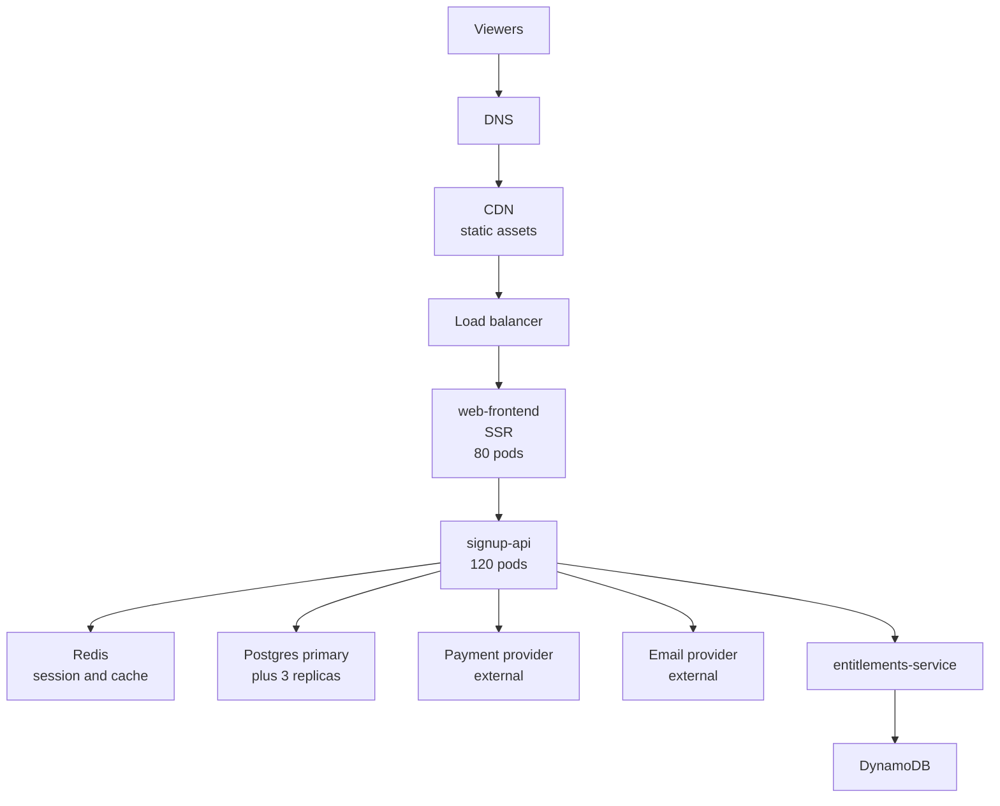
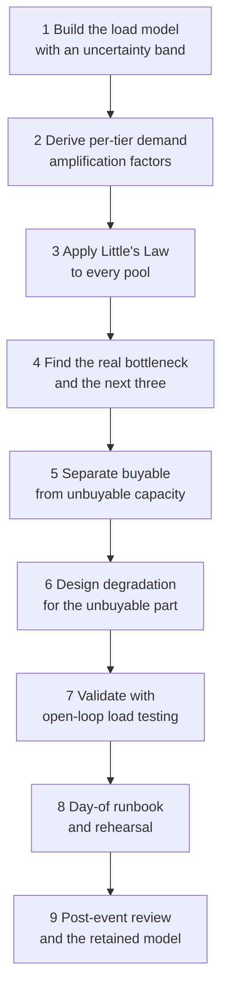
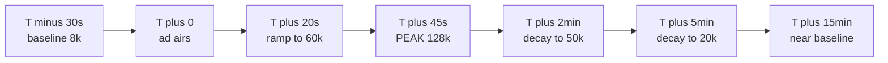
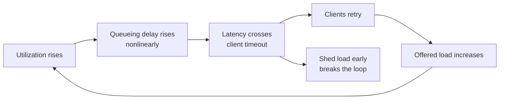
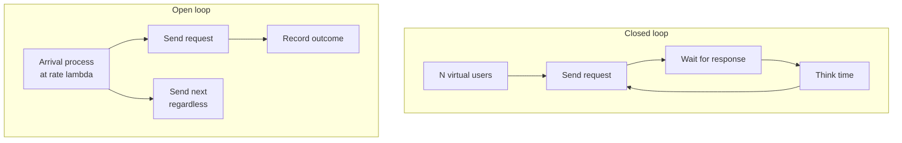
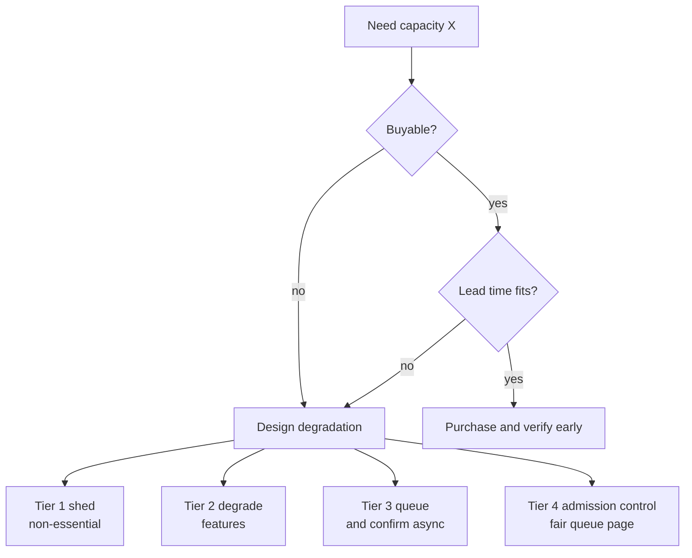

# S04 — Capacity Planning for a 10x Growth Event

<span class="pill pill-core">SRE Round</span>

**A dated, unavoidable event will deliver ten times your peak traffic in a 90-second window; the single hardest judgment call is that the bottleneck is almost never the app tier you can autoscale, and the constraint that actually breaks you usually cannot be fixed with money on the day.**

| | |
|---|---|
| **Commonly asked at** | Netflix, Meta, Stripe, Shopify, Amazon, Cloudflare, Datadog, DoorDash |
| **Time budget** | 45 min |
| **Core tension** | Provisioning for the P99 of an uncertain load estimate is ruinously expensive and still might not be enough, so the design must combine "buy some capacity" with "degrade gracefully past it" — and the degradation path is the part that gets skipped |
| **Prerequisites** | [F24 Capacity Planning](../fundamentals/f24-capacity-planning.md) · [F17 Rate Limiting & Load Shedding](../fundamentals/f17-rate-limiting-load-shedding.md) · [F18 Resilience Patterns](../fundamentals/f18-resilience-patterns.md) · [F04 Caching](../fundamentals/f04-caching.md) · [F12 Queues & Streams](../fundamentals/f12-queues-streams.md) · [F28 Cost Engineering](../fundamentals/f28-cost-engineering.md) · [F23 SLO & Error Budgets](../fundamentals/f23-slo-error-budgets.md) |

---

## 1. The Scenario As Given

> "We've bought a 30-second Super Bowl spot. It airs February 8th at approximately 20:35 Eastern, give or take four minutes. Marketing expects 10x our normal peak. The product is a subscription signup flow — land on the page, create an account, enter a card, start streaming. Plan the capacity. You have 45 minutes."



Facts supplied on request:

| Fact | Value |
|---|---|
| Current peak | 8,000 rps to `signup-api`, 20:00–22:00 weekdays |
| Current p50 / p99 latency | 40 ms / 250 ms |
| Mean service time (app) | 60 ms |
| App fleet | 120 pods, 4 vCPU each, 55% CPU at peak |
| Cache hit ratio | 94% steady state |
| Postgres | `db.r6g.8xlarge`, 32 vCPU, ~200 comfortable active backends |
| Payment provider | Contractual limit **2,000 requests/second**, p99 400 ms |
| Email provider | 500 messages/second, burst 2,000 for 60 s |
| Conversion | 4% of landing sessions complete a payment |
| Cloud quota | 2,000 vCPU in-region; current usage 1,100 |
| Last year's ad | Peaked at 6.2x normal, no ad the year before |
| Deploy freeze | Not yet declared |

!!! note "What the round is actually testing"
    Whether you can find the *real* constraint. Most candidates scale the app tier, declare victory, and never notice that the payment provider's contractual rate limit caps the business outcome at 2,000 signups per second regardless of how many pods exist. The round rewards: a load model with an uncertainty band rather than a point estimate, Little's Law applied to something other than the web tier, awareness of the utilization-latency knee, and a degradation plan for the capacity you cannot buy.

---

## 2. Clarifying Questions to Ask First

**The load model**

1. **What exactly is 10x — 10x of what baseline, measured at what granularity?** "10x peak" measured from 5-minute averages can understate the instantaneous peak by 3–5x. I need per-second data.
2. **What does the traffic *shape* look like, not just the magnitude?** A 30-second TV spot produces a spike with a ~20-second rise, a peak roughly 45 seconds after the spot ends, and an exponential decay with a half-life of about 90 seconds. Total incremental volume might be small; instantaneous rate is enormous. Those two facts lead to opposite designs.
3. **Is there historical data from a comparable event?** Last year's 6.2x is the single most valuable data point available and it sets the prior.
4. **Is the timing certain?** "20:35 give or take four minutes" means you cannot pre-warm at a precise second; you must hold a warm posture for at least 15 minutes.

**The success criterion**

5. **What is the business outcome we are protecting — completed signups, or page views?** If it is completed signups, and the payment provider caps us at 2,000/s, then the entire plan is about (a) getting to 2,000/s of payments and (b) making sure the other 78,000 rps of traffic does not prevent that.
6. **Is it acceptable to queue a signup and confirm asynchronously?** This single answer changes the design more than any provisioning decision, because it converts a hard rate ceiling into a latency problem.
7. **What can we degrade?** Personalized recommendations, A/B tests, analytics beacons, non-essential enrichment. Get the list agreed with product *before* the event, in writing.

**The constraints**

8. **What are the lead times on every capacity lever?** Cloud quota increases, reserved capacity, the payment provider's rate limit, a database instance resize that requires a failover.
9. **What third-party dependencies have their own limits, and have we told them?** Providers will often raise limits for a known event — but only with notice measured in weeks.
10. **What is the deploy-freeze policy and when does it start?** Most event-day outages are caused by changes, not by load.

!!! tip "Insist on per-second data in the first five minutes"
    "Before I model anything, I need our peak measured at 1-second resolution, not the 1-minute or 5-minute averages on the dashboard. Our autoscaler, our connection pools, and our rate limiters all operate on sub-second timescales, and averaging hides exactly the spikes that break them." Teams routinely discover their real instantaneous peak is 2–3x what they believed, and discovering it during a modelling exercise is dramatically cheaper than discovering it during the event.

---

## 3. Framework / Approach



### Step 1 — The load model is a distribution, not a number

Never plan to a point estimate. Produce three scenarios and state which one you are provisioning to.

### Step 2 — Amplification

One user-facing request is never one request. Build the fan-out table: per landing-page session, how many API calls, cache reads, database queries, and third-party calls. Multiply the load model through it. This is where 80,000 rps at the edge becomes a specific number at every tier.

### Step 3 — Little's Law at every pool

$$
L = \lambda W
$$

where $L$ is the number of items in the system, $\lambda$ is the arrival rate, and $W$ is the mean time each item spends in the system. Apply it to **every place where a finite number of somethings is held for a duration**: thread pools, connection pools, outbound HTTP client pools, in-flight request limits, queue depths. It is the only formula you need and it makes no assumptions about arrival distribution.

The inverted form is the one that finds bottlenecks:

$$
\lambda_{\max} = \frac{L_{\max}}{W}
$$

A pool of 200 database connections with a 12 ms hold time can serve at most 16,667 queries per second, *no matter what else you scale*.

### Step 4 — Find the bottleneck, then find the next three

Removing the first bottleneck reveals the second. Enumerate at least four, because during the event you will hit whichever one you did not fix.

### Step 5 — Buyable vs unbuyable

| Buyable with money and a week | Not buyable at any price |
|---|---|
| More pods (within quota) | A third party's contractual rate limit, on short notice |
| A larger database instance (with a failover window) | Physical inventory of a scarce instance type |
| More cache nodes | Your own cache *hit ratio* under a cold-start workload |
| Higher cloud quota (days to weeks) | The speed of light on a cross-region hop |
| CDN capacity | The time a human takes to notice and act |
| Reserved capacity blocks | Serial dependencies in your own critical path |

The unbuyable column is the design problem. The buyable column is a purchase order.

### Step 6 — Degradation design

Tiered load shedding, feature degradation, and queueing. Every tier has a trigger, an owner, and a tested kill switch.

### Step 7 — Validate with open-loop load generation

Closed-loop generators cannot measure overload. See [Deep Dive C](#c-load-testing-methodology-open-loop-or-dont-bother).

### Step 8 — Day-of runbook

Staffing, dashboards, decision authority, freeze windows, and a rehearsal.

### Step 9 — Keep the model

The artifact that survives the event is worth more than the event.

---

## 4. Worked Example

### 4.1 The load model with an uncertainty band

Inputs: last year's ad peaked at 6.2x. A competitor's comparable spot reportedly produced 11x. The creative this year has a QR code, which historically increases response by 40–80% relative to a URL-only spot. Marketing says 10x.

| Scenario | Multiplier | Peak rps at the edge | Rationale |
|---|---|---|---|
| P50 — expected | 8x | 64,000 | Last year 6.2x, adjusted up for the QR code |
| **P90 — provision to this** | **16x** | **128,000** | Competitor's 11x plus QR uplift; the tail of comparable events |
| P99 — shed above this | 24x | 192,000 | A viral secondary effect; not economically provisionable |

$$
\lambda_{\text{provisioned}} = 8{,}000 \times 16 = 128{,}000\ \text{rps at the edge}
$$

**Provision to P90, shed above it.** Provisioning to P50 means a coin flip on the most expensive 30 seconds of the year. Provisioning to P99 costs 50% more than P90 for a scenario you will probably not see, and — crucially — **it does not actually protect you**, because the P99 scenario will break the unbuyable constraints anyway. The correct posture is: buy to P90, and make the behaviour above P90 a designed, tested degradation rather than a collapse.

**The shape matters as much as the magnitude.**



Total incremental requests over the event:

$$
\int \lambda\,dt \approx 128{,}000 \times 45\text{s} \times 1.8\ \text{(decay tail factor)} \approx 1.04 \times 10^{7}\ \text{requests}
$$

Ten million requests is *nothing* — it is 20 minutes of normal traffic. **The event is not a volume problem, it is a rate problem.** That framing matters because it tells you which solutions work: queueing and async processing work brilliantly (the total work is small, it just arrives compressed); adding database storage does nothing; and autoscaling is far too slow, because a 45-second rise cannot be met by a control loop with a 3-minute reaction time.

$$
t_{\text{autoscale}} = t_{\text{metric}} + t_{\text{decision}} + t_{\text{schedule}} + t_{\text{pull}} + t_{\text{warm}} \approx 30 + 30 + 20 + 45 + 60 = 185\ \text{s}
$$

By the time reactive autoscaling delivers capacity, the peak is over and you have paid for pods that arrive in time to serve the decay. **Pre-provision. Scheduled scaling to the P90 fleet, 45 minutes before the spot, held for an hour.**

### 4.2 Amplification: what 128,000 rps means at each tier

Per landing session (one viewer who reaches the page):

| Tier | Calls per session | At 128,000 edge rps | Notes |
|---|---|---|---|
| CDN (static) | 24 | 3,072,000 rps | Fully offloaded; CDN's problem, but must be pre-warmed |
| `web-frontend` SSR | 1 | 128,000 rps | Can be made static and served from the CDN — do that |
| `signup-api` | 3.2 | 409,600 rps | Config fetch, availability check, form submit |
| Redis | 5.1 | 652,800 ops/s | Session, config, rate-limit counters |
| Postgres (at 94% hit) | 0.19 | 24,320 qps | **See the cold-cache analysis below** |
| Payment provider | 0.04 | **5,120 rps** | 4% conversion. Limit is 2,000. |
| Email provider | 0.04 | 5,120/s | Limit is 500/s, burst 2,000 |
| `entitlements-service` | 0.04 | 5,120 rps | Only on successful payment |

Two constraints are already visible without any further analysis: the payment provider at 2.6x its contractual limit, and email at 10x.

### 4.3 The cache hit ratio trap

The steady-state hit ratio of 94% is measured on a population of *returning* users hitting *warm* keys. A Super Bowl audience is overwhelmingly new users fetching keys that have never been cached: fresh sessions, new account records, uncached experiment assignments, and a plan-catalogue lookup whose per-region variants were not all warm.

Modelled hit ratio during the event: **60%**, and lower in the first 30 seconds.

Database load, steady state:

$$
\lambda_{\text{db}} = 8{,}000 \times 3.2 \times (1 - 0.94) = 1{,}536\ \text{qps}
$$

Database load during the event:

$$
\lambda_{\text{db}} = 128{,}000 \times 3.2 \times (1 - 0.60) = 163{,}840\ \text{qps}
$$

$$
\text{amplification} = \frac{163{,}840}{1{,}536} = 106.7\times
$$

!!! danger "The traffic went up 16x and the database load went up 107x"
    This is the single most commonly missed effect in capacity planning, and it is why "we have 45% CPU headroom" reasoning fails catastrophically. The miss ratio is a *multiplier on the multiplier*: traffic scales by $M$ and the miss ratio scales by $\frac{1-h_{\text{event}}}{1-h_{\text{steady}}}$, so database load scales by their product. Here: $16 \times \frac{0.40}{0.06} = 16 \times 6.67 = 106.7$. Any plan that does not model hit-ratio degradation is wrong by two orders of magnitude at the tier that is hardest to scale.

Mitigations, in order of effectiveness:

1. **Pre-warm what can be pre-warmed.** The plan catalogue, pricing, experiment configs, feature flags, and geo data are all small, shared, and knowable in advance. Load them into every cache node an hour before and pin them with a long TTL.
2. **Move the shared configuration out of the request path entirely.** Ship it to the pods as a file or an in-process cache refreshed on a timer. An in-process read is 100 ns; a Redis read is 400 µs; a Postgres read is 2 ms. For data that is identical for every user, the request path should never touch a network hop.
3. **Negative caching.** A signup flow checks "does this email already exist," which for new users is a miss every time and goes to the database. Cache the negative result. Better: use a Bloom filter in-process, which answers "definitely not present" for the overwhelming majority — see [F21](../fundamentals/f21-probabilistic-data-structures.md).
4. **Request coalescing / single-flight.** 128,000 simultaneous misses on the same key produce 128,000 database queries. A single-flight wrapper collapses them to one per pod per key. This alone prevents the classic cache-stampede death spiral.
5. **Read replicas for anything that tolerates staleness.** Three replicas absorb read load; writes still funnel to the primary.

With pre-warming, in-process config, and negative caching, the modelled event hit ratio rises to 89%:

$$
\lambda_{\text{db}} = 128{,}000 \times 3.2 \times (1 - 0.89) = 45{,}056\ \text{qps}
$$

Still 29x steady state, but now in the range where read replicas plus a pooler can plausibly cope.

### 4.4 Little's Law, applied four times

**(a) App-tier in-flight concurrency.**

$$
L = \lambda W = 128{,}000\ \text{rps} \times 0.060\ \text{s} = 7{,}680\ \text{concurrent requests}
$$

With 64 worker threads per pod, the concurrency requirement alone implies

$$
\frac{7{,}680}{64} = 120\ \text{pods}
$$

which the current fleet already satisfies — so **concurrency is not the app-tier constraint.** CPU is:

$$
\text{per-pod capacity at 100\% CPU} = \frac{8{,}000\ \text{rps}}{120\ \text{pods} \times 0.55} = 121\ \text{rps/pod}
$$

At a target utilization of 60% (justified in [Deep Dive B](#b-the-utilization-latency-knee)):

$$
\text{safe per-pod} = 121 \times 0.60 = 72.6\ \text{rps} \quad\Rightarrow\quad \frac{128{,}000}{72.6} = 1{,}763\ \text{pods}
$$

At 4 vCPU per pod that is 7,052 vCPU, against a regional quota of 2,000 with 1,100 already in use. **The cloud quota is a hard constraint and the quota-increase request is a lead-time item that must be filed today.**

**(b) Database connections.**

Each query holds a pooled connection for $W_{\text{db}} = 12$ ms.

$$
L_{\text{db}} = 45{,}056 \times 0.012 = 541\ \text{concurrent connections}
$$

The primary is comfortable with ~200 active backends (roughly $4 \times$ vCPU). Three replicas take the ~85% of queries that are reads, so the primary sees ~81 and each replica ~153 — feasible, but only through a transaction-mode pooler, because 1,763 pods $\times$ even a 5-connection pool is 8,815 connections, which would destroy the database on connection overhead alone.

Inverting Little's Law gives the ceiling:

$$
\lambda_{\max}^{\text{primary}} = \frac{200}{0.012} = 16{,}667\ \text{qps}
$$

So the write path must stay under 16,667 qps, and read routing to replicas is not an optimization — it is load-bearing.

**(c) The payment provider — the real constraint.**

Demand: 5,120 rps. Contractual limit: 2,000 rps.

To *enforce* 2,000 rps with a concurrency limiter rather than a token bucket (concurrency limiters degrade more gracefully and are harder to get wrong), Little's Law gives the permit count directly:

$$
L_{\text{permits}} = \lambda_{\text{target}} \times W_{\text{p99}} = 2{,}000 \times 0.400 = 800\ \text{concurrent permits}
$$

So the outbound HTTP client pool is sized to exactly 800, globally, across the fleet. Note the subtlety: **this must be a global limit, not per-pod.** $800/1{,}763 = 0.45$ permits per pod, which is not a number. The limiter must be centrally coordinated — a Redis-backed distributed semaphore, or a dedicated egress proxy tier that owns the connection pool.

**(d) The queue that absorbs the overflow.**

Excess demand: $5{,}120 - 2{,}000 = 3{,}120$ payments/second that cannot be processed synchronously. Over the 45-second peak plus the decaying tail (effective duration ~110 s at above-limit demand):

$$
Q_{\text{backlog}} = 3{,}120 \times 110 \approx 343{,}000\ \text{queued payment intents}
$$

Drain rate once demand falls below the limit — the provider allows 2,000/s and normal demand returns to ~320/s:

$$
R_{\text{drain}} = 2{,}000 - 320 = 1{,}680\ \text{per second}
$$

$$
t_{\text{drain}} = \frac{343{,}000}{1{,}680} \approx 204\ \text{s} \approx 3.4\ \text{minutes}
$$

**A user who signs up at peak waits up to 3.4 minutes for their payment to confirm.** That is a product decision, not an engineering one, and it must be made before the event: accept the account immediately, start the stream on a provisional entitlement, confirm payment asynchronously, and send the receipt by email when it clears. If product refuses async confirmation, then the hard ceiling is 2,000 signups/second and 61% of peak-moment visitors get an apologetic queue page — which is a far worse outcome and should be presented as the alternative.

Applying Little's Law to the queue itself to size worker concurrency: to sustain 2,000 payments/s with a 400 ms p99:

$$
L_{\text{workers}} = 2{,}000 \times 0.400 = 800\ \text{concurrent workers}
$$

which is the same 800 permits — the workers and the permits are the same resource, and recognizing that avoids double-provisioning.

### 4.5 The bottleneck ranking

| Rank | Resource | Ceiling | Demand at P90 | Ratio | Buyable? | Action |
|---|---|---|---|---|---|---|
| 1 | Payment provider rate limit | 2,000 rps | 5,120 rps | 2.6x | Partly — negotiate weeks ahead | Negotiate to 4,000; queue the remainder; async confirmation |
| 2 | Email provider | 500/s sustained | 5,120/s | 10.2x | Yes, cheaply | Raise the plan; queue and drain over 20 min; emails are not latency-sensitive |
| 3 | Cloud vCPU quota | 2,000 vCPU | 7,052 vCPU | 3.5x | Yes, with 2–3 weeks lead time | File the quota increase today; confirm in writing |
| 4 | Database read capacity | ~16,667 qps primary | 45,056 qps | 2.7x | Partly | Add 3 more replicas; route all reads off the primary; verify pooler capacity |
| 5 | Redis throughput | ~400k ops/s cluster | 652,800 ops/s | 1.6x | Yes | Add shards; move shared config in-process to cut demand |
| 6 | App tier CPU | 121 rps/pod | — | — | Yes, within quota | Pre-scale to 1,763 pods on a schedule |
| 7 | NAT gateway / SNAT ports | ~55k connections per NAT IP | 800 outbound permits, plus retries | Marginal | Yes | Additional NAT IPs; connection reuse; keepalive |
| 8 | Human reaction time | ~3 min to notice and act | 45 s event rise | — | **No** | Everything must be automatic or pre-armed; no decision may be on the critical path |

!!! example "The reframing to say out loud"
    "Scaling the app tier is the easy part and it is not the answer. The business outcome is completed signups, and the payment provider caps completed signups at 2,000 per second no matter what I do to my own infrastructure. So this plan has two halves: buy enough capacity that my own systems do not become the constraint, and design the experience so that the 3,120 signups per second above the provider's ceiling are *queued and confirmed asynchronously* instead of rejected. If we cannot do the second half, our ceiling is 2,000 per second and we should tell marketing that number now."

### 4.6 Cost check

| Item | Quantity | Duration | Cost |
|---|---|---|---|
| Pre-scaled app pods | 1,763 pods, 4 vCPU | 2 h | ~$1,400 |
| Additional read replicas | 3 × `db.r6g.4xlarge` | 1 week (warm-up + event + buffer) | ~$3,200 |
| Redis shards | +6 nodes | 1 week | ~$900 |
| Load-test environment | Full-scale clone | 3 × 6 h sessions | ~$4,100 |
| Email provider plan upgrade | Burst tier | 1 month | ~$2,000 |
| Engineering time | 4 engineers × 3 weeks | — | dominant cost |

Against a Super Bowl spot costing roughly $7 million for 30 seconds, an $11,600 infrastructure bill is a rounding error and you should say so — **the cost conversation for a known event is about lead time, not money.** The genuinely expensive item is the engineering time, and the genuinely scarce item is the three weeks of calendar needed for quota increases and vendor negotiations.

---

## 5. Deep Dives

### A. Building the load model from history

Three independent methods; if they disagree by more than 2x, you do not understand the event.

| Method | How | Strength | Weakness |
|---|---|---|---|
| **Analogue events** | Find the closest prior event — last year's ad, a competitor's spot, a product launch — and scale by audience and creative differences | Grounded in reality | There may be only one analogue, and $n=1$ |
| **Funnel model** | Start from the audience (~115 M viewers), apply a response rate (0.05–0.15% for a TV spot with a QR code), spread over the response curve | Decomposes into individually-checkable assumptions | Response rate is the whole answer and it spans 3x |
| **Capacity-first inversion** | Ask what load the system can survive, and work backwards to what response rate that implies | Immediately actionable | Tells you your limit, not the demand |

Funnel arithmetic, to do on the board:

$$
115\times10^{6}\ \text{viewers} \times 0.0010\ \text{response} = 115{,}000\ \text{responders}
$$

Spread over the response curve, with roughly 40% arriving in the first 60 seconds:

$$
\lambda_{\text{peak}} \approx \frac{115{,}000 \times 0.40}{60\ \text{s}} \times 1.6\ \text{(peakiness within the minute)} \approx 1{,}230\ \text{sessions/s}
$$

At 3.2 API calls per session plus the 8,000 rps baseline:

$$
1{,}230 \times 3.2 \times \underbrace{4.4}_{\text{calls incl. retries, polling, assets not on CDN}} + 8{,}000 \approx 25{,}300\ \text{rps}
$$

Which is substantially *below* the 128,000 rps from the multiplier method — and that disagreement is the most useful thing in this section. It means one of the two models is wrong, and the resolution matters:

- The multiplier method anchors on "10x peak," where peak is a 5-minute average that already smooths the spike.
- The funnel method's sensitivity is entirely in the response rate: at 0.3% instead of 0.1%, it gives 76,000 rps.

**Resolution: use the funnel model for the central estimate and the multiplier method for the tail, provision to the higher of the two at P90, and state the assumption that drives it.** Then instrument so that during the event you can see the actual response rate within 10 seconds and know immediately which branch of the model you are on.

!!! gotcha "Your recorded peak is a lie because of averaging"
    Symptom: "we peaked at 8,000 rps" and then a 12,000 rps burst causes an outage that the dashboards never show. Mechanism: a 1-minute average of a workload with 5-second bursts understates the instantaneous rate by 2–3x; a 5-minute average by 3–5x. Every rate limiter, connection pool, and queue in your system reacts on sub-second timescales, so they experience the instantaneous rate, not the average. Mitigation: record at 1-second (or 10-second) resolution for the metrics that drive capacity decisions, and report peak as a high percentile of the per-second series, not as the maximum of the per-minute series.

### B. The utilization-latency knee

The intuition that 55% CPU means "we have 45% headroom, so we can take 1.8x traffic" is wrong, and the reason is queueing. For an M/M/1 approximation, the mean response time at utilization $\rho$ with service time $S$ is

$$
W = \frac{S}{1 - \rho}
$$

so the latency multiplier relative to an unloaded system is $\frac{1}{1-\rho}$:

| Utilization $\rho$ | Latency multiplier $\frac{1}{1-\rho}$ | p99 behaviour |
|---|---|---|
| 0.50 | 2.0 | Comfortable |
| 0.60 | 2.5 | Comfortable |
| 0.70 | 3.3 | Noticeable |
| 0.80 | 5.0 | p99 degrading fast |
| 0.85 | 6.7 | Timeouts begin |
| 0.90 | 10.0 | Retries amplify; often unstable |
| 0.95 | 20.0 | Collapse |
| 0.99 | 100.0 | Not a real operating point |

Two consequences you must state:

1. **Usable headroom is nowhere near the arithmetic headroom.** Going from $\rho = 0.55$ to $\rho = 0.90$ is 1.64x more traffic and 4.4x worse latency. If the latency SLO is a 2x margin, your real headroom from 55% is to roughly 70% — about 27% more traffic, not 82%.
2. **The knee moves against you under retries.** When latency crosses the client timeout, clients retry, which *adds* load exactly when the system is saturated. That converts a smooth degradation into a positive-feedback collapse. This is why load shedding must trigger well before saturation, and why retries need budgets and circuit breakers — see [F18](../fundamentals/f18-resilience-patterns.md).



**Target utilization for this event: 60%.** Justification: a 2.5x latency multiplier keeps p99 within the SLO, it leaves room for the instantaneous peaks that per-minute averages hide, and it leaves room for the *variance* between pods — a fleet averaging 60% has pods at 80%, because load balancing is never perfect and some pods get expensive requests.

!!! gotcha "The fleet average hides the pods that are already saturated"
    Symptom: fleet CPU shows 60% and a meaningful fraction of requests are timing out. Mechanism: request cost is heterogeneous and load balancing is imperfect, so the utilization distribution across pods has a long right tail — a 60% mean routinely means a p95 pod at 85%. Users hit specific pods, not averages. Mitigation: alert on the *high percentile* of per-pod utilization, not the mean; use least-outstanding-requests load balancing rather than round-robin so expensive requests do not pile onto one pod; and set the target from the p95 pod, not the mean.

### C. Load testing methodology: open-loop, or don't bother

**Closed-loop** generators maintain a fixed number of virtual users; each sends a request, waits for the response, thinks, and sends the next. **Open-loop** generators send requests at a specified arrival rate regardless of whether previous requests have completed.



**The problem with closed-loop is coordinated omission.** When the system under test slows down, a closed-loop generator automatically slows down with it — it cannot send request $n+1$ until request $n$ returns. So:

- The **offered load silently drops** exactly when you most want to know what happens under sustained overload. You never measure the overload regime at all.
- The **latency figures are systematically optimistic**, because the requests that *would* have arrived during the slow period were never sent, and those are precisely the ones that would have experienced the worst queueing.
- **The failure mode you are trying to find is invisible by construction.** Real users do not wait for your response before pressing the button again; 115 million TV viewers reaching for their phones are an arrival process, not a feedback loop.

Concretely: a closed-loop test with 5,000 virtual users against a system whose response time degrades from 60 ms to 600 ms will report a throughput drop from 83,000 rps to 8,300 rps and a p99 of 600 ms — and will conclude the system is "slow but stable." An open-loop test at a fixed 83,000 rps against the same system will show the queue growing without bound, latency climbing until timeouts, and complete collapse — which is what would actually happen.

| | Closed-loop | Open-loop |
|---|---|---|
| Control variable | Concurrency (virtual users) | Arrival rate |
| Models | Users who wait, internal RPC with bounded callers | Independent external arrivals — TV ads, push notifications, viral events |
| Behaviour under overload | Self-throttles; hides the cliff | Queue grows; exposes the cliff |
| Latency measurement | Subject to coordinated omission | Honest |
| Typical tools | JMeter, Locust (default mode), `ab` | `wrk2`, Vegeta, Gatling in open-workload mode, k6 with constant-arrival-rate |
| Correct use here | Capacity of an internal service with a fixed caller pool | **Everything about this event** |

**The test plan:**

| # | Test | Method | Answers |
|---|---|---|---|
| 1 | Single-pod ceiling | Open-loop ramp against one pod until it breaks | Exact rps/pod and the shape of degradation past the knee |
| 2 | Fleet linearity | Ramp with 10, 100, 500 pods | Whether scaling is linear or whether a shared resource saturates first |
| 3 | Spike test | Step from 8,000 to 128,000 rps in 20 seconds | Whether the system survives the *shape*, not just the magnitude — connection establishment, TLS handshakes, cold JIT, pool growth |
| 4 | Cold-cache test | Flush caches, then run the spike | The real hit ratio and the real database load |
| 5 | Dependency-failure test | Spike with the payment provider returning 429s | Whether the limiter, queue, and degradation path work under load |
| 6 | Sustained soak | P50 load for 2 hours | Memory leaks, connection leaks, disk fill, log volume |
| 7 | Shed-tier validation | Ramp past P90 to P99 | That each shedding tier engages at the right threshold and in the right order |

!!! warning "Test the spike shape, not just the peak magnitude"
    A system that comfortably serves 128,000 rps after a gentle ramp can die on a 20-second rise to the same rate. The transient costs are invisible at steady state: TLS handshakes (full handshakes, not resumptions, because these are new clients), connection pool growth, DNS lookups, JIT warm-up, cold page caches, and autoscaler thrash. Test 3 is the one that finds the real problems, and it is the one most commonly skipped because it is harder to set up.

### D. Lead-time constraints and what to do when you cannot buy your way out



**Lead times, measured not assumed:**

| Lever | Typical lead time | Failure mode if left late |
|---|---|---|
| Cloud vCPU / instance quota increase | 2 days to 3 weeks, and it can be *denied* | You discover at T-2 days that you cannot launch the pods |
| Scarce instance type inventory in one AZ | Not guaranteed at any price | Scheduled scaling fails at T-45 min with `InsufficientInstanceCapacity` |
| Capacity reservation / on-demand block | Days; must be reserved per AZ and per type | Same, but preventable |
| Third-party rate limit increase | 2–6 weeks; contractual, may require a plan change | The hard ceiling stands |
| Database instance resize | Requires a failover window, plus days of soak | You resize at T-1 day and discover a regression |
| Kafka partition increase | Minutes to apply, but rebalancing takes hours and changes key ordering | Consumer lag explosion during the event |
| CDN pre-warm and capacity notice | 1–2 weeks with the provider | The CDN shapes you |
| TLS certificate / new hostname | Days | A queue-page hostname that does not resolve |
| DNS TTL reduction | Must be done ≥ old TTL in advance | You cannot steer traffic on the day |
| Getting product sign-off on degradation | Weeks — it is a human process | You degrade without permission, or you do not degrade |

**When you cannot buy it — the degradation ladder.** Each tier has a numeric trigger, a mechanism, an owner, and a pre-tested kill switch.

| Tier | Trigger | What happens | User impact | Mechanism |
|---|---|---|---|---|
| 0 | Always on | Analytics beacons sampled at 1%, all non-critical async work deferred to a queue | None | Config flag, set at T-1 h |
| 1 | Edge rps > 70,000 | Personalization, recommendations, A/B assignment disabled; static defaults served | Generic page instead of personalized | Flag; pre-tested |
| 2 | Edge rps > 100,000 **or** DB p99 > 50 ms | Non-essential reads served from stale cache with extended TTL; search disabled; account-history endpoints return 503 with retry | Some pages unavailable; core signup works | Flag + cache TTL override |
| 3 | Payment queue depth > 50,000 | Payment confirmation becomes fully asynchronous; provisional entitlement granted; receipt emailed later | Signup succeeds immediately, receipt arrives in minutes | Requires product sign-off, pre-agreed |
| 4 | Edge rps > 150,000 **or** app p99 > 2 s | Admission control: a fair-queue waiting-room page served from the CDN with a position estimate; admitted at the rate the system can absorb | Some users wait, with an honest ETA | Edge worker; **must be load-tested** |
| 5 | Catastrophic | Static "we're overwhelmed, try again in a few minutes" page from the CDN | Full outage for new sessions; existing sessions unaffected | Last resort; preserves the brand better than a timeout |

Two principles about the ladder:

- **Shedding must happen at the edge, not in the app.** A request rejected after it has consumed a thread, a connection, and a database query has cost you nearly as much as a successful one. Reject at the CDN or the load balancer, where a rejection costs microseconds. See [F17](../fundamentals/f17-rate-limiting-load-shedding.md).
- **Shed by priority, not randomly.** A user who has already entered card details is far more valuable than one who just landed. Carry a priority token through the request and shed the lowest tier first. Random shedding at 30% means 30% of nearly-complete signups die, which is the worst possible allocation.

!!! example "The waiting room is a feature, not a failure"
    A well-built waiting room with an honest position and ETA converts an outage into a queue, and queues are socially acceptable in a way that error pages are not. Ticketing and console-launch companies have made this standard practice. The requirements are specific: it must be served entirely from the edge with zero origin dependency, it must admit at a rate the origin can actually absorb (measured, not guessed), it must be *fair* (FIFO by arrival, with a signed token so it cannot be gamed by refreshing), and it must have been load-tested itself — a waiting room that collapses under load is worse than no waiting room at all.

### E. The day-of runbook

**Staffing.** Not "everyone on a call" — that is how decisions do not get made.

| Role | Count | Responsibility |
|---|---|---|
| Incident commander | 1 (+1 backup) | Sole authority to invoke shed tiers 3–5; runs the call; makes no technical changes |
| Service on-call | 1 per critical service (4 total) | Own their service's dashboards and kill switches |
| Database engineer | 1 | Connection pools, replica lag, slow queries; authority to kill queries |
| Traffic / edge engineer | 1 | CDN, WAF, shed tiers 1–2, waiting-room activation |
| Vendor liaison | 1 | Live channel open with the payment and email providers |
| Comms | 1 | Status page, social, exec updates on a fixed cadence |
| Scribe | 1 | Timestamped log of every action, for the post-event review |

**Timeline:**

| Time | Action |
|---|---|
| T-14 days | **Change freeze begins.** Only reverts and security patches |
| T-7 days | Final full-scale open-loop load test; all shed tiers exercised; go/no-go review |
| T-3 days | Vendor confirmations in writing; quota confirmations verified by actually launching instances |
| T-1 day | Full dress rehearsal: pre-scale, run synthetic spike, invoke and revert each shed tier |
| T-3 h | Pre-scale begins: app fleet to 1,763 pods; verify every pod is healthy and receiving traffic |
| T-2 h | Cache pre-warm job runs; verify hit ratio on the warmed key classes |
| T-90 min | War room opens; every dashboard on a shared screen; roll call |
| T-60 min | Final go/no-go; freeze confirmed; kill switches verified one by one |
| T-45 min | Scheduled scaling for the database read replicas and Redis complete and verified under synthetic load |
| T-10 min | Silence non-event alerts; raise event-specific alert thresholds; confirm paging works |
| **T-0** | Ad airs. **Nobody touches anything for 90 seconds unless a shed tier trigger fires.** |
| T+90 s | First assessment: which model branch are we on; actual vs predicted at every tier |
| T+5 min | Decide whether to hold, scale further, or begin de-escalating shed tiers |
| T+30 min | Begin scale-down if traffic has normalized; drain the payment queue; verify the backlog cleared |
| T+2 h | Stand down; freeze remains until T+24 h |
| T+3 days | Post-event review |

**The 90-second rule is the most important line in the runbook.** The event's rise takes 45 seconds and the decay begins immediately. Any human intervention decided at T+30 s lands at T+3 min, by which time the situation is different. Everything that must happen inside the event window must be automatic and pre-armed. Humans are there to handle what the automation did not anticipate, and to decide whether to invoke the tiers the automation is not allowed to invoke on its own.

**Kill switches — each verified working at T-60 min:**

```yaml
# Every one of these is a config flag, changeable in under 5 seconds,
# with no deploy. Each was exercised in the T-1 day rehearsal.
kill_switches:
  - id: personalization_off          # shed tier 1
    owner: edge
    verified_at: "T-60m"
  - id: recommendations_off          # shed tier 1
    owner: edge
  - id: search_off                   # shed tier 2
    owner: service-oncall
  - id: stale_cache_extended_ttl     # shed tier 2
    owner: service-oncall
  - id: payment_async_mode           # shed tier 3, IC authority only
    owner: incident-commander
  - id: waiting_room_enable          # shed tier 4, IC authority only
    owner: incident-commander
  - id: static_overwhelmed_page      # shed tier 5, IC authority only
    owner: incident-commander
  - id: email_defer_all              # always safe
    owner: service-oncall
```

---

## 6. What Can Go Wrong

| Risk | Detection | Mitigation |
|---|---|---|
| Cache hit ratio collapses; database load rises 100x not 10x | Hit ratio per key class on the dashboard; DB qps vs model | Pre-warm shared keys; move config in-process; negative caching; single-flight coalescing; extra read replicas |
| Reactive autoscaling is 3 minutes too slow | Pod count vs offered load on one panel | Pre-scale on a schedule 3 hours ahead; hold for an hour; never rely on reactive scaling for a known spike |
| Cloud quota or instance inventory unavailable at scale-up time | Attempt the full scale-up during the T-1 day rehearsal | Quota increase filed weeks ahead; capacity reservations per AZ; a tested fallback instance type |
| Third-party rate limit caps the business outcome | Provider 429 rate; queue depth | Negotiate weeks ahead; global concurrency limiter sized by Little's Law; async confirmation with a drain plan |
| Retry storm turns degradation into collapse | Retry rate as a share of total requests; ratio of attempts to distinct requests | Retry budgets, exponential backoff with jitter, circuit breakers, and shed *before* the knee not after |
| Connection pool exhaustion between tiers | Pool wait time p99, rejected-acquire counter | Size every pool from $L = \lambda W$; pre-establish connections during warm-up; alert on pool wait, not just pool size |
| Load test used a closed-loop generator and validated nothing | Review the tool's workload model before trusting any result | Open-loop / constant-arrival-rate generators only; verify offered load equals intended load in the test output |
| Peak measured from per-minute averages; real instantaneous peak is 3x | Compare 1-second and 1-minute series side by side | Capacity metrics at 1-second resolution; report peak as a percentile of the per-second series |
| Fleet average utilization hides saturated pods | p95 of per-pod utilization | Least-outstanding-requests balancing; target set from the p95 pod; alert on the tail |
| A change deployed during the event causes the outage | Deploy audit log on the war-room screen | 14-day freeze; enforced in CI, not by convention; reverts always allowed |
| Shed tiers never tested; they fail when invoked | Rehearsal at T-1 day exercising every tier | Every kill switch exercised in production-like conditions and verified again at T-60 min |
| Waiting room itself collapses | Load test the waiting room at P99 load | Serve it entirely from the edge with zero origin dependency; static assets; signed tokens |
| Alert storm makes the war room unusable | Alert volume during the rehearsal | Silence non-event alerts at T-10 min; raise thresholds to event levels; a single event dashboard as the source of truth |
| Payment queue drains too slowly; users abandon | Queue depth and projected drain time on the dashboard | Compute drain time in advance; if unacceptable, negotiate a higher limit or reduce the queued population via admission control |
| Logging and metrics volume saturates the observability pipeline | Ingest rate vs pipeline capacity; dropped-sample counter | Sample logs aggressively at tier 0; pre-scale the observability pipeline too — it is part of the system |
| NAT gateway SNAT port exhaustion on outbound calls | Port allocation errors; connection failures to third parties | Multiple NAT IPs; aggressive connection reuse and keepalive; an egress proxy tier with a managed pool |
| Success: 10x signups arrive and downstream batch systems break next morning | Model the *downstream* consequences too | Capacity-plan the async pipeline, the email drain, the entitlements writes, and the next-day ETL |

---

## 7. The Artifact You'd Produce

```text
+---------------------------------------------------------------------------+
| EVENT CAPACITY PLAN: Super Bowl spot, Feb 8 20:35 ET +/- 4 min            |
+---------------------------------------------------------------------------+
| LOAD MODEL      P50 8x = 64k rps | P90 16x = 128k rps | P99 24x = 192k     |
|   PROVISION TO  P90. Shed above it. Point estimates are not plans.         |
|   SHAPE         20 s rise, peak at T+45 s, half-life 90 s, ~10 M total req |
|   => rate problem, not volume problem. Queueing works. Autoscaling doesn't.|
+---------------------------------------------------------------------------+
| LITTLE'S LAW    L = lambda * W                                             |
|   app in-flight    128k * 0.060 s  = 7,680  -> 120 pods by concurrency     |
|   app by CPU       128k / 72.6     = 1,763 pods at 60% target  <- binds    |
|   db connections   45k  * 0.012 s  = 541 across primary + 3 replicas       |
|   db ceiling       200 / 0.012     = 16,667 qps on primary  <- route reads |
|   payment permits  2,000 * 0.400 s = 800 GLOBAL concurrent permits         |
|   queue backlog    3,120 * 110 s   = 343k intents, drains in 3.4 min       |
+---------------------------------------------------------------------------+
| CACHE            steady 94% -> event 60% cold                              |
|   db load scales 16x * (0.40/0.06) = 106.7x, NOT 16x                       |
|   after prewarm + in-process config + negative cache: 89% -> 29x           |
+---------------------------------------------------------------------------+
| UTILIZATION      target 60%. 1/(1-rho): 0.6->2.5x  0.8->5x  0.9->10x       |
|   45% "headroom" at rho=0.55 is really ~27% before the SLO breaks          |
+---------------------------------------------------------------------------+
| BOTTLENECKS      1 payment 2.6x  2 email 10.2x  3 vCPU quota 3.5x          |
|                  4 db reads 2.7x  5 redis 1.6x  6 app CPU  7 NAT  8 humans |
+---------------------------------------------------------------------------+
| UNBUYABLE        payment limit on short notice | cold-cache hit ratio       |
|                  instance inventory | human reaction time                  |
|   => SHED LADDER  0 always  1 >70k  2 >100k  3 queue depth >50k            |
|                   4 >150k waiting room  5 catastrophic static page         |
+---------------------------------------------------------------------------+
| TESTING          OPEN LOOP ONLY. Closed-loop self-throttles and hides the  |
|                  cliff via coordinated omission. Test the SHAPE not just   |
|                  the magnitude. Cold-cache spike test is mandatory.        |
+---------------------------------------------------------------------------+
| DAY OF   T-14d freeze | T-7d full test | T-1d rehearse every kill switch   |
|          T-3h prescale | T-2h prewarm | T-60m verify switches | T-10m mute |
|          T-0 NOBODY TOUCHES ANYTHING FOR 90 SECONDS                        |
|          IC has sole authority for tiers 3-5                               |
+---------------------------------------------------------------------------+
| KEEP     per-tier capacity model, rps/pod, L=lambda*W table, actual vs     |
|          predicted, and the response rate. This is the asset.             |
+---------------------------------------------------------------------------+
```

### The capacity model to retain

The most valuable output of the whole exercise is a reusable model, not a one-off spreadsheet. Check it into the repository next to the service.

```yaml
# capacity/signup-api.yaml — reviewed quarterly, updated after every event
service: signup-api
last_validated: 2026-02-08          # the Super Bowl event
validation_method: open_loop_load_test + production_event

unit_costs:
  rps_per_pod_at_100pct_cpu: 121     # measured, single-pod open-loop ramp
  target_utilization: 0.60           # 2.5x latency multiplier, p95-pod basis
  rps_per_pod_safe: 72.6
  mean_service_time_s: 0.060
  db_connection_hold_s: 0.012
  payment_call_p99_s: 0.400

amplification_per_session:
  api_calls: 3.2
  redis_ops: 5.1
  db_queries_at_steady_hit: 0.19
  db_queries_at_cold_hit: 1.28
  payment_calls: 0.04

cache:
  steady_hit_ratio: 0.94
  cold_event_hit_ratio: 0.60         # observed, pre-mitigation
  mitigated_event_hit_ratio: 0.89    # observed, post-prewarm

hard_ceilings:
  payment_provider_rps: 2000         # contractual; 6 weeks to change
  email_provider_sustained: 500
  db_primary_qps: 16667              # 200 backends / 12 ms
  regional_vcpu_quota: 2000          # request increases 3 weeks ahead

observed_2026_02_08:
  predicted_peak_rps: 128000
  actual_peak_rps: 71400             # 8.9x, between P50 and P90
  actual_cache_hit_ratio: 0.86
  actual_response_rate: 0.00062      # funnel model input for next time
  shed_tiers_engaged: [0, 1]
  payment_queue_max_depth: 41200
  payment_queue_drain_s: 118
  slo_burn: 0.4x                     # no budget impact
```

### The post-event review

Run it within 72 hours, blameless, and structured around the *model*, not the incident (there may not have been one):

| Question | Why it matters |
|---|---|
| Predicted vs actual at every tier — with the ratio | Calibrates the model for next time; a consistent 1.8x over-prediction is itself useful |
| Which bottleneck did we actually hit first? | Usually not the one ranked first; ranking errors are the most valuable lesson |
| What was the real cache hit ratio, per key class? | The single hardest parameter to predict and the one with the largest leverage |
| What was the response rate? | The key input to the funnel model, and now you have a measured value instead of a range |
| Which shed tiers engaged, at what time, and did they behave as designed? | Untested tiers are the ones that fail; now some are tested |
| What did we over-provision, and by how much? | Money, but more importantly: over-provisioning hides bottlenecks you will meet later at lower cost of discovery |
| What lead-time item was closest to being missed? | Process fix, not a technical one |
| What would have happened at 24x? | The counterfactual that sizes next year's plan |

---

## 8. Gotchas & Corner Cases

!!! gotcha "Traffic goes up 16x and database load goes up 107x"
    Symptom: the app tier is comfortable at 60% CPU and the database is on fire. Mechanism: cache hit ratio falls from 94% to 60% because the event population is new users fetching uncached keys; database load scales as $M \times \frac{1-h_{\text{event}}}{1-h_{\text{steady}}}$, so $16 \times 6.67 = 106.7$. Mitigation: model the event hit ratio explicitly, pre-warm shared keys, move truly-shared config in-process where a read is 100 ns instead of 2 ms, cache negative lookups, and use single-flight coalescing so 128,000 simultaneous misses on one key produce one query rather than 128,000.

!!! gotcha "Autoscaling is three minutes too slow for a forty-five-second spike"
    Symptom: the HPA scales correctly and the pods arrive after the peak has passed. Mechanism: metric scrape + evaluation + scheduling + image pull + warm-up sums to roughly 185 seconds; the spike rises in 45 s and decays with a 90 s half-life. Mitigation: for *known* events, pre-scale on a schedule hours ahead and hold. Reactive autoscaling is for unknown, gradual load. Also: over-provision the warm-up itself — pods that are `Ready` but have cold JIT, empty connection pools, and cold caches serve at a fraction of steady-state capacity for the first minute.

!!! gotcha "Closed-loop load testing proves the system is fine and it is not"
    Symptom: the test reported p99 of 600 ms with no errors at "83,000 rps"; the real event collapsed at 40,000. Mechanism: coordinated omission — a closed-loop generator cannot send the next request until the previous returns, so as the system slows the offered load silently drops and the overload regime is never exercised. The reported latency excludes exactly the requests that would have queued worst. Mitigation: open-loop generators only (`wrk2`, Vegeta, Gatling open workload, k6 constant-arrival-rate), and verify in the output that actual offered load matched intended load — if it did not, the tool self-throttled and the result is meaningless.

!!! gotcha "You have 45% CPU headroom and roughly 27% of usable capacity"
    Symptom: scaling traffic to what the arithmetic headroom suggests produces timeouts. Mechanism: queueing delay grows as $\frac{1}{1-\rho}$, so moving from 55% to 90% utilization is 1.64x traffic but 4.4x latency. Mitigation: define target utilization from the latency multiplier your SLO tolerates, not from "how close to 100% can we get." For a 2.5x tolerance, target 60%. And derive the target from the p95 pod's utilization, not the fleet mean, because users hit specific pods.

!!! gotcha "The bottleneck is a third party's contract, and no amount of money on the day fixes it"
    Symptom: every internal system is healthy, and signups cap at exactly 2,000 per second. Mechanism: a contractual rate limit enforced by the provider's edge; raising it requires a commercial conversation with weeks of lead time. Mitigation: inventory every external dependency's limit during planning; negotiate increases 6+ weeks ahead in writing; enforce your own limit *below* theirs with a globally-coordinated concurrency limiter so you degrade gracefully instead of being hard-rejected; and design the async/queued path so the ceiling becomes a latency cost rather than a failure.

!!! gotcha "The rate limiter is per-pod, so the global rate is pods times the limit"
    Symptom: the provider 429s you despite a configured limit that should be safe. Mechanism: a token bucket configured "2,000 rps" in each of 1,763 pods permits 3.5 M rps globally. Mitigation: limits that must hold globally must be coordinated globally — a Redis-backed distributed semaphore, or a dedicated egress proxy tier that owns the connection pool. Little's Law gives the permit count directly: $800 = 2{,}000 \times 0.4$, and 800 permits cannot be meaningfully divided across 1,763 pods, which is the tell that it must be centralized.

!!! gotcha "Measured peak is a per-minute average and understates the truth by 3x"
    Symptom: capacity was planned against 8,000 rps and the system saw 24,000 rps bursts it had never recorded. Mechanism: dashboards average over 1 or 5 minutes; connection pools, rate limiters, and queues experience the instantaneous rate. Mitigation: record capacity-relevant metrics at 1-second resolution and report peak as a high percentile of the per-second series. Do this before modelling, because every downstream number depends on it.

!!! gotcha "Retries turn a 2x overload into a 6x overload"
    Symptom: offered load keeps climbing after the ad ends, and the system will not recover even as real user demand falls. Mechanism: latency crossed the client timeout, clients retried, retries added load, latency rose further — a positive feedback loop. With three retries the amplification is up to 4x, and it is *self-sustaining* because the system's own slowness generates the load. Mitigation: retry budgets (a hard cap on retries as a fraction of total requests), exponential backoff with full jitter, circuit breakers that open fast, and — most important — shed load *before* the knee rather than after, because once the loop starts, shedding must overshoot to break it.

!!! gotcha "Shedding happens in the application, so a rejected request costs almost as much as a served one"
    Symptom: shedding 40% of traffic barely reduces resource consumption. Mechanism: the request was accepted at the LB, consumed a worker thread, authenticated, fetched a session from Redis, and *then* was rejected. It cost 80% of a successful request. Mitigation: shed at the outermost possible layer — the CDN or edge — where a rejection costs microseconds and no origin resource. Push the shed decision outward: if the edge can decide from a header or a cookie, it should.

!!! gotcha "Random shedding kills the users closest to converting"
    Symptom: shed 30% of traffic and lose 30% of completed signups, including people who had already entered card details. Mechanism: uniform random shedding has no notion of value; a request at step 5 of the funnel is discarded at the same rate as a bot at step 0. Mitigation: carry a priority signal through the request — authenticated over anonymous, mid-funnel over landing, retry over first attempt — and shed strictly in priority order. The same 30% shed with priority ordering can cost under 5% of completed signups.

!!! gotcha "Every kill switch is untested and two of them do not work"
    Symptom: at T+40 s the IC calls for tier 2 and the flag has no effect, because the config key was renamed six weeks ago. Mechanism: shed tiers are written during planning and never exercised, because exercising them in production feels risky. Mitigation: a full dress rehearsal at T-1 day where every switch is flipped on and off in production under synthetic load, plus a verification pass at T-60 min. A switch that has never been flipped in production is a hypothesis, and the event is a terrible time to test a hypothesis.

!!! gotcha "The observability pipeline is part of the system and nobody scaled it"
    Symptom: at peak, dashboards go blank and the war room is blind at the exact moment it matters. Mechanism: 16x traffic generates 16x logs, metrics, and traces; the ingestion pipeline was sized for steady state and starts dropping, or the metrics backend's query latency explodes because everyone is refreshing the same dashboard. Mitigation: pre-scale the observability pipeline too; aggressively sample logs and traces from tier 0 onward; pre-render the event dashboard on a fixed refresh rather than 20 people running ad-hoc queries; and have a minimal fallback dashboard that queries pre-aggregated recording rules only.

!!! gotcha "A change deployed during the event causes the outage, not the load"
    Symptom: the postmortem's root cause is a config change made at T-20 min "to be safe." Mechanism: humans under pressure make changes; a freeze that exists only as a written norm is not a freeze. Mitigation: enforce the freeze in the pipeline — CI refuses to deploy during the window except for an explicitly-flagged revert — display the deploy audit log on the war-room screen, and make "no changes" the default state that requires IC authorization to break.

!!! gotcha "The event succeeds and the next morning breaks"
    Symptom: the spike is handled perfectly, and at 06:00 the nightly ETL fails, the welcome-email queue is 400,000 deep, and the entitlements reconciliation job times out. Mechanism: capacity planning stopped at the synchronous request path; the downstream consequences of 400,000 new accounts were never modelled. Mitigation: extend the model through every downstream system — email drain rate and its provider limit, the analytics pipeline, the nightly batch window, the support ticket volume, and next month's bill. Success has a capacity cost too, and it arrives after everyone has gone home.

---

## 9. Interview Angle

!!! interview "What the interviewer is scoring"
    (1) Did you produce a load model with an uncertainty band and say which percentile you provision to? (2) Did you apply Little's Law to something other than the web tier — a connection pool, an outbound permit pool, a queue? (3) Did you find the non-obvious bottleneck (the third-party limit, the cache hit ratio) rather than scaling the app tier? (4) Do you know why closed-loop load testing is invalid here? (5) Is there a degradation plan for the capacity you cannot buy, with numeric triggers?

!!! interview "Apply Little's Law three times, out loud, to different things"
    $L = \lambda W$ is the most reusable formula in this round and most candidates use it once, on request concurrency, and stop. Use it to size the thread pool, then the database connection pool, then the outbound third-party permit pool, then invert it to find the ceiling: $\lambda_{\max} = L_{\max}/W$. That inversion — "200 connections at 12 ms each is 16,667 qps, full stop" — is how you find bottlenecks analytically instead of by guessing.

!!! interview "Say the sentence about cache hit ratio"
    "Traffic scales 16x, but database load scales by 16 times the ratio of miss rates — $16 \times \frac{0.40}{0.06} = 107$x." Very few candidates model hit-ratio degradation, and it is the difference between a plan that works and a plan that is wrong by two orders of magnitude at the least scalable tier. Write the multiplication on the board.

### Follow-up questions with answers

??? question "Marketing says 10x. You provisioned for 16x. How do you justify the extra cost?"
    Three arguments, in order. First, 10x is a point estimate with no confidence interval; the historical evidence spans 6.2x to 11x for comparable spots, and this creative has a QR code which historically adds 40–80%. Planning to the median of an uncertain distribution means a coin flip on the most expensive 30 seconds of the year. Second, the incremental cost is about $11,600 against a $7 M media buy — 0.17% — so the cost conversation is not really about money, it is about lead time, and the lead-time items must be started weeks ahead regardless of the final number. Third, and most persuasive: I am *not* provisioning to the worst case. I am provisioning to P90 and designing tested degradation above it, because the P99 scenario breaks the payment provider's contractual limit no matter what I buy. So the plan explicitly does not attempt to buy its way out of the tail — it buys to P90 and degrades gracefully beyond, which is both cheaper and more robust than buying to P99.

??? question "Why can't you just autoscale?"
    Two reasons, one about time and one about what is actually scaling. On time: the control loop is roughly 185 seconds end to end — metric scrape, evaluation interval, scheduling, image pull, and warm-up — while the event rises in 45 seconds and decays with a 90-second half-life. Capacity arrives in time to serve the tail, not the peak, and you pay for it either way. On what scales: autoscaling adds app pods, and the app tier is not the bottleneck. It does not add payment-provider quota, it does not improve cache hit ratio, it does not add database connections — in fact adding 1,600 pods *worsens* the database situation by multiplying connection pressure. For a known event with a known time, scheduled pre-scaling is strictly better: it is deterministic, it is verifiable hours ahead, and it lets you test the scaled configuration before it matters. I would keep reactive autoscaling armed as a backstop with a much higher ceiling, but not depend on it.

??? question "Walk me through what happens if you're wrong and it's 30x, not 16x."
    That is the point of the shed ladder, and I would trace it concretely. At roughly 70,000 rps, tier 1 engages automatically: personalization and A/B assignment turn off, which removes about 20% of API calls and a large share of cache misses. At 100,000, tier 2: search disabled, non-essential reads served from extended-TTL stale cache, history endpoints return 503 with `Retry-After`. At 150,000, tier 4: the edge waiting room activates and admits at the rate the origin can absorb, measured rather than guessed. Throughout, the payment queue is absorbing everything above 2,000/s and confirming asynchronously, so *completed signups continue at the maximum rate the provider allows* regardless of how much traffic arrives — that is the property I care about, and it is invariant to the multiplier being wrong. What degrades is the experience of people who have not yet started: they wait in a queue with an honest ETA rather than getting a timeout. The failure mode I have designed against is not "too much traffic," it is "the system becomes unable to complete the signups it *could* have completed" — and admission control at the edge is exactly what prevents that.

??? question "The payment provider won't raise the limit. Now what?"
    Then 2,000 per second is the ceiling on completed payments and the whole design orients around making that ceiling productive rather than destructive. Four things. **Queue and confirm asynchronously**: accept the signup, grant a provisional entitlement so the user can start streaming immediately, take the payment from the queue within minutes, and email the receipt. That converts a hard rejection into a 3.4-minute latency, which I have computed from queue depth and drain rate. **Protect the 2,000**: a globally-coordinated concurrency limiter at 800 permits ensures we never get hard-rejected by the provider, because a 429 from them costs us the request *and* wastes a slot. **Prioritize the queue**: drain in a priority order that favours users likely to complete, and expire intents that are abandoned so they do not consume drain capacity. **Consider a second provider**: a failover or split-traffic arrangement with a backup processor doubles the ceiling, though it is a multi-week integration with its own reconciliation complexity, so it is a decision for the next event, not this one. And regardless: I would tell marketing the number 2,000/s now, so the creative and the call-to-action can be designed around it — a staggered offer or a "reserve your spot" flow reshapes demand far more effectively than any infrastructure change.

??? question "How do you load test a 10x spike without a production-sized test environment?"
    Four techniques, used together. **Single-component ceilings**: measure rps-per-pod, qps-per-database-instance, and ops-per-cache-node in isolation with open-loop ramps, then compose analytically with Little's Law. This is cheap and catches most sizing errors, though it misses emergent interactions. **Traffic replay at multiplied rate**: capture real production traffic and replay it at 16x against a scaled-down environment with proportionally scaled dependencies — the ratios are what matter, and a 1/10th-scale environment at 1/10th the load validates the *shape* of the response. **Production load testing in a shadow region or during a trough**: for a service with a strong diurnal pattern, running a controlled ramp at 04:00 against real production infrastructure is far more informative than any staging test, provided there is a hard abort. **Targeted chaos**: rather than testing the whole system at 16x, test the specific failure hypotheses — what happens when the cache is cold, when the payment provider 429s, when a replica is lost. Those are cheap, and they are where the surprises actually live. What I would *not* accept is a scaled-down test whose results are extrapolated linearly, because the whole point of the utilization knee is that nothing about this is linear.

??? question "What's the single most likely thing to break that isn't on your list?"
    Something in the long tail of shared infrastructure that nobody owns. The candidates I would go looking for specifically: SNAT port exhaustion on the NAT gateway from outbound connections to the payment provider; the service mesh's control plane, which has to push configuration to 1,600 new pods simultaneously and often cannot; DNS resolution inside the cluster, where CoreDNS becomes a bottleneck at high pod counts with short TTLs; the container registry, which must serve 1,600 image pulls in a few minutes; the secrets manager, which every new pod calls at startup and which frequently has a much lower rate limit than anyone remembers; and the certificate/OCSP path for TLS to external providers. These are shared, they are invisible in normal operation, they have limits nobody has measured, and they all get stressed by the *scaling action itself* rather than by user traffic — which means they break at T-3 hours, during pre-scale, not at T-0. That is actually good news, and it is the main reason I schedule pre-scaling three hours ahead rather than thirty minutes ahead: it moves the discovery of these failures to a time when there is still room to react.

??? question "How do you decide when to stop planning and accept the risk?"
    When the marginal cost of the next mitigation exceeds its expected value, measured against a written risk register. Concretely, I would maintain a list of identified risks with an estimated probability, an estimated business impact, and a mitigation cost, and work down it until the remaining items are individually under some threshold — say, 1% probability of a 5% revenue-hour loss. Then I would write down the accepted residual risks and get the business owner to sign them, because "we accepted this risk" is a decision the business should make knowingly, not a decision engineering makes silently. The forcing function I would apply: **the go/no-go review at T-7 days is the deadline for new mitigations.** After that, anything not already built and tested is accepted risk by definition, because a mitigation deployed at T-2 days is itself a change, and changes cause more event-day outages than load does. That last point is worth stating plainly in the review: after T-7 days, the safest action is almost always no action.

??? question "The event goes perfectly. What do you actually do in the post-event review?"
    A perfect event is the most valuable data I will get all year and the biggest risk is that nobody harvests it. I would run a structured review within 72 hours focused on calibration rather than blame — there is nothing to blame. The core output is a checked-in capacity model with predicted-versus-actual at every tier, the measured response rate (which converts my funnel model's biggest guess into a known value), the actual cache hit ratio per key class, the actual rps-per-pod, and which shed tiers engaged. I would also deliberately record what we *over*-provisioned and by how much, because over-provisioning is not free — it hides bottlenecks that we will now meet later, at a worse time, without a war room. And I would ask the counterfactual explicitly: what would have happened at 24x, and which tier would have broken first? That question turns a successful event into a prioritized work list for the next one, which is the only durable asset the exercise produces.

### Strong answer vs weak answer

| Dimension | Mid-level answer | Staff / Lead answer |
|---|---|---|
| Load model | "10x, so multiply everything by 10" | Three estimation methods, an explicit uncertainty band, provisions to P90, and reconciles the disagreement between the multiplier and funnel models |
| Traffic shape | Treats it as a sustained 10x | Models the 20 s rise / 45 s peak / 90 s half-life, computes total volume (~10 M requests) and concludes it is a *rate* problem, which changes which solutions work |
| Little's Law | Not used, or used once on request concurrency | Applied to thread pools, DB connections, outbound permits, and queue depth — then inverted to derive hard ceilings |
| Bottleneck | "Scale the app tier, add pods" | Ranks eight bottlenecks, identifies the payment provider's contractual limit as the business constraint, and notes that human reaction time is one of them |
| Cache | Assumes the hit ratio holds | Models the cold-cache collapse and shows database load scaling 107x rather than 16x, with four specific mitigations |
| Utilization | "We're at 55%, so we have 45% headroom" | $\frac{1}{1-\rho}$ table; real usable headroom is ~27%; targets the p95 pod, not the fleet mean |
| Autoscaling | Relies on it | Computes the 185-second control loop against a 45-second rise; pre-scales on a schedule and keeps autoscaling as a backstop only |
| Load testing | "We'll run a load test" | Open-loop only, explains coordinated omission mechanically, and tests the *spike shape* and the cold-cache case specifically |
| Lead time | Assumes money solves it | Enumerates quota, inventory, vendor negotiation, and product sign-off with lead times, and notes the T-7 day deadline for new mitigations |
| Degradation | "We'd shed load" | A six-tier ladder with numeric triggers, priority-ordered shedding at the edge, an owner per tier, and a rehearsal that exercises every switch |
| Day-of | "We'd have people on a call" | Named roles with explicit authority, a minute-by-minute timeline, a 14-day enforced freeze, and the 90-second no-touch rule |
| Afterwards | "We'd write a postmortem" | A checked-in, reusable capacity model with predicted-vs-actual calibration and the counterfactual question for next time |

!!! interview "The closing move"
    "If I could only do three things: pre-scale on a schedule instead of relying on autoscaling, get the payment provider's limit raised starting today because it has the longest lead time of anything here, and run one open-loop cold-cache spike test. Those three cover the timing problem, the unbuyable constraint, and the assumption most likely to be wrong. Everything else in this plan is refinement."

---

## 10. Key Takeaways

1. **Model the load as a distribution and say which percentile you are buying.** Provision to P90, design tested degradation above it. Point estimates are not plans, and provisioning to P99 does not help because the P99 scenario breaks the unbuyable constraints anyway.
2. **The shape matters more than the magnitude.** A 45-second rise carrying only 10 M total requests is a rate problem, not a volume problem — which means queueing works, storage does not matter, and reactive autoscaling is far too slow. Pre-scale on a schedule.
3. **Apply $L = \lambda W$ everywhere, and invert it to find ceilings.** 200 database connections at 12 ms each is 16,667 qps, period. 2,000 rps at 400 ms p99 is exactly 800 concurrent permits, which must be coordinated globally because it cannot be divided across the fleet.
4. **Model cache hit ratio degradation or be wrong by two orders of magnitude.** Database load scales as traffic multiplier times the ratio of miss rates: $16 \times \frac{0.40}{0.06} = 107$x. Pre-warm, move shared config in-process, cache negatives, and coalesce duplicate misses.
5. **Utilization headroom is not linear headroom.** Queueing delay grows as $\frac{1}{1-\rho}$, so 55% → 90% is 1.64x traffic and 4.4x latency. Target 60%, derived from the p95 pod rather than the fleet mean.
6. **The bottleneck is rarely the app tier.** Rank at least four, expect the real constraint to be a third party's contractual limit, a quota, a cache hit ratio, or human reaction time — and note which of those money cannot fix on the day.
7. **Open-loop load testing or nothing.** Closed-loop generators self-throttle under overload, so they never measure the regime you care about and their latency numbers are systematically optimistic. Test the spike shape and the cold-cache case, not just the steady peak.
8. **Design the degradation ladder with numeric triggers, and shed at the edge in priority order.** Rejecting a request after it has consumed a thread and a database query saves almost nothing; shedding randomly kills the users closest to converting.
9. **Lead time, not money, is the binding constraint for a known event.** Quota increases, vendor limit negotiations, instance reservations, and product sign-off on degradation all take weeks. File them the day the event is confirmed, and set a T-7 day deadline after which no new mitigations ship.
10. **The durable output is the model, not the event.** A checked-in capacity model with unit costs, amplification factors, hard ceilings, and predicted-versus-actual calibration is what makes the next event a half-day exercise instead of a three-week project — and it is the only thing that survives after the war room closes.
