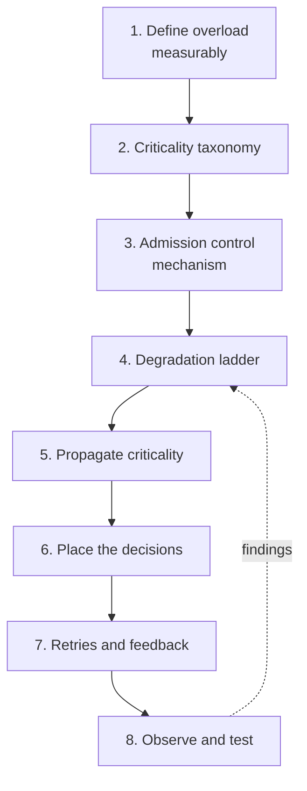
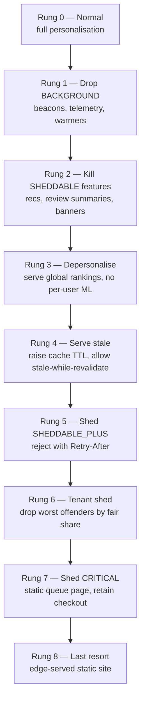
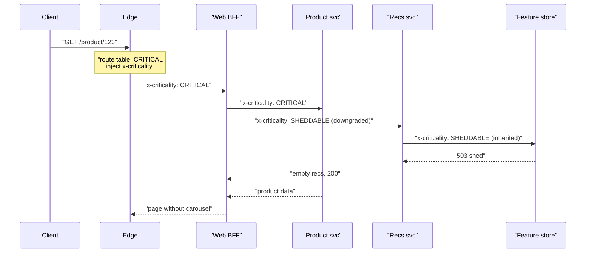
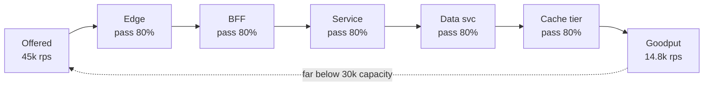
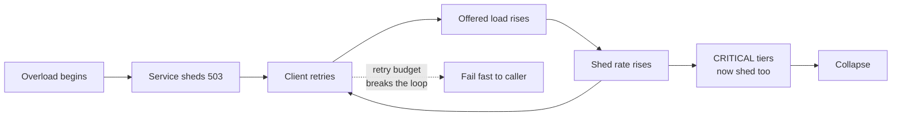

# S05 — Global Load Shedding & Brownout Strategy

<span class="pill pill-core">SRE Round</span>

**Design the system-wide overload protection that turns a cliff into a slope — the hardest judgment call is deciding *where* the shed decision is made, because if every layer sheds independently they will all overcorrect at once and you will drop 90% of traffic to relieve a 20% overload.**

| | |
|---|---|
| **Commonly asked at** | Google, Amazon, Netflix, Stripe, Shopify, Cloudflare, Datadog, Meta (Production Engineering) |
| **Time budget** | 45 min |
| **Core tension** | Local autonomy (every service protects itself, fast and independently) vs. global coordination (one coherent shed decision, slow and centrally fragile) |
| **Prerequisites** | [F17 Rate Limiting & Load Shedding](../fundamentals/f17-rate-limiting-load-shedding.md) · [F18 Resilience Patterns](../fundamentals/f18-resilience-patterns.md) · [F23 SLI/SLO & Error Budgets](../fundamentals/f23-slo-error-budgets.md) · [F24 Capacity Planning](../fundamentals/f24-capacity-planning.md) · [F03 Load Balancing](../fundamentals/f03-load-balancing.md) · [F04 Caching](../fundamentals/f04-caching.md) |

---

## 1. The Scenario As Given

> "You own the reliability of a large retail platform. About 60 services sit behind a global edge. Provisioned peak capacity is roughly 30,000 requests per second of front-door traffic. Last Black Friday a marketing email went out an hour early and the front door saw 45,000 rps within four minutes. The site did not slow down — it fell over. Checkout error rate went to 100% for eleven minutes, and the recovery took another twenty-five because everything retried at once.
>
> Design the overload protection strategy so that at 1.5x capacity the site degrades gracefully instead of collapsing. Tell me exactly what gets dropped, in what order, who decides, and how you know it works before the next Black Friday."

What the interviewer is actually probing:

| Signal they want | What a weak candidate does instead |
|---|---|
| A *product-level* criticality model, not just an infra knob | Jumps straight to "put a rate limiter at the edge" |
| Understanding that overload is a control problem with a moving setpoint | Proposes a static rps cap from a capacity spreadsheet |
| Awareness of retry amplification as the actual killer | Treats retries as a client-side detail |
| Explicit degradation ladder with named, ordered steps | Hand-waves "we degrade gracefully" |
| A plan to *test* the shed path | Assumes the code works because it compiles |
| Rejection as an intentional, measured outcome | Treats every 503 as an error to be alerted on |

!!! note "Why this is an SRE round and not a product design round"
    Nothing here is about a feature. Every decision is about what the system does at the moment its assumptions break. The interviewer is looking for someone who has personally watched a fleet go into queue collapse and can describe the mechanism, not the metaphor.

---

## 2. Clarifying Questions to Ask First

Ask these in the first five minutes. The answers change the design materially, and asking them is itself part of the signal.

**Scope and shape of the overload**

1. Is the overload *organic* (real users, revenue-bearing) or *abusive* (scrapers, a bad bot, a retry storm from one broken client)? Shedding revenue traffic and shedding a scraper are different problems — the first is a capacity decision, the second is an abuse decision.
2. Is it a *step function* (marketing email, TV ad, flash sale) or a *ramp* (organic growth, a slow leak)? Step functions defeat autoscaling; ramps do not.
3. Is the bottleneck stateless compute (scalable in minutes) or a stateful tier — a primary database, a cache fleet, a partitioned queue (not scalable in minutes)? Load shedding exists mostly to protect the tier you cannot grow on demand.
4. Is the overload global or does it concentrate in one region / one shard / one tenant?

**Business constraints**

5. What is the revenue-weighted priority order? "Checkout above browse" is usually right but a search-ads business may have the inverse.
6. Do we have contractual availability commitments per tenant? Shedding an enterprise tenant with a 99.95% SLA to protect free-tier traffic is a commercial decision, not an SRE one.
7. What is the acceptable *quality* floor? Is a cached, 10-minute-stale product page an acceptable "success", or does the business count that as a failure?

**Existing machinery**

8. Do we already have a request context that propagates across services (trace context, baggage, gRPC metadata)? If not, criticality propagation is a six-month cross-team project, and I need a fallback.
9. Do clients (mobile apps, JS bundles, partner integrations) respect `Retry-After`? What is the retry policy in the shipped mobile app that we cannot change for two release cycles?
10. What is the current autoscaler reaction time end to end — alarm, scale decision, instance boot, warmup, healthy in the load balancer?

**Success criteria**

11. At 1.5x capacity, what does "success" look like numerically? My proposal: 100% of tier-0 served within SLO, and total goodput never below provisioned capacity.
12. How long must we survive at 1.5x? Four minutes (until autoscaling catches up) is a very different design from four hours (a sustained event).

!!! tip "Frame the goal as goodput, not availability"
    State this explicitly and early: *the objective of load shedding is to keep goodput flat at capacity while offered load rises, and to choose which requests constitute that goodput.* Availability as a single number is the wrong objective — a system that serves 100% of recommendation requests and 0% of checkouts has excellent "availability".

---

## 3. Framework / Approach

Seven steps. I walk the interviewer through them in this order and draw as I go.



### Step 1 — Define overload as a measurable local condition

"Overload" must be a signal a single process can compute from data it already has, in microseconds, without asking anything else. Candidate signals, ranked by usefulness:

| Signal | Good because | Bad because | Verdict |
|---|---|---|---|
| CPU utilisation | Universally available | Lags by seconds, lies under IO-bound or lock-bound load, meaningless on shared/throttled cores | Secondary at best |
| Request rate vs static cap | Trivially understood | The cap is wrong the moment payload mix, JIT state, or a dependency changes | Never as the primary |
| Inbound queue wait time | Directly reflects whether you are keeping up; leading indicator | Requires an explicit queue you control | **Primary** |
| In-flight concurrency vs adaptive limit | Little's Law makes it capacity-equivalent; responds in one RTT | Needs a limit algorithm | **Primary** |
| Downstream latency / error ratio | Catches dependency-induced overload | Conflates "they are slow" with "I am full" | Input to the limit algorithm |
| Memory pressure / GC time | Catches the real cliff on JVM/Go fleets | Very late signal | Emergency backstop |

The operational definition I commit to: **a process is overloaded when the time a request spends waiting before a worker picks it up exceeds a threshold that is a fraction of its latency SLO.** For a 200 ms p99 SLO, a queue wait above 40 ms means work is already being done that will miss the SLO.

### Step 2 — Criticality taxonomy

Define a small, fixed, company-wide set of tiers. Small because engineers must be able to hold it in their head; fixed because the whole point is cross-service comparability.

| Tier | Name | Meaning | Retail examples | Shed policy |
|---|---|---|---|---|
| **CRITICAL_PLUS** | Money and safety | Failure loses money already committed, or breaks a legal/safety obligation | Payment capture, order finalisation, inventory decrement, fraud decision, auth token validation | Never shed by policy; only shed when the alternative is total collapse |
| **CRITICAL** | Core user journey | Failure means the user cannot complete the primary task | Add to cart, checkout page render, product detail page, login | Shed only after all lower tiers are fully shed |
| **SHEDDABLE_PLUS** | Important but substitutable | There is a degraded answer that is still useful | Search with personalisation, availability-by-store lookup, live price refresh | Degrade first (stale/cached/unpersonalised), then shed |
| **SHEDDABLE** | Best-effort enrichment | Absence is cosmetic | Recommendations, "customers also bought", review summaries, banner personalisation, A/B assignment refresh | Shed freely and early |
| **BACKGROUND** | Not user-facing | Deferrable to any later time | Analytics beacons, telemetry upload, reindex jobs, cache warmers, batch exports | Shed first, always |

Three rules that make the taxonomy survive contact with an organisation:

- **Criticality is a property of the request, not the service.** The same recommendation service serves a `SHEDDABLE` homepage carousel and a `CRITICAL` "items in your cart" resolver. Tagging the service is the most common mistake.
- **A caller may never raise criticality above its own.** A `SHEDDABLE` request that fans out must emit `SHEDDABLE` or lower. Without this rule, criticality inflates to `CRITICAL` everywhere within two quarters.
- **Default is `SHEDDABLE`, and untagged is `BACKGROUND`.** Make the safe default the lazy default. If a team wants protection they must register the route.

### Step 3 — Admission control mechanism: adaptive concurrency

Static rate limits are a capacity estimate frozen at authoring time. Adaptive concurrency limits measure capacity continuously.

Little's Law is the bridge. For a stable system:

$$L = \lambda W$$

where $L$ is concurrency (requests in flight), $\lambda$ is throughput, and $W$ is mean latency. Rearranged, the throughput a service can sustain at its target latency is $\lambda_{max} = L_{max} / W_{target}$. The insight: **you cannot know $\lambda_{max}$ because it depends on $W$, which depends on payload mix and dependency health — but you can control $L$ directly and let $\lambda$ fall out.** A concurrency limit is self-correcting in a way a rate limit never is: if dependencies get 3x slower, a concurrency limit automatically admits 3x fewer requests per second.

The TCP Vegas-style estimator, adapted for RPC (this is the shape of Netflix's `concurrency-limits`, Envoy's adaptive concurrency filter, and Google's per-task admission control):

```python
import math

class GradientLimiter:
    """Vegas/gradient concurrency limiter. One instance per (service, tier) pair."""

    def __init__(self, initial=20, max_limit=2000, smoothing=0.2, tolerance=1.5):
        self.limit = float(initial)
        self.max_limit = max_limit
        self.smoothing = smoothing      # how fast the limit moves
        self.tolerance = tolerance      # allowed latency inflation before we react
        self.rtt_noload = None          # long-window minimum RTT
        self.in_flight = 0

    def observe(self, rtt_seconds, in_flight_at_start, dropped):
        # Long-window minimum: the latency of this service when it is not queueing.
        if self.rtt_noload is None or rtt_seconds < self.rtt_noload:
            self.rtt_noload = rtt_seconds

        if dropped:
            # A timeout or rejection is a strong signal: halve immediately.
            self.limit = max(1.0, self.limit / 2)
            return self.limit

        # Only update from samples that actually probed the limit.
        if in_flight_at_start < self.limit / 2:
            return self.limit

        # gradient < 1 means we are queueing; > 1 means we have headroom.
        gradient = max(0.5, min(1.0, self.tolerance * self.rtt_noload / rtt_seconds))

        # Queue allowance grows with sqrt(limit): generous when small, strict when large.
        queue_size = math.sqrt(self.limit)

        new_limit = self.limit * gradient + queue_size
        self.limit = (1 - self.smoothing) * self.limit + self.smoothing * new_limit
        self.limit = max(1.0, min(self.max_limit, self.limit))
        return self.limit
```

Key properties to call out in the interview:

- **Multiplicative decrease on drop, additive-ish increase otherwise.** Same AIMD reasoning as congestion control: fast to protect, slow to reclaim.
- **`rtt_noload` must decay.** If the service genuinely gets slower (bigger payloads, a new feature), a permanently-remembered minimum from three weeks ago makes the limiter believe the service is always overloaded and it will collapse the limit to 1. Use a sliding window of, say, 10 minutes, or reset the minimum on deploy.
- **Per-tier limits, shared queue.** Maintain one limiter for total concurrency and partition it by tier so `BACKGROUND` cannot consume the whole budget.

=== "Static rate limit"

    ```yaml
    # Set once from a load test in March. Wrong by June.
    admission:
      type: fixed_rps
      limit: 2500
      burst: 500
    ```

    - Predictable, auditable, easy to reason about for quota/billing.
    - Cannot respond to a dependency slowdown, a bad deploy, a noisy neighbour, or a payload-mix change.
    - Requires a load test per service per quarter to stay honest — which nobody does.

=== "Adaptive concurrency"

    ```yaml
    admission:
      type: gradient_concurrency
      initial: 20
      max: 2000
      tolerance: 1.5      # allow 50% latency inflation before reacting
      smoothing: 0.2
      per_tier_share:
        CRITICAL_PLUS: 1.00   # may use the whole limit
        CRITICAL:      0.90
        SHEDDABLE_PLUS: 0.60
        SHEDDABLE:     0.35
        BACKGROUND:    0.10
    ```

    - Self-calibrating; tracks real capacity through deploys and dependency changes.
    - Harder to explain to a product team; can oscillate if tuned badly.
    - Needs a floor (never below 1) and a ceiling (so a fast-but-broken dependency returning instant errors does not push the limit to infinity).

=== "Queue-wait shedding (CoDel)"

    ```yaml
    admission:
      type: codel
      target_queue_delay_ms: 5
      interval_ms: 100
      overload_timeout_ms: 150   # LIFO + drop when in overload
    ```

    - Facebook's approach: measure the *minimum* queue delay per 100 ms interval; if it stays above target, start dropping.
    - Switch the queue from FIFO to **LIFO under overload**: the newest request has the most remaining client patience, and the oldest one has probably already been abandoned. This single change often converts a total outage into partial service.
    - Pairs well with concurrency limiting rather than replacing it.

**Recommendation for the round:** adaptive concurrency as the primary local control, CoDel-style queue-delay dropping as the backstop inside the request queue, static per-tenant rate limits kept *only* for quota and abuse — never for capacity.

### Step 4 — The degradation ladder

The ladder is the deliverable. It is an explicit, ordered, pre-agreed list, written down before the incident, with each rung owned by a named team and each rung independently controllable by a flag.



| Rung | Action | Capacity reclaimed (typical) | User-visible cost | Reversible in |
|---|---|---|---|---|
| 1 | Reject `BACKGROUND` at edge | 5–10% | None | Instant |
| 2 | Feature-flag off `SHEDDABLE` modules | 15–25% | Missing carousels | Instant |
| 3 | Depersonalise: global ranking instead of per-user inference | 10–20% | Worse relevance | Instant |
| 4 | Raise cache TTL 60s → 900s, enable `stale-if-error` | 20–40% at the origin | Stale prices/stock | Minutes (cache refill) |
| 5 | Shed `SHEDDABLE_PLUS` with `503 + Retry-After` | 10–20% | Search feels broken | Instant |
| 6 | Per-tenant fair-share shedding | Varies | One tenant degraded | Instant |
| 7 | Shed `CRITICAL` non-checkout, serve a queue/waiting-room page | 30%+ | Browse unavailable | Instant |
| 8 | Full static failover at the CDN | ~100% of origin | Read-only marketing site | Minutes |

!!! warning "Rungs 3 and 4 are traps if you design them at incident time"
    "Serve stale" only works if the cache is *already* populated with the objects you will need. A cache holding 40% of the catalogue at rung 0 does not magically hold 100% at rung 4 — and the stampede of misses can be worse than the original overload. Rung 4 must be paired with request coalescing (single-flight) on misses, and ideally with a pre-warmed "top 10,000 SKUs" set maintained continuously.

### Step 5 — Propagate criticality through the request context

Criticality is assigned once, at the entry point, and travels with the request.



Implementation notes that separate people who have done it from people who have read about it:

- **Use the existing trace baggage / gRPC metadata mechanism.** Do not invent a header propagation library. If you have OpenTelemetry baggage, use it — see [F22 Observability](../fundamentals/f22-observability-fundamentals.md) for the propagation plumbing.
- **Criticality must be immutable downstream except to lower it.** Enforce in the shared middleware, not by convention.
- **Async hops are where it dies.** A request that enqueues a Kafka message loses its context unless criticality is a message header and the consumer's admission control reads it. Do this explicitly; see [F12 Queues & Streams](../fundamentals/f12-queues-streams.md).
- **Criticality is not authorisation.** A client-supplied `x-criticality: CRITICAL_PLUS` must be stripped and re-derived at the edge. Otherwise the first mobile client bug — or the first adversary — promotes itself to unsheddable. This is a security boundary; see [F27 Security in Design](../fundamentals/f27-security-design.md).
- **Bind a deadline to the context too.** Criticality says *whether* to serve; the deadline says *whether it is still worth serving*. A request with 5 ms left on a 200 ms deadline should be dropped regardless of tier — doing the work is pure waste.

### Step 6 — Where the decision is made

This is the hardest judgment call in the round. The honest answer is *both*, with different jobs.

| Layer | What it should decide | What it must not decide | Why |
|---|---|---|---|
| **Edge / global** | Coarse, slow, policy-driven: "drop `BACKGROUND` and `SHEDDABLE` globally", per-tenant fair share, abuse | Per-service capacity | Only the edge sees the whole picture and can reject cheaply, before any capacity is spent |
| **Per-service local** | Fine, fast, measured: "I personally am at my concurrency limit right now" | Global policy or product priority | Only the process knows its own queue; reacts in one RTT, no dependency on a control plane |
| **Client / SDK** | Retry budget, backoff, circuit breaking, "do not even send `BACKGROUND` during a brownout" | Anything about server capacity | The cheapest request to serve is the one never sent |

The overcorrection failure mode, stated precisely:

If $n$ independent layers each shed to bring load down by a factor targeting capacity $C$, and each measures the *pre-shed* offered load because its measurement window is longer than the propagation delay, the composite pass-through is the product of the individual pass-through fractions. Five layers each independently deciding to pass 80% yields $0.8^5 = 0.328$ — a 67% drop in response to a 20% overload.



Four mitigations, in order of value:

1. **Make only one layer authoritative per tier boundary.** The edge owns *policy* shedding (which tiers are on). Services own *capacity* shedding (am I full). A service must never re-implement tier policy.
2. **Shed at the outermost point that has enough information.** Every request that gets shed at the service has already consumed edge TLS, auth, routing, and a BFF fan-out. Shedding late is expensive shedding.
3. **Make the shed decision idempotent and visible.** Stamp `x-shed-by: edge` on the response and propagate a "this request was already partially shed" marker so a downstream layer does not double-count.
4. **Damp the control loops at different timescales.** Edge policy moves on the order of 30–60 s (human or slow controller); local admission moves on the order of 100 ms–1 s. Separating the timescales by 30x prevents the loops from beating against each other — the same reason you separate outer-loop autoscaling from inner-loop admission control.

!!! danger "The hidden nth layer: the load balancer"
    A service that sheds with `503` will be marked unhealthy by most L7 load balancers if the 5xx rate crosses the outlier-detection threshold. The LB then ejects the instance, concentrating the same load on fewer instances, which pushes *them* over the limit. This cascade is one of the most common ways shedding makes an outage worse. Shed responses must be excluded from health-check and outlier-detection accounting — use a distinct status (e.g. `529`, or `503` with a `x-envoy-overloaded`-style header the LB is configured to ignore), and keep the health endpoint answering from a reserved worker that is never subject to admission control. See [F03 Load Balancing](../fundamentals/f03-load-balancing.md).

### Step 7 — Retries: the feedback loop that eats the strategy

**A shed request that gets retried is not relief. It is a second request with the same cost and a lower chance of success.**

Mandatory controls:

| Control | Rule | Enforcement point |
|---|---|---|
| Retry budget | Retries ≤ 10% of successful requests over a 10 s sliding window; when exhausted, fail immediately | Client library, per (caller, callee) pair |
| Retry only on retryable | Never retry a load-shed rejection without honouring `Retry-After` | Client library |
| No retries at more than one layer | Retries at hop $k$ multiply with hops $k-1$; $3^4 = 81$ | Architectural policy; disable retries in the mesh if the SDK does them |
| Jittered exponential backoff | Full jitter: `sleep = random(0, min(cap, base * 2^n))` | Client library |
| Circuit breaking | Trip on shed-rate, half-open probe with a single `CRITICAL_PLUS` request | Client library |
| Deadline propagation | A retry inherits the *remaining* deadline, not a fresh one | Context plumbing |

See [F18 Resilience Patterns](../fundamentals/f18-resilience-patterns.md) and [F11 Idempotency](../fundamentals/f11-idempotency.md) — retries are only safe at all if the operation is idempotent.

### Step 8 — Observability: rejection is a first-class signal

```promql
# Shed rate by tier: this is a dashboard headline, not a buried metric.
sum by (tier) (rate(admission_shed_total[1m]))
  /
sum by (tier) (rate(admission_decisions_total[1m]))

# Goodput: successful, in-SLO, non-shed responses. The real objective function.
sum(rate(http_requests_total{code=~"2..",shed="false"}[1m]))

# Is the limiter healthy or has it collapsed?
min by (service) (admission_concurrency_limit)

# Retry amplification: attempts per logical request. Should sit near 1.0.
sum(rate(http_client_attempts_total[1m])) / sum(rate(http_client_calls_total[1m]))

# Degradation ladder state, exported as a gauge so it appears on every dashboard.
max(degradation_rung)
```

Alerting rules that matter:

- **Page** when `CRITICAL_PLUS` shed rate > 0 for 2 minutes. That should never happen.
- **Page** when goodput drops while offered load is flat — that is the signature of overcorrection.
- **Ticket** (do not page) when `SHEDDABLE` shed rate > 0. It is working as designed; it is a capacity-planning input.
- **Page** when retry amplification > 1.5 — a retry storm is forming.
- Never alert on raw 5xx rate without splitting shed from genuine errors, or every brownout will look like an outage and the on-call will "fix" it by turning shedding off.

---

## 4. Worked Example

Concrete numbers for the retail platform. I would write this on the board.

### 4.1 Baseline capacity from Little's Law

Measured, per checkout-path instance, from the last load test:

- No-load service time $W_0 = 40\ \text{ms}$
- Stable concurrency limit $L = 100$ (the limiter converges here at the latency SLO)
- Fleet: 12 instances behind the checkout BFF

Per-instance sustainable throughput:

$$\lambda_{inst} = \frac{L}{W} = \frac{100}{0.040} = 2{,}500\ \text{rps}$$

Fleet capacity:

$$\lambda_{max} = 12 \times 2{,}500 = 30{,}000\ \text{rps}$$

Sanity-check the limiter's behaviour under stress. Suppose the database slows and measured RTT rises to 180 ms. Vegas estimates the number of requests sitting in a queue rather than being served:

$$Q = L \left(1 - \frac{W_0}{W}\right) = 100\left(1 - \frac{40}{180}\right) = 77.8$$

78 of the 100 in-flight requests are queueing, not working. The queue allowance is $\sqrt{100} = 10$, so the limiter drives the limit down toward $L \cdot \frac{1.5 \times 40}{180} + 10 = 33 + 10 = 43$. Throughput at that limit: $43 / 0.180 = 239$ rps per instance, 2,870 rps fleet-wide. **The limiter has correctly discovered that a slow dependency shrank capacity by 90%, with no human involved and no static number to update.** A static 2,500 rps limiter would have kept admitting 30,000 rps into a system that could serve 2,870, and the queue would have grown without bound until memory exhaustion.

### 4.2 The Black Friday arithmetic

Offered load at peak: 45,000 rps. Capacity: 30,000 rps. Deficit: 15,000 rps (33%).

Tier mix measured from a normal peak hour:

| Tier | Route examples | rps | Share |
|---|---|---|---|
| `CRITICAL_PLUS` | `POST /checkout`, `POST /payment` | 1,200 | 2.7% |
| `CRITICAL` | `GET /product/*`, `GET /cart`, `POST /login` | 22,800 | 50.7% |
| `SHEDDABLE_PLUS` | `GET /search`, `GET /store-availability` | 9,000 | 20.0% |
| `SHEDDABLE` | `GET /recommendations`, `GET /reviews/summary` | 8,000 | 17.8% |
| `BACKGROUND` | `POST /beacon`, `POST /telemetry` | 4,000 | 8.9% |
| **Total** | | **45,000** | 100% |

Walking the ladder:

| Rung | Shed | Cumulative shed | Remaining offered | Within capacity? |
|---|---|---|---|---|
| 1 | All `BACKGROUND` (4,000) | 4,000 | 41,000 | No |
| 2 | All `SHEDDABLE` (8,000) | 12,000 | 33,000 | No |
| 3 | Depersonalise — cuts `SHEDDABLE_PLUS` cost ~40%, not its count | 12,000 | 33,000 effective → ~29,400 cost-equivalent | Marginal |
| 5 | Shed 33% of `SHEDDABLE_PLUS` (3,000) | 15,000 | 30,000 | **Yes** |

Result: 100% of `CRITICAL_PLUS` and `CRITICAL` served within SLO. Two-thirds of search served. Everything else gone. **Goodput 30,000 rps, not 0.**

### 4.3 What actually happened last year: retry amplification

Now redo the arithmetic with the mobile app's shipped retry policy — up to 2 retries on 5xx with 200 ms backoff and no budget.

Let $s$ be the steady-state shed fraction and $\lambda_0 = 45{,}000$ the organic rate. With up to two retries, the offered rate at equilibrium is:

$$\lambda_{eff} = \lambda_0 (1 + s + s^2)$$

and the shed fraction must satisfy capacity $C = 30{,}000$:

$$s = 1 - \frac{C}{\lambda_{eff}} = 1 - \frac{C}{\lambda_0 (1 + s + s^2)}$$

Fixed-point iteration from $s_0 = 0.33$:

| Iteration | $1+s+s^2$ | $\lambda_{eff}$ (rps) | $s$ |
|---|---|---|---|
| 0 | 1.442 | 64,900 | 0.538 |
| 1 | 1.827 | 82,200 | 0.635 |
| 2 | 2.038 | 91,700 | 0.673 |
| 3 | 2.126 | 95,700 | 0.686 |
| 4 | 2.162 | 97,300 | 0.692 |
| 5 | 2.173 | 97,800 | **0.693** |

**A 33% capacity deficit becomes a 69% shed rate, with 97,800 rps of offered load — more than 2x organic.** Every tier including `CRITICAL_PLUS` is now being shed, because there is no ladder rung deep enough. This is precisely the mechanism behind "the site fell over"; the initial overload was survivable and the retries were not.

Now apply a 10% retry budget:

$$\lambda_{eff} = 1.10 \times 45{,}000 = 49{,}500 \quad \Rightarrow \quad s = 1 - \frac{30{,}000}{49{,}500} = 0.394$$

39% shed instead of 69%, and the shed lands entirely in `BACKGROUND` + `SHEDDABLE` + part of `SHEDDABLE_PLUS`. **The retry budget is worth more than any amount of limiter tuning.** State this plainly in the interview.



### 4.4 Cost of the shed decision itself

A shed is only useful if it is dramatically cheaper than serving. Measure it:

| Where shed happens | CPU cost per shed request | Cost as % of a served request |
|---|---|---|
| CDN / edge, pre-TLS-resumption | ~0.02 ms | 0.5% |
| Edge after auth | ~0.4 ms | 10% |
| BFF after fan-out started | ~2.1 ms | 52% |
| Leaf service after DB query issued | ~3.8 ms | 95% |

At 15,000 rps of shedding, shedding at the leaf instead of the edge costs $15{,}000 \times 3.78\ \text{ms} = 56.7$ CPU-seconds per second — roughly 57 cores burned purely on saying no. On a 12-instance fleet with 8 cores each (96 cores total), **the act of rejecting would consume 59% of the fleet**. This number usually ends the debate about whether edge shedding matters.

---

## 5. Deep Dives

### 5.1 Adaptive concurrency vs. static rate limits: when static is still right

Adaptive is not universally superior. Be able to argue both sides.

| Situation | Use | Reason |
|---|---|---|
| Protecting a shared multi-tenant service from one tenant | **Static per-tenant quota** | Fairness is a contract, not a measurement. An adaptive limit would let the loudest tenant define "normal". |
| Protecting a service from itself | **Adaptive concurrency** | Capacity is unknown and moves. |
| Protecting a downstream with a hard, known limit (a database with 200 connections) | **Static, equal to the real limit** | The limit is a fact, not an estimate. Partition it explicitly across callers. |
| Extremely bursty, short requests (sub-5 ms) | **Static rate + small queue** | RTT measurement noise swamps the gradient signal; the limiter oscillates. |
| Long-running requests (streaming, LLM inference, video transcode) | **Adaptive concurrency, strongly** | Rate is meaningless when a single request occupies a worker for 30 s; concurrency is the only sane unit. |
| Cold-start / newly deployed instance | **Adaptive with slow-start** | The limiter must probe upward, not start at the fleet's steady-state limit into a cold JIT and empty caches. |

!!! example "The oscillation failure and how to damp it"
    A limiter with `smoothing = 1.0` (no smoothing) on a service with a 300 ms p99 will overshoot, shed, see latency collapse, raise the limit, overshoot again — a 10-second sawtooth with goodput averaging 60% of capacity. Fixes, in order: (a) add exponential smoothing with $\alpha \le 0.2$; (b) make increase slower than decrease (AIMD, not MIMD); (c) add a minimum hold time before the limit may increase again after a decrease; (d) measure latency over a window of at least 10 samples so a single slow request cannot move the limit.

### 5.2 Fair-share shedding under multi-tenancy

Rung 6 — "shed by tenant" — needs a defensible definition of fair. Naive per-tenant rate limits fail because they cannot use spare capacity. Max-min fairness with borrowing is the right model.

```python
def max_min_shares(demands: dict[str, float], capacity: float) -> dict[str, float]:
    """Max-min fair allocation: everyone gets an equal share, unused share is
    redistributed to tenants that want more. Small tenants are never shed."""
    remaining = capacity
    unsatisfied = dict(demands)
    grants: dict[str, float] = {}
    while unsatisfied and remaining > 1e-9:
        equal_share = remaining / len(unsatisfied)
        satisfied = {t: d for t, d in unsatisfied.items() if d <= equal_share}
        if not satisfied:
            for t in unsatisfied:
                grants[t] = equal_share
            return grants
        for t, d in satisfied.items():
            grants[t] = d
            remaining -= d
            del unsatisfied[t]
    for t in unsatisfied:
        grants[t] = 0.0
    return grants
```

With capacity 30,000 and demands `{whale: 28000, mid: 9000, small_a: 400, small_b: 100}`:

- Round 1: equal share 7,500. `small_a` (400) and `small_b` (100) are satisfied. Remaining 29,500 over 2 tenants.
- Round 2: equal share 14,750. `mid` (9,000) satisfied. Remaining 20,500 over 1.
- Round 3: `whale` gets 20,500 of its 28,000 — shed 27%.

**Only the tenant causing the overload is shed.** This is the correct behaviour and it is very hard to get from a naive quota scheme. Implementation note: doing this exactly requires global demand visibility; in practice each edge PoP runs the algorithm on its local view with a periodically-synced global weight, accepting some error. See [F17](../fundamentals/f17-rate-limiting-load-shedding.md) for the distributed-counter mechanics.

### 5.3 Brownout vs. shedding: reducing cost per request instead of count

Shedding reduces $\lambda$. Brownout reduces $W$ — the work per request. They compose, and brownout is strictly better when available because no user gets a failure.

| Brownout lever | Mechanism | Typical cost reduction | Quality cost |
|---|---|---|---|
| Skip ML personalisation | Serve a precomputed global ranking | 30–60% of that call's cost | Relevance drops; conversion measurably falls |
| Reduce fan-out breadth | Query 3 shards instead of 20, accept partial results | Linear in breadth | Recall drops |
| Lower result count | 10 results instead of 50 | ~50% | More pagination |
| Reduce image/video quality at the edge | Serve a smaller derivative | Bandwidth, not origin CPU | Visual quality |
| Increase cache TTL | Fewer origin fetches | 20–40% origin load | Staleness |
| Disable synchronous writes to secondary stores | Queue them instead | 10–25% latency | Eventual consistency window widens |
| Sampling: compute for 10% of requests, reuse for the rest | Shared computation | Up to 90% | Some users get a stale variant |

!!! tip "Make every brownout lever a flag, and exercise each one monthly"
    A brownout lever that has not been toggled in production in the last 30 days does not work. That is not cynicism; it is the observed base rate. Wire each lever to a feature flag with a scheduled monthly 60-second activation in a low-traffic window, and alert if the expected cost reduction does not appear in the metrics. A lever that reclaims 2% when it is documented as reclaiming 40% is worse than no lever, because the incident commander will rely on it.

### 5.4 Testing the shed path

You cannot wait for a real overload to discover your shedding code has a `nil` dereference on the rejection path. Four layers of testing, each catching different bugs.

| Layer | What it runs | Catches | Frequency |
|---|---|---|---|
| Unit / property tests | Limiter given synthetic RTT sequences | Oscillation, limit collapse, integer overflow, divide-by-zero on `rtt_noload` | Every commit |
| Integration in staging | Full request path with a fault-injected slow dependency | Criticality header not propagated; shed response missing `Retry-After`; LB ejecting shedding instances | Every deploy |
| Load test to breakage | Ramp to 2x capacity against a production-shaped staging fleet | Goodput curve shape; does it plateau or collapse? | Weekly, and before every peak season |
| Production game day | Reduce the fleet (not increase traffic) to create genuine overload on a fraction of real traffic | Everything the other three miss: dashboards, runbooks, human decisions, unknown dependencies | Quarterly |

The single most important chart from the load test:

```text
  goodput
    ^
30k |          ,--------------------   <- correct: plateau at capacity
    |         /
    |        /          .
    |       /            `.
    |      /               `.
    |     /                  `-.____   <- broken: collapse past the knee
    |    /
  0 +---+-------+-------+-------+----> offered load
    0   15k    30k     45k     60k
```

If the curve bends *down* after the knee, shedding is not working — you are spending capacity on work you then throw away. A flat plateau at capacity is the pass criterion. Write this acceptance test into the pipeline.

!!! warning "The reduce-capacity trick"
    Generating 45,000 rps of realistic traffic is hard and expensive. Removing two-thirds of your instances to make 15,000 rps of *real* traffic look like 3x overload is cheap, uses real request mixes, real cache states, and real user behaviour — and it is instantly reversible. Do it in one region, at low traffic, with a pre-declared abort condition on error-budget burn. Cap the exposure explicitly: a 10-minute experiment at 1% of traffic with a 100% failure rate on that slice consumes $0.01 \times 10 = 0.1$ minutes of a 43.2-minute monthly budget, i.e. 0.23%.

---

## 6. What Can Go Wrong

| Risk | Detection | Mitigation |
|---|---|---|
| **Retry storm converts a 33% deficit into a 69% shed** | `retry_amplification` ratio > 1.5; offered load rises while organic user count is flat | Retry budgets (10% of successes) enforced in the shared client library; honour `Retry-After`; circuit breakers; disable mesh-level retries when SDK retries exist |
| **Every layer sheds independently; goodput collapses below capacity** | Goodput falls while offered load is flat; shed rate high at multiple layers simultaneously | One authoritative layer per decision type; `x-shed-by` stamping; separate control-loop timescales by 30x |
| **Load balancer ejects shedding instances, concentrating load** | Healthy-host count drops during a brownout; per-instance rps spikes on survivors | Exclude shed responses from outlier detection; dedicated health-check path bypassing admission control; use a distinct status code |
| **`rtt_noload` never decays; limiter collapses to 1** | `admission_concurrency_limit` flatlines at its floor with no latency anomaly | Sliding-window minimum (10 min); reset on deploy; alert on limit at floor for > 5 min |
| **Criticality inflation: everything is `CRITICAL_PLUS` within two quarters** | Tier mix drift report; > 15% of traffic in the top two tiers | Registry with mandatory owner + written justification + quarterly re-attestation; hard cap on top-tier traffic share enforced at the edge |
| **Stale-serve rung causes a cache stampede on miss** | Origin rps *rises* after enabling rung 4 | Request coalescing / single-flight on miss; `stale-while-revalidate`; pre-warmed hot set |
| **Shed path itself is expensive** | CPU does not fall when shed rate rises | Shed before auth/parsing where possible; cheap rejection at the edge; measure cost-per-shed explicitly |
| **Autoscaler fights the limiter** | Instance count oscillates on a 5–10 min period during brownout | Scale on goodput and queue depth, not on CPU (which drops when shedding works); add scale-down cooldown; never scale down during an active brownout |
| **Shedding masks a real bug and nobody investigates** | Shed rate elevated for days with no ticket | Ticket-level alert on any sustained `SHEDDABLE` shed; shed rate is a mandatory line item in the weekly ops review |
| **Deadline exhaustion: work completes after the client gave up** | High ratio of completed requests whose remaining deadline was negative | Propagate deadlines; check remaining budget before starting work and before each downstream call; drop early |
| **Async/queue path ignores criticality** | Consumer lag rises on all topics equally during overload | Criticality as a message header; per-tier consumer pools or per-tier topics; priority-aware consumer admission |
| **Kill switch itself depends on the overloaded system** | Flag flip during a game day takes > 60 s or fails | Flag distribution via an independent path (CDN-hosted static config with a 5 s TTL); last-known-good cached locally; default-safe on fetch failure |
| **Region-level shed causes a failover storm to a healthy region** | Second region goes into shed 90 s after the first | Global admission awareness at the traffic manager; cap cross-region shift rate; pre-reserve headroom (see [F26 Multi-Region & DR](../fundamentals/f26-multi-region-dr.md)) |

---

## 7. The Artifact You'd Produce

### 7.1 The criticality registry (the source of truth)

```yaml
# criticality-registry.yaml — reviewed quarterly, owned by SRE, PRs require product sign-off
version: 4
defaults:
  unmatched_route: BACKGROUND
  max_traffic_share:            # enforced at the edge; a PR that breaches this fails CI
    CRITICAL_PLUS: 0.05
    CRITICAL: 0.60

routes:
  - match: { method: POST, path: "/api/v1/payments/*" }
    criticality: CRITICAL_PLUS
    owner: payments-team
    justification: "Money movement; failure creates reconciliation work and customer harm."
    reattested: 2026-07-14

  - match: { method: POST, path: "/api/v1/orders" }
    criticality: CRITICAL_PLUS
    owner: orders-team
    justification: "Inventory decrement is not replayable."
    reattested: 2026-07-14

  - match: { method: GET, path: "/api/v1/products/*" }
    criticality: CRITICAL
    owner: catalog-team
    degraded_mode: serve_stale_900s

  - match: { method: GET, path: "/api/v1/search" }
    criticality: SHEDDABLE_PLUS
    owner: search-team
    degraded_mode: depersonalised_top50

  - match: { method: GET, path: "/api/v1/recommendations" }
    criticality: SHEDDABLE
    owner: discovery-team
    degraded_mode: empty_200      # never fail the page for this

  - match: { method: POST, path: "/beacon" }
    criticality: BACKGROUND
    owner: analytics-team
```

### 7.2 The degradation ladder runbook card

```text
DEGRADATION LADDER — retail front door           rev 2026-09-01   owner: SRE-frontdoor
Authoritative flag namespace: frontdoor.brownout.*
Dashboard: /d/brownout   |   Kill switch: flagctl set frontdoor.brownout.rung <N>

RUNG  ACTION                              FLAG                        RECLAIM  REVERSIBLE  OWNER
0     Normal                              rung=0                      —        —           —
1     Reject BACKGROUND at edge           rung=1                      ~9%      instant     SRE
2     Disable SHEDDABLE modules           rung=2                      ~18%     instant     discovery
3     Depersonalise search + PDP          rung=3                      ~12%     instant     search
4     Cache TTL 60s->900s, stale-if-error rung=4                      ~30%*    ~3 min      platform
5     Shed SHEDDABLE_PLUS (503+Retry-After) rung=5                    ~20%     instant     SRE
6     Per-tenant max-min fair share       rung=6                      varies   instant     SRE
7     Waiting room; checkout only         rung=7                      ~50%     ~1 min      SRE + IC
8     CDN static failover                 rung=8                      ~100%    ~5 min      SRE + IC

* at the origin, not at the edge

ENTRY CRITERIA  auto: p99 queue wait > 40ms for 2m OR goodput < 0.9 x offered for 2m
EXIT CRITERIA   all: queue wait < 10ms for 10m AND shed rate = 0 for 10m AND headroom > 25%
EXIT ORDER      reverse rung order, ONE RUNG PER 5 MINUTES (never all at once — see GOTCHA-7)
RUNGS 7-8       require Incident Commander approval. All others: on-call may act unilaterally.
NEVER           shed CRITICAL_PLUS. If you are considering it, escalate; the answer is rung 7.
```

### 7.3 Service-level admission config (what each team owns)

```yaml
# service.yaml fragment — validated in CI against the registry
admission:
  limiter:
    algorithm: gradient
    initial: 20
    max: 2000
    tolerance: 1.5
    smoothing: 0.2
    rtt_noload_window: 10m
    reset_on_deploy: true
  queue:
    max_depth: 512
    discipline: lifo_under_overload
    target_delay_ms: 5
  tier_shares:              # fraction of the limit each tier may occupy
    CRITICAL_PLUS: 1.00
    CRITICAL: 0.90
    SHEDDABLE_PLUS: 0.60
    SHEDDABLE: 0.35
    BACKGROUND: 0.10
  rejection:
    status: 503
    headers:
      Retry-After: "adaptive"     # computed from current queue drain estimate
      X-Shed-By: "${SERVICE_NAME}"
    exclude_from_health: true
    exclude_from_outlier_detection: true
  client_defaults:
    retry_budget_ratio: 0.10
    retry_budget_window: 10s
    max_attempts: 3
    backoff: full_jitter
    deadline_propagation: required
```

---

## 8. Gotchas & Corner Cases

!!! gotcha "GOTCHA-1: The load balancer ejects exactly the instances that are behaving correctly"
    **Symptom.** Brownout begins, a few instances start shedding, and within 30 seconds the healthy-host count drops by half and the remaining instances fall over. **Mechanism.** L7 outlier detection (Envoy `consecutive_5xx`, ALB target health, HAProxy `observe layer7`) counts a `503` shed as a server error and ejects the host. Load redistributes to the remaining hosts, which immediately exceed their own limits and also start shedding, and the ejection cascades. **Mitigation.** Shed responses must be invisible to health accounting: use a status the LB is configured to ignore, set `X-Envoy-Overloaded`-style headers, configure `outlier_detection.enforcing_consecutive_5xx: 0` for the shed code, and serve `/healthz` from a reserved goroutine/thread pool that admission control never touches. Verify with a game day, not with a config review.

!!! gotcha "GOTCHA-2: `rtt_noload` becomes a fossil and the limiter strangles a healthy service"
    **Symptom.** Weeks after a feature launch, a service's concurrency limit sits at its floor of 1–5 with no latency alert firing; throughput is a tenth of normal and everything downstream looks fine. **Mechanism.** The Vegas gradient uses an all-time minimum RTT. A legitimate permanent increase in service time (a new field requiring an extra join, a larger payload, a different instance type) makes every sample look like queueing, so the gradient is permanently < 1 and the limit decays monotonically. **Mitigation.** Use a sliding-window minimum (10 minutes is a good default), reset the estimate on deploy, floor the limit at a value derived from a known-good load test, and alert when `admission_concurrency_limit` sits at its floor for more than five minutes while latency is normal.

!!! gotcha "GOTCHA-3: Criticality inflation — everything is CRITICAL within two quarters"
    **Symptom.** The registry shows 70% of traffic tagged `CRITICAL` or above; the ladder has nothing left to shed at rung 5, so the first real overload goes straight to rung 7. **Mechanism.** Tagging is self-service and there is no cost to claiming a higher tier, so every team does. No one ever downgrades. **Mitigation.** Enforce a hard cap on the traffic share of the top two tiers *in CI* against measured traffic, require a written justification and a named owner per route, require quarterly re-attestation with automatic downgrade on expiry, and publish a per-team tier-mix scorecard. Treat the cap as a budget teams must trade against each other.

!!! gotcha "GOTCHA-4: The shed path costs almost as much as serving"
    **Symptom.** Shed rate climbs to 40% and CPU utilisation does not drop at all. **Mechanism.** The rejection happens after TLS termination, JWT verification, request body parsing, tracing span creation, and the first downstream call — roughly 95% of the per-request cost is already spent. Shedding becomes pure overhead. **Mitigation.** Measure cost-per-shed explicitly and treat it as an SLO of the shedding subsystem (target: < 5% of cost-per-served). Move the decision earlier: tier resolution from a static route table at the edge before auth, connection-level rejection under extreme load, and `BACKGROUND` rejection at the CDN. Accept a cruder decision in exchange for a cheaper one.

!!! gotcha "GOTCHA-5: Autoscaling and shedding form a negative feedback loop that hides the overload"
    **Symptom.** During a brownout the fleet *scales down*, then sheds harder, then scales down further. **Mechanism.** Shedding works, so CPU utilisation drops to target, so the CPU-based autoscaler concludes the fleet is over-provisioned and removes instances. **Mitigation.** Never autoscale on CPU alone for a fleet with admission control. Scale on goodput, queue depth, or concurrency-limit utilisation. Hard-disable scale-down whenever the shed rate is non-zero or the degradation rung is above 0 — wire the rung gauge directly into the scaling policy. See [F24 Capacity Planning](../fundamentals/f24-capacity-planning.md).

!!! gotcha "GOTCHA-6: Deadline-blind work — you serve requests the user abandoned 4 seconds ago"
    **Symptom.** During recovery, goodput stays near zero for minutes even though the offered load has returned to normal and the queue is draining. **Mechanism.** A long FIFO queue is drained oldest-first. Every dequeued request is already past its client deadline, so the work is completed and the response discarded. The system does 100% of the work for 0% of the value, and the queue never empties. **Mitigation.** Check the remaining deadline at dequeue and drop expired work without executing it; switch the queue to LIFO under overload so fresh requests jump ahead; cap queue depth at a size that cannot exceed the deadline at the current drain rate ($\text{depth}_{max} = \text{deadline} \times \lambda_{drain}$).

!!! gotcha "GOTCHA-7: Recovery is more dangerous than the overload — the thundering herd on exit"
    **Symptom.** The overload clears, the on-call resets the ladder from rung 5 to rung 0, and the site immediately falls over again, harder. **Mechanism.** Three things resume at once: clients whose backoff timers expire in a synchronised window, background jobs that queued up during the brownout, and caches that are now cold because rung 4 raised TTLs and nothing refreshed. Combined offered load on exit exceeds the original peak. **Mitigation.** Exit one rung at a time with a mandatory 5-minute soak between rungs (encode it in the runbook and in the tooling). Randomise `Retry-After` values so client resumption is spread. Rate-limit background job resumption explicitly. Warm caches before lifting rung 4. Treat "exit criteria" as a first-class part of the ladder document.

!!! gotcha "GOTCHA-8: The kill switch depends on the system it is supposed to save"
    **Symptom.** The IC calls for rung 5; the flag flip takes 90 seconds or silently fails; nobody can tell whether it applied. **Mechanism.** The flag service is fetched through the same edge, authenticated by the same auth service, and its config API is itself being shed. **Mitigation.** Distribute degradation flags through a path with no dependency on the production request path: a signed JSON blob on the CDN with a 5-second TTL, polled by every process, with last-known-good cached on local disk and a fail-safe default. Export the *observed* rung as a per-process metric so you can confirm propagation rather than assume it. Test the propagation path monthly — see [F25 Deployment & Release Safety](../fundamentals/f25-deployment-release-safety.md) for the same argument applied to rollbacks.

!!! gotcha "GOTCHA-9: The async path has no admission control at all"
    **Symptom.** The synchronous tier survives beautifully; six hours later the database falls over from a consumer backlog that all resumed at once. **Mechanism.** Criticality was designed for HTTP/gRPC. Kafka consumers, cron jobs, and retry queues have no tier, no deadline, and no limiter — they just work as fast as they can, and after a brownout they have a huge backlog to work through. **Mitigation.** Carry criticality as a message header; give each tier its own consumer group or topic with its own concurrency budget; rate-limit backlog drain explicitly (a backlog drained over 30 minutes is almost always better than one drained in 2); and give background consumers the *lowest* priority on shared datastores via connection-pool partitioning.

!!! gotcha "GOTCHA-10: Shed responses are cached, and now the CDN serves errors to everyone"
    **Symptom.** Shedding stops but users keep seeing failures for the length of the cache TTL. **Mechanism.** The `503` was emitted without `Cache-Control: no-store`, and an intermediary (CDN, browser, a well-meaning reverse proxy) cached it against the same key as the real resource. **Mitigation.** Every shed response carries `Cache-Control: no-store, must-revalidate`; assert it in an integration test; and prefer `stale-if-error` semantics so the CDN serves the last good object instead of the error in the first place. See [F05 CDN & Edge](../fundamentals/f05-cdn-edge.md).

!!! gotcha "GOTCHA-11: A slow dependency is misread as local overload, and you shed a service that is idle"
    **Symptom.** A service with 8% CPU is rejecting half its traffic. **Mechanism.** The concurrency limiter sees inflated RTT and shrinks the limit. It is *correct* — capacity really did shrink — but the on-call sees idle CPU, concludes the limiter is broken, disables it, and the service then blocks every thread on the slow dependency and dies. **Mitigation.** Emit the *reason* for a shed, not just the count: `shed_total{reason="local_queue"}` vs `shed_total{reason="downstream_latency"}`. Put the downstream RTT and the limiter's gradient on the same dashboard panel as the shed rate, so the causal chain is one glance. Document explicitly in the runbook that low CPU plus high shed means "look downstream", never "disable the limiter".

!!! gotcha "GOTCHA-12: Fairness by request count is unfair by cost"
    **Symptom.** Max-min fair shedding is enabled and the platform still falls over, with one tenant at exactly its fair share of requests. **Mechanism.** The allocation counts requests. One tenant's requests are 200x more expensive (huge result sets, deep fan-out, uncached queries). Equal request counts means wildly unequal resource consumption. **Mitigation.** Allocate in *cost units*, not requests. Estimate cost per route from historical CPU-time and weight admission accordingly; charge the measured cost back after completion so the estimate self-corrects. This is the same problem as weighted fair queueing in networking, and the same solution.

!!! gotcha "GOTCHA-13: Two regions shed in sequence because failover moved the problem"
    **Symptom.** Region A enters brownout; 90 seconds later region B does too; then A recovers and B stays down. **Mechanism.** Health-based global traffic management sees A degraded and shifts traffic to B, which has no headroom for a full region's load. B then sheds, looks degraded, and traffic sloshes back. **Mitigation.** Feed the *shed rate*, not just the error rate, into the global traffic manager and treat "shedding correctly" as healthy-but-full rather than unhealthy. Cap the rate at which traffic may shift between regions. Maintain explicit N+1 regional headroom, and accept partial degradation in A over full failover to B. See [F26 Multi-Region & DR](../fundamentals/f26-multi-region-dr.md) and [F02 DNS & Global Traffic](../fundamentals/f02-dns-traffic-management.md).

---

## 9. Interview Angle

!!! interview "What the interviewer is scoring"
    1. **Do you distinguish rate limiting from load shedding?** Confusing them is the fastest disqualifier. One is a contract, the other is control theory.
    2. **Do you reach for goodput as the objective function?** Candidates who optimise "availability" miss the point; candidates who say "keep goodput flat at capacity and choose what constitutes goodput" are immediately credible.
    3. **Do you bring up retries unprompted?** Retry amplification is the mechanism behind most real collapses. If the interviewer has to raise it, you lose a level.
    4. **Can you name the layering hazard?** Multiplicative overcorrection across independent shedders is the single most senior observation available in this round.
    5. **Do you treat shedding as testable software?** "We would load test to the knee and assert the goodput curve plateaus" is a Staff-level answer.
    6. **Do you own the organisational problem?** Criticality tagging is a governance problem more than a technical one. Registries, caps, and re-attestation show you have run this at a company, not in a diagram.

!!! interview "How to open the round"
    Do not start drawing boxes. Start with: *"Before the mechanism — the goal is to keep goodput flat at capacity as offered load rises, and to decide deliberately which requests constitute that goodput. So I need two things first: a criticality model, and a measurable local definition of overload. Everything else follows from those."* Then ask the clarifying questions. This costs 90 seconds and reframes the entire round in your favour.

??? note "Follow-up 1 — Why not just autoscale instead of shedding? Isn't shedding admitting defeat?"
    Autoscaling and shedding solve different problems on different timescales. Autoscaling is the *outer* loop and its end-to-end latency is 3–10 minutes: metric scrape and aggregation (30–60 s), alarm evaluation window (60–180 s), scheduling and instance boot (60–120 s), application start, JIT warmup, cache fill, and LB health-check passes (60–300 s). Load shedding is the *inner* loop and reacts in one RTT.

    A step-function overload — a marketing email, a TV ad, a thundering herd after a dependency recovers — is over, or has already killed you, before the outer loop moves. Shedding is what keeps the system alive for the 5 minutes autoscaling needs.

    Autoscaling also cannot help at all when the bottleneck is a stateful tier. You cannot add a database primary in 4 minutes, and adding stateless replicas in front of a saturated database makes it strictly worse by increasing connection count and concurrency. The single-cell capacity of the stateful tier is the real ceiling, and shedding is the only tool that respects it.

    Finally, autoscaling has a hard cap: instance quotas, capacity availability in an AZ, licence limits, connection pool limits. Every system has a ceiling; shedding is how you behave at it. Framing: *"autoscaling raises the ceiling over minutes; shedding decides what happens at the ceiling in milliseconds. You need both and they must not fight."*

??? note "Follow-up 2 — Where exactly do you implement shedding: edge, service mesh sidecar, or in-process library?"
    All three, with different responsibilities, and I would be explicit about which owns what.

    | Location | Owns | Strengths | Weaknesses |
    |---|---|---|---|
    | Edge (CDN + L7 front door) | Tier policy, per-tenant fair share, abuse | Cheapest rejection; only place with a global view; language-agnostic | No visibility into any individual service's real capacity |
    | Mesh sidecar (Envoy adaptive concurrency) | Per-upstream circuit breaking, outlier ejection, connection limits | Uniform across languages; no app changes; already deployed | Sees bytes, not semantics; cannot see in-process queue depth, GC pressure, or thread-pool saturation; adds its own latency |
    | In-process library | Local admission from real queue wait, per-tier worker pools, deadline checks | The only place that knows the truth about the process | Requires a library per language; hardest to roll out consistently |

    My default: edge owns policy, in-process owns capacity, mesh owns connection-level protection and circuit breaking. Critically, the mesh must **not** also do retries if the in-process client does — pick one layer for retries or you get multiplicative amplification. I would state that as a written architectural rule, because it is exactly the kind of thing that silently regresses.

??? note "Follow-up 3 — A shed request returns 503. The user hits refresh. Now what?"
    A human hitting refresh is the least of the problem, but it illustrates the general one: rejection must be *cheap and sticky*, not just correct.

    Concretely: (a) return `Retry-After` with a **jittered** value — if 10,000 clients all get `Retry-After: 5` they all return in the same 100 ms window and you get a synchronised second wave; (b) ensure the `503` carries `Cache-Control: no-store` so the CDN does not cache it, but serve `stale-if-error` content from the CDN where an object exists, so many refreshes never reach the origin at all; (c) prefer a *waiting room* to a bare error for user-facing `CRITICAL` traffic — an edge-served page with a queue position and an automatic, server-controlled poll interval converts an uncontrolled refresh loop into a rate you control; (d) for the mobile app, the SDK enforces the retry budget so refresh-spam is capped regardless of user behaviour.

    The deeper point: an error response is a *contract with the client about what to do next*. If you only design the status code and not the client behaviour it induces, you have designed half the system.

??? note "Follow-up 4 — How do you set the concurrency limit for a brand-new service with no load test?"
    Start with slow-start and let the limiter find it, with guard rails so the discovery process is not itself an outage.

    Initial limit: pick something deliberately small — `2 × num_cores` for CPU-bound work, or `num_cores × (1 + wait_time/service_time)` for IO-bound. If a service spends 90% of its time waiting on IO, that ratio is 9, so a 4-core box starts around 40. This is just Little's Law again.

    Then: increase additively and slowly (no more than 10% per adjustment interval), decrease multiplicatively on any drop, cap the maximum at something the downstream can survive (if the database has 200 connections shared across 20 instances, no instance may exceed 10), and hold the limit flat for the first 60 seconds after process start so JIT warmup latency is not mistaken for queueing.

    The honest answer includes: **the first production peak is the real load test, and that is acceptable precisely because the limiter fails safe.** A limit that is too low costs some availability on a new service; a static number guessed too high costs a queue collapse. I would also run a synthetic ramp in staging to get the goodput-curve shape before launch, even if the absolute numbers do not transfer.

??? note "Follow-up 5 — Your degradation ladder has eight rungs. Who decides which rung, and how fast?"
    Split by blast radius and reversibility.

    Rungs 1–6 are **automatic**, driven by a controller that reads queue wait and goodput. They are cheap, instantly reversible, and invisible or nearly invisible to users. Requiring a human means a 5-minute detection-to-action delay during which the site is down — that is strictly worse than an occasionally wrong automatic decision. The controller moves at most one rung per 60 seconds up, and one rung per 5 minutes down.

    Rungs 7–8 are **human** (Incident Commander), because they are business decisions with revenue and PR consequences and because they have expensive exits (cold caches, static-site staleness). The tooling should make the recommendation and pre-stage the action so approval is one click, but a human owns the call.

    Two important refinements. First, the automatic controller needs a **hold-down**: no rung change within 60 s of the last one, to prevent hunting. Second, there must be a **manual override in both directions** — an on-call must be able to pin the rung (e.g. "stay at rung 2 during this database migration") and the pin must expire automatically so nobody forgets it is on. A permanently pinned ladder is a silent loss of protection, and I would alert on any pin older than 4 hours.

??? note "Follow-up 6 — How do you prove to leadership this works before Black Friday, without risking Black Friday?"
    Four pieces of evidence, in increasing order of persuasiveness, and I would present them as a readiness review.

    1. **The goodput curve from a staging load test.** Ramp to 2x capacity and show the plateau. Pass criterion is explicit: goodput at 2x offered load is within 5% of goodput at 1x, and `CRITICAL_PLUS` error rate stays at 0. A single chart, and it is falsifiable.
    2. **A production capacity-reduction drill.** In one region, during a low-traffic window, remove two-thirds of the fleet to create genuine 3x overload on real traffic. Pre-declare the abort condition (error-budget burn above a threshold) and the exposure budget (10 minutes at 1% of traffic is 0.23% of a monthly 99.9% budget). This proves the dashboards, the runbook, and the humans — not just the code.
    3. **A ladder exercise log.** Every rung toggled in production in the last 30 days with the measured reclaim compared against the documented reclaim. A rung that has not been exercised does not exist.
    4. **Last year's incident replayed against the new design.** Take the actual traffic shape from the incident, replay it in staging, and show the arithmetic: 33% deficit, 69% shed with unbudgeted retries, 39% shed with retry budgets, `CRITICAL_PLUS` unaffected in both new cases. Leadership understands "we would have stayed up, here is why" far better than they understand concurrency limiters.

    What I would explicitly *not* claim: that we are safe at arbitrary load. I would state the tested ceiling (2x), the untested region above it, and what happens there (rung 7–8, degraded but not down).

??? note "Follow-up 7 — What if the overload is caused by a bug in your own service rather than by user demand?"
    This is common and the design must handle it, because from the limiter's point of view a deploy that made every request 6x slower is indistinguishable from a 6x traffic spike — capacity fell, demand did not.

    The limiter does the right thing automatically: it shrinks, sheds low tiers, and keeps `CRITICAL_PLUS` alive. That is the value of an adaptive limit over a static one. But shedding is a *symptom treatment* here, and the correct action is rollback, not degradation.

    So the detection must disambiguate. Two signals: (a) offered load is flat while the concurrency limit collapsed — that is a capacity regression, not a demand spike; (b) the collapse correlates with a deploy marker. The alert should say "capacity regression following deploy X" and link the rollback action, not "high load". Wiring deploy events into the same timeline as the limiter metrics is what makes this a 2-minute diagnosis instead of a 40-minute one.

    I would also note the interaction with rollback safety: if the bad deploy has already partially propagated, shedding buys the time to roll back calmly rather than under total outage pressure. That is arguably the main value of load shedding for internally-caused incidents — it converts an outage into a degraded window during which normal change-management still works.

### Strong answer vs. weak answer

| Dimension | Mid-level answer | Staff / Lead answer |
|---|---|---|
| **Framing** | "Add rate limiting at the API gateway." | "The objective is flat goodput at capacity. That requires a criticality model, a local overload signal, and a written degradation ladder. Rate limiting is a quota tool and solves a different problem." |
| **Limit mechanism** | "Set the limit to 80% of what the load test showed." | "Static limits are a capacity estimate frozen at authoring time. I use a gradient concurrency limiter — Little's Law means controlling $L$ automatically tracks $\lambda_{max}$ as $W$ moves, which is exactly what happens when a dependency degrades." |
| **What gets dropped** | "Drop the least important traffic." | Produces an ordered eight-rung ladder with per-rung reclaim estimates, owners, flags, entry/exit criteria, and a one-rung-per-5-minutes exit policy. |
| **Criticality** | "Tag services by importance." | "Criticality is a property of the request, not the service, assigned at the edge, propagated in baggage, monotonically non-increasing downstream, stripped from client input because it is a security boundary, and governed by a registry with a hard cap on top-tier traffic share." |
| **Retries** | Mentions exponential backoff. | Does the fixed-point arithmetic showing 33% deficit becomes 69% shed, and asserts that a 10% retry budget is worth more than any limiter tuning. Also flags multiplicative amplification if both the mesh and the SDK retry. |
| **Layering** | "Every service protects itself." | Names the overcorrection hazard explicitly with $0.8^5 = 0.33$, assigns one authoritative layer per decision type, and separates control-loop timescales by 30x. |
| **Failure modes** | "We would monitor error rates." | Names LB ejection of shedding instances, `rtt_noload` fossilisation, the autoscaler scaling down during a brownout, cache stampede on the stale-serve rung, and deadline-blind FIFO drain. |
| **Testing** | "We would test in staging." | Defines the acceptance criterion as the shape of the goodput curve past the knee, proposes capacity-reduction drills in production with a quantified error-budget cost, and requires monthly exercise of each ladder rung. |
| **Observability** | "Alert on 5xx." | "Shed rate is a first-class signal split by tier and reason; never alert on undifferentiated 5xx or the on-call will disable shedding to make the page stop." |
| **Organisation** | Treats it as an infra change. | Treats criticality as governance: registry ownership, quarterly re-attestation, CI-enforced tier caps, per-team scorecards, and a named owner per ladder rung. |

---

## 10. Key Takeaways

1. **The objective is goodput, not availability.** Flat goodput at capacity while offered load rises is the pass criterion. Design every mechanism against that curve.
2. **Load shedding and rate limiting share a code path and nothing else.** One enforces a contract; the other is closed-loop control against a setpoint that moves every time a dependency does.
3. **Control concurrency, not rate.** Little's Law, $L = \lambda W$, means a concurrency limit self-corrects when $W$ changes; a rate limit does not. This is the single highest-leverage design choice in the round.
4. **The degradation ladder is the deliverable.** Ordered, named, owned, flag-controlled, with reclaim estimates and — critically — an exit policy that is slower than the entry policy.
5. **Criticality is a property of the request, assigned at the edge, propagated in context, and never raised downstream.** It is also a security boundary and a governance problem, not just a header.
6. **Retries are the mechanism that turns an overload into an outage.** A 33% deficit becomes a 69% shed rate without retry budgets. Budget retries at ~10% of successes and never retry at two layers.
7. **Independent shedders multiply.** Five layers each passing 80% pass 33%. Assign one authoritative layer per decision type and separate control-loop timescales.
8. **Shed early or shedding costs you the capacity you were protecting.** Rejecting at the leaf can burn more than half your fleet on saying no.
9. **Rejection is a designed outcome, not a hidden failure.** Shed rate by tier and by reason belongs on the headline dashboard; undifferentiated 5xx alerting gets shedding disabled during the exact incident it was built for.
10. **Untested shedding does not work.** Load-test to the knee and assert the plateau, run capacity-reduction drills in production with a quantified budget cost, and exercise every ladder rung monthly.
11. **Recovery is the dangerous phase.** Synchronised client backoff, queued background work, and cold caches make the exit harder than the entry. One rung per five minutes.
12. **The kill switch must not depend on the thing it saves.** Independent distribution path, local last-known-good, fail-safe default, and an exported gauge proving the rung actually propagated.
