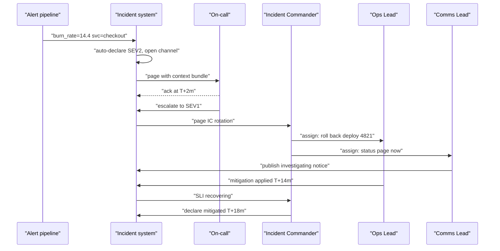
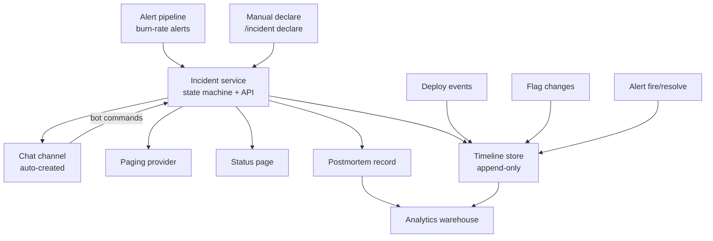
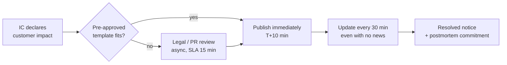
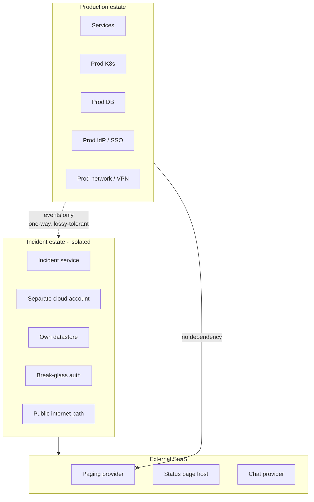
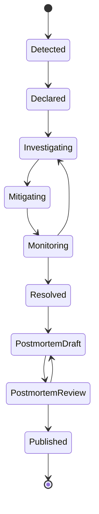

# S06 — Incident Response System Design

<span class="pill pill-core">SRE Round</span>

**Design the tooling and process that carry an incident from detection to postmortem — the hardest judgment call is how much structure to impose, because too little produces a 40-person Slack channel with no owner and too much produces a process people route around at 03:00.**

| | |
|---|---|
| **Commonly asked at** | Google, Atlassian, PagerDuty, Stripe, Shopify, Datadog, Slack, Cloudflare, Amazon |
| **Time budget** | 45 min |
| **Core tension** | Speed of mitigation vs. quality of information — every minute spent understanding is a minute of user-visible impact, and every mitigation applied without understanding risks making it worse |
| **Prerequisites** | [F23 SLI/SLO & Error Budgets](../fundamentals/f23-slo-error-budgets.md) · [F22 Observability](../fundamentals/f22-observability-fundamentals.md) · [F25 Deployment & Release Safety](../fundamentals/f25-deployment-release-safety.md) · [F18 Resilience Patterns](../fundamentals/f18-resilience-patterns.md) · [F26 Multi-Region & DR](../fundamentals/f26-multi-region-dr.md) |

---

## 1. The Scenario As Given

> "We have about 900 engineers and 2,500 services. We declare 40 to 60 incidents a month, four or five of which are customer-visible enough that the CEO asks about them. Today, an incident means someone creates a Slack channel, forty people join, three of them start debugging the same thing, nobody writes down what was tried, the status page is updated 25 minutes late by whoever remembers, and the postmortem is a Google Doc that gets one comment and is never read again.
>
> Design the system that backs incident response end to end: detection, paging, triage, communication, mitigation, and postmortem. Tell me the data model, where the tooling sits, and how you would know it is working."

What is actually being tested:

| Signal | Weak substitute |
|---|---|
| You understand incident response as a *system with SLIs*, not a vibe | "We would use PagerDuty and Statuspage" |
| You can produce a real data model for an incident | Lists features without a schema |
| You know MTTR decomposes and you can say which term to attack | Proposes to "reduce MTTR" as a whole |
| You separate mitigation from diagnosis as a design principle, not a slogan | Describes debugging workflows |
| You have opinions about blamelessness as an operational practice | Repeats the word "blameless" without mechanism |
| You think about the tool's own failure domain | Deploys the incident tool on the same Kubernetes cluster as production |

!!! note "Scope boundary to set explicitly"
    Alerting and paging infrastructure — the pipeline that evaluates rules, dedupes, routes to a schedule, and escalates — is its own design problem. I will treat it as a **dependency with a defined interface** and spend my time on what happens after the page fires. State this in the first two minutes so the interviewer knows you are scoping deliberately, not avoiding.

---

## 2. Clarifying Questions to Ask First

**Volume and shape**

1. What is the incident distribution by severity? Forty SEV3s a month and four SEV1s a quarter is a different system from four SEV1s a week.
2. What fraction are change-induced? Industry reporting consistently puts this at roughly two-thirds; if it holds here, the mitigation tooling should be biased overwhelmingly toward rollback.
3. How many incidents span more than one team? Cross-team incidents are where coordination tooling earns its cost; single-team incidents mostly need a good runbook.

**Organisation**

4. Is there a trained Incident Commander pool, or is the on-call engineer expected to also run the incident? These need entirely different tooling — the second needs far more automation because the human is already saturated.
5. Do we have a follow-the-sun on-call, or does one region carry nights?
6. Who owns external communication today — is there a support/comms org, or does the IC write the status page?

**Regulatory and commercial**

7. Are there contractual notification deadlines? Financial services and healthcare frequently carry a "notify within 60 minutes" obligation that turns comms from best-effort into a hard, auditable requirement.
8. Do we owe SLA credits? If yes, the incident record is a financial document and the timeline must be defensible.
9. Is there a legal/PR review gate on external statements, and what is its latency?

**Existing machinery**

10. Do we have SLOs with burn-rate alerting, or are we alerting on raw CPU and disk thresholds? If the latter, the detection layer is the first thing to fix and everything downstream inherits the noise.
11. What is the current feature-flag and rollback capability? Time-to-rollback is the dominant lever on MTTR for change-induced incidents.
12. Is there a change/deploy event stream I can correlate against?

**Success criteria**

13. What do we want to be true in six months? My proposed targets: MTTA under 3 minutes, time-to-first-status-page-update under 10 minutes for customer-visible incidents, 90% of postmortems published within five business days, and 80% of action items closed by their due date.

!!! tip "Anchor on MTTR decomposition immediately"
    Say early: *"MTTR is not one number, it is a sum — detect, acknowledge, triage, mitigate. I want to instrument each term separately, because the design decisions that move detection are completely different from the ones that move mitigation, and I do not want to spend a quarter optimising the term that is already small."* This single sentence often sets the level for the rest of the round.

---

## 3. Framework / Approach

### Step 0 — Instrument the process before designing it

Every stage boundary is a timestamp, and every timestamp is an SLI of the incident response system itself.

| Term | Definition | Dominated by | Typical lever |
|---|---|---|---|
| **MTTD** — time to detect | Impact starts → alert fires | Alert coverage and evaluation windows | SLO burn-rate alerts, synthetic probes |
| **MTTA** — time to acknowledge | Alert fires → human acknowledges | Paging reliability, escalation policy, alert fatigue | Redundant notification channels, low-noise alerts |
| **MTTT** — time to triage | Ack → cause hypothesis good enough to act | Observability quality, correlation with change events | Deploy markers, dependency maps, auto-attached context |
| **MTTM** — time to mitigate | Action taken → impact stops | Rollback speed, flag propagation, failover automation | One-click rollback, pre-staged failover |
| **MTTR** | Impact starts → impact stops | The sum | Attack the largest term |

$$\text{MTTR} = \text{MTTD} + \text{MTTA} + \text{MTTT} + \text{MTTM}$$

Make every one of these a queryable field on the incident record. You cannot improve what the tooling does not record, and "we feel like triage takes a long time" loses every prioritisation argument against a feature roadmap.

### Step 1 — The detection layer feeds the system; it is not part of it

The incident system consumes alerts. It should consume *good* alerts, which means SLO burn-rate alerts, not raw metric thresholds.

| Alerting style | What it says | Problem |
|---|---|---|
| `cpu > 80% for 5m` | A machine is busy | No user impact implied; fires constantly; trains people to ignore pages |
| `error_rate > 1%` | Something is wrong somewhere | No sense of scale or urgency; a 1% error rate on a 99.99% service is a crisis and on a batch pipeline is Tuesday |
| **Multi-window burn rate** | "At this rate the monthly error budget is gone in N hours" | Correct urgency, correct severity mapping, low false-positive rate |

Standard two-window burn-rate configuration for a 99.9% monthly SLO (43.2 minutes of budget):

```promql
# Fast burn: 14.4x budget rate -> budget exhausted in ~2 days. Page immediately.
(
  sum(rate(slo_errors_total{service="checkout"}[5m]))
    / sum(rate(slo_requests_total{service="checkout"}[5m])) > 14.4 * 0.001
)
and
(
  sum(rate(slo_errors_total{service="checkout"}[1h]))
    / sum(rate(slo_requests_total{service="checkout"}[1h])) > 14.4 * 0.001
)

# Slow burn: 3x budget rate over 6h. Ticket, do not page.
(
  sum(rate(slo_errors_total{service="checkout"}[30m]))
    / sum(rate(slo_requests_total{service="checkout"}[30m])) > 3 * 0.001
)
and
(
  sum(rate(slo_errors_total{service="checkout"}[6h]))
    / sum(rate(slo_requests_total{service="checkout"}[6h])) > 3 * 0.001
)
```

The short window suppresses the tail of a resolved spike; the long window suppresses noise. Details in [F23 SLI/SLO & Error Budgets](../fundamentals/f23-slo-error-budgets.md).

**Why this matters to the incident system specifically:** the burn rate is a direct, defensible input to automatic severity assignment. An alert that says "14.4x burn on a customer-facing SLO" maps to a severity without a human judgment call, at 03:00, by someone who just woke up.

### Step 2 — Declaration and the severity model

Severity must be decidable in under 30 seconds by a tired person, and it must be *revisable* without shame.

| Severity | Definition (impact-based, never cause-based) | Response | Comms |
|---|---|---|---|
| **SEV1** | Core user journey broken for a large fraction of users, or data loss/corruption, or a security breach | Page IC + service on-call + exec notification; dedicated bridge | Public status page within 10 min; updates every 30 min |
| **SEV2** | Significant degradation, a workaround exists, or a single large tenant fully down | Page service on-call; IC assigned if it crosses teams or exceeds 30 min | Status page within 30 min; proactive contact for affected tenants |
| **SEV3** | Minor or partial degradation; error budget burning but no journey broken | Ticket to owning team during business hours | Internal only |
| **SEV4** | No user impact; a near miss or a self-healed event worth recording | Recorded for trend analysis; no response | None |

Design rules that matter more than the table:

- **Severity is assigned from impact, never from cause.** "Database down" is not a severity. "Checkout unavailable for all users" is.
- **Declaring is cheap; downgrading is free.** The failure mode you must design against is under-declaration, because a SEV2 that should have been a SEV1 costs 30 minutes of the wrong response. Make declaration one command, make downgrade one click, and make it socially neutral. Track and publish the downgrade rate — a healthy system downgrades 15–25% of initial declarations. A downgrade rate near zero means people are under-declaring.
- **Auto-declare from the alert.** A 14.4x burn-rate alert on a tier-0 SLO opens a SEV2 automatically, with the channel, the record, and the context already created by the time the human acknowledges. The human's first action should be reading, not typing.
- **Time-based auto-escalation.** A SEV2 open for 45 minutes with no mitigation becomes a SEV1 automatically. Incidents that drift are the ones that surprise executives.

### Step 3 — Roles: the minimum viable command structure

Borrowed, correctly, from the Incident Command System. The point is not hierarchy; it is that **nobody should be doing two of these jobs at once**, because each one saturates a human.

| Role | Owns | Explicitly does NOT do | Assigned when |
|---|---|---|---|
| **Incident Commander (IC)** | The incident. Decisions, priorities, who does what, when to escalate, when to call it resolved | Debugging. The moment the IC is in a terminal, the incident has no commander | SEV1 always; SEV2 if cross-team or > 30 min |
| **Ops Lead** | Executing mitigations; the only person making production changes | Deciding strategy; talking to stakeholders | SEV1/SEV2 |
| **Comms Lead** | Status page, internal updates, stakeholder and exec questions, support liaison | Anything technical | SEV1; SEV2 if customer-visible |
| **Scribe** | The timeline: what was observed, decided, and done, with timestamps | Opinions | SEV1, or automated |
| **Subject matter experts** | Investigation in their area; report findings to the IC | Making changes without the Ops Lead | As pulled in by the IC |



!!! warning "The single most common failure of incident response at scale"
    The most senior engineer in the channel becomes the de facto IC *and* keeps debugging. Twenty minutes later there is no one tracking the timeline, no status page update, three unreviewed mitigations in flight, and an executive asking questions in a DM that nobody sees. The tooling must make the IC role **explicit and visible** — a named field on the record, announced in the channel, shown in the channel topic — and the IC's first action must be to hand off debugging to someone else.

### Step 4 — The coordination surface

Engineers will use chat. Do not fight it; instrument it.



The chat bot is the primary interface because it is where people already are:

```text
/incident declare sev2 "checkout 5xx elevated in eu-west-1"
/incident role ic @priya
/incident role ops @sam
/incident note "error rate 12%, started 14:02, correlates with deploy 4821"
/incident action "roll back checkout to 4820" @sam
/incident sev 1
/incident status "investigating elevated checkout errors in Europe"   # -> status page
/incident mitigated "rolled back 4821"
/incident resolve
```

Every command writes to the append-only timeline. The critical design point: **the timeline must be built as a by-product of doing the work, not as a separate chore.** Any system that requires someone to also maintain a document will produce an empty document. Auto-ingest deploy events, flag flips, alert transitions, dashboard links pasted in the channel, and scaling actions — so that even if the humans write nothing, the machine-generated timeline is usable for the postmortem.

### Step 5 — Paging and escalation (treated as a dependency)

The interface I require from the paging layer:

| Requirement | Why |
|---|---|
| Notify → ack round trip observable, with a delivery SLO | MTTA is meaningless if delivery latency is invisible |
| Multi-channel with independent carriers: push, SMS, voice | One carrier outage must not silence the company |
| Escalation to a secondary after a bounded ack timeout | Humans sleep through phones |
| Schedule as an API, not a spreadsheet | Everything downstream needs to know who is on call right now |
| Idempotent, deduplicated notifications keyed by incident | 200 alerts for one cause is one page |
| A path that does not traverse our own production network | See Step 9 |

Alert-to-incident correlation happens **before** paging, not after. A regional failure producing 400 alerts across 60 services must page once. Grouping keys: time window, shared dependency in the service graph, shared region/cell, shared deploy. Get this wrong and MTTA degrades to infinity because the on-call is deleting notifications.

### Step 6 — Mitigation first, root cause later

This is the principle most candidates state and few design for. Designing for it means the tooling makes the mitigation path shorter than the investigation path.

| Question during an incident | Answer |
|---|---|
| Do we need to know why before we fix it? | No. Mitigate on correlation; diagnose on causation afterwards. |
| What if rollback does not fix it? | You learned something valuable in 90 seconds and you are no worse off. |
| What if rollback loses data written by the new version? | Then it is not a rollback-safe change and that should have been caught before deploy, not during. This is exactly why expand/contract migrations matter — see [F25](../fundamentals/f25-deployment-release-safety.md). |
| When is diagnosis before mitigation correct? | Data corruption (a wrong mitigation can widen the blast radius), security incidents (preserve evidence, avoid tipping off an attacker), and any case where the mitigation is irreversible. |

Concretely, the IC dashboard should present, ranked by expected time-to-effect:

```text
MITIGATION OPTIONS                              ETA     REVERSIBLE   BLAST RADIUS
1  Roll back checkout 4821 -> 4820              90s     yes          service
2  Kill switch: flags.checkout.new_pricing=off  5s      yes          feature
3  Shift eu-west-1 traffic to eu-central-1      4m      yes          region
4  Scale checkout fleet 12 -> 30                6m      yes          service
5  Enable brownout rung 2 (disable recs)        5s      yes          global
```

Each row is a button with a pre-authorised runbook behind it, the change is written to the timeline automatically, and the expected effect is stated so the IC can decide when to conclude it did not work.

!!! tip "The two-minute rule"
    Encode it in the tooling: *if a deploy went out in the last 60 minutes and the SLI broke after it, roll back before investigating.* The incident record should surface recent changes automatically, ranked by temporal proximity and dependency distance. Roughly two-thirds of incidents are change-induced; a tool that makes "what changed?" the first screen rather than a question someone has to think to ask removes several minutes from MTTT on the majority of incidents.

### Step 7 — External communication



Cadence rules:

| Severity | First update | Subsequent | Content |
|---|---|---|---|
| SEV1 | ≤ 10 min from declaration | Every 30 min without exception | What is affected, what users should expect, what we are doing, next update time |
| SEV2 customer-visible | ≤ 30 min | Every 60 min | Same |
| Resolution | Immediately | — | What was affected, duration, that a postmortem will follow |

**"No news" is news.** An update saying "we are still investigating, next update at 15:30" is vastly better than silence. Silence is read as "they do not know it is broken". The tooling should nag the Comms Lead at the cadence deadline and auto-post a holding statement if the deadline is breached — a missed update is a failure of the system, not of a person.

The transparency/review tension, handled honestly:

- **Pre-approved templates are the entire solution.** Maintain a small library of statements — elevated error rates, degraded performance, regional impact, login failures, delayed processing — pre-cleared by legal and PR. Publishing one of those requires no review. This turns the common case from a 40-minute gate into a 60-second action.
- **Anything novel goes to async review with a hard SLA.** Review must not block the *first* update; publish the template while the bespoke wording is reviewed.
- **Never speculate on cause externally during the incident.** "We have identified a database issue" becomes a headline and is frequently wrong. Describe *impact* ("some users are unable to complete checkout"), not mechanism.
- **Never name a third-party vendor before they have acknowledged publicly.** That is a contractual and relationship landmine.
- **Never commit to a restoration time you cannot guarantee.** "We expect resolution within the hour" that slips is worse than no estimate.
- **Separate the status page from production.** It must be hosted on infrastructure with zero shared dependencies — different cloud account, static, CDN-fronted. A status page that is down during an outage is the most quoted failure in this entire domain.

### Step 8 — Postmortem and its data model

The postmortem is a *record*, not a document. Documents cannot be aggregated; records can.

| Field | Type | Why it exists |
|---|---|---|
| `incident_id` | FK | Join key |
| `impact_summary` | text | One paragraph a non-engineer can read |
| `impact_users_affected` | int | Trend analysis |
| `impact_duration_seconds` | int | Trend analysis |
| `error_budget_consumed_pct` | float | Ties incidents to SLOs |
| `revenue_impact_estimate` | numeric | Prioritisation currency for action items |
| `timeline` | array of events | Machine-generated plus human annotation |
| `contributing_factors` | array | **Plural, deliberately.** Not `root_cause` |
| `detection_method` | enum | `slo_alert`, `synthetic`, `customer_report`, `internal_report`, `chance` |
| `mitigation_method` | enum | `rollback`, `flag`, `failover`, `scale`, `restart`, `config`, `code_fix` |
| `what_went_well` | text | Preserves practices worth keeping |
| `lucky_breaks` | text | The near-misses that will not repeat |
| `action_items` | array | Each with owner, due date, priority, tracker link, status |
| `review_state` | enum | `draft`, `in_review`, `published` |

Two modelling decisions worth defending out loud:

- **`contributing_factors`, not `root_cause`.** Complex systems fail from the interaction of several conditions, none individually sufficient. A schema with one `root_cause` field forces the author to pick one, which is almost always "the human who pushed the button" or "the service that broke first". The plural field changes what gets written.
- **`detection_method` as a first-class enum.** Aggregating this one field across 200 incidents answers "how much of our impact do customers find before we do?" — which is the sharpest possible argument for observability investment, and it is free once the field exists.

### Step 9 — The tooling's own reliability

The incident system must work when everything else is broken. That is a hard architectural constraint, not an aspiration.



| Dependency the incident tool must NOT have | Why | Alternative |
|---|---|---|
| Production SSO / IdP | An IdP outage is a SEV1 and would lock everyone out of the tool for it | Break-glass credentials in a sealed store, hardware keys, a second IdP |
| Production Kubernetes | A cluster outage is a common SEV1 | Separate account/region, or managed SaaS |
| Production database | Same | Its own store, different engine if practical |
| Corporate VPN | VPN and network incidents are frequent | Public internet with strong auth |
| Production DNS zone | DNS incidents take everything with them | Separate zone, separate registrar, separate resolver |
| The service catalogue / CMDB living in production | You need to know who owns what precisely when you cannot reach it | Replicated snapshot inside the incident estate, refreshed hourly |

Additional requirements that fall out of this:

- **Offline-capable escalation data.** The current on-call roster, IC rotation, and the top 20 runbooks must be cached locally on responders' laptops and mirrored in the paging provider. If the wiki is down you still need to know who to call.
- **A documented degraded mode.** If the incident tool itself is unavailable: a named fallback conference bridge number, a fallback chat workspace, and a paper-equivalent timeline (a shared doc on a different provider). Print it on the on-call card.
- **The incident system gets its own SLO and its own game days.** A quarterly exercise where the primary tool is deliberately made unavailable and the team runs a drill on the fallback path. Otherwise the fallback is fiction.
- **Availability target.** 99.95% is reasonable, but the more important property is *conditional* availability: it must be up when production is down, which means correlation with production failures must be near zero. Measure that explicitly — "was the incident tool healthy during each of the last 40 incidents?" is the real SLI.

---

## 4. Worked Example

### 4.1 Current-state arithmetic

Last quarter, 52 declared incidents. Measured stage times (median):

| Stage | Median | Share of MTTR |
|---|---|---|
| MTTD | 6.2 min | 19% |
| MTTA | 4.1 min | 12% |
| MTTT | 14.6 min | 44% |
| MTTM | 8.3 min | 25% |
| **MTTR** | **33.2 min** | 100% |

Triage dominates. Halving MTTT saves 7.3 minutes, a 22% MTTR reduction — more than eliminating detection and acknowledgement entirely.

Now the availability consequence. Four SEV1s per quarter at 33.2 minutes each, all customer-visible:

$$\text{SEV1 downtime} = 4 \times 33.2 = 132.8\ \text{min/quarter} = 44.3\ \text{min/month}$$

A 99.9% monthly SLO allows 43.2 minutes. **We are over budget on SEV1s alone, before counting any SEV2 partial degradation.** This is the number that funds the project, and it comes entirely from having instrumented the process.

Target state and its arithmetic:

| Stage | Now | Target | Mechanism | Saving |
|---|---|---|---|---|
| MTTD | 6.2 | 3.0 | Multi-window burn-rate alerts on all tier-0 SLOs; synthetic checks on the top 5 journeys | 3.2 |
| MTTA | 4.1 | 2.0 | Alert correlation cuts page volume; multi-channel delivery; escalation after 3 min | 2.1 |
| MTTT | 14.6 | 6.0 | Auto-attached context bundle: recent deploys, flag changes, dependency health, matching past incidents | 8.6 |
| MTTM | 8.3 | 3.0 | One-click ranked mitigations; rollback as a button; pre-authorised runbooks | 5.3 |
| **MTTR** | **33.2** | **14.0** | | **19.2** |

$$4 \times 14.0 = 56\ \text{min/quarter} = 18.7\ \text{min/month} \quad \text{(43% of a 99.9\% budget)}$$

From over budget to 43% of budget, with the remainder available for SEV2s and planned risk.

### 4.2 A full incident walkthrough

SEV1, checkout unavailable in `eu-west-1`. All times relative to impact start.

```text
T+00:00  Deploy 4821 of checkout-api begins rolling in eu-west-1 (canary 1 instance).
T+01:40  Canary passes; rollout proceeds to 100% of eu-west-1 over 6 minutes.
T+04:10  checkout 5xx rate in eu-west-1 crosses 8%. Burn rate hits 22x.
T+05:30  ALERT: burn-rate fast window fires. Incident system auto-declares SEV2 INC-4417,
         creates #inc-4417, attaches context bundle, pages checkout on-call.
T+07:10  On-call acknowledges. MTTA = 1m40s.
         Context bundle already shows: deploy 4821 at T+00:00, 3 flag changes (unrelated),
         dependency health green, 2 similar past incidents linked.
T+08:00  On-call posts: "5xx in eu-west-1 only, started T+04, correlates with 4821."
         /incident sev 1  -> auto-pages IC rotation and notifies exec list.
T+09:30  IC joins, takes command, announces roles:
         IC @priya, Ops @sam, Comms @deb. On-call becomes SME (stops being IC).
T+10:00  IC: "Mitigate first. Sam, roll back 4821 in eu-west-1. Do not investigate yet."
T+10:15  Comms publishes pre-approved template "elevated error rates - checkout - Europe".
         Time-to-first-public-update = 10m15s.
T+11:00  Ops initiates rollback. Timeline auto-records the rollback event.
T+14:20  Rollback complete across eu-west-1. 5xx rate begins falling.
T+16:40  5xx rate below 0.5%. Burn rate normal.
T+18:00  IC declares MITIGATED. MTTM measured from T+10:00 decision = 8 minutes.
         Comms publishes "mitigation applied, monitoring".
T+20:00  IC: "Now we diagnose. Sam, freeze checkout deploys globally. Priya continues as IC."
T+48:00  SME finds cause: 4821 added a synchronous call to the pricing service without a
         timeout; pricing p99 in eu-west-1 is 2.4s due to an unrelated cache eviction;
         checkout thread pool exhausted.
T+55:00  Comms publishes resolution notice with postmortem commitment.
T+60:00  IC declares RESOLVED, assigns postmortem owner, sets due date +5 business days.

MEASURED: MTTD 5m30s | MTTA 1m40s | MTTT 2m50s (to actionable hypothesis) | MTTM 8m
          MTTR (impact start -> impact stop) = 16m40s
          Error budget consumed: 12m of full regional outage.
          eu-west-1 is 31% of traffic -> 12 x 0.31 = 3.7 min of global budget = 8.6% of monthly.
```

The three design decisions that produced this outcome, worth naming explicitly in the interview:

1. **The context bundle was attached before the human woke up.** MTTT was 2m50s because "what changed" was the first screen, not a question.
2. **The IC forbade investigation before mitigation.** Diagnosis took 30 more minutes and happened with zero user impact.
3. **The comms template needed no review.** Ten minutes to first public update, not fifty.

### 4.3 The context bundle

What the system attaches automatically at declaration — this is the single highest-leverage feature in the whole design:

```json
{
  "incident_id": "INC-4417",
  "triggering_alert": {
    "slo": "checkout-availability",
    "burn_rate": 22.4,
    "window": "5m",
    "scope": {"region": "eu-west-1"}
  },
  "recent_changes": [
    {"type": "deploy",  "service": "checkout-api", "version": "4821",
     "at": "T+00:00", "region": "eu-west-1", "rollback_command": "deployctl rollback checkout-api eu-west-1",
     "temporal_proximity_rank": 1},
    {"type": "flag", "key": "checkout.express_lane", "from": false, "to": true, "at": "T-46m"},
    {"type": "config", "service": "edge", "change": "route weights", "at": "T-3h"}
  ],
  "dependency_health": {
    "pricing-service":  {"p99_ms": 2410, "baseline_p99_ms": 85,  "status": "DEGRADED"},
    "inventory-service":{"p99_ms": 42,   "baseline_p99_ms": 40,  "status": "OK"},
    "checkout-db":      {"p99_ms": 6,    "baseline_p99_ms": 5,   "status": "OK"}
  },
  "similar_past_incidents": [
    {"id": "INC-3902", "similarity": 0.81, "summary": "checkout thread pool exhaustion from slow pricing call",
     "mitigation": "rollback", "postmortem": "/pm/INC-3902"}
  ],
  "ownership": {
    "service_owner": "checkout-team",
    "oncall_primary": "@sam", "oncall_secondary": "@kai",
    "runbook": "/runbooks/checkout-5xx"
  },
  "suggested_mitigations": [
    {"action": "rollback deploy 4821", "eta_seconds": 200, "reversible": true, "rank": 1},
    {"action": "shift eu-west-1 -> eu-central-1", "eta_seconds": 240, "reversible": true, "rank": 2}
  ]
}
```

Note that `dependency_health` already contained the real cause (pricing p99 at 2410 ms against an 85 ms baseline) at T+05:30. The system knew before the humans did. It did not matter for MTTR — rollback was still the right first move — but it made the 30-minute diagnosis a 10-minute one.

### 4.4 Postmortem trend analysis

Once postmortems are records, the interesting work is aggregate. Real queries that have changed real roadmaps:

```sql
-- Which contributing factors recur? Sorted by total impact, not count.
SELECT cf.category,
       COUNT(*)                              AS incidents,
       SUM(i.impact_duration_seconds) / 60   AS total_impact_minutes,
       ROUND(AVG(i.impact_duration_seconds) / 60, 1) AS avg_minutes
FROM contributing_factors cf
JOIN incidents i ON i.id = cf.incident_id
WHERE i.started_at > NOW() - INTERVAL '180 days'
GROUP BY cf.category
ORDER BY total_impact_minutes DESC;

-- How are we finding out? The observability investment argument in one query.
SELECT detection_method,
       COUNT(*) AS n,
       ROUND(100.0 * COUNT(*) / SUM(COUNT(*)) OVER (), 1) AS pct,
       ROUND(AVG(mttd_seconds) / 60, 1) AS avg_mttd_min
FROM incidents
WHERE started_at > NOW() - INTERVAL '180 days'
GROUP BY detection_method
ORDER BY n DESC;

-- Action item health. The number that reveals whether postmortems are theatre.
SELECT p.owner_team,
       COUNT(*) FILTER (WHERE a.status = 'done' AND a.completed_at <= a.due_date) AS on_time,
       COUNT(*) FILTER (WHERE a.status <> 'done' AND a.due_date < NOW())          AS overdue,
       COUNT(*)                                                                    AS total,
       ROUND(100.0 * COUNT(*) FILTER (WHERE a.status = 'done') / COUNT(*), 1)      AS pct_done
FROM action_items a
JOIN postmortems p ON p.incident_id = a.incident_id
WHERE p.published_at > NOW() - INTERVAL '365 days'
GROUP BY p.owner_team
ORDER BY overdue DESC;

-- Repeat offenders: services whose incidents keep recurring for the same reason.
SELECT i.primary_service, cf.category, COUNT(*) AS recurrences
FROM incidents i
JOIN contributing_factors cf ON cf.incident_id = i.id
WHERE i.started_at > NOW() - INTERVAL '365 days'
GROUP BY i.primary_service, cf.category
HAVING COUNT(*) >= 3
ORDER BY recurrences DESC;
```

An illustrative result set from the first query:

| Contributing factor | Incidents | Total impact (min) | Avg (min) |
|---|---|---|---|
| Missing timeout on an outbound call | 11 | 428 | 38.9 |
| Config change without staged rollout | 9 | 301 | 33.4 |
| Capacity: no headroom for failover | 6 | 287 | 47.8 |
| Retry without budget or backoff | 7 | 244 | 34.9 |
| Schema migration ordering | 4 | 196 | 49.0 |

Eleven incidents and seven hours of impact from missing timeouts is not eleven separate bugs; it is one missing platform default. **This query is the entire justification for a platform team, and it is impossible to run if postmortems are prose documents.** That is the argument for the data model.

---

## 5. Deep Dives

### 5.1 Severity, auto-declaration, and the cost of getting it wrong

The asymmetry is the whole design.

| | Declared too high | Declared too low |
|---|---|---|
| Cost | Some people woken unnecessarily; an exec email that did not need sending | 20–40 minutes of the wrong response posture; no IC; no comms; customers find out first |
| Recovery | Downgrade in one click; apologise; no lasting harm | Cannot recover the lost time |
| Frequency if unmanaged | Rare — people are reluctant to escalate | Common — nobody wants to be the person who declared a SEV1 over nothing |

So the system must actively push against under-declaration:

- **Auto-declare from burn rate.** Removes the human's reluctance entirely for the common case.
- **Auto-escalate on duration.** A SEV2 open 45 minutes without mitigation becomes SEV1. No one has to make the uncomfortable call.
- **Auto-escalate on scope.** If a second team is paged into the same incident, escalate; cross-team means an IC is needed.
- **Publish the downgrade rate as a health metric of the process.** Celebrate downgrades in the weekly review. If nobody has downgraded in a month, the organisation is under-declaring and you have a cultural problem masquerading as a low incident count.

!!! example "Severity from impact, worked"
    "The primary database for the orders service failed over" — this is *not* a severity, it is a cause. If failover took 12 seconds and the retry layer absorbed it: SEV4, record it, move on. If it took 90 seconds and 40% of checkouts failed: SEV1. The identical technical event maps to opposite severities because severity is a statement about users. Tooling should therefore compute a *suggested* severity from SLI impact and let the human override up, with the override recorded.

### 5.2 Designing tooling that biases toward mitigation

Stating "mitigate first" is worthless if the fastest path in the tool is a query editor. The design must make mitigation mechanically easier than investigation.

| Design choice | Effect |
|---|---|
| Ranked mitigation list on the incident's first screen, above any telemetry | The first thing the responder sees is an action, not a graph |
| Rollback as a single pre-authorised button with no approval chain during an active incident | Removes 5–15 minutes of change-management friction at the worst possible time |
| Every mitigation states ETA, reversibility, and blast radius | Lets the IC decide *when it did not work* instead of waiting indefinitely |
| Automatic timeline entry on every mitigation | Scribe burden approaches zero; the postmortem writes itself |
| "What changed in the last 60 minutes" pinned to the top of the channel | Converts the highest-yield question into a fact |
| Flag kill switches surfaced by blast radius, not alphabetically | The IC finds the right switch without knowing the flag namespace |

Where mitigation-first is *wrong*, and you must say so unprompted:

- **Data corruption.** A restart or failover can propagate corrupt data further. Stop writes first, understand the extent, then act.
- **Security incidents.** Mitigation destroys forensic evidence and can tip off an attacker. Containment has a different playbook entirely; see [F27 Security in Design](../fundamentals/f27-security-design.md).
- **Irreversible mitigations.** Anything that cannot be undone — deleting a queue, truncating a table, forcing a leader election that loses writes — requires understanding first. The tool should mark these clearly and require a second approver even during an incident.
- **When rollback is not rollback.** If the new version wrote data in a format the old version cannot read, "rolling back" is a new, untested forward change. This must be known *before* the incident, which is why expand/contract migrations and rollback-safety testing belong in the deploy pipeline.

### 5.3 The status page: transparency vs. review

The tension is real and the resolution is structural, not diplomatic.

| Approach | Speed | Risk | Verdict |
|---|---|---|---|
| Every statement reviewed by legal | 30–90 min to first update | Very low legal risk, very high trust damage | Wrong for the common case |
| Engineers publish freely | Under 5 min | Speculation, premature cause attribution, vendor naming, wrong ETAs | Wrong as an unbounded policy |
| **Pre-approved templates + async review for novel content** | Under 10 min | Low | **Correct** |

The template library, cleared once, covering 90% of cases:

```yaml
templates:
  - id: elevated_errors
    title: "Elevated error rates for {component}"
    body: >
      We are investigating elevated error rates affecting {component}{region_clause}.
      Some users may experience errors when {user_visible_action}. We will provide an
      update by {next_update_time}.
    requires_review: false

  - id: degraded_performance
    title: "Degraded performance for {component}"
    body: >
      {component} is responding more slowly than usual{region_clause}. Requests are
      succeeding but may take longer than expected. Next update by {next_update_time}.
    requires_review: false

  - id: mitigation_applied
    title: "Mitigation applied for {component}"
    body: >
      We have applied a mitigation and are monitoring recovery. Users should see
      improvement. Next update by {next_update_time}.
    requires_review: false

  - id: resolved
    title: "Resolved: {component}"
    body: >
      This incident is resolved. {component} was affected from {start} to {end}{region_clause}.
      We will publish a detailed postmortem.
    requires_review: false

  - id: data_affected
    requires_review: true          # always: legal and regulatory implications
  - id: security_related
    requires_review: true          # always: security comms follow a separate playbook
```

Rules encoded in the tool, not in a wiki page nobody reads:

- The **next update time** is a required field and the tool alarms the Comms Lead at that time. Missing a committed update is a process failure with an owner.
- Cause is never published during the incident. The tool does not offer a "cause" field on in-flight updates.
- Third-party names are blocked by a lint rule in the publish path until the vendor has published their own notice.
- Restoration estimates require IC approval and are strongly discouraged.
- The `data_affected` and `security_related` paths route to a different, pre-agreed on-call (legal/security) rather than blocking on a generic queue.

!!! warning "The status page must be genuinely independent"
    Static content, a separate cloud account, a separate DNS zone, CDN-fronted, with a publish path that does not touch production auth. A status page hosted in the same region as the product is a well-known way to turn an outage into a credibility incident. Check it by asking: *"if our primary cloud region is entirely gone, can we still publish?"* If the answer involves any hesitation, it is not independent.

### 5.4 Blameless in practice, and learning across incidents

Blameless is an operational discipline with mechanisms, not a value on a poster.

| Mechanism | What it actually prevents |
|---|---|
| The postmortem author is never the person who made the triggering change | Removes the incentive to write a self-defensive narrative |
| Schema has `contributing_factors` (plural), no `root_cause` (singular) | Stops the search for a single culprit, which defaults to a person |
| Human names appear only as roles ("the on-call engineer", "the deploying engineer") | Removes the artefact from performance-review reach |
| Every action item must be a *systemic* change; "be more careful" and "add a training session" are rejected in review | Forces the fix into the system, where it actually works |
| Counterfactual language is removed in review ("should have", "failed to", "neglected to") | These phrases encode blame while pretending to be analysis |
| Explicit "why did this seem reasonable at the time?" section | Surfaces the real information gap: what the operator could see and what they could not |
| Management is not in the room for the technical review | People do not speak freely otherwise, and the whole exercise depends on them speaking freely |

The test of whether blamelessness is real: **does someone volunteer that they made a mistake, in writing, in a document their skip-level will read?** If that has never happened, it is not blameless yet regardless of what the template says. A second test: track whether incidents caused by a change made by a junior engineer produce systemic action items at the same rate as incidents caused by senior engineers. A gap there is measurable blame.

**Trend analysis** is where the real return is. Individual postmortems fix individual bugs; aggregates fix classes of bugs.

| Cadence | Forum | Input | Output |
|---|---|---|---|
| Weekly | Ops review, 45 min | All incidents from the week, action item aging | Escalations; unblocking stalled items |
| Monthly | Reliability review | Aggregated contributing factors, detection methods, MTTR trend by term | One or two platform investments |
| Quarterly | Engineering leadership | Error budget consumption per service, top recurring factors with impact minutes, repeat-offender services | Roadmap changes; headcount arguments |

The output of trend analysis must be **platform defaults, not more action items**. "Eleven incidents from missing timeouts" produces one change: the shared client library sets a default timeout and refuses to compile without one. It does not produce eleven tickets asking eleven teams to add timeouts, because that yields a 40% completion rate and the twelfth incident.

!!! tip "Action items need a decay policy"
    Track completion rate by team and publish it. Then adopt an explicit rule: an action item not started within 90 days is either re-justified with a new due date or formally closed as "accepted risk" with a named accepting owner. A backlog of 300 stale action items is worse than 30 real ones — it hides the important ones and it trains everyone that postmortem outputs are optional. The honest close is far better than the pretend-open.

---

## 6. What Can Go Wrong

| Risk | Detection | Mitigation |
|---|---|---|
| **Incident tool depends on production and is down during the incident** | Correlation between production incidents and tool unavailability; quarterly failure drill | Separate cloud account, separate DNS zone, break-glass auth, external SaaS for paging/chat; documented and rehearsed fallback path |
| **Alert storm: 400 alerts for one cause, MTTA collapses** | Alerts-per-incident ratio; on-call notification counts | Correlate before paging on time window, service-graph adjacency, region, and deploy; page once per incident |
| **No IC assigned; senior engineer silently becomes IC and keeps debugging** | IC field empty on a SEV1; no timeline entries for > 10 min | IC is a required field enforced by the state machine; bot announces the role in-channel and in the topic; auto-page IC rotation on SEV1 |
| **Status page updated late or never** | Time-to-first-update SLI per incident; missed-cadence counter | Required `next_update_time`; tool alarms at the deadline; auto-post holding statement on breach |
| **Postmortems written but never read or acted on** | Action item completion rate; time from publish to first action item start | Structured records not documents; monthly aggregate review; completion rate published per team; explicit accepted-risk closure |
| **Under-declaration: SEV2 that should have been SEV1** | Downgrade rate near zero; incidents whose duration exceeds severity norms | Auto-declare from burn rate; auto-escalate on duration and on cross-team paging; make downgrade socially free |
| **Blame leaks in through the back door (performance reviews, "who broke it")** | Nobody volunteers errors in writing; action items skew to "more training" | Author is not the change-maker; roles not names; counterfactual language removed in review; management excluded from technical review |
| **Timeline is empty because the scribe was also debugging** | Timeline event count per incident-minute | Auto-ingest deploys, flags, alert transitions, scaling, and bot commands; treat human notes as enrichment, not the source |
| **Mitigation applied without understanding makes it worse** | Incidents where impact increased after the first mitigation | Mark irreversible actions and require a second approver; carve out data-corruption and security paths explicitly |
| **Exec asks for a status update in a DM; IC context-switches** | IC response latency; side-channel questions in the record | Comms Lead owns all stakeholder traffic; a single auto-updating exec channel; the IC's DMs are explicitly not an interface |
| **Incident closed while impact continues** | Alerts re-firing within 60 min of resolution; customer reports after resolution | Resolution requires the SLI to be healthy for a defined soak (e.g. 15 min) plus explicit IC confirmation |
| **Follow-the-sun handoff loses context** | Incidents spanning a shift boundary take disproportionately longer | Structured handoff template in the tool: current hypothesis, what was tried, what is in flight, who owns what; verbal overlap required |
| **Paging provider outage** | Synthetic end-to-end page test every 5 min | Secondary provider on a different carrier path; direct phone-tree fallback printed on the on-call card |
| **The incident record becomes a legal liability** | Legal asks to change postmortem practice after a lawsuit | Agree retention and phrasing conventions with legal *in advance*; keep severity/impact factual; never speculate in writing about negligence |

---

## 7. The Artifact You'd Produce

### 7.1 Incident state machine



Transition guards worth writing on the board:

- `Declared → Investigating` requires an assigned on-call and, for SEV1, an IC.
- `Monitoring → Resolved` requires the SLI to be healthy for a 15-minute soak **and** explicit IC confirmation.
- `Resolved → PostmortemDraft` is automatic for SEV1 and SEV2, with an owner and a due date of five business days.
- `PostmortemReview → Published` requires at least one reviewer outside the owning team.

### 7.2 Schema

```sql
CREATE TYPE severity     AS ENUM ('sev1','sev2','sev3','sev4');
CREATE TYPE inc_state    AS ENUM ('declared','investigating','mitigating','monitoring','resolved');
CREATE TYPE detect_via   AS ENUM ('slo_alert','synthetic','customer_report','internal_report','chance');
CREATE TYPE mitigate_via AS ENUM ('rollback','feature_flag','failover','scale','restart','config','code_fix','self_healed');

CREATE TABLE incidents (
    id                     TEXT PRIMARY KEY,           -- INC-4417
    title                  TEXT NOT NULL,
    severity               severity NOT NULL,
    severity_initial       severity NOT NULL,          -- to measure under/over-declaration
    state                  inc_state NOT NULL,
    primary_service        TEXT NOT NULL,
    affected_services      TEXT[] NOT NULL DEFAULT '{}',
    affected_regions       TEXT[] NOT NULL DEFAULT '{}',

    impact_started_at      TIMESTAMPTZ NOT NULL,       -- reconstructed, often before detection
    detected_at            TIMESTAMPTZ NOT NULL,
    acknowledged_at        TIMESTAMPTZ,
    mitigated_at           TIMESTAMPTZ,
    resolved_at            TIMESTAMPTZ,

    detection_method       detect_via NOT NULL,
    mitigation_method      mitigate_via,

    incident_commander     TEXT,
    ops_lead               TEXT,
    comms_lead             TEXT,

    error_budget_consumed_pct NUMERIC(6,3),
    users_affected_estimate   BIGINT,
    revenue_impact_estimate   NUMERIC(14,2),

    chat_channel           TEXT,
    status_page_incident_id TEXT,

    -- derived SLIs of the incident response process itself
    mttd_seconds INT GENERATED ALWAYS AS (EXTRACT(EPOCH FROM (detected_at - impact_started_at))) STORED,
    mtta_seconds INT GENERATED ALWAYS AS (EXTRACT(EPOCH FROM (acknowledged_at - detected_at))) STORED,
    mttm_seconds INT GENERATED ALWAYS AS (EXTRACT(EPOCH FROM (mitigated_at - acknowledged_at))) STORED,
    mttr_seconds INT GENERATED ALWAYS AS (EXTRACT(EPOCH FROM (mitigated_at - impact_started_at))) STORED
);

-- Append-only. No updates, no deletes. This is the evidentiary record.
CREATE TABLE timeline_events (
    id           BIGSERIAL PRIMARY KEY,
    incident_id  TEXT NOT NULL REFERENCES incidents(id),
    occurred_at  TIMESTAMPTZ NOT NULL,
    recorded_at  TIMESTAMPTZ NOT NULL DEFAULT NOW(),
    source       TEXT NOT NULL,       -- human | deploy | flag | alert | scaling | bot
    actor        TEXT,
    kind         TEXT NOT NULL,       -- observation | decision | action | comms | state_change
    body         TEXT NOT NULL,
    refs         JSONB                -- dashboard links, deploy ids, PR urls
);
CREATE INDEX ON timeline_events (incident_id, occurred_at);

CREATE TABLE postmortems (
    incident_id    TEXT PRIMARY KEY REFERENCES incidents(id),
    owner          TEXT NOT NULL,
    owner_team     TEXT NOT NULL,
    due_at         TIMESTAMPTZ NOT NULL,
    published_at   TIMESTAMPTZ,
    impact_summary TEXT,
    what_went_well TEXT,
    lucky_breaks   TEXT,
    reviewers      TEXT[]
);

CREATE TABLE contributing_factors (
    id          BIGSERIAL PRIMARY KEY,
    incident_id TEXT NOT NULL REFERENCES incidents(id),
    category    TEXT NOT NULL,   -- controlled vocabulary; this is what trend analysis groups by
    description TEXT NOT NULL
);

CREATE TABLE action_items (
    id           BIGSERIAL PRIMARY KEY,
    incident_id  TEXT NOT NULL REFERENCES incidents(id),
    description  TEXT NOT NULL,
    owner        TEXT NOT NULL,        -- a person, never a team; teams do not do work
    owner_team   TEXT NOT NULL,
    priority     TEXT NOT NULL,        -- p0 | p1 | p2
    due_date     DATE NOT NULL,
    tracker_url  TEXT NOT NULL,        -- lives in the normal backlog, not a private list
    status       TEXT NOT NULL,        -- open | in_progress | done | accepted_risk
    completed_at TIMESTAMPTZ,
    accepted_by  TEXT                  -- required when status = accepted_risk
);
```

### 7.3 Postmortem template

```markdown
# Postmortem: INC-4417 — Checkout unavailable in eu-west-1

**Severity:** SEV1   **Impact:** 16m40s   **Users affected:** ~48,000
**Error budget consumed:** 8.6% of monthly   **Author:** @kai (not involved in the change)
**Reviewers:** @priya (IC), @maria (platform, outside team)

## Impact
Between 14:04 and 14:21 UTC, checkout was unavailable for users served from eu-west-1
(31% of global traffic). Approximately 48,000 checkout attempts failed with HTTP 500.
Estimated revenue impact: 180,000 EUR of delayed or abandoned orders.

## Timeline
(auto-generated from the incident record; human annotations in italics)

## Contributing factors
1. Deploy 4821 added a synchronous call to the pricing service with no timeout configured.
   The shared HTTP client defaults to no timeout.
2. Pricing service p99 latency in eu-west-1 was 2.4s (baseline 85ms) due to a cache
   eviction event that began 40 minutes earlier and was not alerting.
3. Checkout's thread pool is fixed at 200 with no concurrency limiter, so a slow
   dependency consumed all threads within 90 seconds.
4. Canary analysis ran for 100 seconds against a single instance and did not observe the
   pricing latency, because the canary instance warmed its pricing cache during the bake.

## Why this seemed reasonable at the time
The pricing call was modelled on three existing call sites, none of which set a timeout.
The reviewer checked for consistency with existing code and found it consistent. The
missing timeout was invisible because the default is invisible.

## What went well
- Rollback was one command and completed in 3m20s.
- The context bundle surfaced deploy 4821 as rank 1 before the on-call had finished reading.
- Comms published within 10m15s using a pre-approved template.

## Lucky breaks
- The pricing cache eviction was regional. Had it been global, all regions would have failed.
- The incident started at 14:04 UTC, not 03:00. MTTA would have been materially worse.

## Action items
| # | Action | Type | Owner | Priority | Due |
|---|---|---|---|---|---|
| 1 | Shared HTTP client: mandatory timeout; fail to start without one | systemic | @maria | P0 | 2026-10-10 |
| 2 | Lint rule rejecting client construction without a timeout | systemic | @maria | P0 | 2026-10-10 |
| 3 | Concurrency limiter on checkout's outbound calls | systemic | @sam | P1 | 2026-10-24 |
| 4 | SLO + burn-rate alert on pricing p99 | detection | @dev-pricing | P1 | 2026-10-17 |
| 5 | Canary minimum duration raised to 10 min for checkout | process | @maria | P1 | 2026-10-17 |
| 6 | Audit all call sites missing timeouts; report count | systemic | @maria | P2 | 2026-11-07 |

NOT ACCEPTED as action items: "be more careful in review", "add a training session",
"remind the team about timeouts". These do not change the system.
```

---

## 8. Gotchas & Corner Cases

!!! gotcha "GOTCHA-1: The incident tool shares a failure domain with production"
    **Symptom.** A regional outage takes down the incident management tool, the runbook wiki, and the service catalogue simultaneously. Responders fall back to an unstructured group chat and lose 20 minutes reconstructing who owns what. **Mechanism.** The tool was deployed "like everything else" — same cluster, same IdP, same DNS zone, same region — because that is the path of least resistance and nobody modelled the correlation. **Mitigation.** Separate cloud account and region (or managed SaaS), separate DNS zone and registrar, break-glass credentials independent of production SSO, an hourly-refreshed replica of the service catalogue inside the incident estate, and a quarterly drill where the primary tool is deliberately unavailable. Measure the real SLI: "was the incident tool healthy during each of the last 40 incidents?"

!!! gotcha "GOTCHA-2: Alert storm destroys MTTA"
    **Symptom.** A single AZ failure generates 400 alerts across 60 services. The on-call's phone becomes unusable and the *actual* first alert is buried at position 38. **Mechanism.** Alerts are evaluated per service with no awareness of the dependency graph or shared infrastructure, and paging fans out one notification per alert. **Mitigation.** Correlate before paging: group by time window, service-graph adjacency, shared region/cell/AZ, and shared deploy. Page once per incident and attach the alert set as context. Track `alerts_per_incident` as a health metric — anything above 5 means the correlation layer needs work.

!!! gotcha "GOTCHA-3: Nobody is the Incident Commander because the most senior person is debugging"
    **Symptom.** Thirty minutes into a SEV1 there is no status page update, three people have independently tried conflicting mitigations, and an executive is asking in a DM. **Mechanism.** Seniority implies leadership socially, so the senior engineer both commands and debugs — and debugging is absorbing, so command silently stops happening. **Mitigation.** Make IC a required field the state machine enforces for SEV1; auto-page a dedicated IC rotation separate from service on-call; have the bot announce the IC in-channel and in the channel topic; train ICs explicitly that their first act is to hand off any debugging they were doing. An IC in a terminal is an incident without a commander.

!!! gotcha "GOTCHA-4: Postmortem action items are 'add more monitoring' and 'be more careful'"
    **Symptom.** Twelve months of postmortems, a 40% action-item completion rate, and the same class of incident recurring. **Mechanism.** Action items are written at the end of a long, tiring review by someone who wants to be finished, and generic items pass review because rejecting them feels unkind. **Mitigation.** Reject non-systemic items in review by rule — "be careful", "add training", "remind the team" are not accepted. Require each item to name the mechanism that will prevent recurrence *without relying on human vigilance*. Require a single named human owner (never a team), a due date, and a link into the normal backlog so it competes with other work honestly. Publish completion rate per team monthly.

!!! gotcha "GOTCHA-5: Time-to-first-status-update is 45 minutes because legal reviews every word"
    **Symptom.** Customers learn about the outage from social media; support is overwhelmed; trust damage far exceeds the technical impact. **Mechanism.** A blanket policy that all external statements require legal review, with legal reachable only during business hours. **Mitigation.** Pre-approve a template library covering 90% of cases — elevated errors, degraded performance, regional impact, mitigation applied, resolved — cleared once, usable without review. Route only novel content to async review with a hard SLA, and never let that review block the first update. Escalate `data_affected` and `security_related` to a dedicated legal/security on-call rather than a generic queue.

!!! gotcha "GOTCHA-6: The timeline is empty because everyone was busy"
    **Symptom.** The postmortem author reconstructs a three-hour incident from Slack scrollback, gets the order of events wrong, and the resulting analysis blames the wrong thing. **Mechanism.** Timeline maintenance was a human chore assigned to a person who was also debugging, in a system where writing it down is slower than doing the work. **Mitigation.** Generate the timeline as a by-product: auto-ingest deploy events, flag changes, alert fire/resolve transitions, scaling events, and every bot command. Human notes enrich a timeline that already exists rather than creating it. Track `timeline_events_per_incident_minute` — a low value means the ingestion is incomplete, not that the incident was quiet.

!!! gotcha "GOTCHA-7: Incident closed while impact continues"
    **Symptom.** The incident is resolved, the channel is archived, and 40 minutes later the alert re-fires. The second incident is treated as new and the context is lost. **Mechanism.** Resolution was declared when the alert cleared, but the alert cleared because the metric window rolled over, not because the problem was fixed — or a partial mitigation masked a continuing cause. **Mitigation.** `Monitoring → Resolved` requires the SLI to be healthy for a defined soak (15 minutes is a reasonable floor) plus explicit IC confirmation. Auto-reopen the same incident if the triggering alert re-fires within 60 minutes of resolution, preserving the channel and the timeline rather than starting fresh.

!!! gotcha "GOTCHA-8: Executives join the channel and the IC becomes a status-reporting service"
    **Symptom.** The IC spends more time answering "any update?" than commanding. Mitigation slows measurably as seniority accumulates in the channel. **Mechanism.** The incident channel is public and interesting, and stakeholders reasonably want information. Every question is individually reasonable; the aggregate is destructive. **Mitigation.** The Comms Lead owns all stakeholder traffic; the IC's DMs are explicitly not an interface and the on-call card says so. Provide a separate, read-only, auto-updating executive channel fed by the incident record, updated at a fixed cadence. Consider making the technical channel invite-only for SEV1 with an open observer channel alongside.

!!! gotcha "GOTCHA-9: The on-call cannot log in because the outage is the identity provider"
    **Symptom.** SSO is down. Nobody can reach the incident tool, the cloud console, the monitoring stack, or the deploy system. The outage extends by the time it takes to find someone with a local account. **Mechanism.** Everything was correctly consolidated behind one IdP, which created a single point of failure for the recovery path as well as the production path. **Mitigation.** Break-glass credentials for the incident tool and the cloud console, stored in a physically and logically separate secret store, tied to hardware keys, with use auditing and an automatic alert on use. Test quarterly — the credential that has never been used is usually expired, rotated, or wrong.

!!! gotcha "GOTCHA-10: Handoff across a follow-the-sun boundary loses the thread"
    **Symptom.** An incident that crosses a shift boundary takes 2–3x longer, and the incoming team re-tries mitigations the outgoing team already ruled out. **Mechanism.** Handoff was verbal and informal, and the outgoing team was exhausted and optimised for leaving. **Mitigation.** A structured handoff artefact enforced by the tool: current hypothesis, mitigations attempted with outcomes, actions in flight and their owners, open questions, and explicit role reassignment. Require 15 minutes of overlap with both ICs present. Record the handoff as a timeline event so the postmortem can see it.

!!! gotcha "GOTCHA-11: Severity is assigned from cause, so the response is wrong"
    **Symptom.** "Database failover" is auto-tagged SEV1 and pages fifteen people for a 12-second blip the retry layer absorbed. Two weeks later a slow memory leak in a stateless service is tagged SEV3 and silently takes out checkout for an hour. **Mechanism.** Severity rules were written against technical events because those are easy to detect, rather than against user impact which requires an SLI. **Mitigation.** Severity is defined purely by user impact. The tool computes a *suggested* severity from SLI burn and affected-journey mapping; humans may override upward and the override is recorded. Audit severity assignments quarterly against measured impact and recalibrate.

!!! gotcha "GOTCHA-12: Blamelessness is stated but the incident record is used in performance reviews"
    **Symptom.** Postmortems become progressively more vague. Nobody writes "I ran the command against the wrong cluster" any more. Quality of analysis degrades over 6–12 months and nobody can point to when it started. **Mechanism.** One manager cited an incident in a review, or an engineer believed one did. The belief alone is sufficient — it does not have to be true. **Mitigation.** An explicit, written, leadership-signed policy that incident records are not performance-review inputs. Use roles rather than names in the document. Exclude management from the technical review. Watch for the leading indicator: a drop in self-reported contributing factors. If people stop volunteering their own mistakes, the system has already failed regardless of policy.

---

## 9. Interview Angle

!!! interview "What the interviewer is scoring"
    1. **Do you instrument the process itself?** MTTR decomposition into MTTD/MTTA/MTTT/MTTM, with each as a queryable field, is the clearest single signal of experience in this round.
    2. **Do you produce a data model?** Anyone can list features. A schema with `contributing_factors` plural, `detection_method` as an enum, and generated SLI columns shows you have actually used these records to change something.
    3. **Do you handle the meta-reliability problem unprompted?** If the interviewer has to ask "what if your incident tool is down", you have lost a level.
    4. **Do you know where mitigation-first is wrong?** Data corruption and security incidents. Candidates who apply the principle universally reveal they learned it from a blog post.
    5. **Do you treat blameless as mechanism, not sentiment?** Author selection, plural contributing factors, counterfactual language removal, management excluded from review.
    6. **Do you get from individual postmortems to systemic change?** The aggregate query that turns eleven incidents into one platform default is the Staff-level move.
    7. **Do you resolve the comms tension structurally?** Pre-approved templates, not "we would work with legal".

!!! interview "The line that lands"
    *"The incident is not over when the impact stops. It is over when the class of incident is less likely. That means the postmortem has to be a queryable record, not a document — because individual postmortems fix individual bugs, and only the aggregate fixes classes of bugs."* Then show the contributing-factors query and the eleven-missing-timeouts result. This reframes the round from tooling to organisational learning, which is where Staff-level signal lives.

??? note "Follow-up 1 — Should incidents be auto-declared from alerts, or should a human decide?"
    Auto-declare, with human override in both directions. The reasoning is asymmetry of cost.

    Auto-declaration costs an occasional unnecessary incident record — cheap, and downgrade is one click. Waiting for a human costs the time to notice, evaluate, and overcome reluctance to escalate, which is 5–15 minutes on exactly the incidents where minutes matter most. Under-declaration is the dominant real-world failure because nobody wants to be the person who declared a SEV1 over nothing.

    Concretely: a fast-burn alert (14.4x) on a tier-0 SLO auto-declares SEV2, creates the channel, attaches the context bundle, and pages. By the time the human acknowledges, the scaffolding exists and their first action is to read rather than to type. Humans then adjust: escalate to SEV1, downgrade to SEV3, or merge into an existing incident.

    The guard rails matter. Auto-declaration requires alert quality — it only works on burn-rate alerts tied to user-facing SLOs, never on raw thresholds, or you will create 200 incidents a day and the record becomes noise. And deduplication must happen before declaration: one cause, one incident, however many alerts. I would measure two things to know it is calibrated: the downgrade rate (healthy: 15–25%) and the rate of incidents created with zero human engagement (should be near zero — if the system is declaring incidents nobody acts on, the alerts are wrong).

??? note "Follow-up 2 — How do you make postmortems actually get read and acted on?"
    Accept that most people will never read a postmortem document, and design around that rather than against it.

    Four mechanisms. **First, make them records, not documents.** A postmortem nobody reads still contributes its contributing factors, detection method, and impact minutes to the aggregate, and the aggregate gets read because it drives roadmap decisions. That decouples individual readership from organisational value.

    **Second, put action items in the normal backlog.** A postmortem action item living in a document or a separate list has no path to a sprint. Linked into the same tracker as feature work, it competes honestly, gets prioritised, and is visible to the manager doing planning.

    **Third, publish completion rate per team, monthly.** Not to shame — to make it visible that this is tracked. Completion rates move from 40% to 75% in my experience purely from publication, without any process change.

    **Fourth, close items honestly.** Any item not started within 90 days is re-justified with a new date or closed as `accepted_risk` with a named accepting owner. A backlog of 300 stale items hides the 20 that matter and teaches everyone the output is optional.

    The measure of success is not "postmortems read" — it is "recurrence rate of the same contributing-factor category", which should decline for the categories you invested in. If it does not, the action items were the wrong ones and that itself is a finding.

??? note "Follow-up 3 — What does your incident system depend on, and what happens when those dependencies fail?"
    I would draw two boxes with a one-way arrow between them and enumerate the dependency list explicitly, because this is the question that separates people who have run incident response from people who have designed it on paper.

    The incident estate must not depend on: production SSO (an IdP outage is a common SEV1 and would lock everyone out of the tool for it), production Kubernetes, the production database, the corporate VPN, the production DNS zone, or a service catalogue that lives in production. Each of those is a real outage class I have seen take the recovery path down with the production path.

    So: separate cloud account and region, its own datastore, break-glass credentials on hardware keys in a sealed store with use-auditing, a separate DNS zone and registrar, and an hourly-replicated snapshot of the service catalogue inside the incident estate. The data flow from production is one-way and lossy-tolerant — deploy events, flag changes, alert transitions — so a production outage degrades context enrichment but never the tool itself.

    For paging, chat, and the status page I would deliberately use external SaaS on different providers, because their failure domains are genuinely independent of mine. That introduces a dependency on a vendor, so: a secondary paging provider on a different carrier path, and a synthetic end-to-end page test every five minutes so I discover a delivery failure in minutes rather than during an incident.

    Finally, a documented and rehearsed degraded mode: a named fallback bridge number, a fallback chat workspace on a different provider, and the top 20 runbooks plus the current roster cached on responders' laptops and printed on the on-call card. Rehearsed quarterly — an untested fallback is fiction.

??? note "Follow-up 4 — Mitigate first sounds dangerous. When is it wrong?"
    Three clear cases, and I would raise them before being asked.

    **Data corruption.** A restart, failover, or rollback can propagate corrupt data further or overwrite the only clean copy. The correct sequence is: stop the writes, determine the extent, preserve a snapshot, then act. Speed here increases blast radius rather than reducing it.

    **Security incidents.** Mitigation destroys forensic evidence and can tip off an attacker who then accelerates or changes technique. Containment follows a different playbook with different roles, and legal and security own the sequencing.

    **Irreversible mitigations.** Deleting a queue, truncating a table, forcing a leader election that loses unreplicated writes, failing over a database with asynchronous replication. The tool should mark these distinctly and require a second approver even during an active incident.

    There is also a subtler case: **when rollback is not actually rollback.** If version N wrote data that version N-1 cannot read, "rolling back" is a new, untested forward change made under pressure. This must be known before the incident, which is why expand/contract migration discipline and rollback-safety testing belong in the deploy pipeline rather than in the incident runbook.

    Everywhere else — which is the large majority of incidents, given that roughly two-thirds are change-induced — mitigate first. The information you lose by rolling back before diagnosing is almost always recoverable afterwards from logs, traces, and a staging reproduction. The user impact you accrue while diagnosing is not recoverable at all.

??? note "Follow-up 5 — How do you prevent the status page from becoming a liability?"
    By constraining what can be said, not by slowing down when it is said.

    The tool should make the safe thing the fast thing: pre-approved templates that describe *impact* and never *cause*, a required `next_update_time` field, no free-text cause field on in-flight updates, a lint rule blocking third-party vendor names until that vendor has published their own notice, and IC approval required for any restoration estimate (with the default being not to give one).

    Two categories always route to review: anything touching customer data, and anything security-related. Those go to a dedicated legal/security on-call rather than a generic queue, so the SLA is minutes rather than hours.

    Retention and phrasing conventions should be agreed with legal *in advance*, not renegotiated after a lawsuit. Keep the public record factual — what was affected, when, for how long. Keep speculation, blame, and characterisations of negligence out of writing entirely, internal or external.

    And the infrastructure point: the status page must be static, CDN-fronted, in a separate cloud account with a separate DNS zone, publishable without production auth. A status page that is down during an outage is the single most-quoted failure in this domain, and it converts a technical incident into a credibility incident.

??? note "Follow-up 6 — You have 200 postmortems. What do you do with them?"
    Aggregate them along four axes and let the aggregates drive roadmap decisions.

    **Contributing factors by total impact minutes**, not by count. Eleven incidents from missing timeouts totalling seven hours is one platform change — a shared client that refuses to construct without a timeout, plus a lint rule. Not eleven tickets to eleven teams, which yields a 40% completion rate and a twelfth incident.

    **Detection method distribution.** If 30% of incidents are first reported by customers, that is the single sharpest argument for observability investment that exists, and it takes one query. The counter-argument "we have lots of monitoring" dies immediately against "customers found 30% of our incidents first".

    **MTTR by stage over time.** Shows whether the investments are working. If MTTT fell and MTTM did not, you know where next quarter goes.

    **Repeat-offender services.** Services with three or more incidents sharing a contributing-factor category in a year are not having bad luck; they have a structural problem that warrants a design review rather than another action item.

    The output goes to three forums at three cadences: weekly ops review for action-item aging and escalations, monthly reliability review for aggregate factors and one or two platform investments, quarterly leadership review for error budget consumption and headcount arguments. The quarterly one is where "we lost 428 minutes to missing timeouts" becomes a funded platform team.

??? note "Follow-up 7 — How do you handle an incident where the on-call engineer is the one who caused it?"
    Structurally, not delicately — the point is that the structure removes the need for delicacy.

    During the incident: it changes nothing operationally. They are frequently the fastest path to mitigation because they have the most context on the change. The IC should use that. What the IC should watch for is the failure mode where that engineer's judgment is distorted by wanting the cause to be something else — a rollback of their own change can feel like an admission. The IC owns the decision, not the SME, and that separation of roles exists exactly for moments like this.

    Afterwards: the postmortem author is, by rule, never the person who made the triggering change. This is not protective sentiment; it produces better analysis, because an author writing about their own mistake writes a narrative rather than an analysis, no matter how good their intentions. The record uses roles, not names.

    The analysis itself has to reach past the person. "Engineer deployed a change without a timeout" is not a contributing factor; "the shared HTTP client defaults to no timeout and the lint rules do not catch it, so every call site in the codebase has the same latent defect" is. The test I apply: **if I replaced this engineer with any other engineer on the team, would the incident still have happened?** If yes — and it almost always is yes — the person is not the factor.

    And the cultural mechanism that makes all of this real: an explicit, leadership-signed policy that incident records are never performance-review inputs, plus watching the leading indicator. If engineers stop volunteering their own mistakes in writing, blamelessness has failed regardless of what the policy says.

### Strong answer vs. weak answer

| Dimension | Mid-level answer | Staff / Lead answer |
|---|---|---|
| **Framing** | Lists tools: PagerDuty, Statuspage, a postmortem template | "Incident response is a system with its own SLIs. MTTR decomposes into four terms and I want to know which one to attack before I design anything." |
| **Detection** | "Alert on errors and latency" | "SLO multi-window burn-rate alerts, because burn rate maps directly to severity without a human judgment call at 03:00. Raw thresholds produce noise that destroys MTTA." |
| **Data model** | Feature list | Real schema: plural `contributing_factors`, `detection_method` enum, append-only timeline, generated MTTD/MTTA/MTTM columns, action items with a named human owner and a tracker link |
| **Roles** | "Assign an incident commander" | "IC, Ops Lead, Comms Lead, Scribe — and the IC does not debug. An IC in a terminal is an incident with no commander. The state machine enforces the IC field on SEV1." |
| **Mitigation** | "Fix the problem" | "Mitigate first, diagnose after — and here are the three cases where that is wrong. The tool ranks mitigations by ETA with reversibility and blast radius, and rollback is one pre-authorised button." |
| **Comms** | "Update the status page" | "Pre-approved templates make the safe path the fast path. Required `next_update_time` with tool-enforced nagging. Never publish cause during an incident. Status page on genuinely independent infrastructure." |
| **Postmortems** | "Write blameless postmortems" | Names the mechanisms: author is not the change-maker, plural contributing factors, counterfactual language removed in review, management excluded, systemic-only action items, accepted-risk closure |
| **Learning** | "Track action items" | Shows the aggregate query, turns eleven incidents into one platform default, and names the forum and cadence at which each aggregate is reviewed |
| **Meta-reliability** | Not mentioned, or "we would use SaaS" | Enumerates the forbidden dependency list with the outage class each one represents, specifies break-glass auth on hardware keys, one-way lossy-tolerant event flow, and a rehearsed degraded mode |
| **Measurement** | "Reduce MTTR" | Does the arithmetic: 4 SEV1s at 33.2 min is 44.3 min/month against a 43.2 min budget; targets 14.0 min for 18.7 min/month; names the mechanism behind each term's reduction |

---

## 10. Key Takeaways

1. **Incident response is a system with SLIs.** Instrument MTTD, MTTA, MTTT, and MTTM separately as fields on the record. You cannot argue for investment in a term you have not measured.
2. **Triage usually dominates MTTR.** The highest-leverage feature is not a better dashboard; it is the context bundle attached automatically at declaration so "what changed" is the first screen.
3. **Detection quality determines everything downstream.** SLO burn-rate alerts give correct urgency, enable automatic severity assignment, and keep MTTA low by keeping page volume low.
4. **Severity is a statement about users, never about causes.** Auto-declare from burn rate, auto-escalate on duration and cross-team scope, and make downgrading socially free.
5. **The IC does not debug.** Make the role explicit, required, announced, and separately rostered from service on-call.
6. **Mitigate first, diagnose after — except for data corruption, security, and irreversible actions.** Design the tool so mitigation is mechanically faster than investigation.
7. **The timeline must be a by-product of doing the work.** Auto-ingest deploys, flags, alerts, and bot commands. Anything requiring a separate chore produces an empty record.
8. **Pre-approved comms templates resolve the transparency/legal tension structurally.** Under 10 minutes to first public update, with review reserved for genuinely novel content.
9. **Postmortems are records, not documents.** Plural contributing factors, controlled vocabulary, and a detection-method enum are what make aggregate analysis possible.
10. **The aggregate is where the value is.** Eleven incidents from missing timeouts is one platform default, not eleven tickets.
11. **Blameless is a set of mechanisms.** Author selection, roles instead of names, counterfactual language removal, systemic-only action items, and management excluded from the technical review.
12. **The incident system must work when production does not.** Separate account, separate DNS, break-glass auth, one-way event flow, external SaaS for paging and status, and a degraded mode that is rehearsed rather than documented.
