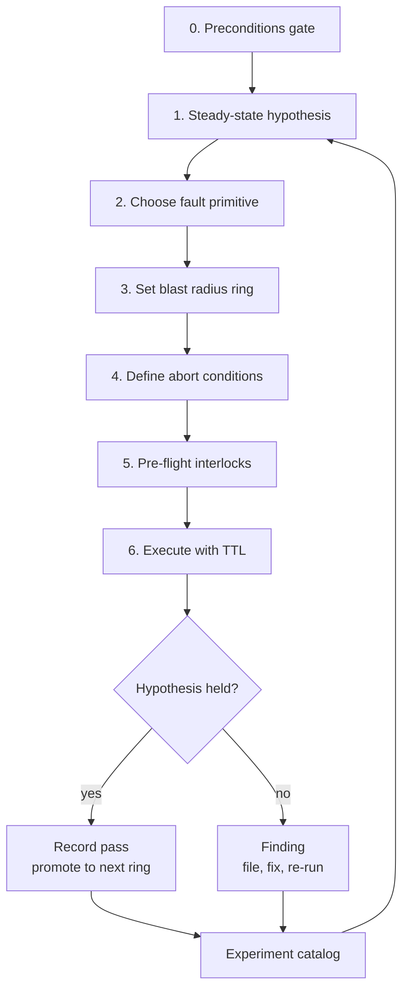
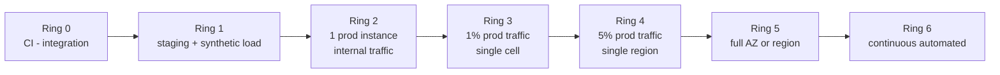
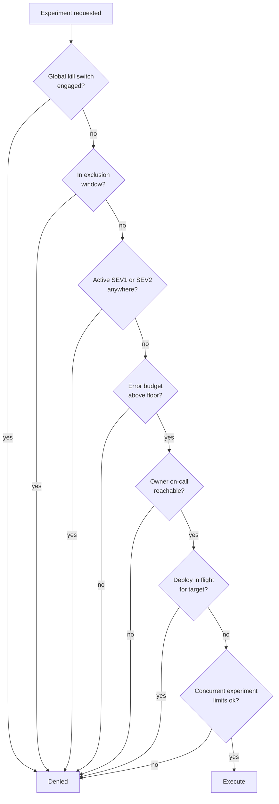
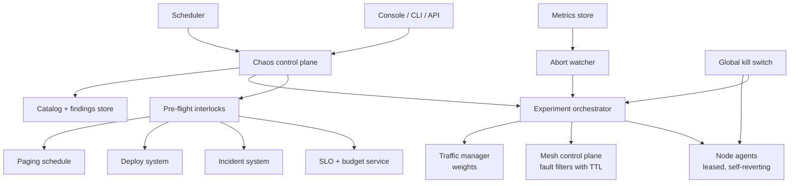
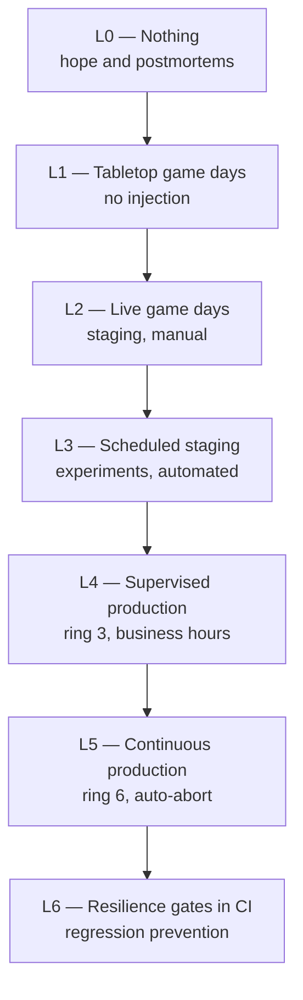

# S07 — Chaos / Resilience Testing Platform

<span class="pill pill-core">SRE Round</span>

**Design a platform that deliberately breaks production to find the resilience gaps before a real incident does — the hardest judgment call is not which faults to inject but how to prove, before every run, that you are not simply causing the outage you were trying to prevent.**

| | |
|---|---|
| **Commonly asked at** | Netflix, Amazon, Google, Microsoft, LinkedIn, Uber, Shopify, Datadog, Cloudflare |
| **Time budget** | 45 min |
| **Core tension** | Realism vs. safety — an experiment safe enough to run freely usually does not test the thing you are worried about, and an experiment that tests the real failure mode is one bad abort condition away from being the incident |
| **Prerequisites** | [F18 Resilience Patterns](../fundamentals/f18-resilience-patterns.md) · [F23 SLI/SLO & Error Budgets](../fundamentals/f23-slo-error-budgets.md) · [F22 Observability](../fundamentals/f22-observability-fundamentals.md) · [F26 Multi-Region & DR](../fundamentals/f26-multi-region-dr.md) · [F17 Rate Limiting & Load Shedding](../fundamentals/f17-rate-limiting-load-shedding.md) · [F25 Deployment & Release Safety](../fundamentals/f25-deployment-release-safety.md) |

---

## 1. The Scenario As Given

> "We run about 1,200 services on Kubernetes across three regions. Last quarter we had two incidents where a dependency got slow and the calling service fell over — both times the postmortem said 'we assumed the circuit breaker would handle this, it turned out it was misconfigured'. Leadership read about Chaos Monkey and has asked us to build a chaos engineering platform.
>
> Design it. What can it inject, how do you keep it from causing an outage, who is allowed to run what, and how do you show it was worth building?"

The trap in this prompt is that it invites you to start listing fault types. The senior move is to start with the methodology and the preconditions.

| Signal the interviewer wants | Weak substitute |
|---|---|
| Hypothesis-driven method, not "break things and see" | A list of fault injection tools |
| Blast radius as a designed, staged, enforced control | "We would start in staging" |
| Abort conditions tied to real SLO burn, automated | "We would watch the dashboards" |
| Injections that fail safe when the control plane dies | Assumes the platform is always reachable |
| Honest assessment of organisational readiness | Proposes continuous production chaos on day one |
| A value measurement story a VP will accept | "It improves reliability" |

!!! warning "Say this in the first three minutes"
    *"Chaos engineering is not a tool problem, it is a preconditions problem. If a team cannot detect the fault I inject, cannot roll back, and has no SLO to abort against, then injecting a fault is not an experiment — it is just an outage that I caused on purpose. So the first thing the platform does is enforce the preconditions."* This reframes the round from tooling to judgment and it is the single highest-value sentence available here.

---

## 2. Clarifying Questions to Ask First

**Readiness**

1. Do the target services have SLOs with burn-rate alerting? Without them I have no automated abort condition and no definition of steady state.
2. Can every target service roll back in under five minutes? If the experiment uncovers a latent bug, I need an exit that is not "debug it live".
3. Is there a working incident response process? Chaos will create incidents; that is the point. If IR is broken, fix that first.
4. What is the current error budget consumption? Running experiments against a service that is already at 95% budget burn is indefensible.

**Scope**

5. Are we testing *service-level* resilience (a service surviving its dependency misbehaving) or *infrastructure-level* (surviving an AZ loss)? Different primitives, different blast radius, different approvers.
6. Is the platform for the whole company or for tier-0 services? Starting with 1,200 services is how these programmes die; starting with 15 is how they succeed.
7. Stateful services in scope? Killing a stateless pod and killing a database primary are not the same risk class, and the second needs a different approval path.

**Constraints**

8. Are there regulatory constraints? Some financial and healthcare environments require pre-notification of deliberate production disruption, or forbid it outright in certain systems.
9. Are there contractual SLAs with credits? An experiment that consumes a tenant's SLA is a commercial event.
10. What are the blackout periods — Black Friday, quarter close, tax season, a major launch?

**Organisation**

11. Who fixes what we find? A platform that generates findings nobody has capacity to act on generates only resentment. I want a named commitment to remediation capacity before the first experiment.
12. Is participation mandatory or opt-in? My recommendation: opt-in for the first two quarters to build trust, then mandatory for tier-0 with an exemption process.

**Success criteria**

13. What does success look like in a year? My proposal: every tier-0 service has a passing dependency-failure experiment in the last 90 days, and the ratio of resilience-class incidents found by experiment versus found by customers has inverted.

---

## 3. Framework / Approach



### Step 0 — The preconditions gate

The platform refuses to run against a service that does not meet these. Encoding the gate in software rather than in a wiki page is what makes it real.

| Precondition | Why | Automated check |
|---|---|---|
| Service has at least one SLO with a burn-rate alert | Defines steady state and the abort trigger | Query the SLO registry |
| Error budget remaining > 50% for the period | Do not spend budget you have already lost | Query the budget service |
| Rollback path tested in the last 30 days | Exit route if the experiment exposes a latent bug | Query the deploy system |
| Owning team on-call is currently staffed and reachable | Someone must be able to respond | Query the paging schedule |
| No active incident involving this service or its dependencies | Never experiment during an incident | Query the incident system |
| No deploy in flight for the target | Confounds the result and doubles the risk | Query the deploy system |
| Dashboards exist showing the SLIs named in the hypothesis | If you cannot see it, you cannot abort on it | Verify the metric exists and has recent data |

!!! danger "The precondition that people skip and then regret"
    **The fault must be detectable by existing monitoring before you inject it.** Verify that the SLI named in the hypothesis has fresh data and a working alert *in the pre-flight*, not in the postmortem. An experiment that runs blind does not test resilience; it tests luck. I have seen a latency injection run for 40 minutes past its intended window because the metric used for auto-abort had been renamed during a migration and was silently returning no data — and "no data" evaluated as "not breaching".

### Step 1 — The steady-state hypothesis

This is the methodological core and the thing that separates chaos engineering from vandalism.

The form is always the same:

> **Given** that the system is in its normal state, **when** we inject *fault F* into *scope S* for *duration D*, **then** the steady-state indicator *SLI* will remain within *bound B*.

Three properties the hypothesis must have:

1. **Falsifiable.** "The system will handle it" is not a hypothesis. "Checkout success rate stays above 99.5% and p99 latency stays below 1.2 s" is.
2. **Measured on user-facing behaviour, not internal state.** "The circuit breaker opens" is an implementation detail; the user does not care whether the breaker opened, they care whether checkout worked. If you measure the breaker, you will pass an experiment in which the breaker opened correctly and checkout still failed.
3. **Stated before the run, recorded immutably.** Otherwise the result is retrofitted to whatever happened, which is how programmes produce a 100% pass rate and zero value.

```yaml
hypothesis:
  statement: >
    When the pricing-service returns 500 for 50% of requests from checkout-api
    for 10 minutes, checkout success rate stays above 99.5% and p99 latency
    stays below 1.2s, because checkout falls back to cached pricing.
  steady_state:
    - sli: checkout_success_rate
      query: 'sum(rate(checkout_total{code="ok"}[2m])) / sum(rate(checkout_total[2m]))'
      bound: ">= 0.995"
    - sli: checkout_p99_latency_seconds
      query: 'histogram_quantile(0.99, sum by (le) (rate(checkout_latency_bucket[2m])))'
      bound: "<= 1.2"
  # Stated up front so a pass is meaningful and a fail is unambiguous.
  expected_secondary_effects:
    - "pricing_fallback_cache_hits rises above 0"
    - "circuit_breaker_state{target='pricing'} transitions to open"
```

**A failed hypothesis is the product.** The point of running the experiment is to find the case where it does not hold. A platform whose experiments all pass is either testing nothing interesting or has been quietly de-fanged, and both should be treated as defects in the platform.

### Step 2 — Fault injection primitives

| Primitive | What it simulates | Implementation | Safety property required |
|---|---|---|---|
| **Latency injection** | Slow dependency, GC pause, network congestion | Mesh fault filter (Envoy) or SDK interceptor, matched on target + header + percentage | Self-expiring TTL; bounded percentage; never on the mesh control plane path |
| **Error injection** | Dependency returning 5xx, throttling, quota exhaustion | Mesh abort filter returning a configured status for a percentage of calls | Same; plus never inject non-retryable errors into idempotent-write paths without review |
| **Resource exhaustion — CPU** | Noisy neighbour, runaway loop, throttled node | cgroup `cpu.max` tightening on the target container, or a `stress-ng` sidecar pinned to a share | Revert on agent heartbeat loss; never on control-plane nodes |
| **Resource exhaustion — memory** | Leak, OOM behaviour, eviction | Balloon process allocating to a bounded ceiling inside the container's own cgroup | Ceiling must leave headroom for the kubelet; container-scoped only |
| **Resource exhaustion — disk** | Log flood, full volume, IO saturation | Allocate a file to a percentage of free space; `tc`/device-mapper delay for IO latency | Pre-reserved deletable ballast file; never on etcd or database volumes |
| **Network packet loss / jitter** | Flaky link, cross-AZ degradation | `tc netem` in the pod's network namespace | Self-expiring via a `tc` timer *and* an agent watchdog |
| **Network partition** | Split brain, cross-AZ link failure | iptables DROP between selected CIDRs, or mesh deny rules | **Must never partition the node from the control plane or from the chaos agent's own revert path** |
| **Dependency kill** | Total loss of a downstream | Prefer mesh 100% abort over killing pods — reversible instantly, no rescheduling cost | Mesh-level so revert does not depend on a scheduler |
| **Instance/pod termination** | Hardware failure, spot reclamation, node drain | Delete pods matching a selector, bounded count, respecting PodDisruptionBudgets | Hard cap on simultaneous terminations; honour PDBs; never target a stateful leader without explicit approval |
| **AZ blackhole** | AZ loss | Remove targets from the load balancer / shift traffic weights. **Traffic layer, not infrastructure layer.** | Instantly reversible; never NACL/security-group changes, which are slow and error-prone to revert |
| **Region blackhole** | Region loss, the real DR test | Global traffic manager weight shift to zero | Requires the other regions to have verified headroom first |
| **Certificate expiry** | The classic 03:00 outage | Present an expired cert from a test endpoint to a canary client | Never rotate a real cert early; simulate on a parallel listener |
| **Clock skew** | Token expiry, cert validation, distributed ordering bugs | Container-scoped time offset via `libfaketime` | Extremely high risk: breaks auth, TLS, and logging correlation. Staging only in almost all cases. See [F20 Time, Clocks & Ordering](../fundamentals/f20-time-clocks-ordering.md) |

The universal safety property, stated once and applied to every primitive:

!!! danger "Every injection must be self-reverting, and revert must not require the control plane"
    Design each fault so that the *absence* of a signal restores normal operation, not the presence of one. A mesh fault filter carries a TTL and the sidecar clears it when the TTL expires, with no call to the chaos service. A node agent holds a lease and reverts everything it has applied if the lease is not renewed within 30 seconds. A `tc netem` rule is applied alongside an `at`-scheduled removal.

    The failure you are designing against is real and common: the chaos control plane is in the same region you just blackholed, so the "stop the experiment" API call cannot reach the agent. A dead-man switch makes the network partition self-healing; an RPC-based stop makes the partition permanent.

### Step 3 — Blast radius rings

Promotion through rings is earned, never assumed. An experiment may only run in ring $N+1$ after it has passed in ring $N$ within a defined window.



| Ring | Scope | Approval | Supervision | Typical duration | Max budget spend |
|---|---|---|---|---|---|
| 0 | Test harness, mocked dependencies | None; runs in CI | Automated | seconds | 0 |
| 1 | Staging with production-shaped synthetic load | None | Automated | 5–15 min | 0 |
| 2 | One production instance, internal/canary traffic only | Service owner | Automated + owner notified | 10 min | < 0.1% |
| 3 | 1% of production traffic, one cell | Service owner | Owner online | 10–15 min | < 0.5% |
| 4 | 5% of production traffic, one region | Service owner + SRE | Owner + SRE online | 15–30 min | < 2% |
| 5 | Full AZ or region evacuation | SRE lead + service owners of everything in scope | Game-day format, IC assigned | 30–60 min | < 10% |
| 6 | Continuous, unattended, randomised within ring 3 bounds | Platform policy | Fully automated with auto-abort | ongoing | < 5% / month |

Two rules that make rings work rather than being decoration:

- **Ring passes expire.** A ring-3 pass is valid for 90 days. After that the service must re-earn it, because the service has changed. Without expiry, the catalogue becomes a museum.
- **A code change to the target resets the highest achieved ring to 3 for the affected experiment class.** Not to 0 — that would make the process intolerable — but a service that just changed its dependency handling has not proven anything about its new behaviour.

### Step 4 — Abort conditions tied to real SLO burn

Aborting on "error rate went up" is wrong: the error rate is *supposed* to go up; that is what you injected. Abort on the **steady-state indicator**, which is the user-facing thing that was supposed to stay flat.

```yaml
abort_conditions:
  # Primary: the hypothesis itself is being violated. This is the finding, and we stop.
  - name: steady_state_violated
    expr: 'checkout_success_rate < 0.995'
    for: 60s
    action: abort_and_revert

  # Secondary: burning budget faster than the experiment was allotted.
  - name: budget_burn_exceeded
    expr: 'experiment_budget_consumed_ratio > 1.0'
    for: 0s
    action: abort_and_revert

  # Tertiary: blast radius escaped the intended scope.
  - name: out_of_scope_impact
    expr: 'sum(slo_burn_rate{service!~"checkout-api|pricing-service"}) > 2'
    for: 120s
    action: abort_and_revert_all

  # Human: anyone, anywhere, without justification.
  - name: manual_abort
    action: abort_and_revert_all

  # Environmental: an unrelated incident started.
  - name: incident_declared
    expr: 'incident_active{severity=~"sev1|sev2"} > 0'
    for: 0s
    action: abort_and_revert_all

  # Dead man: the control plane lost sight of the experiment.
  - name: heartbeat_lost
    timeout: 30s
    action: agent_local_revert      # executed by the agent, not by the control plane
```

The ordering matters. `steady_state_violated` fires first and is the *expected* successful outcome of a useful experiment — you found the gap. `out_of_scope_impact` is the one that protects the company, because the most dangerous chaos failures are the ones that propagate somewhere nobody modelled.

### Step 5 — Pre-flight interlocks



| Interlock | Rule | Rationale |
|---|---|---|
| Global kill switch | One command halts and reverts every running experiment and blocks new ones | The IC must be able to stop all chaos in one action without knowing what is running |
| Exclusion calendar | Named blackout windows: peak retail, quarter close, launches, holidays | Owned by the business, not by the platform team |
| Business hours only (rings 3+) | Experiments run only when the owning team is at work in their own timezone | A finding at 03:00 is an outage; the same finding at 14:00 is a learning |
| Incident interlock | No experiments anywhere while a SEV1/SEV2 is open | Removes chaos from the hypothesis space during a real incident |
| Budget floor | Blocked below 50% remaining error budget | Do not spend what you have already lost |
| Concurrency limits | One experiment per service, N per region, M globally | Prevents accidental composition of independent faults |
| Change freeze awareness | Respects the same freeze policy as deploys | Chaos is a change |
| Deploy interlock | No experiment while the target is mid-rollout | Confounding and compounding risk |
| First-run approval | A new experiment *type* against a service requires owner sign-off; repeats do not | Trust is per-pattern, not per-run |

!!! tip "The kill switch must be usable by someone who knows nothing about the platform"
    The realistic scenario is an Incident Commander at 02:00 who has never used the chaos platform and does not know whether it is involved. Requirements: one memorable command (`chaosctl halt --all`), a big red button in the incident tool itself, no arguments, no authentication beyond being on-call, idempotent, and it prints exactly what it stopped. Also expose a read-only "what chaos is running right now" endpoint that the incident context bundle pulls automatically, so the IC never has to wonder.

### Step 6 — The experiment catalogue

The catalogue prevents the single most wasteful failure mode of these programmes: rediscovering the same gap every eight months because nobody recorded it.

| Field | Purpose |
|---|---|
| `experiment_id`, `name`, `owner` | Identity |
| `hypothesis` | The immutable statement, versioned |
| `fault_spec` | Reproducible definition |
| `ring_history` | Which rings passed, when, and the expiry of each |
| `runs[]` | Every execution: timestamp, ring, result, budget consumed, abort reason |
| `findings[]` | Each hypothesis violation: description, severity, linked ticket, fix status |
| `regression_guard` | Whether this runs continuously after passing |
| `related_incidents[]` | Real incidents this experiment was derived from or would have caught |

The most valuable derived view is the **resilience scorecard**: for each tier-0 service, which standard experiment classes have a current pass. Gaps are visible, comparable across teams, and reviewable by leadership.

```text
RESILIENCE SCORECARD — tier 0                                    generated 2026-09-25
service          dep-latency  dep-error  dep-kill  pod-kill  az-loss  region-loss
checkout-api     PASS 12d     PASS 12d   PASS 12d  PASS 30d  PASS 44d  EXPIRED 97d
payments-api     PASS 8d      PASS 8d    FAIL      PASS 21d  PASS 20d  PASS 61d
inventory-api    PASS 33d     PASS 33d   PASS 33d  PASS 33d  NEVER     NEVER
search-api       PASS 5d      PASS 5d    PASS 5d   PASS 5d   PASS 18d  PASS 18d
user-profile     EXPIRED 104d NEVER      NEVER     PASS 12d  NEVER     NEVER

FAIL     = hypothesis violated, finding open
EXPIRED  = last pass older than 90 days
NEVER    = experiment class never attempted at ring 3 or above
```

### Step 7 — Control plane architecture



Architectural properties worth stating explicitly:

- **The abort watcher is separate from the orchestrator** and can halt an experiment even if the orchestrator is wedged. Co-locating them means a hung orchestrator leaves faults running.
- **Agents hold leases, not instructions.** An agent that cannot renew its lease reverts everything it has applied. This makes network partitions self-healing rather than self-sustaining.
- **The control plane must not run in the blast radius.** If you can blackhole a region, the platform cannot live only in that region. Run it in a region that is never a target, or run it in all regions with leader election outside the target scope.
- **Every mutation is append-only and audited.** "Who injected what, where, when, approved by whom" is both a compliance requirement and the first question in any postmortem where chaos might have been a contributing factor.

### Step 8 — Measuring value

Chaos platforms get cancelled because they cannot answer "what did this buy us?". Instrument the answer from day one.

| Metric | Definition | Interpretation |
|---|---|---|
| **Findings per quarter, weighted by would-be severity** | Hypothesis violations, triaged to the severity of the incident they would have caused | The headline value number |
| **Prevention ratio** | Resilience-class incidents found by experiment ÷ (found by experiment + found in production) | Target above 0.5 within a year; this is the metric that tells the story |
| **Coverage** | Percentage of tier-0 services with a current pass per experiment class | The leading indicator; findings lag coverage |
| **Time-to-fix for findings** | Median days from finding to verified re-pass | If this exceeds 60 days, you are generating a backlog, not value |
| **Recurrence rate** | Findings re-opened by a later run of the same experiment | Measures whether fixes actually held |
| **Budget consumed by experiments** | Error budget spent on chaos ÷ total budget | Must stay small; my rule is under 5% of monthly budget |
| **Escaped blast radius events** | Experiments that impacted out-of-scope services | Must be near zero; each one is a platform postmortem |

!!! example "Declining findings-per-experiment is success, not failure"
    Do not let this metric be read naively. In year one you find a gap every third experiment because the estate has never been tested. By year three you find one every twentieth, because the obvious gaps are fixed and the platform has become a regression guard rather than a discovery tool. The correct framing for leadership: **early-stage value is discovery, steady-state value is regression prevention**, and the steady-state metric is coverage with current passes, not new findings. Set that expectation in the first funding conversation or the programme will be judged against a metric designed to decline.

---

## 4. Worked Example

### 4.1 The experiment

Derived directly from the incident the interviewer described: a slow dependency taking down its caller.

```yaml
experiment:
  id: EXP-0142
  name: "checkout-api survives pricing-service latency"
  owner: checkout-team
  derived_from_incident: INC-4417

  hypothesis: >
    When pricing-service responses to checkout-api are delayed by 2000ms for 100%
    of calls in scope, checkout success rate stays above 99.5% and checkout p99
    latency stays below 1.2s, because checkout applies a 300ms timeout and falls
    back to cached pricing.

  fault:
    type: latency
    injection_point: mesh_sidecar
    source: checkout-api
    target: pricing-service
    delay_ms: 2000
    percentage: 100
    ttl_seconds: 900           # self-expiring; revert needs no control plane call

  scope:
    ring: 3
    region: eu-west-1
    cell: cell-03              # ~1% of global traffic
    traffic_selector:
      header: "x-chaos-cohort"
      match: "exp-0142"        # only cohorted traffic is affected

  steady_state:
    - sli: checkout_success_rate
      bound: ">= 0.995"
    - sli: checkout_p99_latency_seconds
      bound: "<= 1.2"

  duration_seconds: 600
  schedule: "Tue 14:00 Europe/London"

  abort:
    - steady_state_violated_for: 60s
    - budget_consumed_ratio: 1.0
    - out_of_scope_burn_rate: 2.0
    - incident_active: true
    - heartbeat_lost_seconds: 30
```

### 4.2 Budget arithmetic, computed before the run

The platform computes and displays the worst-case budget cost as part of pre-flight. If the number is not acceptable, the experiment does not run — this is a hard gate, not advice.

Given:

- Checkout availability SLO: 99.9% monthly, i.e. a budget of $0.001$ of requests.
- Checkout traffic: 2,000 rps average, so monthly requests are

$$N_{month} = 2{,}000 \times 86{,}400 \times 30 = 5.184 \times 10^{9}$$

- Monthly error budget in requests:

$$B = 0.001 \times 5.184 \times 10^{9} = 5.184 \times 10^{6}\ \text{requests}$$

**Worst case** — the hypothesis is completely wrong and every in-scope request fails for the full duration:

- In-scope traffic fraction: 1% (one cell).
- Duration: 600 s.
- Failed requests: $2{,}000 \times 600 \times 0.01 = 12{,}000$.
- Budget consumed: $12{,}000 / 5.184 \times 10^{6} = 0.23\%$ of the monthly budget.

**Expected case** — the fallback works and only the 300 ms timeout cost is visible:

- Requests affected: 12,000, of which the latency SLI degrades but the availability SLI does not.
- Availability budget consumed: approximately 0.
- Latency SLO (99.5% under 1.2 s): baseline slow fraction 0.18%, in-scope slow fraction rises to about 1.4%.
- Extra slow requests: $2{,}000 \times 600 \times 0.01 \times (0.014 - 0.0018) = 146$.
- Latency budget for the month: $0.005 \times 5.184 \times 10^{9} = 2.592 \times 10^{7}$.
- Consumed: $146 / 2.592 \times 10^{7} \approx 0.0006\%$.

**The whole experiment, in the worst case, costs less than a quarter of one percent of the monthly error budget.** That is the number that gets an experiment approved, and computing it in front of the interviewer is worth more than any amount of describing the architecture.

For comparison, the incident this experiment is derived from consumed 8.6% of the monthly budget — roughly **37 times** the worst-case cost of the experiment that would have found it.

### 4.3 What actually happened

```text
14:00:00  Pre-flight: all interlocks pass. Budget remaining 71%. On-call @sam acked.
          Worst-case budget cost displayed: 0.23%. Owner confirmed.
14:00:05  Mesh fault filter applied to checkout-api sidecars in cell-03.
          TTL 900s set on the filter itself.
14:00:20  pricing-service call latency from checkout: 12ms -> 2003ms. Injection confirmed.
14:00:35  checkout p99 latency: 340ms -> 690ms. Within bound. Fallback cache hits > 0.
          HYPOTHESIS HOLDING.
14:01:10  checkout_success_rate drops to 99.81%. Still within bound but trending.
14:02:40  checkout_success_rate 99.34%. BELOW BOUND.
14:03:40  Sustained below bound for 60s -> AUTO-ABORT fires.
14:03:42  Fault filter removed. pricing latency back to 12ms.
14:04:30  checkout_success_rate back to 99.97%. Steady state restored.

RESULT: HYPOTHESIS VIOLATED. Total impact window 3m40s on 1% of traffic.
Budget consumed: 0.021% of monthly (measured, not worst case).
```

### 4.4 The finding

```yaml
finding:
  id: FIND-0311
  experiment: EXP-0142
  severity_if_production: sev1
  summary: >
    checkout-api's pricing fallback works, but the 300ms timeout is only applied to
    the HTTP call. Connection acquisition from the shared pool is not covered by the
    timeout. Under sustained 2s latency, the pool of 50 connections is fully occupied
    within 90 seconds, and subsequent requests block indefinitely on pool acquisition,
    never reaching the timeout. Fallback is never invoked for those requests.

  evidence:
    - "checkout_conn_pool_wait_seconds p99 rose from 0.001 to 4.8"
    - "pricing_fallback_invocations flat after t+90s despite 100% of calls being slow"
    - "checkout thread pool utilisation 100% at t+2m10s"

  would_have_caused: >
    A full checkout outage in any region where pricing degrades for more than
    90 seconds. This is exactly INC-4417, which we thought we had fixed.

  fix:
    - "Apply an acquisition timeout on the connection pool, not only on the call."
    - "Add a bounded concurrency limiter on outbound pricing calls."
    - "Assert fallback invocation rate in the experiment's expected secondary effects."
  verification: "Re-run EXP-0142 at ring 3; require hypothesis to hold for full 600s."
  owner: "@sam"
  due: 2026-10-09
```

This is the shape of a genuinely valuable finding, and it illustrates why *"we fixed it after the last incident"* is not the same as *"we verified the fix under the failure condition"*. The team had added a timeout. The timeout was real. It simply did not cover the code path that actually blocked. No amount of code review finds that; a 3-minute experiment on 1% of traffic does.

### 4.5 Value arithmetic for the funding conversation

Year one, 15 tier-0 services, 34 experiments run at ring 3 or above:

| Outcome | Count |
|---|---|
| Hypothesis held | 23 |
| Hypothesis violated (findings) | 11 |
| Findings triaged as would-be SEV1 | 4 |
| Findings triaged as would-be SEV2 | 5 |
| Findings triaged as would-be SEV3 | 2 |
| Escaped blast radius events | 0 |

Using the organisation's own measured incident cost — mean SEV1 impact 33.2 minutes at an estimated 180,000 EUR of delayed revenue per SEV1 — four prevented SEV1s and five prevented SEV2s is a defensible seven-figure avoided-cost argument against a platform cost of two engineers plus roughly 1.4% of the annual error budget consumed by experiments.

The honest caveat to state out loud: **"prevented" is a counterfactual and should be presented as such.** The more defensible framing for the second year is the prevention ratio — resilience-class incidents found by experiment versus found in production — which is directly measurable rather than hypothetical.

---

## 5. Deep Dives

### 5.1 Implementing each primitive safely

The difference between a chaos platform and an outage generator is entirely in the implementation details.

**Latency and error injection.** Always at the *client* side of the dependency edge, never at the server side. Injecting latency into pricing-service's own responses affects every caller; injecting it into checkout-api's sidecar for calls *to* pricing affects only the edge under test. This single choice is the difference between a 1% blast radius and a 100% one.

```yaml
# Envoy fault filter, applied to checkout-api's sidecar only, matched on a cohort header.
http_filters:
  - name: envoy.filters.http.fault
    typed_config:
      "@type": type.googleapis.com/envoy.extensions.filters.http.fault.v3.HTTPFault
      delay:
        fixed_delay: 2s
        percentage: { numerator: 100, denominator: HUNDRED }
      headers:
        - name: "x-chaos-cohort"
          string_match: { exact: "exp-0142" }
      upstream_cluster: "pricing-service"
```

The cohort header is applied at the edge to a deterministic slice of traffic. Two consequences worth stating: the blast radius is exactly known in advance rather than estimated, and the same users stay in the cohort for the duration, so you do not get a confusing mixture where every user sees an intermittent failure.

**Resource exhaustion.** Always scoped to the target container's own cgroup, never to the node. A memory balloon that triggers node-level OOM kills will evict pods belonging to services that are not in the experiment, which is an escaped blast radius by construction. The balloon must ceiling below the container limit, and the node must retain headroom for the kubelet and CNI.

**Network partition.** The most dangerous primitive, because a partition can sever the path used to undo it.

```bash
# WRONG: no path back if the control plane is on the other side of this rule.
iptables -A OUTPUT -d 10.42.0.0/16 -j DROP

# RIGHT: allowlist the revert path first, then partition, then schedule an unconditional revert.
iptables -I OUTPUT 1 -d "${CHAOS_AGENT_CIDR}" -j ACCEPT
iptables -I OUTPUT 2 -d "${CONTROL_PLANE_CIDR}" -j ACCEPT
iptables -A OUTPUT -d 10.42.0.0/16 -j DROP
echo "iptables -D OUTPUT -d 10.42.0.0/16 -j DROP" | at now + 10 minutes
```

Even with the `at` job, the agent watchdog must independently revert on lease-loss, because `atd` may not be running and the assumption that it is has ended experiments badly.

**Instance termination.** Respect PodDisruptionBudgets, cap simultaneous terminations at a value derived from the replica count (never more than $\lfloor n/4 \rfloor$ for a stateless service), and treat stateful leaders as a separate, individually-approved experiment class. Killing a random pod in a 3-replica etcd-backed service is not a chaos experiment, it is a coin flip on quorum — see [F09 Consensus](../fundamentals/f09-consensus.md).

**AZ and region blackhole.** Do this at the traffic layer — load balancer target weights, global traffic manager weights — and never at the infrastructure layer. A security-group or NACL change takes minutes to propagate, minutes more to revert, and is easy to get wrong under pressure. A weight change is instant in both directions and fails safe if the control plane dies mid-experiment, because weights can be restored from a known-good snapshot. Before a region blackhole, verify that the remaining regions have measured headroom for the shifted load — this is a capacity precondition, not a chaos one. See [F26 Multi-Region & DR](../fundamentals/f26-multi-region-dr.md) and [F24 Capacity Planning](../fundamentals/f24-capacity-planning.md).

### 5.2 Blast radius: designing the abort so it actually fires

An abort condition that cannot fire is worse than no abort condition, because it produces false confidence. Four failure modes, each of which I have seen:

| Failure mode | Mechanism | Design response |
|---|---|---|
| Metric returns no data, evaluated as "not breaching" | Metric renamed, scrape broken, cardinality dropped | Treat absent data as a breach. Pre-flight asserts the query returns a value *now*. Alert on `absent()` during the run. |
| Abort watcher shares fate with the fault | Watcher runs in the region being blackholed | Watcher runs outside every possible blast radius; agents carry independent dead-man leases |
| Evaluation window longer than the damage window | 5-minute window on a fault that collapses a service in 90 seconds | Abort windows must be short (30–60 s) and evaluated on high-resolution data; accept some false aborts |
| Blast radius escapes via a path nobody modelled | A shared cache, a shared connection pool, a shared thread pool in a library, a queue consumed by unrelated services | `out_of_scope_impact` abort watching *global* SLO burn, not just the target's |

The last row is the one that matters most and the one candidates almost never mention. The canonical example: injecting latency into service A's calls to B seems bounded to the A-B edge, but A and C share a connection pool in a common library, so C's calls also start blocking. Nobody drew that on the dependency graph because it is not a service dependency, it is a *process-internal resource* dependency. The only defence is an abort condition that watches everything, not just what you predicted.

Quantifying the budget allotment, which the platform enforces:

$$\text{budget}_{exp} = \text{SLO budget}_{month} \times f_{traffic} \times \frac{D_{exp}}{D_{month}} \times \text{worst-case failure rate}$$

For EXP-0142: $5.184 \times 10^6 \times 0.01 \times \frac{600}{2{,}592{,}000} \times \ldots$ — expressed directly in requests, $2{,}000 \times 600 \times 0.01 \times 1.0 = 12{,}000$ requests, which is 0.23% of budget as computed above. The platform refuses any experiment whose worst case exceeds a configured ceiling (I use 2% of the monthly budget for a single run, 5% cumulative per month).

### 5.3 Safety interlocks and the exclusion calendar

The technical interlocks are straightforward. The organisational one — the exclusion calendar — is where these programmes actually get into trouble, in both directions.

**Failure mode A: the calendar swallows the year.** Every team adds their launch, their migration, their quarter close. Within six months there are eleven weeks a year when experiments are permitted. Mitigation: exclusions require a named business owner, an end date (no open-ended entries), and a maximum duration per entry with escalation beyond it. Publish total excluded days per quarter as a platform metric and review it — when it exceeds 30%, the programme is being strangled and that needs to be a leadership conversation, not a quiet drift.

**Failure mode B: no calendar at all.** An AZ evacuation experiment runs at 11:00 on Black Friday because it was on a cron and nobody connected the two. Mitigation: exclusions are a hard interlock that cannot be overridden by the platform team, only by the business owner who set them.

The reasonable middle:

```yaml
exclusions:
  - name: "Black Friday / Cyber Monday"
    window: { start: "2026-11-24", end: "2026-12-02" }
    scope: all
    owner: vp-retail
    rings_blocked: [2, 3, 4, 5, 6]

  - name: "Quarter close"
    recurrence: "last 3 business days of quarter"
    scope: [billing-service, invoicing-service, ledger-service]
    owner: cfo-office
    rings_blocked: [3, 4, 5, 6]

  - name: "payments migration"
    window: { start: "2026-10-05", end: "2026-10-19" }   # max 14 days, enforced
    scope: [payments-api]
    owner: payments-lead
    rings_blocked: [3, 4, 5, 6]
    justification: "dual-write window; fault injection would corrupt reconciliation"

policy:
  max_exclusion_days_per_entry: 14
  open_ended_exclusions_allowed: false
  max_total_excluded_days_per_quarter: 27     # ~30%; above this, escalate
  override_authority: exclusion_owner_only
```

### 5.4 The maturity curve, and why automated production chaos is the wrong starting point



| Level | What you do | Prerequisite you must already have | What it costs |
|---|---|---|---|
| L1 | Tabletop: "what happens if pricing goes down?" walked through with the team | Nothing | 2 hours per team |
| L2 | Live injection in staging during a scheduled game day with an IC and a scribe | Staging with production-shaped load | 1 day per game day |
| L3 | Scheduled automated staging experiments with pass/fail | Experiment spec format, catalogue | Platform build |
| L4 | Ring 3 production, business hours, owner online | **SLOs, burn-rate alerts, tested rollback, working IR** | Ongoing budget spend |
| L5 | Ring 6 continuous, unattended | L4 running clean for two quarters, abort reliability proven | Cultural trust |
| L6 | Resilience experiments as a deploy gate | L5 plus fast experiment execution | Pipeline latency |

**Why most organisations should not start at L4 or L5**, stated as four concrete dependencies:

1. **Without SLOs there is no steady state and no abort condition.** You are injecting a fault and watching a graph. That is not an experiment, it is an outage with a spectator.
2. **Without observability you cannot tell whether the hypothesis held.** A pass becomes "nothing obviously exploded", which is exactly the false confidence you were trying to eliminate.
3. **Without tested rollback there is no exit** when the experiment exposes a latent bug that persists after the fault is removed — which happens more often than people expect, because the fault can push a system into a state it cannot self-recover from.
4. **Without remediation capacity, findings become a backlog and then resentment.** The programme will be cancelled by the teams it was meant to help, and the second attempt is much harder than the first.

There is also a sequencing argument. Game days produce something automated chaos does not: **they test the humans.** Does the on-call know the runbook exists? Does the dashboard show what is needed? Is the escalation path real? Those findings are usually more valuable in the first year than the technical ones, and they are invisible to an automated experiment that passes or fails silently.

!!! tip "The right first six months"
    Run four game days against the four most critical services, in staging, with a full incident-response format — IC, scribe, timeline, postmortem. Build the experiment spec format and the catalogue from what those game days actually needed, rather than from a design document. Then automate the experiments that the game days proved were valuable, at ring 1, and only then ask for ring 3 production access. You will arrive at ring 3 with organisational trust, a working spec format, and a track record — and the conversation about production fault injection becomes easy instead of political.

---

## 6. What Can Go Wrong

| Risk | Detection | Mitigation |
|---|---|---|
| **Experiment causes a real outage** | Out-of-scope SLO burn; incident declared during an experiment window | Ring promotion discipline; short abort windows; `out_of_scope_impact` watching global burn; worst-case budget computed and gated in pre-flight |
| **Fault cannot be reverted because the control plane is unreachable** | Experiment duration exceeds TTL; agent heartbeat lost | Every injection self-expiring; agents hold leases and revert on lease loss; control plane never inside a possible blast radius |
| **Network partition severs the revert path** | Agent unreachable; fault persists past TTL | Allowlist the agent and control-plane CIDRs before applying DROP rules; independent local watchdog; `at`-scheduled unconditional revert as a third layer |
| **Abort condition never fires because the metric is absent** | Pre-flight query returns no data; `absent()` alert during the run | Treat missing data as a breach; assert the query returns a value in pre-flight; alert on staleness during the run |
| **Blast radius escapes through a shared resource nobody modelled** | Unrelated service SLO burn during the window | Global burn watcher as a separate abort condition; cohort-based traffic selection so the intended radius is exact; post-run review of all SLOs, not just the target's |
| **Experiment runs during a real incident** | Incident system shows an open SEV while an experiment is active | Hard interlock on active SEV1/SEV2; automatic halt of all running experiments on incident declaration; chaos state surfaced in the incident context bundle |
| **Chaos becomes a suspected cause of every unrelated incident** | Responders asking "is chaos running?" in every incident | Read-only "what is running now" endpoint pulled automatically into the incident context bundle; append-only audit log; halt-all as the IC's first cheap action |
| **Exclusion calendar grows until experiments never run** | Excluded days per quarter above 30% | Named business owner per exclusion; hard 14-day maximum; no open-ended entries; publish the total and escalate |
| **Findings pile up unfixed** | Median time-to-fix above 60 days; findings re-opened by later runs | Remediation capacity committed before the programme starts; findings enter the normal backlog with owners and dates; block ring promotion while a finding is open |
| **Stateful experiment causes data loss** | Replication lag spike; reconciliation mismatch after the run | Separate approval class for stateful targets; never target leaders without explicit sign-off; verified backup within the last 24 h as a precondition; dual-write windows in the exclusion calendar |
| **Experiments all pass and nobody notices they test nothing** | Pass rate above 95% sustained; findings-per-experiment near zero while coverage is low | Review hypotheses for falsifiability; require secondary-effect assertions (fallback actually invoked, breaker actually opened) so a pass proves the mechanism fired, not merely that nothing broke |
| **Cohort selection leaks and affects more traffic than intended** | Injected-request count exceeds the predicted count | Assert the observed injected-request rate against the prediction within the first 30 seconds and abort on mismatch |
| **Platform used as a weapon between teams** | Experiments targeting services the requester does not own | Owner approval for first-run of each experiment type; full audit trail; platform team reviews cross-team experiment requests |
| **Chaos platform itself becomes a critical dependency** | Production services calling the chaos API | Injection is opt-in and additive; absence of the platform must be indistinguishable from normal operation; agents fail open |

---

## 7. The Artifact You'd Produce

### 7.1 Experiment specification schema

```yaml
# chaos-experiment.v1 — the contract between the platform and a service team
apiVersion: chaos.internal/v1
kind: Experiment
metadata:
  id: EXP-0142
  name: checkout-survives-pricing-latency
  owner_team: checkout-team
  owner_oncall_rotation: checkout-primary
  derived_from: [INC-4417]
  tags: [dependency-latency, tier0, fallback]

spec:
  hypothesis:
    statement: "..."
    steady_state:
      - name: checkout_success_rate
        query: '...'
        bound: ">= 0.995"
        evaluation_window: 2m
      - name: checkout_p99_latency_seconds
        query: '...'
        bound: "<= 1.2"
        evaluation_window: 2m
    expected_secondary_effects:        # a pass must prove the mechanism fired
      - name: fallback_invoked
        query: 'rate(pricing_fallback_total[1m])'
        bound: "> 0"
      - name: breaker_opened
        query: 'circuit_breaker_open{target="pricing"}'
        bound: "== 1"

  fault:
    type: latency                       # latency|error|cpu|memory|disk|netem|partition|kill|blackhole
    injection_point: mesh_sidecar       # mesh_sidecar|node_agent|traffic_manager
    source_service: checkout-api
    target_service: pricing-service
    parameters: { delay_ms: 2000, percentage: 100 }
    ttl_seconds: 900                    # MUST be set; revert is local and unconditional

  scope:
    ring: 3
    regions: [eu-west-1]
    cells: [cell-03]
    traffic_cohort:
      header: x-chaos-cohort
      value: exp-0142
      expected_share: 0.01
      share_tolerance: 0.002            # abort if observed share deviates

  execution:
    duration_seconds: 600
    schedule: "0 14 * * 2"
    timezone: Europe/London
    max_runs_per_week: 1

  budget:
    max_monthly_budget_fraction: 0.02   # platform refuses if worst case exceeds this

  abort:
    steady_state_violation_for: 60s
    out_of_scope_burn_rate: 2.0
    incident_active: halt
    heartbeat_timeout: 30s
    manual: always_allowed

  approvals:
    required_for_first_run: [owner_team_lead]
    required_for_ring_5: [sre_lead, all_in_scope_owners]
```

### 7.2 Game day plan (the L2 artifact)

```text
GAME DAY: checkout dependency failure                         2026-10-14 14:00-16:00
Environment: staging (production-shaped synthetic load at 80% of prod peak)

PARTICIPANTS
  Incident Commander   @priya   (runs it as a real incident)
  Ops Lead             @sam
  Scribe               @deb
  Observers            checkout-team, pricing-team, SRE
  Chaos operator       @kai      (the ONLY person who knows the scenario in advance)

RULES
  - Responders are not told the scenario. They find out from the alerts.
  - Run it as a real incident: declare, assign roles, use the real tooling.
  - The chaos operator may end the exercise at any time. So may anyone else.
  - Nothing discovered here is anyone's fault. That is stated aloud at the start.

SCENARIO (operator only)
  T+00  Inject 2000ms latency, pricing-service <- checkout-api, 100%
  T+15  If not yet detected, add 30% error injection
  T+30  Remove all faults regardless of state
  T+30..60  Debrief

WHAT WE ARE ACTUALLY TESTING
  [ ] Does an alert fire, and how long does it take?
  [ ] Does the alert say something actionable?
  [ ] Does the on-call find the right runbook?
  [ ] Does the runbook work as written?
  [ ] Does the dashboard show the dependency latency?
  [ ] Is the fallback invoked, and can we see that it was?
  [ ] Does anyone think to check recent deploys?
  [ ] How long to a correct hypothesis?

OUTPUT
  A postmortem in the normal format, with action items in the normal backlog.
  Findings about tooling and runbooks count equally with findings about code.
```

### 7.3 Findings record and the promotion gate

```sql
CREATE TABLE findings (
    id                    TEXT PRIMARY KEY,
    experiment_id         TEXT NOT NULL REFERENCES experiments(id),
    run_id                TEXT NOT NULL,
    discovered_at         TIMESTAMPTZ NOT NULL,
    summary               TEXT NOT NULL,
    evidence              JSONB NOT NULL,        -- queries + observed values
    severity_if_prod      TEXT NOT NULL,         -- sev1..sev4
    would_have_caused     TEXT NOT NULL,
    owner                 TEXT NOT NULL,
    due_date              DATE NOT NULL,
    status                TEXT NOT NULL,         -- open|fixing|verifying|closed|accepted_risk
    fix_verified_by_run   TEXT,                  -- re-run that proved it
    accepted_by           TEXT                   -- required if accepted_risk
);

-- Ring promotion gate: a service may not advance a ring while it has an open
-- finding of sev1 or sev2 severity from any experiment.
CREATE VIEW promotion_blocked AS
SELECT e.owner_team, e.id AS experiment_id, COUNT(*) AS blocking_findings
FROM findings f
JOIN experiments e ON e.id = f.experiment_id
WHERE f.status IN ('open', 'fixing')
  AND f.severity_if_prod IN ('sev1', 'sev2')
GROUP BY e.owner_team, e.id;
```

---

## 8. Gotchas & Corner Cases

!!! gotcha "GOTCHA-1: The revert path runs through the thing you broke"
    **Symptom.** A network partition experiment is started against a region; the stop command times out; the partition persists for 40 minutes until someone finds a console session into the environment. **Mechanism.** The chaos agent takes instructions over the network that was just partitioned, and the "revert" is an inbound RPC. The experiment is, by construction, self-sustaining. **Mitigation.** Invert the control: agents hold a short lease and revert *everything they applied* when the lease cannot be renewed. Absence of a signal means restore, presence means continue. Combine with a TTL on the injection itself and an `at`-scheduled unconditional revert. Three independent layers, because each of them individually has failed in practice.

!!! gotcha "GOTCHA-2: The abort metric returns no data, and no-data reads as healthy"
    **Symptom.** An experiment runs to its full duration while the service is completely down, because auto-abort never fired. **Mechanism.** The steady-state query referenced a metric renamed during an instrumentation migration. The expression `checkout_success_rate < 0.995` on an empty result set evaluates to no series, which the evaluator treated as "condition not met". **Mitigation.** Treat absent data as a breach, explicitly and by default. Assert in pre-flight that every steady-state query returns a value right now. Run an `absent()` alert alongside each condition for the duration. This is the highest-value single line of code in the abort watcher.

!!! gotcha "GOTCHA-3: Blast radius escapes through a shared resource that is not on the dependency graph"
    **Symptom.** Latency is injected on the A-to-B edge, and service C — which has nothing to do with A or B — starts failing. **Mechanism.** A and C share a process-internal resource: a common HTTP client connection pool, a shared thread pool inside a library, a shared cache, or a queue. The service dependency graph does not model process-internal resources, so nobody predicted the coupling. **Mitigation.** An `out_of_scope_impact` abort condition that watches *global* SLO burn rather than only the target's, with a low threshold and a short window. Review every SLO after each run, not just the ones in the hypothesis. When this fires, it is a finding in its own right and usually a very important one.

!!! gotcha "GOTCHA-4: Killing a random pod in a quorum service is a coin flip, not an experiment"
    **Symptom.** A pod-kill experiment against a 3-replica consensus-backed service causes a 40-second write outage, or worse, a permanent quorum loss. **Mechanism.** The experiment selected a pod at random; it happened to be the leader, and with 3 replicas the loss of one plus an unhealthy second means no quorum. Pod-kill semantics for stateless services do not transfer to stateful ones. **Mitigation.** Stateful targets are a separate experiment class with separate approval. Never target a leader without explicit sign-off and a specific hypothesis about leader election. Require a verified backup within the last 24 hours as a precondition. Cap simultaneous terminations well below the quorum margin. See [F09 Consensus](../fundamentals/f09-consensus.md).

!!! gotcha "GOTCHA-5: The system does not self-recover after the fault is removed"
    **Symptom.** The fault is reverted at T+10 and the service is still failing at T+25. **Mechanism.** The fault pushed the system into a state it cannot exit on its own: a connection pool full of half-open connections, a saturated retry queue feeding itself, a circuit breaker whose half-open probe keeps failing because the probe itself is queued behind the backlog, or a cache stampede triggered by mass expiry during the fault window. **Mitigation.** Treat "time to return to steady state after revert" as a first-class measured outcome of every experiment, with its own bound in the hypothesis. A system that takes 15 minutes to recover from a 10-minute fault has a resilience gap that is arguably more serious than the original one, and the experiment found it — record it as a finding.

!!! gotcha "GOTCHA-6: The chaos platform becomes the prime suspect in every unrelated incident"
    **Symptom.** Six months in, every incident channel opens with "is chaos running?" and 15 minutes are spent ruling it out before anyone looks at the actual cause. **Mechanism.** There is no cheap way to answer the question, so it becomes a manual investigation every time, and the suspicion is reasonable because chaos genuinely could be a cause. **Mitigation.** Publish a read-only "currently running experiments" endpoint that the incident tool pulls into the context bundle automatically, so the answer is on screen before anyone asks. Make `chaosctl halt --all` free, idempotent, and available to any on-call without approval, so ruling it out costs one command rather than a discussion. Automatically halt all experiments when a SEV1 or SEV2 is declared, so the answer after the first minute is always "no".

!!! gotcha "GOTCHA-7: Every experiment passes, and the passes mean nothing"
    **Symptom.** A 97% pass rate over two quarters, zero findings, and then a production incident of exactly the class the experiments supposedly cover. **Mechanism.** The hypotheses were written to be passed. Bounds set loosely, durations too short for the failure to develop (the connection pool in the worked example takes 90 seconds to saturate — a 60-second experiment passes), or steady-state indicators measuring internal state rather than user outcomes. **Mitigation.** Require `expected_secondary_effects` so a pass must prove the resilience mechanism actually fired, not merely that nothing visibly broke. Set durations from the *time constant of the failure mode*, not from convenience. Review hypotheses for falsifiability in the same way you would review a test for assertions. A suspiciously high pass rate is a platform defect to investigate, not a success to report.

!!! gotcha "GOTCHA-8: Cohort selection leaks and the blast radius is 10x the prediction"
    **Symptom.** A 1% experiment produces impact consistent with 10% of traffic. **Mechanism.** The cohort header was applied at the edge, but an internal service re-issued requests without propagating the header — or worse, propagated the header onto fan-out requests that then matched the fault filter at a second hop, multiplying the injection. **Mitigation.** Assert the observed injected-request rate against the prediction within the first 30 seconds and abort on deviation beyond a tolerance. Match fault filters on both the cohort header *and* the specific upstream cluster so a second hop cannot match. Test cohort containment in staging as a first-class property before the first production run.

!!! gotcha "GOTCHA-9: The exclusion calendar eats the year"
    **Symptom.** Eighteen months in, there are eleven weeks a year when experiments are permitted, and the platform team is two people maintaining a system that runs six times a quarter. **Mechanism.** Exclusions are free to add, require no justification, have no end date, and nobody ever removes one. Each individual entry is reasonable. **Mitigation.** Every exclusion requires a named business owner, a written justification, and a hard end date with a 14-day maximum per entry. No open-ended entries. Publish total excluded days per quarter as a platform health metric and escalate when it exceeds 30%. The exclusion calendar is a budget that teams trade against each other, not an unlimited veto.

!!! gotcha "GOTCHA-10: Findings accumulate and the programme dies of its own success"
    **Symptom.** Forty open findings, median age 140 days, and teams have started declining experiments because "we already know we have problems". **Mechanism.** Discovery capacity vastly exceeded remediation capacity from day one, and nobody negotiated the ratio up front. **Mitigation.** Get a written remediation commitment before the first production experiment. Throttle experiment volume to match the observed fix rate — running fewer, better-chosen experiments is strictly better than generating a backlog. Block ring promotion while a SEV1/SEV2-class finding is open, which converts the backlog from a moral problem into a mechanical one. Allow explicit `accepted_risk` closure with a named accepting owner, because an honest accepted risk is far better than a permanently open ticket.

!!! gotcha "GOTCHA-11: The control plane lives inside the blast radius"
    **Symptom.** A region-blackhole experiment succeeds at blackholing the region, including the chaos service, the abort watcher, and the metrics needed to evaluate the hypothesis. **Mechanism.** The platform was deployed with everything else, in the region that was chosen as the first blackhole target. **Mitigation.** Run the control plane in a region that is never a target, or run it everywhere with leader election constrained to outside the current experiment scope. Run the abort watcher separately from the orchestrator so a wedged orchestrator cannot leave faults running. Pre-flight should reject any experiment whose scope intersects the control plane's own footprint — this check is trivial to write and has prevented real incidents.

!!! gotcha "GOTCHA-12: Chaos runs during a dual-write migration and corrupts reconciliation"
    **Symptom.** A scheduled error-injection experiment runs during a two-week dual-write migration window. Some writes land in the new store and not the old one. Reconciliation shows thousands of mismatches and the migration is rolled back. **Mechanism.** The interlocks checked for deploys and incidents but had no concept of a long-running migration, which is neither. **Mitigation.** Add migrations explicitly to the exclusion calendar with a named owner and a hard end date. More generally, extend the interlock checks beyond deploys and incidents to any declared "system in a transitional state". A migration is a period of elevated fragility by definition, and that is exactly what the exclusion calendar is for. See [F10 Distributed Transactions](../fundamentals/f10-distributed-transactions.md) for why partial-write windows are so unforgiving.

---

## 9. Interview Angle

!!! interview "What the interviewer is scoring"
    1. **Do you lead with methodology or with tools?** Steady-state hypothesis first, fault list second. Leading with a tool list caps you at mid-level immediately.
    2. **Do you enforce preconditions in software?** SLOs, tested rollback, working IR, budget floor — checked automatically, not documented in a wiki.
    3. **Is your revert path independent of the fault?** Dead-man leases and self-expiring TTLs. This is the deepest technical signal available in the round.
    4. **Do you quantify blast radius in error budget?** Computing "worst case 0.23% of monthly budget" in front of the interviewer is the moment the round turns.
    5. **Do you know where blast radius escapes?** Shared connection pools, shared thread pools, shared caches — coupling that is not on the service dependency graph.
    6. **Are you honest about organisational readiness?** Recommending game days before automated production chaos, and explaining precisely why, is a senior judgment call the interviewer is specifically watching for.
    7. **Can you defend the budget to a VP?** Prevention ratio, coverage, time-to-fix — and the honest caveat that "prevented incidents" is a counterfactual.

!!! interview "The reframe that separates senior from mid"
    Most candidates optimise for "what can I inject?". The senior framing is: *"the platform's job is to make the cost of an experiment small, known, and bounded before it runs — everything else is a detail. If I can state the worst-case error budget cost in advance and guarantee the fault reverts without my control plane, I can get permission to run almost anything. If I cannot, I should not be allowed to run anything."*

??? note "Follow-up 1 — We have no SLOs. Can we still do chaos engineering?"
    Not production fault injection, no. And I would say that plainly rather than build something that looks like a chaos platform but cannot abort.

    Without an SLO there is no definition of steady state, so there is no hypothesis, so there is nothing to falsify — and critically, no automated abort condition. What you would have is a fault injector with a human watching a dashboard, which at 1% blast radius is merely useless and at 10% is dangerous.

    What I *would* do immediately, because it delivers most of the first-year value anyway: run game days in staging. Those need no SLOs. They test whether alerts fire, whether runbooks are correct, whether the on-call can find the dashboard, whether the escalation path is real. In my experience those findings outnumber and outrank the technical ones in the first six months.

    In parallel, I would use the chaos work as forcing function for SLOs on the 10–15 tier-0 services. "We cannot safely test your resilience because we cannot define what healthy means for your service" is a far more effective argument for SLO adoption than any amount of advocacy, because it is concrete and it blocks something a team wants.

    Sequencing: game days now, SLOs for tier-0 within a quarter, ring-2 production experiments after that. Trying to compress this produces an outage that ends the programme permanently.

??? note "Follow-up 2 — How do you stop an experiment when the control plane can't reach the agent?"
    Invert the control direction: design so that the *absence* of a signal restores normal operation.

    Three independent layers, because each has individually failed in real systems. **First, the injection itself carries a TTL** enforced at the injection point — an Envoy fault filter with a TTL is cleared by the sidecar with no call to anything. **Second, the agent holds a lease** it must renew every 10 seconds; if it cannot renew within 30 seconds it reverts everything it has applied, unconditionally, without asking. **Third, an unconditional scheduled revert** — an `at` job or a timer — as a backstop.

    The design principle: every fault should be sustained by ongoing effort and removed by the cessation of effort. Never the reverse. If you find yourself writing a `StopExperiment` RPC as the primary revert mechanism, you have built something that turns a network partition into a permanent one.

    One subtlety worth mentioning: the lease renewal path must not traverse the thing you might break. If the agent renews its lease over the same network you are partitioning, you will get spurious reverts — which is the safe direction, but it makes network experiments impossible to run. The answer is either a separate management network path or accepting that network partition experiments carry a short, fixed, self-expiring duration and no live extension.

??? note "Follow-up 3 — What's the smallest blast radius that still tests something real?"
    A single production instance receiving real traffic. Below that — staging — you stop testing the thing that actually breaks.

    The argument for production specifically: staging has different data volumes, different cache hit rates, different cardinality, different connection pool saturation, different neighbours on the node, different traffic mix, and usually a fraction of the concurrency. The failure modes that matter are almost always emergent from scale and from real traffic patterns. The finding in my worked example — a connection pool saturating after 90 seconds — is invisible in a staging environment with 5% of production concurrency, because the pool never fills.

    The argument for *one instance*: the blast radius is exactly $1/n$ of one service's traffic, it is precisely known rather than estimated, and if the instance dies entirely the load balancer removes it, which is a failure mode the system is already designed to handle. You get real conditions at a cost bounded by something the system already tolerates.

    The refinement that makes it better: cohort-based traffic selection rather than instance selection. Tag a deterministic 1% of requests at the edge and inject only on those. Now the blast radius is exact, the affected users are consistent for the duration rather than seeing intermittent failures, and you can scale the cohort up smoothly as confidence grows. This is strictly better than instance-level targeting and it is what I would build.

??? note "Follow-up 4 — A team refuses to let you run experiments against their service. What do you do?"
    Take it as a data point, not an obstacle, because the reason usually matters more than the refusal.

    The common reasons and the appropriate responses: **"we know it will fail"** — then we already have the finding and we do not need the experiment. Let us write it up and fix it. **"We do not have capacity to fix what you find"** — legitimate, and my mistake for not securing remediation capacity first. Defer them and fix the programme's funding model. **"We do not trust the platform"** — earn it: show them the interlocks, the worst-case budget computation, the abort record, and offer ring 1 and ring 2 for a quarter with no production exposure. **"Our on-call is already overloaded"** — a reliability signal in itself; this team probably needs help more than they need an experiment.

    What I would *not* do is mandate it in year one. A mandated programme with unwilling participants generates minimum-compliance experiments designed to pass, which is worse than nothing because it produces false confidence at organisational scale.

    What I would do is make the resilience scorecard visible. Not as a shaming device, but because "which tier-0 services have a current dependency-failure pass" is a question leadership will start asking on its own once the data exists, and a gap becomes a conversation the team has with their own management rather than with me. That works far better than a mandate.

    After two quarters of demonstrated value, mandatory for tier-0 with a documented exemption process is reasonable — and by then it is usually uncontroversial.

??? note "Follow-up 5 — How do you decide which experiments to run first?"
    Derive them from incidents that already happened, and run those first. This is the highest-value ordering and it is also the easiest to justify.

    Three sources, ranked. **First, past incidents.** If a slow dependency took down a caller, that is experiment number one, against that exact pair. It is concretely justified ("this cost us 33 minutes in June"), the hypothesis writes itself, and a failure is unarguable. The finding in my worked example came from exactly this — and it found that the fix applied after the incident did not actually work, which is the single most valuable class of finding there is.

    **Second, near misses and lucky breaks.** The `lucky_breaks` section of postmortems is a list of untested resilience assumptions. "We were fortunate the cache eviction was regional" means nobody has tested the global case.

    **Third, stated assumptions that have never been verified.** Every design document contains sentences like "the circuit breaker will handle this" or "we fail over automatically". Each one is an untested hypothesis. Harvest them and turn them into experiments.

    Ordering within those: multiply the blast radius if the assumption is wrong by the confidence that it is wrong. A tier-0 service with an unverified failover assumption ranks far above a tier-2 service with a well-tested one.

    What I would explicitly avoid first: randomised pod killing. It is the famous example, it is easy to build, and on a mature Kubernetes estate it mostly re-verifies what the scheduler already guarantees. It generates activity rather than findings, and starting there makes the programme look busy while teaching you nothing.

??? note "Follow-up 6 — How do you justify the platform's cost when it hasn't found anything in six months?"
    First, check whether "found nothing" means "nothing is broken" or "the experiments test nothing". A pass rate above 95% with low coverage is a platform defect. I would audit hypotheses for falsifiability, check that durations exceed the time constant of the failure modes (the 90-second pool saturation again), and require `expected_secondary_effects` so a pass has to prove the resilience mechanism actually fired rather than merely that nothing broke.

    If the experiments are genuinely rigorous and still passing, the value proposition changes and I would say so explicitly rather than defend the original one. **Early value is discovery; steady-state value is regression prevention.** The metric shifts from findings-per-quarter to coverage-with-current-passes. "Every tier-0 service has verified dependency-failure resilience within the last 90 days" is a real assurance statement, and it is the thing that lets you say yes to a risky architectural change with evidence rather than optimism.

    The measurable number I would lead with is the **prevention ratio**: resilience-class incidents found by experiment divided by resilience-class incidents found in production. That is directly observable, requires no counterfactual, and if it is above 0.5 the argument is finished.

    I would also be honest about the counterfactual problem. "We prevented four SEV1s" is not provable and a good CFO will say so. What is provable: these four specific defects existed, they were found under controlled conditions costing 0.02% of error budget each, and the equivalent discovery in production historically costs 33 minutes of impact. Present the comparison, label the counterfactual as a counterfactual, and let the ratio do the persuading.

??? note "Follow-up 7 — When should you run chaos experiments automatically and continuously versus scheduled with a human watching?"
    The gate is not calendar time, it is demonstrated abort reliability.

    Continuous unattended chaos requires that the abort machinery is more trustworthy than a human watching a dashboard. Concretely, I would require: at least two quarters of ring-3 experiments with zero escaped blast radius events; abort conditions that have *actually fired correctly* at least a dozen times (an abort path that has never executed is untested code); every steady-state query covered by an absent-data check; and the abort watcher running outside every possible blast radius.

    Even then, continuous chaos should be constrained to experiments that have passed repeatedly. The purpose changes: a continuously-running experiment is a **regression guard**, not a discovery tool. It exists to catch the day someone removes the fallback, not to find new gaps. So the catalogue should distinguish `discovery` experiments (run deliberately, supervised, novel hypotheses) from `regression_guard` experiments (run continuously, previously passed, tight bounds, small radius).

    And continuous does not mean unconstrained: it still respects business hours for anything above ring 3, the exclusion calendar, incident interlocks, and a monthly cumulative budget cap. "Continuous" in practice means "randomised within a proven envelope", not "anything at any time".

    The honest position for most organisations: ring 6 is a year-three capability, and pretending otherwise is how these platforms cause the outage that gets them shut down.

### Strong answer vs. weak answer

| Dimension | Mid-level answer | Staff / Lead answer |
|---|---|---|
| **Opening move** | Lists fault types: kill pods, add latency, fill disks | "Chaos is a preconditions problem. Without SLOs, tested rollback, and working incident response, injecting a fault is just an outage I caused deliberately. The platform enforces the preconditions in code." |
| **Methodology** | "Inject failures and see what happens" | Steady-state hypothesis: falsifiable, measured on user-facing SLIs not internal state, recorded immutably before the run, with secondary-effect assertions so a pass proves the mechanism fired |
| **Revert** | "Call the API to stop the experiment" | Dead-man leases plus self-expiring TTLs plus scheduled unconditional revert. "Every fault is sustained by effort and removed by the cessation of effort, never the reverse." |
| **Blast radius** | "Start small and increase" | Six enumerated rings with approval, supervision, duration, and budget ceilings per ring; passes expire at 90 days; code change to the target resets the ring |
| **Abort** | "Watch the dashboards and stop if it looks bad" | Abort on steady-state violation, not on the injected error; absent data treated as a breach; global out-of-scope burn watcher; abort watcher outside the blast radius |
| **Budget** | Not quantified | Computes worst case before the run: 0.23% of monthly budget, versus 8.6% for the incident it would have caught — a 37x ratio |
| **Escape paths** | Considers only the service dependency graph | Names shared connection pools, shared thread pools, shared caches, and queues as coupling that is invisible to the dependency graph, and designs the abort accordingly |
| **Stateful targets** | Treats pod kill uniformly | Separate approval class, never the leader without sign-off, verified backup precondition, quorum-margin-aware termination caps |
| **Maturity** | Proposes automated production chaos immediately | Recommends game days first, names the four prerequisites for ring 3, and explains that game days test the humans — which automated experiments never do |
| **Value** | "It improves reliability" | Prevention ratio, coverage with current passes, time-to-fix, escaped-radius count; explains why findings-per-experiment declining is success; labels the counterfactual honestly |
| **Organisation** | Assumes teams will participate | Opt-in for two quarters, scorecard visibility rather than mandate, remediation capacity negotiated before the first production run, exclusion calendar as a budget rather than a veto |

---

## 10. Key Takeaways

1. **Chaos engineering is a preconditions problem before it is a tooling problem.** Without SLOs, tested rollback, working incident response, and remediation capacity, fault injection is a deliberate outage. Enforce the preconditions in software.
2. **The steady-state hypothesis is the method.** Falsifiable, stated before the run, measured on user-facing SLIs, with secondary-effect assertions so a pass proves the resilience mechanism actually fired.
3. **A failed hypothesis is the product.** A platform where everything passes is either testing nothing or has been quietly de-fanged. Treat a high pass rate as a defect to investigate.
4. **Every fault must be self-reverting and must revert without the control plane.** TTL at the injection point, dead-man lease at the agent, scheduled unconditional revert as a backstop. Three layers because each one has failed in practice.
5. **Blast radius is a designed, staged, enforced control.** Six rings, earned promotion, expiring passes, and a reset when the target changes.
6. **Quantify the cost in error budget before every run.** A worst case of 0.23% of monthly budget against an incident that cost 8.6% is the argument that gets experiments approved.
7. **Abort on the steady-state indicator, never on the injected error** — and treat absent data as a breach, because "no data" silently reading as healthy is the most common reason auto-abort does not fire.
8. **The dangerous escapes are through coupling that is not on the dependency graph.** Shared pools, shared caches, shared queues. Watch global SLO burn, not just the target's.
9. **The kill switch must be usable by someone who has never seen the platform.** One command, no arguments, idempotent, available to any on-call, surfaced in the incident tool.
10. **Game days before automated chaos.** Game days test the humans, the runbooks, the alerts, and the dashboards — findings that automated experiments cannot produce and that usually matter more in year one.
11. **Match discovery capacity to remediation capacity.** A finding backlog kills the programme faster than an incident does. Negotiate the ratio before the first production experiment.
12. **Measure value with the prevention ratio and coverage, not with findings count.** Findings-per-experiment declining is success; explain that to leadership before the first funding review, not after.
