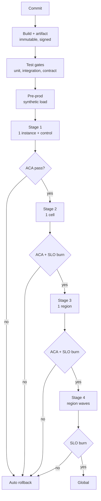
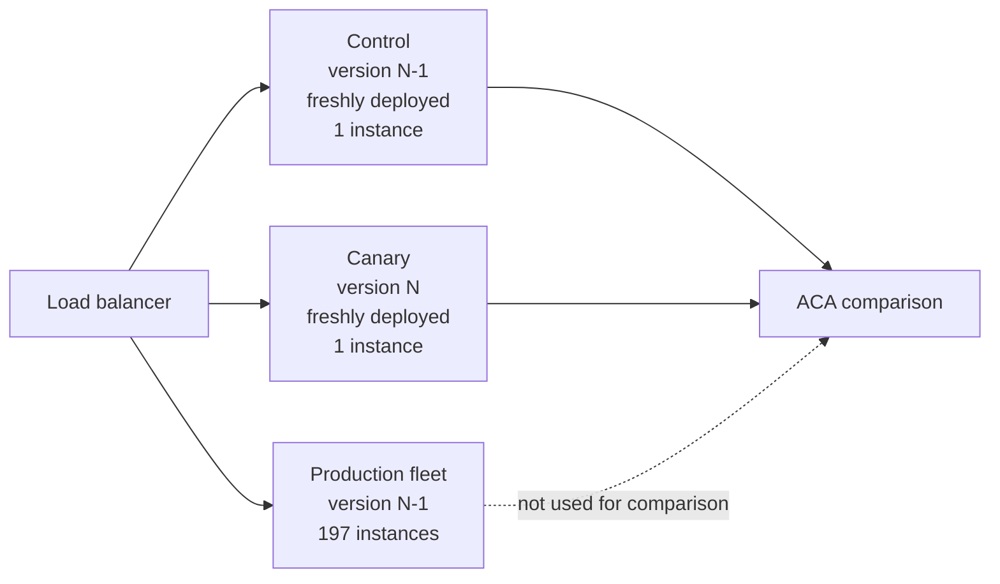
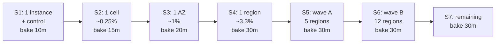
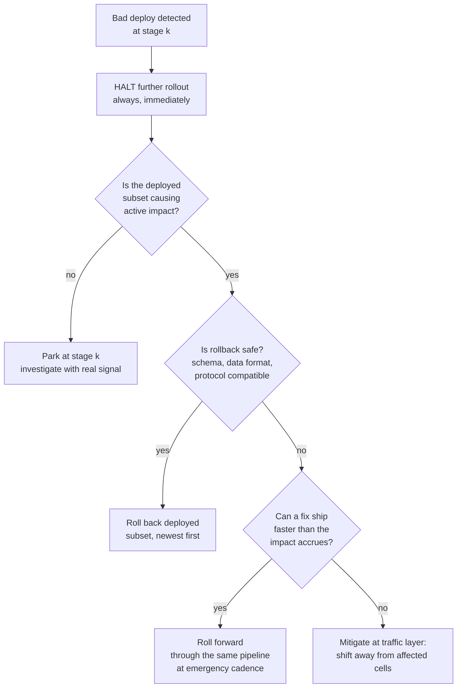
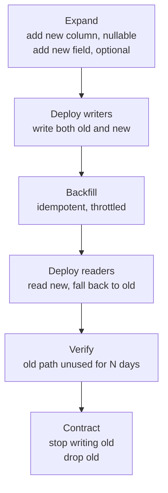

# S08 — Deployment Safety at Scale

<span class="pill pill-core">SRE Round</span>

**Design the release pipeline for thousands of services across dozens of regions so that no single deploy can take the company down — the hardest judgment call is the bake time at each stage, because too short and your canary analysis is statistically meaningless, too long and nothing ships and teams route around the pipeline.**

| | |
|---|---|
| **Commonly asked at** | Google, Amazon, Netflix, Meta, Microsoft, Stripe, Shopify, Datadog, Cloudflare |
| **Time budget** | 45 min |
| **Core tension** | Confidence vs. velocity — every mechanism that raises confidence in a release costs deploy latency, and a pipeline slow enough to be safe is a pipeline engineers will find ways to bypass |
| **Prerequisites** | [F25 Deployment & Release Safety](../fundamentals/f25-deployment-release-safety.md) · [F23 SLI/SLO & Error Budgets](../fundamentals/f23-slo-error-budgets.md) · [F03 Load Balancing](../fundamentals/f03-load-balancing.md) · [F26 Multi-Region & DR](../fundamentals/f26-multi-region-dr.md) · [F22 Observability](../fundamentals/f22-observability-fundamentals.md) · [F07 Replication & Consistency](../fundamentals/f07-replication-consistency.md) · [F11 Idempotency](../fundamentals/f11-idempotency.md) |

---

## 1. The Scenario As Given

> "We run about 3,000 services on roughly 200,000 instances across 30 regions, organised into cells. We do around 6,000 deploys a day. Our postmortems say something like 70% of our incidents are caused by a change we made. Last month one config push reached every region in under four minutes and took the product down globally for 22 minutes.
>
> Design the deployment pipeline and its safety mechanisms. I want to know exactly how a canary decision is made, what the rollout topology is, when rollback happens automatically, and what you do when you detect a bad deploy that is already half-way out."

The three places candidates lose this round:

| Where it goes wrong | What it sounds like | What it should sound like |
|---|---|---|
| Canary analysis stays hand-wavy | "We compare metrics against baseline and roll back if they look worse" | "Two-proportion z-test against a concurrently-deployed control group, minimum 22,000 requests per arm for a 2x MDE at 0.2% baseline, Bonferroni-corrected across 50 metrics" |
| Rollout topology has no arithmetic | "Deploy to one region first, then the rest" | "Exposure-weighted expected impact: 85% caught below 0.25% of the fleet, and the 3% that escape dominate the remaining risk" |
| Detection assumes a human | "The on-call would notice and roll back" | "SLO burn-rate alerts are wired directly to the rollout controller; no human in the detection loop" |
| Partial propagation is not addressed | "Roll back" | Distinguishes halt, roll back the deployed subset, and roll forward — with the criteria for each |
| Config is forgotten | Talks only about code | "Config and flag changes are deploys and get the same pipeline; the incident you described was a config push" |

!!! danger "The framing that wins the round"
    *"A deploy is the single most dangerous routine action we take — it is the leading cause of incidents by a wide margin. So the pipeline's job is not to ship code; it is to bound the blast radius of a mistake we have already decided we will make. Everything else — canary statistics, staging, bake times — is instrumentation for that one goal."*

---

## 2. Clarifying Questions to Ask First

**Shape of the estate**

1. Are services cellular, or is a region one large shared fleet? Cells give a natural staging unit and a natural blast-radius boundary; a monolithic regional fleet does not.
2. What is the traffic distribution across regions? If one region is 40% of traffic, "one region" is not a small stage.
3. What is the minimum traffic to a single instance? A service at 5 rps cannot do statistical canary analysis in any reasonable time, and it needs a completely different strategy.

**Change classes**

4. Does "deploy" include config and feature flags? It must. Config pushes propagate faster than code and cause a disproportionate share of global incidents precisely because they skip the pipeline.
5. What about data-plane changes — load balancer configuration, routing rules, DNS, service mesh policy? These have the largest blast radius and the weakest safety mechanisms in most organisations.
6. Schema migrations? These are the ones that break rollback, which changes the entire risk model.

**Existing machinery**

7. Do services have SLOs with burn-rate alerting? Automatic rollback needs a trustworthy trigger.
8. Is there a feature flag system? Decoupling deploy from release is the highest-leverage single change available here.
9. How long does a rollback actually take, end to end, measured? Not "we can roll back" — the p90 wall-clock number.

**Constraints**

10. What is the deploy latency budget? "Commit to global in 6 hours" and "commit to global in 45 minutes" produce different designs.
11. Are there compliance requirements — change approval records, segregation of duties, audit trails?
12. What is the current change freeze policy and what does it cost in deferred deploys?

**Success criteria**

13. My proposed targets: no single deploy can affect more than 5% of users before automated analysis has passed; 95% of bad deploys detected below 1% fleet exposure; automatic rollback with no human in the detection loop; and median commit-to-global under 4 hours.

---

## 3. Framework / Approach



### Step 1 — Treat every change class as a deploy

The incident in the prompt was a config push. That is not a coincidence; it is the norm.

| Change class | Typical propagation without a pipeline | Blast radius | Usually pipelined? |
|---|---|---|---|
| Application code | Minutes to hours | Service | Yes |
| Application config | Seconds to minutes | Service, often global | Often not |
| Feature flag | Seconds | Whatever the flag gates | Rarely |
| Infrastructure as code | Minutes | Region or global | Sometimes |
| Load balancer / mesh config | Seconds | Global | Almost never |
| DNS | Seconds to TTL | Global | Almost never |
| Schema migration | Minutes | Data, irreversibly | Sometimes |
| ML model | Minutes | Product behaviour | Rarely |

**Rule: anything that changes production behaviour goes through the same staged rollout and the same automated analysis.** The reason global config incidents are so common is exactly that config is fast and unstaged — the properties that make it convenient are the properties that make it dangerous. A flag flip that reaches 200,000 processes in 5 seconds is the highest-blast-radius operation in the company and it is usually a text box.

### Step 2 — Automated canary analysis (ACA)

The core question ACA answers: **is the canary version measurably worse than a comparable control, to a degree we care about, with enough evidence to act?** Every word in that sentence corresponds to a design decision.

#### 2.1 Compare against a control group, not a historical baseline



| Comparison target | What it controls for | What it fails to control for |
|---|---|---|
| Historical baseline (yesterday at this hour) | Nothing structural | Time of day, traffic mix, dependency health, neighbour load, campaign traffic, weather of the internet |
| Current production fleet | Time of day, traffic mix, dependency health | Process age: warm JIT, warm caches, established connection pools, settled GC heap |
| **Freshly deployed control at the same version as production** | Everything above, including process age | Only genuine version differences remain |

The control group is the single most important detail in ACA and the one most often missed. A freshly started canary has a cold JIT, an empty local cache, a connection pool that ramps, and a GC heap that has not settled. Compared to a warm production fleet, **every canary looks bad for the first several minutes** — so teams widen the thresholds until the analysis cannot detect anything real. Deploying an identical-version control at the same moment removes the entire class of confounder and lets you keep tight thresholds.

Additional requirements on the control:

- Same instance type, same AZ distribution, same load balancer weight.
- Receives statistically comparable traffic. Random weighting is usually sufficient; for services with heavy per-user skew, use a hashed cohort so both arms get a comparable user mix.
- Torn down when the canary stage completes, so it does not accumulate as a permanent cost.

#### 2.2 What to measure

| Class | Metrics | Test | Notes |
|---|---|---|---|
| **Correctness** | Error rate by class (5xx, 4xx separately), business-outcome rate (checkout success) | Two-proportion z-test | The primary signal; 4xx separated because a 4xx spike means a contract change |
| **Latency** | Fraction of requests exceeding the SLO threshold | Two-proportion z-test on the exceedance proportion | See 2.4 — do not compare raw percentiles |
| **Saturation** | CPU, memory, thread pool, connection pool, GC pause time, file descriptors | Welch's t-test on per-instance means | Catches leaks and regressions that have not yet caused errors |
| **Downstream behaviour** | Call rate and error rate to each dependency | Two-proportion z-test plus rate ratio | Catches an accidental N+1 or a removed cache |
| **Logs** | Rate of ERROR/FATAL lines, new exception signatures | Rate comparison; new-signature detection | New stack-trace signatures are a strong, cheap signal |
| **Resource cost** | CPU-seconds per request | Welch's t-test | A 30% cost regression is not an outage but it is a finding |

Weight these. A business-outcome regression is disqualifying; a 4% CPU increase is informational. The Kayenta model — classify each metric as pass / fail / high / low / nodata, then aggregate to a weighted score with a pass threshold — works well and is easy to explain.

#### 2.3 Sample size: the arithmetic that makes ACA real

For error rate, the comparison is two proportions. Required sample size per arm:

$$n = \frac{\left(z_{1-\alpha/2} + z_{1-\beta}\right)^{2}\left[p_1(1-p_1) + p_2(1-p_2)\right]}{(p_1 - p_2)^{2}}$$

With $\alpha = 0.01$ (two-sided, $z = 2.576$) and power $1-\beta = 0.90$ ($z = 1.2816$):

$$(2.576 + 1.2816)^2 = 3.8576^2 = 14.881$$

| Baseline $p_1$ | Detect $p_2$ | MDE | $n$ per arm | At 200 rps |
|---|---|---|---|---|
| 0.20% | 0.60% | 3x | 7,404 | 37 s |
| 0.20% | 0.40% | 2x | 22,247 | 111 s |
| 0.20% | 0.30% | 1.5x | 74,213 | 6.2 min |
| 0.20% | 0.25% | 1.25x | 267,240 | 22.3 min |
| 0.02% | 0.04% | 2x | 221,585 | 18.5 min |
| 0.02% | 0.06% | 3x | 73,802 | 6.2 min |

Worked for the 2x row at 0.2% baseline:

$$n = \frac{14.881 \times \left[0.002(0.998) + 0.004(0.996)\right]}{(0.002)^2} = \frac{14.881 \times 0.005980}{4 \times 10^{-6}} = 22{,}247$$

Three conclusions worth stating out loud, because they are the ones that separate a real design from a plausible-sounding one:

1. **A 2-minute canary at 200 rps can detect a doubling of a 0.2% error rate and essentially nothing subtler.** If someone claims their 90-second canary catches regressions, ask what MDE that corresponds to.
2. **The more reliable you already are, the harder canary analysis becomes.** At a 0.02% baseline, detecting a doubling needs 221,585 requests per arm — ten times more than at 0.2%. High-reliability services need longer bakes, larger canary fractions, or a shift to composite and business-outcome metrics.
3. **Low-traffic services cannot do statistical ACA at all.** A service at 5 rps needs 74 minutes to accumulate 22,247 requests. For those, the correct design is different: synthetic traffic amplification during the canary, longer bakes accepted as a cost, or reliance on staged rollout plus fast automatic rollback rather than on statistics.

#### 2.4 Latency: convert the tail to a proportion

Comparing raw p99 between two arms is a trap. Only 1% of samples inform the p99, so the effective sample size is $n/100$, and the standard error of a quantile estimate is

$$\mathrm{SE}(\hat{q}_p) \approx \frac{1}{f(q_p)}\sqrt{\frac{p(1-p)}{n}}$$

which depends on the unknown density $f$ at the quantile — exactly where the density is smallest and the estimate least stable. Detecting a 10% shift in p99 typically needs $10^5$–$10^6$ samples per arm.

The practitioner's move: **the SLO is already a threshold, so test the threshold directly.** "p99 latency below 1.2 s" is equivalent to "at most 1% of requests exceed 1.2 s", which is a proportion, which uses the same two-proportion test with far better statistical properties and a sample size you can actually reach.

| Approach | Samples for a meaningful result | Interpretability |
|---|---|---|
| Compare raw p99 values | $10^5$–$10^6$ per arm | Sensitive to outliers; unstable |
| Mann-Whitney U on full distributions | ~$10^4$ per arm | Detects any distributional shift, including harmless ones |
| **Threshold exceedance proportion** | Same as error rate: ~$2 \times 10^4$ | Directly expresses the SLO; easy to explain to anyone |

#### 2.5 Multiple comparisons

Evaluating 50 metrics at $\alpha = 0.05$ each:

$$P(\text{at least one false positive}) = 1 - (1 - 0.05)^{50} = 1 - 0.0769 = 92.3\%$$

**Over nine deploys in ten would be falsely flagged.** Teams respond by widening thresholds until ACA never fails, which is worse than having no ACA because it manufactures confidence.

| Correction | Per-metric $\alpha$ | Family-wise false positive rate | Cost |
|---|---|---|---|
| None | 0.05 | 92.3% | Unusable |
| Bonferroni | $0.05/50 = 0.001$ | $1 - 0.999^{50} = 4.9\%$ | Conservative; loses power on subtle regressions |
| Benjamini-Hochberg (FDR 0.05) | adaptive | Controls expected false-discovery proportion | Better power; harder to explain |
| **Tiered: strict for primary, lenient for informational** | 0.001 primary / 0.05 informational | Low on what matters | Practical, and what I would build |

The tiered approach in practice: three or four **primary** metrics (error rate, business outcome, latency exceedance, saturation) gate the rollout at a strict $\alpha$; the remaining 46 are **informational**, surfaced to the human reviewing the deploy but not blocking. This preserves power where it matters and keeps the false-alarm rate low enough that engineers still believe a failure.

#### 2.6 The peeking problem

Evaluating continuously and stopping when significance appears inflates the false positive rate far beyond the nominal $\alpha$ — a fixed-sample test evaluated at 100 points can have a true error rate several times its nominal one. Options:

=== "Fixed evaluation points"

    Evaluate only at pre-declared checkpoints: at $n/3$, $2n/3$, and $n$, with an alpha-spending function (O'Brien-Fleming or Pocock boundaries).

    - Simple, correct, easy to explain to a sceptical engineer.
    - Slightly slower to fail: you wait for the next checkpoint.
    - What I would ship first.

=== "Sequential testing"

    Always-valid p-values via mixture SPRT or a confidence-sequence method.

    - Can stop the moment evidence is sufficient; no penalty for continuous monitoring.
    - Faster rejection of bad canaries, which directly reduces exposure.
    - Harder to implement and much harder to explain when someone disputes a rollback.

=== "Guardrail short-circuit"

    Independent of the statistical test: if any primary metric breaches a hard absolute threshold — error rate above 5%, any crash loop, any OOM kill — abort immediately without waiting for significance.

    - Not a statistical test and should not pretend to be one.
    - Catches catastrophic regressions in seconds rather than minutes.
    - **Always include this.** Statistics are for subtle regressions; obvious ones need no statistics.

### Step 3 — Staged rollout topology



| Stage | Scope | Fleet share | Bake | What this stage can detect |
|---|---|---|---|---|
| S1 | 1 instance + 1 control | 0.0005% | 10 min | Crash loops, startup failures, gross error regressions, obvious latency and memory regressions |
| S2 | 1 cell (~500 instances) | 0.25% | 15 min | Statistically meaningful error/latency regressions; inter-instance interactions; cache behaviour at scale |
| S3 | 1 AZ | ~1% | 20 min | AZ-topology-dependent bugs; cross-AZ traffic changes |
| S4 | 1 region | 3.3% | 30 min | Regional dependency interactions; regional data-shape differences; a full traffic cycle of one hour if the bake allows |
| S5 | 5 regions | ~17% | 30 min | Cross-region interactions; replication behaviour; global coordination bugs |
| S6 | 12 regions | ~57% | 30 min | Load at scale; capacity effects |
| S7 | Remainder | 100% | — | — |

Total commit-to-global: roughly 2 hours 15 minutes of bake plus rollout mechanics — call it 3 hours. This is the number to negotiate against the velocity requirement, and it should be negotiated explicitly rather than quietly eroded.

**Bake time is not an arbitrary constant.** It must be the maximum of four quantities:

$$t_{bake} = \max\left(t_{statistical},\ t_{warmup},\ t_{slow-burn},\ t_{cyclical}\right)$$

| Component | What it represents | Typical |
|---|---|---|
| $t_{statistical}$ | Time to accumulate $n$ per arm at this stage's traffic | 2–20 min |
| $t_{warmup}$ | JIT compilation, cache fill, connection pool ramp, GC heap settling | 5–10 min |
| $t_{slow-burn}$ | Time for a resource leak to become visible (memory, FDs, connections) | 15–30 min |
| $t_{cyclical}$ | Time to cover periodic workloads: cron jobs, hourly batches, cache expiry | up to 1 h |

The $t_{cyclical}$ term is the one that catches people. A bug that only manifests when the hourly reconciliation job runs will pass a 15-minute bake every time, and you will discover it when the deploy is global and the hour turns.

### Step 4 — Automatic rollback wired to SLO burn

**No human in the detection loop.** A human noticing takes 5–15 minutes and that is 5–15 minutes of exposure at whatever the current stage is.

```yaml
rollback_triggers:
  # 1. Statistical: the canary is worse than the control.
  - name: aca_failure
    source: canary_analysis
    condition: "weighted_score < 75 OR any primary metric classified FAIL"
    action: rollback_stage
    latency_target: "within one evaluation interval (30s)"

  # 2. Absolute guardrail: no statistics needed.
  - name: guardrail_breach
    source: canary_metrics
    condition: "error_rate > 0.05 OR crash_loop_detected OR oom_kill_count > 0"
    action: rollback_stage
    latency_target: "< 15s"

  # 3. SLO burn: the user-visible signal, independent of the canary.
  - name: slo_burn
    source: slo_service
    condition: "burn_rate_5m > 14.4 AND burn_rate_1h > 14.4 AND deploy_active"
    action: rollback_all_deployed_stages
    latency_target: "< 60s"

  # 4. Downstream: we broke someone else.
  - name: dependent_service_burn
    source: slo_service
    condition: "any downstream consumer burn_rate_5m > 6 AND attributable_to_deploy"
    action: halt_and_alert            # not auto-rollback: attribution is uncertain
    latency_target: "< 120s"

  # 5. Human.
  - name: manual
    action: rollback_all_deployed_stages
    authorization: "any on-call engineer, no approval chain"
```

The critical wiring is trigger 3: **the same burn-rate alert that would page a human instead calls the rollout controller.** The controller knows which deploys are active in the affected scope and can attribute and act in under a minute. Attribution is the hard part, and it is why a deploy-event stream keyed by service, version, region, and cell must exist — without it, "which of the 340 deploys active right now caused this?" is unanswerable.

!!! warning "Auto-rollback needs a circuit breaker of its own"
    A rollback loop is a real failure mode: rollback triggers an alert, which triggers a rollback, which triggers an alert. Cap automatic rollbacks at one per deploy; after a single automatic rollback, the pipeline for that service is locked and requires human acknowledgement. Also handle the case where the rollback target is *also* bad — if version N-1 was already degraded, rolling back does not clear the alert, and the controller must stop rather than walk backwards through history.

### Step 5 — Deploy is the leading cause of incidents; design for that

The commonly cited figure across large operators is that 60–80% of incidents are triggered by a change. Take the prompt's 70%.

Arithmetic for this estate: 6,000 deploys per day. Suppose 0.3% are bad in a way that would cause user-visible impact — 18 bad deploys per day.

**Without staged rollout**, each bad deploy reaches 100% of the fleet before detection. With a 6-minute MTTD, expected impact per bad deploy is 6 minutes at full fleet exposure. Normalising full-fleet-minutes to 1.0:

$$I_{unstaged} = 1.0$$

**With the staged topology above**, suppose detection is distributed as: 85% caught at S1–S2 (exposure ≤ 0.25%), 12% caught at S3–S4 (exposure ~3.3%), 3% escape to global:

$$I_{staged} = 0.85(0.0025) + 0.12(0.033) + 0.03(1.0) = 0.00213 + 0.00396 + 0.03 = 0.0361$$

A **28x reduction** in exposure-weighted impact. But look at the composition: the 3% that escape contribute $0.03$ of $0.0361$, which is **83% of all remaining risk**.

That single number drives the next investment decision, and it is the most useful thing in this whole section. Adding a fourth bake stage does almost nothing. What matters is the classes of bug that staged rollout structurally cannot catch:

| Escape class | Why staging misses it | Counter-mechanism |
|---|---|---|
| Only manifests at full scale | Canary load is too small to trigger it (thundering herd, hot shard, connection limit) | Load testing; capacity-aware canary; cell-level stages sized to reveal saturation |
| Time-triggered | Fires at midnight, month end, or on a cron boundary | Time-shifted staging environments; longer bake covering the cycle; deliberate clock-boundary tests |
| Data-dependent | The bad record exists in one region only | Shadow traffic replay with production data; region ordering that puts diverse data shapes early |
| Interaction with another deploy | Each is fine alone | Cross-service integration canary; co-deploy detection |
| Slow resource leak | Grows over hours | Long-bake final stage; memory/FD trend analysis rather than point comparison |
| Config or schema, not code | Skipped the pipeline entirely | Put them in the pipeline (Step 1) |

**And the structural answer to the 3%: decouple deploy from release.** A feature behind a flag can be deployed globally, baked for days as dormant code, and then *released* progressively by flag percentage — with an instant, deploy-free kill switch. The flag flip is reversible in seconds; a rollback is reversible in minutes. Progressive delivery moves the risk from the slow, expensive control (deploy) to the fast, cheap one (flag).

### Step 6 — Detected mid-rollout: halt, rollback, or roll forward



**Halting is always the first action and it is always correct.** It is free, instant, reversible, and it caps exposure at the current stage. Every pipeline must support "stop where you are" as a distinct operation from "roll back", and it must be a single command.

Then the real decision:

| Situation | Action | Reasoning |
|---|---|---|
| Deployed subset is healthy; the signal came from ACA on a subtle metric | **Park** | You now have a real production signal at a bounded radius. This is the best possible investigation environment. Do not throw it away. |
| Deployed subset is causing impact; rollback is safe | **Roll back**, newest stage first | Fastest return to known-good. Roll back in reverse deployment order so the largest-exposure stages clear first. |
| Rollback is unsafe (schema written, data format changed, protocol incompatible) | **Roll forward** with a targeted fix at emergency cadence | Rolling back would itself be an untested change. This is why rollback-safety must be a property established *before* deploy. |
| Rollback is unsafe and no fix is available quickly | **Traffic-layer mitigation** | Shift traffic away from cells running the bad version. Slower to execute but does not touch the broken code path. |

!!! danger "Rollback is not always rollback"
    If version N wrote data that version N-1 cannot read, or added a message field that N-1 rejects, or dropped a column N-1 still queries, then "rolling back" is a **new, untested, forward change made under incident pressure**. This is the single most dangerous moment in deployment safety.

    The pipeline must therefore know, before the deploy starts, whether the change is rollback-safe. Compute it from: schema migration presence and direction, message-format compatibility checks, protocol version negotiation, and a declared `rollback_safe: true|false` in the deploy manifest that CI verifies rather than trusts. A deploy that is not rollback-safe gets a different, slower, more conservative rollout — longer bakes, smaller stages, and mandatory human approval at each gate — because its only exit is forward.

### Step 7 — Concurrent deploys and change freeze

With 6,000 deploys a day, hundreds of deploys are in flight at any moment. Two problems follow.

**Attribution.** When an SLO burns, which of the 340 active deploys is responsible? Without structured deploy events you cannot answer this, and the incident becomes a manual archaeology exercise. Requirements: every deploy emits start/stage/complete/rollback events keyed by service, version, region, cell, and instance set, into the same timeline the incident system reads. Attribution then ranks candidates by temporal proximity and dependency distance from the burning SLO.

**Change freeze during an incident.** The policy question the interviewer is fishing for.

| Freeze scope | Effect | Cost | When correct |
|---|---|---|---|
| None | Deploys continue during the incident | Adds confounding variables; a second bad deploy lands mid-incident | Never during a SEV1 |
| Affected service only | The suspected service is frozen | Minimal | SEV2, cause localised |
| Affected service + dependency closure | Anything that could influence the incident | Moderate | SEV1 with unclear cause |
| Global | Everything stops | Very high | SEV1 with unknown cause, or infrastructure-wide incident |
| Calendar freeze (peak season) | Days or weeks | Extreme, and it is back-loaded | Business-mandated; must be time-boxed |

The cost of a calendar freeze, quantified for this estate:

- 6,000 deploys/day. A 10-day freeze defers roughly 60,000 deploys.
- Those deploys do not disappear; they queue and then land in a compressed window.
- Batch size per service rises. If a service normally deploys 2 commits per release and now deploys 20, the probability that the release contains a defect rises roughly with batch size, and — crucially — **bisection becomes 10x harder**. Instead of "which of 2 commits", it is "which of 20".
- Empirically, the week after a long freeze has an elevated incident rate. The freeze did not remove risk; it moved and concentrated it.

The defensible policy, and the one I would argue for:

- **Incident freezes: yes**, scoped as narrowly as the cause is understood, lifted automatically when the incident resolves, and enforced by the pipeline rather than by an email.
- **Calendar freezes: minimise and reshape.** Rather than "no deploys for two weeks", use "no deploys that are not rollback-safe", "no schema migrations", "no changes to tier-0 services without VP approval", and "normal cadence for everything else". This preserves the safety intent while avoiding the batch-size explosion.
- **Always allow the exception path**: rollbacks, flag flips, and capacity changes are never frozen. Freezing rollback during a freeze is a genuine and recurring own-goal.

### Step 8 — Multi-service coordinated deploys

A schema change that requires service B to deploy before service A is a coordination problem, and manual coordination at 3,000 services does not scale.

**The anti-pattern**, which is worth naming explicitly because everyone has seen it: a wiki page titled "Release plan for Project Atlas" listing eleven steps across six teams with times in three timezones, a Slack channel, and a person whose job for the day is to say "ok, team B can go now". It fails because it depends on human availability, it has no automated verification between steps, it has no rollback plan that respects the ordering, and at any scale beyond a handful of services it becomes a full-time coordination role.

**The correct answer is to design the ordering away** using expand/contract — the same discipline as online schema migration.



| Phase | Property | Rollback-safe? |
|---|---|---|
| Expand: additive schema change | Old code ignores the new column | Yes |
| Deploy writers (dual-write) | Both formats present | Yes |
| Backfill | Idempotent, resumable, rate-limited | Yes — it only adds |
| Deploy readers | Reads new, falls back to old | Yes |
| Verify | Metric proving the old path is unused | — |
| Contract: drop old | **The first irreversible step** | No |

Each phase is independently deployable in any order relative to other services, because at every point both the old and the new shape are valid. There is no ordering constraint to coordinate. The cost is more phases and a longer calendar — typically days to weeks — and that cost is precisely what buys you the elimination of manual coordination and the preservation of rollback safety.

Where a genuine ordering constraint cannot be removed, encode it as a **machine-checked dependency in the deploy manifest**, not as a wiki page:

```yaml
deploy:
  service: checkout-api
  version: "5.2.0"
  requires:
    - service: pricing-service
      min_version: "3.4.0"
      scope: same_region          # must be satisfied per-region, not globally
      verification:
        query: 'min(service_version_numeric{service="pricing-service",region="$REGION"})'
        expect: ">= 30400"
  provides:
    - capability: "pricing_v2_protocol"
  rollback_safe: false
  rollback_blocked_reason: "writes pricing_v2 format that 5.1.x cannot parse"
  rollback_alternative: "roll forward to 5.2.1 with the parser fix"
```

The pipeline enforces this: it will not start the checkout deploy in a region until pricing is at the required version *in that region*. That converts a human coordination problem into a scheduling constraint the system solves, and it makes the constraint auditable and testable.

---

## 4. Worked Example

### 4.1 Canary configuration for `checkout-api`

Measured inputs:

- Production traffic: 20,000 rps globally; `eu-west-1` cell-03 receives 200 rps.
- Baseline 5xx rate: 0.20%.
- Latency SLO: 99.5% of requests under 1.2 s. Baseline exceedance: 0.18%.
- Fleet: 197 instances in the target region.

```yaml
canary:
  service: checkout-api
  stage: S1
  arms:
    canary:  { instances: 1, version: "5.2.0", weight: 0.005 }
    control: { instances: 1, version: "5.1.8", weight: 0.005 }   # freshly deployed
  # control weight matches canary exactly; production fleet is NOT the comparator

  warmup_seconds: 180        # excluded from analysis entirely
  bake_seconds: 900          # 15 min: max(statistical, warmup, slow-burn)

  evaluation:
    checkpoints_at: [0.33, 0.66, 1.0]        # O'Brien-Fleming alpha spending
    primary_alpha: 0.001                      # Bonferroni across 4 primaries
    informational_alpha: 0.05

  primary_metrics:
    - name: error_rate_5xx
      test: two_proportion_z
      mde: 2.0                                # detect a doubling
      direction: increase_is_bad
      weight: 40
    - name: latency_exceedance_1200ms
      test: two_proportion_z
      mde: 2.0
      direction: increase_is_bad
      weight: 25
    - name: checkout_success_rate
      test: two_proportion_z
      mde: 1.01                               # business outcome: tiny MDE, needs volume
      direction: decrease_is_bad
      weight: 30
    - name: memory_rss_slope
      test: welch_t
      direction: increase_is_bad
      weight: 5

  guardrails:                                 # absolute, no statistics, instant abort
    - "error_rate_5xx > 0.05"
    - "crash_loop_detected"
    - "oom_kill_count > 0"
    - "readiness_probe_failures > 3"

  informational_metrics: [cpu, gc_pause_p99, fd_count, conn_pool_wait,
                          downstream_pricing_rate, downstream_pricing_errors,
                          log_error_rate, new_exception_signatures, /* ... 38 more */]

  pass_threshold: 75            # weighted score out of 100
```

### 4.2 Does the bake time actually buy the sensitivity claimed?

At 200 rps per arm over a 900-second bake, minus 180 s warmup:

$$n = 200 \times (900 - 180) = 144{,}000\ \text{requests per arm}$$

Against the sample-size table, 144,000 per arm at a 0.2% baseline lands between the 1.5x row (74,213) and the 1.25x row (267,240). So this canary can reliably detect roughly a **1.4x** increase in error rate. That is a real, defensible statement to put in the deploy record, and it is the kind of claim most pipelines cannot make about themselves.

For the business-outcome metric with an MDE of 1.01 on a 98.5% success rate:

$$n = \frac{14.881\left[0.985(0.015) + 0.97515(0.02485)\right]}{(0.00985)^2} = \frac{14.881 \times 0.038996}{9.702 \times 10^{-5}} \approx 5{,}981$$

Comfortably satisfied at 144,000 — the business metric is *easier* to test than the error rate, because the effect size relative to the variance is larger. Worth noting: business-outcome metrics are often the most sensitive canary signal available and they are routinely omitted because they live in a different system from the infrastructure metrics. Wiring them in is cheap and high-value.

### 4.3 Exposure arithmetic for the full rollout

Fleet: 200,000 instances. Traffic-weighted exposure per stage:

| Stage | Instances | Traffic share | Cumulative bake | Exposure-minutes if bad and detected here |
|---|---|---|---|---|
| S1 | 1 + 1 control | 0.0005% | 15 min | $0.000005 \times 15 = 7.5 \times 10^{-5}$ |
| S2 | 500 | 0.25% | 30 min | $0.0025 \times 15 = 0.0375$ |
| S3 | 2,000 | 1.0% | 50 min | $0.010 \times 20 = 0.20$ |
| S4 | 6,600 | 3.3% | 80 min | $0.033 \times 30 = 0.99$ |
| S5 | 33,000 | 16.7% | 110 min | $0.167 \times 30 = 5.01$ |
| S6 | 114,000 | 57% | 140 min | $0.57 \times 30 = 17.1$ |
| S7 | 200,000 | 100% | — | $1.0 \times \text{MTTD}$ |

Interpretation: **catching a bad deploy at S2 costs 0.0375 fleet-minutes; missing it until global costs 6 fleet-minutes at a 6-minute MTTD — a 160x difference.** This is the number that justifies bake time to a team complaining about deploy latency. It also shows exactly where the curve bends: the jump from S4 to S5 multiplies exposure by 5, so S4 is the last cheap stage and deserves the most thorough analysis.

### 4.4 A real failure: detected at S5

```text
T+00:00  checkout-api 5.2.0 starts S1 in eu-west-1 cell-03.
T+15:00  S1 ACA PASS. score 94/100. n=144,000 per arm. No primary metric flagged.
T+15:30  S2 begins: full cell, 500 instances.
T+30:30  S2 ACA PASS. score 91/100.
T+31:00  S3 begins: eu-west-1a.
T+51:00  S3 PASS. score 89/100. Informational: memory_rss slope +2.1%/h flagged LOW
         confidence. Not blocking. Recorded.
T+51:30  S4 begins: all of eu-west-1.
T+81:30  S4 PASS. score 86/100. memory_rss slope now +2.4%/h, still informational.
T+82:00  S5 begins: wave A, 5 regions, 33,000 instances.
T+96:40  SLO burn alert: checkout availability, burn_rate_5m = 19.2 in us-east-1.
         Rollout controller attributes to deploy 5.2.0 (only active deploy in scope,
         temporal proximity 14m40s).
T+96:52  AUTO-HALT. Rollout stops. No further regions.
T+97:10  AUTO-ROLLBACK triggered for all stages S1-S5, newest first.
         Manifest checked: rollback_safe = true. Proceeding.
T+99:40  Wave A rolled back. Burn rate falling.
T+103:00 eu-west-1 (S1-S4) rolled back.
T+104:20 Burn rate normal. Total impact window 7m28s at ≤16.7% exposure.

POST-ANALYSIS
Cause: 5.2.0 added an in-memory LRU for pricing responses with no size bound in the
eviction path when the key cardinality exceeded 2^16. eu-west-1 has ~40,000 distinct
SKUs; us-east-1 has ~180,000. The bug required >65,536 distinct keys to manifest.

WHY IT ESCAPED: a data-shape-dependent bug. Every eu-west-1 stage was structurally
incapable of detecting it. The memory slope signal WAS present from S3 at +2.1%/h
but was classified informational and did not block.

ACTIONS
1. Region ordering: the first region stage must be the region with the highest
   cardinality on the service's primary dimension, not the smallest by traffic.
2. Promote memory slope to a primary metric for services with in-process caches.
3. Add a cardinality-shape comparison to pre-flight: warn when the canary region's
   key cardinality is below 25% of the global maximum.
```

Three lessons that generalise, and that are worth offering unprompted in the interview:

1. **"Deploy to the smallest region first" is a common default and it is often wrong.** Small regions have small data, and data-shape bugs are a major escape class. Order by data diversity, not by traffic size — or better, stage through two regions chosen to be maximally different.
2. **The signal was present three stages before the failure** and was suppressed by metric classification. Informational metrics that trend monotonically across stages should be escalated automatically; a flat 2% memory difference is noise, a 2% rising to 2.4% across successive stages is a trend.
3. **Automatic rollback worked and it is the reason this was 7 minutes rather than 40.** No human was in the detection loop.

---

## 5. Deep Dives

### 5.1 Canary analysis in depth: what the score actually means

A weighted score is convenient but it hides information, and the hiding is where trust is lost. The output should always be inspectable.

```python
from dataclasses import dataclass
from math import sqrt
from statistics import NormalDist

@dataclass
class MetricResult:
    name: str
    classification: str      # PASS | FAIL | NODATA
    p_value: float | None
    canary: float
    control: float
    weight: int

def two_proportion_z(x1: int, n1: int, x2: int, n2: int) -> float:
    """Two-sided p-value for H0: p1 == p2. Pooled variance."""
    p1, p2 = x1 / n1, x2 / n2
    p_pool = (x1 + x2) / (n1 + n2)
    se = sqrt(p_pool * (1 - p_pool) * (1 / n1 + 1 / n2))
    if se == 0:
        return 1.0
    z = (p1 - p2) / se
    return 2 * (1 - NormalDist().cdf(abs(z)))

def classify(x_can, n_can, x_ctl, n_ctl, alpha, min_n, direction) -> MetricResult:
    # Insufficient evidence is NOT a pass. This distinction matters more than the test.
    if n_can < min_n or n_ctl < min_n:
        return MetricResult("", "NODATA", None, 0, 0, 0)
    p = two_proportion_z(x_can, n_can, x_ctl, n_ctl)
    worse = (x_can / n_can > x_ctl / n_ctl) if direction == "increase_is_bad" \
            else (x_can / n_can < x_ctl / n_ctl)
    return MetricResult("", "FAIL" if (p < alpha and worse) else "PASS",
                        p, x_can / n_can, x_ctl / n_ctl, 0)
```

The design decisions embedded in those twenty lines, each of which has bitten real pipelines:

| Decision | Why |
|---|---|
| `NODATA` is distinct from `PASS` | A metric with no data is an *unknown*, not a success. A NODATA on a primary metric must block, because "the metric pipeline broke" is indistinguishable from "the service stopped emitting because it is broken" |
| One-sided interpretation of a two-sided test | A canary that is significantly *better* is not a failure. Test two-sided for correctness, then check direction before failing |
| Minimum sample size enforced separately from the test | A z-test on 40 requests will happily return a p-value. Requiring $n \geq n_{min}$ prevents acting on noise |
| Pooled variance under $H_0$ | Correct for the null hypothesis being tested; the unpooled form is for confidence intervals |

**The reporting requirement.** Every canary decision must show, for every metric: canary value, control value, absolute and relative difference, p-value, sample size, and classification. An engineer who has a deploy blocked and is shown only "score 72, FAIL" will lose trust in the system within two incidents and start looking for the override. Show the work.

### 5.2 Rollout topology: choosing stage boundaries

The stages are not arbitrary; each should be the smallest unit that can reveal a distinct class of bug.

| Boundary | Reveals | Do not skip because |
|---|---|---|
| Single instance | Startup, config parsing, crash loops, gross regressions | It is nearly free and catches the most common catastrophic failures in 90 seconds |
| Single cell | Inter-instance interaction, leader election, shared cache behaviour, statistical regressions | This is the first stage with enough traffic for real ACA |
| Single AZ | AZ-topology assumptions, cross-AZ latency and cost changes | Some failures only appear when all instances in a failure domain share a version |
| Single region | Regional data shape, regional dependencies, full traffic cycle | Data-shape bugs live here; see the worked example |
| Region wave | Cross-region replication, global coordination, capacity | Global coordination bugs need more than one region at the new version |

Two topology decisions that matter more than the stage count:

**Region ordering.** The naive default — smallest traffic first — optimises only for traffic exposure and ignores data diversity. Better: order by a composite of low traffic *and* high data diversity, and ensure the first two regions differ materially in data shape. If one region has 180,000 SKUs and another has 40,000, staging through only the small one guarantees you will not find cardinality bugs.

**Parallel vs. serial waves.** Serial is safer and slower. A reasonable compromise: serial through S4 (single region), then geometric waves — 1, 5, 12, remainder. The geometric growth keeps total time bounded while keeping early exposure small, and the exposure table in 4.3 shows why: the first four stages together account for 1.2 fleet-minutes of exposure while the last three account for 22.

**Dependency-aware ordering.** If service A and service B both deploy, and A depends on B, the pipeline should not put A's canary in a region where B is mid-rollout. This is the same constraint as the multi-service coordination problem in Step 8, applied at the scheduler level rather than the manifest level.

### 5.3 Rollback safety as a pipeline-enforced property

Rollback safety must be **computed and verified**, never declared and trusted.

| Change type | Rollback-safe? | How the pipeline detects it |
|---|---|---|
| Pure code change, no persistence or protocol change | Yes | No migration in the diff; no proto/schema file changed |
| Additive schema (nullable column, optional field) | Yes | Migration parser classifies as additive |
| Destructive schema (drop, rename, narrow type, NOT NULL) | **No** | Migration parser flags it; deploy manifest must acknowledge |
| New message field, old consumers ignore unknowns | Yes | Protobuf/Avro compatibility check in CI |
| New required message field | **No** | Compatibility check fails |
| Writes a new data format read by both versions | Yes | Requires an explicit dual-format test |
| Writes a new data format only the new version reads | **No** | Must be split into expand/contract phases |
| Config change with a new key the old version ignores | Yes | Schema-validated config with unknown-key tolerance |
| Config change removing a key the old version requires | **No** | Config schema diff |

```yaml
# CI-generated, not hand-written. Hand-written rollback_safe flags are always true.
rollback_analysis:
  version: "5.2.0"
  previous: "5.1.8"
  rollback_safe: false
  reasons:
    - type: schema
      detail: "migration 0142 adds NOT NULL column orders.pricing_version with no default"
      severity: blocking
    - type: message_format
      detail: "PricingRequest.tier_v2 is a required field; 5.1.8 rejects messages containing it"
      severity: blocking
  required_policy:
    stages: [S1, S2, S3, S4, S5, S6, S7]   # no stage skipping
    bake_multiplier: 2.0                    # double every bake
    human_approval_at: [S3, S5]
    forward_fix_branch_required: true       # a hotfix branch must exist before deploy starts
```

The policy consequence is the point: **a deploy that cannot roll back gets a slower, more conservative rollout, because its only exit is forward.** Making that automatic removes the judgment call from a person who is optimistic about their own change, and it creates a real incentive to use expand/contract.

### 5.4 Multi-service coordination and the manual-coordination anti-pattern

Why manual coordination fails at 3,000 services, enumerated concretely:

| Failure mode | Mechanism |
|---|---|
| Timezone gaps | Step 4 of 11 requires a team that is asleep; the sequence stalls half-applied for eight hours in a state nobody tested |
| No verification between steps | "Team B is done" means someone said so in Slack, not that a machine confirmed the version is live in all regions |
| No rollback plan that respects ordering | The forward plan has eleven ordered steps; the rollback plan is "revert everything", which has a different correct order that nobody derived |
| Partial application is an untested state | The plan tests the start state and the end state. The nine intermediate states are never tested and one of them will be occupied for hours |
| Coordination cost scales quadratically | Every pair of coordinating teams needs a channel, a schedule, and a shared mental model |
| The coordinator becomes a bottleneck and a single point of failure | And they are a person, who can be ill, on a plane, or wrong |

The hierarchy of solutions, best first:

**1. Eliminate the ordering (expand/contract).** Always preferred. Every intermediate state is valid, so there is no ordering to coordinate and no untested partial state. Cost: more phases, longer calendar, and the discipline to actually complete the contract phase rather than leaving dual-write code in place for two years.

**2. Encode the ordering as a machine-checked constraint.** When ordering genuinely cannot be removed, put `requires`/`provides` in the deploy manifest with a verification query, and let the pipeline enforce it per-region. Converts coordination into scheduling.

**3. Capability negotiation at runtime.** Services advertise supported protocol versions; callers negotiate down. Deploy order becomes irrelevant because the system self-adjusts. Cost: real complexity in the protocol layer, and a compatibility matrix that must be tested.

**4. Atomic multi-service release unit.** Deploy several services as a single unit that stages and rolls back together. Honest assessment: this is a distributed transaction over deploys, with all the attendant problems — see [F10 Distributed Transactions](../fundamentals/f10-distributed-transactions.md). It works for two or three tightly-coupled services and becomes unworkable beyond that. Use it sparingly and treat the need for it as a signal of excessive coupling.

**5. Manual coordination.** Acceptable only for genuinely exceptional, one-off migrations, with a written plan, a named owner, a tested rollback for each intermediate state, and a retrospective on why the ordering could not be designed away.

!!! tip "The organisational tell"
    If your company has a recurring "release coordination" meeting, the deploy ordering problem has been solved socially instead of technically, and it will not scale past the current headcount. The fix is expand/contract discipline enforced in CI — reject destructive migrations that are not part of a declared contract phase — rather than a better meeting.

---

## 6. What Can Go Wrong

| Risk | Detection | Mitigation |
|---|---|---|
| **Canary passes because the bake was too short to be significant** | Deploy records show $n$ per arm below the MDE requirement; incidents from deploys that passed ACA | Compute and record achieved MDE for every canary; fail the stage as NODATA when $n < n_{min}$ rather than passing |
| **Canary compared to a warm production fleet looks bad; thresholds widened until useless** | ACA failure rate near zero; thresholds much wider than measured variance | Freshly-deployed control group at the production version; exclude an explicit warmup window from analysis |
| **50 metrics at $\alpha=0.05$ produce a 92% false-alarm rate; team disables ACA** | High ACA failure rate with no corresponding incidents; override usage | Tiered alpha: strict on 3–4 primaries, lenient and non-blocking on the rest |
| **Config or flag changes bypass the pipeline entirely** | Incidents attributed to changes with no deploy record | All change classes go through staged rollout; flag changes staged by percentage with the same auto-rollback triggers |
| **Rollback is not actually safe and makes things worse** | Rollback attempted during an incident and impact increases | CI-computed `rollback_safe`; conservative policy for unsafe deploys; forward-fix branch required before the deploy starts |
| **Rollback loop: rollback triggers alert triggers rollback** | Repeated deploy/rollback cycles for one service | One automatic rollback per deploy, then lock the pipeline pending human acknowledgement; detect that N-1 is also unhealthy and stop |
| **Bad deploy detected but the pipeline has no "halt"** | Rollout continues while the team debates rollback | Halt is a distinct, single-command operation that always works and is always the first action |
| **Data-shape bug escapes because the canary region has small data** | Incidents in large regions from deploys that passed in small ones | Order regions by data diversity, not traffic size; cardinality-shape pre-flight comparison |
| **Informational metric trends across stages and is ignored** | Post-incident review finds the signal present 3 stages earlier | Auto-escalate informational metrics that move monotonically across successive stages |
| **Attribution fails: 340 deploys active, which one is it?** | Incident triage spends 15+ minutes identifying the change | Structured deploy events keyed by service/version/region/cell into the incident timeline; ranked attribution by temporal and dependency proximity |
| **Change freeze concentrates risk into the unfreeze window** | Elevated incident rate in the week after a freeze | Prefer risk-class freezes over blanket freezes; if a blanket freeze is unavoidable, unfreeze in staged waves rather than all at once |
| **Rollbacks frozen during a change freeze** | Team cannot roll back during a freeze-period incident | Rollbacks, flag flips, and capacity changes are permanently exempt from every freeze, by written policy |
| **Low-traffic services cannot do statistical ACA and get no protection** | Services with < 50 rps have no meaningful canary history | Synthetic traffic amplification during the canary; longer bakes; rely on staged rollout plus fast auto-rollback rather than statistics |
| **Deploy of service A breaks service B; A's own metrics look fine** | Downstream consumer SLO burn during A's rollout | Include downstream consumer SLIs in the ACA metric set; `dependent_service_burn` trigger with halt-and-alert |
| **Emergency override becomes the normal path** | Override usage rate above a few percent of deploys | Every override requires a written reason, is recorded, is reported weekly by team, and triggers a review above a threshold rate |
| **Pipeline latency drives teams to bypass it** | Direct-to-production deploys; "hotfix" used routinely | Measure and publish commit-to-global p50; treat it as an SLO of the pipeline; invest in parallelism and shorter safe bakes rather than accepting bypass |

---

## 7. The Artifact You'd Produce

### 7.1 Rollout policy (the deliverable a platform team would own)

```yaml
# rollout-policy.yaml — per service tier, enforced by the pipeline, versioned in git
apiVersion: deploy.internal/v1
kind: RolloutPolicy
metadata:
  name: tier0-default
  applies_to: { tier: 0 }

spec:
  change_classes: [code, config, flag, iac, schema, model]   # all of them

  stages:
    - id: S1
      scope: { instances: 1, with_control: true }
      bake: 15m
      analysis: { mode: statistical, required_mde: 2.0, min_samples_per_arm: 22000 }
      on_fail: rollback
    - id: S2
      scope: { cells: 1 }
      bake: 15m
      analysis: { mode: statistical, required_mde: 1.5 }
      on_fail: rollback
    - id: S3
      scope: { availability_zones: 1 }
      bake: 20m
      analysis: { mode: statistical_plus_slo }
      on_fail: rollback
    - id: S4
      scope: { regions: 1, selection: highest_data_diversity }
      bake: 30m
      analysis: { mode: statistical_plus_slo }
      on_fail: rollback
    - id: S5
      scope: { regions: 5 }
      bake: 30m
      analysis: { mode: slo_burn }
      on_fail: rollback_all
    - id: S6
      scope: { regions: 12 }
      bake: 30m
      analysis: { mode: slo_burn }
      on_fail: rollback_all
    - id: S7
      scope: { regions: remaining }
      bake: 30m
      analysis: { mode: slo_burn }
      on_fail: rollback_all

  rollback:
    automatic: true
    max_automatic_per_deploy: 1        # then lock and require human ack
    order: reverse_stage
    verify_target_health: true         # do not roll back onto a known-bad version

  triggers:
    slo_burn: { fast: 14.4, slow: 6.0, window_fast: 5m, window_slow: 1h }
    guardrails: ["error_rate > 0.05", "crash_loop", "oom_kill"]

  freeze:
    respects_incident_freeze: true
    exempt_operations: [rollback, flag_disable, capacity_scale]   # never frozen

  not_rollback_safe_policy:
    bake_multiplier: 2.0
    allow_stage_skip: false
    human_approval_at: [S3, S5]
    require_forward_fix_branch: true

  override:
    allowed: true
    requires: [written_reason, second_approver]
    audit: true
    weekly_report: true
    review_threshold: 0.02             # >2% of deploys overridden triggers a review
```

### 7.2 Deploy record (the audit and attribution artefact)

```json
{
  "deploy_id": "DEP-2026-09-25-004821",
  "service": "checkout-api",
  "version": "5.2.0",
  "previous_version": "5.1.8",
  "artifact_digest": "sha256:3f9a...",
  "commit_range": ["a1b2c3d", "f4e5d6c"],
  "initiated_by": "ci-pipeline",
  "policy": "tier0-default",
  "rollback_analysis": { "rollback_safe": true, "reasons": [] },
  "stages": [
    {
      "id": "S1", "started": "T+00:00", "ended": "T+15:00", "result": "PASS",
      "scope": {"instances": 1, "region": "eu-west-1", "cell": "cell-03"},
      "analysis": {
        "score": 94, "samples_per_arm": 144000, "achieved_mde": 1.41,
        "metrics": [
          {"name":"error_rate_5xx","canary":0.0021,"control":0.0020,
           "p":0.41,"class":"PASS"},
          {"name":"latency_exceedance_1200ms","canary":0.0018,"control":0.0019,
           "p":0.63,"class":"PASS"},
          {"name":"checkout_success_rate","canary":0.9851,"control":0.9849,
           "p":0.55,"class":"PASS"},
          {"name":"memory_rss_slope","canary":0.021,"control":0.002,
           "p":0.09,"class":"PASS","note":"informational, trending"}
        ]
      }
    }
  ],
  "final_state": "ROLLED_BACK",
  "rollback": {
    "trigger": "slo_burn",
    "detected_at": "T+96:40",
    "burn_rate_5m": 19.2,
    "attribution_confidence": 0.94,
    "halted_at": "T+96:52",
    "completed_at": "T+103:00",
    "impact_window_seconds": 448,
    "max_exposure_fraction": 0.167
  }
}
```

### 7.3 The one-page whiteboard summary

```text
DEPLOYMENT SAFETY — the six things

1. EVERY CHANGE IS A DEPLOY
   code | config | flags | IaC | mesh | DNS | schema | models
   The global outage you described was a config push. Config skips the pipeline
   because it is fast. That is exactly why it is dangerous.

2. CANARY vs CONTROL, NEVER vs BASELINE
   Control = same version as prod, deployed at the same moment, same weight.
   Removes warmup, time-of-day, traffic-mix, and dependency-health confounders.

3. THE STATISTICS MUST BE REAL
   n = (z_a + z_b)^2 [p1(1-p1) + p2(1-p2)] / (p1-p2)^2
   0.2% baseline, detect 2x, a=0.01, power 0.90  ->  22,247 per arm
   Tiered alpha: strict on 3-4 primaries, lenient on the rest.
   NODATA is not PASS.
   Test latency as threshold-exceedance proportion, not as raw p99.

4. STAGES SIZED BY WHAT THEY CAN REVEAL
   instance -> cell -> AZ -> region -> waves
   bake = max(statistical, warmup, slow-burn, cyclical)
   Order regions by DATA DIVERSITY, not by traffic size.

5. NO HUMAN IN THE DETECTION LOOP
   SLO burn-rate alert -> rollout controller -> halt -> rollback.
   One automatic rollback per deploy, then lock.
   Verify the rollback target is healthy before rolling onto it.

6. HALT FIRST, THEN DECIDE
   halt (always, free) -> park | rollback | roll forward | traffic mitigation
   rollback_safe is COMPUTED by CI, never declared by a human.
   Not rollback-safe => slower policy, because the only exit is forward.
```

---

## 8. Gotchas & Corner Cases

!!! gotcha "GOTCHA-1: The canary is compared to a warm fleet and always looks bad"
    **Symptom.** Every canary shows elevated latency and CPU for the first five minutes. The team responds by widening thresholds until ACA effectively never fails, and then a real regression sails through. **Mechanism.** A freshly started process has a cold JIT, an empty local cache, a connection pool that is still ramping, and an unsettled GC heap. Compared against a fleet that has been running for days, it is worse on every dimension — for reasons that have nothing to do with the code change. **Mitigation.** Deploy a control group at the *current production version* at the same moment, with the same weight and instance type, and compare canary to control. Additionally exclude an explicit warmup window (3 minutes is a reasonable default, longer for JVM services) from the analysis entirely. This lets you keep tight thresholds, which is the whole point.

!!! gotcha "GOTCHA-2: Fifty metrics at alpha 0.05 means a 92% false-alarm rate"
    **Symptom.** ACA fails on most deploys, for a different metric each time, with no corresponding production impact. Within a month, everyone uses the override. **Mechanism.** $1 - 0.95^{50} = 0.923$. With fifty independent tests you will almost always find one "significant" difference by chance. **Mitigation.** Tiered significance: three or four primary metrics at a Bonferroni-corrected $\alpha = 0.001$ gate the rollout; the other 46 are informational and surfaced but never blocking. Track the override rate as a health metric of the pipeline — a rate above a few percent means the analysis is not trusted and that is a defect in the analysis, not in the engineers.

!!! gotcha "GOTCHA-3: NODATA silently counts as PASS"
    **Symptom.** A deploy that crashed on startup passes canary analysis with a perfect score. **Mechanism.** The canary emitted no metrics because the process never became healthy. The analysis found no data, computed no failures, and reported success. This is the same class of bug as an alert rule evaluating an empty result set as "not breaching". **Mitigation.** `NODATA` on a primary metric is a *failure*, not a pass. Additionally require a minimum absolute sample count per arm before any conclusion is drawn, and assert that the canary instance is actually in the load balancer and receiving the expected request rate within the first 60 seconds — comparing the observed rate against the predicted rate catches routing problems immediately.

!!! gotcha "GOTCHA-4: Rollback makes it worse because version N wrote data N-1 cannot read"
    **Symptom.** The rollback completes and the error rate goes *up*. Now you have an incident with no working version. **Mechanism.** The new version wrote records with a new schema, a new enum value, or a new message field. The old version deserialises them and throws. "Rolling back" was in fact an untested forward change applied under pressure. **Mitigation.** Compute `rollback_safe` in CI from the migration diff, the protobuf/Avro compatibility check, and the config schema diff — never from a hand-written flag, because hand-written flags are always `true`. Deploys that are not rollback-safe get a conservative policy: doubled bakes, no stage skipping, human approval at two gates, and a forward-fix branch that must exist *before* the deploy starts.

!!! gotcha "GOTCHA-5: The rollback loop"
    **Symptom.** A service deploys, rolls back, deploys again, rolls back again, six times in twenty minutes, while the pipeline dutifully retries. **Mechanism.** The rollback triggered an alert (instance churn, connection resets), which the controller interpreted as a new failure, which triggered another action. Or CI re-triggered the deploy automatically on the same commit. **Mitigation.** One automatic rollback per deploy, then lock the pipeline for that service pending explicit human acknowledgement. Suppress deploy-related alerts for a short window after any rollback. And handle the case that matters most: **verify the rollback target is healthy before rolling onto it** — if N-1 is also degraded, walking backwards through history is not a recovery strategy.

!!! gotcha "GOTCHA-6: Config and feature flags skip the pipeline and cause the global outage"
    **Symptom.** A one-line config change reaches 200,000 processes in four seconds and takes the product down globally. Every code deploy that day went through a three-hour staged rollout. **Mechanism.** Config distribution is optimised for propagation speed because that is what makes it useful operationally. Speed of propagation is exactly the property that makes blast radius unbounded. **Mitigation.** Config and flag changes get staged rollout with the same analysis: percentage-based flag rollout (1%, 5%, 25%, 100%) with bake and auto-rollback at each step, config distributed per-cell rather than globally, schema validation on the config before distribution, and a mandatory dry-run that reports which processes would change behaviour. The exception — and it must be explicit — is a flag *disable*, which is a mitigation and should always be instant and global.

!!! gotcha "GOTCHA-7: Data-shape bugs escape because the canary region is the smallest one"
    **Symptom.** A deploy passes every stage in `eu-west-1` and takes down `us-east-1` within fifteen minutes of arriving there. **Mechanism.** The rollout order was "smallest traffic first", which is also "smallest data first". Bugs that depend on cardinality, key distribution, record size, or tenant count are structurally undetectable in the small region. The worked example — an unbounded cache above 65,536 distinct keys — is exactly this. **Mitigation.** Order regions by data diversity, not traffic size, and ensure the first two region stages differ materially in data shape. Add a pre-flight comparison that warns when the canary region's cardinality on the service's primary dimension is below 25% of the global maximum. Accept slightly higher traffic exposure in exchange for far better detection.

!!! gotcha "GOTCHA-8: The signal was there three stages ago and was classified informational"
    **Symptom.** The post-incident review finds that memory growth was flagged at S3 and again at S4, both times as informational, and the deploy proceeded to S5 where it broke. **Mechanism.** Metric classification is per-stage and stateless. A 2.1% difference is genuinely not significant in isolation; a 2.1% growing to 2.4% growing to 2.9% across successive stages is a trend, and nothing in the system was looking across stages. **Mitigation.** Track informational metrics *across* stages within a deploy and auto-escalate any that move monotonically in the bad direction over three or more stages. This is cheap to implement and catches an entire class of slow regression that per-stage analysis cannot.

!!! gotcha "GOTCHA-9: 340 deploys are active and nobody can attribute the incident"
    **Symptom.** An SLO burns. Fifteen minutes of the incident are spent determining which change caused it, while the rollout of the actual culprit continues in the background. **Mechanism.** Deploy events are not structured, not centralised, or not keyed at a granularity that allows scoping to the affected region and cell. **Mitigation.** Every deploy emits start / stage-enter / stage-exit / complete / rollback events keyed by service, version, region, cell, and instance set, into the same timeline the incident system consumes. Attribution ranks candidates by temporal proximity and dependency distance from the burning SLO, and the rollout controller can act on a high-confidence attribution without a human. This also makes the change freeze enforceable, because you know what is in flight.

!!! gotcha "GOTCHA-10: The change freeze concentrates risk instead of removing it"
    **Symptom.** A two-week freeze passes without incident, and the week after the unfreeze has triple the normal incident rate. **Mechanism.** 6,000 deploys a day deferred for ten days is roughly 60,000 queued deploys. Per-service batch size rises by an order of magnitude, defect probability rises with batch size, and bisection becomes an order of magnitude harder. The freeze moved risk in time and concentrated it. **Mitigation.** Prefer risk-class freezes — no non-rollback-safe changes, no schema migrations, no tier-0 changes without approval — over blanket freezes. If a blanket freeze is mandated, unfreeze in waves by tier over several days rather than all at once, and cap per-service batch size on the first post-freeze deploy.

!!! gotcha "GOTCHA-11: Rollbacks are frozen during the change freeze"
    **Symptom.** An incident occurs during a freeze; the team cannot roll back because "no changes are permitted"; the outage extends while someone finds an approver. **Mechanism.** The freeze was implemented as a blanket block in the deploy system, with no exemption categories, by someone reasoning about forward changes only. **Mitigation.** Rollbacks, feature flag disables, and capacity scaling are permanently exempt from every freeze, written into the policy and implemented as a distinct code path in the pipeline rather than as a human exception process. Test it: attempt a rollback during a freeze in a drill, and if it requires a conversation, the policy is wrong.

!!! gotcha "GOTCHA-12: Low-traffic services get no canary protection at all"
    **Symptom.** Tier-0 services with modest traffic — an admin API, a settlement job, an internal control plane — have canary analysis configured, and it has never failed, because it has never had enough samples to conclude anything. **Mechanism.** At 5 rps, reaching 22,247 requests per arm takes 74 minutes. The configured 10-minute bake accumulates 3,000 requests, which is nowhere near enough, and the analysis dutifully returns PASS. **Mitigation.** Be explicit that statistical ACA does not apply below a traffic threshold, and design differently for those services: synthetic traffic amplification during the canary window, materially longer bakes accepted as a known cost, shadow traffic replay, and heavier reliance on staged rollout with fast automatic rollback on SLO burn rather than on pre-emptive statistics. Never let a service carry a canary configuration that cannot possibly conclude anything — that is worse than no canary, because it manufactures confidence.

!!! gotcha "GOTCHA-13: Service A's deploy breaks service B, and A's own metrics look perfect"
    **Symptom.** A deploy passes every canary gate on its own metrics while a downstream consumer's error rate triples. **Mechanism.** The change altered response semantics, removed an optional field, changed a default, tightened validation, or changed the call pattern to a shared dependency. Service A returns 200s throughout — it is the *content* or the *load shape* that broke someone else. **Mitigation.** Include downstream consumer SLIs in the ACA metric set for any service with known consumers, derived from the service graph. Add a `dependent_service_burn` trigger that halts the rollout and alerts rather than auto-rolling-back, because attribution across a service boundary is less certain and a false auto-rollback across teams is expensive. Contract tests in CI catch the schema cases but not the load-shape ones, which is why the runtime signal is still needed.

!!! gotcha "GOTCHA-14: The emergency override becomes the normal path"
    **Symptom.** Audit shows 18% of deploys used the emergency override in the last quarter, mostly by two teams, mostly on Fridays. **Mechanism.** The pipeline is slower than the team's expectations, the override exists, and nothing pushes back. Each individual use is locally justified. **Mitigation.** Overrides require a written reason and a second approver, are recorded in the deploy record, and are reported weekly per team. Above a threshold rate (2% is a reasonable line) the pipeline triggers an automatic review. But treat a high override rate primarily as **feedback about pipeline latency**, not as a discipline problem: if commit-to-global is three hours and teams need thirty minutes for a hotfix, build a legitimate fast path with narrower scope and tighter auto-rollback rather than letting the override be the fast path.

---

## 9. Interview Angle

!!! interview "What the interviewer is scoring"
    1. **Can you do the canary statistics?** Sample size, MDE, control group, multiple comparisons, peeking. Most candidates cannot, and this is the single clearest differentiator in the round.
    2. **Do you use a concurrently-deployed control group?** Naming this unprompted signals real operational experience, because you only learn it after watching a team widen thresholds into uselessness.
    3. **Do you quantify exposure?** "Catching at S2 costs 0.0375 fleet-minutes; missing to global costs 6" is the argument that justifies bake time to a team complaining about velocity.
    4. **Is detection automated?** Any answer with a human noticing and deciding loses a level.
    5. **Do you treat config and flags as deploys?** The incident in the prompt was a config push. Not connecting that is a comprehension failure, not just a knowledge gap.
    6. **Do you handle partial propagation properly?** Halt first, always. Then park, roll back, roll forward, or mitigate at the traffic layer, with criteria for each.
    7. **Is rollback safety computed or declared?** Hand-written `rollback_safe` flags are always `true`.
    8. **Do you design the coordination away?** Expand/contract over manual release plans.

!!! interview "The moment that wins the round"
    When asked "how long should the canary bake?", do not give a number. Say: *"It depends on what MDE I need. At a 0.2% baseline with alpha 0.01 and 90% power, detecting a doubling needs 22,247 requests per arm. At 200 rps that is under two minutes of statistics — but the bake also has to cover warmup, slow-burn leaks, and any cyclical workload, so the binding constraint is usually not the statistics. For this service I would say 15 minutes, and I would record the achieved MDE in the deploy record so we can audit whether our canaries are actually capable of detecting anything."* Then write the formula.

??? note "Follow-up 1 — Your canary passed but the deploy still broke production. What went wrong and how do you fix it?"
    Six causes, and I would work through them in order of likelihood.

    **Insufficient power.** The canary did not have enough samples to detect the regression. Check the achieved MDE against the actual effect size. If the bug increased errors by 30% and the canary could only detect a doubling, it passed correctly and the design was wrong. Fix: record achieved MDE on every canary and treat an MDE that is too coarse for the service's tier as a policy violation.

    **Scale-dependent bug.** The failure requires load the canary never saw — a thundering herd, a connection limit, a hot shard, lock contention. Structurally undetectable by a 1-instance canary. Fix: load testing, and cell-level stages sized large enough to reveal saturation.

    **Data-shape dependence.** The worked example: a cardinality bug invisible in a small region. Fix: order regions by data diversity and add a cardinality pre-flight comparison.

    **Time dependence.** A cron boundary, month end, a cache expiry cycle. Fix: bake time must cover the cycle, or deliberately test the boundary.

    **Interaction with another concurrent deploy.** Each change is fine alone. Fix: co-deploy detection and dependency-aware scheduling.

    **Wrong metrics.** The regression was real and visible, but in a metric nobody was watching — often a business outcome or a downstream consumer's SLI. Fix: include business-outcome metrics and downstream consumer SLIs in the metric set.

    The meta-point I would make: **a canary that passes is not proof of safety; it is a bound on a specific class of regression at a specific effect size.** Every post-incident review of a deploy that passed ACA should update the metric set or the policy, and I would track "incidents from deploys that passed canary" as the primary SLI of the canary system itself.

??? note "Follow-up 2 — How long should a canary bake? Give me a number and defend it."
    The number depends on which of four constraints binds, and I would compute all four.

    **Statistical.** With a 0.2% baseline error rate, $\alpha = 0.01$, 90% power, and a 2x MDE, I need 22,247 requests per arm. At 200 rps that is 111 seconds.

    **Warmup.** JIT compilation, cache fill, connection pool ramp, GC heap settling. Three to ten minutes depending on runtime, and this window must be *excluded* from analysis rather than included.

    **Slow burn.** Memory leaks, file descriptor leaks, connection leaks. These need 15–30 minutes of trend before a slope is distinguishable from noise.

    **Cyclical.** If the service has an hourly batch, a cron job, or a cache TTL cycle, the bake must cover it or the bug that only fires on that boundary will pass every canary and surface after global rollout.

    So: $t_{bake} = \max(111\text{s}, 10\text{m}, 20\text{m}, t_{cyclical})$. For a service with no strong cycle, **15 minutes** is my answer, and the binding constraint is slow-burn detection, not statistics.

    Two refinements I would add. Bake time should be **per-stage**, longer where traffic is lower (because the statistical term binds) and longer at the last pre-global stage (because it is the last chance). And it should be **per-tier**: a tier-2 internal service does not need the same rigour as checkout, and applying uniform policy is how you end up with a pipeline teams route around.

??? note "Follow-up 3 — A bad deploy is out to 40% of the fleet when you detect it. Walk me through what you do."
    **First, halt.** Unconditionally, immediately, before any discussion. Halting is free, instant, and caps exposure at 40% instead of letting it reach 100% while people debate. This must be a single command distinct from rollback, and I would make sure the pipeline supports it as a first-class operation.

    **Second, assess impact.** Is the deployed 40% actively causing user impact, or did ACA flag something subtle at a stage boundary? These lead to opposite actions. If there is no active impact, **parking** at 40% is often the best move — you now have a real production signal at a bounded, known radius, which is a far better investigation environment than staging. Throwing that away by rolling back immediately is a mistake people make from reflex.

    **Third, if there is active impact, check rollback safety** — which should already be a computed field on the deploy record, not a judgment call at 03:00. If safe: roll back, newest stage first, so the largest-exposure stages clear earliest. Verify the rollback target is actually healthy before rolling onto it.

    **Fourth, if rollback is unsafe**, I have two options. Roll forward with a targeted fix through the same pipeline at emergency cadence — smaller stages, shorter bakes, accepted risk — which requires the forward-fix branch to already exist, which is why the policy requires it before a non-rollback-safe deploy starts. Or mitigate at the traffic layer: shift traffic away from the cells running the bad version. Slower to execute but it does not touch the broken code path at all, and it composes with either of the other options.

    Throughout: the incident record captures each decision with a timestamp, and the deploy is locked from further automatic action after the first automatic rollback so the system does not fight the humans.

??? note "Follow-up 4 — Should rollback be fully automatic, with no human involved?"
    Yes for detection, mostly yes for action, with three carve-outs.

    **Detection must never involve a human.** A human noticing takes 5–15 minutes, and during a rollout that is the difference between 3% and 57% exposure. The SLO burn-rate alert that would page someone should instead call the rollout controller, which can attribute and act in under a minute.

    **Action should be automatic when the change is rollback-safe.** The cost of an unnecessary rollback is small — you redeploy later. The cost of a delayed rollback scales with exposure. That asymmetry argues strongly for automation.

    Three carve-outs. **First, when the change is not rollback-safe**, automatic rollback could make things worse, so the automatic action is *halt plus page*, not rollback. **Second, cross-service attribution** — if service A's rollout correlates with service B's SLO burn, attribution is less certain and a false auto-rollback across a team boundary is expensive in trust as well as in time; halt and alert. **Third, after one automatic rollback**, lock the pipeline and require human acknowledgement, to prevent loops.

    Two safety properties that are easy to forget: verify the rollback *target* is healthy before rolling onto it, because rolling back onto an also-broken N-1 is not recovery. And suppress deploy-related alerts briefly after a rollback, because instance churn generates signals that can look like a new failure.

    The number I would track to prove it works: **percentage of bad deploys where rollback started before any human acknowledged the page.** Target above 90%.

??? note "Follow-up 5 — Team X says the pipeline is too slow and wants to deploy straight to production. What do you say?"
    I treat it as valid feedback about the pipeline, not as a discipline problem, because the failure mode where teams route around the pipeline is far more dangerous than a slow pipeline.

    First I would get the actual number: measure commit-to-global p50 and p90 and treat it as an **SLO of the pipeline itself**. If it is three hours and the team needs thirty minutes for a hotfix, the pipeline has a real gap and building a legitimate fast path is better than pretending the gap does not exist.

    Then I would look for latency I can remove without removing safety. Parallelise independent stages. Shorten bakes where the statistical term does not bind — if a stage has 10x the traffic, it reaches significance 10x faster and the bake can shrink accordingly. Skip stages for changes CI has proven are low-risk: no migration, no protocol change, rollback-safe, small diff. Tier the policy so tier-2 internal services do not carry tier-0 rigour.

    Then I would offer a real fast path with explicit trade-offs: smaller scope (one region only), tighter auto-rollback thresholds, mandatory rollback-safety, and expiry — the fast-path deploy must either be promoted through the normal pipeline within 24 hours or be rolled back automatically. That prevents the fast path from becoming the permanent path.

    And the structural answer: **feature flags**. If the team's real need is "get this in front of users quickly", the answer is to deploy dormant code on the normal safe schedule and flip a flag in seconds. Progressive delivery moves the urgency from the slow control to the fast one, and it gives a kill switch that is faster than any rollback.

    What I would not do is grant a blanket exception. Exceptions become the norm; I have watched an override rate go from 2% to 18% in two quarters with no single decision responsible.

??? note "Follow-up 6 — How do you deploy a schema change that requires three services to update in a specific order?"
    I design the ordering away, because manual coordination does not scale and every intermediate state of an ordered plan is a state nobody tested.

    **Expand/contract.** Phase 1: expand the schema additively — new column nullable, new field optional. Old code ignores it. Phase 2: deploy writers that write both old and new formats, in any order across the three services, because both formats are valid everywhere. Phase 3: backfill, idempotent and throttled. Phase 4: deploy readers that prefer the new format and fall back to the old, again in any order. Phase 5: verify the old path is unused with a metric, for a defined soak — days, not hours. Phase 6: contract — stop writing old, then drop old. This is the first irreversible step and it gets its own conservative rollout.

    Every phase before 6 is independently rollback-safe and order-independent. There is no coordination problem left to solve. The cost is calendar time, typically one to three weeks, and the discipline to actually finish phase 6 rather than leaving dual-write code in place indefinitely — which is the real failure mode of expand/contract in practice.

    **When ordering genuinely cannot be removed** — a protocol change with no compatible intermediate, for example — I encode it as a machine-checked constraint: `requires: {service: X, min_version: Y, scope: same_region}` with a verification query, in the deploy manifest. The pipeline refuses to start the dependent deploy in a region until the constraint is satisfied *in that region*. That converts a human coordination problem into a scheduling constraint the system solves, and it makes the constraint auditable and testable rather than a line in a wiki.

    What I would explicitly avoid: a written release plan with eleven ordered steps across six teams. It depends on human availability across timezones, has no automated verification between steps, has no correct rollback ordering derived, and leaves the system sitting in untested intermediate states for hours.

??? note "Follow-up 7 — Is a change freeze during an incident worth its cost?"
    Yes for a scoped freeze, almost never for a blanket calendar freeze.

    **During an incident**, a freeze is clearly worth it, because every concurrent change adds a confounding variable to an already-hard attribution problem, and a second bad deploy landing mid-incident is a genuinely awful outcome. But scope it as narrowly as the cause is understood: the affected service for a localised SEV2, the dependency closure for a SEV1 with an unclear cause, global only for an infrastructure-wide incident with no hypothesis. Enforce it in the pipeline, not by email, and lift it automatically when the incident resolves so it does not linger.

    Critically, rollbacks, flag disables, and capacity changes must be **permanently exempt**. A freeze that blocks the mitigation is an own-goal, and it happens regularly because the freeze is implemented as a blanket block by someone reasoning only about forward changes.

    **Calendar freezes** are where I would push back. At 6,000 deploys a day, a ten-day freeze defers 60,000 deploys. They do not disappear — they queue and then land in a compressed window with per-service batch sizes an order of magnitude larger. Defect probability rises with batch size, and bisection gets dramatically harder: "which of twenty commits" instead of "which of two". The observed pattern is an elevated incident rate in the week after the freeze. The freeze moved risk in time and concentrated it rather than removing it.

    The reshaping I would propose instead: freeze by *risk class*, not by calendar. No non-rollback-safe changes, no schema migrations, no tier-0 changes without VP approval — but normal cadence for everything else. That preserves the business's actual intent, which is "do not break us during peak", without the batch-size explosion. And if a blanket freeze is mandated anyway, unfreeze in waves by tier over several days with a cap on first-deploy batch size, rather than opening the gates at once.

### Strong answer vs. weak answer

| Dimension | Mid-level answer | Staff / Lead answer |
|---|---|---|
| **Framing** | "Build a CI/CD pipeline with canary deploys" | "A deploy is the leading cause of incidents. The pipeline's job is to bound the blast radius of a mistake we have already decided we will make." |
| **Canary comparison** | "Compare canary metrics to baseline" | "Compare to a freshly-deployed control at the production version. A warm-fleet baseline makes every canary look bad, so teams widen thresholds until the analysis is useless." |
| **Statistics** | "Roll back if error rate is higher" | Writes the two-proportion sample size formula, computes 22,247 per arm for a 2x MDE at 0.2% baseline, and notes that high-reliability services need 10x more samples |
| **Latency testing** | "Compare p99" | "Only 1% of samples inform p99, so effective $n$ is $n/100$. Convert the tail to a threshold-exceedance proportion — it is the SLO restated, and it uses the same test with far better properties." |
| **Multiple comparisons** | Not mentioned | "$1 - 0.95^{50} = 92.3\%$ false-alarm rate. Tiered alpha: strict on 3–4 primaries, informational on the rest." |
| **NODATA** | Not mentioned | "NODATA is not PASS. A crashed canary emits no metrics and would otherwise score perfectly." |
| **Rollout topology** | "Deploy to one region, then the rest" | Seven stages sized by the bug class each reveals, with exposure-minutes arithmetic showing a 160x difference between catching at S2 and at global |
| **Region ordering** | Smallest first | "Order by data diversity. Smallest region means smallest data, and data-shape bugs are a major escape class." |
| **Detection** | "The on-call notices and rolls back" | "SLO burn-rate alert wired directly to the rollout controller. No human in the detection loop. Attribution from structured deploy events." |
| **Change classes** | Code only | "Config, flags, IaC, mesh config, DNS, schema, models. The outage described was a config push, and config skips the pipeline precisely because it is fast." |
| **Partial propagation** | "Roll back" | "Halt first, always — it is free. Then park, roll back, roll forward, or mitigate at the traffic layer, with explicit criteria for each." |
| **Rollback safety** | Assumes rollback always works | "Computed in CI from migration diff, message-format compatibility, and config schema. Hand-written flags are always true. Not rollback-safe means a slower policy, because the only exit is forward." |
| **Coordination** | "Coordinate the deploy order across teams" | "Design the ordering away with expand/contract. Where it cannot be removed, encode `requires`/`provides` as a machine-checked per-region constraint. A recurring release coordination meeting means the problem was solved socially." |
| **Change freeze** | "Freeze during incidents" | Quantifies the batch-size cost of calendar freezes, proposes risk-class freezes instead, and insists rollbacks are permanently exempt |
| **Pipeline as a product** | Treats bypass as indiscipline | "Commit-to-global is an SLO of the pipeline. A high override rate is feedback about latency, not a discipline problem. Build a legitimate fast path with expiry." |

---

## 10. Key Takeaways

1. **The pipeline's purpose is blast-radius containment, not shipping.** Deploys cause the majority of incidents; design as though the next one is bad.
2. **Every change class is a deploy.** Config, flags, IaC, mesh, DNS, schema, models. Config propagates fastest and is staged least, which is why it causes the global outages.
3. **Compare the canary against a freshly-deployed control, never against a historical or warm-fleet baseline.** This one decision is what lets you keep thresholds tight enough to detect anything.
4. **Do the sample-size arithmetic and record the achieved MDE.** 22,247 requests per arm for a 2x MDE at a 0.2% baseline. A canary that cannot state what it can detect is theatre.
5. **The more reliable you are, the harder canary analysis gets.** At a 0.02% baseline, detecting a doubling needs ten times the samples. Plan for composite and business-outcome metrics.
6. **Test tail latency as a threshold-exceedance proportion**, not as a raw percentile comparison. It is the SLO restated and it needs two orders of magnitude fewer samples.
7. **Correct for multiple comparisons or your team will disable the analysis.** Fifty metrics at $\alpha=0.05$ is a 92% false-alarm rate. Tier the alphas.
8. **NODATA is a failure, not a pass.** A crashed canary emits nothing and scores perfectly otherwise.
9. **Size stages by the bug class each can reveal, and bake for the maximum of statistical, warmup, slow-burn, and cyclical time.** Order regions by data diversity, not traffic size.
10. **No human in the detection loop.** Burn-rate alerts drive the rollout controller directly; one automatic rollback per deploy, then lock; verify the rollback target is healthy first.
11. **Halt before you decide.** Halting is free and instant. Then park, roll back, roll forward, or mitigate at the traffic layer — and know that rollback is not rollback when the data format changed.
12. **Compute rollback safety in CI and let it drive policy.** Non-rollback-safe changes get doubled bakes, no stage skipping, human gates, and a pre-existing forward-fix branch.
13. **Design deploy ordering away with expand/contract; encode what remains as machine-checked constraints.** A recurring release coordination meeting is a scaling problem wearing a calendar invite.
14. **Treat the pipeline as a product with its own SLO.** A high override rate is feedback about latency. Feature flags decouple deploy from release and move urgency onto the fast, cheap control.
