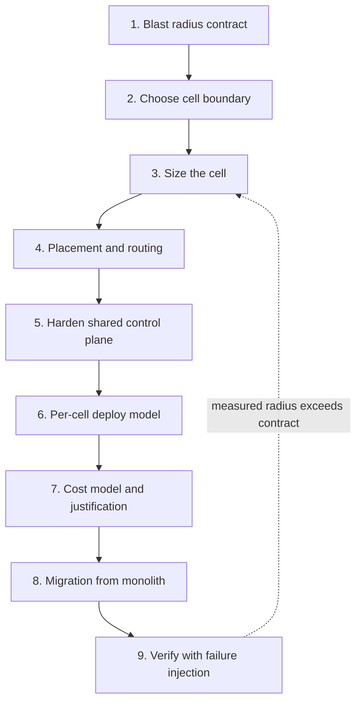
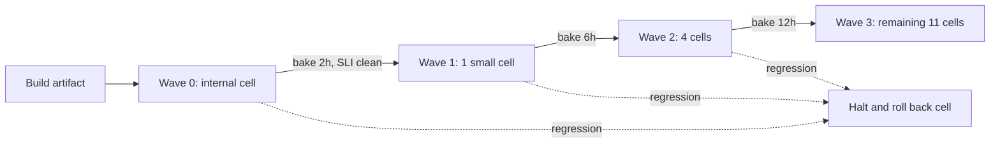
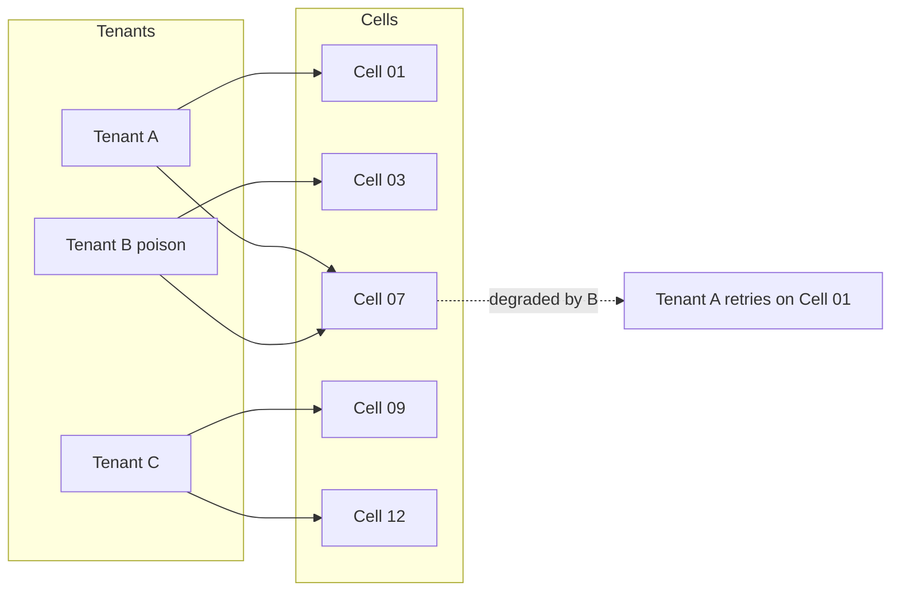
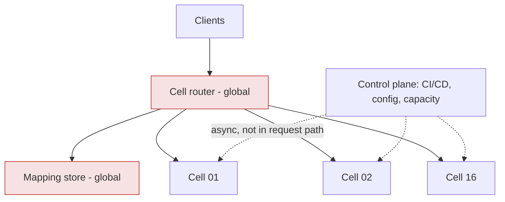

# S09 — Cell-Based / Bulkhead Architecture

<span class="pill pill-core">SRE Round</span>

**Take a service where any single bad tenant, bad shard, or bad config can take down the whole fleet, and re-cut it into independent cells — the hardest judgment call is choosing the cell size, because every reduction in blast radius is bought with fixed per-cell overhead, lost statistical multiplexing, and N times the operational surface.**

| | |
|---|---|
| **Commonly asked at** | AWS, Slack, Salesforce, Stripe, Datadog, Cloudflare, Shopify, Atlassian, Snowflake |
| **Time budget** | 45 min |
| **Core tension** | Blast radius shrinks linearly with cell count; cost, operational surface, and cross-cell complexity grow at least linearly — and the shared routing layer you add becomes a new, global single point of failure |
| **Prerequisites** | [Partitioning & Sharding](../fundamentals/f06-partitioning-sharding.md), [Resilience Patterns](../fundamentals/f18-resilience-patterns.md), [Load Balancing](../fundamentals/f03-load-balancing.md), [Capacity Planning](../fundamentals/f24-capacity-planning.md), [SLOs & Error Budgets](../fundamentals/f23-slo-error-budgets.md), [Cost Engineering](../fundamentals/f28-cost-engineering.md) |

---

## 1. The Scenario As Given

> "You own `DocAPI`, a multi-tenant document metadata service. It is one regional fleet: ~370 stateless hosts behind a single L7 load balancer, one large sharded Postgres cluster, one Redis cluster. 40,000 requests/second at peak, 8,000 paying tenants, contractual 99.9% monthly availability with 10% service-credit penalties.
>
> In the last 12 months we had two total outages. Both were caused by a single tenant: one ran a pathological query that saturated the shared connection pool, one uploaded a document with 400,000 ACL entries that blew up memory on every host that touched it. Both times, 8,000 tenants were down for 40+ minutes.
>
> Leadership's mandate: **no single tenant, request, deploy, or config change may affect more than 10% of tenants.** Redesign this as a cell-based architecture. Tell me how big a cell should be, how requests get to the right cell, and what it costs."

The scenario is deliberately constructed so that the *architecture* is not the hard part — drawing boxes labelled "Cell 1..Cell N" takes 90 seconds. The hard parts are:

1. **Sizing.** What determines the maximum size of a cell? (Hint: it is never "a round number of hosts.")
2. **Placement.** Which tenants go in which cells, and does simple hashing actually deliver the blast-radius guarantee?
3. **What stays shared.** You cannot cell-isolate everything. What remains global, and how do you keep it from becoming the new fleet-wide outage source?
4. **Cost.** Cells are more expensive. Can you defend the number to a CFO?

!!! note "Terminology"
    A **cell** (AWS calls it a cell; Slack calls it a cell; Salesforce calls it a pod or instance; Azure calls it a stamp or scale unit) is a **complete, independently deployable, independently failing copy of the service stack** — compute, data store, cache, queues — that serves a bounded subset of traffic. A **bulkhead** is the general pattern: partition resources so that exhaustion in one partition cannot consume another's. Cells are bulkheads taken to the level of the whole stack.

---

## 2. Clarifying Questions to Ask First

Ask these before drawing anything. Each one changes the design materially.

| Question | Why it changes the answer |
|---|---|
| "Is the blast radius contract about *tenants affected* or *requests affected*?" | If a single tenant is 15% of traffic, a request-based contract and a tenant-based contract force completely different cell counts and may force splitting one tenant across cells. |
| "Can a tenant's data live in exactly one cell, or must a request read data from multiple tenants?" | Single-tenant-scoped data makes cells trivially partitionable. Cross-tenant reads (shared folders, org hierarchies, global search) force either replication or cross-cell fanout. |
| "What is the largest single tenant as a fraction of fleet load, today and projected?" | This sets the floor on cell size. A cell must hold your biggest tenant with headroom, or you need intra-tenant sharding as well. |
| "Is a cell allowed to be a full failure domain (its own AZs), or do cells share AZs?" | Cells that share AZs do not protect against AZ failure. Cells that own AZs need 3x the fixed footprint. |
| "Do we need cross-cell strong consistency for anything?" | If yes, you have distributed transactions across cells and you have not actually decoupled failure domains. See [Distributed Transactions](../fundamentals/f10-distributed-transactions.md). |
| "What is the current deploy frequency and deploy duration?" | 16 cells x a 40-minute deploy = a rollout that takes days unless you parallelise waves. This constrains cell count as much as cost does. |
| "Is there an existing tenant identifier on every request before authentication?" | The router must pick a cell *before* touching cell-local state. If tenant identity is only known post-auth against a cell-local DB, routing is circular. |
| "What is the cost of a tenant-visible migration between cells?" | Cells drift in load. If rebalancing requires downtime, you will over-provision every cell forever rather than move tenants. |
| "What regulatory or residency constraints exist?" | Residency often *forces* cells (EU cell, gov cell) and removes the sizing freedom entirely for those cells. |
| "How much budget increase is acceptable?" | If the answer is "zero", the honest response is that you can still cell-ify, but with fewer, larger cells and an explicit weaker blast-radius guarantee. |

!!! tip "The question that scores points"
    "What does *affected* mean — hard down, or degraded?" Most blast-radius mandates are written as if failures are binary. Real cell failures are usually partial (elevated latency, some error rate). Getting the interviewer to define "affected" as, say, "error rate above 1% for more than 5 minutes" turns a slogan into a measurable contract you can design and test against.

---

## 3. Framework / Approach



### Step 1 — Write the blast radius contract as a number

Before anything else, turn the mandate into three numbers:

- **Maximum fraction of tenants impacted by a single failure**: 10% → at most 800 tenants.
- **Maximum fraction of requests impacted**: 10% → at most 4,000 RPS.
- **What counts as impacted**: error rate > 1% or p99 > 3x baseline, sustained 5 minutes.

Everything downstream is derived from these. Write them on the board and keep referring back.

### Step 2 — Choose the cell boundary

Decide, explicitly, what is **inside** a cell and what is **outside**. This single table is the core of the design.

| Component | Inside a cell | Outside (shared) | Reasoning |
|---|---|---|---|
| API compute | Yes | — | The thing that actually falls over |
| Cell-local Postgres (primary + 2 replicas) | Yes | — | Connection pool exhaustion was an outage cause; must be isolated |
| Redis cache | Yes | — | Cache stampede from one tenant must not evict another cell's working set |
| Async workers + queue | Yes | — | Poison messages must not block the fleet |
| Object storage (S3) | Buckets per cell (prefix or bucket) | Service itself | S3 is already cell-ised internally; you get isolation from per-cell request budgets |
| Tenant → cell mapping | No | Yes | By definition global |
| Edge / global router | No | Yes | By definition global |
| Auth / token issuance | No (validate locally) | Yes (issue) | Validate with cached public keys so a cell survives IdP outage |
| Billing / usage aggregation | No | Yes | Offline, tolerant of delay, consumes per-cell CDC |
| CI/CD, config store, metrics | No | Yes | Must be *static-stable*: cells run fine with these down |

!!! warning "The boundary test"
    For each shared component ask: *"If this is completely down for 4 hours, do the cells still serve traffic?"* If the answer is no, you have not built cells — you have built shards behind a single point of failure. The only acceptable "no" is the request router itself, and that is why it gets disproportionate hardening (Deep Dive 5.3).

### Step 3 — Size the cell from its tightest real ceiling

A cell's maximum size is **the lowest empirically measured ceiling among its components**, not a design intent. The candidate ceilings:

| Ceiling | Typical cause | How to measure |
|---|---|---|
| Write throughput of the cell's single-writer DB | WAL flush, lock contention, vacuum | Load test to failure; find the knee where p99 write latency doubles |
| DB connection count | `max_connections`, pooler threads | Hosts x pool size vs DB limit |
| Cache working set | Evictions start when working set > memory | Track `keyspace_misses` slope vs tenant count |
| Blast radius contract | Cell size > contract is invalid by definition | Arithmetic |
| Deploy/rebuild time | A cell you cannot rebuild in an hour is too big to be cattle | Time a full cell rehydration drill |
| Control-plane fanout | Routing table size, config push cost | Config push latency vs cell count |
| Largest single tenant | A cell must hold the biggest tenant plus headroom | Per-tenant peak RPS p99 |

Then:

$$
\text{CellMaxRPS} = \min(\text{component ceilings}) \times \text{utilisation target}
$$

$$
N_{\text{cells}} = \max\left(\left\lceil \frac{\text{FleetPeakRPS}}{\text{CellMaxRPS}} \right\rceil,\ \left\lceil \frac{1}{\text{BlastRadiusFraction}} \right\rceil \right)
$$

The second term is the one candidates forget: even if one giant cell could technically serve all traffic, the contract forces a minimum cell count.

### Step 4 — Placement and routing

Two decisions:

- **Assignment**: which cells does a tenant map to? Options: modulo hash, consistent hash, explicit table, shuffle shard. (Deep Dive 5.2 — this is where the round is won or lost.)
- **Routing mechanism**: where is the mapping enforced?

| Mechanism | How | Pros | Cons |
|---|---|---|---|
| DNS per cell (`t-1234.api.example.com`) | Tenant gets a cell-specific hostname | No shared data-plane hop; cheapest; strongest isolation | DNS TTL makes rebalancing slow; clients cache forever; see [DNS & Traffic](../fundamentals/f02-dns-traffic-management.md) |
| Thin L7 cell router | Shared stateless proxy reads tenant from JWT/header, forwards | Instant rebalancing; single entry point | New shared failure domain; adds a hop and its own capacity problem |
| Client SDK routing | SDK fetches mapping, connects directly | No shared data path at request time | Requires SDK adoption; stale mappings in old client versions |
| Anycast + per-cell VIP | Network-layer steering | Very fast | Hard to express tenant-level policy |

In practice: **thin L7 router for the general case, per-cell DNS for large enterprise tenants who want a dedicated endpoint**, and an SDK that caches the mapping so the router is not on the critical path for retries.

### Step 5 — Harden the shared control plane

Covered in depth in 5.3. The rule: the router and the mapping store must be **constant work** and **statically stable** — their load must not depend on how many cells are unhealthy, and the data plane must keep working with the control plane completely down.

### Step 6 — Per-cell deployment model

Cells multiply your deploy surface by N. This is not optional overhead; it is the price of the isolation. Manage it with three rules:

1. **A cell is the deployment unit, and the deployment pipeline is wave-based.** Cells are grouped into waves by risk: wave 0 is an internal-only cell, wave 1 is one small cell, wave 2 is 25% of cells, wave 3 is the rest.
2. **Bake time between waves is non-negotiable and is measured in error budget, not minutes.** Advance only if the previous wave's SLIs are clean. See [Deployment & Release Safety](../fundamentals/f25-deployment-release-safety.md).
3. **No human ever touches a single cell.** All changes go through the pipeline. Configuration drift between cells destroys the entire value proposition, because you can no longer reason about "a cell" as a unit.



The hidden benefit: **cell-by-cell rollout gives you a real canary for free.** A bad deploy that would previously have been a fleet outage now degrades one cell out of sixteen, and the pipeline halts. Bad deploys were historically the single largest cause of outages in most fleets; cells convert that class from "total" to "6.25%".

The hidden cost: **a full fleet rollout now takes a day or more.** That is an availability trade in itself — urgent security patches propagate slowly. Mitigate with an explicit "emergency wave" policy that requires an incident commander's approval and skips bake times, used perhaps twice a year.

### Step 7 — Cost model and business justification

Build the cost delta explicitly (worked in Section 4) and put it next to the expected loss avoided:

$$
\text{Justification} = \underbrace{P(\text{fleet incident}) \times \text{Cost}_{\text{fleet}}}_{\text{today}} - \underbrace{P(\text{cell incident}) \times \text{Cost}_{\text{cell}}}_{\text{after}} - \Delta\text{Infra}
$$

Where `Cost` is dominated not by lost revenue during the outage but by **SLA credits and churn**, which scale with tenants affected.

### Step 8 — Migration from the monolith

Never big-bang. The proven order:

1. Stand up cell 01 as a **new, empty cell** running the same code and schema.
2. Put the router in front of the *existing* monolith first, with every tenant mapped to a pseudo-cell "legacy". The router is now in production, carrying full traffic, with zero behaviour change. This de-risks the riskiest new component first.
3. Migrate tenants smallest-first into real cells, a handful at a time, with a per-tenant cutover (dual-write, backfill, verify, flip, keep rollback for 7 days). See [Replication & Consistency](../fundamentals/f07-replication-consistency.md) for the dual-write and CDC mechanics.
4. The legacy monolith shrinks until it is the largest cell, then becomes cell 00 or is drained entirely.

### Step 9 — Verify the radius empirically

The contract is not met until you have **measured** it. Inject a cell-killing fault (drop the cell's DB primary, poison its queue, stop all its hosts) in production during a low-traffic window and measure the fraction of tenants and requests that saw errors. If that number exceeds the contract, something is shared that you thought was not — usually a cache, a rate limiter, or a connection pool.

---

## 4. Worked Example

### 4.1 Inputs

| Parameter | Value |
|---|---|
| Fleet peak | 40,000 RPS |
| Fleet mean | 29,600 RPS (diurnal peak/mean = 1.35) |
| Tenants | 8,000 |
| Largest tenant peak | 1,200 RPS (3% of fleet) |
| Per-host capacity at SLO | 250 RPS |
| Target host utilisation | 65% |
| AZs per cell | 3 (must survive losing 1) |
| Measured cell-DB write ceiling | 5,000 RPS before p99 write latency doubles |
| Blast radius contract | ≤ 10% tenants, ≤ 10% requests |

### 4.2 Cell count

Ceiling from the database, derated to 60% to leave room for growth and failover:

$$
\text{CellMaxRPS} = 5{,}000 \times 0.60 = 3{,}000\ \text{RPS}
$$

$$
N_{\text{capacity}} = \left\lceil \frac{40{,}000}{3{,}000} \right\rceil = 14
\qquad
N_{\text{contract}} = \left\lceil \frac{1}{0.10} \right\rceil = 10
$$

$$
N = \max(14, 10) = 14 \rightarrow \textbf{16 cells}
$$

Round 14 up to 16 for two reasons: growth headroom (16 cells x 3,000 = 48,000 RPS, 20% above today's peak), and because 16 gives a clean shuffle-sharding combinatorial space. Resulting blast radius: **6.25% of tenants per cell, comfortably inside the 10% contract.**

Sanity check against the largest tenant: 1,200 RPS into a 3,000 RPS cell is 40% of one cell. Acceptable, but flag it: **any tenant above ~50% of a cell needs its own dedicated cell** (a "single-tenant cell"), which is also a product feature you can charge for.

### 4.3 Host count and the multiplexing tax

Monolith sizing:

$$
H_{\text{mono}} = \frac{40{,}000}{250 \times 0.65} \times \frac{1}{1 - 1/3} = 246 \times 1.5 = 369 \rightarrow 370\ \text{hosts}
$$

Now the part candidates miss. Peak-to-mean ratio is **not** constant when you split the fleet. Decompose it:

$$
\frac{\text{peak}}{\text{mean}} = \underbrace{D}_{\text{diurnal, correlated}} \times \underbrace{\left(1 + \frac{c}{\sqrt{n}}\right)}_{\text{independent burst, shrinks with tenant count}}
$$

Fit against the fleet: measured fleet peak/mean = 1.404, and diurnal alone is 1.35. So:

$$
1 + \frac{c}{\sqrt{8000}} = \frac{1.404}{1.35} = 1.04 \Rightarrow c = 0.04 \times \sqrt{8000} = 3.58
$$

Per cell, with 500 tenants each:

$$
\frac{\text{peak}}{\text{mean}}\bigg|_{\text{cell}} = 1.35 \times \left(1 + \frac{3.58}{\sqrt{500}}\right) = 1.35 \times 1.160 = 1.566
$$

Statistical multiplexing loss:

$$
\frac{1.566}{1.404} - 1 = 11.5\%
$$

So cellular compute is:

$$
H_{\text{cells}} = 370 \times 1.115 = 413 \rightarrow 416\ \text{hosts}\ (26\ \text{per cell}, \text{i.e. } 9/9/8\ \text{per AZ} \rightarrow \text{round to } 27 = 9\times3)
$$

Final: **16 cells x 27 hosts = 432 hosts**, versus 370. That last bump from 416 to 432 is the **granularity tax** — you cannot buy 0.6 of an instance per AZ per cell, and the rounding error is paid 48 times instead of 3 times.

!!! example "Say this out loud in the interview"
    "Cell-based architecture costs about 17% more compute here, and only about 5 points of that is redundancy — the rest is losing statistical multiplexing and paying instance-rounding 48 times instead of 3. That is the real reason people under-estimate cell cost."

### 4.4 Data tier

| Tier | Monolith | 16 cells | Notes |
|---|---|---|---|
| Postgres | 1 primary + 3 replicas, r6i.8xlarge | 16 x (1 primary + 2 replicas), r6i.xlarge | Aggregate vCPU similar; but 16 standbys instead of 3 is the floor cost |
| Redis | 6 x r6g.xlarge cluster | 16 x 3 x r6g.large | Per-cell working sets are smaller but each cell needs a quorum-shaped cluster |
| Queue | 1 Kafka cluster, 9 brokers | 16 x 3 brokers = 48 | Largest single cost jump; consider a shared Kafka with per-cell topics and per-cell quotas as a compromise |

The Kafka line is where an experienced candidate pauses: **you do not have to cell-ise everything to the same depth.** A shared Kafka with hard per-cell quotas and separate topics gives most of the isolation at a third of the cost, at the price of a shared control plane failure mode. State the compromise and its risk explicitly rather than reflexively replicating everything.

### 4.5 Cost delta (monthly, USD)

| Line | Monolith | Cells | Delta |
|---|---|---|---|
| Compute (370 vs 432 x m6i.2xlarge @ 0.384/hr) | 102,300 | 119,500 | +17,200 |
| Postgres | 5,900 | 8,800 | +2,900 |
| Redis | 1,800 | 3,400 | +1,600 |
| Kafka (shared, per-cell topics) | 6,200 | 7,100 | +900 |
| Cell router (new, 24 hosts) | 0 | 6,600 | +6,600 |
| Cross-cell / control-plane traffic | 400 | 1,900 | +1,500 |
| **Total** | **116,600** | **147,300** | **+30,700 (+26%)** |

Annual overhead: **USD 368,000**.

### 4.6 Justifying it

Expected annual loss today, using the last two years' incident record:

- 2 fleet-wide incidents/year, 40 minutes each, breaching the 99.9% monthly SLO for all 8,000 tenants.
- Contractual credit: 10% of monthly fee. Average monthly fee per tenant: USD 1,500. Credit per incident: `8,000 x 1,500 x 0.10 = 1,200,000`.
- Plus churn: historically 0.4% of affected tenants churn after an outage; annualised contract value lost ≈ `8,000 x 0.004 x 18,000 = 576,000` per incident.

$$
\mathbb{E}[\text{loss}]_{\text{today}} = 2 \times (1{,}200{,}000 + 576{,}000) = 3{,}552{,}000\ \text{USD/year}
$$

With cells, the same two tenant-triggered incidents hit one cell each (6.25% of tenants):

$$
\mathbb{E}[\text{loss}]_{\text{cells}} = 2 \times 0.0625 \times 1{,}776{,}000 = 222{,}000\ \text{USD/year}
$$

$$
\text{Net} = 3{,}552{,}000 - 222{,}000 - 368{,}000 = \mathbf{2{,}962{,}000}\ \text{USD/year avoided}
$$

!!! tip "How to present this to a CFO"
    Do not lead with "blast radius". Lead with: *"We pay USD 368k a year in infrastructure to stop paying USD 3.5M a year in service credits and churn. The break-even is one fleet-wide incident every nine years; we have had four in two years."* Then show the sensitivity: even if credits were 90% lower than modelled, the investment still pays back.

### 4.7 Shuffle sharding assignment for the stateless tier

See Deep Dive 5.2 for the mathematics. The result applied here:

- Stateless request-handling tier: each tenant is assigned **k = 2 cells out of N = 16** for *reads*, with the SDK failing over between them.
- Writes and the tenant's primary data live in **one home cell** (stateful cells cannot be shuffle-sharded without replicating data).

$$
\binom{16}{2} = 120 \text{ distinct read shards} \Rightarrow P(\text{two tenants share both cells}) = \frac{1}{120} = 0.83\%
$$

Expected number of other tenants fully overlapping a poison tenant's read shard:

$$
\frac{8{,}000}{120} \approx 67 \text{ tenants } (0.83\%)
$$

versus 500 tenants (6.25%) under plain modulo assignment — a **7.5x reduction in fully-impacted tenants** at zero additional hardware.

---

## 5. Deep Dives

### 5.1 Cell Sizing: Finding the Real Ceiling

The single most common mistake is picking cell size from an org-chart-shaped intuition ("about 20 hosts feels right") instead of measuring. A cell's size is determined by whichever component saturates first, and you only learn that by **loading a cell until it breaks**.

Run this as a standing exercise, not a one-off:

```bash
# Ramp a single isolated cell to failure, recording the knee.
# Step load 10% of estimated ceiling every 5 minutes until SLO breach.
for pct in $(seq 10 10 200); do
  rps=$(( CEILING_ESTIMATE * pct / 100 ))
  loadgen --target "cell-07.internal" --rps "$rps" --duration 5m \
          --mix "read:85,write:12,list:3" --tenants 500
  record_slis "$pct" "$rps"
done
```

What you are looking for is not the point of *failure* but the **knee**: the load at which p99 latency starts rising super-linearly. Operating above the knee means a small traffic increase produces a large latency increase, which is the definition of an unstable operating point.

| Ceiling discovered | Symptom at the knee | Typical real value | What it means for cell size |
|---|---|---|---|
| DB write throughput | p99 write latency doubles; WAL lag grows | 4,000–8,000 writes/s on one primary | Usually the binding constraint |
| DB connections | Errors spike to 100% instantly, no gradual degradation | `max_connections` hit | Fix with a pooler before it constrains cell size |
| Cache memory | Hit ratio drops, then DB load doubles | Working set > 70% of RAM | Cell size limited by *tenant working set*, not RPS |
| Queue consumer lag | Lag grows unbounded at constant input | Consumers CPU-bound | Cell size limited by worker scaling ceiling |
| Deploy time | Rollout exceeds 45 min per cell | ~200 hosts/cell | Operational, not technical, ceiling |

!!! warning "Ceilings move, so re-measure"
    A cell sized in Q1 against a 5,000 writes/s DB ceiling is invalid after a schema change adds three indexes. Re-run the ceiling test every quarter and after any change to the data model. Put the current measured ceiling in the cell manifest (Section 7) so capacity planning reads it from one place.

**Small cells vs large cells:**

| | Smaller cells (more of them) | Larger cells (fewer of them) |
|---|---|---|
| Blast radius | Better (1/N) | Worse |
| Fixed overhead | Worse — floor cost paid N times | Better |
| Multiplexing loss | Worse — `c/√n` grows as n falls | Better |
| Deploy surface | Worse — N pipelines, N rollbacks | Better |
| Canary quality | Better — a cell is a natural small canary | Worse — canary is 25% of fleet |
| Largest tenant fit | Worse — may not fit | Better |
| Blast radius of a *cell router* bug | Identical (global) | Identical (global) |
| Time to rebuild a cell | Better | Worse |

The sweet spot for most services is **cells sized so the largest tenant is under 30% of a cell, and a cell can be rebuilt from scratch in under an hour**. Those two constraints usually bracket the answer to within a factor of two, and the DB ceiling picks the exact number.

### 5.2 Shuffle Sharding: The Combinatorics and Where It Breaks

**The problem with plain hashing.** Assign tenant `t` to cell `hash(t) mod N`. With N = 16, a poison tenant takes down its cell: 1/16 = 6.25% of tenants, all of them *completely* down. Every other tenant in that cell shares 100% of its fate. Worse, every tenant shares a cell with 499 others, so the probability that *some* tenant in your cell is pathological grows with cell size — the "everyone shares a cell with somebody" problem.

**Shuffle sharding.** Give each tenant a random subset of `k` cells out of `N`, and let the client use any of them. Two tenants are *fully* co-located only if their subsets are identical.

$$
\text{Number of distinct shards} = \binom{N}{k}
$$

$$
P(\text{another tenant has the identical shard}) = \frac{1}{\binom{N}{k}}
$$

$$
P(\text{overlap in at least one cell}) = 1 - \frac{\binom{N-k}{k}}{\binom{N}{k}}
$$

Worked for N = 16:

| k | Distinct shards `C(16,k)` | P(identical shard) | Expected fully-impacted tenants of 8,000 | P(≥1 cell overlap) |
|---|---|---|---|---|
| 1 (plain hash) | 16 | 6.25% | 500 | 6.25% |
| 2 | 120 | 0.83% | 67 | 24.2% |
| 3 | 560 | 0.18% | 14 | 48.2% |
| 4 | 1,820 | 0.055% | 4.4 | 69.8% |

Read the table carefully — this is the insight that separates a strong answer:

- **Full impact collapses fast**: 500 → 67 → 14 → 4.4 tenants.
- **Partial overlap rises fast**: at k = 4, 70% of tenants share at least one cell with the poison tenant.

That trade is only acceptable if **partial overlap is survivable**, which requires two properties:

1. The client (or router) must **detect a bad cell and retry on another cell in its shard**. Without failover, shuffle sharding makes things *worse*: you have quadrupled the number of tenants exposed to any given bad cell.
2. Each cell must have enough spare capacity to absorb the displaced load when a peer cell is unhealthy. With k cells per tenant, plan each cell at `1/k` extra headroom, or you convert a one-cell failure into a cascading overload. See [Resilience Patterns](../fundamentals/f18-resilience-patterns.md).



Tenant A shares one cell with the poison tenant but keeps a healthy cell; Tenant C is untouched. Only a tenant whose shard is exactly `{03, 07}` is fully down.

**Where shuffle sharding breaks down — say this before the interviewer asks:**

| Limitation | Why | What to do instead |
|---|---|---|
| Stateful cells | A tenant's data cannot be in k cells without replication and conflict handling | Shuffle-shard the stateless tier; pin data to one home cell; or replicate read-only data to the k cells |
| Correlated failures | A bad deploy, bad config, or poisoned global dataset hits all cells regardless of shard | Cells protect against *independent* failures only — wave deploys and config canaries cover the rest |
| Tenants > shards | With 8,000 tenants and 120 shards, collisions are guaranteed by pigeonhole | Increase N or k; or accept 67-tenant collision groups |
| Non-uniform tenant sizes | Random assignment puts two whales in the same shard | Weighted / constrained assignment: place large tenants first, greedily, to balance load |
| "Sticky" resources inside the cell | A per-cell lock, a per-cell leader, a per-cell rate limiter keyed globally | Audit for anything keyed by something other than cell id |

**Assignment implementation.** Do not compute the shard from a hash at request time — store it. Hashing makes shard membership change whenever N changes, which reshuffles everybody.

```python
import hashlib
import random

def assign_shard(tenant_id: str, cells: list[str], k: int) -> list[str]:
    """Deterministic shuffle-shard assignment, stored once at tenant creation.

    Stored in the mapping table so changing N does not reshuffle existing tenants.
    """
    seed = int(hashlib.sha256(tenant_id.encode()).hexdigest()[:16], 16)
    rng = random.Random(seed)
    return sorted(rng.sample(cells, k))
```

The stored-mapping approach also lets you **manually override** a shard: when a tenant turns out to be pathological, you move it to a quarantine cell with one API call, no code change, no hash function change.

### 5.3 The Shared Control Plane Is the New Highest-Value Target

You have just reduced every failure mode to 6.25%... except the ones in the router and the mapping store, which are still 100%. Attackers, and entropy, will find them.



Four hardening principles, in priority order:

**1. Constant work.** The router's workload must not change when cells fail. A router that recomputes health, re-resolves DNS, or re-reads the mapping table *in response to failures* does the most work exactly when the system is most stressed. Instead: pull the full mapping on a fixed timer (say every 30s), always the same size, whether one cell is down or all of them are. Push the full routing table, not deltas. Deltas are variable work and their size correlates with badness.

**2. Static stability.** The router must serve correctly with the mapping store completely unavailable, indefinitely. Concretely: last-known-good mapping is written to local disk, loaded at boot, and *never expires*. A missing tenant in a stale map routes to a default cell rather than failing. Restating this as a test: *"Block the router's access to the mapping store for 6 hours in staging with continuous traffic — error rate must stay at zero."*

**3. Minimal logic.** Every feature you put in the router is a fleet-wide risk. Authentication? No — validate tokens in the cell using cached public keys. Rate limiting? Only a crude global-abuse limiter; per-tenant limits belong in the cell. Request transformation? No. The router should do one thing: read a tenant identifier, look up a cell, forward bytes. A router you can describe in one sentence is a router that rarely breaks.

**4. Cell-ise the router itself.** The strongest version: run N router fleets, one per cell group, behind DNS or anycast, so a bad router deploy hits a fraction of traffic. Then deploy the router with the same wave discipline as the cells — and deploy it *after* the cells, never in the same change.

!!! danger "The control plane failure that ends the career"
    A "smart" router that queries each cell's health endpoint and routes away from unhealthy cells looks like good engineering. Under partial network failure it sees *all* cells as unhealthy, routes traffic nowhere, and converts a minor degradation into a total outage. Health-based routing must be **bounded**: never remove more than `1/3` of cells from rotation, no matter what health checks say. This single rule — "minimum healthy fraction" — has prevented more total outages than any other piece of routing logic.

**Additional shared surfaces to audit**, each of which quietly re-couples your cells:

| Shared thing | How it re-couples cells | Fix |
|---|---|---|
| A single IAM role / credential used by all cells | Credential rotation bug breaks everything | Per-cell roles and per-cell secrets |
| A shared feature-flag service evaluated in the request path | Flag service outage = fleet outage | Flags fetched async, cached, fail to last-known value |
| A shared metrics agent that blocks on the metrics backend | Metrics backend outage stalls request threads | Metrics emission must be fire-and-forget with a bounded buffer |
| One shared TLS certificate | Expiry hits all cells simultaneously | Per-cell certificates with staggered expiry dates |
| A shared DNS zone / single NS record set | Zone corruption is fleet-wide | Accept, but version-control zone changes and canary them |
| One shared container registry | Registry outage blocks all deploys (not traffic) | Acceptable — it is not in the data path |
| Global config pushed to all cells at once | Bad config = fleet outage, and it bypasses your wave discipline | Treat config as code: same waves, same bake, same rollback |

That last row is worth saying explicitly: **configuration is the most common way teams accidentally un-cell their architecture.** Code goes through 4 waves over a day; a config toggle goes to all 16 cells in 3 seconds. Fix the pipeline, not the intention.

### 5.4 Data Locality and Cross-Cell Queries

Cells work beautifully when every request touches exactly one tenant's data. They get expensive the moment a request must span cells.

**The three cross-cell patterns and their costs:**

=== "Scatter-gather"

    A query (admin search, global listing, compliance export) fans out to all N cells and merges.

    The tail-latency problem, stated precisely: if each cell independently responds slower than `T` with probability `p`, then the fanout is slower than `T` with probability:

    $$
    P(\text{slow fanout}) = 1 - (1-p)^N
    $$

    With per-cell p99 = 50 ms (`p = 0.01`) and `N = 16`:

    $$
    1 - 0.99^{16} = 14.9\%
    $$

    So the **p99 of the fanout is the p85 of nothing useful** — to get a 1% fanout tail you need each cell at:

    $$
    p_{\text{cell}} = 1 - (0.99)^{1/16} = 0.000628 \Rightarrow \text{the per-cell p99.94}
    $$

    In other words, **scatter-gather across 16 cells turns your per-cell p99.94 into your user-visible p99.** This is why fanout queries must either be async (return a job id) or hedged with per-cell deadlines and partial results.

=== "Replicated read model"

    Publish per-cell changes to a stream, build a global read-only projection (search index, analytics warehouse, billing rollup) outside the cells.

    - Latency: seconds to minutes behind. Fine for search, billing, admin dashboards. Not fine for read-your-writes.
    - Failure isolation: excellent — the projection being down does not affect cells.
    - Cost: a second copy of the data, plus CDC pipeline. See [Queues & Streams](../fundamentals/f12-queues-streams.md).
    - This is the default answer for 80% of cross-cell needs.

=== "Cross-cell transaction"

    Two tenants in different cells must update atomically (a shared document, a transfer).

    - This re-couples the cells: cell A's availability now depends on cell B.
    - If you must, use a saga with compensations rather than 2PC, and measure the new coupled availability: two cells at 99.95% in series give 99.90%.
    - Better: **co-locate.** If two tenants must transact, put them in the same cell. Make "organisation", not "tenant", the placement unit.

**Choosing the placement key** is the decision that determines how much cross-cell traffic you will have forever. Rank candidate keys by the fraction of requests they keep cell-local:

| Placement key | Requests kept local | Rebalancing difficulty | Notes |
|---|---|---|---|
| `tenant_id` | 94% | Easy (small units) | Breaks for shared/org-level objects |
| `organisation_id` | 99.3% | Medium (orgs vary hugely in size) | Usually the right answer for B2B |
| `user_id` | 71% | Easy | Bad for collaboration products |
| `region` | 100% within region | Hard | Forced by residency; too coarse for blast radius alone |
| `document_id` | 62% | Easy | Only right if documents are truly independent |

Measure this from production logs before choosing — take a week of requests, and for each candidate key compute the fraction of requests whose entire working set falls under one key value. That number, not architectural taste, picks the key.

**Rebalancing.** Cells drift: tenants grow, some churn. Plan for migration from day one:

1. Mark the tenant read-only for a bounded window, or enable dual-write.
2. Snapshot + ship + apply CDC delta until lag < 1s.
3. Flip the mapping entry (this is why the mapping is a *table*, not a hash).
4. Keep the old cell's data for 7 days for rollback.

A tenant migration you can run on a Tuesday afternoon without a change request is the difference between a cell architecture that stays balanced and one that ossifies.

---

## 6. What Can Go Wrong

| Risk | Detection | Mitigation |
|---|---|---|
| Hidden shared dependency defeats isolation | Cell-kill game day shows > contract impact; dependency graph audit finds edges crossing cell boundary | Automated dependency linter in CI: fail the build if a cell service resolves a hostname outside its cell allowlist |
| Cell router becomes the outage source | Router error rate SLI, separate from cell SLIs; synthetic probes that bypass the router | Constant-work design, static stability, minimum-healthy-fraction guard, cell-ised router fleets, separate deploy pipeline |
| Cell overload after peer cell failure (shuffle-shard displacement) | Per-cell utilisation SLI with alert at `1 - 1/k` of capacity | Reserve `1/k` headroom per cell; shed low-priority traffic before accepting displaced load ([Rate Limiting & Shedding](../fundamentals/f17-rate-limiting-load-shedding.md)) |
| Cell drift — cells no longer identical | Continuous config diff across cells; artifact version dashboard | Immutable infrastructure; no human SSH; drift detector pages if any cell differs from the fleet mode for > 24h |
| Deploy takes so long that security patches lag | Track "days to full fleet rollout" as a metric | Emergency wave policy with explicit approval; parallelise non-adjacent waves |
| Whale tenant outgrows a cell | Per-tenant RPS as fraction of cell capacity, alert at 30% | Dedicated single-tenant cell (sellable as a premium tier); or intra-tenant sharding |
| Cost overrun kills the program politically | Monthly cost-per-request metric, reported alongside blast radius achieved | Publish the unit-cost and avoided-loss model up front; report both every quarter ([Cost Engineering](../fundamentals/f28-cost-engineering.md)) |
| Cross-cell fanout query becomes a latency bomb | Trace-based alert on any request touching > 1 cell; count them | Ban synchronous fanout in the request path; route to the replicated read model instead |
| Mapping store corruption routes tenants to wrong cells | Checksum of mapping table; canary tenants with known-good cells probed every minute | Versioned, append-only mapping with fast rollback; router refuses mappings whose version regresses |
| Cell identity leaks into client-visible URLs | Contract review; look for cell ids in customer docs | Keep cell identity internal, or accept it permanently — customers will hard-code it |
| Observability cost explodes: every metric now has a `cell` label | Cardinality dashboard on the metrics backend | Pre-aggregate per-cell; keep `cell` as a label but drop other labels at that level ([Observability](../fundamentals/f22-observability-fundamentals.md)) |
| Partial cell failure not detected because aggregate SLIs look fine | Fleet-level SLI hides a single bad cell in 1/16 of traffic | **Every SLI must also be evaluated per cell**, and alerting must fire on the worst cell, not the average |

!!! danger "The aggregate-SLI trap"
    This is the most under-appreciated row in the table. Before cells, a broken component showed up immediately in fleet metrics. After cells, one broken cell moves the fleet error rate from 0.01% to 0.07% — below most alert thresholds — while 500 tenants are hard down. **Cell-based architecture requires re-cutting every alert to be per-cell, on day one.** Teams that skip this get worse detection than they had before.

---

## 7. The Artifact You'd Produce

### 7.1 The Cell Manifest (source of truth, one file per cell)

```yaml
cell:
  id: cell-07
  region: us-east-1
  azs: [use1-az1, use1-az2, use1-az4]
  wave: 2                      # deploy wave membership
  status: active               # active | draining | quarantine | building

capacity:
  measured_ceiling_rps: 5000   # from last ceiling test
  ceiling_measured_at: 2026-08-14
  target_utilisation: 0.60
  usable_rps: 3000
  current_peak_rps: 2410
  headroom_reserved_for_displacement: 0.50   # = 1/k for k=2 shuffle shard

tenancy:
  tenant_count: 498
  largest_tenant_share: 0.14
  dedicated: false

components:
  api:      { instance: m6i.2xlarge, count: 27, min: 12 }
  postgres: { instance: r6i.xlarge,  primary: 1, replicas: 2 }
  redis:    { instance: r6g.large,   count: 3 }
  workers:  { instance: c6i.xlarge,  count: 9 }
  bucket:   docapi-cell-07-use1

blast_radius:
  tenants_pct: 6.25
  requests_pct: 6.02
  last_verified_by_fault_injection: 2026-09-02
  verified_impact_tenants_pct: 6.31   # measured, must be <= contract

dependencies_outside_cell:
  - name: cell-router
    in_request_path: true
    static_stable: true
  - name: mapping-store
    in_request_path: false      # router caches; cell never calls it
    static_stable: true
  - name: idp-jwks
    in_request_path: false      # cached keys, 24h TTL, fail-open on cached
    static_stable: true
```

### 7.2 The Blast Radius Contract (one page, signed by product + SRE)

```text
BLAST RADIUS CONTRACT — DocAPI, v3, effective 2026-10-01

DEFINITIONS
  Impacted = error rate > 1% OR p99 > 3x 28-day baseline, sustained 5 min.

GUARANTEES
  G1  No single tenant's workload shall impact > 6.25% of tenants.
  G2  No single cell failure shall impact > 6.25% of tenants.
  G3  No single deploy shall impact > 6.25% of tenants before automatic halt.
  G4  No single AZ failure shall impact > 0% of tenants (cells span 3 AZs).

EXPLICIT NON-GUARANTEES  (the honest part)
  N1  Cell-router defects are fleet-wide. Mitigated by wave-deployed,
      cell-ised router fleets; residual risk accepted.
  N2  Global configuration changes are fleet-wide unless routed through
      the wave pipeline. Enforced by policy check in CI.
  N3  A regional AWS control-plane failure is fleet-wide within the region.
      Cross-region is out of scope for v3.
  N4  A schema migration applied to all cells is fleet-wide by nature;
      migrations follow the expand/contract pattern and wave discipline.

VERIFICATION
  V1  Quarterly cell-kill game day in production, low-traffic window.
  V2  Measured impact recorded in each cell manifest.
  V3  Contract is considered breached if measured > guaranteed, and that
      breach is treated as a Sev-2 requiring a postmortem.
```

### 7.3 The whiteboard version

If you have five minutes left, this is what should be on the board:

```text
  N = max( ceil(FleetPeak / CellCeiling*util) , ceil(1/BlastRadiusTarget) )
  N = max( ceil(40000/3000) , ceil(1/0.10) ) = max(14, 10) = 14 -> 16

  Shuffle shard: k=2 of N=16 -> C(16,2)=120 shards
      full overlap prob = 1/120 = 0.83%  (vs 6.25% plain hash)

  Cost: +26% infra (17% compute: 5% redundancy + 11.5% multiplexing loss
        + rounding), = USD 368k/yr
  Avoided: USD 3.33M/yr credits + churn
  Break-even: 1 fleet outage per 9 years. We have had 4 in 2.

  SHARED (not cell-isolated) = router + mapping. Therefore:
        constant work, static stability, minimal logic, min-healthy-fraction.
```

---

## 8. Gotchas & Corner Cases

!!! gotcha "The cell router's health checking turns a brownout into a blackout"
    **Symptom:** one cell degrades; within 60 seconds the entire fleet returns 503 even though 15 cells are healthy.
    **Mechanism:** the router marks cells unhealthy based on an active health check. The degraded cell's slow responses cause router threads to block; the router's own latency rises; its health checks to *other* cells start timing out; it marks them unhealthy too. Classic metastable failure: the detection mechanism consumes the resource it is protecting.
    **Mitigation:** health checks on a dedicated thread pool with hard timeouts, never sharing the request path. Enforce a **minimum healthy fraction** — refuse to remove more than 1/3 of cells from rotation regardless of health signal. Prefer passive health (observed error rate on real traffic) over active probes, and require `N` consecutive failures over a window before ejection.

!!! gotcha "Config deploys bypass your wave discipline and re-create fleet-wide blast radius"
    **Symptom:** you spent six months building cells, then a one-line feature-flag change takes down all 16 cells in 4 seconds.
    **Mechanism:** the code pipeline has waves; the config/flag pipeline pushes globally and instantly because it was built for "fast rollback". Fast rollback also means fast rollout of the bug.
    **Mitigation:** configuration is code. Route flags and config through the same wave structure with the same bake times. For genuinely urgent kill-switches, allow global-instant but restrict that path to *disabling* features, never enabling them, and require two-person approval.

!!! gotcha "A cell is sized for steady state but cannot absorb its shuffle-shard peers' displaced load"
    **Symptom:** cell 07 fails; cells 03 and 11 receive the displaced traffic, exceed their knee, and fail too; the failure walks the fleet.
    **Mechanism:** with `k = 2`, a failing cell pushes up to 100% of its load onto peers. If cells run at 60% utilisation and receive an additional 50%, they land at 90% — past the knee — and their latency explodes, which triggers client retries, which adds more load. See [Resilience Patterns](../fundamentals/f18-resilience-patterns.md).
    **Mitigation:** size cells so that `utilisation x (1 + 1/k) < knee`. Concretely with `k=2`, cap steady-state at 45%, not 60%. Combine with load shedding that drops low-priority work *before* the cell hits the knee, and client-side retry budgets so a failing cell cannot be amplified.

!!! gotcha "Per-cell alerting is never added, so detection gets worse after cellification"
    **Symptom:** an entire cell is down for 40 minutes and nobody is paged; the fleet dashboard shows 99.94% availability.
    **Mechanism:** fleet-aggregate SLIs dilute a single cell's failure by `1/N`. A cell at 100% errors moves the fleet error rate by 6.25 points *only if that cell is fully down and all its traffic errors* — and most alert thresholds are tuned far above that sensitivity for noise reasons.
    **Mitigation:** every SLI gets a `cell` dimension, and every alert evaluates `max over cells`, not the aggregate. Add a "worst cell" panel as the first tile on the service dashboard. Add a synthetic canary tenant per cell, probed every 30 seconds, whose failure pages independently of aggregate metrics.

!!! gotcha "Shuffle sharding is applied to stateful cells and silently does nothing"
    **Symptom:** the design doc says "shuffle sharded, k=3", but a cell failure still takes down 6.25% of tenants completely.
    **Mechanism:** the tenant's *data* lives in one home cell. The other two cells in its shard can accept the request but cannot serve it — they proxy to the home cell or return errors. The shard is decorative.
    **Mitigation:** be explicit about which tier is shuffle-sharded. Shuffle sharding needs either stateless work or data replicated across the shard's cells. For stateful services, the honest design is `k=1` for writes with a documented failover target, plus shuffle-sharded caching/read replicas if reads dominate.

!!! gotcha "The largest tenant grows past a cell and there is no plan"
    **Symptom:** one customer's traffic is 70% of their cell; every spike from them is a cell incident; you cannot move them because no cell has room.
    **Mechanism:** tenant growth is power-law distributed. The top tenant's share grows faster than the fleet. Cell sizing done once at 3% top-tenant share is invalid at 40%.
    **Mitigation:** alert when any tenant exceeds 30% of its cell's usable capacity. Have two prepared responses: (a) move them to a dedicated single-tenant cell — which is also a sellable premium SKU, so it funds itself; (b) intra-tenant sharding by a secondary key. Decide which one you support *before* you need it, because retrofitting intra-tenant sharding under pressure is a multi-quarter project.

!!! gotcha "Cross-cell scatter-gather in the request path makes p99 worse than the monolith"
    **Symptom:** after cellification, the global search endpoint's p99 went from 180 ms to 1.4 s.
    **Mechanism:** fanout latency is governed by the slowest of N responses. With N = 16 and a per-cell p99 of 50 ms, roughly 15% of fanout requests hit at least one slow cell. Your user-visible p99 is now your per-cell p99.94.
    **Mitigation:** no synchronous fanout in the request path. Serve cross-cell queries from a replicated read model built via CDC. If fanout is unavoidable, use per-cell deadlines plus partial results with an explicit "incomplete" flag, and hedge requests to the shard's second cell.

!!! gotcha "Tenant-to-cell mapping is computed by hash, so adding cells reshuffles everyone"
    **Symptom:** growing from 16 to 20 cells requires migrating 80% of tenants.
    **Mechanism:** `hash(tenant) mod N` changes for almost every tenant when `N` changes. Consistent hashing reduces it to `k/N` but still moves data you did not intend to move, and gives you no ability to pin a specific tenant.
    **Mitigation:** store the mapping in a table, assigned once at tenant creation. Adding a cell then means *only* placing new tenants there plus deliberate rebalancing. The table also gives you per-tenant quarantine, dedicated cells, and migration — none of which a hash function can express.

!!! gotcha "Observability cardinality explodes because every metric gains a cell label"
    **Symptom:** the metrics bill triples the month cells go live; the metrics backend starts dropping series.
    **Mechanism:** adding one label with 16 values multiplies series count by 16 for every metric that carries it — and it compounds with existing labels (endpoint x status x instance x cell).
    **Mitigation:** add `cell` only to SLI-grade metrics; drop `instance` at the same time (you almost never need per-instance and per-cell together). Pre-aggregate per-cell at the collector. Budget the cardinality increase explicitly before the migration rather than discovering it on the invoice.

!!! gotcha "One shared certificate expires and all cells fail at the same instant"
    **Symptom:** perfect cell isolation, and a 100% outage at 00:00 UTC on a Sunday.
    **Mechanism:** the cells were isolated in compute, data, and network — but all present the same wildcard certificate, issued once, expiring once. Time is a shared dependency and it fails simultaneously everywhere.
    **Mitigation:** per-cell certificates with deliberately staggered expiry (cell `i` renews on day `i` of the month). The same reasoning applies to any time-triggered global event: token signing key rotation, scheduled jobs at midnight, licence expiry, leap-second handling. Stagger everything that is scheduled.

!!! gotcha "Cell quarantine has no mechanism, so a poison tenant keeps killing its cell"
    **Symptom:** the same tenant takes down cell 07 three times in a week; the team's only option is a code change to block them.
    **Mechanism:** cells contain the damage but do nothing to *stop* it. Without a way to move or throttle the offending tenant, containment just means the same 500 tenants get hurt repeatedly.
    **Mitigation:** build two levers before you need them: a per-tenant rate limit adjustable at runtime, and a one-command move to a designated quarantine cell (small, cheap, explicitly lower SLO, documented in the contract). Containment without a response lever is only half the pattern.

!!! gotcha "Cell count is chosen for blast radius but makes the deploy pipeline unusable"
    **Symptom:** 64 cells gives a 1.5% blast radius and a 4-day fleet rollout; engineers start batching changes, which makes each deploy riskier.
    **Mechanism:** rollout time scales with cell count divided by wave parallelism, and bake time dominates. Longer rollouts mean bigger change sets, which means worse canary signal and harder rollback — the opposite of what cells were for.
    **Mitigation:** treat "time to full fleet rollout" as a first-class constraint alongside blast radius. Parallelise waves aggressively (wave 3 can be all remaining cells simultaneously if waves 0-2 were clean), and shorten bake by using better SLIs rather than longer waits.

---

## 9. Interview Angle

!!! interview "What the interviewer is actually testing"
    Three things, in order of weight:

    1. **Can you derive the cell count from constraints instead of asserting it?** Anyone can say "let's use cells". The signal is `N = max(capacity-driven, contract-driven)` with a measured ceiling behind it.
    2. **Do you know what you did *not* isolate?** The strongest candidates volunteer the control plane as the new SPOF before being asked, and give concrete hardening rules (constant work, static stability, minimum healthy fraction).
    3. **Can you defend the cost?** Cells are a business decision with an infrastructure implementation. An answer without a cost number and an avoided-loss number is incomplete at the Staff/Lead level.

!!! interview "Signals that end the round early"
    - Drawing cells but keeping one shared database ("cells share the DB but have separate app tiers") — this isolates almost nothing, because the DB is where the outages come from.
    - Proposing shuffle sharding for a stateful tier without addressing data placement.
    - Saying "we'll just add a router" without acknowledging it is now 100% blast radius.
    - Choosing the cell count as a round number with no derivation.

!!! interview "Structure your 45 minutes"
    - 0-5 min: clarify the blast radius contract, turn it into numbers.
    - 5-10 min: cell boundary table (what is in, what is out).
    - 10-20 min: sizing math and cell count derivation.
    - 20-30 min: routing + shuffle sharding combinatorics.
    - 30-38 min: control plane hardening and cross-cell data.
    - 38-45 min: cost model, migration plan, verification.

    If you are running out of time, drop the migration plan, not the cost model.

### Follow-up questions

??? question "Why not just use one cell per customer? That is the smallest possible blast radius."
    Because fixed cost per cell dominates. Each cell needs a minimum viable footprint — at least 2 hosts per AZ for redundancy, a DB primary plus a standby, a cache quorum. Call it 12 instances at roughly USD 3,000/month. For 8,000 tenants that is USD 24M/month for a service that currently costs USD 117k/month, a 200x increase.

    You also lose all statistical multiplexing: with one tenant per cell, the `c/√n` term is at its maximum and every cell must be provisioned for its tenant's peak with no pooling.

    Single-tenant cells are the right answer for a *small number* of tenants who are either (a) large enough that they dominate a shared cell anyway, or (b) paying for isolation as a product feature (regulated industries, government). That is typically 1-3% of tenants and it is priced accordingly.

??? question "How do you pick `k` for shuffle sharding?"
    Work backwards from two numbers.

    First, the full-overlap target: you need `1/C(N,k) x tenant_count` to be an acceptable number of fully-impacted tenants. With `N=16`, `k=2` gives 67 tenants, `k=3` gives 14.

    Second, the capacity cost: each cell must reserve `1/k` of its capacity to absorb a peer's failure... no, more precisely, a failing cell distributes its load across the peers of its tenants, so each surviving cell absorbs roughly `1/(N-1)` of the failed cell's load if the assignment is uniform. The *binding* constraint is different: a tenant using `k` cells at steady state spreads its load, so when one is down the others take `1/(k-1)` more. For `k=2` that is a 100% increase on the surviving cell for that tenant's traffic.

    Third, the operational cost: `k > 1` means a tenant's requests land in multiple cells, so debugging "what happened to tenant X" now requires looking at `k` cells, and any cell-local state (caches, rate limit counters) is fragmented `k` ways.

    In practice `k = 2` or `k = 3` covers nearly every case. `k = 1` is not shuffle sharding at all; `k > 4` mostly buys you a higher probability of *partial* overlap for diminishing returns on full overlap.

??? question "A cell is at 90% capacity and the others are at 50%. What do you do, and what does that tell you?"
    Immediate action: rebalance by moving the largest movable tenants out of the hot cell, using the mapping table plus the standard migration runbook. If migration is too slow, apply per-tenant rate limits in the hot cell to protect the other 400 tenants in it.

    But the more important answer is what the imbalance *means*. Uniform random assignment plus power-law tenant sizes produces exactly this. It is not a bug, it is the expected behaviour, and it tells you that (a) your placement algorithm needs to be load-aware rather than purely random, and (b) you need continuous rebalancing as a routine operation, not an emergency one.

    Load-aware placement: when assigning a new tenant, pick the `k` cells from the least-loaded half rather than uniformly at random. This preserves most of the shuffle-sharding combinatorics (you still have `C(N/2, k)` shards available at any moment, and the eligible set rotates as load changes) while keeping cells balanced. Quantify the loss: choosing from 8 of 16 cells gives `C(8,2)=28` shards instead of 120 at any instant, but because the eligible set changes over time the realised diversity across the tenant base is much closer to 120.

??? question "How do you do a schema migration across 16 cells?"
    The same way you do it across one, but with the wave discipline and a hard rule: **the migration must be backward and forward compatible at every step**, because at any moment you will have cells on the old schema and cells on the new one, plus code that must run against both.

    Expand/contract, per cell, per wave:

    1. Expand: add the new column/table, nullable, no constraints. Deploy to all cells wave by wave.
    2. Dual-write: code writes both old and new. Wave by wave.
    3. Backfill: per cell, throttled, with lag monitoring. This is the step that benefits most from cells — you backfill 1/16 of the data at a time and a runaway backfill only saturates one cell's DB.
    4. Read-switch: flip reads to the new column behind a flag, wave by wave.
    5. Contract: drop the old column. Waves again.

    Total elapsed time: weeks, not days. That is the honest cost. The compensation is that a botched migration destroys 6.25% of the data, not 100%, and you find out in wave 0.

    The trap: a migration tool that connects to all cells and runs in parallel "to save time" reintroduces fleet-wide blast radius. The tool must enforce waves.

??? question "Your cell router is stateless and easy to scale, but it is still a single deploy target. How do you deploy it without fleet-wide risk?"
    Four layers:

    1. **Cell-ise the router itself**: run multiple independent router fleets (say 4), each serving a subset of cells or a subset of client IPs via DNS weighting or anycast. A bad router deploy hits 25%, not 100%.
    2. **Wave-deploy the routers** with the same bake discipline, and never in the same change window as cell deploys — so that when something breaks you know which layer to roll back.
    3. **Keep the router trivial** so there is less to break. Every feature request for the router should be answered with "can this live in the cell instead?"
    4. **Client-side fallback**: the SDK caches its cell mapping and can connect directly to a cell endpoint if the router is unreachable. This makes the router a fast path, not a hard dependency. It is a meaningful engineering investment and it is what turns the router from a SPOF into an optimisation.

    Be honest about residual risk: a router change that corrupts the *mapping semantics* (routes tenants to wrong cells) is still fleet-wide and no amount of fleet splitting fixes it. Guard that with canary tenants probed from outside, checking that they land in their expected cell, with automatic rollback on mismatch.

??? question "How do you test that the blast radius contract actually holds?"
    Measurement, not assertion. Quarterly, in production, in a low-traffic window, with the on-call informed and an abort switch ready:

    - **Cell-kill drill**: terminate all compute in one cell, or block its DB primary. Measure the fraction of tenants that saw errors and the fraction of requests. Record the measured number in the cell manifest. If it exceeds the contract, you have found a hidden shared dependency — that is the entire point of the exercise.
    - **Poison-tenant drill**: inject a pathological workload from a synthetic tenant (huge payloads, expensive queries, extreme concurrency) and verify the impact stays inside that tenant's cell.
    - **Control-plane blackout drill**: block the router's access to the mapping store for 2 hours. Error rate must stay at zero. This is the static-stability test and it is the one most likely to fail the first time.
    - **Displacement drill**: fail one cell and verify its shuffle-shard peers absorb the load without crossing their knee. This one has genuinely caused cascading failures in drills, which is exactly why you run it at 3 a.m. on a Sunday with an abort switch.

    Anything you have not injected, you do not know. A contract with `last_verified: never` is a wish.

??? question "What if the interviewer says the business will not fund a 26% cost increase?"
    Then you negotiate the contract, not the engineering. Options, in order of value per dollar:

    1. **Fewer, larger cells.** Going from 16 to 8 cells halves the fixed overhead and the multiplexing loss (roughly: 11.5% → 8%), at a 12.5% blast radius instead of 6.25%. Most of the benefit, most of the savings. This is usually the right answer.
    2. **Partial cellification.** Cell-ise only the tier that causes outages. If 90% of your incidents come from DB contention, cell-ise the data tier and leave compute pooled. You get most of the isolation for a fraction of the cost, and you can say precisely which failure classes you did *not* cover.
    3. **Shared control plane components** (one Kafka with per-cell topics and quotas, one Redis with per-cell keyspaces and memory limits) instead of physically separate infrastructure. Weaker isolation — a control-plane failure is still fleet-wide — but the per-tenant resource exhaustion class is covered.
    4. **Do nothing and document the accepted risk**, with the expected annual loss number attached and a named executive owner. Sometimes the correct engineering answer is a well-documented decision not to build something, and the number stays on the risk register until an incident makes it fundable.

    What you do *not* do is build 16 cells with a shared database and call it cellular. That costs money and delivers no isolation.

??? question "Do cells replace multi-region? Do they compose?"
    They compose, and they are orthogonal. Cells give you blast-radius isolation *within* a failure domain; regions give you independence *of* a failure domain. A regional control-plane failure at your cloud provider takes out every cell in that region simultaneously — cells do nothing for that.

    The usual composition is: region → cells within region → AZs within cell. A tenant has a home region (often driven by residency) and a home cell within it. Cross-region failover is then a per-cell operation: cell `us-east-1/07` fails over to a corresponding standby in `us-west-2`, which is far more tractable than failing over a monolith. See [Multi-Region & DR](../fundamentals/f26-multi-region-dr.md).

    One warning: do not make cells *span* regions. A cell whose components are split across regions has cross-region latency in its critical path and a failure domain larger than either region. A cell should fit inside one region, always.

### Strong answer vs weak answer

| Dimension | Weak (mid-level) | Strong (Staff / Lead) |
|---|---|---|
| Cell count | "Let's do 10 cells, that gives 10%." | Derives `N = max(capacity-bound, contract-bound)` from a *measured* per-cell ceiling, then rounds up with a stated reason. |
| Sizing basis | Instance counts and intuition. | The knee of a load-to-failure test, re-measured quarterly, recorded in the cell manifest. |
| Sharding | "Hash the tenant ID mod N." | Explains why modulo gives 6.25% full impact, computes `C(16,2)=120`, shows the 7.5x reduction, then volunteers that it does not work for stateful tiers. |
| Shared components | Does not mention them. | Enumerates everything outside the cell, tests each with "if this is down 4 hours, do cells still serve?", and hardens the router with constant work + static stability + minimum healthy fraction. |
| Capacity | Sizes cells at the same utilisation as the monolith. | Accounts for lost statistical multiplexing with explicit math, and reserves headroom for shuffle-shard displacement so a cell failure does not cascade. |
| Deploys | "Deploy to cells one at a time." | Wave structure with SLI-gated bake, config treated as code, an explicit emergency-wave policy, and "time to full fleet rollout" tracked as a constraint. |
| Observability | Assumes existing dashboards work. | Immediately flags that aggregate SLIs now hide single-cell failures, re-cuts every alert to per-cell max, adds per-cell canary tenants, and budgets the cardinality increase. |
| Cost | "It will cost more." | Builds the delta (+26%, USD 368k/yr), decomposes compute overhead into redundancy vs multiplexing vs rounding, and puts it against modelled avoided loss with a break-even. |
| Cross-cell data | Ignores it, or proposes synchronous fanout. | Computes the fanout tail (`1-0.99^16 = 14.9%`), bans sync fanout, proposes a CDC-built read model, and picks the placement key from measured request locality. |
| Verification | "We'll test it in staging." | Quarterly production cell-kill, poison-tenant, control-plane-blackout, and displacement drills with measured results written back into the manifest. |
| Failure honesty | Claims cells solve reliability. | States the explicit non-guarantees — router defects, global config, regional control plane, schema migrations — as a signed contract section. |

---

## 10. Key Takeaways

1. **Derive the cell count; do not choose it.** `N = max(ceil(FleetPeak / (CellCeiling x util)), ceil(1 / BlastRadiusTarget))`, with the ceiling measured by loading a real cell until its latency knee, not estimated from a diagram.
2. **The cell boundary is defined by a test, not a drawing**: for each shared component, "if it is down for 4 hours, do the cells still serve traffic?" Only the router may answer no.
3. **Plain hashing gives you 1/N full impact; shuffle sharding gives you 1/C(N,k)** — 6.25% versus 0.83% at N=16, k=2. But it only works where the client can fail over between cells and the tier is stateless or replicated.
4. **The router and the mapping store are the new 100%-blast-radius components.** Harden them with constant work, static stability, minimal logic, a minimum-healthy-fraction guard, and cell-ised router fleets deployed separately from the cells.
5. **Cells cost roughly 20-30% more, and most of that is not redundancy** — it is lost statistical multiplexing (`peak/mean` rises as `1 + c/√n` per cell) plus paying instance-rounding N times. Model it explicitly.
6. **Justify with avoided loss, not architecture purity.** Service credits and churn scale with tenants affected; dividing that by N is the business case, and it usually dwarfs the infrastructure delta.
7. **Per-cell deploys convert bad-deploy outages from 100% to 1/N and give you a free canary** — at the price of multi-day fleet rollouts. Track "time to full fleet rollout" as a constraint, and route configuration through the same waves or you have undone the whole thing.
8. **Cellification makes detection worse unless you re-cut alerting per cell on day one.** Aggregate SLIs dilute a dead cell into noise. Alert on the worst cell, and add a per-cell synthetic canary tenant.
9. **Cross-cell synchronous fanout destroys tail latency** (`1 - (1-p)^N`). Build a replicated read model from CDC instead, and pick the placement key by measuring request locality in production logs.
10. **A blast radius contract is only real once it has been injected and measured.** Quarterly cell-kill, poison-tenant, control-plane-blackout, and displacement drills — with the measured impact written back into each cell manifest — are what turn the architecture into a guarantee.
