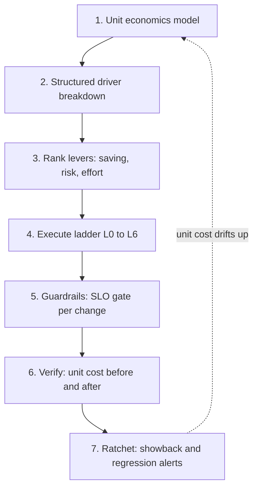
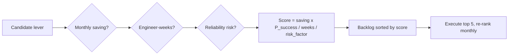
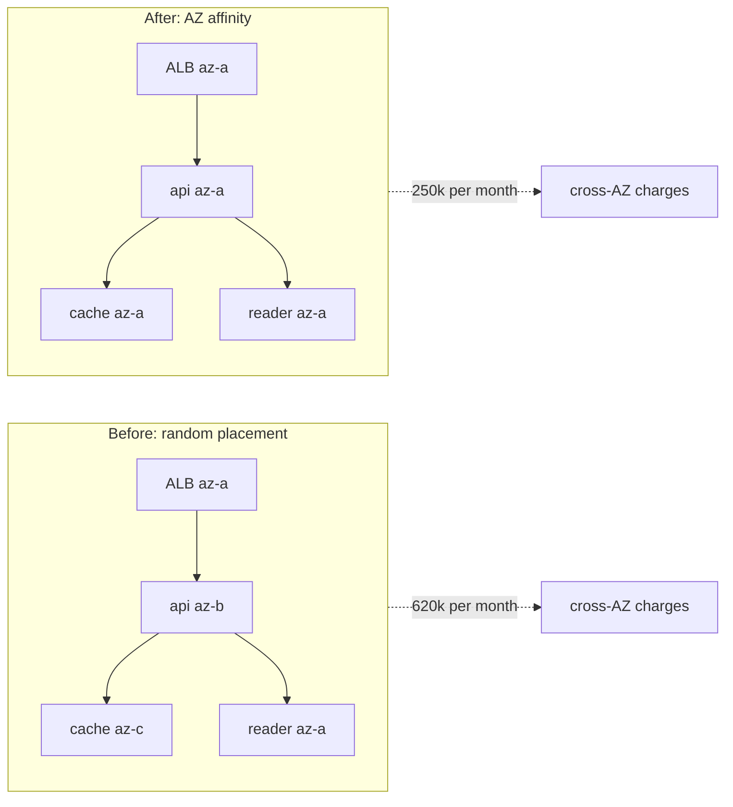

# S10 — Cost / Efficiency Review of a Large Service

<span class="pill pill-core">SRE Round</span>

**Cut a live service's infrastructure bill by 30% without spending any of its reliability — the hardest judgment call is telling apart the savings that are free (waste, wrong storage class, traffic taking a stupid path) from the ones that are secretly reliability being sold off in instalments.**

| | |
|---|---|
| **Commonly asked at** | Google, Meta, Netflix, Datadog, Snowflake, Uber, Dropbox, Airbnb, Shopify, Stripe |
| **Time budget** | 45 min |
| **Core tension** | Every real cost lever removes slack from somewhere; slack is what absorbs failure, so cost efficiency and reliability trade against each other unless you find the genuinely wasteful slack first |
| **Prerequisites** | [Cost Engineering](../fundamentals/f28-cost-engineering.md), [Capacity Planning](../fundamentals/f24-capacity-planning.md), [SLOs & Error Budgets](../fundamentals/f23-slo-error-budgets.md), [Caching](../fundamentals/f04-caching.md), [CDN & Edge](../fundamentals/f05-cdn-edge.md), [Object Storage](../fundamentals/f15-object-storage.md), [Observability](../fundamentals/f22-observability-fundamentals.md) |

---

## 1. The Scenario As Given

> "`MediaMeta` is a live service: video metadata, thumbnails, and playback manifests for a large consumer product. It runs on AWS in three AZs of one region, with a CDN in front. Current spend is **USD 4.2M/month**, up 46% year over year while traffic grew 31%.
>
> Finance has asked for a **30% reduction within two quarters**. The SLO is 99.95% availability and p99 < 250 ms, and the VP has said explicitly that a reliability regression would be worse than missing the cost target.
>
> Walk me through how you would find the 30%, what you would do first, and how you would prove afterwards that you actually did it."

Note the second number in that first sentence: **spend grew 46% while traffic grew 31%**. That gap is the whole story. The service is getting *less* efficient per unit of work, which means there is structural waste, not just growth. A candidate who spots that in the first 60 seconds has already framed the round correctly: this is not "cut 30%", it is "find out why unit cost rose 11% and reverse it, then go further."

$$
\frac{1.46}{1.31} - 1 = 11.5\% \text{ unit-cost regression}
$$

!!! tip "Reframe the target immediately"
    "Before I start cutting, I want to change the metric we are managing. Total spend is a function of two things — efficiency and demand — and we only control one of them. I will optimise **cost per million requests** and report total spend as a derived number. Otherwise, if traffic grows 20% next quarter, a genuinely excellent efficiency program will look like a failure."

---

## 2. Clarifying Questions to Ask First

| Question | Why it changes the answer |
|---|---|
| "Is the 30% against total spend or against unit cost, and at what traffic assumption?" | With 18% traffic growth, a 30% unit-cost cut only shows up as a 17% total-spend cut. Agreeing this up front prevents the program being declared a failure at the end. |
| "Is it 30% of the run rate at a point in time, or 30% of the annualised forecast?" | "Cost avoidance" against a growth forecast is much easier than absolute reduction, and finance often means the former. |
| "What commitments (Savings Plans, Reserved Instances, enterprise agreements) are already in place and when do they expire?" | You cannot right-size into a commitment you have already paid for; you can only stop the waste from growing. Expiry dates set the schedule. |
| "Am I allowed to change user-visible behaviour — image quality, retention of old data, API rate limits, free-tier limits?" | Demand-shaping levers are usually the biggest and are usually off the table. Ask, because sometimes they are not. |
| "Who else's cost shows up in my bill, and does my cost show up in someone else's?" | Shared platforms (a company-wide Kafka, a shared mesh) mean some of "your" spend is not yours to cut, and some of your savings will accrue to another team's line. |
| "What is the reliability guardrail, precisely?" | "Do not hurt reliability" is not testable. Turn it into: no SLO burn-rate regression, no reduction in provisioned failure headroom below N+1 per AZ. |
| "Is there a tagging/allocation standard already, and what fraction of spend is unallocatable?" | If 40% of spend is untagged, your first two weeks are attribution, not optimisation. |
| "What is the engineering budget for this — how many engineer-weeks?" | Ranking levers by savings alone is wrong; rank by savings per engineer-week, risk-adjusted. |
| "Does the team see its own cost today?" | Without showback, every saving you make will be re-spent within two quarters by people who cannot see the consequence. |
| "What happens to the money?" | If savings are reinvested in the team, you get cooperation. If they vanish into a corporate line, you get quiet sabotage. This is a real engineering-leadership question, not a cynical one. |

---

## 3. Framework / Approach



### Step 1 — Build the unit economics model first

The first artifact is not a savings plan. It is a model that turns the bill into a rate.

Pick denominators that a product person recognises and that an engineer can influence:

| Unit | Formula | Who it speaks to | Watch out for |
|---|---|---|---|
| Cost per million requests | `total / (requests/1e6)` | Engineering | Hides mix shift between cheap and expensive endpoints |
| Cost per monthly active user | `total / MAU` | Product, finance | Moves when engagement changes, not just efficiency |
| Cost per GB stored per month | `storage_cost / GB` | Storage owners | Must be split by storage class or it averages away the signal |
| Cost per GB egressed | `egress_cost / GB` | CDN/network owners | Blended rates hide tier pricing cliffs |
| Cost per transcode-minute | `worker_cost / minutes` | Batch owners | The right unit for asynchronous work |
| Gross margin per customer | `(revenue - cogs) / customer` | Executives | The only unit that survives a board meeting |

Do **not** stop at one. A single blended unit hides mix shifts — if cheap requests grow and expensive ones do not, blended cost per request falls while nothing improved. Model at least one unit per major cost driver.

```sql
-- Cost per million requests, by service and driver, from the AWS Cost and
-- Usage Report joined to a monthly request-count table.
WITH cost AS (
  SELECT
    date_trunc('month', line_item_usage_start_date) AS month,
    resource_tags_user_service                      AS service,
    CASE
      WHEN line_item_product_code = 'AmazonEC2'
           AND line_item_usage_type LIKE '%BoxUsage%'      THEN 'compute'
      WHEN line_item_usage_type LIKE '%DataTransfer-Regional%'
                                                           THEN 'cross_az'
      WHEN line_item_usage_type LIKE '%DataTransfer-Out%'  THEN 'egress_internet'
      WHEN line_item_usage_type LIKE '%NatGateway-Bytes%'  THEN 'nat_processing'
      WHEN line_item_product_code IN ('AmazonS3','AmazonEBS') THEN 'storage'
      WHEN line_item_product_code IN ('AmazonRDS','AmazonElastiCache',
                                      'AmazonMSK','AmazonDynamoDB')
                                                           THEN 'managed_premium'
      ELSE 'other'
    END                                             AS driver,
    SUM(line_item_unblended_cost)                   AS usd
  FROM cur
  WHERE line_item_line_item_type IN ('Usage','DiscountedUsage','SavingsPlanCoveredUsage')
  GROUP BY 1, 2, 3
)
SELECT
  c.month,
  c.service,
  c.driver,
  c.usd,
  r.requests_millions,
  ROUND(c.usd / NULLIF(r.requests_millions, 0), 4) AS usd_per_million_requests
FROM cost c
JOIN request_counts r USING (month, service)
ORDER BY c.month DESC, c.usd DESC;
```

!!! warning "Unallocated spend is the first bug to fix"
    If more than ~10% of spend cannot be attributed to a service, stop and fix tagging before optimising. You cannot rank drivers you cannot see, and the untagged pile is disproportionately made of orphaned resources — which is also where the easiest savings live. Enforce tags with an admission policy (deny resource creation without `service`, `env`, `owner`), and backfill by resource-graph queries, not by asking teams nicely.

### Step 2 — Structured driver breakdown, not guessing

Decompose the bill into a fixed taxonomy. Always the same buckets, so you can compare months and services.

| Driver | Typical share | Why it grows quietly |
|---|---|---|
| Compute (instances, containers, serverless) | 30-45% | Over-provisioning that nobody re-checks; autoscaling floors set during an incident and never lowered |
| Storage (block, object, snapshots, backups) | 10-25% | Nothing is ever deleted; no lifecycle policy; snapshot sprawl |
| Network (internet egress, cross-AZ, cross-region, NAT, load balancer processing) | 10-30% | Invisible in dashboards, denominated in fractions of a cent, generated by architecture decisions nobody costed |
| Managed-service premium | 10-20% | The delta between a managed service and the raw resources it runs on; grows with every "let's just use the managed one" |
| Observability | 5-15% | Cardinality and retention compound; nobody deletes a metric |
| Licences, support, misc | 1-5% | Percentage-of-spend support plans make every other line 3-10% worse |

!!! example "Do the breakdown live"
    In the interview, actually write the six buckets and put a guessed percentage next to each, then say: *"These are my priors; the first thing I do is replace them with real numbers from the CUR, because in my experience the surprise is almost always network."* That sentence signals experience better than any architecture you can draw.

### Step 3 — Rank by savings per engineer-week, risk-adjusted



$$
\text{Score} = \frac{\text{MonthlySaving} \times P(\text{realised})}{\text{EngineerWeeks} \times \text{RiskFactor}}
$$

`RiskFactor` is 1 for changes with no reliability coupling (delete an orphaned snapshot), 2 for reversible changes touching the serving path (compression), 4 for changes that consume headroom (right-sizing, spot), and 8 for anything that changes a failure domain. This turns "biggest number first" into "best return first", which is a different and correct ordering.

### Step 4 — The lever ladder, executed in order

Work up the ladder. Lower rungs are cheaper, faster, and carry less reliability risk. Do not start at L5 because it is more interesting.

=== "L0 — Waste"

    Pure removal. No reliability coupling, no trade-off, no negotiation.

    - Unattached EBS volumes, orphaned snapshots older than policy, idle load balancers, unused Elastic IPs, old AMIs.
    - Non-production environments running 168 h/week to serve a 40 h/week workload.
    - Duplicate data: the same dataset in S3, in a warehouse, and in a search index, all "temporarily".
    - Abandoned services still serving zero requests.

    Typical yield: 3-8% of total spend. Typical effort: days. **Always do this first**, because it buys political capital for the harder levers.

    ```bash
    # Unattached volumes and their monthly cost, sorted by waste.
    aws ec2 describe-volumes --filters Name=status,Values=available \
      --query 'Volumes[].{id:VolumeId,gb:Size,type:VolumeType,created:CreateTime}' \
      --output json \
    | jq -r '.[] | [.id, .gb, .type, .created, (.gb * 0.08)] | @tsv' \
    | sort -k5 -rn | head -50
    ```

=== "L1 — Purchasing"

    Buy the same resources for less. No architecture change, no reliability impact, but a commercial bet.

    - Compute Savings Plans / Reserved Instances on the stable baseline.
    - Storage commitments, egress commitments, private pricing agreements.
    - Enterprise discount renegotiation using your actual growth curve as leverage.

    Typical yield: 15-30% off the covered portion. Effort: a procurement conversation. Risk: **commercial, not technical** — covered in Deep Dive 5.4.

=== "L2 — Tiering and lifecycle"

    Put data on the cheapest medium consistent with its actual access pattern.

    - Object storage lifecycle: hot → infrequent access → archive → delete.
    - Log and metric retention: hot for 14 days, warm for 90, cold for a year, then gone.
    - Snapshot policies with real expiry.
    - `gp2` → `gp3` on block storage (same performance, ~20% cheaper, and IOPS decoupled from size).

    Typical yield: 30-60% of the storage line. Effort: low. Risk: low, **if** you have measured access patterns first. Retrieval fees from a mis-tiered archive can exceed the storage savings.

=== "L3 — Right-sizing and autoscaling"

    Match provisioned capacity to actual demand. Deep Dive 5.3 — this is where reliability starts to be at stake.

    - Instance families matched to the actual bottleneck resource, not to habit.
    - Autoscaling on the metric that actually correlates with saturation.
    - Removing scaling floors that were raised during an incident in 2023.

    Typical yield: 15-35% of compute. Effort: medium. Risk: medium-high.

=== "L4 — Spot and preemptible"

    60-90% discounts for accepting interruption. Deep Dive 5.4.

    - Excellent: batch, transcoding, CI, analytics, stateless request serving with fast drain.
    - Forbidden: anything stateful with slow recovery, quorum members, and anything that is the last line of defence during a capacity event.

=== "L5 — Architecture"

    Change the work itself, not the price of doing it.

    - Cache hit ratio improvements (the highest-leverage change in most services — see [Caching](../fundamentals/f04-caching.md)).
    - Payload compression and format changes (zstd, AVIF/WebP, protobuf).
    - Removing a network hop, or moving it inside an AZ.
    - Replacing a managed service with a cheaper primitive where the premium is not earned.
    - Batching chatty RPCs.

    Typical yield: 10-40%, but effort is measured in quarters and risk is real.

=== "L6 — Demand shaping"

    Change what users can ask for. Usually requires product agreement.

    - Default image/video quality by device class.
    - Rate limits and fair-use quotas on expensive endpoints ([Rate Limiting](../fundamentals/f17-rate-limiting-load-shedding.md)).
    - Shorter data retention as a product policy.
    - Charging for the expensive thing, which is the only lever that self-regulates.

### Step 5 — Observability cost control (its own lever, because it is always in the top five)

Observability spend behaves like storage spend: it only ever grows, because nobody is ever rewarded for deleting a metric. It is also the lever where naive cuts do the most damage, because you are cutting your ability to diagnose the incidents that the rest of the program's risk is creating.

**The cardinality mechanic.** Time-series cost scales with *active series*, and series count is the product of label cardinalities:

$$
\text{Series} = \sum_{\text{metric}} \prod_{i} |L_i|
$$

One metric with `endpoint` (120) x `status` (14) x `instance` (900) x `region` (3) x `customer_tier` (4) is:

$$
120 \times 14 \times 900 \times 3 \times 4 = 18{,}144{,}000 \text{ series from a single metric}
$$

Drop `instance` (you have 900 of them and you almost never query a single one for an SLI) and it is 20,160. That is a 900x reduction from removing one label, with essentially no diagnostic loss, because per-instance detail belongs in a short-retention, high-resolution tier or in traces.

| Technique | Saving | Diagnostic cost | Do it? |
|---|---|---|---|
| Drop `instance`/`pod` label from aggregate SLI metrics | Huge (10-1000x on affected metrics) | Low — use exemplars or traces to reach an instance | Yes, first |
| Ban unbounded labels (`user_id`, `request_id`, raw URL path) | Huge and prevents future blowups | None if you templatise paths | Yes, enforce in CI |
| Drop metrics with zero queries in 90 days | 20-40% of series | None measurable | Yes, but keep an allowlist for incident-only metrics |
| Reduce scrape interval 15s → 30s for non-SLI metrics | ~50% of datapoints | Slower detection on non-paging metrics | Yes for non-SLI only |
| Tail-based trace sampling (keep all errors + slow, sample the rest at 1%) | 90%+ of trace volume | Very low — you keep the interesting traces | Yes |
| Head-based uniform trace sampling at 1% | 99% | High — you lose the rare slow traces, which is the entire point of tracing | No |
| Log level INFO → WARN in hot paths, structured events instead | 40-70% of log volume | Medium — must add deliberate structured events first | Yes, but in that order |
| Hot retention 30d → 14d, warm/archive beyond | 30-50% of log storage | Low — most queries are within 48h | Yes |
| Delete logs entirely for a service | 100% | Catastrophic during its next incident | No |

```promql
# Find your most expensive metrics by series count, to target cardinality work.
topk(25,
  count by (__name__) ({__name__=~".+"})
)

# Find metrics nobody queries: compare the above against query-log analysis.
# Then find the label doing the damage on a specific metric:
topk(10,
  count by (pod) (http_request_duration_seconds_bucket)
)
```

!!! danger "The cut you will regret"
    Reducing observability *before* the risky cost levers land is backwards. Right-sizing and spot adoption both increase the rate of weird, hard-to-diagnose incidents. Sequence it the other way: keep full observability through the risky changes, then trim observability once the new steady state is stable. A team that cut trace sampling in month 1 and then spent 6 hours diagnosing a spot-interruption cascade in month 3 destroyed more value than it saved.

### Step 6 — Guardrails: every change passes a reliability gate

Each lever ships with three things attached, or it does not ship:

1. **A pre-registered hypothesis**: "this reduces cost by X with no change to SLI Y."
2. **A canary or wave rollout** with automatic rollback on SLI burn ([Deployment & Release Safety](../fundamentals/f25-deployment-release-safety.md)).
3. **A headroom assertion**: after the change, the service must still absorb the loss of one AZ at peak. This one rule kills most bad right-sizing before it happens.

$$
\text{HeadroomOK} \iff \text{Capacity}_{\text{after}} \times \frac{N_{AZ}-1}{N_{AZ}} \geq \text{Peak} \times (1 + \text{growth buffer})
$$

### Step 7 — Verify with unit cost, then ratchet

- Report **cost per million requests** as the headline, total spend as secondary, and always show traffic alongside.
- Add a **unit-cost regression alert**: if cost per million requests rises more than 5% month over month, it pages the owning team's chat (not a human at 3 a.m.).
- Put per-team showback in a weekly dashboard. Savings without visibility get silently re-spent within two quarters — this is the single most reliable pattern in the whole discipline.

---

## 4. Worked Example

### 4.1 The bill, decomposed

Total: **USD 4,200,000/month**. Traffic: 62,000 million requests/month (~23,900 RPS average), 18M MAU, 9.2 PB stored, 1.4 PB/month internet egress.

| Driver | USD/month | Share | Sub-breakdown |
|---|---|---|---|
| Compute | 1,512,000 | 36.0% | API fleet 890k; async/transcode workers 372k; batch & analytics 150k; non-prod 100k |
| Network | 924,000 | 22.0% | **cross-AZ 612k**; internet egress 186k; cross-region replication 84k; NAT processing 42k |
| Storage | 714,000 | 17.0% | S3 standard 212k; S3 requests 120k; EBS gp2 176k; snapshots 95k; EFS 60k; backup copies 51k |
| Managed-service premium | 630,000 | 15.0% | Aurora 265k; DynamoDB 148k; ElastiCache 122k; MSK 95k |
| Observability | 378,000 | 9.0% | metrics 186k; logs 142k; traces 50k |
| Other | 42,000 | 1.0% | support, misc |

### 4.2 Unit economics, before

$$
\text{Cost per million requests} = \frac{4{,}200{,}000}{62{,}000} = \textbf{USD } 67.74
$$

$$
\text{Cost per MAU} = \frac{4{,}200{,}000}{18{,}000{,}000} = \textbf{USD } 0.233
$$

$$
\text{Cost per GB-month stored} = \frac{714{,}000}{9{,}200{,}000} = \textbf{USD } 0.0776
$$

That storage number is the first red flag. S3 Standard is USD 0.023/GB-month; paying 0.0776 blended means the mix is dominated by block storage and snapshots, not object storage. Second red flag: **network is 22% of the bill and 66% of that is cross-AZ**, which produces no user-visible value whatsoever.

### 4.3 Finding the cross-AZ driver

62,000 million requests/month, and VPC flow log analysis shows **31 PB/month of cross-AZ traffic**:

$$
\frac{31 \times 10^{6}\ \text{GB}}{62 \times 10^{9}\ \text{req}} = 500\ \text{KB of cross-AZ bytes per request}
$$

$$
31 \times 10^{6}\ \text{GB} \times \text{USD } 0.02/\text{GB (both directions)} = \textbf{USD } 620{,}000/\text{month}
$$

Where does 500 KB per request come from? The trace shows four hops, each of which lands in a random AZ:

```text
  client -> ALB (AZ-a)            ~0 KB    (free inbound)
  ALB    -> api pod (AZ-b)        120 KB   <- 2/3 chance of crossing AZ
  api    -> cache (AZ-c)          140 KB   <- 2/3 chance
  api    -> aurora reader (AZ-a)  180 KB   <- 2/3 chance
  api    -> thumbnail svc (AZ-b)   60 KB   <- 2/3 chance
```

With uniform random placement across 3 AZs, each hop crosses an AZ boundary with probability 2/3:

$$
\mathbb{E}[\text{cross-AZ bytes/req}] = \frac{2}{3} \times (120 + 140 + 180 + 60)\ \text{KB} = 333\ \text{KB}
$$

Measured 500 KB is higher because retries and the mesh sidecar add hops. Either way: **the single largest controllable line item in this bill is bytes crossing a boundary for no reason.**



### 4.4 The ranked backlog

| # | Lever | Rung | USD/mo saving | Eng-weeks | Risk | Score |
|---|---|---|---|---|---|---|
| 1 | VPC gateway endpoints for S3 + DynamoDB; stop routing them through NAT | L0 | 38,000 | 1 | 1 | 38,000 |
| 2 | Shut down non-prod outside working hours; delete 14 zombie environments | L0 | 61,000 | 1.5 | 1 | 40,700 |
| 3 | EBS `gp2` → `gp3`, right-size volumes, expire orphan snapshots | L2 | 96,000 | 2 | 1 | 48,000 |
| 4 | S3 Intelligent-Tiering + Glacier IR for objects older than 90 days | L2 | 128,000 | 2 | 1.5 | 42,700 |
| 5 | AZ-aware routing: topology hints, same-AZ readers, same-AZ cache | L5 | 367,000 | 6 | 2 | 30,600 |
| 6 | zstd on internal RPC + AVIF thumbnails: 45% fewer bytes | L5 | 120,000 | 4 | 2 | 15,000 |
| 7 | Right-size API fleet: p50 CPU 22% → 55% with corrected HPA metric | L3 | 214,000 | 5 | 4 | 10,700 |
| 8 | Spot for async/transcode/batch (70% of those workloads) | L4 | 190,000 | 4 | 4 | 11,900 |
| 9 | Observability: drop `pod` label, tail sampling, 30d → 14d hot logs | L2/L5 | 151,000 | 3 | 2 | 25,200 |
| 10 | 1-year Compute Savings Plan covering 60% of stable baseline | L1 | 168,000 | 0.5 | 1 | 336,000 |
| | **Gross total** | | **1,533,000** | **29** | | |

Risk-adjusted at an 82% realisation rate (some levers under-deliver; number 7 will deliver less than modelled once headroom is respected):

$$
1{,}533{,}000 \times 0.82 = \textbf{USD } 1{,}257{,}000/\text{month} \approx 30\% \text{ of 4.2M}
$$

!!! note "Note the ordering by score, not by size"
    The Savings Plan (#10) is 11% of the savings and 1.7% of the effort, so it scores highest by an order of magnitude — do it in week one. AZ affinity (#5) is the biggest single number but takes six engineer-weeks and touches routing, so it runs in parallel on a longer track. Right-sizing (#7) has the worst score of any large lever because it carries the most reliability risk per dollar. That ordering is the actual answer to "what would you do first".

### 4.5 Sequencing across two quarters

```text
  Q1 W1-2   : #10 Savings Plan, #1 VPC endpoints, #2 non-prod shutdown
              (banks 267k/mo immediately, funds the program politically)
  Q1 W2-5   : #3 EBS, #4 S3 lifecycle                   (+224k)
  Q1 W3-9   : #5 AZ affinity  (canary one AZ pair first) (+367k)
  Q1 W6-10  : #6 compression + AVIF, behind a flag        (+120k)
  Q2 W1-5   : #7 right-sizing, one service at a time,
              headroom assertion enforced in CI           (+214k)
  Q2 W2-6   : #8 spot migration for batch first, then
              async workers, never for stateful           (+190k)
  Q2 W6-9   : #9 observability trim -- LAST, on purpose   (+151k)
  Q2 W10    : verification, ratchet, showback launch
```

### 4.6 Verifying the win — why total spend lies

Over the two quarters, traffic grew 18% to 73,200 million requests/month. Roughly 55% of the pre-program spend was variable with traffic.

After-state spend:

$$
\text{Base after cuts} = 4{,}200{,}000 - 1{,}257{,}000 = 2{,}943{,}000
$$

Variable portion after efficiency work ≈ USD 1,400,000, which grows with traffic:

$$
\Delta_{\text{growth}} = 1{,}400{,}000 \times 0.18 = 252{,}000
$$

$$
\text{Total after} = 2{,}943{,}000 + 252{,}000 = \textbf{USD } 3{,}195{,}000
$$

| Metric | Before | After | Change |
|---|---|---|---|
| Total monthly spend | 4,200,000 | 3,195,000 | **-23.9%** |
| Requests (millions/month) | 62,000 | 73,200 | +18.1% |
| **Cost per million requests** | **67.74** | **43.65** | **-35.6%** |
| Cost per MAU | 0.233 | 0.152 | -34.8% |
| SLO attainment | 99.962% | 99.958% | within budget |
| Error budget consumed | 61% | 68% | +7 points |

**This table is the answer to the round.** Total spend fell 24%, not the 30% asked for — and the honest framing is: *"We delivered a 35.6% efficiency improvement. Traffic grew 18%, which consumed 12 points of it. If you want 30% off the absolute bill in a growing business, the last 6 points have to come from demand shaping or from accepting a lower SLO, and here is what each would cost."*

!!! warning "The reliability column is not decoration"
    Error budget consumption went from 61% to 68%. That is inside budget but it is a real signal: the program spent 7 points of reliability margin. If it had gone to 95%, the correct action would be to roll back the most recent risky lever, regardless of the cost target. **Report the error budget in the same table as the savings, every month, or you are hiding the price you paid.**

---

## 5. Deep Dives

### 5.1 The Unit Economics Model

The model is the deliverable that outlives the project. Three things make it credible.

**1. Pick denominators that survive mix shift.** A single blended "cost per request" is easy to game and easy to be fooled by. Model the expensive endpoints separately:

| Endpoint class | Requests/mo (M) | Allocated cost | USD per million |
|---|---|---|---|
| `GET /manifest` (cache hit) | 41,000 | 287,000 | 7.00 |
| `GET /manifest` (cache miss) | 2,300 | 621,000 | 270.00 |
| `GET /thumbnail` | 16,400 | 1,148,000 | 70.00 |
| `POST /upload` | 140 | 890,000 | 6,357.00 |
| Everything else | 2,160 | 1,254,000 | 580.56 |

This table changes the strategy. Cache misses are 38x the cost of hits, so **moving the manifest cache hit rate from 94.7% to 97.5% removes half the miss traffic** — that one number is worth more than most of the backlog and appears nowhere in a driver-level breakdown. Always drill from driver to unit to endpoint.

$$
\text{Miss cost} = (1 - h) \times R \times c_{\text{miss}} \Rightarrow \frac{\partial}{\partial h} = -R \times c_{\text{miss}}
$$

At `R = 43,300M requests/mo` and `c_miss = USD 270/M`, each point of hit ratio is worth `433 x 270 = USD 117,000/month`. That is the kind of arithmetic that reframes a cost review as a caching project. See [Caching](../fundamentals/f04-caching.md).

**2. Allocate shared costs with a stated, boring rule.** Shared platform costs (mesh, logging pipeline, cluster control plane) must be allocated or they become a 20% unattributable blob. Options, in order of preference:

| Method | Fairness | Gameability | Use when |
|---|---|---|---|
| Direct metering (actual bytes, actual CPU-seconds) | High | Low | Always, if instrumentation exists |
| Proportional to a driver (requests, CPU) | Medium | Medium | Default fallback |
| Even split across teams | Low | High | Never, except tiny costs |
| Leave unallocated in a platform budget | N/A | N/A | Only for genuine fixed costs like the cluster control plane |

The rule matters less than its stability. Changing the allocation rule mid-program makes your before/after comparison meaningless, which is the fastest way to lose finance's trust.

**3. Version the model and freeze the baseline.** Write down the exact query, the exact month, and the exact traffic figure that constitute the baseline, and never recompute them. Every efficiency program that "loses" its savings does so because someone recomputed the baseline with a new methodology.

```python
from dataclasses import dataclass

@dataclass(frozen=True)
class Baseline:
    """Frozen at program start. Never recomputed, only referenced."""
    month: str                    # "2026-03"
    total_usd: float              # 4_200_000
    requests_millions: float      # 62_000
    mau: float                    # 18_000_000
    stored_gb: float              # 9_200_000
    cur_query_sha: str            # hash of the SQL that produced it

    @property
    def usd_per_million_requests(self) -> float:
        return self.total_usd / self.requests_millions


def efficiency_delta(base: Baseline, now_usd: float, now_reqs_m: float) -> dict:
    now_unit = now_usd / now_reqs_m
    return {
        "unit_cost_change_pct": (now_unit / base.usd_per_million_requests - 1) * 100,
        "total_spend_change_pct": (now_usd / base.total_usd - 1) * 100,
        "traffic_change_pct": (now_reqs_m / base.requests_millions - 1) * 100,
        # The number finance should be shown, and the number engineering owns:
        "avoided_cost_usd": base.usd_per_million_requests * now_reqs_m - now_usd,
    }
```

That last field — **cost avoidance** — is how you get credit in a growing business. At the end of the worked example: `67.74 x 73,200 = USD 4,958,568` would have been spent at the old efficiency; actual is 3,195,000; avoided cost is **USD 1,763,568/month**. That is the honest, defensible, large number.

### 5.2 The Cross-AZ and Cross-Region Traffic Trap

This is the most common hidden top-three driver, and it is hidden for four structural reasons:

1. **It is priced in fractions of a cent per GB**, so nobody models it. USD 0.01/GB feels free until you move 31 PB.
2. **It is billed in both directions** within a region on AWS, so the effective rate is 0.02/GB for a round trip.
3. **No dashboard shows it.** Your service metrics show requests and latency, not bytes crossing a boundary. The information lives in VPC flow logs, which nobody looks at.
4. **It is generated by architecture, not by code.** A service mesh, a random-placement scheduler, and a multi-AZ read replica pool produce it automatically. No engineer ever wrote "send this across an AZ".

**Finding it:**

```sql
-- VPC flow logs in Athena: cross-AZ bytes by source/destination service,
-- using an ENI-to-AZ mapping table. This query is usually a shock.
SELECT
  s.service      AS src_service,
  d.service      AS dst_service,
  s.az           AS src_az,
  d.az           AS dst_az,
  SUM(f.bytes) / POW(1024, 4)              AS tb,
  SUM(f.bytes) / POW(1024, 3) * 0.02       AS usd_estimate
FROM vpc_flow_logs f
JOIN eni_inventory s ON f.interface_id = s.eni_id
JOIN eni_inventory d ON f.dstaddr       = d.private_ip
WHERE f.day BETWEEN '2026-03-01' AND '2026-03-31'
  AND s.az <> d.az
GROUP BY 1,2,3,4
ORDER BY tb DESC
LIMIT 40;
```

**Fixing it — and the reliability trade in each fix:**

| Fix | Mechanism | Saving | Reliability trade |
|---|---|---|---|
| Topology-aware routing (`topologyAwareHints`, zone-local service routing) | Prefer same-AZ endpoints | 50-70% of service-to-service cross-AZ | **Real**: if one AZ's replicas are unhealthy, zone-local routing concentrates load. Must fall back to cross-AZ automatically below a healthy-endpoint threshold |
| Same-AZ read replicas | Route reads to the reader in the caller's AZ | 40-60% of DB cross-AZ | Needs a reader per AZ — more replicas, partially offsetting the saving |
| Zone-local cache tier | Each AZ has its own cache | 80-100% of cache cross-AZ | Lower hit ratio (working set split 3 ways) and 3x memory for the same hit ratio; model this before committing |
| Compression on internal RPC | Fewer bytes to charge for | 40-60% of all of it | CPU cost — zstd level 3 is roughly 1-3% CPU for 45-60% size reduction on JSON; measure |
| Collapse chatty hops | Fewer boundary crossings | Varies, often large | Architectural work, weeks |
| VPC endpoints instead of NAT | S3/DynamoDB traffic bypasses NAT processing charges | 100% of that NAT line | None. This is free money. Do it today |
| Single-AZ deployment | No cross-AZ at all | 100% | Unacceptable — you have traded an availability guarantee for a line item |

!!! danger "AZ affinity is a real reliability change, not a free optimisation"
    Zone-local routing means an AZ's failure is no longer smoothly absorbed by the other two — traffic in the failing AZ has nowhere local to go, and the failover is a step function rather than a gradient. Implement it with a **minimum healthy endpoints** rule: if fewer than 60% of zone-local endpoints are healthy, spill over to other zones immediately. Kubernetes `topologyAwareHints` does roughly this; verify the behaviour by draining one AZ in a game day before you claim the saving.

**Cross-region is the same trap at 5-10x the price.** USD 0.02/GB region-to-region, plus you are usually replicating for DR, which means it grows with your data, forever. The levers: replicate deltas not snapshots, compress, and ask hard whether the RPO justifies continuous replication versus periodic. See [Multi-Region & DR](../fundamentals/f26-multi-region-dr.md).

### 5.3 Right-Sizing Without Eating Your Headroom

Right-sizing is where a cost program becomes an outage. The failure mode is simple: utilisation looks low on average, someone shrinks the fleet, and the first traffic spike or AZ failure finds out that the "waste" was the safety margin.

**Use the right statistic.** Average CPU is almost useless. What matters is the distribution at the granularity at which you can react:

| Statistic | What it tells you | Trap |
|---|---|---|
| Mean CPU over a month | Almost nothing | Averages away every peak that matters |
| p50 over 1-min windows | Steady-state efficiency | Ignores the tail entirely |
| **p99 over 1-min windows, per instance** | The real operating ceiling | The number to size against |
| Max over 1-min windows | The worst minute of the month | Usually a deploy or a GC storm, not representative |
| p99 of the *busiest instance* | Load-balancing fairness | If this is far above fleet p99, your problem is balance, not size |

```promql
# The number to right-size against: per-instance p99 CPU over 1-minute windows,
# across 28 days, for the busiest instance in each deployment.
max by (deployment) (
  quantile_over_time(0.99,
    (
      rate(container_cpu_usage_seconds_total{container!=""}[1m])
      /
      on(pod) group_left kube_pod_container_resource_limits{resource="cpu"}
    )[28d:1m]
  )
)

# And the balance check -- if this ratio is above ~1.4 you have a
# load-balancing problem masquerading as a capacity problem.
max by (deployment) (avg_over_time(cpu_util[1h]))
  /
avg by (deployment) (avg_over_time(cpu_util[1h]))
```

**The headroom budget.** Capacity is not one number; it is a stack of reserves, each of which exists for a reason. Write them down explicitly and only cut the ones you can name:

| Reserve | Typical size | Justification | Safe to cut? |
|---|---|---|---|
| AZ failure headroom | 50% (for 3 AZs, losing 1) | Required by the availability design | No |
| Autoscaling reaction time | 10-20% | The gap between spike start and new capacity ready | Only by making scaling faster |
| Diurnal peak vs current | varies | Absorbed by autoscaling if it works | Yes, if autoscaling is trustworthy |
| Deploy surge (rolling update) | 10-25% | Surge replicas during rollout | Yes, by reducing surge or using slower rollouts |
| Retry/failover amplification | 10-30% | Downstream failures multiply load | No — this is what prevents cascades |
| GC/JIT/noise margin | 5-15% | Runtime behaviour | Reduce only with evidence |
| **Genuine over-provisioning** | ??? | None | **This is the only thing right-sizing should remove** |

$$
\text{SafeTarget} = \frac{\text{Knee}}{(1 + r_{\text{AZ}})(1 + r_{\text{scale}})(1 + r_{\text{deploy}})(1 + r_{\text{retry}})}
$$

With a knee at 80% CPU, AZ reserve 0.5, scaling reserve 0.15, deploy surge 0.15, retry margin 0.15:

$$
\text{SafeTarget} = \frac{0.80}{1.5 \times 1.15 \times 1.15 \times 1.15} = \frac{0.80}{2.282} = 35\%
$$

So a fleet sitting at 22% p50 CPU has *less* slack than it looks: the defensible target is around 35%, not 70%. Going to 55% as the worked example proposed would require first reducing one of the reserves — for example, making autoscaling fast enough to shrink `r_scale`, or reducing deploy surge. **Say this in the interview**: right-sizing to a number without decomposing the reserves is exactly how cost programs cause outages.

**The autoscaling reaction-time math** that bounds `r_scale`:

$$
r_{\text{scale}} = \frac{\text{growth rate} \times t_{\text{provision}}}{\text{current capacity}}
$$

If traffic can grow 3%/minute during a flash event and a new pod takes 4 minutes to be ready (scheduling + image pull + warmup + health check + LB registration), you need `3 x 4 = 12%` headroom minimum, and more if the scaling controller's evaluation period adds delay. **Cutting `t_provision` is worth more than cutting instance count**, because it lets you safely cut instance count afterwards. Pre-pulled images, smaller images, and faster warmup are cost levers disguised as latency work.

**Also right-size the shape, not just the count.** A fleet at 22% CPU and 78% memory is not over-provisioned — it is on the wrong instance family. Check every dimension (CPU, memory, network, EBS bandwidth, IOPS, ENI limits) and move to the family whose ratio matches your actual bottleneck. This is frequently a 20-30% saving with *zero* reduction in headroom, which makes it the best right-sizing you can do.

### 5.4 Discount Engineering: Spot and Commitments

These two levers give the largest percentage discounts and carry the least *technical* risk — but each has a failure mode that has embarrassed serious companies.

**Spot / preemptible.**

$$
\text{Effective cost} = p_{\text{spot}} + \underbrace{\frac{\lambda \cdot c_{\text{interrupt}}}{\text{hours}}}_{\text{interruption cost}} + \underbrace{c_{\text{engineering}}}_{\text{amortised}}
$$

At 70% off, spot only loses if interruption cost is large — which it is precisely for the workloads people are most tempted to move.

| Workload | Spot? | Why |
|---|---|---|
| Batch, ETL, transcoding, CI | Yes, aggressively | Work is retryable and idempotent; checkpointing bounds lost work |
| Stateless HTTP serving with fast drain | Yes, partially | 2-minute interruption notice is enough to drain, **if** you actually implemented drain and your LB deregistration is fast |
| Async queue consumers | Yes | At-least-once delivery means an interrupted consumer just redelivers — provided handlers are idempotent ([Idempotency](../fundamentals/f11-idempotency.md)) |
| Stateful databases, quorum members | **No** | Losing a quorum member on a price signal correlated across the fleet is how you lose a cluster ([Consensus](../fundamentals/f09-consensus.md)) |
| Kafka brokers, ZooKeeper/etcd | **No** | Rebalance storms cost more than the discount |
| Anything holding the only copy of data | **No** | Obvious, yet it happens |
| Capacity you are relying on during a failover | **No** | Spot capacity is least available exactly when a region is stressed — the correlation is the whole problem |
| Long-running single-tasks with no checkpoint | No | Expected lost work grows with runtime: a 6-hour job on a 4% hourly interruption rate has a ~22% chance of never finishing |

$$
P(\text{job completes}) = (1 - \lambda)^{T} \quad\Rightarrow\quad (1 - 0.04)^{6} = 0.783
$$

Mitigations that make spot safe: diversify across many instance types and AZs (interruptions are per-pool), keep an on-demand floor that alone satisfies your minimum viable capacity, honour the interruption notice with real draining, and checkpoint long jobs.

!!! danger "The correlated-interruption failure"
    Spot interruptions are not independent. A capacity crunch reclaims an entire instance pool at once. A fleet that is 90% spot on one instance type in one AZ can lose 90% of its capacity in two minutes. Rule: **on-demand or reserved capacity alone must be sufficient to serve your minimum viable traffic with SLO intact.** Spot is the top of the stack, never the foundation.

**Commitments (Savings Plans / Reserved Instances).**

Let `U` be on-demand-equivalent usage in USD/hour, `C` the hourly commitment, `d` the discount:

$$
\text{Cost} = \max\big(C,\ U \times (1-d)\big)
$$

- If `U(1-d) >= C`: you save `U x d`. Good.
- If `U(1-d) < C`: you pay `C` regardless. You lose money once `C > U`, i.e. once usage falls below the commitment measured in on-demand terms.

The break-even usage is therefore `U* = C`, and the **safe commitment level** is set from the *low* end of the forecast, not the middle:

$$
C^{*} = (1-d) \times \min_{t \in \text{term}} \hat{U}_t \times (1 - \text{safety margin})
$$

A practical ladder:

| Layer | Coverage | Instrument | Rationale |
|---|---|---|---|
| Floor (never shrinks) | 40-50% | 3-year commitment | Deepest discount on capacity you are certain of |
| Stable base | 20-25% | 1-year commitment | Good discount, re-evaluated annually |
| Elastic | 15-20% | On-demand | Absorbs growth and gives you the freedom to right-size |
| Opportunistic | 15-25% | Spot | Interruption-tolerant only |

!!! warning "Commit after optimising, not before"
    The sequencing error that costs real money: buy a 3-year commitment in month 1, then spend two quarters right-sizing away 30% of the usage you committed to. You are now paying for capacity you deliberately eliminated, and the efficiency work shows up as zero savings on the bill. **Order: eliminate waste → right-size → measure the new stable floor → then commit to that floor.** If there is pressure to commit early, buy the shortest term available for the portion you are about to optimise.

The other commercial trap is the opposite: refusing to commit at all because "we might change architecture". Uncommitted spend at on-demand rates on a genuinely stable baseline is a 27-40% self-inflicted premium. Commit to the floor you are *certain* about; the floor is almost always larger than the nervous engineer estimates.

---

## 6. What Can Go Wrong

| Risk | Detection | Mitigation |
|---|---|---|
| Right-sizing removes headroom; next spike becomes an incident | Post-change: p99 CPU per instance, autoscaling events/hour, SLO burn rate; a spike in scale-out events is the leading indicator | Decompose the headroom budget explicitly; enforce the AZ-failure assertion in CI; roll out per-service with canary and auto-rollback |
| Savings are real but reliability is quietly sold off | Error budget consumption trending up while cost trends down | Publish cost and error budget in the same monthly table; treat a burn-rate regression as a rollback trigger, not a discussion |
| Storage tiering causes retrieval-fee blowout | Retrieval cost line appears and grows; restore latency complaints | Analyse access patterns (S3 Storage Lens / access logs) before tiering; start with Intelligent-Tiering which has no retrieval fee for the IA tier |
| Observability cut leaves you blind in the next incident | MTTD/MTTR regression; "we don't have that metric" in postmortems | Sequence observability cuts last; keep an incident-only allowlist; measure MTTR before and after |
| Spot interruptions correlate and take out a whole tier | Interruption-notice rate by pool; capacity-below-minimum alert | On-demand floor that alone meets minimum viable capacity; diversify pools; drain on notice |
| Commitment purchased before optimisation; unused commitment | Savings Plan utilisation < 95% | Optimise first, commit to the measured floor, use shorter terms on uncertain capacity |
| AZ-affinity routing concentrates load during an AZ degradation | Per-AZ error rate divergence; zone-local healthy endpoint count | Minimum healthy endpoints threshold with automatic cross-zone spillover; verify with an AZ drain game day |
| Savings are silently re-spent within two quarters | Unit cost creeping back up month over month | Unit-cost regression alert at +5% MoM; per-team showback; make efficiency a standing quarterly review item |
| Cost cuts land on one team's SLO to another team's budget benefit | Cross-team cost/SLO matrix | Allocate shared costs by a stable, metered rule; require the SLO owner to sign off on changes affecting their service |
| The "efficiency" is an accounting artifact (moved to a different budget line) | Consolidated spend across all accounts flat while your line drops | Always report at the consolidated level, and state explicitly what moved |
| Compression saves bytes but costs more CPU than it saves | Cost per million requests unchanged; CPU utilisation up | Measure end-to-end unit cost, not the single line item — this is the whole reason the unit model exists |
| Cache hit ratio improvement works, then regresses invisibly | Hit ratio SLI with its own alert | Treat cache hit ratio as a first-class SLI with a threshold; it is worth USD 117k/month per point here |

---

## 7. The Artifact You'd Produce

### 7.1 The Efficiency Review document (one page, plus appendices)

```text
EFFICIENCY REVIEW — MediaMeta — Baseline 2026-03 — Target 2026-09

1. BASELINE (frozen; CUR query sha256:4f1c...e2)
   Spend               USD 4,200,000 / month
   Requests            62,000 M / month
   MAU                 18,000,000
   Unit cost           USD 67.74 per million requests
   SLO attainment      99.962%   (target 99.95%)
   Error budget used   61%

2. DIAGNOSIS
   Spend +46% YoY vs traffic +31% YoY  ->  unit cost regression of 11.5%.
   Top drivers:  compute 36% | network 22% | storage 17% |
                 managed 15% | observability 9%
   Largest single controllable line: cross-AZ transfer, USD 612k/mo (14.6%
   of total spend), producing zero user value. 500 KB crosses an AZ
   boundary per request across four hops.

3. TARGET
   Primary   : unit cost 67.74 -> 47.00 per million requests  (-31%)
   Secondary : total spend, reported with traffic alongside
   Guardrail : error budget consumption must stay below 80%; no reduction
               in single-AZ-loss headroom.

4. BACKLOG (ranked by saving x P(success) / eng-weeks / risk)
   [table: lever | rung | USD/mo | weeks | risk | owner | status]

5. SEQUENCING
   Q1: purchasing + waste + storage + AZ affinity
   Q2: right-sizing + spot + observability (observability LAST, on purpose)

6. GUARDRAILS PER CHANGE
   - Pre-registered hypothesis: cost delta AND expected SLI delta (zero)
   - Canary + automatic rollback on burn-rate
   - Headroom assertion: capacity x 2/3 >= peak x 1.2 after the change

7. REPORTING
   Monthly: unit cost, total spend, traffic, error budget, avoided cost.
   Alert  : unit cost +5% MoM pages the owning team channel.

8. EXPLICIT NON-GOALS
   - No reduction in replication factor or AZ count
   - No change to user-visible quality without product sign-off
   - No commitment purchases until right-sizing is complete
```

### 7.2 The monthly scorecard (the thing you actually keep forever)

| Month | Spend (USD) | Requests (M) | Unit (USD/M) | vs baseline | Error budget used | Avoided cost (USD) |
|---|---|---|---|---|---|---|
| 2026-03 (base) | 4,200,000 | 62,000 | 67.74 | — | 61% | — |
| 2026-04 | 4,010,000 | 64,100 | 62.56 | -7.6% | 63% | 332,000 |
| 2026-05 | 3,780,000 | 66,300 | 57.01 | -15.8% | 66% | 711,000 |
| 2026-06 | 3,510,000 | 68,000 | 51.62 | -23.8% | 71% | 1,096,000 |
| 2026-07 | 3,390,000 | 70,400 | 48.15 | -28.9% | 69% | 1,377,000 |
| 2026-08 | 3,240,000 | 72,100 | 44.94 | -33.6% | 67% | 1,644,000 |
| 2026-09 | 3,195,000 | 73,200 | 43.65 | -35.6% | 68% | 1,764,000 |

### 7.3 The whiteboard version

```text
  UNIT FIRST:   cost/M-req = 4.2M / 62,000 = 67.74
  DIAGNOSIS:    spend +46% vs traffic +31% -> 11.5% unit regression

  DRIVERS:  compute 36 | net 22 (cross-AZ 14.6!) | storage 17 |
            managed 15 | o11y 9

  LADDER:   L0 waste -> L1 buy -> L2 tier -> L3 right-size ->
            L4 spot -> L5 architecture -> L6 demand

  RANK:     saving x P / (weeks x risk)     NOT by size

  GUARD:    cap x 2/3 >= peak x 1.2  after every change
            error budget reported next to every dollar

  PROVE:    unit cost, not total spend.  Avoided cost = old_unit x new_vol - new_spend
```

---

## 8. Gotchas & Corner Cases

!!! gotcha "Total spend goes up during a successful efficiency program and the program gets cancelled"
    **Symptom:** unit cost fell 22% but the monthly invoice grew, and leadership concludes the work failed.
    **Mechanism:** total spend is `unit cost x volume`. In a growing business volume moves faster than any efficiency program. Nobody agreed on the metric at kickoff, so the default metric — the invoice — wins.
    **Mitigation:** negotiate the metric *before* starting. Report unit cost as the headline with traffic always shown next to it, and introduce "avoided cost" (`baseline_unit x current_volume - current_spend`) as the number finance can book. Get the CFO's agreement in writing in the kickoff doc, not in the retrospective.

!!! gotcha "Right-sizing is done on average CPU and the first flash crowd takes the service down"
    **Symptom:** fleet reduced 40% on "22% average CPU"; two weeks later a viral event causes a 12-minute outage.
    **Mechanism:** mean utilisation ignores the reserves that were doing real work — AZ-failure headroom, autoscaling reaction time, deploy surge, retry amplification. Those reserves *look* like idle capacity because that is exactly what they are, right up until the moment they are not.
    **Mitigation:** size against per-instance p99 over 1-minute windows, and decompose the headroom budget line by line so each reserve is cut deliberately or not at all. Enforce the AZ-loss assertion `capacity x (N-1)/N >= peak x 1.2` as an automated check that fails the change.

!!! gotcha "Cross-AZ traffic is the top driver and it is invisible in every dashboard you own"
    **Symptom:** 15-25% of the bill is a line item called "regional data transfer" that no team recognises or claims.
    **Mechanism:** it is priced per GB in both directions, generated by scheduler placement and service-mesh hops rather than by any code anyone wrote, and it appears in no application metric. A four-hop request path with random AZ placement crosses a boundary 2/3 of the time per hop.
    **Mitigation:** run the VPC flow log analysis on day one of any cost review — it is a two-hour job and it is the highest-yield diagnostic in the discipline. Then attack with topology-aware routing, same-AZ readers, compression, and VPC endpoints, in that order of safety.

!!! gotcha "S3 lifecycle moves objects to archive and the retrieval fees exceed the storage savings"
    **Symptom:** storage cost drops 40%, then a "data retrieval" line appears at 60% of the saving, plus user complaints about slow loads.
    **Mechanism:** tiering was applied by object age without measuring access frequency. A long tail of old objects is still being read — old videos still get watched. Glacier retrieval is priced per GB *and* per request, and expedited retrieval is dramatically more expensive.
    **Mitigation:** analyse access patterns first (S3 Storage Lens, access logs, or Intelligent-Tiering's own analytics). Prefer Intelligent-Tiering for unpredictable patterns — its monitoring fee is small and it has no retrieval charge for the IA tiers. Reserve Glacier Deep Archive for data you are confident is compliance-only.

!!! gotcha "Spot instances are adopted for the stateless tier and one pool reclamation removes most of the fleet"
    **Symptom:** 90 seconds of 5xx storms at irregular intervals; postmortem finds 70% of pods terminated simultaneously.
    **Mechanism:** spot interruptions are correlated by instance pool (type + AZ). A fleet concentrated on one instance type in one AZ can lose almost everything at once. Worse, spot availability is lowest exactly during a regional capacity crunch — the moment you most need capacity.
    **Mitigation:** diversify across at least 6-8 instance pools; maintain an on-demand floor that alone satisfies minimum viable capacity with SLO intact; implement genuine draining on the interruption notice (including LB deregistration, which is often the slow part); and alert on `capacity_below_minimum` rather than on interruption counts.

!!! gotcha "A three-year commitment is bought in month one and right-sizing makes it unusable"
    **Symptom:** Savings Plan utilisation drops to 74%; the finance team sees the waste line and the efficiency program shows almost no net saving.
    **Mechanism:** commitments are a floor on spend. Optimising below the committed level means paying for capacity you deliberately eliminated. The sequencing was backwards.
    **Mitigation:** eliminate waste and right-size *first*, measure the new stable floor over at least 6-8 weeks, then commit to that floor with a safety margin. If there is organisational pressure to buy early, buy 1-year on the portion you intend to optimise and 3-year only on the genuinely immovable base.

!!! gotcha "Observability is cut first because it is an easy 9%, and MTTR doubles"
    **Symptom:** costs drop cleanly in month one; in month four an incident takes six hours because the trace sampling that would have shown the culprit was set to 1% head-based.
    **Mechanism:** head-based sampling decides before it knows whether a request was interesting, so it preferentially discards the rare slow requests that tracing exists to catch. Log retention cuts have a similar shape — the query you need is always for the one window you just expired.
    **Mitigation:** cut cardinality (which is nearly free diagnostically) before cutting sampling or retention; use tail-based sampling that keeps 100% of errors and slow traces; sequence observability last in the program, after the risky levers have stabilised; and track MTTD/MTTR as a guardrail metric alongside cost.

!!! gotcha "Savings are real and then silently re-spent within two quarters"
    **Symptom:** six months after the program ends, spend is back to the old trajectory and nobody can say where it went.
    **Mechanism:** without ongoing visibility, every individual decision to over-provision is locally rational and invisible. The efficiency gain was a one-time event, not a change in behaviour.
    **Mitigation:** the ratchet. Per-team showback in a weekly dashboard, a unit-cost regression alert at +5% month over month routed to the owning team, and efficiency as a standing item in quarterly planning. A program that ends without a ratchet has rented savings, not bought them.

!!! gotcha "A managed service is replaced with self-hosted to save the premium, and the premium was cheap"
    **Symptom:** self-hosting the message broker saves USD 60k/month and consumes two engineers permanently, plus a Sev-1 during an upgrade.
    **Mechanism:** the "managed-service premium" is real, but the comparison usually omits the fully loaded cost of the people who now operate it, the reliability regression during the learning period, and the opportunity cost of what those engineers would otherwise build.
    **Mitigation:** cost the alternative at fully loaded engineering cost (typically USD 25-35k/month per engineer all-in) plus a risk premium for the first year. Self-hosting wins at large scale or where you have existing deep expertise; it rarely wins on a USD 95k/month line. Compute the crossover explicitly rather than arguing about it.

!!! gotcha "Cost is optimised in one account and reappears in another"
    **Symptom:** your service's line falls 30%; the consolidated bill is flat.
    **Mechanism:** work was pushed elsewhere — onto a shared platform, onto a different team's cluster, onto the CDN provider's invoice, or into a data warehouse. The local metric improved while the company's cost did not.
    **Mitigation:** always measure at the consolidated level and explicitly declare any cost that moved. A saving that is really a transfer should be reported as a transfer — reporting it as a saving is the fastest way to lose credibility with finance permanently.

!!! gotcha "The cache hit ratio improvement is the biggest lever and it is not in the cost breakdown"
    **Symptom:** the driver-level breakdown shows compute, storage, and network, and the team optimises all three while the real lever sits in a single SLI.
    **Mechanism:** driver-level breakdowns are organised by *what you buy*, not by *what causes you to buy it*. A cache miss is 38x the cost of a hit here, so the hit ratio multiplies several drivers at once and appears in none of them.
    **Mitigation:** always build the endpoint-level unit table, not just the driver table, and compute the marginal value of a point of hit ratio (`requests x miss_cost`). If that number is large — and it usually is — the cost program is really a caching program.

!!! gotcha "Compression is enabled everywhere and the CPU bill absorbs the network saving"
    **Symptom:** network transfer falls 50%, compute rises 9%, unit cost is flat.
    **Mechanism:** compression trades CPU for bytes, and the exchange rate depends on the algorithm, the level, and the payload. gzip at level 9 on small JSON payloads can cost more CPU-dollars than the transfer-dollars it saves; zstd at level 3 usually does not.
    **Mitigation:** benchmark per payload class and only compress above a size threshold (typically 1-2 KB). Measure the end-to-end unit cost, which is precisely what the unit economics model is for. Prefer a cheaper format change (AVIF/WebP for images, protobuf for internal RPC) over aggressive compression of a bad format.

!!! gotcha "Non-production is 'only 5%' and is never touched, forever"
    **Symptom:** USD 200k/month across dozens of environments, none of which anyone will claim or delete.
    **Mechanism:** each environment is individually small and individually defended; nobody owns the aggregate; and shutting one down risks blocking somebody's work, which is a personally visible cost against an organisationally invisible benefit.
    **Mitigation:** automate rather than negotiate — schedule non-prod off outside working hours by default with an opt-out, require an expiry date on every environment at creation, and auto-delete environments with zero activity for 30 days after a warning. Make the default state "off" and the exception require an owner's name.

---

## 9. Interview Angle

!!! interview "What the interviewer is actually testing"
    1. **Do you measure before you cut?** The unit economics model and the driver breakdown must come before a single lever is named. Candidates who open with "we could use spot instances" have failed the first test.
    2. **Do you know where the money actually is?** Network (especially cross-AZ) and observability are the two drivers that experienced practitioners check early and that inexperienced ones never mention.
    3. **Do you understand that slack is a feature?** The reserves right-sizing removes exist for reasons. Naming them and cutting only the unjustified ones is the Staff-level signal.
    4. **Can you prove the win?** Unit cost, frozen baseline, avoided cost, and the error budget in the same table.

!!! interview "The answer that separates senior from staff"
    Mid-level: a good list of cost levers.

    Staff: a *ranked* list, where the ranking is `saving x P(success) / (weeks x risk)`, plus an explicit statement of what each lever costs in reliability, plus a sequencing argument (purchasing and waste first because they fund the program politically; observability last because the risky levers need it).

!!! interview "Structure your 45 minutes"
    - 0-4 min: clarify the metric (unit vs total), guardrail, and scope of allowed changes.
    - 4-10 min: unit economics model and the six-bucket driver breakdown.
    - 10-16 min: diagnose the top drivers with real numbers; find the cross-AZ surprise.
    - 16-26 min: the lever ladder and the ranked backlog.
    - 26-34 min: one deep dive — pick right-sizing or cross-AZ; both have real math.
    - 34-40 min: guardrails and the reliability trade.
    - 40-45 min: measurement, the ratchet, and what you would tell the CFO.

### Follow-up questions

??? question "You cut 30% and six months later the spend is back. What went wrong and how do you prevent it?"
    Nothing "went wrong" technically — the program delivered a one-time level shift without changing the behaviour that produced the original inefficiency. Costs regrow because every individual over-provisioning decision is locally rational and globally invisible.

    The fix is a ratchet with three parts:

    1. **Visibility**: per-team showback, weekly, with unit cost per team. Not chargeback initially — showback creates awareness without creating adversarial budget games.
    2. **A regression alert**: unit cost up more than 5% month over month pages the owning team's channel with the driver breakdown attached. Treat it like any other SLI regression.
    3. **A default that decays**: environments expire, autoscaling floors expire and must be re-justified quarterly, commitments are reviewed at renewal. Make the lazy path the cheap path.

    And structurally: give the team back some fraction of the savings as budget for their own roadmap. Efficiency programs that take money away from teams get exactly one round of cooperation.

??? question "Finance wants the 30% this quarter, not in two. What do you do?"
    Be direct about which levers are quarter-scale and what the fast version costs.

    Available in one quarter at low risk: purchasing (Savings Plans, immediate), waste elimination, storage tiering, VPC endpoints, non-prod shutdown. In the worked example that is roughly USD 490k/month — about 12%.

    Getting to 30% in one quarter requires the risky levers compressed: aggressive right-sizing without proper utilisation analysis, spot adoption without diversification and drain testing, and observability cuts. Each of those has a specific expected cost in incidents, and my job is to price them rather than refuse them.

    So I present two options with numbers: (a) 12% this quarter at essentially zero reliability risk, 30% by end of next quarter; (b) 30% this quarter with an estimated increase in Sev-2 rate and a projected error budget consumption above 90%, which means we would likely breach the SLO and owe customer credits. Then I let the business choose — and I write down which option was chosen and who chose it, because that decision will be relitigated after the first incident.

    If forced to (b), I sequence to keep the *reversible* changes last so there is a rollback path.

??? question "How do you decide between a managed service and self-hosting on cost grounds?"
    Compute a fully loaded crossover, not a sticker-price comparison.

    Managed cost is on the invoice. Self-hosted cost is: raw infrastructure + fully loaded engineering time (typically USD 25-35k/month per engineer including benefits, equipment, management overhead) + an on-call burden + a reliability risk premium for the first 12-18 months while the team learns the failure modes + the opportunity cost of what those engineers would otherwise ship.

    For the MSK line in the example (USD 95k/month), running Kafka well needs roughly 1.5 engineers steady-state once you include upgrades, rebalancing, capacity, and on-call. That is USD 40-50k/month in people plus the raw instances, which are maybe 60% of the managed price. So self-hosting costs about USD 57k infra + 45k people = USD 102k — *more* than managed, with added risk.

    The crossover moves in favour of self-hosting when the managed line reaches several hundred thousand per month (the engineering cost is fixed while the premium scales), when you need capabilities the managed service does not offer, or when you already operate that technology elsewhere so the marginal people cost is near zero.

    The general principle: managed-service premium is worth paying until the premium exceeds the fully loaded cost of the team you would otherwise need, and you should compute that crossover rather than argue about it.

??? question "Where does serverless fit in a cost review — is it cheaper or more expensive?"
    It depends entirely on duty cycle, and the crossover is computable.

    Serverless wins decisively for spiky, low-duty-cycle workloads: you pay only for execution, and you avoid paying for idle capacity, autoscaling headroom, and the operational overhead of a fleet. For a workload that runs 4% of the time, provisioned capacity is 96% waste.

    It loses decisively for steady, high-duty-cycle workloads. Per-GB-second pricing carries a large premium over an equivalent always-on instance — commonly 3-8x for sustained load. A function running continuously at scale is almost always more expensive than the equivalent container fleet.

    The crossover: compute cost per million invocations both ways at your actual memory and duration, and find the utilisation at which they meet. In practice the break-even lands around 15-25% duty cycle for typical configurations.

    Two things the naive comparison misses: serverless removes the *headroom* line entirely (no AZ reserve, no scaling reserve), which shifts the crossover in its favour by more than people expect; and it can *add* cost elsewhere — per-invocation cross-AZ charges, NAT gateway costs for VPC-attached functions, and much higher observability volume from per-invocation logging.

??? question "The biggest saving requires a product change — reducing default video quality. Product says no. How do you handle it?"
    Not by arguing about it. Convert it into a priced option and hand it back.

    First, quantify precisely: "defaulting mobile clients to the 720p ladder rung instead of 1080p reduces egress and transcode storage by X, worth USD Y per month, equal to Z% of the target."

    Second, quantify the product cost with data, not opinion: run an A/B test measuring engagement, completion rate, and churn for the affected cohort. Most quality-reduction fears are larger in anticipation than in measurement, particularly on small screens — but sometimes they are real, and then you have learned something worth knowing.

    Third, look for the variant that keeps the saving without the product cost: device-class-aware defaults (a 5-inch screen genuinely cannot show 1080p detail), network-aware adaptive ladders, better encoding (AV1 at the same perceived quality is 30-50% smaller), and per-title encoding. These usually recover most of the saving with no perceptual change at all — which is why "make the encoder better" beats "make the quality worse" almost every time.

    Fourth, if product still says no after seeing the A/B data, that is a legitimate business decision. Record it: "USD Y/month is being spent on quality level Q; the owner of that decision is product." That number belongs on the cost model as an explicit, owned line, not as a failure of the efficiency program.

??? question "How do you avoid a cost program becoming a reliability regression that nobody attributes to it?"
    Attribution is the hard part, because the incident arrives weeks after the change and looks like a normal capacity or dependency problem.

    Four mechanisms:

    1. **Tag the changes.** Every efficiency change gets a marker in the same change-tracking system as deploys, so incident responders and postmortems can correlate. "What efficiency changes landed in the last 30 days?" must be a one-query answer.
    2. **Pre-register the hypothesis.** Each change states its expected SLI delta, which is normally zero. A change whose SLIs moved is a failed hypothesis and gets reverted, even if it saved money.
    3. **Report cost and error budget in the same table, every month.** If error budget consumption rises while cost falls, the program is converting reliability into dollars, and that must be a visible, deliberate decision rather than an emergent one.
    4. **Keep a hard floor that is not negotiable**: replication factor, AZ count, quorum sizes, and minimum viable on-demand capacity are out of scope for cost work entirely. Putting them formally out of scope prevents the slow erosion that is otherwise inevitable when a cost target is the only metric anyone is measured on.

??? question "What if 40% of the spend is untagged and you cannot attribute it?"
    Then the first sprint is attribution, and you should say so rather than optimising the 60% you can see — the untagged pile is disproportionately made of orphaned and forgotten resources, which is exactly where the cheapest savings are.

    The approach, in order:

    1. **Stop the bleeding**: a policy that denies resource creation without `service`, `env`, and `owner` tags. This is a one-day change and it caps the problem.
    2. **Mechanical backfill**: most untagged resources can be attributed from the resource graph — which security group, which subnet, which cluster, which IAM role created it (from CloudTrail). This typically recovers 60-80% of the untagged spend without asking anyone.
    3. **Attribute by proximity** for the rest: network interfaces, volumes, and snapshots inherit the tags of what they are attached to or were created from.
    4. **The residue is a finding, not a failure.** Whatever remains unattributable after that is almost certainly orphaned. Take a snapshot, turn it off, and wait two weeks. Anything nobody notices is waste — this is the single highest-yield and most politically safe move in the entire discipline.

??? question "Cost per request is falling but the p99 latency is creeping up. What is happening?"
    Almost certainly you are converting latency headroom into cost savings, and the two most common mechanisms are right-sizing and cache changes.

    Right-sizing raises utilisation, and queueing theory is unforgiving: expected wait time scales as `1/(1-ρ)`. Moving a service from 30% to 60% utilisation roughly doubles queueing delay even though nothing else changed; moving from 60% to 80% doubles it again. The tail moves much more than the mean, which is why p99 shows it first.

    $$
    W \propto \frac{\rho}{1-\rho} \quad\Rightarrow\quad \frac{W_{0.6}}{W_{0.3}} = \frac{0.6/0.4}{0.3/0.7} = 3.5
    $$

    The other candidates: a smaller cache tier with a slightly lower hit ratio (misses are the slow path), spot instances causing periodic rescheduling and cold starts, a cheaper storage tier with higher latency, or compression adding CPU time on an already-busy host.

    The response is not to panic but to check the guardrail: is p99 still inside the SLO, and is the error budget burn acceptable? If yes, this may be a deliberate and correct trade — latency headroom is a legitimate thing to spend. If no, roll back the most recent utilisation increase and set the target lower. Either way, it demonstrates why latency SLIs belong in the efficiency scorecard rather than only availability.

### Strong answer vs weak answer

| Dimension | Weak (mid-level) | Strong (Staff / Lead) |
|---|---|---|
| Opening move | Lists cost levers immediately ("use spot, use reserved instances") | Builds the unit economics model first, spots the 46%-vs-31% unit regression, reframes the target as unit cost |
| Driver analysis | Assumes compute is the problem | Six-bucket taxonomy from the CUR, drills to endpoint-level unit cost, finds cross-AZ at 14.6% of spend |
| Prioritisation | Biggest number first | `saving x P(success) / (weeks x risk)`, with purchasing first because it is 1.7% of effort for 11% of savings |
| Right-sizing | "Utilisation is 22%, so cut the fleet by half" | Decomposes the headroom budget, sizes against per-instance p99 over 1-min windows, computes the defensible target as 35% not 70% |
| Network | Does not mention it | Computes cross-AZ bytes per request from the hop diagram, quantifies at USD 620k/month, proposes AZ affinity *with* its failover risk and a minimum-healthy-endpoints guard |
| Spot | "Use spot, it is 70% cheaper" | Classifies workloads by interruption tolerance, requires an on-demand floor meeting minimum viable capacity, notes interruption correlation by pool and computes job-completion probability |
| Commitments | Buys early for the quick win | Sequences after right-sizing, sets `C*` from the low end of the forecast, uses a coverage ladder across 3yr/1yr/on-demand/spot |
| Observability | Cuts it first because it is easy | Cuts cardinality (free) before sampling (expensive), sequences it last because the risky levers need diagnosis capability, tracks MTTR as a guardrail |
| Reliability | "We won't hurt reliability" | Error budget in the same table as the savings, headroom assertion enforced in CI, hard floors declared out of scope |
| Measurement | Reports total spend | Frozen baseline with a query hash, unit cost as the headline, avoided cost for finance, traffic always shown alongside |
| Durability | Declares victory at the end | Ships a ratchet: showback, +5% MoM unit-cost regression alert, expiring defaults, savings partially returned to the team |
| Honesty | Claims the 30% | "35.6% efficiency, 23.9% absolute — the gap is 18% traffic growth; here is what the last 6 points would cost in product or reliability terms" |

---

## 10. Key Takeaways

1. **Manage unit cost, not total spend.** `cost per million requests` is the metric engineering controls; total spend is `unit cost x demand`. Agree on this before starting or a successful program will look like a failure when traffic grows.
2. **The gap between spend growth and traffic growth is the diagnosis.** Spend +46% against traffic +31% is an 11.5% unit regression, and it tells you the problem is structural waste, not scale.
3. **Break the bill into a fixed six-bucket taxonomy, then drill to endpoint-level unit cost.** Driver-level analysis alone hides the highest-leverage lever — here, a cache miss costs 38x a hit, making each point of hit ratio worth USD 117k/month.
4. **Check network early; it is the usual hidden top-three driver.** Cross-AZ at USD 0.01/GB in both directions, generated by scheduler placement and mesh hops that no application metric shows, was 14.6% of this bill for zero user value.
5. **Climb the lever ladder in order**: waste → purchasing → tiering → right-sizing → spot → architecture → demand shaping. Rank by `saving x P(success) / (weeks x risk)`, which puts the Savings Plan first and the biggest number fifth.
6. **Right-sizing is where cost programs cause outages.** Decompose the headroom budget — AZ failure, autoscaling reaction, deploy surge, retry amplification — and only cut reserves you can name. Size against per-instance p99 over 1-minute windows, never against a mean.
7. **Spot is the top of the capacity stack, never the foundation.** Interruptions correlate by pool and are worst during exactly the capacity crunches when you need capacity most. On-demand alone must satisfy minimum viable capacity.
8. **Commit after optimising, not before.** A commitment is a floor on spend; buying one in month 1 and then right-sizing away the usage converts your efficiency work into unused-commitment waste.
9. **Cut observability cardinality, not observability.** Dropping one high-cardinality label can be a 900x reduction with no diagnostic loss, while head-based sampling discards exactly the rare slow traces you need. Sequence observability cuts last, and track MTTR as a guardrail.
10. **Prove it with a frozen baseline, unit cost, avoided cost, and the error budget in the same table** — then install the ratchet (showback, +5% MoM regression alerts, expiring defaults) or the savings will quietly return within two quarters.
