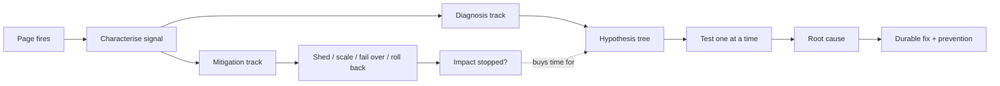
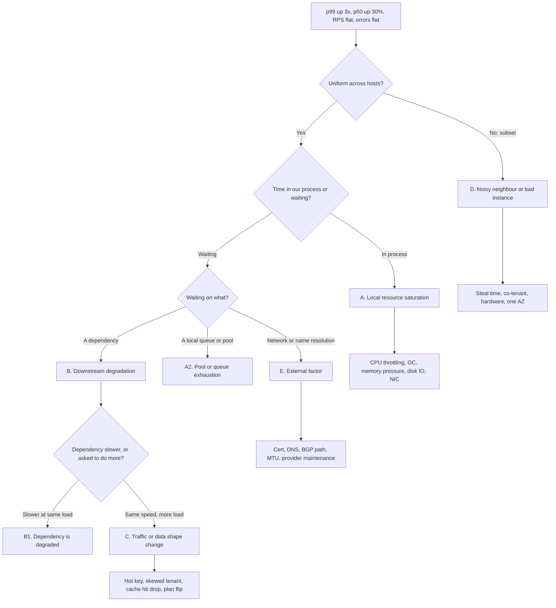
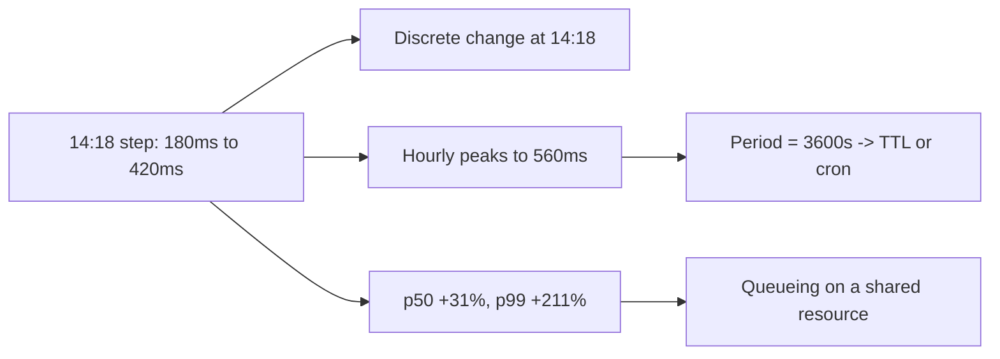
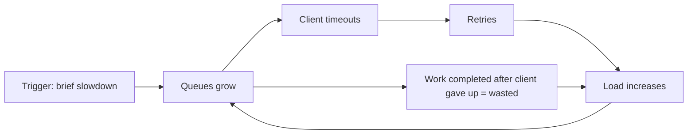

# S11 — Debug: p99 Latency Tripled, No Deploys

<span class="pill pill-core">SRE Round</span>

**A live debugging round where the interviewer feeds you data only when you ask for it — the hardest judgment call is resisting the urge to act on the first plausible cause, because the thing that is saturated is almost never the thing that broke.**

| | |
|---|---|
| **Commonly asked at** | Google, Meta, Netflix, Stripe, Datadog, Cloudflare, Databricks, LinkedIn, Uber |
| **Time budget** | 45 min |
| **Core tension** | Time-to-mitigate pulls you toward acting immediately; time-to-root-cause pulls you toward measuring first — and every action you take destroys evidence and confounds the next measurement |
| **Prerequisites** | [Observability](../fundamentals/f22-observability-fundamentals.md), [Caching](../fundamentals/f04-caching.md), [Resilience Patterns](../fundamentals/f18-resilience-patterns.md), [Rate Limiting & Load Shedding](../fundamentals/f17-rate-limiting-load-shedding.md), [Storage Engines](../fundamentals/f13-storage-engines.md), [Concurrency Control](../fundamentals/f19-concurrency-control.md), [SLOs & Error Budgets](../fundamentals/f23-slo-error-budgets.md) |

---

## 1. The Scenario As Given

> "You are on call for `CheckoutAPI`. At 14:35 UTC you are paged on a latency SLO burn-rate alert.
>
> - p99 latency: **180 ms → 560 ms**, over roughly three hours, starting around 14:20.
> - Error rate: **0.02%**, unchanged.
> - Throughput: **8,400 RPS**, flat.
> - **No deploys in six days.**
>
> I have access to your metrics, logs, traces, and database. Ask me for anything and I will tell you what it says. Find the cause and fix it."

This is not an architecture round. It is a round about **method under uncertainty**. The interviewer is measuring:

- Whether you characterise the signal before generating hypotheses.
- Whether you generate a *complete* hypothesis space or a favourite one.
- Whether you test one thing at a time with a stated prediction.
- Whether you separate mitigation from diagnosis and sequence them deliberately.
- Whether you notice that "no deploys" is a statement about one narrow class of change, not about the system being unchanged.

!!! tip "The opening line that sets the tone"
    "Before I ask for any data, let me say what I am going to do: characterise the signal along four axes, use that to prune the hypothesis space, then test the surviving hypotheses in order of cheapest-to-check first. I will also want to run a mitigation track in parallel, because a 3x p99 regression is burning error budget while I diagnose."

---

## 2. Clarifying Questions to Ask First

These come before any hypothesis. Each one eliminates whole branches of the tree.

| Question | What each answer eliminates |
|---|---|
| "Is the SLO actually burning, and how fast?" | Sets the clock. A 1x burn rate means you can diagnose properly; a 14x burn rate means mitigate first, diagnose second. |
| "What is the *shape* of the curve — step, ramp, sawtooth, or spike?" | Step implies a discrete change; ramp implies accumulation; sawtooth implies periodicity. This single answer eliminates about half the tree. |
| "What happened to p50 and p90, not just p99?" | If p50 moved too, a shared resource is slow for *every* request. If only p99 moved, a *subset* of requests or hosts is affected. |
| "Is it all endpoints, or a subset?" | A subset points at a specific dependency or data path. All endpoints points at something shared: host resources, network, a universal dependency. |
| "Is it all hosts, or a subset?" | A subset means a bad instance, a bad AZ, a bad node pool, a bad rack, a noisy neighbour. Uniform means something upstream or downstream of all of them. |
| "Is it all customers/tenants, or concentrated?" | Concentration points at a hot key, a skewed tenant, or a shard. |
| "Does it correlate with throughput?" | If latency rises with RPS, it is load-driven saturation. Flat throughput with rising latency means the *cost per request* changed. |
| "What changed that is not a deploy?" | The critical reframe — see Deep Dive 5.2. Config, flags, dependency deploys, cloud maintenance, certificate rotation, data growth, scheduled jobs, DNS, BGP. |
| "Are other services on the same infrastructure affected?" | Broad impact points at shared infrastructure; narrow impact points at us. |
| "Has anything like this happened before?" | The single highest-yield question in real incidents. Prior art collapses diagnosis time by an order of magnitude. |

!!! note "Ask about p50 early, and ask about shape first"
    Junior responders ask "what do the logs say". Senior responders ask "what is the shape of the curve and did p50 move". Those two answers, before any log line is read, typically eliminate 70-80% of the hypothesis space in under a minute.

---

## 3. Framework / Approach

### 3.1 Two tracks, running in parallel



Mitigation does not require diagnosis. If you can shed load, scale a tier, fail over to another region, or roll back the last *anything*, doing so stops the bleeding while you think. But state the trade explicitly: **each mitigation destroys evidence**. Restarting the slow hosts clears the memory state you needed to see. Failing over moves the problem somewhere you cannot observe it. So:

| Mitigation | Evidence destroyed | Do it when |
|---|---|---|
| Scale out | Little — it changes utilisation only | Almost always safe and fast |
| Shed low-priority traffic | Little | Safe; protects the SLO for what matters |
| Fail over to another region/cell | All of it, and you may move the problem with you | Only if impact is severe and you have captured state first |
| Restart the affected instances | Memory, thread dumps, connection state, open file handles, JIT state | Last resort; **capture a heap dump and thread dump first** |
| Roll back "the last deploy" | Nothing, but here there is none | Not available in this scenario |

!!! warning "Capture before you cure"
    Before any restart: thread dump, heap histogram, `ss -tanp` output, the last five minutes of a CPU profile, and a `pg_stat_activity` snapshot. Ten seconds of capture saves an hour of "we will never know". Many teams script this as `capture-forensics.sh` and run it as the first action of any latency incident.

### 3.2 Characterise the signal along four axes

This is the prune step, and it comes before hypothesis generation.

**Axis 1 — Shape.**

| Shape | What it means | Strong candidates |
|---|---|---|
| Step function (seconds) | Something discrete changed | Config push, flag flip, failover, route/DNS change, node replacement, dependency deploy, certificate rotation |
| Linear ramp over hours | Something is accumulating | Memory/connection/FD leak, queue backlog, disk filling, index or table bloat, cache filling, unbounded retry growth |
| Sawtooth, fixed period | Something periodic | GC, cron/batch job, TTL expiry wave, log rotation, autovacuum, checkpoint, token refresh |
| Step *plus* sawtooth | A discrete change created a periodic effect | Exactly the worked example below |
| Spiky, correlated with RPS | Load-driven saturation | Genuine capacity problem |
| Gradual over days/weeks | Data growth crossing a threshold | Table size past working-set, index no longer fitting in RAM, cardinality growth |

**Axis 2 — Distribution.**

$$
\text{If } \Delta p50 \approx \Delta p99 \Rightarrow \text{every request pays; a shared resource is slower.}
$$

$$
\text{If } \Delta p50 \approx 0,\ \Delta p99 \gg 0 \Rightarrow \text{a subset pays; find the subset.}
$$

The subset is almost always one of: a fraction of hosts, a fraction of keys, a fraction of tenants, a fraction of requests that take a slow path (cache miss, retry, cold shard), or a fraction of time (a periodic stall).

**Axis 3 — Scope.** Slice the latency metric by every dimension you have and look for a dimension where the increase is concentrated:

```promql
# Which dimension is the regression concentrated in? Run this per label.
topk(10,
  histogram_quantile(0.99,
    sum by (le, host) (rate(http_request_duration_seconds_bucket[5m]))
  )
)

# And the discriminator: is the spread across hosts wide or narrow?
max by (service) (host_p99) / avg by (service) (host_p99)
# ratio near 1.0  -> uniform, look upstream/downstream
# ratio above 2.0 -> a subset of hosts, look at those hosts
```

**Axis 4 — Correlation.** Overlay the latency curve with: throughput, CPU, cache hit ratio, downstream latency, downstream error rate, GC pause time, connection pool wait, queue depth, and the change timeline. The shape that matches is your first hypothesis.

### 3.3 The hypothesis tree



The five classes, with the signals that confirm or rule each out:

=== "A. Local resource saturation"

    | Sub-cause | Confirming signal | Ruling-out signal | Cost to check |
    |---|---|---|---|
    | CPU saturation | `cpu_util > 80%`, run-queue length > cores | CPU flat and low | Seconds |
    | CPU *throttling* (cgroup) | `container_cpu_cfs_throttled_periods_total` rising | Throttled periods flat at zero | Seconds |
    | GC pauses | `jvm_gc_pause_seconds` p99 up; pause time correlates with latency spikes | GC pause distribution unchanged | Seconds |
    | Memory pressure / swap | RSS near limit, page faults, `pgmajfault` up, OOM kills | Memory flat | Seconds |
    | Disk I/O saturation | `iostat` await up, queue depth up, `%util` near 100 | Disk idle | Seconds |
    | Network saturation | NIC bytes near link rate, `netstat -s` retransmits, TX queue drops | Bandwidth well under limit | Seconds |
    | Connection pool exhaustion | Pool wait time > 0, pool active == max, borrow timeouts | Wait time ~0 | Seconds |
    | Thread pool / event loop saturation | Queue depth up, accept backlog, `ss -lnt` Recv-Q growing | Queues empty | Seconds |
    | File descriptor exhaustion | `lsof` count near limit, `EMFILE` in logs | Far from limit | Seconds |

    ```bash
    # The 60-second first pass on a suspect host.
    uptime; vmstat 1 5; mpstat -P ALL 1 3
    cat /sys/fs/cgroup/cpu.stat            # nr_throttled, throttled_usec
    iostat -xz 1 3
    ss -s; ss -tan state established | wc -l
    cat /proc/net/softnet_stat | awk '{print $2}' | paste -sd+ | bc   # drops
    ```

=== "B. Downstream degradation"

    | Sub-cause | Confirming signal | Ruling-out signal |
    |---|---|---|
    | Dependency genuinely slower | Its own p99 up at *unchanged* request rate from us | Its p99 flat |
    | Dependency saturated by someone else | Its CPU/IO up, its QPS up from another caller | Its utilisation flat |
    | Retry storm amplifying onto it | Its QPS up 2-5x while our RPS is flat; retry counter up | Retry rate flat |
    | Its dependency is the real problem | Recurse one level down the trace | — |
    | Connection churn / TLS handshake storm | Handshakes/sec up, connection reuse ratio down | Reuse ratio flat |
    | DNS resolution of the dependency slow | Resolver latency histogram up | Resolver flat |

    The discriminator that matters: **is the dependency slower per unit of work, or are we asking it to do more work?** These have opposite fixes, and confusing them is the most common diagnostic error in this class.

=== "C. Traffic or data shape change"

    Throughput can be perfectly flat while the *cost per request* triples.

    | Sub-cause | Confirming signal | Ruling-out signal |
    |---|---|---|
    | Cache hit ratio drop | Hit ratio down; downstream QPS up proportionally | Hit ratio flat |
    | Synchronised TTL expiry wave | Sawtooth with period == TTL; miss spikes | No periodicity |
    | New hot key / hot partition | Per-shard QPS skew; one shard's latency dominates | Even distribution |
    | Skewed tenant | Latency concentrated in one `tenant_id`; their request mix changed | Even across tenants |
    | Query plan flip | `pg_stat_statements` mean time up for one `queryid`; `EXPLAIN` shows seq scan where an index scan used to be | Plans unchanged |
    | Statistics staleness after growth | Row estimates far off actuals | Estimates accurate |
    | Payload size growth | Bytes per request up; serialization time up | Sizes flat |
    | Result set growth | Rows returned per query up; pagination bypassed | Row counts flat |
    | Index bloat / missing index after data growth | Index size up, buffer hit ratio down | Stable |

=== "D. Noisy neighbour"

    | Sub-cause | Confirming signal | Ruling-out signal |
    |---|---|---|
    | Co-tenant on the hypervisor | `steal` time up in `vmstat`; only some instances affected | Steal ~0 |
    | Co-tenant in the same Kubernetes node | Node-level CPU pressure, `pressure stall information` up; affected pods share a node | Pods spread evenly |
    | Shared storage volume contention | EBS burst balance exhausted, `%util` high with low local IO | Balance full |
    | Shared network path | Only pods on certain nodes/racks affected | Uniform |
    | A batch job on the same cluster | A job started at the incident time; check the scheduler | No new workloads |

    The signature of noisy neighbour is **spatial concentration that does not follow your own topology** — affected hosts share a node, rack, or hypervisor but not a shard, version, or AZ.

=== "E. External factor"

    | Sub-cause | Confirming signal | Ruling-out signal |
    |---|---|---|
    | Certificate near expiry causing renegotiation | Handshake rate up, session resumption ratio down, TLS errors in logs | Resumption ratio flat |
    | Certificate chain change / OCSP stapling failure | OCSP fetch latency, handshake time up | Handshake time flat |
    | DNS resolver degradation | Resolution latency up, `SERVFAIL` rate, resolver cache hit down | Resolver flat |
    | BGP reroute / path change | Traceroute hop count and RTT changed; provider status page | Path stable |
    | MTU / PMTU black hole | Retransmits on large packets only; small requests fine | No size correlation |
    | Cloud provider maintenance | Health dashboard event at the exact time | No events |
    | Upstream CDN/LB config change | LB metrics show new behaviour; provider change log | Nothing |
    | Time sync drift | Clock offset metric; see [Time & Clocks](../fundamentals/f20-time-clocks-ordering.md) | Offset flat |

### 3.4 The discipline: one hypothesis, one prediction, one test

For each hypothesis write, out loud:

```text
HYPOTHESIS : <one sentence>
PREDICTS   : <specific metric> should show <specific value/shape>
TEST       : <the exact query or command>
RESULT     : <what it actually showed>
VERDICT    : confirmed | ruled out | inconclusive -> next test
```

Two rules that are worth more than any tool:

1. **Never change more than one thing at a time.** If you bump the pool size, add replicas, and restart hosts simultaneously and the problem goes away, you have learned nothing, you cannot write a postmortem, and it will recur.
2. **Write down ruled-out hypotheses and why.** Under stress, teams re-test the same hypothesis three times and never test the one nobody thought of. The ledger prevents it, and it becomes the postmortem timeline for free.

### 3.5 Order of checking — cheapest and most-likely first

$$
\text{Priority} = \frac{P(\text{cause}) \times P(\text{test is decisive})}{\text{time to run the test}}
$$

In practice this yields a near-universal order:

1. **The change timeline** (10 seconds, decisive surprisingly often).
2. **Host resource dashboard** — CPU, throttling, memory, GC, pool wait (30 seconds, rules out the entire A branch).
3. **Trace waterfall breakdown** — where is the time going, by span (1 minute, splits "us" from "them").
4. **Downstream dashboards** — their latency *and* their request rate from us (1 minute, splits "slower" from "more work").
5. **Cache hit ratio and per-shard skew** (1 minute, catches most of branch C).
6. **Per-host outlier analysis** (2 minutes, catches D).
7. **External: certs, DNS, provider status, path** (3 minutes, catches E).

Steps 1-4 take under three minutes and resolve the large majority of real incidents.

---

## 4. Worked Example

This is the core of the round. What follows is the transcript form: what you ask, what you are told, what you conclude, and what you do next.

### T+0:00 — Page received

**Me:** "First, is the SLO burning fast enough that I should mitigate before diagnosing?"

**Interviewer:** "The 1-hour burn rate is 4.2x. You have about 6 hours of error budget left at this rate."

**Me:** 4.2x is serious but not catastrophic — I have time to diagnose properly, but I will start a parallel mitigation track. Not a fire drill, not leisurely.

**Me:** "Second: shape. Show me the p99 over the last 6 hours, and p50 and p90 on the same axes."

**Interviewer:**

```text
  p99:  180ms flat until 14:18, then a step to ~420ms,
        then hourly peaks reaching 560ms lasting ~90 seconds each
        (peaks at 15:18, 16:18, 17:18)
  p90:  95ms  -> 210ms, same shape, smaller peaks
  p50:  42ms  -> 55ms, no visible peaks
```

**Me:** That is extremely informative. Three conclusions before I look at anything else:

1. **It is a step at 14:18, not a ramp.** Something discrete changed. Accumulation hypotheses (leaks, bloat, queue growth) drop sharply in probability.
2. **p50 moved only 31% while p99 moved 211%.** So it is not that every request got uniformly slower — but p50 did move, so it is not purely a small subset either. This is the signature of a **shared resource with queueing**: everyone pays a little, the tail pays enormously. Queueing delay scales as `ρ/(1-ρ)`, which amplifies the tail far more than the median.
3. **The hourly sawtooth on top of the step is the biggest clue in the incident.** A period of exactly 3600 seconds means something with a one-hour cycle: a cron job, a token refresh, or — most commonly — a **TTL**.



### T+0:02 — Scope

**Me:** "Is the regression uniform across hosts? Give me the ratio of max-host-p99 to mean-host-p99, before and after 14:18."

**Interviewer:** "1.12 before, 1.15 after. Uniform."

**Me:** That rules out branch D almost entirely — noisy neighbour, a bad instance, a bad node, a bad rack would all show spatial concentration. It also rules out a partial rollout of something, since there is no deploy anyway.

**Me:** "Is it all endpoints?"

**Interviewer:** "No. `POST /checkout` and `GET /cart` are affected. `GET /health`, `GET /config`, and `POST /webhook` are unchanged."

**Me:** So it follows a *data path*, not the whole process. The affected endpoints share something the unaffected ones do not. That points at a dependency or a data access pattern, not at host-level CPU or GC — those would slow everything including `/config`.

**Me:** "Is it concentrated in particular tenants or regions?"

**Interviewer:** "Evenly spread across tenants and all three AZs."

**Me:** Rules out a single skewed tenant and a single-AZ problem.

### T+0:04 — The change timeline

**Me:** "You said no deploys. I want the full change surface for 13:00-14:30: config changes, feature flags, database parameter changes, infrastructure changes, dependency deploys, certificate rotations, scheduled jobs, and cloud provider maintenance events."

**Interviewer:** "Good question. Nothing in config or flags. But the AWS Health dashboard shows: *ElastiCache node replacement completed for `checkout-cache-0003-001` at 14:18 UTC* — a scheduled maintenance event we were notified about two weeks ago."

**Me:** That is a perfect temporal match for the step. It is now my leading hypothesis, but I am not going to assume the mechanism — "a cache node was replaced" and "p99 tripled" need a chain of causation between them, and the chain is where the fix lives. Let me follow the time, not the story.

!!! example "Why not jump to the answer here?"
    Because "a cache node was replaced at the same moment" is a correlation, and acting on it without the mechanism produces the wrong fix. Replacing the node back does nothing. Adding cache capacity does nothing. The *mechanism* — what the replacement did to the system — determines the fix, and in this case it turns out to be TTL jitter and request coalescing, neither of which you would guess from the correlation alone.

### T+0:06 — Hypothesis A: local resource saturation

**HYPOTHESIS:** Our own processes are resource-constrained.
**PREDICTS:** CPU, CPU throttling, GC pause, or memory pressure should show a step at 14:18.
**TEST:** host resource dashboard.

**Interviewer:**

```text
  CPU utilisation      38% -> 41%        (essentially flat)
  cgroup nr_throttled  0    -> 0
  GC pause p99         8ms  -> 8ms
  RSS                  flat, 61% of limit
  Major page faults    ~0
  Disk await           0.9ms -> 0.9ms
  NIC throughput       12% of link
  File descriptors     18% of limit
```

**VERDICT:** Branch A (except pool exhaustion) is ruled out. Our processes are not working harder; they are *waiting*.

**Me:** "One more in this branch, because it is the one that looks like the others but is not: connection pool wait time and pool utilisation."

**Interviewer:**

```text
  DB pool: max 20 per host x 60 hosts = 1200 connections
  pool_wait_time p99:   0.4ms -> 190ms   (step at 14:18)
  pool_active (mean):   48    -> 777     (65% utilised)
  pool_active (peak, during the hourly spikes): 1200 (saturated)
  pool borrow timeouts: 0 -> 0 steady, ~40/s during spikes
```

**VERDICT:** Pool exhaustion is *present*. But this is where the round is won or lost.

!!! warning "The trap: pool exhaustion is a symptom, not a cause"
    The obvious move is to raise the pool size. It is almost always wrong. By Little's Law, the concurrency a pool must sustain is:

    $$
    L = \lambda W
    $$

    where `λ` is the request rate to the dependency and `W` is its service time. The pool filled up because `λW` grew. Raising the pool cap does not reduce `λ` or `W` — it just pushes more concurrent work onto a dependency that is already the constraint, converting a bounded queue into an unbounded one. The correct next question is: **which term grew, λ or W?**

### T+0:10 — Hypothesis B: downstream degradation

**HYPOTHESIS:** A dependency is slower, and that is why we hold connections longer.
**PREDICTS:** The trace waterfall should show time concentrated in one downstream span.
**TEST:** span-level latency breakdown for `POST /checkout`, before vs after.

**Interviewer:**

```text
  span                      before(p99)   after(p99)
  auth.verify                  6ms           6ms
  cache.get (x4.1 per req)     1.2ms         1.3ms
  db.query                     9ms          61ms      <-- here
  pricing.rpc                 22ms          24ms
  serialize                    4ms           4ms
  pool.acquire                 0.4ms       190ms      <-- and here
```

**Me:** Two hot spans: waiting for a pooled connection, and the DB query itself. The cache is *fast* — its latency is unchanged — so the cache is not slow. That is worth noting, because "a cache node was replaced" makes people look for cache slowness, and there is none.

**HYPOTHESIS B1:** The database is degraded — something broke in it.
**PREDICTS:** DB latency up at *unchanged* query volume.
**TEST:** DB QPS and DB CPU alongside DB latency.

**Interviewer:**

```text
  DB QPS         12,000 -> 29,900     (2.5x)
  DB CPU            42% -> 88%
  DB mean latency  4ms  -> 26ms
  Replica lag      normal
  Locks/deadlocks  none
  Autovacuum       running on two cold tables, not on orders or carts
  pg_stat_statements: same top queryids, same relative ranking,
                      calls up 2.5x, mean_exec_time up 6.5x
```

**VERDICT for B1: ruled out.** The DB is not broken — it is being asked to do 2.5x the work and it has crossed its knee. The 6.5x latency increase at 2.5x load is exactly what queueing predicts:

$$
\frac{W_{\text{after}}}{W_{\text{before}}} \approx \frac{\rho_{a}/(1-\rho_{a})}{\rho_{b}/(1-\rho_{b})} = \frac{0.88/0.12}{0.42/0.58} = \frac{7.33}{0.72} = 10.2
$$

Predicted 10x, observed 6.5x — the right order of magnitude, and the residual is explained by the query mix. The database is a victim, not a culprit.

!!! tip "Say the arithmetic out loud"
    Showing that the observed latency increase is *quantitatively consistent* with pure queueing at the observed utilisation is the strongest possible evidence that the dependency is not independently broken. It converts "the DB looks slow" into "the DB is behaving exactly as a healthy system under 2.5x load would".

**Me:** So the question is now: **why is DB QPS 2.5x at flat request throughput?** That is branch C.

### T+0:14 — Hypothesis C: traffic or data shape change

**HYPOTHESIS:** Cache hit ratio dropped, pushing misses through to the database.
**PREDICTS:** Cache hit ratio should show a step down at 14:18, with a magnitude that quantitatively explains the DB QPS increase.
**TEST:** cache hit ratio, keyspace size, evictions.

**Interviewer:**

```text
  hit ratio      96.4% -> 79.1%   (step at 14:18)
  hit ratio during the hourly peaks: drops to ~45% for ~90s
  keyspace size  dropped 17.2% at 14:18, recovered over ~25 minutes
  evictions      0 (memory at 61%)
  cache CPU      low
  cluster: 6 shards, no replicas configured
```

**Me:** Let me verify the arithmetic, because a hypothesis that matches qualitatively but not numerically is usually wrong.

$$
\text{Cache lookups/s} = 8{,}400\ \text{RPS} \times 4.1 = 34{,}440
$$

Before, at 96.4% hit ratio:

$$
\text{misses} = 34{,}440 \times 0.036 = 1{,}240/\text{s} \times 3\ \text{DB queries per miss} = 3{,}720\ \text{QPS}
$$

$$
\text{plus uncached queries} = 8{,}280 \Rightarrow \textbf{12,000 QPS} \quad\checkmark
$$

After, at 79.1%:

$$
\text{misses} = 34{,}440 \times 0.209 = 7{,}198/\text{s} \times 3 = 21{,}594 + 8{,}280 = \textbf{29{,}874 QPS} \quad\checkmark
$$

**VERDICT: confirmed.** The predicted DB QPS from the hit ratio drop is 29,874 against an observed 29,900. The chain is established:

```mermaid
flowchart LR
    A["Cache node replaced 14:18"] --> B["1 of 6 shards loses its keyspace"]
    B --> C["Hit ratio 96.4 to 79.1"]
    C --> D["DB QPS 12k to 29.9k"]
    D --> E["DB utilisation 42 to 88 percent"]
    E --> F["DB latency 4ms to 26ms"]
    F --> G["Pool concentration rises, Little's Law"]
    G --> H["Pool wait 0.4ms to 190ms"]
    H --> I["API p99 180ms to 420ms"]
```



One shard of six is 16.7% of the keyspace, matching the 17.2% keyspace drop and the ~17-point hit ratio drop. The cluster has no replicas, so replacing a node lost that shard's data entirely rather than promoting a replica.

### T+0:19 — The sawtooth still needs explaining

**Me:** The step is explained. The hourly peaks to 560 ms are not, and an unexplained residual means I do not have the whole mechanism. What is the TTL on these cache entries?

**Interviewer:** "3600 seconds, set at write time, no jitter."

**Me:** There it is. At 14:18 the lost shard's keys were all repopulated over roughly 25 minutes — but crucially they were written *in a burst*, all with the same fixed 3600-second TTL. One hour later, at 15:18, they expire **simultaneously**. Every expiry is a miss; every miss is 3 DB queries; and because there is no request coalescing, concurrent requests for the same key each generate their own miss.

Peak arithmetic:

$$
\text{miss ratio during wave} \approx 55\% \Rightarrow 34{,}440 \times 0.55 = 18{,}942\ \text{misses/s}
$$

$$
18{,}942 \times 3 + 8{,}280 = \textbf{65{,}106 QPS demanded}
$$

The database's measured capacity is roughly 35,000 QPS. Demand of 65k against capacity of 35k means `ρ > 1`: the queue grows without bound for the duration of the wave. Required connection concurrency:

$$
L = \lambda W = 65{,}106 \times 0.120 = 7{,}813 \text{ connections needed}
$$

against a pool of 1,200. The pool saturates completely, application threads queue on `pool.acquire`, and that is the 560 ms peak. The wave ends when the repopulated keys are all rewritten — with, of course, another synchronised TTL, so it repeats every hour. **It is self-perpetuating and it will not decay on its own.**

!!! gotcha "Self-synchronising TTL waves"
    A single burst of writes with a fixed TTL creates a permanent oscillation: every wave repopulates the keys in a burst, which sets up the next wave. Without jitter, the system never de-synchronises. This is why fixed TTLs are a latent landmine in every cache — they are harmless until something causes a correlated write burst, and then they are permanent.

### T+0:22 — Completing the tree before acting

Before mitigating, close out the remaining branches so the postmortem is complete and I am not fixing a coincidence.

**Branch D (noisy neighbour):** already ruled out by host uniformity (max/mean ratio 1.15). Confirmed steal time flat at 0.1%; no other service on the cluster is degraded.

**Branch E (external):** the *trigger* was external — a provider maintenance event. Checked and ruled out the others for completeness:

```bash
# Certificate expiry -- a near-expiry cert can cause renegotiation storms
echo | openssl s_client -connect checkout-db.internal:5432 2>/dev/null \
  | openssl x509 -noout -dates
# notAfter=Dec 4 2026 -- 71 days out, not it

# DNS resolution latency -- flat at 1.1ms p99, resolver cache hit 99.2%
# Network path -- mtr shows identical hop count and RTT vs the 7-day baseline
# TCP retransmit rate -- 0.003%, unchanged
```

**Branch A residual:** pool exhaustion is confirmed present but is downstream in the causal chain, not the origin. Raising the pool would have made the DB worse.

### T+0:25 — Mitigation, in order of speed and safety

| Order | Action | Time | Effect | Risk |
|---|---|---|---|---|
| 1 | Add 2 read replicas, shift read traffic | 6 min | DB capacity 35k → 58k QPS; `ρ` back under the knee | Low; replicas were already in the topology |
| 2 | Enable request coalescing (single-flight) on cache miss — already in the code behind a flag | 2 min | Collapses N concurrent misses for the same key into 1 DB query; cuts wave amplitude by ~85% | Low; flag was tested |
| 3 | Add an adaptive concurrency limit on the DB client so excess load is **shed** rather than queued | 5 min | Converts unbounded queueing into fast failure for a small fraction of requests, protecting p99 for the rest | Medium; a small error-rate increase, which is the correct trade |
| 4 | Pre-warm the affected shard's hot keys from a nightly key dump | 15 min | Raises hit ratio faster | Low |
| 5 | Deploy TTL jitter (this is a code change, but "no deploys" described the cause, not a prohibition on fixes) | 45 min | Permanently de-synchronises the wave | Low, behind a flag |

**Result:** p99 returned to 195 ms twelve minutes after the replicas came online. The 18:18 wave peaked at 240 ms instead of 560 ms (coalescing). After the TTL-jitter deploy at 18:40, the 19:18 wave was invisible.

### T+0:40 — The durable fix

| Layer | Fix | Prevents |
|---|---|---|
| Cache | TTL jitter: `ttl = base x (1 + U(-0.2, 0.2))` | Synchronised expiry waves, permanently |
| Cache | Request coalescing / single-flight per key | Thundering herd on any miss, not just waves |
| Cache | Enable replicas on the cache cluster so node replacement promotes instead of losing the keyspace | The entire triggering event |
| Cache | Negative caching for known-missing keys | Miss amplification on absent data |
| App | Bounded pool queue + adaptive concurrency limit + fail-fast | Unbounded queueing converting a slowdown into a timeout storm |
| App | Retry budget (cap retries at 10% of requests) with jitter | Amplification during any downstream slowdown |
| DB | Read replica autoscaling on utilisation | Slow response to load shifts |
| Observability | Cache hit ratio promoted to a first-class SLI with an alert at a 3-point drop | 3 hours of blind time — this is the highest-value item |
| Process | Cloud provider maintenance events piped into the change timeline tool | "No deploys" hiding a real change |
| Process | Game day: kill a cache node in production and measure the recovery curve | Discovering the whole chain during an incident instead of a drill |

!!! note "The highest-value fix is the alert, not the code"
    Three hours passed between the cache node replacement and the page, because the only alert was on the *symptom* (latency SLO). Cache hit ratio dropped 17 points at 14:18 and nothing fired. An SLI alert on hit ratio would have turned a 3-hour latency incident into a 5-minute "cache node replaced, hit ratio recovering" notification. In postmortems, **detection gaps are usually worth more than code fixes.**

---

## 5. Deep Dives

### 5.1 Saturation Is Usually a Symptom

The single most expensive diagnostic error is treating the saturated resource as the cause. In the worked example, three things were saturated — the connection pool, the database CPU, and eventually the application thread pool — and none of them was the cause.

**Little's Law is the tool that untangles it:**

$$
L = \lambda W
$$

A pool, a thread pool, a semaphore, or any fixed-concurrency resource is exhausted when `λW` exceeds its size. So whenever you see exhaustion, immediately ask which factor moved:

| Observation | Meaning | Correct action | Wrong action |
|---|---|---|---|
| `λ` up, `W` flat | More requests, same service time | Find the source of extra requests (retries, cache misses, a new caller) | Raise the pool |
| `λ` flat, `W` up | Dependency got slower | Fix or route around the dependency; shed load | Raise the pool |
| Both up | Feedback loop, likely retries | Break the loop first: retry budgets, circuit breaker | Raise anything |
| `λ` and `W` flat, pool still full | Connection leak | Find the leak; check for unreturned connections in error paths | Raise the pool |

**Raising the pool is correct in exactly one case**: `λW` legitimately grew because the business grew, the dependency has headroom, and you are simply under-provisioned. In every other case, raising the concurrency cap removes the only backpressure in the system and converts a bounded degradation into an unbounded one.

**Utilisation and the tail.** Queueing theory explains why p99 moves so much more than p50:

$$
W = \frac{W_s}{1 - \rho}, \qquad
\frac{\partial W}{\partial \rho} = \frac{W_s}{(1-\rho)^2}
$$

The sensitivity grows quadratically as utilisation rises. Between 40% and 88% utilisation, wait time grows by a factor of 10; between 88% and 95% it grows by another factor of 2.4. This is why a service that looks fine at 70% falls off a cliff at 90%, and why "CPU is only at 88%" is not reassuring.

**USE and RED, used together.** For each *resource* check Utilisation, Saturation, Errors. For each *service* check Rate, Errors, Duration. The method that finds causes fastest is to walk RED at the service level to find *where* the time goes, then walk USE on the resources of that specific component to find *why*. Starting with USE across everything drowns you in data; starting with RED and then drilling is fast.

### 5.2 The "No Deploys" Fallacy

"No deploys" means one class of change did not happen. Systems change constantly without deploys. Enumerate the full surface every time:

| Change class | Examples | Where to look |
|---|---|---|
| Configuration | Config-map pushes, environment variables, LB settings, timeouts, pool sizes | Config repo history, config-service audit log |
| Feature flags | A flag ramped from 5% to 50% by a scheduled rollout | Flag service audit log — **check this before anything else**, it is the most common invisible change |
| Dependency deploys | *Their* deploy is not *your* deploy | Their change log; this is why cross-service change feeds matter |
| Data | A table crossing a size threshold, a new hot key, a customer onboarding, a partition filling | Row counts, per-key QPS, per-tenant volume |
| Database maintenance | `ANALYZE` flipping a plan, autovacuum, index bloat, checkpoint, statistics refresh | `pg_stat_statements`, `pg_stat_user_tables.last_autoanalyze` |
| Scheduled jobs | A nightly batch that grew, a monthly report, a backup window | Cron/scheduler history |
| Cloud provider | Node replacement, host retirement, live migration, zonal maintenance, service-side deploys | Provider health dashboard and event API |
| Certificates and keys | Rotation, near-expiry, chain change, OCSP staple expiry | Cert inventory, handshake metrics |
| DNS | TTL expiry changing resolution, a record change, resolver change | DNS query logs, resolution latency |
| Network | BGP path change, peering change, MTU change, firewall rule | Traceroute baseline diff, provider status |
| Time | Leap second, NTP drift, DST in a job scheduler | Clock offset metric |
| Capacity | Autoscaler scaling in overnight and not back out, spot reclamation | Instance count history |
| Traffic | A client library upgrade on the caller side, a mobile app release, a bot, a marketing campaign | User-agent breakdown, client version breakdown |
| Security | A WAF rule, a new rate limit, a credential rotation | Security change log |

!!! tip "Build the unified change feed before you need it"
    The single highest-leverage investment for incident response is one timeline that overlays deploys, config, flags, provider events, scheduled jobs, and infrastructure changes on the same axis as your SLIs. Teams that have it resolve "no deploys" incidents in minutes; teams that do not spend hours. It is a weekend project and it pays for itself in the first incident.

**The scheduled-rollout trap specifically.** Feature flags with percentage rollouts on a schedule are the closest thing to an invisible deploy. A flag that ramps from 10% to 100% at 14:00 produces a step change with no deploy record, and the owning team may be in another timezone and unaware. Always ask for the flag audit log explicitly; "no deploys" almost never includes it.

### 5.3 Retry Storms and Metastable Failure

The most dangerous class in this round is the one where the system will not recover even after the trigger is removed.

**The amplification mechanic.** If each client retries up to `r` times on failure or timeout, and the downstream success probability is `p`, the load multiplier is:

$$
A = \sum_{i=0}^{r} (1-p)^i = \frac{1 - (1-p)^{r+1}}{p}
$$

With `r = 3`:

| Success rate `p` | Amplification `A` |
|---|---|
| 0.99 | 1.01x |
| 0.90 | 1.10x |
| 0.50 | 1.88x |
| 0.20 | 2.95x |
| 0.05 | 3.71x |

Retries are nearly free when things are healthy and become a 3-4x load multiplier exactly when the dependency is struggling. Layer three services each retrying three times and the multiplier compounds to `4^3 = 64x` in the worst case — this is how a minor blip becomes a total outage.

**Metastability.** A system is metastable when the *effect* of the overload sustains the overload after the trigger is gone:



The signature: removing the trigger does not fix it, and capacity increases help only if they exceed the *amplified* load, not the original load. The breakers:

1. **Retry budgets** — cap total retries at a small percentage of total requests (5-10%) fleet-wide, not per client. A per-client cap of "3 retries" provides no fleet-level bound.
2. **Circuit breakers** with half-open probing, so a dead dependency stops receiving full load ([Resilience Patterns](../fundamentals/f18-resilience-patterns.md)).
3. **Deadline propagation** — if the caller has already given up, do not do the work. Work completed after the client timed out is pure waste that sustains the overload.
4. **Load shedding at admission** — reject early and cheaply rather than accepting work you cannot finish ([Load Shedding](../fundamentals/f17-rate-limiting-load-shedding.md)).
5. **Exponential backoff with full jitter** — deterministic backoff re-synchronises clients into waves, which is the same pathology as fixed TTLs.

```python
import random

def backoff_delay(attempt: int, base: float = 0.05, cap: float = 2.0) -> float:
    """Full jitter. Decorrelates retries so clients do not re-synchronise."""
    return random.uniform(0, min(cap, base * (2 ** attempt)))
```

**How to spot it in the round:** if downstream QPS rose more than your own RPS did, retries are involved. In the worked example, DB QPS rose 2.5x at flat RPS — but the cause was cache misses, not retries. Distinguishing them is a single question: *"Is the retry counter up?"* Ask it early; the two look identical on a QPS graph and have completely different fixes.

### 5.4 Data and Traffic Shape Changes

The class that catches experienced engineers, because throughput is flat and every resource dashboard looks normal while the *cost per request* has changed.

**Cache hit ratio.** The most leveraged number in most systems. Downstream load is:

$$
\lambda_{\text{down}} = \lambda_{\text{up}} \times (1 - h) \times q
$$

$$
\frac{\partial \lambda_{\text{down}}}{\partial h} = -\lambda_{\text{up}} \times q
$$

The derivative is constant, which means **every point of hit ratio is worth the same absolute amount of downstream load** — but the *relative* impact explodes as `h` approaches 1. Going from 99% to 98% hit ratio doubles your downstream load. This is why high-hit-ratio caches are fragile: they are load-bearing in a way the hit-ratio number does not communicate.

| Hit ratio | Miss rate | Relative downstream load |
|---|---|---|
| 99.0% | 1.0% | 1.0x |
| 98.0% | 2.0% | 2.0x |
| 96.4% | 3.6% | 3.6x |
| 90.0% | 10.0% | 10.0x |
| 79.1% | 20.9% | 20.9x |

Treat cache hit ratio as an SLI with its own alert. A drop of 3 percentage points from a 99% baseline is a 4x downstream load increase and deserves a page long before the latency SLO notices.

**TTL waves.** Fixed TTLs plus any correlated write burst produce permanent oscillation. Jitter is the fix and it is one line:

```python
import random

def jittered_ttl(base_seconds: int, spread: float = 0.2) -> int:
    """Spread expiry over +/- 20% so a write burst does not become an expiry burst."""
    return int(base_seconds * (1.0 + random.uniform(-spread, spread)))
```

Pair it with single-flight, which collapses concurrent misses for the same key into one downstream call — this is what protects you against a *hot* key expiring, which jitter alone does not.

**Hot keys and partition skew.** Latency concentrated in one shard while others are idle. Detect with per-shard QPS ratio:

```promql
# Skew factor: if this exceeds ~2, one partition is doing the work of several.
max by (shard) (rate(shard_requests_total[5m]))
  /
avg by (shard) (rate(shard_requests_total[5m]))
```

Fixes: key salting/splitting for writes, a replicated local cache for hot reads, or admission control per key. See [Partitioning & Sharding](../fundamentals/f06-partitioning-sharding.md).

**Query plan flips.** A query that used an index scan yesterday and a sequential scan today because statistics changed after autovacuum ran `ANALYZE`, or because data growth crossed a selectivity threshold. Symptom: one `queryid`'s mean execution time jumps by 10-100x while its call count is unchanged — a signature that is *opposite* to the cache-miss case and distinguishes them immediately.

```sql
-- Which statements regressed, and did their call volume change?
SELECT queryid,
       calls,
       ROUND(mean_exec_time::numeric, 2)  AS mean_ms,
       ROUND(total_exec_time::numeric, 0) AS total_ms,
       rows / GREATEST(calls, 1)          AS rows_per_call
FROM pg_stat_statements
ORDER BY total_exec_time DESC
LIMIT 20;

-- When did stats last change on the hot tables?
SELECT relname, last_autoanalyze, last_analyze, n_live_tup, n_dead_tup
FROM pg_stat_user_tables
WHERE relname IN ('orders', 'carts', 'line_items');
```

The discriminator table for this whole class:

| Symptom | `calls` | `mean_exec_time` | Likely cause |
|---|---|---|---|
| DB slower | Up a lot | Up moderately | Upstream sent more work (cache miss, retry, new caller) |
| DB slower | Flat | Up a lot, one query | Plan flip or lock contention |
| DB slower | Flat | Up a little, all queries | Resource saturation on the DB host, or a noisy neighbour |
| DB slower | Up a lot, one query | Flat | A new caller or a loop in application code |
| DB slower | Flat | Up, growing daily | Data growth crossing a working-set or index threshold |

---

## 6. What Can Go Wrong

These are risks in the *debugging process*, which is what this round is about.

| Risk | Detection | Mitigation |
|---|---|---|
| Changing five things at once; the problem goes away; nobody knows why | The postmortem has no root cause section | One change at a time, each with a stated prediction; write the hypothesis ledger as you go |
| Fixing the symptom (raising the pool) and making it worse | Latency gets worse after the "fix"; downstream utilisation rises | Apply Little's Law before touching any concurrency limit: ask which of `λ` or `W` moved |
| Restarting instances and destroying the evidence | "We restarted and it went away" | Capture thread dumps, heap histograms, connection state, and a profile *before* any restart |
| Confirmation bias on the first plausible cause | You stop testing after the first "aha" | Require quantitative consistency: the hypothesis must predict the observed magnitude, not just the direction |
| Anchoring on the most recent similar incident | "This is the same as last month" | Treat prior art as a prioritisation hint, never as a conclusion; still run the confirming test |
| Tunnel vision on your own service | Hours spent in your metrics while a dependency is the cause | Check the trace waterfall within the first 3 minutes; it splits "us" vs "them" immediately |
| Taking "no deploys" at face value | The change timeline is never consulted | Ask for the full change surface explicitly: config, flags, provider events, scheduled jobs, certs |
| Mitigation masks the problem, which recurs weeks later at a worse time | Incident marked resolved with no root cause | An incident is not closed until the mechanism is explained end to end; "it recovered" is not a root cause |
| The unexplained residual is ignored | A leftover pattern (the sawtooth) never gets an explanation | Explicitly enumerate what remains unexplained before declaring resolution |
| Diagnosis takes so long that the SLO is blown | Burn-rate alert escalates while you investigate | Run mitigation and diagnosis as parallel tracks with separate owners; set a timebox ("if not identified in 20 minutes, we fail over") |
| Too many people investigating the same branch | Three engineers all looking at the database | Incident commander assigns branches of the tree to individuals explicitly |
| Observability gap discovered mid-incident | "We don't collect that" | Note it in the ledger and file it immediately; detection gaps are usually the highest-value postmortem action |

---

## 7. The Artifact You'd Produce

### 7.1 The hypothesis ledger (written live, becomes the postmortem)

```text
INCIDENT 2026-09-25 CheckoutAPI p99 3x
SYMPTOM  p99 180->560ms, p50 42->55ms, RPS flat 8400, errors flat 0.02%
SHAPE    step at 14:18 + sawtooth, period 3600s, peaks 90s
SCOPE    all hosts (max/mean 1.15), all AZs, all tenants,
         endpoints /checkout and /cart only

H1 Local resource saturation
   PREDICTS  CPU / throttle / GC / memory step at 14:18
   TEST      host dashboard
   RESULT    CPU 38->41, throttle 0, GC 8ms flat, RSS flat
   VERDICT   RULED OUT

H1b Connection pool exhaustion
   PREDICTS  pool_wait > 0, active near max
   TEST      pool metrics
   RESULT    wait 0.4->190ms, active 48->777, saturated during peaks
   VERDICT   PRESENT but downstream in the chain (Little's Law:
             lambda or W must have moved; check which)

H2 Downstream degraded
   PREDICTS  one span dominates the waterfall
   TEST      trace breakdown
   RESULT    db.query 9->61ms, pool.acquire 0.4->190ms, cache 1.2->1.3ms
   VERDICT   DB is the hot span; cache is FAST (note: not a cache
             latency problem)

H2a DB is independently broken
   PREDICTS  latency up at unchanged QPS
   TEST      DB QPS, CPU, locks, plans, vacuum
   RESULT    QPS 12k->29.9k, CPU 42->88, no locks, no plan change
             observed 6.5x latency vs 10.2x predicted by queueing
   VERDICT   RULED OUT -- victim of load, behaving normally

H3 Cache hit ratio drop
   PREDICTS  hit ratio step down, magnitude explains 29.9k QPS
   TEST      cache metrics
   RESULT    96.4->79.1, keyspace -17.2% at 14:18, 0 evictions
             predicted DB QPS 29,874 vs observed 29,900
   VERDICT   CONFIRMED (quantitative match)

H4 Noisy neighbour
   PREDICTS  spatial concentration
   TEST      per-host spread, steal time, co-tenants
   RESULT    max/mean 1.15, steal 0.1%, no other service affected
   VERDICT   RULED OUT

H5 External
   PREDICTS  cert / DNS / path anomaly
   TEST      openssl dates, resolver latency, mtr vs baseline
   RESULT    cert 71d out, DNS 1.1ms flat, path identical
   VERDICT   RULED OUT for network/cert
             BUT: AWS Health -- ElastiCache node replaced 14:18 <- TRIGGER

RESIDUAL  sawtooth period 3600s == cache TTL, no jitter, no single-flight
          -> synchronised expiry wave, self-perpetuating

CHAIN     node replacement -> 1/6 keyspace lost (no replicas)
          -> hit ratio -17pts -> DB QPS 2.5x -> DB rho 0.88
          -> DB latency 6.5x -> pool concurrency 777 (Little)
          -> pool wait 190ms -> API p99 420ms
          + burst repopulation with fixed TTL -> hourly wave
          -> 65k QPS demanded vs 35k capacity -> pool saturated -> 560ms
```

### 7.2 The forensics capture script (run before any restart)

```bash
#!/usr/bin/env bash
# capture-forensics.sh <pid> -- run FIRST, argue LATER.
set -euo pipefail
PID="$1"; OUT="/var/tmp/forensics-$(date +%s)"; mkdir -p "$OUT"

date -u                                     > "$OUT/timestamp"
uptime; vmstat 1 5; mpstat -P ALL 1 3       > "$OUT/cpu" 2>&1
cat /sys/fs/cgroup/cpu.stat                 > "$OUT/cgroup-cpu"
cat /sys/fs/cgroup/memory.pressure          > "$OUT/psi-mem" 2>/dev/null || true
iostat -xz 1 3                              > "$OUT/io"
ss -tanp                                    > "$OUT/sockets"
ss -s                                       > "$OUT/socket-summary"
netstat -s                                  > "$OUT/netstat"
ls -l "/proc/$PID/fd" | wc -l               > "$OUT/fd-count"
cat "/proc/$PID/limits"                     > "$OUT/limits"

# Runtime-specific: capture BEFORE the restart wipes it.
jcmd  "$PID" Thread.print                   > "$OUT/threads"   2>/dev/null || true
jcmd  "$PID" GC.heap_info                   > "$OUT/heap"      2>/dev/null || true
curl -s "localhost:6060/debug/pprof/goroutine?debug=2" > "$OUT/goroutines" || true
perf record -F 99 -p "$PID" -g -- sleep 20 2>/dev/null && \
  perf script > "$OUT/profile" || true

echo "captured to $OUT"
```

### 7.3 The whiteboard version

```text
  1. SHAPE     step / ramp / sawtooth / spike?
  2. DIST      did p50 move, or only p99?
  3. SCOPE     all hosts? all endpoints? all tenants? all AZs?
  4. CORRELATE with RPS? with a dependency? with the change timeline?

  TREE  A local saturation | B downstream | C data/traffic shape
        D noisy neighbour  | E external

  RULES one hypothesis -> one prediction -> one test -> write the verdict
        never change two things at once
        capture forensics before any restart
        saturation is a symptom: L = lambda x W -- which term moved?
        the hypothesis must predict the MAGNITUDE, not just the direction
        an unexplained residual means you are not done
```

---

## 8. Gotchas & Corner Cases

!!! gotcha "Raising the connection pool size makes the outage worse"
    **Symptom:** pool wait time is high, you double the pool, and p99 goes from 560 ms to 1,400 ms with the database now timing out.
    **Mechanism:** the pool was the only backpressure in the system. `L = λW` says concurrency demand grew because the dependency's service time `W` grew. Raising the cap admits more concurrent work to an already-saturated dependency, which raises `W` further, which demands even more concurrency. You have replaced a bounded queue with an unbounded one and moved the failure from "some requests wait" to "the database falls over".
    **Mitigation:** before touching any concurrency limit, determine whether `λ` or `W` moved. If `W` moved, the fix is upstream of the pool. Add an adaptive concurrency limit that *shrinks* when latency rises — the opposite of the instinctive action.

!!! gotcha "The saturated resource is three steps downstream of the actual cause"
    **Symptom:** the database is at 88% CPU, so the team spends two hours tuning queries and adding indexes to a database that is working perfectly.
    **Mechanism:** causal chains in distributed systems are long, and every link looks like a cause when you are standing on it. The DB was a victim of a 2.5x load increase, which was caused by a cache hit ratio drop, which was caused by a node replacement.
    **Mitigation:** for any suspected cause, ask "what would have to be true upstream for this to happen?" and check that too. Require the hypothesis to predict the observed *magnitude*: if the DB were independently broken, its latency would have risen at unchanged QPS. It did not, and that single check saves the two hours.

!!! gotcha "Fixed TTLs create a permanent, self-sustaining oscillation"
    **Symptom:** a latency spike recurs at exactly the same interval indefinitely and does not decay.
    **Mechanism:** any event that repopulates many keys in a burst gives them all the same expiry time. They expire together, are repopulated together, and the cycle sustains itself forever. The triggering event can be a node replacement, a cache flush, a deploy that changed a key prefix, or a cold start.
    **Mitigation:** jitter every TTL by +/-10-25% at write time. Add single-flight so concurrent misses for one key produce one downstream call. Both are a handful of lines and they eliminate the entire class.

!!! gotcha "No deploys is true and completely misleading"
    **Symptom:** the team rules out change as a cause and spends hours in resource dashboards.
    **Mechanism:** deploys are one of fifteen ways a system changes. Feature flags on scheduled ramps, cloud provider maintenance, dependency deploys, `ANALYZE` runs, certificate rotations, autoscaler decisions, and data growth all produce step changes with no deploy record.
    **Mitigation:** maintain a unified change feed overlaying all change classes on the SLI timeline. In an interview, explicitly ask for provider health events and the feature-flag audit log — asking for those two specifically is a strong experience signal.

!!! gotcha "p50 moving a little is dismissed, and it was the most informative number"
    **Symptom:** the team focuses entirely on the tail and looks for a slow subset — a bad host, a slow shard — and finds none.
    **Mechanism:** p50 rising 31% while p99 rises 211% is the exact signature of queueing on a shared resource: everyone waits a bit, the tail waits enormously because `W ∝ ρ/(1-ρ)`. If a subset were slow, p50 would be untouched.
    **Mitigation:** always pull p50, p90, and p99 together. The *ratio* of their movements identifies the mechanism before you look at a single resource metric.

!!! gotcha "Retry amplification is diagnosed as organic traffic growth"
    **Symptom:** downstream QPS tripled; the team concludes they need more downstream capacity and scales up, which briefly helps and then does not.
    **Mechanism:** clients retrying on timeout multiply load by up to `(r+1)` exactly when success rates fall. Adding capacity raises the success rate, which *reduces* amplification, so it helps at first — then a new perturbation restarts the loop. The system is metastable: removing the original trigger does not fix it.
    **Mitigation:** compare your own RPS to downstream QPS. If downstream grew and yours did not, either retries or cache misses are responsible, and the retry counter distinguishes them in one query. Fix with fleet-wide retry budgets, circuit breakers, deadline propagation, and full-jitter backoff.

!!! gotcha "Restarting the hosts resolves it and destroys the only evidence"
    **Symptom:** latency returns to normal after a rolling restart; three weeks later it recurs and nobody knows anything more than last time.
    **Mechanism:** restarts clear leaked connections, leaked file descriptors, fragmented heaps, stuck threads, and poisoned connection pools — all of which were the evidence. The incident is "resolved" with zero learning.
    **Mitigation:** capture forensics before any restart — thread dump, heap histogram, socket table, FD count, 20-second profile. It costs ten seconds. If leadership pressure forces an immediate restart, restart all but one host and keep one as a live specimen behind a drained load balancer.

!!! gotcha "The cache is blamed because a cache node was replaced, but cache latency is normal"
    **Symptom:** the team focuses on cache performance, tunes the cache, adds nodes, and nothing improves.
    **Mechanism:** the cache was never slow — its p99 went from 1.2 ms to 1.3 ms. The problem is that it was *answering fewer questions*, so the database got more. Hit ratio and latency are different failure modes and the dashboards usually show only latency.
    **Mitigation:** treat cache hit ratio as a first-class SLI with its own alert, because at a 99% baseline a 1-point drop doubles downstream load. Instrument misses-per-request, not just cache latency.

!!! gotcha "An unexplained residual is ignored and the incident recurs"
    **Symptom:** the step change is explained, the mitigation works, the incident is closed — and the hourly sawtooth returns the next week during a cache warm-up.
    **Mechanism:** a partial explanation feels complete once the headline metric recovers. The residual pattern (here, the 3600-second period) encoded a second, independent defect — no TTL jitter — that would fire again on any future correlated write burst.
    **Mitigation:** before closing, explicitly list every feature of the signal and confirm each is explained by the mechanism. Shape, magnitude, period, scope, and onset time all have to be accounted for. "We do not know why it was hourly" means you are not done.

!!! gotcha "Everyone investigates the same branch of the tree"
    **Symptom:** four engineers in the incident channel all posting database graphs; nobody has checked the change timeline or the trace waterfall.
    **Mechanism:** incident channels converge on whatever was mentioned first. Without explicit assignment, parallel effort becomes duplicated effort, and the unexplored branch is usually the right one.
    **Mitigation:** the incident commander assigns branches by name: "Ana takes resource saturation, Bo takes downstream, Chi takes the change timeline, report back in five minutes." This alone typically halves time-to-diagnosis on a staffed incident.

!!! gotcha "Autoscaling hides the problem until it cannot"
    **Symptom:** latency looks fine for two hours, then degrades suddenly and steeply.
    **Mechanism:** the autoscaler compensated for rising per-request cost by adding instances, masking the underlying regression until it hit a scaling ceiling, a quota, or capacity unavailability. The step you see is the ceiling, not the onset.
    **Mitigation:** alert on *instance count* and scaling-event rate as leading indicators, not just latency. When you see a latency step, check whether the fleet size changed in the hours before — the real onset is usually where scaling started, not where latency broke.

!!! gotcha "The monitoring system is part of the failure"
    **Symptom:** metrics go flat or gappy during the incident and you conclude the service is fine.
    **Mechanism:** the metrics agent shares CPU with the application, or the metrics backend is saturated by the cardinality spike the incident itself created, or scrapes time out because the application is slow. Missing data reads as zero on most dashboards.
    **Mitigation:** treat gaps as suspicious, not as good news. Keep an out-of-band signal — synthetic probes from outside the infrastructure, and a status check that does not depend on the metrics pipeline. Alert on "metrics absent" as its own condition.

---

## 9. Interview Angle

!!! interview "What the interviewer is actually testing"
    This round has almost nothing to do with knowing the answer and everything to do with method:

    1. **Do you characterise before hypothesising?** Shape, distribution, scope, correlation — four questions that prune most of the tree in under a minute.
    2. **Is your hypothesis space complete?** Five branches, named up front, so the interviewer can see you are not just pattern-matching to your last incident.
    3. **Do you test one thing at a time with a stated prediction?** And do you require *quantitative* consistency, not just directional?
    4. **Do you know that saturation is usually a symptom?** The pool-exhaustion trap is deliberately placed in most versions of this question.
    5. **Do you separate mitigation from diagnosis?** And do you know which mitigations destroy evidence?

!!! interview "The three moments that decide the round"
    - **Asking for the shape of the curve and for p50 before asking for logs.** Immediate senior signal.
    - **Not raising the connection pool.** The interviewer will often nudge you toward it. Saying "the pool filled because `λW` grew; raising it removes the only backpressure and makes the database worse — first I need to know which of λ or W moved" is the single highest-scoring sentence available.
    - **Noticing the unexplained residual.** When the step is explained but the sawtooth is not, most candidates declare victory. Saying "I have explained the step but not the hourly period, so I do not have the full mechanism yet" is what distinguishes Staff from senior.

!!! interview "Managing the clock"
    - 0-3 min: burn rate, shape, p50/p90/p99, scope. No hypotheses yet.
    - 3-5 min: state the full hypothesis tree out loud. This buys you enormous credit and structures everything after.
    - 5-8 min: change timeline, then resource dashboard. Cheap and decisive.
    - 8-15 min: trace waterfall, then downstream, then the λ-vs-W discriminator.
    - 15-25 min: confirm the mechanism with arithmetic; close out the remaining branches.
    - 25-32 min: mitigation ladder, ordered by speed and evidence cost.
    - 32-40 min: durable fixes across layers, plus the detection gap.
    - 40-45 min: what you would change so this is detected in 5 minutes next time.

### Follow-up questions

??? question "You have 90 seconds and must act before you understand the cause. What do you do?"
    Take the actions that are reversible, evidence-preserving, and effective across most of the hypothesis space:

    1. **Scale out the tier under pressure** if there is headroom downstream. It changes utilisation, destroys no evidence, and helps under several hypotheses at once.
    2. **Shed low-priority traffic** — batch callers, prefetch, analytics, non-critical endpoints. This protects the SLO for what matters and directly reduces `λ`.
    3. **Tighten timeouts and enable circuit breakers** on the slow dependency, so slow calls fail fast rather than occupying concurrency. This prevents the metastable spiral while you think.

    What I would *not* do in 90 seconds: restart anything (destroys evidence), fail over (moves the problem somewhere I cannot see it), or raise a concurrency limit (removes backpressure).

    And I would say out loud that these are mitigations, not fixes, and that the incident stays open until the mechanism is explained — because "it recovered after we scaled out" is how the same incident happens again next month at a worse time.

??? question "How would you distinguish a retry storm from a genuine load increase? They look identical on a QPS graph."
    Five discriminators, in order of speed:

    1. **The retry counter.** If you instrument retries separately — and you should — this is a one-query answer. Most teams discover during the incident that they do not.
    2. **The ratio of your ingress RPS to downstream QPS.** If downstream grew and your own ingress did not, the extra load was manufactured inside your system: retries, cache misses, or a loop.
    3. **Request ID repetition.** With propagated request IDs, a retry storm shows the same ID hitting the downstream multiple times. Genuine load shows unique IDs.
    4. **The correlation with downstream error rate.** Retry volume is a function of downstream failure; if the QPS increase started *after* the error rate rose, it is retries. If it started before, it is organic.
    5. **Response to a capacity increase.** Genuine load improves monotonically with capacity. Retry storms improve sharply and then can oscillate, because amplification is a function of success rate, which is itself a function of load.

    The reason it matters: for genuine load you add capacity; for a retry storm adding capacity may not be enough, and the actual fix is a retry budget plus a circuit breaker. Treating a retry storm as a capacity problem is how teams scale a fleet by 4x and still have an outage.

??? question "The latency recovered on its own after 20 minutes and you never found the cause. What now?"
    Self-resolution is not resolution, and I would push hard against closing the incident. Three things happen next:

    1. **Preserve everything immediately.** Metrics at full resolution for the window (before downsampling ages it out), all traces, all logs, the change timeline, and the forensics capture if it was taken. Most observability systems reduce resolution after hours or days, and the evidence quietly disappears.
    2. **Enumerate what self-resolves.** The list is short and useful: a transient dependency problem, a batch job finishing, a cache warming up, an autoscaler catching up, a provider issue resolving, a TTL wave passing, a large tenant's job completing, a leader election settling, a network path healing. Then check each against the recovery time — a 20-minute recovery matching a known nightly job window is not a coincidence.
    3. **Fix the detection gap.** If I cannot determine what happened from what I collected, the finding is that instrumentation is insufficient. That is a concrete, fundable postmortem action: add the missing signal — usually cache hit ratio, retry counters, per-dependency saturation, or a change feed.

    I would keep the incident open in a "monitoring" state with an explicit trigger: if it recurs, the pre-agreed capture plan runs automatically. Unexplained self-resolving incidents recur, always at a worse time and usually at larger amplitude.

??? question "How does this change if the service is multi-region and only one region is affected?"
    Region-scoping is a powerful discriminator, and I would use it before anything else because it splits the hypothesis space cleanly.

    It **rules in**: region-local infrastructure (that region's database, cache, load balancers, node pools), region-local configuration, a partial rollout that happens to be region-scoped, regional provider events, regional network paths, and a traffic-mix difference (different customer base, different time of day).

    It **rules out**: anything global — a global config push, a global flag, a global dependency, the code itself.

    It also gives me the strongest mitigation available: **shift traffic out of the affected region.** That stops customer impact in minutes and leaves the broken region intact for diagnosis, which is the rare case where the fast mitigation and the evidence-preserving choice are the same action. See [Multi-Region & DR](../fundamentals/f26-multi-region-dr.md).

    The caution: verify the other regions have capacity for the shifted load *before* shifting. Moving a region's traffic into regions running at 70% is how a single-region latency incident becomes a global outage. And watch for the case where the problem follows the traffic — that tells you the cause is in the request stream itself, not in the region.

??? question "p99 tripled but p99.9 is unchanged. What does that tell you?"
    That is an unusual and very specific signature, and it narrows things sharply.

    The tail beyond p99.9 is normally dominated by fixed, rare events — GC pauses, timeouts hitting their ceiling, retries, cold starts, rare lock waits. If p99.9 did not move, those mechanisms are unchanged. Meanwhile something moved the 99th percentile specifically, which means roughly 1% of requests got slower without affecting the worst 0.1%.

    The most likely explanation: a bounded slow path that affects about 1% of requests and whose added cost is smaller than whatever already dominates p99.9. A cache miss path is the canonical example — if the miss rate went from 0.3% to 1.2% and a miss costs 300 ms while p99.9 is already 2 s from timeouts, then p99 moves and p99.9 does not.

    Other candidates with the same shape: one shard out of a hundred being slow, one tenant with 1% of traffic hitting a degraded path, or a small fraction of requests being routed to a cold or distant replica.

    The diagnostic move is to find the 1%: slice p99 by every label you have and look for the dimension where a small population carries all the increase. If nothing separates them by infrastructure, separate them by *path* — compare the span composition of slow requests against fast ones, which usually shows the slow ones taking an extra hop.

??? question "What if the database is at 100% CPU and you cannot tell whether it is a cause or an effect?"
    Four tests, cheapest first, and they are decisive together:

    1. **Latency at constant QPS.** Take a time window before the incident with the same QPS as now and compare latency. If latency is higher at the *same* load, the database degraded independently. If the current latency is what that load would always have produced, it is a victim. This is the single most decisive test and it takes one query.
    2. **Queueing consistency.** Compute the predicted latency multiplier from the utilisation change: `(ρ_a/(1-ρ_a)) / (ρ_b/(1-ρ_b))`. If the observed multiplier is in that ballpark, the database is behaving exactly as a healthy system under that load. If observed latency is far *above* prediction, something else is wrong inside it.
    3. **Per-statement analysis.** `calls` up with `mean_exec_time` roughly flat means more work arrived. `calls` flat with `mean_exec_time` up for one statement means a plan flip or lock contention. That table is in Deep Dive 5.4.
    4. **Reduce the load and observe.** Shed 30% of traffic for two minutes. If latency recovers proportionally, it was load. If it stays high, something is broken inside. This is the most expensive test because it has customer impact, so it goes last — but it is unambiguous.

    And regardless of the answer, check for the classic internal causes in parallel since they are cheap: long-running transactions blocking vacuum, lock waits, a runaway analytical query, checkpoint storms, and replication conflicts on a replica.

??? question "Your traces are sampled at 1% and the slow requests are not in the sample. How do you proceed?"
    First, note the finding: head-based sampling at a fixed rate is the wrong choice for latency debugging, because it discards requests before knowing whether they were interesting. That goes in the postmortem as an action item — move to tail-based sampling that keeps 100% of errors and everything above a latency threshold.

    For right now, I have several paths:

    1. **Raise the sample rate temporarily**, or add a targeted rule that samples 100% of requests to the affected endpoints. Most tracing stacks support a runtime override, and the cost for a few minutes is trivial.
    2. **Use logs instead.** If request logs carry per-dependency timings — which they should, it is a handful of fields — I can reconstruct the waterfall in aggregate with a log query, without traces at all.
    3. **Use metrics with exemplars.** Histogram exemplars link a bucket to a specific trace ID, so I can jump from "the slow bucket" straight to a trace of a slow request even at low sampling rates. This is exactly what exemplars exist for.
    4. **Compare aggregate span durations.** Even without individual slow traces, per-span p99 histograms across the whole population show where the time moved. That is how the worked example proceeded.
    5. **Reproduce deliberately.** Send synthetic requests through the affected path with tracing forced on. Slow enough to be safe, targeted enough to be fast.

    The general principle: sampling strategy should be driven by what you need during incidents, not by average-case cost. Keeping every error and every slow request is usually 1-3% of trace volume and it is the 1-3% that matters.

??? question "How do you avoid this class of incident entirely rather than debugging it faster?"
    Three layers, in increasing order of value.

    **Detection.** Most of the three-hour delay here came from alerting only on the symptom. Alert on the *leading* indicators: cache hit ratio, downstream QPS per upstream request, connection pool utilisation, retry rate, and per-shard skew. Each of those would have fired within a minute of 14:18. Symptom-level SLO alerts are the last line, not the first.

    **Architecture.** Remove the amplification paths: TTL jitter and single-flight remove the wave class entirely; retry budgets and circuit breakers remove the metastable class; adaptive concurrency limits and load shedding convert overload into bounded degradation instead of unbounded queueing; cache replicas mean a node replacement is a non-event. Each of these is small and each eliminates a whole family of incidents.

    **Practice.** Game-day the exact trigger. Kill a cache node in production during a low-traffic window and watch the recovery curve. In this case that drill would have revealed the missing replicas, the missing jitter, the missing single-flight, and the missing hit-ratio alert — four findings, zero customer impact, one afternoon. The reason to run chaos experiments is not to prove resilience; it is to find the chains like this one before they find you.

### Strong answer vs weak answer

| Dimension | Weak (mid-level) | Strong (Staff / Lead) |
|---|---|---|
| Opening | Starts pulling logs and grepping for errors | Asks for burn rate, curve shape, and p50/p90/p99 before any hypothesis |
| Hypothesis space | Tests whatever comes to mind, one at a time, unordered | States all five branches up front, then orders tests by `P(cause) x P(decisive) / cost` |
| "No deploys" | Accepts it and moves to resource metrics | Asks for the full change surface: flags, config, provider events, scheduled jobs, certs, dependency deploys |
| Pool exhaustion | Raises the pool size | Applies `L = λW`, asks which term moved, notes that raising it removes the only backpressure |
| Downstream | "The database is slow, let's tune queries" | Distinguishes "slower per unit work" from "asked to do more work" by checking QPS alongside latency |
| Evidence standard | Accepts a plausible story | Requires the hypothesis to predict the observed *magnitude*: 29,874 predicted vs 29,900 observed |
| Residual signals | Declares victory once the headline metric is explained | "I have explained the step but not the 3600-second period, so I am not done" |
| Mitigation | Restarts hosts | Runs a parallel mitigation track ordered by evidence cost; captures forensics before any restart |
| Discipline | Changes several things to see what helps | One hypothesis, one prediction, one test, written verdict — the ledger becomes the postmortem |
| Fix | Fixes the proximate cause only | Fixes across layers: jitter, single-flight, replicas, retry budget, concurrency limit, and the detection gap |
| Prevention | "We'll add an alert" | Names the specific leading indicator, its threshold, and proposes the game day that would have found all four defects |
| Communication | Reports "the database was slow" | States the full causal chain with numbers at each link, and what remains unknown |

---

## 10. Key Takeaways

1. **Characterise before you hypothesise.** Shape, distribution, scope, correlation — four questions answered in 60 seconds prune 70-80% of the hypothesis space. Shape alone (step vs ramp vs sawtooth) distinguishes discrete change from accumulation from periodicity.
2. **p50 versus p99 is a mechanism detector.** Both up means a shared resource with queueing; only p99 up means a slow subset. The ratio of their movements tells you which before you open a single resource dashboard.
3. **"No deploys" is a statement about one class of change.** Config, flags on scheduled ramps, dependency deploys, `ANALYZE`, certificate rotations, autoscaler decisions, provider maintenance, and data growth all produce step changes invisible to a deploy log. Build the unified change feed.
4. **Saturation is usually a symptom.** `L = λW` — when a pool or thread pool is exhausted, determine whether the arrival rate or the service time grew. Raising the limit is right in one case and catastrophic in the others, because the limit was the only backpressure you had.
5. **Require quantitative consistency, not just a plausible story.** A hypothesis that predicts 29,874 QPS against an observed 29,900 is confirmed. One that only points in the right direction is a guess, and guesses produce the wrong fix.
6. **Distinguish "slower" from "asked to do more."** A dependency at 88% utilisation with 6.5x latency at 2.5x load is behaving exactly as queueing predicts — it is a victim. The fix is upstream, and two hours of query tuning would have been wasted.
7. **Cache hit ratio is a load multiplier, not a performance metric.** At a 99% baseline, one lost point doubles downstream load. It deserves its own SLI and its own alert, and it is invisible in cache latency dashboards.
8. **Fixed TTLs plus any correlated write burst equal a permanent oscillation.** Jitter every TTL and add single-flight; together they are a dozen lines of code and they remove an entire class of incident.
9. **One hypothesis, one prediction, one test, one written verdict.** Never change two things at once, always capture forensics before restarting, and never close an incident with an unexplained residual in the signal.
10. **The highest-value output of the incident is usually the detection gap, not the code fix.** Three hours elapsed because the only alert was on the symptom. Leading indicators — hit ratio, downstream QPS per request, pool utilisation, retry rate, shard skew — turn a three-hour latency incident into a five-minute notification.
