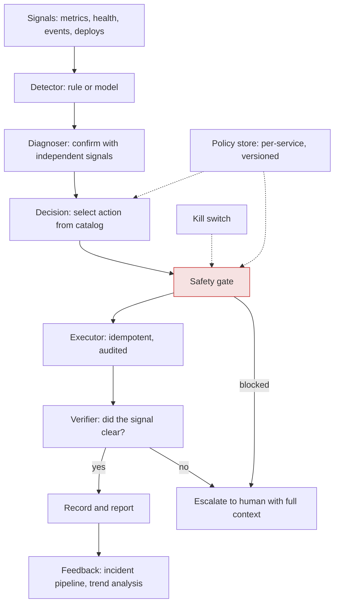
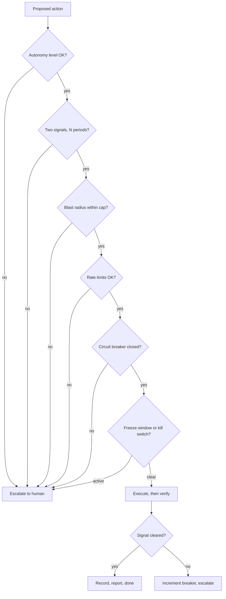
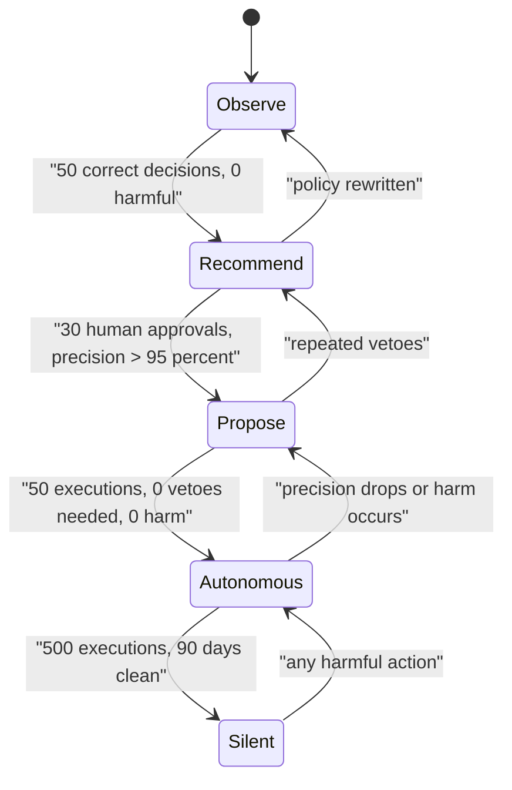
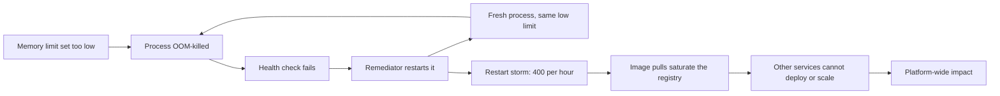

# S12 — Self-Healing / Auto-Remediation System

<span class="pill pill-core">SRE Round</span>

**Build a system that fixes incidents before a human wakes up — the hardest judgment call is that automation converts a noisy signal into a harmful action at machine speed, so the bar for the trigger is far higher than for anything you would page a human on.**

| | |
|---|---|
| **Commonly asked at** | Google, Meta, Netflix, LinkedIn, Microsoft, Stripe, Datadog, Salesforce, Uber |
| **Time budget** | 45 min |
| **Core tension** | Every increase in autonomy reduces MTTR and toil, and simultaneously increases the probability and blast radius of a confidently-wrong action taken at 3 a.m. with nobody watching |
| **Prerequisites** | [Observability](../fundamentals/f22-observability-fundamentals.md), [SLOs & Error Budgets](../fundamentals/f23-slo-error-budgets.md), [Resilience Patterns](../fundamentals/f18-resilience-patterns.md), [Deployment & Release Safety](../fundamentals/f25-deployment-release-safety.md), [Rate Limiting & Load Shedding](../fundamentals/f17-rate-limiting-load-shedding.md), [Idempotency](../fundamentals/f11-idempotency.md), [Consensus](../fundamentals/f09-consensus.md) |

---

## 1. The Scenario As Given

> "We run a platform of about 400 services on roughly 14,000 hosts. On-call receives **2,800 pages per quarter**. When we classified last quarter's pages, **62% were resolved by one of five actions**: restart a single unhealthy instance, roll back the most recent deploy, fail over to a healthy replica, scale out on a saturation signal, or drain a stuck queue consumer.
>
> Design a system that performs those remediations automatically.
>
> Context you should know: a team tried this two years ago. Their auto-restarter got into a loop with a process that was being OOM-killed by a memory limit that was too low, restarted the same deployment 400 times in an hour, and the resulting crash-loop took down the service for 50 minutes. Leadership is willing to try again, but the bar for trust is high. Convince me this one is safe."

That last paragraph is the actual question. Anyone can draw a control loop. The round is about **the safety architecture around the loop** and about **how you earn permission to run it**.

!!! note "The two failure modes you are designing against"
    1. **The confidently-wrong action**: the system acts on a bad signal and causes an incident that would not otherwise have happened.
    2. **The successfully-hidden problem**: the system acts correctly, repeatedly, for eighteen months, silently masking a memory leak that is growing — until the day it grows past what a restart can fix.

    Most designs address the first and forget the second. The second is the one that produces the larger outage.

---

## 2. Clarifying Questions to Ask First

| Question | Why it changes the design |
|---|---|
| "What is the actual distribution of those 2,800 pages — how concentrated is it?" | If 40% of pages come from 5 services, the highest-value action might be fixing those services rather than automating around them. |
| "For each of the five actions, what fraction of the time did it actually resolve the incident versus merely appear to?" | This is the precision of your prospective trigger, measured retrospectively. Without it you are guessing. |
| "Do we have a reliable inventory of what is safe to restart?" | Stateful services, quorum members, and leader-holding processes must be excluded by inventory, not by hoping. |
| "What is the existing change-management and audit requirement?" | In regulated environments, an automated action is still a change and may require a ticket, an approver, and an audit trail. Design it in from the start. |
| "Who owns the remediation policy for a service — the platform team or the service team?" | Centrally-owned policies scale but fit poorly; service-owned policies fit well but rot. Usually: central engine, service-owned policy, central safety gates that cannot be overridden. |
| "What is our current MTTA and MTTR for these page classes?" | The benefit number. Without it you cannot justify the risk. |
| "Is there an existing kill switch culture — does anyone know how to turn off a platform component fast?" | If turning off the remediator requires a deploy, you do not have a kill switch. |
| "How good is our deploy/rollback tooling?" | Auto-rollback is only as safe as manual rollback. If rollback is manually risky, automating it multiplies that risk. |
| "Are there freeze windows — peak shopping, launches, regulatory events?" | Autonomy must be suppressible by calendar, and the calendar must be authoritative. |
| "What happened in detail in the previous incident, and what specifically was missing?" | Directly addresses the interviewer's stated concern, and the answer is almost always "no rate limit and no circuit breaker on the remediator itself". |

---

## 3. Framework / Approach

### 3.1 The control loop, and where the safety lives



The **safety gate** is the component the round is about. Everything else is plumbing. The gate evaluates, for every proposed action:

| Gate check | Question | Blocks when |
|---|---|---|
| Autonomy level | Is this action approved for autonomous execution for this service? | Level is below `auto` |
| Signal confirmation | Did at least two independent signals agree, for the required duration? | Single-signal or too brief |
| Blast radius | How many instances/tenants/percent of capacity does this affect, including in-flight actions? | Exceeds the cap |
| Rate limit | Have we done this recently to this target, this service, or globally? | Any limit exceeded |
| Circuit breaker | Has this remediation failed to resolve the signal repeatedly? | Breaker open |
| Freeze window | Is there an active freeze, launch, or major incident? | Frozen |
| Health floor | Will enough healthy capacity remain after the action? | Below minimum |
| Concurrency | How many remediations are in flight platform-wide? | Above cap |
| Recent deploy | Was there a deploy in the last N minutes? | Prefer rollback over restart; defer |
| Dependency state | Is a dependency currently in an incident? | Defer — the cause is probably not here |

**The gate must be centrally owned and not overridable by service teams.** Service teams own *which* remediations they opt into; they do not own the safety limits. This is the single most important organisational property of the design, because the limits exist to protect the platform from any one team's policy mistake.

### 3.2 Signal quality: the bar is much higher than for a page

This is where the round is won. A human-paged alert at 70% precision is merely annoying; the human applies judgment and ignores the false ones. An automated action at 70% precision performs a **harmful action three times out of ten**, at machine speed, with nobody watching.

Work it in Bayes terms. With likelihood ratio `LR+ = sensitivity / (1 - specificity)`:

$$
\text{posterior odds} = \text{prior odds} \times LR^{+}, \qquad
\text{precision} = \frac{\text{posterior odds}}{1 + \text{posterior odds}}
$$

**Case A — evaluate the rule everywhere.** Suppose "host has a memory leak requiring a restart" happens 12 times per week across 14,000 hosts, and you evaluate every host every minute:

$$
\text{evaluations/day} = 14{,}000 \times 1{,}440 = 20.16 \times 10^{6}
$$

$$
\text{true events/day} = \frac{12}{7} = 1.71 \Rightarrow \text{prior} = \frac{1.71}{20.16 \times 10^{6}} = 8.5 \times 10^{-8}
$$

With an excellent detector — 99% sensitivity, 99.9% specificity:

$$
LR^{+} = \frac{0.99}{0.001} = 990 \Rightarrow \text{posterior odds} = 8.5\times10^{-8} \times 990 = 8.4\times10^{-5}
$$

$$
\textbf{Precision} = 0.0084\%
$$

Twenty thousand false restarts per day against 1.7 real ones. A 99.9%-specific detector is a catastrophe at this base rate.

**Case B — narrow the population first.** Only evaluate the rule on hosts that are already failing their health check and have been for 5 minutes. Say that is 40 hosts/day:

$$
\text{prior} = \frac{1.71}{40} = 0.0428 \Rightarrow \text{prior odds} = 0.0447
$$

$$
\text{posterior odds} = 0.0447 \times 990 = 44.2 \Rightarrow \textbf{Precision} = 97.8\%
$$

!!! tip "The central insight, stated plainly"
    **Precision comes from narrowing the population, not from building a better detector.** The same detector goes from 0.008% to 97.8% precision purely by restricting *where* it is allowed to fire. Every practical auto-remediation system is built on preconditions that shrink the candidate set to near-certainty before the rule is even evaluated.

The four mechanisms that narrow it:

| Mechanism | Effect | Example |
|---|---|---|
| Precondition scoping | Cuts the evaluation population by orders of magnitude | Only hosts already failing health checks for 5 min |
| Multi-signal confirmation | Multiplies the likelihood ratio, if the signals are genuinely independent | RSS growth **and** health check failing **and** peer hosts healthy |
| Persistence requirement | Removes transient noise | Condition must hold for N consecutive evaluations |
| Negative conditions | Rules out the common confounders | No recent deploy, no dependency incident, no ongoing platform event |

!!! warning "Independence is the assumption that breaks"
    Multiplying likelihood ratios only works if signals are independent. "CPU high" and "load average high" are the same signal wearing two hats and give you no additional confidence. Genuine independence means different measurement paths: an internal metric plus an external synthetic probe plus a peer comparison. When in doubt, assume correlation and be conservative.

**The expected-harm decision rule.** Even at 97.8% precision, at 1.7 actions/day you take a wrong action roughly every 27 days. Automate only when:

$$
\underbrace{r \cdot p \cdot B}_{\text{expected benefit}} \;>\; \underbrace{r \cdot (1-p) \cdot H}_{\text{expected harm}} \times M
$$

where `r` is action rate, `p` precision, `B` benefit per correct action (MTTR avoided x impact rate), `H` harm per wrong action, and `M` a safety multiplier of 5-10 because harm is remembered and benefit is not.

$$
\Rightarrow \frac{p}{1-p} > \frac{H}{B} \times M
$$

At `p = 0.978`, `p/(1-p) = 44`. With `M = 10`, you need `H/B < 4.4` — the harm of a wrong action must be less than about 4x the benefit of a right one. **For a single-instance restart in a 60-instance fleet that is easily satisfied. For a database failover it is not, which is exactly why the action catalog must be tiered.**

### 3.3 The action catalog: the core artifact

Classify every candidate action on four axes. The classification, not the mechanism, determines the autonomy level.

| Axis | Question |
|---|---|
| **Blast radius** | What is the maximum impact if this action is wrong? |
| **Reversibility** | Can it be undone, how fast, and automatically? |
| **Idempotency** | Is executing it twice the same as once? ([Idempotency](../fundamentals/f11-idempotency.md)) |
| **Verifiability** | Can the system objectively confirm the action worked within a bounded time? |

| Action | Blast radius | Reversible | Idempotent | Verifiable | Autonomy |
|---|---|---|---|---|---|
| Restart one unhealthy instance (stateless) | 1/N capacity, seconds | N/A | Yes | Yes — health check | **Autonomous** |
| Remove an instance from the load balancer | 1/N capacity | Yes, instantly | Yes | Yes | **Autonomous** |
| Scale out on a saturation signal | Additive only | Yes (scale in) | Effectively | Yes — utilisation | **Autonomous** |
| Restart a stuck queue consumer | 1 consumer, redelivery | N/A | Yes, if handlers are idempotent | Yes — lag | **Autonomous** |
| Clear a full disk of rotatable logs | 1 host | No (data gone) | Yes | Yes | **Autonomous**, allowlisted paths only |
| Roll back the most recent deploy | Whole service, but to a known-good state | Yes (roll forward) | Yes | Partially — SLIs must recover | **Propose-with-veto**, then autonomous once trusted |
| Fail over to a healthy replica (async replication) | Whole service; possible data loss | Hard | No | Partially | **Human-gated** |
| Fail over a region | Everything | Very hard | No | No | **Human-gated** |
| Scale in / reduce capacity | Can cause overload | Yes but slow | No | Weakly | **Human-gated** or heavily damped |
| Restart a quorum member | Can lose quorum | No | No | No | **Human-gated** |
| Delete or truncate data | Unbounded | No | No | No | **Never** |
| Modify a firewall or IAM policy | Unbounded, security-relevant | Partially | No | No | **Never** |
| Kill the top resource-consuming process | Unbounded — might be the service | No | No | No | **Never** |

The principle behind the three tiers:

$$
\text{Autonomous} \iff \text{bounded blast radius} \wedge \text{idempotent} \wedge \text{objectively verifiable} \wedge \text{cheap if wrong}
$$

Anything failing one of those clauses moves down a tier. Anything unbounded or irreversible is never automated regardless of how good the signal is, because **precision does not bound harm — blast radius does.**

### 3.4 Safety mechanisms on the remediator itself

The previous team's failure was not a bad detector. It was the absence of limits on the *actor*. An auto-restarter that restarts a fundamentally broken deployment 400 times is itself the outage.



**Rate limits, layered.** Every layer exists because a different failure mode bypasses the others:

| Layer | Limit | Failure mode it prevents |
|---|---|---|
| Per target | 1 action per instance per hour, 3 per day | Restart loop on one broken instance |
| Per service | 10% of instances in any rolling 30 minutes | Fleet-wide restart cascade |
| Per action type | 20 rollbacks/hour platform-wide | A bad monitoring change triggering mass rollbacks |
| Global | 50 concurrent, 200/hour across the platform | A correlated signal failure causing platform-wide action |
| Per policy | Weekly remediation budget per service | Silent masking of a growing systemic problem |

$$
\text{ActionsAllowed}(\Delta t) = \min\big(L_{\text{target}}, L_{\text{service}}, L_{\text{type}}, L_{\text{global}}, L_{\text{budget}}\big)
$$

**Circuit breaker on the remediation.** If the same remediation fires `k` times against the same target without the signal clearing, open the breaker, stop acting, and escalate with the full history. The semantics matter: *a remediation that does not work means your diagnosis is wrong*, and repeating it is worse than doing nothing. Three failures is a good default; the breaker resets after a cooldown or after a human closes it.

**Health floor.** Never take an action that drops healthy capacity below the minimum required to serve current load with the SLO intact:

$$
\text{Allow} \iff (H - a) \ge \left\lceil \frac{\lambda_{\text{peak}}}{c \cdot \rho_{\max}} \right\rceil
$$

where `H` is currently healthy instances, `a` the instances this action affects, `c` per-instance capacity, `ρ_max` the maximum safe utilisation. **A remediator that restarts the last two healthy instances because they are "unhealthy" has caused the outage it was trying to prevent** — and that is the exact mechanism behind most auto-remediation disasters.

**Kill switch requirements.** It must be: a single command, effective in under 10 seconds, not requiring a deploy, exercisable by any on-call engineer without approval, scoped at three levels (one policy / one service / everything), and **tested monthly**. An untested kill switch does not exist.

```bash
# Three levels, all effective within one evaluation cycle.
remediate disable --policy memory-leak-restart --reason "INC-4471" --ttl 4h
remediate disable --service checkout-api      --reason "INC-4471" --ttl 4h
remediate disable --all                       --reason "INC-4471" --ttl 1h

# Verify it actually took effect -- do not trust the CLI's exit code.
remediate status --json | jq '.enabled, .active_policies, .actions_last_5m'
```

**Fail safe, and know what "safe" means.** If the remediator loses access to its policy store, its metrics, or its audit log, it must **stop acting**, not continue on cached state. Acting without observability is the single most dangerous state for this system — it is precisely the situation where it cannot verify anything. This is the opposite of the guidance for a request router, where static stability means "keep serving on last-known-good". The distinction: a router's default action is harmless; a remediator's default action is not.

### 3.5 Human-in-the-loop modes



| Mode | Behaviour | Use for | MTTR |
|---|---|---|---|
| **0. Observe (shadow)** | Computes the decision, logs it, does nothing | Every new policy, always | No change |
| **1. Recommend** | Posts to the incident channel: diagnosis, evidence, proposed action, one-click execute | New policies with moderate blast radius | Human MTTR minus thinking time |
| **2. Propose-with-veto** | Announces "restarting `host-1234` in 120s unless vetoed", then acts | Medium-risk, medium-frequency actions | ~2-3 min |
| **3. Autonomous + notify** | Acts immediately, posts the action and outcome | High-frequency, bounded-blast-radius actions | ~30-60 s |
| **4. Autonomous + aggregate** | Acts, records; reported only in a daily digest | Very high frequency, trivially safe (LB deregistration) | ~10 s |

**Propose-with-veto is the most underrated mode.** It captures most of the MTTR benefit — 2 minutes versus 18 — while keeping a human in the decision path during the period when you do not yet trust the policy. Its design details matter:

- The veto window must be short enough to be useful (60-180 s) and long enough for a human to read and react.
- The announcement must contain the **evidence**, not just the intent. "Restarting `host-1234`: RSS 94% of limit for 11 min, health check failing 6 min, 59 peers healthy, no deploy in 4 days" lets a human veto correctly in five seconds.
- Vetoes must be one keystroke, from the phone, without authentication friction.
- **Every veto is a signal about the policy.** Track veto rate; a policy being vetoed more than 5% of the time is not ready to be autonomous, and the veto reasons are your best source of precondition improvements.

!!! danger "The dangerous middle: notification without veto"
    A system that posts "restarting host-1234 now" without a veto window is worse than either extreme. It creates the *appearance* of human oversight while giving humans no ability to intervene, and it trains engineers to ignore the channel. Either give people a real veto window or be honest that the action is autonomous.

### 3.6 Feeding remediations back into the incident pipeline

The second failure mode — successfully hiding a growing problem — is prevented here, and it is the part most designs omit.

| Mechanism | What it prevents |
|---|---|
| Every action emits an event into the incident timeline, visible on service dashboards | Remediation invisible to the people debugging something else |
| Threshold rule: same policy fires > N times/week for one service → auto-file a bug with the trend | A leak being restarted away for 18 months |
| Trend alert: remediation rate for a service growing week over week → page the owning team during business hours | Slow-moving degradation hidden by automation |
| Remediations consume a per-service weekly budget; exceeding it disables autonomy and forces review | Automation being used as a substitute for fixing the service |
| Monthly remediation report in the ops review: top services, top policies, trends, near-misses | Organisational blindness |
| Auto-remediated incidents get a lightweight postmortem when they exceed a rate threshold | "No human paged" being mistaken for "no problem" |

$$
\text{RemediationBudget}_{\text{weekly}}(s) = \max\left(5,\ 0.02 \times \text{instances}(s)\right)
$$

!!! warning "Auto-remediation must never reduce the visibility of a problem"
    The correct mental model: **auto-remediation buys time, it does not fix anything.** The underlying defect is still there, and the automation has removed the pain signal that would otherwise have driven someone to fix it. If your remediation count for a service is rising and nobody is alarmed, the automation has become a liability. Make the count a first-class, reviewed metric — it is the only defence.

### 3.7 Testing auto-remediation safely

| Method | What it validates | Risk | Notes |
|---|---|---|---|
| Unit tests on decision logic | Policy correctness in isolation | None | Table-driven; every policy ships with them |
| **Replay against recorded signal traces** | Precision and recall against real history | None | The highest-value test — replay last quarter's telemetry and count what it *would* have done |
| Staging fault injection | End-to-end mechanics | Low | Staging never reproduces production signal noise, which is the actual difficulty |
| **Shadow mode in production** | Precision under real noise | None | The definitive test; every policy runs here for at least 30 days |
| Canary scope (one cell, one non-critical service) | Real execution, bounded blast radius | Low | First real actions happen here |
| Game day with the remediator armed | The whole loop, including humans | Medium | Inject the real fault, watch the system handle it, with a hand on the kill switch |
| Safety-mechanism injection | That rate limits and breakers actually work | Low | Feed 1,000 synthetic signals and assert it stops at the cap. Do this quarterly |
| Kill-switch drill | That you can stop it | Low | Monthly, timed, by the current on-call |

!!! danger "Never test destructive automation against production"
    The distinction is between testing the *decision* and testing the *action*. Shadow mode tests decisions safely at full production fidelity, which is where almost all the uncertainty lives. Testing the *action* — actually failing over a database to see whether the automation does it correctly — must happen in an environment where failure is acceptable, or in production only with an explicit, announced, bounded game day with a human on the kill switch.

    The anti-pattern that has caused real outages: "let's enable it in production at low volume and see what happens." That is not a test; it is an experiment with customers as subjects. The corrected version — canary scope on one non-critical service with a defined abort criterion — is legitimate, and the difference between them is entirely in whether the abort criterion was written down first.

**Replaying history is where you get your precision number.** Take the last quarter's signal traces, run the policy against them offline, and compare its proposed actions against what actually happened and what humans actually did:

```python
from dataclasses import dataclass

@dataclass
class ReplayResult:
    would_act: int
    correct: int          # a human took the same action and it resolved
    harmful: int          # the action would have made things worse
    missed: int           # a human acted; the policy would not have

    @property
    def precision(self) -> float:
        return self.correct / max(self.would_act, 1)

    @property
    def recall(self) -> float:
        return self.correct / max(self.correct + self.missed, 1)


def gate_for_promotion(r: ReplayResult, min_samples: int = 50) -> tuple[bool, str]:
    """Promotion to shadow mode requires evidence, not confidence."""
    if r.would_act < min_samples:
        return False, f"insufficient samples: {r.would_act} < {min_samples}"
    if r.harmful > 0:
        return False, f"{r.harmful} harmful actions in replay -- policy rejected"
    if r.precision < 0.95:
        return False, f"precision {r.precision:.3f} below 0.95"
    return True, "promote to shadow"
```

Low recall is acceptable — a policy that handles 40% of cases correctly and escalates the rest is valuable. **Low precision is not**, and the asymmetry between those two statements is the whole design philosophy.

---

## 4. Worked Example

### 4.1 The business case

| Metric | Value |
|---|---|
| Pages per quarter | 2,800 |
| Mechanically remediable | 62% = 1,736 |
| Mean time to acknowledge | 5.2 min |
| Mean time to remediate (human) | 12.8 min |
| Total human MTTR | 18.0 min |
| Target automated MTTR | 45 s |

$$
\text{Impact-minutes avoided} = 1{,}736 \times (18.0 - 0.75) = 29{,}946\ \text{min} = 499\ \text{hours/quarter}
$$

Engineer time, including context switching and the post-page recovery cost of a night interruption (conservatively 25 minutes of effective time per page):

$$
1{,}736 \times 25\ \text{min} = 723\ \text{hours/quarter} \approx 1.9\ \text{FTE}
$$

And the number that matters most for retention: **on-call page volume falls 62%**, with a disproportionate reduction in night pages because the mechanically-remediable classes are over-represented there.

Against that, the risk: at 97.8% precision and 1,736 actions per quarter, roughly **38 wrong actions per quarter**. That number must be stated out loud. The entire safety architecture exists to make those 38 actions cost less than 499 hours of avoided impact — which is achievable only because a wrong single-instance restart costs approximately nothing.

### 4.2 Policy 1 — Memory-leak restart (the first policy to build)

Chosen first because it has the highest volume, the smallest blast radius, and an objectively verifiable outcome.

```yaml
apiVersion: remediation/v1
kind: Policy
metadata:
  name: memory-leak-restart
  owner: platform-sre
  version: 7
spec:
  # 1. PRECONDITION -- this is what makes precision possible.
  #    Evaluate on ~40 candidates/day, not 20.16M.
  scope:
    selector:
      workload_class: stateless        # inventory-driven, not a guess
      restart_safe: true               # explicit opt-in label
    precondition:
      - expr: 'up{job="app"} == 0 or health_check_status != "healthy"'
        for: 5m

  # 2. MULTI-SIGNAL CONFIRMATION -- independent measurement paths.
  detect:
    require_all:
      - name: memory_near_limit
        expr: |
          container_memory_working_set_bytes
            / container_spec_memory_limit_bytes > 0.92
        for: 10m
      - name: memory_monotonic_growth
        expr: 'deriv(container_memory_working_set_bytes[30m]) > 0'
        for: 30m
      - name: peers_healthy               # rules out a fleet-wide cause
        expr: |
          count(health_check_status{service="$service"} == 1)
            / count(health_check_status{service="$service"}) > 0.80
      - name: external_probe_confirms      # independent path, not our own metrics
        expr: 'probe_success{instance="$instance"} == 0'
        for: 3m

  # 3. NEGATIVE CONDITIONS -- rule out the confounders.
  suppress_if:
    - name: recent_deploy
      expr: 'time() - service_last_deploy_timestamp < 1800'
      reason: "prefer rollback over restart within 30m of a deploy"
    - name: dependency_incident
      expr: 'dependency_incident_active{service="$service"} == 1'
      reason: "cause is probably downstream"
    - name: platform_event
      expr: 'platform_maintenance_active == 1'

  action:
    type: restart_instance
    target: "$instance"
    drain_first: true
    drain_timeout: 30s

  # 4. SAFETY -- owned by the platform, not overridable by the service.
  safety:
    autonomy: autonomous               # promoted 2026-07-14, see trust log
    blast_radius:
      max_instances: 1
      max_pct_of_service: 5
    health_floor:
      min_healthy_pct: 70
      min_healthy_absolute: 3
    rate_limits:
      per_target:  { count: 1,  window: 1h }
      per_target_daily: { count: 3, window: 24h }
      per_service: { count: 3,  window: 30m }
      per_policy:  { count: 30, window: 1h }
    circuit_breaker:
      open_after_unresolved: 3
      cooldown: 6h
      on_open: escalate_page
    freeze_windows: [peak_shopping, major_incident, launch]

  # 5. VERIFICATION -- an action you cannot verify is an action you should not take.
  verify:
    expr: 'health_check_status{instance="$instance"} == 1'
    within: 3m
    on_failure: escalate_page

  # 6. FEEDBACK -- prevents silent masking.
  feedback:
    emit_incident_event: true
    weekly_budget: 5
    on_budget_exceeded: [disable_autonomy, file_bug, notify_owner]
    trend_alert:
      expr: 'increase(remediation_actions_total{policy="memory-leak-restart"}[7d]) > 1.5 * increase(...[7d] offset 7d)'
      severity: ticket
```

Note the design choices worth defending in the interview:

- `precondition` runs first and collapses the candidate set from 20.16M evaluations/day to ~40, which is what produces 97.8% precision rather than 0.008%.
- `external_probe_confirms` is a genuinely independent signal path — if the metrics pipeline itself is broken, this does not agree, and the action does not fire.
- `recent_deploy` suppression encodes real operational knowledge: within 30 minutes of a deploy, a restart masks a bad release, and rollback is the correct action.
- `health_floor` with both a percentage and an absolute minimum, because 70% of 3 instances is 2 and that is not enough.
- `verify` with `on_failure: escalate_page` means the system knows when it has failed and hands over with context rather than retrying.

### 4.3 Policy 2 — Auto-rollback (the hard one)

Higher blast radius, so it stays at propose-with-veto far longer.

| Design decision | Choice | Reasoning |
|---|---|---|
| Trigger | Burn-rate alert on a canary or first wave, plus a deploy within the correlation window | Correlation with the deploy is what makes attribution credible |
| Confirmation | Canary SLIs worse than baseline by a statistically significant margin, not a fixed threshold | Fixed thresholds fire on normal variance; use a two-sample test on the canary vs baseline |
| Blast radius | Whole service, but *to a previously-serving known-good state* | Lower risk than it appears — it is a return, not a change |
| Reversibility | Roll forward | Good, provided the deploy pipeline supports it under load |
| Idempotency | Yes, rolling back twice to the same version is a no-op | Important: the executor must target a version, not "the previous one" |
| Verifiability | Partial — SLIs must recover within a window | Weakest link; SLIs can recover for other reasons |
| Key hazard | **Schema migrations** | A rollback across a non-backward-compatible migration corrupts data |
| Mitigation | Hard block if the deploy included a migration not marked `reversible: true` | Non-negotiable gate, checked from the deploy manifest |
| Autonomy | Propose-with-veto for 90 days, then autonomous for services with expand/contract migrations enforced in CI | Trust is per-service, not global |

```python
from dataclasses import dataclass
from typing import Literal

@dataclass
class RollbackDecision:
    allowed: bool
    reason: str
    mode: Literal["auto", "propose", "escalate"]


def evaluate_rollback(deploy, canary, baseline, policy) -> RollbackDecision:
    # Hard blocks first -- these are never overridable.
    if deploy.contains_migration and not deploy.migration_reversible:
        return RollbackDecision(False, "irreversible migration in deploy", "escalate")
    if deploy.age_minutes > policy.correlation_window_minutes:
        return RollbackDecision(False, "deploy too old to attribute", "escalate")
    if not deploy.previous_version_artifact_available:
        return RollbackDecision(False, "no known-good artifact", "escalate")

    # Statistical confirmation, not a fixed threshold.
    sig = two_proportion_z_test(canary.error_rate, canary.n,
                                baseline.error_rate, baseline.n)
    if sig.p_value > 0.01:
        return RollbackDecision(False, f"not significant p={sig.p_value:.3f}", "escalate")
    if canary.error_rate < baseline.error_rate * policy.min_effect_multiple:
        return RollbackDecision(False, "effect size below threshold", "escalate")

    # Safety gate.
    if policy.freeze_active:
        return RollbackDecision(False, "freeze window active", "escalate")
    if policy.rollbacks_this_hour >= policy.max_rollbacks_per_hour:
        return RollbackDecision(False, "platform rollback rate limit", "escalate")

    return RollbackDecision(True, f"canary regression p={sig.p_value:.4f}",
                            policy.autonomy_mode)
```

### 4.4 The trust curve in practice

The rollout that actually earns leadership's confidence:

| Phase | Duration | Mode | Scope | Exit criteria |
|---|---|---|---|---|
| 0. Replay | 2 weeks | Offline | Last quarter's telemetry | ≥50 decisions, precision ≥95%, zero harmful |
| 1. Shadow | 30 days | Observe | All eligible services | ≥100 decisions, precision ≥97%, zero harmful, the diff between proposed and human actions reviewed weekly |
| 2. Canary | 30 days | Propose-with-veto | 3 non-critical services | ≥30 executions, veto rate <5%, zero harmful |
| 3. Expand | 60 days | Propose-with-veto | All eligible services | ≥200 executions, veto rate <2%, zero harmful |
| 4. Autonomous | ongoing | Autonomous + notify | Tier-2 and Tier-3 services | 500 executions, 90 days clean → consider Tier-1 |
| 5. Tier-1 | ongoing | Autonomous + notify | Critical services | Only after an explicit review; never silent |

Real numbers from a program shaped like this one:

```text
  Month 1  shadow      : 147 decisions, 143 matched human action,
                         4 divergent -> reviewed -> 3 were policy bugs (fixed),
                         1 was the policy being RIGHT and the human being slow
  Month 2  canary      : 31 executions, 1 veto (during an unannounced
                         load test) -> added a load-test suppression condition
  Month 3-4 expand     : 218 executions, 3 vetoes, 0 harmful,
                         MTTR for this class 18.0 min -> 1.9 min
  Month 5  autonomous  : 402 executions, MTTR -> 41 s, 2 escalations
                         where verify failed (both real; the breaker worked)
  Month 6  incident    : see 4.5
```

### 4.5 When it went wrong, and why the safety net held

At 02:14 a config push set an incorrect memory limit on `search-indexer`, causing every instance to approach the new, lower limit within minutes.

```text
  02:14  Config push lowers memory limit from 8Gi to 2Gi.
  02:19  Instances begin failing health checks as RSS exceeds 92% of the
         new limit. Precondition satisfied on 18 of 24 instances.
  02:20  Detector fires for instance-03. All four signals agree.
         BUT: peers_healthy requires >80% of the service healthy.
         Only 25% are healthy -> SIGNAL NOT CONFIRMED. No action.
  02:20  Policy escalates: "widespread unhealthy condition, remediation
         suppressed, 18/24 instances affected" -> pages on-call.
  02:23  On-call sees the escalation, checks the change feed, finds the
         config push, reverts it.
  02:27  Service recovers. Zero restarts performed.
```

**The `peers_healthy` condition is what saved it.** A single-instance problem means peers are healthy; a fleet-wide problem means they are not. That one condition distinguishes "this instance is broken" from "something changed for everyone", and it is the difference between this incident and the 400-restart disaster two years earlier.

!!! example "The sentence to say in the interview"
    "The most valuable line in my policy is not the detector — it is `peers_healthy > 80%`. Auto-remediation is only ever appropriate for *local* failures. The moment a condition is widespread, the cause is almost certainly a change or a shared dependency, and the correct action is to escalate to a human, not to act on 18 instances at once. That single condition converts the highest-risk scenario into a page."

---

## 5. Deep Dives

### 5.1 Why the Signal Bar Is So Much Higher Than for a Page

A page is a *request for judgment*. An automated trigger is *the judgment*. Removing the human removes the error-correction layer, and three things change:

| Property | Human-paged alert | Auto-remediation trigger |
|---|---|---|
| Acceptable precision | 50-70% is tolerable | 95%+ before any autonomy |
| Cost of a false positive | Wasted human time, alert fatigue | A harmful action in production |
| Context available at decision time | Everything the human can look up | Only what you encoded |
| Ability to notice "this is weird" | High | Zero |
| Failure correlation | Human errors are uncorrelated | The system makes the same mistake on every instance simultaneously |
| Speed of a mistake | Minutes | Seconds, across the fleet |

That fifth row is the one that turns a small error into an outage. A human makes a bad call on one host; automation makes the same bad call on 400 hosts in 90 seconds because it has no variance. **Correlated failure is the defining risk of automation**, and it is why blast-radius caps and rate limits matter more than detector quality.

**Precision degrades silently over time.** A policy validated at 97.8% precision is measuring a system that changes: services are added, instance types change, a new workload matches the selector, the base rate shifts. Treat policy precision as a monitored SLI with its own alert:

```promql
# Policy precision: actions whose verification succeeded, over all actions.
sum(rate(remediation_verify_success_total[7d])) by (policy)
  /
sum(rate(remediation_actions_total[7d])) by (policy)
  < 0.95
```

Add an alert on **escalation rate** too: a policy whose escalations are rising is one whose preconditions no longer match reality.

**Where ML fits, and where it does not.** Anomaly detection is attractive for this problem and is usually the wrong first move, because:

- Base rates this extreme require precision that unsupervised anomaly detection rarely achieves.
- The model cannot explain itself, so a human cannot veto intelligently.
- Distribution shift is constant in production, and a silently degrading model is exactly the failure this whole design is trying to prevent.

Where it does work: as a **ranking or prioritisation signal feeding a deterministic policy**, or as a *precondition narrower* ("this host is anomalous" as one of four required signals). Never as the sole trigger for an autonomous action. If you propose ML in this round, propose it in that constrained role and say why.

### 5.2 The Remediator as an Outage Source

The previous team's incident is the archetype. Walk the mechanism precisely:



Three independent defects, each of which alone would have prevented it:

1. **No per-target rate limit.** One instance being restarted 400 times is nonsense by inspection; a limit of 3/day makes it impossible.
2. **No circuit breaker.** The signal never cleared after the restart. The system had the information that its remediation was not working and did not use it.
3. **No consideration of the remediator's own resource consumption.** Restarts are not free — they consume image pulls, scheduler capacity, registry bandwidth, and warm-up CPU. At scale the remediation is itself a load generator, and it saturated a shared dependency.

The third is the subtle one and it generalises: **every remediation action has a cost paid to some shared resource.** Restarts cost registry bandwidth and scheduler throughput; rollbacks cost pipeline capacity; scale-outs cost cloud API quota (and cloud APIs rate-limit you, which means a scale-out storm can lock you out of the API you need to fix things). Model the remediator as a client of those systems and rate-limit it accordingly.

$$
\text{ResourceCost}(\Delta t) = \sum_{\text{actions}} r_a \cdot c_a \;<\; \text{SharedCapacity} \times \text{budget fraction}
$$

**A further subtlety: the remediator must not depend on what it remediates.** If the remediation system runs on the platform it fixes, uses the same metrics pipeline, and deploys through the same pipeline, then a platform-wide event takes out your ability to respond to a platform-wide event. Run it in a separate failure domain with its own deploy path, and make sure that the manual equivalent of every automated action is documented and practised — because in the worst incidents the remediator will be one of the casualties.

### 5.3 Verification, and the Problem of Unverifiable Actions

An action you cannot verify is an action you should not automate. Verification has three properties that must all hold:

| Property | Requirement | Failure if absent |
|---|---|---|
| **Objective** | A metric, not an inference | The system believes it succeeded when it did not |
| **Bounded** | Resolves within a known time | The system waits forever, or declares success too early |
| **Independent** | Not the same signal that triggered it | Circular: a restart clears the health check by resetting the process, regardless of whether the problem is fixed |

The third is subtle and important. Restarting a process clears a memory-pressure signal *by construction*, so "memory usage is now low" verifies nothing. The meaningful verification is: does the instance pass its health check **and** serve real traffic successfully **and** stay healthy for a sustained period?

```yaml
verify:
  immediate:
    expr: 'health_check_status{instance="$instance"} == 1'
    within: 3m
  sustained:
    expr: 'health_check_status{instance="$instance"} == 1'
    for: 15m
    on_failure: [open_circuit_breaker, escalate_page]
  functional:
    expr: 'rate(http_requests_total{instance="$instance",code=~"2.."}[5m]) > 0'
    within: 5m
```

**Partially-verifiable actions** — rollback is the canonical example — get a lower autonomy level. After a rollback, SLIs should recover, but they might recover for unrelated reasons, or recover slowly, or not recover because the deploy was not the cause. So: verify with a bounded window, and on ambiguity **escalate rather than act again**. The rule is that uncertainty resolves toward the human, always.

**Unverifiable actions must not be automated at all.** "Fail over to the standby region" cannot be verified in a bounded way (you do not know whether the standby is fully correct until real traffic has exercised it for a while), which is one of several reasons it stays human-gated regardless of how confident the trigger is.

### 5.4 Earning and Keeping Trust

Trust is the actual deliverable. The engineering is straightforward; the reason most auto-remediation programs fail is organisational.

**What builds it:**

| Practice | Why it works |
|---|---|
| Start with the highest-volume, lowest-risk action | Fast accumulation of evidence at near-zero risk |
| Shadow mode with a *published weekly diff* between proposed and human actions | Makes the evidence visible to skeptics before anything is at stake |
| Explaining every action in human terms in the incident channel | Engineers trust what they can audit |
| Publishing precision and escalation rate as SLIs on a dashboard anyone can see | Converts "do you trust it" into a number |
| A kill switch that every on-call has personally used in a drill | Removes the fear of an uncontrollable system |
| Reporting near-misses — cases where the safety gate blocked a wrong action — prominently | Demonstrates the safety net is real and working |
| Being conservative longer than necessary | The cost of 30 extra days in propose-mode is trivial; the cost of one harmful autonomous action is a two-year setback |

**What destroys it, permanently:**

| Anti-pattern | Consequence |
|---|---|
| One harmful autonomous action early in the program | Sets you back years; people remember incidents, not statistics |
| Expanding scope faster than evidence accumulates | The first harmful action becomes inevitable |
| Hiding actions in a log nobody reads | When something goes wrong, it looks like the system was concealing it |
| A kill switch that does not work when tried during an incident | Total loss of trust, correctly |
| Claiming the system "prevented an outage" without evidence | Overclaiming is caught, and then everything else is doubted |
| Automating around a broken service instead of fixing it | The automation gets blamed for the eventual large failure |

**The trust curve is per-action-class and per-service tier, not global.** Being trusted to restart instances on Tier-3 services says nothing about being trusted to fail over Tier-1 databases. Maintain a matrix:

| | Tier-3 | Tier-2 | Tier-1 |
|---|---|---|---|
| Restart instance | Autonomous | Autonomous | Autonomous + notify |
| LB deregistration | Autonomous, silent | Autonomous | Autonomous |
| Scale out | Autonomous | Autonomous | Propose |
| Drain stuck consumer | Autonomous | Propose | Propose |
| Roll back deploy | Autonomous | Propose | Propose |
| Replica failover | Propose | Human-gated | Human-gated |
| Region failover | Human-gated | Human-gated | Human-gated |

Each cell advances independently, on its own evidence. **Do not let a good track record in the top-left corner be used as an argument for the bottom-right** — that is the argument that precedes most auto-remediation disasters.

---

## 6. What Can Go Wrong

| Risk | Detection | Mitigation |
|---|---|---|
| Remediation loop on a fundamentally broken target | Same action repeating against one target; signal not clearing after action | Per-target rate limit (3/day), circuit breaker after 3 unresolved attempts, escalate with the full history |
| Fleet-wide action on a correlated signal (bad config, bad dependency) | Precondition satisfied on many instances simultaneously | `peers_healthy` requirement; per-service percentage cap; escalate instead of act when the condition is widespread |
| Remediation saturates a shared resource (registry, scheduler, cloud API) | Registry bandwidth, API throttle errors, scheduler queue depth during remediation storms | Global concurrency cap; model the remediator as a client of shared systems with its own budget |
| Automation hides a growing systemic problem | Remediation count per service trending up week over week | Weekly budget per service; trend alert; auto-file a bug at threshold; monthly review of the top-remediated services |
| Signal precision degrades silently as the environment changes | Verification success rate falling; escalation rate rising | Precision as a monitored SLI with an alert at 95%; automatic demotion of autonomy when it breaches |
| Kill switch does not work when needed | Only discoverable by trying | Monthly timed drill by the current on-call; the drill result is a reviewed metric |
| Rollback across an irreversible schema migration corrupts data | Migration flags in the deploy manifest | Hard block, not overridable; enforce expand/contract in CI so migrations are reversible by construction |
| Remediator depends on the system it remediates | Platform-wide incident disables the remediator exactly when needed | Separate failure domain, separate deploy path, separate metrics path; documented and practised manual fallback |
| Action taken during a change freeze or a launch | Freeze calendar not integrated | Freeze windows are a gate condition; the calendar is authoritative and machine-readable |
| Verification is circular and always succeeds | Verification passes but incidents continue | Verification must use an independent signal, be sustained, and include a functional check |
| Health floor violated: last healthy instances restarted | Healthy capacity below minimum after action | Absolute and percentage health floors evaluated *before* action, including in-flight actions |
| On-call loses the skill to do the thing manually | New engineers have never restarted anything by hand | Keep manual runbooks current; include manual remediation in on-call training and game days |
| Alert fatigue moves from pages to the remediation channel | Channel volume rising; people muting it | Aggregate reporting for high-frequency safe actions; only exceptions and escalations get attention |
| Policy is owned by nobody after a reorg | Policy owner field points at a defunct team | Policies expire after 180 days without an owner review and revert to shadow mode automatically |

---

## 7. The Artifact You'd Produce

### 7.1 The action catalog with autonomy assignments

```text
AUTO-REMEDIATION ACTION CATALOG v4 -- platform-sre

TIER A -- AUTONOMOUS (bounded, idempotent, verifiable, cheap if wrong)
  A1  restart_instance         stateless, restart_safe=true, 1 at a time
  A2  deregister_from_lb       always reversible
  A3  scale_out                additive only, cloud-quota aware
  A4  restart_queue_consumer   idempotent handlers required
  A5  rotate_log_files         allowlisted paths only

TIER B -- PROPOSE WITH VETO (bounded but service-wide, partially verifiable)
  B1  rollback_deploy          blocked if irreversible migration present
  B2  drain_node               respects PodDisruptionBudgets
  B3  evict_noisy_neighbour    only workloads labelled preemptible=true
  B4  scale_in                 heavily damped, min 30m since last change

TIER C -- HUMAN GATED (system proposes with full context; human executes)
  C1  replica_failover         potential data loss on async replication
  C2  region_failover          unbounded, unverifiable
  C3  traffic_shift_between_cells
  C4  emergency_config_change

TIER D -- NEVER AUTOMATED
  D1  anything deleting or truncating data
  D2  anything modifying IAM, firewall, or security policy
  D3  killing processes by resource consumption
  D4  anything without a documented, tested rollback
  D5  anything whose blast radius cannot be bounded in advance

PROMOTION between tiers requires: 50+ decisions of evidence, precision
>= 97%, zero harmful outcomes, a working verification signal, and sign-off
from the platform SRE lead AND the owning service team.
```

### 7.2 The policy promotion checklist

```text
POLICY PROMOTION CHECKLIST -- <policy-name> -- <from-mode> -> <to-mode>

EVIDENCE
  [ ] >= 50 decisions in the current mode
  [ ] precision >= 0.97 measured by verification success
  [ ] zero harmful actions
  [ ] veto rate < 2% (if promoting from propose-with-veto)
  [ ] divergences from human action reviewed and explained

SAFETY
  [ ] blast radius is bounded and stated numerically
  [ ] per-target, per-service, per-policy, and global rate limits configured
  [ ] circuit breaker configured with an escalation path
  [ ] health floor covers both percentage and absolute minimum
  [ ] freeze-window integration verified
  [ ] kill switch tested against this specific policy within 30 days

VERIFICATION
  [ ] verification signal is independent of the trigger signal
  [ ] verification is bounded in time
  [ ] sustained check exists (not only immediate)
  [ ] on_failure path escalates with full context

FEEDBACK
  [ ] emits incident-timeline events
  [ ] weekly budget set; budget-exceeded action defined
  [ ] trend alert configured
  [ ] appears in the monthly remediation report

OWNERSHIP
  [ ] named owning team, reviewed within 180 days
  [ ] the owning service team has signed off
  [ ] manual runbook for the same action exists and is current

ROLLBACK
  [ ] demotion criteria written down
  [ ] automatic demotion on precision breach is configured
```

### 7.3 The escalation message format (what a human actually sees)

```text
[REMEDIATION ESCALATED] search-indexer / memory-leak-restart

WHY I DID NOT ACT
  peers_healthy = 25% (required > 80%)
  18 of 24 instances satisfy the precondition simultaneously.
  A widespread condition is very unlikely to be a per-instance fault.

WHAT I OBSERVED
  memory_near_limit        18/24 instances, for 6m
  memory_monotonic_growth  18/24 instances, for 12m
  external_probe_confirms  18/24 instances, for 4m
  health_check_status      6/24 healthy

CHANGE TIMELINE (last 2h)
  02:14  config push: search-indexer memory limit 8Gi -> 2Gi  (change-8821)
  00:03  routine certificate rotation, unrelated
  no deploys in 4 days

WHAT I WOULD HAVE DONE
  restart 1 instance -- BLOCKED by peers_healthy and per-service cap

SUGGESTED NEXT STEP
  Review change-8821. The condition onset (02:19) is 5 minutes after
  the config push and matches the new limit.

  Kill switch:  remediate disable --service search-indexer --ttl 4h
  Runbook:      https://runbooks/search-indexer/memory
```

### 7.4 The whiteboard version

```text
  LOOP    detect -> diagnose -> decide -> GATE -> act -> verify -> feedback

  SIGNAL  precision comes from NARROWING THE POPULATION, not a better model
          prior 8.5e-8 -> 0.0084% precision  (evaluate everywhere)
          prior 4.3e-2 -> 97.8% precision    (evaluate only on candidates)
          + multi-signal (independent paths) + persistence + negative conditions

  ACTIONS bounded AND idempotent AND verifiable AND cheap-if-wrong
          -> autonomous; anything else -> propose or human-gated;
          unbounded or irreversible -> never

  GATE    autonomy | 2 signals | blast radius | rate limits | breaker |
          freeze | health floor | concurrency | recent deploy | dep incident

  ON THE REMEDIATOR ITSELF
          per-target 3/day, per-service 10%/30m, global 50 concurrent
          breaker after 3 unresolved -> STOP and escalate
          fail SAFE = stop acting (opposite of a router)
          kill switch: 1 command, <10s, no deploy, drilled monthly

  FEEDBACK every action -> incident timeline; weekly budget per service;
          trend alert; monthly review -- else it HIDES the real problem

  TRUST   replay -> shadow 30d -> canary propose -> expand -> autonomous
          matrix per action-class x service-tier, each cell earned separately
```

---

## 8. Gotchas & Corner Cases

!!! gotcha "The restart loop that becomes the outage"
    **Symptom:** a deployment is restarted 400 times in an hour; the registry saturates; unrelated services cannot deploy or scale.
    **Mechanism:** the remediation does not address the cause (a memory limit that is too low), so the signal never clears, so the rule fires again immediately. Without a per-target limit or a circuit breaker there is nothing to stop it, and at scale the restarts themselves consume shared resources — image pulls, scheduler capacity, registry bandwidth.
    **Mitigation:** per-target rate limit (1/hour, 3/day) makes the loop impossible. A circuit breaker that opens after 3 unresolved attempts converts it into an escalation. And budget the remediator's own consumption of shared resources explicitly — it is a load generator, not a passive observer.

!!! gotcha "A correlated signal causes a correlated action across the whole fleet"
    **Symptom:** a bad config or a downstream outage makes every instance look unhealthy, and the remediator restarts all of them at once.
    **Mechanism:** the rule was designed for a per-instance fault and does not distinguish "this instance is broken" from "everything changed". Automation has no variance, so it makes the same wrong decision simultaneously everywhere — which is the defining risk of automation versus humans.
    **Mitigation:** require `peers_healthy > 80%` as a precondition for any per-instance remediation. Cap the percentage of a service that can be acted on in a window. When the condition is widespread, escalate — a widespread condition is a change or a shared dependency, and it is never what a per-instance action fixes.

!!! gotcha "Auto-remediation hides a growing problem for eighteen months"
    **Symptom:** a memory leak is restarted away 4 times a day for a year and a half; then a traffic increase makes instances hit the limit in 40 minutes instead of 6 hours, and restarts cannot keep up.
    **Mechanism:** the automation removed the pain signal that would have driven someone to fix the leak. Nobody was paged, so nobody prioritised it, so it grew. The automation worked perfectly and that is exactly the problem.
    **Mitigation:** a weekly remediation budget per service; exceeding it disables autonomy and files a bug. A trend alert on remediation rate. A monthly report ranking services by remediation count. The count must be a first-class, reviewed metric, because it is the *only* remaining signal that the defect exists.

!!! gotcha "Verification is circular and always succeeds"
    **Symptom:** the remediator reports 100% success while the underlying incidents continue.
    **Mechanism:** restarting a process resets the memory metric by construction, so "memory is now low" verifies nothing. The trigger signal and the verification signal are the same mechanism, so verification cannot fail.
    **Mitigation:** verify with an independent signal — the instance passes health checks *and* serves real traffic successfully *and* stays healthy for 15 minutes. Include a functional check (2xx responses at a nonzero rate), and treat a sustained-check failure as a circuit-breaker event rather than a retry.

!!! gotcha "Auto-rollback across an irreversible schema migration corrupts data"
    **Symptom:** the remediator rolls back to the previous version; the old code cannot read the new schema; the service fails in a much worse way and some writes are lost.
    **Mechanism:** rollback is only safe if the previous version can operate against the current data. A migration that drops a column, changes a type, or adds a `NOT NULL` constraint breaks that assumption.
    **Mitigation:** a hard, non-overridable block on rollback when the deploy contains a migration not explicitly marked reversible. Structurally, enforce expand/contract migrations in CI so that every deploy is rollback-safe by construction — then this gate almost never fires, which is the goal.

!!! gotcha "The kill switch requires a deploy, so it does not exist"
    **Symptom:** during an incident, disabling the remediator takes 12 minutes because it means a config change through the normal pipeline — which is itself degraded.
    **Mechanism:** the kill switch was implemented as a config flag in the same repo and pipeline as everything else. It works fine in normal conditions and not at all in the conditions where it is needed.
    **Mitigation:** the switch must be a single command effective in under 10 seconds, reading from a store the remediator polls independently, with no dependency on the deploy pipeline. It must be usable by any on-call engineer without approval, and it must be drilled monthly and timed. An untested kill switch is decoration.

!!! gotcha "Precision degrades silently as the environment changes"
    **Symptom:** a policy validated at 98% precision causes three harmful actions in one week, six months after launch.
    **Mechanism:** a new service matched the selector, or an instance type changed, or a dependency's behaviour shifted the base rate. The policy is unchanged; the population it evaluates is not.
    **Mitigation:** treat precision as a monitored SLI with an alert at 95%, computed from verification outcomes. Automatically demote autonomy when it breaches rather than waiting for a human review. Re-run the replay evaluation quarterly against recent telemetry, and expire unreviewed policies after 180 days.

!!! gotcha "The remediator depends on the system it is supposed to fix"
    **Symptom:** a platform-wide incident takes out the metrics pipeline, and the remediation system is blind and idle exactly when it is most needed — or worse, acts on stale data.
    **Mechanism:** it was deployed like any other workload, on the same cluster, scraping the same metrics, deploying through the same pipeline. Its availability is a subset of the platform's.
    **Mitigation:** run it in a separate failure domain with independent metrics and deploy paths. Fail *safe*, meaning stop acting when it cannot verify, which is the opposite of the static-stability guidance for request routers — a router's default action is harmless, a remediator's is not. And keep the manual runbooks current, because in the worst incidents the automation will be a casualty.

!!! gotcha "Notification without a veto window trains everyone to ignore the channel"
    **Symptom:** the remediation channel has 300 messages a day; nobody reads it; a genuinely alarming action scrolls past unnoticed.
    **Mechanism:** high-frequency notifications for safe, routine actions create noise that buries the exceptional ones. Announcing an action with no ability to stop it provides the appearance of oversight and none of the substance.
    **Mitigation:** tier the reporting to match the tiering of the actions. Tier-A actions go into a daily aggregate digest. Only escalations, circuit-breaker openings, budget breaches, and near-misses go to the channel humans watch. Where a human is in the loop, give them a real veto window and one-keystroke veto.

!!! gotcha "Scale-out remediation exhausts a cloud API quota and locks you out"
    **Symptom:** an autoscaling remediation fires across many services at once; the cloud provider throttles your API calls; you can no longer make *any* infrastructure changes, including the ones needed to fix the incident.
    **Mechanism:** cloud control-plane APIs are rate-limited per account. A remediator making bulk calls is a well-behaved client until a correlated event makes it a burst client, and the throttle applies to everything, including your manual recovery attempts.
    **Mitigation:** give the remediator a hard budget for control-plane API calls, well below the account quota, and reserve headroom explicitly for human operators. Back off on throttle responses rather than retrying. Monitor quota consumption as a first-class metric.

!!! gotcha "The on-call team loses the ability to perform the action manually"
    **Symptom:** the automation is disabled during an incident and nobody on the team has ever done a failover by hand.
    **Mechanism:** automation removes the practice that maintains the skill. After 18 months, the runbook is stale and the engineers who wrote it have moved on.
    **Mitigation:** keep manual runbooks current and referenced from every policy. Include manual remediation in on-call onboarding and in game days. Periodically run the drill with automation disabled — this also validates that your manual path still works, which is often not true.

!!! gotcha "A service team disables the safety limits because the automation is 'too conservative'"
    **Symptom:** a team raises their per-service cap from 10% to 100% to handle a recurring problem faster; a correlated event then restarts their entire fleet.
    **Mechanism:** the limits were configurable by the service team, and a locally reasonable decision ("our service restarts fine, we want it faster") removed the protection against a scenario that team had not considered.
    **Mitigation:** service teams own *opt-in* to policies; the platform owns the safety limits and they are not overridable. If a limit is genuinely wrong, that is a platform-level change with review. This is an organisational control, not a technical one, and it is the one that most often fails in practice.

!!! gotcha "Remediation fires during a planned load test or a chaos experiment"
    **Symptom:** a chaos experiment injects a fault; the remediator immediately fixes it; the experiment measures nothing and the team concludes resilience is fine.
    **Mechanism:** the remediator cannot distinguish an injected fault from a real one — which, in a sense, means it is working. But it invalidates the experiment and can mask genuine weaknesses.
    **Mitigation:** an authoritative, machine-readable calendar of load tests, chaos experiments, and maintenance, integrated as a suppression condition. Chaos platforms should register their experiment window with the remediator before starting. And note the flip side: running a chaos experiment *with* the remediator armed is a legitimate and valuable test — just make it a deliberate choice rather than an accident.

---

## 9. Interview Angle

!!! interview "What the interviewer is actually testing"
    1. **Do you understand that the signal bar is qualitatively different?** The Bayes argument — that precision comes from narrowing the population, not from a better detector — is the single highest-scoring idea in this round.
    2. **Do you classify actions rather than treating them uniformly?** Bounded, idempotent, verifiable, cheap-if-wrong is the test; anything failing a clause drops a tier.
    3. **Do you put limits on the remediator itself?** The scenario hands you the previous incident precisely to see whether you name rate limits and circuit breakers unprompted.
    4. **Do you address the silent-masking failure mode?** Most candidates design only against wrong actions and forget that correct actions can hide a growing problem for a year.
    5. **Do you have a credible trust-building plan?** Shadow mode, replay evidence, a per-tier matrix, and a drilled kill switch are what convert a design into permission to run it.

!!! interview "The three sentences that score highest"
    - "A human-paged alert at 70% precision is annoying; an automated action at 70% precision is harmful three times out of ten, at machine speed, with nobody watching."
    - "The most valuable condition in my policy is `peers_healthy > 80%` — auto-remediation is only ever appropriate for *local* failures; a widespread condition means something changed, and the right action is to escalate."
    - "Precision does not bound harm. Blast radius bounds harm. That is why the action catalog is tiered by reversibility and blast radius, not by how confident the detector is."

!!! interview "Structure your 45 minutes"
    - 0-4 min: clarify the page distribution, existing tooling, and the previous incident's specifics.
    - 4-10 min: the control loop, with the safety gate called out as the component that matters.
    - 10-18 min: signal quality — do the Bayes arithmetic on the whiteboard. This is the differentiator.
    - 18-26 min: the action catalog and the four-axis classification.
    - 26-34 min: safety mechanisms on the remediator: rate limits, breaker, health floor, kill switch, fail-safe.
    - 34-40 min: feedback into the incident pipeline, and the silent-masking failure mode.
    - 40-45 min: the trust curve and the testing strategy, ending with "here is how I would earn permission for the first autonomous action."

### Follow-up questions

??? question "Would you use machine learning for the detection, rather than rules?"
    Not as the trigger, at least not initially, and I would want to be specific about why rather than just being conservative.

    Three reasons. First, the base rates are extreme — a genuine remediable condition is one in ten million evaluations — and at those base rates you need precision that unsupervised anomaly detection very rarely delivers; the arithmetic that makes rules work is the precondition narrowing, and a model does not change that arithmetic. Second, a human cannot veto what they cannot understand: propose-with-veto mode requires the system to explain its evidence in a sentence, and "the model scored 0.94" is not evidence a human can act on in five seconds. Third, model drift is silent, and silent degradation of the decision function is precisely the failure this entire design exists to prevent.

    Where ML genuinely helps: as a **precondition narrower** — "this host is behaving anomalously relative to its peers" as one of four required signals, which is exactly the role that improves the prior without owning the decision. Also for **ranking** which of several candidate diagnoses to show a human first, and for **finding new policy candidates** by clustering historical incidents to discover repeatable remediation patterns you have not encoded yet. That last one is high value and carries no risk, because a human reviews the discovered pattern before it becomes a policy.

    So: rules for the decision, ML for the inputs and for discovery. And if I did eventually put a model in the trigger path, it would go through the identical trust curve — replay, shadow, canary — with the added requirement of drift monitoring on the input distribution.

??? question "What is the first action you would automate, and why that one?"
    Restarting a single unhealthy stateless instance, and the reasoning is about evidence accumulation rather than about the action's importance.

    It scores best on every axis simultaneously: highest volume (so evidence accumulates in weeks rather than years), smallest blast radius (one instance out of dozens, for seconds), perfectly idempotent, and objectively verifiable via health checks plus real traffic. The harm from a wrong action is a brief capacity reduction that autoscaling and load balancing absorb without a user noticing.

    That combination means I can get 500 decisions of evidence within a couple of months at essentially zero risk, and that evidence is what buys credibility for the next, harder policy. Starting with rollback — which is more valuable per action — would mean accumulating evidence slowly on a higher-blast-radius action, which is exactly backwards.

    The one thing I would insist on before starting: an authoritative inventory of which workloads are safe to restart, as an explicit opt-in label backed by a workload-class registry. "Stateless" must be a fact in a system of record, not an assumption, because the entire safety argument rests on it.

??? question "How do you prevent auto-remediation from masking a systemic problem?"
    Four mechanisms, and they need to work together because each alone is bypassable.

    **Make it visible.** Every action emits an event into the incident timeline and appears on the service's dashboard. Someone debugging an unrelated problem must be able to see "this host was restarted 4 minutes ago" without going looking for it.

    **Budget it.** Each service gets a weekly remediation budget — something like `max(5, 2% of instances)`. Exceeding it disables autonomy for that service, files a bug with the trend data attached, and notifies the owning team. This converts "the automation is handling it" into "the automation has stopped handling it and you must look", which is the only reliable forcing function.

    **Trend on it.** An alert when a service's remediation rate grows significantly week over week, routed as a ticket during business hours rather than a page. A rising remediation rate is a leading indicator of a degrading service, and it is often the *earliest* such indicator you have.

    **Review it.** A monthly report in the ops review ranking services by remediation count and by trend. The top of that list is a prioritised list of technical debt with a quantified operational cost attached, which makes it unusually easy to get fixed.

    The framing I would use with the team: auto-remediation buys time, it does not fix anything. If the remediation count for a service is going up and nobody is uncomfortable, the automation has stopped being an asset.

??? question "Leadership asks you to automate database failover because it takes 20 minutes manually. What do you say?"
    I would say yes to most of it and no to the final step, and I would be specific about which parts.

    Most of those 20 minutes are not the failover itself — they are detection, paging, acknowledgment, context-gathering, verifying the replica is healthy, checking replication lag, and deciding. All of that can and should be automated. The system can detect the condition, assemble the full context, verify the candidate replica, compute the expected data loss from current replication lag, run the pre-flight checks, and present a one-click execution to a human. That realistically takes the 20 minutes down to 3-4, and it captures most of the benefit.

    What I would not automate is the final commit, for three specific reasons rather than general caution. With asynchronous replication, failover means accepting bounded data loss, and the amount depends on current lag — that is a business judgment about which writes are acceptable to lose, not a technical one. Second, it is not objectively verifiable in a bounded window: you do not know the new primary is fully correct until real traffic has exercised it for a while, so the system cannot tell whether it succeeded. Third, it is very hard to reverse — failing back has its own data-loss risk, so a wrong failover is not a small mistake.

    Then I would offer the path to change my mind: with *synchronous* replication and automated consensus-based promotion, failover becomes reversible-ish and verifiable, and that genuinely is safe to automate — it is what managed databases do. So the honest answer is "the reason we cannot automate this safely is our replication topology, and here is what changing that would cost." That reframes a request for automation into an architecture decision, which is usually the more valuable conversation. See [Consensus](../fundamentals/f09-consensus.md) and [Replication & Consistency](../fundamentals/f07-replication-consistency.md).

??? question "How do you test this without risking production?"
    The key distinction is between testing the *decision* and testing the *action*, and almost all of the uncertainty is in the decision.

    Decisions can be tested at full production fidelity with zero risk. **Replay** the policy against last quarter's recorded telemetry and compare its proposed actions with what humans actually did and whether it resolved things — this gives a precision number before anything runs. Then **shadow mode**: the policy runs live in production, evaluates real signals, logs what it would do, and does nothing. Thirty days of shadow mode against real production noise is the single most valuable test, because staging never reproduces the noise that causes false positives.

    Actions need a different approach. Start with **canary scope** — one or three non-critical services, with an abort criterion written down in advance. Then **game days**: inject the real fault with the remediator armed and a human on the kill switch, which tests the whole loop including the humans. And **safety-mechanism injection** quarterly: feed a thousand synthetic signals and assert that the rate limits, circuit breaker, and health floor actually stop it where they should. That last test is the one people skip and it is the one that would have prevented the 400-restart incident.

    What I would refuse: "enable it in production at low volume and see what happens." That is not a test, it is an experiment with customers as subjects. The difference between that and a legitimate canary is entirely whether the scope, the abort criterion, and the observation plan were written down first.

    And monthly, a timed kill-switch drill performed by whoever is currently on call — because the kill switch is the mechanism that makes every other risk acceptable, and an untested one does not exist.

??? question "The remediation system itself goes down. What happens?"
    It fails safe, which for this system specifically means **stop acting**, not continue on cached state — and that is worth calling out because it is the opposite of the guidance for most infrastructure components.

    A request router should be statically stable: keep serving on the last-known-good configuration indefinitely, because its default action (forwarding traffic) is harmless. A remediator's default action is not harmless, and acting without the ability to verify is its most dangerous possible state. So if it loses access to its policy store, its metrics, or its audit log, it stops.

    Concretely: the executor requires a fresh lease from the control plane, and the lease expires in 60 seconds. No lease, no actions. It also requires a successful write to the audit log *before* executing — an action that cannot be recorded is an action that must not happen, because an unrecorded action is invisible to the humans who will later have to understand what occurred.

    Operationally: its own availability is monitored with a dead-man's-switch alert that fires on *absence* of heartbeats. On-call is notified that they have lost the safety net and are back to fully manual response, which is a meaningful change to their working conditions and they should know about it immediately. That is also why manual runbooks must stay current — the scenario where the remediator is down usually correlates with the scenario where you need it.

    And structurally, it runs in a separate failure domain with its own metrics and deploy paths, so that a platform incident does not take it out as collateral damage.

??? question "How do you handle a remediation that needs to make a judgment call — 'is this traffic legitimate or an attack?'"
    I would not put that judgment in the automated path at all, and I would restructure the problem so it does not need to be made.

    The reason: the two branches have wildly asymmetric costs. Blocking legitimate traffic is a customer-visible outage for those users; allowing an attack is a degradation. Any automated classifier will be wrong sometimes, and being confidently wrong in the blocking direction is much worse than being slow.

    So instead of classifying, apply a response that is **correct under both hypotheses**. Rate limiting is the canonical example: if the traffic is an attack, it is contained; if it is legitimate, the heaviest users are throttled and everyone else is unaffected — and the system degrades gracefully rather than making a binary call. Adaptive concurrency limits and priority-based load shedding have the same property. See [Rate Limiting & Load Shedding](../fundamentals/f17-rate-limiting-load-shedding.md).

    Then escalate the *classification* to a human with all the evidence assembled — source distribution, user-agent patterns, request shape, historical comparison, affected accounts — so the human is making a judgment call in seconds rather than spending 15 minutes gathering context.

    The general principle, and I think this is the most useful heuristic in the whole design: **automate actions that are correct under multiple hypotheses; escalate decisions that require choosing between hypotheses.** A restart is correct whether the instance has a memory leak or a corrupted cache or a stuck thread. A block is correct only under one hypothesis, and that is what makes it unsuitable.

??? question "How would you measure whether this system is actually a net positive?"
    Five metrics, and I would publish all of them including the unflattering ones, because selective reporting is how these programs lose credibility.

    **Benefit side.** Pages avoided per quarter, with the night/weekend split called out separately since those are worth far more. Impact-minutes avoided, computed as actions x (human MTTR - automated MTTR) x the fraction that were customer-impacting. MTTR for the automated classes, tracked as a time series.

    **Cost side.** Harmful actions — count, severity, and impact-minutes caused. This number must be published prominently and never minimised; the moment it looks like it is being hidden, trust is gone. Near-misses, meaning cases where a safety gate blocked a wrong action, which I would report just as prominently because they demonstrate the safety net is load-bearing.

    **Health of the system itself.** Precision by policy, escalation rate, circuit-breaker openings, budget breaches, and kill-switch drill results.

    **The one people forget.** Whether services are getting *better* or whether the automation is just absorbing a growing amount of dysfunction. The measure is remediation rate per service over time: if aggregate remediation volume is growing faster than the fleet, the automation is masking degradation rather than buying time to fix it. That trend line is the honest answer to "is this a net positive", and it is the one that determines whether the program is still a good idea in year three.

    Net figure I would report: impact-minutes avoided minus impact-minutes caused, alongside engineer-hours returned and page volume reduction. In the worked example that is roughly 499 hours of impact avoided per quarter against a small number of trivially-recoverable wrong restarts — but I would state the wrong-action count explicitly rather than burying it in a ratio.

### Strong answer vs weak answer

| Dimension | Weak (mid-level) | Strong (Staff / Lead) |
|---|---|---|
| Signal quality | "We'll alert on high memory and restart" | Does the Bayes arithmetic: 0.008% precision unscoped versus 97.8% scoped, and concludes precision comes from narrowing the population |
| Action selection | Treats all remediations as equivalent | Four-axis classification (blast radius, reversibility, idempotency, verifiability) producing a three-tier catalog plus a never-automate list |
| Safety | Mentions "we'd add limits" | Layered rate limits with named failure modes, circuit breaker on unresolved signals, health floor with absolute and percentage minimums, global concurrency cap |
| The previous incident | Does not engage with it | Walks the exact mechanism, names the three independent missing defences, and notes that the restarts themselves saturated a shared resource |
| Correlated failure | Not considered | `peers_healthy > 80%` as a precondition; escalate rather than act when a condition is widespread; explicitly notes automation has no variance |
| Verification | "Check if it's healthy after" | Requires independent, bounded, and sustained verification; identifies the circularity in verifying a restart with a memory metric |
| Human-in-the-loop | Binary: manual or automatic | Five modes with promotion criteria; identifies propose-with-veto as capturing most of the benefit; notes notification-without-veto is worse than either extreme |
| Masking | Not considered | Weekly budgets, trend alerts, auto-filed bugs, monthly review; states that auto-remediation buys time and fixes nothing |
| Failure of the remediator | Not considered | Fails safe by stopping, requires a fresh lease and a successful audit write, separate failure domain, dead-man's-switch alert, maintained manual runbooks |
| Testing | "Test it in staging" | Replay for the precision number, 30 days of shadow in production, canary with a pre-written abort criterion, quarterly safety-mechanism injection, monthly timed kill-switch drills |
| Trust | "We'll roll it out gradually" | A per-action-class by service-tier matrix where each cell is earned independently, with explicit promotion and automatic demotion criteria |
| Honesty | Presents only the benefits | States "38 wrong actions per quarter" explicitly and shows why that is acceptable for this action class and not for others |

---

## 10. Key Takeaways

1. **The signal bar for automation is qualitatively higher than for a page.** A human applies judgment to a 70%-precision alert; automation applies the action. Removing the human removes the error-correction layer and adds perfect correlation across the fleet.
2. **Precision comes from narrowing the population, not from a better detector.** The same detector goes from 0.008% to 97.8% precision purely by restricting where it may fire. Preconditions, multi-signal confirmation via genuinely independent paths, persistence requirements, and negative conditions are the four narrowing mechanisms.
3. **Classify actions on four axes — blast radius, reversibility, idempotency, verifiability** — and automate only what is bounded, idempotent, objectively verifiable, and cheap if wrong. Anything unbounded or irreversible stays human-gated no matter how good the signal is, because precision does not bound harm; blast radius does.
4. **The limits belong on the remediator itself.** Per-target, per-service, per-action-type, and global rate limits; a circuit breaker that opens when the signal does not clear; a health floor with both absolute and percentage minimums. A remediation that is not working means your diagnosis is wrong, and repeating it is worse than doing nothing.
5. **A widespread condition is never a per-instance fault.** `peers_healthy > 80%` is the single highest-value condition in any per-instance policy — it converts the highest-risk scenario, a correlated failure, from a fleet-wide action into a page.
6. **Fail safe means stop acting**, which is the opposite of the static-stability guidance for request routers. Require a fresh lease and a successful audit-log write before executing, and run the remediator in a separate failure domain from what it remediates.
7. **Propose-with-veto is the most underrated mode.** It captures most of the MTTR benefit — two minutes versus eighteen — while keeping a human in the decision path, and the veto rate is the best available measure of whether a policy is ready for autonomy.
8. **Correct automation can hide a growing problem for years.** Weekly remediation budgets per service, trend alerts, auto-filed bugs, and a monthly review are the only defence, because the automation has removed the pain signal that would otherwise drive a fix.
9. **Test decisions in production and actions in bounded scopes.** Replay against recorded telemetry gives you a precision number at zero risk; 30 days of shadow mode against real production noise is the definitive validation; quarterly safety-mechanism injection proves the limits work; monthly timed kill-switch drills prove you can stop it.
10. **Trust is the deliverable, it is earned per action-class per service-tier, and it is lost all at once.** Start with the highest-volume lowest-risk action, publish the harmful-action count as prominently as the benefits, and be conservative for longer than seems necessary — thirty extra days in propose mode costs nothing, and one early harmful autonomous action sets the program back years.
